cola Report for Hierarchical Partitioning - 'TCGA_PRAD_methylation'
==================

**Date**: 2021-07-22 19:04:52 CEST, **cola version**: 1.9.4

----------------------------------------------------------------

<style type='text/css'>

body, td, th {
   font-family: Arial,Helvetica,sans-serif;
   background-color: white;
   font-size: 13px;
  max-width: 800px;
  margin: auto;
  margin-left:210px;
  padding: 0px 10px 0px 10px;
  border-left: 1px solid #EEEEEE;
  line-height: 150%;
}

tt, code, pre {
   font-family: 'DejaVu Sans Mono', 'Droid Sans Mono', 'Lucida Console', Consolas, Monaco, 

monospace;
}

h1 {
   font-size:2.2em;
}

h2 {
   font-size:1.8em;
}

h3 {
   font-size:1.4em;
}

h4 {
   font-size:1.0em;
}

h5 {
   font-size:0.9em;
}

h6 {
   font-size:0.8em;
}

a {
  text-decoration: none;
  color: #0366d6;
}

a:hover {
  text-decoration: underline;
}

a:visited {
   color: #0366d6;
}

pre, img {
  max-width: 100%;
}
pre {
  overflow-x: auto;
}
pre code {
   display: block; padding: 0.5em;
}

code {
  font-size: 92%;
  border: 1px solid #ccc;
}

code[class] {
  background-color: #F8F8F8;
}

table, td, th {
  border: 1px solid #ccc;
}

blockquote {
   color:#666666;
   margin:0;
   padding-left: 1em;
   border-left: 0.5em #EEE solid;
}

hr {
   height: 0px;
   border-bottom: none;
   border-top-width: thin;
   border-top-style: dotted;
   border-top-color: #999999;
}

@media print {
   * {
      background: transparent !important;
      color: black !important;
      filter:none !important;
      -ms-filter: none !important;
   }

   body {
      font-size:12pt;
      max-width:100%;
   }

   a, a:visited {
      text-decoration: underline;
   }

   hr {
      visibility: hidden;
      page-break-before: always;
   }

   pre, blockquote {
      padding-right: 1em;
      page-break-inside: avoid;
   }

   tr, img {
      page-break-inside: avoid;
   }

   img {
      max-width: 100% !important;
   }

   @page :left {
      margin: 15mm 20mm 15mm 10mm;
   }

   @page :right {
      margin: 15mm 10mm 15mm 20mm;
   }

   p, h2, h3 {
      orphans: 3; widows: 3;
   }

   h2, h3 {
      page-break-after: avoid;
   }
}
</style>


## Summary


First the variable is renamed to `res_rh`.


```r
res_rh = rh
```


The partition hierarchy and all available functions which can be applied to `res_rh` object.


```r
res_rh
```

```
#> A 'HierarchicalPartition' object with 4 combinations of top-value methods and partitioning methods.
#>   On a matrix with 376220 rows and 549 columns.
#>   Performed in total 96600 partitions.
#>   There are 48 groups under the following parameters:
#>     - min_samples: 6
#>     - mean_silhouette_cutoff: 0.9
#>     - min_n_signatures: 1000 (signatures are selected based on:)
#>       - fdr_cutoff: 0.05
#>       - group_diff: 0.25
#> 
#> Hierarchy of the partition:
#>   0, 549 cols
#>   |-- 01, 64 cols, 14470 signatures
#>   |   |-- 011, 46 cols, 317 signatures (c)
#>   |   |-- 012, 13 cols, 1258 signatures
#>   |   |   |-- 0121, 6 cols (b)
#>   |   |   |-- 0122, 4 cols (b)
#>   |   |   `-- 0123, 3 cols (b)
#>   |   `-- 013, 5 cols (b)
#>   |-- 02, 193 cols, 15528 signatures
#>   |   |-- 021, 78 cols, 5112 signatures
#>   |   |   |-- 0211, 26 cols, 730 signatures (c)
#>   |   |   |-- 0212, 33 cols, 1794 signatures
#>   |   |   |   |-- 02121, 15 cols, 31 signatures (c)
#>   |   |   |   |-- 02122, 8 cols (b)
#>   |   |   |   `-- 02123, 10 cols (b)
#>   |   |   `-- 0213, 19 cols, 925 signatures (c)
#>   |   |-- 022, 43 cols, 6017 signatures
#>   |   |   |-- 0221, 21 cols, 1762 signatures
#>   |   |   |   |-- 02211, 3 cols (b)
#>   |   |   |   |-- 02212, 12 cols, 498 signatures (c)
#>   |   |   |   |-- 02213, 4 cols (b)
#>   |   |   |   `-- 02214, 2 cols (b)
#>   |   |   |-- 0222, 9 cols (b)
#>   |   |   `-- 0223, 13 cols, 683 signatures (c)
#>   |   |-- 023, 42 cols, 6587 signatures
#>   |   |   |-- 0231, 18 cols, 1360 signatures
#>   |   |   |   |-- 02311, 6 cols (b)
#>   |   |   |   |-- 02312, 10 cols (b)
#>   |   |   |   `-- 02313, 2 cols (b)
#>   |   |   |-- 0232, 14 cols, 826 signatures (c)
#>   |   |   `-- 0233, 10 cols (b)
#>   |   `-- 024, 30 cols, 3076 signatures
#>   |       |-- 0241, 10 cols (b)
#>   |       `-- 0242, 20 cols, 290 signatures (c)
#>   |-- 03, 50 cols, 2573 signatures
#>   |   |-- 031, 9 cols (b)
#>   |   |-- 032, 19 cols, 267 signatures (c)
#>   |   |-- 033, 15 cols, 128 signatures (c)
#>   |   `-- 034, 7 cols (b)
#>   |-- 04, 155 cols, 11436 signatures
#>   |   |-- 041, 58 cols, 4238 signatures
#>   |   |   |-- 0411, 11 cols (b)
#>   |   |   |-- 0412, 26 cols, 963 signatures (c)
#>   |   |   `-- 0413, 21 cols, 466 signatures (c)
#>   |   |-- 042, 26 cols, 5268 signatures
#>   |   |   |-- 0421, 6 cols (b)
#>   |   |   |-- 0422, 11 cols (b)
#>   |   |   `-- 0423, 9 cols (b)
#>   |   |-- 043, 41 cols, 4059 signatures
#>   |   |   |-- 0431, 16 cols, 140 signatures (c)
#>   |   |   |-- 0432, 16 cols, 231 signatures (c)
#>   |   |   `-- 0433, 9 cols (b)
#>   |   `-- 044, 30 cols, 5287 signatures
#>   |       |-- 0441, 6 cols (b)
#>   |       |-- 0442, 14 cols, 15 signatures (c)
#>   |       `-- 0443, 10 cols (b)
#>   `-- 05, 87 cols, 2221 signatures
#>       |-- 051, 42 cols, 3054 signatures
#>       |   |-- 0511, 24 cols, 2 signatures (c)
#>       |   |-- 0512, 14 cols, 3130 signatures
#>       |   |   |-- 05121, 9 cols (b)
#>       |   |   |-- 05122, 3 cols (b)
#>       |   |   `-- 05123, 2 cols (b)
#>       |   `-- 0513, 4 cols (b)
#>       |-- 052, 20 cols, 3130 signatures
#>       |   |-- 0521, 13 cols, 3 signatures (c)
#>       |   |-- 0522, 4 cols (b)
#>       |   `-- 0523, 3 cols (b)
#>       `-- 053, 25 cols, 698 signatures (c)
#> Stop reason:
#>   b) Subgroup had too few columns.
#>   c) There were too few signatures.
#> 
#> Following methods can be applied to this 'HierarchicalPartition' object:
#>  [1] "all_leaves"            "all_nodes"             "cola_report"           "collect_classes"      
#>  [5] "colnames"              "compare_signatures"    "dimension_reduction"   "functional_enrichment"
#>  [9] "get_anno_col"          "get_anno"              "get_children_nodes"    "get_classes"          
#> [13] "get_matrix"            "get_signatures"        "is_leaf_node"          "max_depth"            
#> [17] "merge_node"            "ncol"                  "node_info"             "node_level"           
#> [21] "nrow"                  "rownames"              "show"                  "split_node"           
#> [25] "suggest_best_k"        "test_to_known_factors" "top_rows_heatmap"      "top_rows_overlap"     
#> 
#> You can get result for a single node by e.g. object["01"]
```

The call of `hierarchical_partition()` was:


```
#> hierarchical_partition(data = mat, top_n = 1000, top_value_method = c("SD", "ATC"), 
#>     partition_method = c("kmeans", "skmeans"), subset = 500, group_diff = 0.25, min_n_signatures = 1000, 
#>     filter_fun = function(mat) {
#>         s = rowSds(mat)
#>         order(-s)[1:30000]
#>     }, max_k = 8, scale_rows = FALSE, cores = 4)
```

Dimension of the input matrix:


```r
mat = get_matrix(res_rh)
dim(mat)
```

```
#> [1] 376220    549
```

All the methods that were tried:


```r
res_rh@param$combination_method
```

```
#> [[1]]
#> [1] "SD"     "kmeans"
#> 
#> [[2]]
#> [1] "ATC"    "kmeans"
#> 
#> [[3]]
#> [1] "SD"      "skmeans"
#> 
#> [[4]]
#> [1] "ATC"     "skmeans"
```

### Density distribution

The density distribution for each sample is visualized as one column in the following heatmap.
The clustering is based on the distance which is the Kolmogorov-Smirnov statistic between two distributions.


```r
library(ComplexHeatmap)
densityHeatmap(mat, ylab = "value", cluster_columns = TRUE, show_column_names = FALSE,
    mc.cores = 1)
```

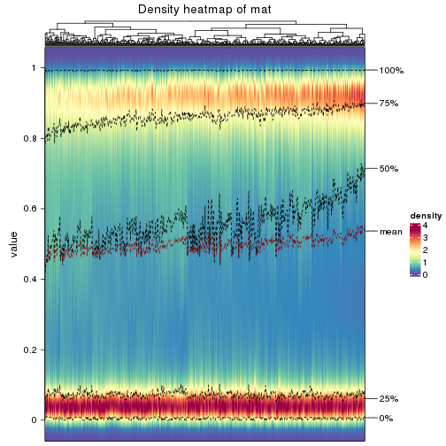


Some values about the hierarchy:


```r
all_nodes(res_rh)
```

```
#>  [1] "0"     "01"    "011"   "012"   "0121"  "0122"  "0123"  "013"   "02"    "021"   "0211"  "0212" 
#> [13] "02121" "02122" "02123" "0213"  "022"   "0221"  "02211" "02212" "02213" "02214" "0222"  "0223" 
#> [25] "023"   "0231"  "02311" "02312" "02313" "0232"  "0233"  "024"   "0241"  "0242"  "03"    "031"  
#> [37] "032"   "033"   "034"   "04"    "041"   "0411"  "0412"  "0413"  "042"   "0421"  "0422"  "0423" 
#> [49] "043"   "0431"  "0432"  "0433"  "044"   "0441"  "0442"  "0443"  "05"    "051"   "0511"  "0512" 
#> [61] "05121" "05122" "05123" "0513"  "052"   "0521"  "0522"  "0523"  "053"
```

```r
all_leaves(res_rh)
```

```
#>  [1] "011"   "0121"  "0122"  "0123"  "013"   "0211"  "02121" "02122" "02123" "0213"  "02211" "02212"
#> [13] "02213" "02214" "0222"  "0223"  "02311" "02312" "02313" "0232"  "0233"  "0241"  "0242"  "031"  
#> [25] "032"   "033"   "034"   "0411"  "0412"  "0413"  "0421"  "0422"  "0423"  "0431"  "0432"  "0433" 
#> [37] "0441"  "0442"  "0443"  "0511"  "05121" "05122" "05123" "0513"  "0521"  "0522"  "0523"  "053"
```

```r
node_info(res_rh)
```

```
#>       id best_method depth best_k n_columns n_signatures p_signatures is_leaf
#> 1      0 ATC:skmeans     1      5       549        33866     9.00e-02   FALSE
#> 2     01   SD:kmeans     2      3        64        14470     3.85e-02   FALSE
#> 3    011 ATC:skmeans     3      3        46          317     8.43e-04    TRUE
#> 4    012  ATC:kmeans     3      3        13         1258     3.34e-03   FALSE
#> 5   0121 not applied     4     NA         6           NA           NA    TRUE
#> 6   0122 not applied     4     NA         4           NA           NA    TRUE
#> 7   0123 not applied     4     NA         3           NA           NA    TRUE
#> 8    013 not applied     3     NA         5           NA           NA    TRUE
#> 9     02  ATC:kmeans     2      4       193        15528     4.13e-02   FALSE
#> 10   021   SD:kmeans     3      3        78         5112     1.36e-02   FALSE
#> 11  0211 ATC:skmeans     4      3        26          730     1.94e-03    TRUE
#> 12  0212  ATC:kmeans     4      3        33         1794     4.77e-03   FALSE
#> 13 02121  ATC:kmeans     5      2        15           31     8.24e-05    TRUE
#> 14 02122 not applied     5     NA         8           NA           NA    TRUE
#> 15 02123 not applied     5     NA        10           NA           NA    TRUE
#> 16  0213 ATC:skmeans     4      2        19          925     2.46e-03    TRUE
#> 17   022  ATC:kmeans     3      3        43         6017     1.60e-02   FALSE
#> 18  0221 ATC:skmeans     4      4        21         1762     4.68e-03   FALSE
#> 19 02211 not applied     5     NA         3           NA           NA    TRUE
#> 20 02212 ATC:skmeans     5      2        12          498     1.32e-03    TRUE
#> 21 02213 not applied     5     NA         4           NA           NA    TRUE
#> 22 02214 not applied     5     NA         2           NA           NA    TRUE
#> 23  0222 not applied     4     NA         9           NA           NA    TRUE
#> 24  0223 ATC:skmeans     4      2        13          683     1.82e-03    TRUE
#> 25   023  ATC:kmeans     3      3        42         6587     1.75e-02   FALSE
#> 26  0231 ATC:skmeans     4      3        18         1360     3.61e-03   FALSE
#> 27 02311 not applied     5     NA         6           NA           NA    TRUE
#> 28 02312 not applied     5     NA        10           NA           NA    TRUE
#> 29 02313 not applied     5     NA         2           NA           NA    TRUE
#> 30  0232  ATC:kmeans     4      4        14          826     2.20e-03    TRUE
#> 31  0233 not applied     4     NA        10           NA           NA    TRUE
#> 32   024  ATC:kmeans     3      2        30         3076     8.18e-03   FALSE
#> 33  0241 not applied     4     NA        10           NA           NA    TRUE
#> 34  0242 ATC:skmeans     4      4        20          290     7.71e-04    TRUE
#> 35    03 ATC:skmeans     2      4        50         2573     6.84e-03   FALSE
#> 36   031 not applied     3     NA         9           NA           NA    TRUE
#> 37   032 ATC:skmeans     3      2        19          267     7.10e-04    TRUE
#> 38   033   SD:kmeans     3      2        15          128     3.40e-04    TRUE
#> 39   034 not applied     3     NA         7           NA           NA    TRUE
#> 40    04  ATC:kmeans     2      4       155        11436     3.04e-02   FALSE
#> 41   041  ATC:kmeans     3      3        58         4238     1.13e-02   FALSE
#> 42  0411 not applied     4     NA        11           NA           NA    TRUE
#> 43  0412  ATC:kmeans     4      2        26          963     2.56e-03    TRUE
#> 44  0413  ATC:kmeans     4      3        21          466     1.24e-03    TRUE
#> 45   042  ATC:kmeans     3      3        26         5268     1.40e-02   FALSE
#> 46  0421 not applied     4     NA         6           NA           NA    TRUE
#> 47  0422 not applied     4     NA        11           NA           NA    TRUE
#> 48  0423 not applied     4     NA         9           NA           NA    TRUE
#> 49   043 ATC:skmeans     3      3        41         4059     1.08e-02   FALSE
#> 50  0431  SD:skmeans     4      2        16          140     3.72e-04    TRUE
#> 51  0432   SD:kmeans     4      2        16          231     6.14e-04    TRUE
#> 52  0433 not applied     4     NA         9           NA           NA    TRUE
#> 53   044  ATC:kmeans     3      3        30         5287     1.41e-02   FALSE
#> 54  0441 not applied     4     NA         6           NA           NA    TRUE
#> 55  0442  ATC:kmeans     4      2        14           15     3.99e-05    TRUE
#> 56  0443 not applied     4     NA        10           NA           NA    TRUE
#> 57    05  ATC:kmeans     2      3        87         2221     5.90e-03   FALSE
#> 58   051 ATC:skmeans     3      3        42         3054     8.12e-03   FALSE
#> 59  0511  ATC:kmeans     4      2        24            2     5.32e-06    TRUE
#> 60  0512  ATC:kmeans     4      3        14         3130     8.32e-03   FALSE
#> 61 05121 not applied     5     NA         9           NA           NA    TRUE
#> 62 05122 not applied     5     NA         3           NA           NA    TRUE
#> 63 05123 not applied     5     NA         2           NA           NA    TRUE
#> 64  0513 not applied     4     NA         4           NA           NA    TRUE
#> 65   052 ATC:skmeans     3      3        20         3130     8.32e-03   FALSE
#> 66  0521 ATC:skmeans     4      2        13            3     7.97e-06    TRUE
#> 67  0522 not applied     4     NA         4           NA           NA    TRUE
#> 68  0523 not applied     4     NA         3           NA           NA    TRUE
#> 69   053  ATC:kmeans     3      3        25          698     1.86e-03    TRUE
```

In the output from `node_info()`, there are the following columns:

- `id`: The node id.
- `best_method`: The best method selected.
- `depth`: Depth of the node in the hierarchy.
- `best_k`: Best number of groups of the partition on that node.
- `n_columns`: Number of columns in the submatrix.
- `n_signatures`: Number of signatures with the `best_k`.
- `p_signatures`: Proportion of hte signatures in total number of rows in the matrix.
- `is_leaf`: Whether the node is a leaf.

Labels of nodes are encoded in a special way. The number of digits
correspond to the depth of the node in the hierarchy and the value of the
digits correspond to the index of the subgroup in the current node, E.g. a label
of “012” means the node is the second subgroup of the partition which is the
first subgroup of the root node.

### Suggest the best k


Following table shows the best `k` (number of partitions) for each node in the
partition hierarchy. Clicking on the node name in the table goes to the
corresponding section for the partitioning on that node.

[The cola vignette](https://jokergoo.github.io/cola_vignettes/cola.html#toc_13)
explains the definition of the metrics used for determining the best
number of partitions.


```r
suggest_best_k(res_rh)
```


|Node                  |Best method                                         |Is leaf   |Best k |1-PAC |Mean silhouette |Concordance | #samples|   |
|:---------------------|:---------------------------------------------------|:---------|:------|:-----|:---------------|:-----------|--------:|:--|
|[Node0](#Node0)       |ATC:skmeans                                         |          |5      |1.00  |0.96            |0.98        |      549|** |
|[Node01](#Node01)     |SD:kmeans                                           |          |3      |0.74  |0.96            |0.97        |       64|   |
|Node011-leaf          |ATC:skmeans                                         |✓ (&#99;) |8      |0.91  |0.84            |0.91        |       46|*  |
|[Node012](#Node012)   |ATC:kmeans                                          |          |3      |1.00  |1.00            |1.00        |       13|** |
|Node0121-leaf         |<span style='color:grey;'><i>not applied</i></span> |✓ (b)     |       |      |                |            |        6|   |
|Node0122-leaf         |<span style='color:grey;'><i>not applied</i></span> |✓ (b)     |       |      |                |            |        4|   |
|Node0123-leaf         |<span style='color:grey;'><i>not applied</i></span> |✓ (b)     |       |      |                |            |        3|   |
|Node013-leaf          |<span style='color:grey;'><i>not applied</i></span> |✓ (b)     |       |      |                |            |        5|   |
|[Node02](#Node02)     |ATC:kmeans                                          |          |4      |1.00  |0.99            |1.00        |      193|** |
|[Node021](#Node021)   |SD:kmeans                                           |          |3      |0.97  |0.97            |0.97        |       78|** |
|Node0211-leaf         |ATC:skmeans                                         |✓ (&#99;) |3      |1.00  |1.00            |1.00        |       26|** |
|[Node0212](#Node0212) |ATC:kmeans                                          |          |3      |1.00  |0.99            |0.99        |       33|** |
|Node02121-leaf        |ATC:kmeans                                          |✓ (&#99;) |2      |1.00  |1.00            |1.00        |       15|** |
|Node02122-leaf        |<span style='color:grey;'><i>not applied</i></span> |✓ (b)     |       |      |                |            |        8|   |
|Node02123-leaf        |<span style='color:grey;'><i>not applied</i></span> |✓ (b)     |       |      |                |            |       10|   |
|Node0213-leaf         |ATC:skmeans                                         |✓ (&#99;) |4      |0.46  |0.84            |0.92        |       19|   |
|[Node022](#Node022)   |ATC:kmeans                                          |          |3      |0.96  |0.96            |0.98        |       43|** |
|[Node0221](#Node0221) |ATC:skmeans                                         |          |3      |1.00  |1.00            |1.00        |       21|** |
|Node02211-leaf        |<span style='color:grey;'><i>not applied</i></span> |✓ (b)     |       |      |                |            |        3|   |
|Node02212-leaf        |ATC:skmeans                                         |✓ (&#99;) |2      |1.00  |1.00            |1.00        |       12|** |
|Node02213-leaf        |<span style='color:grey;'><i>not applied</i></span> |✓ (b)     |       |      |                |            |        4|   |
|Node02214-leaf        |<span style='color:grey;'><i>not applied</i></span> |✓ (b)     |       |      |                |            |        2|   |
|Node0222-leaf         |<span style='color:grey;'><i>not applied</i></span> |✓ (b)     |       |      |                |            |        9|   |
|Node0223-leaf         |ATC:skmeans                                         |✓ (&#99;) |3      |1.00  |1.00            |1.00        |       13|** |
|[Node023](#Node023)   |ATC:kmeans                                          |          |3      |1.00  |0.97            |0.99        |       42|** |
|[Node0231](#Node0231) |ATC:skmeans                                         |          |6      |0.92  |0.60            |0.90        |       18|*  |
|Node02311-leaf        |<span style='color:grey;'><i>not applied</i></span> |✓ (b)     |       |      |                |            |        6|   |
|Node02312-leaf        |<span style='color:grey;'><i>not applied</i></span> |✓ (b)     |       |      |                |            |       10|   |
|Node02313-leaf        |<span style='color:grey;'><i>not applied</i></span> |✓ (b)     |       |      |                |            |        2|   |
|Node0232-leaf         |ATC:kmeans                                          |✓ (&#99;) |4      |0.93  |0.98            |0.99        |       14|*  |
|Node0233-leaf         |<span style='color:grey;'><i>not applied</i></span> |✓ (b)     |       |      |                |            |       10|   |
|[Node024](#Node024)   |ATC:kmeans                                          |          |2      |1.00  |1.00            |1.00        |       30|** |
|Node0241-leaf         |<span style='color:grey;'><i>not applied</i></span> |✓ (b)     |       |      |                |            |       10|   |
|Node0242-leaf         |ATC:skmeans                                         |✓ (&#99;) |4      |0.95  |0.96            |0.98        |       20|*  |
|[Node03](#Node03)     |ATC:skmeans                                         |          |4      |1.00  |0.98            |0.99        |       50|** |
|Node031-leaf          |<span style='color:grey;'><i>not applied</i></span> |✓ (b)     |       |      |                |            |        9|   |
|Node032-leaf          |ATC:skmeans                                         |✓ (&#99;) |4      |1.00  |0.93            |0.99        |       19|** |
|Node033-leaf          |SD:kmeans                                           |✓ (&#99;) |2      |1.00  |0.99            |0.97        |       15|** |
|Node034-leaf          |<span style='color:grey;'><i>not applied</i></span> |✓ (b)     |       |      |                |            |        7|   |
|[Node04](#Node04)     |ATC:kmeans                                          |          |4      |1.00  |0.97            |0.99        |      155|** |
|[Node041](#Node041)   |ATC:kmeans                                          |          |3      |1.00  |1.00            |1.00        |       58|** |
|Node0411-leaf         |<span style='color:grey;'><i>not applied</i></span> |✓ (b)     |       |      |                |            |       11|   |
|Node0412-leaf         |ATC:kmeans                                          |✓ (&#99;) |2      |1.00  |1.00            |1.00        |       26|** |
|Node0413-leaf         |ATC:kmeans                                          |✓ (&#99;) |3      |1.00  |1.00            |1.00        |       21|** |
|[Node042](#Node042)   |ATC:kmeans                                          |          |3      |1.00  |1.00            |1.00        |       26|** |
|Node0421-leaf         |<span style='color:grey;'><i>not applied</i></span> |✓ (b)     |       |      |                |            |        6|   |
|Node0422-leaf         |<span style='color:grey;'><i>not applied</i></span> |✓ (b)     |       |      |                |            |       11|   |
|Node0423-leaf         |<span style='color:grey;'><i>not applied</i></span> |✓ (b)     |       |      |                |            |        9|   |
|[Node043](#Node043)   |ATC:skmeans                                         |          |3      |1.00  |0.96            |0.99        |       41|** |
|Node0431-leaf         |SD:skmeans                                          |✓ (&#99;) |2      |0.88  |0.97            |0.99        |       16|   |
|Node0432-leaf         |SD:kmeans                                           |✓ (&#99;) |2      |1.00  |1.00            |1.00        |       16|** |
|Node0433-leaf         |<span style='color:grey;'><i>not applied</i></span> |✓ (b)     |       |      |                |            |        9|   |
|[Node044](#Node044)   |ATC:kmeans                                          |          |3      |1.00  |1.00            |1.00        |       30|** |
|Node0441-leaf         |<span style='color:grey;'><i>not applied</i></span> |✓ (b)     |       |      |                |            |        6|   |
|Node0442-leaf         |ATC:kmeans                                          |✓ (&#99;) |2      |1.00  |0.99            |1.00        |       14|** |
|Node0443-leaf         |<span style='color:grey;'><i>not applied</i></span> |✓ (b)     |       |      |                |            |       10|   |
|[Node05](#Node05)     |ATC:kmeans                                          |          |4      |0.90  |0.88            |0.94        |       87|*  |
|[Node051](#Node051)   |ATC:skmeans                                         |          |3      |1.00  |0.98            |0.99        |       42|** |
|Node0511-leaf         |ATC:kmeans                                          |✓ (&#99;) |2      |0.48  |0.98            |0.94        |       24|   |
|[Node0512](#Node0512) |ATC:kmeans                                          |          |5      |1.00  |0.92            |0.98        |       14|** |
|Node05121-leaf        |<span style='color:grey;'><i>not applied</i></span> |✓ (b)     |       |      |                |            |        9|   |
|Node05122-leaf        |<span style='color:grey;'><i>not applied</i></span> |✓ (b)     |       |      |                |            |        3|   |
|Node05123-leaf        |<span style='color:grey;'><i>not applied</i></span> |✓ (b)     |       |      |                |            |        2|   |
|Node0513-leaf         |<span style='color:grey;'><i>not applied</i></span> |✓ (b)     |       |      |                |            |        4|   |
|[Node052](#Node052)   |ATC:skmeans                                         |          |2      |1.00  |1.00            |1.00        |       20|** |
|Node0521-leaf         |ATC:skmeans                                         |✓ (&#99;) |8      |0.95  |0.50            |0.97        |       13|*  |
|Node0522-leaf         |<span style='color:grey;'><i>not applied</i></span> |✓ (b)     |       |      |                |            |        4|   |
|Node0523-leaf         |<span style='color:grey;'><i>not applied</i></span> |✓ (b)     |       |      |                |            |        3|   |
|Node053-leaf          |ATC:kmeans                                          |✓ (&#99;) |3      |1.00  |1.00            |1.00        |       25|** |


Stop reason: b) Subgroup had too few columns. c) There were too few signatures. 

\*\*: 1-PAC > 0.95, \*: 1-PAC > 0.9


### Partition hierarchy

The nodes of the hierarchy can be merged by setting the `merge_node` parameters. Here we 
control the hierarchy with the `min_n_signatures` parameter. The value of `min_n_signatures` is
from `node_info()`.


<style type='text/css'>


.ui-helper-hidden {
	display: none;
}
.ui-helper-hidden-accessible {
	border: 0;
	clip: rect(0 0 0 0);
	height: 1px;
	margin: -1px;
	overflow: hidden;
	padding: 0;
	position: absolute;
	width: 1px;
}
.ui-helper-reset {
	margin: 0;
	padding: 0;
	border: 0;
	outline: 0;
	line-height: 1.3;
	text-decoration: none;
	font-size: 100%;
	list-style: none;
}
.ui-helper-clearfix:before,
.ui-helper-clearfix:after {
	content: "";
	display: table;
	border-collapse: collapse;
}
.ui-helper-clearfix:after {
	clear: both;
}
.ui-helper-zfix {
	width: 100%;
	height: 100%;
	top: 0;
	left: 0;
	position: absolute;
	opacity: 0;
	filter:Alpha(Opacity=0); 
}

.ui-front {
	z-index: 100;
}


.ui-state-disabled {
	cursor: default !important;
	pointer-events: none;
}


.ui-icon {
	display: inline-block;
	vertical-align: middle;
	margin-top: -.25em;
	position: relative;
	text-indent: -99999px;
	overflow: hidden;
	background-repeat: no-repeat;
}

.ui-widget-icon-block {
	left: 50%;
	margin-left: -8px;
	display: block;
}


.ui-widget-overlay {
	position: fixed;
	top: 0;
	left: 0;
	width: 100%;
	height: 100%;
}
.ui-accordion .ui-accordion-header {
	display: block;
	cursor: pointer;
	position: relative;
	margin: 2px 0 0 0;
	padding: .5em .5em .5em .7em;
	font-size: 100%;
}
.ui-accordion .ui-accordion-content {
	padding: 1em 2.2em;
	border-top: 0;
	overflow: auto;
}
.ui-autocomplete {
	position: absolute;
	top: 0;
	left: 0;
	cursor: default;
}
.ui-menu {
	list-style: none;
	padding: 0;
	margin: 0;
	display: block;
	outline: 0;
}
.ui-menu .ui-menu {
	position: absolute;
}
.ui-menu .ui-menu-item {
	margin: 0;
	cursor: pointer;
	
	list-style-image: url("data:image/gif;base64,R0lGODlhAQABAIAAAAAAAP///yH5BAEAAAAALAAAAAABAAEAAAIBRAA7");
}
.ui-menu .ui-menu-item-wrapper {
	position: relative;
	padding: 3px 1em 3px .4em;
}
.ui-menu .ui-menu-divider {
	margin: 5px 0;
	height: 0;
	font-size: 0;
	line-height: 0;
	border-width: 1px 0 0 0;
}
.ui-menu .ui-state-focus,
.ui-menu .ui-state-active {
	margin: -1px;
}


.ui-menu-icons {
	position: relative;
}
.ui-menu-icons .ui-menu-item-wrapper {
	padding-left: 2em;
}


.ui-menu .ui-icon {
	position: absolute;
	top: 0;
	bottom: 0;
	left: .2em;
	margin: auto 0;
}


.ui-menu .ui-menu-icon {
	left: auto;
	right: 0;
}
.ui-button {
	padding: .4em 1em;
	display: inline-block;
	position: relative;
	line-height: normal;
	margin-right: .1em;
	cursor: pointer;
	vertical-align: middle;
	text-align: center;
	-webkit-user-select: none;
	-moz-user-select: none;
	-ms-user-select: none;
	user-select: none;

	
	overflow: visible;
}

.ui-button,
.ui-button:link,
.ui-button:visited,
.ui-button:hover,
.ui-button:active {
	text-decoration: none;
}


.ui-button-icon-only {
	width: 2em;
	box-sizing: border-box;
	text-indent: -9999px;
	white-space: nowrap;
}


input.ui-button.ui-button-icon-only {
	text-indent: 0;
}


.ui-button-icon-only .ui-icon {
	position: absolute;
	top: 50%;
	left: 50%;
	margin-top: -8px;
	margin-left: -8px;
}

.ui-button.ui-icon-notext .ui-icon {
	padding: 0;
	width: 2.1em;
	height: 2.1em;
	text-indent: -9999px;
	white-space: nowrap;

}

input.ui-button.ui-icon-notext .ui-icon {
	width: auto;
	height: auto;
	text-indent: 0;
	white-space: normal;
	padding: .4em 1em;
}


input.ui-button::-moz-focus-inner,
button.ui-button::-moz-focus-inner {
	border: 0;
	padding: 0;
}
.ui-controlgroup {
	vertical-align: middle;
	display: inline-block;
}
.ui-controlgroup > .ui-controlgroup-item {
	float: left;
	margin-left: 0;
	margin-right: 0;
}
.ui-controlgroup > .ui-controlgroup-item:focus,
.ui-controlgroup > .ui-controlgroup-item.ui-visual-focus {
	z-index: 9999;
}
.ui-controlgroup-vertical > .ui-controlgroup-item {
	display: block;
	float: none;
	width: 100%;
	margin-top: 0;
	margin-bottom: 0;
	text-align: left;
}
.ui-controlgroup-vertical .ui-controlgroup-item {
	box-sizing: border-box;
}
.ui-controlgroup .ui-controlgroup-label {
	padding: .4em 1em;
}
.ui-controlgroup .ui-controlgroup-label span {
	font-size: 80%;
}
.ui-controlgroup-horizontal .ui-controlgroup-label + .ui-controlgroup-item {
	border-left: none;
}
.ui-controlgroup-vertical .ui-controlgroup-label + .ui-controlgroup-item {
	border-top: none;
}
.ui-controlgroup-horizontal .ui-controlgroup-label.ui-widget-content {
	border-right: none;
}
.ui-controlgroup-vertical .ui-controlgroup-label.ui-widget-content {
	border-bottom: none;
}


.ui-controlgroup-vertical .ui-spinner-input {

	
	width: 75%;
	width: calc( 100% - 2.4em );
}
.ui-controlgroup-vertical .ui-spinner .ui-spinner-up {
	border-top-style: solid;
}

.ui-checkboxradio-label .ui-icon-background {
	box-shadow: inset 1px 1px 1px #ccc;
	border-radius: .12em;
	border: none;
}
.ui-checkboxradio-radio-label .ui-icon-background {
	width: 16px;
	height: 16px;
	border-radius: 1em;
	overflow: visible;
	border: none;
}
.ui-checkboxradio-radio-label.ui-checkboxradio-checked .ui-icon,
.ui-checkboxradio-radio-label.ui-checkboxradio-checked:hover .ui-icon {
	background-image: none;
	width: 8px;
	height: 8px;
	border-width: 4px;
	border-style: solid;
}
.ui-checkboxradio-disabled {
	pointer-events: none;
}
.ui-datepicker {
	width: 17em;
	padding: .2em .2em 0;
	display: none;
}
.ui-datepicker .ui-datepicker-header {
	position: relative;
	padding: .2em 0;
}
.ui-datepicker .ui-datepicker-prev,
.ui-datepicker .ui-datepicker-next {
	position: absolute;
	top: 2px;
	width: 1.8em;
	height: 1.8em;
}
.ui-datepicker .ui-datepicker-prev-hover,
.ui-datepicker .ui-datepicker-next-hover {
	top: 1px;
}
.ui-datepicker .ui-datepicker-prev {
	left: 2px;
}
.ui-datepicker .ui-datepicker-next {
	right: 2px;
}
.ui-datepicker .ui-datepicker-prev-hover {
	left: 1px;
}
.ui-datepicker .ui-datepicker-next-hover {
	right: 1px;
}
.ui-datepicker .ui-datepicker-prev span,
.ui-datepicker .ui-datepicker-next span {
	display: block;
	position: absolute;
	left: 50%;
	margin-left: -8px;
	top: 50%;
	margin-top: -8px;
}
.ui-datepicker .ui-datepicker-title {
	margin: 0 2.3em;
	line-height: 1.8em;
	text-align: center;
}
.ui-datepicker .ui-datepicker-title select {
	font-size: 1em;
	margin: 1px 0;
}
.ui-datepicker select.ui-datepicker-month,
.ui-datepicker select.ui-datepicker-year {
	width: 45%;
}
.ui-datepicker table {
	width: 100%;
	font-size: .9em;
	border-collapse: collapse;
	margin: 0 0 .4em;
}
.ui-datepicker th {
	padding: .7em .3em;
	text-align: center;
	font-weight: bold;
	border: 0;
}
.ui-datepicker td {
	border: 0;
	padding: 1px;
}
.ui-datepicker td span,
.ui-datepicker td a {
	display: block;
	padding: .2em;
	text-align: right;
	text-decoration: none;
}
.ui-datepicker .ui-datepicker-buttonpane {
	background-image: none;
	margin: .7em 0 0 0;
	padding: 0 .2em;
	border-left: 0;
	border-right: 0;
	border-bottom: 0;
}
.ui-datepicker .ui-datepicker-buttonpane button {
	float: right;
	margin: .5em .2em .4em;
	cursor: pointer;
	padding: .2em .6em .3em .6em;
	width: auto;
	overflow: visible;
}
.ui-datepicker .ui-datepicker-buttonpane button.ui-datepicker-current {
	float: left;
}


.ui-datepicker.ui-datepicker-multi {
	width: auto;
}
.ui-datepicker-multi .ui-datepicker-group {
	float: left;
}
.ui-datepicker-multi .ui-datepicker-group table {
	width: 95%;
	margin: 0 auto .4em;
}
.ui-datepicker-multi-2 .ui-datepicker-group {
	width: 50%;
}
.ui-datepicker-multi-3 .ui-datepicker-group {
	width: 33.3%;
}
.ui-datepicker-multi-4 .ui-datepicker-group {
	width: 25%;
}
.ui-datepicker-multi .ui-datepicker-group-last .ui-datepicker-header,
.ui-datepicker-multi .ui-datepicker-group-middle .ui-datepicker-header {
	border-left-width: 0;
}
.ui-datepicker-multi .ui-datepicker-buttonpane {
	clear: left;
}
.ui-datepicker-row-break {
	clear: both;
	width: 100%;
	font-size: 0;
}


.ui-datepicker-rtl {
	direction: rtl;
}
.ui-datepicker-rtl .ui-datepicker-prev {
	right: 2px;
	left: auto;
}
.ui-datepicker-rtl .ui-datepicker-next {
	left: 2px;
	right: auto;
}
.ui-datepicker-rtl .ui-datepicker-prev:hover {
	right: 1px;
	left: auto;
}
.ui-datepicker-rtl .ui-datepicker-next:hover {
	left: 1px;
	right: auto;
}
.ui-datepicker-rtl .ui-datepicker-buttonpane {
	clear: right;
}
.ui-datepicker-rtl .ui-datepicker-buttonpane button {
	float: left;
}
.ui-datepicker-rtl .ui-datepicker-buttonpane button.ui-datepicker-current,
.ui-datepicker-rtl .ui-datepicker-group {
	float: right;
}
.ui-datepicker-rtl .ui-datepicker-group-last .ui-datepicker-header,
.ui-datepicker-rtl .ui-datepicker-group-middle .ui-datepicker-header {
	border-right-width: 0;
	border-left-width: 1px;
}


.ui-datepicker .ui-icon {
	display: block;
	text-indent: -99999px;
	overflow: hidden;
	background-repeat: no-repeat;
	left: .5em;
	top: .3em;
}
.ui-dialog {
	position: absolute;
	top: 0;
	left: 0;
	padding: .2em;
	outline: 0;
}
.ui-dialog .ui-dialog-titlebar {
	padding: .4em 1em;
	position: relative;
}
.ui-dialog .ui-dialog-title {
	float: left;
	margin: .1em 0;
	white-space: nowrap;
	width: 90%;
	overflow: hidden;
	text-overflow: ellipsis;
}
.ui-dialog .ui-dialog-titlebar-close {
	position: absolute;
	right: .3em;
	top: 50%;
	width: 20px;
	margin: -10px 0 0 0;
	padding: 1px;
	height: 20px;
}
.ui-dialog .ui-dialog-content {
	position: relative;
	border: 0;
	padding: .5em 1em;
	background: none;
	overflow: auto;
}
.ui-dialog .ui-dialog-buttonpane {
	text-align: left;
	border-width: 1px 0 0 0;
	background-image: none;
	margin-top: .5em;
	padding: .3em 1em .5em .4em;
}
.ui-dialog .ui-dialog-buttonpane .ui-dialog-buttonset {
	float: right;
}
.ui-dialog .ui-dialog-buttonpane button {
	margin: .5em .4em .5em 0;
	cursor: pointer;
}
.ui-dialog .ui-resizable-n {
	height: 2px;
	top: 0;
}
.ui-dialog .ui-resizable-e {
	width: 2px;
	right: 0;
}
.ui-dialog .ui-resizable-s {
	height: 2px;
	bottom: 0;
}
.ui-dialog .ui-resizable-w {
	width: 2px;
	left: 0;
}
.ui-dialog .ui-resizable-se,
.ui-dialog .ui-resizable-sw,
.ui-dialog .ui-resizable-ne,
.ui-dialog .ui-resizable-nw {
	width: 7px;
	height: 7px;
}
.ui-dialog .ui-resizable-se {
	right: 0;
	bottom: 0;
}
.ui-dialog .ui-resizable-sw {
	left: 0;
	bottom: 0;
}
.ui-dialog .ui-resizable-ne {
	right: 0;
	top: 0;
}
.ui-dialog .ui-resizable-nw {
	left: 0;
	top: 0;
}
.ui-draggable .ui-dialog-titlebar {
	cursor: move;
}
.ui-draggable-handle {
	-ms-touch-action: none;
	touch-action: none;
}
.ui-resizable {
	position: relative;
}
.ui-resizable-handle {
	position: absolute;
	font-size: 0.1px;
	display: block;
	-ms-touch-action: none;
	touch-action: none;
}
.ui-resizable-disabled .ui-resizable-handle,
.ui-resizable-autohide .ui-resizable-handle {
	display: none;
}
.ui-resizable-n {
	cursor: n-resize;
	height: 7px;
	width: 100%;
	top: -5px;
	left: 0;
}
.ui-resizable-s {
	cursor: s-resize;
	height: 7px;
	width: 100%;
	bottom: -5px;
	left: 0;
}
.ui-resizable-e {
	cursor: e-resize;
	width: 7px;
	right: -5px;
	top: 0;
	height: 100%;
}
.ui-resizable-w {
	cursor: w-resize;
	width: 7px;
	left: -5px;
	top: 0;
	height: 100%;
}
.ui-resizable-se {
	cursor: se-resize;
	width: 12px;
	height: 12px;
	right: 1px;
	bottom: 1px;
}
.ui-resizable-sw {
	cursor: sw-resize;
	width: 9px;
	height: 9px;
	left: -5px;
	bottom: -5px;
}
.ui-resizable-nw {
	cursor: nw-resize;
	width: 9px;
	height: 9px;
	left: -5px;
	top: -5px;
}
.ui-resizable-ne {
	cursor: ne-resize;
	width: 9px;
	height: 9px;
	right: -5px;
	top: -5px;
}
.ui-progressbar {
	height: 2em;
	text-align: left;
	overflow: hidden;
}
.ui-progressbar .ui-progressbar-value {
	margin: -1px;
	height: 100%;
}
.ui-progressbar .ui-progressbar-overlay {
	background: url("");
	height: 100%;
	filter: alpha(opacity=25); 
	opacity: 0.25;
}
.ui-progressbar-indeterminate .ui-progressbar-value {
	background-image: none;
}
.ui-selectable {
	-ms-touch-action: none;
	touch-action: none;
}
.ui-selectable-helper {
	position: absolute;
	z-index: 100;
	border: 1px dotted black;
}
.ui-selectmenu-menu {
	padding: 0;
	margin: 0;
	position: absolute;
	top: 0;
	left: 0;
	display: none;
}
.ui-selectmenu-menu .ui-menu {
	overflow: auto;
	overflow-x: hidden;
	padding-bottom: 1px;
}
.ui-selectmenu-menu .ui-menu .ui-selectmenu-optgroup {
	font-size: 1em;
	font-weight: bold;
	line-height: 1.5;
	padding: 2px 0.4em;
	margin: 0.5em 0 0 0;
	height: auto;
	border: 0;
}
.ui-selectmenu-open {
	display: block;
}
.ui-selectmenu-text {
	display: block;
	margin-right: 20px;
	overflow: hidden;
	text-overflow: ellipsis;
}
.ui-selectmenu-button.ui-button {
	text-align: left;
	white-space: nowrap;
	width: 14em;
}
.ui-selectmenu-icon.ui-icon {
	float: right;
	margin-top: 0;
}
.ui-slider {
	position: relative;
	text-align: left;
}
.ui-slider .ui-slider-handle {
	position: absolute;
	z-index: 2;
	width: 1.2em;
	height: 1.2em;
	cursor: default;
	-ms-touch-action: none;
	touch-action: none;
}
.ui-slider .ui-slider-range {
	position: absolute;
	z-index: 1;
	font-size: .7em;
	display: block;
	border: 0;
	background-position: 0 0;
}


.ui-slider.ui-state-disabled .ui-slider-handle,
.ui-slider.ui-state-disabled .ui-slider-range {
	filter: inherit;
}

.ui-slider-horizontal {
	height: .8em;
}
.ui-slider-horizontal .ui-slider-handle {
	top: -.3em;
	margin-left: -.6em;
}
.ui-slider-horizontal .ui-slider-range {
	top: 0;
	height: 100%;
}
.ui-slider-horizontal .ui-slider-range-min {
	left: 0;
}
.ui-slider-horizontal .ui-slider-range-max {
	right: 0;
}

.ui-slider-vertical {
	width: .8em;
	height: 100px;
}
.ui-slider-vertical .ui-slider-handle {
	left: -.3em;
	margin-left: 0;
	margin-bottom: -.6em;
}
.ui-slider-vertical .ui-slider-range {
	left: 0;
	width: 100%;
}
.ui-slider-vertical .ui-slider-range-min {
	bottom: 0;
}
.ui-slider-vertical .ui-slider-range-max {
	top: 0;
}
.ui-sortable-handle {
	-ms-touch-action: none;
	touch-action: none;
}
.ui-spinner {
	position: relative;
	display: inline-block;
	overflow: hidden;
	padding: 0;
	vertical-align: middle;
}
.ui-spinner-input {
	border: none;
	background: none;
	color: inherit;
	padding: .222em 0;
	margin: .2em 0;
	vertical-align: middle;
	margin-left: .4em;
	margin-right: 2em;
}
.ui-spinner-button {
	width: 1.6em;
	height: 50%;
	font-size: .5em;
	padding: 0;
	margin: 0;
	text-align: center;
	position: absolute;
	cursor: default;
	display: block;
	overflow: hidden;
	right: 0;
}

.ui-spinner a.ui-spinner-button {
	border-top-style: none;
	border-bottom-style: none;
	border-right-style: none;
}
.ui-spinner-up {
	top: 0;
}
.ui-spinner-down {
	bottom: 0;
}
.ui-tabs {
	position: relative;
	padding: .2em;
}
.ui-tabs .ui-tabs-nav {
	margin: 0;
	padding: .2em .2em 0;
}
.ui-tabs .ui-tabs-nav li {
	list-style: none;
	float: left;
	position: relative;
	top: 0;
	margin: 1px .2em 0 0;
	border-bottom-width: 0;
	padding: 0;
	white-space: nowrap;
}
.ui-tabs .ui-tabs-nav .ui-tabs-anchor {
	float: left;
	padding: .5em 1em;
	text-decoration: none;
}
.ui-tabs .ui-tabs-nav li.ui-tabs-active {
	margin-bottom: -1px;
	padding-bottom: 1px;
}
.ui-tabs .ui-tabs-nav li.ui-tabs-active .ui-tabs-anchor,
.ui-tabs .ui-tabs-nav li.ui-state-disabled .ui-tabs-anchor,
.ui-tabs .ui-tabs-nav li.ui-tabs-loading .ui-tabs-anchor {
	cursor: text;
}
.ui-tabs-collapsible .ui-tabs-nav li.ui-tabs-active .ui-tabs-anchor {
	cursor: pointer;
}
.ui-tabs .ui-tabs-panel {
	display: block;
	border-width: 0;
	padding: 1em 1.4em;
	background: none;
}
.ui-tooltip {
	padding: 8px;
	position: absolute;
	z-index: 9999;
	max-width: 300px;
}
body .ui-tooltip {
	border-width: 2px;
}

.ui-widget {
	font-family: Arial,Helvetica,sans-serif;
	font-size: 1em;
}
.ui-widget .ui-widget {
	font-size: 1em;
}
.ui-widget input,
.ui-widget select,
.ui-widget textarea,
.ui-widget button {
	font-family: Arial,Helvetica,sans-serif;
	font-size: 1em;
}
.ui-widget.ui-widget-content {
	border: 1px solid #c5c5c5;
}
.ui-widget-content {
	border: 1px solid #dddddd;
	background: #ffffff;
	color: #333333;
}
.ui-widget-content a {
	color: #333333;
}
.ui-widget-header {
	border: 1px solid #dddddd;
	background: #e9e9e9;
	color: #333333;
	font-weight: bold;
}
.ui-widget-header a {
	color: #333333;
}


.ui-state-default,
.ui-widget-content .ui-state-default,
.ui-widget-header .ui-state-default,
.ui-button,


html .ui-button.ui-state-disabled:hover,
html .ui-button.ui-state-disabled:active {
	border: 1px solid #c5c5c5;
	background: #f6f6f6;
	font-weight: normal;
	color: #454545;
}
.ui-state-default a,
.ui-state-default a:link,
.ui-state-default a:visited,
a.ui-button,
a:link.ui-button,
a:visited.ui-button,
.ui-button {
	color: #454545;
	text-decoration: none;
}
.ui-state-hover,
.ui-widget-content .ui-state-hover,
.ui-widget-header .ui-state-hover,
.ui-state-focus,
.ui-widget-content .ui-state-focus,
.ui-widget-header .ui-state-focus,
.ui-button:hover,
.ui-button:focus {
	border: 1px solid #cccccc;
	background: #ededed;
	font-weight: normal;
	color: #2b2b2b;
}
.ui-state-hover a,
.ui-state-hover a:hover,
.ui-state-hover a:link,
.ui-state-hover a:visited,
.ui-state-focus a,
.ui-state-focus a:hover,
.ui-state-focus a:link,
.ui-state-focus a:visited,
a.ui-button:hover,
a.ui-button:focus {
	color: #2b2b2b;
	text-decoration: none;
}

.ui-visual-focus {
	box-shadow: 0 0 3px 1px rgb(94, 158, 214);
}
.ui-state-active,
.ui-widget-content .ui-state-active,
.ui-widget-header .ui-state-active,
a.ui-button:active,
.ui-button:active,
.ui-button.ui-state-active:hover {
	border: 1px solid #003eff;
	background: #007fff;
	font-weight: normal;
	color: #ffffff;
}
.ui-icon-background,
.ui-state-active .ui-icon-background {
	border: #003eff;
	background-color: #ffffff;
}
.ui-state-active a,
.ui-state-active a:link,
.ui-state-active a:visited {
	color: #ffffff;
	text-decoration: none;
}


.ui-state-highlight,
.ui-widget-content .ui-state-highlight,
.ui-widget-header .ui-state-highlight {
	border: 1px solid #dad55e;
	background: #fffa90;
	color: #777620;
}
.ui-state-checked {
	border: 1px solid #dad55e;
	background: #fffa90;
}
.ui-state-highlight a,
.ui-widget-content .ui-state-highlight a,
.ui-widget-header .ui-state-highlight a {
	color: #777620;
}
.ui-state-error,
.ui-widget-content .ui-state-error,
.ui-widget-header .ui-state-error {
	border: 1px solid #f1a899;
	background: #fddfdf;
	color: #5f3f3f;
}
.ui-state-error a,
.ui-widget-content .ui-state-error a,
.ui-widget-header .ui-state-error a {
	color: #5f3f3f;
}
.ui-state-error-text,
.ui-widget-content .ui-state-error-text,
.ui-widget-header .ui-state-error-text {
	color: #5f3f3f;
}
.ui-priority-primary,
.ui-widget-content .ui-priority-primary,
.ui-widget-header .ui-priority-primary {
	font-weight: bold;
}
.ui-priority-secondary,
.ui-widget-content .ui-priority-secondary,
.ui-widget-header .ui-priority-secondary {
	opacity: .7;
	filter:Alpha(Opacity=70); 
	font-weight: normal;
}
.ui-state-disabled,
.ui-widget-content .ui-state-disabled,
.ui-widget-header .ui-state-disabled {
	opacity: .35;
	filter:Alpha(Opacity=35); 
	background-image: none;
}
.ui-state-disabled .ui-icon {
	filter:Alpha(Opacity=35); 
}


.ui-icon {
	width: 16px;
	height: 16px;
}
.ui-icon,
.ui-widget-content .ui-icon {
	background-image: url("images/ui-icons_444444_256x240.png");
}
.ui-widget-header .ui-icon {
	background-image: url("images/ui-icons_444444_256x240.png");
}
.ui-state-hover .ui-icon,
.ui-state-focus .ui-icon,
.ui-button:hover .ui-icon,
.ui-button:focus .ui-icon {
	background-image: url("images/ui-icons_555555_256x240.png");
}
.ui-state-active .ui-icon,
.ui-button:active .ui-icon {
	background-image: url("images/ui-icons_ffffff_256x240.png");
}
.ui-state-highlight .ui-icon,
.ui-button .ui-state-highlight.ui-icon {
	background-image: url("images/ui-icons_777620_256x240.png");
}
.ui-state-error .ui-icon,
.ui-state-error-text .ui-icon {
	background-image: url("images/ui-icons_cc0000_256x240.png");
}
.ui-button .ui-icon {
	background-image: url("images/ui-icons_777777_256x240.png");
}


.ui-icon-blank { background-position: 16px 16px; }
.ui-icon-caret-1-n { background-position: 0 0; }
.ui-icon-caret-1-ne { background-position: -16px 0; }
.ui-icon-caret-1-e { background-position: -32px 0; }
.ui-icon-caret-1-se { background-position: -48px 0; }
.ui-icon-caret-1-s { background-position: -65px 0; }
.ui-icon-caret-1-sw { background-position: -80px 0; }
.ui-icon-caret-1-w { background-position: -96px 0; }
.ui-icon-caret-1-nw { background-position: -112px 0; }
.ui-icon-caret-2-n-s { background-position: -128px 0; }
.ui-icon-caret-2-e-w { background-position: -144px 0; }
.ui-icon-triangle-1-n { background-position: 0 -16px; }
.ui-icon-triangle-1-ne { background-position: -16px -16px; }
.ui-icon-triangle-1-e { background-position: -32px -16px; }
.ui-icon-triangle-1-se { background-position: -48px -16px; }
.ui-icon-triangle-1-s { background-position: -65px -16px; }
.ui-icon-triangle-1-sw { background-position: -80px -16px; }
.ui-icon-triangle-1-w { background-position: -96px -16px; }
.ui-icon-triangle-1-nw { background-position: -112px -16px; }
.ui-icon-triangle-2-n-s { background-position: -128px -16px; }
.ui-icon-triangle-2-e-w { background-position: -144px -16px; }
.ui-icon-arrow-1-n { background-position: 0 -32px; }
.ui-icon-arrow-1-ne { background-position: -16px -32px; }
.ui-icon-arrow-1-e { background-position: -32px -32px; }
.ui-icon-arrow-1-se { background-position: -48px -32px; }
.ui-icon-arrow-1-s { background-position: -65px -32px; }
.ui-icon-arrow-1-sw { background-position: -80px -32px; }
.ui-icon-arrow-1-w { background-position: -96px -32px; }
.ui-icon-arrow-1-nw { background-position: -112px -32px; }
.ui-icon-arrow-2-n-s { background-position: -128px -32px; }
.ui-icon-arrow-2-ne-sw { background-position: -144px -32px; }
.ui-icon-arrow-2-e-w { background-position: -160px -32px; }
.ui-icon-arrow-2-se-nw { background-position: -176px -32px; }
.ui-icon-arrowstop-1-n { background-position: -192px -32px; }
.ui-icon-arrowstop-1-e { background-position: -208px -32px; }
.ui-icon-arrowstop-1-s { background-position: -224px -32px; }
.ui-icon-arrowstop-1-w { background-position: -240px -32px; }
.ui-icon-arrowthick-1-n { background-position: 1px -48px; }
.ui-icon-arrowthick-1-ne { background-position: -16px -48px; }
.ui-icon-arrowthick-1-e { background-position: -32px -48px; }
.ui-icon-arrowthick-1-se { background-position: -48px -48px; }
.ui-icon-arrowthick-1-s { background-position: -64px -48px; }
.ui-icon-arrowthick-1-sw { background-position: -80px -48px; }
.ui-icon-arrowthick-1-w { background-position: -96px -48px; }
.ui-icon-arrowthick-1-nw { background-position: -112px -48px; }
.ui-icon-arrowthick-2-n-s { background-position: -128px -48px; }
.ui-icon-arrowthick-2-ne-sw { background-position: -144px -48px; }
.ui-icon-arrowthick-2-e-w { background-position: -160px -48px; }
.ui-icon-arrowthick-2-se-nw { background-position: -176px -48px; }
.ui-icon-arrowthickstop-1-n { background-position: -192px -48px; }
.ui-icon-arrowthickstop-1-e { background-position: -208px -48px; }
.ui-icon-arrowthickstop-1-s { background-position: -224px -48px; }
.ui-icon-arrowthickstop-1-w { background-position: -240px -48px; }
.ui-icon-arrowreturnthick-1-w { background-position: 0 -64px; }
.ui-icon-arrowreturnthick-1-n { background-position: -16px -64px; }
.ui-icon-arrowreturnthick-1-e { background-position: -32px -64px; }
.ui-icon-arrowreturnthick-1-s { background-position: -48px -64px; }
.ui-icon-arrowreturn-1-w { background-position: -64px -64px; }
.ui-icon-arrowreturn-1-n { background-position: -80px -64px; }
.ui-icon-arrowreturn-1-e { background-position: -96px -64px; }
.ui-icon-arrowreturn-1-s { background-position: -112px -64px; }
.ui-icon-arrowrefresh-1-w { background-position: -128px -64px; }
.ui-icon-arrowrefresh-1-n { background-position: -144px -64px; }
.ui-icon-arrowrefresh-1-e { background-position: -160px -64px; }
.ui-icon-arrowrefresh-1-s { background-position: -176px -64px; }
.ui-icon-arrow-4 { background-position: 0 -80px; }
.ui-icon-arrow-4-diag { background-position: -16px -80px; }
.ui-icon-extlink { background-position: -32px -80px; }
.ui-icon-newwin { background-position: -48px -80px; }
.ui-icon-refresh { background-position: -64px -80px; }
.ui-icon-shuffle { background-position: -80px -80px; }
.ui-icon-transfer-e-w { background-position: -96px -80px; }
.ui-icon-transferthick-e-w { background-position: -112px -80px; }
.ui-icon-folder-collapsed { background-position: 0 -96px; }
.ui-icon-folder-open { background-position: -16px -96px; }
.ui-icon-document { background-position: -32px -96px; }
.ui-icon-document-b { background-position: -48px -96px; }
.ui-icon-note { background-position: -64px -96px; }
.ui-icon-mail-closed { background-position: -80px -96px; }
.ui-icon-mail-open { background-position: -96px -96px; }
.ui-icon-suitcase { background-position: -112px -96px; }
.ui-icon-comment { background-position: -128px -96px; }
.ui-icon-person { background-position: -144px -96px; }
.ui-icon-print { background-position: -160px -96px; }
.ui-icon-trash { background-position: -176px -96px; }
.ui-icon-locked { background-position: -192px -96px; }
.ui-icon-unlocked { background-position: -208px -96px; }
.ui-icon-bookmark { background-position: -224px -96px; }
.ui-icon-tag { background-position: -240px -96px; }
.ui-icon-home { background-position: 0 -112px; }
.ui-icon-flag { background-position: -16px -112px; }
.ui-icon-calendar { background-position: -32px -112px; }
.ui-icon-cart { background-position: -48px -112px; }
.ui-icon-pencil { background-position: -64px -112px; }
.ui-icon-clock { background-position: -80px -112px; }
.ui-icon-disk { background-position: -96px -112px; }
.ui-icon-calculator { background-position: -112px -112px; }
.ui-icon-zoomin { background-position: -128px -112px; }
.ui-icon-zoomout { background-position: -144px -112px; }
.ui-icon-search { background-position: -160px -112px; }
.ui-icon-wrench { background-position: -176px -112px; }
.ui-icon-gear { background-position: -192px -112px; }
.ui-icon-heart { background-position: -208px -112px; }
.ui-icon-star { background-position: -224px -112px; }
.ui-icon-link { background-position: -240px -112px; }
.ui-icon-cancel { background-position: 0 -128px; }
.ui-icon-plus { background-position: -16px -128px; }
.ui-icon-plusthick { background-position: -32px -128px; }
.ui-icon-minus { background-position: -48px -128px; }
.ui-icon-minusthick { background-position: -64px -128px; }
.ui-icon-close { background-position: -80px -128px; }
.ui-icon-closethick { background-position: -96px -128px; }
.ui-icon-key { background-position: -112px -128px; }
.ui-icon-lightbulb { background-position: -128px -128px; }
.ui-icon-scissors { background-position: -144px -128px; }
.ui-icon-clipboard { background-position: -160px -128px; }
.ui-icon-copy { background-position: -176px -128px; }
.ui-icon-contact { background-position: -192px -128px; }
.ui-icon-image { background-position: -208px -128px; }
.ui-icon-video { background-position: -224px -128px; }
.ui-icon-script { background-position: -240px -128px; }
.ui-icon-alert { background-position: 0 -144px; }
.ui-icon-info { background-position: -16px -144px; }
.ui-icon-notice { background-position: -32px -144px; }
.ui-icon-help { background-position: -48px -144px; }
.ui-icon-check { background-position: -64px -144px; }
.ui-icon-bullet { background-position: -80px -144px; }
.ui-icon-radio-on { background-position: -96px -144px; }
.ui-icon-radio-off { background-position: -112px -144px; }
.ui-icon-pin-w { background-position: -128px -144px; }
.ui-icon-pin-s { background-position: -144px -144px; }
.ui-icon-play { background-position: 0 -160px; }
.ui-icon-pause { background-position: -16px -160px; }
.ui-icon-seek-next { background-position: -32px -160px; }
.ui-icon-seek-prev { background-position: -48px -160px; }
.ui-icon-seek-end { background-position: -64px -160px; }
.ui-icon-seek-start { background-position: -80px -160px; }

.ui-icon-seek-first { background-position: -80px -160px; }
.ui-icon-stop { background-position: -96px -160px; }
.ui-icon-eject { background-position: -112px -160px; }
.ui-icon-volume-off { background-position: -128px -160px; }
.ui-icon-volume-on { background-position: -144px -160px; }
.ui-icon-power { background-position: 0 -176px; }
.ui-icon-signal-diag { background-position: -16px -176px; }
.ui-icon-signal { background-position: -32px -176px; }
.ui-icon-battery-0 { background-position: -48px -176px; }
.ui-icon-battery-1 { background-position: -64px -176px; }
.ui-icon-battery-2 { background-position: -80px -176px; }
.ui-icon-battery-3 { background-position: -96px -176px; }
.ui-icon-circle-plus { background-position: 0 -192px; }
.ui-icon-circle-minus { background-position: -16px -192px; }
.ui-icon-circle-close { background-position: -32px -192px; }
.ui-icon-circle-triangle-e { background-position: -48px -192px; }
.ui-icon-circle-triangle-s { background-position: -64px -192px; }
.ui-icon-circle-triangle-w { background-position: -80px -192px; }
.ui-icon-circle-triangle-n { background-position: -96px -192px; }
.ui-icon-circle-arrow-e { background-position: -112px -192px; }
.ui-icon-circle-arrow-s { background-position: -128px -192px; }
.ui-icon-circle-arrow-w { background-position: -144px -192px; }
.ui-icon-circle-arrow-n { background-position: -160px -192px; }
.ui-icon-circle-zoomin { background-position: -176px -192px; }
.ui-icon-circle-zoomout { background-position: -192px -192px; }
.ui-icon-circle-check { background-position: -208px -192px; }
.ui-icon-circlesmall-plus { background-position: 0 -208px; }
.ui-icon-circlesmall-minus { background-position: -16px -208px; }
.ui-icon-circlesmall-close { background-position: -32px -208px; }
.ui-icon-squaresmall-plus { background-position: -48px -208px; }
.ui-icon-squaresmall-minus { background-position: -64px -208px; }
.ui-icon-squaresmall-close { background-position: -80px -208px; }
.ui-icon-grip-dotted-vertical { background-position: 0 -224px; }
.ui-icon-grip-dotted-horizontal { background-position: -16px -224px; }
.ui-icon-grip-solid-vertical { background-position: -32px -224px; }
.ui-icon-grip-solid-horizontal { background-position: -48px -224px; }
.ui-icon-gripsmall-diagonal-se { background-position: -64px -224px; }
.ui-icon-grip-diagonal-se { background-position: -80px -224px; }


.ui-corner-all,
.ui-corner-top,
.ui-corner-left,
.ui-corner-tl {
	border-top-left-radius: 3px;
}
.ui-corner-all,
.ui-corner-top,
.ui-corner-right,
.ui-corner-tr {
	border-top-right-radius: 3px;
}
.ui-corner-all,
.ui-corner-bottom,
.ui-corner-left,
.ui-corner-bl {
	border-bottom-left-radius: 3px;
}
.ui-corner-all,
.ui-corner-bottom,
.ui-corner-right,
.ui-corner-br {
	border-bottom-right-radius: 3px;
}


.ui-widget-overlay {
	background: #aaaaaa;
	opacity: .3;
	filter: Alpha(Opacity=30); 
}
.ui-widget-shadow {
	-webkit-box-shadow: 0px 0px 5px #666666;
	box-shadow: 0px 0px 5px #666666;
} 
</style>
<script src='js/jquery-1.12.4.js'></script>
<script src='js/jquery-ui.js'></script>

<script>
$( function() {
	$( '#tabs-collect-classes-from-hierarchical-partition' ).tabs();
} );
</script>
<div id='tabs-collect-classes-from-hierarchical-partition'>
<ul>
<li><a href='#tab-collect-classes-from-hierarchical-partition-1'>n_signatures ≥ 1258</a></li>
<li><a href='#tab-collect-classes-from-hierarchical-partition-2'>n_signatures ≥ 1360</a></li>
<li><a href='#tab-collect-classes-from-hierarchical-partition-3'>n_signatures ≥ 1762</a></li>
<li><a href='#tab-collect-classes-from-hierarchical-partition-4'>n_signatures ≥ 1794</a></li>
<li><a href='#tab-collect-classes-from-hierarchical-partition-5'>n_signatures ≥ 2221</a></li>
<li><a href='#tab-collect-classes-from-hierarchical-partition-6'>n_signatures ≥ 2573</a></li>
<li><a href='#tab-collect-classes-from-hierarchical-partition-7'>n_signatures ≥ 3054</a></li>
<li><a href='#tab-collect-classes-from-hierarchical-partition-8'>n_signatures ≥ 3076</a></li>
<li><a href='#tab-collect-classes-from-hierarchical-partition-9'>n_signatures ≥ 3130</a></li>
<li><a href='#tab-collect-classes-from-hierarchical-partition-10'>n_signatures ≥ 3130</a></li>
<li><a href='#tab-collect-classes-from-hierarchical-partition-11'>n_signatures ≥ 4059</a></li>
<li><a href='#tab-collect-classes-from-hierarchical-partition-12'>n_signatures ≥ 4238</a></li>
<li><a href='#tab-collect-classes-from-hierarchical-partition-13'>n_signatures ≥ 5112</a></li>
<li><a href='#tab-collect-classes-from-hierarchical-partition-14'>n_signatures ≥ 5268</a></li>
<li><a href='#tab-collect-classes-from-hierarchical-partition-15'>n_signatures ≥ 5287</a></li>
<li><a href='#tab-collect-classes-from-hierarchical-partition-16'>n_signatures ≥ 6017</a></li>
<li><a href='#tab-collect-classes-from-hierarchical-partition-17'>n_signatures ≥ 6587</a></li>
<li><a href='#tab-collect-classes-from-hierarchical-partition-18'>n_signatures ≥ 11436</a></li>
<li><a href='#tab-collect-classes-from-hierarchical-partition-19'>n_signatures ≥ 14470</a></li>
<li><a href='#tab-collect-classes-from-hierarchical-partition-20'>n_signatures ≥ 15528</a></li>
<li><a href='#tab-collect-classes-from-hierarchical-partition-21'>n_signatures ≥ 33866</a></li>
</ul>
<div id='tab-collect-classes-from-hierarchical-partition-1'>
<pre><code class="r">collect_classes(res_rh, merge_node = merge_node_param(min_n_signatures = 1258))
</code></pre>

<p>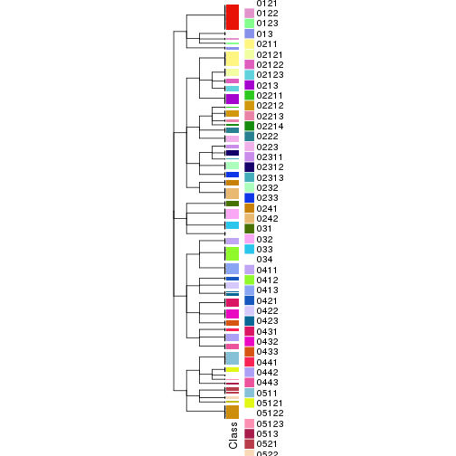</p>

</div>
<div id='tab-collect-classes-from-hierarchical-partition-2'>
<pre><code class="r">collect_classes(res_rh, merge_node = merge_node_param(min_n_signatures = 1360))
</code></pre>

<p>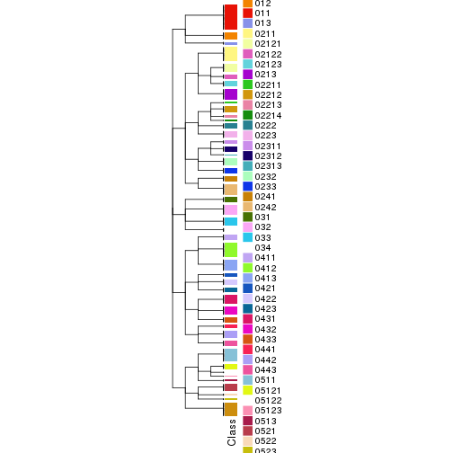</p>

</div>
<div id='tab-collect-classes-from-hierarchical-partition-3'>
<pre><code class="r">collect_classes(res_rh, merge_node = merge_node_param(min_n_signatures = 1762))
</code></pre>

<p>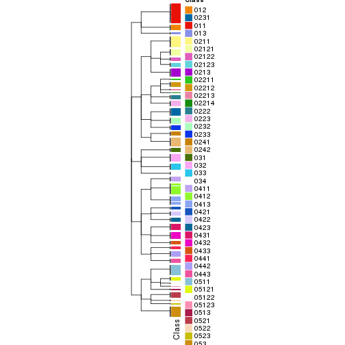</p>

</div>
<div id='tab-collect-classes-from-hierarchical-partition-4'>
<pre><code class="r">collect_classes(res_rh, merge_node = merge_node_param(min_n_signatures = 1794))
</code></pre>

<p>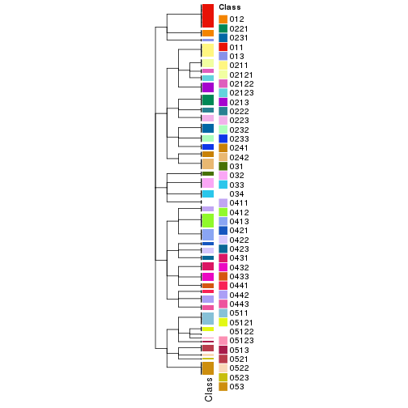</p>

</div>
<div id='tab-collect-classes-from-hierarchical-partition-5'>
<pre><code class="r">collect_classes(res_rh, merge_node = merge_node_param(min_n_signatures = 2221))
</code></pre>

<p>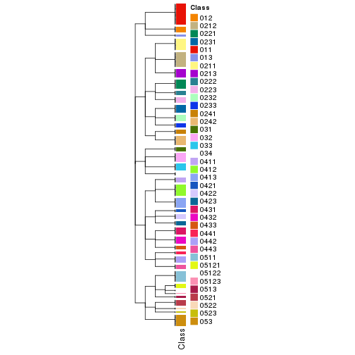</p>

</div>
<div id='tab-collect-classes-from-hierarchical-partition-6'>
<pre><code class="r">collect_classes(res_rh, merge_node = merge_node_param(min_n_signatures = 2573))
</code></pre>

<pre><code>#&gt; Error in lt[[hierarchy[i, 1]]]$AddChildNode({: attempt to apply non-function
</code></pre>

</div>
<div id='tab-collect-classes-from-hierarchical-partition-7'>
<pre><code class="r">collect_classes(res_rh, merge_node = merge_node_param(min_n_signatures = 3054))
</code></pre>

<pre><code>#&gt; Error in lt[[hierarchy[i, 1]]]$AddChildNode({: attempt to apply non-function
</code></pre>

</div>
<div id='tab-collect-classes-from-hierarchical-partition-8'>
<pre><code class="r">collect_classes(res_rh, merge_node = merge_node_param(min_n_signatures = 3076))
</code></pre>

<p>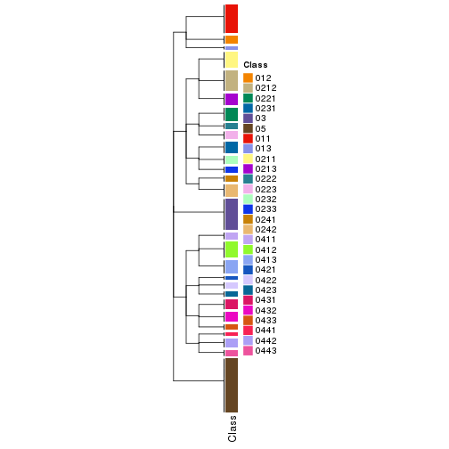</p>

</div>
<div id='tab-collect-classes-from-hierarchical-partition-9'>
<pre><code class="r">collect_classes(res_rh, merge_node = merge_node_param(min_n_signatures = 3130))
</code></pre>

<p></p>

</div>
<div id='tab-collect-classes-from-hierarchical-partition-10'>
<pre><code class="r">collect_classes(res_rh, merge_node = merge_node_param(min_n_signatures = 3130))
</code></pre>

<p>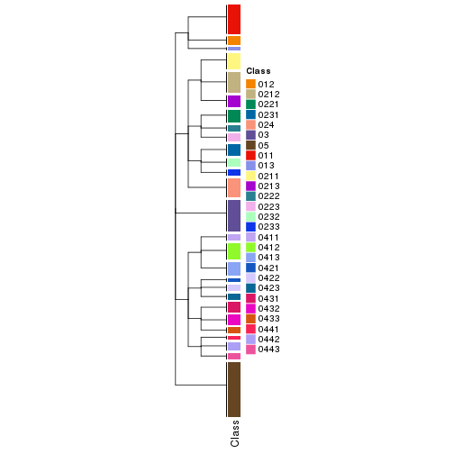</p>

</div>
<div id='tab-collect-classes-from-hierarchical-partition-11'>
<pre><code class="r">collect_classes(res_rh, merge_node = merge_node_param(min_n_signatures = 4059))
</code></pre>

<p></p>

</div>
<div id='tab-collect-classes-from-hierarchical-partition-12'>
<pre><code class="r">collect_classes(res_rh, merge_node = merge_node_param(min_n_signatures = 4238))
</code></pre>

<p>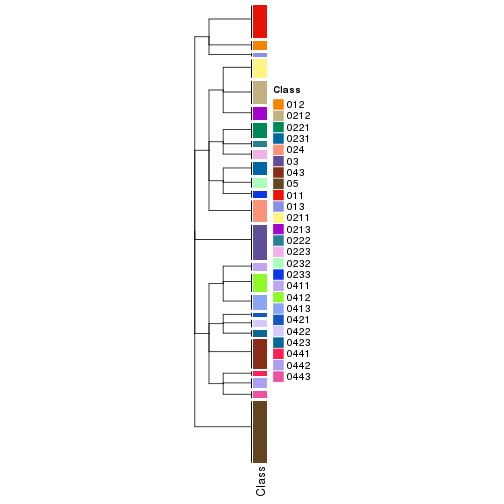</p>

</div>
<div id='tab-collect-classes-from-hierarchical-partition-13'>
<pre><code class="r">collect_classes(res_rh, merge_node = merge_node_param(min_n_signatures = 5112))
</code></pre>

<p>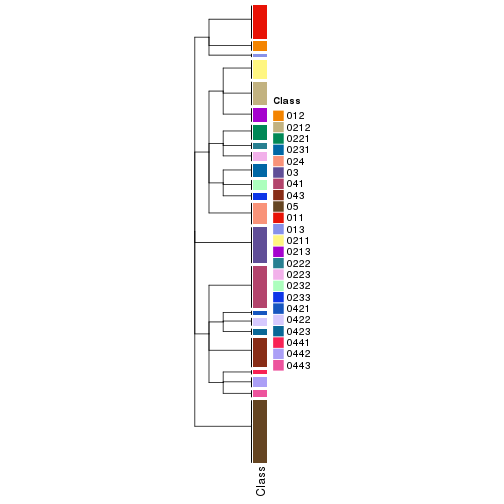</p>

</div>
<div id='tab-collect-classes-from-hierarchical-partition-14'>
<pre><code class="r">collect_classes(res_rh, merge_node = merge_node_param(min_n_signatures = 5268))
</code></pre>

<p>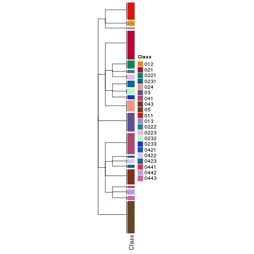</p>

</div>
<div id='tab-collect-classes-from-hierarchical-partition-15'>
<pre><code class="r">collect_classes(res_rh, merge_node = merge_node_param(min_n_signatures = 5287))
</code></pre>

<p>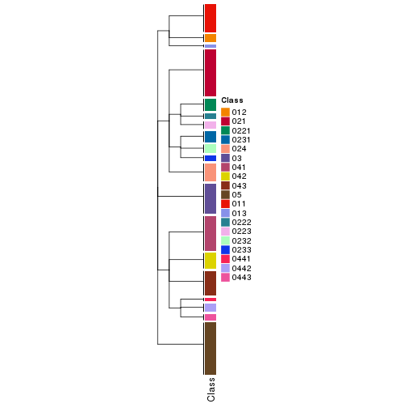</p>

</div>
<div id='tab-collect-classes-from-hierarchical-partition-16'>
<pre><code class="r">collect_classes(res_rh, merge_node = merge_node_param(min_n_signatures = 6017))
</code></pre>

<p>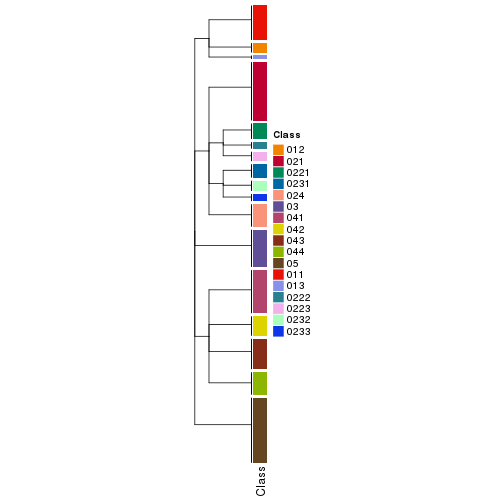</p>

</div>
<div id='tab-collect-classes-from-hierarchical-partition-17'>
<pre><code class="r">collect_classes(res_rh, merge_node = merge_node_param(min_n_signatures = 6587))
</code></pre>

<p>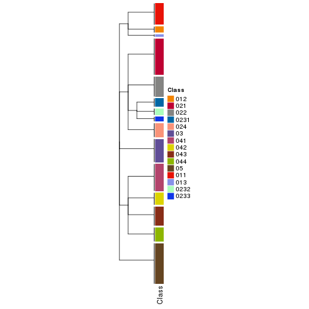</p>

</div>
<div id='tab-collect-classes-from-hierarchical-partition-18'>
<pre><code class="r">collect_classes(res_rh, merge_node = merge_node_param(min_n_signatures = 11436))
</code></pre>

<p>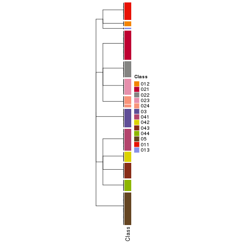</p>

</div>
<div id='tab-collect-classes-from-hierarchical-partition-19'>
<pre><code class="r">collect_classes(res_rh, merge_node = merge_node_param(min_n_signatures = 14470))
</code></pre>

<p>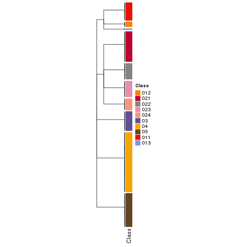</p>

</div>
<div id='tab-collect-classes-from-hierarchical-partition-20'>
<pre><code class="r">collect_classes(res_rh, merge_node = merge_node_param(min_n_signatures = 15528))
</code></pre>

<p>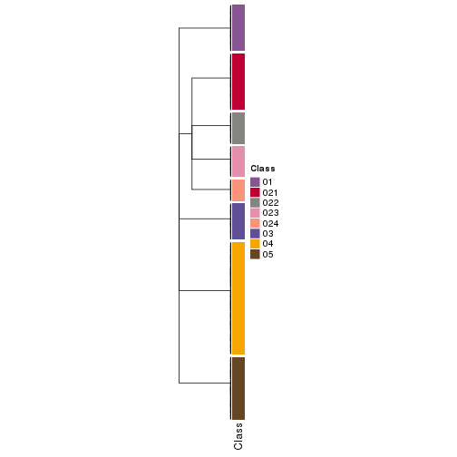</p>

</div>
<div id='tab-collect-classes-from-hierarchical-partition-21'>
<pre><code class="r">collect_classes(res_rh, merge_node = merge_node_param(min_n_signatures = 33866))
</code></pre>

<p>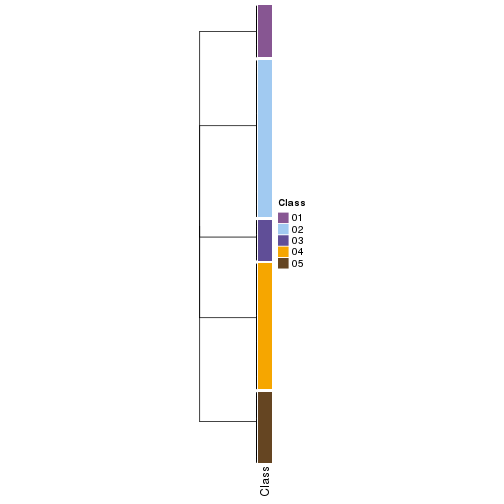</p>

</div>
</div>

Following shows the table of the partitions (You need to click the **show/hide
code output** link to see it).


<script>
$( function() {
	$( '#tabs-get-classes-from-hierarchical-partition' ).tabs();
} );
</script>
<div id='tabs-get-classes-from-hierarchical-partition'>
<ul>
<li><a href='#tab-get-classes-from-hierarchical-partition-1'>n_signatures ≥ 1258</a></li>
<li><a href='#tab-get-classes-from-hierarchical-partition-2'>n_signatures ≥ 1360</a></li>
<li><a href='#tab-get-classes-from-hierarchical-partition-3'>n_signatures ≥ 1762</a></li>
<li><a href='#tab-get-classes-from-hierarchical-partition-4'>n_signatures ≥ 1794</a></li>
<li><a href='#tab-get-classes-from-hierarchical-partition-5'>n_signatures ≥ 2221</a></li>
<li><a href='#tab-get-classes-from-hierarchical-partition-6'>n_signatures ≥ 2573</a></li>
<li><a href='#tab-get-classes-from-hierarchical-partition-7'>n_signatures ≥ 3054</a></li>
<li><a href='#tab-get-classes-from-hierarchical-partition-8'>n_signatures ≥ 3076</a></li>
<li><a href='#tab-get-classes-from-hierarchical-partition-9'>n_signatures ≥ 3130</a></li>
<li><a href='#tab-get-classes-from-hierarchical-partition-10'>n_signatures ≥ 3130</a></li>
<li><a href='#tab-get-classes-from-hierarchical-partition-11'>n_signatures ≥ 4059</a></li>
<li><a href='#tab-get-classes-from-hierarchical-partition-12'>n_signatures ≥ 4238</a></li>
<li><a href='#tab-get-classes-from-hierarchical-partition-13'>n_signatures ≥ 5112</a></li>
<li><a href='#tab-get-classes-from-hierarchical-partition-14'>n_signatures ≥ 5268</a></li>
<li><a href='#tab-get-classes-from-hierarchical-partition-15'>n_signatures ≥ 5287</a></li>
<li><a href='#tab-get-classes-from-hierarchical-partition-16'>n_signatures ≥ 6017</a></li>
<li><a href='#tab-get-classes-from-hierarchical-partition-17'>n_signatures ≥ 6587</a></li>
<li><a href='#tab-get-classes-from-hierarchical-partition-18'>n_signatures ≥ 11436</a></li>
<li><a href='#tab-get-classes-from-hierarchical-partition-19'>n_signatures ≥ 14470</a></li>
<li><a href='#tab-get-classes-from-hierarchical-partition-20'>n_signatures ≥ 15528</a></li>
<li><a href='#tab-get-classes-from-hierarchical-partition-21'>n_signatures ≥ 33866</a></li>
</ul>

<div id='tab-get-classes-from-hierarchical-partition-1'>
<p><a id='tab-get-classes-from-hierarchical-partition-1-a' style='color:#0366d6' href='#'>show/hide code output</a></p>
<pre><code class="r">get_classes(res_rh, merge_node = merge_node_param(min_n_signatures = 1258))
</code></pre>

<pre><code>#&gt; TCGA.G9.6343.01 TCGA.KK.A8IA.01 TCGA.KK.A6E4.01 TCGA.EJ.AB20.01 TCGA.H9.7775.01 TCGA.XJ.A9DX.01 
#&gt;          &quot;0443&quot;         &quot;02311&quot;          &quot;0211&quot;          &quot;0123&quot;         &quot;02121&quot;          &quot;0211&quot; 
#&gt; TCGA.KK.A6E6.01 TCGA.G9.6339.01 TCGA.EJ.5509.01 TCGA.EJ.5521.01 TCGA.YL.A8SB.01 TCGA.V1.A9OF.01 
#&gt;          &quot;0413&quot;          &quot;0413&quot;          &quot;0423&quot;          &quot;0433&quot;          &quot;0511&quot;          &quot;0232&quot; 
#&gt; TCGA.CH.5754.01 TCGA.EJ.7125.01 TCGA.EJ.7797.01 TCGA.YL.A9WI.01 TCGA.EJ.7314.01 TCGA.XA.A8JR.01 
#&gt;          &quot;0441&quot;          &quot;0223&quot;          &quot;0511&quot;          &quot;0222&quot;          &quot;0411&quot;          &quot;0432&quot; 
#&gt; TCGA.EJ.7781.01 TCGA.QU.A6IN.01 TCGA.CH.5751.01 TCGA.V1.A8WL.01 TCGA.HC.A6AO.01 TCGA.KK.A7B3.01 
#&gt;          &quot;0432&quot;         &quot;02121&quot;          &quot;0431&quot;          &quot;0432&quot;          &quot;0223&quot;          &quot;0211&quot; 
#&gt; TCGA.XK.AAJT.01 TCGA.EJ.AB27.01 TCGA.CH.5788.01 TCGA.KK.A8I5.01 TCGA.YL.A8S9.01 TCGA.CH.5761.01 
#&gt;          &quot;0443&quot;           &quot;032&quot;          &quot;0232&quot;          &quot;0211&quot;          &quot;0242&quot;          &quot;0223&quot; 
#&gt; TCGA.KK.A7AZ.01 TCGA.G9.6366.01 TCGA.HC.7819.01 TCGA.KC.A4BN.01 TCGA.KK.A8IG.01 TCGA.ZG.A8QW.01 
#&gt;          &quot;0233&quot;          &quot;0412&quot;          &quot;0211&quot;          &quot;0412&quot;          &quot;0422&quot;           &quot;053&quot; 
#&gt; TCGA.EJ.7786.01 TCGA.J4.A83K.01 TCGA.YL.A8HK.01 TCGA.EJ.5501.01 TCGA.EJ.8470.01 TCGA.J9.A8CL.01 
#&gt;          &quot;0432&quot;          &quot;0412&quot;           &quot;053&quot;          &quot;0511&quot;          &quot;0431&quot;         &quot;02312&quot; 
#&gt; TCGA.EJ.A7NF.01 TCGA.CH.5762.11 TCGA.XK.AAJA.01 TCGA.EJ.7330.01 TCGA.VP.AA1N.01 TCGA.EJ.5524.01 
#&gt;         &quot;02121&quot;           &quot;011&quot;         &quot;02212&quot;          &quot;0521&quot;          &quot;0422&quot;          &quot;0413&quot; 
#&gt; TCGA.KK.A6E8.01 TCGA.HC.7821.01 TCGA.HC.7209.01 TCGA.HC.7742.01 TCGA.G9.6351.01 TCGA.EJ.8474.01 
#&gt;         &quot;02213&quot;          &quot;0211&quot;          &quot;0413&quot;          &quot;0432&quot;          &quot;0511&quot;          &quot;0211&quot; 
#&gt; TCGA.HC.7075.01 TCGA.J9.A8CP.01 TCGA.KK.A8IM.01 TCGA.G9.6348.01 TCGA.CH.5789.01 TCGA.KC.A7F6.01 
#&gt;          &quot;0232&quot;          &quot;0422&quot;          &quot;0511&quot;         &quot;05122&quot;           &quot;011&quot;          &quot;0211&quot; 
#&gt; TCGA.G9.6333.11 TCGA.KC.A4BL.01 TCGA.J4.A67Q.01 TCGA.2A.A8VL.01 TCGA.V1.A9ZK.01 TCGA.V1.A9O5.01 
#&gt;           &quot;011&quot;           &quot;032&quot;          &quot;0511&quot;          &quot;0511&quot;          &quot;0521&quot;          &quot;0443&quot; 
#&gt; TCGA.VP.A879.01 TCGA.HC.7819.11 TCGA.VN.A88Q.01 TCGA.HC.7737.01 TCGA.V1.A8WS.01 TCGA.HC.8213.01 
#&gt;          &quot;0412&quot;           &quot;011&quot;          &quot;0413&quot;          &quot;0521&quot;         &quot;02123&quot;          &quot;0213&quot; 
#&gt; TCGA.M7.A721.01 TCGA.ZG.A9LZ.01 TCGA.CH.5765.01 TCGA.V1.A8WW.01 TCGA.HC.A48F.01 TCGA.V1.A9OQ.01 
#&gt;          &quot;0443&quot;         &quot;02122&quot;          &quot;0211&quot;         &quot;02121&quot;          &quot;0213&quot;         &quot;02212&quot; 
#&gt; TCGA.EJ.5514.01 TCGA.G9.6384.01 TCGA.V1.A9ZG.01 TCGA.YL.A8HM.01 TCGA.G9.6377.01 TCGA.M7.A722.01 
#&gt;          &quot;0422&quot;          &quot;0511&quot;          &quot;0522&quot;          &quot;0223&quot;          &quot;0213&quot;          &quot;0222&quot; 
#&gt; TCGA.G9.6361.01 TCGA.EJ.5511.01 TCGA.ZG.A9KY.01 TCGA.EJ.7784.11 TCGA.ZG.A9LN.01 TCGA.EJ.5526.01 
#&gt;         &quot;02311&quot;          &quot;0233&quot;          &quot;0242&quot;           &quot;011&quot;           &quot;053&quot;          &quot;0411&quot; 
#&gt; TCGA.HC.7820.11 TCGA.YJ.A8SW.01 TCGA.EJ.7794.01 TCGA.EJ.A46B.01 TCGA.EJ.5542.01 TCGA.YL.A9WJ.01 
#&gt;           &quot;013&quot;          &quot;0211&quot;          &quot;0521&quot;           &quot;031&quot;          &quot;0412&quot;          &quot;0521&quot; 
#&gt; TCGA.EJ.7328.11 TCGA.V1.A9Z8.01 TCGA.EJ.A46F.01 TCGA.YL.A8SK.01 TCGA.MG.AAMC.01 TCGA.X4.A8KS.01 
#&gt;          &quot;0121&quot;         &quot;05123&quot;          &quot;0211&quot;           &quot;053&quot;         &quot;02121&quot;           &quot;033&quot; 
#&gt; TCGA.J4.A67M.01 TCGA.ZG.A9L0.01 TCGA.HC.7077.01 TCGA.CH.5769.01 TCGA.G9.6353.11 TCGA.G9.6499.01 
#&gt;           &quot;053&quot;          &quot;0242&quot;          &quot;0211&quot;          &quot;0433&quot;           &quot;011&quot;          &quot;0521&quot; 
#&gt; TCGA.EJ.5519.01 TCGA.J4.A67T.01 TCGA.HC.7748.01 TCGA.VN.A88R.01 TCGA.H9.A6BY.01 TCGA.G9.6365.01 
#&gt;          &quot;0241&quot;          &quot;0511&quot;          &quot;0413&quot;         &quot;02212&quot;         &quot;02123&quot;          &quot;0412&quot; 
#&gt; TCGA.EJ.7317.11 TCGA.G9.7510.01 TCGA.KK.A6E3.01 TCGA.G9.6336.01 TCGA.EJ.5517.01 TCGA.V1.A8MG.01 
#&gt;           &quot;011&quot;          &quot;0442&quot;           &quot;053&quot;         &quot;05121&quot;          &quot;0233&quot;          &quot;0423&quot; 
#&gt; TCGA.KC.A7FE.01 TCGA.HC.7817.01 TCGA.J4.AAU2.01 TCGA.V1.A8MJ.01 TCGA.VP.A87C.01 TCGA.EJ.A7NN.01 
#&gt;           &quot;032&quot;           &quot;032&quot;          &quot;0233&quot;          &quot;0511&quot;         &quot;05123&quot;          &quot;0432&quot; 
#&gt; TCGA.HC.A8D0.01 TCGA.EJ.7792.11 TCGA.EJ.5497.01 TCGA.Y6.A9XI.01 TCGA.HC.7752.11 TCGA.SU.A7E7.01 
#&gt;           &quot;032&quot;           &quot;011&quot;          &quot;0511&quot;         &quot;02214&quot;          &quot;0122&quot;           &quot;032&quot; 
#&gt; TCGA.G9.6342.11 TCGA.HC.8265.01 TCGA.CH.5737.01 TCGA.G9.6338.01 TCGA.KK.A7AV.01 TCGA.EJ.7218.01 
#&gt;           &quot;033&quot;          &quot;0421&quot;         &quot;02212&quot;          &quot;0242&quot;          &quot;0442&quot;          &quot;0422&quot; 
#&gt; TCGA.YL.A8SC.01 TCGA.XK.AAJR.01 TCGA.2A.AAYF.01 TCGA.V1.A8X3.01 TCGA.KK.A6DY.01 TCGA.M7.A71Z.01 
#&gt;          &quot;0431&quot;          &quot;0521&quot;          &quot;0213&quot;          &quot;0431&quot;          &quot;0431&quot;          &quot;0211&quot; 
#&gt; TCGA.EJ.7123.11 TCGA.G9.6363.11 TCGA.KK.A8I8.01 TCGA.KC.A4BV.01 TCGA.G9.6332.11 TCGA.CH.5750.01 
#&gt;           &quot;011&quot;           &quot;053&quot;          &quot;0413&quot;         &quot;02311&quot;           &quot;013&quot;          &quot;0213&quot; 
#&gt; TCGA.ZG.A9ND.01 TCGA.EJ.A65B.01 TCGA.QU.A6IO.01 TCGA.EJ.5503.01 TCGA.ZG.A9LU.01 TCGA.EJ.8469.01 
#&gt;          &quot;0242&quot;           &quot;032&quot;          &quot;0423&quot;           &quot;011&quot;           &quot;033&quot;          &quot;0211&quot; 
#&gt; TCGA.XJ.A83H.01 TCGA.EJ.7315.01 TCGA.ZG.A8QY.01 TCGA.YL.A8SP.01 TCGA.CH.5791.01 TCGA.V1.A9OY.01 
#&gt;          &quot;0443&quot;         &quot;02311&quot;          &quot;0442&quot;         &quot;02122&quot;         &quot;02121&quot;          &quot;0511&quot; 
#&gt; TCGA.KC.A4BO.01 TCGA.HC.A76X.01 TCGA.YL.A8SO.01 TCGA.KK.A8IF.01 TCGA.EJ.A7NK.01 TCGA.ZG.A9L4.01 
#&gt;           &quot;011&quot;         &quot;02121&quot;          &quot;0423&quot;          &quot;0223&quot;           &quot;011&quot;           &quot;053&quot; 
#&gt; TCGA.EJ.5522.01 TCGA.HC.7747.01 TCGA.EJ.7125.11 TCGA.ZG.A9M4.01 TCGA.EJ.A65D.01 TCGA.HC.A4ZV.01 
#&gt;          &quot;0412&quot;          &quot;0511&quot;          &quot;0121&quot;          &quot;0421&quot;         &quot;02122&quot;          &quot;0241&quot; 
#&gt; TCGA.G9.A9S0.01 TCGA.EJ.5506.01 TCGA.KK.A7AP.01 TCGA.VP.A87D.01 TCGA.TP.A8TT.01 TCGA.KK.A8II.01 
#&gt;          &quot;0443&quot;           &quot;031&quot;          &quot;0242&quot;          &quot;0213&quot;          &quot;0413&quot;         &quot;02123&quot; 
#&gt; TCGA.V1.A9Z9.01 TCGA.ZG.A9LS.01 TCGA.HC.7232.01 TCGA.EJ.A8FO.01 TCGA.J9.A52B.01 TCGA.CH.5767.01 
#&gt;          &quot;0423&quot;           &quot;053&quot;          &quot;0411&quot;           &quot;033&quot;         &quot;02122&quot;         &quot;02212&quot; 
#&gt; TCGA.J4.AATV.01 TCGA.HC.7081.01 TCGA.CH.5743.01 TCGA.V1.A9OH.01 TCGA.CH.5752.01 TCGA.VP.A87H.01 
#&gt;           &quot;032&quot;          &quot;0413&quot;           &quot;011&quot;          &quot;0522&quot;          &quot;0211&quot;          &quot;0442&quot; 
#&gt; TCGA.G9.7521.01 TCGA.YL.A8HO.01 TCGA.YL.A9WK.01 TCGA.J4.A83M.01 TCGA.VP.A878.01 TCGA.CH.5766.11 
#&gt;          &quot;0421&quot;          &quot;0423&quot;         &quot;02312&quot;          &quot;0413&quot;           &quot;053&quot;           &quot;011&quot; 
#&gt; TCGA.HC.7736.01 TCGA.G9.6385.01 TCGA.VN.A88N.01 TCGA.HC.7745.01 TCGA.HC.7078.01 TCGA.FC.A5OB.01 
#&gt;          &quot;0443&quot;          &quot;0122&quot;          &quot;0432&quot;          &quot;0511&quot;         &quot;02312&quot;         &quot;02312&quot; 
#&gt; TCGA.G9.6379.01 TCGA.QU.A6IP.01 TCGA.J4.AATZ.01 TCGA.V1.A9O9.01 TCGA.V1.A9OL.01 TCGA.HC.7210.01 
#&gt;           &quot;053&quot;          &quot;0412&quot;         &quot;02214&quot;          &quot;0413&quot;          &quot;0241&quot;          &quot;0422&quot; 
#&gt; TCGA.KK.A8I7.01 TCGA.EJ.7791.01 TCGA.CH.5762.01 TCGA.EJ.5527.01 TCGA.KK.A8IC.01 TCGA.G9.6356.01 
#&gt;           &quot;032&quot;           &quot;032&quot;           &quot;053&quot;         &quot;05121&quot;           &quot;033&quot;         &quot;05121&quot; 
#&gt; TCGA.J9.A52D.01 TCGA.EJ.7788.01 TCGA.ZG.A9LB.01 TCGA.J9.A8CN.01 TCGA.ZG.A9L1.01 TCGA.G9.6333.01 
#&gt;         &quot;02312&quot;          &quot;0232&quot;          &quot;0411&quot;          &quot;0242&quot;          &quot;0233&quot;          &quot;0521&quot; 
#&gt; TCGA.VP.A875.01 TCGA.EJ.8468.01 TCGA.EJ.5495.01 TCGA.H9.A6BX.01 TCGA.KK.A59Y.01 TCGA.V1.A8WN.01 
#&gt;          &quot;0232&quot;          &quot;0431&quot;           &quot;053&quot;          &quot;0121&quot;          &quot;0213&quot;          &quot;0511&quot; 
#&gt; TCGA.KK.A7B1.01 TCGA.G9.6362.11 TCGA.G9.6364.11 TCGA.HC.A631.01 TCGA.YL.A8SA.01 TCGA.HC.8262.01 
#&gt;          &quot;0412&quot;         &quot;02123&quot;          &quot;0123&quot;          &quot;0211&quot;         &quot;02122&quot;          &quot;0411&quot; 
#&gt; TCGA.CH.5765.11 TCGA.KC.A7FD.01 TCGA.HI.7170.01 TCGA.J4.A67L.01 TCGA.V1.A9O7.01 TCGA.HC.A6AS.01 
#&gt;           &quot;031&quot;          &quot;0232&quot;          &quot;0412&quot;          &quot;0412&quot;           &quot;034&quot;           &quot;053&quot; 
#&gt; TCGA.EJ.7784.01 TCGA.EJ.7331.11 TCGA.KC.A7F3.01 TCGA.G9.6494.11 TCGA.HC.8256.01 TCGA.J4.A83I.01 
#&gt;          &quot;0211&quot;          &quot;0121&quot;          &quot;0422&quot;           &quot;011&quot;          &quot;0431&quot;         &quot;02311&quot; 
#&gt; TCGA.G9.6373.01 TCGA.EJ.7794.11 TCGA.G9.6371.01 TCGA.XQ.A8TA.01 TCGA.EJ.5498.01 TCGA.EJ.7328.01 
#&gt;          &quot;0213&quot;           &quot;011&quot;          &quot;0242&quot;         &quot;02312&quot;           &quot;032&quot;         &quot;05121&quot; 
#&gt; TCGA.EJ.A46D.01 TCGA.ZG.A9L9.01 TCGA.YL.A8SI.01 TCGA.M7.A724.01 TCGA.VN.A88K.01 TCGA.EJ.A8FP.01 
#&gt;           &quot;033&quot;         &quot;02121&quot;          &quot;0521&quot;          &quot;0242&quot;          &quot;0213&quot;           &quot;011&quot; 
#&gt; TCGA.V1.A8MK.01 TCGA.YL.A8HJ.01 TCGA.KK.A8ID.01 TCGA.CH.5769.11 TCGA.G9.6353.01 TCGA.G9.6499.11 
#&gt;           &quot;033&quot;           &quot;034&quot;          &quot;0242&quot;          &quot;0433&quot;           &quot;033&quot;          &quot;0442&quot; 
#&gt; TCGA.KK.A8I9.01 TCGA.G9.6365.11 TCGA.EJ.A46H.01 TCGA.EJ.7317.01 TCGA.YL.A8S8.01 TCGA.XJ.A9DQ.01 
#&gt;          &quot;0442&quot;           &quot;011&quot;           &quot;011&quot;          &quot;0442&quot;          &quot;0423&quot;           &quot;031&quot; 
#&gt; TCGA.EJ.7782.11 TCGA.J4.A67O.01 TCGA.Y6.A8TL.01 TCGA.XK.AAIV.01 TCGA.CH.5790.01 TCGA.HC.7231.01 
#&gt;           &quot;011&quot;          &quot;0511&quot;          &quot;0431&quot;          &quot;0523&quot;          &quot;0213&quot;         &quot;02121&quot; 
#&gt; TCGA.ZG.A9L5.01 TCGA.V1.A8MF.01 TCGA.EJ.A7NJ.01 TCGA.EJ.A65E.01 TCGA.ZG.A8QX.01 TCGA.G9.6367.01 
#&gt;          &quot;0222&quot;          &quot;0432&quot;           &quot;011&quot;          &quot;0442&quot;          &quot;0442&quot;           &quot;011&quot; 
#&gt; TCGA.G9.6342.01 TCGA.KK.A8IB.01 TCGA.HC.7230.01 TCGA.XK.AAIR.01 TCGA.CH.5741.01 TCGA.KK.A59V.01 
#&gt;          &quot;0413&quot;          &quot;0521&quot;         &quot;02121&quot;           &quot;053&quot;          &quot;0213&quot;          &quot;0211&quot; 
#&gt; TCGA.J4.8200.01 TCGA.KK.A7AQ.01 TCGA.EJ.5532.01 TCGA.HI.7168.01 TCGA.HC.7233.01 TCGA.HC.A6AL.01 
#&gt;          &quot;0412&quot;          &quot;0223&quot;          &quot;0432&quot;          &quot;0441&quot;          &quot;0412&quot;          &quot;0241&quot; 
#&gt; TCGA.EJ.7783.01 TCGA.HC.8264.01 TCGA.EJ.A8FU.01 TCGA.EJ.A65M.01 TCGA.EJ.A8FN.01 TCGA.HI.7171.01 
#&gt;         &quot;05121&quot;          &quot;0242&quot;           &quot;011&quot;          &quot;0442&quot;          &quot;0421&quot;         &quot;02122&quot; 
#&gt; TCGA.XK.AAJP.01 TCGA.HC.7212.01 TCGA.ZG.A9MC.01 TCGA.2A.A8VO.01 TCGA.HC.8259.01 TCGA.G9.6378.01 
#&gt;          &quot;0242&quot;          &quot;0232&quot;           &quot;034&quot;          &quot;0233&quot;          &quot;0213&quot;           &quot;033&quot; 
#&gt; TCGA.J4.A83L.01 TCGA.VN.A88P.01 TCGA.EJ.5507.01 TCGA.J9.A8CK.01 TCGA.CH.5744.01 TCGA.ZG.A9N3.01 
#&gt;          &quot;0412&quot;          &quot;0232&quot;          &quot;0433&quot;          &quot;0413&quot;          &quot;0412&quot;          &quot;0421&quot; 
#&gt; TCGA.G9.6354.01 TCGA.VN.A88O.01 TCGA.EJ.5502.01 TCGA.HC.7079.01 TCGA.G9.6369.01 TCGA.KK.A6E1.01 
#&gt;          &quot;0412&quot;          &quot;0423&quot;          &quot;0511&quot;           &quot;034&quot;          &quot;0242&quot;          &quot;0241&quot; 
#&gt; TCGA.HC.7211.01 TCGA.KK.A8I6.01 TCGA.XJ.A83F.01 TCGA.EJ.7785.01 TCGA.G9.A9S4.01 TCGA.VP.A87B.01 
#&gt;          &quot;0443&quot;          &quot;0441&quot;          &quot;0213&quot;          &quot;0511&quot;         &quot;02123&quot;          &quot;0242&quot; 
#&gt; TCGA.YL.A8SR.01 TCGA.EJ.7327.01 TCGA.4L.AA1F.01 TCGA.KK.A7AY.01 TCGA.EJ.A65G.01 TCGA.2A.AAYU.01 
#&gt;          &quot;0223&quot;          &quot;0413&quot;          &quot;0523&quot;         &quot;02311&quot;          &quot;0432&quot;          &quot;0233&quot; 
#&gt; TCGA.HC.A76W.01 TCGA.EJ.5516.01 TCGA.G9.A9S7.01 TCGA.HC.8216.01 TCGA.CH.5794.01 TCGA.V1.A9OA.01 
#&gt;          &quot;0431&quot;          &quot;0511&quot;          &quot;0433&quot;          &quot;0432&quot;          &quot;0433&quot;          &quot;0411&quot; 
#&gt; TCGA.J9.A52E.01 TCGA.HC.7818.01 TCGA.G9.7525.01 TCGA.FC.7961.01 TCGA.CH.5767.11 TCGA.EJ.5504.01 
#&gt;          &quot;0413&quot;          &quot;0432&quot;         &quot;02121&quot;          &quot;0423&quot;           &quot;011&quot;          &quot;0443&quot; 
#&gt; TCGA.VP.A87J.01 TCGA.J4.A67S.01 TCGA.KK.A8IK.01 TCGA.HC.A6AQ.01 TCGA.CH.5763.01 TCGA.HC.A8D1.01 
#&gt;          &quot;0241&quot;          &quot;0412&quot;         &quot;02211&quot;          &quot;0413&quot;           &quot;011&quot;           &quot;032&quot; 
#&gt; TCGA.KK.A7AU.01 TCGA.CH.5766.01 TCGA.EJ.7781.11 TCGA.KK.A7B0.01 TCGA.EJ.7321.01 TCGA.G9.6385.11 
#&gt;         &quot;02123&quot;          &quot;0441&quot;           &quot;011&quot;          &quot;0521&quot;          &quot;0411&quot;          &quot;0123&quot; 
#&gt; TCGA.VN.A943.01 TCGA.KK.A59X.01 TCGA.KK.A8I4.01 TCGA.G9.6496.11 TCGA.G9.7523.01 TCGA.EJ.5494.01 
#&gt;          &quot;0242&quot;          &quot;0222&quot;           &quot;053&quot;           &quot;011&quot;          &quot;0442&quot;         &quot;02312&quot; 
#&gt; TCGA.2A.A8VT.01 TCGA.HC.7213.01 TCGA.G9.7519.01 TCGA.CH.5764.11 TCGA.CH.5772.01 TCGA.EJ.7325.01 
#&gt;          &quot;0433&quot;          &quot;0233&quot;          &quot;0412&quot;           &quot;011&quot;         &quot;02312&quot;         &quot;02121&quot; 
#&gt; TCGA.G9.6356.11 TCGA.ZG.A9LM.01 TCGA.XJ.A9DK.01 TCGA.EJ.7789.01 TCGA.HC.8257.01 TCGA.EJ.A7NG.01 
#&gt;           &quot;011&quot;          &quot;0432&quot;           &quot;011&quot;          &quot;0223&quot;          &quot;0211&quot;           &quot;033&quot; 
#&gt; TCGA.EJ.7318.01 TCGA.EJ.5512.01 TCGA.EJ.A46E.01 TCGA.FC.A4JI.01 TCGA.J9.A8CM.01 TCGA.CH.5771.11 
#&gt;          &quot;0413&quot;          &quot;0511&quot;           &quot;011&quot;         &quot;02211&quot;          &quot;0441&quot;           &quot;011&quot; 
#&gt; TCGA.KC.A4BR.01 TCGA.2A.AAYO.01 TCGA.2A.A8W3.01 TCGA.CH.5768.11 TCGA.G9.6364.01 TCGA.YL.A8SL.01 
#&gt;           &quot;034&quot;          &quot;0233&quot;           &quot;053&quot;           &quot;031&quot;          &quot;0412&quot;          &quot;0211&quot; 
#&gt; TCGA.KK.A5A1.01 TCGA.YL.A9WL.01 TCGA.HC.A6HX.01 TCGA.M7.A720.01 TCGA.HC.7080.01 TCGA.V1.A9O5.06 
#&gt;          &quot;0222&quot;         &quot;02122&quot;           &quot;033&quot;           &quot;011&quot;          &quot;0222&quot;          &quot;0222&quot; 
#&gt; TCGA.KC.A7F5.01 TCGA.EJ.7331.01 TCGA.ZG.A9LY.01 TCGA.G9.6494.01 TCGA.M7.A71Y.01 TCGA.FC.A66V.01 
#&gt;         &quot;02213&quot;          &quot;0442&quot;           &quot;053&quot;          &quot;0431&quot;           &quot;031&quot;           &quot;011&quot; 
#&gt; TCGA.EJ.7793.01 TCGA.EJ.A8FS.01 TCGA.XK.AAJU.01 TCGA.HC.8266.01 TCGA.YL.A8HL.01 TCGA.VN.A88I.01 
#&gt;          &quot;0511&quot;          &quot;0242&quot;           &quot;011&quot;           &quot;053&quot;          &quot;0241&quot;           &quot;034&quot; 
#&gt; TCGA.HI.7169.01 TCGA.CH.5753.01 TCGA.J4.A67K.01 TCGA.QU.A6IM.01 TCGA.HC.A9TE.01 TCGA.EJ.7115.01 
#&gt;          &quot;0412&quot;          &quot;0232&quot;          &quot;0413&quot;          &quot;0432&quot;          &quot;0441&quot;          &quot;0442&quot; 
#&gt; TCGA.HC.7745.11 TCGA.EJ.5531.01 TCGA.YL.A8SH.01 TCGA.G9.6362.01 TCGA.HC.8258.01 TCGA.EJ.5530.01 
#&gt;           &quot;013&quot;           &quot;032&quot;         &quot;02312&quot;         &quot;02123&quot;           &quot;032&quot;          &quot;0213&quot; 
#&gt; TCGA.VN.A88M.01 TCGA.EJ.7782.01 TCGA.YL.A8SF.01 TCGA.KK.A6E2.01 TCGA.CH.5792.01 TCGA.J4.A6G1.01 
#&gt;          &quot;0213&quot;          &quot;0223&quot;          &quot;0411&quot;          &quot;0211&quot;          &quot;0521&quot;           &quot;034&quot; 
#&gt; TCGA.J4.A6M7.01 TCGA.VP.A872.01 TCGA.V1.A8ML.01 TCGA.HC.7744.01 TCGA.G9.6347.01 TCGA.EJ.A46I.01 
#&gt;          &quot;0213&quot;          &quot;0433&quot;          &quot;0442&quot;          &quot;0232&quot;          &quot;0513&quot;           &quot;053&quot; 
#&gt; TCGA.XK.AAJ3.01 TCGA.HC.A8CY.01 TCGA.KK.A6E0.01 TCGA.XK.AAK1.01 TCGA.XK.AAIW.01 TCGA.HC.8260.01 
#&gt;          &quot;0223&quot;         &quot;02313&quot;          &quot;0242&quot;         &quot;02212&quot;          &quot;0242&quot;           &quot;031&quot; 
#&gt; TCGA.HC.7737.11 TCGA.EJ.7786.11 TCGA.HC.7740.01 TCGA.TP.A8TV.01 TCGA.FC.A6HD.01 TCGA.EJ.8472.01 
#&gt;           &quot;013&quot;          &quot;0121&quot;           &quot;032&quot;          &quot;0223&quot;         &quot;02212&quot;          &quot;0211&quot; 
#&gt; TCGA.CH.5745.01 TCGA.EJ.5508.01 TCGA.EJ.A7NH.01 TCGA.KK.A7B2.01 TCGA.CH.5740.01 TCGA.YL.A9WH.01 
#&gt;          &quot;0411&quot;         &quot;05121&quot;           &quot;053&quot;           &quot;033&quot;          &quot;0413&quot;          &quot;0211&quot; 
#&gt; TCGA.FC.A8O0.01 TCGA.J9.A52C.01 TCGA.FC.7708.01 TCGA.HC.7742.11 TCGA.G9.6351.11 TCGA.KK.A7AW.01 
#&gt;          &quot;0122&quot;         &quot;05122&quot;         &quot;05121&quot;           &quot;031&quot;           &quot;033&quot;         &quot;02313&quot; 
#&gt; TCGA.G9.7509.01 TCGA.J4.A67R.01 TCGA.WW.A8ZI.01 TCGA.KK.A8IJ.01 TCGA.J4.A83N.01 TCGA.HC.A6AN.01 
#&gt;          &quot;0412&quot;         &quot;05121&quot;          &quot;0242&quot;          &quot;0431&quot;         &quot;02121&quot;          &quot;0211&quot; 
#&gt; TCGA.G9.6348.11 TCGA.EJ.5499.01 TCGA.G9.6367.11 TCGA.QU.A6IL.01 TCGA.CH.5738.01 TCGA.V1.A9ZI.01 
#&gt;           &quot;011&quot;           &quot;053&quot;           &quot;011&quot;         &quot;02213&quot;          &quot;0511&quot;          &quot;0232&quot; 
#&gt; TCGA.CH.5748.01 TCGA.YL.A8SQ.01 TCGA.G9.7522.01 TCGA.HC.A6AP.01 TCGA.EJ.7785.11 TCGA.KK.A7B4.01 
#&gt;          &quot;0432&quot;         &quot;02312&quot;          &quot;0511&quot;          &quot;0521&quot;           &quot;011&quot;          &quot;0232&quot; 
#&gt; TCGA.J4.A83J.01 TCGA.V1.A8MU.01 TCGA.EJ.5510.01 TCGA.EJ.7327.11 TCGA.CH.5746.01 TCGA.V1.A9Z7.01 
#&gt;         &quot;02212&quot;          &quot;0422&quot;           &quot;053&quot;          &quot;0122&quot;          &quot;0511&quot;          &quot;0431&quot; 
#&gt; TCGA.M7.A725.01 TCGA.G9.6384.11 TCGA.XJ.A9DI.01 TCGA.J4.A67N.01 TCGA.XJ.A83G.01 TCGA.ZG.A8QZ.01 
#&gt;          &quot;0241&quot;           &quot;011&quot;           &quot;011&quot;          &quot;0213&quot;         &quot;02212&quot;         &quot;05121&quot; 
#&gt; TCGA.TK.A8OK.01 TCGA.VP.A876.01 TCGA.KK.A6E5.01 TCGA.X4.A8KQ.01 TCGA.KK.A8IL.01 TCGA.HC.7820.01 
#&gt;          &quot;0522&quot;          &quot;0213&quot;          &quot;0422&quot;           &quot;053&quot;          &quot;0412&quot;          &quot;0412&quot; 
#&gt; TCGA.CH.5739.01 TCGA.HC.7750.01 TCGA.YL.A9WX.01 TCGA.EJ.5518.01 TCGA.ZG.A9NI.01 TCGA.YL.A9WY.01 
#&gt;         &quot;02121&quot;          &quot;0513&quot;           &quot;032&quot;          &quot;0443&quot;          &quot;0411&quot;          &quot;0523&quot; 
#&gt; TCGA.CH.5763.11 TCGA.EJ.5515.01 TCGA.KK.A8IH.01 TCGA.VP.A87K.01 TCGA.HC.A6HY.01 TCGA.HC.7211.11 
#&gt;          &quot;0121&quot;           &quot;011&quot;         &quot;02121&quot;         &quot;02123&quot;          &quot;0412&quot;           &quot;013&quot; 
#&gt; TCGA.HC.A632.01 TCGA.G9.6496.01 TCGA.EJ.A7NM.01 TCGA.ZG.A9L6.01 TCGA.2A.A8VV.01 TCGA.VP.A87E.01 
#&gt;          &quot;0241&quot;         &quot;02212&quot;          &quot;0422&quot;           &quot;032&quot;          &quot;0213&quot;          &quot;0513&quot; 
#&gt; TCGA.CH.5764.01 TCGA.EJ.5525.01 TCGA.CH.5772.11 TCGA.KK.A59Z.01 TCGA.V1.A9ZR.01 TCGA.EJ.A6RC.01 
#&gt;          &quot;0413&quot;         &quot;02122&quot;           &quot;011&quot;          &quot;0222&quot;          &quot;0522&quot;          &quot;0432&quot; 
#&gt; TCGA.EJ.7792.01 TCGA.HC.A9TH.01 TCGA.M7.A723.01 TCGA.EJ.7789.11 TCGA.HC.7752.01 TCGA.EJ.A65J.01 
#&gt;          &quot;0513&quot;          &quot;0433&quot;           &quot;033&quot;           &quot;011&quot;          &quot;0233&quot;         &quot;02211&quot; 
#&gt; TCGA.V1.A8WV.01 TCGA.2A.A8VX.01 TCGA.V1.A9OT.01 TCGA.KC.A7FA.01 TCGA.G9.6373.11 TCGA.G9.6370.01 
#&gt;          &quot;0421&quot;          &quot;0223&quot;          &quot;0211&quot;          &quot;0241&quot;           &quot;011&quot;           &quot;011&quot; 
#&gt; TCGA.CH.5771.01 TCGA.YL.A8SJ.01 TCGA.HC.7738.01 TCGA.EJ.A6RA.01 TCGA.J4.8198.01 TCGA.EJ.7123.01 
#&gt;           &quot;032&quot;          &quot;0431&quot;         &quot;02213&quot;           &quot;031&quot;          &quot;0232&quot;         &quot;02212&quot; 
#&gt; TCGA.2A.A8W1.01 TCGA.G9.6363.01 TCGA.ZG.A9L2.01 TCGA.HC.7749.01 TCGA.CH.5768.01 TCGA.KK.A6E7.01 
#&gt;         &quot;02212&quot;          &quot;0412&quot;           &quot;053&quot;          &quot;0431&quot;          &quot;0232&quot;          &quot;0431&quot; 
#&gt; TCGA.G9.6332.01 TCGA.EJ.A46G.01 TCGA.V1.A9OX.01 TCGA.J4.A6G3.01 TCGA.VN.A88L.01 TCGA.EJ.7312.01 
#&gt;         &quot;02123&quot;         &quot;02123&quot;          &quot;0422&quot;           &quot;032&quot;          &quot;0413&quot;          &quot;0222&quot; 
#&gt; TCGA.V1.A8MM.01 TCGA.EJ.A65F.01 TCGA.G9.6498.01 TCGA.EJ.5505.01 TCGA.CH.5761.11 TCGA.HC.8261.01 
#&gt;          &quot;0223&quot;          &quot;0211&quot;          &quot;0242&quot;         &quot;05122&quot;           &quot;011&quot;          &quot;0431&quot; 
#&gt; TCGA.XQ.A8TB.01 TCGA.G9.6329.01 TCGA.EJ.5496.01 
#&gt;          &quot;0411&quot;           &quot;033&quot;          &quot;0412&quot;
</code></pre>

<script>
$('#tab-get-classes-from-hierarchical-partition-1-a').parent().next().next().hide();
$('#tab-get-classes-from-hierarchical-partition-1-a').click(function(){
  $('#tab-get-classes-from-hierarchical-partition-1-a').parent().next().next().toggle();
  return(false);
});
</script>
</div>

<div id='tab-get-classes-from-hierarchical-partition-2'>
<p><a id='tab-get-classes-from-hierarchical-partition-2-a' style='color:#0366d6' href='#'>show/hide code output</a></p>
<pre><code class="r">get_classes(res_rh, merge_node = merge_node_param(min_n_signatures = 1360))
</code></pre>

<pre><code>#&gt; TCGA.G9.6343.01 TCGA.KK.A8IA.01 TCGA.KK.A6E4.01 TCGA.EJ.AB20.01 TCGA.H9.7775.01 TCGA.XJ.A9DX.01 
#&gt;          &quot;0443&quot;         &quot;02311&quot;          &quot;0211&quot;           &quot;012&quot;         &quot;02121&quot;          &quot;0211&quot; 
#&gt; TCGA.KK.A6E6.01 TCGA.G9.6339.01 TCGA.EJ.5509.01 TCGA.EJ.5521.01 TCGA.YL.A8SB.01 TCGA.V1.A9OF.01 
#&gt;          &quot;0413&quot;          &quot;0413&quot;          &quot;0423&quot;          &quot;0433&quot;          &quot;0511&quot;          &quot;0232&quot; 
#&gt; TCGA.CH.5754.01 TCGA.EJ.7125.01 TCGA.EJ.7797.01 TCGA.YL.A9WI.01 TCGA.EJ.7314.01 TCGA.XA.A8JR.01 
#&gt;          &quot;0441&quot;          &quot;0223&quot;          &quot;0511&quot;          &quot;0222&quot;          &quot;0411&quot;          &quot;0432&quot; 
#&gt; TCGA.EJ.7781.01 TCGA.QU.A6IN.01 TCGA.CH.5751.01 TCGA.V1.A8WL.01 TCGA.HC.A6AO.01 TCGA.KK.A7B3.01 
#&gt;          &quot;0432&quot;         &quot;02121&quot;          &quot;0431&quot;          &quot;0432&quot;          &quot;0223&quot;          &quot;0211&quot; 
#&gt; TCGA.XK.AAJT.01 TCGA.EJ.AB27.01 TCGA.CH.5788.01 TCGA.KK.A8I5.01 TCGA.YL.A8S9.01 TCGA.CH.5761.01 
#&gt;          &quot;0443&quot;           &quot;032&quot;          &quot;0232&quot;          &quot;0211&quot;          &quot;0242&quot;          &quot;0223&quot; 
#&gt; TCGA.KK.A7AZ.01 TCGA.G9.6366.01 TCGA.HC.7819.01 TCGA.KC.A4BN.01 TCGA.KK.A8IG.01 TCGA.ZG.A8QW.01 
#&gt;          &quot;0233&quot;          &quot;0412&quot;          &quot;0211&quot;          &quot;0412&quot;          &quot;0422&quot;           &quot;053&quot; 
#&gt; TCGA.EJ.7786.01 TCGA.J4.A83K.01 TCGA.YL.A8HK.01 TCGA.EJ.5501.01 TCGA.EJ.8470.01 TCGA.J9.A8CL.01 
#&gt;          &quot;0432&quot;          &quot;0412&quot;           &quot;053&quot;          &quot;0511&quot;          &quot;0431&quot;         &quot;02312&quot; 
#&gt; TCGA.EJ.A7NF.01 TCGA.CH.5762.11 TCGA.XK.AAJA.01 TCGA.EJ.7330.01 TCGA.VP.AA1N.01 TCGA.EJ.5524.01 
#&gt;         &quot;02121&quot;           &quot;011&quot;         &quot;02212&quot;          &quot;0521&quot;          &quot;0422&quot;          &quot;0413&quot; 
#&gt; TCGA.KK.A6E8.01 TCGA.HC.7821.01 TCGA.HC.7209.01 TCGA.HC.7742.01 TCGA.G9.6351.01 TCGA.EJ.8474.01 
#&gt;         &quot;02213&quot;          &quot;0211&quot;          &quot;0413&quot;          &quot;0432&quot;          &quot;0511&quot;          &quot;0211&quot; 
#&gt; TCGA.HC.7075.01 TCGA.J9.A8CP.01 TCGA.KK.A8IM.01 TCGA.G9.6348.01 TCGA.CH.5789.01 TCGA.KC.A7F6.01 
#&gt;          &quot;0232&quot;          &quot;0422&quot;          &quot;0511&quot;         &quot;05122&quot;           &quot;011&quot;          &quot;0211&quot; 
#&gt; TCGA.G9.6333.11 TCGA.KC.A4BL.01 TCGA.J4.A67Q.01 TCGA.2A.A8VL.01 TCGA.V1.A9ZK.01 TCGA.V1.A9O5.01 
#&gt;           &quot;011&quot;           &quot;032&quot;          &quot;0511&quot;          &quot;0511&quot;          &quot;0521&quot;          &quot;0443&quot; 
#&gt; TCGA.VP.A879.01 TCGA.HC.7819.11 TCGA.VN.A88Q.01 TCGA.HC.7737.01 TCGA.V1.A8WS.01 TCGA.HC.8213.01 
#&gt;          &quot;0412&quot;           &quot;011&quot;          &quot;0413&quot;          &quot;0521&quot;         &quot;02123&quot;          &quot;0213&quot; 
#&gt; TCGA.M7.A721.01 TCGA.ZG.A9LZ.01 TCGA.CH.5765.01 TCGA.V1.A8WW.01 TCGA.HC.A48F.01 TCGA.V1.A9OQ.01 
#&gt;          &quot;0443&quot;         &quot;02122&quot;          &quot;0211&quot;         &quot;02121&quot;          &quot;0213&quot;         &quot;02212&quot; 
#&gt; TCGA.EJ.5514.01 TCGA.G9.6384.01 TCGA.V1.A9ZG.01 TCGA.YL.A8HM.01 TCGA.G9.6377.01 TCGA.M7.A722.01 
#&gt;          &quot;0422&quot;          &quot;0511&quot;          &quot;0522&quot;          &quot;0223&quot;          &quot;0213&quot;          &quot;0222&quot; 
#&gt; TCGA.G9.6361.01 TCGA.EJ.5511.01 TCGA.ZG.A9KY.01 TCGA.EJ.7784.11 TCGA.ZG.A9LN.01 TCGA.EJ.5526.01 
#&gt;         &quot;02311&quot;          &quot;0233&quot;          &quot;0242&quot;           &quot;011&quot;           &quot;053&quot;          &quot;0411&quot; 
#&gt; TCGA.HC.7820.11 TCGA.YJ.A8SW.01 TCGA.EJ.7794.01 TCGA.EJ.A46B.01 TCGA.EJ.5542.01 TCGA.YL.A9WJ.01 
#&gt;           &quot;013&quot;          &quot;0211&quot;          &quot;0521&quot;           &quot;031&quot;          &quot;0412&quot;          &quot;0521&quot; 
#&gt; TCGA.EJ.7328.11 TCGA.V1.A9Z8.01 TCGA.EJ.A46F.01 TCGA.YL.A8SK.01 TCGA.MG.AAMC.01 TCGA.X4.A8KS.01 
#&gt;           &quot;012&quot;         &quot;05123&quot;          &quot;0211&quot;           &quot;053&quot;         &quot;02121&quot;           &quot;033&quot; 
#&gt; TCGA.J4.A67M.01 TCGA.ZG.A9L0.01 TCGA.HC.7077.01 TCGA.CH.5769.01 TCGA.G9.6353.11 TCGA.G9.6499.01 
#&gt;           &quot;053&quot;          &quot;0242&quot;          &quot;0211&quot;          &quot;0433&quot;           &quot;011&quot;          &quot;0521&quot; 
#&gt; TCGA.EJ.5519.01 TCGA.J4.A67T.01 TCGA.HC.7748.01 TCGA.VN.A88R.01 TCGA.H9.A6BY.01 TCGA.G9.6365.01 
#&gt;          &quot;0241&quot;          &quot;0511&quot;          &quot;0413&quot;         &quot;02212&quot;         &quot;02123&quot;          &quot;0412&quot; 
#&gt; TCGA.EJ.7317.11 TCGA.G9.7510.01 TCGA.KK.A6E3.01 TCGA.G9.6336.01 TCGA.EJ.5517.01 TCGA.V1.A8MG.01 
#&gt;           &quot;011&quot;          &quot;0442&quot;           &quot;053&quot;         &quot;05121&quot;          &quot;0233&quot;          &quot;0423&quot; 
#&gt; TCGA.KC.A7FE.01 TCGA.HC.7817.01 TCGA.J4.AAU2.01 TCGA.V1.A8MJ.01 TCGA.VP.A87C.01 TCGA.EJ.A7NN.01 
#&gt;           &quot;032&quot;           &quot;032&quot;          &quot;0233&quot;          &quot;0511&quot;         &quot;05123&quot;          &quot;0432&quot; 
#&gt; TCGA.HC.A8D0.01 TCGA.EJ.7792.11 TCGA.EJ.5497.01 TCGA.Y6.A9XI.01 TCGA.HC.7752.11 TCGA.SU.A7E7.01 
#&gt;           &quot;032&quot;           &quot;011&quot;          &quot;0511&quot;         &quot;02214&quot;           &quot;012&quot;           &quot;032&quot; 
#&gt; TCGA.G9.6342.11 TCGA.HC.8265.01 TCGA.CH.5737.01 TCGA.G9.6338.01 TCGA.KK.A7AV.01 TCGA.EJ.7218.01 
#&gt;           &quot;033&quot;          &quot;0421&quot;         &quot;02212&quot;          &quot;0242&quot;          &quot;0442&quot;          &quot;0422&quot; 
#&gt; TCGA.YL.A8SC.01 TCGA.XK.AAJR.01 TCGA.2A.AAYF.01 TCGA.V1.A8X3.01 TCGA.KK.A6DY.01 TCGA.M7.A71Z.01 
#&gt;          &quot;0431&quot;          &quot;0521&quot;          &quot;0213&quot;          &quot;0431&quot;          &quot;0431&quot;          &quot;0211&quot; 
#&gt; TCGA.EJ.7123.11 TCGA.G9.6363.11 TCGA.KK.A8I8.01 TCGA.KC.A4BV.01 TCGA.G9.6332.11 TCGA.CH.5750.01 
#&gt;           &quot;011&quot;           &quot;053&quot;          &quot;0413&quot;         &quot;02311&quot;           &quot;013&quot;          &quot;0213&quot; 
#&gt; TCGA.ZG.A9ND.01 TCGA.EJ.A65B.01 TCGA.QU.A6IO.01 TCGA.EJ.5503.01 TCGA.ZG.A9LU.01 TCGA.EJ.8469.01 
#&gt;          &quot;0242&quot;           &quot;032&quot;          &quot;0423&quot;           &quot;011&quot;           &quot;033&quot;          &quot;0211&quot; 
#&gt; TCGA.XJ.A83H.01 TCGA.EJ.7315.01 TCGA.ZG.A8QY.01 TCGA.YL.A8SP.01 TCGA.CH.5791.01 TCGA.V1.A9OY.01 
#&gt;          &quot;0443&quot;         &quot;02311&quot;          &quot;0442&quot;         &quot;02122&quot;         &quot;02121&quot;          &quot;0511&quot; 
#&gt; TCGA.KC.A4BO.01 TCGA.HC.A76X.01 TCGA.YL.A8SO.01 TCGA.KK.A8IF.01 TCGA.EJ.A7NK.01 TCGA.ZG.A9L4.01 
#&gt;           &quot;011&quot;         &quot;02121&quot;          &quot;0423&quot;          &quot;0223&quot;           &quot;011&quot;           &quot;053&quot; 
#&gt; TCGA.EJ.5522.01 TCGA.HC.7747.01 TCGA.EJ.7125.11 TCGA.ZG.A9M4.01 TCGA.EJ.A65D.01 TCGA.HC.A4ZV.01 
#&gt;          &quot;0412&quot;          &quot;0511&quot;           &quot;012&quot;          &quot;0421&quot;         &quot;02122&quot;          &quot;0241&quot; 
#&gt; TCGA.G9.A9S0.01 TCGA.EJ.5506.01 TCGA.KK.A7AP.01 TCGA.VP.A87D.01 TCGA.TP.A8TT.01 TCGA.KK.A8II.01 
#&gt;          &quot;0443&quot;           &quot;031&quot;          &quot;0242&quot;          &quot;0213&quot;          &quot;0413&quot;         &quot;02123&quot; 
#&gt; TCGA.V1.A9Z9.01 TCGA.ZG.A9LS.01 TCGA.HC.7232.01 TCGA.EJ.A8FO.01 TCGA.J9.A52B.01 TCGA.CH.5767.01 
#&gt;          &quot;0423&quot;           &quot;053&quot;          &quot;0411&quot;           &quot;033&quot;         &quot;02122&quot;         &quot;02212&quot; 
#&gt; TCGA.J4.AATV.01 TCGA.HC.7081.01 TCGA.CH.5743.01 TCGA.V1.A9OH.01 TCGA.CH.5752.01 TCGA.VP.A87H.01 
#&gt;           &quot;032&quot;          &quot;0413&quot;           &quot;011&quot;          &quot;0522&quot;          &quot;0211&quot;          &quot;0442&quot; 
#&gt; TCGA.G9.7521.01 TCGA.YL.A8HO.01 TCGA.YL.A9WK.01 TCGA.J4.A83M.01 TCGA.VP.A878.01 TCGA.CH.5766.11 
#&gt;          &quot;0421&quot;          &quot;0423&quot;         &quot;02312&quot;          &quot;0413&quot;           &quot;053&quot;           &quot;011&quot; 
#&gt; TCGA.HC.7736.01 TCGA.G9.6385.01 TCGA.VN.A88N.01 TCGA.HC.7745.01 TCGA.HC.7078.01 TCGA.FC.A5OB.01 
#&gt;          &quot;0443&quot;           &quot;012&quot;          &quot;0432&quot;          &quot;0511&quot;         &quot;02312&quot;         &quot;02312&quot; 
#&gt; TCGA.G9.6379.01 TCGA.QU.A6IP.01 TCGA.J4.AATZ.01 TCGA.V1.A9O9.01 TCGA.V1.A9OL.01 TCGA.HC.7210.01 
#&gt;           &quot;053&quot;          &quot;0412&quot;         &quot;02214&quot;          &quot;0413&quot;          &quot;0241&quot;          &quot;0422&quot; 
#&gt; TCGA.KK.A8I7.01 TCGA.EJ.7791.01 TCGA.CH.5762.01 TCGA.EJ.5527.01 TCGA.KK.A8IC.01 TCGA.G9.6356.01 
#&gt;           &quot;032&quot;           &quot;032&quot;           &quot;053&quot;         &quot;05121&quot;           &quot;033&quot;         &quot;05121&quot; 
#&gt; TCGA.J9.A52D.01 TCGA.EJ.7788.01 TCGA.ZG.A9LB.01 TCGA.J9.A8CN.01 TCGA.ZG.A9L1.01 TCGA.G9.6333.01 
#&gt;         &quot;02312&quot;          &quot;0232&quot;          &quot;0411&quot;          &quot;0242&quot;          &quot;0233&quot;          &quot;0521&quot; 
#&gt; TCGA.VP.A875.01 TCGA.EJ.8468.01 TCGA.EJ.5495.01 TCGA.H9.A6BX.01 TCGA.KK.A59Y.01 TCGA.V1.A8WN.01 
#&gt;          &quot;0232&quot;          &quot;0431&quot;           &quot;053&quot;           &quot;012&quot;          &quot;0213&quot;          &quot;0511&quot; 
#&gt; TCGA.KK.A7B1.01 TCGA.G9.6362.11 TCGA.G9.6364.11 TCGA.HC.A631.01 TCGA.YL.A8SA.01 TCGA.HC.8262.01 
#&gt;          &quot;0412&quot;         &quot;02123&quot;           &quot;012&quot;          &quot;0211&quot;         &quot;02122&quot;          &quot;0411&quot; 
#&gt; TCGA.CH.5765.11 TCGA.KC.A7FD.01 TCGA.HI.7170.01 TCGA.J4.A67L.01 TCGA.V1.A9O7.01 TCGA.HC.A6AS.01 
#&gt;           &quot;031&quot;          &quot;0232&quot;          &quot;0412&quot;          &quot;0412&quot;           &quot;034&quot;           &quot;053&quot; 
#&gt; TCGA.EJ.7784.01 TCGA.EJ.7331.11 TCGA.KC.A7F3.01 TCGA.G9.6494.11 TCGA.HC.8256.01 TCGA.J4.A83I.01 
#&gt;          &quot;0211&quot;           &quot;012&quot;          &quot;0422&quot;           &quot;011&quot;          &quot;0431&quot;         &quot;02311&quot; 
#&gt; TCGA.G9.6373.01 TCGA.EJ.7794.11 TCGA.G9.6371.01 TCGA.XQ.A8TA.01 TCGA.EJ.5498.01 TCGA.EJ.7328.01 
#&gt;          &quot;0213&quot;           &quot;011&quot;          &quot;0242&quot;         &quot;02312&quot;           &quot;032&quot;         &quot;05121&quot; 
#&gt; TCGA.EJ.A46D.01 TCGA.ZG.A9L9.01 TCGA.YL.A8SI.01 TCGA.M7.A724.01 TCGA.VN.A88K.01 TCGA.EJ.A8FP.01 
#&gt;           &quot;033&quot;         &quot;02121&quot;          &quot;0521&quot;          &quot;0242&quot;          &quot;0213&quot;           &quot;011&quot; 
#&gt; TCGA.V1.A8MK.01 TCGA.YL.A8HJ.01 TCGA.KK.A8ID.01 TCGA.CH.5769.11 TCGA.G9.6353.01 TCGA.G9.6499.11 
#&gt;           &quot;033&quot;           &quot;034&quot;          &quot;0242&quot;          &quot;0433&quot;           &quot;033&quot;          &quot;0442&quot; 
#&gt; TCGA.KK.A8I9.01 TCGA.G9.6365.11 TCGA.EJ.A46H.01 TCGA.EJ.7317.01 TCGA.YL.A8S8.01 TCGA.XJ.A9DQ.01 
#&gt;          &quot;0442&quot;           &quot;011&quot;           &quot;011&quot;          &quot;0442&quot;          &quot;0423&quot;           &quot;031&quot; 
#&gt; TCGA.EJ.7782.11 TCGA.J4.A67O.01 TCGA.Y6.A8TL.01 TCGA.XK.AAIV.01 TCGA.CH.5790.01 TCGA.HC.7231.01 
#&gt;           &quot;011&quot;          &quot;0511&quot;          &quot;0431&quot;          &quot;0523&quot;          &quot;0213&quot;         &quot;02121&quot; 
#&gt; TCGA.ZG.A9L5.01 TCGA.V1.A8MF.01 TCGA.EJ.A7NJ.01 TCGA.EJ.A65E.01 TCGA.ZG.A8QX.01 TCGA.G9.6367.01 
#&gt;          &quot;0222&quot;          &quot;0432&quot;           &quot;011&quot;          &quot;0442&quot;          &quot;0442&quot;           &quot;011&quot; 
#&gt; TCGA.G9.6342.01 TCGA.KK.A8IB.01 TCGA.HC.7230.01 TCGA.XK.AAIR.01 TCGA.CH.5741.01 TCGA.KK.A59V.01 
#&gt;          &quot;0413&quot;          &quot;0521&quot;         &quot;02121&quot;           &quot;053&quot;          &quot;0213&quot;          &quot;0211&quot; 
#&gt; TCGA.J4.8200.01 TCGA.KK.A7AQ.01 TCGA.EJ.5532.01 TCGA.HI.7168.01 TCGA.HC.7233.01 TCGA.HC.A6AL.01 
#&gt;          &quot;0412&quot;          &quot;0223&quot;          &quot;0432&quot;          &quot;0441&quot;          &quot;0412&quot;          &quot;0241&quot; 
#&gt; TCGA.EJ.7783.01 TCGA.HC.8264.01 TCGA.EJ.A8FU.01 TCGA.EJ.A65M.01 TCGA.EJ.A8FN.01 TCGA.HI.7171.01 
#&gt;         &quot;05121&quot;          &quot;0242&quot;           &quot;011&quot;          &quot;0442&quot;          &quot;0421&quot;         &quot;02122&quot; 
#&gt; TCGA.XK.AAJP.01 TCGA.HC.7212.01 TCGA.ZG.A9MC.01 TCGA.2A.A8VO.01 TCGA.HC.8259.01 TCGA.G9.6378.01 
#&gt;          &quot;0242&quot;          &quot;0232&quot;           &quot;034&quot;          &quot;0233&quot;          &quot;0213&quot;           &quot;033&quot; 
#&gt; TCGA.J4.A83L.01 TCGA.VN.A88P.01 TCGA.EJ.5507.01 TCGA.J9.A8CK.01 TCGA.CH.5744.01 TCGA.ZG.A9N3.01 
#&gt;          &quot;0412&quot;          &quot;0232&quot;          &quot;0433&quot;          &quot;0413&quot;          &quot;0412&quot;          &quot;0421&quot; 
#&gt; TCGA.G9.6354.01 TCGA.VN.A88O.01 TCGA.EJ.5502.01 TCGA.HC.7079.01 TCGA.G9.6369.01 TCGA.KK.A6E1.01 
#&gt;          &quot;0412&quot;          &quot;0423&quot;          &quot;0511&quot;           &quot;034&quot;          &quot;0242&quot;          &quot;0241&quot; 
#&gt; TCGA.HC.7211.01 TCGA.KK.A8I6.01 TCGA.XJ.A83F.01 TCGA.EJ.7785.01 TCGA.G9.A9S4.01 TCGA.VP.A87B.01 
#&gt;          &quot;0443&quot;          &quot;0441&quot;          &quot;0213&quot;          &quot;0511&quot;         &quot;02123&quot;          &quot;0242&quot; 
#&gt; TCGA.YL.A8SR.01 TCGA.EJ.7327.01 TCGA.4L.AA1F.01 TCGA.KK.A7AY.01 TCGA.EJ.A65G.01 TCGA.2A.AAYU.01 
#&gt;          &quot;0223&quot;          &quot;0413&quot;          &quot;0523&quot;         &quot;02311&quot;          &quot;0432&quot;          &quot;0233&quot; 
#&gt; TCGA.HC.A76W.01 TCGA.EJ.5516.01 TCGA.G9.A9S7.01 TCGA.HC.8216.01 TCGA.CH.5794.01 TCGA.V1.A9OA.01 
#&gt;          &quot;0431&quot;          &quot;0511&quot;          &quot;0433&quot;          &quot;0432&quot;          &quot;0433&quot;          &quot;0411&quot; 
#&gt; TCGA.J9.A52E.01 TCGA.HC.7818.01 TCGA.G9.7525.01 TCGA.FC.7961.01 TCGA.CH.5767.11 TCGA.EJ.5504.01 
#&gt;          &quot;0413&quot;          &quot;0432&quot;         &quot;02121&quot;          &quot;0423&quot;           &quot;011&quot;          &quot;0443&quot; 
#&gt; TCGA.VP.A87J.01 TCGA.J4.A67S.01 TCGA.KK.A8IK.01 TCGA.HC.A6AQ.01 TCGA.CH.5763.01 TCGA.HC.A8D1.01 
#&gt;          &quot;0241&quot;          &quot;0412&quot;         &quot;02211&quot;          &quot;0413&quot;           &quot;011&quot;           &quot;032&quot; 
#&gt; TCGA.KK.A7AU.01 TCGA.CH.5766.01 TCGA.EJ.7781.11 TCGA.KK.A7B0.01 TCGA.EJ.7321.01 TCGA.G9.6385.11 
#&gt;         &quot;02123&quot;          &quot;0441&quot;           &quot;011&quot;          &quot;0521&quot;          &quot;0411&quot;           &quot;012&quot; 
#&gt; TCGA.VN.A943.01 TCGA.KK.A59X.01 TCGA.KK.A8I4.01 TCGA.G9.6496.11 TCGA.G9.7523.01 TCGA.EJ.5494.01 
#&gt;          &quot;0242&quot;          &quot;0222&quot;           &quot;053&quot;           &quot;011&quot;          &quot;0442&quot;         &quot;02312&quot; 
#&gt; TCGA.2A.A8VT.01 TCGA.HC.7213.01 TCGA.G9.7519.01 TCGA.CH.5764.11 TCGA.CH.5772.01 TCGA.EJ.7325.01 
#&gt;          &quot;0433&quot;          &quot;0233&quot;          &quot;0412&quot;           &quot;011&quot;         &quot;02312&quot;         &quot;02121&quot; 
#&gt; TCGA.G9.6356.11 TCGA.ZG.A9LM.01 TCGA.XJ.A9DK.01 TCGA.EJ.7789.01 TCGA.HC.8257.01 TCGA.EJ.A7NG.01 
#&gt;           &quot;011&quot;          &quot;0432&quot;           &quot;011&quot;          &quot;0223&quot;          &quot;0211&quot;           &quot;033&quot; 
#&gt; TCGA.EJ.7318.01 TCGA.EJ.5512.01 TCGA.EJ.A46E.01 TCGA.FC.A4JI.01 TCGA.J9.A8CM.01 TCGA.CH.5771.11 
#&gt;          &quot;0413&quot;          &quot;0511&quot;           &quot;011&quot;         &quot;02211&quot;          &quot;0441&quot;           &quot;011&quot; 
#&gt; TCGA.KC.A4BR.01 TCGA.2A.AAYO.01 TCGA.2A.A8W3.01 TCGA.CH.5768.11 TCGA.G9.6364.01 TCGA.YL.A8SL.01 
#&gt;           &quot;034&quot;          &quot;0233&quot;           &quot;053&quot;           &quot;031&quot;          &quot;0412&quot;          &quot;0211&quot; 
#&gt; TCGA.KK.A5A1.01 TCGA.YL.A9WL.01 TCGA.HC.A6HX.01 TCGA.M7.A720.01 TCGA.HC.7080.01 TCGA.V1.A9O5.06 
#&gt;          &quot;0222&quot;         &quot;02122&quot;           &quot;033&quot;           &quot;011&quot;          &quot;0222&quot;          &quot;0222&quot; 
#&gt; TCGA.KC.A7F5.01 TCGA.EJ.7331.01 TCGA.ZG.A9LY.01 TCGA.G9.6494.01 TCGA.M7.A71Y.01 TCGA.FC.A66V.01 
#&gt;         &quot;02213&quot;          &quot;0442&quot;           &quot;053&quot;          &quot;0431&quot;           &quot;031&quot;           &quot;011&quot; 
#&gt; TCGA.EJ.7793.01 TCGA.EJ.A8FS.01 TCGA.XK.AAJU.01 TCGA.HC.8266.01 TCGA.YL.A8HL.01 TCGA.VN.A88I.01 
#&gt;          &quot;0511&quot;          &quot;0242&quot;           &quot;011&quot;           &quot;053&quot;          &quot;0241&quot;           &quot;034&quot; 
#&gt; TCGA.HI.7169.01 TCGA.CH.5753.01 TCGA.J4.A67K.01 TCGA.QU.A6IM.01 TCGA.HC.A9TE.01 TCGA.EJ.7115.01 
#&gt;          &quot;0412&quot;          &quot;0232&quot;          &quot;0413&quot;          &quot;0432&quot;          &quot;0441&quot;          &quot;0442&quot; 
#&gt; TCGA.HC.7745.11 TCGA.EJ.5531.01 TCGA.YL.A8SH.01 TCGA.G9.6362.01 TCGA.HC.8258.01 TCGA.EJ.5530.01 
#&gt;           &quot;013&quot;           &quot;032&quot;         &quot;02312&quot;         &quot;02123&quot;           &quot;032&quot;          &quot;0213&quot; 
#&gt; TCGA.VN.A88M.01 TCGA.EJ.7782.01 TCGA.YL.A8SF.01 TCGA.KK.A6E2.01 TCGA.CH.5792.01 TCGA.J4.A6G1.01 
#&gt;          &quot;0213&quot;          &quot;0223&quot;          &quot;0411&quot;          &quot;0211&quot;          &quot;0521&quot;           &quot;034&quot; 
#&gt; TCGA.J4.A6M7.01 TCGA.VP.A872.01 TCGA.V1.A8ML.01 TCGA.HC.7744.01 TCGA.G9.6347.01 TCGA.EJ.A46I.01 
#&gt;          &quot;0213&quot;          &quot;0433&quot;          &quot;0442&quot;          &quot;0232&quot;          &quot;0513&quot;           &quot;053&quot; 
#&gt; TCGA.XK.AAJ3.01 TCGA.HC.A8CY.01 TCGA.KK.A6E0.01 TCGA.XK.AAK1.01 TCGA.XK.AAIW.01 TCGA.HC.8260.01 
#&gt;          &quot;0223&quot;         &quot;02313&quot;          &quot;0242&quot;         &quot;02212&quot;          &quot;0242&quot;           &quot;031&quot; 
#&gt; TCGA.HC.7737.11 TCGA.EJ.7786.11 TCGA.HC.7740.01 TCGA.TP.A8TV.01 TCGA.FC.A6HD.01 TCGA.EJ.8472.01 
#&gt;           &quot;013&quot;           &quot;012&quot;           &quot;032&quot;          &quot;0223&quot;         &quot;02212&quot;          &quot;0211&quot; 
#&gt; TCGA.CH.5745.01 TCGA.EJ.5508.01 TCGA.EJ.A7NH.01 TCGA.KK.A7B2.01 TCGA.CH.5740.01 TCGA.YL.A9WH.01 
#&gt;          &quot;0411&quot;         &quot;05121&quot;           &quot;053&quot;           &quot;033&quot;          &quot;0413&quot;          &quot;0211&quot; 
#&gt; TCGA.FC.A8O0.01 TCGA.J9.A52C.01 TCGA.FC.7708.01 TCGA.HC.7742.11 TCGA.G9.6351.11 TCGA.KK.A7AW.01 
#&gt;           &quot;012&quot;         &quot;05122&quot;         &quot;05121&quot;           &quot;031&quot;           &quot;033&quot;         &quot;02313&quot; 
#&gt; TCGA.G9.7509.01 TCGA.J4.A67R.01 TCGA.WW.A8ZI.01 TCGA.KK.A8IJ.01 TCGA.J4.A83N.01 TCGA.HC.A6AN.01 
#&gt;          &quot;0412&quot;         &quot;05121&quot;          &quot;0242&quot;          &quot;0431&quot;         &quot;02121&quot;          &quot;0211&quot; 
#&gt; TCGA.G9.6348.11 TCGA.EJ.5499.01 TCGA.G9.6367.11 TCGA.QU.A6IL.01 TCGA.CH.5738.01 TCGA.V1.A9ZI.01 
#&gt;           &quot;011&quot;           &quot;053&quot;           &quot;011&quot;         &quot;02213&quot;          &quot;0511&quot;          &quot;0232&quot; 
#&gt; TCGA.CH.5748.01 TCGA.YL.A8SQ.01 TCGA.G9.7522.01 TCGA.HC.A6AP.01 TCGA.EJ.7785.11 TCGA.KK.A7B4.01 
#&gt;          &quot;0432&quot;         &quot;02312&quot;          &quot;0511&quot;          &quot;0521&quot;           &quot;011&quot;          &quot;0232&quot; 
#&gt; TCGA.J4.A83J.01 TCGA.V1.A8MU.01 TCGA.EJ.5510.01 TCGA.EJ.7327.11 TCGA.CH.5746.01 TCGA.V1.A9Z7.01 
#&gt;         &quot;02212&quot;          &quot;0422&quot;           &quot;053&quot;           &quot;012&quot;          &quot;0511&quot;          &quot;0431&quot; 
#&gt; TCGA.M7.A725.01 TCGA.G9.6384.11 TCGA.XJ.A9DI.01 TCGA.J4.A67N.01 TCGA.XJ.A83G.01 TCGA.ZG.A8QZ.01 
#&gt;          &quot;0241&quot;           &quot;011&quot;           &quot;011&quot;          &quot;0213&quot;         &quot;02212&quot;         &quot;05121&quot; 
#&gt; TCGA.TK.A8OK.01 TCGA.VP.A876.01 TCGA.KK.A6E5.01 TCGA.X4.A8KQ.01 TCGA.KK.A8IL.01 TCGA.HC.7820.01 
#&gt;          &quot;0522&quot;          &quot;0213&quot;          &quot;0422&quot;           &quot;053&quot;          &quot;0412&quot;          &quot;0412&quot; 
#&gt; TCGA.CH.5739.01 TCGA.HC.7750.01 TCGA.YL.A9WX.01 TCGA.EJ.5518.01 TCGA.ZG.A9NI.01 TCGA.YL.A9WY.01 
#&gt;         &quot;02121&quot;          &quot;0513&quot;           &quot;032&quot;          &quot;0443&quot;          &quot;0411&quot;          &quot;0523&quot; 
#&gt; TCGA.CH.5763.11 TCGA.EJ.5515.01 TCGA.KK.A8IH.01 TCGA.VP.A87K.01 TCGA.HC.A6HY.01 TCGA.HC.7211.11 
#&gt;           &quot;012&quot;           &quot;011&quot;         &quot;02121&quot;         &quot;02123&quot;          &quot;0412&quot;           &quot;013&quot; 
#&gt; TCGA.HC.A632.01 TCGA.G9.6496.01 TCGA.EJ.A7NM.01 TCGA.ZG.A9L6.01 TCGA.2A.A8VV.01 TCGA.VP.A87E.01 
#&gt;          &quot;0241&quot;         &quot;02212&quot;          &quot;0422&quot;           &quot;032&quot;          &quot;0213&quot;          &quot;0513&quot; 
#&gt; TCGA.CH.5764.01 TCGA.EJ.5525.01 TCGA.CH.5772.11 TCGA.KK.A59Z.01 TCGA.V1.A9ZR.01 TCGA.EJ.A6RC.01 
#&gt;          &quot;0413&quot;         &quot;02122&quot;           &quot;011&quot;          &quot;0222&quot;          &quot;0522&quot;          &quot;0432&quot; 
#&gt; TCGA.EJ.7792.01 TCGA.HC.A9TH.01 TCGA.M7.A723.01 TCGA.EJ.7789.11 TCGA.HC.7752.01 TCGA.EJ.A65J.01 
#&gt;          &quot;0513&quot;          &quot;0433&quot;           &quot;033&quot;           &quot;011&quot;          &quot;0233&quot;         &quot;02211&quot; 
#&gt; TCGA.V1.A8WV.01 TCGA.2A.A8VX.01 TCGA.V1.A9OT.01 TCGA.KC.A7FA.01 TCGA.G9.6373.11 TCGA.G9.6370.01 
#&gt;          &quot;0421&quot;          &quot;0223&quot;          &quot;0211&quot;          &quot;0241&quot;           &quot;011&quot;           &quot;011&quot; 
#&gt; TCGA.CH.5771.01 TCGA.YL.A8SJ.01 TCGA.HC.7738.01 TCGA.EJ.A6RA.01 TCGA.J4.8198.01 TCGA.EJ.7123.01 
#&gt;           &quot;032&quot;          &quot;0431&quot;         &quot;02213&quot;           &quot;031&quot;          &quot;0232&quot;         &quot;02212&quot; 
#&gt; TCGA.2A.A8W1.01 TCGA.G9.6363.01 TCGA.ZG.A9L2.01 TCGA.HC.7749.01 TCGA.CH.5768.01 TCGA.KK.A6E7.01 
#&gt;         &quot;02212&quot;          &quot;0412&quot;           &quot;053&quot;          &quot;0431&quot;          &quot;0232&quot;          &quot;0431&quot; 
#&gt; TCGA.G9.6332.01 TCGA.EJ.A46G.01 TCGA.V1.A9OX.01 TCGA.J4.A6G3.01 TCGA.VN.A88L.01 TCGA.EJ.7312.01 
#&gt;         &quot;02123&quot;         &quot;02123&quot;          &quot;0422&quot;           &quot;032&quot;          &quot;0413&quot;          &quot;0222&quot; 
#&gt; TCGA.V1.A8MM.01 TCGA.EJ.A65F.01 TCGA.G9.6498.01 TCGA.EJ.5505.01 TCGA.CH.5761.11 TCGA.HC.8261.01 
#&gt;          &quot;0223&quot;          &quot;0211&quot;          &quot;0242&quot;         &quot;05122&quot;           &quot;011&quot;          &quot;0431&quot; 
#&gt; TCGA.XQ.A8TB.01 TCGA.G9.6329.01 TCGA.EJ.5496.01 
#&gt;          &quot;0411&quot;           &quot;033&quot;          &quot;0412&quot;
</code></pre>

<script>
$('#tab-get-classes-from-hierarchical-partition-2-a').parent().next().next().hide();
$('#tab-get-classes-from-hierarchical-partition-2-a').click(function(){
  $('#tab-get-classes-from-hierarchical-partition-2-a').parent().next().next().toggle();
  return(false);
});
</script>
</div>

<div id='tab-get-classes-from-hierarchical-partition-3'>
<p><a id='tab-get-classes-from-hierarchical-partition-3-a' style='color:#0366d6' href='#'>show/hide code output</a></p>
<pre><code class="r">get_classes(res_rh, merge_node = merge_node_param(min_n_signatures = 1762))
</code></pre>

<pre><code>#&gt; TCGA.G9.6343.01 TCGA.KK.A8IA.01 TCGA.KK.A6E4.01 TCGA.EJ.AB20.01 TCGA.H9.7775.01 TCGA.XJ.A9DX.01 
#&gt;          &quot;0443&quot;          &quot;0231&quot;          &quot;0211&quot;           &quot;012&quot;         &quot;02121&quot;          &quot;0211&quot; 
#&gt; TCGA.KK.A6E6.01 TCGA.G9.6339.01 TCGA.EJ.5509.01 TCGA.EJ.5521.01 TCGA.YL.A8SB.01 TCGA.V1.A9OF.01 
#&gt;          &quot;0413&quot;          &quot;0413&quot;          &quot;0423&quot;          &quot;0433&quot;          &quot;0511&quot;          &quot;0232&quot; 
#&gt; TCGA.CH.5754.01 TCGA.EJ.7125.01 TCGA.EJ.7797.01 TCGA.YL.A9WI.01 TCGA.EJ.7314.01 TCGA.XA.A8JR.01 
#&gt;          &quot;0441&quot;          &quot;0223&quot;          &quot;0511&quot;          &quot;0222&quot;          &quot;0411&quot;          &quot;0432&quot; 
#&gt; TCGA.EJ.7781.01 TCGA.QU.A6IN.01 TCGA.CH.5751.01 TCGA.V1.A8WL.01 TCGA.HC.A6AO.01 TCGA.KK.A7B3.01 
#&gt;          &quot;0432&quot;         &quot;02121&quot;          &quot;0431&quot;          &quot;0432&quot;          &quot;0223&quot;          &quot;0211&quot; 
#&gt; TCGA.XK.AAJT.01 TCGA.EJ.AB27.01 TCGA.CH.5788.01 TCGA.KK.A8I5.01 TCGA.YL.A8S9.01 TCGA.CH.5761.01 
#&gt;          &quot;0443&quot;           &quot;032&quot;          &quot;0232&quot;          &quot;0211&quot;          &quot;0242&quot;          &quot;0223&quot; 
#&gt; TCGA.KK.A7AZ.01 TCGA.G9.6366.01 TCGA.HC.7819.01 TCGA.KC.A4BN.01 TCGA.KK.A8IG.01 TCGA.ZG.A8QW.01 
#&gt;          &quot;0233&quot;          &quot;0412&quot;          &quot;0211&quot;          &quot;0412&quot;          &quot;0422&quot;           &quot;053&quot; 
#&gt; TCGA.EJ.7786.01 TCGA.J4.A83K.01 TCGA.YL.A8HK.01 TCGA.EJ.5501.01 TCGA.EJ.8470.01 TCGA.J9.A8CL.01 
#&gt;          &quot;0432&quot;          &quot;0412&quot;           &quot;053&quot;          &quot;0511&quot;          &quot;0431&quot;          &quot;0231&quot; 
#&gt; TCGA.EJ.A7NF.01 TCGA.CH.5762.11 TCGA.XK.AAJA.01 TCGA.EJ.7330.01 TCGA.VP.AA1N.01 TCGA.EJ.5524.01 
#&gt;         &quot;02121&quot;           &quot;011&quot;         &quot;02212&quot;          &quot;0521&quot;          &quot;0422&quot;          &quot;0413&quot; 
#&gt; TCGA.KK.A6E8.01 TCGA.HC.7821.01 TCGA.HC.7209.01 TCGA.HC.7742.01 TCGA.G9.6351.01 TCGA.EJ.8474.01 
#&gt;         &quot;02213&quot;          &quot;0211&quot;          &quot;0413&quot;          &quot;0432&quot;          &quot;0511&quot;          &quot;0211&quot; 
#&gt; TCGA.HC.7075.01 TCGA.J9.A8CP.01 TCGA.KK.A8IM.01 TCGA.G9.6348.01 TCGA.CH.5789.01 TCGA.KC.A7F6.01 
#&gt;          &quot;0232&quot;          &quot;0422&quot;          &quot;0511&quot;         &quot;05122&quot;           &quot;011&quot;          &quot;0211&quot; 
#&gt; TCGA.G9.6333.11 TCGA.KC.A4BL.01 TCGA.J4.A67Q.01 TCGA.2A.A8VL.01 TCGA.V1.A9ZK.01 TCGA.V1.A9O5.01 
#&gt;           &quot;011&quot;           &quot;032&quot;          &quot;0511&quot;          &quot;0511&quot;          &quot;0521&quot;          &quot;0443&quot; 
#&gt; TCGA.VP.A879.01 TCGA.HC.7819.11 TCGA.VN.A88Q.01 TCGA.HC.7737.01 TCGA.V1.A8WS.01 TCGA.HC.8213.01 
#&gt;          &quot;0412&quot;           &quot;011&quot;          &quot;0413&quot;          &quot;0521&quot;         &quot;02123&quot;          &quot;0213&quot; 
#&gt; TCGA.M7.A721.01 TCGA.ZG.A9LZ.01 TCGA.CH.5765.01 TCGA.V1.A8WW.01 TCGA.HC.A48F.01 TCGA.V1.A9OQ.01 
#&gt;          &quot;0443&quot;         &quot;02122&quot;          &quot;0211&quot;         &quot;02121&quot;          &quot;0213&quot;         &quot;02212&quot; 
#&gt; TCGA.EJ.5514.01 TCGA.G9.6384.01 TCGA.V1.A9ZG.01 TCGA.YL.A8HM.01 TCGA.G9.6377.01 TCGA.M7.A722.01 
#&gt;          &quot;0422&quot;          &quot;0511&quot;          &quot;0522&quot;          &quot;0223&quot;          &quot;0213&quot;          &quot;0222&quot; 
#&gt; TCGA.G9.6361.01 TCGA.EJ.5511.01 TCGA.ZG.A9KY.01 TCGA.EJ.7784.11 TCGA.ZG.A9LN.01 TCGA.EJ.5526.01 
#&gt;          &quot;0231&quot;          &quot;0233&quot;          &quot;0242&quot;           &quot;011&quot;           &quot;053&quot;          &quot;0411&quot; 
#&gt; TCGA.HC.7820.11 TCGA.YJ.A8SW.01 TCGA.EJ.7794.01 TCGA.EJ.A46B.01 TCGA.EJ.5542.01 TCGA.YL.A9WJ.01 
#&gt;           &quot;013&quot;          &quot;0211&quot;          &quot;0521&quot;           &quot;031&quot;          &quot;0412&quot;          &quot;0521&quot; 
#&gt; TCGA.EJ.7328.11 TCGA.V1.A9Z8.01 TCGA.EJ.A46F.01 TCGA.YL.A8SK.01 TCGA.MG.AAMC.01 TCGA.X4.A8KS.01 
#&gt;           &quot;012&quot;         &quot;05123&quot;          &quot;0211&quot;           &quot;053&quot;         &quot;02121&quot;           &quot;033&quot; 
#&gt; TCGA.J4.A67M.01 TCGA.ZG.A9L0.01 TCGA.HC.7077.01 TCGA.CH.5769.01 TCGA.G9.6353.11 TCGA.G9.6499.01 
#&gt;           &quot;053&quot;          &quot;0242&quot;          &quot;0211&quot;          &quot;0433&quot;           &quot;011&quot;          &quot;0521&quot; 
#&gt; TCGA.EJ.5519.01 TCGA.J4.A67T.01 TCGA.HC.7748.01 TCGA.VN.A88R.01 TCGA.H9.A6BY.01 TCGA.G9.6365.01 
#&gt;          &quot;0241&quot;          &quot;0511&quot;          &quot;0413&quot;         &quot;02212&quot;         &quot;02123&quot;          &quot;0412&quot; 
#&gt; TCGA.EJ.7317.11 TCGA.G9.7510.01 TCGA.KK.A6E3.01 TCGA.G9.6336.01 TCGA.EJ.5517.01 TCGA.V1.A8MG.01 
#&gt;           &quot;011&quot;          &quot;0442&quot;           &quot;053&quot;         &quot;05121&quot;          &quot;0233&quot;          &quot;0423&quot; 
#&gt; TCGA.KC.A7FE.01 TCGA.HC.7817.01 TCGA.J4.AAU2.01 TCGA.V1.A8MJ.01 TCGA.VP.A87C.01 TCGA.EJ.A7NN.01 
#&gt;           &quot;032&quot;           &quot;032&quot;          &quot;0233&quot;          &quot;0511&quot;         &quot;05123&quot;          &quot;0432&quot; 
#&gt; TCGA.HC.A8D0.01 TCGA.EJ.7792.11 TCGA.EJ.5497.01 TCGA.Y6.A9XI.01 TCGA.HC.7752.11 TCGA.SU.A7E7.01 
#&gt;           &quot;032&quot;           &quot;011&quot;          &quot;0511&quot;         &quot;02214&quot;           &quot;012&quot;           &quot;032&quot; 
#&gt; TCGA.G9.6342.11 TCGA.HC.8265.01 TCGA.CH.5737.01 TCGA.G9.6338.01 TCGA.KK.A7AV.01 TCGA.EJ.7218.01 
#&gt;           &quot;033&quot;          &quot;0421&quot;         &quot;02212&quot;          &quot;0242&quot;          &quot;0442&quot;          &quot;0422&quot; 
#&gt; TCGA.YL.A8SC.01 TCGA.XK.AAJR.01 TCGA.2A.AAYF.01 TCGA.V1.A8X3.01 TCGA.KK.A6DY.01 TCGA.M7.A71Z.01 
#&gt;          &quot;0431&quot;          &quot;0521&quot;          &quot;0213&quot;          &quot;0431&quot;          &quot;0431&quot;          &quot;0211&quot; 
#&gt; TCGA.EJ.7123.11 TCGA.G9.6363.11 TCGA.KK.A8I8.01 TCGA.KC.A4BV.01 TCGA.G9.6332.11 TCGA.CH.5750.01 
#&gt;           &quot;011&quot;           &quot;053&quot;          &quot;0413&quot;          &quot;0231&quot;           &quot;013&quot;          &quot;0213&quot; 
#&gt; TCGA.ZG.A9ND.01 TCGA.EJ.A65B.01 TCGA.QU.A6IO.01 TCGA.EJ.5503.01 TCGA.ZG.A9LU.01 TCGA.EJ.8469.01 
#&gt;          &quot;0242&quot;           &quot;032&quot;          &quot;0423&quot;           &quot;011&quot;           &quot;033&quot;          &quot;0211&quot; 
#&gt; TCGA.XJ.A83H.01 TCGA.EJ.7315.01 TCGA.ZG.A8QY.01 TCGA.YL.A8SP.01 TCGA.CH.5791.01 TCGA.V1.A9OY.01 
#&gt;          &quot;0443&quot;          &quot;0231&quot;          &quot;0442&quot;         &quot;02122&quot;         &quot;02121&quot;          &quot;0511&quot; 
#&gt; TCGA.KC.A4BO.01 TCGA.HC.A76X.01 TCGA.YL.A8SO.01 TCGA.KK.A8IF.01 TCGA.EJ.A7NK.01 TCGA.ZG.A9L4.01 
#&gt;           &quot;011&quot;         &quot;02121&quot;          &quot;0423&quot;          &quot;0223&quot;           &quot;011&quot;           &quot;053&quot; 
#&gt; TCGA.EJ.5522.01 TCGA.HC.7747.01 TCGA.EJ.7125.11 TCGA.ZG.A9M4.01 TCGA.EJ.A65D.01 TCGA.HC.A4ZV.01 
#&gt;          &quot;0412&quot;          &quot;0511&quot;           &quot;012&quot;          &quot;0421&quot;         &quot;02122&quot;          &quot;0241&quot; 
#&gt; TCGA.G9.A9S0.01 TCGA.EJ.5506.01 TCGA.KK.A7AP.01 TCGA.VP.A87D.01 TCGA.TP.A8TT.01 TCGA.KK.A8II.01 
#&gt;          &quot;0443&quot;           &quot;031&quot;          &quot;0242&quot;          &quot;0213&quot;          &quot;0413&quot;         &quot;02123&quot; 
#&gt; TCGA.V1.A9Z9.01 TCGA.ZG.A9LS.01 TCGA.HC.7232.01 TCGA.EJ.A8FO.01 TCGA.J9.A52B.01 TCGA.CH.5767.01 
#&gt;          &quot;0423&quot;           &quot;053&quot;          &quot;0411&quot;           &quot;033&quot;         &quot;02122&quot;         &quot;02212&quot; 
#&gt; TCGA.J4.AATV.01 TCGA.HC.7081.01 TCGA.CH.5743.01 TCGA.V1.A9OH.01 TCGA.CH.5752.01 TCGA.VP.A87H.01 
#&gt;           &quot;032&quot;          &quot;0413&quot;           &quot;011&quot;          &quot;0522&quot;          &quot;0211&quot;          &quot;0442&quot; 
#&gt; TCGA.G9.7521.01 TCGA.YL.A8HO.01 TCGA.YL.A9WK.01 TCGA.J4.A83M.01 TCGA.VP.A878.01 TCGA.CH.5766.11 
#&gt;          &quot;0421&quot;          &quot;0423&quot;          &quot;0231&quot;          &quot;0413&quot;           &quot;053&quot;           &quot;011&quot; 
#&gt; TCGA.HC.7736.01 TCGA.G9.6385.01 TCGA.VN.A88N.01 TCGA.HC.7745.01 TCGA.HC.7078.01 TCGA.FC.A5OB.01 
#&gt;          &quot;0443&quot;           &quot;012&quot;          &quot;0432&quot;          &quot;0511&quot;          &quot;0231&quot;          &quot;0231&quot; 
#&gt; TCGA.G9.6379.01 TCGA.QU.A6IP.01 TCGA.J4.AATZ.01 TCGA.V1.A9O9.01 TCGA.V1.A9OL.01 TCGA.HC.7210.01 
#&gt;           &quot;053&quot;          &quot;0412&quot;         &quot;02214&quot;          &quot;0413&quot;          &quot;0241&quot;          &quot;0422&quot; 
#&gt; TCGA.KK.A8I7.01 TCGA.EJ.7791.01 TCGA.CH.5762.01 TCGA.EJ.5527.01 TCGA.KK.A8IC.01 TCGA.G9.6356.01 
#&gt;           &quot;032&quot;           &quot;032&quot;           &quot;053&quot;         &quot;05121&quot;           &quot;033&quot;         &quot;05121&quot; 
#&gt; TCGA.J9.A52D.01 TCGA.EJ.7788.01 TCGA.ZG.A9LB.01 TCGA.J9.A8CN.01 TCGA.ZG.A9L1.01 TCGA.G9.6333.01 
#&gt;          &quot;0231&quot;          &quot;0232&quot;          &quot;0411&quot;          &quot;0242&quot;          &quot;0233&quot;          &quot;0521&quot; 
#&gt; TCGA.VP.A875.01 TCGA.EJ.8468.01 TCGA.EJ.5495.01 TCGA.H9.A6BX.01 TCGA.KK.A59Y.01 TCGA.V1.A8WN.01 
#&gt;          &quot;0232&quot;          &quot;0431&quot;           &quot;053&quot;           &quot;012&quot;          &quot;0213&quot;          &quot;0511&quot; 
#&gt; TCGA.KK.A7B1.01 TCGA.G9.6362.11 TCGA.G9.6364.11 TCGA.HC.A631.01 TCGA.YL.A8SA.01 TCGA.HC.8262.01 
#&gt;          &quot;0412&quot;         &quot;02123&quot;           &quot;012&quot;          &quot;0211&quot;         &quot;02122&quot;          &quot;0411&quot; 
#&gt; TCGA.CH.5765.11 TCGA.KC.A7FD.01 TCGA.HI.7170.01 TCGA.J4.A67L.01 TCGA.V1.A9O7.01 TCGA.HC.A6AS.01 
#&gt;           &quot;031&quot;          &quot;0232&quot;          &quot;0412&quot;          &quot;0412&quot;           &quot;034&quot;           &quot;053&quot; 
#&gt; TCGA.EJ.7784.01 TCGA.EJ.7331.11 TCGA.KC.A7F3.01 TCGA.G9.6494.11 TCGA.HC.8256.01 TCGA.J4.A83I.01 
#&gt;          &quot;0211&quot;           &quot;012&quot;          &quot;0422&quot;           &quot;011&quot;          &quot;0431&quot;          &quot;0231&quot; 
#&gt; TCGA.G9.6373.01 TCGA.EJ.7794.11 TCGA.G9.6371.01 TCGA.XQ.A8TA.01 TCGA.EJ.5498.01 TCGA.EJ.7328.01 
#&gt;          &quot;0213&quot;           &quot;011&quot;          &quot;0242&quot;          &quot;0231&quot;           &quot;032&quot;         &quot;05121&quot; 
#&gt; TCGA.EJ.A46D.01 TCGA.ZG.A9L9.01 TCGA.YL.A8SI.01 TCGA.M7.A724.01 TCGA.VN.A88K.01 TCGA.EJ.A8FP.01 
#&gt;           &quot;033&quot;         &quot;02121&quot;          &quot;0521&quot;          &quot;0242&quot;          &quot;0213&quot;           &quot;011&quot; 
#&gt; TCGA.V1.A8MK.01 TCGA.YL.A8HJ.01 TCGA.KK.A8ID.01 TCGA.CH.5769.11 TCGA.G9.6353.01 TCGA.G9.6499.11 
#&gt;           &quot;033&quot;           &quot;034&quot;          &quot;0242&quot;          &quot;0433&quot;           &quot;033&quot;          &quot;0442&quot; 
#&gt; TCGA.KK.A8I9.01 TCGA.G9.6365.11 TCGA.EJ.A46H.01 TCGA.EJ.7317.01 TCGA.YL.A8S8.01 TCGA.XJ.A9DQ.01 
#&gt;          &quot;0442&quot;           &quot;011&quot;           &quot;011&quot;          &quot;0442&quot;          &quot;0423&quot;           &quot;031&quot; 
#&gt; TCGA.EJ.7782.11 TCGA.J4.A67O.01 TCGA.Y6.A8TL.01 TCGA.XK.AAIV.01 TCGA.CH.5790.01 TCGA.HC.7231.01 
#&gt;           &quot;011&quot;          &quot;0511&quot;          &quot;0431&quot;          &quot;0523&quot;          &quot;0213&quot;         &quot;02121&quot; 
#&gt; TCGA.ZG.A9L5.01 TCGA.V1.A8MF.01 TCGA.EJ.A7NJ.01 TCGA.EJ.A65E.01 TCGA.ZG.A8QX.01 TCGA.G9.6367.01 
#&gt;          &quot;0222&quot;          &quot;0432&quot;           &quot;011&quot;          &quot;0442&quot;          &quot;0442&quot;           &quot;011&quot; 
#&gt; TCGA.G9.6342.01 TCGA.KK.A8IB.01 TCGA.HC.7230.01 TCGA.XK.AAIR.01 TCGA.CH.5741.01 TCGA.KK.A59V.01 
#&gt;          &quot;0413&quot;          &quot;0521&quot;         &quot;02121&quot;           &quot;053&quot;          &quot;0213&quot;          &quot;0211&quot; 
#&gt; TCGA.J4.8200.01 TCGA.KK.A7AQ.01 TCGA.EJ.5532.01 TCGA.HI.7168.01 TCGA.HC.7233.01 TCGA.HC.A6AL.01 
#&gt;          &quot;0412&quot;          &quot;0223&quot;          &quot;0432&quot;          &quot;0441&quot;          &quot;0412&quot;          &quot;0241&quot; 
#&gt; TCGA.EJ.7783.01 TCGA.HC.8264.01 TCGA.EJ.A8FU.01 TCGA.EJ.A65M.01 TCGA.EJ.A8FN.01 TCGA.HI.7171.01 
#&gt;         &quot;05121&quot;          &quot;0242&quot;           &quot;011&quot;          &quot;0442&quot;          &quot;0421&quot;         &quot;02122&quot; 
#&gt; TCGA.XK.AAJP.01 TCGA.HC.7212.01 TCGA.ZG.A9MC.01 TCGA.2A.A8VO.01 TCGA.HC.8259.01 TCGA.G9.6378.01 
#&gt;          &quot;0242&quot;          &quot;0232&quot;           &quot;034&quot;          &quot;0233&quot;          &quot;0213&quot;           &quot;033&quot; 
#&gt; TCGA.J4.A83L.01 TCGA.VN.A88P.01 TCGA.EJ.5507.01 TCGA.J9.A8CK.01 TCGA.CH.5744.01 TCGA.ZG.A9N3.01 
#&gt;          &quot;0412&quot;          &quot;0232&quot;          &quot;0433&quot;          &quot;0413&quot;          &quot;0412&quot;          &quot;0421&quot; 
#&gt; TCGA.G9.6354.01 TCGA.VN.A88O.01 TCGA.EJ.5502.01 TCGA.HC.7079.01 TCGA.G9.6369.01 TCGA.KK.A6E1.01 
#&gt;          &quot;0412&quot;          &quot;0423&quot;          &quot;0511&quot;           &quot;034&quot;          &quot;0242&quot;          &quot;0241&quot; 
#&gt; TCGA.HC.7211.01 TCGA.KK.A8I6.01 TCGA.XJ.A83F.01 TCGA.EJ.7785.01 TCGA.G9.A9S4.01 TCGA.VP.A87B.01 
#&gt;          &quot;0443&quot;          &quot;0441&quot;          &quot;0213&quot;          &quot;0511&quot;         &quot;02123&quot;          &quot;0242&quot; 
#&gt; TCGA.YL.A8SR.01 TCGA.EJ.7327.01 TCGA.4L.AA1F.01 TCGA.KK.A7AY.01 TCGA.EJ.A65G.01 TCGA.2A.AAYU.01 
#&gt;          &quot;0223&quot;          &quot;0413&quot;          &quot;0523&quot;          &quot;0231&quot;          &quot;0432&quot;          &quot;0233&quot; 
#&gt; TCGA.HC.A76W.01 TCGA.EJ.5516.01 TCGA.G9.A9S7.01 TCGA.HC.8216.01 TCGA.CH.5794.01 TCGA.V1.A9OA.01 
#&gt;          &quot;0431&quot;          &quot;0511&quot;          &quot;0433&quot;          &quot;0432&quot;          &quot;0433&quot;          &quot;0411&quot; 
#&gt; TCGA.J9.A52E.01 TCGA.HC.7818.01 TCGA.G9.7525.01 TCGA.FC.7961.01 TCGA.CH.5767.11 TCGA.EJ.5504.01 
#&gt;          &quot;0413&quot;          &quot;0432&quot;         &quot;02121&quot;          &quot;0423&quot;           &quot;011&quot;          &quot;0443&quot; 
#&gt; TCGA.VP.A87J.01 TCGA.J4.A67S.01 TCGA.KK.A8IK.01 TCGA.HC.A6AQ.01 TCGA.CH.5763.01 TCGA.HC.A8D1.01 
#&gt;          &quot;0241&quot;          &quot;0412&quot;         &quot;02211&quot;          &quot;0413&quot;           &quot;011&quot;           &quot;032&quot; 
#&gt; TCGA.KK.A7AU.01 TCGA.CH.5766.01 TCGA.EJ.7781.11 TCGA.KK.A7B0.01 TCGA.EJ.7321.01 TCGA.G9.6385.11 
#&gt;         &quot;02123&quot;          &quot;0441&quot;           &quot;011&quot;          &quot;0521&quot;          &quot;0411&quot;           &quot;012&quot; 
#&gt; TCGA.VN.A943.01 TCGA.KK.A59X.01 TCGA.KK.A8I4.01 TCGA.G9.6496.11 TCGA.G9.7523.01 TCGA.EJ.5494.01 
#&gt;          &quot;0242&quot;          &quot;0222&quot;           &quot;053&quot;           &quot;011&quot;          &quot;0442&quot;          &quot;0231&quot; 
#&gt; TCGA.2A.A8VT.01 TCGA.HC.7213.01 TCGA.G9.7519.01 TCGA.CH.5764.11 TCGA.CH.5772.01 TCGA.EJ.7325.01 
#&gt;          &quot;0433&quot;          &quot;0233&quot;          &quot;0412&quot;           &quot;011&quot;          &quot;0231&quot;         &quot;02121&quot; 
#&gt; TCGA.G9.6356.11 TCGA.ZG.A9LM.01 TCGA.XJ.A9DK.01 TCGA.EJ.7789.01 TCGA.HC.8257.01 TCGA.EJ.A7NG.01 
#&gt;           &quot;011&quot;          &quot;0432&quot;           &quot;011&quot;          &quot;0223&quot;          &quot;0211&quot;           &quot;033&quot; 
#&gt; TCGA.EJ.7318.01 TCGA.EJ.5512.01 TCGA.EJ.A46E.01 TCGA.FC.A4JI.01 TCGA.J9.A8CM.01 TCGA.CH.5771.11 
#&gt;          &quot;0413&quot;          &quot;0511&quot;           &quot;011&quot;         &quot;02211&quot;          &quot;0441&quot;           &quot;011&quot; 
#&gt; TCGA.KC.A4BR.01 TCGA.2A.AAYO.01 TCGA.2A.A8W3.01 TCGA.CH.5768.11 TCGA.G9.6364.01 TCGA.YL.A8SL.01 
#&gt;           &quot;034&quot;          &quot;0233&quot;           &quot;053&quot;           &quot;031&quot;          &quot;0412&quot;          &quot;0211&quot; 
#&gt; TCGA.KK.A5A1.01 TCGA.YL.A9WL.01 TCGA.HC.A6HX.01 TCGA.M7.A720.01 TCGA.HC.7080.01 TCGA.V1.A9O5.06 
#&gt;          &quot;0222&quot;         &quot;02122&quot;           &quot;033&quot;           &quot;011&quot;          &quot;0222&quot;          &quot;0222&quot; 
#&gt; TCGA.KC.A7F5.01 TCGA.EJ.7331.01 TCGA.ZG.A9LY.01 TCGA.G9.6494.01 TCGA.M7.A71Y.01 TCGA.FC.A66V.01 
#&gt;         &quot;02213&quot;          &quot;0442&quot;           &quot;053&quot;          &quot;0431&quot;           &quot;031&quot;           &quot;011&quot; 
#&gt; TCGA.EJ.7793.01 TCGA.EJ.A8FS.01 TCGA.XK.AAJU.01 TCGA.HC.8266.01 TCGA.YL.A8HL.01 TCGA.VN.A88I.01 
#&gt;          &quot;0511&quot;          &quot;0242&quot;           &quot;011&quot;           &quot;053&quot;          &quot;0241&quot;           &quot;034&quot; 
#&gt; TCGA.HI.7169.01 TCGA.CH.5753.01 TCGA.J4.A67K.01 TCGA.QU.A6IM.01 TCGA.HC.A9TE.01 TCGA.EJ.7115.01 
#&gt;          &quot;0412&quot;          &quot;0232&quot;          &quot;0413&quot;          &quot;0432&quot;          &quot;0441&quot;          &quot;0442&quot; 
#&gt; TCGA.HC.7745.11 TCGA.EJ.5531.01 TCGA.YL.A8SH.01 TCGA.G9.6362.01 TCGA.HC.8258.01 TCGA.EJ.5530.01 
#&gt;           &quot;013&quot;           &quot;032&quot;          &quot;0231&quot;         &quot;02123&quot;           &quot;032&quot;          &quot;0213&quot; 
#&gt; TCGA.VN.A88M.01 TCGA.EJ.7782.01 TCGA.YL.A8SF.01 TCGA.KK.A6E2.01 TCGA.CH.5792.01 TCGA.J4.A6G1.01 
#&gt;          &quot;0213&quot;          &quot;0223&quot;          &quot;0411&quot;          &quot;0211&quot;          &quot;0521&quot;           &quot;034&quot; 
#&gt; TCGA.J4.A6M7.01 TCGA.VP.A872.01 TCGA.V1.A8ML.01 TCGA.HC.7744.01 TCGA.G9.6347.01 TCGA.EJ.A46I.01 
#&gt;          &quot;0213&quot;          &quot;0433&quot;          &quot;0442&quot;          &quot;0232&quot;          &quot;0513&quot;           &quot;053&quot; 
#&gt; TCGA.XK.AAJ3.01 TCGA.HC.A8CY.01 TCGA.KK.A6E0.01 TCGA.XK.AAK1.01 TCGA.XK.AAIW.01 TCGA.HC.8260.01 
#&gt;          &quot;0223&quot;          &quot;0231&quot;          &quot;0242&quot;         &quot;02212&quot;          &quot;0242&quot;           &quot;031&quot; 
#&gt; TCGA.HC.7737.11 TCGA.EJ.7786.11 TCGA.HC.7740.01 TCGA.TP.A8TV.01 TCGA.FC.A6HD.01 TCGA.EJ.8472.01 
#&gt;           &quot;013&quot;           &quot;012&quot;           &quot;032&quot;          &quot;0223&quot;         &quot;02212&quot;          &quot;0211&quot; 
#&gt; TCGA.CH.5745.01 TCGA.EJ.5508.01 TCGA.EJ.A7NH.01 TCGA.KK.A7B2.01 TCGA.CH.5740.01 TCGA.YL.A9WH.01 
#&gt;          &quot;0411&quot;         &quot;05121&quot;           &quot;053&quot;           &quot;033&quot;          &quot;0413&quot;          &quot;0211&quot; 
#&gt; TCGA.FC.A8O0.01 TCGA.J9.A52C.01 TCGA.FC.7708.01 TCGA.HC.7742.11 TCGA.G9.6351.11 TCGA.KK.A7AW.01 
#&gt;           &quot;012&quot;         &quot;05122&quot;         &quot;05121&quot;           &quot;031&quot;           &quot;033&quot;          &quot;0231&quot; 
#&gt; TCGA.G9.7509.01 TCGA.J4.A67R.01 TCGA.WW.A8ZI.01 TCGA.KK.A8IJ.01 TCGA.J4.A83N.01 TCGA.HC.A6AN.01 
#&gt;          &quot;0412&quot;         &quot;05121&quot;          &quot;0242&quot;          &quot;0431&quot;         &quot;02121&quot;          &quot;0211&quot; 
#&gt; TCGA.G9.6348.11 TCGA.EJ.5499.01 TCGA.G9.6367.11 TCGA.QU.A6IL.01 TCGA.CH.5738.01 TCGA.V1.A9ZI.01 
#&gt;           &quot;011&quot;           &quot;053&quot;           &quot;011&quot;         &quot;02213&quot;          &quot;0511&quot;          &quot;0232&quot; 
#&gt; TCGA.CH.5748.01 TCGA.YL.A8SQ.01 TCGA.G9.7522.01 TCGA.HC.A6AP.01 TCGA.EJ.7785.11 TCGA.KK.A7B4.01 
#&gt;          &quot;0432&quot;          &quot;0231&quot;          &quot;0511&quot;          &quot;0521&quot;           &quot;011&quot;          &quot;0232&quot; 
#&gt; TCGA.J4.A83J.01 TCGA.V1.A8MU.01 TCGA.EJ.5510.01 TCGA.EJ.7327.11 TCGA.CH.5746.01 TCGA.V1.A9Z7.01 
#&gt;         &quot;02212&quot;          &quot;0422&quot;           &quot;053&quot;           &quot;012&quot;          &quot;0511&quot;          &quot;0431&quot; 
#&gt; TCGA.M7.A725.01 TCGA.G9.6384.11 TCGA.XJ.A9DI.01 TCGA.J4.A67N.01 TCGA.XJ.A83G.01 TCGA.ZG.A8QZ.01 
#&gt;          &quot;0241&quot;           &quot;011&quot;           &quot;011&quot;          &quot;0213&quot;         &quot;02212&quot;         &quot;05121&quot; 
#&gt; TCGA.TK.A8OK.01 TCGA.VP.A876.01 TCGA.KK.A6E5.01 TCGA.X4.A8KQ.01 TCGA.KK.A8IL.01 TCGA.HC.7820.01 
#&gt;          &quot;0522&quot;          &quot;0213&quot;          &quot;0422&quot;           &quot;053&quot;          &quot;0412&quot;          &quot;0412&quot; 
#&gt; TCGA.CH.5739.01 TCGA.HC.7750.01 TCGA.YL.A9WX.01 TCGA.EJ.5518.01 TCGA.ZG.A9NI.01 TCGA.YL.A9WY.01 
#&gt;         &quot;02121&quot;          &quot;0513&quot;           &quot;032&quot;          &quot;0443&quot;          &quot;0411&quot;          &quot;0523&quot; 
#&gt; TCGA.CH.5763.11 TCGA.EJ.5515.01 TCGA.KK.A8IH.01 TCGA.VP.A87K.01 TCGA.HC.A6HY.01 TCGA.HC.7211.11 
#&gt;           &quot;012&quot;           &quot;011&quot;         &quot;02121&quot;         &quot;02123&quot;          &quot;0412&quot;           &quot;013&quot; 
#&gt; TCGA.HC.A632.01 TCGA.G9.6496.01 TCGA.EJ.A7NM.01 TCGA.ZG.A9L6.01 TCGA.2A.A8VV.01 TCGA.VP.A87E.01 
#&gt;          &quot;0241&quot;         &quot;02212&quot;          &quot;0422&quot;           &quot;032&quot;          &quot;0213&quot;          &quot;0513&quot; 
#&gt; TCGA.CH.5764.01 TCGA.EJ.5525.01 TCGA.CH.5772.11 TCGA.KK.A59Z.01 TCGA.V1.A9ZR.01 TCGA.EJ.A6RC.01 
#&gt;          &quot;0413&quot;         &quot;02122&quot;           &quot;011&quot;          &quot;0222&quot;          &quot;0522&quot;          &quot;0432&quot; 
#&gt; TCGA.EJ.7792.01 TCGA.HC.A9TH.01 TCGA.M7.A723.01 TCGA.EJ.7789.11 TCGA.HC.7752.01 TCGA.EJ.A65J.01 
#&gt;          &quot;0513&quot;          &quot;0433&quot;           &quot;033&quot;           &quot;011&quot;          &quot;0233&quot;         &quot;02211&quot; 
#&gt; TCGA.V1.A8WV.01 TCGA.2A.A8VX.01 TCGA.V1.A9OT.01 TCGA.KC.A7FA.01 TCGA.G9.6373.11 TCGA.G9.6370.01 
#&gt;          &quot;0421&quot;          &quot;0223&quot;          &quot;0211&quot;          &quot;0241&quot;           &quot;011&quot;           &quot;011&quot; 
#&gt; TCGA.CH.5771.01 TCGA.YL.A8SJ.01 TCGA.HC.7738.01 TCGA.EJ.A6RA.01 TCGA.J4.8198.01 TCGA.EJ.7123.01 
#&gt;           &quot;032&quot;          &quot;0431&quot;         &quot;02213&quot;           &quot;031&quot;          &quot;0232&quot;         &quot;02212&quot; 
#&gt; TCGA.2A.A8W1.01 TCGA.G9.6363.01 TCGA.ZG.A9L2.01 TCGA.HC.7749.01 TCGA.CH.5768.01 TCGA.KK.A6E7.01 
#&gt;         &quot;02212&quot;          &quot;0412&quot;           &quot;053&quot;          &quot;0431&quot;          &quot;0232&quot;          &quot;0431&quot; 
#&gt; TCGA.G9.6332.01 TCGA.EJ.A46G.01 TCGA.V1.A9OX.01 TCGA.J4.A6G3.01 TCGA.VN.A88L.01 TCGA.EJ.7312.01 
#&gt;         &quot;02123&quot;         &quot;02123&quot;          &quot;0422&quot;           &quot;032&quot;          &quot;0413&quot;          &quot;0222&quot; 
#&gt; TCGA.V1.A8MM.01 TCGA.EJ.A65F.01 TCGA.G9.6498.01 TCGA.EJ.5505.01 TCGA.CH.5761.11 TCGA.HC.8261.01 
#&gt;          &quot;0223&quot;          &quot;0211&quot;          &quot;0242&quot;         &quot;05122&quot;           &quot;011&quot;          &quot;0431&quot; 
#&gt; TCGA.XQ.A8TB.01 TCGA.G9.6329.01 TCGA.EJ.5496.01 
#&gt;          &quot;0411&quot;           &quot;033&quot;          &quot;0412&quot;
</code></pre>

<script>
$('#tab-get-classes-from-hierarchical-partition-3-a').parent().next().next().hide();
$('#tab-get-classes-from-hierarchical-partition-3-a').click(function(){
  $('#tab-get-classes-from-hierarchical-partition-3-a').parent().next().next().toggle();
  return(false);
});
</script>
</div>

<div id='tab-get-classes-from-hierarchical-partition-4'>
<p><a id='tab-get-classes-from-hierarchical-partition-4-a' style='color:#0366d6' href='#'>show/hide code output</a></p>
<pre><code class="r">get_classes(res_rh, merge_node = merge_node_param(min_n_signatures = 1794))
</code></pre>

<pre><code>#&gt; TCGA.G9.6343.01 TCGA.KK.A8IA.01 TCGA.KK.A6E4.01 TCGA.EJ.AB20.01 TCGA.H9.7775.01 TCGA.XJ.A9DX.01 
#&gt;          &quot;0443&quot;          &quot;0231&quot;          &quot;0211&quot;           &quot;012&quot;         &quot;02121&quot;          &quot;0211&quot; 
#&gt; TCGA.KK.A6E6.01 TCGA.G9.6339.01 TCGA.EJ.5509.01 TCGA.EJ.5521.01 TCGA.YL.A8SB.01 TCGA.V1.A9OF.01 
#&gt;          &quot;0413&quot;          &quot;0413&quot;          &quot;0423&quot;          &quot;0433&quot;          &quot;0511&quot;          &quot;0232&quot; 
#&gt; TCGA.CH.5754.01 TCGA.EJ.7125.01 TCGA.EJ.7797.01 TCGA.YL.A9WI.01 TCGA.EJ.7314.01 TCGA.XA.A8JR.01 
#&gt;          &quot;0441&quot;          &quot;0223&quot;          &quot;0511&quot;          &quot;0222&quot;          &quot;0411&quot;          &quot;0432&quot; 
#&gt; TCGA.EJ.7781.01 TCGA.QU.A6IN.01 TCGA.CH.5751.01 TCGA.V1.A8WL.01 TCGA.HC.A6AO.01 TCGA.KK.A7B3.01 
#&gt;          &quot;0432&quot;         &quot;02121&quot;          &quot;0431&quot;          &quot;0432&quot;          &quot;0223&quot;          &quot;0211&quot; 
#&gt; TCGA.XK.AAJT.01 TCGA.EJ.AB27.01 TCGA.CH.5788.01 TCGA.KK.A8I5.01 TCGA.YL.A8S9.01 TCGA.CH.5761.01 
#&gt;          &quot;0443&quot;           &quot;032&quot;          &quot;0232&quot;          &quot;0211&quot;          &quot;0242&quot;          &quot;0223&quot; 
#&gt; TCGA.KK.A7AZ.01 TCGA.G9.6366.01 TCGA.HC.7819.01 TCGA.KC.A4BN.01 TCGA.KK.A8IG.01 TCGA.ZG.A8QW.01 
#&gt;          &quot;0233&quot;          &quot;0412&quot;          &quot;0211&quot;          &quot;0412&quot;          &quot;0422&quot;           &quot;053&quot; 
#&gt; TCGA.EJ.7786.01 TCGA.J4.A83K.01 TCGA.YL.A8HK.01 TCGA.EJ.5501.01 TCGA.EJ.8470.01 TCGA.J9.A8CL.01 
#&gt;          &quot;0432&quot;          &quot;0412&quot;           &quot;053&quot;          &quot;0511&quot;          &quot;0431&quot;          &quot;0231&quot; 
#&gt; TCGA.EJ.A7NF.01 TCGA.CH.5762.11 TCGA.XK.AAJA.01 TCGA.EJ.7330.01 TCGA.VP.AA1N.01 TCGA.EJ.5524.01 
#&gt;         &quot;02121&quot;           &quot;011&quot;          &quot;0221&quot;          &quot;0521&quot;          &quot;0422&quot;          &quot;0413&quot; 
#&gt; TCGA.KK.A6E8.01 TCGA.HC.7821.01 TCGA.HC.7209.01 TCGA.HC.7742.01 TCGA.G9.6351.01 TCGA.EJ.8474.01 
#&gt;          &quot;0221&quot;          &quot;0211&quot;          &quot;0413&quot;          &quot;0432&quot;          &quot;0511&quot;          &quot;0211&quot; 
#&gt; TCGA.HC.7075.01 TCGA.J9.A8CP.01 TCGA.KK.A8IM.01 TCGA.G9.6348.01 TCGA.CH.5789.01 TCGA.KC.A7F6.01 
#&gt;          &quot;0232&quot;          &quot;0422&quot;          &quot;0511&quot;         &quot;05122&quot;           &quot;011&quot;          &quot;0211&quot; 
#&gt; TCGA.G9.6333.11 TCGA.KC.A4BL.01 TCGA.J4.A67Q.01 TCGA.2A.A8VL.01 TCGA.V1.A9ZK.01 TCGA.V1.A9O5.01 
#&gt;           &quot;011&quot;           &quot;032&quot;          &quot;0511&quot;          &quot;0511&quot;          &quot;0521&quot;          &quot;0443&quot; 
#&gt; TCGA.VP.A879.01 TCGA.HC.7819.11 TCGA.VN.A88Q.01 TCGA.HC.7737.01 TCGA.V1.A8WS.01 TCGA.HC.8213.01 
#&gt;          &quot;0412&quot;           &quot;011&quot;          &quot;0413&quot;          &quot;0521&quot;         &quot;02123&quot;          &quot;0213&quot; 
#&gt; TCGA.M7.A721.01 TCGA.ZG.A9LZ.01 TCGA.CH.5765.01 TCGA.V1.A8WW.01 TCGA.HC.A48F.01 TCGA.V1.A9OQ.01 
#&gt;          &quot;0443&quot;         &quot;02122&quot;          &quot;0211&quot;         &quot;02121&quot;          &quot;0213&quot;          &quot;0221&quot; 
#&gt; TCGA.EJ.5514.01 TCGA.G9.6384.01 TCGA.V1.A9ZG.01 TCGA.YL.A8HM.01 TCGA.G9.6377.01 TCGA.M7.A722.01 
#&gt;          &quot;0422&quot;          &quot;0511&quot;          &quot;0522&quot;          &quot;0223&quot;          &quot;0213&quot;          &quot;0222&quot; 
#&gt; TCGA.G9.6361.01 TCGA.EJ.5511.01 TCGA.ZG.A9KY.01 TCGA.EJ.7784.11 TCGA.ZG.A9LN.01 TCGA.EJ.5526.01 
#&gt;          &quot;0231&quot;          &quot;0233&quot;          &quot;0242&quot;           &quot;011&quot;           &quot;053&quot;          &quot;0411&quot; 
#&gt; TCGA.HC.7820.11 TCGA.YJ.A8SW.01 TCGA.EJ.7794.01 TCGA.EJ.A46B.01 TCGA.EJ.5542.01 TCGA.YL.A9WJ.01 
#&gt;           &quot;013&quot;          &quot;0211&quot;          &quot;0521&quot;           &quot;031&quot;          &quot;0412&quot;          &quot;0521&quot; 
#&gt; TCGA.EJ.7328.11 TCGA.V1.A9Z8.01 TCGA.EJ.A46F.01 TCGA.YL.A8SK.01 TCGA.MG.AAMC.01 TCGA.X4.A8KS.01 
#&gt;           &quot;012&quot;         &quot;05123&quot;          &quot;0211&quot;           &quot;053&quot;         &quot;02121&quot;           &quot;033&quot; 
#&gt; TCGA.J4.A67M.01 TCGA.ZG.A9L0.01 TCGA.HC.7077.01 TCGA.CH.5769.01 TCGA.G9.6353.11 TCGA.G9.6499.01 
#&gt;           &quot;053&quot;          &quot;0242&quot;          &quot;0211&quot;          &quot;0433&quot;           &quot;011&quot;          &quot;0521&quot; 
#&gt; TCGA.EJ.5519.01 TCGA.J4.A67T.01 TCGA.HC.7748.01 TCGA.VN.A88R.01 TCGA.H9.A6BY.01 TCGA.G9.6365.01 
#&gt;          &quot;0241&quot;          &quot;0511&quot;          &quot;0413&quot;          &quot;0221&quot;         &quot;02123&quot;          &quot;0412&quot; 
#&gt; TCGA.EJ.7317.11 TCGA.G9.7510.01 TCGA.KK.A6E3.01 TCGA.G9.6336.01 TCGA.EJ.5517.01 TCGA.V1.A8MG.01 
#&gt;           &quot;011&quot;          &quot;0442&quot;           &quot;053&quot;         &quot;05121&quot;          &quot;0233&quot;          &quot;0423&quot; 
#&gt; TCGA.KC.A7FE.01 TCGA.HC.7817.01 TCGA.J4.AAU2.01 TCGA.V1.A8MJ.01 TCGA.VP.A87C.01 TCGA.EJ.A7NN.01 
#&gt;           &quot;032&quot;           &quot;032&quot;          &quot;0233&quot;          &quot;0511&quot;         &quot;05123&quot;          &quot;0432&quot; 
#&gt; TCGA.HC.A8D0.01 TCGA.EJ.7792.11 TCGA.EJ.5497.01 TCGA.Y6.A9XI.01 TCGA.HC.7752.11 TCGA.SU.A7E7.01 
#&gt;           &quot;032&quot;           &quot;011&quot;          &quot;0511&quot;          &quot;0221&quot;           &quot;012&quot;           &quot;032&quot; 
#&gt; TCGA.G9.6342.11 TCGA.HC.8265.01 TCGA.CH.5737.01 TCGA.G9.6338.01 TCGA.KK.A7AV.01 TCGA.EJ.7218.01 
#&gt;           &quot;033&quot;          &quot;0421&quot;          &quot;0221&quot;          &quot;0242&quot;          &quot;0442&quot;          &quot;0422&quot; 
#&gt; TCGA.YL.A8SC.01 TCGA.XK.AAJR.01 TCGA.2A.AAYF.01 TCGA.V1.A8X3.01 TCGA.KK.A6DY.01 TCGA.M7.A71Z.01 
#&gt;          &quot;0431&quot;          &quot;0521&quot;          &quot;0213&quot;          &quot;0431&quot;          &quot;0431&quot;          &quot;0211&quot; 
#&gt; TCGA.EJ.7123.11 TCGA.G9.6363.11 TCGA.KK.A8I8.01 TCGA.KC.A4BV.01 TCGA.G9.6332.11 TCGA.CH.5750.01 
#&gt;           &quot;011&quot;           &quot;053&quot;          &quot;0413&quot;          &quot;0231&quot;           &quot;013&quot;          &quot;0213&quot; 
#&gt; TCGA.ZG.A9ND.01 TCGA.EJ.A65B.01 TCGA.QU.A6IO.01 TCGA.EJ.5503.01 TCGA.ZG.A9LU.01 TCGA.EJ.8469.01 
#&gt;          &quot;0242&quot;           &quot;032&quot;          &quot;0423&quot;           &quot;011&quot;           &quot;033&quot;          &quot;0211&quot; 
#&gt; TCGA.XJ.A83H.01 TCGA.EJ.7315.01 TCGA.ZG.A8QY.01 TCGA.YL.A8SP.01 TCGA.CH.5791.01 TCGA.V1.A9OY.01 
#&gt;          &quot;0443&quot;          &quot;0231&quot;          &quot;0442&quot;         &quot;02122&quot;         &quot;02121&quot;          &quot;0511&quot; 
#&gt; TCGA.KC.A4BO.01 TCGA.HC.A76X.01 TCGA.YL.A8SO.01 TCGA.KK.A8IF.01 TCGA.EJ.A7NK.01 TCGA.ZG.A9L4.01 
#&gt;           &quot;011&quot;         &quot;02121&quot;          &quot;0423&quot;          &quot;0223&quot;           &quot;011&quot;           &quot;053&quot; 
#&gt; TCGA.EJ.5522.01 TCGA.HC.7747.01 TCGA.EJ.7125.11 TCGA.ZG.A9M4.01 TCGA.EJ.A65D.01 TCGA.HC.A4ZV.01 
#&gt;          &quot;0412&quot;          &quot;0511&quot;           &quot;012&quot;          &quot;0421&quot;         &quot;02122&quot;          &quot;0241&quot; 
#&gt; TCGA.G9.A9S0.01 TCGA.EJ.5506.01 TCGA.KK.A7AP.01 TCGA.VP.A87D.01 TCGA.TP.A8TT.01 TCGA.KK.A8II.01 
#&gt;          &quot;0443&quot;           &quot;031&quot;          &quot;0242&quot;          &quot;0213&quot;          &quot;0413&quot;         &quot;02123&quot; 
#&gt; TCGA.V1.A9Z9.01 TCGA.ZG.A9LS.01 TCGA.HC.7232.01 TCGA.EJ.A8FO.01 TCGA.J9.A52B.01 TCGA.CH.5767.01 
#&gt;          &quot;0423&quot;           &quot;053&quot;          &quot;0411&quot;           &quot;033&quot;         &quot;02122&quot;          &quot;0221&quot; 
#&gt; TCGA.J4.AATV.01 TCGA.HC.7081.01 TCGA.CH.5743.01 TCGA.V1.A9OH.01 TCGA.CH.5752.01 TCGA.VP.A87H.01 
#&gt;           &quot;032&quot;          &quot;0413&quot;           &quot;011&quot;          &quot;0522&quot;          &quot;0211&quot;          &quot;0442&quot; 
#&gt; TCGA.G9.7521.01 TCGA.YL.A8HO.01 TCGA.YL.A9WK.01 TCGA.J4.A83M.01 TCGA.VP.A878.01 TCGA.CH.5766.11 
#&gt;          &quot;0421&quot;          &quot;0423&quot;          &quot;0231&quot;          &quot;0413&quot;           &quot;053&quot;           &quot;011&quot; 
#&gt; TCGA.HC.7736.01 TCGA.G9.6385.01 TCGA.VN.A88N.01 TCGA.HC.7745.01 TCGA.HC.7078.01 TCGA.FC.A5OB.01 
#&gt;          &quot;0443&quot;           &quot;012&quot;          &quot;0432&quot;          &quot;0511&quot;          &quot;0231&quot;          &quot;0231&quot; 
#&gt; TCGA.G9.6379.01 TCGA.QU.A6IP.01 TCGA.J4.AATZ.01 TCGA.V1.A9O9.01 TCGA.V1.A9OL.01 TCGA.HC.7210.01 
#&gt;           &quot;053&quot;          &quot;0412&quot;          &quot;0221&quot;          &quot;0413&quot;          &quot;0241&quot;          &quot;0422&quot; 
#&gt; TCGA.KK.A8I7.01 TCGA.EJ.7791.01 TCGA.CH.5762.01 TCGA.EJ.5527.01 TCGA.KK.A8IC.01 TCGA.G9.6356.01 
#&gt;           &quot;032&quot;           &quot;032&quot;           &quot;053&quot;         &quot;05121&quot;           &quot;033&quot;         &quot;05121&quot; 
#&gt; TCGA.J9.A52D.01 TCGA.EJ.7788.01 TCGA.ZG.A9LB.01 TCGA.J9.A8CN.01 TCGA.ZG.A9L1.01 TCGA.G9.6333.01 
#&gt;          &quot;0231&quot;          &quot;0232&quot;          &quot;0411&quot;          &quot;0242&quot;          &quot;0233&quot;          &quot;0521&quot; 
#&gt; TCGA.VP.A875.01 TCGA.EJ.8468.01 TCGA.EJ.5495.01 TCGA.H9.A6BX.01 TCGA.KK.A59Y.01 TCGA.V1.A8WN.01 
#&gt;          &quot;0232&quot;          &quot;0431&quot;           &quot;053&quot;           &quot;012&quot;          &quot;0213&quot;          &quot;0511&quot; 
#&gt; TCGA.KK.A7B1.01 TCGA.G9.6362.11 TCGA.G9.6364.11 TCGA.HC.A631.01 TCGA.YL.A8SA.01 TCGA.HC.8262.01 
#&gt;          &quot;0412&quot;         &quot;02123&quot;           &quot;012&quot;          &quot;0211&quot;         &quot;02122&quot;          &quot;0411&quot; 
#&gt; TCGA.CH.5765.11 TCGA.KC.A7FD.01 TCGA.HI.7170.01 TCGA.J4.A67L.01 TCGA.V1.A9O7.01 TCGA.HC.A6AS.01 
#&gt;           &quot;031&quot;          &quot;0232&quot;          &quot;0412&quot;          &quot;0412&quot;           &quot;034&quot;           &quot;053&quot; 
#&gt; TCGA.EJ.7784.01 TCGA.EJ.7331.11 TCGA.KC.A7F3.01 TCGA.G9.6494.11 TCGA.HC.8256.01 TCGA.J4.A83I.01 
#&gt;          &quot;0211&quot;           &quot;012&quot;          &quot;0422&quot;           &quot;011&quot;          &quot;0431&quot;          &quot;0231&quot; 
#&gt; TCGA.G9.6373.01 TCGA.EJ.7794.11 TCGA.G9.6371.01 TCGA.XQ.A8TA.01 TCGA.EJ.5498.01 TCGA.EJ.7328.01 
#&gt;          &quot;0213&quot;           &quot;011&quot;          &quot;0242&quot;          &quot;0231&quot;           &quot;032&quot;         &quot;05121&quot; 
#&gt; TCGA.EJ.A46D.01 TCGA.ZG.A9L9.01 TCGA.YL.A8SI.01 TCGA.M7.A724.01 TCGA.VN.A88K.01 TCGA.EJ.A8FP.01 
#&gt;           &quot;033&quot;         &quot;02121&quot;          &quot;0521&quot;          &quot;0242&quot;          &quot;0213&quot;           &quot;011&quot; 
#&gt; TCGA.V1.A8MK.01 TCGA.YL.A8HJ.01 TCGA.KK.A8ID.01 TCGA.CH.5769.11 TCGA.G9.6353.01 TCGA.G9.6499.11 
#&gt;           &quot;033&quot;           &quot;034&quot;          &quot;0242&quot;          &quot;0433&quot;           &quot;033&quot;          &quot;0442&quot; 
#&gt; TCGA.KK.A8I9.01 TCGA.G9.6365.11 TCGA.EJ.A46H.01 TCGA.EJ.7317.01 TCGA.YL.A8S8.01 TCGA.XJ.A9DQ.01 
#&gt;          &quot;0442&quot;           &quot;011&quot;           &quot;011&quot;          &quot;0442&quot;          &quot;0423&quot;           &quot;031&quot; 
#&gt; TCGA.EJ.7782.11 TCGA.J4.A67O.01 TCGA.Y6.A8TL.01 TCGA.XK.AAIV.01 TCGA.CH.5790.01 TCGA.HC.7231.01 
#&gt;           &quot;011&quot;          &quot;0511&quot;          &quot;0431&quot;          &quot;0523&quot;          &quot;0213&quot;         &quot;02121&quot; 
#&gt; TCGA.ZG.A9L5.01 TCGA.V1.A8MF.01 TCGA.EJ.A7NJ.01 TCGA.EJ.A65E.01 TCGA.ZG.A8QX.01 TCGA.G9.6367.01 
#&gt;          &quot;0222&quot;          &quot;0432&quot;           &quot;011&quot;          &quot;0442&quot;          &quot;0442&quot;           &quot;011&quot; 
#&gt; TCGA.G9.6342.01 TCGA.KK.A8IB.01 TCGA.HC.7230.01 TCGA.XK.AAIR.01 TCGA.CH.5741.01 TCGA.KK.A59V.01 
#&gt;          &quot;0413&quot;          &quot;0521&quot;         &quot;02121&quot;           &quot;053&quot;          &quot;0213&quot;          &quot;0211&quot; 
#&gt; TCGA.J4.8200.01 TCGA.KK.A7AQ.01 TCGA.EJ.5532.01 TCGA.HI.7168.01 TCGA.HC.7233.01 TCGA.HC.A6AL.01 
#&gt;          &quot;0412&quot;          &quot;0223&quot;          &quot;0432&quot;          &quot;0441&quot;          &quot;0412&quot;          &quot;0241&quot; 
#&gt; TCGA.EJ.7783.01 TCGA.HC.8264.01 TCGA.EJ.A8FU.01 TCGA.EJ.A65M.01 TCGA.EJ.A8FN.01 TCGA.HI.7171.01 
#&gt;         &quot;05121&quot;          &quot;0242&quot;           &quot;011&quot;          &quot;0442&quot;          &quot;0421&quot;         &quot;02122&quot; 
#&gt; TCGA.XK.AAJP.01 TCGA.HC.7212.01 TCGA.ZG.A9MC.01 TCGA.2A.A8VO.01 TCGA.HC.8259.01 TCGA.G9.6378.01 
#&gt;          &quot;0242&quot;          &quot;0232&quot;           &quot;034&quot;          &quot;0233&quot;          &quot;0213&quot;           &quot;033&quot; 
#&gt; TCGA.J4.A83L.01 TCGA.VN.A88P.01 TCGA.EJ.5507.01 TCGA.J9.A8CK.01 TCGA.CH.5744.01 TCGA.ZG.A9N3.01 
#&gt;          &quot;0412&quot;          &quot;0232&quot;          &quot;0433&quot;          &quot;0413&quot;          &quot;0412&quot;          &quot;0421&quot; 
#&gt; TCGA.G9.6354.01 TCGA.VN.A88O.01 TCGA.EJ.5502.01 TCGA.HC.7079.01 TCGA.G9.6369.01 TCGA.KK.A6E1.01 
#&gt;          &quot;0412&quot;          &quot;0423&quot;          &quot;0511&quot;           &quot;034&quot;          &quot;0242&quot;          &quot;0241&quot; 
#&gt; TCGA.HC.7211.01 TCGA.KK.A8I6.01 TCGA.XJ.A83F.01 TCGA.EJ.7785.01 TCGA.G9.A9S4.01 TCGA.VP.A87B.01 
#&gt;          &quot;0443&quot;          &quot;0441&quot;          &quot;0213&quot;          &quot;0511&quot;         &quot;02123&quot;          &quot;0242&quot; 
#&gt; TCGA.YL.A8SR.01 TCGA.EJ.7327.01 TCGA.4L.AA1F.01 TCGA.KK.A7AY.01 TCGA.EJ.A65G.01 TCGA.2A.AAYU.01 
#&gt;          &quot;0223&quot;          &quot;0413&quot;          &quot;0523&quot;          &quot;0231&quot;          &quot;0432&quot;          &quot;0233&quot; 
#&gt; TCGA.HC.A76W.01 TCGA.EJ.5516.01 TCGA.G9.A9S7.01 TCGA.HC.8216.01 TCGA.CH.5794.01 TCGA.V1.A9OA.01 
#&gt;          &quot;0431&quot;          &quot;0511&quot;          &quot;0433&quot;          &quot;0432&quot;          &quot;0433&quot;          &quot;0411&quot; 
#&gt; TCGA.J9.A52E.01 TCGA.HC.7818.01 TCGA.G9.7525.01 TCGA.FC.7961.01 TCGA.CH.5767.11 TCGA.EJ.5504.01 
#&gt;          &quot;0413&quot;          &quot;0432&quot;         &quot;02121&quot;          &quot;0423&quot;           &quot;011&quot;          &quot;0443&quot; 
#&gt; TCGA.VP.A87J.01 TCGA.J4.A67S.01 TCGA.KK.A8IK.01 TCGA.HC.A6AQ.01 TCGA.CH.5763.01 TCGA.HC.A8D1.01 
#&gt;          &quot;0241&quot;          &quot;0412&quot;          &quot;0221&quot;          &quot;0413&quot;           &quot;011&quot;           &quot;032&quot; 
#&gt; TCGA.KK.A7AU.01 TCGA.CH.5766.01 TCGA.EJ.7781.11 TCGA.KK.A7B0.01 TCGA.EJ.7321.01 TCGA.G9.6385.11 
#&gt;         &quot;02123&quot;          &quot;0441&quot;           &quot;011&quot;          &quot;0521&quot;          &quot;0411&quot;           &quot;012&quot; 
#&gt; TCGA.VN.A943.01 TCGA.KK.A59X.01 TCGA.KK.A8I4.01 TCGA.G9.6496.11 TCGA.G9.7523.01 TCGA.EJ.5494.01 
#&gt;          &quot;0242&quot;          &quot;0222&quot;           &quot;053&quot;           &quot;011&quot;          &quot;0442&quot;          &quot;0231&quot; 
#&gt; TCGA.2A.A8VT.01 TCGA.HC.7213.01 TCGA.G9.7519.01 TCGA.CH.5764.11 TCGA.CH.5772.01 TCGA.EJ.7325.01 
#&gt;          &quot;0433&quot;          &quot;0233&quot;          &quot;0412&quot;           &quot;011&quot;          &quot;0231&quot;         &quot;02121&quot; 
#&gt; TCGA.G9.6356.11 TCGA.ZG.A9LM.01 TCGA.XJ.A9DK.01 TCGA.EJ.7789.01 TCGA.HC.8257.01 TCGA.EJ.A7NG.01 
#&gt;           &quot;011&quot;          &quot;0432&quot;           &quot;011&quot;          &quot;0223&quot;          &quot;0211&quot;           &quot;033&quot; 
#&gt; TCGA.EJ.7318.01 TCGA.EJ.5512.01 TCGA.EJ.A46E.01 TCGA.FC.A4JI.01 TCGA.J9.A8CM.01 TCGA.CH.5771.11 
#&gt;          &quot;0413&quot;          &quot;0511&quot;           &quot;011&quot;          &quot;0221&quot;          &quot;0441&quot;           &quot;011&quot; 
#&gt; TCGA.KC.A4BR.01 TCGA.2A.AAYO.01 TCGA.2A.A8W3.01 TCGA.CH.5768.11 TCGA.G9.6364.01 TCGA.YL.A8SL.01 
#&gt;           &quot;034&quot;          &quot;0233&quot;           &quot;053&quot;           &quot;031&quot;          &quot;0412&quot;          &quot;0211&quot; 
#&gt; TCGA.KK.A5A1.01 TCGA.YL.A9WL.01 TCGA.HC.A6HX.01 TCGA.M7.A720.01 TCGA.HC.7080.01 TCGA.V1.A9O5.06 
#&gt;          &quot;0222&quot;         &quot;02122&quot;           &quot;033&quot;           &quot;011&quot;          &quot;0222&quot;          &quot;0222&quot; 
#&gt; TCGA.KC.A7F5.01 TCGA.EJ.7331.01 TCGA.ZG.A9LY.01 TCGA.G9.6494.01 TCGA.M7.A71Y.01 TCGA.FC.A66V.01 
#&gt;          &quot;0221&quot;          &quot;0442&quot;           &quot;053&quot;          &quot;0431&quot;           &quot;031&quot;           &quot;011&quot; 
#&gt; TCGA.EJ.7793.01 TCGA.EJ.A8FS.01 TCGA.XK.AAJU.01 TCGA.HC.8266.01 TCGA.YL.A8HL.01 TCGA.VN.A88I.01 
#&gt;          &quot;0511&quot;          &quot;0242&quot;           &quot;011&quot;           &quot;053&quot;          &quot;0241&quot;           &quot;034&quot; 
#&gt; TCGA.HI.7169.01 TCGA.CH.5753.01 TCGA.J4.A67K.01 TCGA.QU.A6IM.01 TCGA.HC.A9TE.01 TCGA.EJ.7115.01 
#&gt;          &quot;0412&quot;          &quot;0232&quot;          &quot;0413&quot;          &quot;0432&quot;          &quot;0441&quot;          &quot;0442&quot; 
#&gt; TCGA.HC.7745.11 TCGA.EJ.5531.01 TCGA.YL.A8SH.01 TCGA.G9.6362.01 TCGA.HC.8258.01 TCGA.EJ.5530.01 
#&gt;           &quot;013&quot;           &quot;032&quot;          &quot;0231&quot;         &quot;02123&quot;           &quot;032&quot;          &quot;0213&quot; 
#&gt; TCGA.VN.A88M.01 TCGA.EJ.7782.01 TCGA.YL.A8SF.01 TCGA.KK.A6E2.01 TCGA.CH.5792.01 TCGA.J4.A6G1.01 
#&gt;          &quot;0213&quot;          &quot;0223&quot;          &quot;0411&quot;          &quot;0211&quot;          &quot;0521&quot;           &quot;034&quot; 
#&gt; TCGA.J4.A6M7.01 TCGA.VP.A872.01 TCGA.V1.A8ML.01 TCGA.HC.7744.01 TCGA.G9.6347.01 TCGA.EJ.A46I.01 
#&gt;          &quot;0213&quot;          &quot;0433&quot;          &quot;0442&quot;          &quot;0232&quot;          &quot;0513&quot;           &quot;053&quot; 
#&gt; TCGA.XK.AAJ3.01 TCGA.HC.A8CY.01 TCGA.KK.A6E0.01 TCGA.XK.AAK1.01 TCGA.XK.AAIW.01 TCGA.HC.8260.01 
#&gt;          &quot;0223&quot;          &quot;0231&quot;          &quot;0242&quot;          &quot;0221&quot;          &quot;0242&quot;           &quot;031&quot; 
#&gt; TCGA.HC.7737.11 TCGA.EJ.7786.11 TCGA.HC.7740.01 TCGA.TP.A8TV.01 TCGA.FC.A6HD.01 TCGA.EJ.8472.01 
#&gt;           &quot;013&quot;           &quot;012&quot;           &quot;032&quot;          &quot;0223&quot;          &quot;0221&quot;          &quot;0211&quot; 
#&gt; TCGA.CH.5745.01 TCGA.EJ.5508.01 TCGA.EJ.A7NH.01 TCGA.KK.A7B2.01 TCGA.CH.5740.01 TCGA.YL.A9WH.01 
#&gt;          &quot;0411&quot;         &quot;05121&quot;           &quot;053&quot;           &quot;033&quot;          &quot;0413&quot;          &quot;0211&quot; 
#&gt; TCGA.FC.A8O0.01 TCGA.J9.A52C.01 TCGA.FC.7708.01 TCGA.HC.7742.11 TCGA.G9.6351.11 TCGA.KK.A7AW.01 
#&gt;           &quot;012&quot;         &quot;05122&quot;         &quot;05121&quot;           &quot;031&quot;           &quot;033&quot;          &quot;0231&quot; 
#&gt; TCGA.G9.7509.01 TCGA.J4.A67R.01 TCGA.WW.A8ZI.01 TCGA.KK.A8IJ.01 TCGA.J4.A83N.01 TCGA.HC.A6AN.01 
#&gt;          &quot;0412&quot;         &quot;05121&quot;          &quot;0242&quot;          &quot;0431&quot;         &quot;02121&quot;          &quot;0211&quot; 
#&gt; TCGA.G9.6348.11 TCGA.EJ.5499.01 TCGA.G9.6367.11 TCGA.QU.A6IL.01 TCGA.CH.5738.01 TCGA.V1.A9ZI.01 
#&gt;           &quot;011&quot;           &quot;053&quot;           &quot;011&quot;          &quot;0221&quot;          &quot;0511&quot;          &quot;0232&quot; 
#&gt; TCGA.CH.5748.01 TCGA.YL.A8SQ.01 TCGA.G9.7522.01 TCGA.HC.A6AP.01 TCGA.EJ.7785.11 TCGA.KK.A7B4.01 
#&gt;          &quot;0432&quot;          &quot;0231&quot;          &quot;0511&quot;          &quot;0521&quot;           &quot;011&quot;          &quot;0232&quot; 
#&gt; TCGA.J4.A83J.01 TCGA.V1.A8MU.01 TCGA.EJ.5510.01 TCGA.EJ.7327.11 TCGA.CH.5746.01 TCGA.V1.A9Z7.01 
#&gt;          &quot;0221&quot;          &quot;0422&quot;           &quot;053&quot;           &quot;012&quot;          &quot;0511&quot;          &quot;0431&quot; 
#&gt; TCGA.M7.A725.01 TCGA.G9.6384.11 TCGA.XJ.A9DI.01 TCGA.J4.A67N.01 TCGA.XJ.A83G.01 TCGA.ZG.A8QZ.01 
#&gt;          &quot;0241&quot;           &quot;011&quot;           &quot;011&quot;          &quot;0213&quot;          &quot;0221&quot;         &quot;05121&quot; 
#&gt; TCGA.TK.A8OK.01 TCGA.VP.A876.01 TCGA.KK.A6E5.01 TCGA.X4.A8KQ.01 TCGA.KK.A8IL.01 TCGA.HC.7820.01 
#&gt;          &quot;0522&quot;          &quot;0213&quot;          &quot;0422&quot;           &quot;053&quot;          &quot;0412&quot;          &quot;0412&quot; 
#&gt; TCGA.CH.5739.01 TCGA.HC.7750.01 TCGA.YL.A9WX.01 TCGA.EJ.5518.01 TCGA.ZG.A9NI.01 TCGA.YL.A9WY.01 
#&gt;         &quot;02121&quot;          &quot;0513&quot;           &quot;032&quot;          &quot;0443&quot;          &quot;0411&quot;          &quot;0523&quot; 
#&gt; TCGA.CH.5763.11 TCGA.EJ.5515.01 TCGA.KK.A8IH.01 TCGA.VP.A87K.01 TCGA.HC.A6HY.01 TCGA.HC.7211.11 
#&gt;           &quot;012&quot;           &quot;011&quot;         &quot;02121&quot;         &quot;02123&quot;          &quot;0412&quot;           &quot;013&quot; 
#&gt; TCGA.HC.A632.01 TCGA.G9.6496.01 TCGA.EJ.A7NM.01 TCGA.ZG.A9L6.01 TCGA.2A.A8VV.01 TCGA.VP.A87E.01 
#&gt;          &quot;0241&quot;          &quot;0221&quot;          &quot;0422&quot;           &quot;032&quot;          &quot;0213&quot;          &quot;0513&quot; 
#&gt; TCGA.CH.5764.01 TCGA.EJ.5525.01 TCGA.CH.5772.11 TCGA.KK.A59Z.01 TCGA.V1.A9ZR.01 TCGA.EJ.A6RC.01 
#&gt;          &quot;0413&quot;         &quot;02122&quot;           &quot;011&quot;          &quot;0222&quot;          &quot;0522&quot;          &quot;0432&quot; 
#&gt; TCGA.EJ.7792.01 TCGA.HC.A9TH.01 TCGA.M7.A723.01 TCGA.EJ.7789.11 TCGA.HC.7752.01 TCGA.EJ.A65J.01 
#&gt;          &quot;0513&quot;          &quot;0433&quot;           &quot;033&quot;           &quot;011&quot;          &quot;0233&quot;          &quot;0221&quot; 
#&gt; TCGA.V1.A8WV.01 TCGA.2A.A8VX.01 TCGA.V1.A9OT.01 TCGA.KC.A7FA.01 TCGA.G9.6373.11 TCGA.G9.6370.01 
#&gt;          &quot;0421&quot;          &quot;0223&quot;          &quot;0211&quot;          &quot;0241&quot;           &quot;011&quot;           &quot;011&quot; 
#&gt; TCGA.CH.5771.01 TCGA.YL.A8SJ.01 TCGA.HC.7738.01 TCGA.EJ.A6RA.01 TCGA.J4.8198.01 TCGA.EJ.7123.01 
#&gt;           &quot;032&quot;          &quot;0431&quot;          &quot;0221&quot;           &quot;031&quot;          &quot;0232&quot;          &quot;0221&quot; 
#&gt; TCGA.2A.A8W1.01 TCGA.G9.6363.01 TCGA.ZG.A9L2.01 TCGA.HC.7749.01 TCGA.CH.5768.01 TCGA.KK.A6E7.01 
#&gt;          &quot;0221&quot;          &quot;0412&quot;           &quot;053&quot;          &quot;0431&quot;          &quot;0232&quot;          &quot;0431&quot; 
#&gt; TCGA.G9.6332.01 TCGA.EJ.A46G.01 TCGA.V1.A9OX.01 TCGA.J4.A6G3.01 TCGA.VN.A88L.01 TCGA.EJ.7312.01 
#&gt;         &quot;02123&quot;         &quot;02123&quot;          &quot;0422&quot;           &quot;032&quot;          &quot;0413&quot;          &quot;0222&quot; 
#&gt; TCGA.V1.A8MM.01 TCGA.EJ.A65F.01 TCGA.G9.6498.01 TCGA.EJ.5505.01 TCGA.CH.5761.11 TCGA.HC.8261.01 
#&gt;          &quot;0223&quot;          &quot;0211&quot;          &quot;0242&quot;         &quot;05122&quot;           &quot;011&quot;          &quot;0431&quot; 
#&gt; TCGA.XQ.A8TB.01 TCGA.G9.6329.01 TCGA.EJ.5496.01 
#&gt;          &quot;0411&quot;           &quot;033&quot;          &quot;0412&quot;
</code></pre>

<script>
$('#tab-get-classes-from-hierarchical-partition-4-a').parent().next().next().hide();
$('#tab-get-classes-from-hierarchical-partition-4-a').click(function(){
  $('#tab-get-classes-from-hierarchical-partition-4-a').parent().next().next().toggle();
  return(false);
});
</script>
</div>

<div id='tab-get-classes-from-hierarchical-partition-5'>
<p><a id='tab-get-classes-from-hierarchical-partition-5-a' style='color:#0366d6' href='#'>show/hide code output</a></p>
<pre><code class="r">get_classes(res_rh, merge_node = merge_node_param(min_n_signatures = 2221))
</code></pre>

<pre><code>#&gt; TCGA.G9.6343.01 TCGA.KK.A8IA.01 TCGA.KK.A6E4.01 TCGA.EJ.AB20.01 TCGA.H9.7775.01 TCGA.XJ.A9DX.01 
#&gt;          &quot;0443&quot;          &quot;0231&quot;          &quot;0211&quot;           &quot;012&quot;          &quot;0212&quot;          &quot;0211&quot; 
#&gt; TCGA.KK.A6E6.01 TCGA.G9.6339.01 TCGA.EJ.5509.01 TCGA.EJ.5521.01 TCGA.YL.A8SB.01 TCGA.V1.A9OF.01 
#&gt;          &quot;0413&quot;          &quot;0413&quot;          &quot;0423&quot;          &quot;0433&quot;          &quot;0511&quot;          &quot;0232&quot; 
#&gt; TCGA.CH.5754.01 TCGA.EJ.7125.01 TCGA.EJ.7797.01 TCGA.YL.A9WI.01 TCGA.EJ.7314.01 TCGA.XA.A8JR.01 
#&gt;          &quot;0441&quot;          &quot;0223&quot;          &quot;0511&quot;          &quot;0222&quot;          &quot;0411&quot;          &quot;0432&quot; 
#&gt; TCGA.EJ.7781.01 TCGA.QU.A6IN.01 TCGA.CH.5751.01 TCGA.V1.A8WL.01 TCGA.HC.A6AO.01 TCGA.KK.A7B3.01 
#&gt;          &quot;0432&quot;          &quot;0212&quot;          &quot;0431&quot;          &quot;0432&quot;          &quot;0223&quot;          &quot;0211&quot; 
#&gt; TCGA.XK.AAJT.01 TCGA.EJ.AB27.01 TCGA.CH.5788.01 TCGA.KK.A8I5.01 TCGA.YL.A8S9.01 TCGA.CH.5761.01 
#&gt;          &quot;0443&quot;           &quot;032&quot;          &quot;0232&quot;          &quot;0211&quot;          &quot;0242&quot;          &quot;0223&quot; 
#&gt; TCGA.KK.A7AZ.01 TCGA.G9.6366.01 TCGA.HC.7819.01 TCGA.KC.A4BN.01 TCGA.KK.A8IG.01 TCGA.ZG.A8QW.01 
#&gt;          &quot;0233&quot;          &quot;0412&quot;          &quot;0211&quot;          &quot;0412&quot;          &quot;0422&quot;           &quot;053&quot; 
#&gt; TCGA.EJ.7786.01 TCGA.J4.A83K.01 TCGA.YL.A8HK.01 TCGA.EJ.5501.01 TCGA.EJ.8470.01 TCGA.J9.A8CL.01 
#&gt;          &quot;0432&quot;          &quot;0412&quot;           &quot;053&quot;          &quot;0511&quot;          &quot;0431&quot;          &quot;0231&quot; 
#&gt; TCGA.EJ.A7NF.01 TCGA.CH.5762.11 TCGA.XK.AAJA.01 TCGA.EJ.7330.01 TCGA.VP.AA1N.01 TCGA.EJ.5524.01 
#&gt;          &quot;0212&quot;           &quot;011&quot;          &quot;0221&quot;          &quot;0521&quot;          &quot;0422&quot;          &quot;0413&quot; 
#&gt; TCGA.KK.A6E8.01 TCGA.HC.7821.01 TCGA.HC.7209.01 TCGA.HC.7742.01 TCGA.G9.6351.01 TCGA.EJ.8474.01 
#&gt;          &quot;0221&quot;          &quot;0211&quot;          &quot;0413&quot;          &quot;0432&quot;          &quot;0511&quot;          &quot;0211&quot; 
#&gt; TCGA.HC.7075.01 TCGA.J9.A8CP.01 TCGA.KK.A8IM.01 TCGA.G9.6348.01 TCGA.CH.5789.01 TCGA.KC.A7F6.01 
#&gt;          &quot;0232&quot;          &quot;0422&quot;          &quot;0511&quot;         &quot;05122&quot;           &quot;011&quot;          &quot;0211&quot; 
#&gt; TCGA.G9.6333.11 TCGA.KC.A4BL.01 TCGA.J4.A67Q.01 TCGA.2A.A8VL.01 TCGA.V1.A9ZK.01 TCGA.V1.A9O5.01 
#&gt;           &quot;011&quot;           &quot;032&quot;          &quot;0511&quot;          &quot;0511&quot;          &quot;0521&quot;          &quot;0443&quot; 
#&gt; TCGA.VP.A879.01 TCGA.HC.7819.11 TCGA.VN.A88Q.01 TCGA.HC.7737.01 TCGA.V1.A8WS.01 TCGA.HC.8213.01 
#&gt;          &quot;0412&quot;           &quot;011&quot;          &quot;0413&quot;          &quot;0521&quot;          &quot;0212&quot;          &quot;0213&quot; 
#&gt; TCGA.M7.A721.01 TCGA.ZG.A9LZ.01 TCGA.CH.5765.01 TCGA.V1.A8WW.01 TCGA.HC.A48F.01 TCGA.V1.A9OQ.01 
#&gt;          &quot;0443&quot;          &quot;0212&quot;          &quot;0211&quot;          &quot;0212&quot;          &quot;0213&quot;          &quot;0221&quot; 
#&gt; TCGA.EJ.5514.01 TCGA.G9.6384.01 TCGA.V1.A9ZG.01 TCGA.YL.A8HM.01 TCGA.G9.6377.01 TCGA.M7.A722.01 
#&gt;          &quot;0422&quot;          &quot;0511&quot;          &quot;0522&quot;          &quot;0223&quot;          &quot;0213&quot;          &quot;0222&quot; 
#&gt; TCGA.G9.6361.01 TCGA.EJ.5511.01 TCGA.ZG.A9KY.01 TCGA.EJ.7784.11 TCGA.ZG.A9LN.01 TCGA.EJ.5526.01 
#&gt;          &quot;0231&quot;          &quot;0233&quot;          &quot;0242&quot;           &quot;011&quot;           &quot;053&quot;          &quot;0411&quot; 
#&gt; TCGA.HC.7820.11 TCGA.YJ.A8SW.01 TCGA.EJ.7794.01 TCGA.EJ.A46B.01 TCGA.EJ.5542.01 TCGA.YL.A9WJ.01 
#&gt;           &quot;013&quot;          &quot;0211&quot;          &quot;0521&quot;           &quot;031&quot;          &quot;0412&quot;          &quot;0521&quot; 
#&gt; TCGA.EJ.7328.11 TCGA.V1.A9Z8.01 TCGA.EJ.A46F.01 TCGA.YL.A8SK.01 TCGA.MG.AAMC.01 TCGA.X4.A8KS.01 
#&gt;           &quot;012&quot;         &quot;05123&quot;          &quot;0211&quot;           &quot;053&quot;          &quot;0212&quot;           &quot;033&quot; 
#&gt; TCGA.J4.A67M.01 TCGA.ZG.A9L0.01 TCGA.HC.7077.01 TCGA.CH.5769.01 TCGA.G9.6353.11 TCGA.G9.6499.01 
#&gt;           &quot;053&quot;          &quot;0242&quot;          &quot;0211&quot;          &quot;0433&quot;           &quot;011&quot;          &quot;0521&quot; 
#&gt; TCGA.EJ.5519.01 TCGA.J4.A67T.01 TCGA.HC.7748.01 TCGA.VN.A88R.01 TCGA.H9.A6BY.01 TCGA.G9.6365.01 
#&gt;          &quot;0241&quot;          &quot;0511&quot;          &quot;0413&quot;          &quot;0221&quot;          &quot;0212&quot;          &quot;0412&quot; 
#&gt; TCGA.EJ.7317.11 TCGA.G9.7510.01 TCGA.KK.A6E3.01 TCGA.G9.6336.01 TCGA.EJ.5517.01 TCGA.V1.A8MG.01 
#&gt;           &quot;011&quot;          &quot;0442&quot;           &quot;053&quot;         &quot;05121&quot;          &quot;0233&quot;          &quot;0423&quot; 
#&gt; TCGA.KC.A7FE.01 TCGA.HC.7817.01 TCGA.J4.AAU2.01 TCGA.V1.A8MJ.01 TCGA.VP.A87C.01 TCGA.EJ.A7NN.01 
#&gt;           &quot;032&quot;           &quot;032&quot;          &quot;0233&quot;          &quot;0511&quot;         &quot;05123&quot;          &quot;0432&quot; 
#&gt; TCGA.HC.A8D0.01 TCGA.EJ.7792.11 TCGA.EJ.5497.01 TCGA.Y6.A9XI.01 TCGA.HC.7752.11 TCGA.SU.A7E7.01 
#&gt;           &quot;032&quot;           &quot;011&quot;          &quot;0511&quot;          &quot;0221&quot;           &quot;012&quot;           &quot;032&quot; 
#&gt; TCGA.G9.6342.11 TCGA.HC.8265.01 TCGA.CH.5737.01 TCGA.G9.6338.01 TCGA.KK.A7AV.01 TCGA.EJ.7218.01 
#&gt;           &quot;033&quot;          &quot;0421&quot;          &quot;0221&quot;          &quot;0242&quot;          &quot;0442&quot;          &quot;0422&quot; 
#&gt; TCGA.YL.A8SC.01 TCGA.XK.AAJR.01 TCGA.2A.AAYF.01 TCGA.V1.A8X3.01 TCGA.KK.A6DY.01 TCGA.M7.A71Z.01 
#&gt;          &quot;0431&quot;          &quot;0521&quot;          &quot;0213&quot;          &quot;0431&quot;          &quot;0431&quot;          &quot;0211&quot; 
#&gt; TCGA.EJ.7123.11 TCGA.G9.6363.11 TCGA.KK.A8I8.01 TCGA.KC.A4BV.01 TCGA.G9.6332.11 TCGA.CH.5750.01 
#&gt;           &quot;011&quot;           &quot;053&quot;          &quot;0413&quot;          &quot;0231&quot;           &quot;013&quot;          &quot;0213&quot; 
#&gt; TCGA.ZG.A9ND.01 TCGA.EJ.A65B.01 TCGA.QU.A6IO.01 TCGA.EJ.5503.01 TCGA.ZG.A9LU.01 TCGA.EJ.8469.01 
#&gt;          &quot;0242&quot;           &quot;032&quot;          &quot;0423&quot;           &quot;011&quot;           &quot;033&quot;          &quot;0211&quot; 
#&gt; TCGA.XJ.A83H.01 TCGA.EJ.7315.01 TCGA.ZG.A8QY.01 TCGA.YL.A8SP.01 TCGA.CH.5791.01 TCGA.V1.A9OY.01 
#&gt;          &quot;0443&quot;          &quot;0231&quot;          &quot;0442&quot;          &quot;0212&quot;          &quot;0212&quot;          &quot;0511&quot; 
#&gt; TCGA.KC.A4BO.01 TCGA.HC.A76X.01 TCGA.YL.A8SO.01 TCGA.KK.A8IF.01 TCGA.EJ.A7NK.01 TCGA.ZG.A9L4.01 
#&gt;           &quot;011&quot;          &quot;0212&quot;          &quot;0423&quot;          &quot;0223&quot;           &quot;011&quot;           &quot;053&quot; 
#&gt; TCGA.EJ.5522.01 TCGA.HC.7747.01 TCGA.EJ.7125.11 TCGA.ZG.A9M4.01 TCGA.EJ.A65D.01 TCGA.HC.A4ZV.01 
#&gt;          &quot;0412&quot;          &quot;0511&quot;           &quot;012&quot;          &quot;0421&quot;          &quot;0212&quot;          &quot;0241&quot; 
#&gt; TCGA.G9.A9S0.01 TCGA.EJ.5506.01 TCGA.KK.A7AP.01 TCGA.VP.A87D.01 TCGA.TP.A8TT.01 TCGA.KK.A8II.01 
#&gt;          &quot;0443&quot;           &quot;031&quot;          &quot;0242&quot;          &quot;0213&quot;          &quot;0413&quot;          &quot;0212&quot; 
#&gt; TCGA.V1.A9Z9.01 TCGA.ZG.A9LS.01 TCGA.HC.7232.01 TCGA.EJ.A8FO.01 TCGA.J9.A52B.01 TCGA.CH.5767.01 
#&gt;          &quot;0423&quot;           &quot;053&quot;          &quot;0411&quot;           &quot;033&quot;          &quot;0212&quot;          &quot;0221&quot; 
#&gt; TCGA.J4.AATV.01 TCGA.HC.7081.01 TCGA.CH.5743.01 TCGA.V1.A9OH.01 TCGA.CH.5752.01 TCGA.VP.A87H.01 
#&gt;           &quot;032&quot;          &quot;0413&quot;           &quot;011&quot;          &quot;0522&quot;          &quot;0211&quot;          &quot;0442&quot; 
#&gt; TCGA.G9.7521.01 TCGA.YL.A8HO.01 TCGA.YL.A9WK.01 TCGA.J4.A83M.01 TCGA.VP.A878.01 TCGA.CH.5766.11 
#&gt;          &quot;0421&quot;          &quot;0423&quot;          &quot;0231&quot;          &quot;0413&quot;           &quot;053&quot;           &quot;011&quot; 
#&gt; TCGA.HC.7736.01 TCGA.G9.6385.01 TCGA.VN.A88N.01 TCGA.HC.7745.01 TCGA.HC.7078.01 TCGA.FC.A5OB.01 
#&gt;          &quot;0443&quot;           &quot;012&quot;          &quot;0432&quot;          &quot;0511&quot;          &quot;0231&quot;          &quot;0231&quot; 
#&gt; TCGA.G9.6379.01 TCGA.QU.A6IP.01 TCGA.J4.AATZ.01 TCGA.V1.A9O9.01 TCGA.V1.A9OL.01 TCGA.HC.7210.01 
#&gt;           &quot;053&quot;          &quot;0412&quot;          &quot;0221&quot;          &quot;0413&quot;          &quot;0241&quot;          &quot;0422&quot; 
#&gt; TCGA.KK.A8I7.01 TCGA.EJ.7791.01 TCGA.CH.5762.01 TCGA.EJ.5527.01 TCGA.KK.A8IC.01 TCGA.G9.6356.01 
#&gt;           &quot;032&quot;           &quot;032&quot;           &quot;053&quot;         &quot;05121&quot;           &quot;033&quot;         &quot;05121&quot; 
#&gt; TCGA.J9.A52D.01 TCGA.EJ.7788.01 TCGA.ZG.A9LB.01 TCGA.J9.A8CN.01 TCGA.ZG.A9L1.01 TCGA.G9.6333.01 
#&gt;          &quot;0231&quot;          &quot;0232&quot;          &quot;0411&quot;          &quot;0242&quot;          &quot;0233&quot;          &quot;0521&quot; 
#&gt; TCGA.VP.A875.01 TCGA.EJ.8468.01 TCGA.EJ.5495.01 TCGA.H9.A6BX.01 TCGA.KK.A59Y.01 TCGA.V1.A8WN.01 
#&gt;          &quot;0232&quot;          &quot;0431&quot;           &quot;053&quot;           &quot;012&quot;          &quot;0213&quot;          &quot;0511&quot; 
#&gt; TCGA.KK.A7B1.01 TCGA.G9.6362.11 TCGA.G9.6364.11 TCGA.HC.A631.01 TCGA.YL.A8SA.01 TCGA.HC.8262.01 
#&gt;          &quot;0412&quot;          &quot;0212&quot;           &quot;012&quot;          &quot;0211&quot;          &quot;0212&quot;          &quot;0411&quot; 
#&gt; TCGA.CH.5765.11 TCGA.KC.A7FD.01 TCGA.HI.7170.01 TCGA.J4.A67L.01 TCGA.V1.A9O7.01 TCGA.HC.A6AS.01 
#&gt;           &quot;031&quot;          &quot;0232&quot;          &quot;0412&quot;          &quot;0412&quot;           &quot;034&quot;           &quot;053&quot; 
#&gt; TCGA.EJ.7784.01 TCGA.EJ.7331.11 TCGA.KC.A7F3.01 TCGA.G9.6494.11 TCGA.HC.8256.01 TCGA.J4.A83I.01 
#&gt;          &quot;0211&quot;           &quot;012&quot;          &quot;0422&quot;           &quot;011&quot;          &quot;0431&quot;          &quot;0231&quot; 
#&gt; TCGA.G9.6373.01 TCGA.EJ.7794.11 TCGA.G9.6371.01 TCGA.XQ.A8TA.01 TCGA.EJ.5498.01 TCGA.EJ.7328.01 
#&gt;          &quot;0213&quot;           &quot;011&quot;          &quot;0242&quot;          &quot;0231&quot;           &quot;032&quot;         &quot;05121&quot; 
#&gt; TCGA.EJ.A46D.01 TCGA.ZG.A9L9.01 TCGA.YL.A8SI.01 TCGA.M7.A724.01 TCGA.VN.A88K.01 TCGA.EJ.A8FP.01 
#&gt;           &quot;033&quot;          &quot;0212&quot;          &quot;0521&quot;          &quot;0242&quot;          &quot;0213&quot;           &quot;011&quot; 
#&gt; TCGA.V1.A8MK.01 TCGA.YL.A8HJ.01 TCGA.KK.A8ID.01 TCGA.CH.5769.11 TCGA.G9.6353.01 TCGA.G9.6499.11 
#&gt;           &quot;033&quot;           &quot;034&quot;          &quot;0242&quot;          &quot;0433&quot;           &quot;033&quot;          &quot;0442&quot; 
#&gt; TCGA.KK.A8I9.01 TCGA.G9.6365.11 TCGA.EJ.A46H.01 TCGA.EJ.7317.01 TCGA.YL.A8S8.01 TCGA.XJ.A9DQ.01 
#&gt;          &quot;0442&quot;           &quot;011&quot;           &quot;011&quot;          &quot;0442&quot;          &quot;0423&quot;           &quot;031&quot; 
#&gt; TCGA.EJ.7782.11 TCGA.J4.A67O.01 TCGA.Y6.A8TL.01 TCGA.XK.AAIV.01 TCGA.CH.5790.01 TCGA.HC.7231.01 
#&gt;           &quot;011&quot;          &quot;0511&quot;          &quot;0431&quot;          &quot;0523&quot;          &quot;0213&quot;          &quot;0212&quot; 
#&gt; TCGA.ZG.A9L5.01 TCGA.V1.A8MF.01 TCGA.EJ.A7NJ.01 TCGA.EJ.A65E.01 TCGA.ZG.A8QX.01 TCGA.G9.6367.01 
#&gt;          &quot;0222&quot;          &quot;0432&quot;           &quot;011&quot;          &quot;0442&quot;          &quot;0442&quot;           &quot;011&quot; 
#&gt; TCGA.G9.6342.01 TCGA.KK.A8IB.01 TCGA.HC.7230.01 TCGA.XK.AAIR.01 TCGA.CH.5741.01 TCGA.KK.A59V.01 
#&gt;          &quot;0413&quot;          &quot;0521&quot;          &quot;0212&quot;           &quot;053&quot;          &quot;0213&quot;          &quot;0211&quot; 
#&gt; TCGA.J4.8200.01 TCGA.KK.A7AQ.01 TCGA.EJ.5532.01 TCGA.HI.7168.01 TCGA.HC.7233.01 TCGA.HC.A6AL.01 
#&gt;          &quot;0412&quot;          &quot;0223&quot;          &quot;0432&quot;          &quot;0441&quot;          &quot;0412&quot;          &quot;0241&quot; 
#&gt; TCGA.EJ.7783.01 TCGA.HC.8264.01 TCGA.EJ.A8FU.01 TCGA.EJ.A65M.01 TCGA.EJ.A8FN.01 TCGA.HI.7171.01 
#&gt;         &quot;05121&quot;          &quot;0242&quot;           &quot;011&quot;          &quot;0442&quot;          &quot;0421&quot;          &quot;0212&quot; 
#&gt; TCGA.XK.AAJP.01 TCGA.HC.7212.01 TCGA.ZG.A9MC.01 TCGA.2A.A8VO.01 TCGA.HC.8259.01 TCGA.G9.6378.01 
#&gt;          &quot;0242&quot;          &quot;0232&quot;           &quot;034&quot;          &quot;0233&quot;          &quot;0213&quot;           &quot;033&quot; 
#&gt; TCGA.J4.A83L.01 TCGA.VN.A88P.01 TCGA.EJ.5507.01 TCGA.J9.A8CK.01 TCGA.CH.5744.01 TCGA.ZG.A9N3.01 
#&gt;          &quot;0412&quot;          &quot;0232&quot;          &quot;0433&quot;          &quot;0413&quot;          &quot;0412&quot;          &quot;0421&quot; 
#&gt; TCGA.G9.6354.01 TCGA.VN.A88O.01 TCGA.EJ.5502.01 TCGA.HC.7079.01 TCGA.G9.6369.01 TCGA.KK.A6E1.01 
#&gt;          &quot;0412&quot;          &quot;0423&quot;          &quot;0511&quot;           &quot;034&quot;          &quot;0242&quot;          &quot;0241&quot; 
#&gt; TCGA.HC.7211.01 TCGA.KK.A8I6.01 TCGA.XJ.A83F.01 TCGA.EJ.7785.01 TCGA.G9.A9S4.01 TCGA.VP.A87B.01 
#&gt;          &quot;0443&quot;          &quot;0441&quot;          &quot;0213&quot;          &quot;0511&quot;          &quot;0212&quot;          &quot;0242&quot; 
#&gt; TCGA.YL.A8SR.01 TCGA.EJ.7327.01 TCGA.4L.AA1F.01 TCGA.KK.A7AY.01 TCGA.EJ.A65G.01 TCGA.2A.AAYU.01 
#&gt;          &quot;0223&quot;          &quot;0413&quot;          &quot;0523&quot;          &quot;0231&quot;          &quot;0432&quot;          &quot;0233&quot; 
#&gt; TCGA.HC.A76W.01 TCGA.EJ.5516.01 TCGA.G9.A9S7.01 TCGA.HC.8216.01 TCGA.CH.5794.01 TCGA.V1.A9OA.01 
#&gt;          &quot;0431&quot;          &quot;0511&quot;          &quot;0433&quot;          &quot;0432&quot;          &quot;0433&quot;          &quot;0411&quot; 
#&gt; TCGA.J9.A52E.01 TCGA.HC.7818.01 TCGA.G9.7525.01 TCGA.FC.7961.01 TCGA.CH.5767.11 TCGA.EJ.5504.01 
#&gt;          &quot;0413&quot;          &quot;0432&quot;          &quot;0212&quot;          &quot;0423&quot;           &quot;011&quot;          &quot;0443&quot; 
#&gt; TCGA.VP.A87J.01 TCGA.J4.A67S.01 TCGA.KK.A8IK.01 TCGA.HC.A6AQ.01 TCGA.CH.5763.01 TCGA.HC.A8D1.01 
#&gt;          &quot;0241&quot;          &quot;0412&quot;          &quot;0221&quot;          &quot;0413&quot;           &quot;011&quot;           &quot;032&quot; 
#&gt; TCGA.KK.A7AU.01 TCGA.CH.5766.01 TCGA.EJ.7781.11 TCGA.KK.A7B0.01 TCGA.EJ.7321.01 TCGA.G9.6385.11 
#&gt;          &quot;0212&quot;          &quot;0441&quot;           &quot;011&quot;          &quot;0521&quot;          &quot;0411&quot;           &quot;012&quot; 
#&gt; TCGA.VN.A943.01 TCGA.KK.A59X.01 TCGA.KK.A8I4.01 TCGA.G9.6496.11 TCGA.G9.7523.01 TCGA.EJ.5494.01 
#&gt;          &quot;0242&quot;          &quot;0222&quot;           &quot;053&quot;           &quot;011&quot;          &quot;0442&quot;          &quot;0231&quot; 
#&gt; TCGA.2A.A8VT.01 TCGA.HC.7213.01 TCGA.G9.7519.01 TCGA.CH.5764.11 TCGA.CH.5772.01 TCGA.EJ.7325.01 
#&gt;          &quot;0433&quot;          &quot;0233&quot;          &quot;0412&quot;           &quot;011&quot;          &quot;0231&quot;          &quot;0212&quot; 
#&gt; TCGA.G9.6356.11 TCGA.ZG.A9LM.01 TCGA.XJ.A9DK.01 TCGA.EJ.7789.01 TCGA.HC.8257.01 TCGA.EJ.A7NG.01 
#&gt;           &quot;011&quot;          &quot;0432&quot;           &quot;011&quot;          &quot;0223&quot;          &quot;0211&quot;           &quot;033&quot; 
#&gt; TCGA.EJ.7318.01 TCGA.EJ.5512.01 TCGA.EJ.A46E.01 TCGA.FC.A4JI.01 TCGA.J9.A8CM.01 TCGA.CH.5771.11 
#&gt;          &quot;0413&quot;          &quot;0511&quot;           &quot;011&quot;          &quot;0221&quot;          &quot;0441&quot;           &quot;011&quot; 
#&gt; TCGA.KC.A4BR.01 TCGA.2A.AAYO.01 TCGA.2A.A8W3.01 TCGA.CH.5768.11 TCGA.G9.6364.01 TCGA.YL.A8SL.01 
#&gt;           &quot;034&quot;          &quot;0233&quot;           &quot;053&quot;           &quot;031&quot;          &quot;0412&quot;          &quot;0211&quot; 
#&gt; TCGA.KK.A5A1.01 TCGA.YL.A9WL.01 TCGA.HC.A6HX.01 TCGA.M7.A720.01 TCGA.HC.7080.01 TCGA.V1.A9O5.06 
#&gt;          &quot;0222&quot;          &quot;0212&quot;           &quot;033&quot;           &quot;011&quot;          &quot;0222&quot;          &quot;0222&quot; 
#&gt; TCGA.KC.A7F5.01 TCGA.EJ.7331.01 TCGA.ZG.A9LY.01 TCGA.G9.6494.01 TCGA.M7.A71Y.01 TCGA.FC.A66V.01 
#&gt;          &quot;0221&quot;          &quot;0442&quot;           &quot;053&quot;          &quot;0431&quot;           &quot;031&quot;           &quot;011&quot; 
#&gt; TCGA.EJ.7793.01 TCGA.EJ.A8FS.01 TCGA.XK.AAJU.01 TCGA.HC.8266.01 TCGA.YL.A8HL.01 TCGA.VN.A88I.01 
#&gt;          &quot;0511&quot;          &quot;0242&quot;           &quot;011&quot;           &quot;053&quot;          &quot;0241&quot;           &quot;034&quot; 
#&gt; TCGA.HI.7169.01 TCGA.CH.5753.01 TCGA.J4.A67K.01 TCGA.QU.A6IM.01 TCGA.HC.A9TE.01 TCGA.EJ.7115.01 
#&gt;          &quot;0412&quot;          &quot;0232&quot;          &quot;0413&quot;          &quot;0432&quot;          &quot;0441&quot;          &quot;0442&quot; 
#&gt; TCGA.HC.7745.11 TCGA.EJ.5531.01 TCGA.YL.A8SH.01 TCGA.G9.6362.01 TCGA.HC.8258.01 TCGA.EJ.5530.01 
#&gt;           &quot;013&quot;           &quot;032&quot;          &quot;0231&quot;          &quot;0212&quot;           &quot;032&quot;          &quot;0213&quot; 
#&gt; TCGA.VN.A88M.01 TCGA.EJ.7782.01 TCGA.YL.A8SF.01 TCGA.KK.A6E2.01 TCGA.CH.5792.01 TCGA.J4.A6G1.01 
#&gt;          &quot;0213&quot;          &quot;0223&quot;          &quot;0411&quot;          &quot;0211&quot;          &quot;0521&quot;           &quot;034&quot; 
#&gt; TCGA.J4.A6M7.01 TCGA.VP.A872.01 TCGA.V1.A8ML.01 TCGA.HC.7744.01 TCGA.G9.6347.01 TCGA.EJ.A46I.01 
#&gt;          &quot;0213&quot;          &quot;0433&quot;          &quot;0442&quot;          &quot;0232&quot;          &quot;0513&quot;           &quot;053&quot; 
#&gt; TCGA.XK.AAJ3.01 TCGA.HC.A8CY.01 TCGA.KK.A6E0.01 TCGA.XK.AAK1.01 TCGA.XK.AAIW.01 TCGA.HC.8260.01 
#&gt;          &quot;0223&quot;          &quot;0231&quot;          &quot;0242&quot;          &quot;0221&quot;          &quot;0242&quot;           &quot;031&quot; 
#&gt; TCGA.HC.7737.11 TCGA.EJ.7786.11 TCGA.HC.7740.01 TCGA.TP.A8TV.01 TCGA.FC.A6HD.01 TCGA.EJ.8472.01 
#&gt;           &quot;013&quot;           &quot;012&quot;           &quot;032&quot;          &quot;0223&quot;          &quot;0221&quot;          &quot;0211&quot; 
#&gt; TCGA.CH.5745.01 TCGA.EJ.5508.01 TCGA.EJ.A7NH.01 TCGA.KK.A7B2.01 TCGA.CH.5740.01 TCGA.YL.A9WH.01 
#&gt;          &quot;0411&quot;         &quot;05121&quot;           &quot;053&quot;           &quot;033&quot;          &quot;0413&quot;          &quot;0211&quot; 
#&gt; TCGA.FC.A8O0.01 TCGA.J9.A52C.01 TCGA.FC.7708.01 TCGA.HC.7742.11 TCGA.G9.6351.11 TCGA.KK.A7AW.01 
#&gt;           &quot;012&quot;         &quot;05122&quot;         &quot;05121&quot;           &quot;031&quot;           &quot;033&quot;          &quot;0231&quot; 
#&gt; TCGA.G9.7509.01 TCGA.J4.A67R.01 TCGA.WW.A8ZI.01 TCGA.KK.A8IJ.01 TCGA.J4.A83N.01 TCGA.HC.A6AN.01 
#&gt;          &quot;0412&quot;         &quot;05121&quot;          &quot;0242&quot;          &quot;0431&quot;          &quot;0212&quot;          &quot;0211&quot; 
#&gt; TCGA.G9.6348.11 TCGA.EJ.5499.01 TCGA.G9.6367.11 TCGA.QU.A6IL.01 TCGA.CH.5738.01 TCGA.V1.A9ZI.01 
#&gt;           &quot;011&quot;           &quot;053&quot;           &quot;011&quot;          &quot;0221&quot;          &quot;0511&quot;          &quot;0232&quot; 
#&gt; TCGA.CH.5748.01 TCGA.YL.A8SQ.01 TCGA.G9.7522.01 TCGA.HC.A6AP.01 TCGA.EJ.7785.11 TCGA.KK.A7B4.01 
#&gt;          &quot;0432&quot;          &quot;0231&quot;          &quot;0511&quot;          &quot;0521&quot;           &quot;011&quot;          &quot;0232&quot; 
#&gt; TCGA.J4.A83J.01 TCGA.V1.A8MU.01 TCGA.EJ.5510.01 TCGA.EJ.7327.11 TCGA.CH.5746.01 TCGA.V1.A9Z7.01 
#&gt;          &quot;0221&quot;          &quot;0422&quot;           &quot;053&quot;           &quot;012&quot;          &quot;0511&quot;          &quot;0431&quot; 
#&gt; TCGA.M7.A725.01 TCGA.G9.6384.11 TCGA.XJ.A9DI.01 TCGA.J4.A67N.01 TCGA.XJ.A83G.01 TCGA.ZG.A8QZ.01 
#&gt;          &quot;0241&quot;           &quot;011&quot;           &quot;011&quot;          &quot;0213&quot;          &quot;0221&quot;         &quot;05121&quot; 
#&gt; TCGA.TK.A8OK.01 TCGA.VP.A876.01 TCGA.KK.A6E5.01 TCGA.X4.A8KQ.01 TCGA.KK.A8IL.01 TCGA.HC.7820.01 
#&gt;          &quot;0522&quot;          &quot;0213&quot;          &quot;0422&quot;           &quot;053&quot;          &quot;0412&quot;          &quot;0412&quot; 
#&gt; TCGA.CH.5739.01 TCGA.HC.7750.01 TCGA.YL.A9WX.01 TCGA.EJ.5518.01 TCGA.ZG.A9NI.01 TCGA.YL.A9WY.01 
#&gt;          &quot;0212&quot;          &quot;0513&quot;           &quot;032&quot;          &quot;0443&quot;          &quot;0411&quot;          &quot;0523&quot; 
#&gt; TCGA.CH.5763.11 TCGA.EJ.5515.01 TCGA.KK.A8IH.01 TCGA.VP.A87K.01 TCGA.HC.A6HY.01 TCGA.HC.7211.11 
#&gt;           &quot;012&quot;           &quot;011&quot;          &quot;0212&quot;          &quot;0212&quot;          &quot;0412&quot;           &quot;013&quot; 
#&gt; TCGA.HC.A632.01 TCGA.G9.6496.01 TCGA.EJ.A7NM.01 TCGA.ZG.A9L6.01 TCGA.2A.A8VV.01 TCGA.VP.A87E.01 
#&gt;          &quot;0241&quot;          &quot;0221&quot;          &quot;0422&quot;           &quot;032&quot;          &quot;0213&quot;          &quot;0513&quot; 
#&gt; TCGA.CH.5764.01 TCGA.EJ.5525.01 TCGA.CH.5772.11 TCGA.KK.A59Z.01 TCGA.V1.A9ZR.01 TCGA.EJ.A6RC.01 
#&gt;          &quot;0413&quot;          &quot;0212&quot;           &quot;011&quot;          &quot;0222&quot;          &quot;0522&quot;          &quot;0432&quot; 
#&gt; TCGA.EJ.7792.01 TCGA.HC.A9TH.01 TCGA.M7.A723.01 TCGA.EJ.7789.11 TCGA.HC.7752.01 TCGA.EJ.A65J.01 
#&gt;          &quot;0513&quot;          &quot;0433&quot;           &quot;033&quot;           &quot;011&quot;          &quot;0233&quot;          &quot;0221&quot; 
#&gt; TCGA.V1.A8WV.01 TCGA.2A.A8VX.01 TCGA.V1.A9OT.01 TCGA.KC.A7FA.01 TCGA.G9.6373.11 TCGA.G9.6370.01 
#&gt;          &quot;0421&quot;          &quot;0223&quot;          &quot;0211&quot;          &quot;0241&quot;           &quot;011&quot;           &quot;011&quot; 
#&gt; TCGA.CH.5771.01 TCGA.YL.A8SJ.01 TCGA.HC.7738.01 TCGA.EJ.A6RA.01 TCGA.J4.8198.01 TCGA.EJ.7123.01 
#&gt;           &quot;032&quot;          &quot;0431&quot;          &quot;0221&quot;           &quot;031&quot;          &quot;0232&quot;          &quot;0221&quot; 
#&gt; TCGA.2A.A8W1.01 TCGA.G9.6363.01 TCGA.ZG.A9L2.01 TCGA.HC.7749.01 TCGA.CH.5768.01 TCGA.KK.A6E7.01 
#&gt;          &quot;0221&quot;          &quot;0412&quot;           &quot;053&quot;          &quot;0431&quot;          &quot;0232&quot;          &quot;0431&quot; 
#&gt; TCGA.G9.6332.01 TCGA.EJ.A46G.01 TCGA.V1.A9OX.01 TCGA.J4.A6G3.01 TCGA.VN.A88L.01 TCGA.EJ.7312.01 
#&gt;          &quot;0212&quot;          &quot;0212&quot;          &quot;0422&quot;           &quot;032&quot;          &quot;0413&quot;          &quot;0222&quot; 
#&gt; TCGA.V1.A8MM.01 TCGA.EJ.A65F.01 TCGA.G9.6498.01 TCGA.EJ.5505.01 TCGA.CH.5761.11 TCGA.HC.8261.01 
#&gt;          &quot;0223&quot;          &quot;0211&quot;          &quot;0242&quot;         &quot;05122&quot;           &quot;011&quot;          &quot;0431&quot; 
#&gt; TCGA.XQ.A8TB.01 TCGA.G9.6329.01 TCGA.EJ.5496.01 
#&gt;          &quot;0411&quot;           &quot;033&quot;          &quot;0412&quot;
</code></pre>

<script>
$('#tab-get-classes-from-hierarchical-partition-5-a').parent().next().next().hide();
$('#tab-get-classes-from-hierarchical-partition-5-a').click(function(){
  $('#tab-get-classes-from-hierarchical-partition-5-a').parent().next().next().toggle();
  return(false);
});
</script>
</div>

<div id='tab-get-classes-from-hierarchical-partition-6'>
<p><a id='tab-get-classes-from-hierarchical-partition-6-a' style='color:#0366d6' href='#'>show/hide code output</a></p>
<pre><code class="r">get_classes(res_rh, merge_node = merge_node_param(min_n_signatures = 2573))
</code></pre>

<pre><code>#&gt; TCGA.G9.6343.01 TCGA.KK.A8IA.01 TCGA.KK.A6E4.01 TCGA.EJ.AB20.01 TCGA.H9.7775.01 TCGA.XJ.A9DX.01 
#&gt;          &quot;0443&quot;          &quot;0231&quot;          &quot;0211&quot;           &quot;012&quot;          &quot;0212&quot;          &quot;0211&quot; 
#&gt; TCGA.KK.A6E6.01 TCGA.G9.6339.01 TCGA.EJ.5509.01 TCGA.EJ.5521.01 TCGA.YL.A8SB.01 TCGA.V1.A9OF.01 
#&gt;          &quot;0413&quot;          &quot;0413&quot;          &quot;0423&quot;          &quot;0433&quot;            &quot;05&quot;          &quot;0232&quot; 
#&gt; TCGA.CH.5754.01 TCGA.EJ.7125.01 TCGA.EJ.7797.01 TCGA.YL.A9WI.01 TCGA.EJ.7314.01 TCGA.XA.A8JR.01 
#&gt;          &quot;0441&quot;          &quot;0223&quot;            &quot;05&quot;          &quot;0222&quot;          &quot;0411&quot;          &quot;0432&quot; 
#&gt; TCGA.EJ.7781.01 TCGA.QU.A6IN.01 TCGA.CH.5751.01 TCGA.V1.A8WL.01 TCGA.HC.A6AO.01 TCGA.KK.A7B3.01 
#&gt;          &quot;0432&quot;          &quot;0212&quot;          &quot;0431&quot;          &quot;0432&quot;          &quot;0223&quot;          &quot;0211&quot; 
#&gt; TCGA.XK.AAJT.01 TCGA.EJ.AB27.01 TCGA.CH.5788.01 TCGA.KK.A8I5.01 TCGA.YL.A8S9.01 TCGA.CH.5761.01 
#&gt;          &quot;0443&quot;           &quot;032&quot;          &quot;0232&quot;          &quot;0211&quot;          &quot;0242&quot;          &quot;0223&quot; 
#&gt; TCGA.KK.A7AZ.01 TCGA.G9.6366.01 TCGA.HC.7819.01 TCGA.KC.A4BN.01 TCGA.KK.A8IG.01 TCGA.ZG.A8QW.01 
#&gt;          &quot;0233&quot;          &quot;0412&quot;          &quot;0211&quot;          &quot;0412&quot;          &quot;0422&quot;            &quot;05&quot; 
#&gt; TCGA.EJ.7786.01 TCGA.J4.A83K.01 TCGA.YL.A8HK.01 TCGA.EJ.5501.01 TCGA.EJ.8470.01 TCGA.J9.A8CL.01 
#&gt;          &quot;0432&quot;          &quot;0412&quot;            &quot;05&quot;            &quot;05&quot;          &quot;0431&quot;          &quot;0231&quot; 
#&gt; TCGA.EJ.A7NF.01 TCGA.CH.5762.11 TCGA.XK.AAJA.01 TCGA.EJ.7330.01 TCGA.VP.AA1N.01 TCGA.EJ.5524.01 
#&gt;          &quot;0212&quot;           &quot;011&quot;          &quot;0221&quot;            &quot;05&quot;          &quot;0422&quot;          &quot;0413&quot; 
#&gt; TCGA.KK.A6E8.01 TCGA.HC.7821.01 TCGA.HC.7209.01 TCGA.HC.7742.01 TCGA.G9.6351.01 TCGA.EJ.8474.01 
#&gt;          &quot;0221&quot;          &quot;0211&quot;          &quot;0413&quot;          &quot;0432&quot;            &quot;05&quot;          &quot;0211&quot; 
#&gt; TCGA.HC.7075.01 TCGA.J9.A8CP.01 TCGA.KK.A8IM.01 TCGA.G9.6348.01 TCGA.CH.5789.01 TCGA.KC.A7F6.01 
#&gt;          &quot;0232&quot;          &quot;0422&quot;            &quot;05&quot;         &quot;05122&quot;           &quot;011&quot;          &quot;0211&quot; 
#&gt; TCGA.G9.6333.11 TCGA.KC.A4BL.01 TCGA.J4.A67Q.01 TCGA.2A.A8VL.01 TCGA.V1.A9ZK.01 TCGA.V1.A9O5.01 
#&gt;           &quot;011&quot;           &quot;032&quot;            &quot;05&quot;            &quot;05&quot;            &quot;05&quot;          &quot;0443&quot; 
#&gt; TCGA.VP.A879.01 TCGA.HC.7819.11 TCGA.VN.A88Q.01 TCGA.HC.7737.01 TCGA.V1.A8WS.01 TCGA.HC.8213.01 
#&gt;          &quot;0412&quot;           &quot;011&quot;          &quot;0413&quot;            &quot;05&quot;          &quot;0212&quot;          &quot;0213&quot; 
#&gt; TCGA.M7.A721.01 TCGA.ZG.A9LZ.01 TCGA.CH.5765.01 TCGA.V1.A8WW.01 TCGA.HC.A48F.01 TCGA.V1.A9OQ.01 
#&gt;          &quot;0443&quot;          &quot;0212&quot;          &quot;0211&quot;          &quot;0212&quot;          &quot;0213&quot;          &quot;0221&quot; 
#&gt; TCGA.EJ.5514.01 TCGA.G9.6384.01 TCGA.V1.A9ZG.01 TCGA.YL.A8HM.01 TCGA.G9.6377.01 TCGA.M7.A722.01 
#&gt;          &quot;0422&quot;            &quot;05&quot;            &quot;05&quot;          &quot;0223&quot;          &quot;0213&quot;          &quot;0222&quot; 
#&gt; TCGA.G9.6361.01 TCGA.EJ.5511.01 TCGA.ZG.A9KY.01 TCGA.EJ.7784.11 TCGA.ZG.A9LN.01 TCGA.EJ.5526.01 
#&gt;          &quot;0231&quot;          &quot;0233&quot;          &quot;0242&quot;           &quot;011&quot;            &quot;05&quot;          &quot;0411&quot; 
#&gt; TCGA.HC.7820.11 TCGA.YJ.A8SW.01 TCGA.EJ.7794.01 TCGA.EJ.A46B.01 TCGA.EJ.5542.01 TCGA.YL.A9WJ.01 
#&gt;           &quot;013&quot;          &quot;0211&quot;            &quot;05&quot;           &quot;031&quot;          &quot;0412&quot;            &quot;05&quot; 
#&gt; TCGA.EJ.7328.11 TCGA.V1.A9Z8.01 TCGA.EJ.A46F.01 TCGA.YL.A8SK.01 TCGA.MG.AAMC.01 TCGA.X4.A8KS.01 
#&gt;           &quot;012&quot;         &quot;05123&quot;          &quot;0211&quot;            &quot;05&quot;          &quot;0212&quot;           &quot;033&quot; 
#&gt; TCGA.J4.A67M.01 TCGA.ZG.A9L0.01 TCGA.HC.7077.01 TCGA.CH.5769.01 TCGA.G9.6353.11 TCGA.G9.6499.01 
#&gt;            &quot;05&quot;          &quot;0242&quot;          &quot;0211&quot;          &quot;0433&quot;           &quot;011&quot;            &quot;05&quot; 
#&gt; TCGA.EJ.5519.01 TCGA.J4.A67T.01 TCGA.HC.7748.01 TCGA.VN.A88R.01 TCGA.H9.A6BY.01 TCGA.G9.6365.01 
#&gt;          &quot;0241&quot;            &quot;05&quot;          &quot;0413&quot;          &quot;0221&quot;          &quot;0212&quot;          &quot;0412&quot; 
#&gt; TCGA.EJ.7317.11 TCGA.G9.7510.01 TCGA.KK.A6E3.01 TCGA.G9.6336.01 TCGA.EJ.5517.01 TCGA.V1.A8MG.01 
#&gt;           &quot;011&quot;          &quot;0442&quot;            &quot;05&quot;         &quot;05121&quot;          &quot;0233&quot;          &quot;0423&quot; 
#&gt; TCGA.KC.A7FE.01 TCGA.HC.7817.01 TCGA.J4.AAU2.01 TCGA.V1.A8MJ.01 TCGA.VP.A87C.01 TCGA.EJ.A7NN.01 
#&gt;           &quot;032&quot;           &quot;032&quot;          &quot;0233&quot;            &quot;05&quot;         &quot;05123&quot;          &quot;0432&quot; 
#&gt; TCGA.HC.A8D0.01 TCGA.EJ.7792.11 TCGA.EJ.5497.01 TCGA.Y6.A9XI.01 TCGA.HC.7752.11 TCGA.SU.A7E7.01 
#&gt;           &quot;032&quot;           &quot;011&quot;            &quot;05&quot;          &quot;0221&quot;           &quot;012&quot;           &quot;032&quot; 
#&gt; TCGA.G9.6342.11 TCGA.HC.8265.01 TCGA.CH.5737.01 TCGA.G9.6338.01 TCGA.KK.A7AV.01 TCGA.EJ.7218.01 
#&gt;           &quot;033&quot;          &quot;0421&quot;          &quot;0221&quot;          &quot;0242&quot;          &quot;0442&quot;          &quot;0422&quot; 
#&gt; TCGA.YL.A8SC.01 TCGA.XK.AAJR.01 TCGA.2A.AAYF.01 TCGA.V1.A8X3.01 TCGA.KK.A6DY.01 TCGA.M7.A71Z.01 
#&gt;          &quot;0431&quot;            &quot;05&quot;          &quot;0213&quot;          &quot;0431&quot;          &quot;0431&quot;          &quot;0211&quot; 
#&gt; TCGA.EJ.7123.11 TCGA.G9.6363.11 TCGA.KK.A8I8.01 TCGA.KC.A4BV.01 TCGA.G9.6332.11 TCGA.CH.5750.01 
#&gt;           &quot;011&quot;            &quot;05&quot;          &quot;0413&quot;          &quot;0231&quot;           &quot;013&quot;          &quot;0213&quot; 
#&gt; TCGA.ZG.A9ND.01 TCGA.EJ.A65B.01 TCGA.QU.A6IO.01 TCGA.EJ.5503.01 TCGA.ZG.A9LU.01 TCGA.EJ.8469.01 
#&gt;          &quot;0242&quot;           &quot;032&quot;          &quot;0423&quot;           &quot;011&quot;           &quot;033&quot;          &quot;0211&quot; 
#&gt; TCGA.XJ.A83H.01 TCGA.EJ.7315.01 TCGA.ZG.A8QY.01 TCGA.YL.A8SP.01 TCGA.CH.5791.01 TCGA.V1.A9OY.01 
#&gt;          &quot;0443&quot;          &quot;0231&quot;          &quot;0442&quot;          &quot;0212&quot;          &quot;0212&quot;            &quot;05&quot; 
#&gt; TCGA.KC.A4BO.01 TCGA.HC.A76X.01 TCGA.YL.A8SO.01 TCGA.KK.A8IF.01 TCGA.EJ.A7NK.01 TCGA.ZG.A9L4.01 
#&gt;           &quot;011&quot;          &quot;0212&quot;          &quot;0423&quot;          &quot;0223&quot;           &quot;011&quot;            &quot;05&quot; 
#&gt; TCGA.EJ.5522.01 TCGA.HC.7747.01 TCGA.EJ.7125.11 TCGA.ZG.A9M4.01 TCGA.EJ.A65D.01 TCGA.HC.A4ZV.01 
#&gt;          &quot;0412&quot;            &quot;05&quot;           &quot;012&quot;          &quot;0421&quot;          &quot;0212&quot;          &quot;0241&quot; 
#&gt; TCGA.G9.A9S0.01 TCGA.EJ.5506.01 TCGA.KK.A7AP.01 TCGA.VP.A87D.01 TCGA.TP.A8TT.01 TCGA.KK.A8II.01 
#&gt;          &quot;0443&quot;           &quot;031&quot;          &quot;0242&quot;          &quot;0213&quot;          &quot;0413&quot;          &quot;0212&quot; 
#&gt; TCGA.V1.A9Z9.01 TCGA.ZG.A9LS.01 TCGA.HC.7232.01 TCGA.EJ.A8FO.01 TCGA.J9.A52B.01 TCGA.CH.5767.01 
#&gt;          &quot;0423&quot;            &quot;05&quot;          &quot;0411&quot;           &quot;033&quot;          &quot;0212&quot;          &quot;0221&quot; 
#&gt; TCGA.J4.AATV.01 TCGA.HC.7081.01 TCGA.CH.5743.01 TCGA.V1.A9OH.01 TCGA.CH.5752.01 TCGA.VP.A87H.01 
#&gt;           &quot;032&quot;          &quot;0413&quot;           &quot;011&quot;            &quot;05&quot;          &quot;0211&quot;          &quot;0442&quot; 
#&gt; TCGA.G9.7521.01 TCGA.YL.A8HO.01 TCGA.YL.A9WK.01 TCGA.J4.A83M.01 TCGA.VP.A878.01 TCGA.CH.5766.11 
#&gt;          &quot;0421&quot;          &quot;0423&quot;          &quot;0231&quot;          &quot;0413&quot;            &quot;05&quot;           &quot;011&quot; 
#&gt; TCGA.HC.7736.01 TCGA.G9.6385.01 TCGA.VN.A88N.01 TCGA.HC.7745.01 TCGA.HC.7078.01 TCGA.FC.A5OB.01 
#&gt;          &quot;0443&quot;           &quot;012&quot;          &quot;0432&quot;            &quot;05&quot;          &quot;0231&quot;          &quot;0231&quot; 
#&gt; TCGA.G9.6379.01 TCGA.QU.A6IP.01 TCGA.J4.AATZ.01 TCGA.V1.A9O9.01 TCGA.V1.A9OL.01 TCGA.HC.7210.01 
#&gt;            &quot;05&quot;          &quot;0412&quot;          &quot;0221&quot;          &quot;0413&quot;          &quot;0241&quot;          &quot;0422&quot; 
#&gt; TCGA.KK.A8I7.01 TCGA.EJ.7791.01 TCGA.CH.5762.01 TCGA.EJ.5527.01 TCGA.KK.A8IC.01 TCGA.G9.6356.01 
#&gt;           &quot;032&quot;           &quot;032&quot;            &quot;05&quot;         &quot;05121&quot;           &quot;033&quot;         &quot;05121&quot; 
#&gt; TCGA.J9.A52D.01 TCGA.EJ.7788.01 TCGA.ZG.A9LB.01 TCGA.J9.A8CN.01 TCGA.ZG.A9L1.01 TCGA.G9.6333.01 
#&gt;          &quot;0231&quot;          &quot;0232&quot;          &quot;0411&quot;          &quot;0242&quot;          &quot;0233&quot;            &quot;05&quot; 
#&gt; TCGA.VP.A875.01 TCGA.EJ.8468.01 TCGA.EJ.5495.01 TCGA.H9.A6BX.01 TCGA.KK.A59Y.01 TCGA.V1.A8WN.01 
#&gt;          &quot;0232&quot;          &quot;0431&quot;            &quot;05&quot;           &quot;012&quot;          &quot;0213&quot;            &quot;05&quot; 
#&gt; TCGA.KK.A7B1.01 TCGA.G9.6362.11 TCGA.G9.6364.11 TCGA.HC.A631.01 TCGA.YL.A8SA.01 TCGA.HC.8262.01 
#&gt;          &quot;0412&quot;          &quot;0212&quot;           &quot;012&quot;          &quot;0211&quot;          &quot;0212&quot;          &quot;0411&quot; 
#&gt; TCGA.CH.5765.11 TCGA.KC.A7FD.01 TCGA.HI.7170.01 TCGA.J4.A67L.01 TCGA.V1.A9O7.01 TCGA.HC.A6AS.01 
#&gt;           &quot;031&quot;          &quot;0232&quot;          &quot;0412&quot;          &quot;0412&quot;           &quot;034&quot;            &quot;05&quot; 
#&gt; TCGA.EJ.7784.01 TCGA.EJ.7331.11 TCGA.KC.A7F3.01 TCGA.G9.6494.11 TCGA.HC.8256.01 TCGA.J4.A83I.01 
#&gt;          &quot;0211&quot;           &quot;012&quot;          &quot;0422&quot;           &quot;011&quot;          &quot;0431&quot;          &quot;0231&quot; 
#&gt; TCGA.G9.6373.01 TCGA.EJ.7794.11 TCGA.G9.6371.01 TCGA.XQ.A8TA.01 TCGA.EJ.5498.01 TCGA.EJ.7328.01 
#&gt;          &quot;0213&quot;           &quot;011&quot;          &quot;0242&quot;          &quot;0231&quot;           &quot;032&quot;         &quot;05121&quot; 
#&gt; TCGA.EJ.A46D.01 TCGA.ZG.A9L9.01 TCGA.YL.A8SI.01 TCGA.M7.A724.01 TCGA.VN.A88K.01 TCGA.EJ.A8FP.01 
#&gt;           &quot;033&quot;          &quot;0212&quot;            &quot;05&quot;          &quot;0242&quot;          &quot;0213&quot;           &quot;011&quot; 
#&gt; TCGA.V1.A8MK.01 TCGA.YL.A8HJ.01 TCGA.KK.A8ID.01 TCGA.CH.5769.11 TCGA.G9.6353.01 TCGA.G9.6499.11 
#&gt;           &quot;033&quot;           &quot;034&quot;          &quot;0242&quot;          &quot;0433&quot;           &quot;033&quot;          &quot;0442&quot; 
#&gt; TCGA.KK.A8I9.01 TCGA.G9.6365.11 TCGA.EJ.A46H.01 TCGA.EJ.7317.01 TCGA.YL.A8S8.01 TCGA.XJ.A9DQ.01 
#&gt;          &quot;0442&quot;           &quot;011&quot;           &quot;011&quot;          &quot;0442&quot;          &quot;0423&quot;           &quot;031&quot; 
#&gt; TCGA.EJ.7782.11 TCGA.J4.A67O.01 TCGA.Y6.A8TL.01 TCGA.XK.AAIV.01 TCGA.CH.5790.01 TCGA.HC.7231.01 
#&gt;           &quot;011&quot;            &quot;05&quot;          &quot;0431&quot;            &quot;05&quot;          &quot;0213&quot;          &quot;0212&quot; 
#&gt; TCGA.ZG.A9L5.01 TCGA.V1.A8MF.01 TCGA.EJ.A7NJ.01 TCGA.EJ.A65E.01 TCGA.ZG.A8QX.01 TCGA.G9.6367.01 
#&gt;          &quot;0222&quot;          &quot;0432&quot;           &quot;011&quot;          &quot;0442&quot;          &quot;0442&quot;           &quot;011&quot; 
#&gt; TCGA.G9.6342.01 TCGA.KK.A8IB.01 TCGA.HC.7230.01 TCGA.XK.AAIR.01 TCGA.CH.5741.01 TCGA.KK.A59V.01 
#&gt;          &quot;0413&quot;            &quot;05&quot;          &quot;0212&quot;            &quot;05&quot;          &quot;0213&quot;          &quot;0211&quot; 
#&gt; TCGA.J4.8200.01 TCGA.KK.A7AQ.01 TCGA.EJ.5532.01 TCGA.HI.7168.01 TCGA.HC.7233.01 TCGA.HC.A6AL.01 
#&gt;          &quot;0412&quot;          &quot;0223&quot;          &quot;0432&quot;          &quot;0441&quot;          &quot;0412&quot;          &quot;0241&quot; 
#&gt; TCGA.EJ.7783.01 TCGA.HC.8264.01 TCGA.EJ.A8FU.01 TCGA.EJ.A65M.01 TCGA.EJ.A8FN.01 TCGA.HI.7171.01 
#&gt;         &quot;05121&quot;          &quot;0242&quot;           &quot;011&quot;          &quot;0442&quot;          &quot;0421&quot;          &quot;0212&quot; 
#&gt; TCGA.XK.AAJP.01 TCGA.HC.7212.01 TCGA.ZG.A9MC.01 TCGA.2A.A8VO.01 TCGA.HC.8259.01 TCGA.G9.6378.01 
#&gt;          &quot;0242&quot;          &quot;0232&quot;           &quot;034&quot;          &quot;0233&quot;          &quot;0213&quot;           &quot;033&quot; 
#&gt; TCGA.J4.A83L.01 TCGA.VN.A88P.01 TCGA.EJ.5507.01 TCGA.J9.A8CK.01 TCGA.CH.5744.01 TCGA.ZG.A9N3.01 
#&gt;          &quot;0412&quot;          &quot;0232&quot;          &quot;0433&quot;          &quot;0413&quot;          &quot;0412&quot;          &quot;0421&quot; 
#&gt; TCGA.G9.6354.01 TCGA.VN.A88O.01 TCGA.EJ.5502.01 TCGA.HC.7079.01 TCGA.G9.6369.01 TCGA.KK.A6E1.01 
#&gt;          &quot;0412&quot;          &quot;0423&quot;            &quot;05&quot;           &quot;034&quot;          &quot;0242&quot;          &quot;0241&quot; 
#&gt; TCGA.HC.7211.01 TCGA.KK.A8I6.01 TCGA.XJ.A83F.01 TCGA.EJ.7785.01 TCGA.G9.A9S4.01 TCGA.VP.A87B.01 
#&gt;          &quot;0443&quot;          &quot;0441&quot;          &quot;0213&quot;            &quot;05&quot;          &quot;0212&quot;          &quot;0242&quot; 
#&gt; TCGA.YL.A8SR.01 TCGA.EJ.7327.01 TCGA.4L.AA1F.01 TCGA.KK.A7AY.01 TCGA.EJ.A65G.01 TCGA.2A.AAYU.01 
#&gt;          &quot;0223&quot;          &quot;0413&quot;            &quot;05&quot;          &quot;0231&quot;          &quot;0432&quot;          &quot;0233&quot; 
#&gt; TCGA.HC.A76W.01 TCGA.EJ.5516.01 TCGA.G9.A9S7.01 TCGA.HC.8216.01 TCGA.CH.5794.01 TCGA.V1.A9OA.01 
#&gt;          &quot;0431&quot;            &quot;05&quot;          &quot;0433&quot;          &quot;0432&quot;          &quot;0433&quot;          &quot;0411&quot; 
#&gt; TCGA.J9.A52E.01 TCGA.HC.7818.01 TCGA.G9.7525.01 TCGA.FC.7961.01 TCGA.CH.5767.11 TCGA.EJ.5504.01 
#&gt;          &quot;0413&quot;          &quot;0432&quot;          &quot;0212&quot;          &quot;0423&quot;           &quot;011&quot;          &quot;0443&quot; 
#&gt; TCGA.VP.A87J.01 TCGA.J4.A67S.01 TCGA.KK.A8IK.01 TCGA.HC.A6AQ.01 TCGA.CH.5763.01 TCGA.HC.A8D1.01 
#&gt;          &quot;0241&quot;          &quot;0412&quot;          &quot;0221&quot;          &quot;0413&quot;           &quot;011&quot;           &quot;032&quot; 
#&gt; TCGA.KK.A7AU.01 TCGA.CH.5766.01 TCGA.EJ.7781.11 TCGA.KK.A7B0.01 TCGA.EJ.7321.01 TCGA.G9.6385.11 
#&gt;          &quot;0212&quot;          &quot;0441&quot;           &quot;011&quot;            &quot;05&quot;          &quot;0411&quot;           &quot;012&quot; 
#&gt; TCGA.VN.A943.01 TCGA.KK.A59X.01 TCGA.KK.A8I4.01 TCGA.G9.6496.11 TCGA.G9.7523.01 TCGA.EJ.5494.01 
#&gt;          &quot;0242&quot;          &quot;0222&quot;            &quot;05&quot;           &quot;011&quot;          &quot;0442&quot;          &quot;0231&quot; 
#&gt; TCGA.2A.A8VT.01 TCGA.HC.7213.01 TCGA.G9.7519.01 TCGA.CH.5764.11 TCGA.CH.5772.01 TCGA.EJ.7325.01 
#&gt;          &quot;0433&quot;          &quot;0233&quot;          &quot;0412&quot;           &quot;011&quot;          &quot;0231&quot;          &quot;0212&quot; 
#&gt; TCGA.G9.6356.11 TCGA.ZG.A9LM.01 TCGA.XJ.A9DK.01 TCGA.EJ.7789.01 TCGA.HC.8257.01 TCGA.EJ.A7NG.01 
#&gt;           &quot;011&quot;          &quot;0432&quot;           &quot;011&quot;          &quot;0223&quot;          &quot;0211&quot;           &quot;033&quot; 
#&gt; TCGA.EJ.7318.01 TCGA.EJ.5512.01 TCGA.EJ.A46E.01 TCGA.FC.A4JI.01 TCGA.J9.A8CM.01 TCGA.CH.5771.11 
#&gt;          &quot;0413&quot;            &quot;05&quot;           &quot;011&quot;          &quot;0221&quot;          &quot;0441&quot;           &quot;011&quot; 
#&gt; TCGA.KC.A4BR.01 TCGA.2A.AAYO.01 TCGA.2A.A8W3.01 TCGA.CH.5768.11 TCGA.G9.6364.01 TCGA.YL.A8SL.01 
#&gt;           &quot;034&quot;          &quot;0233&quot;            &quot;05&quot;           &quot;031&quot;          &quot;0412&quot;          &quot;0211&quot; 
#&gt; TCGA.KK.A5A1.01 TCGA.YL.A9WL.01 TCGA.HC.A6HX.01 TCGA.M7.A720.01 TCGA.HC.7080.01 TCGA.V1.A9O5.06 
#&gt;          &quot;0222&quot;          &quot;0212&quot;           &quot;033&quot;           &quot;011&quot;          &quot;0222&quot;          &quot;0222&quot; 
#&gt; TCGA.KC.A7F5.01 TCGA.EJ.7331.01 TCGA.ZG.A9LY.01 TCGA.G9.6494.01 TCGA.M7.A71Y.01 TCGA.FC.A66V.01 
#&gt;          &quot;0221&quot;          &quot;0442&quot;            &quot;05&quot;          &quot;0431&quot;           &quot;031&quot;           &quot;011&quot; 
#&gt; TCGA.EJ.7793.01 TCGA.EJ.A8FS.01 TCGA.XK.AAJU.01 TCGA.HC.8266.01 TCGA.YL.A8HL.01 TCGA.VN.A88I.01 
#&gt;            &quot;05&quot;          &quot;0242&quot;           &quot;011&quot;            &quot;05&quot;          &quot;0241&quot;           &quot;034&quot; 
#&gt; TCGA.HI.7169.01 TCGA.CH.5753.01 TCGA.J4.A67K.01 TCGA.QU.A6IM.01 TCGA.HC.A9TE.01 TCGA.EJ.7115.01 
#&gt;          &quot;0412&quot;          &quot;0232&quot;          &quot;0413&quot;          &quot;0432&quot;          &quot;0441&quot;          &quot;0442&quot; 
#&gt; TCGA.HC.7745.11 TCGA.EJ.5531.01 TCGA.YL.A8SH.01 TCGA.G9.6362.01 TCGA.HC.8258.01 TCGA.EJ.5530.01 
#&gt;           &quot;013&quot;           &quot;032&quot;          &quot;0231&quot;          &quot;0212&quot;           &quot;032&quot;          &quot;0213&quot; 
#&gt; TCGA.VN.A88M.01 TCGA.EJ.7782.01 TCGA.YL.A8SF.01 TCGA.KK.A6E2.01 TCGA.CH.5792.01 TCGA.J4.A6G1.01 
#&gt;          &quot;0213&quot;          &quot;0223&quot;          &quot;0411&quot;          &quot;0211&quot;            &quot;05&quot;           &quot;034&quot; 
#&gt; TCGA.J4.A6M7.01 TCGA.VP.A872.01 TCGA.V1.A8ML.01 TCGA.HC.7744.01 TCGA.G9.6347.01 TCGA.EJ.A46I.01 
#&gt;          &quot;0213&quot;          &quot;0433&quot;          &quot;0442&quot;          &quot;0232&quot;            &quot;05&quot;            &quot;05&quot; 
#&gt; TCGA.XK.AAJ3.01 TCGA.HC.A8CY.01 TCGA.KK.A6E0.01 TCGA.XK.AAK1.01 TCGA.XK.AAIW.01 TCGA.HC.8260.01 
#&gt;          &quot;0223&quot;          &quot;0231&quot;          &quot;0242&quot;          &quot;0221&quot;          &quot;0242&quot;           &quot;031&quot; 
#&gt; TCGA.HC.7737.11 TCGA.EJ.7786.11 TCGA.HC.7740.01 TCGA.TP.A8TV.01 TCGA.FC.A6HD.01 TCGA.EJ.8472.01 
#&gt;           &quot;013&quot;           &quot;012&quot;           &quot;032&quot;          &quot;0223&quot;          &quot;0221&quot;          &quot;0211&quot; 
#&gt; TCGA.CH.5745.01 TCGA.EJ.5508.01 TCGA.EJ.A7NH.01 TCGA.KK.A7B2.01 TCGA.CH.5740.01 TCGA.YL.A9WH.01 
#&gt;          &quot;0411&quot;         &quot;05121&quot;            &quot;05&quot;           &quot;033&quot;          &quot;0413&quot;          &quot;0211&quot; 
#&gt; TCGA.FC.A8O0.01 TCGA.J9.A52C.01 TCGA.FC.7708.01 TCGA.HC.7742.11 TCGA.G9.6351.11 TCGA.KK.A7AW.01 
#&gt;           &quot;012&quot;         &quot;05122&quot;         &quot;05121&quot;           &quot;031&quot;           &quot;033&quot;          &quot;0231&quot; 
#&gt; TCGA.G9.7509.01 TCGA.J4.A67R.01 TCGA.WW.A8ZI.01 TCGA.KK.A8IJ.01 TCGA.J4.A83N.01 TCGA.HC.A6AN.01 
#&gt;          &quot;0412&quot;         &quot;05121&quot;          &quot;0242&quot;          &quot;0431&quot;          &quot;0212&quot;          &quot;0211&quot; 
#&gt; TCGA.G9.6348.11 TCGA.EJ.5499.01 TCGA.G9.6367.11 TCGA.QU.A6IL.01 TCGA.CH.5738.01 TCGA.V1.A9ZI.01 
#&gt;           &quot;011&quot;            &quot;05&quot;           &quot;011&quot;          &quot;0221&quot;            &quot;05&quot;          &quot;0232&quot; 
#&gt; TCGA.CH.5748.01 TCGA.YL.A8SQ.01 TCGA.G9.7522.01 TCGA.HC.A6AP.01 TCGA.EJ.7785.11 TCGA.KK.A7B4.01 
#&gt;          &quot;0432&quot;          &quot;0231&quot;            &quot;05&quot;            &quot;05&quot;           &quot;011&quot;          &quot;0232&quot; 
#&gt; TCGA.J4.A83J.01 TCGA.V1.A8MU.01 TCGA.EJ.5510.01 TCGA.EJ.7327.11 TCGA.CH.5746.01 TCGA.V1.A9Z7.01 
#&gt;          &quot;0221&quot;          &quot;0422&quot;            &quot;05&quot;           &quot;012&quot;            &quot;05&quot;          &quot;0431&quot; 
#&gt; TCGA.M7.A725.01 TCGA.G9.6384.11 TCGA.XJ.A9DI.01 TCGA.J4.A67N.01 TCGA.XJ.A83G.01 TCGA.ZG.A8QZ.01 
#&gt;          &quot;0241&quot;           &quot;011&quot;           &quot;011&quot;          &quot;0213&quot;          &quot;0221&quot;         &quot;05121&quot; 
#&gt; TCGA.TK.A8OK.01 TCGA.VP.A876.01 TCGA.KK.A6E5.01 TCGA.X4.A8KQ.01 TCGA.KK.A8IL.01 TCGA.HC.7820.01 
#&gt;            &quot;05&quot;          &quot;0213&quot;          &quot;0422&quot;            &quot;05&quot;          &quot;0412&quot;          &quot;0412&quot; 
#&gt; TCGA.CH.5739.01 TCGA.HC.7750.01 TCGA.YL.A9WX.01 TCGA.EJ.5518.01 TCGA.ZG.A9NI.01 TCGA.YL.A9WY.01 
#&gt;          &quot;0212&quot;            &quot;05&quot;           &quot;032&quot;          &quot;0443&quot;          &quot;0411&quot;            &quot;05&quot; 
#&gt; TCGA.CH.5763.11 TCGA.EJ.5515.01 TCGA.KK.A8IH.01 TCGA.VP.A87K.01 TCGA.HC.A6HY.01 TCGA.HC.7211.11 
#&gt;           &quot;012&quot;           &quot;011&quot;          &quot;0212&quot;          &quot;0212&quot;          &quot;0412&quot;           &quot;013&quot; 
#&gt; TCGA.HC.A632.01 TCGA.G9.6496.01 TCGA.EJ.A7NM.01 TCGA.ZG.A9L6.01 TCGA.2A.A8VV.01 TCGA.VP.A87E.01 
#&gt;          &quot;0241&quot;          &quot;0221&quot;          &quot;0422&quot;           &quot;032&quot;          &quot;0213&quot;            &quot;05&quot; 
#&gt; TCGA.CH.5764.01 TCGA.EJ.5525.01 TCGA.CH.5772.11 TCGA.KK.A59Z.01 TCGA.V1.A9ZR.01 TCGA.EJ.A6RC.01 
#&gt;          &quot;0413&quot;          &quot;0212&quot;           &quot;011&quot;          &quot;0222&quot;            &quot;05&quot;          &quot;0432&quot; 
#&gt; TCGA.EJ.7792.01 TCGA.HC.A9TH.01 TCGA.M7.A723.01 TCGA.EJ.7789.11 TCGA.HC.7752.01 TCGA.EJ.A65J.01 
#&gt;            &quot;05&quot;          &quot;0433&quot;           &quot;033&quot;           &quot;011&quot;          &quot;0233&quot;          &quot;0221&quot; 
#&gt; TCGA.V1.A8WV.01 TCGA.2A.A8VX.01 TCGA.V1.A9OT.01 TCGA.KC.A7FA.01 TCGA.G9.6373.11 TCGA.G9.6370.01 
#&gt;          &quot;0421&quot;          &quot;0223&quot;          &quot;0211&quot;          &quot;0241&quot;           &quot;011&quot;           &quot;011&quot; 
#&gt; TCGA.CH.5771.01 TCGA.YL.A8SJ.01 TCGA.HC.7738.01 TCGA.EJ.A6RA.01 TCGA.J4.8198.01 TCGA.EJ.7123.01 
#&gt;           &quot;032&quot;          &quot;0431&quot;          &quot;0221&quot;           &quot;031&quot;          &quot;0232&quot;          &quot;0221&quot; 
#&gt; TCGA.2A.A8W1.01 TCGA.G9.6363.01 TCGA.ZG.A9L2.01 TCGA.HC.7749.01 TCGA.CH.5768.01 TCGA.KK.A6E7.01 
#&gt;          &quot;0221&quot;          &quot;0412&quot;            &quot;05&quot;          &quot;0431&quot;          &quot;0232&quot;          &quot;0431&quot; 
#&gt; TCGA.G9.6332.01 TCGA.EJ.A46G.01 TCGA.V1.A9OX.01 TCGA.J4.A6G3.01 TCGA.VN.A88L.01 TCGA.EJ.7312.01 
#&gt;          &quot;0212&quot;          &quot;0212&quot;          &quot;0422&quot;           &quot;032&quot;          &quot;0413&quot;          &quot;0222&quot; 
#&gt; TCGA.V1.A8MM.01 TCGA.EJ.A65F.01 TCGA.G9.6498.01 TCGA.EJ.5505.01 TCGA.CH.5761.11 TCGA.HC.8261.01 
#&gt;          &quot;0223&quot;          &quot;0211&quot;          &quot;0242&quot;         &quot;05122&quot;           &quot;011&quot;          &quot;0431&quot; 
#&gt; TCGA.XQ.A8TB.01 TCGA.G9.6329.01 TCGA.EJ.5496.01 
#&gt;          &quot;0411&quot;           &quot;033&quot;          &quot;0412&quot;
</code></pre>

<script>
$('#tab-get-classes-from-hierarchical-partition-6-a').parent().next().next().hide();
$('#tab-get-classes-from-hierarchical-partition-6-a').click(function(){
  $('#tab-get-classes-from-hierarchical-partition-6-a').parent().next().next().toggle();
  return(false);
});
</script>
</div>

<div id='tab-get-classes-from-hierarchical-partition-7'>
<p><a id='tab-get-classes-from-hierarchical-partition-7-a' style='color:#0366d6' href='#'>show/hide code output</a></p>
<pre><code class="r">get_classes(res_rh, merge_node = merge_node_param(min_n_signatures = 3054))
</code></pre>

<pre><code>#&gt; TCGA.G9.6343.01 TCGA.KK.A8IA.01 TCGA.KK.A6E4.01 TCGA.EJ.AB20.01 TCGA.H9.7775.01 TCGA.XJ.A9DX.01 
#&gt;          &quot;0443&quot;          &quot;0231&quot;          &quot;0211&quot;           &quot;012&quot;          &quot;0212&quot;          &quot;0211&quot; 
#&gt; TCGA.KK.A6E6.01 TCGA.G9.6339.01 TCGA.EJ.5509.01 TCGA.EJ.5521.01 TCGA.YL.A8SB.01 TCGA.V1.A9OF.01 
#&gt;          &quot;0413&quot;          &quot;0413&quot;          &quot;0423&quot;          &quot;0433&quot;            &quot;05&quot;          &quot;0232&quot; 
#&gt; TCGA.CH.5754.01 TCGA.EJ.7125.01 TCGA.EJ.7797.01 TCGA.YL.A9WI.01 TCGA.EJ.7314.01 TCGA.XA.A8JR.01 
#&gt;          &quot;0441&quot;          &quot;0223&quot;            &quot;05&quot;          &quot;0222&quot;          &quot;0411&quot;          &quot;0432&quot; 
#&gt; TCGA.EJ.7781.01 TCGA.QU.A6IN.01 TCGA.CH.5751.01 TCGA.V1.A8WL.01 TCGA.HC.A6AO.01 TCGA.KK.A7B3.01 
#&gt;          &quot;0432&quot;          &quot;0212&quot;          &quot;0431&quot;          &quot;0432&quot;          &quot;0223&quot;          &quot;0211&quot; 
#&gt; TCGA.XK.AAJT.01 TCGA.EJ.AB27.01 TCGA.CH.5788.01 TCGA.KK.A8I5.01 TCGA.YL.A8S9.01 TCGA.CH.5761.01 
#&gt;          &quot;0443&quot;            &quot;03&quot;          &quot;0232&quot;          &quot;0211&quot;          &quot;0242&quot;          &quot;0223&quot; 
#&gt; TCGA.KK.A7AZ.01 TCGA.G9.6366.01 TCGA.HC.7819.01 TCGA.KC.A4BN.01 TCGA.KK.A8IG.01 TCGA.ZG.A8QW.01 
#&gt;          &quot;0233&quot;          &quot;0412&quot;          &quot;0211&quot;          &quot;0412&quot;          &quot;0422&quot;            &quot;05&quot; 
#&gt; TCGA.EJ.7786.01 TCGA.J4.A83K.01 TCGA.YL.A8HK.01 TCGA.EJ.5501.01 TCGA.EJ.8470.01 TCGA.J9.A8CL.01 
#&gt;          &quot;0432&quot;          &quot;0412&quot;            &quot;05&quot;            &quot;05&quot;          &quot;0431&quot;          &quot;0231&quot; 
#&gt; TCGA.EJ.A7NF.01 TCGA.CH.5762.11 TCGA.XK.AAJA.01 TCGA.EJ.7330.01 TCGA.VP.AA1N.01 TCGA.EJ.5524.01 
#&gt;          &quot;0212&quot;           &quot;011&quot;          &quot;0221&quot;            &quot;05&quot;          &quot;0422&quot;          &quot;0413&quot; 
#&gt; TCGA.KK.A6E8.01 TCGA.HC.7821.01 TCGA.HC.7209.01 TCGA.HC.7742.01 TCGA.G9.6351.01 TCGA.EJ.8474.01 
#&gt;          &quot;0221&quot;          &quot;0211&quot;          &quot;0413&quot;          &quot;0432&quot;            &quot;05&quot;          &quot;0211&quot; 
#&gt; TCGA.HC.7075.01 TCGA.J9.A8CP.01 TCGA.KK.A8IM.01 TCGA.G9.6348.01 TCGA.CH.5789.01 TCGA.KC.A7F6.01 
#&gt;          &quot;0232&quot;          &quot;0422&quot;            &quot;05&quot;         &quot;05122&quot;           &quot;011&quot;          &quot;0211&quot; 
#&gt; TCGA.G9.6333.11 TCGA.KC.A4BL.01 TCGA.J4.A67Q.01 TCGA.2A.A8VL.01 TCGA.V1.A9ZK.01 TCGA.V1.A9O5.01 
#&gt;           &quot;011&quot;            &quot;03&quot;            &quot;05&quot;            &quot;05&quot;            &quot;05&quot;          &quot;0443&quot; 
#&gt; TCGA.VP.A879.01 TCGA.HC.7819.11 TCGA.VN.A88Q.01 TCGA.HC.7737.01 TCGA.V1.A8WS.01 TCGA.HC.8213.01 
#&gt;          &quot;0412&quot;           &quot;011&quot;          &quot;0413&quot;            &quot;05&quot;          &quot;0212&quot;          &quot;0213&quot; 
#&gt; TCGA.M7.A721.01 TCGA.ZG.A9LZ.01 TCGA.CH.5765.01 TCGA.V1.A8WW.01 TCGA.HC.A48F.01 TCGA.V1.A9OQ.01 
#&gt;          &quot;0443&quot;          &quot;0212&quot;          &quot;0211&quot;          &quot;0212&quot;          &quot;0213&quot;          &quot;0221&quot; 
#&gt; TCGA.EJ.5514.01 TCGA.G9.6384.01 TCGA.V1.A9ZG.01 TCGA.YL.A8HM.01 TCGA.G9.6377.01 TCGA.M7.A722.01 
#&gt;          &quot;0422&quot;            &quot;05&quot;            &quot;05&quot;          &quot;0223&quot;          &quot;0213&quot;          &quot;0222&quot; 
#&gt; TCGA.G9.6361.01 TCGA.EJ.5511.01 TCGA.ZG.A9KY.01 TCGA.EJ.7784.11 TCGA.ZG.A9LN.01 TCGA.EJ.5526.01 
#&gt;          &quot;0231&quot;          &quot;0233&quot;          &quot;0242&quot;           &quot;011&quot;            &quot;05&quot;          &quot;0411&quot; 
#&gt; TCGA.HC.7820.11 TCGA.YJ.A8SW.01 TCGA.EJ.7794.01 TCGA.EJ.A46B.01 TCGA.EJ.5542.01 TCGA.YL.A9WJ.01 
#&gt;           &quot;013&quot;          &quot;0211&quot;            &quot;05&quot;            &quot;03&quot;          &quot;0412&quot;            &quot;05&quot; 
#&gt; TCGA.EJ.7328.11 TCGA.V1.A9Z8.01 TCGA.EJ.A46F.01 TCGA.YL.A8SK.01 TCGA.MG.AAMC.01 TCGA.X4.A8KS.01 
#&gt;           &quot;012&quot;         &quot;05123&quot;          &quot;0211&quot;            &quot;05&quot;          &quot;0212&quot;            &quot;03&quot; 
#&gt; TCGA.J4.A67M.01 TCGA.ZG.A9L0.01 TCGA.HC.7077.01 TCGA.CH.5769.01 TCGA.G9.6353.11 TCGA.G9.6499.01 
#&gt;            &quot;05&quot;          &quot;0242&quot;          &quot;0211&quot;          &quot;0433&quot;           &quot;011&quot;            &quot;05&quot; 
#&gt; TCGA.EJ.5519.01 TCGA.J4.A67T.01 TCGA.HC.7748.01 TCGA.VN.A88R.01 TCGA.H9.A6BY.01 TCGA.G9.6365.01 
#&gt;          &quot;0241&quot;            &quot;05&quot;          &quot;0413&quot;          &quot;0221&quot;          &quot;0212&quot;          &quot;0412&quot; 
#&gt; TCGA.EJ.7317.11 TCGA.G9.7510.01 TCGA.KK.A6E3.01 TCGA.G9.6336.01 TCGA.EJ.5517.01 TCGA.V1.A8MG.01 
#&gt;           &quot;011&quot;          &quot;0442&quot;            &quot;05&quot;         &quot;05121&quot;          &quot;0233&quot;          &quot;0423&quot; 
#&gt; TCGA.KC.A7FE.01 TCGA.HC.7817.01 TCGA.J4.AAU2.01 TCGA.V1.A8MJ.01 TCGA.VP.A87C.01 TCGA.EJ.A7NN.01 
#&gt;            &quot;03&quot;            &quot;03&quot;          &quot;0233&quot;            &quot;05&quot;         &quot;05123&quot;          &quot;0432&quot; 
#&gt; TCGA.HC.A8D0.01 TCGA.EJ.7792.11 TCGA.EJ.5497.01 TCGA.Y6.A9XI.01 TCGA.HC.7752.11 TCGA.SU.A7E7.01 
#&gt;            &quot;03&quot;           &quot;011&quot;            &quot;05&quot;          &quot;0221&quot;           &quot;012&quot;            &quot;03&quot; 
#&gt; TCGA.G9.6342.11 TCGA.HC.8265.01 TCGA.CH.5737.01 TCGA.G9.6338.01 TCGA.KK.A7AV.01 TCGA.EJ.7218.01 
#&gt;            &quot;03&quot;          &quot;0421&quot;          &quot;0221&quot;          &quot;0242&quot;          &quot;0442&quot;          &quot;0422&quot; 
#&gt; TCGA.YL.A8SC.01 TCGA.XK.AAJR.01 TCGA.2A.AAYF.01 TCGA.V1.A8X3.01 TCGA.KK.A6DY.01 TCGA.M7.A71Z.01 
#&gt;          &quot;0431&quot;            &quot;05&quot;          &quot;0213&quot;          &quot;0431&quot;          &quot;0431&quot;          &quot;0211&quot; 
#&gt; TCGA.EJ.7123.11 TCGA.G9.6363.11 TCGA.KK.A8I8.01 TCGA.KC.A4BV.01 TCGA.G9.6332.11 TCGA.CH.5750.01 
#&gt;           &quot;011&quot;            &quot;05&quot;          &quot;0413&quot;          &quot;0231&quot;           &quot;013&quot;          &quot;0213&quot; 
#&gt; TCGA.ZG.A9ND.01 TCGA.EJ.A65B.01 TCGA.QU.A6IO.01 TCGA.EJ.5503.01 TCGA.ZG.A9LU.01 TCGA.EJ.8469.01 
#&gt;          &quot;0242&quot;            &quot;03&quot;          &quot;0423&quot;           &quot;011&quot;            &quot;03&quot;          &quot;0211&quot; 
#&gt; TCGA.XJ.A83H.01 TCGA.EJ.7315.01 TCGA.ZG.A8QY.01 TCGA.YL.A8SP.01 TCGA.CH.5791.01 TCGA.V1.A9OY.01 
#&gt;          &quot;0443&quot;          &quot;0231&quot;          &quot;0442&quot;          &quot;0212&quot;          &quot;0212&quot;            &quot;05&quot; 
#&gt; TCGA.KC.A4BO.01 TCGA.HC.A76X.01 TCGA.YL.A8SO.01 TCGA.KK.A8IF.01 TCGA.EJ.A7NK.01 TCGA.ZG.A9L4.01 
#&gt;           &quot;011&quot;          &quot;0212&quot;          &quot;0423&quot;          &quot;0223&quot;           &quot;011&quot;            &quot;05&quot; 
#&gt; TCGA.EJ.5522.01 TCGA.HC.7747.01 TCGA.EJ.7125.11 TCGA.ZG.A9M4.01 TCGA.EJ.A65D.01 TCGA.HC.A4ZV.01 
#&gt;          &quot;0412&quot;            &quot;05&quot;           &quot;012&quot;          &quot;0421&quot;          &quot;0212&quot;          &quot;0241&quot; 
#&gt; TCGA.G9.A9S0.01 TCGA.EJ.5506.01 TCGA.KK.A7AP.01 TCGA.VP.A87D.01 TCGA.TP.A8TT.01 TCGA.KK.A8II.01 
#&gt;          &quot;0443&quot;            &quot;03&quot;          &quot;0242&quot;          &quot;0213&quot;          &quot;0413&quot;          &quot;0212&quot; 
#&gt; TCGA.V1.A9Z9.01 TCGA.ZG.A9LS.01 TCGA.HC.7232.01 TCGA.EJ.A8FO.01 TCGA.J9.A52B.01 TCGA.CH.5767.01 
#&gt;          &quot;0423&quot;            &quot;05&quot;          &quot;0411&quot;            &quot;03&quot;          &quot;0212&quot;          &quot;0221&quot; 
#&gt; TCGA.J4.AATV.01 TCGA.HC.7081.01 TCGA.CH.5743.01 TCGA.V1.A9OH.01 TCGA.CH.5752.01 TCGA.VP.A87H.01 
#&gt;            &quot;03&quot;          &quot;0413&quot;           &quot;011&quot;            &quot;05&quot;          &quot;0211&quot;          &quot;0442&quot; 
#&gt; TCGA.G9.7521.01 TCGA.YL.A8HO.01 TCGA.YL.A9WK.01 TCGA.J4.A83M.01 TCGA.VP.A878.01 TCGA.CH.5766.11 
#&gt;          &quot;0421&quot;          &quot;0423&quot;          &quot;0231&quot;          &quot;0413&quot;            &quot;05&quot;           &quot;011&quot; 
#&gt; TCGA.HC.7736.01 TCGA.G9.6385.01 TCGA.VN.A88N.01 TCGA.HC.7745.01 TCGA.HC.7078.01 TCGA.FC.A5OB.01 
#&gt;          &quot;0443&quot;           &quot;012&quot;          &quot;0432&quot;            &quot;05&quot;          &quot;0231&quot;          &quot;0231&quot; 
#&gt; TCGA.G9.6379.01 TCGA.QU.A6IP.01 TCGA.J4.AATZ.01 TCGA.V1.A9O9.01 TCGA.V1.A9OL.01 TCGA.HC.7210.01 
#&gt;            &quot;05&quot;          &quot;0412&quot;          &quot;0221&quot;          &quot;0413&quot;          &quot;0241&quot;          &quot;0422&quot; 
#&gt; TCGA.KK.A8I7.01 TCGA.EJ.7791.01 TCGA.CH.5762.01 TCGA.EJ.5527.01 TCGA.KK.A8IC.01 TCGA.G9.6356.01 
#&gt;            &quot;03&quot;            &quot;03&quot;            &quot;05&quot;         &quot;05121&quot;            &quot;03&quot;         &quot;05121&quot; 
#&gt; TCGA.J9.A52D.01 TCGA.EJ.7788.01 TCGA.ZG.A9LB.01 TCGA.J9.A8CN.01 TCGA.ZG.A9L1.01 TCGA.G9.6333.01 
#&gt;          &quot;0231&quot;          &quot;0232&quot;          &quot;0411&quot;          &quot;0242&quot;          &quot;0233&quot;            &quot;05&quot; 
#&gt; TCGA.VP.A875.01 TCGA.EJ.8468.01 TCGA.EJ.5495.01 TCGA.H9.A6BX.01 TCGA.KK.A59Y.01 TCGA.V1.A8WN.01 
#&gt;          &quot;0232&quot;          &quot;0431&quot;            &quot;05&quot;           &quot;012&quot;          &quot;0213&quot;            &quot;05&quot; 
#&gt; TCGA.KK.A7B1.01 TCGA.G9.6362.11 TCGA.G9.6364.11 TCGA.HC.A631.01 TCGA.YL.A8SA.01 TCGA.HC.8262.01 
#&gt;          &quot;0412&quot;          &quot;0212&quot;           &quot;012&quot;          &quot;0211&quot;          &quot;0212&quot;          &quot;0411&quot; 
#&gt; TCGA.CH.5765.11 TCGA.KC.A7FD.01 TCGA.HI.7170.01 TCGA.J4.A67L.01 TCGA.V1.A9O7.01 TCGA.HC.A6AS.01 
#&gt;            &quot;03&quot;          &quot;0232&quot;          &quot;0412&quot;          &quot;0412&quot;            &quot;03&quot;            &quot;05&quot; 
#&gt; TCGA.EJ.7784.01 TCGA.EJ.7331.11 TCGA.KC.A7F3.01 TCGA.G9.6494.11 TCGA.HC.8256.01 TCGA.J4.A83I.01 
#&gt;          &quot;0211&quot;           &quot;012&quot;          &quot;0422&quot;           &quot;011&quot;          &quot;0431&quot;          &quot;0231&quot; 
#&gt; TCGA.G9.6373.01 TCGA.EJ.7794.11 TCGA.G9.6371.01 TCGA.XQ.A8TA.01 TCGA.EJ.5498.01 TCGA.EJ.7328.01 
#&gt;          &quot;0213&quot;           &quot;011&quot;          &quot;0242&quot;          &quot;0231&quot;            &quot;03&quot;         &quot;05121&quot; 
#&gt; TCGA.EJ.A46D.01 TCGA.ZG.A9L9.01 TCGA.YL.A8SI.01 TCGA.M7.A724.01 TCGA.VN.A88K.01 TCGA.EJ.A8FP.01 
#&gt;            &quot;03&quot;          &quot;0212&quot;            &quot;05&quot;          &quot;0242&quot;          &quot;0213&quot;           &quot;011&quot; 
#&gt; TCGA.V1.A8MK.01 TCGA.YL.A8HJ.01 TCGA.KK.A8ID.01 TCGA.CH.5769.11 TCGA.G9.6353.01 TCGA.G9.6499.11 
#&gt;            &quot;03&quot;            &quot;03&quot;          &quot;0242&quot;          &quot;0433&quot;            &quot;03&quot;          &quot;0442&quot; 
#&gt; TCGA.KK.A8I9.01 TCGA.G9.6365.11 TCGA.EJ.A46H.01 TCGA.EJ.7317.01 TCGA.YL.A8S8.01 TCGA.XJ.A9DQ.01 
#&gt;          &quot;0442&quot;           &quot;011&quot;           &quot;011&quot;          &quot;0442&quot;          &quot;0423&quot;            &quot;03&quot; 
#&gt; TCGA.EJ.7782.11 TCGA.J4.A67O.01 TCGA.Y6.A8TL.01 TCGA.XK.AAIV.01 TCGA.CH.5790.01 TCGA.HC.7231.01 
#&gt;           &quot;011&quot;            &quot;05&quot;          &quot;0431&quot;            &quot;05&quot;          &quot;0213&quot;          &quot;0212&quot; 
#&gt; TCGA.ZG.A9L5.01 TCGA.V1.A8MF.01 TCGA.EJ.A7NJ.01 TCGA.EJ.A65E.01 TCGA.ZG.A8QX.01 TCGA.G9.6367.01 
#&gt;          &quot;0222&quot;          &quot;0432&quot;           &quot;011&quot;          &quot;0442&quot;          &quot;0442&quot;           &quot;011&quot; 
#&gt; TCGA.G9.6342.01 TCGA.KK.A8IB.01 TCGA.HC.7230.01 TCGA.XK.AAIR.01 TCGA.CH.5741.01 TCGA.KK.A59V.01 
#&gt;          &quot;0413&quot;            &quot;05&quot;          &quot;0212&quot;            &quot;05&quot;          &quot;0213&quot;          &quot;0211&quot; 
#&gt; TCGA.J4.8200.01 TCGA.KK.A7AQ.01 TCGA.EJ.5532.01 TCGA.HI.7168.01 TCGA.HC.7233.01 TCGA.HC.A6AL.01 
#&gt;          &quot;0412&quot;          &quot;0223&quot;          &quot;0432&quot;          &quot;0441&quot;          &quot;0412&quot;          &quot;0241&quot; 
#&gt; TCGA.EJ.7783.01 TCGA.HC.8264.01 TCGA.EJ.A8FU.01 TCGA.EJ.A65M.01 TCGA.EJ.A8FN.01 TCGA.HI.7171.01 
#&gt;         &quot;05121&quot;          &quot;0242&quot;           &quot;011&quot;          &quot;0442&quot;          &quot;0421&quot;          &quot;0212&quot; 
#&gt; TCGA.XK.AAJP.01 TCGA.HC.7212.01 TCGA.ZG.A9MC.01 TCGA.2A.A8VO.01 TCGA.HC.8259.01 TCGA.G9.6378.01 
#&gt;          &quot;0242&quot;          &quot;0232&quot;            &quot;03&quot;          &quot;0233&quot;          &quot;0213&quot;            &quot;03&quot; 
#&gt; TCGA.J4.A83L.01 TCGA.VN.A88P.01 TCGA.EJ.5507.01 TCGA.J9.A8CK.01 TCGA.CH.5744.01 TCGA.ZG.A9N3.01 
#&gt;          &quot;0412&quot;          &quot;0232&quot;          &quot;0433&quot;          &quot;0413&quot;          &quot;0412&quot;          &quot;0421&quot; 
#&gt; TCGA.G9.6354.01 TCGA.VN.A88O.01 TCGA.EJ.5502.01 TCGA.HC.7079.01 TCGA.G9.6369.01 TCGA.KK.A6E1.01 
#&gt;          &quot;0412&quot;          &quot;0423&quot;            &quot;05&quot;            &quot;03&quot;          &quot;0242&quot;          &quot;0241&quot; 
#&gt; TCGA.HC.7211.01 TCGA.KK.A8I6.01 TCGA.XJ.A83F.01 TCGA.EJ.7785.01 TCGA.G9.A9S4.01 TCGA.VP.A87B.01 
#&gt;          &quot;0443&quot;          &quot;0441&quot;          &quot;0213&quot;            &quot;05&quot;          &quot;0212&quot;          &quot;0242&quot; 
#&gt; TCGA.YL.A8SR.01 TCGA.EJ.7327.01 TCGA.4L.AA1F.01 TCGA.KK.A7AY.01 TCGA.EJ.A65G.01 TCGA.2A.AAYU.01 
#&gt;          &quot;0223&quot;          &quot;0413&quot;            &quot;05&quot;          &quot;0231&quot;          &quot;0432&quot;          &quot;0233&quot; 
#&gt; TCGA.HC.A76W.01 TCGA.EJ.5516.01 TCGA.G9.A9S7.01 TCGA.HC.8216.01 TCGA.CH.5794.01 TCGA.V1.A9OA.01 
#&gt;          &quot;0431&quot;            &quot;05&quot;          &quot;0433&quot;          &quot;0432&quot;          &quot;0433&quot;          &quot;0411&quot; 
#&gt; TCGA.J9.A52E.01 TCGA.HC.7818.01 TCGA.G9.7525.01 TCGA.FC.7961.01 TCGA.CH.5767.11 TCGA.EJ.5504.01 
#&gt;          &quot;0413&quot;          &quot;0432&quot;          &quot;0212&quot;          &quot;0423&quot;           &quot;011&quot;          &quot;0443&quot; 
#&gt; TCGA.VP.A87J.01 TCGA.J4.A67S.01 TCGA.KK.A8IK.01 TCGA.HC.A6AQ.01 TCGA.CH.5763.01 TCGA.HC.A8D1.01 
#&gt;          &quot;0241&quot;          &quot;0412&quot;          &quot;0221&quot;          &quot;0413&quot;           &quot;011&quot;            &quot;03&quot; 
#&gt; TCGA.KK.A7AU.01 TCGA.CH.5766.01 TCGA.EJ.7781.11 TCGA.KK.A7B0.01 TCGA.EJ.7321.01 TCGA.G9.6385.11 
#&gt;          &quot;0212&quot;          &quot;0441&quot;           &quot;011&quot;            &quot;05&quot;          &quot;0411&quot;           &quot;012&quot; 
#&gt; TCGA.VN.A943.01 TCGA.KK.A59X.01 TCGA.KK.A8I4.01 TCGA.G9.6496.11 TCGA.G9.7523.01 TCGA.EJ.5494.01 
#&gt;          &quot;0242&quot;          &quot;0222&quot;            &quot;05&quot;           &quot;011&quot;          &quot;0442&quot;          &quot;0231&quot; 
#&gt; TCGA.2A.A8VT.01 TCGA.HC.7213.01 TCGA.G9.7519.01 TCGA.CH.5764.11 TCGA.CH.5772.01 TCGA.EJ.7325.01 
#&gt;          &quot;0433&quot;          &quot;0233&quot;          &quot;0412&quot;           &quot;011&quot;          &quot;0231&quot;          &quot;0212&quot; 
#&gt; TCGA.G9.6356.11 TCGA.ZG.A9LM.01 TCGA.XJ.A9DK.01 TCGA.EJ.7789.01 TCGA.HC.8257.01 TCGA.EJ.A7NG.01 
#&gt;           &quot;011&quot;          &quot;0432&quot;           &quot;011&quot;          &quot;0223&quot;          &quot;0211&quot;            &quot;03&quot; 
#&gt; TCGA.EJ.7318.01 TCGA.EJ.5512.01 TCGA.EJ.A46E.01 TCGA.FC.A4JI.01 TCGA.J9.A8CM.01 TCGA.CH.5771.11 
#&gt;          &quot;0413&quot;            &quot;05&quot;           &quot;011&quot;          &quot;0221&quot;          &quot;0441&quot;           &quot;011&quot; 
#&gt; TCGA.KC.A4BR.01 TCGA.2A.AAYO.01 TCGA.2A.A8W3.01 TCGA.CH.5768.11 TCGA.G9.6364.01 TCGA.YL.A8SL.01 
#&gt;            &quot;03&quot;          &quot;0233&quot;            &quot;05&quot;            &quot;03&quot;          &quot;0412&quot;          &quot;0211&quot; 
#&gt; TCGA.KK.A5A1.01 TCGA.YL.A9WL.01 TCGA.HC.A6HX.01 TCGA.M7.A720.01 TCGA.HC.7080.01 TCGA.V1.A9O5.06 
#&gt;          &quot;0222&quot;          &quot;0212&quot;            &quot;03&quot;           &quot;011&quot;          &quot;0222&quot;          &quot;0222&quot; 
#&gt; TCGA.KC.A7F5.01 TCGA.EJ.7331.01 TCGA.ZG.A9LY.01 TCGA.G9.6494.01 TCGA.M7.A71Y.01 TCGA.FC.A66V.01 
#&gt;          &quot;0221&quot;          &quot;0442&quot;            &quot;05&quot;          &quot;0431&quot;            &quot;03&quot;           &quot;011&quot; 
#&gt; TCGA.EJ.7793.01 TCGA.EJ.A8FS.01 TCGA.XK.AAJU.01 TCGA.HC.8266.01 TCGA.YL.A8HL.01 TCGA.VN.A88I.01 
#&gt;            &quot;05&quot;          &quot;0242&quot;           &quot;011&quot;            &quot;05&quot;          &quot;0241&quot;            &quot;03&quot; 
#&gt; TCGA.HI.7169.01 TCGA.CH.5753.01 TCGA.J4.A67K.01 TCGA.QU.A6IM.01 TCGA.HC.A9TE.01 TCGA.EJ.7115.01 
#&gt;          &quot;0412&quot;          &quot;0232&quot;          &quot;0413&quot;          &quot;0432&quot;          &quot;0441&quot;          &quot;0442&quot; 
#&gt; TCGA.HC.7745.11 TCGA.EJ.5531.01 TCGA.YL.A8SH.01 TCGA.G9.6362.01 TCGA.HC.8258.01 TCGA.EJ.5530.01 
#&gt;           &quot;013&quot;            &quot;03&quot;          &quot;0231&quot;          &quot;0212&quot;            &quot;03&quot;          &quot;0213&quot; 
#&gt; TCGA.VN.A88M.01 TCGA.EJ.7782.01 TCGA.YL.A8SF.01 TCGA.KK.A6E2.01 TCGA.CH.5792.01 TCGA.J4.A6G1.01 
#&gt;          &quot;0213&quot;          &quot;0223&quot;          &quot;0411&quot;          &quot;0211&quot;            &quot;05&quot;            &quot;03&quot; 
#&gt; TCGA.J4.A6M7.01 TCGA.VP.A872.01 TCGA.V1.A8ML.01 TCGA.HC.7744.01 TCGA.G9.6347.01 TCGA.EJ.A46I.01 
#&gt;          &quot;0213&quot;          &quot;0433&quot;          &quot;0442&quot;          &quot;0232&quot;            &quot;05&quot;            &quot;05&quot; 
#&gt; TCGA.XK.AAJ3.01 TCGA.HC.A8CY.01 TCGA.KK.A6E0.01 TCGA.XK.AAK1.01 TCGA.XK.AAIW.01 TCGA.HC.8260.01 
#&gt;          &quot;0223&quot;          &quot;0231&quot;          &quot;0242&quot;          &quot;0221&quot;          &quot;0242&quot;            &quot;03&quot; 
#&gt; TCGA.HC.7737.11 TCGA.EJ.7786.11 TCGA.HC.7740.01 TCGA.TP.A8TV.01 TCGA.FC.A6HD.01 TCGA.EJ.8472.01 
#&gt;           &quot;013&quot;           &quot;012&quot;            &quot;03&quot;          &quot;0223&quot;          &quot;0221&quot;          &quot;0211&quot; 
#&gt; TCGA.CH.5745.01 TCGA.EJ.5508.01 TCGA.EJ.A7NH.01 TCGA.KK.A7B2.01 TCGA.CH.5740.01 TCGA.YL.A9WH.01 
#&gt;          &quot;0411&quot;         &quot;05121&quot;            &quot;05&quot;            &quot;03&quot;          &quot;0413&quot;          &quot;0211&quot; 
#&gt; TCGA.FC.A8O0.01 TCGA.J9.A52C.01 TCGA.FC.7708.01 TCGA.HC.7742.11 TCGA.G9.6351.11 TCGA.KK.A7AW.01 
#&gt;           &quot;012&quot;         &quot;05122&quot;         &quot;05121&quot;            &quot;03&quot;            &quot;03&quot;          &quot;0231&quot; 
#&gt; TCGA.G9.7509.01 TCGA.J4.A67R.01 TCGA.WW.A8ZI.01 TCGA.KK.A8IJ.01 TCGA.J4.A83N.01 TCGA.HC.A6AN.01 
#&gt;          &quot;0412&quot;         &quot;05121&quot;          &quot;0242&quot;          &quot;0431&quot;          &quot;0212&quot;          &quot;0211&quot; 
#&gt; TCGA.G9.6348.11 TCGA.EJ.5499.01 TCGA.G9.6367.11 TCGA.QU.A6IL.01 TCGA.CH.5738.01 TCGA.V1.A9ZI.01 
#&gt;           &quot;011&quot;            &quot;05&quot;           &quot;011&quot;          &quot;0221&quot;            &quot;05&quot;          &quot;0232&quot; 
#&gt; TCGA.CH.5748.01 TCGA.YL.A8SQ.01 TCGA.G9.7522.01 TCGA.HC.A6AP.01 TCGA.EJ.7785.11 TCGA.KK.A7B4.01 
#&gt;          &quot;0432&quot;          &quot;0231&quot;            &quot;05&quot;            &quot;05&quot;           &quot;011&quot;          &quot;0232&quot; 
#&gt; TCGA.J4.A83J.01 TCGA.V1.A8MU.01 TCGA.EJ.5510.01 TCGA.EJ.7327.11 TCGA.CH.5746.01 TCGA.V1.A9Z7.01 
#&gt;          &quot;0221&quot;          &quot;0422&quot;            &quot;05&quot;           &quot;012&quot;            &quot;05&quot;          &quot;0431&quot; 
#&gt; TCGA.M7.A725.01 TCGA.G9.6384.11 TCGA.XJ.A9DI.01 TCGA.J4.A67N.01 TCGA.XJ.A83G.01 TCGA.ZG.A8QZ.01 
#&gt;          &quot;0241&quot;           &quot;011&quot;           &quot;011&quot;          &quot;0213&quot;          &quot;0221&quot;         &quot;05121&quot; 
#&gt; TCGA.TK.A8OK.01 TCGA.VP.A876.01 TCGA.KK.A6E5.01 TCGA.X4.A8KQ.01 TCGA.KK.A8IL.01 TCGA.HC.7820.01 
#&gt;            &quot;05&quot;          &quot;0213&quot;          &quot;0422&quot;            &quot;05&quot;          &quot;0412&quot;          &quot;0412&quot; 
#&gt; TCGA.CH.5739.01 TCGA.HC.7750.01 TCGA.YL.A9WX.01 TCGA.EJ.5518.01 TCGA.ZG.A9NI.01 TCGA.YL.A9WY.01 
#&gt;          &quot;0212&quot;            &quot;05&quot;            &quot;03&quot;          &quot;0443&quot;          &quot;0411&quot;            &quot;05&quot; 
#&gt; TCGA.CH.5763.11 TCGA.EJ.5515.01 TCGA.KK.A8IH.01 TCGA.VP.A87K.01 TCGA.HC.A6HY.01 TCGA.HC.7211.11 
#&gt;           &quot;012&quot;           &quot;011&quot;          &quot;0212&quot;          &quot;0212&quot;          &quot;0412&quot;           &quot;013&quot; 
#&gt; TCGA.HC.A632.01 TCGA.G9.6496.01 TCGA.EJ.A7NM.01 TCGA.ZG.A9L6.01 TCGA.2A.A8VV.01 TCGA.VP.A87E.01 
#&gt;          &quot;0241&quot;          &quot;0221&quot;          &quot;0422&quot;            &quot;03&quot;          &quot;0213&quot;            &quot;05&quot; 
#&gt; TCGA.CH.5764.01 TCGA.EJ.5525.01 TCGA.CH.5772.11 TCGA.KK.A59Z.01 TCGA.V1.A9ZR.01 TCGA.EJ.A6RC.01 
#&gt;          &quot;0413&quot;          &quot;0212&quot;           &quot;011&quot;          &quot;0222&quot;            &quot;05&quot;          &quot;0432&quot; 
#&gt; TCGA.EJ.7792.01 TCGA.HC.A9TH.01 TCGA.M7.A723.01 TCGA.EJ.7789.11 TCGA.HC.7752.01 TCGA.EJ.A65J.01 
#&gt;            &quot;05&quot;          &quot;0433&quot;            &quot;03&quot;           &quot;011&quot;          &quot;0233&quot;          &quot;0221&quot; 
#&gt; TCGA.V1.A8WV.01 TCGA.2A.A8VX.01 TCGA.V1.A9OT.01 TCGA.KC.A7FA.01 TCGA.G9.6373.11 TCGA.G9.6370.01 
#&gt;          &quot;0421&quot;          &quot;0223&quot;          &quot;0211&quot;          &quot;0241&quot;           &quot;011&quot;           &quot;011&quot; 
#&gt; TCGA.CH.5771.01 TCGA.YL.A8SJ.01 TCGA.HC.7738.01 TCGA.EJ.A6RA.01 TCGA.J4.8198.01 TCGA.EJ.7123.01 
#&gt;            &quot;03&quot;          &quot;0431&quot;          &quot;0221&quot;            &quot;03&quot;          &quot;0232&quot;          &quot;0221&quot; 
#&gt; TCGA.2A.A8W1.01 TCGA.G9.6363.01 TCGA.ZG.A9L2.01 TCGA.HC.7749.01 TCGA.CH.5768.01 TCGA.KK.A6E7.01 
#&gt;          &quot;0221&quot;          &quot;0412&quot;            &quot;05&quot;          &quot;0431&quot;          &quot;0232&quot;          &quot;0431&quot; 
#&gt; TCGA.G9.6332.01 TCGA.EJ.A46G.01 TCGA.V1.A9OX.01 TCGA.J4.A6G3.01 TCGA.VN.A88L.01 TCGA.EJ.7312.01 
#&gt;          &quot;0212&quot;          &quot;0212&quot;          &quot;0422&quot;            &quot;03&quot;          &quot;0413&quot;          &quot;0222&quot; 
#&gt; TCGA.V1.A8MM.01 TCGA.EJ.A65F.01 TCGA.G9.6498.01 TCGA.EJ.5505.01 TCGA.CH.5761.11 TCGA.HC.8261.01 
#&gt;          &quot;0223&quot;          &quot;0211&quot;          &quot;0242&quot;         &quot;05122&quot;           &quot;011&quot;          &quot;0431&quot; 
#&gt; TCGA.XQ.A8TB.01 TCGA.G9.6329.01 TCGA.EJ.5496.01 
#&gt;          &quot;0411&quot;            &quot;03&quot;          &quot;0412&quot;
</code></pre>

<script>
$('#tab-get-classes-from-hierarchical-partition-7-a').parent().next().next().hide();
$('#tab-get-classes-from-hierarchical-partition-7-a').click(function(){
  $('#tab-get-classes-from-hierarchical-partition-7-a').parent().next().next().toggle();
  return(false);
});
</script>
</div>

<div id='tab-get-classes-from-hierarchical-partition-8'>
<p><a id='tab-get-classes-from-hierarchical-partition-8-a' style='color:#0366d6' href='#'>show/hide code output</a></p>
<pre><code class="r">get_classes(res_rh, merge_node = merge_node_param(min_n_signatures = 3076))
</code></pre>

<pre><code>#&gt; TCGA.G9.6343.01 TCGA.KK.A8IA.01 TCGA.KK.A6E4.01 TCGA.EJ.AB20.01 TCGA.H9.7775.01 TCGA.XJ.A9DX.01 
#&gt;          &quot;0443&quot;          &quot;0231&quot;          &quot;0211&quot;           &quot;012&quot;          &quot;0212&quot;          &quot;0211&quot; 
#&gt; TCGA.KK.A6E6.01 TCGA.G9.6339.01 TCGA.EJ.5509.01 TCGA.EJ.5521.01 TCGA.YL.A8SB.01 TCGA.V1.A9OF.01 
#&gt;          &quot;0413&quot;          &quot;0413&quot;          &quot;0423&quot;          &quot;0433&quot;            &quot;05&quot;          &quot;0232&quot; 
#&gt; TCGA.CH.5754.01 TCGA.EJ.7125.01 TCGA.EJ.7797.01 TCGA.YL.A9WI.01 TCGA.EJ.7314.01 TCGA.XA.A8JR.01 
#&gt;          &quot;0441&quot;          &quot;0223&quot;            &quot;05&quot;          &quot;0222&quot;          &quot;0411&quot;          &quot;0432&quot; 
#&gt; TCGA.EJ.7781.01 TCGA.QU.A6IN.01 TCGA.CH.5751.01 TCGA.V1.A8WL.01 TCGA.HC.A6AO.01 TCGA.KK.A7B3.01 
#&gt;          &quot;0432&quot;          &quot;0212&quot;          &quot;0431&quot;          &quot;0432&quot;          &quot;0223&quot;          &quot;0211&quot; 
#&gt; TCGA.XK.AAJT.01 TCGA.EJ.AB27.01 TCGA.CH.5788.01 TCGA.KK.A8I5.01 TCGA.YL.A8S9.01 TCGA.CH.5761.01 
#&gt;          &quot;0443&quot;            &quot;03&quot;          &quot;0232&quot;          &quot;0211&quot;          &quot;0242&quot;          &quot;0223&quot; 
#&gt; TCGA.KK.A7AZ.01 TCGA.G9.6366.01 TCGA.HC.7819.01 TCGA.KC.A4BN.01 TCGA.KK.A8IG.01 TCGA.ZG.A8QW.01 
#&gt;          &quot;0233&quot;          &quot;0412&quot;          &quot;0211&quot;          &quot;0412&quot;          &quot;0422&quot;            &quot;05&quot; 
#&gt; TCGA.EJ.7786.01 TCGA.J4.A83K.01 TCGA.YL.A8HK.01 TCGA.EJ.5501.01 TCGA.EJ.8470.01 TCGA.J9.A8CL.01 
#&gt;          &quot;0432&quot;          &quot;0412&quot;            &quot;05&quot;            &quot;05&quot;          &quot;0431&quot;          &quot;0231&quot; 
#&gt; TCGA.EJ.A7NF.01 TCGA.CH.5762.11 TCGA.XK.AAJA.01 TCGA.EJ.7330.01 TCGA.VP.AA1N.01 TCGA.EJ.5524.01 
#&gt;          &quot;0212&quot;           &quot;011&quot;          &quot;0221&quot;            &quot;05&quot;          &quot;0422&quot;          &quot;0413&quot; 
#&gt; TCGA.KK.A6E8.01 TCGA.HC.7821.01 TCGA.HC.7209.01 TCGA.HC.7742.01 TCGA.G9.6351.01 TCGA.EJ.8474.01 
#&gt;          &quot;0221&quot;          &quot;0211&quot;          &quot;0413&quot;          &quot;0432&quot;            &quot;05&quot;          &quot;0211&quot; 
#&gt; TCGA.HC.7075.01 TCGA.J9.A8CP.01 TCGA.KK.A8IM.01 TCGA.G9.6348.01 TCGA.CH.5789.01 TCGA.KC.A7F6.01 
#&gt;          &quot;0232&quot;          &quot;0422&quot;            &quot;05&quot;            &quot;05&quot;           &quot;011&quot;          &quot;0211&quot; 
#&gt; TCGA.G9.6333.11 TCGA.KC.A4BL.01 TCGA.J4.A67Q.01 TCGA.2A.A8VL.01 TCGA.V1.A9ZK.01 TCGA.V1.A9O5.01 
#&gt;           &quot;011&quot;            &quot;03&quot;            &quot;05&quot;            &quot;05&quot;            &quot;05&quot;          &quot;0443&quot; 
#&gt; TCGA.VP.A879.01 TCGA.HC.7819.11 TCGA.VN.A88Q.01 TCGA.HC.7737.01 TCGA.V1.A8WS.01 TCGA.HC.8213.01 
#&gt;          &quot;0412&quot;           &quot;011&quot;          &quot;0413&quot;            &quot;05&quot;          &quot;0212&quot;          &quot;0213&quot; 
#&gt; TCGA.M7.A721.01 TCGA.ZG.A9LZ.01 TCGA.CH.5765.01 TCGA.V1.A8WW.01 TCGA.HC.A48F.01 TCGA.V1.A9OQ.01 
#&gt;          &quot;0443&quot;          &quot;0212&quot;          &quot;0211&quot;          &quot;0212&quot;          &quot;0213&quot;          &quot;0221&quot; 
#&gt; TCGA.EJ.5514.01 TCGA.G9.6384.01 TCGA.V1.A9ZG.01 TCGA.YL.A8HM.01 TCGA.G9.6377.01 TCGA.M7.A722.01 
#&gt;          &quot;0422&quot;            &quot;05&quot;            &quot;05&quot;          &quot;0223&quot;          &quot;0213&quot;          &quot;0222&quot; 
#&gt; TCGA.G9.6361.01 TCGA.EJ.5511.01 TCGA.ZG.A9KY.01 TCGA.EJ.7784.11 TCGA.ZG.A9LN.01 TCGA.EJ.5526.01 
#&gt;          &quot;0231&quot;          &quot;0233&quot;          &quot;0242&quot;           &quot;011&quot;            &quot;05&quot;          &quot;0411&quot; 
#&gt; TCGA.HC.7820.11 TCGA.YJ.A8SW.01 TCGA.EJ.7794.01 TCGA.EJ.A46B.01 TCGA.EJ.5542.01 TCGA.YL.A9WJ.01 
#&gt;           &quot;013&quot;          &quot;0211&quot;            &quot;05&quot;            &quot;03&quot;          &quot;0412&quot;            &quot;05&quot; 
#&gt; TCGA.EJ.7328.11 TCGA.V1.A9Z8.01 TCGA.EJ.A46F.01 TCGA.YL.A8SK.01 TCGA.MG.AAMC.01 TCGA.X4.A8KS.01 
#&gt;           &quot;012&quot;            &quot;05&quot;          &quot;0211&quot;            &quot;05&quot;          &quot;0212&quot;            &quot;03&quot; 
#&gt; TCGA.J4.A67M.01 TCGA.ZG.A9L0.01 TCGA.HC.7077.01 TCGA.CH.5769.01 TCGA.G9.6353.11 TCGA.G9.6499.01 
#&gt;            &quot;05&quot;          &quot;0242&quot;          &quot;0211&quot;          &quot;0433&quot;           &quot;011&quot;            &quot;05&quot; 
#&gt; TCGA.EJ.5519.01 TCGA.J4.A67T.01 TCGA.HC.7748.01 TCGA.VN.A88R.01 TCGA.H9.A6BY.01 TCGA.G9.6365.01 
#&gt;          &quot;0241&quot;            &quot;05&quot;          &quot;0413&quot;          &quot;0221&quot;          &quot;0212&quot;          &quot;0412&quot; 
#&gt; TCGA.EJ.7317.11 TCGA.G9.7510.01 TCGA.KK.A6E3.01 TCGA.G9.6336.01 TCGA.EJ.5517.01 TCGA.V1.A8MG.01 
#&gt;           &quot;011&quot;          &quot;0442&quot;            &quot;05&quot;            &quot;05&quot;          &quot;0233&quot;          &quot;0423&quot; 
#&gt; TCGA.KC.A7FE.01 TCGA.HC.7817.01 TCGA.J4.AAU2.01 TCGA.V1.A8MJ.01 TCGA.VP.A87C.01 TCGA.EJ.A7NN.01 
#&gt;            &quot;03&quot;            &quot;03&quot;          &quot;0233&quot;            &quot;05&quot;            &quot;05&quot;          &quot;0432&quot; 
#&gt; TCGA.HC.A8D0.01 TCGA.EJ.7792.11 TCGA.EJ.5497.01 TCGA.Y6.A9XI.01 TCGA.HC.7752.11 TCGA.SU.A7E7.01 
#&gt;            &quot;03&quot;           &quot;011&quot;            &quot;05&quot;          &quot;0221&quot;           &quot;012&quot;            &quot;03&quot; 
#&gt; TCGA.G9.6342.11 TCGA.HC.8265.01 TCGA.CH.5737.01 TCGA.G9.6338.01 TCGA.KK.A7AV.01 TCGA.EJ.7218.01 
#&gt;            &quot;03&quot;          &quot;0421&quot;          &quot;0221&quot;          &quot;0242&quot;          &quot;0442&quot;          &quot;0422&quot; 
#&gt; TCGA.YL.A8SC.01 TCGA.XK.AAJR.01 TCGA.2A.AAYF.01 TCGA.V1.A8X3.01 TCGA.KK.A6DY.01 TCGA.M7.A71Z.01 
#&gt;          &quot;0431&quot;            &quot;05&quot;          &quot;0213&quot;          &quot;0431&quot;          &quot;0431&quot;          &quot;0211&quot; 
#&gt; TCGA.EJ.7123.11 TCGA.G9.6363.11 TCGA.KK.A8I8.01 TCGA.KC.A4BV.01 TCGA.G9.6332.11 TCGA.CH.5750.01 
#&gt;           &quot;011&quot;            &quot;05&quot;          &quot;0413&quot;          &quot;0231&quot;           &quot;013&quot;          &quot;0213&quot; 
#&gt; TCGA.ZG.A9ND.01 TCGA.EJ.A65B.01 TCGA.QU.A6IO.01 TCGA.EJ.5503.01 TCGA.ZG.A9LU.01 TCGA.EJ.8469.01 
#&gt;          &quot;0242&quot;            &quot;03&quot;          &quot;0423&quot;           &quot;011&quot;            &quot;03&quot;          &quot;0211&quot; 
#&gt; TCGA.XJ.A83H.01 TCGA.EJ.7315.01 TCGA.ZG.A8QY.01 TCGA.YL.A8SP.01 TCGA.CH.5791.01 TCGA.V1.A9OY.01 
#&gt;          &quot;0443&quot;          &quot;0231&quot;          &quot;0442&quot;          &quot;0212&quot;          &quot;0212&quot;            &quot;05&quot; 
#&gt; TCGA.KC.A4BO.01 TCGA.HC.A76X.01 TCGA.YL.A8SO.01 TCGA.KK.A8IF.01 TCGA.EJ.A7NK.01 TCGA.ZG.A9L4.01 
#&gt;           &quot;011&quot;          &quot;0212&quot;          &quot;0423&quot;          &quot;0223&quot;           &quot;011&quot;            &quot;05&quot; 
#&gt; TCGA.EJ.5522.01 TCGA.HC.7747.01 TCGA.EJ.7125.11 TCGA.ZG.A9M4.01 TCGA.EJ.A65D.01 TCGA.HC.A4ZV.01 
#&gt;          &quot;0412&quot;            &quot;05&quot;           &quot;012&quot;          &quot;0421&quot;          &quot;0212&quot;          &quot;0241&quot; 
#&gt; TCGA.G9.A9S0.01 TCGA.EJ.5506.01 TCGA.KK.A7AP.01 TCGA.VP.A87D.01 TCGA.TP.A8TT.01 TCGA.KK.A8II.01 
#&gt;          &quot;0443&quot;            &quot;03&quot;          &quot;0242&quot;          &quot;0213&quot;          &quot;0413&quot;          &quot;0212&quot; 
#&gt; TCGA.V1.A9Z9.01 TCGA.ZG.A9LS.01 TCGA.HC.7232.01 TCGA.EJ.A8FO.01 TCGA.J9.A52B.01 TCGA.CH.5767.01 
#&gt;          &quot;0423&quot;            &quot;05&quot;          &quot;0411&quot;            &quot;03&quot;          &quot;0212&quot;          &quot;0221&quot; 
#&gt; TCGA.J4.AATV.01 TCGA.HC.7081.01 TCGA.CH.5743.01 TCGA.V1.A9OH.01 TCGA.CH.5752.01 TCGA.VP.A87H.01 
#&gt;            &quot;03&quot;          &quot;0413&quot;           &quot;011&quot;            &quot;05&quot;          &quot;0211&quot;          &quot;0442&quot; 
#&gt; TCGA.G9.7521.01 TCGA.YL.A8HO.01 TCGA.YL.A9WK.01 TCGA.J4.A83M.01 TCGA.VP.A878.01 TCGA.CH.5766.11 
#&gt;          &quot;0421&quot;          &quot;0423&quot;          &quot;0231&quot;          &quot;0413&quot;            &quot;05&quot;           &quot;011&quot; 
#&gt; TCGA.HC.7736.01 TCGA.G9.6385.01 TCGA.VN.A88N.01 TCGA.HC.7745.01 TCGA.HC.7078.01 TCGA.FC.A5OB.01 
#&gt;          &quot;0443&quot;           &quot;012&quot;          &quot;0432&quot;            &quot;05&quot;          &quot;0231&quot;          &quot;0231&quot; 
#&gt; TCGA.G9.6379.01 TCGA.QU.A6IP.01 TCGA.J4.AATZ.01 TCGA.V1.A9O9.01 TCGA.V1.A9OL.01 TCGA.HC.7210.01 
#&gt;            &quot;05&quot;          &quot;0412&quot;          &quot;0221&quot;          &quot;0413&quot;          &quot;0241&quot;          &quot;0422&quot; 
#&gt; TCGA.KK.A8I7.01 TCGA.EJ.7791.01 TCGA.CH.5762.01 TCGA.EJ.5527.01 TCGA.KK.A8IC.01 TCGA.G9.6356.01 
#&gt;            &quot;03&quot;            &quot;03&quot;            &quot;05&quot;            &quot;05&quot;            &quot;03&quot;            &quot;05&quot; 
#&gt; TCGA.J9.A52D.01 TCGA.EJ.7788.01 TCGA.ZG.A9LB.01 TCGA.J9.A8CN.01 TCGA.ZG.A9L1.01 TCGA.G9.6333.01 
#&gt;          &quot;0231&quot;          &quot;0232&quot;          &quot;0411&quot;          &quot;0242&quot;          &quot;0233&quot;            &quot;05&quot; 
#&gt; TCGA.VP.A875.01 TCGA.EJ.8468.01 TCGA.EJ.5495.01 TCGA.H9.A6BX.01 TCGA.KK.A59Y.01 TCGA.V1.A8WN.01 
#&gt;          &quot;0232&quot;          &quot;0431&quot;            &quot;05&quot;           &quot;012&quot;          &quot;0213&quot;            &quot;05&quot; 
#&gt; TCGA.KK.A7B1.01 TCGA.G9.6362.11 TCGA.G9.6364.11 TCGA.HC.A631.01 TCGA.YL.A8SA.01 TCGA.HC.8262.01 
#&gt;          &quot;0412&quot;          &quot;0212&quot;           &quot;012&quot;          &quot;0211&quot;          &quot;0212&quot;          &quot;0411&quot; 
#&gt; TCGA.CH.5765.11 TCGA.KC.A7FD.01 TCGA.HI.7170.01 TCGA.J4.A67L.01 TCGA.V1.A9O7.01 TCGA.HC.A6AS.01 
#&gt;            &quot;03&quot;          &quot;0232&quot;          &quot;0412&quot;          &quot;0412&quot;            &quot;03&quot;            &quot;05&quot; 
#&gt; TCGA.EJ.7784.01 TCGA.EJ.7331.11 TCGA.KC.A7F3.01 TCGA.G9.6494.11 TCGA.HC.8256.01 TCGA.J4.A83I.01 
#&gt;          &quot;0211&quot;           &quot;012&quot;          &quot;0422&quot;           &quot;011&quot;          &quot;0431&quot;          &quot;0231&quot; 
#&gt; TCGA.G9.6373.01 TCGA.EJ.7794.11 TCGA.G9.6371.01 TCGA.XQ.A8TA.01 TCGA.EJ.5498.01 TCGA.EJ.7328.01 
#&gt;          &quot;0213&quot;           &quot;011&quot;          &quot;0242&quot;          &quot;0231&quot;            &quot;03&quot;            &quot;05&quot; 
#&gt; TCGA.EJ.A46D.01 TCGA.ZG.A9L9.01 TCGA.YL.A8SI.01 TCGA.M7.A724.01 TCGA.VN.A88K.01 TCGA.EJ.A8FP.01 
#&gt;            &quot;03&quot;          &quot;0212&quot;            &quot;05&quot;          &quot;0242&quot;          &quot;0213&quot;           &quot;011&quot; 
#&gt; TCGA.V1.A8MK.01 TCGA.YL.A8HJ.01 TCGA.KK.A8ID.01 TCGA.CH.5769.11 TCGA.G9.6353.01 TCGA.G9.6499.11 
#&gt;            &quot;03&quot;            &quot;03&quot;          &quot;0242&quot;          &quot;0433&quot;            &quot;03&quot;          &quot;0442&quot; 
#&gt; TCGA.KK.A8I9.01 TCGA.G9.6365.11 TCGA.EJ.A46H.01 TCGA.EJ.7317.01 TCGA.YL.A8S8.01 TCGA.XJ.A9DQ.01 
#&gt;          &quot;0442&quot;           &quot;011&quot;           &quot;011&quot;          &quot;0442&quot;          &quot;0423&quot;            &quot;03&quot; 
#&gt; TCGA.EJ.7782.11 TCGA.J4.A67O.01 TCGA.Y6.A8TL.01 TCGA.XK.AAIV.01 TCGA.CH.5790.01 TCGA.HC.7231.01 
#&gt;           &quot;011&quot;            &quot;05&quot;          &quot;0431&quot;            &quot;05&quot;          &quot;0213&quot;          &quot;0212&quot; 
#&gt; TCGA.ZG.A9L5.01 TCGA.V1.A8MF.01 TCGA.EJ.A7NJ.01 TCGA.EJ.A65E.01 TCGA.ZG.A8QX.01 TCGA.G9.6367.01 
#&gt;          &quot;0222&quot;          &quot;0432&quot;           &quot;011&quot;          &quot;0442&quot;          &quot;0442&quot;           &quot;011&quot; 
#&gt; TCGA.G9.6342.01 TCGA.KK.A8IB.01 TCGA.HC.7230.01 TCGA.XK.AAIR.01 TCGA.CH.5741.01 TCGA.KK.A59V.01 
#&gt;          &quot;0413&quot;            &quot;05&quot;          &quot;0212&quot;            &quot;05&quot;          &quot;0213&quot;          &quot;0211&quot; 
#&gt; TCGA.J4.8200.01 TCGA.KK.A7AQ.01 TCGA.EJ.5532.01 TCGA.HI.7168.01 TCGA.HC.7233.01 TCGA.HC.A6AL.01 
#&gt;          &quot;0412&quot;          &quot;0223&quot;          &quot;0432&quot;          &quot;0441&quot;          &quot;0412&quot;          &quot;0241&quot; 
#&gt; TCGA.EJ.7783.01 TCGA.HC.8264.01 TCGA.EJ.A8FU.01 TCGA.EJ.A65M.01 TCGA.EJ.A8FN.01 TCGA.HI.7171.01 
#&gt;            &quot;05&quot;          &quot;0242&quot;           &quot;011&quot;          &quot;0442&quot;          &quot;0421&quot;          &quot;0212&quot; 
#&gt; TCGA.XK.AAJP.01 TCGA.HC.7212.01 TCGA.ZG.A9MC.01 TCGA.2A.A8VO.01 TCGA.HC.8259.01 TCGA.G9.6378.01 
#&gt;          &quot;0242&quot;          &quot;0232&quot;            &quot;03&quot;          &quot;0233&quot;          &quot;0213&quot;            &quot;03&quot; 
#&gt; TCGA.J4.A83L.01 TCGA.VN.A88P.01 TCGA.EJ.5507.01 TCGA.J9.A8CK.01 TCGA.CH.5744.01 TCGA.ZG.A9N3.01 
#&gt;          &quot;0412&quot;          &quot;0232&quot;          &quot;0433&quot;          &quot;0413&quot;          &quot;0412&quot;          &quot;0421&quot; 
#&gt; TCGA.G9.6354.01 TCGA.VN.A88O.01 TCGA.EJ.5502.01 TCGA.HC.7079.01 TCGA.G9.6369.01 TCGA.KK.A6E1.01 
#&gt;          &quot;0412&quot;          &quot;0423&quot;            &quot;05&quot;            &quot;03&quot;          &quot;0242&quot;          &quot;0241&quot; 
#&gt; TCGA.HC.7211.01 TCGA.KK.A8I6.01 TCGA.XJ.A83F.01 TCGA.EJ.7785.01 TCGA.G9.A9S4.01 TCGA.VP.A87B.01 
#&gt;          &quot;0443&quot;          &quot;0441&quot;          &quot;0213&quot;            &quot;05&quot;          &quot;0212&quot;          &quot;0242&quot; 
#&gt; TCGA.YL.A8SR.01 TCGA.EJ.7327.01 TCGA.4L.AA1F.01 TCGA.KK.A7AY.01 TCGA.EJ.A65G.01 TCGA.2A.AAYU.01 
#&gt;          &quot;0223&quot;          &quot;0413&quot;            &quot;05&quot;          &quot;0231&quot;          &quot;0432&quot;          &quot;0233&quot; 
#&gt; TCGA.HC.A76W.01 TCGA.EJ.5516.01 TCGA.G9.A9S7.01 TCGA.HC.8216.01 TCGA.CH.5794.01 TCGA.V1.A9OA.01 
#&gt;          &quot;0431&quot;            &quot;05&quot;          &quot;0433&quot;          &quot;0432&quot;          &quot;0433&quot;          &quot;0411&quot; 
#&gt; TCGA.J9.A52E.01 TCGA.HC.7818.01 TCGA.G9.7525.01 TCGA.FC.7961.01 TCGA.CH.5767.11 TCGA.EJ.5504.01 
#&gt;          &quot;0413&quot;          &quot;0432&quot;          &quot;0212&quot;          &quot;0423&quot;           &quot;011&quot;          &quot;0443&quot; 
#&gt; TCGA.VP.A87J.01 TCGA.J4.A67S.01 TCGA.KK.A8IK.01 TCGA.HC.A6AQ.01 TCGA.CH.5763.01 TCGA.HC.A8D1.01 
#&gt;          &quot;0241&quot;          &quot;0412&quot;          &quot;0221&quot;          &quot;0413&quot;           &quot;011&quot;            &quot;03&quot; 
#&gt; TCGA.KK.A7AU.01 TCGA.CH.5766.01 TCGA.EJ.7781.11 TCGA.KK.A7B0.01 TCGA.EJ.7321.01 TCGA.G9.6385.11 
#&gt;          &quot;0212&quot;          &quot;0441&quot;           &quot;011&quot;            &quot;05&quot;          &quot;0411&quot;           &quot;012&quot; 
#&gt; TCGA.VN.A943.01 TCGA.KK.A59X.01 TCGA.KK.A8I4.01 TCGA.G9.6496.11 TCGA.G9.7523.01 TCGA.EJ.5494.01 
#&gt;          &quot;0242&quot;          &quot;0222&quot;            &quot;05&quot;           &quot;011&quot;          &quot;0442&quot;          &quot;0231&quot; 
#&gt; TCGA.2A.A8VT.01 TCGA.HC.7213.01 TCGA.G9.7519.01 TCGA.CH.5764.11 TCGA.CH.5772.01 TCGA.EJ.7325.01 
#&gt;          &quot;0433&quot;          &quot;0233&quot;          &quot;0412&quot;           &quot;011&quot;          &quot;0231&quot;          &quot;0212&quot; 
#&gt; TCGA.G9.6356.11 TCGA.ZG.A9LM.01 TCGA.XJ.A9DK.01 TCGA.EJ.7789.01 TCGA.HC.8257.01 TCGA.EJ.A7NG.01 
#&gt;           &quot;011&quot;          &quot;0432&quot;           &quot;011&quot;          &quot;0223&quot;          &quot;0211&quot;            &quot;03&quot; 
#&gt; TCGA.EJ.7318.01 TCGA.EJ.5512.01 TCGA.EJ.A46E.01 TCGA.FC.A4JI.01 TCGA.J9.A8CM.01 TCGA.CH.5771.11 
#&gt;          &quot;0413&quot;            &quot;05&quot;           &quot;011&quot;          &quot;0221&quot;          &quot;0441&quot;           &quot;011&quot; 
#&gt; TCGA.KC.A4BR.01 TCGA.2A.AAYO.01 TCGA.2A.A8W3.01 TCGA.CH.5768.11 TCGA.G9.6364.01 TCGA.YL.A8SL.01 
#&gt;            &quot;03&quot;          &quot;0233&quot;            &quot;05&quot;            &quot;03&quot;          &quot;0412&quot;          &quot;0211&quot; 
#&gt; TCGA.KK.A5A1.01 TCGA.YL.A9WL.01 TCGA.HC.A6HX.01 TCGA.M7.A720.01 TCGA.HC.7080.01 TCGA.V1.A9O5.06 
#&gt;          &quot;0222&quot;          &quot;0212&quot;            &quot;03&quot;           &quot;011&quot;          &quot;0222&quot;          &quot;0222&quot; 
#&gt; TCGA.KC.A7F5.01 TCGA.EJ.7331.01 TCGA.ZG.A9LY.01 TCGA.G9.6494.01 TCGA.M7.A71Y.01 TCGA.FC.A66V.01 
#&gt;          &quot;0221&quot;          &quot;0442&quot;            &quot;05&quot;          &quot;0431&quot;            &quot;03&quot;           &quot;011&quot; 
#&gt; TCGA.EJ.7793.01 TCGA.EJ.A8FS.01 TCGA.XK.AAJU.01 TCGA.HC.8266.01 TCGA.YL.A8HL.01 TCGA.VN.A88I.01 
#&gt;            &quot;05&quot;          &quot;0242&quot;           &quot;011&quot;            &quot;05&quot;          &quot;0241&quot;            &quot;03&quot; 
#&gt; TCGA.HI.7169.01 TCGA.CH.5753.01 TCGA.J4.A67K.01 TCGA.QU.A6IM.01 TCGA.HC.A9TE.01 TCGA.EJ.7115.01 
#&gt;          &quot;0412&quot;          &quot;0232&quot;          &quot;0413&quot;          &quot;0432&quot;          &quot;0441&quot;          &quot;0442&quot; 
#&gt; TCGA.HC.7745.11 TCGA.EJ.5531.01 TCGA.YL.A8SH.01 TCGA.G9.6362.01 TCGA.HC.8258.01 TCGA.EJ.5530.01 
#&gt;           &quot;013&quot;            &quot;03&quot;          &quot;0231&quot;          &quot;0212&quot;            &quot;03&quot;          &quot;0213&quot; 
#&gt; TCGA.VN.A88M.01 TCGA.EJ.7782.01 TCGA.YL.A8SF.01 TCGA.KK.A6E2.01 TCGA.CH.5792.01 TCGA.J4.A6G1.01 
#&gt;          &quot;0213&quot;          &quot;0223&quot;          &quot;0411&quot;          &quot;0211&quot;            &quot;05&quot;            &quot;03&quot; 
#&gt; TCGA.J4.A6M7.01 TCGA.VP.A872.01 TCGA.V1.A8ML.01 TCGA.HC.7744.01 TCGA.G9.6347.01 TCGA.EJ.A46I.01 
#&gt;          &quot;0213&quot;          &quot;0433&quot;          &quot;0442&quot;          &quot;0232&quot;            &quot;05&quot;            &quot;05&quot; 
#&gt; TCGA.XK.AAJ3.01 TCGA.HC.A8CY.01 TCGA.KK.A6E0.01 TCGA.XK.AAK1.01 TCGA.XK.AAIW.01 TCGA.HC.8260.01 
#&gt;          &quot;0223&quot;          &quot;0231&quot;          &quot;0242&quot;          &quot;0221&quot;          &quot;0242&quot;            &quot;03&quot; 
#&gt; TCGA.HC.7737.11 TCGA.EJ.7786.11 TCGA.HC.7740.01 TCGA.TP.A8TV.01 TCGA.FC.A6HD.01 TCGA.EJ.8472.01 
#&gt;           &quot;013&quot;           &quot;012&quot;            &quot;03&quot;          &quot;0223&quot;          &quot;0221&quot;          &quot;0211&quot; 
#&gt; TCGA.CH.5745.01 TCGA.EJ.5508.01 TCGA.EJ.A7NH.01 TCGA.KK.A7B2.01 TCGA.CH.5740.01 TCGA.YL.A9WH.01 
#&gt;          &quot;0411&quot;            &quot;05&quot;            &quot;05&quot;            &quot;03&quot;          &quot;0413&quot;          &quot;0211&quot; 
#&gt; TCGA.FC.A8O0.01 TCGA.J9.A52C.01 TCGA.FC.7708.01 TCGA.HC.7742.11 TCGA.G9.6351.11 TCGA.KK.A7AW.01 
#&gt;           &quot;012&quot;            &quot;05&quot;            &quot;05&quot;            &quot;03&quot;            &quot;03&quot;          &quot;0231&quot; 
#&gt; TCGA.G9.7509.01 TCGA.J4.A67R.01 TCGA.WW.A8ZI.01 TCGA.KK.A8IJ.01 TCGA.J4.A83N.01 TCGA.HC.A6AN.01 
#&gt;          &quot;0412&quot;            &quot;05&quot;          &quot;0242&quot;          &quot;0431&quot;          &quot;0212&quot;          &quot;0211&quot; 
#&gt; TCGA.G9.6348.11 TCGA.EJ.5499.01 TCGA.G9.6367.11 TCGA.QU.A6IL.01 TCGA.CH.5738.01 TCGA.V1.A9ZI.01 
#&gt;           &quot;011&quot;            &quot;05&quot;           &quot;011&quot;          &quot;0221&quot;            &quot;05&quot;          &quot;0232&quot; 
#&gt; TCGA.CH.5748.01 TCGA.YL.A8SQ.01 TCGA.G9.7522.01 TCGA.HC.A6AP.01 TCGA.EJ.7785.11 TCGA.KK.A7B4.01 
#&gt;          &quot;0432&quot;          &quot;0231&quot;            &quot;05&quot;            &quot;05&quot;           &quot;011&quot;          &quot;0232&quot; 
#&gt; TCGA.J4.A83J.01 TCGA.V1.A8MU.01 TCGA.EJ.5510.01 TCGA.EJ.7327.11 TCGA.CH.5746.01 TCGA.V1.A9Z7.01 
#&gt;          &quot;0221&quot;          &quot;0422&quot;            &quot;05&quot;           &quot;012&quot;            &quot;05&quot;          &quot;0431&quot; 
#&gt; TCGA.M7.A725.01 TCGA.G9.6384.11 TCGA.XJ.A9DI.01 TCGA.J4.A67N.01 TCGA.XJ.A83G.01 TCGA.ZG.A8QZ.01 
#&gt;          &quot;0241&quot;           &quot;011&quot;           &quot;011&quot;          &quot;0213&quot;          &quot;0221&quot;            &quot;05&quot; 
#&gt; TCGA.TK.A8OK.01 TCGA.VP.A876.01 TCGA.KK.A6E5.01 TCGA.X4.A8KQ.01 TCGA.KK.A8IL.01 TCGA.HC.7820.01 
#&gt;            &quot;05&quot;          &quot;0213&quot;          &quot;0422&quot;            &quot;05&quot;          &quot;0412&quot;          &quot;0412&quot; 
#&gt; TCGA.CH.5739.01 TCGA.HC.7750.01 TCGA.YL.A9WX.01 TCGA.EJ.5518.01 TCGA.ZG.A9NI.01 TCGA.YL.A9WY.01 
#&gt;          &quot;0212&quot;            &quot;05&quot;            &quot;03&quot;          &quot;0443&quot;          &quot;0411&quot;            &quot;05&quot; 
#&gt; TCGA.CH.5763.11 TCGA.EJ.5515.01 TCGA.KK.A8IH.01 TCGA.VP.A87K.01 TCGA.HC.A6HY.01 TCGA.HC.7211.11 
#&gt;           &quot;012&quot;           &quot;011&quot;          &quot;0212&quot;          &quot;0212&quot;          &quot;0412&quot;           &quot;013&quot; 
#&gt; TCGA.HC.A632.01 TCGA.G9.6496.01 TCGA.EJ.A7NM.01 TCGA.ZG.A9L6.01 TCGA.2A.A8VV.01 TCGA.VP.A87E.01 
#&gt;          &quot;0241&quot;          &quot;0221&quot;          &quot;0422&quot;            &quot;03&quot;          &quot;0213&quot;            &quot;05&quot; 
#&gt; TCGA.CH.5764.01 TCGA.EJ.5525.01 TCGA.CH.5772.11 TCGA.KK.A59Z.01 TCGA.V1.A9ZR.01 TCGA.EJ.A6RC.01 
#&gt;          &quot;0413&quot;          &quot;0212&quot;           &quot;011&quot;          &quot;0222&quot;            &quot;05&quot;          &quot;0432&quot; 
#&gt; TCGA.EJ.7792.01 TCGA.HC.A9TH.01 TCGA.M7.A723.01 TCGA.EJ.7789.11 TCGA.HC.7752.01 TCGA.EJ.A65J.01 
#&gt;            &quot;05&quot;          &quot;0433&quot;            &quot;03&quot;           &quot;011&quot;          &quot;0233&quot;          &quot;0221&quot; 
#&gt; TCGA.V1.A8WV.01 TCGA.2A.A8VX.01 TCGA.V1.A9OT.01 TCGA.KC.A7FA.01 TCGA.G9.6373.11 TCGA.G9.6370.01 
#&gt;          &quot;0421&quot;          &quot;0223&quot;          &quot;0211&quot;          &quot;0241&quot;           &quot;011&quot;           &quot;011&quot; 
#&gt; TCGA.CH.5771.01 TCGA.YL.A8SJ.01 TCGA.HC.7738.01 TCGA.EJ.A6RA.01 TCGA.J4.8198.01 TCGA.EJ.7123.01 
#&gt;            &quot;03&quot;          &quot;0431&quot;          &quot;0221&quot;            &quot;03&quot;          &quot;0232&quot;          &quot;0221&quot; 
#&gt; TCGA.2A.A8W1.01 TCGA.G9.6363.01 TCGA.ZG.A9L2.01 TCGA.HC.7749.01 TCGA.CH.5768.01 TCGA.KK.A6E7.01 
#&gt;          &quot;0221&quot;          &quot;0412&quot;            &quot;05&quot;          &quot;0431&quot;          &quot;0232&quot;          &quot;0431&quot; 
#&gt; TCGA.G9.6332.01 TCGA.EJ.A46G.01 TCGA.V1.A9OX.01 TCGA.J4.A6G3.01 TCGA.VN.A88L.01 TCGA.EJ.7312.01 
#&gt;          &quot;0212&quot;          &quot;0212&quot;          &quot;0422&quot;            &quot;03&quot;          &quot;0413&quot;          &quot;0222&quot; 
#&gt; TCGA.V1.A8MM.01 TCGA.EJ.A65F.01 TCGA.G9.6498.01 TCGA.EJ.5505.01 TCGA.CH.5761.11 TCGA.HC.8261.01 
#&gt;          &quot;0223&quot;          &quot;0211&quot;          &quot;0242&quot;            &quot;05&quot;           &quot;011&quot;          &quot;0431&quot; 
#&gt; TCGA.XQ.A8TB.01 TCGA.G9.6329.01 TCGA.EJ.5496.01 
#&gt;          &quot;0411&quot;            &quot;03&quot;          &quot;0412&quot;
</code></pre>

<script>
$('#tab-get-classes-from-hierarchical-partition-8-a').parent().next().next().hide();
$('#tab-get-classes-from-hierarchical-partition-8-a').click(function(){
  $('#tab-get-classes-from-hierarchical-partition-8-a').parent().next().next().toggle();
  return(false);
});
</script>
</div>

<div id='tab-get-classes-from-hierarchical-partition-9'>
<p><a id='tab-get-classes-from-hierarchical-partition-9-a' style='color:#0366d6' href='#'>show/hide code output</a></p>
<pre><code class="r">get_classes(res_rh, merge_node = merge_node_param(min_n_signatures = 3130))
</code></pre>

<pre><code>#&gt; TCGA.G9.6343.01 TCGA.KK.A8IA.01 TCGA.KK.A6E4.01 TCGA.EJ.AB20.01 TCGA.H9.7775.01 TCGA.XJ.A9DX.01 
#&gt;          &quot;0443&quot;          &quot;0231&quot;          &quot;0211&quot;           &quot;012&quot;          &quot;0212&quot;          &quot;0211&quot; 
#&gt; TCGA.KK.A6E6.01 TCGA.G9.6339.01 TCGA.EJ.5509.01 TCGA.EJ.5521.01 TCGA.YL.A8SB.01 TCGA.V1.A9OF.01 
#&gt;          &quot;0413&quot;          &quot;0413&quot;          &quot;0423&quot;          &quot;0433&quot;            &quot;05&quot;          &quot;0232&quot; 
#&gt; TCGA.CH.5754.01 TCGA.EJ.7125.01 TCGA.EJ.7797.01 TCGA.YL.A9WI.01 TCGA.EJ.7314.01 TCGA.XA.A8JR.01 
#&gt;          &quot;0441&quot;          &quot;0223&quot;            &quot;05&quot;          &quot;0222&quot;          &quot;0411&quot;          &quot;0432&quot; 
#&gt; TCGA.EJ.7781.01 TCGA.QU.A6IN.01 TCGA.CH.5751.01 TCGA.V1.A8WL.01 TCGA.HC.A6AO.01 TCGA.KK.A7B3.01 
#&gt;          &quot;0432&quot;          &quot;0212&quot;          &quot;0431&quot;          &quot;0432&quot;          &quot;0223&quot;          &quot;0211&quot; 
#&gt; TCGA.XK.AAJT.01 TCGA.EJ.AB27.01 TCGA.CH.5788.01 TCGA.KK.A8I5.01 TCGA.YL.A8S9.01 TCGA.CH.5761.01 
#&gt;          &quot;0443&quot;            &quot;03&quot;          &quot;0232&quot;          &quot;0211&quot;           &quot;024&quot;          &quot;0223&quot; 
#&gt; TCGA.KK.A7AZ.01 TCGA.G9.6366.01 TCGA.HC.7819.01 TCGA.KC.A4BN.01 TCGA.KK.A8IG.01 TCGA.ZG.A8QW.01 
#&gt;          &quot;0233&quot;          &quot;0412&quot;          &quot;0211&quot;          &quot;0412&quot;          &quot;0422&quot;            &quot;05&quot; 
#&gt; TCGA.EJ.7786.01 TCGA.J4.A83K.01 TCGA.YL.A8HK.01 TCGA.EJ.5501.01 TCGA.EJ.8470.01 TCGA.J9.A8CL.01 
#&gt;          &quot;0432&quot;          &quot;0412&quot;            &quot;05&quot;            &quot;05&quot;          &quot;0431&quot;          &quot;0231&quot; 
#&gt; TCGA.EJ.A7NF.01 TCGA.CH.5762.11 TCGA.XK.AAJA.01 TCGA.EJ.7330.01 TCGA.VP.AA1N.01 TCGA.EJ.5524.01 
#&gt;          &quot;0212&quot;           &quot;011&quot;          &quot;0221&quot;            &quot;05&quot;          &quot;0422&quot;          &quot;0413&quot; 
#&gt; TCGA.KK.A6E8.01 TCGA.HC.7821.01 TCGA.HC.7209.01 TCGA.HC.7742.01 TCGA.G9.6351.01 TCGA.EJ.8474.01 
#&gt;          &quot;0221&quot;          &quot;0211&quot;          &quot;0413&quot;          &quot;0432&quot;            &quot;05&quot;          &quot;0211&quot; 
#&gt; TCGA.HC.7075.01 TCGA.J9.A8CP.01 TCGA.KK.A8IM.01 TCGA.G9.6348.01 TCGA.CH.5789.01 TCGA.KC.A7F6.01 
#&gt;          &quot;0232&quot;          &quot;0422&quot;            &quot;05&quot;            &quot;05&quot;           &quot;011&quot;          &quot;0211&quot; 
#&gt; TCGA.G9.6333.11 TCGA.KC.A4BL.01 TCGA.J4.A67Q.01 TCGA.2A.A8VL.01 TCGA.V1.A9ZK.01 TCGA.V1.A9O5.01 
#&gt;           &quot;011&quot;            &quot;03&quot;            &quot;05&quot;            &quot;05&quot;            &quot;05&quot;          &quot;0443&quot; 
#&gt; TCGA.VP.A879.01 TCGA.HC.7819.11 TCGA.VN.A88Q.01 TCGA.HC.7737.01 TCGA.V1.A8WS.01 TCGA.HC.8213.01 
#&gt;          &quot;0412&quot;           &quot;011&quot;          &quot;0413&quot;            &quot;05&quot;          &quot;0212&quot;          &quot;0213&quot; 
#&gt; TCGA.M7.A721.01 TCGA.ZG.A9LZ.01 TCGA.CH.5765.01 TCGA.V1.A8WW.01 TCGA.HC.A48F.01 TCGA.V1.A9OQ.01 
#&gt;          &quot;0443&quot;          &quot;0212&quot;          &quot;0211&quot;          &quot;0212&quot;          &quot;0213&quot;          &quot;0221&quot; 
#&gt; TCGA.EJ.5514.01 TCGA.G9.6384.01 TCGA.V1.A9ZG.01 TCGA.YL.A8HM.01 TCGA.G9.6377.01 TCGA.M7.A722.01 
#&gt;          &quot;0422&quot;            &quot;05&quot;            &quot;05&quot;          &quot;0223&quot;          &quot;0213&quot;          &quot;0222&quot; 
#&gt; TCGA.G9.6361.01 TCGA.EJ.5511.01 TCGA.ZG.A9KY.01 TCGA.EJ.7784.11 TCGA.ZG.A9LN.01 TCGA.EJ.5526.01 
#&gt;          &quot;0231&quot;          &quot;0233&quot;           &quot;024&quot;           &quot;011&quot;            &quot;05&quot;          &quot;0411&quot; 
#&gt; TCGA.HC.7820.11 TCGA.YJ.A8SW.01 TCGA.EJ.7794.01 TCGA.EJ.A46B.01 TCGA.EJ.5542.01 TCGA.YL.A9WJ.01 
#&gt;           &quot;013&quot;          &quot;0211&quot;            &quot;05&quot;            &quot;03&quot;          &quot;0412&quot;            &quot;05&quot; 
#&gt; TCGA.EJ.7328.11 TCGA.V1.A9Z8.01 TCGA.EJ.A46F.01 TCGA.YL.A8SK.01 TCGA.MG.AAMC.01 TCGA.X4.A8KS.01 
#&gt;           &quot;012&quot;            &quot;05&quot;          &quot;0211&quot;            &quot;05&quot;          &quot;0212&quot;            &quot;03&quot; 
#&gt; TCGA.J4.A67M.01 TCGA.ZG.A9L0.01 TCGA.HC.7077.01 TCGA.CH.5769.01 TCGA.G9.6353.11 TCGA.G9.6499.01 
#&gt;            &quot;05&quot;           &quot;024&quot;          &quot;0211&quot;          &quot;0433&quot;           &quot;011&quot;            &quot;05&quot; 
#&gt; TCGA.EJ.5519.01 TCGA.J4.A67T.01 TCGA.HC.7748.01 TCGA.VN.A88R.01 TCGA.H9.A6BY.01 TCGA.G9.6365.01 
#&gt;           &quot;024&quot;            &quot;05&quot;          &quot;0413&quot;          &quot;0221&quot;          &quot;0212&quot;          &quot;0412&quot; 
#&gt; TCGA.EJ.7317.11 TCGA.G9.7510.01 TCGA.KK.A6E3.01 TCGA.G9.6336.01 TCGA.EJ.5517.01 TCGA.V1.A8MG.01 
#&gt;           &quot;011&quot;          &quot;0442&quot;            &quot;05&quot;            &quot;05&quot;          &quot;0233&quot;          &quot;0423&quot; 
#&gt; TCGA.KC.A7FE.01 TCGA.HC.7817.01 TCGA.J4.AAU2.01 TCGA.V1.A8MJ.01 TCGA.VP.A87C.01 TCGA.EJ.A7NN.01 
#&gt;            &quot;03&quot;            &quot;03&quot;          &quot;0233&quot;            &quot;05&quot;            &quot;05&quot;          &quot;0432&quot; 
#&gt; TCGA.HC.A8D0.01 TCGA.EJ.7792.11 TCGA.EJ.5497.01 TCGA.Y6.A9XI.01 TCGA.HC.7752.11 TCGA.SU.A7E7.01 
#&gt;            &quot;03&quot;           &quot;011&quot;            &quot;05&quot;          &quot;0221&quot;           &quot;012&quot;            &quot;03&quot; 
#&gt; TCGA.G9.6342.11 TCGA.HC.8265.01 TCGA.CH.5737.01 TCGA.G9.6338.01 TCGA.KK.A7AV.01 TCGA.EJ.7218.01 
#&gt;            &quot;03&quot;          &quot;0421&quot;          &quot;0221&quot;           &quot;024&quot;          &quot;0442&quot;          &quot;0422&quot; 
#&gt; TCGA.YL.A8SC.01 TCGA.XK.AAJR.01 TCGA.2A.AAYF.01 TCGA.V1.A8X3.01 TCGA.KK.A6DY.01 TCGA.M7.A71Z.01 
#&gt;          &quot;0431&quot;            &quot;05&quot;          &quot;0213&quot;          &quot;0431&quot;          &quot;0431&quot;          &quot;0211&quot; 
#&gt; TCGA.EJ.7123.11 TCGA.G9.6363.11 TCGA.KK.A8I8.01 TCGA.KC.A4BV.01 TCGA.G9.6332.11 TCGA.CH.5750.01 
#&gt;           &quot;011&quot;            &quot;05&quot;          &quot;0413&quot;          &quot;0231&quot;           &quot;013&quot;          &quot;0213&quot; 
#&gt; TCGA.ZG.A9ND.01 TCGA.EJ.A65B.01 TCGA.QU.A6IO.01 TCGA.EJ.5503.01 TCGA.ZG.A9LU.01 TCGA.EJ.8469.01 
#&gt;           &quot;024&quot;            &quot;03&quot;          &quot;0423&quot;           &quot;011&quot;            &quot;03&quot;          &quot;0211&quot; 
#&gt; TCGA.XJ.A83H.01 TCGA.EJ.7315.01 TCGA.ZG.A8QY.01 TCGA.YL.A8SP.01 TCGA.CH.5791.01 TCGA.V1.A9OY.01 
#&gt;          &quot;0443&quot;          &quot;0231&quot;          &quot;0442&quot;          &quot;0212&quot;          &quot;0212&quot;            &quot;05&quot; 
#&gt; TCGA.KC.A4BO.01 TCGA.HC.A76X.01 TCGA.YL.A8SO.01 TCGA.KK.A8IF.01 TCGA.EJ.A7NK.01 TCGA.ZG.A9L4.01 
#&gt;           &quot;011&quot;          &quot;0212&quot;          &quot;0423&quot;          &quot;0223&quot;           &quot;011&quot;            &quot;05&quot; 
#&gt; TCGA.EJ.5522.01 TCGA.HC.7747.01 TCGA.EJ.7125.11 TCGA.ZG.A9M4.01 TCGA.EJ.A65D.01 TCGA.HC.A4ZV.01 
#&gt;          &quot;0412&quot;            &quot;05&quot;           &quot;012&quot;          &quot;0421&quot;          &quot;0212&quot;           &quot;024&quot; 
#&gt; TCGA.G9.A9S0.01 TCGA.EJ.5506.01 TCGA.KK.A7AP.01 TCGA.VP.A87D.01 TCGA.TP.A8TT.01 TCGA.KK.A8II.01 
#&gt;          &quot;0443&quot;            &quot;03&quot;           &quot;024&quot;          &quot;0213&quot;          &quot;0413&quot;          &quot;0212&quot; 
#&gt; TCGA.V1.A9Z9.01 TCGA.ZG.A9LS.01 TCGA.HC.7232.01 TCGA.EJ.A8FO.01 TCGA.J9.A52B.01 TCGA.CH.5767.01 
#&gt;          &quot;0423&quot;            &quot;05&quot;          &quot;0411&quot;            &quot;03&quot;          &quot;0212&quot;          &quot;0221&quot; 
#&gt; TCGA.J4.AATV.01 TCGA.HC.7081.01 TCGA.CH.5743.01 TCGA.V1.A9OH.01 TCGA.CH.5752.01 TCGA.VP.A87H.01 
#&gt;            &quot;03&quot;          &quot;0413&quot;           &quot;011&quot;            &quot;05&quot;          &quot;0211&quot;          &quot;0442&quot; 
#&gt; TCGA.G9.7521.01 TCGA.YL.A8HO.01 TCGA.YL.A9WK.01 TCGA.J4.A83M.01 TCGA.VP.A878.01 TCGA.CH.5766.11 
#&gt;          &quot;0421&quot;          &quot;0423&quot;          &quot;0231&quot;          &quot;0413&quot;            &quot;05&quot;           &quot;011&quot; 
#&gt; TCGA.HC.7736.01 TCGA.G9.6385.01 TCGA.VN.A88N.01 TCGA.HC.7745.01 TCGA.HC.7078.01 TCGA.FC.A5OB.01 
#&gt;          &quot;0443&quot;           &quot;012&quot;          &quot;0432&quot;            &quot;05&quot;          &quot;0231&quot;          &quot;0231&quot; 
#&gt; TCGA.G9.6379.01 TCGA.QU.A6IP.01 TCGA.J4.AATZ.01 TCGA.V1.A9O9.01 TCGA.V1.A9OL.01 TCGA.HC.7210.01 
#&gt;            &quot;05&quot;          &quot;0412&quot;          &quot;0221&quot;          &quot;0413&quot;           &quot;024&quot;          &quot;0422&quot; 
#&gt; TCGA.KK.A8I7.01 TCGA.EJ.7791.01 TCGA.CH.5762.01 TCGA.EJ.5527.01 TCGA.KK.A8IC.01 TCGA.G9.6356.01 
#&gt;            &quot;03&quot;            &quot;03&quot;            &quot;05&quot;            &quot;05&quot;            &quot;03&quot;            &quot;05&quot; 
#&gt; TCGA.J9.A52D.01 TCGA.EJ.7788.01 TCGA.ZG.A9LB.01 TCGA.J9.A8CN.01 TCGA.ZG.A9L1.01 TCGA.G9.6333.01 
#&gt;          &quot;0231&quot;          &quot;0232&quot;          &quot;0411&quot;           &quot;024&quot;          &quot;0233&quot;            &quot;05&quot; 
#&gt; TCGA.VP.A875.01 TCGA.EJ.8468.01 TCGA.EJ.5495.01 TCGA.H9.A6BX.01 TCGA.KK.A59Y.01 TCGA.V1.A8WN.01 
#&gt;          &quot;0232&quot;          &quot;0431&quot;            &quot;05&quot;           &quot;012&quot;          &quot;0213&quot;            &quot;05&quot; 
#&gt; TCGA.KK.A7B1.01 TCGA.G9.6362.11 TCGA.G9.6364.11 TCGA.HC.A631.01 TCGA.YL.A8SA.01 TCGA.HC.8262.01 
#&gt;          &quot;0412&quot;          &quot;0212&quot;           &quot;012&quot;          &quot;0211&quot;          &quot;0212&quot;          &quot;0411&quot; 
#&gt; TCGA.CH.5765.11 TCGA.KC.A7FD.01 TCGA.HI.7170.01 TCGA.J4.A67L.01 TCGA.V1.A9O7.01 TCGA.HC.A6AS.01 
#&gt;            &quot;03&quot;          &quot;0232&quot;          &quot;0412&quot;          &quot;0412&quot;            &quot;03&quot;            &quot;05&quot; 
#&gt; TCGA.EJ.7784.01 TCGA.EJ.7331.11 TCGA.KC.A7F3.01 TCGA.G9.6494.11 TCGA.HC.8256.01 TCGA.J4.A83I.01 
#&gt;          &quot;0211&quot;           &quot;012&quot;          &quot;0422&quot;           &quot;011&quot;          &quot;0431&quot;          &quot;0231&quot; 
#&gt; TCGA.G9.6373.01 TCGA.EJ.7794.11 TCGA.G9.6371.01 TCGA.XQ.A8TA.01 TCGA.EJ.5498.01 TCGA.EJ.7328.01 
#&gt;          &quot;0213&quot;           &quot;011&quot;           &quot;024&quot;          &quot;0231&quot;            &quot;03&quot;            &quot;05&quot; 
#&gt; TCGA.EJ.A46D.01 TCGA.ZG.A9L9.01 TCGA.YL.A8SI.01 TCGA.M7.A724.01 TCGA.VN.A88K.01 TCGA.EJ.A8FP.01 
#&gt;            &quot;03&quot;          &quot;0212&quot;            &quot;05&quot;           &quot;024&quot;          &quot;0213&quot;           &quot;011&quot; 
#&gt; TCGA.V1.A8MK.01 TCGA.YL.A8HJ.01 TCGA.KK.A8ID.01 TCGA.CH.5769.11 TCGA.G9.6353.01 TCGA.G9.6499.11 
#&gt;            &quot;03&quot;            &quot;03&quot;           &quot;024&quot;          &quot;0433&quot;            &quot;03&quot;          &quot;0442&quot; 
#&gt; TCGA.KK.A8I9.01 TCGA.G9.6365.11 TCGA.EJ.A46H.01 TCGA.EJ.7317.01 TCGA.YL.A8S8.01 TCGA.XJ.A9DQ.01 
#&gt;          &quot;0442&quot;           &quot;011&quot;           &quot;011&quot;          &quot;0442&quot;          &quot;0423&quot;            &quot;03&quot; 
#&gt; TCGA.EJ.7782.11 TCGA.J4.A67O.01 TCGA.Y6.A8TL.01 TCGA.XK.AAIV.01 TCGA.CH.5790.01 TCGA.HC.7231.01 
#&gt;           &quot;011&quot;            &quot;05&quot;          &quot;0431&quot;            &quot;05&quot;          &quot;0213&quot;          &quot;0212&quot; 
#&gt; TCGA.ZG.A9L5.01 TCGA.V1.A8MF.01 TCGA.EJ.A7NJ.01 TCGA.EJ.A65E.01 TCGA.ZG.A8QX.01 TCGA.G9.6367.01 
#&gt;          &quot;0222&quot;          &quot;0432&quot;           &quot;011&quot;          &quot;0442&quot;          &quot;0442&quot;           &quot;011&quot; 
#&gt; TCGA.G9.6342.01 TCGA.KK.A8IB.01 TCGA.HC.7230.01 TCGA.XK.AAIR.01 TCGA.CH.5741.01 TCGA.KK.A59V.01 
#&gt;          &quot;0413&quot;            &quot;05&quot;          &quot;0212&quot;            &quot;05&quot;          &quot;0213&quot;          &quot;0211&quot; 
#&gt; TCGA.J4.8200.01 TCGA.KK.A7AQ.01 TCGA.EJ.5532.01 TCGA.HI.7168.01 TCGA.HC.7233.01 TCGA.HC.A6AL.01 
#&gt;          &quot;0412&quot;          &quot;0223&quot;          &quot;0432&quot;          &quot;0441&quot;          &quot;0412&quot;           &quot;024&quot; 
#&gt; TCGA.EJ.7783.01 TCGA.HC.8264.01 TCGA.EJ.A8FU.01 TCGA.EJ.A65M.01 TCGA.EJ.A8FN.01 TCGA.HI.7171.01 
#&gt;            &quot;05&quot;           &quot;024&quot;           &quot;011&quot;          &quot;0442&quot;          &quot;0421&quot;          &quot;0212&quot; 
#&gt; TCGA.XK.AAJP.01 TCGA.HC.7212.01 TCGA.ZG.A9MC.01 TCGA.2A.A8VO.01 TCGA.HC.8259.01 TCGA.G9.6378.01 
#&gt;           &quot;024&quot;          &quot;0232&quot;            &quot;03&quot;          &quot;0233&quot;          &quot;0213&quot;            &quot;03&quot; 
#&gt; TCGA.J4.A83L.01 TCGA.VN.A88P.01 TCGA.EJ.5507.01 TCGA.J9.A8CK.01 TCGA.CH.5744.01 TCGA.ZG.A9N3.01 
#&gt;          &quot;0412&quot;          &quot;0232&quot;          &quot;0433&quot;          &quot;0413&quot;          &quot;0412&quot;          &quot;0421&quot; 
#&gt; TCGA.G9.6354.01 TCGA.VN.A88O.01 TCGA.EJ.5502.01 TCGA.HC.7079.01 TCGA.G9.6369.01 TCGA.KK.A6E1.01 
#&gt;          &quot;0412&quot;          &quot;0423&quot;            &quot;05&quot;            &quot;03&quot;           &quot;024&quot;           &quot;024&quot; 
#&gt; TCGA.HC.7211.01 TCGA.KK.A8I6.01 TCGA.XJ.A83F.01 TCGA.EJ.7785.01 TCGA.G9.A9S4.01 TCGA.VP.A87B.01 
#&gt;          &quot;0443&quot;          &quot;0441&quot;          &quot;0213&quot;            &quot;05&quot;          &quot;0212&quot;           &quot;024&quot; 
#&gt; TCGA.YL.A8SR.01 TCGA.EJ.7327.01 TCGA.4L.AA1F.01 TCGA.KK.A7AY.01 TCGA.EJ.A65G.01 TCGA.2A.AAYU.01 
#&gt;          &quot;0223&quot;          &quot;0413&quot;            &quot;05&quot;          &quot;0231&quot;          &quot;0432&quot;          &quot;0233&quot; 
#&gt; TCGA.HC.A76W.01 TCGA.EJ.5516.01 TCGA.G9.A9S7.01 TCGA.HC.8216.01 TCGA.CH.5794.01 TCGA.V1.A9OA.01 
#&gt;          &quot;0431&quot;            &quot;05&quot;          &quot;0433&quot;          &quot;0432&quot;          &quot;0433&quot;          &quot;0411&quot; 
#&gt; TCGA.J9.A52E.01 TCGA.HC.7818.01 TCGA.G9.7525.01 TCGA.FC.7961.01 TCGA.CH.5767.11 TCGA.EJ.5504.01 
#&gt;          &quot;0413&quot;          &quot;0432&quot;          &quot;0212&quot;          &quot;0423&quot;           &quot;011&quot;          &quot;0443&quot; 
#&gt; TCGA.VP.A87J.01 TCGA.J4.A67S.01 TCGA.KK.A8IK.01 TCGA.HC.A6AQ.01 TCGA.CH.5763.01 TCGA.HC.A8D1.01 
#&gt;           &quot;024&quot;          &quot;0412&quot;          &quot;0221&quot;          &quot;0413&quot;           &quot;011&quot;            &quot;03&quot; 
#&gt; TCGA.KK.A7AU.01 TCGA.CH.5766.01 TCGA.EJ.7781.11 TCGA.KK.A7B0.01 TCGA.EJ.7321.01 TCGA.G9.6385.11 
#&gt;          &quot;0212&quot;          &quot;0441&quot;           &quot;011&quot;            &quot;05&quot;          &quot;0411&quot;           &quot;012&quot; 
#&gt; TCGA.VN.A943.01 TCGA.KK.A59X.01 TCGA.KK.A8I4.01 TCGA.G9.6496.11 TCGA.G9.7523.01 TCGA.EJ.5494.01 
#&gt;           &quot;024&quot;          &quot;0222&quot;            &quot;05&quot;           &quot;011&quot;          &quot;0442&quot;          &quot;0231&quot; 
#&gt; TCGA.2A.A8VT.01 TCGA.HC.7213.01 TCGA.G9.7519.01 TCGA.CH.5764.11 TCGA.CH.5772.01 TCGA.EJ.7325.01 
#&gt;          &quot;0433&quot;          &quot;0233&quot;          &quot;0412&quot;           &quot;011&quot;          &quot;0231&quot;          &quot;0212&quot; 
#&gt; TCGA.G9.6356.11 TCGA.ZG.A9LM.01 TCGA.XJ.A9DK.01 TCGA.EJ.7789.01 TCGA.HC.8257.01 TCGA.EJ.A7NG.01 
#&gt;           &quot;011&quot;          &quot;0432&quot;           &quot;011&quot;          &quot;0223&quot;          &quot;0211&quot;            &quot;03&quot; 
#&gt; TCGA.EJ.7318.01 TCGA.EJ.5512.01 TCGA.EJ.A46E.01 TCGA.FC.A4JI.01 TCGA.J9.A8CM.01 TCGA.CH.5771.11 
#&gt;          &quot;0413&quot;            &quot;05&quot;           &quot;011&quot;          &quot;0221&quot;          &quot;0441&quot;           &quot;011&quot; 
#&gt; TCGA.KC.A4BR.01 TCGA.2A.AAYO.01 TCGA.2A.A8W3.01 TCGA.CH.5768.11 TCGA.G9.6364.01 TCGA.YL.A8SL.01 
#&gt;            &quot;03&quot;          &quot;0233&quot;            &quot;05&quot;            &quot;03&quot;          &quot;0412&quot;          &quot;0211&quot; 
#&gt; TCGA.KK.A5A1.01 TCGA.YL.A9WL.01 TCGA.HC.A6HX.01 TCGA.M7.A720.01 TCGA.HC.7080.01 TCGA.V1.A9O5.06 
#&gt;          &quot;0222&quot;          &quot;0212&quot;            &quot;03&quot;           &quot;011&quot;          &quot;0222&quot;          &quot;0222&quot; 
#&gt; TCGA.KC.A7F5.01 TCGA.EJ.7331.01 TCGA.ZG.A9LY.01 TCGA.G9.6494.01 TCGA.M7.A71Y.01 TCGA.FC.A66V.01 
#&gt;          &quot;0221&quot;          &quot;0442&quot;            &quot;05&quot;          &quot;0431&quot;            &quot;03&quot;           &quot;011&quot; 
#&gt; TCGA.EJ.7793.01 TCGA.EJ.A8FS.01 TCGA.XK.AAJU.01 TCGA.HC.8266.01 TCGA.YL.A8HL.01 TCGA.VN.A88I.01 
#&gt;            &quot;05&quot;           &quot;024&quot;           &quot;011&quot;            &quot;05&quot;           &quot;024&quot;            &quot;03&quot; 
#&gt; TCGA.HI.7169.01 TCGA.CH.5753.01 TCGA.J4.A67K.01 TCGA.QU.A6IM.01 TCGA.HC.A9TE.01 TCGA.EJ.7115.01 
#&gt;          &quot;0412&quot;          &quot;0232&quot;          &quot;0413&quot;          &quot;0432&quot;          &quot;0441&quot;          &quot;0442&quot; 
#&gt; TCGA.HC.7745.11 TCGA.EJ.5531.01 TCGA.YL.A8SH.01 TCGA.G9.6362.01 TCGA.HC.8258.01 TCGA.EJ.5530.01 
#&gt;           &quot;013&quot;            &quot;03&quot;          &quot;0231&quot;          &quot;0212&quot;            &quot;03&quot;          &quot;0213&quot; 
#&gt; TCGA.VN.A88M.01 TCGA.EJ.7782.01 TCGA.YL.A8SF.01 TCGA.KK.A6E2.01 TCGA.CH.5792.01 TCGA.J4.A6G1.01 
#&gt;          &quot;0213&quot;          &quot;0223&quot;          &quot;0411&quot;          &quot;0211&quot;            &quot;05&quot;            &quot;03&quot; 
#&gt; TCGA.J4.A6M7.01 TCGA.VP.A872.01 TCGA.V1.A8ML.01 TCGA.HC.7744.01 TCGA.G9.6347.01 TCGA.EJ.A46I.01 
#&gt;          &quot;0213&quot;          &quot;0433&quot;          &quot;0442&quot;          &quot;0232&quot;            &quot;05&quot;            &quot;05&quot; 
#&gt; TCGA.XK.AAJ3.01 TCGA.HC.A8CY.01 TCGA.KK.A6E0.01 TCGA.XK.AAK1.01 TCGA.XK.AAIW.01 TCGA.HC.8260.01 
#&gt;          &quot;0223&quot;          &quot;0231&quot;           &quot;024&quot;          &quot;0221&quot;           &quot;024&quot;            &quot;03&quot; 
#&gt; TCGA.HC.7737.11 TCGA.EJ.7786.11 TCGA.HC.7740.01 TCGA.TP.A8TV.01 TCGA.FC.A6HD.01 TCGA.EJ.8472.01 
#&gt;           &quot;013&quot;           &quot;012&quot;            &quot;03&quot;          &quot;0223&quot;          &quot;0221&quot;          &quot;0211&quot; 
#&gt; TCGA.CH.5745.01 TCGA.EJ.5508.01 TCGA.EJ.A7NH.01 TCGA.KK.A7B2.01 TCGA.CH.5740.01 TCGA.YL.A9WH.01 
#&gt;          &quot;0411&quot;            &quot;05&quot;            &quot;05&quot;            &quot;03&quot;          &quot;0413&quot;          &quot;0211&quot; 
#&gt; TCGA.FC.A8O0.01 TCGA.J9.A52C.01 TCGA.FC.7708.01 TCGA.HC.7742.11 TCGA.G9.6351.11 TCGA.KK.A7AW.01 
#&gt;           &quot;012&quot;            &quot;05&quot;            &quot;05&quot;            &quot;03&quot;            &quot;03&quot;          &quot;0231&quot; 
#&gt; TCGA.G9.7509.01 TCGA.J4.A67R.01 TCGA.WW.A8ZI.01 TCGA.KK.A8IJ.01 TCGA.J4.A83N.01 TCGA.HC.A6AN.01 
#&gt;          &quot;0412&quot;            &quot;05&quot;           &quot;024&quot;          &quot;0431&quot;          &quot;0212&quot;          &quot;0211&quot; 
#&gt; TCGA.G9.6348.11 TCGA.EJ.5499.01 TCGA.G9.6367.11 TCGA.QU.A6IL.01 TCGA.CH.5738.01 TCGA.V1.A9ZI.01 
#&gt;           &quot;011&quot;            &quot;05&quot;           &quot;011&quot;          &quot;0221&quot;            &quot;05&quot;          &quot;0232&quot; 
#&gt; TCGA.CH.5748.01 TCGA.YL.A8SQ.01 TCGA.G9.7522.01 TCGA.HC.A6AP.01 TCGA.EJ.7785.11 TCGA.KK.A7B4.01 
#&gt;          &quot;0432&quot;          &quot;0231&quot;            &quot;05&quot;            &quot;05&quot;           &quot;011&quot;          &quot;0232&quot; 
#&gt; TCGA.J4.A83J.01 TCGA.V1.A8MU.01 TCGA.EJ.5510.01 TCGA.EJ.7327.11 TCGA.CH.5746.01 TCGA.V1.A9Z7.01 
#&gt;          &quot;0221&quot;          &quot;0422&quot;            &quot;05&quot;           &quot;012&quot;            &quot;05&quot;          &quot;0431&quot; 
#&gt; TCGA.M7.A725.01 TCGA.G9.6384.11 TCGA.XJ.A9DI.01 TCGA.J4.A67N.01 TCGA.XJ.A83G.01 TCGA.ZG.A8QZ.01 
#&gt;           &quot;024&quot;           &quot;011&quot;           &quot;011&quot;          &quot;0213&quot;          &quot;0221&quot;            &quot;05&quot; 
#&gt; TCGA.TK.A8OK.01 TCGA.VP.A876.01 TCGA.KK.A6E5.01 TCGA.X4.A8KQ.01 TCGA.KK.A8IL.01 TCGA.HC.7820.01 
#&gt;            &quot;05&quot;          &quot;0213&quot;          &quot;0422&quot;            &quot;05&quot;          &quot;0412&quot;          &quot;0412&quot; 
#&gt; TCGA.CH.5739.01 TCGA.HC.7750.01 TCGA.YL.A9WX.01 TCGA.EJ.5518.01 TCGA.ZG.A9NI.01 TCGA.YL.A9WY.01 
#&gt;          &quot;0212&quot;            &quot;05&quot;            &quot;03&quot;          &quot;0443&quot;          &quot;0411&quot;            &quot;05&quot; 
#&gt; TCGA.CH.5763.11 TCGA.EJ.5515.01 TCGA.KK.A8IH.01 TCGA.VP.A87K.01 TCGA.HC.A6HY.01 TCGA.HC.7211.11 
#&gt;           &quot;012&quot;           &quot;011&quot;          &quot;0212&quot;          &quot;0212&quot;          &quot;0412&quot;           &quot;013&quot; 
#&gt; TCGA.HC.A632.01 TCGA.G9.6496.01 TCGA.EJ.A7NM.01 TCGA.ZG.A9L6.01 TCGA.2A.A8VV.01 TCGA.VP.A87E.01 
#&gt;           &quot;024&quot;          &quot;0221&quot;          &quot;0422&quot;            &quot;03&quot;          &quot;0213&quot;            &quot;05&quot; 
#&gt; TCGA.CH.5764.01 TCGA.EJ.5525.01 TCGA.CH.5772.11 TCGA.KK.A59Z.01 TCGA.V1.A9ZR.01 TCGA.EJ.A6RC.01 
#&gt;          &quot;0413&quot;          &quot;0212&quot;           &quot;011&quot;          &quot;0222&quot;            &quot;05&quot;          &quot;0432&quot; 
#&gt; TCGA.EJ.7792.01 TCGA.HC.A9TH.01 TCGA.M7.A723.01 TCGA.EJ.7789.11 TCGA.HC.7752.01 TCGA.EJ.A65J.01 
#&gt;            &quot;05&quot;          &quot;0433&quot;            &quot;03&quot;           &quot;011&quot;          &quot;0233&quot;          &quot;0221&quot; 
#&gt; TCGA.V1.A8WV.01 TCGA.2A.A8VX.01 TCGA.V1.A9OT.01 TCGA.KC.A7FA.01 TCGA.G9.6373.11 TCGA.G9.6370.01 
#&gt;          &quot;0421&quot;          &quot;0223&quot;          &quot;0211&quot;           &quot;024&quot;           &quot;011&quot;           &quot;011&quot; 
#&gt; TCGA.CH.5771.01 TCGA.YL.A8SJ.01 TCGA.HC.7738.01 TCGA.EJ.A6RA.01 TCGA.J4.8198.01 TCGA.EJ.7123.01 
#&gt;            &quot;03&quot;          &quot;0431&quot;          &quot;0221&quot;            &quot;03&quot;          &quot;0232&quot;          &quot;0221&quot; 
#&gt; TCGA.2A.A8W1.01 TCGA.G9.6363.01 TCGA.ZG.A9L2.01 TCGA.HC.7749.01 TCGA.CH.5768.01 TCGA.KK.A6E7.01 
#&gt;          &quot;0221&quot;          &quot;0412&quot;            &quot;05&quot;          &quot;0431&quot;          &quot;0232&quot;          &quot;0431&quot; 
#&gt; TCGA.G9.6332.01 TCGA.EJ.A46G.01 TCGA.V1.A9OX.01 TCGA.J4.A6G3.01 TCGA.VN.A88L.01 TCGA.EJ.7312.01 
#&gt;          &quot;0212&quot;          &quot;0212&quot;          &quot;0422&quot;            &quot;03&quot;          &quot;0413&quot;          &quot;0222&quot; 
#&gt; TCGA.V1.A8MM.01 TCGA.EJ.A65F.01 TCGA.G9.6498.01 TCGA.EJ.5505.01 TCGA.CH.5761.11 TCGA.HC.8261.01 
#&gt;          &quot;0223&quot;          &quot;0211&quot;           &quot;024&quot;            &quot;05&quot;           &quot;011&quot;          &quot;0431&quot; 
#&gt; TCGA.XQ.A8TB.01 TCGA.G9.6329.01 TCGA.EJ.5496.01 
#&gt;          &quot;0411&quot;            &quot;03&quot;          &quot;0412&quot;
</code></pre>

<script>
$('#tab-get-classes-from-hierarchical-partition-9-a').parent().next().next().hide();
$('#tab-get-classes-from-hierarchical-partition-9-a').click(function(){
  $('#tab-get-classes-from-hierarchical-partition-9-a').parent().next().next().toggle();
  return(false);
});
</script>
</div>

<div id='tab-get-classes-from-hierarchical-partition-10'>
<p><a id='tab-get-classes-from-hierarchical-partition-10-a' style='color:#0366d6' href='#'>show/hide code output</a></p>
<pre><code class="r">get_classes(res_rh, merge_node = merge_node_param(min_n_signatures = 3130))
</code></pre>

<pre><code>#&gt; TCGA.G9.6343.01 TCGA.KK.A8IA.01 TCGA.KK.A6E4.01 TCGA.EJ.AB20.01 TCGA.H9.7775.01 TCGA.XJ.A9DX.01 
#&gt;          &quot;0443&quot;          &quot;0231&quot;          &quot;0211&quot;           &quot;012&quot;          &quot;0212&quot;          &quot;0211&quot; 
#&gt; TCGA.KK.A6E6.01 TCGA.G9.6339.01 TCGA.EJ.5509.01 TCGA.EJ.5521.01 TCGA.YL.A8SB.01 TCGA.V1.A9OF.01 
#&gt;          &quot;0413&quot;          &quot;0413&quot;          &quot;0423&quot;          &quot;0433&quot;            &quot;05&quot;          &quot;0232&quot; 
#&gt; TCGA.CH.5754.01 TCGA.EJ.7125.01 TCGA.EJ.7797.01 TCGA.YL.A9WI.01 TCGA.EJ.7314.01 TCGA.XA.A8JR.01 
#&gt;          &quot;0441&quot;          &quot;0223&quot;            &quot;05&quot;          &quot;0222&quot;          &quot;0411&quot;          &quot;0432&quot; 
#&gt; TCGA.EJ.7781.01 TCGA.QU.A6IN.01 TCGA.CH.5751.01 TCGA.V1.A8WL.01 TCGA.HC.A6AO.01 TCGA.KK.A7B3.01 
#&gt;          &quot;0432&quot;          &quot;0212&quot;          &quot;0431&quot;          &quot;0432&quot;          &quot;0223&quot;          &quot;0211&quot; 
#&gt; TCGA.XK.AAJT.01 TCGA.EJ.AB27.01 TCGA.CH.5788.01 TCGA.KK.A8I5.01 TCGA.YL.A8S9.01 TCGA.CH.5761.01 
#&gt;          &quot;0443&quot;            &quot;03&quot;          &quot;0232&quot;          &quot;0211&quot;           &quot;024&quot;          &quot;0223&quot; 
#&gt; TCGA.KK.A7AZ.01 TCGA.G9.6366.01 TCGA.HC.7819.01 TCGA.KC.A4BN.01 TCGA.KK.A8IG.01 TCGA.ZG.A8QW.01 
#&gt;          &quot;0233&quot;          &quot;0412&quot;          &quot;0211&quot;          &quot;0412&quot;          &quot;0422&quot;            &quot;05&quot; 
#&gt; TCGA.EJ.7786.01 TCGA.J4.A83K.01 TCGA.YL.A8HK.01 TCGA.EJ.5501.01 TCGA.EJ.8470.01 TCGA.J9.A8CL.01 
#&gt;          &quot;0432&quot;          &quot;0412&quot;            &quot;05&quot;            &quot;05&quot;          &quot;0431&quot;          &quot;0231&quot; 
#&gt; TCGA.EJ.A7NF.01 TCGA.CH.5762.11 TCGA.XK.AAJA.01 TCGA.EJ.7330.01 TCGA.VP.AA1N.01 TCGA.EJ.5524.01 
#&gt;          &quot;0212&quot;           &quot;011&quot;          &quot;0221&quot;            &quot;05&quot;          &quot;0422&quot;          &quot;0413&quot; 
#&gt; TCGA.KK.A6E8.01 TCGA.HC.7821.01 TCGA.HC.7209.01 TCGA.HC.7742.01 TCGA.G9.6351.01 TCGA.EJ.8474.01 
#&gt;          &quot;0221&quot;          &quot;0211&quot;          &quot;0413&quot;          &quot;0432&quot;            &quot;05&quot;          &quot;0211&quot; 
#&gt; TCGA.HC.7075.01 TCGA.J9.A8CP.01 TCGA.KK.A8IM.01 TCGA.G9.6348.01 TCGA.CH.5789.01 TCGA.KC.A7F6.01 
#&gt;          &quot;0232&quot;          &quot;0422&quot;            &quot;05&quot;            &quot;05&quot;           &quot;011&quot;          &quot;0211&quot; 
#&gt; TCGA.G9.6333.11 TCGA.KC.A4BL.01 TCGA.J4.A67Q.01 TCGA.2A.A8VL.01 TCGA.V1.A9ZK.01 TCGA.V1.A9O5.01 
#&gt;           &quot;011&quot;            &quot;03&quot;            &quot;05&quot;            &quot;05&quot;            &quot;05&quot;          &quot;0443&quot; 
#&gt; TCGA.VP.A879.01 TCGA.HC.7819.11 TCGA.VN.A88Q.01 TCGA.HC.7737.01 TCGA.V1.A8WS.01 TCGA.HC.8213.01 
#&gt;          &quot;0412&quot;           &quot;011&quot;          &quot;0413&quot;            &quot;05&quot;          &quot;0212&quot;          &quot;0213&quot; 
#&gt; TCGA.M7.A721.01 TCGA.ZG.A9LZ.01 TCGA.CH.5765.01 TCGA.V1.A8WW.01 TCGA.HC.A48F.01 TCGA.V1.A9OQ.01 
#&gt;          &quot;0443&quot;          &quot;0212&quot;          &quot;0211&quot;          &quot;0212&quot;          &quot;0213&quot;          &quot;0221&quot; 
#&gt; TCGA.EJ.5514.01 TCGA.G9.6384.01 TCGA.V1.A9ZG.01 TCGA.YL.A8HM.01 TCGA.G9.6377.01 TCGA.M7.A722.01 
#&gt;          &quot;0422&quot;            &quot;05&quot;            &quot;05&quot;          &quot;0223&quot;          &quot;0213&quot;          &quot;0222&quot; 
#&gt; TCGA.G9.6361.01 TCGA.EJ.5511.01 TCGA.ZG.A9KY.01 TCGA.EJ.7784.11 TCGA.ZG.A9LN.01 TCGA.EJ.5526.01 
#&gt;          &quot;0231&quot;          &quot;0233&quot;           &quot;024&quot;           &quot;011&quot;            &quot;05&quot;          &quot;0411&quot; 
#&gt; TCGA.HC.7820.11 TCGA.YJ.A8SW.01 TCGA.EJ.7794.01 TCGA.EJ.A46B.01 TCGA.EJ.5542.01 TCGA.YL.A9WJ.01 
#&gt;           &quot;013&quot;          &quot;0211&quot;            &quot;05&quot;            &quot;03&quot;          &quot;0412&quot;            &quot;05&quot; 
#&gt; TCGA.EJ.7328.11 TCGA.V1.A9Z8.01 TCGA.EJ.A46F.01 TCGA.YL.A8SK.01 TCGA.MG.AAMC.01 TCGA.X4.A8KS.01 
#&gt;           &quot;012&quot;            &quot;05&quot;          &quot;0211&quot;            &quot;05&quot;          &quot;0212&quot;            &quot;03&quot; 
#&gt; TCGA.J4.A67M.01 TCGA.ZG.A9L0.01 TCGA.HC.7077.01 TCGA.CH.5769.01 TCGA.G9.6353.11 TCGA.G9.6499.01 
#&gt;            &quot;05&quot;           &quot;024&quot;          &quot;0211&quot;          &quot;0433&quot;           &quot;011&quot;            &quot;05&quot; 
#&gt; TCGA.EJ.5519.01 TCGA.J4.A67T.01 TCGA.HC.7748.01 TCGA.VN.A88R.01 TCGA.H9.A6BY.01 TCGA.G9.6365.01 
#&gt;           &quot;024&quot;            &quot;05&quot;          &quot;0413&quot;          &quot;0221&quot;          &quot;0212&quot;          &quot;0412&quot; 
#&gt; TCGA.EJ.7317.11 TCGA.G9.7510.01 TCGA.KK.A6E3.01 TCGA.G9.6336.01 TCGA.EJ.5517.01 TCGA.V1.A8MG.01 
#&gt;           &quot;011&quot;          &quot;0442&quot;            &quot;05&quot;            &quot;05&quot;          &quot;0233&quot;          &quot;0423&quot; 
#&gt; TCGA.KC.A7FE.01 TCGA.HC.7817.01 TCGA.J4.AAU2.01 TCGA.V1.A8MJ.01 TCGA.VP.A87C.01 TCGA.EJ.A7NN.01 
#&gt;            &quot;03&quot;            &quot;03&quot;          &quot;0233&quot;            &quot;05&quot;            &quot;05&quot;          &quot;0432&quot; 
#&gt; TCGA.HC.A8D0.01 TCGA.EJ.7792.11 TCGA.EJ.5497.01 TCGA.Y6.A9XI.01 TCGA.HC.7752.11 TCGA.SU.A7E7.01 
#&gt;            &quot;03&quot;           &quot;011&quot;            &quot;05&quot;          &quot;0221&quot;           &quot;012&quot;            &quot;03&quot; 
#&gt; TCGA.G9.6342.11 TCGA.HC.8265.01 TCGA.CH.5737.01 TCGA.G9.6338.01 TCGA.KK.A7AV.01 TCGA.EJ.7218.01 
#&gt;            &quot;03&quot;          &quot;0421&quot;          &quot;0221&quot;           &quot;024&quot;          &quot;0442&quot;          &quot;0422&quot; 
#&gt; TCGA.YL.A8SC.01 TCGA.XK.AAJR.01 TCGA.2A.AAYF.01 TCGA.V1.A8X3.01 TCGA.KK.A6DY.01 TCGA.M7.A71Z.01 
#&gt;          &quot;0431&quot;            &quot;05&quot;          &quot;0213&quot;          &quot;0431&quot;          &quot;0431&quot;          &quot;0211&quot; 
#&gt; TCGA.EJ.7123.11 TCGA.G9.6363.11 TCGA.KK.A8I8.01 TCGA.KC.A4BV.01 TCGA.G9.6332.11 TCGA.CH.5750.01 
#&gt;           &quot;011&quot;            &quot;05&quot;          &quot;0413&quot;          &quot;0231&quot;           &quot;013&quot;          &quot;0213&quot; 
#&gt; TCGA.ZG.A9ND.01 TCGA.EJ.A65B.01 TCGA.QU.A6IO.01 TCGA.EJ.5503.01 TCGA.ZG.A9LU.01 TCGA.EJ.8469.01 
#&gt;           &quot;024&quot;            &quot;03&quot;          &quot;0423&quot;           &quot;011&quot;            &quot;03&quot;          &quot;0211&quot; 
#&gt; TCGA.XJ.A83H.01 TCGA.EJ.7315.01 TCGA.ZG.A8QY.01 TCGA.YL.A8SP.01 TCGA.CH.5791.01 TCGA.V1.A9OY.01 
#&gt;          &quot;0443&quot;          &quot;0231&quot;          &quot;0442&quot;          &quot;0212&quot;          &quot;0212&quot;            &quot;05&quot; 
#&gt; TCGA.KC.A4BO.01 TCGA.HC.A76X.01 TCGA.YL.A8SO.01 TCGA.KK.A8IF.01 TCGA.EJ.A7NK.01 TCGA.ZG.A9L4.01 
#&gt;           &quot;011&quot;          &quot;0212&quot;          &quot;0423&quot;          &quot;0223&quot;           &quot;011&quot;            &quot;05&quot; 
#&gt; TCGA.EJ.5522.01 TCGA.HC.7747.01 TCGA.EJ.7125.11 TCGA.ZG.A9M4.01 TCGA.EJ.A65D.01 TCGA.HC.A4ZV.01 
#&gt;          &quot;0412&quot;            &quot;05&quot;           &quot;012&quot;          &quot;0421&quot;          &quot;0212&quot;           &quot;024&quot; 
#&gt; TCGA.G9.A9S0.01 TCGA.EJ.5506.01 TCGA.KK.A7AP.01 TCGA.VP.A87D.01 TCGA.TP.A8TT.01 TCGA.KK.A8II.01 
#&gt;          &quot;0443&quot;            &quot;03&quot;           &quot;024&quot;          &quot;0213&quot;          &quot;0413&quot;          &quot;0212&quot; 
#&gt; TCGA.V1.A9Z9.01 TCGA.ZG.A9LS.01 TCGA.HC.7232.01 TCGA.EJ.A8FO.01 TCGA.J9.A52B.01 TCGA.CH.5767.01 
#&gt;          &quot;0423&quot;            &quot;05&quot;          &quot;0411&quot;            &quot;03&quot;          &quot;0212&quot;          &quot;0221&quot; 
#&gt; TCGA.J4.AATV.01 TCGA.HC.7081.01 TCGA.CH.5743.01 TCGA.V1.A9OH.01 TCGA.CH.5752.01 TCGA.VP.A87H.01 
#&gt;            &quot;03&quot;          &quot;0413&quot;           &quot;011&quot;            &quot;05&quot;          &quot;0211&quot;          &quot;0442&quot; 
#&gt; TCGA.G9.7521.01 TCGA.YL.A8HO.01 TCGA.YL.A9WK.01 TCGA.J4.A83M.01 TCGA.VP.A878.01 TCGA.CH.5766.11 
#&gt;          &quot;0421&quot;          &quot;0423&quot;          &quot;0231&quot;          &quot;0413&quot;            &quot;05&quot;           &quot;011&quot; 
#&gt; TCGA.HC.7736.01 TCGA.G9.6385.01 TCGA.VN.A88N.01 TCGA.HC.7745.01 TCGA.HC.7078.01 TCGA.FC.A5OB.01 
#&gt;          &quot;0443&quot;           &quot;012&quot;          &quot;0432&quot;            &quot;05&quot;          &quot;0231&quot;          &quot;0231&quot; 
#&gt; TCGA.G9.6379.01 TCGA.QU.A6IP.01 TCGA.J4.AATZ.01 TCGA.V1.A9O9.01 TCGA.V1.A9OL.01 TCGA.HC.7210.01 
#&gt;            &quot;05&quot;          &quot;0412&quot;          &quot;0221&quot;          &quot;0413&quot;           &quot;024&quot;          &quot;0422&quot; 
#&gt; TCGA.KK.A8I7.01 TCGA.EJ.7791.01 TCGA.CH.5762.01 TCGA.EJ.5527.01 TCGA.KK.A8IC.01 TCGA.G9.6356.01 
#&gt;            &quot;03&quot;            &quot;03&quot;            &quot;05&quot;            &quot;05&quot;            &quot;03&quot;            &quot;05&quot; 
#&gt; TCGA.J9.A52D.01 TCGA.EJ.7788.01 TCGA.ZG.A9LB.01 TCGA.J9.A8CN.01 TCGA.ZG.A9L1.01 TCGA.G9.6333.01 
#&gt;          &quot;0231&quot;          &quot;0232&quot;          &quot;0411&quot;           &quot;024&quot;          &quot;0233&quot;            &quot;05&quot; 
#&gt; TCGA.VP.A875.01 TCGA.EJ.8468.01 TCGA.EJ.5495.01 TCGA.H9.A6BX.01 TCGA.KK.A59Y.01 TCGA.V1.A8WN.01 
#&gt;          &quot;0232&quot;          &quot;0431&quot;            &quot;05&quot;           &quot;012&quot;          &quot;0213&quot;            &quot;05&quot; 
#&gt; TCGA.KK.A7B1.01 TCGA.G9.6362.11 TCGA.G9.6364.11 TCGA.HC.A631.01 TCGA.YL.A8SA.01 TCGA.HC.8262.01 
#&gt;          &quot;0412&quot;          &quot;0212&quot;           &quot;012&quot;          &quot;0211&quot;          &quot;0212&quot;          &quot;0411&quot; 
#&gt; TCGA.CH.5765.11 TCGA.KC.A7FD.01 TCGA.HI.7170.01 TCGA.J4.A67L.01 TCGA.V1.A9O7.01 TCGA.HC.A6AS.01 
#&gt;            &quot;03&quot;          &quot;0232&quot;          &quot;0412&quot;          &quot;0412&quot;            &quot;03&quot;            &quot;05&quot; 
#&gt; TCGA.EJ.7784.01 TCGA.EJ.7331.11 TCGA.KC.A7F3.01 TCGA.G9.6494.11 TCGA.HC.8256.01 TCGA.J4.A83I.01 
#&gt;          &quot;0211&quot;           &quot;012&quot;          &quot;0422&quot;           &quot;011&quot;          &quot;0431&quot;          &quot;0231&quot; 
#&gt; TCGA.G9.6373.01 TCGA.EJ.7794.11 TCGA.G9.6371.01 TCGA.XQ.A8TA.01 TCGA.EJ.5498.01 TCGA.EJ.7328.01 
#&gt;          &quot;0213&quot;           &quot;011&quot;           &quot;024&quot;          &quot;0231&quot;            &quot;03&quot;            &quot;05&quot; 
#&gt; TCGA.EJ.A46D.01 TCGA.ZG.A9L9.01 TCGA.YL.A8SI.01 TCGA.M7.A724.01 TCGA.VN.A88K.01 TCGA.EJ.A8FP.01 
#&gt;            &quot;03&quot;          &quot;0212&quot;            &quot;05&quot;           &quot;024&quot;          &quot;0213&quot;           &quot;011&quot; 
#&gt; TCGA.V1.A8MK.01 TCGA.YL.A8HJ.01 TCGA.KK.A8ID.01 TCGA.CH.5769.11 TCGA.G9.6353.01 TCGA.G9.6499.11 
#&gt;            &quot;03&quot;            &quot;03&quot;           &quot;024&quot;          &quot;0433&quot;            &quot;03&quot;          &quot;0442&quot; 
#&gt; TCGA.KK.A8I9.01 TCGA.G9.6365.11 TCGA.EJ.A46H.01 TCGA.EJ.7317.01 TCGA.YL.A8S8.01 TCGA.XJ.A9DQ.01 
#&gt;          &quot;0442&quot;           &quot;011&quot;           &quot;011&quot;          &quot;0442&quot;          &quot;0423&quot;            &quot;03&quot; 
#&gt; TCGA.EJ.7782.11 TCGA.J4.A67O.01 TCGA.Y6.A8TL.01 TCGA.XK.AAIV.01 TCGA.CH.5790.01 TCGA.HC.7231.01 
#&gt;           &quot;011&quot;            &quot;05&quot;          &quot;0431&quot;            &quot;05&quot;          &quot;0213&quot;          &quot;0212&quot; 
#&gt; TCGA.ZG.A9L5.01 TCGA.V1.A8MF.01 TCGA.EJ.A7NJ.01 TCGA.EJ.A65E.01 TCGA.ZG.A8QX.01 TCGA.G9.6367.01 
#&gt;          &quot;0222&quot;          &quot;0432&quot;           &quot;011&quot;          &quot;0442&quot;          &quot;0442&quot;           &quot;011&quot; 
#&gt; TCGA.G9.6342.01 TCGA.KK.A8IB.01 TCGA.HC.7230.01 TCGA.XK.AAIR.01 TCGA.CH.5741.01 TCGA.KK.A59V.01 
#&gt;          &quot;0413&quot;            &quot;05&quot;          &quot;0212&quot;            &quot;05&quot;          &quot;0213&quot;          &quot;0211&quot; 
#&gt; TCGA.J4.8200.01 TCGA.KK.A7AQ.01 TCGA.EJ.5532.01 TCGA.HI.7168.01 TCGA.HC.7233.01 TCGA.HC.A6AL.01 
#&gt;          &quot;0412&quot;          &quot;0223&quot;          &quot;0432&quot;          &quot;0441&quot;          &quot;0412&quot;           &quot;024&quot; 
#&gt; TCGA.EJ.7783.01 TCGA.HC.8264.01 TCGA.EJ.A8FU.01 TCGA.EJ.A65M.01 TCGA.EJ.A8FN.01 TCGA.HI.7171.01 
#&gt;            &quot;05&quot;           &quot;024&quot;           &quot;011&quot;          &quot;0442&quot;          &quot;0421&quot;          &quot;0212&quot; 
#&gt; TCGA.XK.AAJP.01 TCGA.HC.7212.01 TCGA.ZG.A9MC.01 TCGA.2A.A8VO.01 TCGA.HC.8259.01 TCGA.G9.6378.01 
#&gt;           &quot;024&quot;          &quot;0232&quot;            &quot;03&quot;          &quot;0233&quot;          &quot;0213&quot;            &quot;03&quot; 
#&gt; TCGA.J4.A83L.01 TCGA.VN.A88P.01 TCGA.EJ.5507.01 TCGA.J9.A8CK.01 TCGA.CH.5744.01 TCGA.ZG.A9N3.01 
#&gt;          &quot;0412&quot;          &quot;0232&quot;          &quot;0433&quot;          &quot;0413&quot;          &quot;0412&quot;          &quot;0421&quot; 
#&gt; TCGA.G9.6354.01 TCGA.VN.A88O.01 TCGA.EJ.5502.01 TCGA.HC.7079.01 TCGA.G9.6369.01 TCGA.KK.A6E1.01 
#&gt;          &quot;0412&quot;          &quot;0423&quot;            &quot;05&quot;            &quot;03&quot;           &quot;024&quot;           &quot;024&quot; 
#&gt; TCGA.HC.7211.01 TCGA.KK.A8I6.01 TCGA.XJ.A83F.01 TCGA.EJ.7785.01 TCGA.G9.A9S4.01 TCGA.VP.A87B.01 
#&gt;          &quot;0443&quot;          &quot;0441&quot;          &quot;0213&quot;            &quot;05&quot;          &quot;0212&quot;           &quot;024&quot; 
#&gt; TCGA.YL.A8SR.01 TCGA.EJ.7327.01 TCGA.4L.AA1F.01 TCGA.KK.A7AY.01 TCGA.EJ.A65G.01 TCGA.2A.AAYU.01 
#&gt;          &quot;0223&quot;          &quot;0413&quot;            &quot;05&quot;          &quot;0231&quot;          &quot;0432&quot;          &quot;0233&quot; 
#&gt; TCGA.HC.A76W.01 TCGA.EJ.5516.01 TCGA.G9.A9S7.01 TCGA.HC.8216.01 TCGA.CH.5794.01 TCGA.V1.A9OA.01 
#&gt;          &quot;0431&quot;            &quot;05&quot;          &quot;0433&quot;          &quot;0432&quot;          &quot;0433&quot;          &quot;0411&quot; 
#&gt; TCGA.J9.A52E.01 TCGA.HC.7818.01 TCGA.G9.7525.01 TCGA.FC.7961.01 TCGA.CH.5767.11 TCGA.EJ.5504.01 
#&gt;          &quot;0413&quot;          &quot;0432&quot;          &quot;0212&quot;          &quot;0423&quot;           &quot;011&quot;          &quot;0443&quot; 
#&gt; TCGA.VP.A87J.01 TCGA.J4.A67S.01 TCGA.KK.A8IK.01 TCGA.HC.A6AQ.01 TCGA.CH.5763.01 TCGA.HC.A8D1.01 
#&gt;           &quot;024&quot;          &quot;0412&quot;          &quot;0221&quot;          &quot;0413&quot;           &quot;011&quot;            &quot;03&quot; 
#&gt; TCGA.KK.A7AU.01 TCGA.CH.5766.01 TCGA.EJ.7781.11 TCGA.KK.A7B0.01 TCGA.EJ.7321.01 TCGA.G9.6385.11 
#&gt;          &quot;0212&quot;          &quot;0441&quot;           &quot;011&quot;            &quot;05&quot;          &quot;0411&quot;           &quot;012&quot; 
#&gt; TCGA.VN.A943.01 TCGA.KK.A59X.01 TCGA.KK.A8I4.01 TCGA.G9.6496.11 TCGA.G9.7523.01 TCGA.EJ.5494.01 
#&gt;           &quot;024&quot;          &quot;0222&quot;            &quot;05&quot;           &quot;011&quot;          &quot;0442&quot;          &quot;0231&quot; 
#&gt; TCGA.2A.A8VT.01 TCGA.HC.7213.01 TCGA.G9.7519.01 TCGA.CH.5764.11 TCGA.CH.5772.01 TCGA.EJ.7325.01 
#&gt;          &quot;0433&quot;          &quot;0233&quot;          &quot;0412&quot;           &quot;011&quot;          &quot;0231&quot;          &quot;0212&quot; 
#&gt; TCGA.G9.6356.11 TCGA.ZG.A9LM.01 TCGA.XJ.A9DK.01 TCGA.EJ.7789.01 TCGA.HC.8257.01 TCGA.EJ.A7NG.01 
#&gt;           &quot;011&quot;          &quot;0432&quot;           &quot;011&quot;          &quot;0223&quot;          &quot;0211&quot;            &quot;03&quot; 
#&gt; TCGA.EJ.7318.01 TCGA.EJ.5512.01 TCGA.EJ.A46E.01 TCGA.FC.A4JI.01 TCGA.J9.A8CM.01 TCGA.CH.5771.11 
#&gt;          &quot;0413&quot;            &quot;05&quot;           &quot;011&quot;          &quot;0221&quot;          &quot;0441&quot;           &quot;011&quot; 
#&gt; TCGA.KC.A4BR.01 TCGA.2A.AAYO.01 TCGA.2A.A8W3.01 TCGA.CH.5768.11 TCGA.G9.6364.01 TCGA.YL.A8SL.01 
#&gt;            &quot;03&quot;          &quot;0233&quot;            &quot;05&quot;            &quot;03&quot;          &quot;0412&quot;          &quot;0211&quot; 
#&gt; TCGA.KK.A5A1.01 TCGA.YL.A9WL.01 TCGA.HC.A6HX.01 TCGA.M7.A720.01 TCGA.HC.7080.01 TCGA.V1.A9O5.06 
#&gt;          &quot;0222&quot;          &quot;0212&quot;            &quot;03&quot;           &quot;011&quot;          &quot;0222&quot;          &quot;0222&quot; 
#&gt; TCGA.KC.A7F5.01 TCGA.EJ.7331.01 TCGA.ZG.A9LY.01 TCGA.G9.6494.01 TCGA.M7.A71Y.01 TCGA.FC.A66V.01 
#&gt;          &quot;0221&quot;          &quot;0442&quot;            &quot;05&quot;          &quot;0431&quot;            &quot;03&quot;           &quot;011&quot; 
#&gt; TCGA.EJ.7793.01 TCGA.EJ.A8FS.01 TCGA.XK.AAJU.01 TCGA.HC.8266.01 TCGA.YL.A8HL.01 TCGA.VN.A88I.01 
#&gt;            &quot;05&quot;           &quot;024&quot;           &quot;011&quot;            &quot;05&quot;           &quot;024&quot;            &quot;03&quot; 
#&gt; TCGA.HI.7169.01 TCGA.CH.5753.01 TCGA.J4.A67K.01 TCGA.QU.A6IM.01 TCGA.HC.A9TE.01 TCGA.EJ.7115.01 
#&gt;          &quot;0412&quot;          &quot;0232&quot;          &quot;0413&quot;          &quot;0432&quot;          &quot;0441&quot;          &quot;0442&quot; 
#&gt; TCGA.HC.7745.11 TCGA.EJ.5531.01 TCGA.YL.A8SH.01 TCGA.G9.6362.01 TCGA.HC.8258.01 TCGA.EJ.5530.01 
#&gt;           &quot;013&quot;            &quot;03&quot;          &quot;0231&quot;          &quot;0212&quot;            &quot;03&quot;          &quot;0213&quot; 
#&gt; TCGA.VN.A88M.01 TCGA.EJ.7782.01 TCGA.YL.A8SF.01 TCGA.KK.A6E2.01 TCGA.CH.5792.01 TCGA.J4.A6G1.01 
#&gt;          &quot;0213&quot;          &quot;0223&quot;          &quot;0411&quot;          &quot;0211&quot;            &quot;05&quot;            &quot;03&quot; 
#&gt; TCGA.J4.A6M7.01 TCGA.VP.A872.01 TCGA.V1.A8ML.01 TCGA.HC.7744.01 TCGA.G9.6347.01 TCGA.EJ.A46I.01 
#&gt;          &quot;0213&quot;          &quot;0433&quot;          &quot;0442&quot;          &quot;0232&quot;            &quot;05&quot;            &quot;05&quot; 
#&gt; TCGA.XK.AAJ3.01 TCGA.HC.A8CY.01 TCGA.KK.A6E0.01 TCGA.XK.AAK1.01 TCGA.XK.AAIW.01 TCGA.HC.8260.01 
#&gt;          &quot;0223&quot;          &quot;0231&quot;           &quot;024&quot;          &quot;0221&quot;           &quot;024&quot;            &quot;03&quot; 
#&gt; TCGA.HC.7737.11 TCGA.EJ.7786.11 TCGA.HC.7740.01 TCGA.TP.A8TV.01 TCGA.FC.A6HD.01 TCGA.EJ.8472.01 
#&gt;           &quot;013&quot;           &quot;012&quot;            &quot;03&quot;          &quot;0223&quot;          &quot;0221&quot;          &quot;0211&quot; 
#&gt; TCGA.CH.5745.01 TCGA.EJ.5508.01 TCGA.EJ.A7NH.01 TCGA.KK.A7B2.01 TCGA.CH.5740.01 TCGA.YL.A9WH.01 
#&gt;          &quot;0411&quot;            &quot;05&quot;            &quot;05&quot;            &quot;03&quot;          &quot;0413&quot;          &quot;0211&quot; 
#&gt; TCGA.FC.A8O0.01 TCGA.J9.A52C.01 TCGA.FC.7708.01 TCGA.HC.7742.11 TCGA.G9.6351.11 TCGA.KK.A7AW.01 
#&gt;           &quot;012&quot;            &quot;05&quot;            &quot;05&quot;            &quot;03&quot;            &quot;03&quot;          &quot;0231&quot; 
#&gt; TCGA.G9.7509.01 TCGA.J4.A67R.01 TCGA.WW.A8ZI.01 TCGA.KK.A8IJ.01 TCGA.J4.A83N.01 TCGA.HC.A6AN.01 
#&gt;          &quot;0412&quot;            &quot;05&quot;           &quot;024&quot;          &quot;0431&quot;          &quot;0212&quot;          &quot;0211&quot; 
#&gt; TCGA.G9.6348.11 TCGA.EJ.5499.01 TCGA.G9.6367.11 TCGA.QU.A6IL.01 TCGA.CH.5738.01 TCGA.V1.A9ZI.01 
#&gt;           &quot;011&quot;            &quot;05&quot;           &quot;011&quot;          &quot;0221&quot;            &quot;05&quot;          &quot;0232&quot; 
#&gt; TCGA.CH.5748.01 TCGA.YL.A8SQ.01 TCGA.G9.7522.01 TCGA.HC.A6AP.01 TCGA.EJ.7785.11 TCGA.KK.A7B4.01 
#&gt;          &quot;0432&quot;          &quot;0231&quot;            &quot;05&quot;            &quot;05&quot;           &quot;011&quot;          &quot;0232&quot; 
#&gt; TCGA.J4.A83J.01 TCGA.V1.A8MU.01 TCGA.EJ.5510.01 TCGA.EJ.7327.11 TCGA.CH.5746.01 TCGA.V1.A9Z7.01 
#&gt;          &quot;0221&quot;          &quot;0422&quot;            &quot;05&quot;           &quot;012&quot;            &quot;05&quot;          &quot;0431&quot; 
#&gt; TCGA.M7.A725.01 TCGA.G9.6384.11 TCGA.XJ.A9DI.01 TCGA.J4.A67N.01 TCGA.XJ.A83G.01 TCGA.ZG.A8QZ.01 
#&gt;           &quot;024&quot;           &quot;011&quot;           &quot;011&quot;          &quot;0213&quot;          &quot;0221&quot;            &quot;05&quot; 
#&gt; TCGA.TK.A8OK.01 TCGA.VP.A876.01 TCGA.KK.A6E5.01 TCGA.X4.A8KQ.01 TCGA.KK.A8IL.01 TCGA.HC.7820.01 
#&gt;            &quot;05&quot;          &quot;0213&quot;          &quot;0422&quot;            &quot;05&quot;          &quot;0412&quot;          &quot;0412&quot; 
#&gt; TCGA.CH.5739.01 TCGA.HC.7750.01 TCGA.YL.A9WX.01 TCGA.EJ.5518.01 TCGA.ZG.A9NI.01 TCGA.YL.A9WY.01 
#&gt;          &quot;0212&quot;            &quot;05&quot;            &quot;03&quot;          &quot;0443&quot;          &quot;0411&quot;            &quot;05&quot; 
#&gt; TCGA.CH.5763.11 TCGA.EJ.5515.01 TCGA.KK.A8IH.01 TCGA.VP.A87K.01 TCGA.HC.A6HY.01 TCGA.HC.7211.11 
#&gt;           &quot;012&quot;           &quot;011&quot;          &quot;0212&quot;          &quot;0212&quot;          &quot;0412&quot;           &quot;013&quot; 
#&gt; TCGA.HC.A632.01 TCGA.G9.6496.01 TCGA.EJ.A7NM.01 TCGA.ZG.A9L6.01 TCGA.2A.A8VV.01 TCGA.VP.A87E.01 
#&gt;           &quot;024&quot;          &quot;0221&quot;          &quot;0422&quot;            &quot;03&quot;          &quot;0213&quot;            &quot;05&quot; 
#&gt; TCGA.CH.5764.01 TCGA.EJ.5525.01 TCGA.CH.5772.11 TCGA.KK.A59Z.01 TCGA.V1.A9ZR.01 TCGA.EJ.A6RC.01 
#&gt;          &quot;0413&quot;          &quot;0212&quot;           &quot;011&quot;          &quot;0222&quot;            &quot;05&quot;          &quot;0432&quot; 
#&gt; TCGA.EJ.7792.01 TCGA.HC.A9TH.01 TCGA.M7.A723.01 TCGA.EJ.7789.11 TCGA.HC.7752.01 TCGA.EJ.A65J.01 
#&gt;            &quot;05&quot;          &quot;0433&quot;            &quot;03&quot;           &quot;011&quot;          &quot;0233&quot;          &quot;0221&quot; 
#&gt; TCGA.V1.A8WV.01 TCGA.2A.A8VX.01 TCGA.V1.A9OT.01 TCGA.KC.A7FA.01 TCGA.G9.6373.11 TCGA.G9.6370.01 
#&gt;          &quot;0421&quot;          &quot;0223&quot;          &quot;0211&quot;           &quot;024&quot;           &quot;011&quot;           &quot;011&quot; 
#&gt; TCGA.CH.5771.01 TCGA.YL.A8SJ.01 TCGA.HC.7738.01 TCGA.EJ.A6RA.01 TCGA.J4.8198.01 TCGA.EJ.7123.01 
#&gt;            &quot;03&quot;          &quot;0431&quot;          &quot;0221&quot;            &quot;03&quot;          &quot;0232&quot;          &quot;0221&quot; 
#&gt; TCGA.2A.A8W1.01 TCGA.G9.6363.01 TCGA.ZG.A9L2.01 TCGA.HC.7749.01 TCGA.CH.5768.01 TCGA.KK.A6E7.01 
#&gt;          &quot;0221&quot;          &quot;0412&quot;            &quot;05&quot;          &quot;0431&quot;          &quot;0232&quot;          &quot;0431&quot; 
#&gt; TCGA.G9.6332.01 TCGA.EJ.A46G.01 TCGA.V1.A9OX.01 TCGA.J4.A6G3.01 TCGA.VN.A88L.01 TCGA.EJ.7312.01 
#&gt;          &quot;0212&quot;          &quot;0212&quot;          &quot;0422&quot;            &quot;03&quot;          &quot;0413&quot;          &quot;0222&quot; 
#&gt; TCGA.V1.A8MM.01 TCGA.EJ.A65F.01 TCGA.G9.6498.01 TCGA.EJ.5505.01 TCGA.CH.5761.11 TCGA.HC.8261.01 
#&gt;          &quot;0223&quot;          &quot;0211&quot;           &quot;024&quot;            &quot;05&quot;           &quot;011&quot;          &quot;0431&quot; 
#&gt; TCGA.XQ.A8TB.01 TCGA.G9.6329.01 TCGA.EJ.5496.01 
#&gt;          &quot;0411&quot;            &quot;03&quot;          &quot;0412&quot;
</code></pre>

<script>
$('#tab-get-classes-from-hierarchical-partition-10-a').parent().next().next().hide();
$('#tab-get-classes-from-hierarchical-partition-10-a').click(function(){
  $('#tab-get-classes-from-hierarchical-partition-10-a').parent().next().next().toggle();
  return(false);
});
</script>
</div>

<div id='tab-get-classes-from-hierarchical-partition-11'>
<p><a id='tab-get-classes-from-hierarchical-partition-11-a' style='color:#0366d6' href='#'>show/hide code output</a></p>
<pre><code class="r">get_classes(res_rh, merge_node = merge_node_param(min_n_signatures = 4059))
</code></pre>

<pre><code>#&gt; TCGA.G9.6343.01 TCGA.KK.A8IA.01 TCGA.KK.A6E4.01 TCGA.EJ.AB20.01 TCGA.H9.7775.01 TCGA.XJ.A9DX.01 
#&gt;          &quot;0443&quot;          &quot;0231&quot;          &quot;0211&quot;           &quot;012&quot;          &quot;0212&quot;          &quot;0211&quot; 
#&gt; TCGA.KK.A6E6.01 TCGA.G9.6339.01 TCGA.EJ.5509.01 TCGA.EJ.5521.01 TCGA.YL.A8SB.01 TCGA.V1.A9OF.01 
#&gt;          &quot;0413&quot;          &quot;0413&quot;          &quot;0423&quot;          &quot;0433&quot;            &quot;05&quot;          &quot;0232&quot; 
#&gt; TCGA.CH.5754.01 TCGA.EJ.7125.01 TCGA.EJ.7797.01 TCGA.YL.A9WI.01 TCGA.EJ.7314.01 TCGA.XA.A8JR.01 
#&gt;          &quot;0441&quot;          &quot;0223&quot;            &quot;05&quot;          &quot;0222&quot;          &quot;0411&quot;          &quot;0432&quot; 
#&gt; TCGA.EJ.7781.01 TCGA.QU.A6IN.01 TCGA.CH.5751.01 TCGA.V1.A8WL.01 TCGA.HC.A6AO.01 TCGA.KK.A7B3.01 
#&gt;          &quot;0432&quot;          &quot;0212&quot;          &quot;0431&quot;          &quot;0432&quot;          &quot;0223&quot;          &quot;0211&quot; 
#&gt; TCGA.XK.AAJT.01 TCGA.EJ.AB27.01 TCGA.CH.5788.01 TCGA.KK.A8I5.01 TCGA.YL.A8S9.01 TCGA.CH.5761.01 
#&gt;          &quot;0443&quot;            &quot;03&quot;          &quot;0232&quot;          &quot;0211&quot;           &quot;024&quot;          &quot;0223&quot; 
#&gt; TCGA.KK.A7AZ.01 TCGA.G9.6366.01 TCGA.HC.7819.01 TCGA.KC.A4BN.01 TCGA.KK.A8IG.01 TCGA.ZG.A8QW.01 
#&gt;          &quot;0233&quot;          &quot;0412&quot;          &quot;0211&quot;          &quot;0412&quot;          &quot;0422&quot;            &quot;05&quot; 
#&gt; TCGA.EJ.7786.01 TCGA.J4.A83K.01 TCGA.YL.A8HK.01 TCGA.EJ.5501.01 TCGA.EJ.8470.01 TCGA.J9.A8CL.01 
#&gt;          &quot;0432&quot;          &quot;0412&quot;            &quot;05&quot;            &quot;05&quot;          &quot;0431&quot;          &quot;0231&quot; 
#&gt; TCGA.EJ.A7NF.01 TCGA.CH.5762.11 TCGA.XK.AAJA.01 TCGA.EJ.7330.01 TCGA.VP.AA1N.01 TCGA.EJ.5524.01 
#&gt;          &quot;0212&quot;           &quot;011&quot;          &quot;0221&quot;            &quot;05&quot;          &quot;0422&quot;          &quot;0413&quot; 
#&gt; TCGA.KK.A6E8.01 TCGA.HC.7821.01 TCGA.HC.7209.01 TCGA.HC.7742.01 TCGA.G9.6351.01 TCGA.EJ.8474.01 
#&gt;          &quot;0221&quot;          &quot;0211&quot;          &quot;0413&quot;          &quot;0432&quot;            &quot;05&quot;          &quot;0211&quot; 
#&gt; TCGA.HC.7075.01 TCGA.J9.A8CP.01 TCGA.KK.A8IM.01 TCGA.G9.6348.01 TCGA.CH.5789.01 TCGA.KC.A7F6.01 
#&gt;          &quot;0232&quot;          &quot;0422&quot;            &quot;05&quot;            &quot;05&quot;           &quot;011&quot;          &quot;0211&quot; 
#&gt; TCGA.G9.6333.11 TCGA.KC.A4BL.01 TCGA.J4.A67Q.01 TCGA.2A.A8VL.01 TCGA.V1.A9ZK.01 TCGA.V1.A9O5.01 
#&gt;           &quot;011&quot;            &quot;03&quot;            &quot;05&quot;            &quot;05&quot;            &quot;05&quot;          &quot;0443&quot; 
#&gt; TCGA.VP.A879.01 TCGA.HC.7819.11 TCGA.VN.A88Q.01 TCGA.HC.7737.01 TCGA.V1.A8WS.01 TCGA.HC.8213.01 
#&gt;          &quot;0412&quot;           &quot;011&quot;          &quot;0413&quot;            &quot;05&quot;          &quot;0212&quot;          &quot;0213&quot; 
#&gt; TCGA.M7.A721.01 TCGA.ZG.A9LZ.01 TCGA.CH.5765.01 TCGA.V1.A8WW.01 TCGA.HC.A48F.01 TCGA.V1.A9OQ.01 
#&gt;          &quot;0443&quot;          &quot;0212&quot;          &quot;0211&quot;          &quot;0212&quot;          &quot;0213&quot;          &quot;0221&quot; 
#&gt; TCGA.EJ.5514.01 TCGA.G9.6384.01 TCGA.V1.A9ZG.01 TCGA.YL.A8HM.01 TCGA.G9.6377.01 TCGA.M7.A722.01 
#&gt;          &quot;0422&quot;            &quot;05&quot;            &quot;05&quot;          &quot;0223&quot;          &quot;0213&quot;          &quot;0222&quot; 
#&gt; TCGA.G9.6361.01 TCGA.EJ.5511.01 TCGA.ZG.A9KY.01 TCGA.EJ.7784.11 TCGA.ZG.A9LN.01 TCGA.EJ.5526.01 
#&gt;          &quot;0231&quot;          &quot;0233&quot;           &quot;024&quot;           &quot;011&quot;            &quot;05&quot;          &quot;0411&quot; 
#&gt; TCGA.HC.7820.11 TCGA.YJ.A8SW.01 TCGA.EJ.7794.01 TCGA.EJ.A46B.01 TCGA.EJ.5542.01 TCGA.YL.A9WJ.01 
#&gt;           &quot;013&quot;          &quot;0211&quot;            &quot;05&quot;            &quot;03&quot;          &quot;0412&quot;            &quot;05&quot; 
#&gt; TCGA.EJ.7328.11 TCGA.V1.A9Z8.01 TCGA.EJ.A46F.01 TCGA.YL.A8SK.01 TCGA.MG.AAMC.01 TCGA.X4.A8KS.01 
#&gt;           &quot;012&quot;            &quot;05&quot;          &quot;0211&quot;            &quot;05&quot;          &quot;0212&quot;            &quot;03&quot; 
#&gt; TCGA.J4.A67M.01 TCGA.ZG.A9L0.01 TCGA.HC.7077.01 TCGA.CH.5769.01 TCGA.G9.6353.11 TCGA.G9.6499.01 
#&gt;            &quot;05&quot;           &quot;024&quot;          &quot;0211&quot;          &quot;0433&quot;           &quot;011&quot;            &quot;05&quot; 
#&gt; TCGA.EJ.5519.01 TCGA.J4.A67T.01 TCGA.HC.7748.01 TCGA.VN.A88R.01 TCGA.H9.A6BY.01 TCGA.G9.6365.01 
#&gt;           &quot;024&quot;            &quot;05&quot;          &quot;0413&quot;          &quot;0221&quot;          &quot;0212&quot;          &quot;0412&quot; 
#&gt; TCGA.EJ.7317.11 TCGA.G9.7510.01 TCGA.KK.A6E3.01 TCGA.G9.6336.01 TCGA.EJ.5517.01 TCGA.V1.A8MG.01 
#&gt;           &quot;011&quot;          &quot;0442&quot;            &quot;05&quot;            &quot;05&quot;          &quot;0233&quot;          &quot;0423&quot; 
#&gt; TCGA.KC.A7FE.01 TCGA.HC.7817.01 TCGA.J4.AAU2.01 TCGA.V1.A8MJ.01 TCGA.VP.A87C.01 TCGA.EJ.A7NN.01 
#&gt;            &quot;03&quot;            &quot;03&quot;          &quot;0233&quot;            &quot;05&quot;            &quot;05&quot;          &quot;0432&quot; 
#&gt; TCGA.HC.A8D0.01 TCGA.EJ.7792.11 TCGA.EJ.5497.01 TCGA.Y6.A9XI.01 TCGA.HC.7752.11 TCGA.SU.A7E7.01 
#&gt;            &quot;03&quot;           &quot;011&quot;            &quot;05&quot;          &quot;0221&quot;           &quot;012&quot;            &quot;03&quot; 
#&gt; TCGA.G9.6342.11 TCGA.HC.8265.01 TCGA.CH.5737.01 TCGA.G9.6338.01 TCGA.KK.A7AV.01 TCGA.EJ.7218.01 
#&gt;            &quot;03&quot;          &quot;0421&quot;          &quot;0221&quot;           &quot;024&quot;          &quot;0442&quot;          &quot;0422&quot; 
#&gt; TCGA.YL.A8SC.01 TCGA.XK.AAJR.01 TCGA.2A.AAYF.01 TCGA.V1.A8X3.01 TCGA.KK.A6DY.01 TCGA.M7.A71Z.01 
#&gt;          &quot;0431&quot;            &quot;05&quot;          &quot;0213&quot;          &quot;0431&quot;          &quot;0431&quot;          &quot;0211&quot; 
#&gt; TCGA.EJ.7123.11 TCGA.G9.6363.11 TCGA.KK.A8I8.01 TCGA.KC.A4BV.01 TCGA.G9.6332.11 TCGA.CH.5750.01 
#&gt;           &quot;011&quot;            &quot;05&quot;          &quot;0413&quot;          &quot;0231&quot;           &quot;013&quot;          &quot;0213&quot; 
#&gt; TCGA.ZG.A9ND.01 TCGA.EJ.A65B.01 TCGA.QU.A6IO.01 TCGA.EJ.5503.01 TCGA.ZG.A9LU.01 TCGA.EJ.8469.01 
#&gt;           &quot;024&quot;            &quot;03&quot;          &quot;0423&quot;           &quot;011&quot;            &quot;03&quot;          &quot;0211&quot; 
#&gt; TCGA.XJ.A83H.01 TCGA.EJ.7315.01 TCGA.ZG.A8QY.01 TCGA.YL.A8SP.01 TCGA.CH.5791.01 TCGA.V1.A9OY.01 
#&gt;          &quot;0443&quot;          &quot;0231&quot;          &quot;0442&quot;          &quot;0212&quot;          &quot;0212&quot;            &quot;05&quot; 
#&gt; TCGA.KC.A4BO.01 TCGA.HC.A76X.01 TCGA.YL.A8SO.01 TCGA.KK.A8IF.01 TCGA.EJ.A7NK.01 TCGA.ZG.A9L4.01 
#&gt;           &quot;011&quot;          &quot;0212&quot;          &quot;0423&quot;          &quot;0223&quot;           &quot;011&quot;            &quot;05&quot; 
#&gt; TCGA.EJ.5522.01 TCGA.HC.7747.01 TCGA.EJ.7125.11 TCGA.ZG.A9M4.01 TCGA.EJ.A65D.01 TCGA.HC.A4ZV.01 
#&gt;          &quot;0412&quot;            &quot;05&quot;           &quot;012&quot;          &quot;0421&quot;          &quot;0212&quot;           &quot;024&quot; 
#&gt; TCGA.G9.A9S0.01 TCGA.EJ.5506.01 TCGA.KK.A7AP.01 TCGA.VP.A87D.01 TCGA.TP.A8TT.01 TCGA.KK.A8II.01 
#&gt;          &quot;0443&quot;            &quot;03&quot;           &quot;024&quot;          &quot;0213&quot;          &quot;0413&quot;          &quot;0212&quot; 
#&gt; TCGA.V1.A9Z9.01 TCGA.ZG.A9LS.01 TCGA.HC.7232.01 TCGA.EJ.A8FO.01 TCGA.J9.A52B.01 TCGA.CH.5767.01 
#&gt;          &quot;0423&quot;            &quot;05&quot;          &quot;0411&quot;            &quot;03&quot;          &quot;0212&quot;          &quot;0221&quot; 
#&gt; TCGA.J4.AATV.01 TCGA.HC.7081.01 TCGA.CH.5743.01 TCGA.V1.A9OH.01 TCGA.CH.5752.01 TCGA.VP.A87H.01 
#&gt;            &quot;03&quot;          &quot;0413&quot;           &quot;011&quot;            &quot;05&quot;          &quot;0211&quot;          &quot;0442&quot; 
#&gt; TCGA.G9.7521.01 TCGA.YL.A8HO.01 TCGA.YL.A9WK.01 TCGA.J4.A83M.01 TCGA.VP.A878.01 TCGA.CH.5766.11 
#&gt;          &quot;0421&quot;          &quot;0423&quot;          &quot;0231&quot;          &quot;0413&quot;            &quot;05&quot;           &quot;011&quot; 
#&gt; TCGA.HC.7736.01 TCGA.G9.6385.01 TCGA.VN.A88N.01 TCGA.HC.7745.01 TCGA.HC.7078.01 TCGA.FC.A5OB.01 
#&gt;          &quot;0443&quot;           &quot;012&quot;          &quot;0432&quot;            &quot;05&quot;          &quot;0231&quot;          &quot;0231&quot; 
#&gt; TCGA.G9.6379.01 TCGA.QU.A6IP.01 TCGA.J4.AATZ.01 TCGA.V1.A9O9.01 TCGA.V1.A9OL.01 TCGA.HC.7210.01 
#&gt;            &quot;05&quot;          &quot;0412&quot;          &quot;0221&quot;          &quot;0413&quot;           &quot;024&quot;          &quot;0422&quot; 
#&gt; TCGA.KK.A8I7.01 TCGA.EJ.7791.01 TCGA.CH.5762.01 TCGA.EJ.5527.01 TCGA.KK.A8IC.01 TCGA.G9.6356.01 
#&gt;            &quot;03&quot;            &quot;03&quot;            &quot;05&quot;            &quot;05&quot;            &quot;03&quot;            &quot;05&quot; 
#&gt; TCGA.J9.A52D.01 TCGA.EJ.7788.01 TCGA.ZG.A9LB.01 TCGA.J9.A8CN.01 TCGA.ZG.A9L1.01 TCGA.G9.6333.01 
#&gt;          &quot;0231&quot;          &quot;0232&quot;          &quot;0411&quot;           &quot;024&quot;          &quot;0233&quot;            &quot;05&quot; 
#&gt; TCGA.VP.A875.01 TCGA.EJ.8468.01 TCGA.EJ.5495.01 TCGA.H9.A6BX.01 TCGA.KK.A59Y.01 TCGA.V1.A8WN.01 
#&gt;          &quot;0232&quot;          &quot;0431&quot;            &quot;05&quot;           &quot;012&quot;          &quot;0213&quot;            &quot;05&quot; 
#&gt; TCGA.KK.A7B1.01 TCGA.G9.6362.11 TCGA.G9.6364.11 TCGA.HC.A631.01 TCGA.YL.A8SA.01 TCGA.HC.8262.01 
#&gt;          &quot;0412&quot;          &quot;0212&quot;           &quot;012&quot;          &quot;0211&quot;          &quot;0212&quot;          &quot;0411&quot; 
#&gt; TCGA.CH.5765.11 TCGA.KC.A7FD.01 TCGA.HI.7170.01 TCGA.J4.A67L.01 TCGA.V1.A9O7.01 TCGA.HC.A6AS.01 
#&gt;            &quot;03&quot;          &quot;0232&quot;          &quot;0412&quot;          &quot;0412&quot;            &quot;03&quot;            &quot;05&quot; 
#&gt; TCGA.EJ.7784.01 TCGA.EJ.7331.11 TCGA.KC.A7F3.01 TCGA.G9.6494.11 TCGA.HC.8256.01 TCGA.J4.A83I.01 
#&gt;          &quot;0211&quot;           &quot;012&quot;          &quot;0422&quot;           &quot;011&quot;          &quot;0431&quot;          &quot;0231&quot; 
#&gt; TCGA.G9.6373.01 TCGA.EJ.7794.11 TCGA.G9.6371.01 TCGA.XQ.A8TA.01 TCGA.EJ.5498.01 TCGA.EJ.7328.01 
#&gt;          &quot;0213&quot;           &quot;011&quot;           &quot;024&quot;          &quot;0231&quot;            &quot;03&quot;            &quot;05&quot; 
#&gt; TCGA.EJ.A46D.01 TCGA.ZG.A9L9.01 TCGA.YL.A8SI.01 TCGA.M7.A724.01 TCGA.VN.A88K.01 TCGA.EJ.A8FP.01 
#&gt;            &quot;03&quot;          &quot;0212&quot;            &quot;05&quot;           &quot;024&quot;          &quot;0213&quot;           &quot;011&quot; 
#&gt; TCGA.V1.A8MK.01 TCGA.YL.A8HJ.01 TCGA.KK.A8ID.01 TCGA.CH.5769.11 TCGA.G9.6353.01 TCGA.G9.6499.11 
#&gt;            &quot;03&quot;            &quot;03&quot;           &quot;024&quot;          &quot;0433&quot;            &quot;03&quot;          &quot;0442&quot; 
#&gt; TCGA.KK.A8I9.01 TCGA.G9.6365.11 TCGA.EJ.A46H.01 TCGA.EJ.7317.01 TCGA.YL.A8S8.01 TCGA.XJ.A9DQ.01 
#&gt;          &quot;0442&quot;           &quot;011&quot;           &quot;011&quot;          &quot;0442&quot;          &quot;0423&quot;            &quot;03&quot; 
#&gt; TCGA.EJ.7782.11 TCGA.J4.A67O.01 TCGA.Y6.A8TL.01 TCGA.XK.AAIV.01 TCGA.CH.5790.01 TCGA.HC.7231.01 
#&gt;           &quot;011&quot;            &quot;05&quot;          &quot;0431&quot;            &quot;05&quot;          &quot;0213&quot;          &quot;0212&quot; 
#&gt; TCGA.ZG.A9L5.01 TCGA.V1.A8MF.01 TCGA.EJ.A7NJ.01 TCGA.EJ.A65E.01 TCGA.ZG.A8QX.01 TCGA.G9.6367.01 
#&gt;          &quot;0222&quot;          &quot;0432&quot;           &quot;011&quot;          &quot;0442&quot;          &quot;0442&quot;           &quot;011&quot; 
#&gt; TCGA.G9.6342.01 TCGA.KK.A8IB.01 TCGA.HC.7230.01 TCGA.XK.AAIR.01 TCGA.CH.5741.01 TCGA.KK.A59V.01 
#&gt;          &quot;0413&quot;            &quot;05&quot;          &quot;0212&quot;            &quot;05&quot;          &quot;0213&quot;          &quot;0211&quot; 
#&gt; TCGA.J4.8200.01 TCGA.KK.A7AQ.01 TCGA.EJ.5532.01 TCGA.HI.7168.01 TCGA.HC.7233.01 TCGA.HC.A6AL.01 
#&gt;          &quot;0412&quot;          &quot;0223&quot;          &quot;0432&quot;          &quot;0441&quot;          &quot;0412&quot;           &quot;024&quot; 
#&gt; TCGA.EJ.7783.01 TCGA.HC.8264.01 TCGA.EJ.A8FU.01 TCGA.EJ.A65M.01 TCGA.EJ.A8FN.01 TCGA.HI.7171.01 
#&gt;            &quot;05&quot;           &quot;024&quot;           &quot;011&quot;          &quot;0442&quot;          &quot;0421&quot;          &quot;0212&quot; 
#&gt; TCGA.XK.AAJP.01 TCGA.HC.7212.01 TCGA.ZG.A9MC.01 TCGA.2A.A8VO.01 TCGA.HC.8259.01 TCGA.G9.6378.01 
#&gt;           &quot;024&quot;          &quot;0232&quot;            &quot;03&quot;          &quot;0233&quot;          &quot;0213&quot;            &quot;03&quot; 
#&gt; TCGA.J4.A83L.01 TCGA.VN.A88P.01 TCGA.EJ.5507.01 TCGA.J9.A8CK.01 TCGA.CH.5744.01 TCGA.ZG.A9N3.01 
#&gt;          &quot;0412&quot;          &quot;0232&quot;          &quot;0433&quot;          &quot;0413&quot;          &quot;0412&quot;          &quot;0421&quot; 
#&gt; TCGA.G9.6354.01 TCGA.VN.A88O.01 TCGA.EJ.5502.01 TCGA.HC.7079.01 TCGA.G9.6369.01 TCGA.KK.A6E1.01 
#&gt;          &quot;0412&quot;          &quot;0423&quot;            &quot;05&quot;            &quot;03&quot;           &quot;024&quot;           &quot;024&quot; 
#&gt; TCGA.HC.7211.01 TCGA.KK.A8I6.01 TCGA.XJ.A83F.01 TCGA.EJ.7785.01 TCGA.G9.A9S4.01 TCGA.VP.A87B.01 
#&gt;          &quot;0443&quot;          &quot;0441&quot;          &quot;0213&quot;            &quot;05&quot;          &quot;0212&quot;           &quot;024&quot; 
#&gt; TCGA.YL.A8SR.01 TCGA.EJ.7327.01 TCGA.4L.AA1F.01 TCGA.KK.A7AY.01 TCGA.EJ.A65G.01 TCGA.2A.AAYU.01 
#&gt;          &quot;0223&quot;          &quot;0413&quot;            &quot;05&quot;          &quot;0231&quot;          &quot;0432&quot;          &quot;0233&quot; 
#&gt; TCGA.HC.A76W.01 TCGA.EJ.5516.01 TCGA.G9.A9S7.01 TCGA.HC.8216.01 TCGA.CH.5794.01 TCGA.V1.A9OA.01 
#&gt;          &quot;0431&quot;            &quot;05&quot;          &quot;0433&quot;          &quot;0432&quot;          &quot;0433&quot;          &quot;0411&quot; 
#&gt; TCGA.J9.A52E.01 TCGA.HC.7818.01 TCGA.G9.7525.01 TCGA.FC.7961.01 TCGA.CH.5767.11 TCGA.EJ.5504.01 
#&gt;          &quot;0413&quot;          &quot;0432&quot;          &quot;0212&quot;          &quot;0423&quot;           &quot;011&quot;          &quot;0443&quot; 
#&gt; TCGA.VP.A87J.01 TCGA.J4.A67S.01 TCGA.KK.A8IK.01 TCGA.HC.A6AQ.01 TCGA.CH.5763.01 TCGA.HC.A8D1.01 
#&gt;           &quot;024&quot;          &quot;0412&quot;          &quot;0221&quot;          &quot;0413&quot;           &quot;011&quot;            &quot;03&quot; 
#&gt; TCGA.KK.A7AU.01 TCGA.CH.5766.01 TCGA.EJ.7781.11 TCGA.KK.A7B0.01 TCGA.EJ.7321.01 TCGA.G9.6385.11 
#&gt;          &quot;0212&quot;          &quot;0441&quot;           &quot;011&quot;            &quot;05&quot;          &quot;0411&quot;           &quot;012&quot; 
#&gt; TCGA.VN.A943.01 TCGA.KK.A59X.01 TCGA.KK.A8I4.01 TCGA.G9.6496.11 TCGA.G9.7523.01 TCGA.EJ.5494.01 
#&gt;           &quot;024&quot;          &quot;0222&quot;            &quot;05&quot;           &quot;011&quot;          &quot;0442&quot;          &quot;0231&quot; 
#&gt; TCGA.2A.A8VT.01 TCGA.HC.7213.01 TCGA.G9.7519.01 TCGA.CH.5764.11 TCGA.CH.5772.01 TCGA.EJ.7325.01 
#&gt;          &quot;0433&quot;          &quot;0233&quot;          &quot;0412&quot;           &quot;011&quot;          &quot;0231&quot;          &quot;0212&quot; 
#&gt; TCGA.G9.6356.11 TCGA.ZG.A9LM.01 TCGA.XJ.A9DK.01 TCGA.EJ.7789.01 TCGA.HC.8257.01 TCGA.EJ.A7NG.01 
#&gt;           &quot;011&quot;          &quot;0432&quot;           &quot;011&quot;          &quot;0223&quot;          &quot;0211&quot;            &quot;03&quot; 
#&gt; TCGA.EJ.7318.01 TCGA.EJ.5512.01 TCGA.EJ.A46E.01 TCGA.FC.A4JI.01 TCGA.J9.A8CM.01 TCGA.CH.5771.11 
#&gt;          &quot;0413&quot;            &quot;05&quot;           &quot;011&quot;          &quot;0221&quot;          &quot;0441&quot;           &quot;011&quot; 
#&gt; TCGA.KC.A4BR.01 TCGA.2A.AAYO.01 TCGA.2A.A8W3.01 TCGA.CH.5768.11 TCGA.G9.6364.01 TCGA.YL.A8SL.01 
#&gt;            &quot;03&quot;          &quot;0233&quot;            &quot;05&quot;            &quot;03&quot;          &quot;0412&quot;          &quot;0211&quot; 
#&gt; TCGA.KK.A5A1.01 TCGA.YL.A9WL.01 TCGA.HC.A6HX.01 TCGA.M7.A720.01 TCGA.HC.7080.01 TCGA.V1.A9O5.06 
#&gt;          &quot;0222&quot;          &quot;0212&quot;            &quot;03&quot;           &quot;011&quot;          &quot;0222&quot;          &quot;0222&quot; 
#&gt; TCGA.KC.A7F5.01 TCGA.EJ.7331.01 TCGA.ZG.A9LY.01 TCGA.G9.6494.01 TCGA.M7.A71Y.01 TCGA.FC.A66V.01 
#&gt;          &quot;0221&quot;          &quot;0442&quot;            &quot;05&quot;          &quot;0431&quot;            &quot;03&quot;           &quot;011&quot; 
#&gt; TCGA.EJ.7793.01 TCGA.EJ.A8FS.01 TCGA.XK.AAJU.01 TCGA.HC.8266.01 TCGA.YL.A8HL.01 TCGA.VN.A88I.01 
#&gt;            &quot;05&quot;           &quot;024&quot;           &quot;011&quot;            &quot;05&quot;           &quot;024&quot;            &quot;03&quot; 
#&gt; TCGA.HI.7169.01 TCGA.CH.5753.01 TCGA.J4.A67K.01 TCGA.QU.A6IM.01 TCGA.HC.A9TE.01 TCGA.EJ.7115.01 
#&gt;          &quot;0412&quot;          &quot;0232&quot;          &quot;0413&quot;          &quot;0432&quot;          &quot;0441&quot;          &quot;0442&quot; 
#&gt; TCGA.HC.7745.11 TCGA.EJ.5531.01 TCGA.YL.A8SH.01 TCGA.G9.6362.01 TCGA.HC.8258.01 TCGA.EJ.5530.01 
#&gt;           &quot;013&quot;            &quot;03&quot;          &quot;0231&quot;          &quot;0212&quot;            &quot;03&quot;          &quot;0213&quot; 
#&gt; TCGA.VN.A88M.01 TCGA.EJ.7782.01 TCGA.YL.A8SF.01 TCGA.KK.A6E2.01 TCGA.CH.5792.01 TCGA.J4.A6G1.01 
#&gt;          &quot;0213&quot;          &quot;0223&quot;          &quot;0411&quot;          &quot;0211&quot;            &quot;05&quot;            &quot;03&quot; 
#&gt; TCGA.J4.A6M7.01 TCGA.VP.A872.01 TCGA.V1.A8ML.01 TCGA.HC.7744.01 TCGA.G9.6347.01 TCGA.EJ.A46I.01 
#&gt;          &quot;0213&quot;          &quot;0433&quot;          &quot;0442&quot;          &quot;0232&quot;            &quot;05&quot;            &quot;05&quot; 
#&gt; TCGA.XK.AAJ3.01 TCGA.HC.A8CY.01 TCGA.KK.A6E0.01 TCGA.XK.AAK1.01 TCGA.XK.AAIW.01 TCGA.HC.8260.01 
#&gt;          &quot;0223&quot;          &quot;0231&quot;           &quot;024&quot;          &quot;0221&quot;           &quot;024&quot;            &quot;03&quot; 
#&gt; TCGA.HC.7737.11 TCGA.EJ.7786.11 TCGA.HC.7740.01 TCGA.TP.A8TV.01 TCGA.FC.A6HD.01 TCGA.EJ.8472.01 
#&gt;           &quot;013&quot;           &quot;012&quot;            &quot;03&quot;          &quot;0223&quot;          &quot;0221&quot;          &quot;0211&quot; 
#&gt; TCGA.CH.5745.01 TCGA.EJ.5508.01 TCGA.EJ.A7NH.01 TCGA.KK.A7B2.01 TCGA.CH.5740.01 TCGA.YL.A9WH.01 
#&gt;          &quot;0411&quot;            &quot;05&quot;            &quot;05&quot;            &quot;03&quot;          &quot;0413&quot;          &quot;0211&quot; 
#&gt; TCGA.FC.A8O0.01 TCGA.J9.A52C.01 TCGA.FC.7708.01 TCGA.HC.7742.11 TCGA.G9.6351.11 TCGA.KK.A7AW.01 
#&gt;           &quot;012&quot;            &quot;05&quot;            &quot;05&quot;            &quot;03&quot;            &quot;03&quot;          &quot;0231&quot; 
#&gt; TCGA.G9.7509.01 TCGA.J4.A67R.01 TCGA.WW.A8ZI.01 TCGA.KK.A8IJ.01 TCGA.J4.A83N.01 TCGA.HC.A6AN.01 
#&gt;          &quot;0412&quot;            &quot;05&quot;           &quot;024&quot;          &quot;0431&quot;          &quot;0212&quot;          &quot;0211&quot; 
#&gt; TCGA.G9.6348.11 TCGA.EJ.5499.01 TCGA.G9.6367.11 TCGA.QU.A6IL.01 TCGA.CH.5738.01 TCGA.V1.A9ZI.01 
#&gt;           &quot;011&quot;            &quot;05&quot;           &quot;011&quot;          &quot;0221&quot;            &quot;05&quot;          &quot;0232&quot; 
#&gt; TCGA.CH.5748.01 TCGA.YL.A8SQ.01 TCGA.G9.7522.01 TCGA.HC.A6AP.01 TCGA.EJ.7785.11 TCGA.KK.A7B4.01 
#&gt;          &quot;0432&quot;          &quot;0231&quot;            &quot;05&quot;            &quot;05&quot;           &quot;011&quot;          &quot;0232&quot; 
#&gt; TCGA.J4.A83J.01 TCGA.V1.A8MU.01 TCGA.EJ.5510.01 TCGA.EJ.7327.11 TCGA.CH.5746.01 TCGA.V1.A9Z7.01 
#&gt;          &quot;0221&quot;          &quot;0422&quot;            &quot;05&quot;           &quot;012&quot;            &quot;05&quot;          &quot;0431&quot; 
#&gt; TCGA.M7.A725.01 TCGA.G9.6384.11 TCGA.XJ.A9DI.01 TCGA.J4.A67N.01 TCGA.XJ.A83G.01 TCGA.ZG.A8QZ.01 
#&gt;           &quot;024&quot;           &quot;011&quot;           &quot;011&quot;          &quot;0213&quot;          &quot;0221&quot;            &quot;05&quot; 
#&gt; TCGA.TK.A8OK.01 TCGA.VP.A876.01 TCGA.KK.A6E5.01 TCGA.X4.A8KQ.01 TCGA.KK.A8IL.01 TCGA.HC.7820.01 
#&gt;            &quot;05&quot;          &quot;0213&quot;          &quot;0422&quot;            &quot;05&quot;          &quot;0412&quot;          &quot;0412&quot; 
#&gt; TCGA.CH.5739.01 TCGA.HC.7750.01 TCGA.YL.A9WX.01 TCGA.EJ.5518.01 TCGA.ZG.A9NI.01 TCGA.YL.A9WY.01 
#&gt;          &quot;0212&quot;            &quot;05&quot;            &quot;03&quot;          &quot;0443&quot;          &quot;0411&quot;            &quot;05&quot; 
#&gt; TCGA.CH.5763.11 TCGA.EJ.5515.01 TCGA.KK.A8IH.01 TCGA.VP.A87K.01 TCGA.HC.A6HY.01 TCGA.HC.7211.11 
#&gt;           &quot;012&quot;           &quot;011&quot;          &quot;0212&quot;          &quot;0212&quot;          &quot;0412&quot;           &quot;013&quot; 
#&gt; TCGA.HC.A632.01 TCGA.G9.6496.01 TCGA.EJ.A7NM.01 TCGA.ZG.A9L6.01 TCGA.2A.A8VV.01 TCGA.VP.A87E.01 
#&gt;           &quot;024&quot;          &quot;0221&quot;          &quot;0422&quot;            &quot;03&quot;          &quot;0213&quot;            &quot;05&quot; 
#&gt; TCGA.CH.5764.01 TCGA.EJ.5525.01 TCGA.CH.5772.11 TCGA.KK.A59Z.01 TCGA.V1.A9ZR.01 TCGA.EJ.A6RC.01 
#&gt;          &quot;0413&quot;          &quot;0212&quot;           &quot;011&quot;          &quot;0222&quot;            &quot;05&quot;          &quot;0432&quot; 
#&gt; TCGA.EJ.7792.01 TCGA.HC.A9TH.01 TCGA.M7.A723.01 TCGA.EJ.7789.11 TCGA.HC.7752.01 TCGA.EJ.A65J.01 
#&gt;            &quot;05&quot;          &quot;0433&quot;            &quot;03&quot;           &quot;011&quot;          &quot;0233&quot;          &quot;0221&quot; 
#&gt; TCGA.V1.A8WV.01 TCGA.2A.A8VX.01 TCGA.V1.A9OT.01 TCGA.KC.A7FA.01 TCGA.G9.6373.11 TCGA.G9.6370.01 
#&gt;          &quot;0421&quot;          &quot;0223&quot;          &quot;0211&quot;           &quot;024&quot;           &quot;011&quot;           &quot;011&quot; 
#&gt; TCGA.CH.5771.01 TCGA.YL.A8SJ.01 TCGA.HC.7738.01 TCGA.EJ.A6RA.01 TCGA.J4.8198.01 TCGA.EJ.7123.01 
#&gt;            &quot;03&quot;          &quot;0431&quot;          &quot;0221&quot;            &quot;03&quot;          &quot;0232&quot;          &quot;0221&quot; 
#&gt; TCGA.2A.A8W1.01 TCGA.G9.6363.01 TCGA.ZG.A9L2.01 TCGA.HC.7749.01 TCGA.CH.5768.01 TCGA.KK.A6E7.01 
#&gt;          &quot;0221&quot;          &quot;0412&quot;            &quot;05&quot;          &quot;0431&quot;          &quot;0232&quot;          &quot;0431&quot; 
#&gt; TCGA.G9.6332.01 TCGA.EJ.A46G.01 TCGA.V1.A9OX.01 TCGA.J4.A6G3.01 TCGA.VN.A88L.01 TCGA.EJ.7312.01 
#&gt;          &quot;0212&quot;          &quot;0212&quot;          &quot;0422&quot;            &quot;03&quot;          &quot;0413&quot;          &quot;0222&quot; 
#&gt; TCGA.V1.A8MM.01 TCGA.EJ.A65F.01 TCGA.G9.6498.01 TCGA.EJ.5505.01 TCGA.CH.5761.11 TCGA.HC.8261.01 
#&gt;          &quot;0223&quot;          &quot;0211&quot;           &quot;024&quot;            &quot;05&quot;           &quot;011&quot;          &quot;0431&quot; 
#&gt; TCGA.XQ.A8TB.01 TCGA.G9.6329.01 TCGA.EJ.5496.01 
#&gt;          &quot;0411&quot;            &quot;03&quot;          &quot;0412&quot;
</code></pre>

<script>
$('#tab-get-classes-from-hierarchical-partition-11-a').parent().next().next().hide();
$('#tab-get-classes-from-hierarchical-partition-11-a').click(function(){
  $('#tab-get-classes-from-hierarchical-partition-11-a').parent().next().next().toggle();
  return(false);
});
</script>
</div>

<div id='tab-get-classes-from-hierarchical-partition-12'>
<p><a id='tab-get-classes-from-hierarchical-partition-12-a' style='color:#0366d6' href='#'>show/hide code output</a></p>
<pre><code class="r">get_classes(res_rh, merge_node = merge_node_param(min_n_signatures = 4238))
</code></pre>

<pre><code>#&gt; TCGA.G9.6343.01 TCGA.KK.A8IA.01 TCGA.KK.A6E4.01 TCGA.EJ.AB20.01 TCGA.H9.7775.01 TCGA.XJ.A9DX.01 
#&gt;          &quot;0443&quot;          &quot;0231&quot;          &quot;0211&quot;           &quot;012&quot;          &quot;0212&quot;          &quot;0211&quot; 
#&gt; TCGA.KK.A6E6.01 TCGA.G9.6339.01 TCGA.EJ.5509.01 TCGA.EJ.5521.01 TCGA.YL.A8SB.01 TCGA.V1.A9OF.01 
#&gt;          &quot;0413&quot;          &quot;0413&quot;          &quot;0423&quot;           &quot;043&quot;            &quot;05&quot;          &quot;0232&quot; 
#&gt; TCGA.CH.5754.01 TCGA.EJ.7125.01 TCGA.EJ.7797.01 TCGA.YL.A9WI.01 TCGA.EJ.7314.01 TCGA.XA.A8JR.01 
#&gt;          &quot;0441&quot;          &quot;0223&quot;            &quot;05&quot;          &quot;0222&quot;          &quot;0411&quot;           &quot;043&quot; 
#&gt; TCGA.EJ.7781.01 TCGA.QU.A6IN.01 TCGA.CH.5751.01 TCGA.V1.A8WL.01 TCGA.HC.A6AO.01 TCGA.KK.A7B3.01 
#&gt;           &quot;043&quot;          &quot;0212&quot;           &quot;043&quot;           &quot;043&quot;          &quot;0223&quot;          &quot;0211&quot; 
#&gt; TCGA.XK.AAJT.01 TCGA.EJ.AB27.01 TCGA.CH.5788.01 TCGA.KK.A8I5.01 TCGA.YL.A8S9.01 TCGA.CH.5761.01 
#&gt;          &quot;0443&quot;            &quot;03&quot;          &quot;0232&quot;          &quot;0211&quot;           &quot;024&quot;          &quot;0223&quot; 
#&gt; TCGA.KK.A7AZ.01 TCGA.G9.6366.01 TCGA.HC.7819.01 TCGA.KC.A4BN.01 TCGA.KK.A8IG.01 TCGA.ZG.A8QW.01 
#&gt;          &quot;0233&quot;          &quot;0412&quot;          &quot;0211&quot;          &quot;0412&quot;          &quot;0422&quot;            &quot;05&quot; 
#&gt; TCGA.EJ.7786.01 TCGA.J4.A83K.01 TCGA.YL.A8HK.01 TCGA.EJ.5501.01 TCGA.EJ.8470.01 TCGA.J9.A8CL.01 
#&gt;           &quot;043&quot;          &quot;0412&quot;            &quot;05&quot;            &quot;05&quot;           &quot;043&quot;          &quot;0231&quot; 
#&gt; TCGA.EJ.A7NF.01 TCGA.CH.5762.11 TCGA.XK.AAJA.01 TCGA.EJ.7330.01 TCGA.VP.AA1N.01 TCGA.EJ.5524.01 
#&gt;          &quot;0212&quot;           &quot;011&quot;          &quot;0221&quot;            &quot;05&quot;          &quot;0422&quot;          &quot;0413&quot; 
#&gt; TCGA.KK.A6E8.01 TCGA.HC.7821.01 TCGA.HC.7209.01 TCGA.HC.7742.01 TCGA.G9.6351.01 TCGA.EJ.8474.01 
#&gt;          &quot;0221&quot;          &quot;0211&quot;          &quot;0413&quot;           &quot;043&quot;            &quot;05&quot;          &quot;0211&quot; 
#&gt; TCGA.HC.7075.01 TCGA.J9.A8CP.01 TCGA.KK.A8IM.01 TCGA.G9.6348.01 TCGA.CH.5789.01 TCGA.KC.A7F6.01 
#&gt;          &quot;0232&quot;          &quot;0422&quot;            &quot;05&quot;            &quot;05&quot;           &quot;011&quot;          &quot;0211&quot; 
#&gt; TCGA.G9.6333.11 TCGA.KC.A4BL.01 TCGA.J4.A67Q.01 TCGA.2A.A8VL.01 TCGA.V1.A9ZK.01 TCGA.V1.A9O5.01 
#&gt;           &quot;011&quot;            &quot;03&quot;            &quot;05&quot;            &quot;05&quot;            &quot;05&quot;          &quot;0443&quot; 
#&gt; TCGA.VP.A879.01 TCGA.HC.7819.11 TCGA.VN.A88Q.01 TCGA.HC.7737.01 TCGA.V1.A8WS.01 TCGA.HC.8213.01 
#&gt;          &quot;0412&quot;           &quot;011&quot;          &quot;0413&quot;            &quot;05&quot;          &quot;0212&quot;          &quot;0213&quot; 
#&gt; TCGA.M7.A721.01 TCGA.ZG.A9LZ.01 TCGA.CH.5765.01 TCGA.V1.A8WW.01 TCGA.HC.A48F.01 TCGA.V1.A9OQ.01 
#&gt;          &quot;0443&quot;          &quot;0212&quot;          &quot;0211&quot;          &quot;0212&quot;          &quot;0213&quot;          &quot;0221&quot; 
#&gt; TCGA.EJ.5514.01 TCGA.G9.6384.01 TCGA.V1.A9ZG.01 TCGA.YL.A8HM.01 TCGA.G9.6377.01 TCGA.M7.A722.01 
#&gt;          &quot;0422&quot;            &quot;05&quot;            &quot;05&quot;          &quot;0223&quot;          &quot;0213&quot;          &quot;0222&quot; 
#&gt; TCGA.G9.6361.01 TCGA.EJ.5511.01 TCGA.ZG.A9KY.01 TCGA.EJ.7784.11 TCGA.ZG.A9LN.01 TCGA.EJ.5526.01 
#&gt;          &quot;0231&quot;          &quot;0233&quot;           &quot;024&quot;           &quot;011&quot;            &quot;05&quot;          &quot;0411&quot; 
#&gt; TCGA.HC.7820.11 TCGA.YJ.A8SW.01 TCGA.EJ.7794.01 TCGA.EJ.A46B.01 TCGA.EJ.5542.01 TCGA.YL.A9WJ.01 
#&gt;           &quot;013&quot;          &quot;0211&quot;            &quot;05&quot;            &quot;03&quot;          &quot;0412&quot;            &quot;05&quot; 
#&gt; TCGA.EJ.7328.11 TCGA.V1.A9Z8.01 TCGA.EJ.A46F.01 TCGA.YL.A8SK.01 TCGA.MG.AAMC.01 TCGA.X4.A8KS.01 
#&gt;           &quot;012&quot;            &quot;05&quot;          &quot;0211&quot;            &quot;05&quot;          &quot;0212&quot;            &quot;03&quot; 
#&gt; TCGA.J4.A67M.01 TCGA.ZG.A9L0.01 TCGA.HC.7077.01 TCGA.CH.5769.01 TCGA.G9.6353.11 TCGA.G9.6499.01 
#&gt;            &quot;05&quot;           &quot;024&quot;          &quot;0211&quot;           &quot;043&quot;           &quot;011&quot;            &quot;05&quot; 
#&gt; TCGA.EJ.5519.01 TCGA.J4.A67T.01 TCGA.HC.7748.01 TCGA.VN.A88R.01 TCGA.H9.A6BY.01 TCGA.G9.6365.01 
#&gt;           &quot;024&quot;            &quot;05&quot;          &quot;0413&quot;          &quot;0221&quot;          &quot;0212&quot;          &quot;0412&quot; 
#&gt; TCGA.EJ.7317.11 TCGA.G9.7510.01 TCGA.KK.A6E3.01 TCGA.G9.6336.01 TCGA.EJ.5517.01 TCGA.V1.A8MG.01 
#&gt;           &quot;011&quot;          &quot;0442&quot;            &quot;05&quot;            &quot;05&quot;          &quot;0233&quot;          &quot;0423&quot; 
#&gt; TCGA.KC.A7FE.01 TCGA.HC.7817.01 TCGA.J4.AAU2.01 TCGA.V1.A8MJ.01 TCGA.VP.A87C.01 TCGA.EJ.A7NN.01 
#&gt;            &quot;03&quot;            &quot;03&quot;          &quot;0233&quot;            &quot;05&quot;            &quot;05&quot;           &quot;043&quot; 
#&gt; TCGA.HC.A8D0.01 TCGA.EJ.7792.11 TCGA.EJ.5497.01 TCGA.Y6.A9XI.01 TCGA.HC.7752.11 TCGA.SU.A7E7.01 
#&gt;            &quot;03&quot;           &quot;011&quot;            &quot;05&quot;          &quot;0221&quot;           &quot;012&quot;            &quot;03&quot; 
#&gt; TCGA.G9.6342.11 TCGA.HC.8265.01 TCGA.CH.5737.01 TCGA.G9.6338.01 TCGA.KK.A7AV.01 TCGA.EJ.7218.01 
#&gt;            &quot;03&quot;          &quot;0421&quot;          &quot;0221&quot;           &quot;024&quot;          &quot;0442&quot;          &quot;0422&quot; 
#&gt; TCGA.YL.A8SC.01 TCGA.XK.AAJR.01 TCGA.2A.AAYF.01 TCGA.V1.A8X3.01 TCGA.KK.A6DY.01 TCGA.M7.A71Z.01 
#&gt;           &quot;043&quot;            &quot;05&quot;          &quot;0213&quot;           &quot;043&quot;           &quot;043&quot;          &quot;0211&quot; 
#&gt; TCGA.EJ.7123.11 TCGA.G9.6363.11 TCGA.KK.A8I8.01 TCGA.KC.A4BV.01 TCGA.G9.6332.11 TCGA.CH.5750.01 
#&gt;           &quot;011&quot;            &quot;05&quot;          &quot;0413&quot;          &quot;0231&quot;           &quot;013&quot;          &quot;0213&quot; 
#&gt; TCGA.ZG.A9ND.01 TCGA.EJ.A65B.01 TCGA.QU.A6IO.01 TCGA.EJ.5503.01 TCGA.ZG.A9LU.01 TCGA.EJ.8469.01 
#&gt;           &quot;024&quot;            &quot;03&quot;          &quot;0423&quot;           &quot;011&quot;            &quot;03&quot;          &quot;0211&quot; 
#&gt; TCGA.XJ.A83H.01 TCGA.EJ.7315.01 TCGA.ZG.A8QY.01 TCGA.YL.A8SP.01 TCGA.CH.5791.01 TCGA.V1.A9OY.01 
#&gt;          &quot;0443&quot;          &quot;0231&quot;          &quot;0442&quot;          &quot;0212&quot;          &quot;0212&quot;            &quot;05&quot; 
#&gt; TCGA.KC.A4BO.01 TCGA.HC.A76X.01 TCGA.YL.A8SO.01 TCGA.KK.A8IF.01 TCGA.EJ.A7NK.01 TCGA.ZG.A9L4.01 
#&gt;           &quot;011&quot;          &quot;0212&quot;          &quot;0423&quot;          &quot;0223&quot;           &quot;011&quot;            &quot;05&quot; 
#&gt; TCGA.EJ.5522.01 TCGA.HC.7747.01 TCGA.EJ.7125.11 TCGA.ZG.A9M4.01 TCGA.EJ.A65D.01 TCGA.HC.A4ZV.01 
#&gt;          &quot;0412&quot;            &quot;05&quot;           &quot;012&quot;          &quot;0421&quot;          &quot;0212&quot;           &quot;024&quot; 
#&gt; TCGA.G9.A9S0.01 TCGA.EJ.5506.01 TCGA.KK.A7AP.01 TCGA.VP.A87D.01 TCGA.TP.A8TT.01 TCGA.KK.A8II.01 
#&gt;          &quot;0443&quot;            &quot;03&quot;           &quot;024&quot;          &quot;0213&quot;          &quot;0413&quot;          &quot;0212&quot; 
#&gt; TCGA.V1.A9Z9.01 TCGA.ZG.A9LS.01 TCGA.HC.7232.01 TCGA.EJ.A8FO.01 TCGA.J9.A52B.01 TCGA.CH.5767.01 
#&gt;          &quot;0423&quot;            &quot;05&quot;          &quot;0411&quot;            &quot;03&quot;          &quot;0212&quot;          &quot;0221&quot; 
#&gt; TCGA.J4.AATV.01 TCGA.HC.7081.01 TCGA.CH.5743.01 TCGA.V1.A9OH.01 TCGA.CH.5752.01 TCGA.VP.A87H.01 
#&gt;            &quot;03&quot;          &quot;0413&quot;           &quot;011&quot;            &quot;05&quot;          &quot;0211&quot;          &quot;0442&quot; 
#&gt; TCGA.G9.7521.01 TCGA.YL.A8HO.01 TCGA.YL.A9WK.01 TCGA.J4.A83M.01 TCGA.VP.A878.01 TCGA.CH.5766.11 
#&gt;          &quot;0421&quot;          &quot;0423&quot;          &quot;0231&quot;          &quot;0413&quot;            &quot;05&quot;           &quot;011&quot; 
#&gt; TCGA.HC.7736.01 TCGA.G9.6385.01 TCGA.VN.A88N.01 TCGA.HC.7745.01 TCGA.HC.7078.01 TCGA.FC.A5OB.01 
#&gt;          &quot;0443&quot;           &quot;012&quot;           &quot;043&quot;            &quot;05&quot;          &quot;0231&quot;          &quot;0231&quot; 
#&gt; TCGA.G9.6379.01 TCGA.QU.A6IP.01 TCGA.J4.AATZ.01 TCGA.V1.A9O9.01 TCGA.V1.A9OL.01 TCGA.HC.7210.01 
#&gt;            &quot;05&quot;          &quot;0412&quot;          &quot;0221&quot;          &quot;0413&quot;           &quot;024&quot;          &quot;0422&quot; 
#&gt; TCGA.KK.A8I7.01 TCGA.EJ.7791.01 TCGA.CH.5762.01 TCGA.EJ.5527.01 TCGA.KK.A8IC.01 TCGA.G9.6356.01 
#&gt;            &quot;03&quot;            &quot;03&quot;            &quot;05&quot;            &quot;05&quot;            &quot;03&quot;            &quot;05&quot; 
#&gt; TCGA.J9.A52D.01 TCGA.EJ.7788.01 TCGA.ZG.A9LB.01 TCGA.J9.A8CN.01 TCGA.ZG.A9L1.01 TCGA.G9.6333.01 
#&gt;          &quot;0231&quot;          &quot;0232&quot;          &quot;0411&quot;           &quot;024&quot;          &quot;0233&quot;            &quot;05&quot; 
#&gt; TCGA.VP.A875.01 TCGA.EJ.8468.01 TCGA.EJ.5495.01 TCGA.H9.A6BX.01 TCGA.KK.A59Y.01 TCGA.V1.A8WN.01 
#&gt;          &quot;0232&quot;           &quot;043&quot;            &quot;05&quot;           &quot;012&quot;          &quot;0213&quot;            &quot;05&quot; 
#&gt; TCGA.KK.A7B1.01 TCGA.G9.6362.11 TCGA.G9.6364.11 TCGA.HC.A631.01 TCGA.YL.A8SA.01 TCGA.HC.8262.01 
#&gt;          &quot;0412&quot;          &quot;0212&quot;           &quot;012&quot;          &quot;0211&quot;          &quot;0212&quot;          &quot;0411&quot; 
#&gt; TCGA.CH.5765.11 TCGA.KC.A7FD.01 TCGA.HI.7170.01 TCGA.J4.A67L.01 TCGA.V1.A9O7.01 TCGA.HC.A6AS.01 
#&gt;            &quot;03&quot;          &quot;0232&quot;          &quot;0412&quot;          &quot;0412&quot;            &quot;03&quot;            &quot;05&quot; 
#&gt; TCGA.EJ.7784.01 TCGA.EJ.7331.11 TCGA.KC.A7F3.01 TCGA.G9.6494.11 TCGA.HC.8256.01 TCGA.J4.A83I.01 
#&gt;          &quot;0211&quot;           &quot;012&quot;          &quot;0422&quot;           &quot;011&quot;           &quot;043&quot;          &quot;0231&quot; 
#&gt; TCGA.G9.6373.01 TCGA.EJ.7794.11 TCGA.G9.6371.01 TCGA.XQ.A8TA.01 TCGA.EJ.5498.01 TCGA.EJ.7328.01 
#&gt;          &quot;0213&quot;           &quot;011&quot;           &quot;024&quot;          &quot;0231&quot;            &quot;03&quot;            &quot;05&quot; 
#&gt; TCGA.EJ.A46D.01 TCGA.ZG.A9L9.01 TCGA.YL.A8SI.01 TCGA.M7.A724.01 TCGA.VN.A88K.01 TCGA.EJ.A8FP.01 
#&gt;            &quot;03&quot;          &quot;0212&quot;            &quot;05&quot;           &quot;024&quot;          &quot;0213&quot;           &quot;011&quot; 
#&gt; TCGA.V1.A8MK.01 TCGA.YL.A8HJ.01 TCGA.KK.A8ID.01 TCGA.CH.5769.11 TCGA.G9.6353.01 TCGA.G9.6499.11 
#&gt;            &quot;03&quot;            &quot;03&quot;           &quot;024&quot;           &quot;043&quot;            &quot;03&quot;          &quot;0442&quot; 
#&gt; TCGA.KK.A8I9.01 TCGA.G9.6365.11 TCGA.EJ.A46H.01 TCGA.EJ.7317.01 TCGA.YL.A8S8.01 TCGA.XJ.A9DQ.01 
#&gt;          &quot;0442&quot;           &quot;011&quot;           &quot;011&quot;          &quot;0442&quot;          &quot;0423&quot;            &quot;03&quot; 
#&gt; TCGA.EJ.7782.11 TCGA.J4.A67O.01 TCGA.Y6.A8TL.01 TCGA.XK.AAIV.01 TCGA.CH.5790.01 TCGA.HC.7231.01 
#&gt;           &quot;011&quot;            &quot;05&quot;           &quot;043&quot;            &quot;05&quot;          &quot;0213&quot;          &quot;0212&quot; 
#&gt; TCGA.ZG.A9L5.01 TCGA.V1.A8MF.01 TCGA.EJ.A7NJ.01 TCGA.EJ.A65E.01 TCGA.ZG.A8QX.01 TCGA.G9.6367.01 
#&gt;          &quot;0222&quot;           &quot;043&quot;           &quot;011&quot;          &quot;0442&quot;          &quot;0442&quot;           &quot;011&quot; 
#&gt; TCGA.G9.6342.01 TCGA.KK.A8IB.01 TCGA.HC.7230.01 TCGA.XK.AAIR.01 TCGA.CH.5741.01 TCGA.KK.A59V.01 
#&gt;          &quot;0413&quot;            &quot;05&quot;          &quot;0212&quot;            &quot;05&quot;          &quot;0213&quot;          &quot;0211&quot; 
#&gt; TCGA.J4.8200.01 TCGA.KK.A7AQ.01 TCGA.EJ.5532.01 TCGA.HI.7168.01 TCGA.HC.7233.01 TCGA.HC.A6AL.01 
#&gt;          &quot;0412&quot;          &quot;0223&quot;           &quot;043&quot;          &quot;0441&quot;          &quot;0412&quot;           &quot;024&quot; 
#&gt; TCGA.EJ.7783.01 TCGA.HC.8264.01 TCGA.EJ.A8FU.01 TCGA.EJ.A65M.01 TCGA.EJ.A8FN.01 TCGA.HI.7171.01 
#&gt;            &quot;05&quot;           &quot;024&quot;           &quot;011&quot;          &quot;0442&quot;          &quot;0421&quot;          &quot;0212&quot; 
#&gt; TCGA.XK.AAJP.01 TCGA.HC.7212.01 TCGA.ZG.A9MC.01 TCGA.2A.A8VO.01 TCGA.HC.8259.01 TCGA.G9.6378.01 
#&gt;           &quot;024&quot;          &quot;0232&quot;            &quot;03&quot;          &quot;0233&quot;          &quot;0213&quot;            &quot;03&quot; 
#&gt; TCGA.J4.A83L.01 TCGA.VN.A88P.01 TCGA.EJ.5507.01 TCGA.J9.A8CK.01 TCGA.CH.5744.01 TCGA.ZG.A9N3.01 
#&gt;          &quot;0412&quot;          &quot;0232&quot;           &quot;043&quot;          &quot;0413&quot;          &quot;0412&quot;          &quot;0421&quot; 
#&gt; TCGA.G9.6354.01 TCGA.VN.A88O.01 TCGA.EJ.5502.01 TCGA.HC.7079.01 TCGA.G9.6369.01 TCGA.KK.A6E1.01 
#&gt;          &quot;0412&quot;          &quot;0423&quot;            &quot;05&quot;            &quot;03&quot;           &quot;024&quot;           &quot;024&quot; 
#&gt; TCGA.HC.7211.01 TCGA.KK.A8I6.01 TCGA.XJ.A83F.01 TCGA.EJ.7785.01 TCGA.G9.A9S4.01 TCGA.VP.A87B.01 
#&gt;          &quot;0443&quot;          &quot;0441&quot;          &quot;0213&quot;            &quot;05&quot;          &quot;0212&quot;           &quot;024&quot; 
#&gt; TCGA.YL.A8SR.01 TCGA.EJ.7327.01 TCGA.4L.AA1F.01 TCGA.KK.A7AY.01 TCGA.EJ.A65G.01 TCGA.2A.AAYU.01 
#&gt;          &quot;0223&quot;          &quot;0413&quot;            &quot;05&quot;          &quot;0231&quot;           &quot;043&quot;          &quot;0233&quot; 
#&gt; TCGA.HC.A76W.01 TCGA.EJ.5516.01 TCGA.G9.A9S7.01 TCGA.HC.8216.01 TCGA.CH.5794.01 TCGA.V1.A9OA.01 
#&gt;           &quot;043&quot;            &quot;05&quot;           &quot;043&quot;           &quot;043&quot;           &quot;043&quot;          &quot;0411&quot; 
#&gt; TCGA.J9.A52E.01 TCGA.HC.7818.01 TCGA.G9.7525.01 TCGA.FC.7961.01 TCGA.CH.5767.11 TCGA.EJ.5504.01 
#&gt;          &quot;0413&quot;           &quot;043&quot;          &quot;0212&quot;          &quot;0423&quot;           &quot;011&quot;          &quot;0443&quot; 
#&gt; TCGA.VP.A87J.01 TCGA.J4.A67S.01 TCGA.KK.A8IK.01 TCGA.HC.A6AQ.01 TCGA.CH.5763.01 TCGA.HC.A8D1.01 
#&gt;           &quot;024&quot;          &quot;0412&quot;          &quot;0221&quot;          &quot;0413&quot;           &quot;011&quot;            &quot;03&quot; 
#&gt; TCGA.KK.A7AU.01 TCGA.CH.5766.01 TCGA.EJ.7781.11 TCGA.KK.A7B0.01 TCGA.EJ.7321.01 TCGA.G9.6385.11 
#&gt;          &quot;0212&quot;          &quot;0441&quot;           &quot;011&quot;            &quot;05&quot;          &quot;0411&quot;           &quot;012&quot; 
#&gt; TCGA.VN.A943.01 TCGA.KK.A59X.01 TCGA.KK.A8I4.01 TCGA.G9.6496.11 TCGA.G9.7523.01 TCGA.EJ.5494.01 
#&gt;           &quot;024&quot;          &quot;0222&quot;            &quot;05&quot;           &quot;011&quot;          &quot;0442&quot;          &quot;0231&quot; 
#&gt; TCGA.2A.A8VT.01 TCGA.HC.7213.01 TCGA.G9.7519.01 TCGA.CH.5764.11 TCGA.CH.5772.01 TCGA.EJ.7325.01 
#&gt;           &quot;043&quot;          &quot;0233&quot;          &quot;0412&quot;           &quot;011&quot;          &quot;0231&quot;          &quot;0212&quot; 
#&gt; TCGA.G9.6356.11 TCGA.ZG.A9LM.01 TCGA.XJ.A9DK.01 TCGA.EJ.7789.01 TCGA.HC.8257.01 TCGA.EJ.A7NG.01 
#&gt;           &quot;011&quot;           &quot;043&quot;           &quot;011&quot;          &quot;0223&quot;          &quot;0211&quot;            &quot;03&quot; 
#&gt; TCGA.EJ.7318.01 TCGA.EJ.5512.01 TCGA.EJ.A46E.01 TCGA.FC.A4JI.01 TCGA.J9.A8CM.01 TCGA.CH.5771.11 
#&gt;          &quot;0413&quot;            &quot;05&quot;           &quot;011&quot;          &quot;0221&quot;          &quot;0441&quot;           &quot;011&quot; 
#&gt; TCGA.KC.A4BR.01 TCGA.2A.AAYO.01 TCGA.2A.A8W3.01 TCGA.CH.5768.11 TCGA.G9.6364.01 TCGA.YL.A8SL.01 
#&gt;            &quot;03&quot;          &quot;0233&quot;            &quot;05&quot;            &quot;03&quot;          &quot;0412&quot;          &quot;0211&quot; 
#&gt; TCGA.KK.A5A1.01 TCGA.YL.A9WL.01 TCGA.HC.A6HX.01 TCGA.M7.A720.01 TCGA.HC.7080.01 TCGA.V1.A9O5.06 
#&gt;          &quot;0222&quot;          &quot;0212&quot;            &quot;03&quot;           &quot;011&quot;          &quot;0222&quot;          &quot;0222&quot; 
#&gt; TCGA.KC.A7F5.01 TCGA.EJ.7331.01 TCGA.ZG.A9LY.01 TCGA.G9.6494.01 TCGA.M7.A71Y.01 TCGA.FC.A66V.01 
#&gt;          &quot;0221&quot;          &quot;0442&quot;            &quot;05&quot;           &quot;043&quot;            &quot;03&quot;           &quot;011&quot; 
#&gt; TCGA.EJ.7793.01 TCGA.EJ.A8FS.01 TCGA.XK.AAJU.01 TCGA.HC.8266.01 TCGA.YL.A8HL.01 TCGA.VN.A88I.01 
#&gt;            &quot;05&quot;           &quot;024&quot;           &quot;011&quot;            &quot;05&quot;           &quot;024&quot;            &quot;03&quot; 
#&gt; TCGA.HI.7169.01 TCGA.CH.5753.01 TCGA.J4.A67K.01 TCGA.QU.A6IM.01 TCGA.HC.A9TE.01 TCGA.EJ.7115.01 
#&gt;          &quot;0412&quot;          &quot;0232&quot;          &quot;0413&quot;           &quot;043&quot;          &quot;0441&quot;          &quot;0442&quot; 
#&gt; TCGA.HC.7745.11 TCGA.EJ.5531.01 TCGA.YL.A8SH.01 TCGA.G9.6362.01 TCGA.HC.8258.01 TCGA.EJ.5530.01 
#&gt;           &quot;013&quot;            &quot;03&quot;          &quot;0231&quot;          &quot;0212&quot;            &quot;03&quot;          &quot;0213&quot; 
#&gt; TCGA.VN.A88M.01 TCGA.EJ.7782.01 TCGA.YL.A8SF.01 TCGA.KK.A6E2.01 TCGA.CH.5792.01 TCGA.J4.A6G1.01 
#&gt;          &quot;0213&quot;          &quot;0223&quot;          &quot;0411&quot;          &quot;0211&quot;            &quot;05&quot;            &quot;03&quot; 
#&gt; TCGA.J4.A6M7.01 TCGA.VP.A872.01 TCGA.V1.A8ML.01 TCGA.HC.7744.01 TCGA.G9.6347.01 TCGA.EJ.A46I.01 
#&gt;          &quot;0213&quot;           &quot;043&quot;          &quot;0442&quot;          &quot;0232&quot;            &quot;05&quot;            &quot;05&quot; 
#&gt; TCGA.XK.AAJ3.01 TCGA.HC.A8CY.01 TCGA.KK.A6E0.01 TCGA.XK.AAK1.01 TCGA.XK.AAIW.01 TCGA.HC.8260.01 
#&gt;          &quot;0223&quot;          &quot;0231&quot;           &quot;024&quot;          &quot;0221&quot;           &quot;024&quot;            &quot;03&quot; 
#&gt; TCGA.HC.7737.11 TCGA.EJ.7786.11 TCGA.HC.7740.01 TCGA.TP.A8TV.01 TCGA.FC.A6HD.01 TCGA.EJ.8472.01 
#&gt;           &quot;013&quot;           &quot;012&quot;            &quot;03&quot;          &quot;0223&quot;          &quot;0221&quot;          &quot;0211&quot; 
#&gt; TCGA.CH.5745.01 TCGA.EJ.5508.01 TCGA.EJ.A7NH.01 TCGA.KK.A7B2.01 TCGA.CH.5740.01 TCGA.YL.A9WH.01 
#&gt;          &quot;0411&quot;            &quot;05&quot;            &quot;05&quot;            &quot;03&quot;          &quot;0413&quot;          &quot;0211&quot; 
#&gt; TCGA.FC.A8O0.01 TCGA.J9.A52C.01 TCGA.FC.7708.01 TCGA.HC.7742.11 TCGA.G9.6351.11 TCGA.KK.A7AW.01 
#&gt;           &quot;012&quot;            &quot;05&quot;            &quot;05&quot;            &quot;03&quot;            &quot;03&quot;          &quot;0231&quot; 
#&gt; TCGA.G9.7509.01 TCGA.J4.A67R.01 TCGA.WW.A8ZI.01 TCGA.KK.A8IJ.01 TCGA.J4.A83N.01 TCGA.HC.A6AN.01 
#&gt;          &quot;0412&quot;            &quot;05&quot;           &quot;024&quot;           &quot;043&quot;          &quot;0212&quot;          &quot;0211&quot; 
#&gt; TCGA.G9.6348.11 TCGA.EJ.5499.01 TCGA.G9.6367.11 TCGA.QU.A6IL.01 TCGA.CH.5738.01 TCGA.V1.A9ZI.01 
#&gt;           &quot;011&quot;            &quot;05&quot;           &quot;011&quot;          &quot;0221&quot;            &quot;05&quot;          &quot;0232&quot; 
#&gt; TCGA.CH.5748.01 TCGA.YL.A8SQ.01 TCGA.G9.7522.01 TCGA.HC.A6AP.01 TCGA.EJ.7785.11 TCGA.KK.A7B4.01 
#&gt;           &quot;043&quot;          &quot;0231&quot;            &quot;05&quot;            &quot;05&quot;           &quot;011&quot;          &quot;0232&quot; 
#&gt; TCGA.J4.A83J.01 TCGA.V1.A8MU.01 TCGA.EJ.5510.01 TCGA.EJ.7327.11 TCGA.CH.5746.01 TCGA.V1.A9Z7.01 
#&gt;          &quot;0221&quot;          &quot;0422&quot;            &quot;05&quot;           &quot;012&quot;            &quot;05&quot;           &quot;043&quot; 
#&gt; TCGA.M7.A725.01 TCGA.G9.6384.11 TCGA.XJ.A9DI.01 TCGA.J4.A67N.01 TCGA.XJ.A83G.01 TCGA.ZG.A8QZ.01 
#&gt;           &quot;024&quot;           &quot;011&quot;           &quot;011&quot;          &quot;0213&quot;          &quot;0221&quot;            &quot;05&quot; 
#&gt; TCGA.TK.A8OK.01 TCGA.VP.A876.01 TCGA.KK.A6E5.01 TCGA.X4.A8KQ.01 TCGA.KK.A8IL.01 TCGA.HC.7820.01 
#&gt;            &quot;05&quot;          &quot;0213&quot;          &quot;0422&quot;            &quot;05&quot;          &quot;0412&quot;          &quot;0412&quot; 
#&gt; TCGA.CH.5739.01 TCGA.HC.7750.01 TCGA.YL.A9WX.01 TCGA.EJ.5518.01 TCGA.ZG.A9NI.01 TCGA.YL.A9WY.01 
#&gt;          &quot;0212&quot;            &quot;05&quot;            &quot;03&quot;          &quot;0443&quot;          &quot;0411&quot;            &quot;05&quot; 
#&gt; TCGA.CH.5763.11 TCGA.EJ.5515.01 TCGA.KK.A8IH.01 TCGA.VP.A87K.01 TCGA.HC.A6HY.01 TCGA.HC.7211.11 
#&gt;           &quot;012&quot;           &quot;011&quot;          &quot;0212&quot;          &quot;0212&quot;          &quot;0412&quot;           &quot;013&quot; 
#&gt; TCGA.HC.A632.01 TCGA.G9.6496.01 TCGA.EJ.A7NM.01 TCGA.ZG.A9L6.01 TCGA.2A.A8VV.01 TCGA.VP.A87E.01 
#&gt;           &quot;024&quot;          &quot;0221&quot;          &quot;0422&quot;            &quot;03&quot;          &quot;0213&quot;            &quot;05&quot; 
#&gt; TCGA.CH.5764.01 TCGA.EJ.5525.01 TCGA.CH.5772.11 TCGA.KK.A59Z.01 TCGA.V1.A9ZR.01 TCGA.EJ.A6RC.01 
#&gt;          &quot;0413&quot;          &quot;0212&quot;           &quot;011&quot;          &quot;0222&quot;            &quot;05&quot;           &quot;043&quot; 
#&gt; TCGA.EJ.7792.01 TCGA.HC.A9TH.01 TCGA.M7.A723.01 TCGA.EJ.7789.11 TCGA.HC.7752.01 TCGA.EJ.A65J.01 
#&gt;            &quot;05&quot;           &quot;043&quot;            &quot;03&quot;           &quot;011&quot;          &quot;0233&quot;          &quot;0221&quot; 
#&gt; TCGA.V1.A8WV.01 TCGA.2A.A8VX.01 TCGA.V1.A9OT.01 TCGA.KC.A7FA.01 TCGA.G9.6373.11 TCGA.G9.6370.01 
#&gt;          &quot;0421&quot;          &quot;0223&quot;          &quot;0211&quot;           &quot;024&quot;           &quot;011&quot;           &quot;011&quot; 
#&gt; TCGA.CH.5771.01 TCGA.YL.A8SJ.01 TCGA.HC.7738.01 TCGA.EJ.A6RA.01 TCGA.J4.8198.01 TCGA.EJ.7123.01 
#&gt;            &quot;03&quot;           &quot;043&quot;          &quot;0221&quot;            &quot;03&quot;          &quot;0232&quot;          &quot;0221&quot; 
#&gt; TCGA.2A.A8W1.01 TCGA.G9.6363.01 TCGA.ZG.A9L2.01 TCGA.HC.7749.01 TCGA.CH.5768.01 TCGA.KK.A6E7.01 
#&gt;          &quot;0221&quot;          &quot;0412&quot;            &quot;05&quot;           &quot;043&quot;          &quot;0232&quot;           &quot;043&quot; 
#&gt; TCGA.G9.6332.01 TCGA.EJ.A46G.01 TCGA.V1.A9OX.01 TCGA.J4.A6G3.01 TCGA.VN.A88L.01 TCGA.EJ.7312.01 
#&gt;          &quot;0212&quot;          &quot;0212&quot;          &quot;0422&quot;            &quot;03&quot;          &quot;0413&quot;          &quot;0222&quot; 
#&gt; TCGA.V1.A8MM.01 TCGA.EJ.A65F.01 TCGA.G9.6498.01 TCGA.EJ.5505.01 TCGA.CH.5761.11 TCGA.HC.8261.01 
#&gt;          &quot;0223&quot;          &quot;0211&quot;           &quot;024&quot;            &quot;05&quot;           &quot;011&quot;           &quot;043&quot; 
#&gt; TCGA.XQ.A8TB.01 TCGA.G9.6329.01 TCGA.EJ.5496.01 
#&gt;          &quot;0411&quot;            &quot;03&quot;          &quot;0412&quot;
</code></pre>

<script>
$('#tab-get-classes-from-hierarchical-partition-12-a').parent().next().next().hide();
$('#tab-get-classes-from-hierarchical-partition-12-a').click(function(){
  $('#tab-get-classes-from-hierarchical-partition-12-a').parent().next().next().toggle();
  return(false);
});
</script>
</div>

<div id='tab-get-classes-from-hierarchical-partition-13'>
<p><a id='tab-get-classes-from-hierarchical-partition-13-a' style='color:#0366d6' href='#'>show/hide code output</a></p>
<pre><code class="r">get_classes(res_rh, merge_node = merge_node_param(min_n_signatures = 5112))
</code></pre>

<pre><code>#&gt; TCGA.G9.6343.01 TCGA.KK.A8IA.01 TCGA.KK.A6E4.01 TCGA.EJ.AB20.01 TCGA.H9.7775.01 TCGA.XJ.A9DX.01 
#&gt;          &quot;0443&quot;          &quot;0231&quot;          &quot;0211&quot;           &quot;012&quot;          &quot;0212&quot;          &quot;0211&quot; 
#&gt; TCGA.KK.A6E6.01 TCGA.G9.6339.01 TCGA.EJ.5509.01 TCGA.EJ.5521.01 TCGA.YL.A8SB.01 TCGA.V1.A9OF.01 
#&gt;           &quot;041&quot;           &quot;041&quot;          &quot;0423&quot;           &quot;043&quot;            &quot;05&quot;          &quot;0232&quot; 
#&gt; TCGA.CH.5754.01 TCGA.EJ.7125.01 TCGA.EJ.7797.01 TCGA.YL.A9WI.01 TCGA.EJ.7314.01 TCGA.XA.A8JR.01 
#&gt;          &quot;0441&quot;          &quot;0223&quot;            &quot;05&quot;          &quot;0222&quot;           &quot;041&quot;           &quot;043&quot; 
#&gt; TCGA.EJ.7781.01 TCGA.QU.A6IN.01 TCGA.CH.5751.01 TCGA.V1.A8WL.01 TCGA.HC.A6AO.01 TCGA.KK.A7B3.01 
#&gt;           &quot;043&quot;          &quot;0212&quot;           &quot;043&quot;           &quot;043&quot;          &quot;0223&quot;          &quot;0211&quot; 
#&gt; TCGA.XK.AAJT.01 TCGA.EJ.AB27.01 TCGA.CH.5788.01 TCGA.KK.A8I5.01 TCGA.YL.A8S9.01 TCGA.CH.5761.01 
#&gt;          &quot;0443&quot;            &quot;03&quot;          &quot;0232&quot;          &quot;0211&quot;           &quot;024&quot;          &quot;0223&quot; 
#&gt; TCGA.KK.A7AZ.01 TCGA.G9.6366.01 TCGA.HC.7819.01 TCGA.KC.A4BN.01 TCGA.KK.A8IG.01 TCGA.ZG.A8QW.01 
#&gt;          &quot;0233&quot;           &quot;041&quot;          &quot;0211&quot;           &quot;041&quot;          &quot;0422&quot;            &quot;05&quot; 
#&gt; TCGA.EJ.7786.01 TCGA.J4.A83K.01 TCGA.YL.A8HK.01 TCGA.EJ.5501.01 TCGA.EJ.8470.01 TCGA.J9.A8CL.01 
#&gt;           &quot;043&quot;           &quot;041&quot;            &quot;05&quot;            &quot;05&quot;           &quot;043&quot;          &quot;0231&quot; 
#&gt; TCGA.EJ.A7NF.01 TCGA.CH.5762.11 TCGA.XK.AAJA.01 TCGA.EJ.7330.01 TCGA.VP.AA1N.01 TCGA.EJ.5524.01 
#&gt;          &quot;0212&quot;           &quot;011&quot;          &quot;0221&quot;            &quot;05&quot;          &quot;0422&quot;           &quot;041&quot; 
#&gt; TCGA.KK.A6E8.01 TCGA.HC.7821.01 TCGA.HC.7209.01 TCGA.HC.7742.01 TCGA.G9.6351.01 TCGA.EJ.8474.01 
#&gt;          &quot;0221&quot;          &quot;0211&quot;           &quot;041&quot;           &quot;043&quot;            &quot;05&quot;          &quot;0211&quot; 
#&gt; TCGA.HC.7075.01 TCGA.J9.A8CP.01 TCGA.KK.A8IM.01 TCGA.G9.6348.01 TCGA.CH.5789.01 TCGA.KC.A7F6.01 
#&gt;          &quot;0232&quot;          &quot;0422&quot;            &quot;05&quot;            &quot;05&quot;           &quot;011&quot;          &quot;0211&quot; 
#&gt; TCGA.G9.6333.11 TCGA.KC.A4BL.01 TCGA.J4.A67Q.01 TCGA.2A.A8VL.01 TCGA.V1.A9ZK.01 TCGA.V1.A9O5.01 
#&gt;           &quot;011&quot;            &quot;03&quot;            &quot;05&quot;            &quot;05&quot;            &quot;05&quot;          &quot;0443&quot; 
#&gt; TCGA.VP.A879.01 TCGA.HC.7819.11 TCGA.VN.A88Q.01 TCGA.HC.7737.01 TCGA.V1.A8WS.01 TCGA.HC.8213.01 
#&gt;           &quot;041&quot;           &quot;011&quot;           &quot;041&quot;            &quot;05&quot;          &quot;0212&quot;          &quot;0213&quot; 
#&gt; TCGA.M7.A721.01 TCGA.ZG.A9LZ.01 TCGA.CH.5765.01 TCGA.V1.A8WW.01 TCGA.HC.A48F.01 TCGA.V1.A9OQ.01 
#&gt;          &quot;0443&quot;          &quot;0212&quot;          &quot;0211&quot;          &quot;0212&quot;          &quot;0213&quot;          &quot;0221&quot; 
#&gt; TCGA.EJ.5514.01 TCGA.G9.6384.01 TCGA.V1.A9ZG.01 TCGA.YL.A8HM.01 TCGA.G9.6377.01 TCGA.M7.A722.01 
#&gt;          &quot;0422&quot;            &quot;05&quot;            &quot;05&quot;          &quot;0223&quot;          &quot;0213&quot;          &quot;0222&quot; 
#&gt; TCGA.G9.6361.01 TCGA.EJ.5511.01 TCGA.ZG.A9KY.01 TCGA.EJ.7784.11 TCGA.ZG.A9LN.01 TCGA.EJ.5526.01 
#&gt;          &quot;0231&quot;          &quot;0233&quot;           &quot;024&quot;           &quot;011&quot;            &quot;05&quot;           &quot;041&quot; 
#&gt; TCGA.HC.7820.11 TCGA.YJ.A8SW.01 TCGA.EJ.7794.01 TCGA.EJ.A46B.01 TCGA.EJ.5542.01 TCGA.YL.A9WJ.01 
#&gt;           &quot;013&quot;          &quot;0211&quot;            &quot;05&quot;            &quot;03&quot;           &quot;041&quot;            &quot;05&quot; 
#&gt; TCGA.EJ.7328.11 TCGA.V1.A9Z8.01 TCGA.EJ.A46F.01 TCGA.YL.A8SK.01 TCGA.MG.AAMC.01 TCGA.X4.A8KS.01 
#&gt;           &quot;012&quot;            &quot;05&quot;          &quot;0211&quot;            &quot;05&quot;          &quot;0212&quot;            &quot;03&quot; 
#&gt; TCGA.J4.A67M.01 TCGA.ZG.A9L0.01 TCGA.HC.7077.01 TCGA.CH.5769.01 TCGA.G9.6353.11 TCGA.G9.6499.01 
#&gt;            &quot;05&quot;           &quot;024&quot;          &quot;0211&quot;           &quot;043&quot;           &quot;011&quot;            &quot;05&quot; 
#&gt; TCGA.EJ.5519.01 TCGA.J4.A67T.01 TCGA.HC.7748.01 TCGA.VN.A88R.01 TCGA.H9.A6BY.01 TCGA.G9.6365.01 
#&gt;           &quot;024&quot;            &quot;05&quot;           &quot;041&quot;          &quot;0221&quot;          &quot;0212&quot;           &quot;041&quot; 
#&gt; TCGA.EJ.7317.11 TCGA.G9.7510.01 TCGA.KK.A6E3.01 TCGA.G9.6336.01 TCGA.EJ.5517.01 TCGA.V1.A8MG.01 
#&gt;           &quot;011&quot;          &quot;0442&quot;            &quot;05&quot;            &quot;05&quot;          &quot;0233&quot;          &quot;0423&quot; 
#&gt; TCGA.KC.A7FE.01 TCGA.HC.7817.01 TCGA.J4.AAU2.01 TCGA.V1.A8MJ.01 TCGA.VP.A87C.01 TCGA.EJ.A7NN.01 
#&gt;            &quot;03&quot;            &quot;03&quot;          &quot;0233&quot;            &quot;05&quot;            &quot;05&quot;           &quot;043&quot; 
#&gt; TCGA.HC.A8D0.01 TCGA.EJ.7792.11 TCGA.EJ.5497.01 TCGA.Y6.A9XI.01 TCGA.HC.7752.11 TCGA.SU.A7E7.01 
#&gt;            &quot;03&quot;           &quot;011&quot;            &quot;05&quot;          &quot;0221&quot;           &quot;012&quot;            &quot;03&quot; 
#&gt; TCGA.G9.6342.11 TCGA.HC.8265.01 TCGA.CH.5737.01 TCGA.G9.6338.01 TCGA.KK.A7AV.01 TCGA.EJ.7218.01 
#&gt;            &quot;03&quot;          &quot;0421&quot;          &quot;0221&quot;           &quot;024&quot;          &quot;0442&quot;          &quot;0422&quot; 
#&gt; TCGA.YL.A8SC.01 TCGA.XK.AAJR.01 TCGA.2A.AAYF.01 TCGA.V1.A8X3.01 TCGA.KK.A6DY.01 TCGA.M7.A71Z.01 
#&gt;           &quot;043&quot;            &quot;05&quot;          &quot;0213&quot;           &quot;043&quot;           &quot;043&quot;          &quot;0211&quot; 
#&gt; TCGA.EJ.7123.11 TCGA.G9.6363.11 TCGA.KK.A8I8.01 TCGA.KC.A4BV.01 TCGA.G9.6332.11 TCGA.CH.5750.01 
#&gt;           &quot;011&quot;            &quot;05&quot;           &quot;041&quot;          &quot;0231&quot;           &quot;013&quot;          &quot;0213&quot; 
#&gt; TCGA.ZG.A9ND.01 TCGA.EJ.A65B.01 TCGA.QU.A6IO.01 TCGA.EJ.5503.01 TCGA.ZG.A9LU.01 TCGA.EJ.8469.01 
#&gt;           &quot;024&quot;            &quot;03&quot;          &quot;0423&quot;           &quot;011&quot;            &quot;03&quot;          &quot;0211&quot; 
#&gt; TCGA.XJ.A83H.01 TCGA.EJ.7315.01 TCGA.ZG.A8QY.01 TCGA.YL.A8SP.01 TCGA.CH.5791.01 TCGA.V1.A9OY.01 
#&gt;          &quot;0443&quot;          &quot;0231&quot;          &quot;0442&quot;          &quot;0212&quot;          &quot;0212&quot;            &quot;05&quot; 
#&gt; TCGA.KC.A4BO.01 TCGA.HC.A76X.01 TCGA.YL.A8SO.01 TCGA.KK.A8IF.01 TCGA.EJ.A7NK.01 TCGA.ZG.A9L4.01 
#&gt;           &quot;011&quot;          &quot;0212&quot;          &quot;0423&quot;          &quot;0223&quot;           &quot;011&quot;            &quot;05&quot; 
#&gt; TCGA.EJ.5522.01 TCGA.HC.7747.01 TCGA.EJ.7125.11 TCGA.ZG.A9M4.01 TCGA.EJ.A65D.01 TCGA.HC.A4ZV.01 
#&gt;           &quot;041&quot;            &quot;05&quot;           &quot;012&quot;          &quot;0421&quot;          &quot;0212&quot;           &quot;024&quot; 
#&gt; TCGA.G9.A9S0.01 TCGA.EJ.5506.01 TCGA.KK.A7AP.01 TCGA.VP.A87D.01 TCGA.TP.A8TT.01 TCGA.KK.A8II.01 
#&gt;          &quot;0443&quot;            &quot;03&quot;           &quot;024&quot;          &quot;0213&quot;           &quot;041&quot;          &quot;0212&quot; 
#&gt; TCGA.V1.A9Z9.01 TCGA.ZG.A9LS.01 TCGA.HC.7232.01 TCGA.EJ.A8FO.01 TCGA.J9.A52B.01 TCGA.CH.5767.01 
#&gt;          &quot;0423&quot;            &quot;05&quot;           &quot;041&quot;            &quot;03&quot;          &quot;0212&quot;          &quot;0221&quot; 
#&gt; TCGA.J4.AATV.01 TCGA.HC.7081.01 TCGA.CH.5743.01 TCGA.V1.A9OH.01 TCGA.CH.5752.01 TCGA.VP.A87H.01 
#&gt;            &quot;03&quot;           &quot;041&quot;           &quot;011&quot;            &quot;05&quot;          &quot;0211&quot;          &quot;0442&quot; 
#&gt; TCGA.G9.7521.01 TCGA.YL.A8HO.01 TCGA.YL.A9WK.01 TCGA.J4.A83M.01 TCGA.VP.A878.01 TCGA.CH.5766.11 
#&gt;          &quot;0421&quot;          &quot;0423&quot;          &quot;0231&quot;           &quot;041&quot;            &quot;05&quot;           &quot;011&quot; 
#&gt; TCGA.HC.7736.01 TCGA.G9.6385.01 TCGA.VN.A88N.01 TCGA.HC.7745.01 TCGA.HC.7078.01 TCGA.FC.A5OB.01 
#&gt;          &quot;0443&quot;           &quot;012&quot;           &quot;043&quot;            &quot;05&quot;          &quot;0231&quot;          &quot;0231&quot; 
#&gt; TCGA.G9.6379.01 TCGA.QU.A6IP.01 TCGA.J4.AATZ.01 TCGA.V1.A9O9.01 TCGA.V1.A9OL.01 TCGA.HC.7210.01 
#&gt;            &quot;05&quot;           &quot;041&quot;          &quot;0221&quot;           &quot;041&quot;           &quot;024&quot;          &quot;0422&quot; 
#&gt; TCGA.KK.A8I7.01 TCGA.EJ.7791.01 TCGA.CH.5762.01 TCGA.EJ.5527.01 TCGA.KK.A8IC.01 TCGA.G9.6356.01 
#&gt;            &quot;03&quot;            &quot;03&quot;            &quot;05&quot;            &quot;05&quot;            &quot;03&quot;            &quot;05&quot; 
#&gt; TCGA.J9.A52D.01 TCGA.EJ.7788.01 TCGA.ZG.A9LB.01 TCGA.J9.A8CN.01 TCGA.ZG.A9L1.01 TCGA.G9.6333.01 
#&gt;          &quot;0231&quot;          &quot;0232&quot;           &quot;041&quot;           &quot;024&quot;          &quot;0233&quot;            &quot;05&quot; 
#&gt; TCGA.VP.A875.01 TCGA.EJ.8468.01 TCGA.EJ.5495.01 TCGA.H9.A6BX.01 TCGA.KK.A59Y.01 TCGA.V1.A8WN.01 
#&gt;          &quot;0232&quot;           &quot;043&quot;            &quot;05&quot;           &quot;012&quot;          &quot;0213&quot;            &quot;05&quot; 
#&gt; TCGA.KK.A7B1.01 TCGA.G9.6362.11 TCGA.G9.6364.11 TCGA.HC.A631.01 TCGA.YL.A8SA.01 TCGA.HC.8262.01 
#&gt;           &quot;041&quot;          &quot;0212&quot;           &quot;012&quot;          &quot;0211&quot;          &quot;0212&quot;           &quot;041&quot; 
#&gt; TCGA.CH.5765.11 TCGA.KC.A7FD.01 TCGA.HI.7170.01 TCGA.J4.A67L.01 TCGA.V1.A9O7.01 TCGA.HC.A6AS.01 
#&gt;            &quot;03&quot;          &quot;0232&quot;           &quot;041&quot;           &quot;041&quot;            &quot;03&quot;            &quot;05&quot; 
#&gt; TCGA.EJ.7784.01 TCGA.EJ.7331.11 TCGA.KC.A7F3.01 TCGA.G9.6494.11 TCGA.HC.8256.01 TCGA.J4.A83I.01 
#&gt;          &quot;0211&quot;           &quot;012&quot;          &quot;0422&quot;           &quot;011&quot;           &quot;043&quot;          &quot;0231&quot; 
#&gt; TCGA.G9.6373.01 TCGA.EJ.7794.11 TCGA.G9.6371.01 TCGA.XQ.A8TA.01 TCGA.EJ.5498.01 TCGA.EJ.7328.01 
#&gt;          &quot;0213&quot;           &quot;011&quot;           &quot;024&quot;          &quot;0231&quot;            &quot;03&quot;            &quot;05&quot; 
#&gt; TCGA.EJ.A46D.01 TCGA.ZG.A9L9.01 TCGA.YL.A8SI.01 TCGA.M7.A724.01 TCGA.VN.A88K.01 TCGA.EJ.A8FP.01 
#&gt;            &quot;03&quot;          &quot;0212&quot;            &quot;05&quot;           &quot;024&quot;          &quot;0213&quot;           &quot;011&quot; 
#&gt; TCGA.V1.A8MK.01 TCGA.YL.A8HJ.01 TCGA.KK.A8ID.01 TCGA.CH.5769.11 TCGA.G9.6353.01 TCGA.G9.6499.11 
#&gt;            &quot;03&quot;            &quot;03&quot;           &quot;024&quot;           &quot;043&quot;            &quot;03&quot;          &quot;0442&quot; 
#&gt; TCGA.KK.A8I9.01 TCGA.G9.6365.11 TCGA.EJ.A46H.01 TCGA.EJ.7317.01 TCGA.YL.A8S8.01 TCGA.XJ.A9DQ.01 
#&gt;          &quot;0442&quot;           &quot;011&quot;           &quot;011&quot;          &quot;0442&quot;          &quot;0423&quot;            &quot;03&quot; 
#&gt; TCGA.EJ.7782.11 TCGA.J4.A67O.01 TCGA.Y6.A8TL.01 TCGA.XK.AAIV.01 TCGA.CH.5790.01 TCGA.HC.7231.01 
#&gt;           &quot;011&quot;            &quot;05&quot;           &quot;043&quot;            &quot;05&quot;          &quot;0213&quot;          &quot;0212&quot; 
#&gt; TCGA.ZG.A9L5.01 TCGA.V1.A8MF.01 TCGA.EJ.A7NJ.01 TCGA.EJ.A65E.01 TCGA.ZG.A8QX.01 TCGA.G9.6367.01 
#&gt;          &quot;0222&quot;           &quot;043&quot;           &quot;011&quot;          &quot;0442&quot;          &quot;0442&quot;           &quot;011&quot; 
#&gt; TCGA.G9.6342.01 TCGA.KK.A8IB.01 TCGA.HC.7230.01 TCGA.XK.AAIR.01 TCGA.CH.5741.01 TCGA.KK.A59V.01 
#&gt;           &quot;041&quot;            &quot;05&quot;          &quot;0212&quot;            &quot;05&quot;          &quot;0213&quot;          &quot;0211&quot; 
#&gt; TCGA.J4.8200.01 TCGA.KK.A7AQ.01 TCGA.EJ.5532.01 TCGA.HI.7168.01 TCGA.HC.7233.01 TCGA.HC.A6AL.01 
#&gt;           &quot;041&quot;          &quot;0223&quot;           &quot;043&quot;          &quot;0441&quot;           &quot;041&quot;           &quot;024&quot; 
#&gt; TCGA.EJ.7783.01 TCGA.HC.8264.01 TCGA.EJ.A8FU.01 TCGA.EJ.A65M.01 TCGA.EJ.A8FN.01 TCGA.HI.7171.01 
#&gt;            &quot;05&quot;           &quot;024&quot;           &quot;011&quot;          &quot;0442&quot;          &quot;0421&quot;          &quot;0212&quot; 
#&gt; TCGA.XK.AAJP.01 TCGA.HC.7212.01 TCGA.ZG.A9MC.01 TCGA.2A.A8VO.01 TCGA.HC.8259.01 TCGA.G9.6378.01 
#&gt;           &quot;024&quot;          &quot;0232&quot;            &quot;03&quot;          &quot;0233&quot;          &quot;0213&quot;            &quot;03&quot; 
#&gt; TCGA.J4.A83L.01 TCGA.VN.A88P.01 TCGA.EJ.5507.01 TCGA.J9.A8CK.01 TCGA.CH.5744.01 TCGA.ZG.A9N3.01 
#&gt;           &quot;041&quot;          &quot;0232&quot;           &quot;043&quot;           &quot;041&quot;           &quot;041&quot;          &quot;0421&quot; 
#&gt; TCGA.G9.6354.01 TCGA.VN.A88O.01 TCGA.EJ.5502.01 TCGA.HC.7079.01 TCGA.G9.6369.01 TCGA.KK.A6E1.01 
#&gt;           &quot;041&quot;          &quot;0423&quot;            &quot;05&quot;            &quot;03&quot;           &quot;024&quot;           &quot;024&quot; 
#&gt; TCGA.HC.7211.01 TCGA.KK.A8I6.01 TCGA.XJ.A83F.01 TCGA.EJ.7785.01 TCGA.G9.A9S4.01 TCGA.VP.A87B.01 
#&gt;          &quot;0443&quot;          &quot;0441&quot;          &quot;0213&quot;            &quot;05&quot;          &quot;0212&quot;           &quot;024&quot; 
#&gt; TCGA.YL.A8SR.01 TCGA.EJ.7327.01 TCGA.4L.AA1F.01 TCGA.KK.A7AY.01 TCGA.EJ.A65G.01 TCGA.2A.AAYU.01 
#&gt;          &quot;0223&quot;           &quot;041&quot;            &quot;05&quot;          &quot;0231&quot;           &quot;043&quot;          &quot;0233&quot; 
#&gt; TCGA.HC.A76W.01 TCGA.EJ.5516.01 TCGA.G9.A9S7.01 TCGA.HC.8216.01 TCGA.CH.5794.01 TCGA.V1.A9OA.01 
#&gt;           &quot;043&quot;            &quot;05&quot;           &quot;043&quot;           &quot;043&quot;           &quot;043&quot;           &quot;041&quot; 
#&gt; TCGA.J9.A52E.01 TCGA.HC.7818.01 TCGA.G9.7525.01 TCGA.FC.7961.01 TCGA.CH.5767.11 TCGA.EJ.5504.01 
#&gt;           &quot;041&quot;           &quot;043&quot;          &quot;0212&quot;          &quot;0423&quot;           &quot;011&quot;          &quot;0443&quot; 
#&gt; TCGA.VP.A87J.01 TCGA.J4.A67S.01 TCGA.KK.A8IK.01 TCGA.HC.A6AQ.01 TCGA.CH.5763.01 TCGA.HC.A8D1.01 
#&gt;           &quot;024&quot;           &quot;041&quot;          &quot;0221&quot;           &quot;041&quot;           &quot;011&quot;            &quot;03&quot; 
#&gt; TCGA.KK.A7AU.01 TCGA.CH.5766.01 TCGA.EJ.7781.11 TCGA.KK.A7B0.01 TCGA.EJ.7321.01 TCGA.G9.6385.11 
#&gt;          &quot;0212&quot;          &quot;0441&quot;           &quot;011&quot;            &quot;05&quot;           &quot;041&quot;           &quot;012&quot; 
#&gt; TCGA.VN.A943.01 TCGA.KK.A59X.01 TCGA.KK.A8I4.01 TCGA.G9.6496.11 TCGA.G9.7523.01 TCGA.EJ.5494.01 
#&gt;           &quot;024&quot;          &quot;0222&quot;            &quot;05&quot;           &quot;011&quot;          &quot;0442&quot;          &quot;0231&quot; 
#&gt; TCGA.2A.A8VT.01 TCGA.HC.7213.01 TCGA.G9.7519.01 TCGA.CH.5764.11 TCGA.CH.5772.01 TCGA.EJ.7325.01 
#&gt;           &quot;043&quot;          &quot;0233&quot;           &quot;041&quot;           &quot;011&quot;          &quot;0231&quot;          &quot;0212&quot; 
#&gt; TCGA.G9.6356.11 TCGA.ZG.A9LM.01 TCGA.XJ.A9DK.01 TCGA.EJ.7789.01 TCGA.HC.8257.01 TCGA.EJ.A7NG.01 
#&gt;           &quot;011&quot;           &quot;043&quot;           &quot;011&quot;          &quot;0223&quot;          &quot;0211&quot;            &quot;03&quot; 
#&gt; TCGA.EJ.7318.01 TCGA.EJ.5512.01 TCGA.EJ.A46E.01 TCGA.FC.A4JI.01 TCGA.J9.A8CM.01 TCGA.CH.5771.11 
#&gt;           &quot;041&quot;            &quot;05&quot;           &quot;011&quot;          &quot;0221&quot;          &quot;0441&quot;           &quot;011&quot; 
#&gt; TCGA.KC.A4BR.01 TCGA.2A.AAYO.01 TCGA.2A.A8W3.01 TCGA.CH.5768.11 TCGA.G9.6364.01 TCGA.YL.A8SL.01 
#&gt;            &quot;03&quot;          &quot;0233&quot;            &quot;05&quot;            &quot;03&quot;           &quot;041&quot;          &quot;0211&quot; 
#&gt; TCGA.KK.A5A1.01 TCGA.YL.A9WL.01 TCGA.HC.A6HX.01 TCGA.M7.A720.01 TCGA.HC.7080.01 TCGA.V1.A9O5.06 
#&gt;          &quot;0222&quot;          &quot;0212&quot;            &quot;03&quot;           &quot;011&quot;          &quot;0222&quot;          &quot;0222&quot; 
#&gt; TCGA.KC.A7F5.01 TCGA.EJ.7331.01 TCGA.ZG.A9LY.01 TCGA.G9.6494.01 TCGA.M7.A71Y.01 TCGA.FC.A66V.01 
#&gt;          &quot;0221&quot;          &quot;0442&quot;            &quot;05&quot;           &quot;043&quot;            &quot;03&quot;           &quot;011&quot; 
#&gt; TCGA.EJ.7793.01 TCGA.EJ.A8FS.01 TCGA.XK.AAJU.01 TCGA.HC.8266.01 TCGA.YL.A8HL.01 TCGA.VN.A88I.01 
#&gt;            &quot;05&quot;           &quot;024&quot;           &quot;011&quot;            &quot;05&quot;           &quot;024&quot;            &quot;03&quot; 
#&gt; TCGA.HI.7169.01 TCGA.CH.5753.01 TCGA.J4.A67K.01 TCGA.QU.A6IM.01 TCGA.HC.A9TE.01 TCGA.EJ.7115.01 
#&gt;           &quot;041&quot;          &quot;0232&quot;           &quot;041&quot;           &quot;043&quot;          &quot;0441&quot;          &quot;0442&quot; 
#&gt; TCGA.HC.7745.11 TCGA.EJ.5531.01 TCGA.YL.A8SH.01 TCGA.G9.6362.01 TCGA.HC.8258.01 TCGA.EJ.5530.01 
#&gt;           &quot;013&quot;            &quot;03&quot;          &quot;0231&quot;          &quot;0212&quot;            &quot;03&quot;          &quot;0213&quot; 
#&gt; TCGA.VN.A88M.01 TCGA.EJ.7782.01 TCGA.YL.A8SF.01 TCGA.KK.A6E2.01 TCGA.CH.5792.01 TCGA.J4.A6G1.01 
#&gt;          &quot;0213&quot;          &quot;0223&quot;           &quot;041&quot;          &quot;0211&quot;            &quot;05&quot;            &quot;03&quot; 
#&gt; TCGA.J4.A6M7.01 TCGA.VP.A872.01 TCGA.V1.A8ML.01 TCGA.HC.7744.01 TCGA.G9.6347.01 TCGA.EJ.A46I.01 
#&gt;          &quot;0213&quot;           &quot;043&quot;          &quot;0442&quot;          &quot;0232&quot;            &quot;05&quot;            &quot;05&quot; 
#&gt; TCGA.XK.AAJ3.01 TCGA.HC.A8CY.01 TCGA.KK.A6E0.01 TCGA.XK.AAK1.01 TCGA.XK.AAIW.01 TCGA.HC.8260.01 
#&gt;          &quot;0223&quot;          &quot;0231&quot;           &quot;024&quot;          &quot;0221&quot;           &quot;024&quot;            &quot;03&quot; 
#&gt; TCGA.HC.7737.11 TCGA.EJ.7786.11 TCGA.HC.7740.01 TCGA.TP.A8TV.01 TCGA.FC.A6HD.01 TCGA.EJ.8472.01 
#&gt;           &quot;013&quot;           &quot;012&quot;            &quot;03&quot;          &quot;0223&quot;          &quot;0221&quot;          &quot;0211&quot; 
#&gt; TCGA.CH.5745.01 TCGA.EJ.5508.01 TCGA.EJ.A7NH.01 TCGA.KK.A7B2.01 TCGA.CH.5740.01 TCGA.YL.A9WH.01 
#&gt;           &quot;041&quot;            &quot;05&quot;            &quot;05&quot;            &quot;03&quot;           &quot;041&quot;          &quot;0211&quot; 
#&gt; TCGA.FC.A8O0.01 TCGA.J9.A52C.01 TCGA.FC.7708.01 TCGA.HC.7742.11 TCGA.G9.6351.11 TCGA.KK.A7AW.01 
#&gt;           &quot;012&quot;            &quot;05&quot;            &quot;05&quot;            &quot;03&quot;            &quot;03&quot;          &quot;0231&quot; 
#&gt; TCGA.G9.7509.01 TCGA.J4.A67R.01 TCGA.WW.A8ZI.01 TCGA.KK.A8IJ.01 TCGA.J4.A83N.01 TCGA.HC.A6AN.01 
#&gt;           &quot;041&quot;            &quot;05&quot;           &quot;024&quot;           &quot;043&quot;          &quot;0212&quot;          &quot;0211&quot; 
#&gt; TCGA.G9.6348.11 TCGA.EJ.5499.01 TCGA.G9.6367.11 TCGA.QU.A6IL.01 TCGA.CH.5738.01 TCGA.V1.A9ZI.01 
#&gt;           &quot;011&quot;            &quot;05&quot;           &quot;011&quot;          &quot;0221&quot;            &quot;05&quot;          &quot;0232&quot; 
#&gt; TCGA.CH.5748.01 TCGA.YL.A8SQ.01 TCGA.G9.7522.01 TCGA.HC.A6AP.01 TCGA.EJ.7785.11 TCGA.KK.A7B4.01 
#&gt;           &quot;043&quot;          &quot;0231&quot;            &quot;05&quot;            &quot;05&quot;           &quot;011&quot;          &quot;0232&quot; 
#&gt; TCGA.J4.A83J.01 TCGA.V1.A8MU.01 TCGA.EJ.5510.01 TCGA.EJ.7327.11 TCGA.CH.5746.01 TCGA.V1.A9Z7.01 
#&gt;          &quot;0221&quot;          &quot;0422&quot;            &quot;05&quot;           &quot;012&quot;            &quot;05&quot;           &quot;043&quot; 
#&gt; TCGA.M7.A725.01 TCGA.G9.6384.11 TCGA.XJ.A9DI.01 TCGA.J4.A67N.01 TCGA.XJ.A83G.01 TCGA.ZG.A8QZ.01 
#&gt;           &quot;024&quot;           &quot;011&quot;           &quot;011&quot;          &quot;0213&quot;          &quot;0221&quot;            &quot;05&quot; 
#&gt; TCGA.TK.A8OK.01 TCGA.VP.A876.01 TCGA.KK.A6E5.01 TCGA.X4.A8KQ.01 TCGA.KK.A8IL.01 TCGA.HC.7820.01 
#&gt;            &quot;05&quot;          &quot;0213&quot;          &quot;0422&quot;            &quot;05&quot;           &quot;041&quot;           &quot;041&quot; 
#&gt; TCGA.CH.5739.01 TCGA.HC.7750.01 TCGA.YL.A9WX.01 TCGA.EJ.5518.01 TCGA.ZG.A9NI.01 TCGA.YL.A9WY.01 
#&gt;          &quot;0212&quot;            &quot;05&quot;            &quot;03&quot;          &quot;0443&quot;           &quot;041&quot;            &quot;05&quot; 
#&gt; TCGA.CH.5763.11 TCGA.EJ.5515.01 TCGA.KK.A8IH.01 TCGA.VP.A87K.01 TCGA.HC.A6HY.01 TCGA.HC.7211.11 
#&gt;           &quot;012&quot;           &quot;011&quot;          &quot;0212&quot;          &quot;0212&quot;           &quot;041&quot;           &quot;013&quot; 
#&gt; TCGA.HC.A632.01 TCGA.G9.6496.01 TCGA.EJ.A7NM.01 TCGA.ZG.A9L6.01 TCGA.2A.A8VV.01 TCGA.VP.A87E.01 
#&gt;           &quot;024&quot;          &quot;0221&quot;          &quot;0422&quot;            &quot;03&quot;          &quot;0213&quot;            &quot;05&quot; 
#&gt; TCGA.CH.5764.01 TCGA.EJ.5525.01 TCGA.CH.5772.11 TCGA.KK.A59Z.01 TCGA.V1.A9ZR.01 TCGA.EJ.A6RC.01 
#&gt;           &quot;041&quot;          &quot;0212&quot;           &quot;011&quot;          &quot;0222&quot;            &quot;05&quot;           &quot;043&quot; 
#&gt; TCGA.EJ.7792.01 TCGA.HC.A9TH.01 TCGA.M7.A723.01 TCGA.EJ.7789.11 TCGA.HC.7752.01 TCGA.EJ.A65J.01 
#&gt;            &quot;05&quot;           &quot;043&quot;            &quot;03&quot;           &quot;011&quot;          &quot;0233&quot;          &quot;0221&quot; 
#&gt; TCGA.V1.A8WV.01 TCGA.2A.A8VX.01 TCGA.V1.A9OT.01 TCGA.KC.A7FA.01 TCGA.G9.6373.11 TCGA.G9.6370.01 
#&gt;          &quot;0421&quot;          &quot;0223&quot;          &quot;0211&quot;           &quot;024&quot;           &quot;011&quot;           &quot;011&quot; 
#&gt; TCGA.CH.5771.01 TCGA.YL.A8SJ.01 TCGA.HC.7738.01 TCGA.EJ.A6RA.01 TCGA.J4.8198.01 TCGA.EJ.7123.01 
#&gt;            &quot;03&quot;           &quot;043&quot;          &quot;0221&quot;            &quot;03&quot;          &quot;0232&quot;          &quot;0221&quot; 
#&gt; TCGA.2A.A8W1.01 TCGA.G9.6363.01 TCGA.ZG.A9L2.01 TCGA.HC.7749.01 TCGA.CH.5768.01 TCGA.KK.A6E7.01 
#&gt;          &quot;0221&quot;           &quot;041&quot;            &quot;05&quot;           &quot;043&quot;          &quot;0232&quot;           &quot;043&quot; 
#&gt; TCGA.G9.6332.01 TCGA.EJ.A46G.01 TCGA.V1.A9OX.01 TCGA.J4.A6G3.01 TCGA.VN.A88L.01 TCGA.EJ.7312.01 
#&gt;          &quot;0212&quot;          &quot;0212&quot;          &quot;0422&quot;            &quot;03&quot;           &quot;041&quot;          &quot;0222&quot; 
#&gt; TCGA.V1.A8MM.01 TCGA.EJ.A65F.01 TCGA.G9.6498.01 TCGA.EJ.5505.01 TCGA.CH.5761.11 TCGA.HC.8261.01 
#&gt;          &quot;0223&quot;          &quot;0211&quot;           &quot;024&quot;            &quot;05&quot;           &quot;011&quot;           &quot;043&quot; 
#&gt; TCGA.XQ.A8TB.01 TCGA.G9.6329.01 TCGA.EJ.5496.01 
#&gt;           &quot;041&quot;            &quot;03&quot;           &quot;041&quot;
</code></pre>

<script>
$('#tab-get-classes-from-hierarchical-partition-13-a').parent().next().next().hide();
$('#tab-get-classes-from-hierarchical-partition-13-a').click(function(){
  $('#tab-get-classes-from-hierarchical-partition-13-a').parent().next().next().toggle();
  return(false);
});
</script>
</div>

<div id='tab-get-classes-from-hierarchical-partition-14'>
<p><a id='tab-get-classes-from-hierarchical-partition-14-a' style='color:#0366d6' href='#'>show/hide code output</a></p>
<pre><code class="r">get_classes(res_rh, merge_node = merge_node_param(min_n_signatures = 5268))
</code></pre>

<pre><code>#&gt; TCGA.G9.6343.01 TCGA.KK.A8IA.01 TCGA.KK.A6E4.01 TCGA.EJ.AB20.01 TCGA.H9.7775.01 TCGA.XJ.A9DX.01 
#&gt;          &quot;0443&quot;          &quot;0231&quot;           &quot;021&quot;           &quot;012&quot;           &quot;021&quot;           &quot;021&quot; 
#&gt; TCGA.KK.A6E6.01 TCGA.G9.6339.01 TCGA.EJ.5509.01 TCGA.EJ.5521.01 TCGA.YL.A8SB.01 TCGA.V1.A9OF.01 
#&gt;           &quot;041&quot;           &quot;041&quot;          &quot;0423&quot;           &quot;043&quot;            &quot;05&quot;          &quot;0232&quot; 
#&gt; TCGA.CH.5754.01 TCGA.EJ.7125.01 TCGA.EJ.7797.01 TCGA.YL.A9WI.01 TCGA.EJ.7314.01 TCGA.XA.A8JR.01 
#&gt;          &quot;0441&quot;          &quot;0223&quot;            &quot;05&quot;          &quot;0222&quot;           &quot;041&quot;           &quot;043&quot; 
#&gt; TCGA.EJ.7781.01 TCGA.QU.A6IN.01 TCGA.CH.5751.01 TCGA.V1.A8WL.01 TCGA.HC.A6AO.01 TCGA.KK.A7B3.01 
#&gt;           &quot;043&quot;           &quot;021&quot;           &quot;043&quot;           &quot;043&quot;          &quot;0223&quot;           &quot;021&quot; 
#&gt; TCGA.XK.AAJT.01 TCGA.EJ.AB27.01 TCGA.CH.5788.01 TCGA.KK.A8I5.01 TCGA.YL.A8S9.01 TCGA.CH.5761.01 
#&gt;          &quot;0443&quot;            &quot;03&quot;          &quot;0232&quot;           &quot;021&quot;           &quot;024&quot;          &quot;0223&quot; 
#&gt; TCGA.KK.A7AZ.01 TCGA.G9.6366.01 TCGA.HC.7819.01 TCGA.KC.A4BN.01 TCGA.KK.A8IG.01 TCGA.ZG.A8QW.01 
#&gt;          &quot;0233&quot;           &quot;041&quot;           &quot;021&quot;           &quot;041&quot;          &quot;0422&quot;            &quot;05&quot; 
#&gt; TCGA.EJ.7786.01 TCGA.J4.A83K.01 TCGA.YL.A8HK.01 TCGA.EJ.5501.01 TCGA.EJ.8470.01 TCGA.J9.A8CL.01 
#&gt;           &quot;043&quot;           &quot;041&quot;            &quot;05&quot;            &quot;05&quot;           &quot;043&quot;          &quot;0231&quot; 
#&gt; TCGA.EJ.A7NF.01 TCGA.CH.5762.11 TCGA.XK.AAJA.01 TCGA.EJ.7330.01 TCGA.VP.AA1N.01 TCGA.EJ.5524.01 
#&gt;           &quot;021&quot;           &quot;011&quot;          &quot;0221&quot;            &quot;05&quot;          &quot;0422&quot;           &quot;041&quot; 
#&gt; TCGA.KK.A6E8.01 TCGA.HC.7821.01 TCGA.HC.7209.01 TCGA.HC.7742.01 TCGA.G9.6351.01 TCGA.EJ.8474.01 
#&gt;          &quot;0221&quot;           &quot;021&quot;           &quot;041&quot;           &quot;043&quot;            &quot;05&quot;           &quot;021&quot; 
#&gt; TCGA.HC.7075.01 TCGA.J9.A8CP.01 TCGA.KK.A8IM.01 TCGA.G9.6348.01 TCGA.CH.5789.01 TCGA.KC.A7F6.01 
#&gt;          &quot;0232&quot;          &quot;0422&quot;            &quot;05&quot;            &quot;05&quot;           &quot;011&quot;           &quot;021&quot; 
#&gt; TCGA.G9.6333.11 TCGA.KC.A4BL.01 TCGA.J4.A67Q.01 TCGA.2A.A8VL.01 TCGA.V1.A9ZK.01 TCGA.V1.A9O5.01 
#&gt;           &quot;011&quot;            &quot;03&quot;            &quot;05&quot;            &quot;05&quot;            &quot;05&quot;          &quot;0443&quot; 
#&gt; TCGA.VP.A879.01 TCGA.HC.7819.11 TCGA.VN.A88Q.01 TCGA.HC.7737.01 TCGA.V1.A8WS.01 TCGA.HC.8213.01 
#&gt;           &quot;041&quot;           &quot;011&quot;           &quot;041&quot;            &quot;05&quot;           &quot;021&quot;           &quot;021&quot; 
#&gt; TCGA.M7.A721.01 TCGA.ZG.A9LZ.01 TCGA.CH.5765.01 TCGA.V1.A8WW.01 TCGA.HC.A48F.01 TCGA.V1.A9OQ.01 
#&gt;          &quot;0443&quot;           &quot;021&quot;           &quot;021&quot;           &quot;021&quot;           &quot;021&quot;          &quot;0221&quot; 
#&gt; TCGA.EJ.5514.01 TCGA.G9.6384.01 TCGA.V1.A9ZG.01 TCGA.YL.A8HM.01 TCGA.G9.6377.01 TCGA.M7.A722.01 
#&gt;          &quot;0422&quot;            &quot;05&quot;            &quot;05&quot;          &quot;0223&quot;           &quot;021&quot;          &quot;0222&quot; 
#&gt; TCGA.G9.6361.01 TCGA.EJ.5511.01 TCGA.ZG.A9KY.01 TCGA.EJ.7784.11 TCGA.ZG.A9LN.01 TCGA.EJ.5526.01 
#&gt;          &quot;0231&quot;          &quot;0233&quot;           &quot;024&quot;           &quot;011&quot;            &quot;05&quot;           &quot;041&quot; 
#&gt; TCGA.HC.7820.11 TCGA.YJ.A8SW.01 TCGA.EJ.7794.01 TCGA.EJ.A46B.01 TCGA.EJ.5542.01 TCGA.YL.A9WJ.01 
#&gt;           &quot;013&quot;           &quot;021&quot;            &quot;05&quot;            &quot;03&quot;           &quot;041&quot;            &quot;05&quot; 
#&gt; TCGA.EJ.7328.11 TCGA.V1.A9Z8.01 TCGA.EJ.A46F.01 TCGA.YL.A8SK.01 TCGA.MG.AAMC.01 TCGA.X4.A8KS.01 
#&gt;           &quot;012&quot;            &quot;05&quot;           &quot;021&quot;            &quot;05&quot;           &quot;021&quot;            &quot;03&quot; 
#&gt; TCGA.J4.A67M.01 TCGA.ZG.A9L0.01 TCGA.HC.7077.01 TCGA.CH.5769.01 TCGA.G9.6353.11 TCGA.G9.6499.01 
#&gt;            &quot;05&quot;           &quot;024&quot;           &quot;021&quot;           &quot;043&quot;           &quot;011&quot;            &quot;05&quot; 
#&gt; TCGA.EJ.5519.01 TCGA.J4.A67T.01 TCGA.HC.7748.01 TCGA.VN.A88R.01 TCGA.H9.A6BY.01 TCGA.G9.6365.01 
#&gt;           &quot;024&quot;            &quot;05&quot;           &quot;041&quot;          &quot;0221&quot;           &quot;021&quot;           &quot;041&quot; 
#&gt; TCGA.EJ.7317.11 TCGA.G9.7510.01 TCGA.KK.A6E3.01 TCGA.G9.6336.01 TCGA.EJ.5517.01 TCGA.V1.A8MG.01 
#&gt;           &quot;011&quot;          &quot;0442&quot;            &quot;05&quot;            &quot;05&quot;          &quot;0233&quot;          &quot;0423&quot; 
#&gt; TCGA.KC.A7FE.01 TCGA.HC.7817.01 TCGA.J4.AAU2.01 TCGA.V1.A8MJ.01 TCGA.VP.A87C.01 TCGA.EJ.A7NN.01 
#&gt;            &quot;03&quot;            &quot;03&quot;          &quot;0233&quot;            &quot;05&quot;            &quot;05&quot;           &quot;043&quot; 
#&gt; TCGA.HC.A8D0.01 TCGA.EJ.7792.11 TCGA.EJ.5497.01 TCGA.Y6.A9XI.01 TCGA.HC.7752.11 TCGA.SU.A7E7.01 
#&gt;            &quot;03&quot;           &quot;011&quot;            &quot;05&quot;          &quot;0221&quot;           &quot;012&quot;            &quot;03&quot; 
#&gt; TCGA.G9.6342.11 TCGA.HC.8265.01 TCGA.CH.5737.01 TCGA.G9.6338.01 TCGA.KK.A7AV.01 TCGA.EJ.7218.01 
#&gt;            &quot;03&quot;          &quot;0421&quot;          &quot;0221&quot;           &quot;024&quot;          &quot;0442&quot;          &quot;0422&quot; 
#&gt; TCGA.YL.A8SC.01 TCGA.XK.AAJR.01 TCGA.2A.AAYF.01 TCGA.V1.A8X3.01 TCGA.KK.A6DY.01 TCGA.M7.A71Z.01 
#&gt;           &quot;043&quot;            &quot;05&quot;           &quot;021&quot;           &quot;043&quot;           &quot;043&quot;           &quot;021&quot; 
#&gt; TCGA.EJ.7123.11 TCGA.G9.6363.11 TCGA.KK.A8I8.01 TCGA.KC.A4BV.01 TCGA.G9.6332.11 TCGA.CH.5750.01 
#&gt;           &quot;011&quot;            &quot;05&quot;           &quot;041&quot;          &quot;0231&quot;           &quot;013&quot;           &quot;021&quot; 
#&gt; TCGA.ZG.A9ND.01 TCGA.EJ.A65B.01 TCGA.QU.A6IO.01 TCGA.EJ.5503.01 TCGA.ZG.A9LU.01 TCGA.EJ.8469.01 
#&gt;           &quot;024&quot;            &quot;03&quot;          &quot;0423&quot;           &quot;011&quot;            &quot;03&quot;           &quot;021&quot; 
#&gt; TCGA.XJ.A83H.01 TCGA.EJ.7315.01 TCGA.ZG.A8QY.01 TCGA.YL.A8SP.01 TCGA.CH.5791.01 TCGA.V1.A9OY.01 
#&gt;          &quot;0443&quot;          &quot;0231&quot;          &quot;0442&quot;           &quot;021&quot;           &quot;021&quot;            &quot;05&quot; 
#&gt; TCGA.KC.A4BO.01 TCGA.HC.A76X.01 TCGA.YL.A8SO.01 TCGA.KK.A8IF.01 TCGA.EJ.A7NK.01 TCGA.ZG.A9L4.01 
#&gt;           &quot;011&quot;           &quot;021&quot;          &quot;0423&quot;          &quot;0223&quot;           &quot;011&quot;            &quot;05&quot; 
#&gt; TCGA.EJ.5522.01 TCGA.HC.7747.01 TCGA.EJ.7125.11 TCGA.ZG.A9M4.01 TCGA.EJ.A65D.01 TCGA.HC.A4ZV.01 
#&gt;           &quot;041&quot;            &quot;05&quot;           &quot;012&quot;          &quot;0421&quot;           &quot;021&quot;           &quot;024&quot; 
#&gt; TCGA.G9.A9S0.01 TCGA.EJ.5506.01 TCGA.KK.A7AP.01 TCGA.VP.A87D.01 TCGA.TP.A8TT.01 TCGA.KK.A8II.01 
#&gt;          &quot;0443&quot;            &quot;03&quot;           &quot;024&quot;           &quot;021&quot;           &quot;041&quot;           &quot;021&quot; 
#&gt; TCGA.V1.A9Z9.01 TCGA.ZG.A9LS.01 TCGA.HC.7232.01 TCGA.EJ.A8FO.01 TCGA.J9.A52B.01 TCGA.CH.5767.01 
#&gt;          &quot;0423&quot;            &quot;05&quot;           &quot;041&quot;            &quot;03&quot;           &quot;021&quot;          &quot;0221&quot; 
#&gt; TCGA.J4.AATV.01 TCGA.HC.7081.01 TCGA.CH.5743.01 TCGA.V1.A9OH.01 TCGA.CH.5752.01 TCGA.VP.A87H.01 
#&gt;            &quot;03&quot;           &quot;041&quot;           &quot;011&quot;            &quot;05&quot;           &quot;021&quot;          &quot;0442&quot; 
#&gt; TCGA.G9.7521.01 TCGA.YL.A8HO.01 TCGA.YL.A9WK.01 TCGA.J4.A83M.01 TCGA.VP.A878.01 TCGA.CH.5766.11 
#&gt;          &quot;0421&quot;          &quot;0423&quot;          &quot;0231&quot;           &quot;041&quot;            &quot;05&quot;           &quot;011&quot; 
#&gt; TCGA.HC.7736.01 TCGA.G9.6385.01 TCGA.VN.A88N.01 TCGA.HC.7745.01 TCGA.HC.7078.01 TCGA.FC.A5OB.01 
#&gt;          &quot;0443&quot;           &quot;012&quot;           &quot;043&quot;            &quot;05&quot;          &quot;0231&quot;          &quot;0231&quot; 
#&gt; TCGA.G9.6379.01 TCGA.QU.A6IP.01 TCGA.J4.AATZ.01 TCGA.V1.A9O9.01 TCGA.V1.A9OL.01 TCGA.HC.7210.01 
#&gt;            &quot;05&quot;           &quot;041&quot;          &quot;0221&quot;           &quot;041&quot;           &quot;024&quot;          &quot;0422&quot; 
#&gt; TCGA.KK.A8I7.01 TCGA.EJ.7791.01 TCGA.CH.5762.01 TCGA.EJ.5527.01 TCGA.KK.A8IC.01 TCGA.G9.6356.01 
#&gt;            &quot;03&quot;            &quot;03&quot;            &quot;05&quot;            &quot;05&quot;            &quot;03&quot;            &quot;05&quot; 
#&gt; TCGA.J9.A52D.01 TCGA.EJ.7788.01 TCGA.ZG.A9LB.01 TCGA.J9.A8CN.01 TCGA.ZG.A9L1.01 TCGA.G9.6333.01 
#&gt;          &quot;0231&quot;          &quot;0232&quot;           &quot;041&quot;           &quot;024&quot;          &quot;0233&quot;            &quot;05&quot; 
#&gt; TCGA.VP.A875.01 TCGA.EJ.8468.01 TCGA.EJ.5495.01 TCGA.H9.A6BX.01 TCGA.KK.A59Y.01 TCGA.V1.A8WN.01 
#&gt;          &quot;0232&quot;           &quot;043&quot;            &quot;05&quot;           &quot;012&quot;           &quot;021&quot;            &quot;05&quot; 
#&gt; TCGA.KK.A7B1.01 TCGA.G9.6362.11 TCGA.G9.6364.11 TCGA.HC.A631.01 TCGA.YL.A8SA.01 TCGA.HC.8262.01 
#&gt;           &quot;041&quot;           &quot;021&quot;           &quot;012&quot;           &quot;021&quot;           &quot;021&quot;           &quot;041&quot; 
#&gt; TCGA.CH.5765.11 TCGA.KC.A7FD.01 TCGA.HI.7170.01 TCGA.J4.A67L.01 TCGA.V1.A9O7.01 TCGA.HC.A6AS.01 
#&gt;            &quot;03&quot;          &quot;0232&quot;           &quot;041&quot;           &quot;041&quot;            &quot;03&quot;            &quot;05&quot; 
#&gt; TCGA.EJ.7784.01 TCGA.EJ.7331.11 TCGA.KC.A7F3.01 TCGA.G9.6494.11 TCGA.HC.8256.01 TCGA.J4.A83I.01 
#&gt;           &quot;021&quot;           &quot;012&quot;          &quot;0422&quot;           &quot;011&quot;           &quot;043&quot;          &quot;0231&quot; 
#&gt; TCGA.G9.6373.01 TCGA.EJ.7794.11 TCGA.G9.6371.01 TCGA.XQ.A8TA.01 TCGA.EJ.5498.01 TCGA.EJ.7328.01 
#&gt;           &quot;021&quot;           &quot;011&quot;           &quot;024&quot;          &quot;0231&quot;            &quot;03&quot;            &quot;05&quot; 
#&gt; TCGA.EJ.A46D.01 TCGA.ZG.A9L9.01 TCGA.YL.A8SI.01 TCGA.M7.A724.01 TCGA.VN.A88K.01 TCGA.EJ.A8FP.01 
#&gt;            &quot;03&quot;           &quot;021&quot;            &quot;05&quot;           &quot;024&quot;           &quot;021&quot;           &quot;011&quot; 
#&gt; TCGA.V1.A8MK.01 TCGA.YL.A8HJ.01 TCGA.KK.A8ID.01 TCGA.CH.5769.11 TCGA.G9.6353.01 TCGA.G9.6499.11 
#&gt;            &quot;03&quot;            &quot;03&quot;           &quot;024&quot;           &quot;043&quot;            &quot;03&quot;          &quot;0442&quot; 
#&gt; TCGA.KK.A8I9.01 TCGA.G9.6365.11 TCGA.EJ.A46H.01 TCGA.EJ.7317.01 TCGA.YL.A8S8.01 TCGA.XJ.A9DQ.01 
#&gt;          &quot;0442&quot;           &quot;011&quot;           &quot;011&quot;          &quot;0442&quot;          &quot;0423&quot;            &quot;03&quot; 
#&gt; TCGA.EJ.7782.11 TCGA.J4.A67O.01 TCGA.Y6.A8TL.01 TCGA.XK.AAIV.01 TCGA.CH.5790.01 TCGA.HC.7231.01 
#&gt;           &quot;011&quot;            &quot;05&quot;           &quot;043&quot;            &quot;05&quot;           &quot;021&quot;           &quot;021&quot; 
#&gt; TCGA.ZG.A9L5.01 TCGA.V1.A8MF.01 TCGA.EJ.A7NJ.01 TCGA.EJ.A65E.01 TCGA.ZG.A8QX.01 TCGA.G9.6367.01 
#&gt;          &quot;0222&quot;           &quot;043&quot;           &quot;011&quot;          &quot;0442&quot;          &quot;0442&quot;           &quot;011&quot; 
#&gt; TCGA.G9.6342.01 TCGA.KK.A8IB.01 TCGA.HC.7230.01 TCGA.XK.AAIR.01 TCGA.CH.5741.01 TCGA.KK.A59V.01 
#&gt;           &quot;041&quot;            &quot;05&quot;           &quot;021&quot;            &quot;05&quot;           &quot;021&quot;           &quot;021&quot; 
#&gt; TCGA.J4.8200.01 TCGA.KK.A7AQ.01 TCGA.EJ.5532.01 TCGA.HI.7168.01 TCGA.HC.7233.01 TCGA.HC.A6AL.01 
#&gt;           &quot;041&quot;          &quot;0223&quot;           &quot;043&quot;          &quot;0441&quot;           &quot;041&quot;           &quot;024&quot; 
#&gt; TCGA.EJ.7783.01 TCGA.HC.8264.01 TCGA.EJ.A8FU.01 TCGA.EJ.A65M.01 TCGA.EJ.A8FN.01 TCGA.HI.7171.01 
#&gt;            &quot;05&quot;           &quot;024&quot;           &quot;011&quot;          &quot;0442&quot;          &quot;0421&quot;           &quot;021&quot; 
#&gt; TCGA.XK.AAJP.01 TCGA.HC.7212.01 TCGA.ZG.A9MC.01 TCGA.2A.A8VO.01 TCGA.HC.8259.01 TCGA.G9.6378.01 
#&gt;           &quot;024&quot;          &quot;0232&quot;            &quot;03&quot;          &quot;0233&quot;           &quot;021&quot;            &quot;03&quot; 
#&gt; TCGA.J4.A83L.01 TCGA.VN.A88P.01 TCGA.EJ.5507.01 TCGA.J9.A8CK.01 TCGA.CH.5744.01 TCGA.ZG.A9N3.01 
#&gt;           &quot;041&quot;          &quot;0232&quot;           &quot;043&quot;           &quot;041&quot;           &quot;041&quot;          &quot;0421&quot; 
#&gt; TCGA.G9.6354.01 TCGA.VN.A88O.01 TCGA.EJ.5502.01 TCGA.HC.7079.01 TCGA.G9.6369.01 TCGA.KK.A6E1.01 
#&gt;           &quot;041&quot;          &quot;0423&quot;            &quot;05&quot;            &quot;03&quot;           &quot;024&quot;           &quot;024&quot; 
#&gt; TCGA.HC.7211.01 TCGA.KK.A8I6.01 TCGA.XJ.A83F.01 TCGA.EJ.7785.01 TCGA.G9.A9S4.01 TCGA.VP.A87B.01 
#&gt;          &quot;0443&quot;          &quot;0441&quot;           &quot;021&quot;            &quot;05&quot;           &quot;021&quot;           &quot;024&quot; 
#&gt; TCGA.YL.A8SR.01 TCGA.EJ.7327.01 TCGA.4L.AA1F.01 TCGA.KK.A7AY.01 TCGA.EJ.A65G.01 TCGA.2A.AAYU.01 
#&gt;          &quot;0223&quot;           &quot;041&quot;            &quot;05&quot;          &quot;0231&quot;           &quot;043&quot;          &quot;0233&quot; 
#&gt; TCGA.HC.A76W.01 TCGA.EJ.5516.01 TCGA.G9.A9S7.01 TCGA.HC.8216.01 TCGA.CH.5794.01 TCGA.V1.A9OA.01 
#&gt;           &quot;043&quot;            &quot;05&quot;           &quot;043&quot;           &quot;043&quot;           &quot;043&quot;           &quot;041&quot; 
#&gt; TCGA.J9.A52E.01 TCGA.HC.7818.01 TCGA.G9.7525.01 TCGA.FC.7961.01 TCGA.CH.5767.11 TCGA.EJ.5504.01 
#&gt;           &quot;041&quot;           &quot;043&quot;           &quot;021&quot;          &quot;0423&quot;           &quot;011&quot;          &quot;0443&quot; 
#&gt; TCGA.VP.A87J.01 TCGA.J4.A67S.01 TCGA.KK.A8IK.01 TCGA.HC.A6AQ.01 TCGA.CH.5763.01 TCGA.HC.A8D1.01 
#&gt;           &quot;024&quot;           &quot;041&quot;          &quot;0221&quot;           &quot;041&quot;           &quot;011&quot;            &quot;03&quot; 
#&gt; TCGA.KK.A7AU.01 TCGA.CH.5766.01 TCGA.EJ.7781.11 TCGA.KK.A7B0.01 TCGA.EJ.7321.01 TCGA.G9.6385.11 
#&gt;           &quot;021&quot;          &quot;0441&quot;           &quot;011&quot;            &quot;05&quot;           &quot;041&quot;           &quot;012&quot; 
#&gt; TCGA.VN.A943.01 TCGA.KK.A59X.01 TCGA.KK.A8I4.01 TCGA.G9.6496.11 TCGA.G9.7523.01 TCGA.EJ.5494.01 
#&gt;           &quot;024&quot;          &quot;0222&quot;            &quot;05&quot;           &quot;011&quot;          &quot;0442&quot;          &quot;0231&quot; 
#&gt; TCGA.2A.A8VT.01 TCGA.HC.7213.01 TCGA.G9.7519.01 TCGA.CH.5764.11 TCGA.CH.5772.01 TCGA.EJ.7325.01 
#&gt;           &quot;043&quot;          &quot;0233&quot;           &quot;041&quot;           &quot;011&quot;          &quot;0231&quot;           &quot;021&quot; 
#&gt; TCGA.G9.6356.11 TCGA.ZG.A9LM.01 TCGA.XJ.A9DK.01 TCGA.EJ.7789.01 TCGA.HC.8257.01 TCGA.EJ.A7NG.01 
#&gt;           &quot;011&quot;           &quot;043&quot;           &quot;011&quot;          &quot;0223&quot;           &quot;021&quot;            &quot;03&quot; 
#&gt; TCGA.EJ.7318.01 TCGA.EJ.5512.01 TCGA.EJ.A46E.01 TCGA.FC.A4JI.01 TCGA.J9.A8CM.01 TCGA.CH.5771.11 
#&gt;           &quot;041&quot;            &quot;05&quot;           &quot;011&quot;          &quot;0221&quot;          &quot;0441&quot;           &quot;011&quot; 
#&gt; TCGA.KC.A4BR.01 TCGA.2A.AAYO.01 TCGA.2A.A8W3.01 TCGA.CH.5768.11 TCGA.G9.6364.01 TCGA.YL.A8SL.01 
#&gt;            &quot;03&quot;          &quot;0233&quot;            &quot;05&quot;            &quot;03&quot;           &quot;041&quot;           &quot;021&quot; 
#&gt; TCGA.KK.A5A1.01 TCGA.YL.A9WL.01 TCGA.HC.A6HX.01 TCGA.M7.A720.01 TCGA.HC.7080.01 TCGA.V1.A9O5.06 
#&gt;          &quot;0222&quot;           &quot;021&quot;            &quot;03&quot;           &quot;011&quot;          &quot;0222&quot;          &quot;0222&quot; 
#&gt; TCGA.KC.A7F5.01 TCGA.EJ.7331.01 TCGA.ZG.A9LY.01 TCGA.G9.6494.01 TCGA.M7.A71Y.01 TCGA.FC.A66V.01 
#&gt;          &quot;0221&quot;          &quot;0442&quot;            &quot;05&quot;           &quot;043&quot;            &quot;03&quot;           &quot;011&quot; 
#&gt; TCGA.EJ.7793.01 TCGA.EJ.A8FS.01 TCGA.XK.AAJU.01 TCGA.HC.8266.01 TCGA.YL.A8HL.01 TCGA.VN.A88I.01 
#&gt;            &quot;05&quot;           &quot;024&quot;           &quot;011&quot;            &quot;05&quot;           &quot;024&quot;            &quot;03&quot; 
#&gt; TCGA.HI.7169.01 TCGA.CH.5753.01 TCGA.J4.A67K.01 TCGA.QU.A6IM.01 TCGA.HC.A9TE.01 TCGA.EJ.7115.01 
#&gt;           &quot;041&quot;          &quot;0232&quot;           &quot;041&quot;           &quot;043&quot;          &quot;0441&quot;          &quot;0442&quot; 
#&gt; TCGA.HC.7745.11 TCGA.EJ.5531.01 TCGA.YL.A8SH.01 TCGA.G9.6362.01 TCGA.HC.8258.01 TCGA.EJ.5530.01 
#&gt;           &quot;013&quot;            &quot;03&quot;          &quot;0231&quot;           &quot;021&quot;            &quot;03&quot;           &quot;021&quot; 
#&gt; TCGA.VN.A88M.01 TCGA.EJ.7782.01 TCGA.YL.A8SF.01 TCGA.KK.A6E2.01 TCGA.CH.5792.01 TCGA.J4.A6G1.01 
#&gt;           &quot;021&quot;          &quot;0223&quot;           &quot;041&quot;           &quot;021&quot;            &quot;05&quot;            &quot;03&quot; 
#&gt; TCGA.J4.A6M7.01 TCGA.VP.A872.01 TCGA.V1.A8ML.01 TCGA.HC.7744.01 TCGA.G9.6347.01 TCGA.EJ.A46I.01 
#&gt;           &quot;021&quot;           &quot;043&quot;          &quot;0442&quot;          &quot;0232&quot;            &quot;05&quot;            &quot;05&quot; 
#&gt; TCGA.XK.AAJ3.01 TCGA.HC.A8CY.01 TCGA.KK.A6E0.01 TCGA.XK.AAK1.01 TCGA.XK.AAIW.01 TCGA.HC.8260.01 
#&gt;          &quot;0223&quot;          &quot;0231&quot;           &quot;024&quot;          &quot;0221&quot;           &quot;024&quot;            &quot;03&quot; 
#&gt; TCGA.HC.7737.11 TCGA.EJ.7786.11 TCGA.HC.7740.01 TCGA.TP.A8TV.01 TCGA.FC.A6HD.01 TCGA.EJ.8472.01 
#&gt;           &quot;013&quot;           &quot;012&quot;            &quot;03&quot;          &quot;0223&quot;          &quot;0221&quot;           &quot;021&quot; 
#&gt; TCGA.CH.5745.01 TCGA.EJ.5508.01 TCGA.EJ.A7NH.01 TCGA.KK.A7B2.01 TCGA.CH.5740.01 TCGA.YL.A9WH.01 
#&gt;           &quot;041&quot;            &quot;05&quot;            &quot;05&quot;            &quot;03&quot;           &quot;041&quot;           &quot;021&quot; 
#&gt; TCGA.FC.A8O0.01 TCGA.J9.A52C.01 TCGA.FC.7708.01 TCGA.HC.7742.11 TCGA.G9.6351.11 TCGA.KK.A7AW.01 
#&gt;           &quot;012&quot;            &quot;05&quot;            &quot;05&quot;            &quot;03&quot;            &quot;03&quot;          &quot;0231&quot; 
#&gt; TCGA.G9.7509.01 TCGA.J4.A67R.01 TCGA.WW.A8ZI.01 TCGA.KK.A8IJ.01 TCGA.J4.A83N.01 TCGA.HC.A6AN.01 
#&gt;           &quot;041&quot;            &quot;05&quot;           &quot;024&quot;           &quot;043&quot;           &quot;021&quot;           &quot;021&quot; 
#&gt; TCGA.G9.6348.11 TCGA.EJ.5499.01 TCGA.G9.6367.11 TCGA.QU.A6IL.01 TCGA.CH.5738.01 TCGA.V1.A9ZI.01 
#&gt;           &quot;011&quot;            &quot;05&quot;           &quot;011&quot;          &quot;0221&quot;            &quot;05&quot;          &quot;0232&quot; 
#&gt; TCGA.CH.5748.01 TCGA.YL.A8SQ.01 TCGA.G9.7522.01 TCGA.HC.A6AP.01 TCGA.EJ.7785.11 TCGA.KK.A7B4.01 
#&gt;           &quot;043&quot;          &quot;0231&quot;            &quot;05&quot;            &quot;05&quot;           &quot;011&quot;          &quot;0232&quot; 
#&gt; TCGA.J4.A83J.01 TCGA.V1.A8MU.01 TCGA.EJ.5510.01 TCGA.EJ.7327.11 TCGA.CH.5746.01 TCGA.V1.A9Z7.01 
#&gt;          &quot;0221&quot;          &quot;0422&quot;            &quot;05&quot;           &quot;012&quot;            &quot;05&quot;           &quot;043&quot; 
#&gt; TCGA.M7.A725.01 TCGA.G9.6384.11 TCGA.XJ.A9DI.01 TCGA.J4.A67N.01 TCGA.XJ.A83G.01 TCGA.ZG.A8QZ.01 
#&gt;           &quot;024&quot;           &quot;011&quot;           &quot;011&quot;           &quot;021&quot;          &quot;0221&quot;            &quot;05&quot; 
#&gt; TCGA.TK.A8OK.01 TCGA.VP.A876.01 TCGA.KK.A6E5.01 TCGA.X4.A8KQ.01 TCGA.KK.A8IL.01 TCGA.HC.7820.01 
#&gt;            &quot;05&quot;           &quot;021&quot;          &quot;0422&quot;            &quot;05&quot;           &quot;041&quot;           &quot;041&quot; 
#&gt; TCGA.CH.5739.01 TCGA.HC.7750.01 TCGA.YL.A9WX.01 TCGA.EJ.5518.01 TCGA.ZG.A9NI.01 TCGA.YL.A9WY.01 
#&gt;           &quot;021&quot;            &quot;05&quot;            &quot;03&quot;          &quot;0443&quot;           &quot;041&quot;            &quot;05&quot; 
#&gt; TCGA.CH.5763.11 TCGA.EJ.5515.01 TCGA.KK.A8IH.01 TCGA.VP.A87K.01 TCGA.HC.A6HY.01 TCGA.HC.7211.11 
#&gt;           &quot;012&quot;           &quot;011&quot;           &quot;021&quot;           &quot;021&quot;           &quot;041&quot;           &quot;013&quot; 
#&gt; TCGA.HC.A632.01 TCGA.G9.6496.01 TCGA.EJ.A7NM.01 TCGA.ZG.A9L6.01 TCGA.2A.A8VV.01 TCGA.VP.A87E.01 
#&gt;           &quot;024&quot;          &quot;0221&quot;          &quot;0422&quot;            &quot;03&quot;           &quot;021&quot;            &quot;05&quot; 
#&gt; TCGA.CH.5764.01 TCGA.EJ.5525.01 TCGA.CH.5772.11 TCGA.KK.A59Z.01 TCGA.V1.A9ZR.01 TCGA.EJ.A6RC.01 
#&gt;           &quot;041&quot;           &quot;021&quot;           &quot;011&quot;          &quot;0222&quot;            &quot;05&quot;           &quot;043&quot; 
#&gt; TCGA.EJ.7792.01 TCGA.HC.A9TH.01 TCGA.M7.A723.01 TCGA.EJ.7789.11 TCGA.HC.7752.01 TCGA.EJ.A65J.01 
#&gt;            &quot;05&quot;           &quot;043&quot;            &quot;03&quot;           &quot;011&quot;          &quot;0233&quot;          &quot;0221&quot; 
#&gt; TCGA.V1.A8WV.01 TCGA.2A.A8VX.01 TCGA.V1.A9OT.01 TCGA.KC.A7FA.01 TCGA.G9.6373.11 TCGA.G9.6370.01 
#&gt;          &quot;0421&quot;          &quot;0223&quot;           &quot;021&quot;           &quot;024&quot;           &quot;011&quot;           &quot;011&quot; 
#&gt; TCGA.CH.5771.01 TCGA.YL.A8SJ.01 TCGA.HC.7738.01 TCGA.EJ.A6RA.01 TCGA.J4.8198.01 TCGA.EJ.7123.01 
#&gt;            &quot;03&quot;           &quot;043&quot;          &quot;0221&quot;            &quot;03&quot;          &quot;0232&quot;          &quot;0221&quot; 
#&gt; TCGA.2A.A8W1.01 TCGA.G9.6363.01 TCGA.ZG.A9L2.01 TCGA.HC.7749.01 TCGA.CH.5768.01 TCGA.KK.A6E7.01 
#&gt;          &quot;0221&quot;           &quot;041&quot;            &quot;05&quot;           &quot;043&quot;          &quot;0232&quot;           &quot;043&quot; 
#&gt; TCGA.G9.6332.01 TCGA.EJ.A46G.01 TCGA.V1.A9OX.01 TCGA.J4.A6G3.01 TCGA.VN.A88L.01 TCGA.EJ.7312.01 
#&gt;           &quot;021&quot;           &quot;021&quot;          &quot;0422&quot;            &quot;03&quot;           &quot;041&quot;          &quot;0222&quot; 
#&gt; TCGA.V1.A8MM.01 TCGA.EJ.A65F.01 TCGA.G9.6498.01 TCGA.EJ.5505.01 TCGA.CH.5761.11 TCGA.HC.8261.01 
#&gt;          &quot;0223&quot;           &quot;021&quot;           &quot;024&quot;            &quot;05&quot;           &quot;011&quot;           &quot;043&quot; 
#&gt; TCGA.XQ.A8TB.01 TCGA.G9.6329.01 TCGA.EJ.5496.01 
#&gt;           &quot;041&quot;            &quot;03&quot;           &quot;041&quot;
</code></pre>

<script>
$('#tab-get-classes-from-hierarchical-partition-14-a').parent().next().next().hide();
$('#tab-get-classes-from-hierarchical-partition-14-a').click(function(){
  $('#tab-get-classes-from-hierarchical-partition-14-a').parent().next().next().toggle();
  return(false);
});
</script>
</div>

<div id='tab-get-classes-from-hierarchical-partition-15'>
<p><a id='tab-get-classes-from-hierarchical-partition-15-a' style='color:#0366d6' href='#'>show/hide code output</a></p>
<pre><code class="r">get_classes(res_rh, merge_node = merge_node_param(min_n_signatures = 5287))
</code></pre>

<pre><code>#&gt; TCGA.G9.6343.01 TCGA.KK.A8IA.01 TCGA.KK.A6E4.01 TCGA.EJ.AB20.01 TCGA.H9.7775.01 TCGA.XJ.A9DX.01 
#&gt;          &quot;0443&quot;          &quot;0231&quot;           &quot;021&quot;           &quot;012&quot;           &quot;021&quot;           &quot;021&quot; 
#&gt; TCGA.KK.A6E6.01 TCGA.G9.6339.01 TCGA.EJ.5509.01 TCGA.EJ.5521.01 TCGA.YL.A8SB.01 TCGA.V1.A9OF.01 
#&gt;           &quot;041&quot;           &quot;041&quot;           &quot;042&quot;           &quot;043&quot;            &quot;05&quot;          &quot;0232&quot; 
#&gt; TCGA.CH.5754.01 TCGA.EJ.7125.01 TCGA.EJ.7797.01 TCGA.YL.A9WI.01 TCGA.EJ.7314.01 TCGA.XA.A8JR.01 
#&gt;          &quot;0441&quot;          &quot;0223&quot;            &quot;05&quot;          &quot;0222&quot;           &quot;041&quot;           &quot;043&quot; 
#&gt; TCGA.EJ.7781.01 TCGA.QU.A6IN.01 TCGA.CH.5751.01 TCGA.V1.A8WL.01 TCGA.HC.A6AO.01 TCGA.KK.A7B3.01 
#&gt;           &quot;043&quot;           &quot;021&quot;           &quot;043&quot;           &quot;043&quot;          &quot;0223&quot;           &quot;021&quot; 
#&gt; TCGA.XK.AAJT.01 TCGA.EJ.AB27.01 TCGA.CH.5788.01 TCGA.KK.A8I5.01 TCGA.YL.A8S9.01 TCGA.CH.5761.01 
#&gt;          &quot;0443&quot;            &quot;03&quot;          &quot;0232&quot;           &quot;021&quot;           &quot;024&quot;          &quot;0223&quot; 
#&gt; TCGA.KK.A7AZ.01 TCGA.G9.6366.01 TCGA.HC.7819.01 TCGA.KC.A4BN.01 TCGA.KK.A8IG.01 TCGA.ZG.A8QW.01 
#&gt;          &quot;0233&quot;           &quot;041&quot;           &quot;021&quot;           &quot;041&quot;           &quot;042&quot;            &quot;05&quot; 
#&gt; TCGA.EJ.7786.01 TCGA.J4.A83K.01 TCGA.YL.A8HK.01 TCGA.EJ.5501.01 TCGA.EJ.8470.01 TCGA.J9.A8CL.01 
#&gt;           &quot;043&quot;           &quot;041&quot;            &quot;05&quot;            &quot;05&quot;           &quot;043&quot;          &quot;0231&quot; 
#&gt; TCGA.EJ.A7NF.01 TCGA.CH.5762.11 TCGA.XK.AAJA.01 TCGA.EJ.7330.01 TCGA.VP.AA1N.01 TCGA.EJ.5524.01 
#&gt;           &quot;021&quot;           &quot;011&quot;          &quot;0221&quot;            &quot;05&quot;           &quot;042&quot;           &quot;041&quot; 
#&gt; TCGA.KK.A6E8.01 TCGA.HC.7821.01 TCGA.HC.7209.01 TCGA.HC.7742.01 TCGA.G9.6351.01 TCGA.EJ.8474.01 
#&gt;          &quot;0221&quot;           &quot;021&quot;           &quot;041&quot;           &quot;043&quot;            &quot;05&quot;           &quot;021&quot; 
#&gt; TCGA.HC.7075.01 TCGA.J9.A8CP.01 TCGA.KK.A8IM.01 TCGA.G9.6348.01 TCGA.CH.5789.01 TCGA.KC.A7F6.01 
#&gt;          &quot;0232&quot;           &quot;042&quot;            &quot;05&quot;            &quot;05&quot;           &quot;011&quot;           &quot;021&quot; 
#&gt; TCGA.G9.6333.11 TCGA.KC.A4BL.01 TCGA.J4.A67Q.01 TCGA.2A.A8VL.01 TCGA.V1.A9ZK.01 TCGA.V1.A9O5.01 
#&gt;           &quot;011&quot;            &quot;03&quot;            &quot;05&quot;            &quot;05&quot;            &quot;05&quot;          &quot;0443&quot; 
#&gt; TCGA.VP.A879.01 TCGA.HC.7819.11 TCGA.VN.A88Q.01 TCGA.HC.7737.01 TCGA.V1.A8WS.01 TCGA.HC.8213.01 
#&gt;           &quot;041&quot;           &quot;011&quot;           &quot;041&quot;            &quot;05&quot;           &quot;021&quot;           &quot;021&quot; 
#&gt; TCGA.M7.A721.01 TCGA.ZG.A9LZ.01 TCGA.CH.5765.01 TCGA.V1.A8WW.01 TCGA.HC.A48F.01 TCGA.V1.A9OQ.01 
#&gt;          &quot;0443&quot;           &quot;021&quot;           &quot;021&quot;           &quot;021&quot;           &quot;021&quot;          &quot;0221&quot; 
#&gt; TCGA.EJ.5514.01 TCGA.G9.6384.01 TCGA.V1.A9ZG.01 TCGA.YL.A8HM.01 TCGA.G9.6377.01 TCGA.M7.A722.01 
#&gt;           &quot;042&quot;            &quot;05&quot;            &quot;05&quot;          &quot;0223&quot;           &quot;021&quot;          &quot;0222&quot; 
#&gt; TCGA.G9.6361.01 TCGA.EJ.5511.01 TCGA.ZG.A9KY.01 TCGA.EJ.7784.11 TCGA.ZG.A9LN.01 TCGA.EJ.5526.01 
#&gt;          &quot;0231&quot;          &quot;0233&quot;           &quot;024&quot;           &quot;011&quot;            &quot;05&quot;           &quot;041&quot; 
#&gt; TCGA.HC.7820.11 TCGA.YJ.A8SW.01 TCGA.EJ.7794.01 TCGA.EJ.A46B.01 TCGA.EJ.5542.01 TCGA.YL.A9WJ.01 
#&gt;           &quot;013&quot;           &quot;021&quot;            &quot;05&quot;            &quot;03&quot;           &quot;041&quot;            &quot;05&quot; 
#&gt; TCGA.EJ.7328.11 TCGA.V1.A9Z8.01 TCGA.EJ.A46F.01 TCGA.YL.A8SK.01 TCGA.MG.AAMC.01 TCGA.X4.A8KS.01 
#&gt;           &quot;012&quot;            &quot;05&quot;           &quot;021&quot;            &quot;05&quot;           &quot;021&quot;            &quot;03&quot; 
#&gt; TCGA.J4.A67M.01 TCGA.ZG.A9L0.01 TCGA.HC.7077.01 TCGA.CH.5769.01 TCGA.G9.6353.11 TCGA.G9.6499.01 
#&gt;            &quot;05&quot;           &quot;024&quot;           &quot;021&quot;           &quot;043&quot;           &quot;011&quot;            &quot;05&quot; 
#&gt; TCGA.EJ.5519.01 TCGA.J4.A67T.01 TCGA.HC.7748.01 TCGA.VN.A88R.01 TCGA.H9.A6BY.01 TCGA.G9.6365.01 
#&gt;           &quot;024&quot;            &quot;05&quot;           &quot;041&quot;          &quot;0221&quot;           &quot;021&quot;           &quot;041&quot; 
#&gt; TCGA.EJ.7317.11 TCGA.G9.7510.01 TCGA.KK.A6E3.01 TCGA.G9.6336.01 TCGA.EJ.5517.01 TCGA.V1.A8MG.01 
#&gt;           &quot;011&quot;          &quot;0442&quot;            &quot;05&quot;            &quot;05&quot;          &quot;0233&quot;           &quot;042&quot; 
#&gt; TCGA.KC.A7FE.01 TCGA.HC.7817.01 TCGA.J4.AAU2.01 TCGA.V1.A8MJ.01 TCGA.VP.A87C.01 TCGA.EJ.A7NN.01 
#&gt;            &quot;03&quot;            &quot;03&quot;          &quot;0233&quot;            &quot;05&quot;            &quot;05&quot;           &quot;043&quot; 
#&gt; TCGA.HC.A8D0.01 TCGA.EJ.7792.11 TCGA.EJ.5497.01 TCGA.Y6.A9XI.01 TCGA.HC.7752.11 TCGA.SU.A7E7.01 
#&gt;            &quot;03&quot;           &quot;011&quot;            &quot;05&quot;          &quot;0221&quot;           &quot;012&quot;            &quot;03&quot; 
#&gt; TCGA.G9.6342.11 TCGA.HC.8265.01 TCGA.CH.5737.01 TCGA.G9.6338.01 TCGA.KK.A7AV.01 TCGA.EJ.7218.01 
#&gt;            &quot;03&quot;           &quot;042&quot;          &quot;0221&quot;           &quot;024&quot;          &quot;0442&quot;           &quot;042&quot; 
#&gt; TCGA.YL.A8SC.01 TCGA.XK.AAJR.01 TCGA.2A.AAYF.01 TCGA.V1.A8X3.01 TCGA.KK.A6DY.01 TCGA.M7.A71Z.01 
#&gt;           &quot;043&quot;            &quot;05&quot;           &quot;021&quot;           &quot;043&quot;           &quot;043&quot;           &quot;021&quot; 
#&gt; TCGA.EJ.7123.11 TCGA.G9.6363.11 TCGA.KK.A8I8.01 TCGA.KC.A4BV.01 TCGA.G9.6332.11 TCGA.CH.5750.01 
#&gt;           &quot;011&quot;            &quot;05&quot;           &quot;041&quot;          &quot;0231&quot;           &quot;013&quot;           &quot;021&quot; 
#&gt; TCGA.ZG.A9ND.01 TCGA.EJ.A65B.01 TCGA.QU.A6IO.01 TCGA.EJ.5503.01 TCGA.ZG.A9LU.01 TCGA.EJ.8469.01 
#&gt;           &quot;024&quot;            &quot;03&quot;           &quot;042&quot;           &quot;011&quot;            &quot;03&quot;           &quot;021&quot; 
#&gt; TCGA.XJ.A83H.01 TCGA.EJ.7315.01 TCGA.ZG.A8QY.01 TCGA.YL.A8SP.01 TCGA.CH.5791.01 TCGA.V1.A9OY.01 
#&gt;          &quot;0443&quot;          &quot;0231&quot;          &quot;0442&quot;           &quot;021&quot;           &quot;021&quot;            &quot;05&quot; 
#&gt; TCGA.KC.A4BO.01 TCGA.HC.A76X.01 TCGA.YL.A8SO.01 TCGA.KK.A8IF.01 TCGA.EJ.A7NK.01 TCGA.ZG.A9L4.01 
#&gt;           &quot;011&quot;           &quot;021&quot;           &quot;042&quot;          &quot;0223&quot;           &quot;011&quot;            &quot;05&quot; 
#&gt; TCGA.EJ.5522.01 TCGA.HC.7747.01 TCGA.EJ.7125.11 TCGA.ZG.A9M4.01 TCGA.EJ.A65D.01 TCGA.HC.A4ZV.01 
#&gt;           &quot;041&quot;            &quot;05&quot;           &quot;012&quot;           &quot;042&quot;           &quot;021&quot;           &quot;024&quot; 
#&gt; TCGA.G9.A9S0.01 TCGA.EJ.5506.01 TCGA.KK.A7AP.01 TCGA.VP.A87D.01 TCGA.TP.A8TT.01 TCGA.KK.A8II.01 
#&gt;          &quot;0443&quot;            &quot;03&quot;           &quot;024&quot;           &quot;021&quot;           &quot;041&quot;           &quot;021&quot; 
#&gt; TCGA.V1.A9Z9.01 TCGA.ZG.A9LS.01 TCGA.HC.7232.01 TCGA.EJ.A8FO.01 TCGA.J9.A52B.01 TCGA.CH.5767.01 
#&gt;           &quot;042&quot;            &quot;05&quot;           &quot;041&quot;            &quot;03&quot;           &quot;021&quot;          &quot;0221&quot; 
#&gt; TCGA.J4.AATV.01 TCGA.HC.7081.01 TCGA.CH.5743.01 TCGA.V1.A9OH.01 TCGA.CH.5752.01 TCGA.VP.A87H.01 
#&gt;            &quot;03&quot;           &quot;041&quot;           &quot;011&quot;            &quot;05&quot;           &quot;021&quot;          &quot;0442&quot; 
#&gt; TCGA.G9.7521.01 TCGA.YL.A8HO.01 TCGA.YL.A9WK.01 TCGA.J4.A83M.01 TCGA.VP.A878.01 TCGA.CH.5766.11 
#&gt;           &quot;042&quot;           &quot;042&quot;          &quot;0231&quot;           &quot;041&quot;            &quot;05&quot;           &quot;011&quot; 
#&gt; TCGA.HC.7736.01 TCGA.G9.6385.01 TCGA.VN.A88N.01 TCGA.HC.7745.01 TCGA.HC.7078.01 TCGA.FC.A5OB.01 
#&gt;          &quot;0443&quot;           &quot;012&quot;           &quot;043&quot;            &quot;05&quot;          &quot;0231&quot;          &quot;0231&quot; 
#&gt; TCGA.G9.6379.01 TCGA.QU.A6IP.01 TCGA.J4.AATZ.01 TCGA.V1.A9O9.01 TCGA.V1.A9OL.01 TCGA.HC.7210.01 
#&gt;            &quot;05&quot;           &quot;041&quot;          &quot;0221&quot;           &quot;041&quot;           &quot;024&quot;           &quot;042&quot; 
#&gt; TCGA.KK.A8I7.01 TCGA.EJ.7791.01 TCGA.CH.5762.01 TCGA.EJ.5527.01 TCGA.KK.A8IC.01 TCGA.G9.6356.01 
#&gt;            &quot;03&quot;            &quot;03&quot;            &quot;05&quot;            &quot;05&quot;            &quot;03&quot;            &quot;05&quot; 
#&gt; TCGA.J9.A52D.01 TCGA.EJ.7788.01 TCGA.ZG.A9LB.01 TCGA.J9.A8CN.01 TCGA.ZG.A9L1.01 TCGA.G9.6333.01 
#&gt;          &quot;0231&quot;          &quot;0232&quot;           &quot;041&quot;           &quot;024&quot;          &quot;0233&quot;            &quot;05&quot; 
#&gt; TCGA.VP.A875.01 TCGA.EJ.8468.01 TCGA.EJ.5495.01 TCGA.H9.A6BX.01 TCGA.KK.A59Y.01 TCGA.V1.A8WN.01 
#&gt;          &quot;0232&quot;           &quot;043&quot;            &quot;05&quot;           &quot;012&quot;           &quot;021&quot;            &quot;05&quot; 
#&gt; TCGA.KK.A7B1.01 TCGA.G9.6362.11 TCGA.G9.6364.11 TCGA.HC.A631.01 TCGA.YL.A8SA.01 TCGA.HC.8262.01 
#&gt;           &quot;041&quot;           &quot;021&quot;           &quot;012&quot;           &quot;021&quot;           &quot;021&quot;           &quot;041&quot; 
#&gt; TCGA.CH.5765.11 TCGA.KC.A7FD.01 TCGA.HI.7170.01 TCGA.J4.A67L.01 TCGA.V1.A9O7.01 TCGA.HC.A6AS.01 
#&gt;            &quot;03&quot;          &quot;0232&quot;           &quot;041&quot;           &quot;041&quot;            &quot;03&quot;            &quot;05&quot; 
#&gt; TCGA.EJ.7784.01 TCGA.EJ.7331.11 TCGA.KC.A7F3.01 TCGA.G9.6494.11 TCGA.HC.8256.01 TCGA.J4.A83I.01 
#&gt;           &quot;021&quot;           &quot;012&quot;           &quot;042&quot;           &quot;011&quot;           &quot;043&quot;          &quot;0231&quot; 
#&gt; TCGA.G9.6373.01 TCGA.EJ.7794.11 TCGA.G9.6371.01 TCGA.XQ.A8TA.01 TCGA.EJ.5498.01 TCGA.EJ.7328.01 
#&gt;           &quot;021&quot;           &quot;011&quot;           &quot;024&quot;          &quot;0231&quot;            &quot;03&quot;            &quot;05&quot; 
#&gt; TCGA.EJ.A46D.01 TCGA.ZG.A9L9.01 TCGA.YL.A8SI.01 TCGA.M7.A724.01 TCGA.VN.A88K.01 TCGA.EJ.A8FP.01 
#&gt;            &quot;03&quot;           &quot;021&quot;            &quot;05&quot;           &quot;024&quot;           &quot;021&quot;           &quot;011&quot; 
#&gt; TCGA.V1.A8MK.01 TCGA.YL.A8HJ.01 TCGA.KK.A8ID.01 TCGA.CH.5769.11 TCGA.G9.6353.01 TCGA.G9.6499.11 
#&gt;            &quot;03&quot;            &quot;03&quot;           &quot;024&quot;           &quot;043&quot;            &quot;03&quot;          &quot;0442&quot; 
#&gt; TCGA.KK.A8I9.01 TCGA.G9.6365.11 TCGA.EJ.A46H.01 TCGA.EJ.7317.01 TCGA.YL.A8S8.01 TCGA.XJ.A9DQ.01 
#&gt;          &quot;0442&quot;           &quot;011&quot;           &quot;011&quot;          &quot;0442&quot;           &quot;042&quot;            &quot;03&quot; 
#&gt; TCGA.EJ.7782.11 TCGA.J4.A67O.01 TCGA.Y6.A8TL.01 TCGA.XK.AAIV.01 TCGA.CH.5790.01 TCGA.HC.7231.01 
#&gt;           &quot;011&quot;            &quot;05&quot;           &quot;043&quot;            &quot;05&quot;           &quot;021&quot;           &quot;021&quot; 
#&gt; TCGA.ZG.A9L5.01 TCGA.V1.A8MF.01 TCGA.EJ.A7NJ.01 TCGA.EJ.A65E.01 TCGA.ZG.A8QX.01 TCGA.G9.6367.01 
#&gt;          &quot;0222&quot;           &quot;043&quot;           &quot;011&quot;          &quot;0442&quot;          &quot;0442&quot;           &quot;011&quot; 
#&gt; TCGA.G9.6342.01 TCGA.KK.A8IB.01 TCGA.HC.7230.01 TCGA.XK.AAIR.01 TCGA.CH.5741.01 TCGA.KK.A59V.01 
#&gt;           &quot;041&quot;            &quot;05&quot;           &quot;021&quot;            &quot;05&quot;           &quot;021&quot;           &quot;021&quot; 
#&gt; TCGA.J4.8200.01 TCGA.KK.A7AQ.01 TCGA.EJ.5532.01 TCGA.HI.7168.01 TCGA.HC.7233.01 TCGA.HC.A6AL.01 
#&gt;           &quot;041&quot;          &quot;0223&quot;           &quot;043&quot;          &quot;0441&quot;           &quot;041&quot;           &quot;024&quot; 
#&gt; TCGA.EJ.7783.01 TCGA.HC.8264.01 TCGA.EJ.A8FU.01 TCGA.EJ.A65M.01 TCGA.EJ.A8FN.01 TCGA.HI.7171.01 
#&gt;            &quot;05&quot;           &quot;024&quot;           &quot;011&quot;          &quot;0442&quot;           &quot;042&quot;           &quot;021&quot; 
#&gt; TCGA.XK.AAJP.01 TCGA.HC.7212.01 TCGA.ZG.A9MC.01 TCGA.2A.A8VO.01 TCGA.HC.8259.01 TCGA.G9.6378.01 
#&gt;           &quot;024&quot;          &quot;0232&quot;            &quot;03&quot;          &quot;0233&quot;           &quot;021&quot;            &quot;03&quot; 
#&gt; TCGA.J4.A83L.01 TCGA.VN.A88P.01 TCGA.EJ.5507.01 TCGA.J9.A8CK.01 TCGA.CH.5744.01 TCGA.ZG.A9N3.01 
#&gt;           &quot;041&quot;          &quot;0232&quot;           &quot;043&quot;           &quot;041&quot;           &quot;041&quot;           &quot;042&quot; 
#&gt; TCGA.G9.6354.01 TCGA.VN.A88O.01 TCGA.EJ.5502.01 TCGA.HC.7079.01 TCGA.G9.6369.01 TCGA.KK.A6E1.01 
#&gt;           &quot;041&quot;           &quot;042&quot;            &quot;05&quot;            &quot;03&quot;           &quot;024&quot;           &quot;024&quot; 
#&gt; TCGA.HC.7211.01 TCGA.KK.A8I6.01 TCGA.XJ.A83F.01 TCGA.EJ.7785.01 TCGA.G9.A9S4.01 TCGA.VP.A87B.01 
#&gt;          &quot;0443&quot;          &quot;0441&quot;           &quot;021&quot;            &quot;05&quot;           &quot;021&quot;           &quot;024&quot; 
#&gt; TCGA.YL.A8SR.01 TCGA.EJ.7327.01 TCGA.4L.AA1F.01 TCGA.KK.A7AY.01 TCGA.EJ.A65G.01 TCGA.2A.AAYU.01 
#&gt;          &quot;0223&quot;           &quot;041&quot;            &quot;05&quot;          &quot;0231&quot;           &quot;043&quot;          &quot;0233&quot; 
#&gt; TCGA.HC.A76W.01 TCGA.EJ.5516.01 TCGA.G9.A9S7.01 TCGA.HC.8216.01 TCGA.CH.5794.01 TCGA.V1.A9OA.01 
#&gt;           &quot;043&quot;            &quot;05&quot;           &quot;043&quot;           &quot;043&quot;           &quot;043&quot;           &quot;041&quot; 
#&gt; TCGA.J9.A52E.01 TCGA.HC.7818.01 TCGA.G9.7525.01 TCGA.FC.7961.01 TCGA.CH.5767.11 TCGA.EJ.5504.01 
#&gt;           &quot;041&quot;           &quot;043&quot;           &quot;021&quot;           &quot;042&quot;           &quot;011&quot;          &quot;0443&quot; 
#&gt; TCGA.VP.A87J.01 TCGA.J4.A67S.01 TCGA.KK.A8IK.01 TCGA.HC.A6AQ.01 TCGA.CH.5763.01 TCGA.HC.A8D1.01 
#&gt;           &quot;024&quot;           &quot;041&quot;          &quot;0221&quot;           &quot;041&quot;           &quot;011&quot;            &quot;03&quot; 
#&gt; TCGA.KK.A7AU.01 TCGA.CH.5766.01 TCGA.EJ.7781.11 TCGA.KK.A7B0.01 TCGA.EJ.7321.01 TCGA.G9.6385.11 
#&gt;           &quot;021&quot;          &quot;0441&quot;           &quot;011&quot;            &quot;05&quot;           &quot;041&quot;           &quot;012&quot; 
#&gt; TCGA.VN.A943.01 TCGA.KK.A59X.01 TCGA.KK.A8I4.01 TCGA.G9.6496.11 TCGA.G9.7523.01 TCGA.EJ.5494.01 
#&gt;           &quot;024&quot;          &quot;0222&quot;            &quot;05&quot;           &quot;011&quot;          &quot;0442&quot;          &quot;0231&quot; 
#&gt; TCGA.2A.A8VT.01 TCGA.HC.7213.01 TCGA.G9.7519.01 TCGA.CH.5764.11 TCGA.CH.5772.01 TCGA.EJ.7325.01 
#&gt;           &quot;043&quot;          &quot;0233&quot;           &quot;041&quot;           &quot;011&quot;          &quot;0231&quot;           &quot;021&quot; 
#&gt; TCGA.G9.6356.11 TCGA.ZG.A9LM.01 TCGA.XJ.A9DK.01 TCGA.EJ.7789.01 TCGA.HC.8257.01 TCGA.EJ.A7NG.01 
#&gt;           &quot;011&quot;           &quot;043&quot;           &quot;011&quot;          &quot;0223&quot;           &quot;021&quot;            &quot;03&quot; 
#&gt; TCGA.EJ.7318.01 TCGA.EJ.5512.01 TCGA.EJ.A46E.01 TCGA.FC.A4JI.01 TCGA.J9.A8CM.01 TCGA.CH.5771.11 
#&gt;           &quot;041&quot;            &quot;05&quot;           &quot;011&quot;          &quot;0221&quot;          &quot;0441&quot;           &quot;011&quot; 
#&gt; TCGA.KC.A4BR.01 TCGA.2A.AAYO.01 TCGA.2A.A8W3.01 TCGA.CH.5768.11 TCGA.G9.6364.01 TCGA.YL.A8SL.01 
#&gt;            &quot;03&quot;          &quot;0233&quot;            &quot;05&quot;            &quot;03&quot;           &quot;041&quot;           &quot;021&quot; 
#&gt; TCGA.KK.A5A1.01 TCGA.YL.A9WL.01 TCGA.HC.A6HX.01 TCGA.M7.A720.01 TCGA.HC.7080.01 TCGA.V1.A9O5.06 
#&gt;          &quot;0222&quot;           &quot;021&quot;            &quot;03&quot;           &quot;011&quot;          &quot;0222&quot;          &quot;0222&quot; 
#&gt; TCGA.KC.A7F5.01 TCGA.EJ.7331.01 TCGA.ZG.A9LY.01 TCGA.G9.6494.01 TCGA.M7.A71Y.01 TCGA.FC.A66V.01 
#&gt;          &quot;0221&quot;          &quot;0442&quot;            &quot;05&quot;           &quot;043&quot;            &quot;03&quot;           &quot;011&quot; 
#&gt; TCGA.EJ.7793.01 TCGA.EJ.A8FS.01 TCGA.XK.AAJU.01 TCGA.HC.8266.01 TCGA.YL.A8HL.01 TCGA.VN.A88I.01 
#&gt;            &quot;05&quot;           &quot;024&quot;           &quot;011&quot;            &quot;05&quot;           &quot;024&quot;            &quot;03&quot; 
#&gt; TCGA.HI.7169.01 TCGA.CH.5753.01 TCGA.J4.A67K.01 TCGA.QU.A6IM.01 TCGA.HC.A9TE.01 TCGA.EJ.7115.01 
#&gt;           &quot;041&quot;          &quot;0232&quot;           &quot;041&quot;           &quot;043&quot;          &quot;0441&quot;          &quot;0442&quot; 
#&gt; TCGA.HC.7745.11 TCGA.EJ.5531.01 TCGA.YL.A8SH.01 TCGA.G9.6362.01 TCGA.HC.8258.01 TCGA.EJ.5530.01 
#&gt;           &quot;013&quot;            &quot;03&quot;          &quot;0231&quot;           &quot;021&quot;            &quot;03&quot;           &quot;021&quot; 
#&gt; TCGA.VN.A88M.01 TCGA.EJ.7782.01 TCGA.YL.A8SF.01 TCGA.KK.A6E2.01 TCGA.CH.5792.01 TCGA.J4.A6G1.01 
#&gt;           &quot;021&quot;          &quot;0223&quot;           &quot;041&quot;           &quot;021&quot;            &quot;05&quot;            &quot;03&quot; 
#&gt; TCGA.J4.A6M7.01 TCGA.VP.A872.01 TCGA.V1.A8ML.01 TCGA.HC.7744.01 TCGA.G9.6347.01 TCGA.EJ.A46I.01 
#&gt;           &quot;021&quot;           &quot;043&quot;          &quot;0442&quot;          &quot;0232&quot;            &quot;05&quot;            &quot;05&quot; 
#&gt; TCGA.XK.AAJ3.01 TCGA.HC.A8CY.01 TCGA.KK.A6E0.01 TCGA.XK.AAK1.01 TCGA.XK.AAIW.01 TCGA.HC.8260.01 
#&gt;          &quot;0223&quot;          &quot;0231&quot;           &quot;024&quot;          &quot;0221&quot;           &quot;024&quot;            &quot;03&quot; 
#&gt; TCGA.HC.7737.11 TCGA.EJ.7786.11 TCGA.HC.7740.01 TCGA.TP.A8TV.01 TCGA.FC.A6HD.01 TCGA.EJ.8472.01 
#&gt;           &quot;013&quot;           &quot;012&quot;            &quot;03&quot;          &quot;0223&quot;          &quot;0221&quot;           &quot;021&quot; 
#&gt; TCGA.CH.5745.01 TCGA.EJ.5508.01 TCGA.EJ.A7NH.01 TCGA.KK.A7B2.01 TCGA.CH.5740.01 TCGA.YL.A9WH.01 
#&gt;           &quot;041&quot;            &quot;05&quot;            &quot;05&quot;            &quot;03&quot;           &quot;041&quot;           &quot;021&quot; 
#&gt; TCGA.FC.A8O0.01 TCGA.J9.A52C.01 TCGA.FC.7708.01 TCGA.HC.7742.11 TCGA.G9.6351.11 TCGA.KK.A7AW.01 
#&gt;           &quot;012&quot;            &quot;05&quot;            &quot;05&quot;            &quot;03&quot;            &quot;03&quot;          &quot;0231&quot; 
#&gt; TCGA.G9.7509.01 TCGA.J4.A67R.01 TCGA.WW.A8ZI.01 TCGA.KK.A8IJ.01 TCGA.J4.A83N.01 TCGA.HC.A6AN.01 
#&gt;           &quot;041&quot;            &quot;05&quot;           &quot;024&quot;           &quot;043&quot;           &quot;021&quot;           &quot;021&quot; 
#&gt; TCGA.G9.6348.11 TCGA.EJ.5499.01 TCGA.G9.6367.11 TCGA.QU.A6IL.01 TCGA.CH.5738.01 TCGA.V1.A9ZI.01 
#&gt;           &quot;011&quot;            &quot;05&quot;           &quot;011&quot;          &quot;0221&quot;            &quot;05&quot;          &quot;0232&quot; 
#&gt; TCGA.CH.5748.01 TCGA.YL.A8SQ.01 TCGA.G9.7522.01 TCGA.HC.A6AP.01 TCGA.EJ.7785.11 TCGA.KK.A7B4.01 
#&gt;           &quot;043&quot;          &quot;0231&quot;            &quot;05&quot;            &quot;05&quot;           &quot;011&quot;          &quot;0232&quot; 
#&gt; TCGA.J4.A83J.01 TCGA.V1.A8MU.01 TCGA.EJ.5510.01 TCGA.EJ.7327.11 TCGA.CH.5746.01 TCGA.V1.A9Z7.01 
#&gt;          &quot;0221&quot;           &quot;042&quot;            &quot;05&quot;           &quot;012&quot;            &quot;05&quot;           &quot;043&quot; 
#&gt; TCGA.M7.A725.01 TCGA.G9.6384.11 TCGA.XJ.A9DI.01 TCGA.J4.A67N.01 TCGA.XJ.A83G.01 TCGA.ZG.A8QZ.01 
#&gt;           &quot;024&quot;           &quot;011&quot;           &quot;011&quot;           &quot;021&quot;          &quot;0221&quot;            &quot;05&quot; 
#&gt; TCGA.TK.A8OK.01 TCGA.VP.A876.01 TCGA.KK.A6E5.01 TCGA.X4.A8KQ.01 TCGA.KK.A8IL.01 TCGA.HC.7820.01 
#&gt;            &quot;05&quot;           &quot;021&quot;           &quot;042&quot;            &quot;05&quot;           &quot;041&quot;           &quot;041&quot; 
#&gt; TCGA.CH.5739.01 TCGA.HC.7750.01 TCGA.YL.A9WX.01 TCGA.EJ.5518.01 TCGA.ZG.A9NI.01 TCGA.YL.A9WY.01 
#&gt;           &quot;021&quot;            &quot;05&quot;            &quot;03&quot;          &quot;0443&quot;           &quot;041&quot;            &quot;05&quot; 
#&gt; TCGA.CH.5763.11 TCGA.EJ.5515.01 TCGA.KK.A8IH.01 TCGA.VP.A87K.01 TCGA.HC.A6HY.01 TCGA.HC.7211.11 
#&gt;           &quot;012&quot;           &quot;011&quot;           &quot;021&quot;           &quot;021&quot;           &quot;041&quot;           &quot;013&quot; 
#&gt; TCGA.HC.A632.01 TCGA.G9.6496.01 TCGA.EJ.A7NM.01 TCGA.ZG.A9L6.01 TCGA.2A.A8VV.01 TCGA.VP.A87E.01 
#&gt;           &quot;024&quot;          &quot;0221&quot;           &quot;042&quot;            &quot;03&quot;           &quot;021&quot;            &quot;05&quot; 
#&gt; TCGA.CH.5764.01 TCGA.EJ.5525.01 TCGA.CH.5772.11 TCGA.KK.A59Z.01 TCGA.V1.A9ZR.01 TCGA.EJ.A6RC.01 
#&gt;           &quot;041&quot;           &quot;021&quot;           &quot;011&quot;          &quot;0222&quot;            &quot;05&quot;           &quot;043&quot; 
#&gt; TCGA.EJ.7792.01 TCGA.HC.A9TH.01 TCGA.M7.A723.01 TCGA.EJ.7789.11 TCGA.HC.7752.01 TCGA.EJ.A65J.01 
#&gt;            &quot;05&quot;           &quot;043&quot;            &quot;03&quot;           &quot;011&quot;          &quot;0233&quot;          &quot;0221&quot; 
#&gt; TCGA.V1.A8WV.01 TCGA.2A.A8VX.01 TCGA.V1.A9OT.01 TCGA.KC.A7FA.01 TCGA.G9.6373.11 TCGA.G9.6370.01 
#&gt;           &quot;042&quot;          &quot;0223&quot;           &quot;021&quot;           &quot;024&quot;           &quot;011&quot;           &quot;011&quot; 
#&gt; TCGA.CH.5771.01 TCGA.YL.A8SJ.01 TCGA.HC.7738.01 TCGA.EJ.A6RA.01 TCGA.J4.8198.01 TCGA.EJ.7123.01 
#&gt;            &quot;03&quot;           &quot;043&quot;          &quot;0221&quot;            &quot;03&quot;          &quot;0232&quot;          &quot;0221&quot; 
#&gt; TCGA.2A.A8W1.01 TCGA.G9.6363.01 TCGA.ZG.A9L2.01 TCGA.HC.7749.01 TCGA.CH.5768.01 TCGA.KK.A6E7.01 
#&gt;          &quot;0221&quot;           &quot;041&quot;            &quot;05&quot;           &quot;043&quot;          &quot;0232&quot;           &quot;043&quot; 
#&gt; TCGA.G9.6332.01 TCGA.EJ.A46G.01 TCGA.V1.A9OX.01 TCGA.J4.A6G3.01 TCGA.VN.A88L.01 TCGA.EJ.7312.01 
#&gt;           &quot;021&quot;           &quot;021&quot;           &quot;042&quot;            &quot;03&quot;           &quot;041&quot;          &quot;0222&quot; 
#&gt; TCGA.V1.A8MM.01 TCGA.EJ.A65F.01 TCGA.G9.6498.01 TCGA.EJ.5505.01 TCGA.CH.5761.11 TCGA.HC.8261.01 
#&gt;          &quot;0223&quot;           &quot;021&quot;           &quot;024&quot;            &quot;05&quot;           &quot;011&quot;           &quot;043&quot; 
#&gt; TCGA.XQ.A8TB.01 TCGA.G9.6329.01 TCGA.EJ.5496.01 
#&gt;           &quot;041&quot;            &quot;03&quot;           &quot;041&quot;
</code></pre>

<script>
$('#tab-get-classes-from-hierarchical-partition-15-a').parent().next().next().hide();
$('#tab-get-classes-from-hierarchical-partition-15-a').click(function(){
  $('#tab-get-classes-from-hierarchical-partition-15-a').parent().next().next().toggle();
  return(false);
});
</script>
</div>

<div id='tab-get-classes-from-hierarchical-partition-16'>
<p><a id='tab-get-classes-from-hierarchical-partition-16-a' style='color:#0366d6' href='#'>show/hide code output</a></p>
<pre><code class="r">get_classes(res_rh, merge_node = merge_node_param(min_n_signatures = 6017))
</code></pre>

<pre><code>#&gt; TCGA.G9.6343.01 TCGA.KK.A8IA.01 TCGA.KK.A6E4.01 TCGA.EJ.AB20.01 TCGA.H9.7775.01 TCGA.XJ.A9DX.01 
#&gt;           &quot;044&quot;          &quot;0231&quot;           &quot;021&quot;           &quot;012&quot;           &quot;021&quot;           &quot;021&quot; 
#&gt; TCGA.KK.A6E6.01 TCGA.G9.6339.01 TCGA.EJ.5509.01 TCGA.EJ.5521.01 TCGA.YL.A8SB.01 TCGA.V1.A9OF.01 
#&gt;           &quot;041&quot;           &quot;041&quot;           &quot;042&quot;           &quot;043&quot;            &quot;05&quot;          &quot;0232&quot; 
#&gt; TCGA.CH.5754.01 TCGA.EJ.7125.01 TCGA.EJ.7797.01 TCGA.YL.A9WI.01 TCGA.EJ.7314.01 TCGA.XA.A8JR.01 
#&gt;           &quot;044&quot;          &quot;0223&quot;            &quot;05&quot;          &quot;0222&quot;           &quot;041&quot;           &quot;043&quot; 
#&gt; TCGA.EJ.7781.01 TCGA.QU.A6IN.01 TCGA.CH.5751.01 TCGA.V1.A8WL.01 TCGA.HC.A6AO.01 TCGA.KK.A7B3.01 
#&gt;           &quot;043&quot;           &quot;021&quot;           &quot;043&quot;           &quot;043&quot;          &quot;0223&quot;           &quot;021&quot; 
#&gt; TCGA.XK.AAJT.01 TCGA.EJ.AB27.01 TCGA.CH.5788.01 TCGA.KK.A8I5.01 TCGA.YL.A8S9.01 TCGA.CH.5761.01 
#&gt;           &quot;044&quot;            &quot;03&quot;          &quot;0232&quot;           &quot;021&quot;           &quot;024&quot;          &quot;0223&quot; 
#&gt; TCGA.KK.A7AZ.01 TCGA.G9.6366.01 TCGA.HC.7819.01 TCGA.KC.A4BN.01 TCGA.KK.A8IG.01 TCGA.ZG.A8QW.01 
#&gt;          &quot;0233&quot;           &quot;041&quot;           &quot;021&quot;           &quot;041&quot;           &quot;042&quot;            &quot;05&quot; 
#&gt; TCGA.EJ.7786.01 TCGA.J4.A83K.01 TCGA.YL.A8HK.01 TCGA.EJ.5501.01 TCGA.EJ.8470.01 TCGA.J9.A8CL.01 
#&gt;           &quot;043&quot;           &quot;041&quot;            &quot;05&quot;            &quot;05&quot;           &quot;043&quot;          &quot;0231&quot; 
#&gt; TCGA.EJ.A7NF.01 TCGA.CH.5762.11 TCGA.XK.AAJA.01 TCGA.EJ.7330.01 TCGA.VP.AA1N.01 TCGA.EJ.5524.01 
#&gt;           &quot;021&quot;           &quot;011&quot;          &quot;0221&quot;            &quot;05&quot;           &quot;042&quot;           &quot;041&quot; 
#&gt; TCGA.KK.A6E8.01 TCGA.HC.7821.01 TCGA.HC.7209.01 TCGA.HC.7742.01 TCGA.G9.6351.01 TCGA.EJ.8474.01 
#&gt;          &quot;0221&quot;           &quot;021&quot;           &quot;041&quot;           &quot;043&quot;            &quot;05&quot;           &quot;021&quot; 
#&gt; TCGA.HC.7075.01 TCGA.J9.A8CP.01 TCGA.KK.A8IM.01 TCGA.G9.6348.01 TCGA.CH.5789.01 TCGA.KC.A7F6.01 
#&gt;          &quot;0232&quot;           &quot;042&quot;            &quot;05&quot;            &quot;05&quot;           &quot;011&quot;           &quot;021&quot; 
#&gt; TCGA.G9.6333.11 TCGA.KC.A4BL.01 TCGA.J4.A67Q.01 TCGA.2A.A8VL.01 TCGA.V1.A9ZK.01 TCGA.V1.A9O5.01 
#&gt;           &quot;011&quot;            &quot;03&quot;            &quot;05&quot;            &quot;05&quot;            &quot;05&quot;           &quot;044&quot; 
#&gt; TCGA.VP.A879.01 TCGA.HC.7819.11 TCGA.VN.A88Q.01 TCGA.HC.7737.01 TCGA.V1.A8WS.01 TCGA.HC.8213.01 
#&gt;           &quot;041&quot;           &quot;011&quot;           &quot;041&quot;            &quot;05&quot;           &quot;021&quot;           &quot;021&quot; 
#&gt; TCGA.M7.A721.01 TCGA.ZG.A9LZ.01 TCGA.CH.5765.01 TCGA.V1.A8WW.01 TCGA.HC.A48F.01 TCGA.V1.A9OQ.01 
#&gt;           &quot;044&quot;           &quot;021&quot;           &quot;021&quot;           &quot;021&quot;           &quot;021&quot;          &quot;0221&quot; 
#&gt; TCGA.EJ.5514.01 TCGA.G9.6384.01 TCGA.V1.A9ZG.01 TCGA.YL.A8HM.01 TCGA.G9.6377.01 TCGA.M7.A722.01 
#&gt;           &quot;042&quot;            &quot;05&quot;            &quot;05&quot;          &quot;0223&quot;           &quot;021&quot;          &quot;0222&quot; 
#&gt; TCGA.G9.6361.01 TCGA.EJ.5511.01 TCGA.ZG.A9KY.01 TCGA.EJ.7784.11 TCGA.ZG.A9LN.01 TCGA.EJ.5526.01 
#&gt;          &quot;0231&quot;          &quot;0233&quot;           &quot;024&quot;           &quot;011&quot;            &quot;05&quot;           &quot;041&quot; 
#&gt; TCGA.HC.7820.11 TCGA.YJ.A8SW.01 TCGA.EJ.7794.01 TCGA.EJ.A46B.01 TCGA.EJ.5542.01 TCGA.YL.A9WJ.01 
#&gt;           &quot;013&quot;           &quot;021&quot;            &quot;05&quot;            &quot;03&quot;           &quot;041&quot;            &quot;05&quot; 
#&gt; TCGA.EJ.7328.11 TCGA.V1.A9Z8.01 TCGA.EJ.A46F.01 TCGA.YL.A8SK.01 TCGA.MG.AAMC.01 TCGA.X4.A8KS.01 
#&gt;           &quot;012&quot;            &quot;05&quot;           &quot;021&quot;            &quot;05&quot;           &quot;021&quot;            &quot;03&quot; 
#&gt; TCGA.J4.A67M.01 TCGA.ZG.A9L0.01 TCGA.HC.7077.01 TCGA.CH.5769.01 TCGA.G9.6353.11 TCGA.G9.6499.01 
#&gt;            &quot;05&quot;           &quot;024&quot;           &quot;021&quot;           &quot;043&quot;           &quot;011&quot;            &quot;05&quot; 
#&gt; TCGA.EJ.5519.01 TCGA.J4.A67T.01 TCGA.HC.7748.01 TCGA.VN.A88R.01 TCGA.H9.A6BY.01 TCGA.G9.6365.01 
#&gt;           &quot;024&quot;            &quot;05&quot;           &quot;041&quot;          &quot;0221&quot;           &quot;021&quot;           &quot;041&quot; 
#&gt; TCGA.EJ.7317.11 TCGA.G9.7510.01 TCGA.KK.A6E3.01 TCGA.G9.6336.01 TCGA.EJ.5517.01 TCGA.V1.A8MG.01 
#&gt;           &quot;011&quot;           &quot;044&quot;            &quot;05&quot;            &quot;05&quot;          &quot;0233&quot;           &quot;042&quot; 
#&gt; TCGA.KC.A7FE.01 TCGA.HC.7817.01 TCGA.J4.AAU2.01 TCGA.V1.A8MJ.01 TCGA.VP.A87C.01 TCGA.EJ.A7NN.01 
#&gt;            &quot;03&quot;            &quot;03&quot;          &quot;0233&quot;            &quot;05&quot;            &quot;05&quot;           &quot;043&quot; 
#&gt; TCGA.HC.A8D0.01 TCGA.EJ.7792.11 TCGA.EJ.5497.01 TCGA.Y6.A9XI.01 TCGA.HC.7752.11 TCGA.SU.A7E7.01 
#&gt;            &quot;03&quot;           &quot;011&quot;            &quot;05&quot;          &quot;0221&quot;           &quot;012&quot;            &quot;03&quot; 
#&gt; TCGA.G9.6342.11 TCGA.HC.8265.01 TCGA.CH.5737.01 TCGA.G9.6338.01 TCGA.KK.A7AV.01 TCGA.EJ.7218.01 
#&gt;            &quot;03&quot;           &quot;042&quot;          &quot;0221&quot;           &quot;024&quot;           &quot;044&quot;           &quot;042&quot; 
#&gt; TCGA.YL.A8SC.01 TCGA.XK.AAJR.01 TCGA.2A.AAYF.01 TCGA.V1.A8X3.01 TCGA.KK.A6DY.01 TCGA.M7.A71Z.01 
#&gt;           &quot;043&quot;            &quot;05&quot;           &quot;021&quot;           &quot;043&quot;           &quot;043&quot;           &quot;021&quot; 
#&gt; TCGA.EJ.7123.11 TCGA.G9.6363.11 TCGA.KK.A8I8.01 TCGA.KC.A4BV.01 TCGA.G9.6332.11 TCGA.CH.5750.01 
#&gt;           &quot;011&quot;            &quot;05&quot;           &quot;041&quot;          &quot;0231&quot;           &quot;013&quot;           &quot;021&quot; 
#&gt; TCGA.ZG.A9ND.01 TCGA.EJ.A65B.01 TCGA.QU.A6IO.01 TCGA.EJ.5503.01 TCGA.ZG.A9LU.01 TCGA.EJ.8469.01 
#&gt;           &quot;024&quot;            &quot;03&quot;           &quot;042&quot;           &quot;011&quot;            &quot;03&quot;           &quot;021&quot; 
#&gt; TCGA.XJ.A83H.01 TCGA.EJ.7315.01 TCGA.ZG.A8QY.01 TCGA.YL.A8SP.01 TCGA.CH.5791.01 TCGA.V1.A9OY.01 
#&gt;           &quot;044&quot;          &quot;0231&quot;           &quot;044&quot;           &quot;021&quot;           &quot;021&quot;            &quot;05&quot; 
#&gt; TCGA.KC.A4BO.01 TCGA.HC.A76X.01 TCGA.YL.A8SO.01 TCGA.KK.A8IF.01 TCGA.EJ.A7NK.01 TCGA.ZG.A9L4.01 
#&gt;           &quot;011&quot;           &quot;021&quot;           &quot;042&quot;          &quot;0223&quot;           &quot;011&quot;            &quot;05&quot; 
#&gt; TCGA.EJ.5522.01 TCGA.HC.7747.01 TCGA.EJ.7125.11 TCGA.ZG.A9M4.01 TCGA.EJ.A65D.01 TCGA.HC.A4ZV.01 
#&gt;           &quot;041&quot;            &quot;05&quot;           &quot;012&quot;           &quot;042&quot;           &quot;021&quot;           &quot;024&quot; 
#&gt; TCGA.G9.A9S0.01 TCGA.EJ.5506.01 TCGA.KK.A7AP.01 TCGA.VP.A87D.01 TCGA.TP.A8TT.01 TCGA.KK.A8II.01 
#&gt;           &quot;044&quot;            &quot;03&quot;           &quot;024&quot;           &quot;021&quot;           &quot;041&quot;           &quot;021&quot; 
#&gt; TCGA.V1.A9Z9.01 TCGA.ZG.A9LS.01 TCGA.HC.7232.01 TCGA.EJ.A8FO.01 TCGA.J9.A52B.01 TCGA.CH.5767.01 
#&gt;           &quot;042&quot;            &quot;05&quot;           &quot;041&quot;            &quot;03&quot;           &quot;021&quot;          &quot;0221&quot; 
#&gt; TCGA.J4.AATV.01 TCGA.HC.7081.01 TCGA.CH.5743.01 TCGA.V1.A9OH.01 TCGA.CH.5752.01 TCGA.VP.A87H.01 
#&gt;            &quot;03&quot;           &quot;041&quot;           &quot;011&quot;            &quot;05&quot;           &quot;021&quot;           &quot;044&quot; 
#&gt; TCGA.G9.7521.01 TCGA.YL.A8HO.01 TCGA.YL.A9WK.01 TCGA.J4.A83M.01 TCGA.VP.A878.01 TCGA.CH.5766.11 
#&gt;           &quot;042&quot;           &quot;042&quot;          &quot;0231&quot;           &quot;041&quot;            &quot;05&quot;           &quot;011&quot; 
#&gt; TCGA.HC.7736.01 TCGA.G9.6385.01 TCGA.VN.A88N.01 TCGA.HC.7745.01 TCGA.HC.7078.01 TCGA.FC.A5OB.01 
#&gt;           &quot;044&quot;           &quot;012&quot;           &quot;043&quot;            &quot;05&quot;          &quot;0231&quot;          &quot;0231&quot; 
#&gt; TCGA.G9.6379.01 TCGA.QU.A6IP.01 TCGA.J4.AATZ.01 TCGA.V1.A9O9.01 TCGA.V1.A9OL.01 TCGA.HC.7210.01 
#&gt;            &quot;05&quot;           &quot;041&quot;          &quot;0221&quot;           &quot;041&quot;           &quot;024&quot;           &quot;042&quot; 
#&gt; TCGA.KK.A8I7.01 TCGA.EJ.7791.01 TCGA.CH.5762.01 TCGA.EJ.5527.01 TCGA.KK.A8IC.01 TCGA.G9.6356.01 
#&gt;            &quot;03&quot;            &quot;03&quot;            &quot;05&quot;            &quot;05&quot;            &quot;03&quot;            &quot;05&quot; 
#&gt; TCGA.J9.A52D.01 TCGA.EJ.7788.01 TCGA.ZG.A9LB.01 TCGA.J9.A8CN.01 TCGA.ZG.A9L1.01 TCGA.G9.6333.01 
#&gt;          &quot;0231&quot;          &quot;0232&quot;           &quot;041&quot;           &quot;024&quot;          &quot;0233&quot;            &quot;05&quot; 
#&gt; TCGA.VP.A875.01 TCGA.EJ.8468.01 TCGA.EJ.5495.01 TCGA.H9.A6BX.01 TCGA.KK.A59Y.01 TCGA.V1.A8WN.01 
#&gt;          &quot;0232&quot;           &quot;043&quot;            &quot;05&quot;           &quot;012&quot;           &quot;021&quot;            &quot;05&quot; 
#&gt; TCGA.KK.A7B1.01 TCGA.G9.6362.11 TCGA.G9.6364.11 TCGA.HC.A631.01 TCGA.YL.A8SA.01 TCGA.HC.8262.01 
#&gt;           &quot;041&quot;           &quot;021&quot;           &quot;012&quot;           &quot;021&quot;           &quot;021&quot;           &quot;041&quot; 
#&gt; TCGA.CH.5765.11 TCGA.KC.A7FD.01 TCGA.HI.7170.01 TCGA.J4.A67L.01 TCGA.V1.A9O7.01 TCGA.HC.A6AS.01 
#&gt;            &quot;03&quot;          &quot;0232&quot;           &quot;041&quot;           &quot;041&quot;            &quot;03&quot;            &quot;05&quot; 
#&gt; TCGA.EJ.7784.01 TCGA.EJ.7331.11 TCGA.KC.A7F3.01 TCGA.G9.6494.11 TCGA.HC.8256.01 TCGA.J4.A83I.01 
#&gt;           &quot;021&quot;           &quot;012&quot;           &quot;042&quot;           &quot;011&quot;           &quot;043&quot;          &quot;0231&quot; 
#&gt; TCGA.G9.6373.01 TCGA.EJ.7794.11 TCGA.G9.6371.01 TCGA.XQ.A8TA.01 TCGA.EJ.5498.01 TCGA.EJ.7328.01 
#&gt;           &quot;021&quot;           &quot;011&quot;           &quot;024&quot;          &quot;0231&quot;            &quot;03&quot;            &quot;05&quot; 
#&gt; TCGA.EJ.A46D.01 TCGA.ZG.A9L9.01 TCGA.YL.A8SI.01 TCGA.M7.A724.01 TCGA.VN.A88K.01 TCGA.EJ.A8FP.01 
#&gt;            &quot;03&quot;           &quot;021&quot;            &quot;05&quot;           &quot;024&quot;           &quot;021&quot;           &quot;011&quot; 
#&gt; TCGA.V1.A8MK.01 TCGA.YL.A8HJ.01 TCGA.KK.A8ID.01 TCGA.CH.5769.11 TCGA.G9.6353.01 TCGA.G9.6499.11 
#&gt;            &quot;03&quot;            &quot;03&quot;           &quot;024&quot;           &quot;043&quot;            &quot;03&quot;           &quot;044&quot; 
#&gt; TCGA.KK.A8I9.01 TCGA.G9.6365.11 TCGA.EJ.A46H.01 TCGA.EJ.7317.01 TCGA.YL.A8S8.01 TCGA.XJ.A9DQ.01 
#&gt;           &quot;044&quot;           &quot;011&quot;           &quot;011&quot;           &quot;044&quot;           &quot;042&quot;            &quot;03&quot; 
#&gt; TCGA.EJ.7782.11 TCGA.J4.A67O.01 TCGA.Y6.A8TL.01 TCGA.XK.AAIV.01 TCGA.CH.5790.01 TCGA.HC.7231.01 
#&gt;           &quot;011&quot;            &quot;05&quot;           &quot;043&quot;            &quot;05&quot;           &quot;021&quot;           &quot;021&quot; 
#&gt; TCGA.ZG.A9L5.01 TCGA.V1.A8MF.01 TCGA.EJ.A7NJ.01 TCGA.EJ.A65E.01 TCGA.ZG.A8QX.01 TCGA.G9.6367.01 
#&gt;          &quot;0222&quot;           &quot;043&quot;           &quot;011&quot;           &quot;044&quot;           &quot;044&quot;           &quot;011&quot; 
#&gt; TCGA.G9.6342.01 TCGA.KK.A8IB.01 TCGA.HC.7230.01 TCGA.XK.AAIR.01 TCGA.CH.5741.01 TCGA.KK.A59V.01 
#&gt;           &quot;041&quot;            &quot;05&quot;           &quot;021&quot;            &quot;05&quot;           &quot;021&quot;           &quot;021&quot; 
#&gt; TCGA.J4.8200.01 TCGA.KK.A7AQ.01 TCGA.EJ.5532.01 TCGA.HI.7168.01 TCGA.HC.7233.01 TCGA.HC.A6AL.01 
#&gt;           &quot;041&quot;          &quot;0223&quot;           &quot;043&quot;           &quot;044&quot;           &quot;041&quot;           &quot;024&quot; 
#&gt; TCGA.EJ.7783.01 TCGA.HC.8264.01 TCGA.EJ.A8FU.01 TCGA.EJ.A65M.01 TCGA.EJ.A8FN.01 TCGA.HI.7171.01 
#&gt;            &quot;05&quot;           &quot;024&quot;           &quot;011&quot;           &quot;044&quot;           &quot;042&quot;           &quot;021&quot; 
#&gt; TCGA.XK.AAJP.01 TCGA.HC.7212.01 TCGA.ZG.A9MC.01 TCGA.2A.A8VO.01 TCGA.HC.8259.01 TCGA.G9.6378.01 
#&gt;           &quot;024&quot;          &quot;0232&quot;            &quot;03&quot;          &quot;0233&quot;           &quot;021&quot;            &quot;03&quot; 
#&gt; TCGA.J4.A83L.01 TCGA.VN.A88P.01 TCGA.EJ.5507.01 TCGA.J9.A8CK.01 TCGA.CH.5744.01 TCGA.ZG.A9N3.01 
#&gt;           &quot;041&quot;          &quot;0232&quot;           &quot;043&quot;           &quot;041&quot;           &quot;041&quot;           &quot;042&quot; 
#&gt; TCGA.G9.6354.01 TCGA.VN.A88O.01 TCGA.EJ.5502.01 TCGA.HC.7079.01 TCGA.G9.6369.01 TCGA.KK.A6E1.01 
#&gt;           &quot;041&quot;           &quot;042&quot;            &quot;05&quot;            &quot;03&quot;           &quot;024&quot;           &quot;024&quot; 
#&gt; TCGA.HC.7211.01 TCGA.KK.A8I6.01 TCGA.XJ.A83F.01 TCGA.EJ.7785.01 TCGA.G9.A9S4.01 TCGA.VP.A87B.01 
#&gt;           &quot;044&quot;           &quot;044&quot;           &quot;021&quot;            &quot;05&quot;           &quot;021&quot;           &quot;024&quot; 
#&gt; TCGA.YL.A8SR.01 TCGA.EJ.7327.01 TCGA.4L.AA1F.01 TCGA.KK.A7AY.01 TCGA.EJ.A65G.01 TCGA.2A.AAYU.01 
#&gt;          &quot;0223&quot;           &quot;041&quot;            &quot;05&quot;          &quot;0231&quot;           &quot;043&quot;          &quot;0233&quot; 
#&gt; TCGA.HC.A76W.01 TCGA.EJ.5516.01 TCGA.G9.A9S7.01 TCGA.HC.8216.01 TCGA.CH.5794.01 TCGA.V1.A9OA.01 
#&gt;           &quot;043&quot;            &quot;05&quot;           &quot;043&quot;           &quot;043&quot;           &quot;043&quot;           &quot;041&quot; 
#&gt; TCGA.J9.A52E.01 TCGA.HC.7818.01 TCGA.G9.7525.01 TCGA.FC.7961.01 TCGA.CH.5767.11 TCGA.EJ.5504.01 
#&gt;           &quot;041&quot;           &quot;043&quot;           &quot;021&quot;           &quot;042&quot;           &quot;011&quot;           &quot;044&quot; 
#&gt; TCGA.VP.A87J.01 TCGA.J4.A67S.01 TCGA.KK.A8IK.01 TCGA.HC.A6AQ.01 TCGA.CH.5763.01 TCGA.HC.A8D1.01 
#&gt;           &quot;024&quot;           &quot;041&quot;          &quot;0221&quot;           &quot;041&quot;           &quot;011&quot;            &quot;03&quot; 
#&gt; TCGA.KK.A7AU.01 TCGA.CH.5766.01 TCGA.EJ.7781.11 TCGA.KK.A7B0.01 TCGA.EJ.7321.01 TCGA.G9.6385.11 
#&gt;           &quot;021&quot;           &quot;044&quot;           &quot;011&quot;            &quot;05&quot;           &quot;041&quot;           &quot;012&quot; 
#&gt; TCGA.VN.A943.01 TCGA.KK.A59X.01 TCGA.KK.A8I4.01 TCGA.G9.6496.11 TCGA.G9.7523.01 TCGA.EJ.5494.01 
#&gt;           &quot;024&quot;          &quot;0222&quot;            &quot;05&quot;           &quot;011&quot;           &quot;044&quot;          &quot;0231&quot; 
#&gt; TCGA.2A.A8VT.01 TCGA.HC.7213.01 TCGA.G9.7519.01 TCGA.CH.5764.11 TCGA.CH.5772.01 TCGA.EJ.7325.01 
#&gt;           &quot;043&quot;          &quot;0233&quot;           &quot;041&quot;           &quot;011&quot;          &quot;0231&quot;           &quot;021&quot; 
#&gt; TCGA.G9.6356.11 TCGA.ZG.A9LM.01 TCGA.XJ.A9DK.01 TCGA.EJ.7789.01 TCGA.HC.8257.01 TCGA.EJ.A7NG.01 
#&gt;           &quot;011&quot;           &quot;043&quot;           &quot;011&quot;          &quot;0223&quot;           &quot;021&quot;            &quot;03&quot; 
#&gt; TCGA.EJ.7318.01 TCGA.EJ.5512.01 TCGA.EJ.A46E.01 TCGA.FC.A4JI.01 TCGA.J9.A8CM.01 TCGA.CH.5771.11 
#&gt;           &quot;041&quot;            &quot;05&quot;           &quot;011&quot;          &quot;0221&quot;           &quot;044&quot;           &quot;011&quot; 
#&gt; TCGA.KC.A4BR.01 TCGA.2A.AAYO.01 TCGA.2A.A8W3.01 TCGA.CH.5768.11 TCGA.G9.6364.01 TCGA.YL.A8SL.01 
#&gt;            &quot;03&quot;          &quot;0233&quot;            &quot;05&quot;            &quot;03&quot;           &quot;041&quot;           &quot;021&quot; 
#&gt; TCGA.KK.A5A1.01 TCGA.YL.A9WL.01 TCGA.HC.A6HX.01 TCGA.M7.A720.01 TCGA.HC.7080.01 TCGA.V1.A9O5.06 
#&gt;          &quot;0222&quot;           &quot;021&quot;            &quot;03&quot;           &quot;011&quot;          &quot;0222&quot;          &quot;0222&quot; 
#&gt; TCGA.KC.A7F5.01 TCGA.EJ.7331.01 TCGA.ZG.A9LY.01 TCGA.G9.6494.01 TCGA.M7.A71Y.01 TCGA.FC.A66V.01 
#&gt;          &quot;0221&quot;           &quot;044&quot;            &quot;05&quot;           &quot;043&quot;            &quot;03&quot;           &quot;011&quot; 
#&gt; TCGA.EJ.7793.01 TCGA.EJ.A8FS.01 TCGA.XK.AAJU.01 TCGA.HC.8266.01 TCGA.YL.A8HL.01 TCGA.VN.A88I.01 
#&gt;            &quot;05&quot;           &quot;024&quot;           &quot;011&quot;            &quot;05&quot;           &quot;024&quot;            &quot;03&quot; 
#&gt; TCGA.HI.7169.01 TCGA.CH.5753.01 TCGA.J4.A67K.01 TCGA.QU.A6IM.01 TCGA.HC.A9TE.01 TCGA.EJ.7115.01 
#&gt;           &quot;041&quot;          &quot;0232&quot;           &quot;041&quot;           &quot;043&quot;           &quot;044&quot;           &quot;044&quot; 
#&gt; TCGA.HC.7745.11 TCGA.EJ.5531.01 TCGA.YL.A8SH.01 TCGA.G9.6362.01 TCGA.HC.8258.01 TCGA.EJ.5530.01 
#&gt;           &quot;013&quot;            &quot;03&quot;          &quot;0231&quot;           &quot;021&quot;            &quot;03&quot;           &quot;021&quot; 
#&gt; TCGA.VN.A88M.01 TCGA.EJ.7782.01 TCGA.YL.A8SF.01 TCGA.KK.A6E2.01 TCGA.CH.5792.01 TCGA.J4.A6G1.01 
#&gt;           &quot;021&quot;          &quot;0223&quot;           &quot;041&quot;           &quot;021&quot;            &quot;05&quot;            &quot;03&quot; 
#&gt; TCGA.J4.A6M7.01 TCGA.VP.A872.01 TCGA.V1.A8ML.01 TCGA.HC.7744.01 TCGA.G9.6347.01 TCGA.EJ.A46I.01 
#&gt;           &quot;021&quot;           &quot;043&quot;           &quot;044&quot;          &quot;0232&quot;            &quot;05&quot;            &quot;05&quot; 
#&gt; TCGA.XK.AAJ3.01 TCGA.HC.A8CY.01 TCGA.KK.A6E0.01 TCGA.XK.AAK1.01 TCGA.XK.AAIW.01 TCGA.HC.8260.01 
#&gt;          &quot;0223&quot;          &quot;0231&quot;           &quot;024&quot;          &quot;0221&quot;           &quot;024&quot;            &quot;03&quot; 
#&gt; TCGA.HC.7737.11 TCGA.EJ.7786.11 TCGA.HC.7740.01 TCGA.TP.A8TV.01 TCGA.FC.A6HD.01 TCGA.EJ.8472.01 
#&gt;           &quot;013&quot;           &quot;012&quot;            &quot;03&quot;          &quot;0223&quot;          &quot;0221&quot;           &quot;021&quot; 
#&gt; TCGA.CH.5745.01 TCGA.EJ.5508.01 TCGA.EJ.A7NH.01 TCGA.KK.A7B2.01 TCGA.CH.5740.01 TCGA.YL.A9WH.01 
#&gt;           &quot;041&quot;            &quot;05&quot;            &quot;05&quot;            &quot;03&quot;           &quot;041&quot;           &quot;021&quot; 
#&gt; TCGA.FC.A8O0.01 TCGA.J9.A52C.01 TCGA.FC.7708.01 TCGA.HC.7742.11 TCGA.G9.6351.11 TCGA.KK.A7AW.01 
#&gt;           &quot;012&quot;            &quot;05&quot;            &quot;05&quot;            &quot;03&quot;            &quot;03&quot;          &quot;0231&quot; 
#&gt; TCGA.G9.7509.01 TCGA.J4.A67R.01 TCGA.WW.A8ZI.01 TCGA.KK.A8IJ.01 TCGA.J4.A83N.01 TCGA.HC.A6AN.01 
#&gt;           &quot;041&quot;            &quot;05&quot;           &quot;024&quot;           &quot;043&quot;           &quot;021&quot;           &quot;021&quot; 
#&gt; TCGA.G9.6348.11 TCGA.EJ.5499.01 TCGA.G9.6367.11 TCGA.QU.A6IL.01 TCGA.CH.5738.01 TCGA.V1.A9ZI.01 
#&gt;           &quot;011&quot;            &quot;05&quot;           &quot;011&quot;          &quot;0221&quot;            &quot;05&quot;          &quot;0232&quot; 
#&gt; TCGA.CH.5748.01 TCGA.YL.A8SQ.01 TCGA.G9.7522.01 TCGA.HC.A6AP.01 TCGA.EJ.7785.11 TCGA.KK.A7B4.01 
#&gt;           &quot;043&quot;          &quot;0231&quot;            &quot;05&quot;            &quot;05&quot;           &quot;011&quot;          &quot;0232&quot; 
#&gt; TCGA.J4.A83J.01 TCGA.V1.A8MU.01 TCGA.EJ.5510.01 TCGA.EJ.7327.11 TCGA.CH.5746.01 TCGA.V1.A9Z7.01 
#&gt;          &quot;0221&quot;           &quot;042&quot;            &quot;05&quot;           &quot;012&quot;            &quot;05&quot;           &quot;043&quot; 
#&gt; TCGA.M7.A725.01 TCGA.G9.6384.11 TCGA.XJ.A9DI.01 TCGA.J4.A67N.01 TCGA.XJ.A83G.01 TCGA.ZG.A8QZ.01 
#&gt;           &quot;024&quot;           &quot;011&quot;           &quot;011&quot;           &quot;021&quot;          &quot;0221&quot;            &quot;05&quot; 
#&gt; TCGA.TK.A8OK.01 TCGA.VP.A876.01 TCGA.KK.A6E5.01 TCGA.X4.A8KQ.01 TCGA.KK.A8IL.01 TCGA.HC.7820.01 
#&gt;            &quot;05&quot;           &quot;021&quot;           &quot;042&quot;            &quot;05&quot;           &quot;041&quot;           &quot;041&quot; 
#&gt; TCGA.CH.5739.01 TCGA.HC.7750.01 TCGA.YL.A9WX.01 TCGA.EJ.5518.01 TCGA.ZG.A9NI.01 TCGA.YL.A9WY.01 
#&gt;           &quot;021&quot;            &quot;05&quot;            &quot;03&quot;           &quot;044&quot;           &quot;041&quot;            &quot;05&quot; 
#&gt; TCGA.CH.5763.11 TCGA.EJ.5515.01 TCGA.KK.A8IH.01 TCGA.VP.A87K.01 TCGA.HC.A6HY.01 TCGA.HC.7211.11 
#&gt;           &quot;012&quot;           &quot;011&quot;           &quot;021&quot;           &quot;021&quot;           &quot;041&quot;           &quot;013&quot; 
#&gt; TCGA.HC.A632.01 TCGA.G9.6496.01 TCGA.EJ.A7NM.01 TCGA.ZG.A9L6.01 TCGA.2A.A8VV.01 TCGA.VP.A87E.01 
#&gt;           &quot;024&quot;          &quot;0221&quot;           &quot;042&quot;            &quot;03&quot;           &quot;021&quot;            &quot;05&quot; 
#&gt; TCGA.CH.5764.01 TCGA.EJ.5525.01 TCGA.CH.5772.11 TCGA.KK.A59Z.01 TCGA.V1.A9ZR.01 TCGA.EJ.A6RC.01 
#&gt;           &quot;041&quot;           &quot;021&quot;           &quot;011&quot;          &quot;0222&quot;            &quot;05&quot;           &quot;043&quot; 
#&gt; TCGA.EJ.7792.01 TCGA.HC.A9TH.01 TCGA.M7.A723.01 TCGA.EJ.7789.11 TCGA.HC.7752.01 TCGA.EJ.A65J.01 
#&gt;            &quot;05&quot;           &quot;043&quot;            &quot;03&quot;           &quot;011&quot;          &quot;0233&quot;          &quot;0221&quot; 
#&gt; TCGA.V1.A8WV.01 TCGA.2A.A8VX.01 TCGA.V1.A9OT.01 TCGA.KC.A7FA.01 TCGA.G9.6373.11 TCGA.G9.6370.01 
#&gt;           &quot;042&quot;          &quot;0223&quot;           &quot;021&quot;           &quot;024&quot;           &quot;011&quot;           &quot;011&quot; 
#&gt; TCGA.CH.5771.01 TCGA.YL.A8SJ.01 TCGA.HC.7738.01 TCGA.EJ.A6RA.01 TCGA.J4.8198.01 TCGA.EJ.7123.01 
#&gt;            &quot;03&quot;           &quot;043&quot;          &quot;0221&quot;            &quot;03&quot;          &quot;0232&quot;          &quot;0221&quot; 
#&gt; TCGA.2A.A8W1.01 TCGA.G9.6363.01 TCGA.ZG.A9L2.01 TCGA.HC.7749.01 TCGA.CH.5768.01 TCGA.KK.A6E7.01 
#&gt;          &quot;0221&quot;           &quot;041&quot;            &quot;05&quot;           &quot;043&quot;          &quot;0232&quot;           &quot;043&quot; 
#&gt; TCGA.G9.6332.01 TCGA.EJ.A46G.01 TCGA.V1.A9OX.01 TCGA.J4.A6G3.01 TCGA.VN.A88L.01 TCGA.EJ.7312.01 
#&gt;           &quot;021&quot;           &quot;021&quot;           &quot;042&quot;            &quot;03&quot;           &quot;041&quot;          &quot;0222&quot; 
#&gt; TCGA.V1.A8MM.01 TCGA.EJ.A65F.01 TCGA.G9.6498.01 TCGA.EJ.5505.01 TCGA.CH.5761.11 TCGA.HC.8261.01 
#&gt;          &quot;0223&quot;           &quot;021&quot;           &quot;024&quot;            &quot;05&quot;           &quot;011&quot;           &quot;043&quot; 
#&gt; TCGA.XQ.A8TB.01 TCGA.G9.6329.01 TCGA.EJ.5496.01 
#&gt;           &quot;041&quot;            &quot;03&quot;           &quot;041&quot;
</code></pre>

<script>
$('#tab-get-classes-from-hierarchical-partition-16-a').parent().next().next().hide();
$('#tab-get-classes-from-hierarchical-partition-16-a').click(function(){
  $('#tab-get-classes-from-hierarchical-partition-16-a').parent().next().next().toggle();
  return(false);
});
</script>
</div>

<div id='tab-get-classes-from-hierarchical-partition-17'>
<p><a id='tab-get-classes-from-hierarchical-partition-17-a' style='color:#0366d6' href='#'>show/hide code output</a></p>
<pre><code class="r">get_classes(res_rh, merge_node = merge_node_param(min_n_signatures = 6587))
</code></pre>

<pre><code>#&gt; TCGA.G9.6343.01 TCGA.KK.A8IA.01 TCGA.KK.A6E4.01 TCGA.EJ.AB20.01 TCGA.H9.7775.01 TCGA.XJ.A9DX.01 
#&gt;           &quot;044&quot;          &quot;0231&quot;           &quot;021&quot;           &quot;012&quot;           &quot;021&quot;           &quot;021&quot; 
#&gt; TCGA.KK.A6E6.01 TCGA.G9.6339.01 TCGA.EJ.5509.01 TCGA.EJ.5521.01 TCGA.YL.A8SB.01 TCGA.V1.A9OF.01 
#&gt;           &quot;041&quot;           &quot;041&quot;           &quot;042&quot;           &quot;043&quot;            &quot;05&quot;          &quot;0232&quot; 
#&gt; TCGA.CH.5754.01 TCGA.EJ.7125.01 TCGA.EJ.7797.01 TCGA.YL.A9WI.01 TCGA.EJ.7314.01 TCGA.XA.A8JR.01 
#&gt;           &quot;044&quot;           &quot;022&quot;            &quot;05&quot;           &quot;022&quot;           &quot;041&quot;           &quot;043&quot; 
#&gt; TCGA.EJ.7781.01 TCGA.QU.A6IN.01 TCGA.CH.5751.01 TCGA.V1.A8WL.01 TCGA.HC.A6AO.01 TCGA.KK.A7B3.01 
#&gt;           &quot;043&quot;           &quot;021&quot;           &quot;043&quot;           &quot;043&quot;           &quot;022&quot;           &quot;021&quot; 
#&gt; TCGA.XK.AAJT.01 TCGA.EJ.AB27.01 TCGA.CH.5788.01 TCGA.KK.A8I5.01 TCGA.YL.A8S9.01 TCGA.CH.5761.01 
#&gt;           &quot;044&quot;            &quot;03&quot;          &quot;0232&quot;           &quot;021&quot;           &quot;024&quot;           &quot;022&quot; 
#&gt; TCGA.KK.A7AZ.01 TCGA.G9.6366.01 TCGA.HC.7819.01 TCGA.KC.A4BN.01 TCGA.KK.A8IG.01 TCGA.ZG.A8QW.01 
#&gt;          &quot;0233&quot;           &quot;041&quot;           &quot;021&quot;           &quot;041&quot;           &quot;042&quot;            &quot;05&quot; 
#&gt; TCGA.EJ.7786.01 TCGA.J4.A83K.01 TCGA.YL.A8HK.01 TCGA.EJ.5501.01 TCGA.EJ.8470.01 TCGA.J9.A8CL.01 
#&gt;           &quot;043&quot;           &quot;041&quot;            &quot;05&quot;            &quot;05&quot;           &quot;043&quot;          &quot;0231&quot; 
#&gt; TCGA.EJ.A7NF.01 TCGA.CH.5762.11 TCGA.XK.AAJA.01 TCGA.EJ.7330.01 TCGA.VP.AA1N.01 TCGA.EJ.5524.01 
#&gt;           &quot;021&quot;           &quot;011&quot;           &quot;022&quot;            &quot;05&quot;           &quot;042&quot;           &quot;041&quot; 
#&gt; TCGA.KK.A6E8.01 TCGA.HC.7821.01 TCGA.HC.7209.01 TCGA.HC.7742.01 TCGA.G9.6351.01 TCGA.EJ.8474.01 
#&gt;           &quot;022&quot;           &quot;021&quot;           &quot;041&quot;           &quot;043&quot;            &quot;05&quot;           &quot;021&quot; 
#&gt; TCGA.HC.7075.01 TCGA.J9.A8CP.01 TCGA.KK.A8IM.01 TCGA.G9.6348.01 TCGA.CH.5789.01 TCGA.KC.A7F6.01 
#&gt;          &quot;0232&quot;           &quot;042&quot;            &quot;05&quot;            &quot;05&quot;           &quot;011&quot;           &quot;021&quot; 
#&gt; TCGA.G9.6333.11 TCGA.KC.A4BL.01 TCGA.J4.A67Q.01 TCGA.2A.A8VL.01 TCGA.V1.A9ZK.01 TCGA.V1.A9O5.01 
#&gt;           &quot;011&quot;            &quot;03&quot;            &quot;05&quot;            &quot;05&quot;            &quot;05&quot;           &quot;044&quot; 
#&gt; TCGA.VP.A879.01 TCGA.HC.7819.11 TCGA.VN.A88Q.01 TCGA.HC.7737.01 TCGA.V1.A8WS.01 TCGA.HC.8213.01 
#&gt;           &quot;041&quot;           &quot;011&quot;           &quot;041&quot;            &quot;05&quot;           &quot;021&quot;           &quot;021&quot; 
#&gt; TCGA.M7.A721.01 TCGA.ZG.A9LZ.01 TCGA.CH.5765.01 TCGA.V1.A8WW.01 TCGA.HC.A48F.01 TCGA.V1.A9OQ.01 
#&gt;           &quot;044&quot;           &quot;021&quot;           &quot;021&quot;           &quot;021&quot;           &quot;021&quot;           &quot;022&quot; 
#&gt; TCGA.EJ.5514.01 TCGA.G9.6384.01 TCGA.V1.A9ZG.01 TCGA.YL.A8HM.01 TCGA.G9.6377.01 TCGA.M7.A722.01 
#&gt;           &quot;042&quot;            &quot;05&quot;            &quot;05&quot;           &quot;022&quot;           &quot;021&quot;           &quot;022&quot; 
#&gt; TCGA.G9.6361.01 TCGA.EJ.5511.01 TCGA.ZG.A9KY.01 TCGA.EJ.7784.11 TCGA.ZG.A9LN.01 TCGA.EJ.5526.01 
#&gt;          &quot;0231&quot;          &quot;0233&quot;           &quot;024&quot;           &quot;011&quot;            &quot;05&quot;           &quot;041&quot; 
#&gt; TCGA.HC.7820.11 TCGA.YJ.A8SW.01 TCGA.EJ.7794.01 TCGA.EJ.A46B.01 TCGA.EJ.5542.01 TCGA.YL.A9WJ.01 
#&gt;           &quot;013&quot;           &quot;021&quot;            &quot;05&quot;            &quot;03&quot;           &quot;041&quot;            &quot;05&quot; 
#&gt; TCGA.EJ.7328.11 TCGA.V1.A9Z8.01 TCGA.EJ.A46F.01 TCGA.YL.A8SK.01 TCGA.MG.AAMC.01 TCGA.X4.A8KS.01 
#&gt;           &quot;012&quot;            &quot;05&quot;           &quot;021&quot;            &quot;05&quot;           &quot;021&quot;            &quot;03&quot; 
#&gt; TCGA.J4.A67M.01 TCGA.ZG.A9L0.01 TCGA.HC.7077.01 TCGA.CH.5769.01 TCGA.G9.6353.11 TCGA.G9.6499.01 
#&gt;            &quot;05&quot;           &quot;024&quot;           &quot;021&quot;           &quot;043&quot;           &quot;011&quot;            &quot;05&quot; 
#&gt; TCGA.EJ.5519.01 TCGA.J4.A67T.01 TCGA.HC.7748.01 TCGA.VN.A88R.01 TCGA.H9.A6BY.01 TCGA.G9.6365.01 
#&gt;           &quot;024&quot;            &quot;05&quot;           &quot;041&quot;           &quot;022&quot;           &quot;021&quot;           &quot;041&quot; 
#&gt; TCGA.EJ.7317.11 TCGA.G9.7510.01 TCGA.KK.A6E3.01 TCGA.G9.6336.01 TCGA.EJ.5517.01 TCGA.V1.A8MG.01 
#&gt;           &quot;011&quot;           &quot;044&quot;            &quot;05&quot;            &quot;05&quot;          &quot;0233&quot;           &quot;042&quot; 
#&gt; TCGA.KC.A7FE.01 TCGA.HC.7817.01 TCGA.J4.AAU2.01 TCGA.V1.A8MJ.01 TCGA.VP.A87C.01 TCGA.EJ.A7NN.01 
#&gt;            &quot;03&quot;            &quot;03&quot;          &quot;0233&quot;            &quot;05&quot;            &quot;05&quot;           &quot;043&quot; 
#&gt; TCGA.HC.A8D0.01 TCGA.EJ.7792.11 TCGA.EJ.5497.01 TCGA.Y6.A9XI.01 TCGA.HC.7752.11 TCGA.SU.A7E7.01 
#&gt;            &quot;03&quot;           &quot;011&quot;            &quot;05&quot;           &quot;022&quot;           &quot;012&quot;            &quot;03&quot; 
#&gt; TCGA.G9.6342.11 TCGA.HC.8265.01 TCGA.CH.5737.01 TCGA.G9.6338.01 TCGA.KK.A7AV.01 TCGA.EJ.7218.01 
#&gt;            &quot;03&quot;           &quot;042&quot;           &quot;022&quot;           &quot;024&quot;           &quot;044&quot;           &quot;042&quot; 
#&gt; TCGA.YL.A8SC.01 TCGA.XK.AAJR.01 TCGA.2A.AAYF.01 TCGA.V1.A8X3.01 TCGA.KK.A6DY.01 TCGA.M7.A71Z.01 
#&gt;           &quot;043&quot;            &quot;05&quot;           &quot;021&quot;           &quot;043&quot;           &quot;043&quot;           &quot;021&quot; 
#&gt; TCGA.EJ.7123.11 TCGA.G9.6363.11 TCGA.KK.A8I8.01 TCGA.KC.A4BV.01 TCGA.G9.6332.11 TCGA.CH.5750.01 
#&gt;           &quot;011&quot;            &quot;05&quot;           &quot;041&quot;          &quot;0231&quot;           &quot;013&quot;           &quot;021&quot; 
#&gt; TCGA.ZG.A9ND.01 TCGA.EJ.A65B.01 TCGA.QU.A6IO.01 TCGA.EJ.5503.01 TCGA.ZG.A9LU.01 TCGA.EJ.8469.01 
#&gt;           &quot;024&quot;            &quot;03&quot;           &quot;042&quot;           &quot;011&quot;            &quot;03&quot;           &quot;021&quot; 
#&gt; TCGA.XJ.A83H.01 TCGA.EJ.7315.01 TCGA.ZG.A8QY.01 TCGA.YL.A8SP.01 TCGA.CH.5791.01 TCGA.V1.A9OY.01 
#&gt;           &quot;044&quot;          &quot;0231&quot;           &quot;044&quot;           &quot;021&quot;           &quot;021&quot;            &quot;05&quot; 
#&gt; TCGA.KC.A4BO.01 TCGA.HC.A76X.01 TCGA.YL.A8SO.01 TCGA.KK.A8IF.01 TCGA.EJ.A7NK.01 TCGA.ZG.A9L4.01 
#&gt;           &quot;011&quot;           &quot;021&quot;           &quot;042&quot;           &quot;022&quot;           &quot;011&quot;            &quot;05&quot; 
#&gt; TCGA.EJ.5522.01 TCGA.HC.7747.01 TCGA.EJ.7125.11 TCGA.ZG.A9M4.01 TCGA.EJ.A65D.01 TCGA.HC.A4ZV.01 
#&gt;           &quot;041&quot;            &quot;05&quot;           &quot;012&quot;           &quot;042&quot;           &quot;021&quot;           &quot;024&quot; 
#&gt; TCGA.G9.A9S0.01 TCGA.EJ.5506.01 TCGA.KK.A7AP.01 TCGA.VP.A87D.01 TCGA.TP.A8TT.01 TCGA.KK.A8II.01 
#&gt;           &quot;044&quot;            &quot;03&quot;           &quot;024&quot;           &quot;021&quot;           &quot;041&quot;           &quot;021&quot; 
#&gt; TCGA.V1.A9Z9.01 TCGA.ZG.A9LS.01 TCGA.HC.7232.01 TCGA.EJ.A8FO.01 TCGA.J9.A52B.01 TCGA.CH.5767.01 
#&gt;           &quot;042&quot;            &quot;05&quot;           &quot;041&quot;            &quot;03&quot;           &quot;021&quot;           &quot;022&quot; 
#&gt; TCGA.J4.AATV.01 TCGA.HC.7081.01 TCGA.CH.5743.01 TCGA.V1.A9OH.01 TCGA.CH.5752.01 TCGA.VP.A87H.01 
#&gt;            &quot;03&quot;           &quot;041&quot;           &quot;011&quot;            &quot;05&quot;           &quot;021&quot;           &quot;044&quot; 
#&gt; TCGA.G9.7521.01 TCGA.YL.A8HO.01 TCGA.YL.A9WK.01 TCGA.J4.A83M.01 TCGA.VP.A878.01 TCGA.CH.5766.11 
#&gt;           &quot;042&quot;           &quot;042&quot;          &quot;0231&quot;           &quot;041&quot;            &quot;05&quot;           &quot;011&quot; 
#&gt; TCGA.HC.7736.01 TCGA.G9.6385.01 TCGA.VN.A88N.01 TCGA.HC.7745.01 TCGA.HC.7078.01 TCGA.FC.A5OB.01 
#&gt;           &quot;044&quot;           &quot;012&quot;           &quot;043&quot;            &quot;05&quot;          &quot;0231&quot;          &quot;0231&quot; 
#&gt; TCGA.G9.6379.01 TCGA.QU.A6IP.01 TCGA.J4.AATZ.01 TCGA.V1.A9O9.01 TCGA.V1.A9OL.01 TCGA.HC.7210.01 
#&gt;            &quot;05&quot;           &quot;041&quot;           &quot;022&quot;           &quot;041&quot;           &quot;024&quot;           &quot;042&quot; 
#&gt; TCGA.KK.A8I7.01 TCGA.EJ.7791.01 TCGA.CH.5762.01 TCGA.EJ.5527.01 TCGA.KK.A8IC.01 TCGA.G9.6356.01 
#&gt;            &quot;03&quot;            &quot;03&quot;            &quot;05&quot;            &quot;05&quot;            &quot;03&quot;            &quot;05&quot; 
#&gt; TCGA.J9.A52D.01 TCGA.EJ.7788.01 TCGA.ZG.A9LB.01 TCGA.J9.A8CN.01 TCGA.ZG.A9L1.01 TCGA.G9.6333.01 
#&gt;          &quot;0231&quot;          &quot;0232&quot;           &quot;041&quot;           &quot;024&quot;          &quot;0233&quot;            &quot;05&quot; 
#&gt; TCGA.VP.A875.01 TCGA.EJ.8468.01 TCGA.EJ.5495.01 TCGA.H9.A6BX.01 TCGA.KK.A59Y.01 TCGA.V1.A8WN.01 
#&gt;          &quot;0232&quot;           &quot;043&quot;            &quot;05&quot;           &quot;012&quot;           &quot;021&quot;            &quot;05&quot; 
#&gt; TCGA.KK.A7B1.01 TCGA.G9.6362.11 TCGA.G9.6364.11 TCGA.HC.A631.01 TCGA.YL.A8SA.01 TCGA.HC.8262.01 
#&gt;           &quot;041&quot;           &quot;021&quot;           &quot;012&quot;           &quot;021&quot;           &quot;021&quot;           &quot;041&quot; 
#&gt; TCGA.CH.5765.11 TCGA.KC.A7FD.01 TCGA.HI.7170.01 TCGA.J4.A67L.01 TCGA.V1.A9O7.01 TCGA.HC.A6AS.01 
#&gt;            &quot;03&quot;          &quot;0232&quot;           &quot;041&quot;           &quot;041&quot;            &quot;03&quot;            &quot;05&quot; 
#&gt; TCGA.EJ.7784.01 TCGA.EJ.7331.11 TCGA.KC.A7F3.01 TCGA.G9.6494.11 TCGA.HC.8256.01 TCGA.J4.A83I.01 
#&gt;           &quot;021&quot;           &quot;012&quot;           &quot;042&quot;           &quot;011&quot;           &quot;043&quot;          &quot;0231&quot; 
#&gt; TCGA.G9.6373.01 TCGA.EJ.7794.11 TCGA.G9.6371.01 TCGA.XQ.A8TA.01 TCGA.EJ.5498.01 TCGA.EJ.7328.01 
#&gt;           &quot;021&quot;           &quot;011&quot;           &quot;024&quot;          &quot;0231&quot;            &quot;03&quot;            &quot;05&quot; 
#&gt; TCGA.EJ.A46D.01 TCGA.ZG.A9L9.01 TCGA.YL.A8SI.01 TCGA.M7.A724.01 TCGA.VN.A88K.01 TCGA.EJ.A8FP.01 
#&gt;            &quot;03&quot;           &quot;021&quot;            &quot;05&quot;           &quot;024&quot;           &quot;021&quot;           &quot;011&quot; 
#&gt; TCGA.V1.A8MK.01 TCGA.YL.A8HJ.01 TCGA.KK.A8ID.01 TCGA.CH.5769.11 TCGA.G9.6353.01 TCGA.G9.6499.11 
#&gt;            &quot;03&quot;            &quot;03&quot;           &quot;024&quot;           &quot;043&quot;            &quot;03&quot;           &quot;044&quot; 
#&gt; TCGA.KK.A8I9.01 TCGA.G9.6365.11 TCGA.EJ.A46H.01 TCGA.EJ.7317.01 TCGA.YL.A8S8.01 TCGA.XJ.A9DQ.01 
#&gt;           &quot;044&quot;           &quot;011&quot;           &quot;011&quot;           &quot;044&quot;           &quot;042&quot;            &quot;03&quot; 
#&gt; TCGA.EJ.7782.11 TCGA.J4.A67O.01 TCGA.Y6.A8TL.01 TCGA.XK.AAIV.01 TCGA.CH.5790.01 TCGA.HC.7231.01 
#&gt;           &quot;011&quot;            &quot;05&quot;           &quot;043&quot;            &quot;05&quot;           &quot;021&quot;           &quot;021&quot; 
#&gt; TCGA.ZG.A9L5.01 TCGA.V1.A8MF.01 TCGA.EJ.A7NJ.01 TCGA.EJ.A65E.01 TCGA.ZG.A8QX.01 TCGA.G9.6367.01 
#&gt;           &quot;022&quot;           &quot;043&quot;           &quot;011&quot;           &quot;044&quot;           &quot;044&quot;           &quot;011&quot; 
#&gt; TCGA.G9.6342.01 TCGA.KK.A8IB.01 TCGA.HC.7230.01 TCGA.XK.AAIR.01 TCGA.CH.5741.01 TCGA.KK.A59V.01 
#&gt;           &quot;041&quot;            &quot;05&quot;           &quot;021&quot;            &quot;05&quot;           &quot;021&quot;           &quot;021&quot; 
#&gt; TCGA.J4.8200.01 TCGA.KK.A7AQ.01 TCGA.EJ.5532.01 TCGA.HI.7168.01 TCGA.HC.7233.01 TCGA.HC.A6AL.01 
#&gt;           &quot;041&quot;           &quot;022&quot;           &quot;043&quot;           &quot;044&quot;           &quot;041&quot;           &quot;024&quot; 
#&gt; TCGA.EJ.7783.01 TCGA.HC.8264.01 TCGA.EJ.A8FU.01 TCGA.EJ.A65M.01 TCGA.EJ.A8FN.01 TCGA.HI.7171.01 
#&gt;            &quot;05&quot;           &quot;024&quot;           &quot;011&quot;           &quot;044&quot;           &quot;042&quot;           &quot;021&quot; 
#&gt; TCGA.XK.AAJP.01 TCGA.HC.7212.01 TCGA.ZG.A9MC.01 TCGA.2A.A8VO.01 TCGA.HC.8259.01 TCGA.G9.6378.01 
#&gt;           &quot;024&quot;          &quot;0232&quot;            &quot;03&quot;          &quot;0233&quot;           &quot;021&quot;            &quot;03&quot; 
#&gt; TCGA.J4.A83L.01 TCGA.VN.A88P.01 TCGA.EJ.5507.01 TCGA.J9.A8CK.01 TCGA.CH.5744.01 TCGA.ZG.A9N3.01 
#&gt;           &quot;041&quot;          &quot;0232&quot;           &quot;043&quot;           &quot;041&quot;           &quot;041&quot;           &quot;042&quot; 
#&gt; TCGA.G9.6354.01 TCGA.VN.A88O.01 TCGA.EJ.5502.01 TCGA.HC.7079.01 TCGA.G9.6369.01 TCGA.KK.A6E1.01 
#&gt;           &quot;041&quot;           &quot;042&quot;            &quot;05&quot;            &quot;03&quot;           &quot;024&quot;           &quot;024&quot; 
#&gt; TCGA.HC.7211.01 TCGA.KK.A8I6.01 TCGA.XJ.A83F.01 TCGA.EJ.7785.01 TCGA.G9.A9S4.01 TCGA.VP.A87B.01 
#&gt;           &quot;044&quot;           &quot;044&quot;           &quot;021&quot;            &quot;05&quot;           &quot;021&quot;           &quot;024&quot; 
#&gt; TCGA.YL.A8SR.01 TCGA.EJ.7327.01 TCGA.4L.AA1F.01 TCGA.KK.A7AY.01 TCGA.EJ.A65G.01 TCGA.2A.AAYU.01 
#&gt;           &quot;022&quot;           &quot;041&quot;            &quot;05&quot;          &quot;0231&quot;           &quot;043&quot;          &quot;0233&quot; 
#&gt; TCGA.HC.A76W.01 TCGA.EJ.5516.01 TCGA.G9.A9S7.01 TCGA.HC.8216.01 TCGA.CH.5794.01 TCGA.V1.A9OA.01 
#&gt;           &quot;043&quot;            &quot;05&quot;           &quot;043&quot;           &quot;043&quot;           &quot;043&quot;           &quot;041&quot; 
#&gt; TCGA.J9.A52E.01 TCGA.HC.7818.01 TCGA.G9.7525.01 TCGA.FC.7961.01 TCGA.CH.5767.11 TCGA.EJ.5504.01 
#&gt;           &quot;041&quot;           &quot;043&quot;           &quot;021&quot;           &quot;042&quot;           &quot;011&quot;           &quot;044&quot; 
#&gt; TCGA.VP.A87J.01 TCGA.J4.A67S.01 TCGA.KK.A8IK.01 TCGA.HC.A6AQ.01 TCGA.CH.5763.01 TCGA.HC.A8D1.01 
#&gt;           &quot;024&quot;           &quot;041&quot;           &quot;022&quot;           &quot;041&quot;           &quot;011&quot;            &quot;03&quot; 
#&gt; TCGA.KK.A7AU.01 TCGA.CH.5766.01 TCGA.EJ.7781.11 TCGA.KK.A7B0.01 TCGA.EJ.7321.01 TCGA.G9.6385.11 
#&gt;           &quot;021&quot;           &quot;044&quot;           &quot;011&quot;            &quot;05&quot;           &quot;041&quot;           &quot;012&quot; 
#&gt; TCGA.VN.A943.01 TCGA.KK.A59X.01 TCGA.KK.A8I4.01 TCGA.G9.6496.11 TCGA.G9.7523.01 TCGA.EJ.5494.01 
#&gt;           &quot;024&quot;           &quot;022&quot;            &quot;05&quot;           &quot;011&quot;           &quot;044&quot;          &quot;0231&quot; 
#&gt; TCGA.2A.A8VT.01 TCGA.HC.7213.01 TCGA.G9.7519.01 TCGA.CH.5764.11 TCGA.CH.5772.01 TCGA.EJ.7325.01 
#&gt;           &quot;043&quot;          &quot;0233&quot;           &quot;041&quot;           &quot;011&quot;          &quot;0231&quot;           &quot;021&quot; 
#&gt; TCGA.G9.6356.11 TCGA.ZG.A9LM.01 TCGA.XJ.A9DK.01 TCGA.EJ.7789.01 TCGA.HC.8257.01 TCGA.EJ.A7NG.01 
#&gt;           &quot;011&quot;           &quot;043&quot;           &quot;011&quot;           &quot;022&quot;           &quot;021&quot;            &quot;03&quot; 
#&gt; TCGA.EJ.7318.01 TCGA.EJ.5512.01 TCGA.EJ.A46E.01 TCGA.FC.A4JI.01 TCGA.J9.A8CM.01 TCGA.CH.5771.11 
#&gt;           &quot;041&quot;            &quot;05&quot;           &quot;011&quot;           &quot;022&quot;           &quot;044&quot;           &quot;011&quot; 
#&gt; TCGA.KC.A4BR.01 TCGA.2A.AAYO.01 TCGA.2A.A8W3.01 TCGA.CH.5768.11 TCGA.G9.6364.01 TCGA.YL.A8SL.01 
#&gt;            &quot;03&quot;          &quot;0233&quot;            &quot;05&quot;            &quot;03&quot;           &quot;041&quot;           &quot;021&quot; 
#&gt; TCGA.KK.A5A1.01 TCGA.YL.A9WL.01 TCGA.HC.A6HX.01 TCGA.M7.A720.01 TCGA.HC.7080.01 TCGA.V1.A9O5.06 
#&gt;           &quot;022&quot;           &quot;021&quot;            &quot;03&quot;           &quot;011&quot;           &quot;022&quot;           &quot;022&quot; 
#&gt; TCGA.KC.A7F5.01 TCGA.EJ.7331.01 TCGA.ZG.A9LY.01 TCGA.G9.6494.01 TCGA.M7.A71Y.01 TCGA.FC.A66V.01 
#&gt;           &quot;022&quot;           &quot;044&quot;            &quot;05&quot;           &quot;043&quot;            &quot;03&quot;           &quot;011&quot; 
#&gt; TCGA.EJ.7793.01 TCGA.EJ.A8FS.01 TCGA.XK.AAJU.01 TCGA.HC.8266.01 TCGA.YL.A8HL.01 TCGA.VN.A88I.01 
#&gt;            &quot;05&quot;           &quot;024&quot;           &quot;011&quot;            &quot;05&quot;           &quot;024&quot;            &quot;03&quot; 
#&gt; TCGA.HI.7169.01 TCGA.CH.5753.01 TCGA.J4.A67K.01 TCGA.QU.A6IM.01 TCGA.HC.A9TE.01 TCGA.EJ.7115.01 
#&gt;           &quot;041&quot;          &quot;0232&quot;           &quot;041&quot;           &quot;043&quot;           &quot;044&quot;           &quot;044&quot; 
#&gt; TCGA.HC.7745.11 TCGA.EJ.5531.01 TCGA.YL.A8SH.01 TCGA.G9.6362.01 TCGA.HC.8258.01 TCGA.EJ.5530.01 
#&gt;           &quot;013&quot;            &quot;03&quot;          &quot;0231&quot;           &quot;021&quot;            &quot;03&quot;           &quot;021&quot; 
#&gt; TCGA.VN.A88M.01 TCGA.EJ.7782.01 TCGA.YL.A8SF.01 TCGA.KK.A6E2.01 TCGA.CH.5792.01 TCGA.J4.A6G1.01 
#&gt;           &quot;021&quot;           &quot;022&quot;           &quot;041&quot;           &quot;021&quot;            &quot;05&quot;            &quot;03&quot; 
#&gt; TCGA.J4.A6M7.01 TCGA.VP.A872.01 TCGA.V1.A8ML.01 TCGA.HC.7744.01 TCGA.G9.6347.01 TCGA.EJ.A46I.01 
#&gt;           &quot;021&quot;           &quot;043&quot;           &quot;044&quot;          &quot;0232&quot;            &quot;05&quot;            &quot;05&quot; 
#&gt; TCGA.XK.AAJ3.01 TCGA.HC.A8CY.01 TCGA.KK.A6E0.01 TCGA.XK.AAK1.01 TCGA.XK.AAIW.01 TCGA.HC.8260.01 
#&gt;           &quot;022&quot;          &quot;0231&quot;           &quot;024&quot;           &quot;022&quot;           &quot;024&quot;            &quot;03&quot; 
#&gt; TCGA.HC.7737.11 TCGA.EJ.7786.11 TCGA.HC.7740.01 TCGA.TP.A8TV.01 TCGA.FC.A6HD.01 TCGA.EJ.8472.01 
#&gt;           &quot;013&quot;           &quot;012&quot;            &quot;03&quot;           &quot;022&quot;           &quot;022&quot;           &quot;021&quot; 
#&gt; TCGA.CH.5745.01 TCGA.EJ.5508.01 TCGA.EJ.A7NH.01 TCGA.KK.A7B2.01 TCGA.CH.5740.01 TCGA.YL.A9WH.01 
#&gt;           &quot;041&quot;            &quot;05&quot;            &quot;05&quot;            &quot;03&quot;           &quot;041&quot;           &quot;021&quot; 
#&gt; TCGA.FC.A8O0.01 TCGA.J9.A52C.01 TCGA.FC.7708.01 TCGA.HC.7742.11 TCGA.G9.6351.11 TCGA.KK.A7AW.01 
#&gt;           &quot;012&quot;            &quot;05&quot;            &quot;05&quot;            &quot;03&quot;            &quot;03&quot;          &quot;0231&quot; 
#&gt; TCGA.G9.7509.01 TCGA.J4.A67R.01 TCGA.WW.A8ZI.01 TCGA.KK.A8IJ.01 TCGA.J4.A83N.01 TCGA.HC.A6AN.01 
#&gt;           &quot;041&quot;            &quot;05&quot;           &quot;024&quot;           &quot;043&quot;           &quot;021&quot;           &quot;021&quot; 
#&gt; TCGA.G9.6348.11 TCGA.EJ.5499.01 TCGA.G9.6367.11 TCGA.QU.A6IL.01 TCGA.CH.5738.01 TCGA.V1.A9ZI.01 
#&gt;           &quot;011&quot;            &quot;05&quot;           &quot;011&quot;           &quot;022&quot;            &quot;05&quot;          &quot;0232&quot; 
#&gt; TCGA.CH.5748.01 TCGA.YL.A8SQ.01 TCGA.G9.7522.01 TCGA.HC.A6AP.01 TCGA.EJ.7785.11 TCGA.KK.A7B4.01 
#&gt;           &quot;043&quot;          &quot;0231&quot;            &quot;05&quot;            &quot;05&quot;           &quot;011&quot;          &quot;0232&quot; 
#&gt; TCGA.J4.A83J.01 TCGA.V1.A8MU.01 TCGA.EJ.5510.01 TCGA.EJ.7327.11 TCGA.CH.5746.01 TCGA.V1.A9Z7.01 
#&gt;           &quot;022&quot;           &quot;042&quot;            &quot;05&quot;           &quot;012&quot;            &quot;05&quot;           &quot;043&quot; 
#&gt; TCGA.M7.A725.01 TCGA.G9.6384.11 TCGA.XJ.A9DI.01 TCGA.J4.A67N.01 TCGA.XJ.A83G.01 TCGA.ZG.A8QZ.01 
#&gt;           &quot;024&quot;           &quot;011&quot;           &quot;011&quot;           &quot;021&quot;           &quot;022&quot;            &quot;05&quot; 
#&gt; TCGA.TK.A8OK.01 TCGA.VP.A876.01 TCGA.KK.A6E5.01 TCGA.X4.A8KQ.01 TCGA.KK.A8IL.01 TCGA.HC.7820.01 
#&gt;            &quot;05&quot;           &quot;021&quot;           &quot;042&quot;            &quot;05&quot;           &quot;041&quot;           &quot;041&quot; 
#&gt; TCGA.CH.5739.01 TCGA.HC.7750.01 TCGA.YL.A9WX.01 TCGA.EJ.5518.01 TCGA.ZG.A9NI.01 TCGA.YL.A9WY.01 
#&gt;           &quot;021&quot;            &quot;05&quot;            &quot;03&quot;           &quot;044&quot;           &quot;041&quot;            &quot;05&quot; 
#&gt; TCGA.CH.5763.11 TCGA.EJ.5515.01 TCGA.KK.A8IH.01 TCGA.VP.A87K.01 TCGA.HC.A6HY.01 TCGA.HC.7211.11 
#&gt;           &quot;012&quot;           &quot;011&quot;           &quot;021&quot;           &quot;021&quot;           &quot;041&quot;           &quot;013&quot; 
#&gt; TCGA.HC.A632.01 TCGA.G9.6496.01 TCGA.EJ.A7NM.01 TCGA.ZG.A9L6.01 TCGA.2A.A8VV.01 TCGA.VP.A87E.01 
#&gt;           &quot;024&quot;           &quot;022&quot;           &quot;042&quot;            &quot;03&quot;           &quot;021&quot;            &quot;05&quot; 
#&gt; TCGA.CH.5764.01 TCGA.EJ.5525.01 TCGA.CH.5772.11 TCGA.KK.A59Z.01 TCGA.V1.A9ZR.01 TCGA.EJ.A6RC.01 
#&gt;           &quot;041&quot;           &quot;021&quot;           &quot;011&quot;           &quot;022&quot;            &quot;05&quot;           &quot;043&quot; 
#&gt; TCGA.EJ.7792.01 TCGA.HC.A9TH.01 TCGA.M7.A723.01 TCGA.EJ.7789.11 TCGA.HC.7752.01 TCGA.EJ.A65J.01 
#&gt;            &quot;05&quot;           &quot;043&quot;            &quot;03&quot;           &quot;011&quot;          &quot;0233&quot;           &quot;022&quot; 
#&gt; TCGA.V1.A8WV.01 TCGA.2A.A8VX.01 TCGA.V1.A9OT.01 TCGA.KC.A7FA.01 TCGA.G9.6373.11 TCGA.G9.6370.01 
#&gt;           &quot;042&quot;           &quot;022&quot;           &quot;021&quot;           &quot;024&quot;           &quot;011&quot;           &quot;011&quot; 
#&gt; TCGA.CH.5771.01 TCGA.YL.A8SJ.01 TCGA.HC.7738.01 TCGA.EJ.A6RA.01 TCGA.J4.8198.01 TCGA.EJ.7123.01 
#&gt;            &quot;03&quot;           &quot;043&quot;           &quot;022&quot;            &quot;03&quot;          &quot;0232&quot;           &quot;022&quot; 
#&gt; TCGA.2A.A8W1.01 TCGA.G9.6363.01 TCGA.ZG.A9L2.01 TCGA.HC.7749.01 TCGA.CH.5768.01 TCGA.KK.A6E7.01 
#&gt;           &quot;022&quot;           &quot;041&quot;            &quot;05&quot;           &quot;043&quot;          &quot;0232&quot;           &quot;043&quot; 
#&gt; TCGA.G9.6332.01 TCGA.EJ.A46G.01 TCGA.V1.A9OX.01 TCGA.J4.A6G3.01 TCGA.VN.A88L.01 TCGA.EJ.7312.01 
#&gt;           &quot;021&quot;           &quot;021&quot;           &quot;042&quot;            &quot;03&quot;           &quot;041&quot;           &quot;022&quot; 
#&gt; TCGA.V1.A8MM.01 TCGA.EJ.A65F.01 TCGA.G9.6498.01 TCGA.EJ.5505.01 TCGA.CH.5761.11 TCGA.HC.8261.01 
#&gt;           &quot;022&quot;           &quot;021&quot;           &quot;024&quot;            &quot;05&quot;           &quot;011&quot;           &quot;043&quot; 
#&gt; TCGA.XQ.A8TB.01 TCGA.G9.6329.01 TCGA.EJ.5496.01 
#&gt;           &quot;041&quot;            &quot;03&quot;           &quot;041&quot;
</code></pre>

<script>
$('#tab-get-classes-from-hierarchical-partition-17-a').parent().next().next().hide();
$('#tab-get-classes-from-hierarchical-partition-17-a').click(function(){
  $('#tab-get-classes-from-hierarchical-partition-17-a').parent().next().next().toggle();
  return(false);
});
</script>
</div>

<div id='tab-get-classes-from-hierarchical-partition-18'>
<p><a id='tab-get-classes-from-hierarchical-partition-18-a' style='color:#0366d6' href='#'>show/hide code output</a></p>
<pre><code class="r">get_classes(res_rh, merge_node = merge_node_param(min_n_signatures = 11436))
</code></pre>

<pre><code>#&gt; TCGA.G9.6343.01 TCGA.KK.A8IA.01 TCGA.KK.A6E4.01 TCGA.EJ.AB20.01 TCGA.H9.7775.01 TCGA.XJ.A9DX.01 
#&gt;           &quot;044&quot;           &quot;023&quot;           &quot;021&quot;           &quot;012&quot;           &quot;021&quot;           &quot;021&quot; 
#&gt; TCGA.KK.A6E6.01 TCGA.G9.6339.01 TCGA.EJ.5509.01 TCGA.EJ.5521.01 TCGA.YL.A8SB.01 TCGA.V1.A9OF.01 
#&gt;           &quot;041&quot;           &quot;041&quot;           &quot;042&quot;           &quot;043&quot;            &quot;05&quot;           &quot;023&quot; 
#&gt; TCGA.CH.5754.01 TCGA.EJ.7125.01 TCGA.EJ.7797.01 TCGA.YL.A9WI.01 TCGA.EJ.7314.01 TCGA.XA.A8JR.01 
#&gt;           &quot;044&quot;           &quot;022&quot;            &quot;05&quot;           &quot;022&quot;           &quot;041&quot;           &quot;043&quot; 
#&gt; TCGA.EJ.7781.01 TCGA.QU.A6IN.01 TCGA.CH.5751.01 TCGA.V1.A8WL.01 TCGA.HC.A6AO.01 TCGA.KK.A7B3.01 
#&gt;           &quot;043&quot;           &quot;021&quot;           &quot;043&quot;           &quot;043&quot;           &quot;022&quot;           &quot;021&quot; 
#&gt; TCGA.XK.AAJT.01 TCGA.EJ.AB27.01 TCGA.CH.5788.01 TCGA.KK.A8I5.01 TCGA.YL.A8S9.01 TCGA.CH.5761.01 
#&gt;           &quot;044&quot;            &quot;03&quot;           &quot;023&quot;           &quot;021&quot;           &quot;024&quot;           &quot;022&quot; 
#&gt; TCGA.KK.A7AZ.01 TCGA.G9.6366.01 TCGA.HC.7819.01 TCGA.KC.A4BN.01 TCGA.KK.A8IG.01 TCGA.ZG.A8QW.01 
#&gt;           &quot;023&quot;           &quot;041&quot;           &quot;021&quot;           &quot;041&quot;           &quot;042&quot;            &quot;05&quot; 
#&gt; TCGA.EJ.7786.01 TCGA.J4.A83K.01 TCGA.YL.A8HK.01 TCGA.EJ.5501.01 TCGA.EJ.8470.01 TCGA.J9.A8CL.01 
#&gt;           &quot;043&quot;           &quot;041&quot;            &quot;05&quot;            &quot;05&quot;           &quot;043&quot;           &quot;023&quot; 
#&gt; TCGA.EJ.A7NF.01 TCGA.CH.5762.11 TCGA.XK.AAJA.01 TCGA.EJ.7330.01 TCGA.VP.AA1N.01 TCGA.EJ.5524.01 
#&gt;           &quot;021&quot;           &quot;011&quot;           &quot;022&quot;            &quot;05&quot;           &quot;042&quot;           &quot;041&quot; 
#&gt; TCGA.KK.A6E8.01 TCGA.HC.7821.01 TCGA.HC.7209.01 TCGA.HC.7742.01 TCGA.G9.6351.01 TCGA.EJ.8474.01 
#&gt;           &quot;022&quot;           &quot;021&quot;           &quot;041&quot;           &quot;043&quot;            &quot;05&quot;           &quot;021&quot; 
#&gt; TCGA.HC.7075.01 TCGA.J9.A8CP.01 TCGA.KK.A8IM.01 TCGA.G9.6348.01 TCGA.CH.5789.01 TCGA.KC.A7F6.01 
#&gt;           &quot;023&quot;           &quot;042&quot;            &quot;05&quot;            &quot;05&quot;           &quot;011&quot;           &quot;021&quot; 
#&gt; TCGA.G9.6333.11 TCGA.KC.A4BL.01 TCGA.J4.A67Q.01 TCGA.2A.A8VL.01 TCGA.V1.A9ZK.01 TCGA.V1.A9O5.01 
#&gt;           &quot;011&quot;            &quot;03&quot;            &quot;05&quot;            &quot;05&quot;            &quot;05&quot;           &quot;044&quot; 
#&gt; TCGA.VP.A879.01 TCGA.HC.7819.11 TCGA.VN.A88Q.01 TCGA.HC.7737.01 TCGA.V1.A8WS.01 TCGA.HC.8213.01 
#&gt;           &quot;041&quot;           &quot;011&quot;           &quot;041&quot;            &quot;05&quot;           &quot;021&quot;           &quot;021&quot; 
#&gt; TCGA.M7.A721.01 TCGA.ZG.A9LZ.01 TCGA.CH.5765.01 TCGA.V1.A8WW.01 TCGA.HC.A48F.01 TCGA.V1.A9OQ.01 
#&gt;           &quot;044&quot;           &quot;021&quot;           &quot;021&quot;           &quot;021&quot;           &quot;021&quot;           &quot;022&quot; 
#&gt; TCGA.EJ.5514.01 TCGA.G9.6384.01 TCGA.V1.A9ZG.01 TCGA.YL.A8HM.01 TCGA.G9.6377.01 TCGA.M7.A722.01 
#&gt;           &quot;042&quot;            &quot;05&quot;            &quot;05&quot;           &quot;022&quot;           &quot;021&quot;           &quot;022&quot; 
#&gt; TCGA.G9.6361.01 TCGA.EJ.5511.01 TCGA.ZG.A9KY.01 TCGA.EJ.7784.11 TCGA.ZG.A9LN.01 TCGA.EJ.5526.01 
#&gt;           &quot;023&quot;           &quot;023&quot;           &quot;024&quot;           &quot;011&quot;            &quot;05&quot;           &quot;041&quot; 
#&gt; TCGA.HC.7820.11 TCGA.YJ.A8SW.01 TCGA.EJ.7794.01 TCGA.EJ.A46B.01 TCGA.EJ.5542.01 TCGA.YL.A9WJ.01 
#&gt;           &quot;013&quot;           &quot;021&quot;            &quot;05&quot;            &quot;03&quot;           &quot;041&quot;            &quot;05&quot; 
#&gt; TCGA.EJ.7328.11 TCGA.V1.A9Z8.01 TCGA.EJ.A46F.01 TCGA.YL.A8SK.01 TCGA.MG.AAMC.01 TCGA.X4.A8KS.01 
#&gt;           &quot;012&quot;            &quot;05&quot;           &quot;021&quot;            &quot;05&quot;           &quot;021&quot;            &quot;03&quot; 
#&gt; TCGA.J4.A67M.01 TCGA.ZG.A9L0.01 TCGA.HC.7077.01 TCGA.CH.5769.01 TCGA.G9.6353.11 TCGA.G9.6499.01 
#&gt;            &quot;05&quot;           &quot;024&quot;           &quot;021&quot;           &quot;043&quot;           &quot;011&quot;            &quot;05&quot; 
#&gt; TCGA.EJ.5519.01 TCGA.J4.A67T.01 TCGA.HC.7748.01 TCGA.VN.A88R.01 TCGA.H9.A6BY.01 TCGA.G9.6365.01 
#&gt;           &quot;024&quot;            &quot;05&quot;           &quot;041&quot;           &quot;022&quot;           &quot;021&quot;           &quot;041&quot; 
#&gt; TCGA.EJ.7317.11 TCGA.G9.7510.01 TCGA.KK.A6E3.01 TCGA.G9.6336.01 TCGA.EJ.5517.01 TCGA.V1.A8MG.01 
#&gt;           &quot;011&quot;           &quot;044&quot;            &quot;05&quot;            &quot;05&quot;           &quot;023&quot;           &quot;042&quot; 
#&gt; TCGA.KC.A7FE.01 TCGA.HC.7817.01 TCGA.J4.AAU2.01 TCGA.V1.A8MJ.01 TCGA.VP.A87C.01 TCGA.EJ.A7NN.01 
#&gt;            &quot;03&quot;            &quot;03&quot;           &quot;023&quot;            &quot;05&quot;            &quot;05&quot;           &quot;043&quot; 
#&gt; TCGA.HC.A8D0.01 TCGA.EJ.7792.11 TCGA.EJ.5497.01 TCGA.Y6.A9XI.01 TCGA.HC.7752.11 TCGA.SU.A7E7.01 
#&gt;            &quot;03&quot;           &quot;011&quot;            &quot;05&quot;           &quot;022&quot;           &quot;012&quot;            &quot;03&quot; 
#&gt; TCGA.G9.6342.11 TCGA.HC.8265.01 TCGA.CH.5737.01 TCGA.G9.6338.01 TCGA.KK.A7AV.01 TCGA.EJ.7218.01 
#&gt;            &quot;03&quot;           &quot;042&quot;           &quot;022&quot;           &quot;024&quot;           &quot;044&quot;           &quot;042&quot; 
#&gt; TCGA.YL.A8SC.01 TCGA.XK.AAJR.01 TCGA.2A.AAYF.01 TCGA.V1.A8X3.01 TCGA.KK.A6DY.01 TCGA.M7.A71Z.01 
#&gt;           &quot;043&quot;            &quot;05&quot;           &quot;021&quot;           &quot;043&quot;           &quot;043&quot;           &quot;021&quot; 
#&gt; TCGA.EJ.7123.11 TCGA.G9.6363.11 TCGA.KK.A8I8.01 TCGA.KC.A4BV.01 TCGA.G9.6332.11 TCGA.CH.5750.01 
#&gt;           &quot;011&quot;            &quot;05&quot;           &quot;041&quot;           &quot;023&quot;           &quot;013&quot;           &quot;021&quot; 
#&gt; TCGA.ZG.A9ND.01 TCGA.EJ.A65B.01 TCGA.QU.A6IO.01 TCGA.EJ.5503.01 TCGA.ZG.A9LU.01 TCGA.EJ.8469.01 
#&gt;           &quot;024&quot;            &quot;03&quot;           &quot;042&quot;           &quot;011&quot;            &quot;03&quot;           &quot;021&quot; 
#&gt; TCGA.XJ.A83H.01 TCGA.EJ.7315.01 TCGA.ZG.A8QY.01 TCGA.YL.A8SP.01 TCGA.CH.5791.01 TCGA.V1.A9OY.01 
#&gt;           &quot;044&quot;           &quot;023&quot;           &quot;044&quot;           &quot;021&quot;           &quot;021&quot;            &quot;05&quot; 
#&gt; TCGA.KC.A4BO.01 TCGA.HC.A76X.01 TCGA.YL.A8SO.01 TCGA.KK.A8IF.01 TCGA.EJ.A7NK.01 TCGA.ZG.A9L4.01 
#&gt;           &quot;011&quot;           &quot;021&quot;           &quot;042&quot;           &quot;022&quot;           &quot;011&quot;            &quot;05&quot; 
#&gt; TCGA.EJ.5522.01 TCGA.HC.7747.01 TCGA.EJ.7125.11 TCGA.ZG.A9M4.01 TCGA.EJ.A65D.01 TCGA.HC.A4ZV.01 
#&gt;           &quot;041&quot;            &quot;05&quot;           &quot;012&quot;           &quot;042&quot;           &quot;021&quot;           &quot;024&quot; 
#&gt; TCGA.G9.A9S0.01 TCGA.EJ.5506.01 TCGA.KK.A7AP.01 TCGA.VP.A87D.01 TCGA.TP.A8TT.01 TCGA.KK.A8II.01 
#&gt;           &quot;044&quot;            &quot;03&quot;           &quot;024&quot;           &quot;021&quot;           &quot;041&quot;           &quot;021&quot; 
#&gt; TCGA.V1.A9Z9.01 TCGA.ZG.A9LS.01 TCGA.HC.7232.01 TCGA.EJ.A8FO.01 TCGA.J9.A52B.01 TCGA.CH.5767.01 
#&gt;           &quot;042&quot;            &quot;05&quot;           &quot;041&quot;            &quot;03&quot;           &quot;021&quot;           &quot;022&quot; 
#&gt; TCGA.J4.AATV.01 TCGA.HC.7081.01 TCGA.CH.5743.01 TCGA.V1.A9OH.01 TCGA.CH.5752.01 TCGA.VP.A87H.01 
#&gt;            &quot;03&quot;           &quot;041&quot;           &quot;011&quot;            &quot;05&quot;           &quot;021&quot;           &quot;044&quot; 
#&gt; TCGA.G9.7521.01 TCGA.YL.A8HO.01 TCGA.YL.A9WK.01 TCGA.J4.A83M.01 TCGA.VP.A878.01 TCGA.CH.5766.11 
#&gt;           &quot;042&quot;           &quot;042&quot;           &quot;023&quot;           &quot;041&quot;            &quot;05&quot;           &quot;011&quot; 
#&gt; TCGA.HC.7736.01 TCGA.G9.6385.01 TCGA.VN.A88N.01 TCGA.HC.7745.01 TCGA.HC.7078.01 TCGA.FC.A5OB.01 
#&gt;           &quot;044&quot;           &quot;012&quot;           &quot;043&quot;            &quot;05&quot;           &quot;023&quot;           &quot;023&quot; 
#&gt; TCGA.G9.6379.01 TCGA.QU.A6IP.01 TCGA.J4.AATZ.01 TCGA.V1.A9O9.01 TCGA.V1.A9OL.01 TCGA.HC.7210.01 
#&gt;            &quot;05&quot;           &quot;041&quot;           &quot;022&quot;           &quot;041&quot;           &quot;024&quot;           &quot;042&quot; 
#&gt; TCGA.KK.A8I7.01 TCGA.EJ.7791.01 TCGA.CH.5762.01 TCGA.EJ.5527.01 TCGA.KK.A8IC.01 TCGA.G9.6356.01 
#&gt;            &quot;03&quot;            &quot;03&quot;            &quot;05&quot;            &quot;05&quot;            &quot;03&quot;            &quot;05&quot; 
#&gt; TCGA.J9.A52D.01 TCGA.EJ.7788.01 TCGA.ZG.A9LB.01 TCGA.J9.A8CN.01 TCGA.ZG.A9L1.01 TCGA.G9.6333.01 
#&gt;           &quot;023&quot;           &quot;023&quot;           &quot;041&quot;           &quot;024&quot;           &quot;023&quot;            &quot;05&quot; 
#&gt; TCGA.VP.A875.01 TCGA.EJ.8468.01 TCGA.EJ.5495.01 TCGA.H9.A6BX.01 TCGA.KK.A59Y.01 TCGA.V1.A8WN.01 
#&gt;           &quot;023&quot;           &quot;043&quot;            &quot;05&quot;           &quot;012&quot;           &quot;021&quot;            &quot;05&quot; 
#&gt; TCGA.KK.A7B1.01 TCGA.G9.6362.11 TCGA.G9.6364.11 TCGA.HC.A631.01 TCGA.YL.A8SA.01 TCGA.HC.8262.01 
#&gt;           &quot;041&quot;           &quot;021&quot;           &quot;012&quot;           &quot;021&quot;           &quot;021&quot;           &quot;041&quot; 
#&gt; TCGA.CH.5765.11 TCGA.KC.A7FD.01 TCGA.HI.7170.01 TCGA.J4.A67L.01 TCGA.V1.A9O7.01 TCGA.HC.A6AS.01 
#&gt;            &quot;03&quot;           &quot;023&quot;           &quot;041&quot;           &quot;041&quot;            &quot;03&quot;            &quot;05&quot; 
#&gt; TCGA.EJ.7784.01 TCGA.EJ.7331.11 TCGA.KC.A7F3.01 TCGA.G9.6494.11 TCGA.HC.8256.01 TCGA.J4.A83I.01 
#&gt;           &quot;021&quot;           &quot;012&quot;           &quot;042&quot;           &quot;011&quot;           &quot;043&quot;           &quot;023&quot; 
#&gt; TCGA.G9.6373.01 TCGA.EJ.7794.11 TCGA.G9.6371.01 TCGA.XQ.A8TA.01 TCGA.EJ.5498.01 TCGA.EJ.7328.01 
#&gt;           &quot;021&quot;           &quot;011&quot;           &quot;024&quot;           &quot;023&quot;            &quot;03&quot;            &quot;05&quot; 
#&gt; TCGA.EJ.A46D.01 TCGA.ZG.A9L9.01 TCGA.YL.A8SI.01 TCGA.M7.A724.01 TCGA.VN.A88K.01 TCGA.EJ.A8FP.01 
#&gt;            &quot;03&quot;           &quot;021&quot;            &quot;05&quot;           &quot;024&quot;           &quot;021&quot;           &quot;011&quot; 
#&gt; TCGA.V1.A8MK.01 TCGA.YL.A8HJ.01 TCGA.KK.A8ID.01 TCGA.CH.5769.11 TCGA.G9.6353.01 TCGA.G9.6499.11 
#&gt;            &quot;03&quot;            &quot;03&quot;           &quot;024&quot;           &quot;043&quot;            &quot;03&quot;           &quot;044&quot; 
#&gt; TCGA.KK.A8I9.01 TCGA.G9.6365.11 TCGA.EJ.A46H.01 TCGA.EJ.7317.01 TCGA.YL.A8S8.01 TCGA.XJ.A9DQ.01 
#&gt;           &quot;044&quot;           &quot;011&quot;           &quot;011&quot;           &quot;044&quot;           &quot;042&quot;            &quot;03&quot; 
#&gt; TCGA.EJ.7782.11 TCGA.J4.A67O.01 TCGA.Y6.A8TL.01 TCGA.XK.AAIV.01 TCGA.CH.5790.01 TCGA.HC.7231.01 
#&gt;           &quot;011&quot;            &quot;05&quot;           &quot;043&quot;            &quot;05&quot;           &quot;021&quot;           &quot;021&quot; 
#&gt; TCGA.ZG.A9L5.01 TCGA.V1.A8MF.01 TCGA.EJ.A7NJ.01 TCGA.EJ.A65E.01 TCGA.ZG.A8QX.01 TCGA.G9.6367.01 
#&gt;           &quot;022&quot;           &quot;043&quot;           &quot;011&quot;           &quot;044&quot;           &quot;044&quot;           &quot;011&quot; 
#&gt; TCGA.G9.6342.01 TCGA.KK.A8IB.01 TCGA.HC.7230.01 TCGA.XK.AAIR.01 TCGA.CH.5741.01 TCGA.KK.A59V.01 
#&gt;           &quot;041&quot;            &quot;05&quot;           &quot;021&quot;            &quot;05&quot;           &quot;021&quot;           &quot;021&quot; 
#&gt; TCGA.J4.8200.01 TCGA.KK.A7AQ.01 TCGA.EJ.5532.01 TCGA.HI.7168.01 TCGA.HC.7233.01 TCGA.HC.A6AL.01 
#&gt;           &quot;041&quot;           &quot;022&quot;           &quot;043&quot;           &quot;044&quot;           &quot;041&quot;           &quot;024&quot; 
#&gt; TCGA.EJ.7783.01 TCGA.HC.8264.01 TCGA.EJ.A8FU.01 TCGA.EJ.A65M.01 TCGA.EJ.A8FN.01 TCGA.HI.7171.01 
#&gt;            &quot;05&quot;           &quot;024&quot;           &quot;011&quot;           &quot;044&quot;           &quot;042&quot;           &quot;021&quot; 
#&gt; TCGA.XK.AAJP.01 TCGA.HC.7212.01 TCGA.ZG.A9MC.01 TCGA.2A.A8VO.01 TCGA.HC.8259.01 TCGA.G9.6378.01 
#&gt;           &quot;024&quot;           &quot;023&quot;            &quot;03&quot;           &quot;023&quot;           &quot;021&quot;            &quot;03&quot; 
#&gt; TCGA.J4.A83L.01 TCGA.VN.A88P.01 TCGA.EJ.5507.01 TCGA.J9.A8CK.01 TCGA.CH.5744.01 TCGA.ZG.A9N3.01 
#&gt;           &quot;041&quot;           &quot;023&quot;           &quot;043&quot;           &quot;041&quot;           &quot;041&quot;           &quot;042&quot; 
#&gt; TCGA.G9.6354.01 TCGA.VN.A88O.01 TCGA.EJ.5502.01 TCGA.HC.7079.01 TCGA.G9.6369.01 TCGA.KK.A6E1.01 
#&gt;           &quot;041&quot;           &quot;042&quot;            &quot;05&quot;            &quot;03&quot;           &quot;024&quot;           &quot;024&quot; 
#&gt; TCGA.HC.7211.01 TCGA.KK.A8I6.01 TCGA.XJ.A83F.01 TCGA.EJ.7785.01 TCGA.G9.A9S4.01 TCGA.VP.A87B.01 
#&gt;           &quot;044&quot;           &quot;044&quot;           &quot;021&quot;            &quot;05&quot;           &quot;021&quot;           &quot;024&quot; 
#&gt; TCGA.YL.A8SR.01 TCGA.EJ.7327.01 TCGA.4L.AA1F.01 TCGA.KK.A7AY.01 TCGA.EJ.A65G.01 TCGA.2A.AAYU.01 
#&gt;           &quot;022&quot;           &quot;041&quot;            &quot;05&quot;           &quot;023&quot;           &quot;043&quot;           &quot;023&quot; 
#&gt; TCGA.HC.A76W.01 TCGA.EJ.5516.01 TCGA.G9.A9S7.01 TCGA.HC.8216.01 TCGA.CH.5794.01 TCGA.V1.A9OA.01 
#&gt;           &quot;043&quot;            &quot;05&quot;           &quot;043&quot;           &quot;043&quot;           &quot;043&quot;           &quot;041&quot; 
#&gt; TCGA.J9.A52E.01 TCGA.HC.7818.01 TCGA.G9.7525.01 TCGA.FC.7961.01 TCGA.CH.5767.11 TCGA.EJ.5504.01 
#&gt;           &quot;041&quot;           &quot;043&quot;           &quot;021&quot;           &quot;042&quot;           &quot;011&quot;           &quot;044&quot; 
#&gt; TCGA.VP.A87J.01 TCGA.J4.A67S.01 TCGA.KK.A8IK.01 TCGA.HC.A6AQ.01 TCGA.CH.5763.01 TCGA.HC.A8D1.01 
#&gt;           &quot;024&quot;           &quot;041&quot;           &quot;022&quot;           &quot;041&quot;           &quot;011&quot;            &quot;03&quot; 
#&gt; TCGA.KK.A7AU.01 TCGA.CH.5766.01 TCGA.EJ.7781.11 TCGA.KK.A7B0.01 TCGA.EJ.7321.01 TCGA.G9.6385.11 
#&gt;           &quot;021&quot;           &quot;044&quot;           &quot;011&quot;            &quot;05&quot;           &quot;041&quot;           &quot;012&quot; 
#&gt; TCGA.VN.A943.01 TCGA.KK.A59X.01 TCGA.KK.A8I4.01 TCGA.G9.6496.11 TCGA.G9.7523.01 TCGA.EJ.5494.01 
#&gt;           &quot;024&quot;           &quot;022&quot;            &quot;05&quot;           &quot;011&quot;           &quot;044&quot;           &quot;023&quot; 
#&gt; TCGA.2A.A8VT.01 TCGA.HC.7213.01 TCGA.G9.7519.01 TCGA.CH.5764.11 TCGA.CH.5772.01 TCGA.EJ.7325.01 
#&gt;           &quot;043&quot;           &quot;023&quot;           &quot;041&quot;           &quot;011&quot;           &quot;023&quot;           &quot;021&quot; 
#&gt; TCGA.G9.6356.11 TCGA.ZG.A9LM.01 TCGA.XJ.A9DK.01 TCGA.EJ.7789.01 TCGA.HC.8257.01 TCGA.EJ.A7NG.01 
#&gt;           &quot;011&quot;           &quot;043&quot;           &quot;011&quot;           &quot;022&quot;           &quot;021&quot;            &quot;03&quot; 
#&gt; TCGA.EJ.7318.01 TCGA.EJ.5512.01 TCGA.EJ.A46E.01 TCGA.FC.A4JI.01 TCGA.J9.A8CM.01 TCGA.CH.5771.11 
#&gt;           &quot;041&quot;            &quot;05&quot;           &quot;011&quot;           &quot;022&quot;           &quot;044&quot;           &quot;011&quot; 
#&gt; TCGA.KC.A4BR.01 TCGA.2A.AAYO.01 TCGA.2A.A8W3.01 TCGA.CH.5768.11 TCGA.G9.6364.01 TCGA.YL.A8SL.01 
#&gt;            &quot;03&quot;           &quot;023&quot;            &quot;05&quot;            &quot;03&quot;           &quot;041&quot;           &quot;021&quot; 
#&gt; TCGA.KK.A5A1.01 TCGA.YL.A9WL.01 TCGA.HC.A6HX.01 TCGA.M7.A720.01 TCGA.HC.7080.01 TCGA.V1.A9O5.06 
#&gt;           &quot;022&quot;           &quot;021&quot;            &quot;03&quot;           &quot;011&quot;           &quot;022&quot;           &quot;022&quot; 
#&gt; TCGA.KC.A7F5.01 TCGA.EJ.7331.01 TCGA.ZG.A9LY.01 TCGA.G9.6494.01 TCGA.M7.A71Y.01 TCGA.FC.A66V.01 
#&gt;           &quot;022&quot;           &quot;044&quot;            &quot;05&quot;           &quot;043&quot;            &quot;03&quot;           &quot;011&quot; 
#&gt; TCGA.EJ.7793.01 TCGA.EJ.A8FS.01 TCGA.XK.AAJU.01 TCGA.HC.8266.01 TCGA.YL.A8HL.01 TCGA.VN.A88I.01 
#&gt;            &quot;05&quot;           &quot;024&quot;           &quot;011&quot;            &quot;05&quot;           &quot;024&quot;            &quot;03&quot; 
#&gt; TCGA.HI.7169.01 TCGA.CH.5753.01 TCGA.J4.A67K.01 TCGA.QU.A6IM.01 TCGA.HC.A9TE.01 TCGA.EJ.7115.01 
#&gt;           &quot;041&quot;           &quot;023&quot;           &quot;041&quot;           &quot;043&quot;           &quot;044&quot;           &quot;044&quot; 
#&gt; TCGA.HC.7745.11 TCGA.EJ.5531.01 TCGA.YL.A8SH.01 TCGA.G9.6362.01 TCGA.HC.8258.01 TCGA.EJ.5530.01 
#&gt;           &quot;013&quot;            &quot;03&quot;           &quot;023&quot;           &quot;021&quot;            &quot;03&quot;           &quot;021&quot; 
#&gt; TCGA.VN.A88M.01 TCGA.EJ.7782.01 TCGA.YL.A8SF.01 TCGA.KK.A6E2.01 TCGA.CH.5792.01 TCGA.J4.A6G1.01 
#&gt;           &quot;021&quot;           &quot;022&quot;           &quot;041&quot;           &quot;021&quot;            &quot;05&quot;            &quot;03&quot; 
#&gt; TCGA.J4.A6M7.01 TCGA.VP.A872.01 TCGA.V1.A8ML.01 TCGA.HC.7744.01 TCGA.G9.6347.01 TCGA.EJ.A46I.01 
#&gt;           &quot;021&quot;           &quot;043&quot;           &quot;044&quot;           &quot;023&quot;            &quot;05&quot;            &quot;05&quot; 
#&gt; TCGA.XK.AAJ3.01 TCGA.HC.A8CY.01 TCGA.KK.A6E0.01 TCGA.XK.AAK1.01 TCGA.XK.AAIW.01 TCGA.HC.8260.01 
#&gt;           &quot;022&quot;           &quot;023&quot;           &quot;024&quot;           &quot;022&quot;           &quot;024&quot;            &quot;03&quot; 
#&gt; TCGA.HC.7737.11 TCGA.EJ.7786.11 TCGA.HC.7740.01 TCGA.TP.A8TV.01 TCGA.FC.A6HD.01 TCGA.EJ.8472.01 
#&gt;           &quot;013&quot;           &quot;012&quot;            &quot;03&quot;           &quot;022&quot;           &quot;022&quot;           &quot;021&quot; 
#&gt; TCGA.CH.5745.01 TCGA.EJ.5508.01 TCGA.EJ.A7NH.01 TCGA.KK.A7B2.01 TCGA.CH.5740.01 TCGA.YL.A9WH.01 
#&gt;           &quot;041&quot;            &quot;05&quot;            &quot;05&quot;            &quot;03&quot;           &quot;041&quot;           &quot;021&quot; 
#&gt; TCGA.FC.A8O0.01 TCGA.J9.A52C.01 TCGA.FC.7708.01 TCGA.HC.7742.11 TCGA.G9.6351.11 TCGA.KK.A7AW.01 
#&gt;           &quot;012&quot;            &quot;05&quot;            &quot;05&quot;            &quot;03&quot;            &quot;03&quot;           &quot;023&quot; 
#&gt; TCGA.G9.7509.01 TCGA.J4.A67R.01 TCGA.WW.A8ZI.01 TCGA.KK.A8IJ.01 TCGA.J4.A83N.01 TCGA.HC.A6AN.01 
#&gt;           &quot;041&quot;            &quot;05&quot;           &quot;024&quot;           &quot;043&quot;           &quot;021&quot;           &quot;021&quot; 
#&gt; TCGA.G9.6348.11 TCGA.EJ.5499.01 TCGA.G9.6367.11 TCGA.QU.A6IL.01 TCGA.CH.5738.01 TCGA.V1.A9ZI.01 
#&gt;           &quot;011&quot;            &quot;05&quot;           &quot;011&quot;           &quot;022&quot;            &quot;05&quot;           &quot;023&quot; 
#&gt; TCGA.CH.5748.01 TCGA.YL.A8SQ.01 TCGA.G9.7522.01 TCGA.HC.A6AP.01 TCGA.EJ.7785.11 TCGA.KK.A7B4.01 
#&gt;           &quot;043&quot;           &quot;023&quot;            &quot;05&quot;            &quot;05&quot;           &quot;011&quot;           &quot;023&quot; 
#&gt; TCGA.J4.A83J.01 TCGA.V1.A8MU.01 TCGA.EJ.5510.01 TCGA.EJ.7327.11 TCGA.CH.5746.01 TCGA.V1.A9Z7.01 
#&gt;           &quot;022&quot;           &quot;042&quot;            &quot;05&quot;           &quot;012&quot;            &quot;05&quot;           &quot;043&quot; 
#&gt; TCGA.M7.A725.01 TCGA.G9.6384.11 TCGA.XJ.A9DI.01 TCGA.J4.A67N.01 TCGA.XJ.A83G.01 TCGA.ZG.A8QZ.01 
#&gt;           &quot;024&quot;           &quot;011&quot;           &quot;011&quot;           &quot;021&quot;           &quot;022&quot;            &quot;05&quot; 
#&gt; TCGA.TK.A8OK.01 TCGA.VP.A876.01 TCGA.KK.A6E5.01 TCGA.X4.A8KQ.01 TCGA.KK.A8IL.01 TCGA.HC.7820.01 
#&gt;            &quot;05&quot;           &quot;021&quot;           &quot;042&quot;            &quot;05&quot;           &quot;041&quot;           &quot;041&quot; 
#&gt; TCGA.CH.5739.01 TCGA.HC.7750.01 TCGA.YL.A9WX.01 TCGA.EJ.5518.01 TCGA.ZG.A9NI.01 TCGA.YL.A9WY.01 
#&gt;           &quot;021&quot;            &quot;05&quot;            &quot;03&quot;           &quot;044&quot;           &quot;041&quot;            &quot;05&quot; 
#&gt; TCGA.CH.5763.11 TCGA.EJ.5515.01 TCGA.KK.A8IH.01 TCGA.VP.A87K.01 TCGA.HC.A6HY.01 TCGA.HC.7211.11 
#&gt;           &quot;012&quot;           &quot;011&quot;           &quot;021&quot;           &quot;021&quot;           &quot;041&quot;           &quot;013&quot; 
#&gt; TCGA.HC.A632.01 TCGA.G9.6496.01 TCGA.EJ.A7NM.01 TCGA.ZG.A9L6.01 TCGA.2A.A8VV.01 TCGA.VP.A87E.01 
#&gt;           &quot;024&quot;           &quot;022&quot;           &quot;042&quot;            &quot;03&quot;           &quot;021&quot;            &quot;05&quot; 
#&gt; TCGA.CH.5764.01 TCGA.EJ.5525.01 TCGA.CH.5772.11 TCGA.KK.A59Z.01 TCGA.V1.A9ZR.01 TCGA.EJ.A6RC.01 
#&gt;           &quot;041&quot;           &quot;021&quot;           &quot;011&quot;           &quot;022&quot;            &quot;05&quot;           &quot;043&quot; 
#&gt; TCGA.EJ.7792.01 TCGA.HC.A9TH.01 TCGA.M7.A723.01 TCGA.EJ.7789.11 TCGA.HC.7752.01 TCGA.EJ.A65J.01 
#&gt;            &quot;05&quot;           &quot;043&quot;            &quot;03&quot;           &quot;011&quot;           &quot;023&quot;           &quot;022&quot; 
#&gt; TCGA.V1.A8WV.01 TCGA.2A.A8VX.01 TCGA.V1.A9OT.01 TCGA.KC.A7FA.01 TCGA.G9.6373.11 TCGA.G9.6370.01 
#&gt;           &quot;042&quot;           &quot;022&quot;           &quot;021&quot;           &quot;024&quot;           &quot;011&quot;           &quot;011&quot; 
#&gt; TCGA.CH.5771.01 TCGA.YL.A8SJ.01 TCGA.HC.7738.01 TCGA.EJ.A6RA.01 TCGA.J4.8198.01 TCGA.EJ.7123.01 
#&gt;            &quot;03&quot;           &quot;043&quot;           &quot;022&quot;            &quot;03&quot;           &quot;023&quot;           &quot;022&quot; 
#&gt; TCGA.2A.A8W1.01 TCGA.G9.6363.01 TCGA.ZG.A9L2.01 TCGA.HC.7749.01 TCGA.CH.5768.01 TCGA.KK.A6E7.01 
#&gt;           &quot;022&quot;           &quot;041&quot;            &quot;05&quot;           &quot;043&quot;           &quot;023&quot;           &quot;043&quot; 
#&gt; TCGA.G9.6332.01 TCGA.EJ.A46G.01 TCGA.V1.A9OX.01 TCGA.J4.A6G3.01 TCGA.VN.A88L.01 TCGA.EJ.7312.01 
#&gt;           &quot;021&quot;           &quot;021&quot;           &quot;042&quot;            &quot;03&quot;           &quot;041&quot;           &quot;022&quot; 
#&gt; TCGA.V1.A8MM.01 TCGA.EJ.A65F.01 TCGA.G9.6498.01 TCGA.EJ.5505.01 TCGA.CH.5761.11 TCGA.HC.8261.01 
#&gt;           &quot;022&quot;           &quot;021&quot;           &quot;024&quot;            &quot;05&quot;           &quot;011&quot;           &quot;043&quot; 
#&gt; TCGA.XQ.A8TB.01 TCGA.G9.6329.01 TCGA.EJ.5496.01 
#&gt;           &quot;041&quot;            &quot;03&quot;           &quot;041&quot;
</code></pre>

<script>
$('#tab-get-classes-from-hierarchical-partition-18-a').parent().next().next().hide();
$('#tab-get-classes-from-hierarchical-partition-18-a').click(function(){
  $('#tab-get-classes-from-hierarchical-partition-18-a').parent().next().next().toggle();
  return(false);
});
</script>
</div>

<div id='tab-get-classes-from-hierarchical-partition-19'>
<p><a id='tab-get-classes-from-hierarchical-partition-19-a' style='color:#0366d6' href='#'>show/hide code output</a></p>
<pre><code class="r">get_classes(res_rh, merge_node = merge_node_param(min_n_signatures = 14470))
</code></pre>

<pre><code>#&gt; TCGA.G9.6343.01 TCGA.KK.A8IA.01 TCGA.KK.A6E4.01 TCGA.EJ.AB20.01 TCGA.H9.7775.01 TCGA.XJ.A9DX.01 
#&gt;            &quot;04&quot;           &quot;023&quot;           &quot;021&quot;           &quot;012&quot;           &quot;021&quot;           &quot;021&quot; 
#&gt; TCGA.KK.A6E6.01 TCGA.G9.6339.01 TCGA.EJ.5509.01 TCGA.EJ.5521.01 TCGA.YL.A8SB.01 TCGA.V1.A9OF.01 
#&gt;            &quot;04&quot;            &quot;04&quot;            &quot;04&quot;            &quot;04&quot;            &quot;05&quot;           &quot;023&quot; 
#&gt; TCGA.CH.5754.01 TCGA.EJ.7125.01 TCGA.EJ.7797.01 TCGA.YL.A9WI.01 TCGA.EJ.7314.01 TCGA.XA.A8JR.01 
#&gt;            &quot;04&quot;           &quot;022&quot;            &quot;05&quot;           &quot;022&quot;            &quot;04&quot;            &quot;04&quot; 
#&gt; TCGA.EJ.7781.01 TCGA.QU.A6IN.01 TCGA.CH.5751.01 TCGA.V1.A8WL.01 TCGA.HC.A6AO.01 TCGA.KK.A7B3.01 
#&gt;            &quot;04&quot;           &quot;021&quot;            &quot;04&quot;            &quot;04&quot;           &quot;022&quot;           &quot;021&quot; 
#&gt; TCGA.XK.AAJT.01 TCGA.EJ.AB27.01 TCGA.CH.5788.01 TCGA.KK.A8I5.01 TCGA.YL.A8S9.01 TCGA.CH.5761.01 
#&gt;            &quot;04&quot;            &quot;03&quot;           &quot;023&quot;           &quot;021&quot;           &quot;024&quot;           &quot;022&quot; 
#&gt; TCGA.KK.A7AZ.01 TCGA.G9.6366.01 TCGA.HC.7819.01 TCGA.KC.A4BN.01 TCGA.KK.A8IG.01 TCGA.ZG.A8QW.01 
#&gt;           &quot;023&quot;            &quot;04&quot;           &quot;021&quot;            &quot;04&quot;            &quot;04&quot;            &quot;05&quot; 
#&gt; TCGA.EJ.7786.01 TCGA.J4.A83K.01 TCGA.YL.A8HK.01 TCGA.EJ.5501.01 TCGA.EJ.8470.01 TCGA.J9.A8CL.01 
#&gt;            &quot;04&quot;            &quot;04&quot;            &quot;05&quot;            &quot;05&quot;            &quot;04&quot;           &quot;023&quot; 
#&gt; TCGA.EJ.A7NF.01 TCGA.CH.5762.11 TCGA.XK.AAJA.01 TCGA.EJ.7330.01 TCGA.VP.AA1N.01 TCGA.EJ.5524.01 
#&gt;           &quot;021&quot;           &quot;011&quot;           &quot;022&quot;            &quot;05&quot;            &quot;04&quot;            &quot;04&quot; 
#&gt; TCGA.KK.A6E8.01 TCGA.HC.7821.01 TCGA.HC.7209.01 TCGA.HC.7742.01 TCGA.G9.6351.01 TCGA.EJ.8474.01 
#&gt;           &quot;022&quot;           &quot;021&quot;            &quot;04&quot;            &quot;04&quot;            &quot;05&quot;           &quot;021&quot; 
#&gt; TCGA.HC.7075.01 TCGA.J9.A8CP.01 TCGA.KK.A8IM.01 TCGA.G9.6348.01 TCGA.CH.5789.01 TCGA.KC.A7F6.01 
#&gt;           &quot;023&quot;            &quot;04&quot;            &quot;05&quot;            &quot;05&quot;           &quot;011&quot;           &quot;021&quot; 
#&gt; TCGA.G9.6333.11 TCGA.KC.A4BL.01 TCGA.J4.A67Q.01 TCGA.2A.A8VL.01 TCGA.V1.A9ZK.01 TCGA.V1.A9O5.01 
#&gt;           &quot;011&quot;            &quot;03&quot;            &quot;05&quot;            &quot;05&quot;            &quot;05&quot;            &quot;04&quot; 
#&gt; TCGA.VP.A879.01 TCGA.HC.7819.11 TCGA.VN.A88Q.01 TCGA.HC.7737.01 TCGA.V1.A8WS.01 TCGA.HC.8213.01 
#&gt;            &quot;04&quot;           &quot;011&quot;            &quot;04&quot;            &quot;05&quot;           &quot;021&quot;           &quot;021&quot; 
#&gt; TCGA.M7.A721.01 TCGA.ZG.A9LZ.01 TCGA.CH.5765.01 TCGA.V1.A8WW.01 TCGA.HC.A48F.01 TCGA.V1.A9OQ.01 
#&gt;            &quot;04&quot;           &quot;021&quot;           &quot;021&quot;           &quot;021&quot;           &quot;021&quot;           &quot;022&quot; 
#&gt; TCGA.EJ.5514.01 TCGA.G9.6384.01 TCGA.V1.A9ZG.01 TCGA.YL.A8HM.01 TCGA.G9.6377.01 TCGA.M7.A722.01 
#&gt;            &quot;04&quot;            &quot;05&quot;            &quot;05&quot;           &quot;022&quot;           &quot;021&quot;           &quot;022&quot; 
#&gt; TCGA.G9.6361.01 TCGA.EJ.5511.01 TCGA.ZG.A9KY.01 TCGA.EJ.7784.11 TCGA.ZG.A9LN.01 TCGA.EJ.5526.01 
#&gt;           &quot;023&quot;           &quot;023&quot;           &quot;024&quot;           &quot;011&quot;            &quot;05&quot;            &quot;04&quot; 
#&gt; TCGA.HC.7820.11 TCGA.YJ.A8SW.01 TCGA.EJ.7794.01 TCGA.EJ.A46B.01 TCGA.EJ.5542.01 TCGA.YL.A9WJ.01 
#&gt;           &quot;013&quot;           &quot;021&quot;            &quot;05&quot;            &quot;03&quot;            &quot;04&quot;            &quot;05&quot; 
#&gt; TCGA.EJ.7328.11 TCGA.V1.A9Z8.01 TCGA.EJ.A46F.01 TCGA.YL.A8SK.01 TCGA.MG.AAMC.01 TCGA.X4.A8KS.01 
#&gt;           &quot;012&quot;            &quot;05&quot;           &quot;021&quot;            &quot;05&quot;           &quot;021&quot;            &quot;03&quot; 
#&gt; TCGA.J4.A67M.01 TCGA.ZG.A9L0.01 TCGA.HC.7077.01 TCGA.CH.5769.01 TCGA.G9.6353.11 TCGA.G9.6499.01 
#&gt;            &quot;05&quot;           &quot;024&quot;           &quot;021&quot;            &quot;04&quot;           &quot;011&quot;            &quot;05&quot; 
#&gt; TCGA.EJ.5519.01 TCGA.J4.A67T.01 TCGA.HC.7748.01 TCGA.VN.A88R.01 TCGA.H9.A6BY.01 TCGA.G9.6365.01 
#&gt;           &quot;024&quot;            &quot;05&quot;            &quot;04&quot;           &quot;022&quot;           &quot;021&quot;            &quot;04&quot; 
#&gt; TCGA.EJ.7317.11 TCGA.G9.7510.01 TCGA.KK.A6E3.01 TCGA.G9.6336.01 TCGA.EJ.5517.01 TCGA.V1.A8MG.01 
#&gt;           &quot;011&quot;            &quot;04&quot;            &quot;05&quot;            &quot;05&quot;           &quot;023&quot;            &quot;04&quot; 
#&gt; TCGA.KC.A7FE.01 TCGA.HC.7817.01 TCGA.J4.AAU2.01 TCGA.V1.A8MJ.01 TCGA.VP.A87C.01 TCGA.EJ.A7NN.01 
#&gt;            &quot;03&quot;            &quot;03&quot;           &quot;023&quot;            &quot;05&quot;            &quot;05&quot;            &quot;04&quot; 
#&gt; TCGA.HC.A8D0.01 TCGA.EJ.7792.11 TCGA.EJ.5497.01 TCGA.Y6.A9XI.01 TCGA.HC.7752.11 TCGA.SU.A7E7.01 
#&gt;            &quot;03&quot;           &quot;011&quot;            &quot;05&quot;           &quot;022&quot;           &quot;012&quot;            &quot;03&quot; 
#&gt; TCGA.G9.6342.11 TCGA.HC.8265.01 TCGA.CH.5737.01 TCGA.G9.6338.01 TCGA.KK.A7AV.01 TCGA.EJ.7218.01 
#&gt;            &quot;03&quot;            &quot;04&quot;           &quot;022&quot;           &quot;024&quot;            &quot;04&quot;            &quot;04&quot; 
#&gt; TCGA.YL.A8SC.01 TCGA.XK.AAJR.01 TCGA.2A.AAYF.01 TCGA.V1.A8X3.01 TCGA.KK.A6DY.01 TCGA.M7.A71Z.01 
#&gt;            &quot;04&quot;            &quot;05&quot;           &quot;021&quot;            &quot;04&quot;            &quot;04&quot;           &quot;021&quot; 
#&gt; TCGA.EJ.7123.11 TCGA.G9.6363.11 TCGA.KK.A8I8.01 TCGA.KC.A4BV.01 TCGA.G9.6332.11 TCGA.CH.5750.01 
#&gt;           &quot;011&quot;            &quot;05&quot;            &quot;04&quot;           &quot;023&quot;           &quot;013&quot;           &quot;021&quot; 
#&gt; TCGA.ZG.A9ND.01 TCGA.EJ.A65B.01 TCGA.QU.A6IO.01 TCGA.EJ.5503.01 TCGA.ZG.A9LU.01 TCGA.EJ.8469.01 
#&gt;           &quot;024&quot;            &quot;03&quot;            &quot;04&quot;           &quot;011&quot;            &quot;03&quot;           &quot;021&quot; 
#&gt; TCGA.XJ.A83H.01 TCGA.EJ.7315.01 TCGA.ZG.A8QY.01 TCGA.YL.A8SP.01 TCGA.CH.5791.01 TCGA.V1.A9OY.01 
#&gt;            &quot;04&quot;           &quot;023&quot;            &quot;04&quot;           &quot;021&quot;           &quot;021&quot;            &quot;05&quot; 
#&gt; TCGA.KC.A4BO.01 TCGA.HC.A76X.01 TCGA.YL.A8SO.01 TCGA.KK.A8IF.01 TCGA.EJ.A7NK.01 TCGA.ZG.A9L4.01 
#&gt;           &quot;011&quot;           &quot;021&quot;            &quot;04&quot;           &quot;022&quot;           &quot;011&quot;            &quot;05&quot; 
#&gt; TCGA.EJ.5522.01 TCGA.HC.7747.01 TCGA.EJ.7125.11 TCGA.ZG.A9M4.01 TCGA.EJ.A65D.01 TCGA.HC.A4ZV.01 
#&gt;            &quot;04&quot;            &quot;05&quot;           &quot;012&quot;            &quot;04&quot;           &quot;021&quot;           &quot;024&quot; 
#&gt; TCGA.G9.A9S0.01 TCGA.EJ.5506.01 TCGA.KK.A7AP.01 TCGA.VP.A87D.01 TCGA.TP.A8TT.01 TCGA.KK.A8II.01 
#&gt;            &quot;04&quot;            &quot;03&quot;           &quot;024&quot;           &quot;021&quot;            &quot;04&quot;           &quot;021&quot; 
#&gt; TCGA.V1.A9Z9.01 TCGA.ZG.A9LS.01 TCGA.HC.7232.01 TCGA.EJ.A8FO.01 TCGA.J9.A52B.01 TCGA.CH.5767.01 
#&gt;            &quot;04&quot;            &quot;05&quot;            &quot;04&quot;            &quot;03&quot;           &quot;021&quot;           &quot;022&quot; 
#&gt; TCGA.J4.AATV.01 TCGA.HC.7081.01 TCGA.CH.5743.01 TCGA.V1.A9OH.01 TCGA.CH.5752.01 TCGA.VP.A87H.01 
#&gt;            &quot;03&quot;            &quot;04&quot;           &quot;011&quot;            &quot;05&quot;           &quot;021&quot;            &quot;04&quot; 
#&gt; TCGA.G9.7521.01 TCGA.YL.A8HO.01 TCGA.YL.A9WK.01 TCGA.J4.A83M.01 TCGA.VP.A878.01 TCGA.CH.5766.11 
#&gt;            &quot;04&quot;            &quot;04&quot;           &quot;023&quot;            &quot;04&quot;            &quot;05&quot;           &quot;011&quot; 
#&gt; TCGA.HC.7736.01 TCGA.G9.6385.01 TCGA.VN.A88N.01 TCGA.HC.7745.01 TCGA.HC.7078.01 TCGA.FC.A5OB.01 
#&gt;            &quot;04&quot;           &quot;012&quot;            &quot;04&quot;            &quot;05&quot;           &quot;023&quot;           &quot;023&quot; 
#&gt; TCGA.G9.6379.01 TCGA.QU.A6IP.01 TCGA.J4.AATZ.01 TCGA.V1.A9O9.01 TCGA.V1.A9OL.01 TCGA.HC.7210.01 
#&gt;            &quot;05&quot;            &quot;04&quot;           &quot;022&quot;            &quot;04&quot;           &quot;024&quot;            &quot;04&quot; 
#&gt; TCGA.KK.A8I7.01 TCGA.EJ.7791.01 TCGA.CH.5762.01 TCGA.EJ.5527.01 TCGA.KK.A8IC.01 TCGA.G9.6356.01 
#&gt;            &quot;03&quot;            &quot;03&quot;            &quot;05&quot;            &quot;05&quot;            &quot;03&quot;            &quot;05&quot; 
#&gt; TCGA.J9.A52D.01 TCGA.EJ.7788.01 TCGA.ZG.A9LB.01 TCGA.J9.A8CN.01 TCGA.ZG.A9L1.01 TCGA.G9.6333.01 
#&gt;           &quot;023&quot;           &quot;023&quot;            &quot;04&quot;           &quot;024&quot;           &quot;023&quot;            &quot;05&quot; 
#&gt; TCGA.VP.A875.01 TCGA.EJ.8468.01 TCGA.EJ.5495.01 TCGA.H9.A6BX.01 TCGA.KK.A59Y.01 TCGA.V1.A8WN.01 
#&gt;           &quot;023&quot;            &quot;04&quot;            &quot;05&quot;           &quot;012&quot;           &quot;021&quot;            &quot;05&quot; 
#&gt; TCGA.KK.A7B1.01 TCGA.G9.6362.11 TCGA.G9.6364.11 TCGA.HC.A631.01 TCGA.YL.A8SA.01 TCGA.HC.8262.01 
#&gt;            &quot;04&quot;           &quot;021&quot;           &quot;012&quot;           &quot;021&quot;           &quot;021&quot;            &quot;04&quot; 
#&gt; TCGA.CH.5765.11 TCGA.KC.A7FD.01 TCGA.HI.7170.01 TCGA.J4.A67L.01 TCGA.V1.A9O7.01 TCGA.HC.A6AS.01 
#&gt;            &quot;03&quot;           &quot;023&quot;            &quot;04&quot;            &quot;04&quot;            &quot;03&quot;            &quot;05&quot; 
#&gt; TCGA.EJ.7784.01 TCGA.EJ.7331.11 TCGA.KC.A7F3.01 TCGA.G9.6494.11 TCGA.HC.8256.01 TCGA.J4.A83I.01 
#&gt;           &quot;021&quot;           &quot;012&quot;            &quot;04&quot;           &quot;011&quot;            &quot;04&quot;           &quot;023&quot; 
#&gt; TCGA.G9.6373.01 TCGA.EJ.7794.11 TCGA.G9.6371.01 TCGA.XQ.A8TA.01 TCGA.EJ.5498.01 TCGA.EJ.7328.01 
#&gt;           &quot;021&quot;           &quot;011&quot;           &quot;024&quot;           &quot;023&quot;            &quot;03&quot;            &quot;05&quot; 
#&gt; TCGA.EJ.A46D.01 TCGA.ZG.A9L9.01 TCGA.YL.A8SI.01 TCGA.M7.A724.01 TCGA.VN.A88K.01 TCGA.EJ.A8FP.01 
#&gt;            &quot;03&quot;           &quot;021&quot;            &quot;05&quot;           &quot;024&quot;           &quot;021&quot;           &quot;011&quot; 
#&gt; TCGA.V1.A8MK.01 TCGA.YL.A8HJ.01 TCGA.KK.A8ID.01 TCGA.CH.5769.11 TCGA.G9.6353.01 TCGA.G9.6499.11 
#&gt;            &quot;03&quot;            &quot;03&quot;           &quot;024&quot;            &quot;04&quot;            &quot;03&quot;            &quot;04&quot; 
#&gt; TCGA.KK.A8I9.01 TCGA.G9.6365.11 TCGA.EJ.A46H.01 TCGA.EJ.7317.01 TCGA.YL.A8S8.01 TCGA.XJ.A9DQ.01 
#&gt;            &quot;04&quot;           &quot;011&quot;           &quot;011&quot;            &quot;04&quot;            &quot;04&quot;            &quot;03&quot; 
#&gt; TCGA.EJ.7782.11 TCGA.J4.A67O.01 TCGA.Y6.A8TL.01 TCGA.XK.AAIV.01 TCGA.CH.5790.01 TCGA.HC.7231.01 
#&gt;           &quot;011&quot;            &quot;05&quot;            &quot;04&quot;            &quot;05&quot;           &quot;021&quot;           &quot;021&quot; 
#&gt; TCGA.ZG.A9L5.01 TCGA.V1.A8MF.01 TCGA.EJ.A7NJ.01 TCGA.EJ.A65E.01 TCGA.ZG.A8QX.01 TCGA.G9.6367.01 
#&gt;           &quot;022&quot;            &quot;04&quot;           &quot;011&quot;            &quot;04&quot;            &quot;04&quot;           &quot;011&quot; 
#&gt; TCGA.G9.6342.01 TCGA.KK.A8IB.01 TCGA.HC.7230.01 TCGA.XK.AAIR.01 TCGA.CH.5741.01 TCGA.KK.A59V.01 
#&gt;            &quot;04&quot;            &quot;05&quot;           &quot;021&quot;            &quot;05&quot;           &quot;021&quot;           &quot;021&quot; 
#&gt; TCGA.J4.8200.01 TCGA.KK.A7AQ.01 TCGA.EJ.5532.01 TCGA.HI.7168.01 TCGA.HC.7233.01 TCGA.HC.A6AL.01 
#&gt;            &quot;04&quot;           &quot;022&quot;            &quot;04&quot;            &quot;04&quot;            &quot;04&quot;           &quot;024&quot; 
#&gt; TCGA.EJ.7783.01 TCGA.HC.8264.01 TCGA.EJ.A8FU.01 TCGA.EJ.A65M.01 TCGA.EJ.A8FN.01 TCGA.HI.7171.01 
#&gt;            &quot;05&quot;           &quot;024&quot;           &quot;011&quot;            &quot;04&quot;            &quot;04&quot;           &quot;021&quot; 
#&gt; TCGA.XK.AAJP.01 TCGA.HC.7212.01 TCGA.ZG.A9MC.01 TCGA.2A.A8VO.01 TCGA.HC.8259.01 TCGA.G9.6378.01 
#&gt;           &quot;024&quot;           &quot;023&quot;            &quot;03&quot;           &quot;023&quot;           &quot;021&quot;            &quot;03&quot; 
#&gt; TCGA.J4.A83L.01 TCGA.VN.A88P.01 TCGA.EJ.5507.01 TCGA.J9.A8CK.01 TCGA.CH.5744.01 TCGA.ZG.A9N3.01 
#&gt;            &quot;04&quot;           &quot;023&quot;            &quot;04&quot;            &quot;04&quot;            &quot;04&quot;            &quot;04&quot; 
#&gt; TCGA.G9.6354.01 TCGA.VN.A88O.01 TCGA.EJ.5502.01 TCGA.HC.7079.01 TCGA.G9.6369.01 TCGA.KK.A6E1.01 
#&gt;            &quot;04&quot;            &quot;04&quot;            &quot;05&quot;            &quot;03&quot;           &quot;024&quot;           &quot;024&quot; 
#&gt; TCGA.HC.7211.01 TCGA.KK.A8I6.01 TCGA.XJ.A83F.01 TCGA.EJ.7785.01 TCGA.G9.A9S4.01 TCGA.VP.A87B.01 
#&gt;            &quot;04&quot;            &quot;04&quot;           &quot;021&quot;            &quot;05&quot;           &quot;021&quot;           &quot;024&quot; 
#&gt; TCGA.YL.A8SR.01 TCGA.EJ.7327.01 TCGA.4L.AA1F.01 TCGA.KK.A7AY.01 TCGA.EJ.A65G.01 TCGA.2A.AAYU.01 
#&gt;           &quot;022&quot;            &quot;04&quot;            &quot;05&quot;           &quot;023&quot;            &quot;04&quot;           &quot;023&quot; 
#&gt; TCGA.HC.A76W.01 TCGA.EJ.5516.01 TCGA.G9.A9S7.01 TCGA.HC.8216.01 TCGA.CH.5794.01 TCGA.V1.A9OA.01 
#&gt;            &quot;04&quot;            &quot;05&quot;            &quot;04&quot;            &quot;04&quot;            &quot;04&quot;            &quot;04&quot; 
#&gt; TCGA.J9.A52E.01 TCGA.HC.7818.01 TCGA.G9.7525.01 TCGA.FC.7961.01 TCGA.CH.5767.11 TCGA.EJ.5504.01 
#&gt;            &quot;04&quot;            &quot;04&quot;           &quot;021&quot;            &quot;04&quot;           &quot;011&quot;            &quot;04&quot; 
#&gt; TCGA.VP.A87J.01 TCGA.J4.A67S.01 TCGA.KK.A8IK.01 TCGA.HC.A6AQ.01 TCGA.CH.5763.01 TCGA.HC.A8D1.01 
#&gt;           &quot;024&quot;            &quot;04&quot;           &quot;022&quot;            &quot;04&quot;           &quot;011&quot;            &quot;03&quot; 
#&gt; TCGA.KK.A7AU.01 TCGA.CH.5766.01 TCGA.EJ.7781.11 TCGA.KK.A7B0.01 TCGA.EJ.7321.01 TCGA.G9.6385.11 
#&gt;           &quot;021&quot;            &quot;04&quot;           &quot;011&quot;            &quot;05&quot;            &quot;04&quot;           &quot;012&quot; 
#&gt; TCGA.VN.A943.01 TCGA.KK.A59X.01 TCGA.KK.A8I4.01 TCGA.G9.6496.11 TCGA.G9.7523.01 TCGA.EJ.5494.01 
#&gt;           &quot;024&quot;           &quot;022&quot;            &quot;05&quot;           &quot;011&quot;            &quot;04&quot;           &quot;023&quot; 
#&gt; TCGA.2A.A8VT.01 TCGA.HC.7213.01 TCGA.G9.7519.01 TCGA.CH.5764.11 TCGA.CH.5772.01 TCGA.EJ.7325.01 
#&gt;            &quot;04&quot;           &quot;023&quot;            &quot;04&quot;           &quot;011&quot;           &quot;023&quot;           &quot;021&quot; 
#&gt; TCGA.G9.6356.11 TCGA.ZG.A9LM.01 TCGA.XJ.A9DK.01 TCGA.EJ.7789.01 TCGA.HC.8257.01 TCGA.EJ.A7NG.01 
#&gt;           &quot;011&quot;            &quot;04&quot;           &quot;011&quot;           &quot;022&quot;           &quot;021&quot;            &quot;03&quot; 
#&gt; TCGA.EJ.7318.01 TCGA.EJ.5512.01 TCGA.EJ.A46E.01 TCGA.FC.A4JI.01 TCGA.J9.A8CM.01 TCGA.CH.5771.11 
#&gt;            &quot;04&quot;            &quot;05&quot;           &quot;011&quot;           &quot;022&quot;            &quot;04&quot;           &quot;011&quot; 
#&gt; TCGA.KC.A4BR.01 TCGA.2A.AAYO.01 TCGA.2A.A8W3.01 TCGA.CH.5768.11 TCGA.G9.6364.01 TCGA.YL.A8SL.01 
#&gt;            &quot;03&quot;           &quot;023&quot;            &quot;05&quot;            &quot;03&quot;            &quot;04&quot;           &quot;021&quot; 
#&gt; TCGA.KK.A5A1.01 TCGA.YL.A9WL.01 TCGA.HC.A6HX.01 TCGA.M7.A720.01 TCGA.HC.7080.01 TCGA.V1.A9O5.06 
#&gt;           &quot;022&quot;           &quot;021&quot;            &quot;03&quot;           &quot;011&quot;           &quot;022&quot;           &quot;022&quot; 
#&gt; TCGA.KC.A7F5.01 TCGA.EJ.7331.01 TCGA.ZG.A9LY.01 TCGA.G9.6494.01 TCGA.M7.A71Y.01 TCGA.FC.A66V.01 
#&gt;           &quot;022&quot;            &quot;04&quot;            &quot;05&quot;            &quot;04&quot;            &quot;03&quot;           &quot;011&quot; 
#&gt; TCGA.EJ.7793.01 TCGA.EJ.A8FS.01 TCGA.XK.AAJU.01 TCGA.HC.8266.01 TCGA.YL.A8HL.01 TCGA.VN.A88I.01 
#&gt;            &quot;05&quot;           &quot;024&quot;           &quot;011&quot;            &quot;05&quot;           &quot;024&quot;            &quot;03&quot; 
#&gt; TCGA.HI.7169.01 TCGA.CH.5753.01 TCGA.J4.A67K.01 TCGA.QU.A6IM.01 TCGA.HC.A9TE.01 TCGA.EJ.7115.01 
#&gt;            &quot;04&quot;           &quot;023&quot;            &quot;04&quot;            &quot;04&quot;            &quot;04&quot;            &quot;04&quot; 
#&gt; TCGA.HC.7745.11 TCGA.EJ.5531.01 TCGA.YL.A8SH.01 TCGA.G9.6362.01 TCGA.HC.8258.01 TCGA.EJ.5530.01 
#&gt;           &quot;013&quot;            &quot;03&quot;           &quot;023&quot;           &quot;021&quot;            &quot;03&quot;           &quot;021&quot; 
#&gt; TCGA.VN.A88M.01 TCGA.EJ.7782.01 TCGA.YL.A8SF.01 TCGA.KK.A6E2.01 TCGA.CH.5792.01 TCGA.J4.A6G1.01 
#&gt;           &quot;021&quot;           &quot;022&quot;            &quot;04&quot;           &quot;021&quot;            &quot;05&quot;            &quot;03&quot; 
#&gt; TCGA.J4.A6M7.01 TCGA.VP.A872.01 TCGA.V1.A8ML.01 TCGA.HC.7744.01 TCGA.G9.6347.01 TCGA.EJ.A46I.01 
#&gt;           &quot;021&quot;            &quot;04&quot;            &quot;04&quot;           &quot;023&quot;            &quot;05&quot;            &quot;05&quot; 
#&gt; TCGA.XK.AAJ3.01 TCGA.HC.A8CY.01 TCGA.KK.A6E0.01 TCGA.XK.AAK1.01 TCGA.XK.AAIW.01 TCGA.HC.8260.01 
#&gt;           &quot;022&quot;           &quot;023&quot;           &quot;024&quot;           &quot;022&quot;           &quot;024&quot;            &quot;03&quot; 
#&gt; TCGA.HC.7737.11 TCGA.EJ.7786.11 TCGA.HC.7740.01 TCGA.TP.A8TV.01 TCGA.FC.A6HD.01 TCGA.EJ.8472.01 
#&gt;           &quot;013&quot;           &quot;012&quot;            &quot;03&quot;           &quot;022&quot;           &quot;022&quot;           &quot;021&quot; 
#&gt; TCGA.CH.5745.01 TCGA.EJ.5508.01 TCGA.EJ.A7NH.01 TCGA.KK.A7B2.01 TCGA.CH.5740.01 TCGA.YL.A9WH.01 
#&gt;            &quot;04&quot;            &quot;05&quot;            &quot;05&quot;            &quot;03&quot;            &quot;04&quot;           &quot;021&quot; 
#&gt; TCGA.FC.A8O0.01 TCGA.J9.A52C.01 TCGA.FC.7708.01 TCGA.HC.7742.11 TCGA.G9.6351.11 TCGA.KK.A7AW.01 
#&gt;           &quot;012&quot;            &quot;05&quot;            &quot;05&quot;            &quot;03&quot;            &quot;03&quot;           &quot;023&quot; 
#&gt; TCGA.G9.7509.01 TCGA.J4.A67R.01 TCGA.WW.A8ZI.01 TCGA.KK.A8IJ.01 TCGA.J4.A83N.01 TCGA.HC.A6AN.01 
#&gt;            &quot;04&quot;            &quot;05&quot;           &quot;024&quot;            &quot;04&quot;           &quot;021&quot;           &quot;021&quot; 
#&gt; TCGA.G9.6348.11 TCGA.EJ.5499.01 TCGA.G9.6367.11 TCGA.QU.A6IL.01 TCGA.CH.5738.01 TCGA.V1.A9ZI.01 
#&gt;           &quot;011&quot;            &quot;05&quot;           &quot;011&quot;           &quot;022&quot;            &quot;05&quot;           &quot;023&quot; 
#&gt; TCGA.CH.5748.01 TCGA.YL.A8SQ.01 TCGA.G9.7522.01 TCGA.HC.A6AP.01 TCGA.EJ.7785.11 TCGA.KK.A7B4.01 
#&gt;            &quot;04&quot;           &quot;023&quot;            &quot;05&quot;            &quot;05&quot;           &quot;011&quot;           &quot;023&quot; 
#&gt; TCGA.J4.A83J.01 TCGA.V1.A8MU.01 TCGA.EJ.5510.01 TCGA.EJ.7327.11 TCGA.CH.5746.01 TCGA.V1.A9Z7.01 
#&gt;           &quot;022&quot;            &quot;04&quot;            &quot;05&quot;           &quot;012&quot;            &quot;05&quot;            &quot;04&quot; 
#&gt; TCGA.M7.A725.01 TCGA.G9.6384.11 TCGA.XJ.A9DI.01 TCGA.J4.A67N.01 TCGA.XJ.A83G.01 TCGA.ZG.A8QZ.01 
#&gt;           &quot;024&quot;           &quot;011&quot;           &quot;011&quot;           &quot;021&quot;           &quot;022&quot;            &quot;05&quot; 
#&gt; TCGA.TK.A8OK.01 TCGA.VP.A876.01 TCGA.KK.A6E5.01 TCGA.X4.A8KQ.01 TCGA.KK.A8IL.01 TCGA.HC.7820.01 
#&gt;            &quot;05&quot;           &quot;021&quot;            &quot;04&quot;            &quot;05&quot;            &quot;04&quot;            &quot;04&quot; 
#&gt; TCGA.CH.5739.01 TCGA.HC.7750.01 TCGA.YL.A9WX.01 TCGA.EJ.5518.01 TCGA.ZG.A9NI.01 TCGA.YL.A9WY.01 
#&gt;           &quot;021&quot;            &quot;05&quot;            &quot;03&quot;            &quot;04&quot;            &quot;04&quot;            &quot;05&quot; 
#&gt; TCGA.CH.5763.11 TCGA.EJ.5515.01 TCGA.KK.A8IH.01 TCGA.VP.A87K.01 TCGA.HC.A6HY.01 TCGA.HC.7211.11 
#&gt;           &quot;012&quot;           &quot;011&quot;           &quot;021&quot;           &quot;021&quot;            &quot;04&quot;           &quot;013&quot; 
#&gt; TCGA.HC.A632.01 TCGA.G9.6496.01 TCGA.EJ.A7NM.01 TCGA.ZG.A9L6.01 TCGA.2A.A8VV.01 TCGA.VP.A87E.01 
#&gt;           &quot;024&quot;           &quot;022&quot;            &quot;04&quot;            &quot;03&quot;           &quot;021&quot;            &quot;05&quot; 
#&gt; TCGA.CH.5764.01 TCGA.EJ.5525.01 TCGA.CH.5772.11 TCGA.KK.A59Z.01 TCGA.V1.A9ZR.01 TCGA.EJ.A6RC.01 
#&gt;            &quot;04&quot;           &quot;021&quot;           &quot;011&quot;           &quot;022&quot;            &quot;05&quot;            &quot;04&quot; 
#&gt; TCGA.EJ.7792.01 TCGA.HC.A9TH.01 TCGA.M7.A723.01 TCGA.EJ.7789.11 TCGA.HC.7752.01 TCGA.EJ.A65J.01 
#&gt;            &quot;05&quot;            &quot;04&quot;            &quot;03&quot;           &quot;011&quot;           &quot;023&quot;           &quot;022&quot; 
#&gt; TCGA.V1.A8WV.01 TCGA.2A.A8VX.01 TCGA.V1.A9OT.01 TCGA.KC.A7FA.01 TCGA.G9.6373.11 TCGA.G9.6370.01 
#&gt;            &quot;04&quot;           &quot;022&quot;           &quot;021&quot;           &quot;024&quot;           &quot;011&quot;           &quot;011&quot; 
#&gt; TCGA.CH.5771.01 TCGA.YL.A8SJ.01 TCGA.HC.7738.01 TCGA.EJ.A6RA.01 TCGA.J4.8198.01 TCGA.EJ.7123.01 
#&gt;            &quot;03&quot;            &quot;04&quot;           &quot;022&quot;            &quot;03&quot;           &quot;023&quot;           &quot;022&quot; 
#&gt; TCGA.2A.A8W1.01 TCGA.G9.6363.01 TCGA.ZG.A9L2.01 TCGA.HC.7749.01 TCGA.CH.5768.01 TCGA.KK.A6E7.01 
#&gt;           &quot;022&quot;            &quot;04&quot;            &quot;05&quot;            &quot;04&quot;           &quot;023&quot;            &quot;04&quot; 
#&gt; TCGA.G9.6332.01 TCGA.EJ.A46G.01 TCGA.V1.A9OX.01 TCGA.J4.A6G3.01 TCGA.VN.A88L.01 TCGA.EJ.7312.01 
#&gt;           &quot;021&quot;           &quot;021&quot;            &quot;04&quot;            &quot;03&quot;            &quot;04&quot;           &quot;022&quot; 
#&gt; TCGA.V1.A8MM.01 TCGA.EJ.A65F.01 TCGA.G9.6498.01 TCGA.EJ.5505.01 TCGA.CH.5761.11 TCGA.HC.8261.01 
#&gt;           &quot;022&quot;           &quot;021&quot;           &quot;024&quot;            &quot;05&quot;           &quot;011&quot;            &quot;04&quot; 
#&gt; TCGA.XQ.A8TB.01 TCGA.G9.6329.01 TCGA.EJ.5496.01 
#&gt;            &quot;04&quot;            &quot;03&quot;            &quot;04&quot;
</code></pre>

<script>
$('#tab-get-classes-from-hierarchical-partition-19-a').parent().next().next().hide();
$('#tab-get-classes-from-hierarchical-partition-19-a').click(function(){
  $('#tab-get-classes-from-hierarchical-partition-19-a').parent().next().next().toggle();
  return(false);
});
</script>
</div>

<div id='tab-get-classes-from-hierarchical-partition-20'>
<p><a id='tab-get-classes-from-hierarchical-partition-20-a' style='color:#0366d6' href='#'>show/hide code output</a></p>
<pre><code class="r">get_classes(res_rh, merge_node = merge_node_param(min_n_signatures = 15528))
</code></pre>

<pre><code>#&gt; TCGA.G9.6343.01 TCGA.KK.A8IA.01 TCGA.KK.A6E4.01 TCGA.EJ.AB20.01 TCGA.H9.7775.01 TCGA.XJ.A9DX.01 
#&gt;            &quot;04&quot;           &quot;023&quot;           &quot;021&quot;            &quot;01&quot;           &quot;021&quot;           &quot;021&quot; 
#&gt; TCGA.KK.A6E6.01 TCGA.G9.6339.01 TCGA.EJ.5509.01 TCGA.EJ.5521.01 TCGA.YL.A8SB.01 TCGA.V1.A9OF.01 
#&gt;            &quot;04&quot;            &quot;04&quot;            &quot;04&quot;            &quot;04&quot;            &quot;05&quot;           &quot;023&quot; 
#&gt; TCGA.CH.5754.01 TCGA.EJ.7125.01 TCGA.EJ.7797.01 TCGA.YL.A9WI.01 TCGA.EJ.7314.01 TCGA.XA.A8JR.01 
#&gt;            &quot;04&quot;           &quot;022&quot;            &quot;05&quot;           &quot;022&quot;            &quot;04&quot;            &quot;04&quot; 
#&gt; TCGA.EJ.7781.01 TCGA.QU.A6IN.01 TCGA.CH.5751.01 TCGA.V1.A8WL.01 TCGA.HC.A6AO.01 TCGA.KK.A7B3.01 
#&gt;            &quot;04&quot;           &quot;021&quot;            &quot;04&quot;            &quot;04&quot;           &quot;022&quot;           &quot;021&quot; 
#&gt; TCGA.XK.AAJT.01 TCGA.EJ.AB27.01 TCGA.CH.5788.01 TCGA.KK.A8I5.01 TCGA.YL.A8S9.01 TCGA.CH.5761.01 
#&gt;            &quot;04&quot;            &quot;03&quot;           &quot;023&quot;           &quot;021&quot;           &quot;024&quot;           &quot;022&quot; 
#&gt; TCGA.KK.A7AZ.01 TCGA.G9.6366.01 TCGA.HC.7819.01 TCGA.KC.A4BN.01 TCGA.KK.A8IG.01 TCGA.ZG.A8QW.01 
#&gt;           &quot;023&quot;            &quot;04&quot;           &quot;021&quot;            &quot;04&quot;            &quot;04&quot;            &quot;05&quot; 
#&gt; TCGA.EJ.7786.01 TCGA.J4.A83K.01 TCGA.YL.A8HK.01 TCGA.EJ.5501.01 TCGA.EJ.8470.01 TCGA.J9.A8CL.01 
#&gt;            &quot;04&quot;            &quot;04&quot;            &quot;05&quot;            &quot;05&quot;            &quot;04&quot;           &quot;023&quot; 
#&gt; TCGA.EJ.A7NF.01 TCGA.CH.5762.11 TCGA.XK.AAJA.01 TCGA.EJ.7330.01 TCGA.VP.AA1N.01 TCGA.EJ.5524.01 
#&gt;           &quot;021&quot;            &quot;01&quot;           &quot;022&quot;            &quot;05&quot;            &quot;04&quot;            &quot;04&quot; 
#&gt; TCGA.KK.A6E8.01 TCGA.HC.7821.01 TCGA.HC.7209.01 TCGA.HC.7742.01 TCGA.G9.6351.01 TCGA.EJ.8474.01 
#&gt;           &quot;022&quot;           &quot;021&quot;            &quot;04&quot;            &quot;04&quot;            &quot;05&quot;           &quot;021&quot; 
#&gt; TCGA.HC.7075.01 TCGA.J9.A8CP.01 TCGA.KK.A8IM.01 TCGA.G9.6348.01 TCGA.CH.5789.01 TCGA.KC.A7F6.01 
#&gt;           &quot;023&quot;            &quot;04&quot;            &quot;05&quot;            &quot;05&quot;            &quot;01&quot;           &quot;021&quot; 
#&gt; TCGA.G9.6333.11 TCGA.KC.A4BL.01 TCGA.J4.A67Q.01 TCGA.2A.A8VL.01 TCGA.V1.A9ZK.01 TCGA.V1.A9O5.01 
#&gt;            &quot;01&quot;            &quot;03&quot;            &quot;05&quot;            &quot;05&quot;            &quot;05&quot;            &quot;04&quot; 
#&gt; TCGA.VP.A879.01 TCGA.HC.7819.11 TCGA.VN.A88Q.01 TCGA.HC.7737.01 TCGA.V1.A8WS.01 TCGA.HC.8213.01 
#&gt;            &quot;04&quot;            &quot;01&quot;            &quot;04&quot;            &quot;05&quot;           &quot;021&quot;           &quot;021&quot; 
#&gt; TCGA.M7.A721.01 TCGA.ZG.A9LZ.01 TCGA.CH.5765.01 TCGA.V1.A8WW.01 TCGA.HC.A48F.01 TCGA.V1.A9OQ.01 
#&gt;            &quot;04&quot;           &quot;021&quot;           &quot;021&quot;           &quot;021&quot;           &quot;021&quot;           &quot;022&quot; 
#&gt; TCGA.EJ.5514.01 TCGA.G9.6384.01 TCGA.V1.A9ZG.01 TCGA.YL.A8HM.01 TCGA.G9.6377.01 TCGA.M7.A722.01 
#&gt;            &quot;04&quot;            &quot;05&quot;            &quot;05&quot;           &quot;022&quot;           &quot;021&quot;           &quot;022&quot; 
#&gt; TCGA.G9.6361.01 TCGA.EJ.5511.01 TCGA.ZG.A9KY.01 TCGA.EJ.7784.11 TCGA.ZG.A9LN.01 TCGA.EJ.5526.01 
#&gt;           &quot;023&quot;           &quot;023&quot;           &quot;024&quot;            &quot;01&quot;            &quot;05&quot;            &quot;04&quot; 
#&gt; TCGA.HC.7820.11 TCGA.YJ.A8SW.01 TCGA.EJ.7794.01 TCGA.EJ.A46B.01 TCGA.EJ.5542.01 TCGA.YL.A9WJ.01 
#&gt;            &quot;01&quot;           &quot;021&quot;            &quot;05&quot;            &quot;03&quot;            &quot;04&quot;            &quot;05&quot; 
#&gt; TCGA.EJ.7328.11 TCGA.V1.A9Z8.01 TCGA.EJ.A46F.01 TCGA.YL.A8SK.01 TCGA.MG.AAMC.01 TCGA.X4.A8KS.01 
#&gt;            &quot;01&quot;            &quot;05&quot;           &quot;021&quot;            &quot;05&quot;           &quot;021&quot;            &quot;03&quot; 
#&gt; TCGA.J4.A67M.01 TCGA.ZG.A9L0.01 TCGA.HC.7077.01 TCGA.CH.5769.01 TCGA.G9.6353.11 TCGA.G9.6499.01 
#&gt;            &quot;05&quot;           &quot;024&quot;           &quot;021&quot;            &quot;04&quot;            &quot;01&quot;            &quot;05&quot; 
#&gt; TCGA.EJ.5519.01 TCGA.J4.A67T.01 TCGA.HC.7748.01 TCGA.VN.A88R.01 TCGA.H9.A6BY.01 TCGA.G9.6365.01 
#&gt;           &quot;024&quot;            &quot;05&quot;            &quot;04&quot;           &quot;022&quot;           &quot;021&quot;            &quot;04&quot; 
#&gt; TCGA.EJ.7317.11 TCGA.G9.7510.01 TCGA.KK.A6E3.01 TCGA.G9.6336.01 TCGA.EJ.5517.01 TCGA.V1.A8MG.01 
#&gt;            &quot;01&quot;            &quot;04&quot;            &quot;05&quot;            &quot;05&quot;           &quot;023&quot;            &quot;04&quot; 
#&gt; TCGA.KC.A7FE.01 TCGA.HC.7817.01 TCGA.J4.AAU2.01 TCGA.V1.A8MJ.01 TCGA.VP.A87C.01 TCGA.EJ.A7NN.01 
#&gt;            &quot;03&quot;            &quot;03&quot;           &quot;023&quot;            &quot;05&quot;            &quot;05&quot;            &quot;04&quot; 
#&gt; TCGA.HC.A8D0.01 TCGA.EJ.7792.11 TCGA.EJ.5497.01 TCGA.Y6.A9XI.01 TCGA.HC.7752.11 TCGA.SU.A7E7.01 
#&gt;            &quot;03&quot;            &quot;01&quot;            &quot;05&quot;           &quot;022&quot;            &quot;01&quot;            &quot;03&quot; 
#&gt; TCGA.G9.6342.11 TCGA.HC.8265.01 TCGA.CH.5737.01 TCGA.G9.6338.01 TCGA.KK.A7AV.01 TCGA.EJ.7218.01 
#&gt;            &quot;03&quot;            &quot;04&quot;           &quot;022&quot;           &quot;024&quot;            &quot;04&quot;            &quot;04&quot; 
#&gt; TCGA.YL.A8SC.01 TCGA.XK.AAJR.01 TCGA.2A.AAYF.01 TCGA.V1.A8X3.01 TCGA.KK.A6DY.01 TCGA.M7.A71Z.01 
#&gt;            &quot;04&quot;            &quot;05&quot;           &quot;021&quot;            &quot;04&quot;            &quot;04&quot;           &quot;021&quot; 
#&gt; TCGA.EJ.7123.11 TCGA.G9.6363.11 TCGA.KK.A8I8.01 TCGA.KC.A4BV.01 TCGA.G9.6332.11 TCGA.CH.5750.01 
#&gt;            &quot;01&quot;            &quot;05&quot;            &quot;04&quot;           &quot;023&quot;            &quot;01&quot;           &quot;021&quot; 
#&gt; TCGA.ZG.A9ND.01 TCGA.EJ.A65B.01 TCGA.QU.A6IO.01 TCGA.EJ.5503.01 TCGA.ZG.A9LU.01 TCGA.EJ.8469.01 
#&gt;           &quot;024&quot;            &quot;03&quot;            &quot;04&quot;            &quot;01&quot;            &quot;03&quot;           &quot;021&quot; 
#&gt; TCGA.XJ.A83H.01 TCGA.EJ.7315.01 TCGA.ZG.A8QY.01 TCGA.YL.A8SP.01 TCGA.CH.5791.01 TCGA.V1.A9OY.01 
#&gt;            &quot;04&quot;           &quot;023&quot;            &quot;04&quot;           &quot;021&quot;           &quot;021&quot;            &quot;05&quot; 
#&gt; TCGA.KC.A4BO.01 TCGA.HC.A76X.01 TCGA.YL.A8SO.01 TCGA.KK.A8IF.01 TCGA.EJ.A7NK.01 TCGA.ZG.A9L4.01 
#&gt;            &quot;01&quot;           &quot;021&quot;            &quot;04&quot;           &quot;022&quot;            &quot;01&quot;            &quot;05&quot; 
#&gt; TCGA.EJ.5522.01 TCGA.HC.7747.01 TCGA.EJ.7125.11 TCGA.ZG.A9M4.01 TCGA.EJ.A65D.01 TCGA.HC.A4ZV.01 
#&gt;            &quot;04&quot;            &quot;05&quot;            &quot;01&quot;            &quot;04&quot;           &quot;021&quot;           &quot;024&quot; 
#&gt; TCGA.G9.A9S0.01 TCGA.EJ.5506.01 TCGA.KK.A7AP.01 TCGA.VP.A87D.01 TCGA.TP.A8TT.01 TCGA.KK.A8II.01 
#&gt;            &quot;04&quot;            &quot;03&quot;           &quot;024&quot;           &quot;021&quot;            &quot;04&quot;           &quot;021&quot; 
#&gt; TCGA.V1.A9Z9.01 TCGA.ZG.A9LS.01 TCGA.HC.7232.01 TCGA.EJ.A8FO.01 TCGA.J9.A52B.01 TCGA.CH.5767.01 
#&gt;            &quot;04&quot;            &quot;05&quot;            &quot;04&quot;            &quot;03&quot;           &quot;021&quot;           &quot;022&quot; 
#&gt; TCGA.J4.AATV.01 TCGA.HC.7081.01 TCGA.CH.5743.01 TCGA.V1.A9OH.01 TCGA.CH.5752.01 TCGA.VP.A87H.01 
#&gt;            &quot;03&quot;            &quot;04&quot;            &quot;01&quot;            &quot;05&quot;           &quot;021&quot;            &quot;04&quot; 
#&gt; TCGA.G9.7521.01 TCGA.YL.A8HO.01 TCGA.YL.A9WK.01 TCGA.J4.A83M.01 TCGA.VP.A878.01 TCGA.CH.5766.11 
#&gt;            &quot;04&quot;            &quot;04&quot;           &quot;023&quot;            &quot;04&quot;            &quot;05&quot;            &quot;01&quot; 
#&gt; TCGA.HC.7736.01 TCGA.G9.6385.01 TCGA.VN.A88N.01 TCGA.HC.7745.01 TCGA.HC.7078.01 TCGA.FC.A5OB.01 
#&gt;            &quot;04&quot;            &quot;01&quot;            &quot;04&quot;            &quot;05&quot;           &quot;023&quot;           &quot;023&quot; 
#&gt; TCGA.G9.6379.01 TCGA.QU.A6IP.01 TCGA.J4.AATZ.01 TCGA.V1.A9O9.01 TCGA.V1.A9OL.01 TCGA.HC.7210.01 
#&gt;            &quot;05&quot;            &quot;04&quot;           &quot;022&quot;            &quot;04&quot;           &quot;024&quot;            &quot;04&quot; 
#&gt; TCGA.KK.A8I7.01 TCGA.EJ.7791.01 TCGA.CH.5762.01 TCGA.EJ.5527.01 TCGA.KK.A8IC.01 TCGA.G9.6356.01 
#&gt;            &quot;03&quot;            &quot;03&quot;            &quot;05&quot;            &quot;05&quot;            &quot;03&quot;            &quot;05&quot; 
#&gt; TCGA.J9.A52D.01 TCGA.EJ.7788.01 TCGA.ZG.A9LB.01 TCGA.J9.A8CN.01 TCGA.ZG.A9L1.01 TCGA.G9.6333.01 
#&gt;           &quot;023&quot;           &quot;023&quot;            &quot;04&quot;           &quot;024&quot;           &quot;023&quot;            &quot;05&quot; 
#&gt; TCGA.VP.A875.01 TCGA.EJ.8468.01 TCGA.EJ.5495.01 TCGA.H9.A6BX.01 TCGA.KK.A59Y.01 TCGA.V1.A8WN.01 
#&gt;           &quot;023&quot;            &quot;04&quot;            &quot;05&quot;            &quot;01&quot;           &quot;021&quot;            &quot;05&quot; 
#&gt; TCGA.KK.A7B1.01 TCGA.G9.6362.11 TCGA.G9.6364.11 TCGA.HC.A631.01 TCGA.YL.A8SA.01 TCGA.HC.8262.01 
#&gt;            &quot;04&quot;           &quot;021&quot;            &quot;01&quot;           &quot;021&quot;           &quot;021&quot;            &quot;04&quot; 
#&gt; TCGA.CH.5765.11 TCGA.KC.A7FD.01 TCGA.HI.7170.01 TCGA.J4.A67L.01 TCGA.V1.A9O7.01 TCGA.HC.A6AS.01 
#&gt;            &quot;03&quot;           &quot;023&quot;            &quot;04&quot;            &quot;04&quot;            &quot;03&quot;            &quot;05&quot; 
#&gt; TCGA.EJ.7784.01 TCGA.EJ.7331.11 TCGA.KC.A7F3.01 TCGA.G9.6494.11 TCGA.HC.8256.01 TCGA.J4.A83I.01 
#&gt;           &quot;021&quot;            &quot;01&quot;            &quot;04&quot;            &quot;01&quot;            &quot;04&quot;           &quot;023&quot; 
#&gt; TCGA.G9.6373.01 TCGA.EJ.7794.11 TCGA.G9.6371.01 TCGA.XQ.A8TA.01 TCGA.EJ.5498.01 TCGA.EJ.7328.01 
#&gt;           &quot;021&quot;            &quot;01&quot;           &quot;024&quot;           &quot;023&quot;            &quot;03&quot;            &quot;05&quot; 
#&gt; TCGA.EJ.A46D.01 TCGA.ZG.A9L9.01 TCGA.YL.A8SI.01 TCGA.M7.A724.01 TCGA.VN.A88K.01 TCGA.EJ.A8FP.01 
#&gt;            &quot;03&quot;           &quot;021&quot;            &quot;05&quot;           &quot;024&quot;           &quot;021&quot;            &quot;01&quot; 
#&gt; TCGA.V1.A8MK.01 TCGA.YL.A8HJ.01 TCGA.KK.A8ID.01 TCGA.CH.5769.11 TCGA.G9.6353.01 TCGA.G9.6499.11 
#&gt;            &quot;03&quot;            &quot;03&quot;           &quot;024&quot;            &quot;04&quot;            &quot;03&quot;            &quot;04&quot; 
#&gt; TCGA.KK.A8I9.01 TCGA.G9.6365.11 TCGA.EJ.A46H.01 TCGA.EJ.7317.01 TCGA.YL.A8S8.01 TCGA.XJ.A9DQ.01 
#&gt;            &quot;04&quot;            &quot;01&quot;            &quot;01&quot;            &quot;04&quot;            &quot;04&quot;            &quot;03&quot; 
#&gt; TCGA.EJ.7782.11 TCGA.J4.A67O.01 TCGA.Y6.A8TL.01 TCGA.XK.AAIV.01 TCGA.CH.5790.01 TCGA.HC.7231.01 
#&gt;            &quot;01&quot;            &quot;05&quot;            &quot;04&quot;            &quot;05&quot;           &quot;021&quot;           &quot;021&quot; 
#&gt; TCGA.ZG.A9L5.01 TCGA.V1.A8MF.01 TCGA.EJ.A7NJ.01 TCGA.EJ.A65E.01 TCGA.ZG.A8QX.01 TCGA.G9.6367.01 
#&gt;           &quot;022&quot;            &quot;04&quot;            &quot;01&quot;            &quot;04&quot;            &quot;04&quot;            &quot;01&quot; 
#&gt; TCGA.G9.6342.01 TCGA.KK.A8IB.01 TCGA.HC.7230.01 TCGA.XK.AAIR.01 TCGA.CH.5741.01 TCGA.KK.A59V.01 
#&gt;            &quot;04&quot;            &quot;05&quot;           &quot;021&quot;            &quot;05&quot;           &quot;021&quot;           &quot;021&quot; 
#&gt; TCGA.J4.8200.01 TCGA.KK.A7AQ.01 TCGA.EJ.5532.01 TCGA.HI.7168.01 TCGA.HC.7233.01 TCGA.HC.A6AL.01 
#&gt;            &quot;04&quot;           &quot;022&quot;            &quot;04&quot;            &quot;04&quot;            &quot;04&quot;           &quot;024&quot; 
#&gt; TCGA.EJ.7783.01 TCGA.HC.8264.01 TCGA.EJ.A8FU.01 TCGA.EJ.A65M.01 TCGA.EJ.A8FN.01 TCGA.HI.7171.01 
#&gt;            &quot;05&quot;           &quot;024&quot;            &quot;01&quot;            &quot;04&quot;            &quot;04&quot;           &quot;021&quot; 
#&gt; TCGA.XK.AAJP.01 TCGA.HC.7212.01 TCGA.ZG.A9MC.01 TCGA.2A.A8VO.01 TCGA.HC.8259.01 TCGA.G9.6378.01 
#&gt;           &quot;024&quot;           &quot;023&quot;            &quot;03&quot;           &quot;023&quot;           &quot;021&quot;            &quot;03&quot; 
#&gt; TCGA.J4.A83L.01 TCGA.VN.A88P.01 TCGA.EJ.5507.01 TCGA.J9.A8CK.01 TCGA.CH.5744.01 TCGA.ZG.A9N3.01 
#&gt;            &quot;04&quot;           &quot;023&quot;            &quot;04&quot;            &quot;04&quot;            &quot;04&quot;            &quot;04&quot; 
#&gt; TCGA.G9.6354.01 TCGA.VN.A88O.01 TCGA.EJ.5502.01 TCGA.HC.7079.01 TCGA.G9.6369.01 TCGA.KK.A6E1.01 
#&gt;            &quot;04&quot;            &quot;04&quot;            &quot;05&quot;            &quot;03&quot;           &quot;024&quot;           &quot;024&quot; 
#&gt; TCGA.HC.7211.01 TCGA.KK.A8I6.01 TCGA.XJ.A83F.01 TCGA.EJ.7785.01 TCGA.G9.A9S4.01 TCGA.VP.A87B.01 
#&gt;            &quot;04&quot;            &quot;04&quot;           &quot;021&quot;            &quot;05&quot;           &quot;021&quot;           &quot;024&quot; 
#&gt; TCGA.YL.A8SR.01 TCGA.EJ.7327.01 TCGA.4L.AA1F.01 TCGA.KK.A7AY.01 TCGA.EJ.A65G.01 TCGA.2A.AAYU.01 
#&gt;           &quot;022&quot;            &quot;04&quot;            &quot;05&quot;           &quot;023&quot;            &quot;04&quot;           &quot;023&quot; 
#&gt; TCGA.HC.A76W.01 TCGA.EJ.5516.01 TCGA.G9.A9S7.01 TCGA.HC.8216.01 TCGA.CH.5794.01 TCGA.V1.A9OA.01 
#&gt;            &quot;04&quot;            &quot;05&quot;            &quot;04&quot;            &quot;04&quot;            &quot;04&quot;            &quot;04&quot; 
#&gt; TCGA.J9.A52E.01 TCGA.HC.7818.01 TCGA.G9.7525.01 TCGA.FC.7961.01 TCGA.CH.5767.11 TCGA.EJ.5504.01 
#&gt;            &quot;04&quot;            &quot;04&quot;           &quot;021&quot;            &quot;04&quot;            &quot;01&quot;            &quot;04&quot; 
#&gt; TCGA.VP.A87J.01 TCGA.J4.A67S.01 TCGA.KK.A8IK.01 TCGA.HC.A6AQ.01 TCGA.CH.5763.01 TCGA.HC.A8D1.01 
#&gt;           &quot;024&quot;            &quot;04&quot;           &quot;022&quot;            &quot;04&quot;            &quot;01&quot;            &quot;03&quot; 
#&gt; TCGA.KK.A7AU.01 TCGA.CH.5766.01 TCGA.EJ.7781.11 TCGA.KK.A7B0.01 TCGA.EJ.7321.01 TCGA.G9.6385.11 
#&gt;           &quot;021&quot;            &quot;04&quot;            &quot;01&quot;            &quot;05&quot;            &quot;04&quot;            &quot;01&quot; 
#&gt; TCGA.VN.A943.01 TCGA.KK.A59X.01 TCGA.KK.A8I4.01 TCGA.G9.6496.11 TCGA.G9.7523.01 TCGA.EJ.5494.01 
#&gt;           &quot;024&quot;           &quot;022&quot;            &quot;05&quot;            &quot;01&quot;            &quot;04&quot;           &quot;023&quot; 
#&gt; TCGA.2A.A8VT.01 TCGA.HC.7213.01 TCGA.G9.7519.01 TCGA.CH.5764.11 TCGA.CH.5772.01 TCGA.EJ.7325.01 
#&gt;            &quot;04&quot;           &quot;023&quot;            &quot;04&quot;            &quot;01&quot;           &quot;023&quot;           &quot;021&quot; 
#&gt; TCGA.G9.6356.11 TCGA.ZG.A9LM.01 TCGA.XJ.A9DK.01 TCGA.EJ.7789.01 TCGA.HC.8257.01 TCGA.EJ.A7NG.01 
#&gt;            &quot;01&quot;            &quot;04&quot;            &quot;01&quot;           &quot;022&quot;           &quot;021&quot;            &quot;03&quot; 
#&gt; TCGA.EJ.7318.01 TCGA.EJ.5512.01 TCGA.EJ.A46E.01 TCGA.FC.A4JI.01 TCGA.J9.A8CM.01 TCGA.CH.5771.11 
#&gt;            &quot;04&quot;            &quot;05&quot;            &quot;01&quot;           &quot;022&quot;            &quot;04&quot;            &quot;01&quot; 
#&gt; TCGA.KC.A4BR.01 TCGA.2A.AAYO.01 TCGA.2A.A8W3.01 TCGA.CH.5768.11 TCGA.G9.6364.01 TCGA.YL.A8SL.01 
#&gt;            &quot;03&quot;           &quot;023&quot;            &quot;05&quot;            &quot;03&quot;            &quot;04&quot;           &quot;021&quot; 
#&gt; TCGA.KK.A5A1.01 TCGA.YL.A9WL.01 TCGA.HC.A6HX.01 TCGA.M7.A720.01 TCGA.HC.7080.01 TCGA.V1.A9O5.06 
#&gt;           &quot;022&quot;           &quot;021&quot;            &quot;03&quot;            &quot;01&quot;           &quot;022&quot;           &quot;022&quot; 
#&gt; TCGA.KC.A7F5.01 TCGA.EJ.7331.01 TCGA.ZG.A9LY.01 TCGA.G9.6494.01 TCGA.M7.A71Y.01 TCGA.FC.A66V.01 
#&gt;           &quot;022&quot;            &quot;04&quot;            &quot;05&quot;            &quot;04&quot;            &quot;03&quot;            &quot;01&quot; 
#&gt; TCGA.EJ.7793.01 TCGA.EJ.A8FS.01 TCGA.XK.AAJU.01 TCGA.HC.8266.01 TCGA.YL.A8HL.01 TCGA.VN.A88I.01 
#&gt;            &quot;05&quot;           &quot;024&quot;            &quot;01&quot;            &quot;05&quot;           &quot;024&quot;            &quot;03&quot; 
#&gt; TCGA.HI.7169.01 TCGA.CH.5753.01 TCGA.J4.A67K.01 TCGA.QU.A6IM.01 TCGA.HC.A9TE.01 TCGA.EJ.7115.01 
#&gt;            &quot;04&quot;           &quot;023&quot;            &quot;04&quot;            &quot;04&quot;            &quot;04&quot;            &quot;04&quot; 
#&gt; TCGA.HC.7745.11 TCGA.EJ.5531.01 TCGA.YL.A8SH.01 TCGA.G9.6362.01 TCGA.HC.8258.01 TCGA.EJ.5530.01 
#&gt;            &quot;01&quot;            &quot;03&quot;           &quot;023&quot;           &quot;021&quot;            &quot;03&quot;           &quot;021&quot; 
#&gt; TCGA.VN.A88M.01 TCGA.EJ.7782.01 TCGA.YL.A8SF.01 TCGA.KK.A6E2.01 TCGA.CH.5792.01 TCGA.J4.A6G1.01 
#&gt;           &quot;021&quot;           &quot;022&quot;            &quot;04&quot;           &quot;021&quot;            &quot;05&quot;            &quot;03&quot; 
#&gt; TCGA.J4.A6M7.01 TCGA.VP.A872.01 TCGA.V1.A8ML.01 TCGA.HC.7744.01 TCGA.G9.6347.01 TCGA.EJ.A46I.01 
#&gt;           &quot;021&quot;            &quot;04&quot;            &quot;04&quot;           &quot;023&quot;            &quot;05&quot;            &quot;05&quot; 
#&gt; TCGA.XK.AAJ3.01 TCGA.HC.A8CY.01 TCGA.KK.A6E0.01 TCGA.XK.AAK1.01 TCGA.XK.AAIW.01 TCGA.HC.8260.01 
#&gt;           &quot;022&quot;           &quot;023&quot;           &quot;024&quot;           &quot;022&quot;           &quot;024&quot;            &quot;03&quot; 
#&gt; TCGA.HC.7737.11 TCGA.EJ.7786.11 TCGA.HC.7740.01 TCGA.TP.A8TV.01 TCGA.FC.A6HD.01 TCGA.EJ.8472.01 
#&gt;            &quot;01&quot;            &quot;01&quot;            &quot;03&quot;           &quot;022&quot;           &quot;022&quot;           &quot;021&quot; 
#&gt; TCGA.CH.5745.01 TCGA.EJ.5508.01 TCGA.EJ.A7NH.01 TCGA.KK.A7B2.01 TCGA.CH.5740.01 TCGA.YL.A9WH.01 
#&gt;            &quot;04&quot;            &quot;05&quot;            &quot;05&quot;            &quot;03&quot;            &quot;04&quot;           &quot;021&quot; 
#&gt; TCGA.FC.A8O0.01 TCGA.J9.A52C.01 TCGA.FC.7708.01 TCGA.HC.7742.11 TCGA.G9.6351.11 TCGA.KK.A7AW.01 
#&gt;            &quot;01&quot;            &quot;05&quot;            &quot;05&quot;            &quot;03&quot;            &quot;03&quot;           &quot;023&quot; 
#&gt; TCGA.G9.7509.01 TCGA.J4.A67R.01 TCGA.WW.A8ZI.01 TCGA.KK.A8IJ.01 TCGA.J4.A83N.01 TCGA.HC.A6AN.01 
#&gt;            &quot;04&quot;            &quot;05&quot;           &quot;024&quot;            &quot;04&quot;           &quot;021&quot;           &quot;021&quot; 
#&gt; TCGA.G9.6348.11 TCGA.EJ.5499.01 TCGA.G9.6367.11 TCGA.QU.A6IL.01 TCGA.CH.5738.01 TCGA.V1.A9ZI.01 
#&gt;            &quot;01&quot;            &quot;05&quot;            &quot;01&quot;           &quot;022&quot;            &quot;05&quot;           &quot;023&quot; 
#&gt; TCGA.CH.5748.01 TCGA.YL.A8SQ.01 TCGA.G9.7522.01 TCGA.HC.A6AP.01 TCGA.EJ.7785.11 TCGA.KK.A7B4.01 
#&gt;            &quot;04&quot;           &quot;023&quot;            &quot;05&quot;            &quot;05&quot;            &quot;01&quot;           &quot;023&quot; 
#&gt; TCGA.J4.A83J.01 TCGA.V1.A8MU.01 TCGA.EJ.5510.01 TCGA.EJ.7327.11 TCGA.CH.5746.01 TCGA.V1.A9Z7.01 
#&gt;           &quot;022&quot;            &quot;04&quot;            &quot;05&quot;            &quot;01&quot;            &quot;05&quot;            &quot;04&quot; 
#&gt; TCGA.M7.A725.01 TCGA.G9.6384.11 TCGA.XJ.A9DI.01 TCGA.J4.A67N.01 TCGA.XJ.A83G.01 TCGA.ZG.A8QZ.01 
#&gt;           &quot;024&quot;            &quot;01&quot;            &quot;01&quot;           &quot;021&quot;           &quot;022&quot;            &quot;05&quot; 
#&gt; TCGA.TK.A8OK.01 TCGA.VP.A876.01 TCGA.KK.A6E5.01 TCGA.X4.A8KQ.01 TCGA.KK.A8IL.01 TCGA.HC.7820.01 
#&gt;            &quot;05&quot;           &quot;021&quot;            &quot;04&quot;            &quot;05&quot;            &quot;04&quot;            &quot;04&quot; 
#&gt; TCGA.CH.5739.01 TCGA.HC.7750.01 TCGA.YL.A9WX.01 TCGA.EJ.5518.01 TCGA.ZG.A9NI.01 TCGA.YL.A9WY.01 
#&gt;           &quot;021&quot;            &quot;05&quot;            &quot;03&quot;            &quot;04&quot;            &quot;04&quot;            &quot;05&quot; 
#&gt; TCGA.CH.5763.11 TCGA.EJ.5515.01 TCGA.KK.A8IH.01 TCGA.VP.A87K.01 TCGA.HC.A6HY.01 TCGA.HC.7211.11 
#&gt;            &quot;01&quot;            &quot;01&quot;           &quot;021&quot;           &quot;021&quot;            &quot;04&quot;            &quot;01&quot; 
#&gt; TCGA.HC.A632.01 TCGA.G9.6496.01 TCGA.EJ.A7NM.01 TCGA.ZG.A9L6.01 TCGA.2A.A8VV.01 TCGA.VP.A87E.01 
#&gt;           &quot;024&quot;           &quot;022&quot;            &quot;04&quot;            &quot;03&quot;           &quot;021&quot;            &quot;05&quot; 
#&gt; TCGA.CH.5764.01 TCGA.EJ.5525.01 TCGA.CH.5772.11 TCGA.KK.A59Z.01 TCGA.V1.A9ZR.01 TCGA.EJ.A6RC.01 
#&gt;            &quot;04&quot;           &quot;021&quot;            &quot;01&quot;           &quot;022&quot;            &quot;05&quot;            &quot;04&quot; 
#&gt; TCGA.EJ.7792.01 TCGA.HC.A9TH.01 TCGA.M7.A723.01 TCGA.EJ.7789.11 TCGA.HC.7752.01 TCGA.EJ.A65J.01 
#&gt;            &quot;05&quot;            &quot;04&quot;            &quot;03&quot;            &quot;01&quot;           &quot;023&quot;           &quot;022&quot; 
#&gt; TCGA.V1.A8WV.01 TCGA.2A.A8VX.01 TCGA.V1.A9OT.01 TCGA.KC.A7FA.01 TCGA.G9.6373.11 TCGA.G9.6370.01 
#&gt;            &quot;04&quot;           &quot;022&quot;           &quot;021&quot;           &quot;024&quot;            &quot;01&quot;            &quot;01&quot; 
#&gt; TCGA.CH.5771.01 TCGA.YL.A8SJ.01 TCGA.HC.7738.01 TCGA.EJ.A6RA.01 TCGA.J4.8198.01 TCGA.EJ.7123.01 
#&gt;            &quot;03&quot;            &quot;04&quot;           &quot;022&quot;            &quot;03&quot;           &quot;023&quot;           &quot;022&quot; 
#&gt; TCGA.2A.A8W1.01 TCGA.G9.6363.01 TCGA.ZG.A9L2.01 TCGA.HC.7749.01 TCGA.CH.5768.01 TCGA.KK.A6E7.01 
#&gt;           &quot;022&quot;            &quot;04&quot;            &quot;05&quot;            &quot;04&quot;           &quot;023&quot;            &quot;04&quot; 
#&gt; TCGA.G9.6332.01 TCGA.EJ.A46G.01 TCGA.V1.A9OX.01 TCGA.J4.A6G3.01 TCGA.VN.A88L.01 TCGA.EJ.7312.01 
#&gt;           &quot;021&quot;           &quot;021&quot;            &quot;04&quot;            &quot;03&quot;            &quot;04&quot;           &quot;022&quot; 
#&gt; TCGA.V1.A8MM.01 TCGA.EJ.A65F.01 TCGA.G9.6498.01 TCGA.EJ.5505.01 TCGA.CH.5761.11 TCGA.HC.8261.01 
#&gt;           &quot;022&quot;           &quot;021&quot;           &quot;024&quot;            &quot;05&quot;            &quot;01&quot;            &quot;04&quot; 
#&gt; TCGA.XQ.A8TB.01 TCGA.G9.6329.01 TCGA.EJ.5496.01 
#&gt;            &quot;04&quot;            &quot;03&quot;            &quot;04&quot;
</code></pre>

<script>
$('#tab-get-classes-from-hierarchical-partition-20-a').parent().next().next().hide();
$('#tab-get-classes-from-hierarchical-partition-20-a').click(function(){
  $('#tab-get-classes-from-hierarchical-partition-20-a').parent().next().next().toggle();
  return(false);
});
</script>
</div>

<div id='tab-get-classes-from-hierarchical-partition-21'>
<p><a id='tab-get-classes-from-hierarchical-partition-21-a' style='color:#0366d6' href='#'>show/hide code output</a></p>
<pre><code class="r">get_classes(res_rh, merge_node = merge_node_param(min_n_signatures = 33866))
</code></pre>

<pre><code>#&gt; TCGA.G9.6343.01 TCGA.KK.A8IA.01 TCGA.KK.A6E4.01 TCGA.EJ.AB20.01 TCGA.H9.7775.01 TCGA.XJ.A9DX.01 
#&gt;            &quot;04&quot;            &quot;02&quot;            &quot;02&quot;            &quot;01&quot;            &quot;02&quot;            &quot;02&quot; 
#&gt; TCGA.KK.A6E6.01 TCGA.G9.6339.01 TCGA.EJ.5509.01 TCGA.EJ.5521.01 TCGA.YL.A8SB.01 TCGA.V1.A9OF.01 
#&gt;            &quot;04&quot;            &quot;04&quot;            &quot;04&quot;            &quot;04&quot;            &quot;05&quot;            &quot;02&quot; 
#&gt; TCGA.CH.5754.01 TCGA.EJ.7125.01 TCGA.EJ.7797.01 TCGA.YL.A9WI.01 TCGA.EJ.7314.01 TCGA.XA.A8JR.01 
#&gt;            &quot;04&quot;            &quot;02&quot;            &quot;05&quot;            &quot;02&quot;            &quot;04&quot;            &quot;04&quot; 
#&gt; TCGA.EJ.7781.01 TCGA.QU.A6IN.01 TCGA.CH.5751.01 TCGA.V1.A8WL.01 TCGA.HC.A6AO.01 TCGA.KK.A7B3.01 
#&gt;            &quot;04&quot;            &quot;02&quot;            &quot;04&quot;            &quot;04&quot;            &quot;02&quot;            &quot;02&quot; 
#&gt; TCGA.XK.AAJT.01 TCGA.EJ.AB27.01 TCGA.CH.5788.01 TCGA.KK.A8I5.01 TCGA.YL.A8S9.01 TCGA.CH.5761.01 
#&gt;            &quot;04&quot;            &quot;03&quot;            &quot;02&quot;            &quot;02&quot;            &quot;02&quot;            &quot;02&quot; 
#&gt; TCGA.KK.A7AZ.01 TCGA.G9.6366.01 TCGA.HC.7819.01 TCGA.KC.A4BN.01 TCGA.KK.A8IG.01 TCGA.ZG.A8QW.01 
#&gt;            &quot;02&quot;            &quot;04&quot;            &quot;02&quot;            &quot;04&quot;            &quot;04&quot;            &quot;05&quot; 
#&gt; TCGA.EJ.7786.01 TCGA.J4.A83K.01 TCGA.YL.A8HK.01 TCGA.EJ.5501.01 TCGA.EJ.8470.01 TCGA.J9.A8CL.01 
#&gt;            &quot;04&quot;            &quot;04&quot;            &quot;05&quot;            &quot;05&quot;            &quot;04&quot;            &quot;02&quot; 
#&gt; TCGA.EJ.A7NF.01 TCGA.CH.5762.11 TCGA.XK.AAJA.01 TCGA.EJ.7330.01 TCGA.VP.AA1N.01 TCGA.EJ.5524.01 
#&gt;            &quot;02&quot;            &quot;01&quot;            &quot;02&quot;            &quot;05&quot;            &quot;04&quot;            &quot;04&quot; 
#&gt; TCGA.KK.A6E8.01 TCGA.HC.7821.01 TCGA.HC.7209.01 TCGA.HC.7742.01 TCGA.G9.6351.01 TCGA.EJ.8474.01 
#&gt;            &quot;02&quot;            &quot;02&quot;            &quot;04&quot;            &quot;04&quot;            &quot;05&quot;            &quot;02&quot; 
#&gt; TCGA.HC.7075.01 TCGA.J9.A8CP.01 TCGA.KK.A8IM.01 TCGA.G9.6348.01 TCGA.CH.5789.01 TCGA.KC.A7F6.01 
#&gt;            &quot;02&quot;            &quot;04&quot;            &quot;05&quot;            &quot;05&quot;            &quot;01&quot;            &quot;02&quot; 
#&gt; TCGA.G9.6333.11 TCGA.KC.A4BL.01 TCGA.J4.A67Q.01 TCGA.2A.A8VL.01 TCGA.V1.A9ZK.01 TCGA.V1.A9O5.01 
#&gt;            &quot;01&quot;            &quot;03&quot;            &quot;05&quot;            &quot;05&quot;            &quot;05&quot;            &quot;04&quot; 
#&gt; TCGA.VP.A879.01 TCGA.HC.7819.11 TCGA.VN.A88Q.01 TCGA.HC.7737.01 TCGA.V1.A8WS.01 TCGA.HC.8213.01 
#&gt;            &quot;04&quot;            &quot;01&quot;            &quot;04&quot;            &quot;05&quot;            &quot;02&quot;            &quot;02&quot; 
#&gt; TCGA.M7.A721.01 TCGA.ZG.A9LZ.01 TCGA.CH.5765.01 TCGA.V1.A8WW.01 TCGA.HC.A48F.01 TCGA.V1.A9OQ.01 
#&gt;            &quot;04&quot;            &quot;02&quot;            &quot;02&quot;            &quot;02&quot;            &quot;02&quot;            &quot;02&quot; 
#&gt; TCGA.EJ.5514.01 TCGA.G9.6384.01 TCGA.V1.A9ZG.01 TCGA.YL.A8HM.01 TCGA.G9.6377.01 TCGA.M7.A722.01 
#&gt;            &quot;04&quot;            &quot;05&quot;            &quot;05&quot;            &quot;02&quot;            &quot;02&quot;            &quot;02&quot; 
#&gt; TCGA.G9.6361.01 TCGA.EJ.5511.01 TCGA.ZG.A9KY.01 TCGA.EJ.7784.11 TCGA.ZG.A9LN.01 TCGA.EJ.5526.01 
#&gt;            &quot;02&quot;            &quot;02&quot;            &quot;02&quot;            &quot;01&quot;            &quot;05&quot;            &quot;04&quot; 
#&gt; TCGA.HC.7820.11 TCGA.YJ.A8SW.01 TCGA.EJ.7794.01 TCGA.EJ.A46B.01 TCGA.EJ.5542.01 TCGA.YL.A9WJ.01 
#&gt;            &quot;01&quot;            &quot;02&quot;            &quot;05&quot;            &quot;03&quot;            &quot;04&quot;            &quot;05&quot; 
#&gt; TCGA.EJ.7328.11 TCGA.V1.A9Z8.01 TCGA.EJ.A46F.01 TCGA.YL.A8SK.01 TCGA.MG.AAMC.01 TCGA.X4.A8KS.01 
#&gt;            &quot;01&quot;            &quot;05&quot;            &quot;02&quot;            &quot;05&quot;            &quot;02&quot;            &quot;03&quot; 
#&gt; TCGA.J4.A67M.01 TCGA.ZG.A9L0.01 TCGA.HC.7077.01 TCGA.CH.5769.01 TCGA.G9.6353.11 TCGA.G9.6499.01 
#&gt;            &quot;05&quot;            &quot;02&quot;            &quot;02&quot;            &quot;04&quot;            &quot;01&quot;            &quot;05&quot; 
#&gt; TCGA.EJ.5519.01 TCGA.J4.A67T.01 TCGA.HC.7748.01 TCGA.VN.A88R.01 TCGA.H9.A6BY.01 TCGA.G9.6365.01 
#&gt;            &quot;02&quot;            &quot;05&quot;            &quot;04&quot;            &quot;02&quot;            &quot;02&quot;            &quot;04&quot; 
#&gt; TCGA.EJ.7317.11 TCGA.G9.7510.01 TCGA.KK.A6E3.01 TCGA.G9.6336.01 TCGA.EJ.5517.01 TCGA.V1.A8MG.01 
#&gt;            &quot;01&quot;            &quot;04&quot;            &quot;05&quot;            &quot;05&quot;            &quot;02&quot;            &quot;04&quot; 
#&gt; TCGA.KC.A7FE.01 TCGA.HC.7817.01 TCGA.J4.AAU2.01 TCGA.V1.A8MJ.01 TCGA.VP.A87C.01 TCGA.EJ.A7NN.01 
#&gt;            &quot;03&quot;            &quot;03&quot;            &quot;02&quot;            &quot;05&quot;            &quot;05&quot;            &quot;04&quot; 
#&gt; TCGA.HC.A8D0.01 TCGA.EJ.7792.11 TCGA.EJ.5497.01 TCGA.Y6.A9XI.01 TCGA.HC.7752.11 TCGA.SU.A7E7.01 
#&gt;            &quot;03&quot;            &quot;01&quot;            &quot;05&quot;            &quot;02&quot;            &quot;01&quot;            &quot;03&quot; 
#&gt; TCGA.G9.6342.11 TCGA.HC.8265.01 TCGA.CH.5737.01 TCGA.G9.6338.01 TCGA.KK.A7AV.01 TCGA.EJ.7218.01 
#&gt;            &quot;03&quot;            &quot;04&quot;            &quot;02&quot;            &quot;02&quot;            &quot;04&quot;            &quot;04&quot; 
#&gt; TCGA.YL.A8SC.01 TCGA.XK.AAJR.01 TCGA.2A.AAYF.01 TCGA.V1.A8X3.01 TCGA.KK.A6DY.01 TCGA.M7.A71Z.01 
#&gt;            &quot;04&quot;            &quot;05&quot;            &quot;02&quot;            &quot;04&quot;            &quot;04&quot;            &quot;02&quot; 
#&gt; TCGA.EJ.7123.11 TCGA.G9.6363.11 TCGA.KK.A8I8.01 TCGA.KC.A4BV.01 TCGA.G9.6332.11 TCGA.CH.5750.01 
#&gt;            &quot;01&quot;            &quot;05&quot;            &quot;04&quot;            &quot;02&quot;            &quot;01&quot;            &quot;02&quot; 
#&gt; TCGA.ZG.A9ND.01 TCGA.EJ.A65B.01 TCGA.QU.A6IO.01 TCGA.EJ.5503.01 TCGA.ZG.A9LU.01 TCGA.EJ.8469.01 
#&gt;            &quot;02&quot;            &quot;03&quot;            &quot;04&quot;            &quot;01&quot;            &quot;03&quot;            &quot;02&quot; 
#&gt; TCGA.XJ.A83H.01 TCGA.EJ.7315.01 TCGA.ZG.A8QY.01 TCGA.YL.A8SP.01 TCGA.CH.5791.01 TCGA.V1.A9OY.01 
#&gt;            &quot;04&quot;            &quot;02&quot;            &quot;04&quot;            &quot;02&quot;            &quot;02&quot;            &quot;05&quot; 
#&gt; TCGA.KC.A4BO.01 TCGA.HC.A76X.01 TCGA.YL.A8SO.01 TCGA.KK.A8IF.01 TCGA.EJ.A7NK.01 TCGA.ZG.A9L4.01 
#&gt;            &quot;01&quot;            &quot;02&quot;            &quot;04&quot;            &quot;02&quot;            &quot;01&quot;            &quot;05&quot; 
#&gt; TCGA.EJ.5522.01 TCGA.HC.7747.01 TCGA.EJ.7125.11 TCGA.ZG.A9M4.01 TCGA.EJ.A65D.01 TCGA.HC.A4ZV.01 
#&gt;            &quot;04&quot;            &quot;05&quot;            &quot;01&quot;            &quot;04&quot;            &quot;02&quot;            &quot;02&quot; 
#&gt; TCGA.G9.A9S0.01 TCGA.EJ.5506.01 TCGA.KK.A7AP.01 TCGA.VP.A87D.01 TCGA.TP.A8TT.01 TCGA.KK.A8II.01 
#&gt;            &quot;04&quot;            &quot;03&quot;            &quot;02&quot;            &quot;02&quot;            &quot;04&quot;            &quot;02&quot; 
#&gt; TCGA.V1.A9Z9.01 TCGA.ZG.A9LS.01 TCGA.HC.7232.01 TCGA.EJ.A8FO.01 TCGA.J9.A52B.01 TCGA.CH.5767.01 
#&gt;            &quot;04&quot;            &quot;05&quot;            &quot;04&quot;            &quot;03&quot;            &quot;02&quot;            &quot;02&quot; 
#&gt; TCGA.J4.AATV.01 TCGA.HC.7081.01 TCGA.CH.5743.01 TCGA.V1.A9OH.01 TCGA.CH.5752.01 TCGA.VP.A87H.01 
#&gt;            &quot;03&quot;            &quot;04&quot;            &quot;01&quot;            &quot;05&quot;            &quot;02&quot;            &quot;04&quot; 
#&gt; TCGA.G9.7521.01 TCGA.YL.A8HO.01 TCGA.YL.A9WK.01 TCGA.J4.A83M.01 TCGA.VP.A878.01 TCGA.CH.5766.11 
#&gt;            &quot;04&quot;            &quot;04&quot;            &quot;02&quot;            &quot;04&quot;            &quot;05&quot;            &quot;01&quot; 
#&gt; TCGA.HC.7736.01 TCGA.G9.6385.01 TCGA.VN.A88N.01 TCGA.HC.7745.01 TCGA.HC.7078.01 TCGA.FC.A5OB.01 
#&gt;            &quot;04&quot;            &quot;01&quot;            &quot;04&quot;            &quot;05&quot;            &quot;02&quot;            &quot;02&quot; 
#&gt; TCGA.G9.6379.01 TCGA.QU.A6IP.01 TCGA.J4.AATZ.01 TCGA.V1.A9O9.01 TCGA.V1.A9OL.01 TCGA.HC.7210.01 
#&gt;            &quot;05&quot;            &quot;04&quot;            &quot;02&quot;            &quot;04&quot;            &quot;02&quot;            &quot;04&quot; 
#&gt; TCGA.KK.A8I7.01 TCGA.EJ.7791.01 TCGA.CH.5762.01 TCGA.EJ.5527.01 TCGA.KK.A8IC.01 TCGA.G9.6356.01 
#&gt;            &quot;03&quot;            &quot;03&quot;            &quot;05&quot;            &quot;05&quot;            &quot;03&quot;            &quot;05&quot; 
#&gt; TCGA.J9.A52D.01 TCGA.EJ.7788.01 TCGA.ZG.A9LB.01 TCGA.J9.A8CN.01 TCGA.ZG.A9L1.01 TCGA.G9.6333.01 
#&gt;            &quot;02&quot;            &quot;02&quot;            &quot;04&quot;            &quot;02&quot;            &quot;02&quot;            &quot;05&quot; 
#&gt; TCGA.VP.A875.01 TCGA.EJ.8468.01 TCGA.EJ.5495.01 TCGA.H9.A6BX.01 TCGA.KK.A59Y.01 TCGA.V1.A8WN.01 
#&gt;            &quot;02&quot;            &quot;04&quot;            &quot;05&quot;            &quot;01&quot;            &quot;02&quot;            &quot;05&quot; 
#&gt; TCGA.KK.A7B1.01 TCGA.G9.6362.11 TCGA.G9.6364.11 TCGA.HC.A631.01 TCGA.YL.A8SA.01 TCGA.HC.8262.01 
#&gt;            &quot;04&quot;            &quot;02&quot;            &quot;01&quot;            &quot;02&quot;            &quot;02&quot;            &quot;04&quot; 
#&gt; TCGA.CH.5765.11 TCGA.KC.A7FD.01 TCGA.HI.7170.01 TCGA.J4.A67L.01 TCGA.V1.A9O7.01 TCGA.HC.A6AS.01 
#&gt;            &quot;03&quot;            &quot;02&quot;            &quot;04&quot;            &quot;04&quot;            &quot;03&quot;            &quot;05&quot; 
#&gt; TCGA.EJ.7784.01 TCGA.EJ.7331.11 TCGA.KC.A7F3.01 TCGA.G9.6494.11 TCGA.HC.8256.01 TCGA.J4.A83I.01 
#&gt;            &quot;02&quot;            &quot;01&quot;            &quot;04&quot;            &quot;01&quot;            &quot;04&quot;            &quot;02&quot; 
#&gt; TCGA.G9.6373.01 TCGA.EJ.7794.11 TCGA.G9.6371.01 TCGA.XQ.A8TA.01 TCGA.EJ.5498.01 TCGA.EJ.7328.01 
#&gt;            &quot;02&quot;            &quot;01&quot;            &quot;02&quot;            &quot;02&quot;            &quot;03&quot;            &quot;05&quot; 
#&gt; TCGA.EJ.A46D.01 TCGA.ZG.A9L9.01 TCGA.YL.A8SI.01 TCGA.M7.A724.01 TCGA.VN.A88K.01 TCGA.EJ.A8FP.01 
#&gt;            &quot;03&quot;            &quot;02&quot;            &quot;05&quot;            &quot;02&quot;            &quot;02&quot;            &quot;01&quot; 
#&gt; TCGA.V1.A8MK.01 TCGA.YL.A8HJ.01 TCGA.KK.A8ID.01 TCGA.CH.5769.11 TCGA.G9.6353.01 TCGA.G9.6499.11 
#&gt;            &quot;03&quot;            &quot;03&quot;            &quot;02&quot;            &quot;04&quot;            &quot;03&quot;            &quot;04&quot; 
#&gt; TCGA.KK.A8I9.01 TCGA.G9.6365.11 TCGA.EJ.A46H.01 TCGA.EJ.7317.01 TCGA.YL.A8S8.01 TCGA.XJ.A9DQ.01 
#&gt;            &quot;04&quot;            &quot;01&quot;            &quot;01&quot;            &quot;04&quot;            &quot;04&quot;            &quot;03&quot; 
#&gt; TCGA.EJ.7782.11 TCGA.J4.A67O.01 TCGA.Y6.A8TL.01 TCGA.XK.AAIV.01 TCGA.CH.5790.01 TCGA.HC.7231.01 
#&gt;            &quot;01&quot;            &quot;05&quot;            &quot;04&quot;            &quot;05&quot;            &quot;02&quot;            &quot;02&quot; 
#&gt; TCGA.ZG.A9L5.01 TCGA.V1.A8MF.01 TCGA.EJ.A7NJ.01 TCGA.EJ.A65E.01 TCGA.ZG.A8QX.01 TCGA.G9.6367.01 
#&gt;            &quot;02&quot;            &quot;04&quot;            &quot;01&quot;            &quot;04&quot;            &quot;04&quot;            &quot;01&quot; 
#&gt; TCGA.G9.6342.01 TCGA.KK.A8IB.01 TCGA.HC.7230.01 TCGA.XK.AAIR.01 TCGA.CH.5741.01 TCGA.KK.A59V.01 
#&gt;            &quot;04&quot;            &quot;05&quot;            &quot;02&quot;            &quot;05&quot;            &quot;02&quot;            &quot;02&quot; 
#&gt; TCGA.J4.8200.01 TCGA.KK.A7AQ.01 TCGA.EJ.5532.01 TCGA.HI.7168.01 TCGA.HC.7233.01 TCGA.HC.A6AL.01 
#&gt;            &quot;04&quot;            &quot;02&quot;            &quot;04&quot;            &quot;04&quot;            &quot;04&quot;            &quot;02&quot; 
#&gt; TCGA.EJ.7783.01 TCGA.HC.8264.01 TCGA.EJ.A8FU.01 TCGA.EJ.A65M.01 TCGA.EJ.A8FN.01 TCGA.HI.7171.01 
#&gt;            &quot;05&quot;            &quot;02&quot;            &quot;01&quot;            &quot;04&quot;            &quot;04&quot;            &quot;02&quot; 
#&gt; TCGA.XK.AAJP.01 TCGA.HC.7212.01 TCGA.ZG.A9MC.01 TCGA.2A.A8VO.01 TCGA.HC.8259.01 TCGA.G9.6378.01 
#&gt;            &quot;02&quot;            &quot;02&quot;            &quot;03&quot;            &quot;02&quot;            &quot;02&quot;            &quot;03&quot; 
#&gt; TCGA.J4.A83L.01 TCGA.VN.A88P.01 TCGA.EJ.5507.01 TCGA.J9.A8CK.01 TCGA.CH.5744.01 TCGA.ZG.A9N3.01 
#&gt;            &quot;04&quot;            &quot;02&quot;            &quot;04&quot;            &quot;04&quot;            &quot;04&quot;            &quot;04&quot; 
#&gt; TCGA.G9.6354.01 TCGA.VN.A88O.01 TCGA.EJ.5502.01 TCGA.HC.7079.01 TCGA.G9.6369.01 TCGA.KK.A6E1.01 
#&gt;            &quot;04&quot;            &quot;04&quot;            &quot;05&quot;            &quot;03&quot;            &quot;02&quot;            &quot;02&quot; 
#&gt; TCGA.HC.7211.01 TCGA.KK.A8I6.01 TCGA.XJ.A83F.01 TCGA.EJ.7785.01 TCGA.G9.A9S4.01 TCGA.VP.A87B.01 
#&gt;            &quot;04&quot;            &quot;04&quot;            &quot;02&quot;            &quot;05&quot;            &quot;02&quot;            &quot;02&quot; 
#&gt; TCGA.YL.A8SR.01 TCGA.EJ.7327.01 TCGA.4L.AA1F.01 TCGA.KK.A7AY.01 TCGA.EJ.A65G.01 TCGA.2A.AAYU.01 
#&gt;            &quot;02&quot;            &quot;04&quot;            &quot;05&quot;            &quot;02&quot;            &quot;04&quot;            &quot;02&quot; 
#&gt; TCGA.HC.A76W.01 TCGA.EJ.5516.01 TCGA.G9.A9S7.01 TCGA.HC.8216.01 TCGA.CH.5794.01 TCGA.V1.A9OA.01 
#&gt;            &quot;04&quot;            &quot;05&quot;            &quot;04&quot;            &quot;04&quot;            &quot;04&quot;            &quot;04&quot; 
#&gt; TCGA.J9.A52E.01 TCGA.HC.7818.01 TCGA.G9.7525.01 TCGA.FC.7961.01 TCGA.CH.5767.11 TCGA.EJ.5504.01 
#&gt;            &quot;04&quot;            &quot;04&quot;            &quot;02&quot;            &quot;04&quot;            &quot;01&quot;            &quot;04&quot; 
#&gt; TCGA.VP.A87J.01 TCGA.J4.A67S.01 TCGA.KK.A8IK.01 TCGA.HC.A6AQ.01 TCGA.CH.5763.01 TCGA.HC.A8D1.01 
#&gt;            &quot;02&quot;            &quot;04&quot;            &quot;02&quot;            &quot;04&quot;            &quot;01&quot;            &quot;03&quot; 
#&gt; TCGA.KK.A7AU.01 TCGA.CH.5766.01 TCGA.EJ.7781.11 TCGA.KK.A7B0.01 TCGA.EJ.7321.01 TCGA.G9.6385.11 
#&gt;            &quot;02&quot;            &quot;04&quot;            &quot;01&quot;            &quot;05&quot;            &quot;04&quot;            &quot;01&quot; 
#&gt; TCGA.VN.A943.01 TCGA.KK.A59X.01 TCGA.KK.A8I4.01 TCGA.G9.6496.11 TCGA.G9.7523.01 TCGA.EJ.5494.01 
#&gt;            &quot;02&quot;            &quot;02&quot;            &quot;05&quot;            &quot;01&quot;            &quot;04&quot;            &quot;02&quot; 
#&gt; TCGA.2A.A8VT.01 TCGA.HC.7213.01 TCGA.G9.7519.01 TCGA.CH.5764.11 TCGA.CH.5772.01 TCGA.EJ.7325.01 
#&gt;            &quot;04&quot;            &quot;02&quot;            &quot;04&quot;            &quot;01&quot;            &quot;02&quot;            &quot;02&quot; 
#&gt; TCGA.G9.6356.11 TCGA.ZG.A9LM.01 TCGA.XJ.A9DK.01 TCGA.EJ.7789.01 TCGA.HC.8257.01 TCGA.EJ.A7NG.01 
#&gt;            &quot;01&quot;            &quot;04&quot;            &quot;01&quot;            &quot;02&quot;            &quot;02&quot;            &quot;03&quot; 
#&gt; TCGA.EJ.7318.01 TCGA.EJ.5512.01 TCGA.EJ.A46E.01 TCGA.FC.A4JI.01 TCGA.J9.A8CM.01 TCGA.CH.5771.11 
#&gt;            &quot;04&quot;            &quot;05&quot;            &quot;01&quot;            &quot;02&quot;            &quot;04&quot;            &quot;01&quot; 
#&gt; TCGA.KC.A4BR.01 TCGA.2A.AAYO.01 TCGA.2A.A8W3.01 TCGA.CH.5768.11 TCGA.G9.6364.01 TCGA.YL.A8SL.01 
#&gt;            &quot;03&quot;            &quot;02&quot;            &quot;05&quot;            &quot;03&quot;            &quot;04&quot;            &quot;02&quot; 
#&gt; TCGA.KK.A5A1.01 TCGA.YL.A9WL.01 TCGA.HC.A6HX.01 TCGA.M7.A720.01 TCGA.HC.7080.01 TCGA.V1.A9O5.06 
#&gt;            &quot;02&quot;            &quot;02&quot;            &quot;03&quot;            &quot;01&quot;            &quot;02&quot;            &quot;02&quot; 
#&gt; TCGA.KC.A7F5.01 TCGA.EJ.7331.01 TCGA.ZG.A9LY.01 TCGA.G9.6494.01 TCGA.M7.A71Y.01 TCGA.FC.A66V.01 
#&gt;            &quot;02&quot;            &quot;04&quot;            &quot;05&quot;            &quot;04&quot;            &quot;03&quot;            &quot;01&quot; 
#&gt; TCGA.EJ.7793.01 TCGA.EJ.A8FS.01 TCGA.XK.AAJU.01 TCGA.HC.8266.01 TCGA.YL.A8HL.01 TCGA.VN.A88I.01 
#&gt;            &quot;05&quot;            &quot;02&quot;            &quot;01&quot;            &quot;05&quot;            &quot;02&quot;            &quot;03&quot; 
#&gt; TCGA.HI.7169.01 TCGA.CH.5753.01 TCGA.J4.A67K.01 TCGA.QU.A6IM.01 TCGA.HC.A9TE.01 TCGA.EJ.7115.01 
#&gt;            &quot;04&quot;            &quot;02&quot;            &quot;04&quot;            &quot;04&quot;            &quot;04&quot;            &quot;04&quot; 
#&gt; TCGA.HC.7745.11 TCGA.EJ.5531.01 TCGA.YL.A8SH.01 TCGA.G9.6362.01 TCGA.HC.8258.01 TCGA.EJ.5530.01 
#&gt;            &quot;01&quot;            &quot;03&quot;            &quot;02&quot;            &quot;02&quot;            &quot;03&quot;            &quot;02&quot; 
#&gt; TCGA.VN.A88M.01 TCGA.EJ.7782.01 TCGA.YL.A8SF.01 TCGA.KK.A6E2.01 TCGA.CH.5792.01 TCGA.J4.A6G1.01 
#&gt;            &quot;02&quot;            &quot;02&quot;            &quot;04&quot;            &quot;02&quot;            &quot;05&quot;            &quot;03&quot; 
#&gt; TCGA.J4.A6M7.01 TCGA.VP.A872.01 TCGA.V1.A8ML.01 TCGA.HC.7744.01 TCGA.G9.6347.01 TCGA.EJ.A46I.01 
#&gt;            &quot;02&quot;            &quot;04&quot;            &quot;04&quot;            &quot;02&quot;            &quot;05&quot;            &quot;05&quot; 
#&gt; TCGA.XK.AAJ3.01 TCGA.HC.A8CY.01 TCGA.KK.A6E0.01 TCGA.XK.AAK1.01 TCGA.XK.AAIW.01 TCGA.HC.8260.01 
#&gt;            &quot;02&quot;            &quot;02&quot;            &quot;02&quot;            &quot;02&quot;            &quot;02&quot;            &quot;03&quot; 
#&gt; TCGA.HC.7737.11 TCGA.EJ.7786.11 TCGA.HC.7740.01 TCGA.TP.A8TV.01 TCGA.FC.A6HD.01 TCGA.EJ.8472.01 
#&gt;            &quot;01&quot;            &quot;01&quot;            &quot;03&quot;            &quot;02&quot;            &quot;02&quot;            &quot;02&quot; 
#&gt; TCGA.CH.5745.01 TCGA.EJ.5508.01 TCGA.EJ.A7NH.01 TCGA.KK.A7B2.01 TCGA.CH.5740.01 TCGA.YL.A9WH.01 
#&gt;            &quot;04&quot;            &quot;05&quot;            &quot;05&quot;            &quot;03&quot;            &quot;04&quot;            &quot;02&quot; 
#&gt; TCGA.FC.A8O0.01 TCGA.J9.A52C.01 TCGA.FC.7708.01 TCGA.HC.7742.11 TCGA.G9.6351.11 TCGA.KK.A7AW.01 
#&gt;            &quot;01&quot;            &quot;05&quot;            &quot;05&quot;            &quot;03&quot;            &quot;03&quot;            &quot;02&quot; 
#&gt; TCGA.G9.7509.01 TCGA.J4.A67R.01 TCGA.WW.A8ZI.01 TCGA.KK.A8IJ.01 TCGA.J4.A83N.01 TCGA.HC.A6AN.01 
#&gt;            &quot;04&quot;            &quot;05&quot;            &quot;02&quot;            &quot;04&quot;            &quot;02&quot;            &quot;02&quot; 
#&gt; TCGA.G9.6348.11 TCGA.EJ.5499.01 TCGA.G9.6367.11 TCGA.QU.A6IL.01 TCGA.CH.5738.01 TCGA.V1.A9ZI.01 
#&gt;            &quot;01&quot;            &quot;05&quot;            &quot;01&quot;            &quot;02&quot;            &quot;05&quot;            &quot;02&quot; 
#&gt; TCGA.CH.5748.01 TCGA.YL.A8SQ.01 TCGA.G9.7522.01 TCGA.HC.A6AP.01 TCGA.EJ.7785.11 TCGA.KK.A7B4.01 
#&gt;            &quot;04&quot;            &quot;02&quot;            &quot;05&quot;            &quot;05&quot;            &quot;01&quot;            &quot;02&quot; 
#&gt; TCGA.J4.A83J.01 TCGA.V1.A8MU.01 TCGA.EJ.5510.01 TCGA.EJ.7327.11 TCGA.CH.5746.01 TCGA.V1.A9Z7.01 
#&gt;            &quot;02&quot;            &quot;04&quot;            &quot;05&quot;            &quot;01&quot;            &quot;05&quot;            &quot;04&quot; 
#&gt; TCGA.M7.A725.01 TCGA.G9.6384.11 TCGA.XJ.A9DI.01 TCGA.J4.A67N.01 TCGA.XJ.A83G.01 TCGA.ZG.A8QZ.01 
#&gt;            &quot;02&quot;            &quot;01&quot;            &quot;01&quot;            &quot;02&quot;            &quot;02&quot;            &quot;05&quot; 
#&gt; TCGA.TK.A8OK.01 TCGA.VP.A876.01 TCGA.KK.A6E5.01 TCGA.X4.A8KQ.01 TCGA.KK.A8IL.01 TCGA.HC.7820.01 
#&gt;            &quot;05&quot;            &quot;02&quot;            &quot;04&quot;            &quot;05&quot;            &quot;04&quot;            &quot;04&quot; 
#&gt; TCGA.CH.5739.01 TCGA.HC.7750.01 TCGA.YL.A9WX.01 TCGA.EJ.5518.01 TCGA.ZG.A9NI.01 TCGA.YL.A9WY.01 
#&gt;            &quot;02&quot;            &quot;05&quot;            &quot;03&quot;            &quot;04&quot;            &quot;04&quot;            &quot;05&quot; 
#&gt; TCGA.CH.5763.11 TCGA.EJ.5515.01 TCGA.KK.A8IH.01 TCGA.VP.A87K.01 TCGA.HC.A6HY.01 TCGA.HC.7211.11 
#&gt;            &quot;01&quot;            &quot;01&quot;            &quot;02&quot;            &quot;02&quot;            &quot;04&quot;            &quot;01&quot; 
#&gt; TCGA.HC.A632.01 TCGA.G9.6496.01 TCGA.EJ.A7NM.01 TCGA.ZG.A9L6.01 TCGA.2A.A8VV.01 TCGA.VP.A87E.01 
#&gt;            &quot;02&quot;            &quot;02&quot;            &quot;04&quot;            &quot;03&quot;            &quot;02&quot;            &quot;05&quot; 
#&gt; TCGA.CH.5764.01 TCGA.EJ.5525.01 TCGA.CH.5772.11 TCGA.KK.A59Z.01 TCGA.V1.A9ZR.01 TCGA.EJ.A6RC.01 
#&gt;            &quot;04&quot;            &quot;02&quot;            &quot;01&quot;            &quot;02&quot;            &quot;05&quot;            &quot;04&quot; 
#&gt; TCGA.EJ.7792.01 TCGA.HC.A9TH.01 TCGA.M7.A723.01 TCGA.EJ.7789.11 TCGA.HC.7752.01 TCGA.EJ.A65J.01 
#&gt;            &quot;05&quot;            &quot;04&quot;            &quot;03&quot;            &quot;01&quot;            &quot;02&quot;            &quot;02&quot; 
#&gt; TCGA.V1.A8WV.01 TCGA.2A.A8VX.01 TCGA.V1.A9OT.01 TCGA.KC.A7FA.01 TCGA.G9.6373.11 TCGA.G9.6370.01 
#&gt;            &quot;04&quot;            &quot;02&quot;            &quot;02&quot;            &quot;02&quot;            &quot;01&quot;            &quot;01&quot; 
#&gt; TCGA.CH.5771.01 TCGA.YL.A8SJ.01 TCGA.HC.7738.01 TCGA.EJ.A6RA.01 TCGA.J4.8198.01 TCGA.EJ.7123.01 
#&gt;            &quot;03&quot;            &quot;04&quot;            &quot;02&quot;            &quot;03&quot;            &quot;02&quot;            &quot;02&quot; 
#&gt; TCGA.2A.A8W1.01 TCGA.G9.6363.01 TCGA.ZG.A9L2.01 TCGA.HC.7749.01 TCGA.CH.5768.01 TCGA.KK.A6E7.01 
#&gt;            &quot;02&quot;            &quot;04&quot;            &quot;05&quot;            &quot;04&quot;            &quot;02&quot;            &quot;04&quot; 
#&gt; TCGA.G9.6332.01 TCGA.EJ.A46G.01 TCGA.V1.A9OX.01 TCGA.J4.A6G3.01 TCGA.VN.A88L.01 TCGA.EJ.7312.01 
#&gt;            &quot;02&quot;            &quot;02&quot;            &quot;04&quot;            &quot;03&quot;            &quot;04&quot;            &quot;02&quot; 
#&gt; TCGA.V1.A8MM.01 TCGA.EJ.A65F.01 TCGA.G9.6498.01 TCGA.EJ.5505.01 TCGA.CH.5761.11 TCGA.HC.8261.01 
#&gt;            &quot;02&quot;            &quot;02&quot;            &quot;02&quot;            &quot;05&quot;            &quot;01&quot;            &quot;04&quot; 
#&gt; TCGA.XQ.A8TB.01 TCGA.G9.6329.01 TCGA.EJ.5496.01 
#&gt;            &quot;04&quot;            &quot;03&quot;            &quot;04&quot;
</code></pre>

<script>
$('#tab-get-classes-from-hierarchical-partition-21-a').parent().next().next().hide();
$('#tab-get-classes-from-hierarchical-partition-21-a').click(function(){
  $('#tab-get-classes-from-hierarchical-partition-21-a').parent().next().next().toggle();
  return(false);
});
</script>
</div>
</div>


### Top rows heatmap

Heatmaps of the top rows:


```r
top_rows_heatmap(res_rh)
```


```
#> Error in h(simpleError(msg, call)) : 
#>   error in evaluating the argument 'object' in selecting a method for function 'draw': no applicable method for 'height' applied to an object of class "list"
```

Top rows on each node:


```r
top_rows_overlap(res_rh, method = "upset")
```

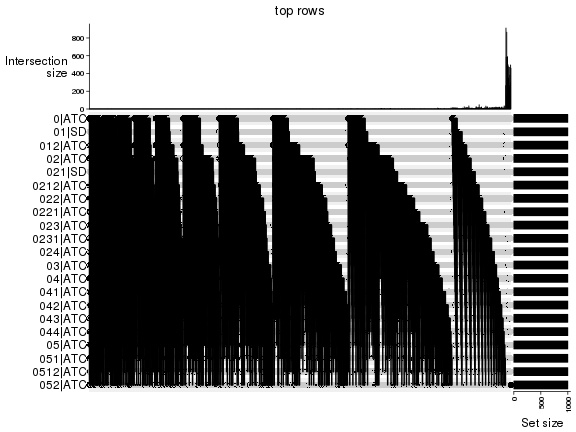


### UMAP plot

UMAP plot which shows how samples are separated.


<script>
$( function() {
	$( '#tabs-dimension-reduction-by-depth' ).tabs();
} );
</script>
<div id='tabs-dimension-reduction-by-depth'>
<ul>
<li><a href='#tab-dimension-reduction-by-depth-1'>n_signatures ≥ 1258</a></li>
<li><a href='#tab-dimension-reduction-by-depth-2'>n_signatures ≥ 1360</a></li>
<li><a href='#tab-dimension-reduction-by-depth-3'>n_signatures ≥ 1762</a></li>
<li><a href='#tab-dimension-reduction-by-depth-4'>n_signatures ≥ 1794</a></li>
<li><a href='#tab-dimension-reduction-by-depth-5'>n_signatures ≥ 2221</a></li>
<li><a href='#tab-dimension-reduction-by-depth-6'>n_signatures ≥ 2573</a></li>
<li><a href='#tab-dimension-reduction-by-depth-7'>n_signatures ≥ 3054</a></li>
<li><a href='#tab-dimension-reduction-by-depth-8'>n_signatures ≥ 3076</a></li>
<li><a href='#tab-dimension-reduction-by-depth-9'>n_signatures ≥ 3130</a></li>
<li><a href='#tab-dimension-reduction-by-depth-10'>n_signatures ≥ 3130</a></li>
<li><a href='#tab-dimension-reduction-by-depth-11'>n_signatures ≥ 4059</a></li>
<li><a href='#tab-dimension-reduction-by-depth-12'>n_signatures ≥ 4238</a></li>
<li><a href='#tab-dimension-reduction-by-depth-13'>n_signatures ≥ 5112</a></li>
<li><a href='#tab-dimension-reduction-by-depth-14'>n_signatures ≥ 5268</a></li>
<li><a href='#tab-dimension-reduction-by-depth-15'>n_signatures ≥ 5287</a></li>
<li><a href='#tab-dimension-reduction-by-depth-16'>n_signatures ≥ 6017</a></li>
<li><a href='#tab-dimension-reduction-by-depth-17'>n_signatures ≥ 6587</a></li>
<li><a href='#tab-dimension-reduction-by-depth-18'>n_signatures ≥ 11436</a></li>
<li><a href='#tab-dimension-reduction-by-depth-19'>n_signatures ≥ 14470</a></li>
<li><a href='#tab-dimension-reduction-by-depth-20'>n_signatures ≥ 15528</a></li>
<li><a href='#tab-dimension-reduction-by-depth-21'>n_signatures ≥ 33866</a></li>
</ul>
<div id='tab-dimension-reduction-by-depth-1'>
<pre><code class="r">par(mfrow = c(1, 2))
dimension_reduction(res_rh, merge_node = merge_node_param(min_n_signatures = 1258),
    method = &quot;UMAP&quot;, top_value_method = &quot;SD&quot;, top_n = 40000, scale_rows = FALSE)
dimension_reduction(res_rh, merge_node = merge_node_param(min_n_signatures = 1258),
    method = &quot;UMAP&quot;, top_value_method = &quot;ATC&quot;, top_n = 40000, scale_rows = TRUE)
</code></pre>

<p>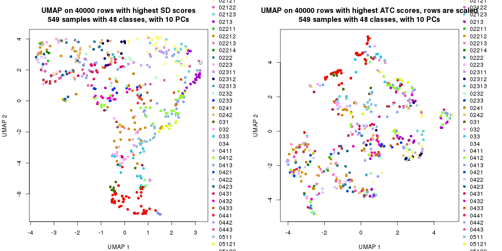</p>

</div>
<div id='tab-dimension-reduction-by-depth-2'>
<pre><code class="r">par(mfrow = c(1, 2))
dimension_reduction(res_rh, merge_node = merge_node_param(min_n_signatures = 1360),
    method = &quot;UMAP&quot;, top_value_method = &quot;SD&quot;, top_n = 40000, scale_rows = FALSE)
dimension_reduction(res_rh, merge_node = merge_node_param(min_n_signatures = 1360),
    method = &quot;UMAP&quot;, top_value_method = &quot;ATC&quot;, top_n = 40000, scale_rows = TRUE)
</code></pre>

<p>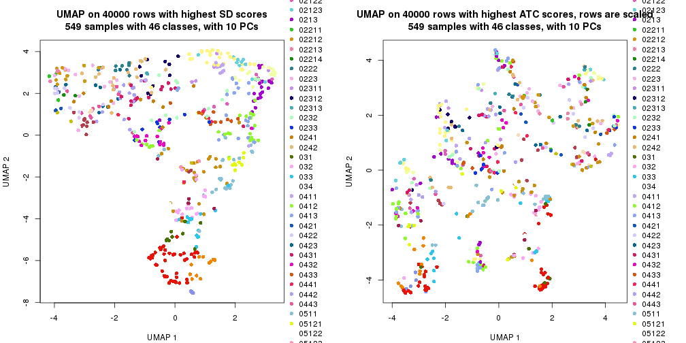</p>

</div>
<div id='tab-dimension-reduction-by-depth-3'>
<pre><code class="r">par(mfrow = c(1, 2))
dimension_reduction(res_rh, merge_node = merge_node_param(min_n_signatures = 1762),
    method = &quot;UMAP&quot;, top_value_method = &quot;SD&quot;, top_n = 40000, scale_rows = FALSE)
dimension_reduction(res_rh, merge_node = merge_node_param(min_n_signatures = 1762),
    method = &quot;UMAP&quot;, top_value_method = &quot;ATC&quot;, top_n = 40000, scale_rows = TRUE)
</code></pre>

<p>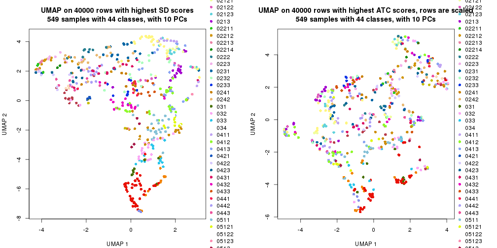</p>

</div>
<div id='tab-dimension-reduction-by-depth-4'>
<pre><code class="r">par(mfrow = c(1, 2))
dimension_reduction(res_rh, merge_node = merge_node_param(min_n_signatures = 1794),
    method = &quot;UMAP&quot;, top_value_method = &quot;SD&quot;, top_n = 40000, scale_rows = FALSE)
dimension_reduction(res_rh, merge_node = merge_node_param(min_n_signatures = 1794),
    method = &quot;UMAP&quot;, top_value_method = &quot;ATC&quot;, top_n = 40000, scale_rows = TRUE)
</code></pre>

<p>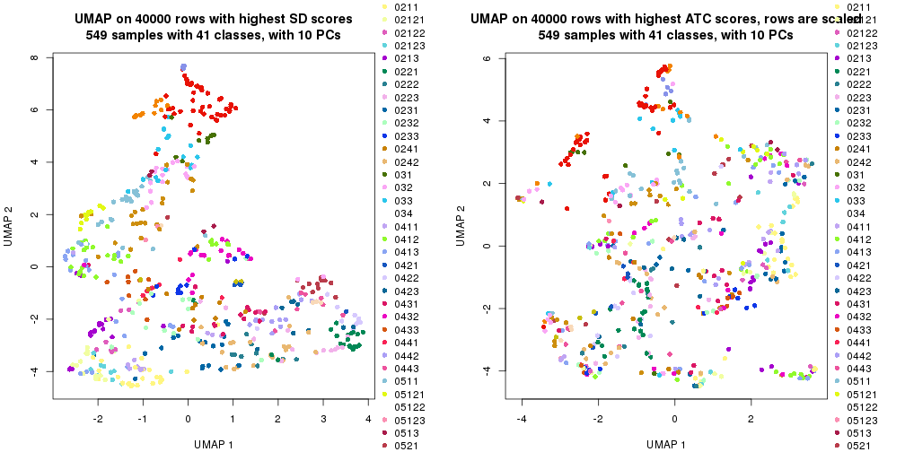</p>

</div>
<div id='tab-dimension-reduction-by-depth-5'>
<pre><code class="r">par(mfrow = c(1, 2))
dimension_reduction(res_rh, merge_node = merge_node_param(min_n_signatures = 2221),
    method = &quot;UMAP&quot;, top_value_method = &quot;SD&quot;, top_n = 40000, scale_rows = FALSE)
dimension_reduction(res_rh, merge_node = merge_node_param(min_n_signatures = 2221),
    method = &quot;UMAP&quot;, top_value_method = &quot;ATC&quot;, top_n = 40000, scale_rows = TRUE)
</code></pre>

<p></p>

</div>
<div id='tab-dimension-reduction-by-depth-6'>
<pre><code class="r">par(mfrow = c(1, 2))
dimension_reduction(res_rh, merge_node = merge_node_param(min_n_signatures = 2573),
    method = &quot;UMAP&quot;, top_value_method = &quot;SD&quot;, top_n = 40000, scale_rows = FALSE)
dimension_reduction(res_rh, merge_node = merge_node_param(min_n_signatures = 2573),
    method = &quot;UMAP&quot;, top_value_method = &quot;ATC&quot;, top_n = 40000, scale_rows = TRUE)
</code></pre>

<p>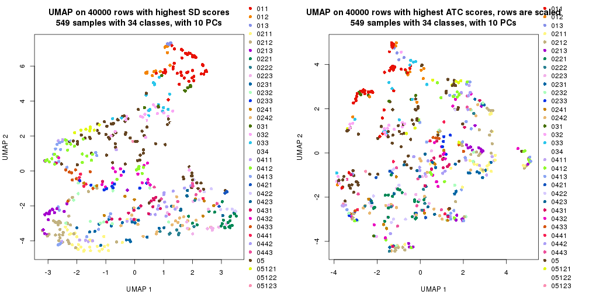</p>

</div>
<div id='tab-dimension-reduction-by-depth-7'>
<pre><code class="r">par(mfrow = c(1, 2))
dimension_reduction(res_rh, merge_node = merge_node_param(min_n_signatures = 3054),
    method = &quot;UMAP&quot;, top_value_method = &quot;SD&quot;, top_n = 40000, scale_rows = FALSE)
dimension_reduction(res_rh, merge_node = merge_node_param(min_n_signatures = 3054),
    method = &quot;UMAP&quot;, top_value_method = &quot;ATC&quot;, top_n = 40000, scale_rows = TRUE)
</code></pre>

<p>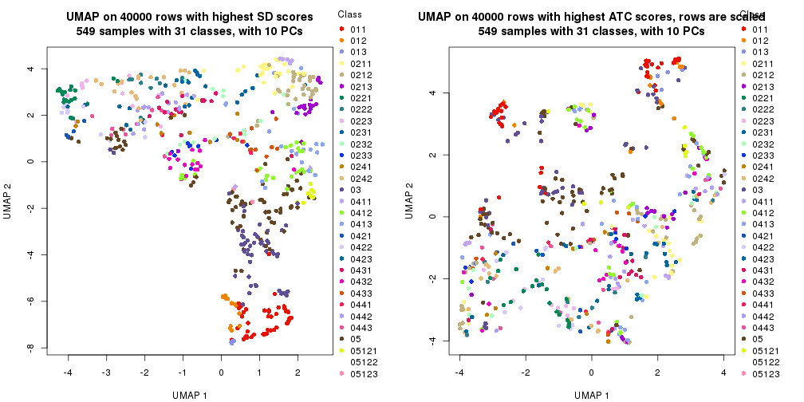</p>

</div>
<div id='tab-dimension-reduction-by-depth-8'>
<pre><code class="r">par(mfrow = c(1, 2))
dimension_reduction(res_rh, merge_node = merge_node_param(min_n_signatures = 3076),
    method = &quot;UMAP&quot;, top_value_method = &quot;SD&quot;, top_n = 40000, scale_rows = FALSE)
dimension_reduction(res_rh, merge_node = merge_node_param(min_n_signatures = 3076),
    method = &quot;UMAP&quot;, top_value_method = &quot;ATC&quot;, top_n = 40000, scale_rows = TRUE)
</code></pre>

<p>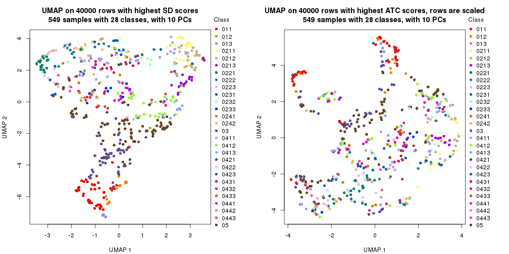</p>

</div>
<div id='tab-dimension-reduction-by-depth-9'>
<pre><code class="r">par(mfrow = c(1, 2))
dimension_reduction(res_rh, merge_node = merge_node_param(min_n_signatures = 3130),
    method = &quot;UMAP&quot;, top_value_method = &quot;SD&quot;, top_n = 40000, scale_rows = FALSE)
dimension_reduction(res_rh, merge_node = merge_node_param(min_n_signatures = 3130),
    method = &quot;UMAP&quot;, top_value_method = &quot;ATC&quot;, top_n = 40000, scale_rows = TRUE)
</code></pre>

<p>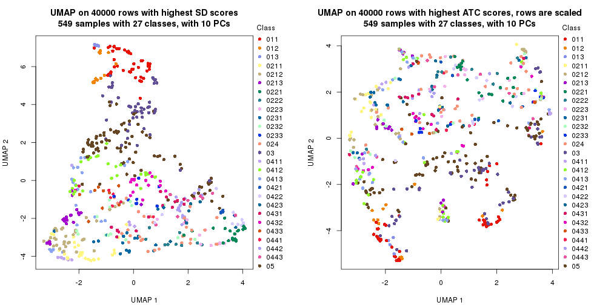</p>

</div>
<div id='tab-dimension-reduction-by-depth-10'>
<pre><code class="r">par(mfrow = c(1, 2))
dimension_reduction(res_rh, merge_node = merge_node_param(min_n_signatures = 3130),
    method = &quot;UMAP&quot;, top_value_method = &quot;SD&quot;, top_n = 40000, scale_rows = FALSE)
dimension_reduction(res_rh, merge_node = merge_node_param(min_n_signatures = 3130),
    method = &quot;UMAP&quot;, top_value_method = &quot;ATC&quot;, top_n = 40000, scale_rows = TRUE)
</code></pre>

<p>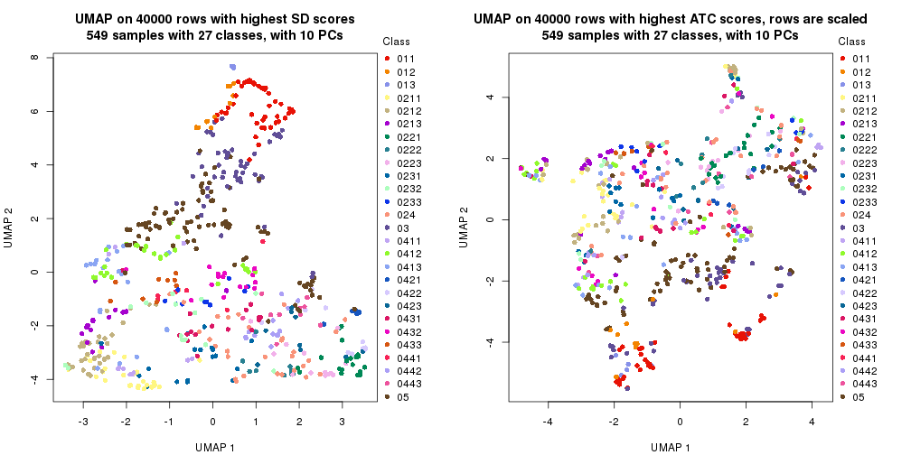</p>

</div>
<div id='tab-dimension-reduction-by-depth-11'>
<pre><code class="r">par(mfrow = c(1, 2))
dimension_reduction(res_rh, merge_node = merge_node_param(min_n_signatures = 4059),
    method = &quot;UMAP&quot;, top_value_method = &quot;SD&quot;, top_n = 40000, scale_rows = FALSE)
dimension_reduction(res_rh, merge_node = merge_node_param(min_n_signatures = 4059),
    method = &quot;UMAP&quot;, top_value_method = &quot;ATC&quot;, top_n = 40000, scale_rows = TRUE)
</code></pre>

<p>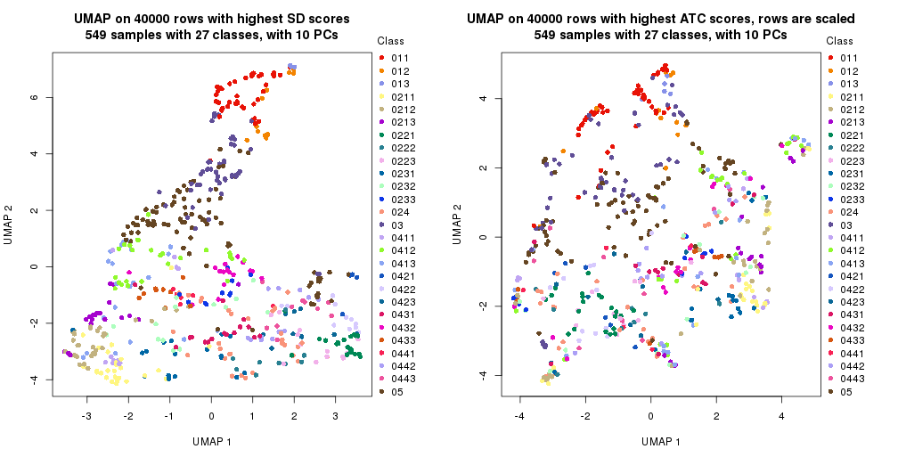</p>

</div>
<div id='tab-dimension-reduction-by-depth-12'>
<pre><code class="r">par(mfrow = c(1, 2))
dimension_reduction(res_rh, merge_node = merge_node_param(min_n_signatures = 4238),
    method = &quot;UMAP&quot;, top_value_method = &quot;SD&quot;, top_n = 40000, scale_rows = FALSE)
dimension_reduction(res_rh, merge_node = merge_node_param(min_n_signatures = 4238),
    method = &quot;UMAP&quot;, top_value_method = &quot;ATC&quot;, top_n = 40000, scale_rows = TRUE)
</code></pre>

<p>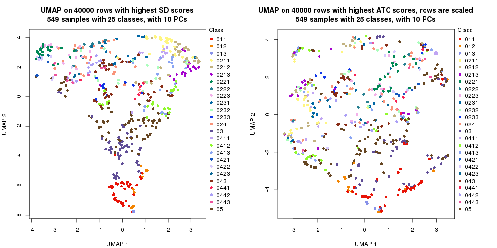</p>

</div>
<div id='tab-dimension-reduction-by-depth-13'>
<pre><code class="r">par(mfrow = c(1, 2))
dimension_reduction(res_rh, merge_node = merge_node_param(min_n_signatures = 5112),
    method = &quot;UMAP&quot;, top_value_method = &quot;SD&quot;, top_n = 40000, scale_rows = FALSE)
dimension_reduction(res_rh, merge_node = merge_node_param(min_n_signatures = 5112),
    method = &quot;UMAP&quot;, top_value_method = &quot;ATC&quot;, top_n = 40000, scale_rows = TRUE)
</code></pre>

<p>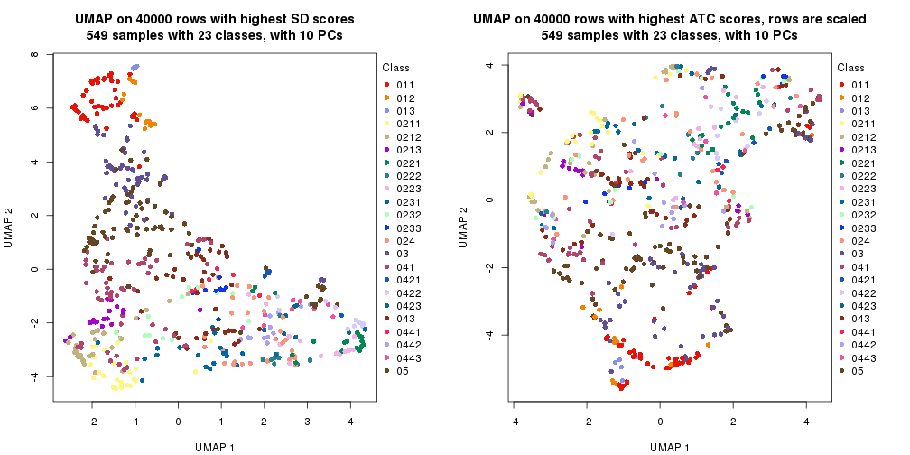</p>

</div>
<div id='tab-dimension-reduction-by-depth-14'>
<pre><code class="r">par(mfrow = c(1, 2))
dimension_reduction(res_rh, merge_node = merge_node_param(min_n_signatures = 5268),
    method = &quot;UMAP&quot;, top_value_method = &quot;SD&quot;, top_n = 40000, scale_rows = FALSE)
dimension_reduction(res_rh, merge_node = merge_node_param(min_n_signatures = 5268),
    method = &quot;UMAP&quot;, top_value_method = &quot;ATC&quot;, top_n = 40000, scale_rows = TRUE)
</code></pre>

<p>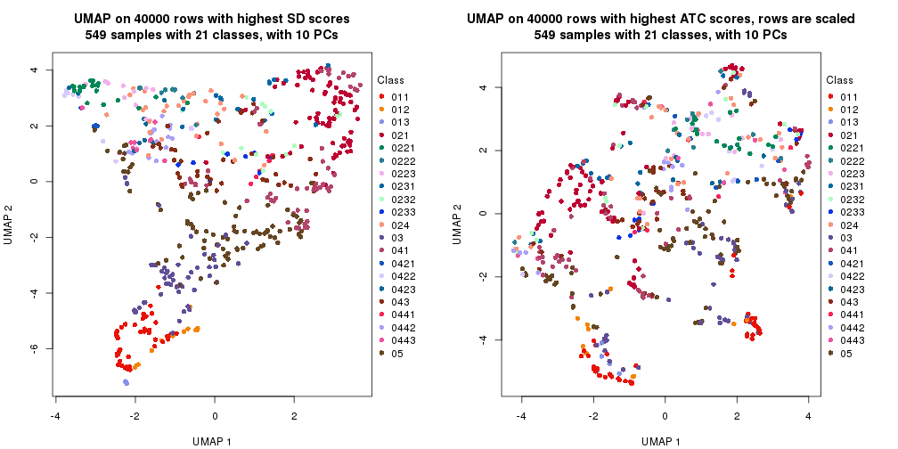</p>

</div>
<div id='tab-dimension-reduction-by-depth-15'>
<pre><code class="r">par(mfrow = c(1, 2))
dimension_reduction(res_rh, merge_node = merge_node_param(min_n_signatures = 5287),
    method = &quot;UMAP&quot;, top_value_method = &quot;SD&quot;, top_n = 40000, scale_rows = FALSE)
dimension_reduction(res_rh, merge_node = merge_node_param(min_n_signatures = 5287),
    method = &quot;UMAP&quot;, top_value_method = &quot;ATC&quot;, top_n = 40000, scale_rows = TRUE)
</code></pre>

<p>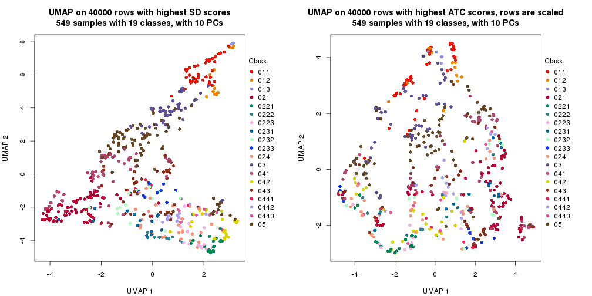</p>

</div>
<div id='tab-dimension-reduction-by-depth-16'>
<pre><code class="r">par(mfrow = c(1, 2))
dimension_reduction(res_rh, merge_node = merge_node_param(min_n_signatures = 6017),
    method = &quot;UMAP&quot;, top_value_method = &quot;SD&quot;, top_n = 40000, scale_rows = FALSE)
dimension_reduction(res_rh, merge_node = merge_node_param(min_n_signatures = 6017),
    method = &quot;UMAP&quot;, top_value_method = &quot;ATC&quot;, top_n = 40000, scale_rows = TRUE)
</code></pre>

<p>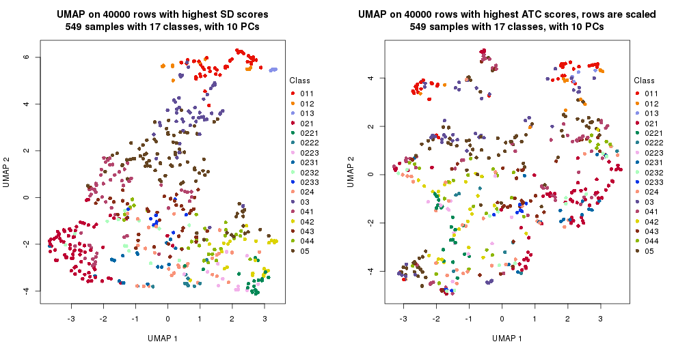</p>

</div>
<div id='tab-dimension-reduction-by-depth-17'>
<pre><code class="r">par(mfrow = c(1, 2))
dimension_reduction(res_rh, merge_node = merge_node_param(min_n_signatures = 6587),
    method = &quot;UMAP&quot;, top_value_method = &quot;SD&quot;, top_n = 40000, scale_rows = FALSE)
dimension_reduction(res_rh, merge_node = merge_node_param(min_n_signatures = 6587),
    method = &quot;UMAP&quot;, top_value_method = &quot;ATC&quot;, top_n = 40000, scale_rows = TRUE)
</code></pre>

<p>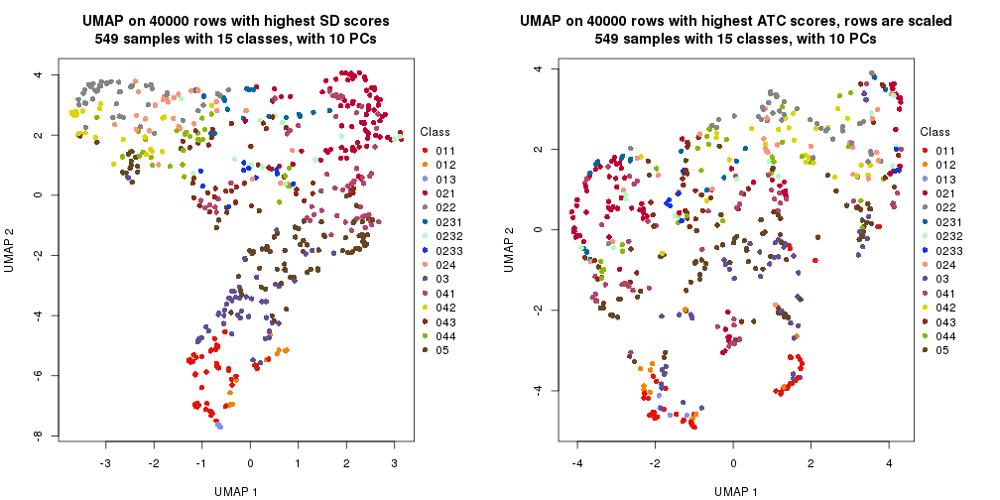</p>

</div>
<div id='tab-dimension-reduction-by-depth-18'>
<pre><code class="r">par(mfrow = c(1, 2))
dimension_reduction(res_rh, merge_node = merge_node_param(min_n_signatures = 11436),
    method = &quot;UMAP&quot;, top_value_method = &quot;SD&quot;, top_n = 40000, scale_rows = FALSE)
dimension_reduction(res_rh, merge_node = merge_node_param(min_n_signatures = 11436),
    method = &quot;UMAP&quot;, top_value_method = &quot;ATC&quot;, top_n = 40000, scale_rows = TRUE)
</code></pre>

<p>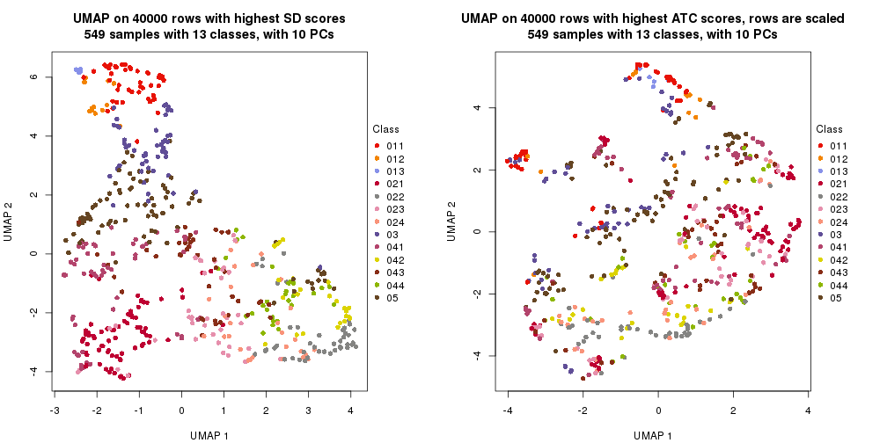</p>

</div>
<div id='tab-dimension-reduction-by-depth-19'>
<pre><code class="r">par(mfrow = c(1, 2))
dimension_reduction(res_rh, merge_node = merge_node_param(min_n_signatures = 14470),
    method = &quot;UMAP&quot;, top_value_method = &quot;SD&quot;, top_n = 40000, scale_rows = FALSE)
dimension_reduction(res_rh, merge_node = merge_node_param(min_n_signatures = 14470),
    method = &quot;UMAP&quot;, top_value_method = &quot;ATC&quot;, top_n = 40000, scale_rows = TRUE)
</code></pre>

<p>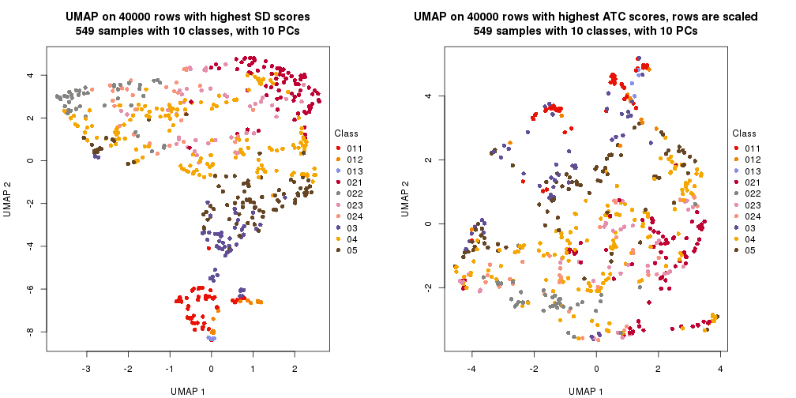</p>

</div>
<div id='tab-dimension-reduction-by-depth-20'>
<pre><code class="r">par(mfrow = c(1, 2))
dimension_reduction(res_rh, merge_node = merge_node_param(min_n_signatures = 15528),
    method = &quot;UMAP&quot;, top_value_method = &quot;SD&quot;, top_n = 40000, scale_rows = FALSE)
dimension_reduction(res_rh, merge_node = merge_node_param(min_n_signatures = 15528),
    method = &quot;UMAP&quot;, top_value_method = &quot;ATC&quot;, top_n = 40000, scale_rows = TRUE)
</code></pre>

<p>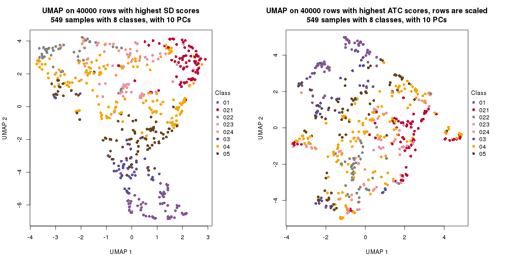</p>

</div>
<div id='tab-dimension-reduction-by-depth-21'>
<pre><code class="r">par(mfrow = c(1, 2))
dimension_reduction(res_rh, merge_node = merge_node_param(min_n_signatures = 33866),
    method = &quot;UMAP&quot;, top_value_method = &quot;SD&quot;, top_n = 40000, scale_rows = FALSE)
dimension_reduction(res_rh, merge_node = merge_node_param(min_n_signatures = 33866),
    method = &quot;UMAP&quot;, top_value_method = &quot;ATC&quot;, top_n = 40000, scale_rows = TRUE)
</code></pre>

<p>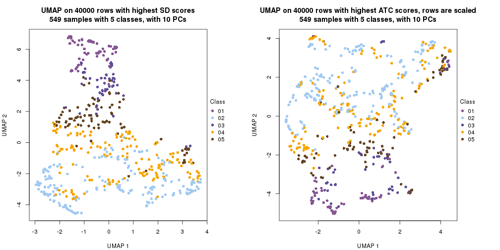</p>

</div>
</div>


### Signature heatmap

Signatures on the heatmap are the union of all signatures found on every node
on the hierarchy. The number of k-means on rows are automatically selected by the function.


<script>
$( function() {
	$( '#tabs-get-signatures-from-hierarchical-partition' ).tabs();
} );
</script>
<div id='tabs-get-signatures-from-hierarchical-partition'>
<ul>
<li><a href='#tab-get-signatures-from-hierarchical-partition-1'>n_signatures ≥ 1258</a></li>
<li><a href='#tab-get-signatures-from-hierarchical-partition-2'>n_signatures ≥ 1360</a></li>
<li><a href='#tab-get-signatures-from-hierarchical-partition-3'>n_signatures ≥ 1762</a></li>
<li><a href='#tab-get-signatures-from-hierarchical-partition-4'>n_signatures ≥ 1794</a></li>
<li><a href='#tab-get-signatures-from-hierarchical-partition-5'>n_signatures ≥ 2221</a></li>
<li><a href='#tab-get-signatures-from-hierarchical-partition-6'>n_signatures ≥ 2573</a></li>
<li><a href='#tab-get-signatures-from-hierarchical-partition-7'>n_signatures ≥ 3054</a></li>
<li><a href='#tab-get-signatures-from-hierarchical-partition-8'>n_signatures ≥ 3076</a></li>
<li><a href='#tab-get-signatures-from-hierarchical-partition-9'>n_signatures ≥ 3130</a></li>
<li><a href='#tab-get-signatures-from-hierarchical-partition-10'>n_signatures ≥ 3130</a></li>
<li><a href='#tab-get-signatures-from-hierarchical-partition-11'>n_signatures ≥ 4059</a></li>
<li><a href='#tab-get-signatures-from-hierarchical-partition-12'>n_signatures ≥ 4238</a></li>
<li><a href='#tab-get-signatures-from-hierarchical-partition-13'>n_signatures ≥ 5112</a></li>
<li><a href='#tab-get-signatures-from-hierarchical-partition-14'>n_signatures ≥ 5268</a></li>
<li><a href='#tab-get-signatures-from-hierarchical-partition-15'>n_signatures ≥ 5287</a></li>
<li><a href='#tab-get-signatures-from-hierarchical-partition-16'>n_signatures ≥ 6017</a></li>
<li><a href='#tab-get-signatures-from-hierarchical-partition-17'>n_signatures ≥ 6587</a></li>
<li><a href='#tab-get-signatures-from-hierarchical-partition-18'>n_signatures ≥ 11436</a></li>
<li><a href='#tab-get-signatures-from-hierarchical-partition-19'>n_signatures ≥ 14470</a></li>
<li><a href='#tab-get-signatures-from-hierarchical-partition-20'>n_signatures ≥ 15528</a></li>
<li><a href='#tab-get-signatures-from-hierarchical-partition-21'>n_signatures ≥ 33866</a></li>
</ul>
<div id='tab-get-signatures-from-hierarchical-partition-1'>
<pre><code class="r">get_signatures(res_rh, merge_node = merge_node_param(min_n_signatures = 1258))
</code></pre>

<p>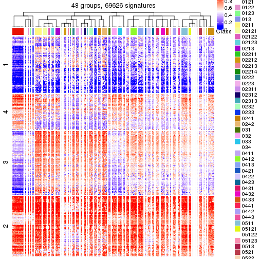</p>

</div>
<div id='tab-get-signatures-from-hierarchical-partition-2'>
<pre><code class="r">get_signatures(res_rh, merge_node = merge_node_param(min_n_signatures = 1360))
</code></pre>

<p>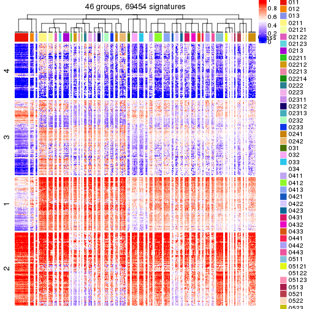</p>

</div>
<div id='tab-get-signatures-from-hierarchical-partition-3'>
<pre><code class="r">get_signatures(res_rh, merge_node = merge_node_param(min_n_signatures = 1762))
</code></pre>

<p>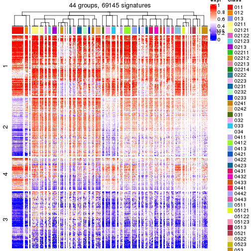</p>

</div>
<div id='tab-get-signatures-from-hierarchical-partition-4'>
<pre><code class="r">get_signatures(res_rh, merge_node = merge_node_param(min_n_signatures = 1794))
</code></pre>

<p>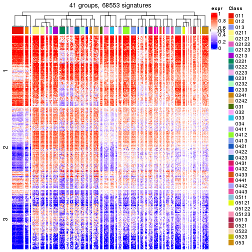</p>

</div>
<div id='tab-get-signatures-from-hierarchical-partition-5'>
<pre><code class="r">get_signatures(res_rh, merge_node = merge_node_param(min_n_signatures = 2221))
</code></pre>

<p>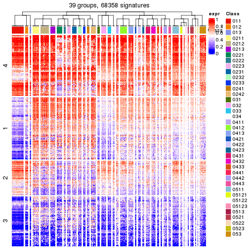</p>

</div>
<div id='tab-get-signatures-from-hierarchical-partition-6'>
<pre><code class="r">get_signatures(res_rh, merge_node = merge_node_param(min_n_signatures = 2573))
</code></pre>

<pre><code>#&gt; Error in lt[[hierarchy[i, 1]]]$AddChildNode({: attempt to apply non-function
</code></pre>

</div>
<div id='tab-get-signatures-from-hierarchical-partition-7'>
<pre><code class="r">get_signatures(res_rh, merge_node = merge_node_param(min_n_signatures = 3054))
</code></pre>

<pre><code>#&gt; Error in lt[[hierarchy[i, 1]]]$AddChildNode({: attempt to apply non-function
</code></pre>

</div>
<div id='tab-get-signatures-from-hierarchical-partition-8'>
<pre><code class="r">get_signatures(res_rh, merge_node = merge_node_param(min_n_signatures = 3076))
</code></pre>

<p>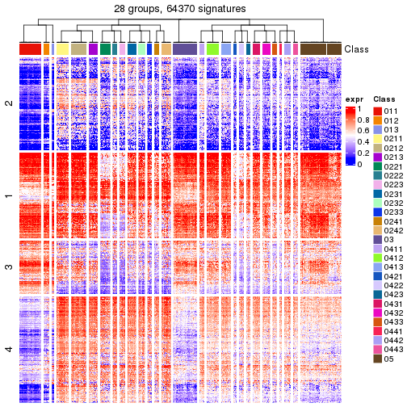</p>

</div>
<div id='tab-get-signatures-from-hierarchical-partition-9'>
<pre><code class="r">get_signatures(res_rh, merge_node = merge_node_param(min_n_signatures = 3130))
</code></pre>

<p>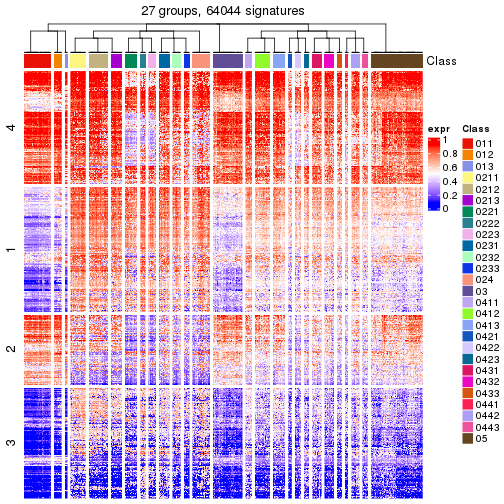</p>

</div>
<div id='tab-get-signatures-from-hierarchical-partition-10'>
<pre><code class="r">get_signatures(res_rh, merge_node = merge_node_param(min_n_signatures = 3130))
</code></pre>

<p></p>

</div>
<div id='tab-get-signatures-from-hierarchical-partition-11'>
<pre><code class="r">get_signatures(res_rh, merge_node = merge_node_param(min_n_signatures = 4059))
</code></pre>

<p></p>

</div>
<div id='tab-get-signatures-from-hierarchical-partition-12'>
<pre><code class="r">get_signatures(res_rh, merge_node = merge_node_param(min_n_signatures = 4238))
</code></pre>

<p>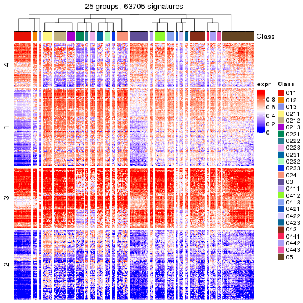</p>

</div>
<div id='tab-get-signatures-from-hierarchical-partition-13'>
<pre><code class="r">get_signatures(res_rh, merge_node = merge_node_param(min_n_signatures = 5112))
</code></pre>

<p>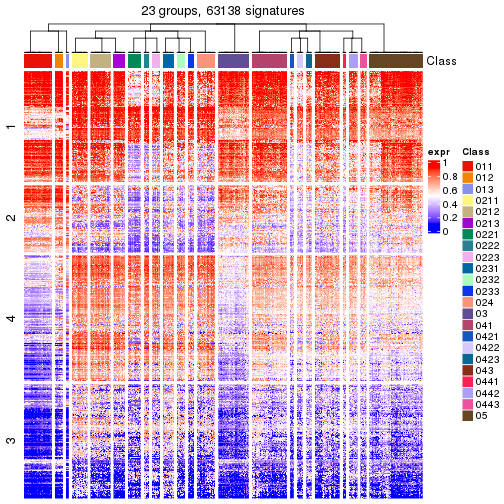</p>

</div>
<div id='tab-get-signatures-from-hierarchical-partition-14'>
<pre><code class="r">get_signatures(res_rh, merge_node = merge_node_param(min_n_signatures = 5268))
</code></pre>

<p>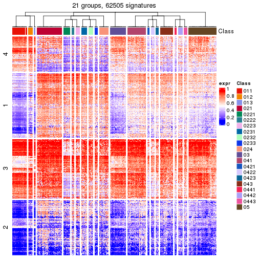</p>

</div>
<div id='tab-get-signatures-from-hierarchical-partition-15'>
<pre><code class="r">get_signatures(res_rh, merge_node = merge_node_param(min_n_signatures = 5287))
</code></pre>

<p>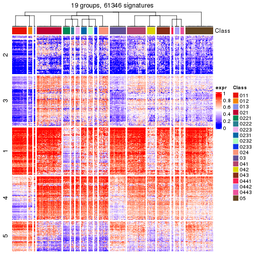</p>

</div>
<div id='tab-get-signatures-from-hierarchical-partition-16'>
<pre><code class="r">get_signatures(res_rh, merge_node = merge_node_param(min_n_signatures = 6017))
</code></pre>

<p>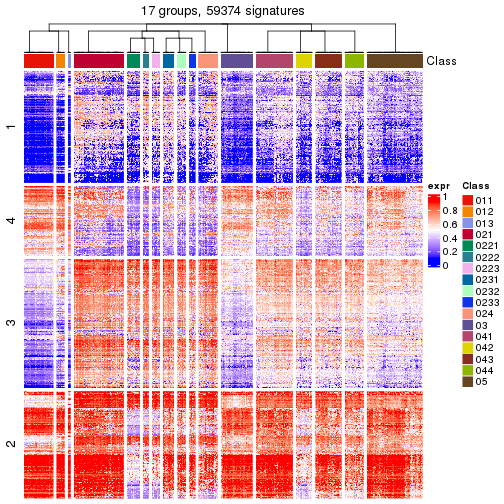</p>

</div>
<div id='tab-get-signatures-from-hierarchical-partition-17'>
<pre><code class="r">get_signatures(res_rh, merge_node = merge_node_param(min_n_signatures = 6587))
</code></pre>

<p>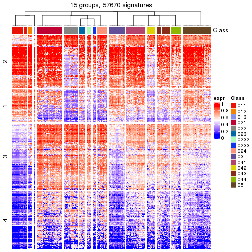</p>

</div>
<div id='tab-get-signatures-from-hierarchical-partition-18'>
<pre><code class="r">get_signatures(res_rh, merge_node = merge_node_param(min_n_signatures = 11436))
</code></pre>

<p>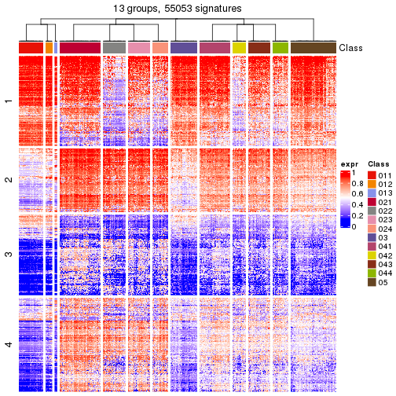</p>

</div>
<div id='tab-get-signatures-from-hierarchical-partition-19'>
<pre><code class="r">get_signatures(res_rh, merge_node = merge_node_param(min_n_signatures = 14470))
</code></pre>

<p>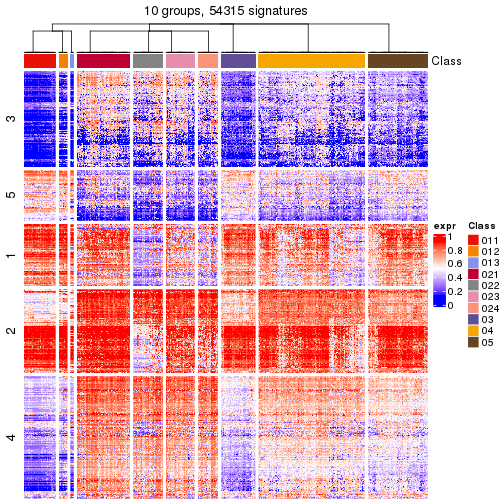</p>

</div>
<div id='tab-get-signatures-from-hierarchical-partition-20'>
<pre><code class="r">get_signatures(res_rh, merge_node = merge_node_param(min_n_signatures = 15528))
</code></pre>

<p>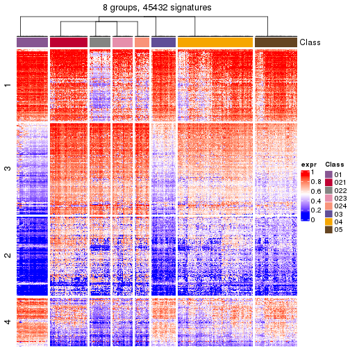</p>

</div>
<div id='tab-get-signatures-from-hierarchical-partition-21'>
<pre><code class="r">get_signatures(res_rh, merge_node = merge_node_param(min_n_signatures = 33866))
</code></pre>

<p>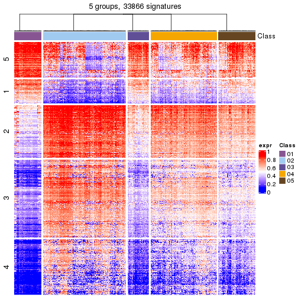</p>

</div>
</div>


Compare signatures from different nodes:


```r
compare_signatures(res_rh, verbose = FALSE)
```

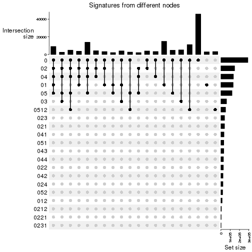

If there are too many signatures, `top_signatures = ...` can be set to only show the 
signatures with the highest FDRs. Note it only works on every node and the final signatures
are the union of all signatures of all nodes.


```r
# code only for demonstration
# e.g. to show the top 500 most significant rows on each node.
tb = get_signature(res_rh, top_signatures = 500)
```


## Results for each node


---------------------------------------------------


### Node0


Child nodes: 
                [Node01](#Node01)
        ,
                [Node02](#Node02)
        ,
                [Node03](#Node03)
        ,
                [Node04](#Node04)
        ,
                [Node05](#Node05)
        .


The object with results only for a single top-value method and a single partitioning method 
can be extracted as:

```r
res = res_rh["0"]
```

A summary of `res` and all the functions that can be applied to it:

```r
res
```

```
#> A 'DownSamplingConsensusPartition' object with k = 2, 3, 4, 5, 6, 7, 8.
#>   On a matrix with 376220 rows and 500 columns, randomly sampled from 549 columns.
#>   Top rows (1000) are extracted by 'ATC' method.
#>   Subgroups are detected by 'skmeans' method.
#>   Performed in total 350 partitions by row resampling.
#>   Best k for subgroups seems to be 5.
#> 
#> Following methods can be applied to this 'DownSamplingConsensusPartition' object:
#>  [1] "cola_report"             "collect_classes"         "collect_plots"          
#>  [4] "collect_stats"           "colnames"                "compare_partitions"     
#>  [7] "compare_signatures"      "consensus_heatmap"       "dimension_reduction"    
#> [10] "functional_enrichment"   "get_anno_col"            "get_anno"               
#> [13] "get_classes"             "get_consensus"           "get_matrix"             
#> [16] "get_membership"          "get_param"               "get_signatures"         
#> [19] "get_stats"               "is_best_k"               "is_stable_k"            
#> [22] "membership_heatmap"      "ncol"                    "nrow"                   
#> [25] "plot_ecdf"               "predict_classes"         "rownames"               
#> [28] "select_partition_number" "show"                    "suggest_best_k"         
#> [31] "test_to_known_factors"   "top_rows_heatmap"
```

`collect_plots()` function collects all the plots made from `res` for all `k` (number of subgroups)
into one single page to provide an easy and fast comparison between different `k`.

```r
collect_plots(res)
```

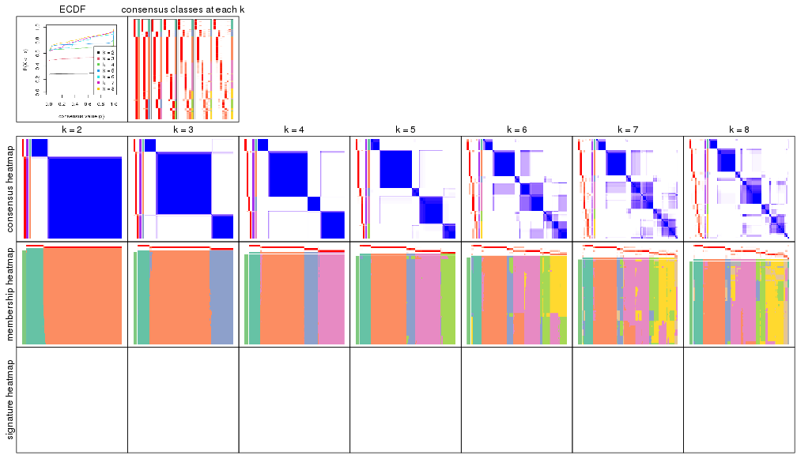

The plots are:

- The first row: a plot of the eCDF (empirical cumulative distribution
  function) curves of the consensus matrix for each `k` and the heatmap of
  predicted classes for each `k`.
- The second row: heatmaps of the consensus matrix for each `k`.
- The third row: heatmaps of the membership matrix for each `k`.
- The fouth row: heatmaps of the signatures for each `k`.

All the plots in panels can be made by individual functions and they are
plotted later in this section.

`select_partition_number()` produces several plots showing different
statistics for choosing "optimized" `k`. There are following statistics:

- eCDF curves of the consensus matrix for each `k`;
- 1-PAC. [The PAC score](https://en.wikipedia.org/wiki/Consensus_clustering#Over-interpretation_potential_of_consensus_clustering)
  measures the proportion of the ambiguous subgrouping.
- Mean silhouette score.
- Concordance. The mean probability of fiting the consensus subgroup labels in all
  partitions.
- Area increased. Denote $A_k$ as the area under the eCDF curve for current
  `k`, the area increased is defined as $A_k - A_{k-1}$.
- Rand index. The percent of pairs of samples that are both in a same cluster
  or both are not in a same cluster in the partition of k and k-1.
- Jaccard index. The ratio of pairs of samples are both in a same cluster in
  the partition of k and k-1 and the pairs of samples are both in a same
  cluster in the partition k or k-1.

The detailed explanations of these statistics can be found in [the _cola_
vignette](https://jokergoo.github.io/cola_vignettes/cola.html#toc_13).

Generally speaking, higher 1-PAC score, higher mean silhouette score or higher
concordance corresponds to better partition. Rand index and Jaccard index
measure how similar the current partition is compared to partition with `k-1`.
If they are too similar, we won't accept `k` is better than `k-1`.

```r
select_partition_number(res)
```

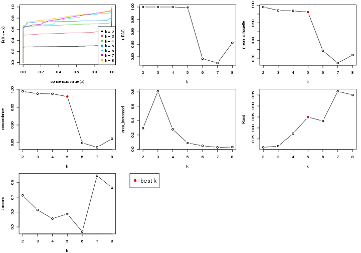

The numeric values for all these statistics can be obtained by `get_stats()`.

```r
get_stats(res)
```

```
#>   k 1-PAC mean_silhouette concordance area_increased  Rand Jaccard
#> 2 2 1.000           0.990       0.996         0.2942 0.712   0.712
#> 3 3 1.000           0.970       0.989         0.8078 0.718   0.614
#> 4 4 1.000           0.968       0.988         0.2786 0.774   0.556
#> 5 5 0.998           0.961       0.981         0.0881 0.849   0.588
#> 6 6 0.792           0.742       0.849         0.0495 0.832   0.468
#> 7 7 0.775           0.673       0.836         0.0276 0.966   0.845
#> 8 8 0.856           0.718       0.861         0.0321 0.950   0.764
```

`suggest_best_k()` suggests the best $k$ based on these statistics. The rules are as follows:

- All $k$ with Jaccard index larger than 0.95 are removed because increasing
  $k$ does not provide enough extra information. If all $k$ are removed, it is
  marked as no subgroup is detected.
- For all $k$ with 1-PAC score larger than 0.9, the maximal $k$ is taken as
  the best $k$, and other $k$ are marked as optional $k$.
- If it does not fit the second rule. The $k$ with the maximal vote of the
  highest 1-PAC score, highest mean silhouette, and highest concordance is
  taken as the best $k$.

```r
suggest_best_k(res)
```

```
#> [1] 5
#> attr(,"optional")
#> [1] 2 3 4
```

There is also optional best $k$ = 2 3 4 that is worth to check.

Following is the table of the partitions (You need to click the **show/hide
code output** link to see it). The membership matrix (columns with name `p*`)
is inferred by
[`clue::cl_consensus()`](https://www.rdocumentation.org/link/cl_consensus?package=clue)
function with the `SE` method. Basically the value in the membership matrix
represents the probability to belong to a certain group. The finall subgroup
label for an item is determined with the group with highest probability it
belongs to.

In `get_classes()` function, the entropy is calculated from the membership
matrix and the silhouette score is calculated from the consensus matrix.


<script>
$( function() {
	$( '#tabs-node-0-get-classes' ).tabs();
} );
</script>
<div id='tabs-node-0-get-classes'>
<ul>
<li><a href='#tab-node-0-get-classes-1'>k = 2</a></li>
<li><a href='#tab-node-0-get-classes-2'>k = 3</a></li>
<li><a href='#tab-node-0-get-classes-3'>k = 4</a></li>
<li><a href='#tab-node-0-get-classes-4'>k = 5</a></li>
<li><a href='#tab-node-0-get-classes-5'>k = 6</a></li>
<li><a href='#tab-node-0-get-classes-6'>k = 7</a></li>
<li><a href='#tab-node-0-get-classes-7'>k = 8</a></li>
</ul>

<div id='tab-node-0-get-classes-1'>
<p><a id='tab-node-0-get-classes-1-a' style='color:#0366d6' href='#'>show/hide code output</a></p>
<pre><code class="r">get_classes(res, k = 2)
</code></pre>

<pre><code>#&gt;                 class p
#&gt; TCGA.G9.6343.01     2 0
#&gt; TCGA.KK.A8IA.01     2 0
#&gt; TCGA.KK.A6E4.01     2 0
#&gt; TCGA.EJ.AB20.01     1 0
#&gt; TCGA.H9.7775.01     2 0
#&gt; TCGA.XJ.A9DX.01     2 0
#&gt; TCGA.KK.A6E6.01     2 0
#&gt; TCGA.G9.6339.01     2 0
#&gt; TCGA.EJ.5509.01     2 0
#&gt; TCGA.EJ.5521.01     2 0
#&gt; TCGA.YL.A8SB.01     2 0
#&gt; TCGA.V1.A9OF.01     2 0
#&gt; TCGA.CH.5754.01     2 0
#&gt; TCGA.EJ.7125.01     2 0
#&gt; TCGA.EJ.7797.01     2 0
#&gt; TCGA.YL.A9WI.01     2 0
#&gt; TCGA.EJ.7314.01     2 0
#&gt; TCGA.XA.A8JR.01     2 0
#&gt; TCGA.EJ.7781.01     2 0
#&gt; TCGA.QU.A6IN.01     2 0
#&gt; TCGA.CH.5751.01     2 0
#&gt; TCGA.V1.A8WL.01     2 0
#&gt; TCGA.HC.A6AO.01     2 0
#&gt; TCGA.KK.A7B3.01     2 0
#&gt; TCGA.XK.AAJT.01     2 0
#&gt; TCGA.EJ.AB27.01     1 0
#&gt; TCGA.CH.5788.01     2 0
#&gt; TCGA.KK.A8I5.01     2 0
#&gt; TCGA.YL.A8S9.01     2 0
#&gt; TCGA.CH.5761.01     2 0
#&gt; TCGA.KK.A7AZ.01     2 0
#&gt; TCGA.G9.6366.01     2 0
#&gt; TCGA.HC.7819.01     2 0
#&gt; TCGA.KC.A4BN.01     2 0
#&gt; TCGA.KK.A8IG.01     2 0
#&gt; TCGA.ZG.A8QW.01     2 0
#&gt; TCGA.EJ.7786.01     2 0
#&gt; TCGA.J4.A83K.01     2 0
#&gt; TCGA.YL.A8HK.01     2 0
#&gt; TCGA.EJ.5501.01     2 0
#&gt; TCGA.EJ.8470.01     2 0
#&gt; TCGA.J9.A8CL.01     2 0
#&gt; TCGA.EJ.A7NF.01     2 0
#&gt; TCGA.CH.5762.11     1 0
#&gt; TCGA.XK.AAJA.01     2 0
#&gt; TCGA.EJ.7330.01     2 0
#&gt; TCGA.VP.AA1N.01     2 0
#&gt; TCGA.EJ.5524.01     2 0
#&gt; TCGA.KK.A6E8.01     2 0
#&gt; TCGA.HC.7821.01     2 0
#&gt; TCGA.HC.7209.01     2 0
#&gt; TCGA.HC.7742.01     2 0
#&gt; TCGA.G9.6351.01     2 0
#&gt; TCGA.EJ.8474.01     2 0
#&gt; TCGA.HC.7075.01     2 0
#&gt; TCGA.J9.A8CP.01     2 0
#&gt; TCGA.KK.A8IM.01     2 0
#&gt; TCGA.G9.6348.01     2 0
#&gt; TCGA.CH.5789.01     1 0
#&gt; TCGA.KC.A7F6.01     2 0
#&gt; TCGA.G9.6333.11     1 0
#&gt; TCGA.KC.A4BL.01     1 0
#&gt; TCGA.J4.A67Q.01     2 0
#&gt; TCGA.2A.A8VL.01     2 0
#&gt; TCGA.V1.A9ZK.01     2 0
#&gt; TCGA.V1.A9O5.01     2 0
#&gt; TCGA.VP.A879.01     2 0
#&gt; TCGA.HC.7819.11     1 0
#&gt; TCGA.VN.A88Q.01     2 0
#&gt; TCGA.HC.7737.01     2 0
#&gt; TCGA.V1.A8WS.01     2 0
#&gt; TCGA.HC.8213.01     2 0
#&gt; TCGA.M7.A721.01     2 0
#&gt; TCGA.ZG.A9LZ.01     2 0
#&gt; TCGA.CH.5765.01     2 0
#&gt; TCGA.V1.A8WW.01     2 0
#&gt; TCGA.HC.A48F.01     2 0
#&gt; TCGA.V1.A9OQ.01     2 0
#&gt; TCGA.EJ.5514.01     2 0
#&gt; TCGA.G9.6384.01     2 0
#&gt; TCGA.V1.A9ZG.01     2 0
#&gt; TCGA.YL.A8HM.01     2 0
#&gt; TCGA.G9.6377.01     2 0
#&gt; TCGA.M7.A722.01     2 0
#&gt; TCGA.G9.6361.01     2 0
#&gt; TCGA.EJ.5511.01     2 0
#&gt; TCGA.ZG.A9KY.01     2 0
#&gt; TCGA.EJ.7784.11     1 0
#&gt; TCGA.ZG.A9LN.01     2 0
#&gt; TCGA.EJ.5526.01     2 0
#&gt; TCGA.HC.7820.11     1 0
#&gt; TCGA.YJ.A8SW.01     2 0
#&gt; TCGA.EJ.7794.01     2 0
#&gt; TCGA.EJ.A46B.01     1 0
#&gt; TCGA.EJ.5542.01     2 0
#&gt; TCGA.YL.A9WJ.01     2 0
#&gt; TCGA.EJ.7328.11     1 0
#&gt; TCGA.V1.A9Z8.01     2 0
#&gt; TCGA.EJ.A46F.01     2 0
#&gt; TCGA.YL.A8SK.01     2 0
#&gt; TCGA.MG.AAMC.01     2 0
#&gt; TCGA.X4.A8KS.01     1 0
#&gt; TCGA.J4.A67M.01     2 0
#&gt; TCGA.ZG.A9L0.01     2 0
#&gt; TCGA.HC.7077.01     2 0
#&gt; TCGA.CH.5769.01     2 0
#&gt; TCGA.G9.6353.11     1 0
#&gt; TCGA.G9.6499.01     2 0
#&gt; TCGA.EJ.5519.01     2 0
#&gt; TCGA.J4.A67T.01     2 0
#&gt; TCGA.HC.7748.01     2 0
#&gt; TCGA.VN.A88R.01     2 0
#&gt; TCGA.H9.A6BY.01     2 0
#&gt; TCGA.G9.6365.01     2 0
#&gt; TCGA.EJ.7317.11     1 0
#&gt; TCGA.G9.7510.01     2 0
#&gt; TCGA.KK.A6E3.01     2 0
#&gt; TCGA.G9.6336.01     2 1
#&gt; TCGA.EJ.5517.01     2 0
#&gt; TCGA.V1.A8MG.01     2 0
#&gt; TCGA.KC.A7FE.01     1 0
#&gt; TCGA.HC.7817.01     1 1
#&gt; TCGA.J4.AAU2.01     2 0
#&gt; TCGA.V1.A8MJ.01     2 1
#&gt; TCGA.VP.A87C.01     2 0
#&gt; TCGA.EJ.A7NN.01     2 0
#&gt; TCGA.HC.A8D0.01     1 0
#&gt; TCGA.EJ.7792.11     1 0
#&gt; TCGA.EJ.5497.01     2 0
#&gt; TCGA.Y6.A9XI.01     2 0
#&gt; TCGA.HC.7752.11     1 0
#&gt; TCGA.SU.A7E7.01     2 1
#&gt; TCGA.G9.6342.11     1 0
#&gt; TCGA.HC.8265.01     2 0
#&gt; TCGA.CH.5737.01     2 0
#&gt; TCGA.G9.6338.01     2 0
#&gt; TCGA.KK.A7AV.01     2 0
#&gt; TCGA.EJ.7218.01     2 0
#&gt; TCGA.YL.A8SC.01     2 0
#&gt; TCGA.XK.AAJR.01     2 0
#&gt; TCGA.2A.AAYF.01     2 0
#&gt; TCGA.V1.A8X3.01     2 0
#&gt; TCGA.KK.A6DY.01     2 0
#&gt; TCGA.M7.A71Z.01     2 0
#&gt; TCGA.EJ.7123.11     1 0
#&gt; TCGA.G9.6363.11     2 0
#&gt; TCGA.KK.A8I8.01     2 0
#&gt; TCGA.KC.A4BV.01     2 0
#&gt; TCGA.G9.6332.11     1 0
#&gt; TCGA.CH.5750.01     2 0
#&gt; TCGA.ZG.A9ND.01     2 0
#&gt; TCGA.EJ.A65B.01     1 0
#&gt; TCGA.QU.A6IO.01     2 0
#&gt; TCGA.EJ.5503.01     1 0
#&gt; TCGA.ZG.A9LU.01     1 0
#&gt; TCGA.EJ.8469.01     2 0
#&gt; TCGA.XJ.A83H.01     2 0
#&gt; TCGA.EJ.7315.01     2 0
#&gt; TCGA.ZG.A8QY.01     2 0
#&gt; TCGA.YL.A8SP.01     2 0
#&gt; TCGA.CH.5791.01     2 0
#&gt; TCGA.V1.A9OY.01     2 0
#&gt; TCGA.KC.A4BO.01     1 0
#&gt; TCGA.HC.A76X.01     2 0
#&gt; TCGA.YL.A8SO.01     2 0
#&gt; TCGA.KK.A8IF.01     2 0
#&gt; TCGA.EJ.A7NK.01     1 0
#&gt; TCGA.ZG.A9L4.01     2 0
#&gt; TCGA.EJ.5522.01     2 0
#&gt; TCGA.HC.7747.01     2 0
#&gt; TCGA.EJ.7125.11     1 0
#&gt; TCGA.ZG.A9M4.01     2 0
#&gt; TCGA.EJ.A65D.01     2 0
#&gt; TCGA.HC.A4ZV.01     2 0
#&gt; TCGA.G9.A9S0.01     2 0
#&gt; TCGA.EJ.5506.01     1 0
#&gt; TCGA.KK.A7AP.01     2 0
#&gt; TCGA.VP.A87D.01     2 0
#&gt; TCGA.TP.A8TT.01     2 0
#&gt; TCGA.KK.A8II.01     2 0
#&gt; TCGA.V1.A9Z9.01     2 0
#&gt; TCGA.ZG.A9LS.01     2 0
#&gt; TCGA.HC.7232.01     2 0
#&gt; TCGA.EJ.A8FO.01     1 0
#&gt; TCGA.J9.A52B.01     2 0
#&gt; TCGA.CH.5767.01     2 0
#&gt; TCGA.J4.AATV.01     1 0
#&gt; TCGA.HC.7081.01     2 0
#&gt; TCGA.CH.5743.01     1 0
#&gt; TCGA.V1.A9OH.01     2 0
#&gt; TCGA.CH.5752.01     2 0
#&gt; TCGA.VP.A87H.01     2 0
#&gt; TCGA.G9.7521.01     2 0
#&gt; TCGA.YL.A8HO.01     2 0
#&gt; TCGA.YL.A9WK.01     2 0
#&gt; TCGA.J4.A83M.01     2 0
#&gt; TCGA.VP.A878.01     2 0
#&gt; TCGA.CH.5766.11     1 0
#&gt; TCGA.HC.7736.01     2 0
#&gt; TCGA.G9.6385.01     1 0
#&gt; TCGA.VN.A88N.01     2 0
#&gt; TCGA.HC.7745.01     2 0
#&gt; TCGA.HC.7078.01     2 0
#&gt; TCGA.FC.A5OB.01     2 0
#&gt; TCGA.G9.6379.01     2 0
#&gt; TCGA.QU.A6IP.01     2 0
#&gt; TCGA.J4.AATZ.01     2 0
#&gt; TCGA.V1.A9O9.01     2 0
#&gt; TCGA.V1.A9OL.01     2 0
#&gt; TCGA.HC.7210.01     2 0
#&gt; TCGA.KK.A8I7.01     1 0
#&gt; TCGA.EJ.7791.01     1 0
#&gt; TCGA.CH.5762.01     2 0
#&gt; TCGA.EJ.5527.01     2 0
#&gt; TCGA.KK.A8IC.01     1 0
#&gt; TCGA.G9.6356.01     2 0
#&gt; TCGA.J9.A52D.01     2 0
#&gt; TCGA.EJ.7788.01     2 0
#&gt; TCGA.ZG.A9LB.01     2 0
#&gt; TCGA.J9.A8CN.01     2 0
#&gt; TCGA.ZG.A9L1.01     2 0
#&gt; TCGA.G9.6333.01     2 0
#&gt; TCGA.VP.A875.01     2 0
#&gt; TCGA.EJ.8468.01     2 0
#&gt; TCGA.EJ.5495.01     2 0
#&gt; TCGA.H9.A6BX.01     1 0
#&gt; TCGA.KK.A59Y.01     2 0
#&gt; TCGA.V1.A8WN.01     2 0
#&gt; TCGA.KK.A7B1.01     2 0
#&gt; TCGA.G9.6362.11     2 0
#&gt; TCGA.G9.6364.11     1 0
#&gt; TCGA.HC.A631.01     2 0
#&gt; TCGA.YL.A8SA.01     2 0
#&gt; TCGA.HC.8262.01     2 0
#&gt; TCGA.CH.5765.11     1 0
#&gt; TCGA.KC.A7FD.01     2 0
#&gt; TCGA.HI.7170.01     2 0
#&gt; TCGA.J4.A67L.01     2 0
#&gt; TCGA.V1.A9O7.01     2 1
#&gt; TCGA.HC.A6AS.01     2 0
#&gt; TCGA.EJ.7784.01     2 0
#&gt; TCGA.EJ.7331.11     1 0
#&gt; TCGA.KC.A7F3.01     2 0
#&gt; TCGA.G9.6494.11     1 0
#&gt; TCGA.HC.8256.01     2 0
#&gt; TCGA.J4.A83I.01     2 0
#&gt; TCGA.G9.6373.01     2 0
#&gt; TCGA.EJ.7794.11     1 0
#&gt; TCGA.G9.6371.01     2 0
#&gt; TCGA.XQ.A8TA.01     2 0
#&gt; TCGA.EJ.5498.01     2 1
#&gt; TCGA.EJ.7328.01     2 0
#&gt; TCGA.EJ.A46D.01     1 0
#&gt; TCGA.ZG.A9L9.01     2 0
#&gt; TCGA.YL.A8SI.01     2 0
#&gt; TCGA.M7.A724.01     2 0
#&gt; TCGA.VN.A88K.01     2 0
#&gt; TCGA.EJ.A8FP.01     1 0
#&gt; TCGA.V1.A8MK.01     1 0
#&gt; TCGA.YL.A8HJ.01     2 1
#&gt; TCGA.KK.A8ID.01     2 0
#&gt; TCGA.CH.5769.11     2 0
#&gt; TCGA.G9.6353.01     1 0
#&gt; TCGA.G9.6499.11     2 0
#&gt; TCGA.KK.A8I9.01     2 0
#&gt; TCGA.G9.6365.11     1 0
#&gt; TCGA.EJ.A46H.01     1 0
#&gt; TCGA.EJ.7317.01     2 0
#&gt; TCGA.YL.A8S8.01     2 0
#&gt; TCGA.XJ.A9DQ.01     1 0
#&gt; TCGA.EJ.7782.11     1 0
#&gt; TCGA.J4.A67O.01     2 0
#&gt; TCGA.Y6.A8TL.01     2 0
#&gt; TCGA.XK.AAIV.01     2 0
#&gt; TCGA.CH.5790.01     2 0
#&gt; TCGA.HC.7231.01     2 0
#&gt; TCGA.ZG.A9L5.01     2 0
#&gt; TCGA.V1.A8MF.01     2 0
#&gt; TCGA.EJ.A7NJ.01     1 0
#&gt; TCGA.EJ.A65E.01     2 0
#&gt; TCGA.ZG.A8QX.01     2 0
#&gt; TCGA.G9.6367.01     1 0
#&gt; TCGA.G9.6342.01     2 0
#&gt; TCGA.KK.A8IB.01     2 0
#&gt; TCGA.HC.7230.01     2 0
#&gt; TCGA.XK.AAIR.01     2 0
#&gt; TCGA.CH.5741.01     2 0
#&gt; TCGA.KK.A59V.01     2 0
#&gt; TCGA.J4.8200.01     2 0
#&gt; TCGA.KK.A7AQ.01     2 0
#&gt; TCGA.EJ.5532.01     2 0
#&gt; TCGA.HI.7168.01     2 0
#&gt; TCGA.HC.7233.01     2 0
#&gt; TCGA.HC.A6AL.01     2 0
#&gt; TCGA.EJ.7783.01     2 0
#&gt; TCGA.HC.8264.01     2 0
#&gt; TCGA.EJ.A8FU.01     1 0
#&gt; TCGA.EJ.A65M.01     2 0
#&gt; TCGA.EJ.A8FN.01     2 0
#&gt; TCGA.HI.7171.01     2 0
#&gt; TCGA.XK.AAJP.01     2 0
#&gt; TCGA.HC.7212.01     2 0
#&gt; TCGA.ZG.A9MC.01     1 0
#&gt; TCGA.2A.A8VO.01     2 0
#&gt; TCGA.HC.8259.01     2 0
#&gt; TCGA.G9.6378.01     1 0
#&gt; TCGA.J4.A83L.01     2 0
#&gt; TCGA.VN.A88P.01     2 0
#&gt; TCGA.EJ.5507.01     2 0
#&gt; TCGA.J9.A8CK.01     2 0
#&gt; TCGA.CH.5744.01     2 0
#&gt; TCGA.ZG.A9N3.01     2 0
#&gt; TCGA.G9.6354.01     2 0
#&gt; TCGA.VN.A88O.01     2 0
#&gt; TCGA.EJ.5502.01     2 0
#&gt; TCGA.HC.7079.01     1 0
#&gt; TCGA.G9.6369.01     2 0
#&gt; TCGA.KK.A6E1.01     2 0
#&gt; TCGA.HC.7211.01     2 0
#&gt; TCGA.KK.A8I6.01     2 0
#&gt; TCGA.XJ.A83F.01     2 0
#&gt; TCGA.EJ.7785.01     2 0
#&gt; TCGA.G9.A9S4.01     2 0
#&gt; TCGA.VP.A87B.01     2 0
#&gt; TCGA.YL.A8SR.01     2 0
#&gt; TCGA.EJ.7327.01     2 0
#&gt; TCGA.4L.AA1F.01     2 0
#&gt; TCGA.KK.A7AY.01     2 0
#&gt; TCGA.EJ.A65G.01     2 0
#&gt; TCGA.2A.AAYU.01     2 0
#&gt; TCGA.HC.A76W.01     2 0
#&gt; TCGA.EJ.5516.01     2 0
#&gt; TCGA.G9.A9S7.01     2 0
#&gt; TCGA.HC.8216.01     2 0
#&gt; TCGA.CH.5794.01     2 0
#&gt; TCGA.V1.A9OA.01     2 0
#&gt; TCGA.J9.A52E.01     2 0
#&gt; TCGA.HC.7818.01     2 0
#&gt; TCGA.G9.7525.01     2 0
#&gt; TCGA.FC.7961.01     2 0
#&gt; TCGA.CH.5767.11     1 0
#&gt; TCGA.EJ.5504.01     2 0
#&gt; TCGA.VP.A87J.01     2 0
#&gt; TCGA.J4.A67S.01     2 0
#&gt; TCGA.KK.A8IK.01     2 0
#&gt; TCGA.HC.A6AQ.01     2 0
#&gt; TCGA.CH.5763.01     1 0
#&gt; TCGA.HC.A8D1.01     1 0
#&gt; TCGA.KK.A7AU.01     2 0
#&gt; TCGA.CH.5766.01     2 0
#&gt; TCGA.EJ.7781.11     1 0
#&gt; TCGA.KK.A7B0.01     2 0
#&gt; TCGA.EJ.7321.01     2 0
#&gt; TCGA.G9.6385.11     1 0
#&gt; TCGA.VN.A943.01     2 0
#&gt; TCGA.KK.A59X.01     2 0
#&gt; TCGA.KK.A8I4.01     2 0
#&gt; TCGA.G9.6496.11     1 0
#&gt; TCGA.G9.7523.01     2 0
#&gt; TCGA.EJ.5494.01     2 0
#&gt; TCGA.2A.A8VT.01     2 0
#&gt; TCGA.HC.7213.01     2 0
#&gt; TCGA.G9.7519.01     2 0
#&gt; TCGA.CH.5764.11     1 0
#&gt; TCGA.CH.5772.01     2 0
#&gt; TCGA.EJ.7325.01     2 0
#&gt; TCGA.G9.6356.11     1 0
#&gt; TCGA.ZG.A9LM.01     2 0
#&gt; TCGA.XJ.A9DK.01     1 0
#&gt; TCGA.EJ.7789.01     2 0
#&gt; TCGA.HC.8257.01     2 0
#&gt; TCGA.EJ.A7NG.01     1 0
#&gt; TCGA.EJ.7318.01     2 0
#&gt; TCGA.EJ.5512.01     2 0
#&gt; TCGA.EJ.A46E.01     1 0
#&gt; TCGA.FC.A4JI.01     2 0
#&gt; TCGA.J9.A8CM.01     2 0
#&gt; TCGA.CH.5771.11     1 0
#&gt; TCGA.KC.A4BR.01     1 0
#&gt; TCGA.2A.AAYO.01     2 0
#&gt; TCGA.2A.A8W3.01     2 0
#&gt; TCGA.CH.5768.11     1 0
#&gt; TCGA.G9.6364.01     2 0
#&gt; TCGA.YL.A8SL.01     2 0
#&gt; TCGA.KK.A5A1.01     2 0
#&gt; TCGA.YL.A9WL.01     2 0
#&gt; TCGA.HC.A6HX.01     1 0
#&gt; TCGA.M7.A720.01     1 0
#&gt; TCGA.HC.7080.01     2 0
#&gt; TCGA.V1.A9O5.06     2 0
#&gt; TCGA.KC.A7F5.01     2 0
#&gt; TCGA.EJ.7331.01     2 0
#&gt; TCGA.ZG.A9LY.01     2 0
#&gt; TCGA.G9.6494.01     2 0
#&gt; TCGA.M7.A71Y.01     1 0
#&gt; TCGA.FC.A66V.01     1 0
#&gt; TCGA.EJ.7793.01     2 0
#&gt; TCGA.EJ.A8FS.01     2 0
#&gt; TCGA.XK.AAJU.01     1 0
#&gt; TCGA.HC.8266.01     2 0
#&gt; TCGA.YL.A8HL.01     2 0
#&gt; TCGA.VN.A88I.01     1 0
#&gt; TCGA.HI.7169.01     2 0
#&gt; TCGA.CH.5753.01     2 0
#&gt; TCGA.J4.A67K.01     2 0
#&gt; TCGA.QU.A6IM.01     2 0
#&gt; TCGA.HC.A9TE.01     2 0
#&gt; TCGA.EJ.7115.01     2 0
#&gt; TCGA.HC.7745.11     1 0
#&gt; TCGA.EJ.5531.01     1 0
#&gt; TCGA.YL.A8SH.01     2 0
#&gt; TCGA.G9.6362.01     2 0
#&gt; TCGA.HC.8258.01     1 0
#&gt; TCGA.EJ.5530.01     2 0
#&gt; TCGA.VN.A88M.01     2 0
#&gt; TCGA.EJ.7782.01     2 0
#&gt; TCGA.YL.A8SF.01     2 0
#&gt; TCGA.KK.A6E2.01     2 0
#&gt; TCGA.CH.5792.01     2 0
#&gt; TCGA.J4.A6G1.01     1 0
#&gt; TCGA.J4.A6M7.01     2 0
#&gt; TCGA.VP.A872.01     2 0
#&gt; TCGA.V1.A8ML.01     2 0
#&gt; TCGA.HC.7744.01     2 0
#&gt; TCGA.G9.6347.01     2 0
#&gt; TCGA.EJ.A46I.01     2 1
#&gt; TCGA.XK.AAJ3.01     2 0
#&gt; TCGA.HC.A8CY.01     2 0
#&gt; TCGA.KK.A6E0.01     2 0
#&gt; TCGA.XK.AAK1.01     2 0
#&gt; TCGA.XK.AAIW.01     2 0
#&gt; TCGA.HC.8260.01     1 0
#&gt; TCGA.HC.7737.11     1 0
#&gt; TCGA.EJ.7786.11     1 0
#&gt; TCGA.HC.7740.01     1 0
#&gt; TCGA.TP.A8TV.01     2 0
#&gt; TCGA.FC.A6HD.01     2 0
#&gt; TCGA.EJ.8472.01     2 0
#&gt; TCGA.CH.5745.01     2 0
#&gt; TCGA.EJ.5508.01     2 0
#&gt; TCGA.EJ.A7NH.01     2 1
#&gt; TCGA.KK.A7B2.01     1 0
#&gt; TCGA.CH.5740.01     2 0
#&gt; TCGA.YL.A9WH.01     2 0
#&gt; TCGA.FC.A8O0.01     1 0
#&gt; TCGA.J9.A52C.01     2 0
#&gt; TCGA.FC.7708.01     2 0
#&gt; TCGA.HC.7742.11     1 0
#&gt; TCGA.G9.6351.11     1 0
#&gt; TCGA.KK.A7AW.01     2 0
#&gt; TCGA.G9.7509.01     2 0
#&gt; TCGA.J4.A67R.01     2 0
#&gt; TCGA.WW.A8ZI.01     2 0
#&gt; TCGA.KK.A8IJ.01     2 0
#&gt; TCGA.J4.A83N.01     2 0
#&gt; TCGA.HC.A6AN.01     2 0
#&gt; TCGA.G9.6348.11     1 0
#&gt; TCGA.EJ.5499.01     2 0
#&gt; TCGA.G9.6367.11     1 0
#&gt; TCGA.QU.A6IL.01     2 0
#&gt; TCGA.CH.5738.01     2 0
#&gt; TCGA.V1.A9ZI.01     2 0
#&gt; TCGA.CH.5748.01     2 0
#&gt; TCGA.YL.A8SQ.01     2 0
#&gt; TCGA.G9.7522.01     2 0
#&gt; TCGA.HC.A6AP.01     2 0
#&gt; TCGA.EJ.7785.11     1 0
#&gt; TCGA.KK.A7B4.01     2 0
#&gt; TCGA.J4.A83J.01     2 0
#&gt; TCGA.V1.A8MU.01     2 0
#&gt; TCGA.EJ.5510.01     2 0
#&gt; TCGA.EJ.7327.11     1 0
#&gt; TCGA.CH.5746.01     2 0
#&gt; TCGA.V1.A9Z7.01     2 0
#&gt; TCGA.M7.A725.01     2 0
#&gt; TCGA.G9.6384.11     1 0
#&gt; TCGA.XJ.A9DI.01     1 0
#&gt; TCGA.J4.A67N.01     2 0
#&gt; TCGA.XJ.A83G.01     2 0
#&gt; TCGA.ZG.A8QZ.01     2 0
#&gt; TCGA.TK.A8OK.01     2 0
#&gt; TCGA.VP.A876.01     2 0
#&gt; TCGA.KK.A6E5.01     2 0
#&gt; TCGA.X4.A8KQ.01     2 0
#&gt; TCGA.KK.A8IL.01     2 0
#&gt; TCGA.HC.7820.01     2 0
#&gt; TCGA.CH.5739.01     2 0
#&gt; TCGA.HC.7750.01     2 0
#&gt; TCGA.YL.A9WX.01     1 0
#&gt; TCGA.EJ.5518.01     2 0
#&gt; TCGA.ZG.A9NI.01     2 0
#&gt; TCGA.YL.A9WY.01     2 0
#&gt; TCGA.CH.5763.11     1 0
#&gt; TCGA.EJ.5515.01     1 0
#&gt; TCGA.KK.A8IH.01     2 0
#&gt; TCGA.VP.A87K.01     2 0
#&gt; TCGA.HC.A6HY.01     2 0
#&gt; TCGA.HC.7211.11     1 0
#&gt; TCGA.HC.A632.01     2 0
#&gt; TCGA.G9.6496.01     2 0
#&gt; TCGA.EJ.A7NM.01     2 0
#&gt; TCGA.ZG.A9L6.01     2 1
#&gt; TCGA.2A.A8VV.01     2 0
#&gt; TCGA.VP.A87E.01     1 1
#&gt; TCGA.CH.5764.01     2 0
#&gt; TCGA.EJ.5525.01     2 0
#&gt; TCGA.CH.5772.11     1 0
#&gt; TCGA.KK.A59Z.01     2 0
#&gt; TCGA.V1.A9ZR.01     2 0
#&gt; TCGA.EJ.A6RC.01     2 0
#&gt; TCGA.EJ.7792.01     2 0
#&gt; TCGA.HC.A9TH.01     2 0
#&gt; TCGA.M7.A723.01     1 0
#&gt; TCGA.EJ.7789.11     1 0
#&gt; TCGA.HC.7752.01     2 0
#&gt; TCGA.EJ.A65J.01     2 0
#&gt; TCGA.V1.A8WV.01     2 0
#&gt; TCGA.2A.A8VX.01     2 0
#&gt; TCGA.V1.A9OT.01     2 0
#&gt; TCGA.KC.A7FA.01     2 0
#&gt; TCGA.G9.6373.11     1 0
#&gt; TCGA.G9.6370.01     1 0
#&gt; TCGA.CH.5771.01     2 1
#&gt; TCGA.YL.A8SJ.01     2 0
#&gt; TCGA.HC.7738.01     2 0
#&gt; TCGA.EJ.A6RA.01     1 0
#&gt; TCGA.J4.8198.01     2 0
#&gt; TCGA.EJ.7123.01     2 0
#&gt; TCGA.2A.A8W1.01     2 0
#&gt; TCGA.G9.6363.01     2 0
#&gt; TCGA.ZG.A9L2.01     2 0
#&gt; TCGA.HC.7749.01     2 0
#&gt; TCGA.CH.5768.01     2 0
#&gt; TCGA.KK.A6E7.01     2 0
#&gt; TCGA.G9.6332.01     2 0
#&gt; TCGA.EJ.A46G.01     2 0
#&gt; TCGA.V1.A9OX.01     2 0
#&gt; TCGA.J4.A6G3.01     2 1
#&gt; TCGA.VN.A88L.01     2 0
#&gt; TCGA.EJ.7312.01     2 0
#&gt; TCGA.V1.A8MM.01     2 0
#&gt; TCGA.EJ.A65F.01     2 0
#&gt; TCGA.G9.6498.01     2 0
#&gt; TCGA.EJ.5505.01     2 0
#&gt; TCGA.CH.5761.11     1 0
#&gt; TCGA.HC.8261.01     2 0
#&gt; TCGA.XQ.A8TB.01     2 0
#&gt; TCGA.G9.6329.01     2 1
#&gt; TCGA.EJ.5496.01     2 0
</code></pre>

<script>
$('#tab-node-0-get-classes-1-a').parent().next().next().hide();
$('#tab-node-0-get-classes-1-a').click(function(){
  $('#tab-node-0-get-classes-1-a').parent().next().next().toggle();
  return(false);
});
</script>
</div>

<div id='tab-node-0-get-classes-2'>
<p><a id='tab-node-0-get-classes-2-a' style='color:#0366d6' href='#'>show/hide code output</a></p>
<pre><code class="r">get_classes(res, k = 3)
</code></pre>

<pre><code>#&gt;                 class     p
#&gt; TCGA.G9.6343.01     2 0.000
#&gt; TCGA.KK.A8IA.01     2 0.000
#&gt; TCGA.KK.A6E4.01     2 0.000
#&gt; TCGA.EJ.AB20.01     1 0.000
#&gt; TCGA.H9.7775.01     2 0.000
#&gt; TCGA.XJ.A9DX.01     2 0.000
#&gt; TCGA.KK.A6E6.01     2 0.000
#&gt; TCGA.G9.6339.01     2 1.000
#&gt; TCGA.EJ.5509.01     2 0.000
#&gt; TCGA.EJ.5521.01     2 0.000
#&gt; TCGA.YL.A8SB.01     3 0.000
#&gt; TCGA.V1.A9OF.01     2 0.000
#&gt; TCGA.CH.5754.01     2 0.000
#&gt; TCGA.EJ.7125.01     2 0.000
#&gt; TCGA.EJ.7797.01     3 0.000
#&gt; TCGA.YL.A9WI.01     2 0.000
#&gt; TCGA.EJ.7314.01     2 0.000
#&gt; TCGA.XA.A8JR.01     3 1.000
#&gt; TCGA.EJ.7781.01     2 0.000
#&gt; TCGA.QU.A6IN.01     2 0.000
#&gt; TCGA.CH.5751.01     2 0.000
#&gt; TCGA.V1.A8WL.01     2 0.000
#&gt; TCGA.HC.A6AO.01     2 0.000
#&gt; TCGA.KK.A7B3.01     2 0.000
#&gt; TCGA.XK.AAJT.01     2 0.000
#&gt; TCGA.EJ.AB27.01     3 0.000
#&gt; TCGA.CH.5788.01     2 0.000
#&gt; TCGA.KK.A8I5.01     2 0.000
#&gt; TCGA.YL.A8S9.01     2 0.000
#&gt; TCGA.CH.5761.01     2 0.000
#&gt; TCGA.KK.A7AZ.01     2 0.000
#&gt; TCGA.G9.6366.01     2 0.000
#&gt; TCGA.HC.7819.01     2 0.000
#&gt; TCGA.KC.A4BN.01     2 0.000
#&gt; TCGA.KK.A8IG.01     2 0.000
#&gt; TCGA.ZG.A8QW.01     3 0.000
#&gt; TCGA.EJ.7786.01     2 0.000
#&gt; TCGA.J4.A83K.01     2 0.000
#&gt; TCGA.YL.A8HK.01     3 0.000
#&gt; TCGA.EJ.5501.01     3 0.000
#&gt; TCGA.EJ.8470.01     2 1.000
#&gt; TCGA.J9.A8CL.01     2 0.000
#&gt; TCGA.EJ.A7NF.01     2 0.000
#&gt; TCGA.CH.5762.11     1 0.000
#&gt; TCGA.XK.AAJA.01     2 0.000
#&gt; TCGA.EJ.7330.01     3 0.000
#&gt; TCGA.VP.AA1N.01     2 0.000
#&gt; TCGA.EJ.5524.01     2 0.000
#&gt; TCGA.KK.A6E8.01     2 0.000
#&gt; TCGA.HC.7821.01     2 0.000
#&gt; TCGA.HC.7209.01     2 0.751
#&gt; TCGA.HC.7742.01     2 0.000
#&gt; TCGA.G9.6351.01     3 0.000
#&gt; TCGA.EJ.8474.01     2 0.000
#&gt; TCGA.HC.7075.01     2 0.000
#&gt; TCGA.J9.A8CP.01     2 0.000
#&gt; TCGA.KK.A8IM.01     3 0.000
#&gt; TCGA.G9.6348.01     3 0.000
#&gt; TCGA.CH.5789.01     1 0.000
#&gt; TCGA.KC.A7F6.01     2 0.000
#&gt; TCGA.G9.6333.11     1 0.000
#&gt; TCGA.KC.A4BL.01     3 1.000
#&gt; TCGA.J4.A67Q.01     3 0.000
#&gt; TCGA.2A.A8VL.01     3 0.000
#&gt; TCGA.V1.A9ZK.01     3 0.000
#&gt; TCGA.V1.A9O5.01     2 0.000
#&gt; TCGA.VP.A879.01     3 1.000
#&gt; TCGA.HC.7819.11     1 0.000
#&gt; TCGA.VN.A88Q.01     2 0.000
#&gt; TCGA.HC.7737.01     3 0.000
#&gt; TCGA.V1.A8WS.01     2 0.000
#&gt; TCGA.HC.8213.01     2 0.000
#&gt; TCGA.M7.A721.01     2 1.000
#&gt; TCGA.ZG.A9LZ.01     2 0.000
#&gt; TCGA.CH.5765.01     2 0.000
#&gt; TCGA.V1.A8WW.01     2 0.000
#&gt; TCGA.HC.A48F.01     2 0.000
#&gt; TCGA.V1.A9OQ.01     2 0.000
#&gt; TCGA.EJ.5514.01     2 0.000
#&gt; TCGA.G9.6384.01     3 0.000
#&gt; TCGA.V1.A9ZG.01     3 0.000
#&gt; TCGA.YL.A8HM.01     2 0.000
#&gt; TCGA.G9.6377.01     2 0.000
#&gt; TCGA.M7.A722.01     2 0.000
#&gt; TCGA.G9.6361.01     2 0.000
#&gt; TCGA.EJ.5511.01     2 0.000
#&gt; TCGA.ZG.A9KY.01     2 0.000
#&gt; TCGA.EJ.7784.11     1 0.000
#&gt; TCGA.ZG.A9LN.01     3 0.000
#&gt; TCGA.EJ.5526.01     2 0.000
#&gt; TCGA.HC.7820.11     1 0.000
#&gt; TCGA.YJ.A8SW.01     2 0.000
#&gt; TCGA.EJ.7794.01     3 0.000
#&gt; TCGA.EJ.A46B.01     3 0.000
#&gt; TCGA.EJ.5542.01     2 0.000
#&gt; TCGA.YL.A9WJ.01     3 0.000
#&gt; TCGA.EJ.7328.11     1 0.000
#&gt; TCGA.V1.A9Z8.01     3 0.000
#&gt; TCGA.EJ.A46F.01     2 0.000
#&gt; TCGA.YL.A8SK.01     3 0.000
#&gt; TCGA.MG.AAMC.01     2 0.000
#&gt; TCGA.X4.A8KS.01     3 0.000
#&gt; TCGA.J4.A67M.01     3 0.000
#&gt; TCGA.ZG.A9L0.01     2 0.000
#&gt; TCGA.HC.7077.01     2 0.000
#&gt; TCGA.CH.5769.01     2 0.000
#&gt; TCGA.G9.6353.11     1 0.000
#&gt; TCGA.G9.6499.01     3 0.000
#&gt; TCGA.EJ.5519.01     2 0.000
#&gt; TCGA.J4.A67T.01     3 0.000
#&gt; TCGA.HC.7748.01     3 1.000
#&gt; TCGA.VN.A88R.01     2 0.000
#&gt; TCGA.H9.A6BY.01     2 0.000
#&gt; TCGA.G9.6365.01     3 1.000
#&gt; TCGA.EJ.7317.11     1 0.000
#&gt; TCGA.G9.7510.01     3 1.000
#&gt; TCGA.KK.A6E3.01     3 0.000
#&gt; TCGA.G9.6336.01     3 0.000
#&gt; TCGA.EJ.5517.01     2 0.000
#&gt; TCGA.V1.A8MG.01     2 0.000
#&gt; TCGA.KC.A7FE.01     3 0.000
#&gt; TCGA.HC.7817.01     3 0.000
#&gt; TCGA.J4.AAU2.01     2 0.000
#&gt; TCGA.V1.A8MJ.01     3 0.000
#&gt; TCGA.VP.A87C.01     3 0.000
#&gt; TCGA.EJ.A7NN.01     2 0.000
#&gt; TCGA.HC.A8D0.01     3 0.000
#&gt; TCGA.EJ.7792.11     1 0.000
#&gt; TCGA.EJ.5497.01     3 0.000
#&gt; TCGA.Y6.A9XI.01     2 0.000
#&gt; TCGA.HC.7752.11     1 0.000
#&gt; TCGA.SU.A7E7.01     3 0.000
#&gt; TCGA.G9.6342.11     1 0.000
#&gt; TCGA.HC.8265.01     2 0.000
#&gt; TCGA.CH.5737.01     2 0.000
#&gt; TCGA.G9.6338.01     2 0.000
#&gt; TCGA.KK.A7AV.01     3 1.000
#&gt; TCGA.EJ.7218.01     2 0.000
#&gt; TCGA.YL.A8SC.01     2 0.000
#&gt; TCGA.XK.AAJR.01     3 0.000
#&gt; TCGA.2A.AAYF.01     2 0.000
#&gt; TCGA.V1.A8X3.01     2 0.000
#&gt; TCGA.KK.A6DY.01     2 0.000
#&gt; TCGA.M7.A71Z.01     2 0.000
#&gt; TCGA.EJ.7123.11     1 0.000
#&gt; TCGA.G9.6363.11     3 0.000
#&gt; TCGA.KK.A8I8.01     2 0.000
#&gt; TCGA.KC.A4BV.01     2 0.000
#&gt; TCGA.G9.6332.11     1 0.000
#&gt; TCGA.CH.5750.01     2 0.000
#&gt; TCGA.ZG.A9ND.01     2 0.000
#&gt; TCGA.EJ.A65B.01     3 0.000
#&gt; TCGA.QU.A6IO.01     2 0.000
#&gt; TCGA.EJ.5503.01     1 0.000
#&gt; TCGA.ZG.A9LU.01     1 0.000
#&gt; TCGA.EJ.8469.01     2 0.000
#&gt; TCGA.XJ.A83H.01     3 0.751
#&gt; TCGA.EJ.7315.01     2 0.000
#&gt; TCGA.ZG.A8QY.01     2 0.000
#&gt; TCGA.YL.A8SP.01     2 0.000
#&gt; TCGA.CH.5791.01     2 0.000
#&gt; TCGA.V1.A9OY.01     3 0.000
#&gt; TCGA.KC.A4BO.01     1 0.000
#&gt; TCGA.HC.A76X.01     2 0.000
#&gt; TCGA.YL.A8SO.01     3 1.000
#&gt; TCGA.KK.A8IF.01     2 0.000
#&gt; TCGA.EJ.A7NK.01     1 0.000
#&gt; TCGA.ZG.A9L4.01     3 0.000
#&gt; TCGA.EJ.5522.01     3 0.498
#&gt; TCGA.HC.7747.01     3 0.000
#&gt; TCGA.EJ.7125.11     1 0.000
#&gt; TCGA.ZG.A9M4.01     2 0.000
#&gt; TCGA.EJ.A65D.01     2 0.000
#&gt; TCGA.HC.A4ZV.01     2 0.000
#&gt; TCGA.G9.A9S0.01     2 0.000
#&gt; TCGA.EJ.5506.01     1 0.000
#&gt; TCGA.KK.A7AP.01     2 0.000
#&gt; TCGA.VP.A87D.01     2 0.000
#&gt; TCGA.TP.A8TT.01     2 0.000
#&gt; TCGA.KK.A8II.01     2 0.000
#&gt; TCGA.V1.A9Z9.01     2 0.000
#&gt; TCGA.ZG.A9LS.01     3 0.000
#&gt; TCGA.HC.7232.01     2 0.000
#&gt; TCGA.EJ.A8FO.01     3 0.000
#&gt; TCGA.J9.A52B.01     2 0.000
#&gt; TCGA.CH.5767.01     2 0.000
#&gt; TCGA.J4.AATV.01     3 0.000
#&gt; TCGA.HC.7081.01     2 0.000
#&gt; TCGA.CH.5743.01     1 0.000
#&gt; TCGA.V1.A9OH.01     3 0.000
#&gt; TCGA.CH.5752.01     2 0.000
#&gt; TCGA.VP.A87H.01     2 0.000
#&gt; TCGA.G9.7521.01     2 0.000
#&gt; TCGA.YL.A8HO.01     3 1.000
#&gt; TCGA.YL.A9WK.01     2 0.000
#&gt; TCGA.J4.A83M.01     2 0.000
#&gt; TCGA.VP.A878.01     3 0.000
#&gt; TCGA.CH.5766.11     1 0.000
#&gt; TCGA.HC.7736.01     2 0.000
#&gt; TCGA.G9.6385.01     1 0.000
#&gt; TCGA.VN.A88N.01     2 0.000
#&gt; TCGA.HC.7745.01     3 0.000
#&gt; TCGA.HC.7078.01     2 0.000
#&gt; TCGA.FC.A5OB.01     2 0.000
#&gt; TCGA.G9.6379.01     3 0.000
#&gt; TCGA.QU.A6IP.01     3 1.000
#&gt; TCGA.J4.AATZ.01     2 0.000
#&gt; TCGA.V1.A9O9.01     2 0.000
#&gt; TCGA.V1.A9OL.01     2 0.000
#&gt; TCGA.HC.7210.01     3 1.000
#&gt; TCGA.KK.A8I7.01     3 1.000
#&gt; TCGA.EJ.7791.01     3 0.000
#&gt; TCGA.CH.5762.01     3 0.000
#&gt; TCGA.EJ.5527.01     3 0.000
#&gt; TCGA.KK.A8IC.01     3 0.000
#&gt; TCGA.G9.6356.01     3 0.000
#&gt; TCGA.J9.A52D.01     2 0.000
#&gt; TCGA.EJ.7788.01     2 0.000
#&gt; TCGA.ZG.A9LB.01     2 0.000
#&gt; TCGA.J9.A8CN.01     2 0.000
#&gt; TCGA.ZG.A9L1.01     2 0.000
#&gt; TCGA.G9.6333.01     3 0.000
#&gt; TCGA.VP.A875.01     2 0.000
#&gt; TCGA.EJ.8468.01     2 0.000
#&gt; TCGA.EJ.5495.01     3 0.000
#&gt; TCGA.H9.A6BX.01     1 0.000
#&gt; TCGA.KK.A59Y.01     2 0.000
#&gt; TCGA.V1.A8WN.01     3 0.000
#&gt; TCGA.KK.A7B1.01     2 0.249
#&gt; TCGA.G9.6362.11     2 0.000
#&gt; TCGA.G9.6364.11     1 0.000
#&gt; TCGA.HC.A631.01     2 0.000
#&gt; TCGA.YL.A8SA.01     2 0.000
#&gt; TCGA.HC.8262.01     2 0.000
#&gt; TCGA.CH.5765.11     1 0.000
#&gt; TCGA.KC.A7FD.01     2 0.000
#&gt; TCGA.HI.7170.01     2 0.249
#&gt; TCGA.J4.A67L.01     3 1.000
#&gt; TCGA.V1.A9O7.01     3 0.000
#&gt; TCGA.HC.A6AS.01     3 0.000
#&gt; TCGA.EJ.7784.01     2 0.000
#&gt; TCGA.EJ.7331.11     1 0.000
#&gt; TCGA.KC.A7F3.01     3 1.000
#&gt; TCGA.G9.6494.11     1 0.000
#&gt; TCGA.HC.8256.01     2 0.000
#&gt; TCGA.J4.A83I.01     2 0.000
#&gt; TCGA.G9.6373.01     2 0.000
#&gt; TCGA.EJ.7794.11     1 0.000
#&gt; TCGA.G9.6371.01     2 0.000
#&gt; TCGA.XQ.A8TA.01     2 0.000
#&gt; TCGA.EJ.5498.01     3 0.000
#&gt; TCGA.EJ.7328.01     3 0.000
#&gt; TCGA.EJ.A46D.01     3 0.000
#&gt; TCGA.ZG.A9L9.01     2 0.000
#&gt; TCGA.YL.A8SI.01     3 0.000
#&gt; TCGA.M7.A724.01     2 0.000
#&gt; TCGA.VN.A88K.01     2 0.000
#&gt; TCGA.EJ.A8FP.01     1 0.000
#&gt; TCGA.V1.A8MK.01     3 0.000
#&gt; TCGA.YL.A8HJ.01     3 0.000
#&gt; TCGA.KK.A8ID.01     2 0.000
#&gt; TCGA.CH.5769.11     3 1.000
#&gt; TCGA.G9.6353.01     3 1.000
#&gt; TCGA.G9.6499.11     2 0.000
#&gt; TCGA.KK.A8I9.01     2 1.000
#&gt; TCGA.G9.6365.11     1 0.000
#&gt; TCGA.EJ.A46H.01     1 0.000
#&gt; TCGA.EJ.7317.01     2 0.000
#&gt; TCGA.YL.A8S8.01     2 0.000
#&gt; TCGA.XJ.A9DQ.01     1 0.000
#&gt; TCGA.EJ.7782.11     1 0.000
#&gt; TCGA.J4.A67O.01     3 0.000
#&gt; TCGA.Y6.A8TL.01     2 0.000
#&gt; TCGA.XK.AAIV.01     3 0.000
#&gt; TCGA.CH.5790.01     2 0.000
#&gt; TCGA.HC.7231.01     2 0.000
#&gt; TCGA.ZG.A9L5.01     2 0.000
#&gt; TCGA.V1.A8MF.01     2 0.000
#&gt; TCGA.EJ.A7NJ.01     1 0.000
#&gt; TCGA.EJ.A65E.01     2 0.000
#&gt; TCGA.ZG.A8QX.01     2 0.000
#&gt; TCGA.G9.6367.01     1 0.000
#&gt; TCGA.G9.6342.01     2 1.000
#&gt; TCGA.KK.A8IB.01     3 0.000
#&gt; TCGA.HC.7230.01     2 0.000
#&gt; TCGA.XK.AAIR.01     3 0.000
#&gt; TCGA.CH.5741.01     2 0.000
#&gt; TCGA.KK.A59V.01     2 0.000
#&gt; TCGA.J4.8200.01     2 0.000
#&gt; TCGA.KK.A7AQ.01     2 0.000
#&gt; TCGA.EJ.5532.01     2 0.000
#&gt; TCGA.HI.7168.01     2 0.000
#&gt; TCGA.HC.7233.01     2 0.000
#&gt; TCGA.HC.A6AL.01     2 0.000
#&gt; TCGA.EJ.7783.01     3 0.000
#&gt; TCGA.HC.8264.01     2 0.000
#&gt; TCGA.EJ.A8FU.01     1 0.000
#&gt; TCGA.EJ.A65M.01     2 0.000
#&gt; TCGA.EJ.A8FN.01     2 0.000
#&gt; TCGA.HI.7171.01     2 0.000
#&gt; TCGA.XK.AAJP.01     2 0.000
#&gt; TCGA.HC.7212.01     2 0.000
#&gt; TCGA.ZG.A9MC.01     3 0.000
#&gt; TCGA.2A.A8VO.01     2 0.000
#&gt; TCGA.HC.8259.01     2 0.000
#&gt; TCGA.G9.6378.01     3 0.000
#&gt; TCGA.J4.A83L.01     2 1.000
#&gt; TCGA.VN.A88P.01     2 0.000
#&gt; TCGA.EJ.5507.01     2 0.000
#&gt; TCGA.J9.A8CK.01     2 1.000
#&gt; TCGA.CH.5744.01     2 0.000
#&gt; TCGA.ZG.A9N3.01     3 1.000
#&gt; TCGA.G9.6354.01     2 0.000
#&gt; TCGA.VN.A88O.01     2 0.000
#&gt; TCGA.EJ.5502.01     3 0.000
#&gt; TCGA.HC.7079.01     1 1.000
#&gt; TCGA.G9.6369.01     2 0.000
#&gt; TCGA.KK.A6E1.01     2 0.000
#&gt; TCGA.HC.7211.01     2 0.000
#&gt; TCGA.KK.A8I6.01     2 0.000
#&gt; TCGA.XJ.A83F.01     2 0.000
#&gt; TCGA.EJ.7785.01     3 0.000
#&gt; TCGA.G9.A9S4.01     2 0.000
#&gt; TCGA.VP.A87B.01     2 0.000
#&gt; TCGA.YL.A8SR.01     2 0.000
#&gt; TCGA.EJ.7327.01     2 0.000
#&gt; TCGA.4L.AA1F.01     3 0.000
#&gt; TCGA.KK.A7AY.01     2 0.000
#&gt; TCGA.EJ.A65G.01     2 0.000
#&gt; TCGA.2A.AAYU.01     2 0.000
#&gt; TCGA.HC.A76W.01     2 0.000
#&gt; TCGA.EJ.5516.01     3 0.000
#&gt; TCGA.G9.A9S7.01     2 0.000
#&gt; TCGA.HC.8216.01     2 0.000
#&gt; TCGA.CH.5794.01     2 0.000
#&gt; TCGA.V1.A9OA.01     3 1.000
#&gt; TCGA.J9.A52E.01     2 0.000
#&gt; TCGA.HC.7818.01     2 0.000
#&gt; TCGA.G9.7525.01     2 0.000
#&gt; TCGA.FC.7961.01     2 0.249
#&gt; TCGA.CH.5767.11     1 0.000
#&gt; TCGA.EJ.5504.01     2 0.000
#&gt; TCGA.VP.A87J.01     2 0.000
#&gt; TCGA.J4.A67S.01     3 1.000
#&gt; TCGA.KK.A8IK.01     2 0.000
#&gt; TCGA.HC.A6AQ.01     3 1.000
#&gt; TCGA.CH.5763.01     1 0.000
#&gt; TCGA.HC.A8D1.01     3 0.000
#&gt; TCGA.KK.A7AU.01     2 0.000
#&gt; TCGA.CH.5766.01     3 1.000
#&gt; TCGA.EJ.7781.11     1 0.000
#&gt; TCGA.KK.A7B0.01     3 0.000
#&gt; TCGA.EJ.7321.01     2 0.000
#&gt; TCGA.G9.6385.11     1 0.000
#&gt; TCGA.VN.A943.01     2 0.000
#&gt; TCGA.KK.A59X.01     2 0.000
#&gt; TCGA.KK.A8I4.01     3 0.000
#&gt; TCGA.G9.6496.11     1 0.000
#&gt; TCGA.G9.7523.01     3 1.000
#&gt; TCGA.EJ.5494.01     2 0.000
#&gt; TCGA.2A.A8VT.01     2 0.000
#&gt; TCGA.HC.7213.01     2 0.000
#&gt; TCGA.G9.7519.01     2 0.000
#&gt; TCGA.CH.5764.11     1 0.000
#&gt; TCGA.CH.5772.01     2 0.000
#&gt; TCGA.EJ.7325.01     2 0.000
#&gt; TCGA.G9.6356.11     1 0.000
#&gt; TCGA.ZG.A9LM.01     2 0.000
#&gt; TCGA.XJ.A9DK.01     1 0.000
#&gt; TCGA.EJ.7789.01     2 0.000
#&gt; TCGA.HC.8257.01     2 0.000
#&gt; TCGA.EJ.A7NG.01     1 0.249
#&gt; TCGA.EJ.7318.01     2 0.000
#&gt; TCGA.EJ.5512.01     3 0.000
#&gt; TCGA.EJ.A46E.01     1 0.000
#&gt; TCGA.FC.A4JI.01     2 0.000
#&gt; TCGA.J9.A8CM.01     2 0.000
#&gt; TCGA.CH.5771.11     1 0.000
#&gt; TCGA.KC.A4BR.01     1 1.000
#&gt; TCGA.2A.AAYO.01     2 0.000
#&gt; TCGA.2A.A8W3.01     3 0.000
#&gt; TCGA.CH.5768.11     1 0.498
#&gt; TCGA.G9.6364.01     2 0.000
#&gt; TCGA.YL.A8SL.01     2 0.000
#&gt; TCGA.KK.A5A1.01     2 0.000
#&gt; TCGA.YL.A9WL.01     2 0.000
#&gt; TCGA.HC.A6HX.01     3 0.000
#&gt; TCGA.M7.A720.01     1 0.000
#&gt; TCGA.HC.7080.01     2 0.000
#&gt; TCGA.V1.A9O5.06     2 0.000
#&gt; TCGA.KC.A7F5.01     2 0.000
#&gt; TCGA.EJ.7331.01     3 1.000
#&gt; TCGA.ZG.A9LY.01     3 0.000
#&gt; TCGA.G9.6494.01     2 0.000
#&gt; TCGA.M7.A71Y.01     1 0.000
#&gt; TCGA.FC.A66V.01     1 0.000
#&gt; TCGA.EJ.7793.01     3 0.000
#&gt; TCGA.EJ.A8FS.01     2 0.000
#&gt; TCGA.XK.AAJU.01     1 0.000
#&gt; TCGA.HC.8266.01     3 0.000
#&gt; TCGA.YL.A8HL.01     2 0.000
#&gt; TCGA.VN.A88I.01     1 0.249
#&gt; TCGA.HI.7169.01     2 0.000
#&gt; TCGA.CH.5753.01     2 0.000
#&gt; TCGA.J4.A67K.01     2 0.000
#&gt; TCGA.QU.A6IM.01     2 0.000
#&gt; TCGA.HC.A9TE.01     2 0.000
#&gt; TCGA.EJ.7115.01     2 0.000
#&gt; TCGA.HC.7745.11     1 0.000
#&gt; TCGA.EJ.5531.01     3 0.000
#&gt; TCGA.YL.A8SH.01     2 0.000
#&gt; TCGA.G9.6362.01     2 0.000
#&gt; TCGA.HC.8258.01     3 0.000
#&gt; TCGA.EJ.5530.01     2 0.000
#&gt; TCGA.VN.A88M.01     2 0.000
#&gt; TCGA.EJ.7782.01     2 0.000
#&gt; TCGA.YL.A8SF.01     2 0.000
#&gt; TCGA.KK.A6E2.01     2 0.000
#&gt; TCGA.CH.5792.01     3 0.000
#&gt; TCGA.J4.A6G1.01     3 0.000
#&gt; TCGA.J4.A6M7.01     2 0.000
#&gt; TCGA.VP.A872.01     2 0.000
#&gt; TCGA.V1.A8ML.01     2 0.000
#&gt; TCGA.HC.7744.01     2 0.000
#&gt; TCGA.G9.6347.01     3 0.000
#&gt; TCGA.EJ.A46I.01     3 0.000
#&gt; TCGA.XK.AAJ3.01     2 0.000
#&gt; TCGA.HC.A8CY.01     2 0.000
#&gt; TCGA.KK.A6E0.01     2 0.000
#&gt; TCGA.XK.AAK1.01     2 0.000
#&gt; TCGA.XK.AAIW.01     2 0.000
#&gt; TCGA.HC.8260.01     3 1.000
#&gt; TCGA.HC.7737.11     1 0.000
#&gt; TCGA.EJ.7786.11     1 0.000
#&gt; TCGA.HC.7740.01     3 0.000
#&gt; TCGA.TP.A8TV.01     2 0.000
#&gt; TCGA.FC.A6HD.01     2 0.000
#&gt; TCGA.EJ.8472.01     2 0.000
#&gt; TCGA.CH.5745.01     2 0.000
#&gt; TCGA.EJ.5508.01     3 0.000
#&gt; TCGA.EJ.A7NH.01     3 0.000
#&gt; TCGA.KK.A7B2.01     3 1.000
#&gt; TCGA.CH.5740.01     2 0.000
#&gt; TCGA.YL.A9WH.01     2 0.000
#&gt; TCGA.FC.A8O0.01     1 0.000
#&gt; TCGA.J9.A52C.01     3 0.000
#&gt; TCGA.FC.7708.01     3 0.000
#&gt; TCGA.HC.7742.11     3 1.000
#&gt; TCGA.G9.6351.11     3 1.000
#&gt; TCGA.KK.A7AW.01     2 0.000
#&gt; TCGA.G9.7509.01     2 0.000
#&gt; TCGA.J4.A67R.01     3 0.000
#&gt; TCGA.WW.A8ZI.01     2 0.000
#&gt; TCGA.KK.A8IJ.01     2 0.000
#&gt; TCGA.J4.A83N.01     2 0.000
#&gt; TCGA.HC.A6AN.01     2 0.000
#&gt; TCGA.G9.6348.11     1 0.000
#&gt; TCGA.EJ.5499.01     3 0.000
#&gt; TCGA.G9.6367.11     1 0.000
#&gt; TCGA.QU.A6IL.01     2 0.000
#&gt; TCGA.CH.5738.01     3 0.000
#&gt; TCGA.V1.A9ZI.01     2 0.000
#&gt; TCGA.CH.5748.01     2 0.000
#&gt; TCGA.YL.A8SQ.01     2 0.000
#&gt; TCGA.G9.7522.01     3 0.000
#&gt; TCGA.HC.A6AP.01     3 0.000
#&gt; TCGA.EJ.7785.11     1 0.000
#&gt; TCGA.KK.A7B4.01     2 0.000
#&gt; TCGA.J4.A83J.01     2 0.000
#&gt; TCGA.V1.A8MU.01     3 1.000
#&gt; TCGA.EJ.5510.01     3 0.000
#&gt; TCGA.EJ.7327.11     1 0.000
#&gt; TCGA.CH.5746.01     3 0.000
#&gt; TCGA.V1.A9Z7.01     2 0.000
#&gt; TCGA.M7.A725.01     2 0.000
#&gt; TCGA.G9.6384.11     1 0.000
#&gt; TCGA.XJ.A9DI.01     1 0.000
#&gt; TCGA.J4.A67N.01     2 0.000
#&gt; TCGA.XJ.A83G.01     2 0.000
#&gt; TCGA.ZG.A8QZ.01     3 0.000
#&gt; TCGA.TK.A8OK.01     3 0.000
#&gt; TCGA.VP.A876.01     2 0.000
#&gt; TCGA.KK.A6E5.01     2 0.000
#&gt; TCGA.X4.A8KQ.01     3 0.000
#&gt; TCGA.KK.A8IL.01     2 0.000
#&gt; TCGA.HC.7820.01     3 0.498
#&gt; TCGA.CH.5739.01     2 0.000
#&gt; TCGA.HC.7750.01     3 0.000
#&gt; TCGA.YL.A9WX.01     3 1.000
#&gt; TCGA.EJ.5518.01     2 0.000
#&gt; TCGA.ZG.A9NI.01     2 0.000
#&gt; TCGA.YL.A9WY.01     3 0.000
#&gt; TCGA.CH.5763.11     1 0.000
#&gt; TCGA.EJ.5515.01     1 0.000
#&gt; TCGA.KK.A8IH.01     2 0.000
#&gt; TCGA.VP.A87K.01     2 0.000
#&gt; TCGA.HC.A6HY.01     2 0.000
#&gt; TCGA.HC.7211.11     1 0.000
#&gt; TCGA.HC.A632.01     2 0.000
#&gt; TCGA.G9.6496.01     2 0.000
#&gt; TCGA.EJ.A7NM.01     2 0.000
#&gt; TCGA.ZG.A9L6.01     3 0.000
#&gt; TCGA.2A.A8VV.01     2 0.000
#&gt; TCGA.VP.A87E.01     3 0.000
#&gt; TCGA.CH.5764.01     2 0.000
#&gt; TCGA.EJ.5525.01     2 0.000
#&gt; TCGA.CH.5772.11     1 0.000
#&gt; TCGA.KK.A59Z.01     2 0.000
#&gt; TCGA.V1.A9ZR.01     3 0.000
#&gt; TCGA.EJ.A6RC.01     3 0.249
#&gt; TCGA.EJ.7792.01     3 0.000
#&gt; TCGA.HC.A9TH.01     2 0.000
#&gt; TCGA.M7.A723.01     1 0.000
#&gt; TCGA.EJ.7789.11     1 0.000
#&gt; TCGA.HC.7752.01     2 0.000
#&gt; TCGA.EJ.A65J.01     2 0.000
#&gt; TCGA.V1.A8WV.01     3 1.000
#&gt; TCGA.2A.A8VX.01     2 0.000
#&gt; TCGA.V1.A9OT.01     2 0.000
#&gt; TCGA.KC.A7FA.01     2 0.000
#&gt; TCGA.G9.6373.11     1 0.000
#&gt; TCGA.G9.6370.01     1 0.000
#&gt; TCGA.CH.5771.01     3 0.000
#&gt; TCGA.YL.A8SJ.01     2 1.000
#&gt; TCGA.HC.7738.01     2 0.000
#&gt; TCGA.EJ.A6RA.01     3 0.000
#&gt; TCGA.J4.8198.01     2 0.000
#&gt; TCGA.EJ.7123.01     2 0.000
#&gt; TCGA.2A.A8W1.01     2 0.000
#&gt; TCGA.G9.6363.01     2 0.000
#&gt; TCGA.ZG.A9L2.01     3 0.000
#&gt; TCGA.HC.7749.01     2 0.000
#&gt; TCGA.CH.5768.01     2 0.000
#&gt; TCGA.KK.A6E7.01     2 0.000
#&gt; TCGA.G9.6332.01     2 0.000
#&gt; TCGA.EJ.A46G.01     2 0.000
#&gt; TCGA.V1.A9OX.01     2 0.498
#&gt; TCGA.J4.A6G3.01     3 0.000
#&gt; TCGA.VN.A88L.01     2 0.000
#&gt; TCGA.EJ.7312.01     2 0.000
#&gt; TCGA.V1.A8MM.01     2 0.000
#&gt; TCGA.EJ.A65F.01     2 0.000
#&gt; TCGA.G9.6498.01     2 0.000
#&gt; TCGA.EJ.5505.01     3 0.000
#&gt; TCGA.CH.5761.11     1 0.000
#&gt; TCGA.HC.8261.01     3 1.000
#&gt; TCGA.XQ.A8TB.01     2 0.000
#&gt; TCGA.G9.6329.01     3 0.000
#&gt; TCGA.EJ.5496.01     3 1.000
</code></pre>

<script>
$('#tab-node-0-get-classes-2-a').parent().next().next().hide();
$('#tab-node-0-get-classes-2-a').click(function(){
  $('#tab-node-0-get-classes-2-a').parent().next().next().toggle();
  return(false);
});
</script>
</div>

<div id='tab-node-0-get-classes-3'>
<p><a id='tab-node-0-get-classes-3-a' style='color:#0366d6' href='#'>show/hide code output</a></p>
<pre><code class="r">get_classes(res, k = 4)
</code></pre>

<pre><code>#&gt;                 class     p
#&gt; TCGA.G9.6343.01     4 1.000
#&gt; TCGA.KK.A8IA.01     2 0.000
#&gt; TCGA.KK.A6E4.01     2 0.000
#&gt; TCGA.EJ.AB20.01     1 0.000
#&gt; TCGA.H9.7775.01     2 0.000
#&gt; TCGA.XJ.A9DX.01     2 0.000
#&gt; TCGA.KK.A6E6.01     2 1.000
#&gt; TCGA.G9.6339.01     4 0.000
#&gt; TCGA.EJ.5509.01     4 0.000
#&gt; TCGA.EJ.5521.01     4 0.000
#&gt; TCGA.YL.A8SB.01     4 0.000
#&gt; TCGA.V1.A9OF.01     2 0.000
#&gt; TCGA.CH.5754.01     2 1.000
#&gt; TCGA.EJ.7125.01     2 0.000
#&gt; TCGA.EJ.7797.01     3 0.000
#&gt; TCGA.YL.A9WI.01     2 0.000
#&gt; TCGA.EJ.7314.01     4 0.000
#&gt; TCGA.XA.A8JR.01     4 0.000
#&gt; TCGA.EJ.7781.01     4 0.000
#&gt; TCGA.QU.A6IN.01     2 0.000
#&gt; TCGA.CH.5751.01     2 1.000
#&gt; TCGA.V1.A8WL.01     2 0.000
#&gt; TCGA.HC.A6AO.01     2 0.000
#&gt; TCGA.KK.A7B3.01     2 0.000
#&gt; TCGA.XK.AAJT.01     4 1.000
#&gt; TCGA.EJ.AB27.01     3 0.000
#&gt; TCGA.CH.5788.01     2 0.000
#&gt; TCGA.KK.A8I5.01     2 0.000
#&gt; TCGA.YL.A8S9.01     2 0.000
#&gt; TCGA.CH.5761.01     2 0.000
#&gt; TCGA.KK.A7AZ.01     2 0.000
#&gt; TCGA.G9.6366.01     4 0.000
#&gt; TCGA.HC.7819.01     2 0.000
#&gt; TCGA.KC.A4BN.01     4 0.000
#&gt; TCGA.KK.A8IG.01     2 1.000
#&gt; TCGA.ZG.A8QW.01     3 0.000
#&gt; TCGA.EJ.7786.01     4 0.000
#&gt; TCGA.J4.A83K.01     4 0.000
#&gt; TCGA.YL.A8HK.01     3 1.000
#&gt; TCGA.EJ.5501.01     3 0.000
#&gt; TCGA.EJ.8470.01     4 0.000
#&gt; TCGA.J9.A8CL.01     2 0.000
#&gt; TCGA.EJ.A7NF.01     2 0.000
#&gt; TCGA.CH.5762.11     1 0.000
#&gt; TCGA.XK.AAJA.01     2 0.000
#&gt; TCGA.EJ.7330.01     3 0.000
#&gt; TCGA.VP.AA1N.01     4 1.000
#&gt; TCGA.EJ.5524.01     4 0.000
#&gt; TCGA.KK.A6E8.01     2 0.000
#&gt; TCGA.HC.7821.01     2 0.000
#&gt; TCGA.HC.7209.01     4 0.000
#&gt; TCGA.HC.7742.01     4 0.000
#&gt; TCGA.G9.6351.01     3 0.000
#&gt; TCGA.EJ.8474.01     2 0.000
#&gt; TCGA.HC.7075.01     2 0.000
#&gt; TCGA.J9.A8CP.01     2 1.000
#&gt; TCGA.KK.A8IM.01     3 0.000
#&gt; TCGA.G9.6348.01     3 0.000
#&gt; TCGA.CH.5789.01     1 0.000
#&gt; TCGA.KC.A7F6.01     2 0.000
#&gt; TCGA.G9.6333.11     1 0.000
#&gt; TCGA.KC.A4BL.01     3 0.000
#&gt; TCGA.J4.A67Q.01     4 0.000
#&gt; TCGA.2A.A8VL.01     4 0.000
#&gt; TCGA.V1.A9ZK.01     3 0.000
#&gt; TCGA.V1.A9O5.01     4 0.000
#&gt; TCGA.VP.A879.01     4 0.000
#&gt; TCGA.HC.7819.11     1 0.000
#&gt; TCGA.VN.A88Q.01     2 1.000
#&gt; TCGA.HC.7737.01     4 0.000
#&gt; TCGA.V1.A8WS.01     2 0.000
#&gt; TCGA.HC.8213.01     2 0.000
#&gt; TCGA.M7.A721.01     4 0.000
#&gt; TCGA.ZG.A9LZ.01     2 0.000
#&gt; TCGA.CH.5765.01     2 0.000
#&gt; TCGA.V1.A8WW.01     2 0.000
#&gt; TCGA.HC.A48F.01     2 0.000
#&gt; TCGA.V1.A9OQ.01     2 0.000
#&gt; TCGA.EJ.5514.01     4 1.000
#&gt; TCGA.G9.6384.01     4 0.000
#&gt; TCGA.V1.A9ZG.01     3 0.000
#&gt; TCGA.YL.A8HM.01     2 0.000
#&gt; TCGA.G9.6377.01     2 0.000
#&gt; TCGA.M7.A722.01     2 0.000
#&gt; TCGA.G9.6361.01     2 0.000
#&gt; TCGA.EJ.5511.01     2 0.000
#&gt; TCGA.ZG.A9KY.01     2 0.000
#&gt; TCGA.EJ.7784.11     1 0.000
#&gt; TCGA.ZG.A9LN.01     4 0.000
#&gt; TCGA.EJ.5526.01     4 0.000
#&gt; TCGA.HC.7820.11     1 0.000
#&gt; TCGA.YJ.A8SW.01     2 0.000
#&gt; TCGA.EJ.7794.01     3 0.000
#&gt; TCGA.EJ.A46B.01     3 0.000
#&gt; TCGA.EJ.5542.01     4 0.000
#&gt; TCGA.YL.A9WJ.01     4 1.000
#&gt; TCGA.EJ.7328.11     1 0.000
#&gt; TCGA.V1.A9Z8.01     4 0.000
#&gt; TCGA.EJ.A46F.01     2 0.000
#&gt; TCGA.YL.A8SK.01     4 1.000
#&gt; TCGA.MG.AAMC.01     2 0.000
#&gt; TCGA.X4.A8KS.01     3 0.000
#&gt; TCGA.J4.A67M.01     4 0.000
#&gt; TCGA.ZG.A9L0.01     2 0.000
#&gt; TCGA.HC.7077.01     2 0.000
#&gt; TCGA.CH.5769.01     4 1.000
#&gt; TCGA.G9.6353.11     1 0.000
#&gt; TCGA.G9.6499.01     4 0.000
#&gt; TCGA.EJ.5519.01     2 0.000
#&gt; TCGA.J4.A67T.01     4 0.000
#&gt; TCGA.HC.7748.01     4 0.000
#&gt; TCGA.VN.A88R.01     2 0.000
#&gt; TCGA.H9.A6BY.01     2 0.000
#&gt; TCGA.G9.6365.01     4 0.000
#&gt; TCGA.EJ.7317.11     1 0.000
#&gt; TCGA.G9.7510.01     4 0.000
#&gt; TCGA.KK.A6E3.01     4 0.000
#&gt; TCGA.G9.6336.01     3 0.000
#&gt; TCGA.EJ.5517.01     2 0.000
#&gt; TCGA.V1.A8MG.01     4 1.000
#&gt; TCGA.KC.A7FE.01     3 0.000
#&gt; TCGA.HC.7817.01     3 0.000
#&gt; TCGA.J4.AAU2.01     2 0.000
#&gt; TCGA.V1.A8MJ.01     3 0.000
#&gt; TCGA.VP.A87C.01     4 0.000
#&gt; TCGA.EJ.A7NN.01     2 0.751
#&gt; TCGA.HC.A8D0.01     3 0.000
#&gt; TCGA.EJ.7792.11     1 0.000
#&gt; TCGA.EJ.5497.01     4 0.000
#&gt; TCGA.Y6.A9XI.01     2 0.000
#&gt; TCGA.HC.7752.11     1 0.000
#&gt; TCGA.SU.A7E7.01     3 0.000
#&gt; TCGA.G9.6342.11     1 0.000
#&gt; TCGA.HC.8265.01     4 1.000
#&gt; TCGA.CH.5737.01     2 0.000
#&gt; TCGA.G9.6338.01     2 0.000
#&gt; TCGA.KK.A7AV.01     4 0.000
#&gt; TCGA.EJ.7218.01     2 0.000
#&gt; TCGA.YL.A8SC.01     2 1.000
#&gt; TCGA.XK.AAJR.01     4 0.000
#&gt; TCGA.2A.AAYF.01     2 0.000
#&gt; TCGA.V1.A8X3.01     2 1.000
#&gt; TCGA.KK.A6DY.01     4 0.000
#&gt; TCGA.M7.A71Z.01     2 0.000
#&gt; TCGA.EJ.7123.11     1 0.000
#&gt; TCGA.G9.6363.11     4 0.000
#&gt; TCGA.KK.A8I8.01     2 1.000
#&gt; TCGA.KC.A4BV.01     2 0.000
#&gt; TCGA.G9.6332.11     1 0.000
#&gt; TCGA.CH.5750.01     2 0.000
#&gt; TCGA.ZG.A9ND.01     2 0.000
#&gt; TCGA.EJ.A65B.01     3 0.000
#&gt; TCGA.QU.A6IO.01     2 0.253
#&gt; TCGA.EJ.5503.01     1 0.000
#&gt; TCGA.ZG.A9LU.01     3 1.000
#&gt; TCGA.EJ.8469.01     2 0.000
#&gt; TCGA.XJ.A83H.01     4 0.000
#&gt; TCGA.EJ.7315.01     2 0.000
#&gt; TCGA.ZG.A8QY.01     4 0.000
#&gt; TCGA.YL.A8SP.01     2 0.000
#&gt; TCGA.CH.5791.01     2 0.000
#&gt; TCGA.V1.A9OY.01     4 0.000
#&gt; TCGA.KC.A4BO.01     1 0.000
#&gt; TCGA.HC.A76X.01     2 0.000
#&gt; TCGA.YL.A8SO.01     4 0.000
#&gt; TCGA.KK.A8IF.01     2 0.000
#&gt; TCGA.EJ.A7NK.01     1 0.000
#&gt; TCGA.ZG.A9L4.01     4 0.502
#&gt; TCGA.EJ.5522.01     4 0.000
#&gt; TCGA.HC.7747.01     3 0.000
#&gt; TCGA.EJ.7125.11     1 0.000
#&gt; TCGA.ZG.A9M4.01     4 1.000
#&gt; TCGA.EJ.A65D.01     2 0.000
#&gt; TCGA.HC.A4ZV.01     2 0.000
#&gt; TCGA.G9.A9S0.01     4 0.000
#&gt; TCGA.EJ.5506.01     1 0.000
#&gt; TCGA.KK.A7AP.01     2 0.000
#&gt; TCGA.VP.A87D.01     2 0.000
#&gt; TCGA.TP.A8TT.01     4 0.000
#&gt; TCGA.KK.A8II.01     2 0.000
#&gt; TCGA.V1.A9Z9.01     4 1.000
#&gt; TCGA.ZG.A9LS.01     4 0.000
#&gt; TCGA.HC.7232.01     4 1.000
#&gt; TCGA.EJ.A8FO.01     3 0.000
#&gt; TCGA.J9.A52B.01     2 0.000
#&gt; TCGA.CH.5767.01     2 0.000
#&gt; TCGA.J4.AATV.01     3 0.000
#&gt; TCGA.HC.7081.01     2 1.000
#&gt; TCGA.CH.5743.01     1 0.000
#&gt; TCGA.V1.A9OH.01     4 0.000
#&gt; TCGA.CH.5752.01     2 0.000
#&gt; TCGA.VP.A87H.01     4 0.000
#&gt; TCGA.G9.7521.01     2 1.000
#&gt; TCGA.YL.A8HO.01     4 0.000
#&gt; TCGA.YL.A9WK.01     2 0.000
#&gt; TCGA.J4.A83M.01     2 0.000
#&gt; TCGA.VP.A878.01     3 0.000
#&gt; TCGA.CH.5766.11     1 0.000
#&gt; TCGA.HC.7736.01     4 0.000
#&gt; TCGA.G9.6385.01     1 0.000
#&gt; TCGA.VN.A88N.01     4 0.000
#&gt; TCGA.HC.7745.01     3 0.000
#&gt; TCGA.HC.7078.01     2 0.000
#&gt; TCGA.FC.A5OB.01     2 0.000
#&gt; TCGA.G9.6379.01     4 0.000
#&gt; TCGA.QU.A6IP.01     4 0.000
#&gt; TCGA.J4.AATZ.01     2 0.000
#&gt; TCGA.V1.A9O9.01     4 0.000
#&gt; TCGA.V1.A9OL.01     2 0.000
#&gt; TCGA.HC.7210.01     4 0.000
#&gt; TCGA.KK.A8I7.01     3 0.000
#&gt; TCGA.EJ.7791.01     3 0.000
#&gt; TCGA.CH.5762.01     3 0.000
#&gt; TCGA.EJ.5527.01     4 0.000
#&gt; TCGA.KK.A8IC.01     3 0.000
#&gt; TCGA.G9.6356.01     3 0.000
#&gt; TCGA.J9.A52D.01     2 0.000
#&gt; TCGA.EJ.7788.01     2 0.000
#&gt; TCGA.ZG.A9LB.01     4 1.000
#&gt; TCGA.J9.A8CN.01     2 0.000
#&gt; TCGA.ZG.A9L1.01     2 0.000
#&gt; TCGA.G9.6333.01     4 0.000
#&gt; TCGA.VP.A875.01     2 0.000
#&gt; TCGA.EJ.8468.01     2 1.000
#&gt; TCGA.EJ.5495.01     4 0.000
#&gt; TCGA.H9.A6BX.01     1 0.000
#&gt; TCGA.KK.A59Y.01     2 0.000
#&gt; TCGA.V1.A8WN.01     3 0.000
#&gt; TCGA.KK.A7B1.01     4 0.000
#&gt; TCGA.G9.6362.11     2 0.000
#&gt; TCGA.G9.6364.11     1 0.000
#&gt; TCGA.HC.A631.01     2 0.000
#&gt; TCGA.YL.A8SA.01     2 0.000
#&gt; TCGA.HC.8262.01     4 1.000
#&gt; TCGA.CH.5765.11     1 1.000
#&gt; TCGA.KC.A7FD.01     2 0.000
#&gt; TCGA.HI.7170.01     4 0.000
#&gt; TCGA.J4.A67L.01     4 0.000
#&gt; TCGA.V1.A9O7.01     3 0.000
#&gt; TCGA.HC.A6AS.01     4 0.000
#&gt; TCGA.EJ.7784.01     2 0.000
#&gt; TCGA.EJ.7331.11     1 0.000
#&gt; TCGA.KC.A7F3.01     4 0.000
#&gt; TCGA.G9.6494.11     1 0.000
#&gt; TCGA.HC.8256.01     4 1.000
#&gt; TCGA.J4.A83I.01     2 0.000
#&gt; TCGA.G9.6373.01     2 0.000
#&gt; TCGA.EJ.7794.11     1 0.000
#&gt; TCGA.G9.6371.01     2 0.000
#&gt; TCGA.XQ.A8TA.01     2 0.000
#&gt; TCGA.EJ.5498.01     3 0.000
#&gt; TCGA.EJ.7328.01     3 0.000
#&gt; TCGA.EJ.A46D.01     3 0.000
#&gt; TCGA.ZG.A9L9.01     2 0.000
#&gt; TCGA.YL.A8SI.01     4 0.000
#&gt; TCGA.M7.A724.01     2 0.000
#&gt; TCGA.VN.A88K.01     2 0.000
#&gt; TCGA.EJ.A8FP.01     1 0.000
#&gt; TCGA.V1.A8MK.01     3 0.000
#&gt; TCGA.YL.A8HJ.01     3 0.000
#&gt; TCGA.KK.A8ID.01     2 0.000
#&gt; TCGA.CH.5769.11     4 0.000
#&gt; TCGA.G9.6353.01     3 0.000
#&gt; TCGA.G9.6499.11     4 0.502
#&gt; TCGA.KK.A8I9.01     4 0.000
#&gt; TCGA.G9.6365.11     1 0.000
#&gt; TCGA.EJ.A46H.01     1 0.000
#&gt; TCGA.EJ.7317.01     4 1.000
#&gt; TCGA.YL.A8S8.01     2 1.000
#&gt; TCGA.XJ.A9DQ.01     1 0.498
#&gt; TCGA.EJ.7782.11     1 0.000
#&gt; TCGA.J4.A67O.01     3 0.000
#&gt; TCGA.Y6.A8TL.01     4 0.000
#&gt; TCGA.XK.AAIV.01     4 0.000
#&gt; TCGA.CH.5790.01     2 0.000
#&gt; TCGA.HC.7231.01     2 0.000
#&gt; TCGA.ZG.A9L5.01     2 0.000
#&gt; TCGA.V1.A8MF.01     4 0.000
#&gt; TCGA.EJ.A7NJ.01     1 0.000
#&gt; TCGA.EJ.A65E.01     4 0.249
#&gt; TCGA.ZG.A8QX.01     4 0.000
#&gt; TCGA.G9.6367.01     1 0.000
#&gt; TCGA.G9.6342.01     4 0.000
#&gt; TCGA.KK.A8IB.01     4 0.000
#&gt; TCGA.HC.7230.01     2 0.000
#&gt; TCGA.XK.AAIR.01     3 0.000
#&gt; TCGA.CH.5741.01     2 0.000
#&gt; TCGA.KK.A59V.01     2 0.000
#&gt; TCGA.J4.8200.01     4 0.000
#&gt; TCGA.KK.A7AQ.01     2 0.000
#&gt; TCGA.EJ.5532.01     4 1.000
#&gt; TCGA.HI.7168.01     2 1.000
#&gt; TCGA.HC.7233.01     4 1.000
#&gt; TCGA.HC.A6AL.01     2 0.000
#&gt; TCGA.EJ.7783.01     4 0.000
#&gt; TCGA.HC.8264.01     2 0.000
#&gt; TCGA.EJ.A8FU.01     1 0.000
#&gt; TCGA.EJ.A65M.01     4 1.000
#&gt; TCGA.EJ.A8FN.01     2 0.000
#&gt; TCGA.HI.7171.01     2 0.000
#&gt; TCGA.XK.AAJP.01     2 0.000
#&gt; TCGA.HC.7212.01     2 0.000
#&gt; TCGA.ZG.A9MC.01     3 0.000
#&gt; TCGA.2A.A8VO.01     2 0.000
#&gt; TCGA.HC.8259.01     2 0.000
#&gt; TCGA.G9.6378.01     3 0.000
#&gt; TCGA.J4.A83L.01     4 0.000
#&gt; TCGA.VN.A88P.01     2 0.000
#&gt; TCGA.EJ.5507.01     4 1.000
#&gt; TCGA.J9.A8CK.01     4 0.000
#&gt; TCGA.CH.5744.01     4 0.000
#&gt; TCGA.ZG.A9N3.01     4 0.000
#&gt; TCGA.G9.6354.01     4 1.000
#&gt; TCGA.VN.A88O.01     2 0.000
#&gt; TCGA.EJ.5502.01     4 0.000
#&gt; TCGA.HC.7079.01     3 1.000
#&gt; TCGA.G9.6369.01     2 0.000
#&gt; TCGA.KK.A6E1.01     2 0.000
#&gt; TCGA.HC.7211.01     2 1.000
#&gt; TCGA.KK.A8I6.01     4 0.000
#&gt; TCGA.XJ.A83F.01     2 0.000
#&gt; TCGA.EJ.7785.01     4 0.000
#&gt; TCGA.G9.A9S4.01     2 0.000
#&gt; TCGA.VP.A87B.01     2 0.000
#&gt; TCGA.YL.A8SR.01     2 0.000
#&gt; TCGA.EJ.7327.01     4 0.000
#&gt; TCGA.4L.AA1F.01     4 0.000
#&gt; TCGA.KK.A7AY.01     2 0.000
#&gt; TCGA.EJ.A65G.01     2 1.000
#&gt; TCGA.2A.AAYU.01     2 0.000
#&gt; TCGA.HC.A76W.01     4 1.000
#&gt; TCGA.EJ.5516.01     3 0.000
#&gt; TCGA.G9.A9S7.01     4 0.000
#&gt; TCGA.HC.8216.01     4 0.000
#&gt; TCGA.CH.5794.01     4 0.000
#&gt; TCGA.V1.A9OA.01     4 0.000
#&gt; TCGA.J9.A52E.01     4 0.000
#&gt; TCGA.HC.7818.01     4 0.000
#&gt; TCGA.G9.7525.01     2 0.000
#&gt; TCGA.FC.7961.01     4 0.000
#&gt; TCGA.CH.5767.11     1 0.000
#&gt; TCGA.EJ.5504.01     2 0.000
#&gt; TCGA.VP.A87J.01     2 0.000
#&gt; TCGA.J4.A67S.01     4 0.000
#&gt; TCGA.KK.A8IK.01     2 0.000
#&gt; TCGA.HC.A6AQ.01     4 0.000
#&gt; TCGA.CH.5763.01     1 0.000
#&gt; TCGA.HC.A8D1.01     3 0.000
#&gt; TCGA.KK.A7AU.01     2 0.000
#&gt; TCGA.CH.5766.01     4 0.000
#&gt; TCGA.EJ.7781.11     1 0.000
#&gt; TCGA.KK.A7B0.01     3 0.000
#&gt; TCGA.EJ.7321.01     2 0.000
#&gt; TCGA.G9.6385.11     1 0.000
#&gt; TCGA.VN.A943.01     2 0.000
#&gt; TCGA.KK.A59X.01     2 0.000
#&gt; TCGA.KK.A8I4.01     4 0.000
#&gt; TCGA.G9.6496.11     1 0.000
#&gt; TCGA.G9.7523.01     4 0.000
#&gt; TCGA.EJ.5494.01     2 0.000
#&gt; TCGA.2A.A8VT.01     4 1.000
#&gt; TCGA.HC.7213.01     2 0.000
#&gt; TCGA.G9.7519.01     4 0.000
#&gt; TCGA.CH.5764.11     1 0.000
#&gt; TCGA.CH.5772.01     2 0.000
#&gt; TCGA.EJ.7325.01     2 0.000
#&gt; TCGA.G9.6356.11     1 0.000
#&gt; TCGA.ZG.A9LM.01     4 1.000
#&gt; TCGA.XJ.A9DK.01     1 0.000
#&gt; TCGA.EJ.7789.01     2 0.000
#&gt; TCGA.HC.8257.01     2 0.000
#&gt; TCGA.EJ.A7NG.01     3 1.000
#&gt; TCGA.EJ.7318.01     4 1.000
#&gt; TCGA.EJ.5512.01     3 0.000
#&gt; TCGA.EJ.A46E.01     1 0.000
#&gt; TCGA.FC.A4JI.01     2 0.000
#&gt; TCGA.J9.A8CM.01     4 1.000
#&gt; TCGA.CH.5771.11     1 0.000
#&gt; TCGA.KC.A4BR.01     3 1.000
#&gt; TCGA.2A.AAYO.01     2 0.000
#&gt; TCGA.2A.A8W3.01     4 0.000
#&gt; TCGA.CH.5768.11     3 1.000
#&gt; TCGA.G9.6364.01     4 0.000
#&gt; TCGA.YL.A8SL.01     2 0.000
#&gt; TCGA.KK.A5A1.01     2 0.000
#&gt; TCGA.YL.A9WL.01     2 0.000
#&gt; TCGA.HC.A6HX.01     3 0.000
#&gt; TCGA.M7.A720.01     1 0.000
#&gt; TCGA.HC.7080.01     2 0.000
#&gt; TCGA.V1.A9O5.06     2 0.000
#&gt; TCGA.KC.A7F5.01     2 0.000
#&gt; TCGA.EJ.7331.01     4 0.000
#&gt; TCGA.ZG.A9LY.01     3 0.000
#&gt; TCGA.G9.6494.01     4 0.000
#&gt; TCGA.M7.A71Y.01     1 1.000
#&gt; TCGA.FC.A66V.01     1 0.000
#&gt; TCGA.EJ.7793.01     3 0.000
#&gt; TCGA.EJ.A8FS.01     2 0.000
#&gt; TCGA.XK.AAJU.01     1 0.000
#&gt; TCGA.HC.8266.01     3 0.000
#&gt; TCGA.YL.A8HL.01     2 0.000
#&gt; TCGA.VN.A88I.01     3 1.000
#&gt; TCGA.HI.7169.01     4 0.000
#&gt; TCGA.CH.5753.01     2 0.000
#&gt; TCGA.J4.A67K.01     4 0.000
#&gt; TCGA.QU.A6IM.01     4 0.000
#&gt; TCGA.HC.A9TE.01     2 0.000
#&gt; TCGA.EJ.7115.01     4 1.000
#&gt; TCGA.HC.7745.11     1 0.000
#&gt; TCGA.EJ.5531.01     3 0.000
#&gt; TCGA.YL.A8SH.01     2 0.000
#&gt; TCGA.G9.6362.01     2 0.000
#&gt; TCGA.HC.8258.01     3 0.000
#&gt; TCGA.EJ.5530.01     2 0.000
#&gt; TCGA.VN.A88M.01     2 0.000
#&gt; TCGA.EJ.7782.01     2 0.000
#&gt; TCGA.YL.A8SF.01     2 1.000
#&gt; TCGA.KK.A6E2.01     2 0.000
#&gt; TCGA.CH.5792.01     4 0.000
#&gt; TCGA.J4.A6G1.01     3 0.000
#&gt; TCGA.J4.A6M7.01     2 0.000
#&gt; TCGA.VP.A872.01     2 1.000
#&gt; TCGA.V1.A8ML.01     4 1.000
#&gt; TCGA.HC.7744.01     2 0.000
#&gt; TCGA.G9.6347.01     3 0.000
#&gt; TCGA.EJ.A46I.01     3 0.000
#&gt; TCGA.XK.AAJ3.01     2 0.000
#&gt; TCGA.HC.A8CY.01     2 0.000
#&gt; TCGA.KK.A6E0.01     2 0.000
#&gt; TCGA.XK.AAK1.01     2 0.000
#&gt; TCGA.XK.AAIW.01     2 0.000
#&gt; TCGA.HC.8260.01     3 0.000
#&gt; TCGA.HC.7737.11     1 0.000
#&gt; TCGA.EJ.7786.11     1 0.000
#&gt; TCGA.HC.7740.01     3 0.000
#&gt; TCGA.TP.A8TV.01     2 0.000
#&gt; TCGA.FC.A6HD.01     2 0.000
#&gt; TCGA.EJ.8472.01     2 0.000
#&gt; TCGA.CH.5745.01     4 0.000
#&gt; TCGA.EJ.5508.01     4 0.000
#&gt; TCGA.EJ.A7NH.01     3 0.000
#&gt; TCGA.KK.A7B2.01     3 1.000
#&gt; TCGA.CH.5740.01     2 1.000
#&gt; TCGA.YL.A9WH.01     2 0.000
#&gt; TCGA.FC.A8O0.01     1 0.000
#&gt; TCGA.J9.A52C.01     3 0.000
#&gt; TCGA.FC.7708.01     3 0.000
#&gt; TCGA.HC.7742.11     3 0.000
#&gt; TCGA.G9.6351.11     3 0.000
#&gt; TCGA.KK.A7AW.01     2 0.000
#&gt; TCGA.G9.7509.01     4 1.000
#&gt; TCGA.J4.A67R.01     3 0.000
#&gt; TCGA.WW.A8ZI.01     2 0.000
#&gt; TCGA.KK.A8IJ.01     4 0.000
#&gt; TCGA.J4.A83N.01     2 0.000
#&gt; TCGA.HC.A6AN.01     2 0.000
#&gt; TCGA.G9.6348.11     1 0.000
#&gt; TCGA.EJ.5499.01     4 0.000
#&gt; TCGA.G9.6367.11     1 0.000
#&gt; TCGA.QU.A6IL.01     2 0.000
#&gt; TCGA.CH.5738.01     4 0.000
#&gt; TCGA.V1.A9ZI.01     2 0.000
#&gt; TCGA.CH.5748.01     4 1.000
#&gt; TCGA.YL.A8SQ.01     2 0.000
#&gt; TCGA.G9.7522.01     3 0.000
#&gt; TCGA.HC.A6AP.01     4 0.000
#&gt; TCGA.EJ.7785.11     1 0.000
#&gt; TCGA.KK.A7B4.01     2 0.000
#&gt; TCGA.J4.A83J.01     2 0.000
#&gt; TCGA.V1.A8MU.01     4 0.000
#&gt; TCGA.EJ.5510.01     3 0.000
#&gt; TCGA.EJ.7327.11     1 0.000
#&gt; TCGA.CH.5746.01     3 0.000
#&gt; TCGA.V1.A9Z7.01     4 0.000
#&gt; TCGA.M7.A725.01     2 0.000
#&gt; TCGA.G9.6384.11     1 0.000
#&gt; TCGA.XJ.A9DI.01     1 0.000
#&gt; TCGA.J4.A67N.01     2 0.000
#&gt; TCGA.XJ.A83G.01     2 0.000
#&gt; TCGA.ZG.A8QZ.01     3 0.000
#&gt; TCGA.TK.A8OK.01     4 0.000
#&gt; TCGA.VP.A876.01     2 0.000
#&gt; TCGA.KK.A6E5.01     2 1.000
#&gt; TCGA.X4.A8KQ.01     4 0.000
#&gt; TCGA.KK.A8IL.01     4 1.000
#&gt; TCGA.HC.7820.01     4 0.000
#&gt; TCGA.CH.5739.01     2 0.000
#&gt; TCGA.HC.7750.01     4 0.000
#&gt; TCGA.YL.A9WX.01     3 1.000
#&gt; TCGA.EJ.5518.01     4 0.000
#&gt; TCGA.ZG.A9NI.01     2 1.000
#&gt; TCGA.YL.A9WY.01     4 0.000
#&gt; TCGA.CH.5763.11     1 0.000
#&gt; TCGA.EJ.5515.01     1 0.000
#&gt; TCGA.KK.A8IH.01     2 0.000
#&gt; TCGA.VP.A87K.01     2 0.000
#&gt; TCGA.HC.A6HY.01     2 1.000
#&gt; TCGA.HC.7211.11     1 0.000
#&gt; TCGA.HC.A632.01     2 0.000
#&gt; TCGA.G9.6496.01     2 0.000
#&gt; TCGA.EJ.A7NM.01     2 0.000
#&gt; TCGA.ZG.A9L6.01     3 0.000
#&gt; TCGA.2A.A8VV.01     2 0.000
#&gt; TCGA.VP.A87E.01     4 0.747
#&gt; TCGA.CH.5764.01     4 0.000
#&gt; TCGA.EJ.5525.01     2 0.000
#&gt; TCGA.CH.5772.11     1 0.000
#&gt; TCGA.KK.A59Z.01     2 0.000
#&gt; TCGA.V1.A9ZR.01     4 0.000
#&gt; TCGA.EJ.A6RC.01     4 0.000
#&gt; TCGA.EJ.7792.01     4 0.000
#&gt; TCGA.HC.A9TH.01     2 1.000
#&gt; TCGA.M7.A723.01     3 1.000
#&gt; TCGA.EJ.7789.11     1 0.000
#&gt; TCGA.HC.7752.01     2 0.000
#&gt; TCGA.EJ.A65J.01     2 0.000
#&gt; TCGA.V1.A8WV.01     4 0.000
#&gt; TCGA.2A.A8VX.01     2 0.000
#&gt; TCGA.V1.A9OT.01     2 0.000
#&gt; TCGA.KC.A7FA.01     2 0.000
#&gt; TCGA.G9.6373.11     1 0.000
#&gt; TCGA.G9.6370.01     1 0.000
#&gt; TCGA.CH.5771.01     3 0.000
#&gt; TCGA.YL.A8SJ.01     4 0.000
#&gt; TCGA.HC.7738.01     2 0.000
#&gt; TCGA.EJ.A6RA.01     3 0.000
#&gt; TCGA.J4.8198.01     2 0.000
#&gt; TCGA.EJ.7123.01     2 0.000
#&gt; TCGA.2A.A8W1.01     2 0.000
#&gt; TCGA.G9.6363.01     4 0.000
#&gt; TCGA.ZG.A9L2.01     4 0.000
#&gt; TCGA.HC.7749.01     2 1.000
#&gt; TCGA.CH.5768.01     2 0.000
#&gt; TCGA.KK.A6E7.01     4 1.000
#&gt; TCGA.G9.6332.01     2 0.000
#&gt; TCGA.EJ.A46G.01     2 0.000
#&gt; TCGA.V1.A9OX.01     4 0.000
#&gt; TCGA.J4.A6G3.01     3 0.000
#&gt; TCGA.VN.A88L.01     4 1.000
#&gt; TCGA.EJ.7312.01     2 0.000
#&gt; TCGA.V1.A8MM.01     2 0.000
#&gt; TCGA.EJ.A65F.01     2 0.000
#&gt; TCGA.G9.6498.01     2 0.000
#&gt; TCGA.EJ.5505.01     4 0.000
#&gt; TCGA.CH.5761.11     1 0.000
#&gt; TCGA.HC.8261.01     4 0.000
#&gt; TCGA.XQ.A8TB.01     2 0.000
#&gt; TCGA.G9.6329.01     3 0.000
#&gt; TCGA.EJ.5496.01     4 0.000
</code></pre>

<script>
$('#tab-node-0-get-classes-3-a').parent().next().next().hide();
$('#tab-node-0-get-classes-3-a').click(function(){
  $('#tab-node-0-get-classes-3-a').parent().next().next().toggle();
  return(false);
});
</script>
</div>

<div id='tab-node-0-get-classes-4'>
<p><a id='tab-node-0-get-classes-4-a' style='color:#0366d6' href='#'>show/hide code output</a></p>
<pre><code class="r">get_classes(res, k = 5)
</code></pre>

<pre><code>#&gt;                 class     p
#&gt; TCGA.G9.6343.01     4 0.000
#&gt; TCGA.KK.A8IA.01     2 0.000
#&gt; TCGA.KK.A6E4.01     2 0.000
#&gt; TCGA.EJ.AB20.01     1 0.000
#&gt; TCGA.H9.7775.01     2 0.000
#&gt; TCGA.XJ.A9DX.01     2 0.000
#&gt; TCGA.KK.A6E6.01     4 0.000
#&gt; TCGA.G9.6339.01     4 0.000
#&gt; TCGA.EJ.5509.01     4 0.000
#&gt; TCGA.EJ.5521.01     4 0.000
#&gt; TCGA.YL.A8SB.01     5 0.000
#&gt; TCGA.V1.A9OF.01     2 0.000
#&gt; TCGA.CH.5754.01     4 0.000
#&gt; TCGA.EJ.7125.01     2 1.000
#&gt; TCGA.EJ.7797.01     5 0.000
#&gt; TCGA.YL.A9WI.01     2 0.000
#&gt; TCGA.EJ.7314.01     4 0.000
#&gt; TCGA.XA.A8JR.01     4 0.000
#&gt; TCGA.EJ.7781.01     4 0.000
#&gt; TCGA.QU.A6IN.01     2 0.000
#&gt; TCGA.CH.5751.01     4 0.000
#&gt; TCGA.V1.A8WL.01     4 1.000
#&gt; TCGA.HC.A6AO.01     2 0.000
#&gt; TCGA.KK.A7B3.01     2 1.000
#&gt; TCGA.XK.AAJT.01     4 0.000
#&gt; TCGA.EJ.AB27.01     3 0.000
#&gt; TCGA.CH.5788.01     2 0.000
#&gt; TCGA.KK.A8I5.01     2 0.000
#&gt; TCGA.YL.A8S9.01     2 0.000
#&gt; TCGA.CH.5761.01     2 1.000
#&gt; TCGA.KK.A7AZ.01     2 0.000
#&gt; TCGA.G9.6366.01     4 0.000
#&gt; TCGA.HC.7819.01     2 0.000
#&gt; TCGA.KC.A4BN.01     4 0.000
#&gt; TCGA.KK.A8IG.01     4 0.000
#&gt; TCGA.ZG.A8QW.01     5 0.000
#&gt; TCGA.EJ.7786.01     4 0.000
#&gt; TCGA.J4.A83K.01     4 0.000
#&gt; TCGA.YL.A8HK.01     5 0.000
#&gt; TCGA.EJ.5501.01     5 0.000
#&gt; TCGA.EJ.8470.01     4 0.000
#&gt; TCGA.J9.A8CL.01     2 0.000
#&gt; TCGA.EJ.A7NF.01     2 0.000
#&gt; TCGA.CH.5762.11     1 0.000
#&gt; TCGA.XK.AAJA.01     2 0.000
#&gt; TCGA.EJ.7330.01     5 0.000
#&gt; TCGA.VP.AA1N.01     4 0.000
#&gt; TCGA.EJ.5524.01     4 0.000
#&gt; TCGA.KK.A6E8.01     2 0.000
#&gt; TCGA.HC.7821.01     2 0.000
#&gt; TCGA.HC.7209.01     4 0.000
#&gt; TCGA.HC.7742.01     4 0.000
#&gt; TCGA.G9.6351.01     5 0.000
#&gt; TCGA.EJ.8474.01     2 0.000
#&gt; TCGA.HC.7075.01     2 0.000
#&gt; TCGA.J9.A8CP.01     4 0.000
#&gt; TCGA.KK.A8IM.01     5 0.000
#&gt; TCGA.G9.6348.01     5 0.000
#&gt; TCGA.CH.5789.01     1 0.000
#&gt; TCGA.KC.A7F6.01     2 1.000
#&gt; TCGA.G9.6333.11     1 0.000
#&gt; TCGA.KC.A4BL.01     3 0.000
#&gt; TCGA.J4.A67Q.01     5 0.751
#&gt; TCGA.2A.A8VL.01     5 0.000
#&gt; TCGA.V1.A9ZK.01     5 0.000
#&gt; TCGA.V1.A9O5.01     4 0.000
#&gt; TCGA.VP.A879.01     4 0.253
#&gt; TCGA.HC.7819.11     1 0.000
#&gt; TCGA.VN.A88Q.01     4 0.000
#&gt; TCGA.HC.7737.01     5 0.000
#&gt; TCGA.V1.A8WS.01     2 0.000
#&gt; TCGA.HC.8213.01     2 0.000
#&gt; TCGA.M7.A721.01     4 0.000
#&gt; TCGA.ZG.A9LZ.01     2 0.000
#&gt; TCGA.CH.5765.01     2 0.000
#&gt; TCGA.V1.A8WW.01     2 0.000
#&gt; TCGA.HC.A48F.01     2 0.000
#&gt; TCGA.V1.A9OQ.01     2 0.000
#&gt; TCGA.EJ.5514.01     4 0.000
#&gt; TCGA.G9.6384.01     5 0.000
#&gt; TCGA.V1.A9ZG.01     5 0.000
#&gt; TCGA.YL.A8HM.01     2 0.000
#&gt; TCGA.G9.6377.01     2 1.000
#&gt; TCGA.M7.A722.01     2 0.000
#&gt; TCGA.G9.6361.01     2 0.000
#&gt; TCGA.EJ.5511.01     2 0.000
#&gt; TCGA.ZG.A9KY.01     2 0.000
#&gt; TCGA.EJ.7784.11     1 0.000
#&gt; TCGA.ZG.A9LN.01     5 0.000
#&gt; TCGA.EJ.5526.01     4 0.000
#&gt; TCGA.HC.7820.11     1 0.000
#&gt; TCGA.YJ.A8SW.01     2 0.000
#&gt; TCGA.EJ.7794.01     5 0.000
#&gt; TCGA.EJ.A46B.01     3 0.000
#&gt; TCGA.EJ.5542.01     4 0.000
#&gt; TCGA.YL.A9WJ.01     5 0.000
#&gt; TCGA.EJ.7328.11     1 0.000
#&gt; TCGA.V1.A9Z8.01     5 0.000
#&gt; TCGA.EJ.A46F.01     2 0.000
#&gt; TCGA.YL.A8SK.01     5 0.000
#&gt; TCGA.MG.AAMC.01     2 0.000
#&gt; TCGA.X4.A8KS.01     3 0.000
#&gt; TCGA.J4.A67M.01     5 0.000
#&gt; TCGA.ZG.A9L0.01     2 0.000
#&gt; TCGA.HC.7077.01     2 0.000
#&gt; TCGA.CH.5769.01     4 0.000
#&gt; TCGA.G9.6353.11     1 0.000
#&gt; TCGA.G9.6499.01     5 1.000
#&gt; TCGA.EJ.5519.01     2 1.000
#&gt; TCGA.J4.A67T.01     5 1.000
#&gt; TCGA.HC.7748.01     4 0.000
#&gt; TCGA.VN.A88R.01     2 0.000
#&gt; TCGA.H9.A6BY.01     2 0.000
#&gt; TCGA.G9.6365.01     4 0.000
#&gt; TCGA.EJ.7317.11     1 0.000
#&gt; TCGA.G9.7510.01     4 0.000
#&gt; TCGA.KK.A6E3.01     5 0.000
#&gt; TCGA.G9.6336.01     5 1.000
#&gt; TCGA.EJ.5517.01     2 1.000
#&gt; TCGA.V1.A8MG.01     4 0.000
#&gt; TCGA.KC.A7FE.01     3 0.000
#&gt; TCGA.HC.7817.01     3 0.000
#&gt; TCGA.J4.AAU2.01     2 0.000
#&gt; TCGA.V1.A8MJ.01     5 0.000
#&gt; TCGA.VP.A87C.01     5 0.000
#&gt; TCGA.EJ.A7NN.01     4 0.000
#&gt; TCGA.HC.A8D0.01     3 0.000
#&gt; TCGA.EJ.7792.11     1 0.000
#&gt; TCGA.EJ.5497.01     5 0.000
#&gt; TCGA.Y6.A9XI.01     2 0.000
#&gt; TCGA.HC.7752.11     1 0.000
#&gt; TCGA.SU.A7E7.01     3 0.000
#&gt; TCGA.G9.6342.11     3 1.000
#&gt; TCGA.HC.8265.01     4 0.000
#&gt; TCGA.CH.5737.01     2 0.000
#&gt; TCGA.G9.6338.01     2 0.000
#&gt; TCGA.KK.A7AV.01     4 0.000
#&gt; TCGA.EJ.7218.01     4 1.000
#&gt; TCGA.YL.A8SC.01     4 0.000
#&gt; TCGA.XK.AAJR.01     5 0.000
#&gt; TCGA.2A.AAYF.01     2 0.000
#&gt; TCGA.V1.A8X3.01     4 0.000
#&gt; TCGA.KK.A6DY.01     4 0.000
#&gt; TCGA.M7.A71Z.01     2 0.000
#&gt; TCGA.EJ.7123.11     1 0.000
#&gt; TCGA.G9.6363.11     5 0.000
#&gt; TCGA.KK.A8I8.01     4 1.000
#&gt; TCGA.KC.A4BV.01     2 1.000
#&gt; TCGA.G9.6332.11     1 0.000
#&gt; TCGA.CH.5750.01     2 0.000
#&gt; TCGA.ZG.A9ND.01     2 0.000
#&gt; TCGA.EJ.A65B.01     3 0.000
#&gt; TCGA.QU.A6IO.01     4 1.000
#&gt; TCGA.EJ.5503.01     1 0.000
#&gt; TCGA.ZG.A9LU.01     3 0.000
#&gt; TCGA.EJ.8469.01     2 0.000
#&gt; TCGA.XJ.A83H.01     4 1.000
#&gt; TCGA.EJ.7315.01     2 0.000
#&gt; TCGA.ZG.A8QY.01     4 0.000
#&gt; TCGA.YL.A8SP.01     2 0.000
#&gt; TCGA.CH.5791.01     2 0.751
#&gt; TCGA.V1.A9OY.01     5 1.000
#&gt; TCGA.KC.A4BO.01     1 0.000
#&gt; TCGA.HC.A76X.01     2 0.000
#&gt; TCGA.YL.A8SO.01     4 0.000
#&gt; TCGA.KK.A8IF.01     2 0.000
#&gt; TCGA.EJ.A7NK.01     1 1.000
#&gt; TCGA.ZG.A9L4.01     5 0.000
#&gt; TCGA.EJ.5522.01     4 1.000
#&gt; TCGA.HC.7747.01     5 0.000
#&gt; TCGA.EJ.7125.11     1 0.000
#&gt; TCGA.ZG.A9M4.01     4 0.000
#&gt; TCGA.EJ.A65D.01     2 0.000
#&gt; TCGA.HC.A4ZV.01     2 0.000
#&gt; TCGA.G9.A9S0.01     4 0.000
#&gt; TCGA.EJ.5506.01     3 1.000
#&gt; TCGA.KK.A7AP.01     2 0.000
#&gt; TCGA.VP.A87D.01     2 0.000
#&gt; TCGA.TP.A8TT.01     4 0.000
#&gt; TCGA.KK.A8II.01     2 0.000
#&gt; TCGA.V1.A9Z9.01     4 0.000
#&gt; TCGA.ZG.A9LS.01     5 0.000
#&gt; TCGA.HC.7232.01     4 0.000
#&gt; TCGA.EJ.A8FO.01     3 0.000
#&gt; TCGA.J9.A52B.01     2 1.000
#&gt; TCGA.CH.5767.01     2 0.000
#&gt; TCGA.J4.AATV.01     3 0.000
#&gt; TCGA.HC.7081.01     4 0.000
#&gt; TCGA.CH.5743.01     1 0.000
#&gt; TCGA.V1.A9OH.01     5 0.000
#&gt; TCGA.CH.5752.01     2 0.000
#&gt; TCGA.VP.A87H.01     4 0.000
#&gt; TCGA.G9.7521.01     4 0.000
#&gt; TCGA.YL.A8HO.01     4 0.000
#&gt; TCGA.YL.A9WK.01     2 0.747
#&gt; TCGA.J4.A83M.01     4 1.000
#&gt; TCGA.VP.A878.01     5 0.000
#&gt; TCGA.CH.5766.11     1 0.000
#&gt; TCGA.HC.7736.01     4 0.000
#&gt; TCGA.G9.6385.01     1 1.000
#&gt; TCGA.VN.A88N.01     4 0.000
#&gt; TCGA.HC.7745.01     5 0.000
#&gt; TCGA.HC.7078.01     2 0.000
#&gt; TCGA.FC.A5OB.01     2 0.000
#&gt; TCGA.G9.6379.01     5 0.000
#&gt; TCGA.QU.A6IP.01     4 0.000
#&gt; TCGA.J4.AATZ.01     2 0.000
#&gt; TCGA.V1.A9O9.01     4 0.000
#&gt; TCGA.V1.A9OL.01     2 1.000
#&gt; TCGA.HC.7210.01     4 0.000
#&gt; TCGA.KK.A8I7.01     3 0.000
#&gt; TCGA.EJ.7791.01     3 0.000
#&gt; TCGA.CH.5762.01     5 0.000
#&gt; TCGA.EJ.5527.01     5 0.000
#&gt; TCGA.KK.A8IC.01     3 0.000
#&gt; TCGA.G9.6356.01     5 0.000
#&gt; TCGA.J9.A52D.01     2 0.000
#&gt; TCGA.EJ.7788.01     2 0.000
#&gt; TCGA.ZG.A9LB.01     4 0.000
#&gt; TCGA.J9.A8CN.01     2 0.000
#&gt; TCGA.ZG.A9L1.01     2 0.000
#&gt; TCGA.G9.6333.01     5 0.000
#&gt; TCGA.VP.A875.01     2 0.000
#&gt; TCGA.EJ.8468.01     4 0.000
#&gt; TCGA.EJ.5495.01     5 0.000
#&gt; TCGA.H9.A6BX.01     1 0.000
#&gt; TCGA.KK.A59Y.01     2 0.000
#&gt; TCGA.V1.A8WN.01     5 0.000
#&gt; TCGA.KK.A7B1.01     4 0.000
#&gt; TCGA.G9.6362.11     2 0.000
#&gt; TCGA.G9.6364.11     1 0.000
#&gt; TCGA.HC.A631.01     2 0.000
#&gt; TCGA.YL.A8SA.01     2 0.000
#&gt; TCGA.HC.8262.01     4 0.000
#&gt; TCGA.CH.5765.11     3 0.000
#&gt; TCGA.KC.A7FD.01     2 0.000
#&gt; TCGA.HI.7170.01     4 0.000
#&gt; TCGA.J4.A67L.01     4 0.000
#&gt; TCGA.V1.A9O7.01     3 0.000
#&gt; TCGA.HC.A6AS.01     5 0.000
#&gt; TCGA.EJ.7784.01     2 0.000
#&gt; TCGA.EJ.7331.11     1 0.000
#&gt; TCGA.KC.A7F3.01     4 1.000
#&gt; TCGA.G9.6494.11     1 0.000
#&gt; TCGA.HC.8256.01     4 0.000
#&gt; TCGA.J4.A83I.01     2 0.000
#&gt; TCGA.G9.6373.01     2 0.000
#&gt; TCGA.EJ.7794.11     1 0.000
#&gt; TCGA.G9.6371.01     2 0.000
#&gt; TCGA.XQ.A8TA.01     2 0.000
#&gt; TCGA.EJ.5498.01     3 0.000
#&gt; TCGA.EJ.7328.01     5 0.000
#&gt; TCGA.EJ.A46D.01     3 0.000
#&gt; TCGA.ZG.A9L9.01     2 0.000
#&gt; TCGA.YL.A8SI.01     5 0.000
#&gt; TCGA.M7.A724.01     2 0.000
#&gt; TCGA.VN.A88K.01     2 0.000
#&gt; TCGA.EJ.A8FP.01     1 0.000
#&gt; TCGA.V1.A8MK.01     3 0.000
#&gt; TCGA.YL.A8HJ.01     3 0.747
#&gt; TCGA.KK.A8ID.01     2 0.000
#&gt; TCGA.CH.5769.11     4 0.000
#&gt; TCGA.G9.6353.01     3 0.000
#&gt; TCGA.G9.6499.11     4 0.000
#&gt; TCGA.KK.A8I9.01     4 0.000
#&gt; TCGA.G9.6365.11     1 0.000
#&gt; TCGA.EJ.A46H.01     1 0.000
#&gt; TCGA.EJ.7317.01     4 0.000
#&gt; TCGA.YL.A8S8.01     4 0.000
#&gt; TCGA.XJ.A9DQ.01     3 1.000
#&gt; TCGA.EJ.7782.11     1 0.000
#&gt; TCGA.J4.A67O.01     5 0.000
#&gt; TCGA.Y6.A8TL.01     4 0.000
#&gt; TCGA.XK.AAIV.01     5 0.000
#&gt; TCGA.CH.5790.01     2 0.000
#&gt; TCGA.HC.7231.01     2 0.000
#&gt; TCGA.ZG.A9L5.01     2 0.000
#&gt; TCGA.V1.A8MF.01     4 0.000
#&gt; TCGA.EJ.A7NJ.01     1 0.000
#&gt; TCGA.EJ.A65E.01     4 0.000
#&gt; TCGA.ZG.A8QX.01     4 0.000
#&gt; TCGA.G9.6367.01     1 0.000
#&gt; TCGA.G9.6342.01     4 0.000
#&gt; TCGA.KK.A8IB.01     5 0.000
#&gt; TCGA.HC.7230.01     2 0.000
#&gt; TCGA.XK.AAIR.01     5 1.000
#&gt; TCGA.CH.5741.01     2 0.000
#&gt; TCGA.KK.A59V.01     2 1.000
#&gt; TCGA.J4.8200.01     4 0.000
#&gt; TCGA.KK.A7AQ.01     2 0.000
#&gt; TCGA.EJ.5532.01     4 0.000
#&gt; TCGA.HI.7168.01     4 0.000
#&gt; TCGA.HC.7233.01     4 0.000
#&gt; TCGA.HC.A6AL.01     2 0.000
#&gt; TCGA.EJ.7783.01     5 0.000
#&gt; TCGA.HC.8264.01     2 0.000
#&gt; TCGA.EJ.A8FU.01     1 0.000
#&gt; TCGA.EJ.A65M.01     4 0.000
#&gt; TCGA.EJ.A8FN.01     4 0.747
#&gt; TCGA.HI.7171.01     2 0.000
#&gt; TCGA.XK.AAJP.01     2 0.000
#&gt; TCGA.HC.7212.01     2 0.000
#&gt; TCGA.ZG.A9MC.01     3 0.000
#&gt; TCGA.2A.A8VO.01     2 0.000
#&gt; TCGA.HC.8259.01     2 0.000
#&gt; TCGA.G9.6378.01     3 0.000
#&gt; TCGA.J4.A83L.01     4 0.000
#&gt; TCGA.VN.A88P.01     2 0.000
#&gt; TCGA.EJ.5507.01     4 0.000
#&gt; TCGA.J9.A8CK.01     4 0.000
#&gt; TCGA.CH.5744.01     4 0.000
#&gt; TCGA.ZG.A9N3.01     4 1.000
#&gt; TCGA.G9.6354.01     4 0.000
#&gt; TCGA.VN.A88O.01     4 1.000
#&gt; TCGA.EJ.5502.01     5 0.000
#&gt; TCGA.HC.7079.01     3 0.000
#&gt; TCGA.G9.6369.01     2 0.000
#&gt; TCGA.KK.A6E1.01     2 0.000
#&gt; TCGA.HC.7211.01     4 0.000
#&gt; TCGA.KK.A8I6.01     4 0.000
#&gt; TCGA.XJ.A83F.01     2 0.000
#&gt; TCGA.EJ.7785.01     5 0.000
#&gt; TCGA.G9.A9S4.01     2 0.000
#&gt; TCGA.VP.A87B.01     2 0.000
#&gt; TCGA.YL.A8SR.01     2 1.000
#&gt; TCGA.EJ.7327.01     4 0.000
#&gt; TCGA.4L.AA1F.01     5 1.000
#&gt; TCGA.KK.A7AY.01     2 0.000
#&gt; TCGA.EJ.A65G.01     4 0.000
#&gt; TCGA.2A.AAYU.01     2 0.000
#&gt; TCGA.HC.A76W.01     4 0.000
#&gt; TCGA.EJ.5516.01     5 0.000
#&gt; TCGA.G9.A9S7.01     4 0.000
#&gt; TCGA.HC.8216.01     4 0.000
#&gt; TCGA.CH.5794.01     4 0.000
#&gt; TCGA.V1.A9OA.01     4 0.000
#&gt; TCGA.J9.A52E.01     4 0.000
#&gt; TCGA.HC.7818.01     4 0.000
#&gt; TCGA.G9.7525.01     2 0.000
#&gt; TCGA.FC.7961.01     4 0.000
#&gt; TCGA.CH.5767.11     1 0.000
#&gt; TCGA.EJ.5504.01     4 1.000
#&gt; TCGA.VP.A87J.01     2 0.000
#&gt; TCGA.J4.A67S.01     4 0.000
#&gt; TCGA.KK.A8IK.01     2 0.000
#&gt; TCGA.HC.A6AQ.01     4 0.000
#&gt; TCGA.CH.5763.01     1 1.000
#&gt; TCGA.HC.A8D1.01     3 0.000
#&gt; TCGA.KK.A7AU.01     2 0.000
#&gt; TCGA.CH.5766.01     4 0.502
#&gt; TCGA.EJ.7781.11     1 0.000
#&gt; TCGA.KK.A7B0.01     5 1.000
#&gt; TCGA.EJ.7321.01     4 1.000
#&gt; TCGA.G9.6385.11     1 0.000
#&gt; TCGA.VN.A943.01     2 0.000
#&gt; TCGA.KK.A59X.01     2 0.000
#&gt; TCGA.KK.A8I4.01     5 0.000
#&gt; TCGA.G9.6496.11     1 0.000
#&gt; TCGA.G9.7523.01     4 0.000
#&gt; TCGA.EJ.5494.01     2 0.000
#&gt; TCGA.2A.A8VT.01     4 0.000
#&gt; TCGA.HC.7213.01     2 0.000
#&gt; TCGA.G9.7519.01     4 0.000
#&gt; TCGA.CH.5764.11     1 0.000
#&gt; TCGA.CH.5772.01     2 0.000
#&gt; TCGA.EJ.7325.01     2 0.000
#&gt; TCGA.G9.6356.11     1 0.000
#&gt; TCGA.ZG.A9LM.01     4 0.000
#&gt; TCGA.XJ.A9DK.01     1 0.000
#&gt; TCGA.EJ.7789.01     2 0.000
#&gt; TCGA.HC.8257.01     2 0.000
#&gt; TCGA.EJ.A7NG.01     3 0.000
#&gt; TCGA.EJ.7318.01     4 0.000
#&gt; TCGA.EJ.5512.01     5 0.000
#&gt; TCGA.EJ.A46E.01     1 0.000
#&gt; TCGA.FC.A4JI.01     2 0.000
#&gt; TCGA.J9.A8CM.01     4 0.000
#&gt; TCGA.CH.5771.11     1 0.000
#&gt; TCGA.KC.A4BR.01     3 0.000
#&gt; TCGA.2A.AAYO.01     2 0.000
#&gt; TCGA.2A.A8W3.01     5 0.000
#&gt; TCGA.CH.5768.11     3 0.000
#&gt; TCGA.G9.6364.01     4 0.000
#&gt; TCGA.YL.A8SL.01     2 0.000
#&gt; TCGA.KK.A5A1.01     2 0.000
#&gt; TCGA.YL.A9WL.01     2 0.000
#&gt; TCGA.HC.A6HX.01     3 0.000
#&gt; TCGA.M7.A720.01     1 0.000
#&gt; TCGA.HC.7080.01     2 0.000
#&gt; TCGA.V1.A9O5.06     2 0.000
#&gt; TCGA.KC.A7F5.01     2 0.000
#&gt; TCGA.EJ.7331.01     4 0.253
#&gt; TCGA.ZG.A9LY.01     5 0.000
#&gt; TCGA.G9.6494.01     4 0.000
#&gt; TCGA.M7.A71Y.01     3 0.000
#&gt; TCGA.FC.A66V.01     1 0.000
#&gt; TCGA.EJ.7793.01     5 1.000
#&gt; TCGA.EJ.A8FS.01     2 0.000
#&gt; TCGA.XK.AAJU.01     1 0.000
#&gt; TCGA.HC.8266.01     5 0.000
#&gt; TCGA.YL.A8HL.01     2 0.000
#&gt; TCGA.VN.A88I.01     3 0.000
#&gt; TCGA.HI.7169.01     4 0.000
#&gt; TCGA.CH.5753.01     2 0.000
#&gt; TCGA.J4.A67K.01     4 0.000
#&gt; TCGA.QU.A6IM.01     4 0.000
#&gt; TCGA.HC.A9TE.01     4 1.000
#&gt; TCGA.EJ.7115.01     4 0.000
#&gt; TCGA.HC.7745.11     1 0.000
#&gt; TCGA.EJ.5531.01     3 0.000
#&gt; TCGA.YL.A8SH.01     2 1.000
#&gt; TCGA.G9.6362.01     2 0.000
#&gt; TCGA.HC.8258.01     3 0.000
#&gt; TCGA.EJ.5530.01     2 0.000
#&gt; TCGA.VN.A88M.01     2 0.000
#&gt; TCGA.EJ.7782.01     2 0.000
#&gt; TCGA.YL.A8SF.01     4 0.000
#&gt; TCGA.KK.A6E2.01     2 0.000
#&gt; TCGA.CH.5792.01     5 0.000
#&gt; TCGA.J4.A6G1.01     3 0.000
#&gt; TCGA.J4.A6M7.01     2 0.000
#&gt; TCGA.VP.A872.01     4 0.000
#&gt; TCGA.V1.A8ML.01     4 0.000
#&gt; TCGA.HC.7744.01     2 0.000
#&gt; TCGA.G9.6347.01     5 0.000
#&gt; TCGA.EJ.A46I.01     5 0.498
#&gt; TCGA.XK.AAJ3.01     2 0.000
#&gt; TCGA.HC.A8CY.01     2 0.000
#&gt; TCGA.KK.A6E0.01     2 1.000
#&gt; TCGA.XK.AAK1.01     2 0.000
#&gt; TCGA.XK.AAIW.01     2 0.000
#&gt; TCGA.HC.8260.01     3 0.000
#&gt; TCGA.HC.7737.11     1 0.000
#&gt; TCGA.EJ.7786.11     1 0.000
#&gt; TCGA.HC.7740.01     3 0.000
#&gt; TCGA.TP.A8TV.01     2 0.000
#&gt; TCGA.FC.A6HD.01     2 0.000
#&gt; TCGA.EJ.8472.01     2 0.000
#&gt; TCGA.CH.5745.01     4 0.000
#&gt; TCGA.EJ.5508.01     5 0.000
#&gt; TCGA.EJ.A7NH.01     5 0.000
#&gt; TCGA.KK.A7B2.01     3 0.000
#&gt; TCGA.CH.5740.01     4 0.249
#&gt; TCGA.YL.A9WH.01     2 0.000
#&gt; TCGA.FC.A8O0.01     1 0.000
#&gt; TCGA.J9.A52C.01     5 0.000
#&gt; TCGA.FC.7708.01     5 0.000
#&gt; TCGA.HC.7742.11     3 0.000
#&gt; TCGA.G9.6351.11     3 0.000
#&gt; TCGA.KK.A7AW.01     2 0.000
#&gt; TCGA.G9.7509.01     4 0.000
#&gt; TCGA.J4.A67R.01     5 1.000
#&gt; TCGA.WW.A8ZI.01     2 0.000
#&gt; TCGA.KK.A8IJ.01     4 0.000
#&gt; TCGA.J4.A83N.01     2 1.000
#&gt; TCGA.HC.A6AN.01     2 0.751
#&gt; TCGA.G9.6348.11     1 0.000
#&gt; TCGA.EJ.5499.01     5 0.000
#&gt; TCGA.G9.6367.11     1 0.000
#&gt; TCGA.QU.A6IL.01     2 0.000
#&gt; TCGA.CH.5738.01     5 1.000
#&gt; TCGA.V1.A9ZI.01     2 0.000
#&gt; TCGA.CH.5748.01     4 0.000
#&gt; TCGA.YL.A8SQ.01     2 0.000
#&gt; TCGA.G9.7522.01     5 0.000
#&gt; TCGA.HC.A6AP.01     5 0.000
#&gt; TCGA.EJ.7785.11     1 0.000
#&gt; TCGA.KK.A7B4.01     2 0.000
#&gt; TCGA.J4.A83J.01     2 1.000
#&gt; TCGA.V1.A8MU.01     4 1.000
#&gt; TCGA.EJ.5510.01     5 0.000
#&gt; TCGA.EJ.7327.11     1 0.000
#&gt; TCGA.CH.5746.01     5 0.000
#&gt; TCGA.V1.A9Z7.01     4 0.000
#&gt; TCGA.M7.A725.01     2 0.000
#&gt; TCGA.G9.6384.11     1 0.000
#&gt; TCGA.XJ.A9DI.01     1 1.000
#&gt; TCGA.J4.A67N.01     2 0.000
#&gt; TCGA.XJ.A83G.01     2 0.000
#&gt; TCGA.ZG.A8QZ.01     5 0.000
#&gt; TCGA.TK.A8OK.01     5 0.502
#&gt; TCGA.VP.A876.01     2 0.000
#&gt; TCGA.KK.A6E5.01     4 1.000
#&gt; TCGA.X4.A8KQ.01     5 0.502
#&gt; TCGA.KK.A8IL.01     4 0.000
#&gt; TCGA.HC.7820.01     4 1.000
#&gt; TCGA.CH.5739.01     2 0.000
#&gt; TCGA.HC.7750.01     5 0.000
#&gt; TCGA.YL.A9WX.01     3 0.000
#&gt; TCGA.EJ.5518.01     4 0.000
#&gt; TCGA.ZG.A9NI.01     4 0.000
#&gt; TCGA.YL.A9WY.01     5 0.000
#&gt; TCGA.CH.5763.11     1 0.000
#&gt; TCGA.EJ.5515.01     1 0.000
#&gt; TCGA.KK.A8IH.01     2 0.000
#&gt; TCGA.VP.A87K.01     2 0.000
#&gt; TCGA.HC.A6HY.01     4 1.000
#&gt; TCGA.HC.7211.11     1 0.000
#&gt; TCGA.HC.A632.01     2 0.000
#&gt; TCGA.G9.6496.01     2 0.000
#&gt; TCGA.EJ.A7NM.01     4 1.000
#&gt; TCGA.ZG.A9L6.01     3 0.000
#&gt; TCGA.2A.A8VV.01     2 0.000
#&gt; TCGA.VP.A87E.01     5 0.000
#&gt; TCGA.CH.5764.01     4 0.000
#&gt; TCGA.EJ.5525.01     2 0.000
#&gt; TCGA.CH.5772.11     1 0.000
#&gt; TCGA.KK.A59Z.01     2 0.000
#&gt; TCGA.V1.A9ZR.01     5 1.000
#&gt; TCGA.EJ.A6RC.01     4 0.000
#&gt; TCGA.EJ.7792.01     5 0.000
#&gt; TCGA.HC.A9TH.01     4 0.000
#&gt; TCGA.M7.A723.01     3 0.000
#&gt; TCGA.EJ.7789.11     1 0.000
#&gt; TCGA.HC.7752.01     2 0.000
#&gt; TCGA.EJ.A65J.01     2 0.000
#&gt; TCGA.V1.A8WV.01     4 1.000
#&gt; TCGA.2A.A8VX.01     2 0.000
#&gt; TCGA.V1.A9OT.01     2 0.000
#&gt; TCGA.KC.A7FA.01     2 0.000
#&gt; TCGA.G9.6373.11     1 0.000
#&gt; TCGA.G9.6370.01     1 0.000
#&gt; TCGA.CH.5771.01     3 0.249
#&gt; TCGA.YL.A8SJ.01     4 0.000
#&gt; TCGA.HC.7738.01     2 0.000
#&gt; TCGA.EJ.A6RA.01     3 0.000
#&gt; TCGA.J4.8198.01     2 1.000
#&gt; TCGA.EJ.7123.01     2 0.000
#&gt; TCGA.2A.A8W1.01     2 0.000
#&gt; TCGA.G9.6363.01     4 0.000
#&gt; TCGA.ZG.A9L2.01     5 0.000
#&gt; TCGA.HC.7749.01     4 1.000
#&gt; TCGA.CH.5768.01     2 0.000
#&gt; TCGA.KK.A6E7.01     4 0.000
#&gt; TCGA.G9.6332.01     2 0.000
#&gt; TCGA.EJ.A46G.01     2 0.000
#&gt; TCGA.V1.A9OX.01     4 0.000
#&gt; TCGA.J4.A6G3.01     3 0.751
#&gt; TCGA.VN.A88L.01     4 0.000
#&gt; TCGA.EJ.7312.01     2 0.000
#&gt; TCGA.V1.A8MM.01     2 0.000
#&gt; TCGA.EJ.A65F.01     2 0.000
#&gt; TCGA.G9.6498.01     2 1.000
#&gt; TCGA.EJ.5505.01     5 0.000
#&gt; TCGA.CH.5761.11     1 0.000
#&gt; TCGA.HC.8261.01     4 0.000
#&gt; TCGA.XQ.A8TB.01     4 1.000
#&gt; TCGA.G9.6329.01     3 1.000
#&gt; TCGA.EJ.5496.01     4 0.000
</code></pre>

<script>
$('#tab-node-0-get-classes-4-a').parent().next().next().hide();
$('#tab-node-0-get-classes-4-a').click(function(){
  $('#tab-node-0-get-classes-4-a').parent().next().next().toggle();
  return(false);
});
</script>
</div>

<div id='tab-node-0-get-classes-5'>
<p><a id='tab-node-0-get-classes-5-a' style='color:#0366d6' href='#'>show/hide code output</a></p>
<pre><code class="r">get_classes(res, k = 6)
</code></pre>

<pre><code>#&gt;                 class     p
#&gt; TCGA.G9.6343.01     4 1.000
#&gt; TCGA.KK.A8IA.01     2 0.000
#&gt; TCGA.KK.A6E4.01     2 0.000
#&gt; TCGA.EJ.AB20.01     1 0.000
#&gt; TCGA.H9.7775.01     2 0.000
#&gt; TCGA.XJ.A9DX.01     4 0.000
#&gt; TCGA.KK.A6E6.01     4 0.000
#&gt; TCGA.G9.6339.01     6 0.000
#&gt; TCGA.EJ.5509.01     6 1.000
#&gt; TCGA.EJ.5521.01     6 0.000
#&gt; TCGA.YL.A8SB.01     6 0.000
#&gt; TCGA.V1.A9OF.01     2 0.000
#&gt; TCGA.CH.5754.01     4 0.000
#&gt; TCGA.EJ.7125.01     4 0.000
#&gt; TCGA.EJ.7797.01     5 0.000
#&gt; TCGA.YL.A9WI.01     2 0.000
#&gt; TCGA.EJ.7314.01     4 1.000
#&gt; TCGA.XA.A8JR.01     6 0.000
#&gt; TCGA.EJ.7781.01     6 1.000
#&gt; TCGA.QU.A6IN.01     2 0.000
#&gt; TCGA.CH.5751.01     4 0.000
#&gt; TCGA.V1.A8WL.01     4 0.000
#&gt; TCGA.HC.A6AO.01     2 0.000
#&gt; TCGA.KK.A7B3.01     4 0.000
#&gt; TCGA.XK.AAJT.01     4 0.000
#&gt; TCGA.EJ.AB27.01     5 1.000
#&gt; TCGA.CH.5788.01     2 0.000
#&gt; TCGA.KK.A8I5.01     2 0.000
#&gt; TCGA.YL.A8S9.01     2 0.000
#&gt; TCGA.CH.5761.01     4 0.000
#&gt; TCGA.KK.A7AZ.01     2 0.000
#&gt; TCGA.G9.6366.01     4 1.000
#&gt; TCGA.HC.7819.01     2 0.000
#&gt; TCGA.KC.A4BN.01     6 1.000
#&gt; TCGA.KK.A8IG.01     4 0.000
#&gt; TCGA.ZG.A8QW.01     5 0.000
#&gt; TCGA.EJ.7786.01     6 1.000
#&gt; TCGA.J4.A83K.01     6 1.000
#&gt; TCGA.YL.A8HK.01     5 0.000
#&gt; TCGA.EJ.5501.01     5 0.000
#&gt; TCGA.EJ.8470.01     6 0.000
#&gt; TCGA.J9.A8CL.01     2 0.000
#&gt; TCGA.EJ.A7NF.01     2 1.000
#&gt; TCGA.CH.5762.11     1 0.000
#&gt; TCGA.XK.AAJA.01     4 0.000
#&gt; TCGA.EJ.7330.01     5 0.000
#&gt; TCGA.VP.AA1N.01     4 0.000
#&gt; TCGA.EJ.5524.01     4 1.000
#&gt; TCGA.KK.A6E8.01     2 0.000
#&gt; TCGA.HC.7821.01     2 0.000
#&gt; TCGA.HC.7209.01     6 0.000
#&gt; TCGA.HC.7742.01     4 0.000
#&gt; TCGA.G9.6351.01     5 0.000
#&gt; TCGA.EJ.8474.01     2 1.000
#&gt; TCGA.HC.7075.01     2 0.000
#&gt; TCGA.J9.A8CP.01     4 0.000
#&gt; TCGA.KK.A8IM.01     5 0.000
#&gt; TCGA.G9.6348.01     5 0.000
#&gt; TCGA.CH.5789.01     1 0.000
#&gt; TCGA.KC.A7F6.01     4 0.000
#&gt; TCGA.G9.6333.11     1 0.000
#&gt; TCGA.KC.A4BL.01     3 0.000
#&gt; TCGA.J4.A67Q.01     6 0.000
#&gt; TCGA.2A.A8VL.01     6 0.000
#&gt; TCGA.V1.A9ZK.01     5 0.000
#&gt; TCGA.V1.A9O5.01     4 1.000
#&gt; TCGA.VP.A879.01     6 0.000
#&gt; TCGA.HC.7819.11     1 0.000
#&gt; TCGA.VN.A88Q.01     4 0.000
#&gt; TCGA.HC.7737.01     6 1.000
#&gt; TCGA.V1.A8WS.01     4 0.000
#&gt; TCGA.HC.8213.01     2 0.000
#&gt; TCGA.M7.A721.01     6 0.000
#&gt; TCGA.ZG.A9LZ.01     2 0.000
#&gt; TCGA.CH.5765.01     2 0.000
#&gt; TCGA.V1.A8WW.01     2 0.000
#&gt; TCGA.HC.A48F.01     2 0.000
#&gt; TCGA.V1.A9OQ.01     2 0.000
#&gt; TCGA.EJ.5514.01     4 0.000
#&gt; TCGA.G9.6384.01     6 0.000
#&gt; TCGA.V1.A9ZG.01     5 0.000
#&gt; TCGA.YL.A8HM.01     2 0.000
#&gt; TCGA.G9.6377.01     4 0.000
#&gt; TCGA.M7.A722.01     2 0.000
#&gt; TCGA.G9.6361.01     2 0.000
#&gt; TCGA.EJ.5511.01     2 0.000
#&gt; TCGA.ZG.A9KY.01     4 0.000
#&gt; TCGA.EJ.7784.11     1 0.000
#&gt; TCGA.ZG.A9LN.01     5 0.747
#&gt; TCGA.EJ.5526.01     6 0.000
#&gt; TCGA.HC.7820.11     1 0.000
#&gt; TCGA.YJ.A8SW.01     2 0.000
#&gt; TCGA.EJ.7794.01     5 0.000
#&gt; TCGA.EJ.A46B.01     3 0.000
#&gt; TCGA.EJ.5542.01     6 0.502
#&gt; TCGA.YL.A9WJ.01     5 0.000
#&gt; TCGA.EJ.7328.11     1 0.000
#&gt; TCGA.V1.A9Z8.01     5 1.000
#&gt; TCGA.EJ.A46F.01     2 0.000
#&gt; TCGA.YL.A8SK.01     5 0.000
#&gt; TCGA.MG.AAMC.01     2 0.000
#&gt; TCGA.X4.A8KS.01     3 0.000
#&gt; TCGA.J4.A67M.01     6 1.000
#&gt; TCGA.ZG.A9L0.01     4 0.000
#&gt; TCGA.HC.7077.01     2 0.000
#&gt; TCGA.CH.5769.01     4 0.000
#&gt; TCGA.G9.6353.11     1 0.000
#&gt; TCGA.G9.6499.01     6 0.000
#&gt; TCGA.EJ.5519.01     4 0.000
#&gt; TCGA.J4.A67T.01     6 0.000
#&gt; TCGA.HC.7748.01     6 0.000
#&gt; TCGA.VN.A88R.01     2 1.000
#&gt; TCGA.H9.A6BY.01     2 0.502
#&gt; TCGA.G9.6365.01     6 0.000
#&gt; TCGA.EJ.7317.11     1 0.000
#&gt; TCGA.G9.7510.01     6 0.000
#&gt; TCGA.KK.A6E3.01     5 0.498
#&gt; TCGA.G9.6336.01     5 0.000
#&gt; TCGA.EJ.5517.01     4 0.000
#&gt; TCGA.V1.A8MG.01     4 0.000
#&gt; TCGA.KC.A7FE.01     3 0.000
#&gt; TCGA.HC.7817.01     5 1.000
#&gt; TCGA.J4.AAU2.01     4 0.000
#&gt; TCGA.V1.A8MJ.01     5 0.000
#&gt; TCGA.VP.A87C.01     6 0.000
#&gt; TCGA.EJ.A7NN.01     4 0.000
#&gt; TCGA.HC.A8D0.01     3 0.000
#&gt; TCGA.EJ.7792.11     1 0.000
#&gt; TCGA.EJ.5497.01     6 0.000
#&gt; TCGA.Y6.A9XI.01     2 0.000
#&gt; TCGA.HC.7752.11     1 0.000
#&gt; TCGA.SU.A7E7.01     5 0.751
#&gt; TCGA.G9.6342.11     3 0.000
#&gt; TCGA.HC.8265.01     4 0.000
#&gt; TCGA.CH.5737.01     2 0.000
#&gt; TCGA.G9.6338.01     2 0.000
#&gt; TCGA.KK.A7AV.01     6 0.000
#&gt; TCGA.EJ.7218.01     4 0.000
#&gt; TCGA.YL.A8SC.01     4 0.000
#&gt; TCGA.XK.AAJR.01     6 0.000
#&gt; TCGA.2A.AAYF.01     2 0.000
#&gt; TCGA.V1.A8X3.01     4 0.000
#&gt; TCGA.KK.A6DY.01     4 1.000
#&gt; TCGA.M7.A71Z.01     2 0.000
#&gt; TCGA.EJ.7123.11     1 0.000
#&gt; TCGA.G9.6363.11     6 0.000
#&gt; TCGA.KK.A8I8.01     4 0.000
#&gt; TCGA.KC.A4BV.01     4 0.000
#&gt; TCGA.G9.6332.11     1 0.000
#&gt; TCGA.CH.5750.01     4 0.000
#&gt; TCGA.ZG.A9ND.01     2 0.000
#&gt; TCGA.EJ.A65B.01     5 1.000
#&gt; TCGA.QU.A6IO.01     4 0.000
#&gt; TCGA.EJ.5503.01     1 0.000
#&gt; TCGA.ZG.A9LU.01     3 0.000
#&gt; TCGA.EJ.8469.01     2 0.000
#&gt; TCGA.XJ.A83H.01     6 0.000
#&gt; TCGA.EJ.7315.01     4 0.000
#&gt; TCGA.ZG.A8QY.01     4 1.000
#&gt; TCGA.YL.A8SP.01     2 0.000
#&gt; TCGA.CH.5791.01     4 0.000
#&gt; TCGA.V1.A9OY.01     6 0.000
#&gt; TCGA.KC.A4BO.01     1 0.000
#&gt; TCGA.HC.A76X.01     2 0.000
#&gt; TCGA.YL.A8SO.01     6 0.000
#&gt; TCGA.KK.A8IF.01     2 0.000
#&gt; TCGA.EJ.A7NK.01     1 1.000
#&gt; TCGA.ZG.A9L4.01     5 0.000
#&gt; TCGA.EJ.5522.01     6 0.000
#&gt; TCGA.HC.7747.01     5 0.000
#&gt; TCGA.EJ.7125.11     1 0.000
#&gt; TCGA.ZG.A9M4.01     4 0.000
#&gt; TCGA.EJ.A65D.01     2 0.000
#&gt; TCGA.HC.A4ZV.01     4 0.000
#&gt; TCGA.G9.A9S0.01     6 0.000
#&gt; TCGA.EJ.5506.01     3 0.000
#&gt; TCGA.KK.A7AP.01     2 0.000
#&gt; TCGA.VP.A87D.01     2 0.000
#&gt; TCGA.TP.A8TT.01     6 1.000
#&gt; TCGA.KK.A8II.01     2 0.000
#&gt; TCGA.V1.A9Z9.01     4 0.000
#&gt; TCGA.ZG.A9LS.01     6 0.000
#&gt; TCGA.HC.7232.01     4 0.000
#&gt; TCGA.EJ.A8FO.01     3 0.000
#&gt; TCGA.J9.A52B.01     4 0.000
#&gt; TCGA.CH.5767.01     2 0.000
#&gt; TCGA.J4.AATV.01     5 1.000
#&gt; TCGA.HC.7081.01     4 0.000
#&gt; TCGA.CH.5743.01     1 0.000
#&gt; TCGA.V1.A9OH.01     6 0.000
#&gt; TCGA.CH.5752.01     2 0.000
#&gt; TCGA.VP.A87H.01     4 1.000
#&gt; TCGA.G9.7521.01     4 0.000
#&gt; TCGA.YL.A8HO.01     6 0.000
#&gt; TCGA.YL.A9WK.01     4 0.000
#&gt; TCGA.J4.A83M.01     4 0.000
#&gt; TCGA.VP.A878.01     5 0.000
#&gt; TCGA.CH.5766.11     1 0.000
#&gt; TCGA.HC.7736.01     4 0.000
#&gt; TCGA.G9.6385.01     3 1.000
#&gt; TCGA.VN.A88N.01     6 0.000
#&gt; TCGA.HC.7745.01     5 0.000
#&gt; TCGA.HC.7078.01     2 0.000
#&gt; TCGA.FC.A5OB.01     2 0.000
#&gt; TCGA.G9.6379.01     6 0.000
#&gt; TCGA.QU.A6IP.01     6 0.000
#&gt; TCGA.J4.AATZ.01     4 0.000
#&gt; TCGA.V1.A9O9.01     6 0.000
#&gt; TCGA.V1.A9OL.01     4 0.000
#&gt; TCGA.HC.7210.01     6 0.000
#&gt; TCGA.KK.A8I7.01     3 0.000
#&gt; TCGA.EJ.7791.01     3 0.000
#&gt; TCGA.CH.5762.01     5 0.000
#&gt; TCGA.EJ.5527.01     6 0.000
#&gt; TCGA.KK.A8IC.01     5 1.000
#&gt; TCGA.G9.6356.01     5 0.000
#&gt; TCGA.J9.A52D.01     2 0.000
#&gt; TCGA.EJ.7788.01     4 0.000
#&gt; TCGA.ZG.A9LB.01     4 0.000
#&gt; TCGA.J9.A8CN.01     2 0.000
#&gt; TCGA.ZG.A9L1.01     4 0.000
#&gt; TCGA.G9.6333.01     6 0.000
#&gt; TCGA.VP.A875.01     2 0.000
#&gt; TCGA.EJ.8468.01     4 0.000
#&gt; TCGA.EJ.5495.01     6 0.000
#&gt; TCGA.H9.A6BX.01     1 0.000
#&gt; TCGA.KK.A59Y.01     2 0.000
#&gt; TCGA.V1.A8WN.01     5 0.000
#&gt; TCGA.KK.A7B1.01     6 0.000
#&gt; TCGA.G9.6362.11     2 0.000
#&gt; TCGA.G9.6364.11     1 0.000
#&gt; TCGA.HC.A631.01     2 0.000
#&gt; TCGA.YL.A8SA.01     2 0.000
#&gt; TCGA.HC.8262.01     4 0.000
#&gt; TCGA.CH.5765.11     3 0.000
#&gt; TCGA.KC.A7FD.01     2 0.000
#&gt; TCGA.HI.7170.01     6 0.000
#&gt; TCGA.J4.A67L.01     6 0.000
#&gt; TCGA.V1.A9O7.01     5 0.253
#&gt; TCGA.HC.A6AS.01     6 0.000
#&gt; TCGA.EJ.7784.01     2 0.000
#&gt; TCGA.EJ.7331.11     1 0.000
#&gt; TCGA.KC.A7F3.01     6 0.000
#&gt; TCGA.G9.6494.11     1 0.000
#&gt; TCGA.HC.8256.01     4 0.000
#&gt; TCGA.J4.A83I.01     2 0.000
#&gt; TCGA.G9.6373.01     4 0.000
#&gt; TCGA.EJ.7794.11     1 0.000
#&gt; TCGA.G9.6371.01     4 0.000
#&gt; TCGA.XQ.A8TA.01     2 0.000
#&gt; TCGA.EJ.5498.01     5 1.000
#&gt; TCGA.EJ.7328.01     5 0.000
#&gt; TCGA.EJ.A46D.01     5 1.000
#&gt; TCGA.ZG.A9L9.01     4 0.000
#&gt; TCGA.YL.A8SI.01     6 0.498
#&gt; TCGA.M7.A724.01     2 0.000
#&gt; TCGA.VN.A88K.01     2 0.000
#&gt; TCGA.EJ.A8FP.01     1 0.000
#&gt; TCGA.V1.A8MK.01     3 1.000
#&gt; TCGA.YL.A8HJ.01     5 0.000
#&gt; TCGA.KK.A8ID.01     2 0.000
#&gt; TCGA.CH.5769.11     6 0.000
#&gt; TCGA.G9.6353.01     3 0.000
#&gt; TCGA.G9.6499.11     4 0.000
#&gt; TCGA.KK.A8I9.01     6 0.000
#&gt; TCGA.G9.6365.11     1 0.000
#&gt; TCGA.EJ.A46H.01     1 0.000
#&gt; TCGA.EJ.7317.01     4 0.000
#&gt; TCGA.YL.A8S8.01     4 0.000
#&gt; TCGA.XJ.A9DQ.01     3 0.000
#&gt; TCGA.EJ.7782.11     1 0.000
#&gt; TCGA.J4.A67O.01     5 0.000
#&gt; TCGA.Y6.A8TL.01     6 1.000
#&gt; TCGA.XK.AAIV.01     6 0.498
#&gt; TCGA.CH.5790.01     2 0.000
#&gt; TCGA.HC.7231.01     4 0.000
#&gt; TCGA.ZG.A9L5.01     2 0.000
#&gt; TCGA.V1.A8MF.01     4 1.000
#&gt; TCGA.EJ.A7NJ.01     1 0.000
#&gt; TCGA.EJ.A65E.01     4 0.000
#&gt; TCGA.ZG.A8QX.01     6 0.000
#&gt; TCGA.G9.6367.01     1 0.000
#&gt; TCGA.G9.6342.01     6 0.000
#&gt; TCGA.KK.A8IB.01     6 0.000
#&gt; TCGA.HC.7230.01     2 0.000
#&gt; TCGA.XK.AAIR.01     5 0.000
#&gt; TCGA.CH.5741.01     2 0.000
#&gt; TCGA.KK.A59V.01     4 0.000
#&gt; TCGA.J4.8200.01     6 0.000
#&gt; TCGA.KK.A7AQ.01     2 0.000
#&gt; TCGA.EJ.5532.01     4 0.000
#&gt; TCGA.HI.7168.01     4 0.000
#&gt; TCGA.HC.7233.01     4 0.000
#&gt; TCGA.HC.A6AL.01     4 0.000
#&gt; TCGA.EJ.7783.01     6 0.498
#&gt; TCGA.HC.8264.01     4 0.000
#&gt; TCGA.EJ.A8FU.01     1 0.000
#&gt; TCGA.EJ.A65M.01     4 0.000
#&gt; TCGA.EJ.A8FN.01     4 0.000
#&gt; TCGA.HI.7171.01     2 0.000
#&gt; TCGA.XK.AAJP.01     2 0.000
#&gt; TCGA.HC.7212.01     2 0.000
#&gt; TCGA.ZG.A9MC.01     3 0.000
#&gt; TCGA.2A.A8VO.01     2 0.000
#&gt; TCGA.HC.8259.01     2 0.000
#&gt; TCGA.G9.6378.01     5 1.000
#&gt; TCGA.J4.A83L.01     6 0.000
#&gt; TCGA.VN.A88P.01     2 0.000
#&gt; TCGA.EJ.5507.01     4 0.000
#&gt; TCGA.J9.A8CK.01     6 0.000
#&gt; TCGA.CH.5744.01     6 1.000
#&gt; TCGA.ZG.A9N3.01     6 0.000
#&gt; TCGA.G9.6354.01     4 0.000
#&gt; TCGA.VN.A88O.01     4 0.000
#&gt; TCGA.EJ.5502.01     5 0.000
#&gt; TCGA.HC.7079.01     3 0.000
#&gt; TCGA.G9.6369.01     2 0.000
#&gt; TCGA.KK.A6E1.01     2 0.000
#&gt; TCGA.HC.7211.01     4 0.000
#&gt; TCGA.KK.A8I6.01     4 0.000
#&gt; TCGA.XJ.A83F.01     2 0.000
#&gt; TCGA.EJ.7785.01     6 0.000
#&gt; TCGA.G9.A9S4.01     2 0.000
#&gt; TCGA.VP.A87B.01     2 0.000
#&gt; TCGA.YL.A8SR.01     4 0.000
#&gt; TCGA.EJ.7327.01     4 0.000
#&gt; TCGA.4L.AA1F.01     6 0.000
#&gt; TCGA.KK.A7AY.01     4 0.000
#&gt; TCGA.EJ.A65G.01     4 0.000
#&gt; TCGA.2A.AAYU.01     2 0.000
#&gt; TCGA.HC.A76W.01     4 0.000
#&gt; TCGA.EJ.5516.01     5 0.000
#&gt; TCGA.G9.A9S7.01     4 1.000
#&gt; TCGA.HC.8216.01     6 0.000
#&gt; TCGA.CH.5794.01     6 1.000
#&gt; TCGA.V1.A9OA.01     6 0.000
#&gt; TCGA.J9.A52E.01     4 1.000
#&gt; TCGA.HC.7818.01     4 1.000
#&gt; TCGA.G9.7525.01     2 1.000
#&gt; TCGA.FC.7961.01     6 0.000
#&gt; TCGA.CH.5767.11     1 0.000
#&gt; TCGA.EJ.5504.01     4 0.000
#&gt; TCGA.VP.A87J.01     2 0.000
#&gt; TCGA.J4.A67S.01     6 0.000
#&gt; TCGA.KK.A8IK.01     2 0.000
#&gt; TCGA.HC.A6AQ.01     6 0.000
#&gt; TCGA.CH.5763.01     1 1.000
#&gt; TCGA.HC.A8D1.01     3 0.000
#&gt; TCGA.KK.A7AU.01     2 0.000
#&gt; TCGA.CH.5766.01     6 0.000
#&gt; TCGA.EJ.7781.11     1 0.000
#&gt; TCGA.KK.A7B0.01     5 0.000
#&gt; TCGA.EJ.7321.01     4 0.000
#&gt; TCGA.G9.6385.11     1 0.000
#&gt; TCGA.VN.A943.01     2 0.000
#&gt; TCGA.KK.A59X.01     2 0.000
#&gt; TCGA.KK.A8I4.01     6 0.747
#&gt; TCGA.G9.6496.11     1 0.000
#&gt; TCGA.G9.7523.01     6 0.000
#&gt; TCGA.EJ.5494.01     2 0.253
#&gt; TCGA.2A.A8VT.01     4 0.000
#&gt; TCGA.HC.7213.01     2 0.000
#&gt; TCGA.G9.7519.01     6 1.000
#&gt; TCGA.CH.5764.11     1 0.000
#&gt; TCGA.CH.5772.01     2 0.000
#&gt; TCGA.EJ.7325.01     2 0.000
#&gt; TCGA.G9.6356.11     1 0.000
#&gt; TCGA.ZG.A9LM.01     4 0.000
#&gt; TCGA.XJ.A9DK.01     1 0.000
#&gt; TCGA.EJ.7789.01     2 0.000
#&gt; TCGA.HC.8257.01     4 1.000
#&gt; TCGA.EJ.A7NG.01     3 0.000
#&gt; TCGA.EJ.7318.01     4 0.000
#&gt; TCGA.EJ.5512.01     5 0.000
#&gt; TCGA.EJ.A46E.01     1 0.000
#&gt; TCGA.FC.A4JI.01     2 0.000
#&gt; TCGA.J9.A8CM.01     4 0.000
#&gt; TCGA.CH.5771.11     1 0.000
#&gt; TCGA.KC.A4BR.01     3 0.000
#&gt; TCGA.2A.AAYO.01     4 0.000
#&gt; TCGA.2A.A8W3.01     6 0.000
#&gt; TCGA.CH.5768.11     3 0.000
#&gt; TCGA.G9.6364.01     4 1.000
#&gt; TCGA.YL.A8SL.01     2 0.000
#&gt; TCGA.KK.A5A1.01     2 0.000
#&gt; TCGA.YL.A9WL.01     2 0.000
#&gt; TCGA.HC.A6HX.01     3 0.000
#&gt; TCGA.M7.A720.01     1 1.000
#&gt; TCGA.HC.7080.01     2 0.000
#&gt; TCGA.V1.A9O5.06     2 0.000
#&gt; TCGA.KC.A7F5.01     2 0.000
#&gt; TCGA.EJ.7331.01     6 0.000
#&gt; TCGA.ZG.A9LY.01     5 0.000
#&gt; TCGA.G9.6494.01     6 0.000
#&gt; TCGA.M7.A71Y.01     3 0.000
#&gt; TCGA.FC.A66V.01     1 0.000
#&gt; TCGA.EJ.7793.01     5 0.000
#&gt; TCGA.EJ.A8FS.01     2 0.000
#&gt; TCGA.XK.AAJU.01     1 0.000
#&gt; TCGA.HC.8266.01     5 0.000
#&gt; TCGA.YL.A8HL.01     2 0.000
#&gt; TCGA.VN.A88I.01     3 0.000
#&gt; TCGA.HI.7169.01     4 0.000
#&gt; TCGA.CH.5753.01     2 0.000
#&gt; TCGA.J4.A67K.01     6 1.000
#&gt; TCGA.QU.A6IM.01     4 1.000
#&gt; TCGA.HC.A9TE.01     4 0.000
#&gt; TCGA.EJ.7115.01     4 0.000
#&gt; TCGA.HC.7745.11     1 0.000
#&gt; TCGA.EJ.5531.01     5 0.000
#&gt; TCGA.YL.A8SH.01     4 0.000
#&gt; TCGA.G9.6362.01     2 0.000
#&gt; TCGA.HC.8258.01     3 0.000
#&gt; TCGA.EJ.5530.01     2 0.000
#&gt; TCGA.VN.A88M.01     2 0.000
#&gt; TCGA.EJ.7782.01     4 0.000
#&gt; TCGA.YL.A8SF.01     4 0.000
#&gt; TCGA.KK.A6E2.01     2 0.000
#&gt; TCGA.CH.5792.01     6 1.000
#&gt; TCGA.J4.A6G1.01     3 0.000
#&gt; TCGA.J4.A6M7.01     2 0.000
#&gt; TCGA.VP.A872.01     4 0.000
#&gt; TCGA.V1.A8ML.01     4 0.000
#&gt; TCGA.HC.7744.01     2 0.000
#&gt; TCGA.G9.6347.01     5 0.000
#&gt; TCGA.EJ.A46I.01     5 0.000
#&gt; TCGA.XK.AAJ3.01     2 0.000
#&gt; TCGA.HC.A8CY.01     2 0.000
#&gt; TCGA.KK.A6E0.01     4 0.000
#&gt; TCGA.XK.AAK1.01     2 0.000
#&gt; TCGA.XK.AAIW.01     2 0.000
#&gt; TCGA.HC.8260.01     3 0.000
#&gt; TCGA.HC.7737.11     1 0.000
#&gt; TCGA.EJ.7786.11     1 0.000
#&gt; TCGA.HC.7740.01     3 0.000
#&gt; TCGA.TP.A8TV.01     2 0.000
#&gt; TCGA.FC.A6HD.01     2 0.000
#&gt; TCGA.EJ.8472.01     2 0.000
#&gt; TCGA.CH.5745.01     6 1.000
#&gt; TCGA.EJ.5508.01     6 0.000
#&gt; TCGA.EJ.A7NH.01     5 0.000
#&gt; TCGA.KK.A7B2.01     3 0.000
#&gt; TCGA.CH.5740.01     4 0.000
#&gt; TCGA.YL.A9WH.01     2 0.000
#&gt; TCGA.FC.A8O0.01     1 0.000
#&gt; TCGA.J9.A52C.01     5 0.000
#&gt; TCGA.FC.7708.01     5 0.000
#&gt; TCGA.HC.7742.11     3 0.000
#&gt; TCGA.G9.6351.11     3 0.000
#&gt; TCGA.KK.A7AW.01     2 0.000
#&gt; TCGA.G9.7509.01     4 0.000
#&gt; TCGA.J4.A67R.01     5 0.000
#&gt; TCGA.WW.A8ZI.01     2 0.000
#&gt; TCGA.KK.A8IJ.01     4 1.000
#&gt; TCGA.J4.A83N.01     4 0.000
#&gt; TCGA.HC.A6AN.01     4 0.000
#&gt; TCGA.G9.6348.11     1 0.000
#&gt; TCGA.EJ.5499.01     6 0.000
#&gt; TCGA.G9.6367.11     1 0.000
#&gt; TCGA.QU.A6IL.01     2 0.000
#&gt; TCGA.CH.5738.01     6 0.000
#&gt; TCGA.V1.A9ZI.01     2 0.000
#&gt; TCGA.CH.5748.01     4 0.000
#&gt; TCGA.YL.A8SQ.01     2 0.000
#&gt; TCGA.G9.7522.01     5 0.000
#&gt; TCGA.HC.A6AP.01     6 0.249
#&gt; TCGA.EJ.7785.11     1 0.000
#&gt; TCGA.KK.A7B4.01     2 0.000
#&gt; TCGA.J4.A83J.01     4 0.000
#&gt; TCGA.V1.A8MU.01     6 0.000
#&gt; TCGA.EJ.5510.01     5 0.000
#&gt; TCGA.EJ.7327.11     1 0.000
#&gt; TCGA.CH.5746.01     5 0.000
#&gt; TCGA.V1.A9Z7.01     6 0.751
#&gt; TCGA.M7.A725.01     2 0.000
#&gt; TCGA.G9.6384.11     1 0.000
#&gt; TCGA.XJ.A9DI.01     3 1.000
#&gt; TCGA.J4.A67N.01     2 1.000
#&gt; TCGA.XJ.A83G.01     2 0.502
#&gt; TCGA.ZG.A8QZ.01     5 0.000
#&gt; TCGA.TK.A8OK.01     6 0.000
#&gt; TCGA.VP.A876.01     2 0.000
#&gt; TCGA.KK.A6E5.01     4 0.000
#&gt; TCGA.X4.A8KQ.01     6 0.000
#&gt; TCGA.KK.A8IL.01     4 0.000
#&gt; TCGA.HC.7820.01     6 0.000
#&gt; TCGA.CH.5739.01     4 0.253
#&gt; TCGA.HC.7750.01     6 0.000
#&gt; TCGA.YL.A9WX.01     3 0.000
#&gt; TCGA.EJ.5518.01     6 0.000
#&gt; TCGA.ZG.A9NI.01     4 0.000
#&gt; TCGA.YL.A9WY.01     6 0.000
#&gt; TCGA.CH.5763.11     1 0.000
#&gt; TCGA.EJ.5515.01     1 0.000
#&gt; TCGA.KK.A8IH.01     4 1.000
#&gt; TCGA.VP.A87K.01     2 0.000
#&gt; TCGA.HC.A6HY.01     4 0.000
#&gt; TCGA.HC.7211.11     1 0.000
#&gt; TCGA.HC.A632.01     4 1.000
#&gt; TCGA.G9.6496.01     2 0.000
#&gt; TCGA.EJ.A7NM.01     4 0.000
#&gt; TCGA.ZG.A9L6.01     5 0.000
#&gt; TCGA.2A.A8VV.01     2 0.000
#&gt; TCGA.VP.A87E.01     5 0.000
#&gt; TCGA.CH.5764.01     6 1.000
#&gt; TCGA.EJ.5525.01     2 0.000
#&gt; TCGA.CH.5772.11     1 0.000
#&gt; TCGA.KK.A59Z.01     2 0.000
#&gt; TCGA.V1.A9ZR.01     6 0.000
#&gt; TCGA.EJ.A6RC.01     6 0.000
#&gt; TCGA.EJ.7792.01     6 0.000
#&gt; TCGA.HC.A9TH.01     4 0.000
#&gt; TCGA.M7.A723.01     3 0.000
#&gt; TCGA.EJ.7789.11     1 0.000
#&gt; TCGA.HC.7752.01     2 0.000
#&gt; TCGA.EJ.A65J.01     2 0.000
#&gt; TCGA.V1.A8WV.01     6 0.000
#&gt; TCGA.2A.A8VX.01     2 0.000
#&gt; TCGA.V1.A9OT.01     2 0.000
#&gt; TCGA.KC.A7FA.01     2 0.000
#&gt; TCGA.G9.6373.11     1 0.000
#&gt; TCGA.G9.6370.01     1 0.000
#&gt; TCGA.CH.5771.01     5 0.000
#&gt; TCGA.YL.A8SJ.01     6 0.000
#&gt; TCGA.HC.7738.01     4 0.000
#&gt; TCGA.EJ.A6RA.01     3 1.000
#&gt; TCGA.J4.8198.01     4 0.000
#&gt; TCGA.EJ.7123.01     4 0.000
#&gt; TCGA.2A.A8W1.01     2 0.000
#&gt; TCGA.G9.6363.01     6 0.000
#&gt; TCGA.ZG.A9L2.01     5 0.498
#&gt; TCGA.HC.7749.01     4 0.000
#&gt; TCGA.CH.5768.01     4 0.000
#&gt; TCGA.KK.A6E7.01     4 0.000
#&gt; TCGA.G9.6332.01     2 0.000
#&gt; TCGA.EJ.A46G.01     2 0.000
#&gt; TCGA.V1.A9OX.01     6 0.000
#&gt; TCGA.J4.A6G3.01     5 0.000
#&gt; TCGA.VN.A88L.01     4 0.000
#&gt; TCGA.EJ.7312.01     2 0.000
#&gt; TCGA.V1.A8MM.01     2 0.000
#&gt; TCGA.EJ.A65F.01     2 1.000
#&gt; TCGA.G9.6498.01     4 0.000
#&gt; TCGA.EJ.5505.01     6 0.000
#&gt; TCGA.CH.5761.11     1 0.000
#&gt; TCGA.HC.8261.01     6 0.000
#&gt; TCGA.XQ.A8TB.01     4 0.000
#&gt; TCGA.G9.6329.01     5 0.000
#&gt; TCGA.EJ.5496.01     6 0.000
</code></pre>

<script>
$('#tab-node-0-get-classes-5-a').parent().next().next().hide();
$('#tab-node-0-get-classes-5-a').click(function(){
  $('#tab-node-0-get-classes-5-a').parent().next().next().toggle();
  return(false);
});
</script>
</div>

<div id='tab-node-0-get-classes-6'>
<p><a id='tab-node-0-get-classes-6-a' style='color:#0366d6' href='#'>show/hide code output</a></p>
<pre><code class="r">get_classes(res, k = 7)
</code></pre>

<pre><code>#&gt;                 class     p
#&gt; TCGA.G9.6343.01     7 0.000
#&gt; TCGA.KK.A8IA.01     2 0.000
#&gt; TCGA.KK.A6E4.01     2 0.000
#&gt; TCGA.EJ.AB20.01     1 1.000
#&gt; TCGA.H9.7775.01     2 0.000
#&gt; TCGA.XJ.A9DX.01     4 0.000
#&gt; TCGA.KK.A6E6.01     4 0.000
#&gt; TCGA.G9.6339.01     6 0.000
#&gt; TCGA.EJ.5509.01     6 1.000
#&gt; TCGA.EJ.5521.01     6 1.000
#&gt; TCGA.YL.A8SB.01     6 0.000
#&gt; TCGA.V1.A9OF.01     2 0.000
#&gt; TCGA.CH.5754.01     4 0.000
#&gt; TCGA.EJ.7125.01     4 0.000
#&gt; TCGA.EJ.7797.01     5 0.000
#&gt; TCGA.YL.A9WI.01     2 0.000
#&gt; TCGA.EJ.7314.01     4 1.000
#&gt; TCGA.XA.A8JR.01     6 0.000
#&gt; TCGA.EJ.7781.01     7 1.000
#&gt; TCGA.QU.A6IN.01     2 0.000
#&gt; TCGA.CH.5751.01     4 0.249
#&gt; TCGA.V1.A8WL.01     4 0.000
#&gt; TCGA.HC.A6AO.01     2 0.000
#&gt; TCGA.KK.A7B3.01     4 0.000
#&gt; TCGA.XK.AAJT.01     4 0.000
#&gt; TCGA.EJ.AB27.01     5 1.000
#&gt; TCGA.CH.5788.01     2 0.000
#&gt; TCGA.KK.A8I5.01     2 0.000
#&gt; TCGA.YL.A8S9.01     2 0.000
#&gt; TCGA.CH.5761.01     4 0.000
#&gt; TCGA.KK.A7AZ.01     2 0.000
#&gt; TCGA.G9.6366.01     7 1.000
#&gt; TCGA.HC.7819.01     2 0.000
#&gt; TCGA.KC.A4BN.01     7 1.000
#&gt; TCGA.KK.A8IG.01     4 0.000
#&gt; TCGA.ZG.A8QW.01     5 0.000
#&gt; TCGA.EJ.7786.01     7 0.249
#&gt; TCGA.J4.A83K.01     6 1.000
#&gt; TCGA.YL.A8HK.01     5 0.000
#&gt; TCGA.EJ.5501.01     5 0.000
#&gt; TCGA.EJ.8470.01     6 0.000
#&gt; TCGA.J9.A8CL.01     2 0.000
#&gt; TCGA.EJ.A7NF.01     4 1.000
#&gt; TCGA.CH.5762.11     1 0.000
#&gt; TCGA.XK.AAJA.01     4 0.000
#&gt; TCGA.EJ.7330.01     5 0.000
#&gt; TCGA.VP.AA1N.01     4 0.000
#&gt; TCGA.EJ.5524.01     6 1.000
#&gt; TCGA.KK.A6E8.01     2 0.000
#&gt; TCGA.HC.7821.01     2 0.000
#&gt; TCGA.HC.7209.01     6 0.000
#&gt; TCGA.HC.7742.01     7 0.000
#&gt; TCGA.G9.6351.01     5 0.000
#&gt; TCGA.EJ.8474.01     2 1.000
#&gt; TCGA.HC.7075.01     2 1.000
#&gt; TCGA.J9.A8CP.01     4 0.000
#&gt; TCGA.KK.A8IM.01     5 0.000
#&gt; TCGA.G9.6348.01     5 0.000
#&gt; TCGA.CH.5789.01     1 1.000
#&gt; TCGA.KC.A7F6.01     4 0.000
#&gt; TCGA.G9.6333.11     1 0.000
#&gt; TCGA.KC.A4BL.01     3 0.000
#&gt; TCGA.J4.A67Q.01     6 0.000
#&gt; TCGA.2A.A8VL.01     6 0.000
#&gt; TCGA.V1.A9ZK.01     5 0.000
#&gt; TCGA.V1.A9O5.01     6 1.000
#&gt; TCGA.VP.A879.01     6 0.000
#&gt; TCGA.HC.7819.11     1 0.000
#&gt; TCGA.VN.A88Q.01     4 0.000
#&gt; TCGA.HC.7737.01     5 0.249
#&gt; TCGA.V1.A8WS.01     4 0.000
#&gt; TCGA.HC.8213.01     2 0.000
#&gt; TCGA.M7.A721.01     6 0.000
#&gt; TCGA.ZG.A9LZ.01     2 0.000
#&gt; TCGA.CH.5765.01     2 1.000
#&gt; TCGA.V1.A8WW.01     2 0.000
#&gt; TCGA.HC.A48F.01     2 0.000
#&gt; TCGA.V1.A9OQ.01     2 0.253
#&gt; TCGA.EJ.5514.01     4 0.000
#&gt; TCGA.G9.6384.01     6 0.000
#&gt; TCGA.V1.A9ZG.01     5 0.000
#&gt; TCGA.YL.A8HM.01     2 0.000
#&gt; TCGA.G9.6377.01     4 0.000
#&gt; TCGA.M7.A722.01     2 0.000
#&gt; TCGA.G9.6361.01     2 1.000
#&gt; TCGA.EJ.5511.01     2 0.000
#&gt; TCGA.ZG.A9KY.01     4 0.000
#&gt; TCGA.EJ.7784.11     1 0.000
#&gt; TCGA.ZG.A9LN.01     5 0.000
#&gt; TCGA.EJ.5526.01     6 0.249
#&gt; TCGA.HC.7820.11     1 0.000
#&gt; TCGA.YJ.A8SW.01     2 0.000
#&gt; TCGA.EJ.7794.01     5 0.000
#&gt; TCGA.EJ.A46B.01     3 0.000
#&gt; TCGA.EJ.5542.01     6 1.000
#&gt; TCGA.YL.A9WJ.01     5 0.000
#&gt; TCGA.EJ.7328.11     1 0.000
#&gt; TCGA.V1.A9Z8.01     6 0.000
#&gt; TCGA.EJ.A46F.01     2 0.000
#&gt; TCGA.YL.A8SK.01     5 0.249
#&gt; TCGA.MG.AAMC.01     2 0.000
#&gt; TCGA.X4.A8KS.01     3 0.000
#&gt; TCGA.J4.A67M.01     6 0.000
#&gt; TCGA.ZG.A9L0.01     4 0.000
#&gt; TCGA.HC.7077.01     2 0.000
#&gt; TCGA.CH.5769.01     4 0.000
#&gt; TCGA.G9.6353.11     1 0.000
#&gt; TCGA.G9.6499.01     6 0.000
#&gt; TCGA.EJ.5519.01     4 0.000
#&gt; TCGA.J4.A67T.01     6 0.000
#&gt; TCGA.HC.7748.01     6 0.000
#&gt; TCGA.VN.A88R.01     4 0.253
#&gt; TCGA.H9.A6BY.01     2 1.000
#&gt; TCGA.G9.6365.01     6 0.000
#&gt; TCGA.EJ.7317.11     1 0.000
#&gt; TCGA.G9.7510.01     6 0.000
#&gt; TCGA.KK.A6E3.01     6 0.000
#&gt; TCGA.G9.6336.01     5 0.000
#&gt; TCGA.EJ.5517.01     4 0.000
#&gt; TCGA.V1.A8MG.01     4 0.249
#&gt; TCGA.KC.A7FE.01     3 0.000
#&gt; TCGA.HC.7817.01     5 1.000
#&gt; TCGA.J4.AAU2.01     4 1.000
#&gt; TCGA.V1.A8MJ.01     5 0.000
#&gt; TCGA.VP.A87C.01     6 0.000
#&gt; TCGA.EJ.A7NN.01     7 1.000
#&gt; TCGA.HC.A8D0.01     3 0.000
#&gt; TCGA.EJ.7792.11     1 0.000
#&gt; TCGA.EJ.5497.01     6 0.000
#&gt; TCGA.Y6.A9XI.01     2 0.000
#&gt; TCGA.HC.7752.11     1 1.000
#&gt; TCGA.SU.A7E7.01     5 0.000
#&gt; TCGA.G9.6342.11     3 0.000
#&gt; TCGA.HC.8265.01     4 0.249
#&gt; TCGA.CH.5737.01     2 0.000
#&gt; TCGA.G9.6338.01     2 0.000
#&gt; TCGA.KK.A7AV.01     6 0.000
#&gt; TCGA.EJ.7218.01     4 1.000
#&gt; TCGA.YL.A8SC.01     4 0.000
#&gt; TCGA.XK.AAJR.01     6 0.000
#&gt; TCGA.2A.AAYF.01     2 0.000
#&gt; TCGA.V1.A8X3.01     4 0.000
#&gt; TCGA.KK.A6DY.01     4 1.000
#&gt; TCGA.M7.A71Z.01     2 0.000
#&gt; TCGA.EJ.7123.11     1 0.000
#&gt; TCGA.G9.6363.11     6 0.000
#&gt; TCGA.KK.A8I8.01     4 0.000
#&gt; TCGA.KC.A4BV.01     4 0.000
#&gt; TCGA.G9.6332.11     1 0.000
#&gt; TCGA.CH.5750.01     4 0.000
#&gt; TCGA.ZG.A9ND.01     2 0.000
#&gt; TCGA.EJ.A65B.01     5 1.000
#&gt; TCGA.QU.A6IO.01     4 0.000
#&gt; TCGA.EJ.5503.01     1 0.000
#&gt; TCGA.ZG.A9LU.01     3 0.000
#&gt; TCGA.EJ.8469.01     2 0.000
#&gt; TCGA.XJ.A83H.01     6 0.000
#&gt; TCGA.EJ.7315.01     4 0.000
#&gt; TCGA.ZG.A8QY.01     7 1.000
#&gt; TCGA.YL.A8SP.01     2 0.000
#&gt; TCGA.CH.5791.01     4 0.000
#&gt; TCGA.V1.A9OY.01     6 0.000
#&gt; TCGA.KC.A4BO.01     1 0.000
#&gt; TCGA.HC.A76X.01     2 0.000
#&gt; TCGA.YL.A8SO.01     6 0.000
#&gt; TCGA.KK.A8IF.01     2 0.000
#&gt; TCGA.EJ.A7NK.01     1 1.000
#&gt; TCGA.ZG.A9L4.01     5 0.000
#&gt; TCGA.EJ.5522.01     6 0.000
#&gt; TCGA.HC.7747.01     5 0.000
#&gt; TCGA.EJ.7125.11     1 0.000
#&gt; TCGA.ZG.A9M4.01     4 1.000
#&gt; TCGA.EJ.A65D.01     2 0.000
#&gt; TCGA.HC.A4ZV.01     4 0.000
#&gt; TCGA.G9.A9S0.01     6 0.000
#&gt; TCGA.EJ.5506.01     3 0.000
#&gt; TCGA.KK.A7AP.01     2 0.000
#&gt; TCGA.VP.A87D.01     2 1.000
#&gt; TCGA.TP.A8TT.01     6 1.000
#&gt; TCGA.KK.A8II.01     2 0.000
#&gt; TCGA.V1.A9Z9.01     4 0.000
#&gt; TCGA.ZG.A9LS.01     6 0.000
#&gt; TCGA.HC.7232.01     4 0.000
#&gt; TCGA.EJ.A8FO.01     3 1.000
#&gt; TCGA.J9.A52B.01     4 0.000
#&gt; TCGA.CH.5767.01     2 0.000
#&gt; TCGA.J4.AATV.01     3 1.000
#&gt; TCGA.HC.7081.01     4 0.000
#&gt; TCGA.CH.5743.01     1 0.000
#&gt; TCGA.V1.A9OH.01     6 0.000
#&gt; TCGA.CH.5752.01     2 0.000
#&gt; TCGA.VP.A87H.01     6 1.000
#&gt; TCGA.G9.7521.01     4 1.000
#&gt; TCGA.YL.A8HO.01     6 0.000
#&gt; TCGA.YL.A9WK.01     4 0.000
#&gt; TCGA.J4.A83M.01     4 0.000
#&gt; TCGA.VP.A878.01     5 0.000
#&gt; TCGA.CH.5766.11     1 0.000
#&gt; TCGA.HC.7736.01     4 0.498
#&gt; TCGA.G9.6385.01     3 0.000
#&gt; TCGA.VN.A88N.01     7 1.000
#&gt; TCGA.HC.7745.01     5 0.000
#&gt; TCGA.HC.7078.01     2 1.000
#&gt; TCGA.FC.A5OB.01     2 0.000
#&gt; TCGA.G9.6379.01     6 0.000
#&gt; TCGA.QU.A6IP.01     6 0.000
#&gt; TCGA.J4.AATZ.01     4 1.000
#&gt; TCGA.V1.A9O9.01     6 0.000
#&gt; TCGA.V1.A9OL.01     4 0.000
#&gt; TCGA.HC.7210.01     6 0.000
#&gt; TCGA.KK.A8I7.01     3 0.000
#&gt; TCGA.EJ.7791.01     3 0.000
#&gt; TCGA.CH.5762.01     5 0.000
#&gt; TCGA.EJ.5527.01     6 0.000
#&gt; TCGA.KK.A8IC.01     5 0.751
#&gt; TCGA.G9.6356.01     5 0.000
#&gt; TCGA.J9.A52D.01     2 0.000
#&gt; TCGA.EJ.7788.01     4 0.000
#&gt; TCGA.ZG.A9LB.01     4 0.000
#&gt; TCGA.J9.A8CN.01     2 0.000
#&gt; TCGA.ZG.A9L1.01     4 0.253
#&gt; TCGA.G9.6333.01     6 0.000
#&gt; TCGA.VP.A875.01     2 0.000
#&gt; TCGA.EJ.8468.01     4 0.000
#&gt; TCGA.EJ.5495.01     6 0.000
#&gt; TCGA.H9.A6BX.01     1 0.000
#&gt; TCGA.KK.A59Y.01     2 0.000
#&gt; TCGA.V1.A8WN.01     5 0.000
#&gt; TCGA.KK.A7B1.01     6 0.000
#&gt; TCGA.G9.6362.11     2 0.000
#&gt; TCGA.G9.6364.11     1 1.000
#&gt; TCGA.HC.A631.01     2 0.000
#&gt; TCGA.YL.A8SA.01     2 0.000
#&gt; TCGA.HC.8262.01     4 0.000
#&gt; TCGA.CH.5765.11     3 0.000
#&gt; TCGA.KC.A7FD.01     2 0.000
#&gt; TCGA.HI.7170.01     6 0.000
#&gt; TCGA.J4.A67L.01     6 0.000
#&gt; TCGA.V1.A9O7.01     5 0.000
#&gt; TCGA.HC.A6AS.01     6 0.000
#&gt; TCGA.EJ.7784.01     2 0.000
#&gt; TCGA.EJ.7331.11     1 0.000
#&gt; TCGA.KC.A7F3.01     6 0.000
#&gt; TCGA.G9.6494.11     1 0.000
#&gt; TCGA.HC.8256.01     4 0.000
#&gt; TCGA.J4.A83I.01     2 0.000
#&gt; TCGA.G9.6373.01     4 0.000
#&gt; TCGA.EJ.7794.11     1 0.000
#&gt; TCGA.G9.6371.01     4 0.000
#&gt; TCGA.XQ.A8TA.01     2 0.000
#&gt; TCGA.EJ.5498.01     5 1.000
#&gt; TCGA.EJ.7328.01     5 0.000
#&gt; TCGA.EJ.A46D.01     5 1.000
#&gt; TCGA.ZG.A9L9.01     4 0.000
#&gt; TCGA.YL.A8SI.01     6 0.000
#&gt; TCGA.M7.A724.01     2 0.000
#&gt; TCGA.VN.A88K.01     2 0.000
#&gt; TCGA.EJ.A8FP.01     1 0.000
#&gt; TCGA.V1.A8MK.01     3 0.000
#&gt; TCGA.YL.A8HJ.01     5 0.000
#&gt; TCGA.KK.A8ID.01     2 0.000
#&gt; TCGA.CH.5769.11     6 0.000
#&gt; TCGA.G9.6353.01     3 0.000
#&gt; TCGA.G9.6499.11     4 0.000
#&gt; TCGA.KK.A8I9.01     6 0.000
#&gt; TCGA.G9.6365.11     1 0.000
#&gt; TCGA.EJ.A46H.01     1 0.000
#&gt; TCGA.EJ.7317.01     4 1.000
#&gt; TCGA.YL.A8S8.01     4 0.000
#&gt; TCGA.XJ.A9DQ.01     3 0.000
#&gt; TCGA.EJ.7782.11     1 0.000
#&gt; TCGA.J4.A67O.01     5 0.000
#&gt; TCGA.Y6.A8TL.01     6 1.000
#&gt; TCGA.XK.AAIV.01     5 1.000
#&gt; TCGA.CH.5790.01     2 0.000
#&gt; TCGA.HC.7231.01     4 0.000
#&gt; TCGA.ZG.A9L5.01     2 0.000
#&gt; TCGA.V1.A8MF.01     7 1.000
#&gt; TCGA.EJ.A7NJ.01     1 1.000
#&gt; TCGA.EJ.A65E.01     4 0.000
#&gt; TCGA.ZG.A8QX.01     6 0.000
#&gt; TCGA.G9.6367.01     1 0.000
#&gt; TCGA.G9.6342.01     6 0.000
#&gt; TCGA.KK.A8IB.01     6 0.000
#&gt; TCGA.HC.7230.01     2 0.000
#&gt; TCGA.XK.AAIR.01     5 0.000
#&gt; TCGA.CH.5741.01     2 0.000
#&gt; TCGA.KK.A59V.01     4 0.000
#&gt; TCGA.J4.8200.01     6 1.000
#&gt; TCGA.KK.A7AQ.01     2 0.000
#&gt; TCGA.EJ.5532.01     4 0.000
#&gt; TCGA.HI.7168.01     4 0.000
#&gt; TCGA.HC.7233.01     7 1.000
#&gt; TCGA.HC.A6AL.01     4 0.000
#&gt; TCGA.EJ.7783.01     6 0.000
#&gt; TCGA.HC.8264.01     4 0.000
#&gt; TCGA.EJ.A8FU.01     1 0.000
#&gt; TCGA.EJ.A65M.01     4 0.000
#&gt; TCGA.EJ.A8FN.01     4 0.751
#&gt; TCGA.HI.7171.01     2 0.000
#&gt; TCGA.XK.AAJP.01     2 0.000
#&gt; TCGA.HC.7212.01     2 0.000
#&gt; TCGA.ZG.A9MC.01     3 0.000
#&gt; TCGA.2A.A8VO.01     2 0.000
#&gt; TCGA.HC.8259.01     2 0.000
#&gt; TCGA.G9.6378.01     5 0.751
#&gt; TCGA.J4.A83L.01     6 0.502
#&gt; TCGA.VN.A88P.01     2 0.000
#&gt; TCGA.EJ.5507.01     4 0.498
#&gt; TCGA.J9.A8CK.01     6 0.000
#&gt; TCGA.CH.5744.01     6 1.000
#&gt; TCGA.ZG.A9N3.01     6 0.000
#&gt; TCGA.G9.6354.01     4 0.000
#&gt; TCGA.VN.A88O.01     4 0.000
#&gt; TCGA.EJ.5502.01     5 0.000
#&gt; TCGA.HC.7079.01     3 0.000
#&gt; TCGA.G9.6369.01     2 0.000
#&gt; TCGA.KK.A6E1.01     2 0.000
#&gt; TCGA.HC.7211.01     7 0.000
#&gt; TCGA.KK.A8I6.01     4 1.000
#&gt; TCGA.XJ.A83F.01     2 0.000
#&gt; TCGA.EJ.7785.01     6 0.000
#&gt; TCGA.G9.A9S4.01     2 0.000
#&gt; TCGA.VP.A87B.01     2 0.000
#&gt; TCGA.YL.A8SR.01     4 0.000
#&gt; TCGA.EJ.7327.01     4 0.000
#&gt; TCGA.4L.AA1F.01     6 0.000
#&gt; TCGA.KK.A7AY.01     4 0.000
#&gt; TCGA.EJ.A65G.01     7 0.000
#&gt; TCGA.2A.AAYU.01     2 0.000
#&gt; TCGA.HC.A76W.01     4 0.000
#&gt; TCGA.EJ.5516.01     5 0.000
#&gt; TCGA.G9.A9S7.01     4 1.000
#&gt; TCGA.HC.8216.01     6 1.000
#&gt; TCGA.CH.5794.01     6 1.000
#&gt; TCGA.V1.A9OA.01     6 0.000
#&gt; TCGA.J9.A52E.01     4 1.000
#&gt; TCGA.HC.7818.01     4 1.000
#&gt; TCGA.G9.7525.01     4 1.000
#&gt; TCGA.FC.7961.01     6 0.000
#&gt; TCGA.CH.5767.11     1 0.000
#&gt; TCGA.EJ.5504.01     4 0.000
#&gt; TCGA.VP.A87J.01     2 0.000
#&gt; TCGA.J4.A67S.01     6 0.000
#&gt; TCGA.KK.A8IK.01     2 0.000
#&gt; TCGA.HC.A6AQ.01     6 0.000
#&gt; TCGA.CH.5763.01     3 1.000
#&gt; TCGA.HC.A8D1.01     3 0.000
#&gt; TCGA.KK.A7AU.01     2 0.000
#&gt; TCGA.CH.5766.01     6 0.000
#&gt; TCGA.EJ.7781.11     1 0.000
#&gt; TCGA.KK.A7B0.01     5 0.000
#&gt; TCGA.EJ.7321.01     4 0.000
#&gt; TCGA.G9.6385.11     1 0.000
#&gt; TCGA.VN.A943.01     2 0.000
#&gt; TCGA.KK.A59X.01     2 0.000
#&gt; TCGA.KK.A8I4.01     6 1.000
#&gt; TCGA.G9.6496.11     1 0.000
#&gt; TCGA.G9.7523.01     6 0.000
#&gt; TCGA.EJ.5494.01     4 1.000
#&gt; TCGA.2A.A8VT.01     4 0.000
#&gt; TCGA.HC.7213.01     2 1.000
#&gt; TCGA.G9.7519.01     7 1.000
#&gt; TCGA.CH.5764.11     1 0.000
#&gt; TCGA.CH.5772.01     2 0.000
#&gt; TCGA.EJ.7325.01     2 0.000
#&gt; TCGA.G9.6356.11     1 0.000
#&gt; TCGA.ZG.A9LM.01     4 0.000
#&gt; TCGA.XJ.A9DK.01     1 0.000
#&gt; TCGA.EJ.7789.01     2 0.000
#&gt; TCGA.HC.8257.01     4 1.000
#&gt; TCGA.EJ.A7NG.01     3 0.000
#&gt; TCGA.EJ.7318.01     4 0.000
#&gt; TCGA.EJ.5512.01     5 0.000
#&gt; TCGA.EJ.A46E.01     1 0.000
#&gt; TCGA.FC.A4JI.01     2 0.000
#&gt; TCGA.J9.A8CM.01     4 0.000
#&gt; TCGA.CH.5771.11     1 0.000
#&gt; TCGA.KC.A4BR.01     3 0.000
#&gt; TCGA.2A.AAYO.01     4 0.000
#&gt; TCGA.2A.A8W3.01     6 0.000
#&gt; TCGA.CH.5768.11     3 0.000
#&gt; TCGA.G9.6364.01     4 1.000
#&gt; TCGA.YL.A8SL.01     2 0.000
#&gt; TCGA.KK.A5A1.01     2 0.000
#&gt; TCGA.YL.A9WL.01     2 0.000
#&gt; TCGA.HC.A6HX.01     3 0.000
#&gt; TCGA.M7.A720.01     1 1.000
#&gt; TCGA.HC.7080.01     2 0.000
#&gt; TCGA.V1.A9O5.06     2 0.000
#&gt; TCGA.KC.A7F5.01     2 0.000
#&gt; TCGA.EJ.7331.01     6 0.000
#&gt; TCGA.ZG.A9LY.01     5 0.000
#&gt; TCGA.G9.6494.01     6 0.249
#&gt; TCGA.M7.A71Y.01     3 0.000
#&gt; TCGA.FC.A66V.01     1 0.000
#&gt; TCGA.EJ.7793.01     5 0.000
#&gt; TCGA.EJ.A8FS.01     2 0.000
#&gt; TCGA.XK.AAJU.01     1 0.000
#&gt; TCGA.HC.8266.01     5 0.000
#&gt; TCGA.YL.A8HL.01     2 1.000
#&gt; TCGA.VN.A88I.01     3 0.000
#&gt; TCGA.HI.7169.01     4 1.000
#&gt; TCGA.CH.5753.01     2 0.000
#&gt; TCGA.J4.A67K.01     6 1.000
#&gt; TCGA.QU.A6IM.01     7 1.000
#&gt; TCGA.HC.A9TE.01     4 0.000
#&gt; TCGA.EJ.7115.01     4 0.000
#&gt; TCGA.HC.7745.11     1 0.000
#&gt; TCGA.EJ.5531.01     5 0.000
#&gt; TCGA.YL.A8SH.01     4 0.000
#&gt; TCGA.G9.6362.01     2 0.000
#&gt; TCGA.HC.8258.01     3 0.000
#&gt; TCGA.EJ.5530.01     2 1.000
#&gt; TCGA.VN.A88M.01     2 0.000
#&gt; TCGA.EJ.7782.01     4 0.751
#&gt; TCGA.YL.A8SF.01     4 0.000
#&gt; TCGA.KK.A6E2.01     2 0.000
#&gt; TCGA.CH.5792.01     6 0.000
#&gt; TCGA.J4.A6G1.01     3 0.000
#&gt; TCGA.J4.A6M7.01     2 0.000
#&gt; TCGA.VP.A872.01     4 0.000
#&gt; TCGA.V1.A8ML.01     4 0.000
#&gt; TCGA.HC.7744.01     2 0.000
#&gt; TCGA.G9.6347.01     5 0.000
#&gt; TCGA.EJ.A46I.01     5 0.000
#&gt; TCGA.XK.AAJ3.01     2 0.000
#&gt; TCGA.HC.A8CY.01     2 1.000
#&gt; TCGA.KK.A6E0.01     4 0.000
#&gt; TCGA.XK.AAK1.01     2 0.000
#&gt; TCGA.XK.AAIW.01     2 0.000
#&gt; TCGA.HC.8260.01     3 0.000
#&gt; TCGA.HC.7737.11     1 0.000
#&gt; TCGA.EJ.7786.11     1 0.000
#&gt; TCGA.HC.7740.01     3 0.000
#&gt; TCGA.TP.A8TV.01     2 0.000
#&gt; TCGA.FC.A6HD.01     2 0.000
#&gt; TCGA.EJ.8472.01     2 0.000
#&gt; TCGA.CH.5745.01     6 1.000
#&gt; TCGA.EJ.5508.01     6 0.000
#&gt; TCGA.EJ.A7NH.01     5 0.000
#&gt; TCGA.KK.A7B2.01     3 0.000
#&gt; TCGA.CH.5740.01     4 0.000
#&gt; TCGA.YL.A9WH.01     2 0.000
#&gt; TCGA.FC.A8O0.01     1 0.249
#&gt; TCGA.J9.A52C.01     5 0.000
#&gt; TCGA.FC.7708.01     5 0.000
#&gt; TCGA.HC.7742.11     3 0.000
#&gt; TCGA.G9.6351.11     3 0.000
#&gt; TCGA.KK.A7AW.01     2 1.000
#&gt; TCGA.G9.7509.01     4 0.000
#&gt; TCGA.J4.A67R.01     5 0.000
#&gt; TCGA.WW.A8ZI.01     2 0.000
#&gt; TCGA.KK.A8IJ.01     7 1.000
#&gt; TCGA.J4.A83N.01     4 0.000
#&gt; TCGA.HC.A6AN.01     4 0.000
#&gt; TCGA.G9.6348.11     1 0.000
#&gt; TCGA.EJ.5499.01     6 0.000
#&gt; TCGA.G9.6367.11     1 0.000
#&gt; TCGA.QU.A6IL.01     2 0.000
#&gt; TCGA.CH.5738.01     6 0.000
#&gt; TCGA.V1.A9ZI.01     2 1.000
#&gt; TCGA.CH.5748.01     7 0.000
#&gt; TCGA.YL.A8SQ.01     2 0.000
#&gt; TCGA.G9.7522.01     5 0.000
#&gt; TCGA.HC.A6AP.01     6 0.000
#&gt; TCGA.EJ.7785.11     1 0.000
#&gt; TCGA.KK.A7B4.01     2 1.000
#&gt; TCGA.J4.A83J.01     4 0.000
#&gt; TCGA.V1.A8MU.01     6 0.000
#&gt; TCGA.EJ.5510.01     5 0.000
#&gt; TCGA.EJ.7327.11     1 0.000
#&gt; TCGA.CH.5746.01     5 0.000
#&gt; TCGA.V1.A9Z7.01     6 1.000
#&gt; TCGA.M7.A725.01     2 0.000
#&gt; TCGA.G9.6384.11     1 0.000
#&gt; TCGA.XJ.A9DI.01     3 1.000
#&gt; TCGA.J4.A67N.01     2 1.000
#&gt; TCGA.XJ.A83G.01     4 1.000
#&gt; TCGA.ZG.A8QZ.01     5 0.000
#&gt; TCGA.TK.A8OK.01     6 0.000
#&gt; TCGA.VP.A876.01     2 0.000
#&gt; TCGA.KK.A6E5.01     4 0.000
#&gt; TCGA.X4.A8KQ.01     6 0.000
#&gt; TCGA.KK.A8IL.01     4 1.000
#&gt; TCGA.HC.7820.01     6 0.000
#&gt; TCGA.CH.5739.01     4 0.000
#&gt; TCGA.HC.7750.01     5 0.502
#&gt; TCGA.YL.A9WX.01     3 0.000
#&gt; TCGA.EJ.5518.01     6 0.000
#&gt; TCGA.ZG.A9NI.01     4 0.000
#&gt; TCGA.YL.A9WY.01     6 0.000
#&gt; TCGA.CH.5763.11     1 0.000
#&gt; TCGA.EJ.5515.01     1 0.000
#&gt; TCGA.KK.A8IH.01     4 1.000
#&gt; TCGA.VP.A87K.01     2 0.000
#&gt; TCGA.HC.A6HY.01     4 0.000
#&gt; TCGA.HC.7211.11     1 0.000
#&gt; TCGA.HC.A632.01     4 0.253
#&gt; TCGA.G9.6496.01     2 0.000
#&gt; TCGA.EJ.A7NM.01     4 0.000
#&gt; TCGA.ZG.A9L6.01     5 0.000
#&gt; TCGA.2A.A8VV.01     2 0.000
#&gt; TCGA.VP.A87E.01     5 1.000
#&gt; TCGA.CH.5764.01     6 1.000
#&gt; TCGA.EJ.5525.01     2 0.000
#&gt; TCGA.CH.5772.11     1 0.000
#&gt; TCGA.KK.A59Z.01     2 0.000
#&gt; TCGA.V1.A9ZR.01     6 0.000
#&gt; TCGA.EJ.A6RC.01     6 0.000
#&gt; TCGA.EJ.7792.01     6 0.000
#&gt; TCGA.HC.A9TH.01     4 0.000
#&gt; TCGA.M7.A723.01     3 0.000
#&gt; TCGA.EJ.7789.11     1 0.000
#&gt; TCGA.HC.7752.01     2 0.000
#&gt; TCGA.EJ.A65J.01     2 0.000
#&gt; TCGA.V1.A8WV.01     6 0.000
#&gt; TCGA.2A.A8VX.01     2 0.000
#&gt; TCGA.V1.A9OT.01     2 0.253
#&gt; TCGA.KC.A7FA.01     2 1.000
#&gt; TCGA.G9.6373.11     1 0.000
#&gt; TCGA.G9.6370.01     1 0.498
#&gt; TCGA.CH.5771.01     5 0.000
#&gt; TCGA.YL.A8SJ.01     6 0.502
#&gt; TCGA.HC.7738.01     4 0.000
#&gt; TCGA.EJ.A6RA.01     3 0.000
#&gt; TCGA.J4.8198.01     4 0.000
#&gt; TCGA.EJ.7123.01     4 0.000
#&gt; TCGA.2A.A8W1.01     2 0.000
#&gt; TCGA.G9.6363.01     6 0.000
#&gt; TCGA.ZG.A9L2.01     5 0.000
#&gt; TCGA.HC.7749.01     4 0.000
#&gt; TCGA.CH.5768.01     4 0.000
#&gt; TCGA.KK.A6E7.01     4 0.000
#&gt; TCGA.G9.6332.01     2 0.000
#&gt; TCGA.EJ.A46G.01     2 0.000
#&gt; TCGA.V1.A9OX.01     6 0.253
#&gt; TCGA.J4.A6G3.01     5 0.000
#&gt; TCGA.VN.A88L.01     4 0.000
#&gt; TCGA.EJ.7312.01     2 0.000
#&gt; TCGA.V1.A8MM.01     2 0.000
#&gt; TCGA.EJ.A65F.01     4 1.000
#&gt; TCGA.G9.6498.01     4 0.000
#&gt; TCGA.EJ.5505.01     6 0.000
#&gt; TCGA.CH.5761.11     1 0.000
#&gt; TCGA.HC.8261.01     6 0.000
#&gt; TCGA.XQ.A8TB.01     4 0.000
#&gt; TCGA.G9.6329.01     5 0.000
#&gt; TCGA.EJ.5496.01     6 0.000
</code></pre>

<script>
$('#tab-node-0-get-classes-6-a').parent().next().next().hide();
$('#tab-node-0-get-classes-6-a').click(function(){
  $('#tab-node-0-get-classes-6-a').parent().next().next().toggle();
  return(false);
});
</script>
</div>

<div id='tab-node-0-get-classes-7'>
<p><a id='tab-node-0-get-classes-7-a' style='color:#0366d6' href='#'>show/hide code output</a></p>
<pre><code class="r">get_classes(res, k = 8)
</code></pre>

<pre><code>#&gt;                 class     p
#&gt; TCGA.G9.6343.01     7 1.000
#&gt; TCGA.KK.A8IA.01     2 0.000
#&gt; TCGA.KK.A6E4.01     2 0.000
#&gt; TCGA.EJ.AB20.01     8 0.000
#&gt; TCGA.H9.7775.01     2 0.000
#&gt; TCGA.XJ.A9DX.01     4 0.000
#&gt; TCGA.KK.A6E6.01     4 0.000
#&gt; TCGA.G9.6339.01     6 0.000
#&gt; TCGA.EJ.5509.01     6 0.000
#&gt; TCGA.EJ.5521.01     6 0.000
#&gt; TCGA.YL.A8SB.01     6 0.000
#&gt; TCGA.V1.A9OF.01     2 0.000
#&gt; TCGA.CH.5754.01     4 1.000
#&gt; TCGA.EJ.7125.01     4 0.000
#&gt; TCGA.EJ.7797.01     5 0.000
#&gt; TCGA.YL.A9WI.01     2 0.000
#&gt; TCGA.EJ.7314.01     6 1.000
#&gt; TCGA.XA.A8JR.01     6 0.000
#&gt; TCGA.EJ.7781.01     6 1.000
#&gt; TCGA.QU.A6IN.01     2 0.000
#&gt; TCGA.CH.5751.01     7 1.000
#&gt; TCGA.V1.A8WL.01     4 0.000
#&gt; TCGA.HC.A6AO.01     2 0.000
#&gt; TCGA.KK.A7B3.01     4 0.000
#&gt; TCGA.XK.AAJT.01     4 1.000
#&gt; TCGA.EJ.AB27.01     5 1.000
#&gt; TCGA.CH.5788.01     2 0.000
#&gt; TCGA.KK.A8I5.01     2 0.000
#&gt; TCGA.YL.A8S9.01     2 0.000
#&gt; TCGA.CH.5761.01     4 0.000
#&gt; TCGA.KK.A7AZ.01     2 0.000
#&gt; TCGA.G9.6366.01     6 1.000
#&gt; TCGA.HC.7819.01     2 0.000
#&gt; TCGA.KC.A4BN.01     6 1.000
#&gt; TCGA.KK.A8IG.01     4 1.000
#&gt; TCGA.ZG.A8QW.01     5 0.000
#&gt; TCGA.EJ.7786.01     7 1.000
#&gt; TCGA.J4.A83K.01     6 1.000
#&gt; TCGA.YL.A8HK.01     5 0.000
#&gt; TCGA.EJ.5501.01     5 0.000
#&gt; TCGA.EJ.8470.01     6 0.000
#&gt; TCGA.J9.A8CL.01     2 0.000
#&gt; TCGA.EJ.A7NF.01     4 0.000
#&gt; TCGA.CH.5762.11     1 0.000
#&gt; TCGA.XK.AAJA.01     4 0.000
#&gt; TCGA.EJ.7330.01     5 0.000
#&gt; TCGA.VP.AA1N.01     4 1.000
#&gt; TCGA.EJ.5524.01     6 1.000
#&gt; TCGA.KK.A6E8.01     2 0.000
#&gt; TCGA.HC.7821.01     2 0.000
#&gt; TCGA.HC.7209.01     6 0.000
#&gt; TCGA.HC.7742.01     7 1.000
#&gt; TCGA.G9.6351.01     5 0.000
#&gt; TCGA.EJ.8474.01     4 1.000
#&gt; TCGA.HC.7075.01     7 1.000
#&gt; TCGA.J9.A8CP.01     4 1.000
#&gt; TCGA.KK.A8IM.01     5 0.000
#&gt; TCGA.G9.6348.01     5 0.000
#&gt; TCGA.CH.5789.01     1 0.000
#&gt; TCGA.KC.A7F6.01     4 0.000
#&gt; TCGA.G9.6333.11     1 0.000
#&gt; TCGA.KC.A4BL.01     3 0.000
#&gt; TCGA.J4.A67Q.01     6 0.000
#&gt; TCGA.2A.A8VL.01     6 0.000
#&gt; TCGA.V1.A9ZK.01     5 0.000
#&gt; TCGA.V1.A9O5.01     6 1.000
#&gt; TCGA.VP.A879.01     6 0.000
#&gt; TCGA.HC.7819.11     1 0.000
#&gt; TCGA.VN.A88Q.01     4 1.000
#&gt; TCGA.HC.7737.01     6 0.000
#&gt; TCGA.V1.A8WS.01     4 0.000
#&gt; TCGA.HC.8213.01     2 0.000
#&gt; TCGA.M7.A721.01     6 0.000
#&gt; TCGA.ZG.A9LZ.01     2 0.000
#&gt; TCGA.CH.5765.01     4 1.000
#&gt; TCGA.V1.A8WW.01     2 0.000
#&gt; TCGA.HC.A48F.01     2 0.000
#&gt; TCGA.V1.A9OQ.01     2 0.000
#&gt; TCGA.EJ.5514.01     4 1.000
#&gt; TCGA.G9.6384.01     6 0.000
#&gt; TCGA.V1.A9ZG.01     5 0.000
#&gt; TCGA.YL.A8HM.01     2 0.000
#&gt; TCGA.G9.6377.01     4 0.000
#&gt; TCGA.M7.A722.01     2 0.000
#&gt; TCGA.G9.6361.01     2 1.000
#&gt; TCGA.EJ.5511.01     2 0.747
#&gt; TCGA.ZG.A9KY.01     4 0.000
#&gt; TCGA.EJ.7784.11     1 0.000
#&gt; TCGA.ZG.A9LN.01     5 1.000
#&gt; TCGA.EJ.5526.01     6 0.000
#&gt; TCGA.HC.7820.11     1 0.000
#&gt; TCGA.YJ.A8SW.01     2 0.000
#&gt; TCGA.EJ.7794.01     5 0.000
#&gt; TCGA.EJ.A46B.01     3 0.000
#&gt; TCGA.EJ.5542.01     6 0.000
#&gt; TCGA.YL.A9WJ.01     5 0.000
#&gt; TCGA.EJ.7328.11     1 0.000
#&gt; TCGA.V1.A9Z8.01     6 0.000
#&gt; TCGA.EJ.A46F.01     2 0.000
#&gt; TCGA.YL.A8SK.01     5 1.000
#&gt; TCGA.MG.AAMC.01     2 0.000
#&gt; TCGA.X4.A8KS.01     3 0.000
#&gt; TCGA.J4.A67M.01     6 0.000
#&gt; TCGA.ZG.A9L0.01     4 0.000
#&gt; TCGA.HC.7077.01     2 0.000
#&gt; TCGA.CH.5769.01     4 1.000
#&gt; TCGA.G9.6353.11     1 0.000
#&gt; TCGA.G9.6499.01     6 0.000
#&gt; TCGA.EJ.5519.01     4 0.000
#&gt; TCGA.J4.A67T.01     6 0.000
#&gt; TCGA.HC.7748.01     6 0.000
#&gt; TCGA.VN.A88R.01     4 0.000
#&gt; TCGA.H9.A6BY.01     4 0.000
#&gt; TCGA.G9.6365.01     6 0.000
#&gt; TCGA.EJ.7317.11     1 0.000
#&gt; TCGA.G9.7510.01     6 0.000
#&gt; TCGA.KK.A6E3.01     6 0.000
#&gt; TCGA.G9.6336.01     5 0.000
#&gt; TCGA.EJ.5517.01     7 1.000
#&gt; TCGA.V1.A8MG.01     4 1.000
#&gt; TCGA.KC.A7FE.01     3 0.000
#&gt; TCGA.HC.7817.01     5 1.000
#&gt; TCGA.J4.AAU2.01     7 0.000
#&gt; TCGA.V1.A8MJ.01     5 0.000
#&gt; TCGA.VP.A87C.01     6 0.000
#&gt; TCGA.EJ.A7NN.01     7 0.747
#&gt; TCGA.HC.A8D0.01     3 0.000
#&gt; TCGA.EJ.7792.11     1 0.000
#&gt; TCGA.EJ.5497.01     6 0.000
#&gt; TCGA.Y6.A9XI.01     2 0.000
#&gt; TCGA.HC.7752.11     8 0.000
#&gt; TCGA.SU.A7E7.01     5 0.000
#&gt; TCGA.G9.6342.11     3 0.000
#&gt; TCGA.HC.8265.01     4 1.000
#&gt; TCGA.CH.5737.01     2 0.000
#&gt; TCGA.G9.6338.01     2 0.000
#&gt; TCGA.KK.A7AV.01     6 0.000
#&gt; TCGA.EJ.7218.01     7 1.000
#&gt; TCGA.YL.A8SC.01     4 1.000
#&gt; TCGA.XK.AAJR.01     6 0.000
#&gt; TCGA.2A.AAYF.01     2 0.000
#&gt; TCGA.V1.A8X3.01     4 0.000
#&gt; TCGA.KK.A6DY.01     6 1.000
#&gt; TCGA.M7.A71Z.01     2 0.000
#&gt; TCGA.EJ.7123.11     1 0.000
#&gt; TCGA.G9.6363.11     6 0.000
#&gt; TCGA.KK.A8I8.01     4 0.000
#&gt; TCGA.KC.A4BV.01     4 0.000
#&gt; TCGA.G9.6332.11     1 0.000
#&gt; TCGA.CH.5750.01     4 0.000
#&gt; TCGA.ZG.A9ND.01     2 0.000
#&gt; TCGA.EJ.A65B.01     5 1.000
#&gt; TCGA.QU.A6IO.01     4 0.000
#&gt; TCGA.EJ.5503.01     1 0.000
#&gt; TCGA.ZG.A9LU.01     3 0.000
#&gt; TCGA.EJ.8469.01     2 0.000
#&gt; TCGA.XJ.A83H.01     6 0.000
#&gt; TCGA.EJ.7315.01     4 0.000
#&gt; TCGA.ZG.A8QY.01     6 1.000
#&gt; TCGA.YL.A8SP.01     2 0.000
#&gt; TCGA.CH.5791.01     4 0.000
#&gt; TCGA.V1.A9OY.01     6 0.000
#&gt; TCGA.KC.A4BO.01     1 0.000
#&gt; TCGA.HC.A76X.01     2 0.000
#&gt; TCGA.YL.A8SO.01     6 0.000
#&gt; TCGA.KK.A8IF.01     2 0.000
#&gt; TCGA.EJ.A7NK.01     1 0.249
#&gt; TCGA.ZG.A9L4.01     5 0.000
#&gt; TCGA.EJ.5522.01     6 0.000
#&gt; TCGA.HC.7747.01     5 0.000
#&gt; TCGA.EJ.7125.11     1 0.000
#&gt; TCGA.ZG.A9M4.01     7 1.000
#&gt; TCGA.EJ.A65D.01     2 0.000
#&gt; TCGA.HC.A4ZV.01     4 0.000
#&gt; TCGA.G9.A9S0.01     6 0.000
#&gt; TCGA.EJ.5506.01     3 0.000
#&gt; TCGA.KK.A7AP.01     2 0.000
#&gt; TCGA.VP.A87D.01     2 0.000
#&gt; TCGA.TP.A8TT.01     6 1.000
#&gt; TCGA.KK.A8II.01     2 0.000
#&gt; TCGA.V1.A9Z9.01     4 1.000
#&gt; TCGA.ZG.A9LS.01     6 0.000
#&gt; TCGA.HC.7232.01     4 1.000
#&gt; TCGA.EJ.A8FO.01     3 1.000
#&gt; TCGA.J9.A52B.01     4 0.000
#&gt; TCGA.CH.5767.01     2 0.000
#&gt; TCGA.J4.AATV.01     3 1.000
#&gt; TCGA.HC.7081.01     4 0.000
#&gt; TCGA.CH.5743.01     1 0.000
#&gt; TCGA.V1.A9OH.01     6 0.000
#&gt; TCGA.CH.5752.01     2 0.000
#&gt; TCGA.VP.A87H.01     6 1.000
#&gt; TCGA.G9.7521.01     7 1.000
#&gt; TCGA.YL.A8HO.01     6 0.000
#&gt; TCGA.YL.A9WK.01     4 0.000
#&gt; TCGA.J4.A83M.01     4 0.000
#&gt; TCGA.VP.A878.01     5 0.000
#&gt; TCGA.CH.5766.11     1 0.000
#&gt; TCGA.HC.7736.01     4 1.000
#&gt; TCGA.G9.6385.01     8 0.000
#&gt; TCGA.VN.A88N.01     6 0.000
#&gt; TCGA.HC.7745.01     5 0.000
#&gt; TCGA.HC.7078.01     2 1.000
#&gt; TCGA.FC.A5OB.01     2 0.000
#&gt; TCGA.G9.6379.01     6 0.000
#&gt; TCGA.QU.A6IP.01     6 0.000
#&gt; TCGA.J4.AATZ.01     4 0.000
#&gt; TCGA.V1.A9O9.01     6 0.000
#&gt; TCGA.V1.A9OL.01     4 0.000
#&gt; TCGA.HC.7210.01     6 0.000
#&gt; TCGA.KK.A8I7.01     3 0.000
#&gt; TCGA.EJ.7791.01     3 0.000
#&gt; TCGA.CH.5762.01     5 0.000
#&gt; TCGA.EJ.5527.01     6 0.000
#&gt; TCGA.KK.A8IC.01     5 0.751
#&gt; TCGA.G9.6356.01     5 0.000
#&gt; TCGA.J9.A52D.01     2 0.000
#&gt; TCGA.EJ.7788.01     4 0.000
#&gt; TCGA.ZG.A9LB.01     4 1.000
#&gt; TCGA.J9.A8CN.01     2 0.000
#&gt; TCGA.ZG.A9L1.01     4 0.000
#&gt; TCGA.G9.6333.01     6 0.000
#&gt; TCGA.VP.A875.01     2 0.000
#&gt; TCGA.EJ.8468.01     4 0.000
#&gt; TCGA.EJ.5495.01     6 0.000
#&gt; TCGA.H9.A6BX.01     1 0.000
#&gt; TCGA.KK.A59Y.01     2 0.000
#&gt; TCGA.V1.A8WN.01     5 0.000
#&gt; TCGA.KK.A7B1.01     6 0.000
#&gt; TCGA.G9.6362.11     2 0.000
#&gt; TCGA.G9.6364.11     8 0.000
#&gt; TCGA.HC.A631.01     2 0.000
#&gt; TCGA.YL.A8SA.01     2 0.000
#&gt; TCGA.HC.8262.01     4 0.000
#&gt; TCGA.CH.5765.11     3 0.000
#&gt; TCGA.KC.A7FD.01     2 0.000
#&gt; TCGA.HI.7170.01     6 0.000
#&gt; TCGA.J4.A67L.01     6 0.000
#&gt; TCGA.V1.A9O7.01     5 0.000
#&gt; TCGA.HC.A6AS.01     6 0.000
#&gt; TCGA.EJ.7784.01     2 0.000
#&gt; TCGA.EJ.7331.11     8 1.000
#&gt; TCGA.KC.A7F3.01     6 0.000
#&gt; TCGA.G9.6494.11     1 0.000
#&gt; TCGA.HC.8256.01     4 1.000
#&gt; TCGA.J4.A83I.01     2 0.000
#&gt; TCGA.G9.6373.01     4 0.000
#&gt; TCGA.EJ.7794.11     1 0.000
#&gt; TCGA.G9.6371.01     4 0.000
#&gt; TCGA.XQ.A8TA.01     2 0.000
#&gt; TCGA.EJ.5498.01     5 1.000
#&gt; TCGA.EJ.7328.01     5 0.000
#&gt; TCGA.EJ.A46D.01     5 1.000
#&gt; TCGA.ZG.A9L9.01     4 0.000
#&gt; TCGA.YL.A8SI.01     6 0.000
#&gt; TCGA.M7.A724.01     2 0.000
#&gt; TCGA.VN.A88K.01     2 0.000
#&gt; TCGA.EJ.A8FP.01     1 0.000
#&gt; TCGA.V1.A8MK.01     3 1.000
#&gt; TCGA.YL.A8HJ.01     5 0.000
#&gt; TCGA.KK.A8ID.01     2 0.000
#&gt; TCGA.CH.5769.11     6 0.000
#&gt; TCGA.G9.6353.01     3 0.000
#&gt; TCGA.G9.6499.11     4 1.000
#&gt; TCGA.KK.A8I9.01     6 0.000
#&gt; TCGA.G9.6365.11     1 0.000
#&gt; TCGA.EJ.A46H.01     1 0.000
#&gt; TCGA.EJ.7317.01     7 1.000
#&gt; TCGA.YL.A8S8.01     4 0.000
#&gt; TCGA.XJ.A9DQ.01     3 0.000
#&gt; TCGA.EJ.7782.11     1 0.000
#&gt; TCGA.J4.A67O.01     5 0.000
#&gt; TCGA.Y6.A8TL.01     6 1.000
#&gt; TCGA.XK.AAIV.01     6 0.000
#&gt; TCGA.CH.5790.01     2 0.000
#&gt; TCGA.HC.7231.01     4 0.000
#&gt; TCGA.ZG.A9L5.01     2 0.000
#&gt; TCGA.V1.A8MF.01     6 1.000
#&gt; TCGA.EJ.A7NJ.01     1 0.000
#&gt; TCGA.EJ.A65E.01     4 1.000
#&gt; TCGA.ZG.A8QX.01     6 0.000
#&gt; TCGA.G9.6367.01     1 0.000
#&gt; TCGA.G9.6342.01     6 0.000
#&gt; TCGA.KK.A8IB.01     6 0.000
#&gt; TCGA.HC.7230.01     2 0.000
#&gt; TCGA.XK.AAIR.01     5 0.000
#&gt; TCGA.CH.5741.01     2 0.000
#&gt; TCGA.KK.A59V.01     4 1.000
#&gt; TCGA.J4.8200.01     6 0.000
#&gt; TCGA.KK.A7AQ.01     2 0.000
#&gt; TCGA.EJ.5532.01     4 1.000
#&gt; TCGA.HI.7168.01     4 0.000
#&gt; TCGA.HC.7233.01     7 1.000
#&gt; TCGA.HC.A6AL.01     4 0.000
#&gt; TCGA.EJ.7783.01     6 0.000
#&gt; TCGA.HC.8264.01     4 0.000
#&gt; TCGA.EJ.A8FU.01     1 0.000
#&gt; TCGA.EJ.A65M.01     4 0.000
#&gt; TCGA.EJ.A8FN.01     7 1.000
#&gt; TCGA.HI.7171.01     2 0.000
#&gt; TCGA.XK.AAJP.01     2 0.000
#&gt; TCGA.HC.7212.01     2 0.000
#&gt; TCGA.ZG.A9MC.01     3 0.000
#&gt; TCGA.2A.A8VO.01     2 0.000
#&gt; TCGA.HC.8259.01     2 0.000
#&gt; TCGA.G9.6378.01     5 1.000
#&gt; TCGA.J4.A83L.01     6 0.000
#&gt; TCGA.VN.A88P.01     2 0.000
#&gt; TCGA.EJ.5507.01     4 1.000
#&gt; TCGA.J9.A8CK.01     6 0.000
#&gt; TCGA.CH.5744.01     6 1.000
#&gt; TCGA.ZG.A9N3.01     7 1.000
#&gt; TCGA.G9.6354.01     4 0.000
#&gt; TCGA.VN.A88O.01     4 0.000
#&gt; TCGA.EJ.5502.01     6 0.249
#&gt; TCGA.HC.7079.01     3 0.000
#&gt; TCGA.G9.6369.01     2 0.000
#&gt; TCGA.KK.A6E1.01     2 0.000
#&gt; TCGA.HC.7211.01     7 1.000
#&gt; TCGA.KK.A8I6.01     4 1.000
#&gt; TCGA.XJ.A83F.01     2 0.000
#&gt; TCGA.EJ.7785.01     6 0.000
#&gt; TCGA.G9.A9S4.01     2 0.000
#&gt; TCGA.VP.A87B.01     2 0.000
#&gt; TCGA.YL.A8SR.01     4 0.000
#&gt; TCGA.EJ.7327.01     4 1.000
#&gt; TCGA.4L.AA1F.01     6 0.000
#&gt; TCGA.KK.A7AY.01     4 0.000
#&gt; TCGA.EJ.A65G.01     7 0.000
#&gt; TCGA.2A.AAYU.01     2 0.000
#&gt; TCGA.HC.A76W.01     4 1.000
#&gt; TCGA.EJ.5516.01     5 0.000
#&gt; TCGA.G9.A9S7.01     4 1.000
#&gt; TCGA.HC.8216.01     6 0.000
#&gt; TCGA.CH.5794.01     6 0.000
#&gt; TCGA.V1.A9OA.01     6 0.000
#&gt; TCGA.J9.A52E.01     6 1.000
#&gt; TCGA.HC.7818.01     6 1.000
#&gt; TCGA.G9.7525.01     4 0.000
#&gt; TCGA.FC.7961.01     6 0.000
#&gt; TCGA.CH.5767.11     1 0.000
#&gt; TCGA.EJ.5504.01     4 0.000
#&gt; TCGA.VP.A87J.01     2 0.000
#&gt; TCGA.J4.A67S.01     6 0.000
#&gt; TCGA.KK.A8IK.01     2 0.000
#&gt; TCGA.HC.A6AQ.01     6 0.000
#&gt; TCGA.CH.5763.01     1 1.000
#&gt; TCGA.HC.A8D1.01     3 0.000
#&gt; TCGA.KK.A7AU.01     2 0.000
#&gt; TCGA.CH.5766.01     6 0.000
#&gt; TCGA.EJ.7781.11     1 0.000
#&gt; TCGA.KK.A7B0.01     5 0.000
#&gt; TCGA.EJ.7321.01     4 0.000
#&gt; TCGA.G9.6385.11     8 1.000
#&gt; TCGA.VN.A943.01     2 0.000
#&gt; TCGA.KK.A59X.01     2 0.000
#&gt; TCGA.KK.A8I4.01     6 0.000
#&gt; TCGA.G9.6496.11     1 0.000
#&gt; TCGA.G9.7523.01     6 0.000
#&gt; TCGA.EJ.5494.01     4 0.498
#&gt; TCGA.2A.A8VT.01     4 0.249
#&gt; TCGA.HC.7213.01     2 0.000
#&gt; TCGA.G9.7519.01     6 1.000
#&gt; TCGA.CH.5764.11     1 0.000
#&gt; TCGA.CH.5772.01     2 0.000
#&gt; TCGA.EJ.7325.01     2 0.000
#&gt; TCGA.G9.6356.11     1 0.000
#&gt; TCGA.ZG.A9LM.01     4 1.000
#&gt; TCGA.XJ.A9DK.01     1 0.000
#&gt; TCGA.EJ.7789.01     2 0.000
#&gt; TCGA.HC.8257.01     4 0.000
#&gt; TCGA.EJ.A7NG.01     3 0.000
#&gt; TCGA.EJ.7318.01     4 1.000
#&gt; TCGA.EJ.5512.01     5 0.000
#&gt; TCGA.EJ.A46E.01     1 0.000
#&gt; TCGA.FC.A4JI.01     2 0.000
#&gt; TCGA.J9.A8CM.01     4 1.000
#&gt; TCGA.CH.5771.11     1 0.000
#&gt; TCGA.KC.A4BR.01     3 0.000
#&gt; TCGA.2A.AAYO.01     4 0.000
#&gt; TCGA.2A.A8W3.01     6 0.000
#&gt; TCGA.CH.5768.11     3 0.000
#&gt; TCGA.G9.6364.01     6 1.000
#&gt; TCGA.YL.A8SL.01     2 0.000
#&gt; TCGA.KK.A5A1.01     2 0.000
#&gt; TCGA.YL.A9WL.01     2 0.000
#&gt; TCGA.HC.A6HX.01     3 0.000
#&gt; TCGA.M7.A720.01     1 0.000
#&gt; TCGA.HC.7080.01     2 0.000
#&gt; TCGA.V1.A9O5.06     2 0.000
#&gt; TCGA.KC.A7F5.01     2 0.000
#&gt; TCGA.EJ.7331.01     6 0.000
#&gt; TCGA.ZG.A9LY.01     5 0.000
#&gt; TCGA.G9.6494.01     6 0.000
#&gt; TCGA.M7.A71Y.01     3 0.000
#&gt; TCGA.FC.A66V.01     1 0.000
#&gt; TCGA.EJ.7793.01     5 0.000
#&gt; TCGA.EJ.A8FS.01     2 0.000
#&gt; TCGA.XK.AAJU.01     1 0.000
#&gt; TCGA.HC.8266.01     5 0.000
#&gt; TCGA.YL.A8HL.01     4 0.000
#&gt; TCGA.VN.A88I.01     3 0.000
#&gt; TCGA.HI.7169.01     4 1.000
#&gt; TCGA.CH.5753.01     2 0.000
#&gt; TCGA.J4.A67K.01     6 1.000
#&gt; TCGA.QU.A6IM.01     4 1.000
#&gt; TCGA.HC.A9TE.01     4 0.000
#&gt; TCGA.EJ.7115.01     4 1.000
#&gt; TCGA.HC.7745.11     1 0.000
#&gt; TCGA.EJ.5531.01     5 0.000
#&gt; TCGA.YL.A8SH.01     4 0.000
#&gt; TCGA.G9.6362.01     2 0.000
#&gt; TCGA.HC.8258.01     3 1.000
#&gt; TCGA.EJ.5530.01     2 0.000
#&gt; TCGA.VN.A88M.01     2 0.000
#&gt; TCGA.EJ.7782.01     4 0.000
#&gt; TCGA.YL.A8SF.01     4 0.000
#&gt; TCGA.KK.A6E2.01     2 0.000
#&gt; TCGA.CH.5792.01     6 0.000
#&gt; TCGA.J4.A6G1.01     3 0.000
#&gt; TCGA.J4.A6M7.01     2 0.000
#&gt; TCGA.VP.A872.01     4 1.000
#&gt; TCGA.V1.A8ML.01     4 1.000
#&gt; TCGA.HC.7744.01     2 0.000
#&gt; TCGA.G9.6347.01     5 0.000
#&gt; TCGA.EJ.A46I.01     5 0.000
#&gt; TCGA.XK.AAJ3.01     2 0.000
#&gt; TCGA.HC.A8CY.01     2 0.498
#&gt; TCGA.KK.A6E0.01     4 0.000
#&gt; TCGA.XK.AAK1.01     2 0.000
#&gt; TCGA.XK.AAIW.01     2 0.000
#&gt; TCGA.HC.8260.01     3 0.000
#&gt; TCGA.HC.7737.11     1 0.000
#&gt; TCGA.EJ.7786.11     8 0.000
#&gt; TCGA.HC.7740.01     3 1.000
#&gt; TCGA.TP.A8TV.01     2 0.000
#&gt; TCGA.FC.A6HD.01     2 0.000
#&gt; TCGA.EJ.8472.01     2 0.000
#&gt; TCGA.CH.5745.01     6 1.000
#&gt; TCGA.EJ.5508.01     6 0.000
#&gt; TCGA.EJ.A7NH.01     5 0.000
#&gt; TCGA.KK.A7B2.01     3 0.000
#&gt; TCGA.CH.5740.01     4 0.000
#&gt; TCGA.YL.A9WH.01     2 0.000
#&gt; TCGA.FC.A8O0.01     8 0.000
#&gt; TCGA.J9.A52C.01     5 0.000
#&gt; TCGA.FC.7708.01     5 0.000
#&gt; TCGA.HC.7742.11     3 0.000
#&gt; TCGA.G9.6351.11     3 0.000
#&gt; TCGA.KK.A7AW.01     2 1.000
#&gt; TCGA.G9.7509.01     4 1.000
#&gt; TCGA.J4.A67R.01     5 0.000
#&gt; TCGA.WW.A8ZI.01     2 0.000
#&gt; TCGA.KK.A8IJ.01     6 1.000
#&gt; TCGA.J4.A83N.01     4 0.000
#&gt; TCGA.HC.A6AN.01     4 0.000
#&gt; TCGA.G9.6348.11     1 0.000
#&gt; TCGA.EJ.5499.01     6 0.000
#&gt; TCGA.G9.6367.11     1 0.000
#&gt; TCGA.QU.A6IL.01     2 0.000
#&gt; TCGA.CH.5738.01     6 0.000
#&gt; TCGA.V1.A9ZI.01     2 0.249
#&gt; TCGA.CH.5748.01     7 1.000
#&gt; TCGA.YL.A8SQ.01     2 0.000
#&gt; TCGA.G9.7522.01     5 0.000
#&gt; TCGA.HC.A6AP.01     6 0.000
#&gt; TCGA.EJ.7785.11     1 0.000
#&gt; TCGA.KK.A7B4.01     2 0.498
#&gt; TCGA.J4.A83J.01     4 1.000
#&gt; TCGA.V1.A8MU.01     6 0.000
#&gt; TCGA.EJ.5510.01     5 0.000
#&gt; TCGA.EJ.7327.11     8 0.000
#&gt; TCGA.CH.5746.01     5 0.000
#&gt; TCGA.V1.A9Z7.01     6 1.000
#&gt; TCGA.M7.A725.01     2 0.000
#&gt; TCGA.G9.6384.11     1 0.000
#&gt; TCGA.XJ.A9DI.01     3 1.000
#&gt; TCGA.J4.A67N.01     4 0.000
#&gt; TCGA.XJ.A83G.01     4 0.000
#&gt; TCGA.ZG.A8QZ.01     5 0.000
#&gt; TCGA.TK.A8OK.01     6 0.000
#&gt; TCGA.VP.A876.01     2 0.000
#&gt; TCGA.KK.A6E5.01     4 0.000
#&gt; TCGA.X4.A8KQ.01     6 0.000
#&gt; TCGA.KK.A8IL.01     4 1.000
#&gt; TCGA.HC.7820.01     6 0.000
#&gt; TCGA.CH.5739.01     4 0.000
#&gt; TCGA.HC.7750.01     6 0.000
#&gt; TCGA.YL.A9WX.01     3 0.000
#&gt; TCGA.EJ.5518.01     6 0.000
#&gt; TCGA.ZG.A9NI.01     4 1.000
#&gt; TCGA.YL.A9WY.01     6 0.000
#&gt; TCGA.CH.5763.11     1 0.000
#&gt; TCGA.EJ.5515.01     1 0.000
#&gt; TCGA.KK.A8IH.01     4 0.000
#&gt; TCGA.VP.A87K.01     2 0.000
#&gt; TCGA.HC.A6HY.01     4 0.000
#&gt; TCGA.HC.7211.11     1 0.000
#&gt; TCGA.HC.A632.01     4 0.000
#&gt; TCGA.G9.6496.01     2 0.000
#&gt; TCGA.EJ.A7NM.01     4 1.000
#&gt; TCGA.ZG.A9L6.01     5 0.000
#&gt; TCGA.2A.A8VV.01     2 0.000
#&gt; TCGA.VP.A87E.01     5 0.000
#&gt; TCGA.CH.5764.01     6 1.000
#&gt; TCGA.EJ.5525.01     2 0.000
#&gt; TCGA.CH.5772.11     1 0.000
#&gt; TCGA.KK.A59Z.01     2 0.000
#&gt; TCGA.V1.A9ZR.01     6 0.000
#&gt; TCGA.EJ.A6RC.01     6 0.000
#&gt; TCGA.EJ.7792.01     6 0.000
#&gt; TCGA.HC.A9TH.01     4 1.000
#&gt; TCGA.M7.A723.01     3 0.000
#&gt; TCGA.EJ.7789.11     1 0.000
#&gt; TCGA.HC.7752.01     2 0.000
#&gt; TCGA.EJ.A65J.01     2 0.000
#&gt; TCGA.V1.A8WV.01     6 0.000
#&gt; TCGA.2A.A8VX.01     2 0.000
#&gt; TCGA.V1.A9OT.01     2 0.000
#&gt; TCGA.KC.A7FA.01     2 0.751
#&gt; TCGA.G9.6373.11     1 0.000
#&gt; TCGA.G9.6370.01     1 0.000
#&gt; TCGA.CH.5771.01     5 0.000
#&gt; TCGA.YL.A8SJ.01     6 0.000
#&gt; TCGA.HC.7738.01     4 0.000
#&gt; TCGA.EJ.A6RA.01     3 1.000
#&gt; TCGA.J4.8198.01     4 0.000
#&gt; TCGA.EJ.7123.01     4 0.000
#&gt; TCGA.2A.A8W1.01     2 0.000
#&gt; TCGA.G9.6363.01     6 0.000
#&gt; TCGA.ZG.A9L2.01     5 1.000
#&gt; TCGA.HC.7749.01     4 0.000
#&gt; TCGA.CH.5768.01     4 0.000
#&gt; TCGA.KK.A6E7.01     4 1.000
#&gt; TCGA.G9.6332.01     2 0.000
#&gt; TCGA.EJ.A46G.01     2 0.000
#&gt; TCGA.V1.A9OX.01     6 0.000
#&gt; TCGA.J4.A6G3.01     5 0.000
#&gt; TCGA.VN.A88L.01     4 1.000
#&gt; TCGA.EJ.7312.01     2 0.000
#&gt; TCGA.V1.A8MM.01     2 0.000
#&gt; TCGA.EJ.A65F.01     4 0.000
#&gt; TCGA.G9.6498.01     7 0.000
#&gt; TCGA.EJ.5505.01     6 0.000
#&gt; TCGA.CH.5761.11     1 0.000
#&gt; TCGA.HC.8261.01     6 0.000
#&gt; TCGA.XQ.A8TB.01     4 0.000
#&gt; TCGA.G9.6329.01     5 0.000
#&gt; TCGA.EJ.5496.01     6 0.000
</code></pre>

<script>
$('#tab-node-0-get-classes-7-a').parent().next().next().hide();
$('#tab-node-0-get-classes-7-a').click(function(){
  $('#tab-node-0-get-classes-7-a').parent().next().next().toggle();
  return(false);
});
</script>
</div>
</div>

Heatmaps for the consensus matrix. It visualizes the probability of two
samples to be in a same group.


<script>
$( function() {
	$( '#tabs-node-0-consensus-heatmap' ).tabs();
} );
</script>
<div id='tabs-node-0-consensus-heatmap'>
<ul>
<li><a href='#tab-node-0-consensus-heatmap-1'>k = 2</a></li>
<li><a href='#tab-node-0-consensus-heatmap-2'>k = 3</a></li>
<li><a href='#tab-node-0-consensus-heatmap-3'>k = 4</a></li>
<li><a href='#tab-node-0-consensus-heatmap-4'>k = 5</a></li>
<li><a href='#tab-node-0-consensus-heatmap-5'>k = 6</a></li>
<li><a href='#tab-node-0-consensus-heatmap-6'>k = 7</a></li>
<li><a href='#tab-node-0-consensus-heatmap-7'>k = 8</a></li>
</ul>
<div id='tab-node-0-consensus-heatmap-1'>
<pre><code class="r">consensus_heatmap(res, k = 2)
</code></pre>

<p>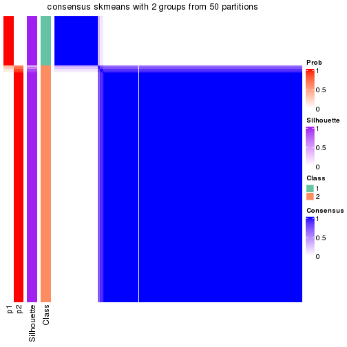</p>

</div>
<div id='tab-node-0-consensus-heatmap-2'>
<pre><code class="r">consensus_heatmap(res, k = 3)
</code></pre>

<p>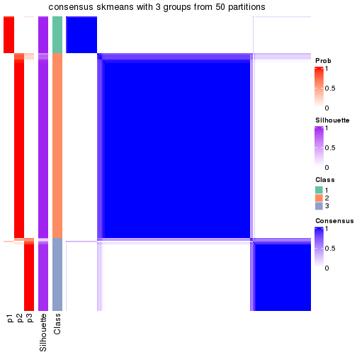</p>

</div>
<div id='tab-node-0-consensus-heatmap-3'>
<pre><code class="r">consensus_heatmap(res, k = 4)
</code></pre>

<p>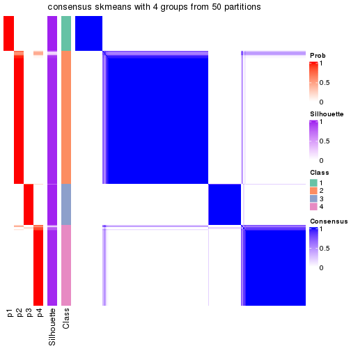</p>

</div>
<div id='tab-node-0-consensus-heatmap-4'>
<pre><code class="r">consensus_heatmap(res, k = 5)
</code></pre>

<p>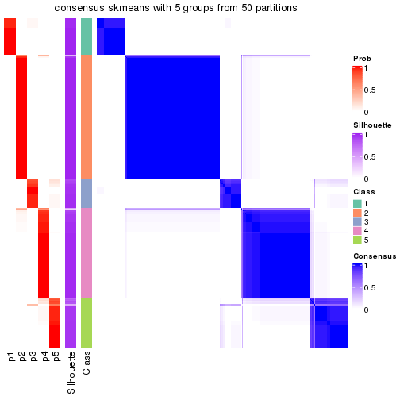</p>

</div>
<div id='tab-node-0-consensus-heatmap-5'>
<pre><code class="r">consensus_heatmap(res, k = 6)
</code></pre>

<p>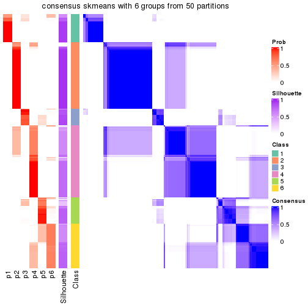</p>

</div>
<div id='tab-node-0-consensus-heatmap-6'>
<pre><code class="r">consensus_heatmap(res, k = 7)
</code></pre>

<p>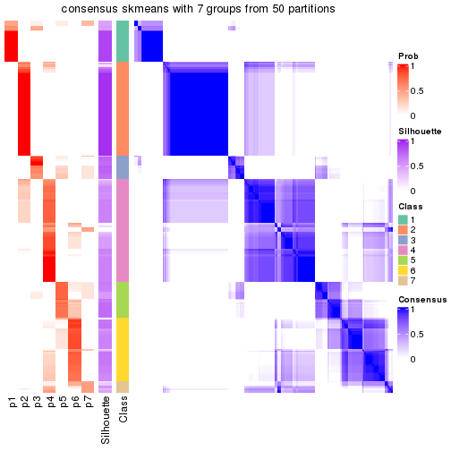</p>

</div>
<div id='tab-node-0-consensus-heatmap-7'>
<pre><code class="r">consensus_heatmap(res, k = 8)
</code></pre>

<p>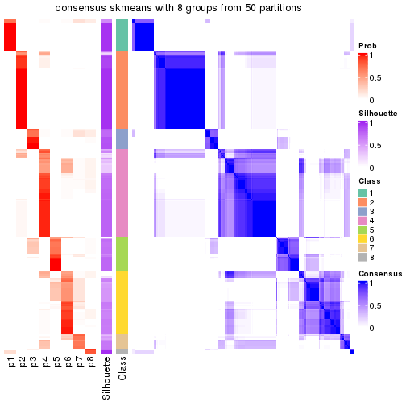</p>

</div>
</div>

Heatmaps for the membership of samples in all partitions to see how consistent they are:


<script>
$( function() {
	$( '#tabs-node-0-membership-heatmap' ).tabs();
} );
</script>
<div id='tabs-node-0-membership-heatmap'>
<ul>
<li><a href='#tab-node-0-membership-heatmap-1'>k = 2</a></li>
<li><a href='#tab-node-0-membership-heatmap-2'>k = 3</a></li>
<li><a href='#tab-node-0-membership-heatmap-3'>k = 4</a></li>
<li><a href='#tab-node-0-membership-heatmap-4'>k = 5</a></li>
<li><a href='#tab-node-0-membership-heatmap-5'>k = 6</a></li>
<li><a href='#tab-node-0-membership-heatmap-6'>k = 7</a></li>
<li><a href='#tab-node-0-membership-heatmap-7'>k = 8</a></li>
</ul>
<div id='tab-node-0-membership-heatmap-1'>
<pre><code class="r">membership_heatmap(res, k = 2)
</code></pre>

<p>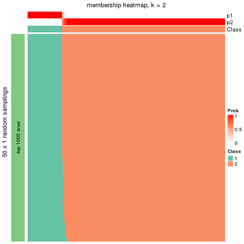</p>

</div>
<div id='tab-node-0-membership-heatmap-2'>
<pre><code class="r">membership_heatmap(res, k = 3)
</code></pre>

<p>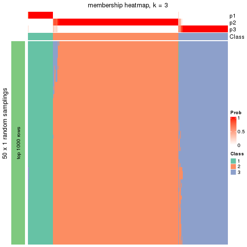</p>

</div>
<div id='tab-node-0-membership-heatmap-3'>
<pre><code class="r">membership_heatmap(res, k = 4)
</code></pre>

<p>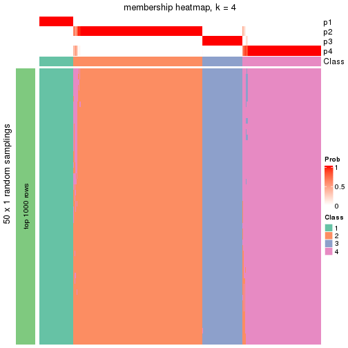</p>

</div>
<div id='tab-node-0-membership-heatmap-4'>
<pre><code class="r">membership_heatmap(res, k = 5)
</code></pre>

<p>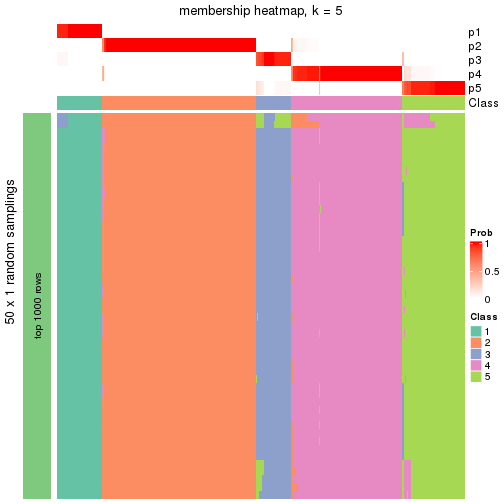</p>

</div>
<div id='tab-node-0-membership-heatmap-5'>
<pre><code class="r">membership_heatmap(res, k = 6)
</code></pre>

<p>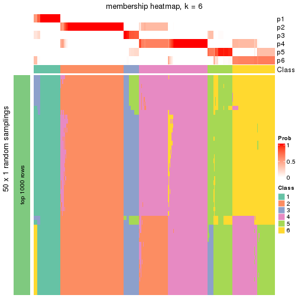</p>

</div>
<div id='tab-node-0-membership-heatmap-6'>
<pre><code class="r">membership_heatmap(res, k = 7)
</code></pre>

<p>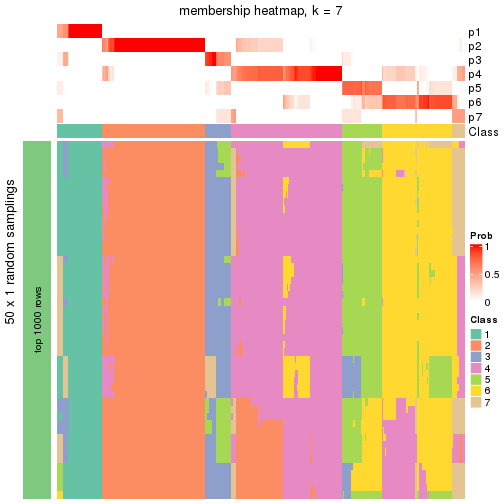</p>

</div>
<div id='tab-node-0-membership-heatmap-7'>
<pre><code class="r">membership_heatmap(res, k = 8)
</code></pre>

<p>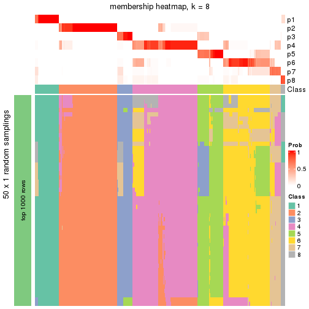</p>

</div>
</div>

As soon as the classes for columns are determined, the signatures
that are significantly different between subgroups can be looked for. 
Following are the heatmaps for signatures.


<script>
$( function() {
	$( '#tabs-node-0-get-signatures' ).tabs();
} );
</script>
<div id='tabs-node-0-get-signatures'>
<ul>
<li><a href='#tab-node-0-get-signatures-1'>k = 2</a></li>
<li><a href='#tab-node-0-get-signatures-2'>k = 3</a></li>
<li><a href='#tab-node-0-get-signatures-3'>k = 4</a></li>
<li><a href='#tab-node-0-get-signatures-4'>k = 5</a></li>
<li><a href='#tab-node-0-get-signatures-5'>k = 6</a></li>
<li><a href='#tab-node-0-get-signatures-6'>k = 7</a></li>
<li><a href='#tab-node-0-get-signatures-7'>k = 8</a></li>
</ul>
<div id='tab-node-0-get-signatures-1'>
<pre><code class="r">get_signatures(res, k = 2)
</code></pre>

<p>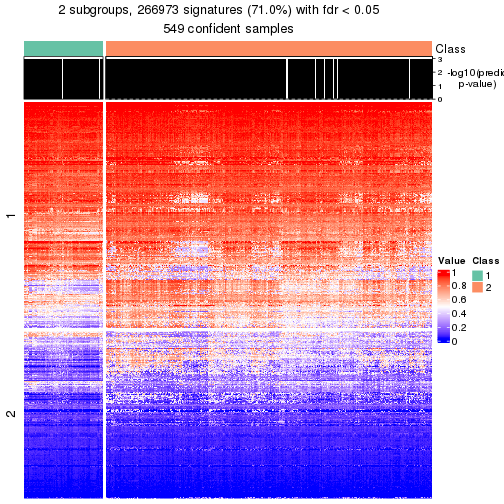</p>

</div>
<div id='tab-node-0-get-signatures-2'>
<pre><code class="r">get_signatures(res, k = 3)
</code></pre>

<p>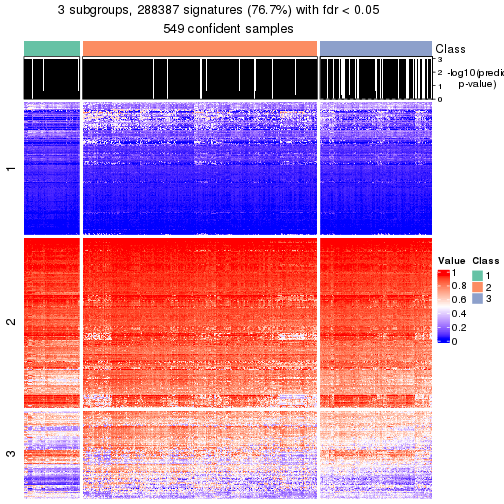</p>

</div>
<div id='tab-node-0-get-signatures-3'>
<pre><code class="r">get_signatures(res, k = 4)
</code></pre>

<p>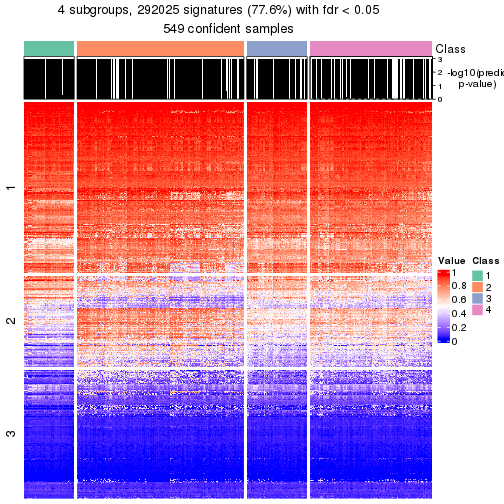</p>

</div>
<div id='tab-node-0-get-signatures-4'>
<pre><code class="r">get_signatures(res, k = 5)
</code></pre>

<p>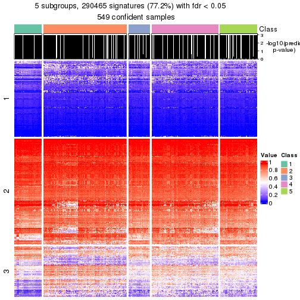</p>

</div>
<div id='tab-node-0-get-signatures-5'>
<pre><code class="r">get_signatures(res, k = 6)
</code></pre>

<p>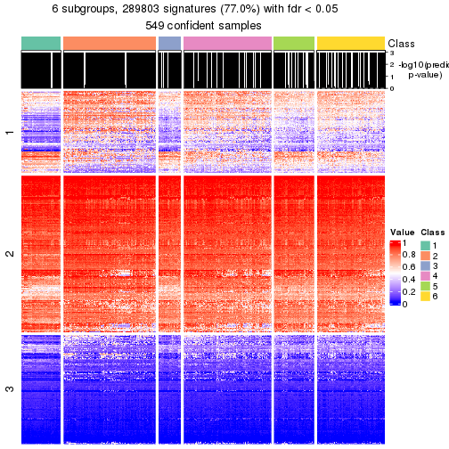</p>

</div>
<div id='tab-node-0-get-signatures-6'>
<pre><code class="r">get_signatures(res, k = 7)
</code></pre>

<p>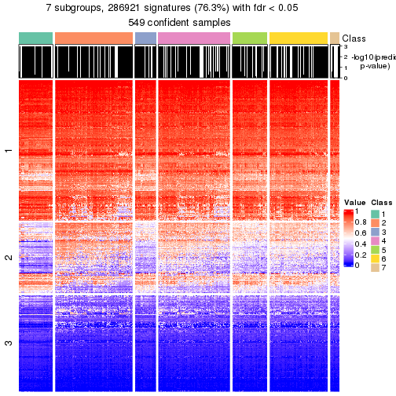</p>

</div>
<div id='tab-node-0-get-signatures-7'>
<pre><code class="r">get_signatures(res, k = 8)
</code></pre>

<p>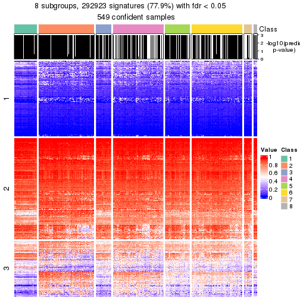</p>

</div>
</div>


Compare the overlap of signatures from different k:

```r
compare_signatures(res)
```

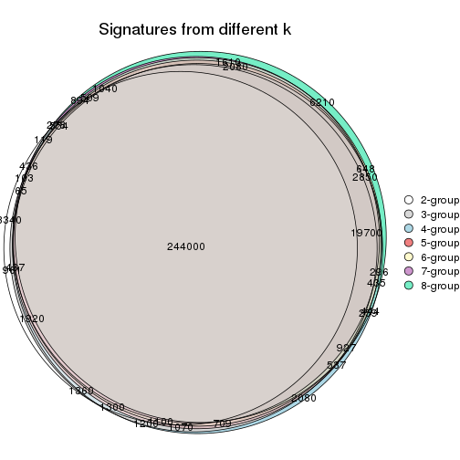

`get_signature()` returns a data frame invisibly. To get the list of signatures, the function
call should be assigned to a variable explicitly. In following code, if `plot` argument is set
to `FALSE`, no heatmap is plotted while only the differential analysis is performed.

```r
# code only for demonstration
tb = get_signature(res, k = ..., plot = FALSE)
```

An example of the output of `tb` is:

```
#>   which_row         fdr    mean_1    mean_2 scaled_mean_1 scaled_mean_2 km
#> 1        38 0.042760348  8.373488  9.131774    -0.5533452     0.5164555  1
#> 2        40 0.018707592  7.106213  8.469186    -0.6173731     0.5762149  1
#> 3        55 0.019134737 10.221463 11.207825    -0.6159697     0.5749050  1
#> 4        59 0.006059896  5.921854  7.869574    -0.6899429     0.6439467  1
#> 5        60 0.018055526  8.928898 10.211722    -0.6204761     0.5791110  1
#> 6        98 0.009384629 15.714769 14.887706     0.6635654    -0.6193277  2
...
```

The columns in `tb` are:

1. `which_row`: row indices corresponding to the input matrix.
2. `fdr`: FDR for the differential test. 
3. `mean_x`: The mean value in group x.
4. `scaled_mean_x`: The mean value in group x after rows are scaled.
5. `km`: Row groups if k-means clustering is applied to rows (which is done by automatically selecting number of clusters).

If there are too many signatures, `top_signatures = ...` can be set to only show the 
signatures with the highest FDRs:

```r
# code only for demonstration
# e.g. to show the top 500 most significant rows
tb = get_signature(res, k = ..., top_signatures = 500)
```

If the signatures are defined as these which are uniquely high in current group, `diff_method` argument
can be set to `"uniquely_high_in_one_group"`:

```r
# code only for demonstration
tb = get_signature(res, k = ..., diff_method = "uniquely_high_in_one_group")
```


UMAP plot which shows how samples are separated.


<script>
$( function() {
	$( '#tabs-node-0-dimension-reduction' ).tabs();
} );
</script>
<div id='tabs-node-0-dimension-reduction'>
<ul>
<li><a href='#tab-node-0-dimension-reduction-1'>k = 2</a></li>
<li><a href='#tab-node-0-dimension-reduction-2'>k = 3</a></li>
<li><a href='#tab-node-0-dimension-reduction-3'>k = 4</a></li>
<li><a href='#tab-node-0-dimension-reduction-4'>k = 5</a></li>
<li><a href='#tab-node-0-dimension-reduction-5'>k = 6</a></li>
<li><a href='#tab-node-0-dimension-reduction-6'>k = 7</a></li>
<li><a href='#tab-node-0-dimension-reduction-7'>k = 8</a></li>
</ul>
<div id='tab-node-0-dimension-reduction-1'>
<pre><code class="r">dimension_reduction(res, k = 2, method = &quot;UMAP&quot;)
</code></pre>

<p>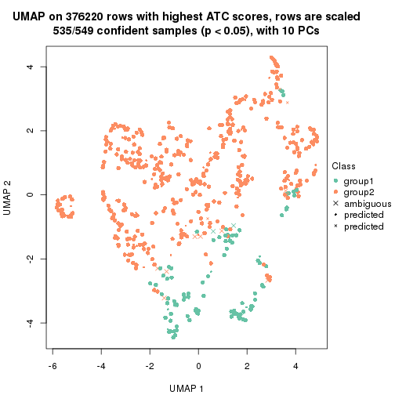</p>

</div>
<div id='tab-node-0-dimension-reduction-2'>
<pre><code class="r">dimension_reduction(res, k = 3, method = &quot;UMAP&quot;)
</code></pre>

<p>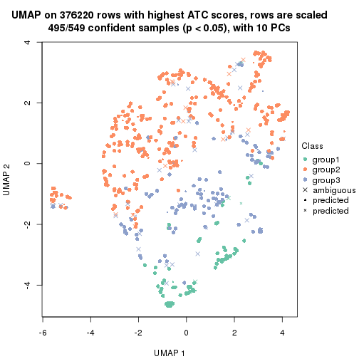</p>

</div>
<div id='tab-node-0-dimension-reduction-3'>
<pre><code class="r">dimension_reduction(res, k = 4, method = &quot;UMAP&quot;)
</code></pre>

<p>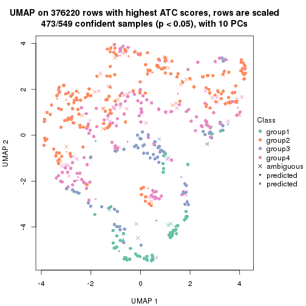</p>

</div>
<div id='tab-node-0-dimension-reduction-4'>
<pre><code class="r">dimension_reduction(res, k = 5, method = &quot;UMAP&quot;)
</code></pre>

<p>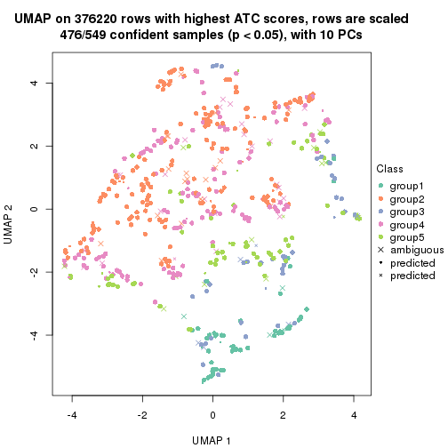</p>

</div>
<div id='tab-node-0-dimension-reduction-5'>
<pre><code class="r">dimension_reduction(res, k = 6, method = &quot;UMAP&quot;)
</code></pre>

<p>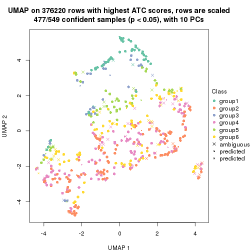</p>

</div>
<div id='tab-node-0-dimension-reduction-6'>
<pre><code class="r">dimension_reduction(res, k = 7, method = &quot;UMAP&quot;)
</code></pre>

<p>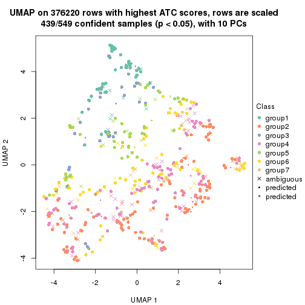</p>

</div>
<div id='tab-node-0-dimension-reduction-7'>
<pre><code class="r">dimension_reduction(res, k = 8, method = &quot;UMAP&quot;)
</code></pre>

<p>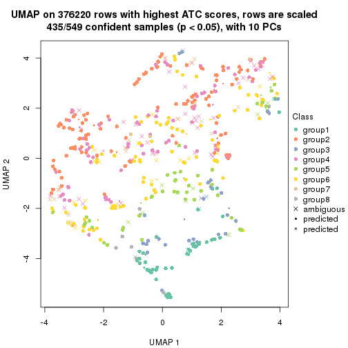</p>

</div>
</div>


Following heatmap shows how subgroups are split when increasing `k`:

```r
collect_classes(res)
```

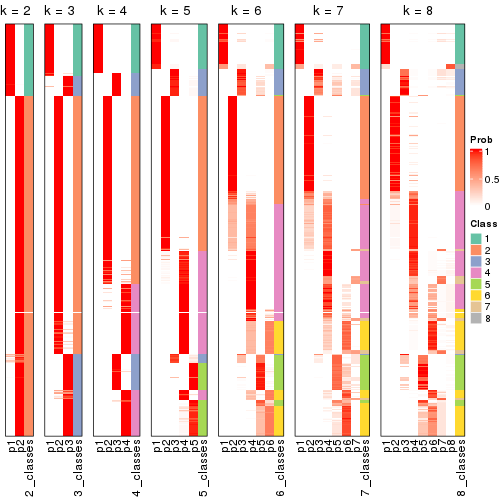


If matrix rows can be associated to genes, consider to use `functional_enrichment(res,
...)` to perform function enrichment for the signature genes. See [this vignette](https://jokergoo.github.io/cola_vignettes/functional_enrichment.html) for more detailed explanations.


 

---------------------------------------------------


### Node01


Parent node: [Node0](#Node0).
Child nodes: 
                Node011-leaf
        ,
                [Node012](#Node012)
        ,
                Node013-leaf
        ,
                [Node021](#Node021)
        ,
                [Node022](#Node022)
        ,
                [Node023](#Node023)
        ,
                [Node024](#Node024)
        ,
                Node031-leaf
        ,
                Node032-leaf
        ,
                Node033-leaf
        ,
                Node034-leaf
        ,
                [Node041](#Node041)
        ,
                [Node042](#Node042)
        ,
                [Node043](#Node043)
        ,
                [Node044](#Node044)
        ,
                [Node051](#Node051)
        ,
                [Node052](#Node052)
        ,
                Node053-leaf
        .


The object with results only for a single top-value method and a single partitioning method 
can be extracted as:

```r
res = res_rh["01"]
```

A summary of `res` and all the functions that can be applied to it:

```r
res
```

```
#> A 'ConsensusPartition' object with k = 2, 3, 4, 5, 6, 7, 8.
#>   On a matrix with 30000 rows and 64 columns.
#>   Top rows (1000) are extracted by 'SD' method.
#>   Subgroups are detected by 'kmeans' method.
#>   Performed in total 350 partitions by row resampling.
#>   Best k for subgroups seems to be 3.
#> 
#> Following methods can be applied to this 'ConsensusPartition' object:
#>  [1] "cola_report"             "collect_classes"         "collect_plots"          
#>  [4] "collect_stats"           "colnames"                "compare_partitions"     
#>  [7] "compare_signatures"      "consensus_heatmap"       "dimension_reduction"    
#> [10] "functional_enrichment"   "get_anno_col"            "get_anno"               
#> [13] "get_classes"             "get_consensus"           "get_matrix"             
#> [16] "get_membership"          "get_param"               "get_signatures"         
#> [19] "get_stats"               "is_best_k"               "is_stable_k"            
#> [22] "membership_heatmap"      "ncol"                    "nrow"                   
#> [25] "plot_ecdf"               "predict_classes"         "rownames"               
#> [28] "select_partition_number" "show"                    "suggest_best_k"         
#> [31] "test_to_known_factors"   "top_rows_heatmap"
```

`collect_plots()` function collects all the plots made from `res` for all `k` (number of subgroups)
into one single page to provide an easy and fast comparison between different `k`.

```r
collect_plots(res)
```

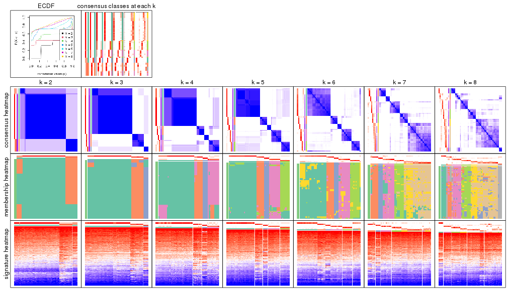

The plots are:

- The first row: a plot of the eCDF (empirical cumulative distribution
  function) curves of the consensus matrix for each `k` and the heatmap of
  predicted classes for each `k`.
- The second row: heatmaps of the consensus matrix for each `k`.
- The third row: heatmaps of the membership matrix for each `k`.
- The fouth row: heatmaps of the signatures for each `k`.

All the plots in panels can be made by individual functions and they are
plotted later in this section.

`select_partition_number()` produces several plots showing different
statistics for choosing "optimized" `k`. There are following statistics:

- eCDF curves of the consensus matrix for each `k`;
- 1-PAC. [The PAC score](https://en.wikipedia.org/wiki/Consensus_clustering#Over-interpretation_potential_of_consensus_clustering)
  measures the proportion of the ambiguous subgrouping.
- Mean silhouette score.
- Concordance. The mean probability of fiting the consensus subgroup labels in all
  partitions.
- Area increased. Denote $A_k$ as the area under the eCDF curve for current
  `k`, the area increased is defined as $A_k - A_{k-1}$.
- Rand index. The percent of pairs of samples that are both in a same cluster
  or both are not in a same cluster in the partition of k and k-1.
- Jaccard index. The ratio of pairs of samples are both in a same cluster in
  the partition of k and k-1 and the pairs of samples are both in a same
  cluster in the partition k or k-1.

The detailed explanations of these statistics can be found in [the _cola_
vignette](https://jokergoo.github.io/cola_vignettes/cola.html#toc_13).

Generally speaking, higher 1-PAC score, higher mean silhouette score or higher
concordance corresponds to better partition. Rand index and Jaccard index
measure how similar the current partition is compared to partition with `k-1`.
If they are too similar, we won't accept `k` is better than `k-1`.

```r
select_partition_number(res)
```

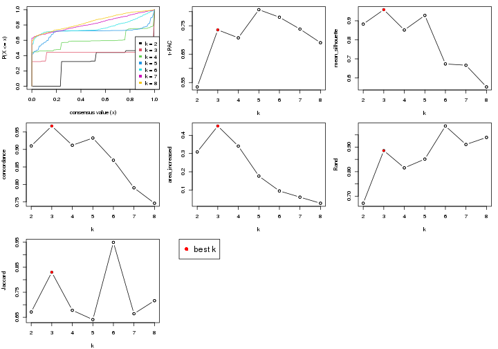

The numeric values for all these statistics can be obtained by `get_stats()`.

```r
get_stats(res)
```

```
#>   k 1-PAC mean_silhouette concordance area_increased  Rand Jaccard
#> 2 2 0.535           0.883       0.910         0.3088 0.671   0.671
#> 3 3 0.736           0.958       0.967         0.4508 0.886   0.830
#> 4 4 0.708           0.851       0.912         0.3405 0.815   0.678
#> 5 5 0.807           0.928       0.932         0.1763 0.851   0.641
#> 6 6 0.780           0.673       0.869         0.0949 0.986   0.950
#> 7 7 0.738           0.667       0.790         0.0609 0.911   0.664
#> 8 8 0.690           0.553       0.746         0.0275 0.939   0.716
```

`suggest_best_k()` suggests the best $k$ based on these statistics. The rules are as follows:

- All $k$ with Jaccard index larger than 0.95 are removed because increasing
  $k$ does not provide enough extra information. If all $k$ are removed, it is
  marked as no subgroup is detected.
- For all $k$ with 1-PAC score larger than 0.9, the maximal $k$ is taken as
  the best $k$, and other $k$ are marked as optional $k$.
- If it does not fit the second rule. The $k$ with the maximal vote of the
  highest 1-PAC score, highest mean silhouette, and highest concordance is
  taken as the best $k$.

```r
suggest_best_k(res)
```

```
#> [1] 3
```


Following is the table of the partitions (You need to click the **show/hide
code output** link to see it). The membership matrix (columns with name `p*`)
is inferred by
[`clue::cl_consensus()`](https://www.rdocumentation.org/link/cl_consensus?package=clue)
function with the `SE` method. Basically the value in the membership matrix
represents the probability to belong to a certain group. The finall subgroup
label for an item is determined with the group with highest probability it
belongs to.

In `get_classes()` function, the entropy is calculated from the membership
matrix and the silhouette score is calculated from the consensus matrix.


<script>
$( function() {
	$( '#tabs-node-01-get-classes' ).tabs();
} );
</script>
<div id='tabs-node-01-get-classes'>
<ul>
<li><a href='#tab-node-01-get-classes-1'>k = 2</a></li>
<li><a href='#tab-node-01-get-classes-2'>k = 3</a></li>
<li><a href='#tab-node-01-get-classes-3'>k = 4</a></li>
<li><a href='#tab-node-01-get-classes-4'>k = 5</a></li>
<li><a href='#tab-node-01-get-classes-5'>k = 6</a></li>
<li><a href='#tab-node-01-get-classes-6'>k = 7</a></li>
<li><a href='#tab-node-01-get-classes-7'>k = 8</a></li>
</ul>

<div id='tab-node-01-get-classes-1'>
<p><a id='tab-node-01-get-classes-1-a' style='color:#0366d6' href='#'>show/hide code output</a></p>
<pre><code class="r">cbind(get_classes(res, k = 2), get_membership(res, k = 2))
</code></pre>

<pre><code>#&gt;                 class entropy silhouette   p1   p2
#&gt; TCGA.EJ.AB20.01     2   0.795      1.000 0.24 0.76
#&gt; TCGA.CH.5762.11     1   0.000      0.935 1.00 0.00
#&gt; TCGA.CH.5789.01     1   0.000      0.935 1.00 0.00
#&gt; TCGA.G9.6333.11     1   0.000      0.935 1.00 0.00
#&gt; TCGA.HC.7819.11     1   0.000      0.935 1.00 0.00
#&gt; TCGA.EJ.7784.11     1   0.000      0.935 1.00 0.00
#&gt; TCGA.HC.7820.11     1   0.999      0.173 0.52 0.48
#&gt; TCGA.EJ.7328.11     2   0.795      1.000 0.24 0.76
#&gt; TCGA.G9.6353.11     1   0.000      0.935 1.00 0.00
#&gt; TCGA.EJ.7317.11     1   0.000      0.935 1.00 0.00
#&gt; TCGA.EJ.7792.11     1   0.000      0.935 1.00 0.00
#&gt; TCGA.HC.7752.11     2   0.795      1.000 0.24 0.76
#&gt; TCGA.EJ.7123.11     1   0.000      0.935 1.00 0.00
#&gt; TCGA.G9.6332.11     1   0.999      0.173 0.52 0.48
#&gt; TCGA.EJ.5503.01     1   0.000      0.935 1.00 0.00
#&gt; TCGA.KC.A4BO.01     1   0.000      0.935 1.00 0.00
#&gt; TCGA.EJ.A7NK.01     1   0.000      0.935 1.00 0.00
#&gt; TCGA.EJ.7125.11     2   0.795      1.000 0.24 0.76
#&gt; TCGA.CH.5743.01     1   0.000      0.935 1.00 0.00
#&gt; TCGA.CH.5766.11     1   0.000      0.935 1.00 0.00
#&gt; TCGA.G9.6385.01     2   0.795      1.000 0.24 0.76
#&gt; TCGA.H9.A6BX.01     2   0.795      1.000 0.24 0.76
#&gt; TCGA.G9.6364.11     2   0.795      1.000 0.24 0.76
#&gt; TCGA.EJ.7331.11     2   0.795      1.000 0.24 0.76
#&gt; TCGA.G9.6494.11     1   0.000      0.935 1.00 0.00
#&gt; TCGA.EJ.7794.11     1   0.000      0.935 1.00 0.00
#&gt; TCGA.EJ.A8FP.01     1   0.000      0.935 1.00 0.00
#&gt; TCGA.G9.6365.11     1   0.000      0.935 1.00 0.00
#&gt; TCGA.EJ.A46H.01     1   0.000      0.935 1.00 0.00
#&gt; TCGA.EJ.7782.11     1   0.000      0.935 1.00 0.00
#&gt; TCGA.EJ.A7NJ.01     1   0.000      0.935 1.00 0.00
#&gt; TCGA.G9.6367.01     1   0.000      0.935 1.00 0.00
#&gt; TCGA.EJ.A8FU.01     1   0.000      0.935 1.00 0.00
#&gt; TCGA.CH.5767.11     1   0.000      0.935 1.00 0.00
#&gt; TCGA.CH.5763.01     1   0.000      0.935 1.00 0.00
#&gt; TCGA.EJ.7781.11     1   0.000      0.935 1.00 0.00
#&gt; TCGA.G9.6385.11     2   0.795      1.000 0.24 0.76
#&gt; TCGA.G9.6496.11     1   0.000      0.935 1.00 0.00
#&gt; TCGA.CH.5764.11     1   0.000      0.935 1.00 0.00
#&gt; TCGA.G9.6356.11     1   0.000      0.935 1.00 0.00
#&gt; TCGA.XJ.A9DK.01     1   0.000      0.935 1.00 0.00
#&gt; TCGA.EJ.A46E.01     1   0.000      0.935 1.00 0.00
#&gt; TCGA.CH.5771.11     1   0.000      0.935 1.00 0.00
#&gt; TCGA.M7.A720.01     1   0.000      0.935 1.00 0.00
#&gt; TCGA.FC.A66V.01     1   0.000      0.935 1.00 0.00
#&gt; TCGA.XK.AAJU.01     1   0.000      0.935 1.00 0.00
#&gt; TCGA.HC.7745.11     1   0.999      0.173 0.52 0.48
#&gt; TCGA.HC.7737.11     1   0.999      0.173 0.52 0.48
#&gt; TCGA.EJ.7786.11     2   0.795      1.000 0.24 0.76
#&gt; TCGA.FC.A8O0.01     2   0.795      1.000 0.24 0.76
#&gt; TCGA.G9.6348.11     1   0.000      0.935 1.00 0.00
#&gt; TCGA.G9.6367.11     1   0.000      0.935 1.00 0.00
#&gt; TCGA.EJ.7785.11     1   0.795      0.538 0.76 0.24
#&gt; TCGA.EJ.7327.11     2   0.795      1.000 0.24 0.76
#&gt; TCGA.G9.6384.11     1   0.000      0.935 1.00 0.00
#&gt; TCGA.XJ.A9DI.01     1   0.000      0.935 1.00 0.00
#&gt; TCGA.CH.5763.11     2   0.795      1.000 0.24 0.76
#&gt; TCGA.EJ.5515.01     1   0.000      0.935 1.00 0.00
#&gt; TCGA.HC.7211.11     1   0.999      0.173 0.52 0.48
#&gt; TCGA.CH.5772.11     1   0.000      0.935 1.00 0.00
#&gt; TCGA.EJ.7789.11     1   0.000      0.935 1.00 0.00
#&gt; TCGA.G9.6373.11     1   0.000      0.935 1.00 0.00
#&gt; TCGA.G9.6370.01     1   0.000      0.935 1.00 0.00
#&gt; TCGA.CH.5761.11     1   0.000      0.935 1.00 0.00
</code></pre>

<script>
$('#tab-node-01-get-classes-1-a').parent().next().next().hide();
$('#tab-node-01-get-classes-1-a').click(function(){
  $('#tab-node-01-get-classes-1-a').parent().next().next().toggle();
  return(false);
});
</script>
</div>

<div id='tab-node-01-get-classes-2'>
<p><a id='tab-node-01-get-classes-2-a' style='color:#0366d6' href='#'>show/hide code output</a></p>
<pre><code class="r">cbind(get_classes(res, k = 3), get_membership(res, k = 3))
</code></pre>

<pre><code>#&gt;                 class entropy silhouette   p1   p2   p3
#&gt; TCGA.EJ.AB20.01     2   0.254      0.934 0.00 0.92 0.08
#&gt; TCGA.CH.5762.11     1   0.000      0.978 1.00 0.00 0.00
#&gt; TCGA.CH.5789.01     1   0.000      0.978 1.00 0.00 0.00
#&gt; TCGA.G9.6333.11     1   0.000      0.978 1.00 0.00 0.00
#&gt; TCGA.HC.7819.11     1   0.404      0.867 0.88 0.08 0.04
#&gt; TCGA.EJ.7784.11     1   0.000      0.978 1.00 0.00 0.00
#&gt; TCGA.HC.7820.11     3   0.334      1.000 0.12 0.00 0.88
#&gt; TCGA.EJ.7328.11     2   0.153      0.931 0.00 0.96 0.04
#&gt; TCGA.G9.6353.11     1   0.404      0.867 0.88 0.08 0.04
#&gt; TCGA.EJ.7317.11     1   0.404      0.867 0.88 0.08 0.04
#&gt; TCGA.EJ.7792.11     1   0.000      0.978 1.00 0.00 0.00
#&gt; TCGA.HC.7752.11     2   0.254      0.934 0.00 0.92 0.08
#&gt; TCGA.EJ.7123.11     1   0.000      0.978 1.00 0.00 0.00
#&gt; TCGA.G9.6332.11     3   0.334      1.000 0.12 0.00 0.88
#&gt; TCGA.EJ.5503.01     1   0.000      0.978 1.00 0.00 0.00
#&gt; TCGA.KC.A4BO.01     1   0.000      0.978 1.00 0.00 0.00
#&gt; TCGA.EJ.A7NK.01     1   0.000      0.978 1.00 0.00 0.00
#&gt; TCGA.EJ.7125.11     2   0.153      0.931 0.00 0.96 0.04
#&gt; TCGA.CH.5743.01     1   0.000      0.978 1.00 0.00 0.00
#&gt; TCGA.CH.5766.11     1   0.000      0.978 1.00 0.00 0.00
#&gt; TCGA.G9.6385.01     2   0.254      0.934 0.00 0.92 0.08
#&gt; TCGA.H9.A6BX.01     2   0.153      0.931 0.00 0.96 0.04
#&gt; TCGA.G9.6364.11     2   0.254      0.934 0.00 0.92 0.08
#&gt; TCGA.EJ.7331.11     2   0.000      0.939 0.00 1.00 0.00
#&gt; TCGA.G9.6494.11     1   0.000      0.978 1.00 0.00 0.00
#&gt; TCGA.EJ.7794.11     1   0.000      0.978 1.00 0.00 0.00
#&gt; TCGA.EJ.A8FP.01     1   0.000      0.978 1.00 0.00 0.00
#&gt; TCGA.G9.6365.11     1   0.000      0.978 1.00 0.00 0.00
#&gt; TCGA.EJ.A46H.01     1   0.000      0.978 1.00 0.00 0.00
#&gt; TCGA.EJ.7782.11     1   0.000      0.978 1.00 0.00 0.00
#&gt; TCGA.EJ.A7NJ.01     1   0.000      0.978 1.00 0.00 0.00
#&gt; TCGA.G9.6367.01     1   0.404      0.867 0.88 0.08 0.04
#&gt; TCGA.EJ.A8FU.01     1   0.000      0.978 1.00 0.00 0.00
#&gt; TCGA.CH.5767.11     1   0.000      0.978 1.00 0.00 0.00
#&gt; TCGA.CH.5763.01     1   0.404      0.867 0.88 0.08 0.04
#&gt; TCGA.EJ.7781.11     1   0.000      0.978 1.00 0.00 0.00
#&gt; TCGA.G9.6385.11     2   0.153      0.931 0.00 0.96 0.04
#&gt; TCGA.G9.6496.11     1   0.000      0.978 1.00 0.00 0.00
#&gt; TCGA.CH.5764.11     1   0.000      0.978 1.00 0.00 0.00
#&gt; TCGA.G9.6356.11     1   0.000      0.978 1.00 0.00 0.00
#&gt; TCGA.XJ.A9DK.01     1   0.000      0.978 1.00 0.00 0.00
#&gt; TCGA.EJ.A46E.01     1   0.000      0.978 1.00 0.00 0.00
#&gt; TCGA.CH.5771.11     1   0.000      0.978 1.00 0.00 0.00
#&gt; TCGA.M7.A720.01     1   0.000      0.978 1.00 0.00 0.00
#&gt; TCGA.FC.A66V.01     1   0.000      0.978 1.00 0.00 0.00
#&gt; TCGA.XK.AAJU.01     1   0.000      0.978 1.00 0.00 0.00
#&gt; TCGA.HC.7745.11     3   0.334      1.000 0.12 0.00 0.88
#&gt; TCGA.HC.7737.11     3   0.334      1.000 0.12 0.00 0.88
#&gt; TCGA.EJ.7786.11     2   0.000      0.939 0.00 1.00 0.00
#&gt; TCGA.FC.A8O0.01     2   0.254      0.934 0.00 0.92 0.08
#&gt; TCGA.G9.6348.11     1   0.404      0.867 0.88 0.08 0.04
#&gt; TCGA.G9.6367.11     1   0.000      0.978 1.00 0.00 0.00
#&gt; TCGA.EJ.7785.11     1   0.404      0.867 0.88 0.08 0.04
#&gt; TCGA.EJ.7327.11     2   0.254      0.934 0.00 0.92 0.08
#&gt; TCGA.G9.6384.11     1   0.000      0.978 1.00 0.00 0.00
#&gt; TCGA.XJ.A9DI.01     1   0.000      0.978 1.00 0.00 0.00
#&gt; TCGA.CH.5763.11     2   0.153      0.931 0.00 0.96 0.04
#&gt; TCGA.EJ.5515.01     1   0.000      0.978 1.00 0.00 0.00
#&gt; TCGA.HC.7211.11     3   0.334      1.000 0.12 0.00 0.88
#&gt; TCGA.CH.5772.11     1   0.000      0.978 1.00 0.00 0.00
#&gt; TCGA.EJ.7789.11     1   0.000      0.978 1.00 0.00 0.00
#&gt; TCGA.G9.6373.11     1   0.000      0.978 1.00 0.00 0.00
#&gt; TCGA.G9.6370.01     1   0.000      0.978 1.00 0.00 0.00
#&gt; TCGA.CH.5761.11     1   0.000      0.978 1.00 0.00 0.00
</code></pre>

<script>
$('#tab-node-01-get-classes-2-a').parent().next().next().hide();
$('#tab-node-01-get-classes-2-a').click(function(){
  $('#tab-node-01-get-classes-2-a').parent().next().next().toggle();
  return(false);
});
</script>
</div>

<div id='tab-node-01-get-classes-3'>
<p><a id='tab-node-01-get-classes-3-a' style='color:#0366d6' href='#'>show/hide code output</a></p>
<pre><code class="r">cbind(get_classes(res, k = 4), get_membership(res, k = 4))
</code></pre>

<pre><code>#&gt;                 class entropy silhouette   p1   p2 p3   p4
#&gt; TCGA.EJ.AB20.01     2  0.0000      0.875 0.00 1.00  0 0.00
#&gt; TCGA.CH.5762.11     1  0.0000      0.932 1.00 0.00  0 0.00
#&gt; TCGA.CH.5789.01     1  0.0000      0.932 1.00 0.00  0 0.00
#&gt; TCGA.G9.6333.11     1  0.0000      0.932 1.00 0.00  0 0.00
#&gt; TCGA.HC.7819.11     4  0.3975      0.783 0.24 0.00  0 0.76
#&gt; TCGA.EJ.7784.11     1  0.3975      0.767 0.76 0.00  0 0.24
#&gt; TCGA.HC.7820.11     3  0.0000      1.000 0.00 0.00  1 0.00
#&gt; TCGA.EJ.7328.11     4  0.3975      0.598 0.00 0.24  0 0.76
#&gt; TCGA.G9.6353.11     4  0.3975      0.783 0.24 0.00  0 0.76
#&gt; TCGA.EJ.7317.11     4  0.3975      0.783 0.24 0.00  0 0.76
#&gt; TCGA.EJ.7792.11     1  0.3801      0.784 0.78 0.00  0 0.22
#&gt; TCGA.HC.7752.11     2  0.0000      0.875 0.00 1.00  0 0.00
#&gt; TCGA.EJ.7123.11     4  0.0000      0.580 0.00 0.00  0 1.00
#&gt; TCGA.G9.6332.11     3  0.0000      1.000 0.00 0.00  1 0.00
#&gt; TCGA.EJ.5503.01     1  0.0000      0.932 1.00 0.00  0 0.00
#&gt; TCGA.KC.A4BO.01     1  0.1211      0.908 0.96 0.00  0 0.04
#&gt; TCGA.EJ.A7NK.01     1  0.0000      0.932 1.00 0.00  0 0.00
#&gt; TCGA.EJ.7125.11     4  0.3975      0.598 0.00 0.24  0 0.76
#&gt; TCGA.CH.5743.01     1  0.0000      0.932 1.00 0.00  0 0.00
#&gt; TCGA.CH.5766.11     1  0.0000      0.932 1.00 0.00  0 0.00
#&gt; TCGA.G9.6385.01     2  0.0000      0.875 0.00 1.00  0 0.00
#&gt; TCGA.H9.A6BX.01     4  0.3975      0.598 0.00 0.24  0 0.76
#&gt; TCGA.G9.6364.11     2  0.0000      0.875 0.00 1.00  0 0.00
#&gt; TCGA.EJ.7331.11     2  0.3975      0.710 0.00 0.76  0 0.24
#&gt; TCGA.G9.6494.11     1  0.0000      0.932 1.00 0.00  0 0.00
#&gt; TCGA.EJ.7794.11     1  0.3975      0.767 0.76 0.00  0 0.24
#&gt; TCGA.EJ.A8FP.01     1  0.0000      0.932 1.00 0.00  0 0.00
#&gt; TCGA.G9.6365.11     1  0.0000      0.932 1.00 0.00  0 0.00
#&gt; TCGA.EJ.A46H.01     1  0.3975      0.767 0.76 0.00  0 0.24
#&gt; TCGA.EJ.7782.11     1  0.3975      0.767 0.76 0.00  0 0.24
#&gt; TCGA.EJ.A7NJ.01     1  0.0000      0.932 1.00 0.00  0 0.00
#&gt; TCGA.G9.6367.01     4  0.4406      0.705 0.30 0.00  0 0.70
#&gt; TCGA.EJ.A8FU.01     1  0.0707      0.914 0.98 0.00  0 0.02
#&gt; TCGA.CH.5767.11     1  0.0000      0.932 1.00 0.00  0 0.00
#&gt; TCGA.CH.5763.01     4  0.3975      0.783 0.24 0.00  0 0.76
#&gt; TCGA.EJ.7781.11     1  0.3975      0.767 0.76 0.00  0 0.24
#&gt; TCGA.G9.6385.11     2  0.4522      0.572 0.00 0.68  0 0.32
#&gt; TCGA.G9.6496.11     1  0.0000      0.932 1.00 0.00  0 0.00
#&gt; TCGA.CH.5764.11     1  0.0000      0.932 1.00 0.00  0 0.00
#&gt; TCGA.G9.6356.11     1  0.3975      0.767 0.76 0.00  0 0.24
#&gt; TCGA.XJ.A9DK.01     1  0.0000      0.932 1.00 0.00  0 0.00
#&gt; TCGA.EJ.A46E.01     1  0.0000      0.932 1.00 0.00  0 0.00
#&gt; TCGA.CH.5771.11     1  0.0000      0.932 1.00 0.00  0 0.00
#&gt; TCGA.M7.A720.01     1  0.0000      0.932 1.00 0.00  0 0.00
#&gt; TCGA.FC.A66V.01     1  0.0000      0.932 1.00 0.00  0 0.00
#&gt; TCGA.XK.AAJU.01     1  0.0000      0.932 1.00 0.00  0 0.00
#&gt; TCGA.HC.7745.11     3  0.0000      1.000 0.00 0.00  1 0.00
#&gt; TCGA.HC.7737.11     3  0.0000      1.000 0.00 0.00  1 0.00
#&gt; TCGA.EJ.7786.11     2  0.3975      0.710 0.00 0.76  0 0.24
#&gt; TCGA.FC.A8O0.01     2  0.0000      0.875 0.00 1.00  0 0.00
#&gt; TCGA.G9.6348.11     4  0.3975      0.783 0.24 0.00  0 0.76
#&gt; TCGA.G9.6367.11     1  0.3975      0.767 0.76 0.00  0 0.24
#&gt; TCGA.EJ.7785.11     4  0.3400      0.763 0.18 0.00  0 0.82
#&gt; TCGA.EJ.7327.11     2  0.0000      0.875 0.00 1.00  0 0.00
#&gt; TCGA.G9.6384.11     1  0.0000      0.932 1.00 0.00  0 0.00
#&gt; TCGA.XJ.A9DI.01     1  0.0000      0.932 1.00 0.00  0 0.00
#&gt; TCGA.CH.5763.11     4  0.3975      0.598 0.00 0.24  0 0.76
#&gt; TCGA.EJ.5515.01     1  0.0000      0.932 1.00 0.00  0 0.00
#&gt; TCGA.HC.7211.11     3  0.0000      1.000 0.00 0.00  1 0.00
#&gt; TCGA.CH.5772.11     1  0.0000      0.932 1.00 0.00  0 0.00
#&gt; TCGA.EJ.7789.11     1  0.3975      0.767 0.76 0.00  0 0.24
#&gt; TCGA.G9.6373.11     1  0.0000      0.932 1.00 0.00  0 0.00
#&gt; TCGA.G9.6370.01     1  0.0000      0.932 1.00 0.00  0 0.00
#&gt; TCGA.CH.5761.11     1  0.0000      0.932 1.00 0.00  0 0.00
</code></pre>

<script>
$('#tab-node-01-get-classes-3-a').parent().next().next().hide();
$('#tab-node-01-get-classes-3-a').click(function(){
  $('#tab-node-01-get-classes-3-a').parent().next().next().toggle();
  return(false);
});
</script>
</div>

<div id='tab-node-01-get-classes-4'>
<p><a id='tab-node-01-get-classes-4-a' style='color:#0366d6' href='#'>show/hide code output</a></p>
<pre><code class="r">cbind(get_classes(res, k = 5), get_membership(res, k = 5))
</code></pre>

<pre><code>#&gt;                 class entropy silhouette   p1   p2   p3   p4   p5
#&gt; TCGA.EJ.AB20.01     2  0.1043      0.937 0.00 0.96 0.00 0.00 0.04
#&gt; TCGA.CH.5762.11     1  0.0000      0.973 1.00 0.00 0.00 0.00 0.00
#&gt; TCGA.CH.5789.01     1  0.0000      0.973 1.00 0.00 0.00 0.00 0.00
#&gt; TCGA.G9.6333.11     1  0.1043      0.963 0.96 0.00 0.00 0.00 0.04
#&gt; TCGA.HC.7819.11     4  0.2438      0.890 0.06 0.00 0.00 0.90 0.04
#&gt; TCGA.EJ.7784.11     5  0.2516      0.938 0.14 0.00 0.00 0.00 0.86
#&gt; TCGA.HC.7820.11     3  0.0000      0.994 0.00 0.00 1.00 0.00 0.00
#&gt; TCGA.EJ.7328.11     4  0.2754      0.856 0.00 0.08 0.00 0.88 0.04
#&gt; TCGA.G9.6353.11     4  0.2438      0.890 0.06 0.00 0.00 0.90 0.04
#&gt; TCGA.EJ.7317.11     4  0.2438      0.890 0.06 0.00 0.00 0.90 0.04
#&gt; TCGA.EJ.7792.11     5  0.3106      0.896 0.14 0.00 0.00 0.02 0.84
#&gt; TCGA.HC.7752.11     2  0.0000      0.939 0.00 1.00 0.00 0.00 0.00
#&gt; TCGA.EJ.7123.11     5  0.3037      0.740 0.04 0.00 0.00 0.10 0.86
#&gt; TCGA.G9.6332.11     3  0.0609      0.986 0.00 0.00 0.98 0.02 0.00
#&gt; TCGA.EJ.5503.01     1  0.0000      0.973 1.00 0.00 0.00 0.00 0.00
#&gt; TCGA.KC.A4BO.01     1  0.2438      0.905 0.90 0.00 0.00 0.04 0.06
#&gt; TCGA.EJ.A7NK.01     1  0.0000      0.973 1.00 0.00 0.00 0.00 0.00
#&gt; TCGA.EJ.7125.11     4  0.2331      0.863 0.00 0.08 0.00 0.90 0.02
#&gt; TCGA.CH.5743.01     1  0.1043      0.963 0.96 0.00 0.00 0.00 0.04
#&gt; TCGA.CH.5766.11     1  0.0000      0.973 1.00 0.00 0.00 0.00 0.00
#&gt; TCGA.G9.6385.01     2  0.0609      0.937 0.00 0.98 0.00 0.00 0.02
#&gt; TCGA.H9.A6BX.01     4  0.2331      0.863 0.00 0.08 0.00 0.90 0.02
#&gt; TCGA.G9.6364.11     2  0.1043      0.937 0.00 0.96 0.00 0.00 0.04
#&gt; TCGA.EJ.7331.11     2  0.3697      0.860 0.00 0.82 0.00 0.10 0.08
#&gt; TCGA.G9.6494.11     1  0.0609      0.962 0.98 0.00 0.00 0.00 0.02
#&gt; TCGA.EJ.7794.11     5  0.2516      0.938 0.14 0.00 0.00 0.00 0.86
#&gt; TCGA.EJ.A8FP.01     1  0.0000      0.973 1.00 0.00 0.00 0.00 0.00
#&gt; TCGA.G9.6365.11     1  0.1043      0.963 0.96 0.00 0.00 0.00 0.04
#&gt; TCGA.EJ.A46H.01     5  0.3521      0.929 0.14 0.00 0.00 0.04 0.82
#&gt; TCGA.EJ.7782.11     5  0.3319      0.930 0.16 0.00 0.00 0.02 0.82
#&gt; TCGA.EJ.A7NJ.01     1  0.0000      0.973 1.00 0.00 0.00 0.00 0.00
#&gt; TCGA.G9.6367.01     4  0.3291      0.833 0.12 0.00 0.00 0.84 0.04
#&gt; TCGA.EJ.A8FU.01     1  0.1648      0.926 0.94 0.00 0.00 0.02 0.04
#&gt; TCGA.CH.5767.11     1  0.1043      0.963 0.96 0.00 0.00 0.00 0.04
#&gt; TCGA.CH.5763.01     4  0.3037      0.852 0.10 0.00 0.00 0.86 0.04
#&gt; TCGA.EJ.7781.11     5  0.2732      0.910 0.16 0.00 0.00 0.00 0.84
#&gt; TCGA.G9.6385.11     4  0.4748      0.545 0.00 0.30 0.00 0.66 0.04
#&gt; TCGA.G9.6496.11     1  0.0609      0.962 0.98 0.00 0.00 0.00 0.02
#&gt; TCGA.CH.5764.11     1  0.0000      0.973 1.00 0.00 0.00 0.00 0.00
#&gt; TCGA.G9.6356.11     5  0.2732      0.920 0.16 0.00 0.00 0.00 0.84
#&gt; TCGA.XJ.A9DK.01     1  0.1043      0.963 0.96 0.00 0.00 0.00 0.04
#&gt; TCGA.EJ.A46E.01     1  0.0000      0.973 1.00 0.00 0.00 0.00 0.00
#&gt; TCGA.CH.5771.11     1  0.1043      0.949 0.96 0.00 0.00 0.00 0.04
#&gt; TCGA.M7.A720.01     1  0.0609      0.969 0.98 0.00 0.00 0.00 0.02
#&gt; TCGA.FC.A66V.01     1  0.1043      0.963 0.96 0.00 0.00 0.00 0.04
#&gt; TCGA.XK.AAJU.01     1  0.0000      0.973 1.00 0.00 0.00 0.00 0.00
#&gt; TCGA.HC.7745.11     3  0.0000      0.994 0.00 0.00 1.00 0.00 0.00
#&gt; TCGA.HC.7737.11     3  0.0609      0.986 0.00 0.00 0.98 0.02 0.00
#&gt; TCGA.EJ.7786.11     2  0.3697      0.860 0.00 0.82 0.00 0.10 0.08
#&gt; TCGA.FC.A8O0.01     2  0.0609      0.933 0.00 0.98 0.00 0.00 0.02
#&gt; TCGA.G9.6348.11     4  0.2438      0.890 0.06 0.00 0.00 0.90 0.04
#&gt; TCGA.G9.6367.11     5  0.2516      0.938 0.14 0.00 0.00 0.00 0.86
#&gt; TCGA.EJ.7785.11     4  0.2616      0.870 0.02 0.00 0.00 0.88 0.10
#&gt; TCGA.EJ.7327.11     2  0.0000      0.939 0.00 1.00 0.00 0.00 0.00
#&gt; TCGA.G9.6384.11     1  0.0609      0.960 0.98 0.00 0.00 0.02 0.00
#&gt; TCGA.XJ.A9DI.01     1  0.0000      0.973 1.00 0.00 0.00 0.00 0.00
#&gt; TCGA.CH.5763.11     4  0.1732      0.867 0.00 0.08 0.00 0.92 0.00
#&gt; TCGA.EJ.5515.01     1  0.0000      0.973 1.00 0.00 0.00 0.00 0.00
#&gt; TCGA.HC.7211.11     3  0.0000      0.994 0.00 0.00 1.00 0.00 0.00
#&gt; TCGA.CH.5772.11     1  0.1043      0.963 0.96 0.00 0.00 0.00 0.04
#&gt; TCGA.EJ.7789.11     5  0.3521      0.929 0.14 0.00 0.00 0.04 0.82
#&gt; TCGA.G9.6373.11     1  0.0609      0.962 0.98 0.00 0.00 0.00 0.02
#&gt; TCGA.G9.6370.01     1  0.1043      0.963 0.96 0.00 0.00 0.00 0.04
#&gt; TCGA.CH.5761.11     1  0.1043      0.963 0.96 0.00 0.00 0.00 0.04
</code></pre>

<script>
$('#tab-node-01-get-classes-4-a').parent().next().next().hide();
$('#tab-node-01-get-classes-4-a').click(function(){
  $('#tab-node-01-get-classes-4-a').parent().next().next().toggle();
  return(false);
});
</script>
</div>

<div id='tab-node-01-get-classes-5'>
<p><a id='tab-node-01-get-classes-5-a' style='color:#0366d6' href='#'>show/hide code output</a></p>
<pre><code class="r">cbind(get_classes(res, k = 6), get_membership(res, k = 6))
</code></pre>

<pre><code>#&gt;                 class entropy silhouette   p1   p2   p3   p4   p5   p6
#&gt; TCGA.EJ.AB20.01     2  0.0937     0.8866 0.00 0.96 0.00 0.00 0.00 0.04
#&gt; TCGA.CH.5762.11     1  0.0547     0.6883 0.98 0.00 0.00 0.00 0.02 0.00
#&gt; TCGA.CH.5789.01     1  0.1807     0.6891 0.92 0.00 0.00 0.00 0.02 0.06
#&gt; TCGA.G9.6333.11     1  0.3163     0.5163 0.82 0.00 0.00 0.00 0.04 0.14
#&gt; TCGA.HC.7819.11     4  0.1092     0.8778 0.00 0.00 0.00 0.96 0.02 0.02
#&gt; TCGA.EJ.7784.11     5  0.1807     0.9042 0.02 0.00 0.00 0.00 0.92 0.06
#&gt; TCGA.HC.7820.11     3  0.0000     0.9811 0.00 0.00 1.00 0.00 0.00 0.00
#&gt; TCGA.EJ.7328.11     4  0.3409     0.7507 0.00 0.00 0.00 0.70 0.00 0.30
#&gt; TCGA.G9.6353.11     4  0.0547     0.8758 0.00 0.00 0.00 0.98 0.02 0.00
#&gt; TCGA.EJ.7317.11     4  0.1092     0.8748 0.00 0.00 0.00 0.96 0.02 0.02
#&gt; TCGA.EJ.7792.11     5  0.2794     0.8513 0.06 0.00 0.00 0.00 0.86 0.08
#&gt; TCGA.HC.7752.11     2  0.0000     0.8890 0.00 1.00 0.00 0.00 0.00 0.00
#&gt; TCGA.EJ.7123.11     5  0.2048     0.8579 0.00 0.00 0.00 0.00 0.88 0.12
#&gt; TCGA.G9.6332.11     3  0.0937     0.9727 0.00 0.00 0.96 0.00 0.00 0.04
#&gt; TCGA.EJ.5503.01     1  0.1267     0.6925 0.94 0.00 0.00 0.00 0.00 0.06
#&gt; TCGA.KC.A4BO.01     6  0.5265     0.0000 0.40 0.00 0.00 0.00 0.10 0.50
#&gt; TCGA.EJ.A7NK.01     1  0.1814     0.6689 0.90 0.00 0.00 0.00 0.00 0.10
#&gt; TCGA.EJ.7125.11     4  0.1814     0.8595 0.00 0.00 0.00 0.90 0.00 0.10
#&gt; TCGA.CH.5743.01     1  0.4282    -0.3327 0.56 0.00 0.00 0.00 0.02 0.42
#&gt; TCGA.CH.5766.11     1  0.1092     0.6901 0.96 0.00 0.00 0.00 0.02 0.02
#&gt; TCGA.G9.6385.01     2  0.0547     0.8865 0.00 0.98 0.00 0.00 0.00 0.02
#&gt; TCGA.H9.A6BX.01     4  0.1814     0.8595 0.00 0.00 0.00 0.90 0.00 0.10
#&gt; TCGA.G9.6364.11     2  0.0937     0.8866 0.00 0.96 0.00 0.00 0.00 0.04
#&gt; TCGA.EJ.7331.11     2  0.4926     0.6904 0.00 0.64 0.00 0.12 0.00 0.24
#&gt; TCGA.G9.6494.11     1  0.0547     0.6883 0.98 0.00 0.00 0.00 0.02 0.00
#&gt; TCGA.EJ.7794.11     5  0.0547     0.9135 0.02 0.00 0.00 0.00 0.98 0.00
#&gt; TCGA.EJ.A8FP.01     1  0.1092     0.6901 0.96 0.00 0.00 0.00 0.02 0.02
#&gt; TCGA.G9.6365.11     1  0.4282    -0.3082 0.56 0.00 0.00 0.00 0.02 0.42
#&gt; TCGA.EJ.A46H.01     5  0.1807     0.9106 0.02 0.00 0.00 0.00 0.92 0.06
#&gt; TCGA.EJ.7782.11     5  0.1807     0.9106 0.02 0.00 0.00 0.00 0.92 0.06
#&gt; TCGA.EJ.A7NJ.01     1  0.2048     0.6597 0.88 0.00 0.00 0.00 0.00 0.12
#&gt; TCGA.G9.6367.01     4  0.2882     0.8003 0.10 0.00 0.00 0.86 0.02 0.02
#&gt; TCGA.EJ.A8FU.01     1  0.1480     0.6490 0.94 0.00 0.00 0.04 0.02 0.00
#&gt; TCGA.CH.5767.11     1  0.4246    -0.3165 0.58 0.00 0.00 0.00 0.02 0.40
#&gt; TCGA.CH.5763.01     4  0.2094     0.8197 0.08 0.00 0.00 0.90 0.02 0.00
#&gt; TCGA.EJ.7781.11     5  0.1556     0.8832 0.00 0.00 0.00 0.00 0.92 0.08
#&gt; TCGA.G9.6385.11     4  0.4680     0.6412 0.00 0.20 0.00 0.68 0.00 0.12
#&gt; TCGA.G9.6496.11     1  0.1480     0.6732 0.94 0.00 0.00 0.00 0.02 0.04
#&gt; TCGA.CH.5764.11     1  0.1267     0.6737 0.94 0.00 0.00 0.00 0.00 0.06
#&gt; TCGA.G9.6356.11     5  0.2190     0.8980 0.04 0.00 0.00 0.00 0.90 0.06
#&gt; TCGA.XJ.A9DK.01     1  0.3756    -0.1665 0.60 0.00 0.00 0.00 0.00 0.40
#&gt; TCGA.EJ.A46E.01     1  0.3156     0.5913 0.80 0.00 0.00 0.00 0.02 0.18
#&gt; TCGA.CH.5771.11     1  0.0547     0.6853 0.98 0.00 0.00 0.00 0.00 0.02
#&gt; TCGA.M7.A720.01     1  0.2454     0.6189 0.84 0.00 0.00 0.00 0.00 0.16
#&gt; TCGA.FC.A66V.01     1  0.4310    -0.4188 0.54 0.00 0.00 0.00 0.02 0.44
#&gt; TCGA.XK.AAJU.01     1  0.1556     0.6808 0.92 0.00 0.00 0.00 0.00 0.08
#&gt; TCGA.HC.7745.11     3  0.0547     0.9790 0.00 0.00 0.98 0.00 0.00 0.02
#&gt; TCGA.HC.7737.11     3  0.0937     0.9727 0.00 0.00 0.96 0.00 0.00 0.04
#&gt; TCGA.EJ.7786.11     2  0.4926     0.6904 0.00 0.64 0.00 0.12 0.00 0.24
#&gt; TCGA.FC.A8O0.01     2  0.0547     0.8825 0.00 0.98 0.00 0.00 0.00 0.02
#&gt; TCGA.G9.6348.11     4  0.1092     0.8778 0.00 0.00 0.00 0.96 0.02 0.02
#&gt; TCGA.G9.6367.11     5  0.2190     0.8980 0.04 0.00 0.00 0.00 0.90 0.06
#&gt; TCGA.EJ.7785.11     4  0.3309     0.7529 0.00 0.00 0.00 0.72 0.00 0.28
#&gt; TCGA.EJ.7327.11     2  0.0000     0.8890 0.00 1.00 0.00 0.00 0.00 0.00
#&gt; TCGA.G9.6384.11     1  0.1807     0.6891 0.92 0.00 0.00 0.00 0.02 0.06
#&gt; TCGA.XJ.A9DI.01     1  0.2260     0.6337 0.86 0.00 0.00 0.00 0.00 0.14
#&gt; TCGA.CH.5763.11     4  0.0000     0.8760 0.00 0.00 0.00 1.00 0.00 0.00
#&gt; TCGA.EJ.5515.01     1  0.2260     0.6432 0.86 0.00 0.00 0.00 0.00 0.14
#&gt; TCGA.HC.7211.11     3  0.0547     0.9790 0.00 0.00 0.98 0.00 0.00 0.02
#&gt; TCGA.CH.5772.11     1  0.2790     0.5562 0.84 0.00 0.00 0.00 0.02 0.14
#&gt; TCGA.EJ.7789.11     5  0.1807     0.9106 0.02 0.00 0.00 0.00 0.92 0.06
#&gt; TCGA.G9.6373.11     1  0.0547     0.6883 0.98 0.00 0.00 0.00 0.02 0.00
#&gt; TCGA.G9.6370.01     1  0.3315     0.4949 0.78 0.00 0.00 0.00 0.02 0.20
#&gt; TCGA.CH.5761.11     1  0.3647    -0.0115 0.64 0.00 0.00 0.00 0.00 0.36
</code></pre>

<script>
$('#tab-node-01-get-classes-5-a').parent().next().next().hide();
$('#tab-node-01-get-classes-5-a').click(function(){
  $('#tab-node-01-get-classes-5-a').parent().next().next().toggle();
  return(false);
});
</script>
</div>

<div id='tab-node-01-get-classes-6'>
<p><a id='tab-node-01-get-classes-6-a' style='color:#0366d6' href='#'>show/hide code output</a></p>
<pre><code class="r">cbind(get_classes(res, k = 7), get_membership(res, k = 7))
</code></pre>

<pre><code>#&gt;                 class entropy silhouette   p1   p2   p3   p4   p5   p6   p7
#&gt; TCGA.EJ.AB20.01     2  0.0504     0.8741 0.00 0.98 0.00 0.00 0.00 0.02 0.00
#&gt; TCGA.CH.5762.11     7  0.1433     0.7135 0.00 0.00 0.00 0.00 0.00 0.08 0.92
#&gt; TCGA.CH.5789.01     7  0.1363     0.7212 0.04 0.00 0.00 0.00 0.00 0.02 0.94
#&gt; TCGA.G9.6333.11     6  0.4278     0.0283 0.00 0.00 0.00 0.00 0.04 0.50 0.46
#&gt; TCGA.HC.7819.11     4  0.0504     0.8004 0.02 0.00 0.00 0.98 0.00 0.00 0.00
#&gt; TCGA.EJ.7784.11     5  0.2708     0.7634 0.00 0.00 0.00 0.00 0.78 0.22 0.00
#&gt; TCGA.HC.7820.11     3  0.0504     0.9713 0.02 0.00 0.98 0.00 0.00 0.00 0.00
#&gt; TCGA.EJ.7328.11     4  0.3525     0.6250 0.44 0.00 0.00 0.56 0.00 0.00 0.00
#&gt; TCGA.G9.6353.11     4  0.0000     0.8026 0.00 0.00 0.00 1.00 0.00 0.00 0.00
#&gt; TCGA.EJ.7317.11     4  0.0000     0.8026 0.00 0.00 0.00 1.00 0.00 0.00 0.00
#&gt; TCGA.EJ.7792.11     5  0.5825     0.6141 0.12 0.00 0.00 0.00 0.58 0.12 0.18
#&gt; TCGA.HC.7752.11     2  0.0000     0.8749 0.00 1.00 0.00 0.00 0.00 0.00 0.00
#&gt; TCGA.EJ.7123.11     5  0.3307     0.7186 0.24 0.00 0.00 0.00 0.74 0.02 0.00
#&gt; TCGA.G9.6332.11     3  0.1363     0.9644 0.04 0.00 0.94 0.00 0.00 0.02 0.00
#&gt; TCGA.EJ.5503.01     7  0.1928     0.6953 0.02 0.00 0.00 0.00 0.00 0.08 0.90
#&gt; TCGA.KC.A4BO.01     6  0.6578     0.4605 0.26 0.00 0.00 0.00 0.14 0.44 0.16
#&gt; TCGA.EJ.A7NK.01     7  0.1928     0.7049 0.02 0.00 0.00 0.00 0.00 0.08 0.90
#&gt; TCGA.EJ.7125.11     4  0.2572     0.7630 0.20 0.00 0.00 0.80 0.00 0.00 0.00
#&gt; TCGA.CH.5743.01     6  0.5233     0.6069 0.20 0.00 0.00 0.00 0.00 0.52 0.28
#&gt; TCGA.CH.5766.11     7  0.3519     0.5726 0.04 0.00 0.00 0.00 0.00 0.22 0.74
#&gt; TCGA.G9.6385.01     2  0.1006     0.8630 0.02 0.96 0.00 0.00 0.00 0.02 0.00
#&gt; TCGA.H9.A6BX.01     4  0.2572     0.7630 0.20 0.00 0.00 0.80 0.00 0.00 0.00
#&gt; TCGA.G9.6364.11     2  0.0504     0.8741 0.00 0.98 0.00 0.00 0.00 0.02 0.00
#&gt; TCGA.EJ.7331.11     2  0.4487     0.5980 0.32 0.60 0.00 0.08 0.00 0.00 0.00
#&gt; TCGA.G9.6494.11     7  0.1664     0.7045 0.02 0.00 0.00 0.00 0.00 0.06 0.92
#&gt; TCGA.EJ.7794.11     5  0.0000     0.8011 0.00 0.00 0.00 0.00 1.00 0.00 0.00
#&gt; TCGA.EJ.A8FP.01     7  0.0504     0.7227 0.00 0.00 0.00 0.00 0.00 0.02 0.98
#&gt; TCGA.G9.6365.11     6  0.4939     0.5941 0.14 0.00 0.00 0.00 0.00 0.56 0.30
#&gt; TCGA.EJ.A46H.01     5  0.1718     0.7926 0.04 0.00 0.00 0.00 0.92 0.04 0.00
#&gt; TCGA.EJ.7782.11     5  0.1363     0.7970 0.02 0.00 0.00 0.00 0.94 0.04 0.00
#&gt; TCGA.EJ.A7NJ.01     7  0.1928     0.7049 0.02 0.00 0.00 0.00 0.00 0.08 0.90
#&gt; TCGA.G9.6367.01     4  0.4070     0.4870 0.02 0.00 0.00 0.66 0.00 0.02 0.30
#&gt; TCGA.EJ.A8FU.01     7  0.3061     0.6645 0.02 0.00 0.00 0.06 0.00 0.08 0.84
#&gt; TCGA.CH.5767.11     6  0.5007     0.5913 0.16 0.00 0.00 0.00 0.00 0.56 0.28
#&gt; TCGA.CH.5763.01     4  0.2804     0.7446 0.02 0.00 0.00 0.86 0.00 0.06 0.06
#&gt; TCGA.EJ.7781.11     5  0.3307     0.7186 0.24 0.00 0.00 0.00 0.74 0.02 0.00
#&gt; TCGA.G9.6385.11     4  0.5293     0.5614 0.24 0.16 0.00 0.58 0.00 0.02 0.00
#&gt; TCGA.G9.6496.11     7  0.3606     0.4851 0.00 0.00 0.00 0.00 0.02 0.30 0.68
#&gt; TCGA.CH.5764.11     7  0.3867     0.2958 0.02 0.00 0.00 0.00 0.00 0.38 0.60
#&gt; TCGA.G9.6356.11     5  0.2708     0.7634 0.00 0.00 0.00 0.00 0.78 0.22 0.00
#&gt; TCGA.XJ.A9DK.01     6  0.5173     0.5840 0.16 0.00 0.00 0.00 0.00 0.50 0.34
#&gt; TCGA.EJ.A46E.01     7  0.3487     0.5649 0.10 0.00 0.00 0.00 0.00 0.12 0.78
#&gt; TCGA.CH.5771.11     7  0.2569     0.6629 0.00 0.00 0.00 0.00 0.02 0.14 0.84
#&gt; TCGA.M7.A720.01     7  0.3968     0.1592 0.02 0.00 0.00 0.00 0.00 0.44 0.54
#&gt; TCGA.FC.A66V.01     6  0.5325     0.5808 0.22 0.00 0.00 0.00 0.00 0.50 0.28
#&gt; TCGA.XK.AAJU.01     7  0.3755     0.2896 0.02 0.00 0.00 0.00 0.00 0.34 0.64
#&gt; TCGA.HC.7745.11     3  0.1363     0.9644 0.04 0.00 0.94 0.00 0.00 0.02 0.00
#&gt; TCGA.HC.7737.11     3  0.0504     0.9713 0.02 0.00 0.98 0.00 0.00 0.00 0.00
#&gt; TCGA.EJ.7786.11     2  0.4487     0.5980 0.32 0.60 0.00 0.08 0.00 0.00 0.00
#&gt; TCGA.FC.A8O0.01     2  0.0504     0.8723 0.02 0.98 0.00 0.00 0.00 0.00 0.00
#&gt; TCGA.G9.6348.11     4  0.0000     0.8026 0.00 0.00 0.00 1.00 0.00 0.00 0.00
#&gt; TCGA.G9.6367.11     5  0.2708     0.7634 0.00 0.00 0.00 0.00 0.78 0.22 0.00
#&gt; TCGA.EJ.7785.11     4  0.3459     0.6583 0.40 0.00 0.00 0.60 0.00 0.00 0.00
#&gt; TCGA.EJ.7327.11     2  0.0000     0.8749 0.00 1.00 0.00 0.00 0.00 0.00 0.00
#&gt; TCGA.G9.6384.11     7  0.1664     0.7026 0.06 0.00 0.00 0.00 0.00 0.02 0.92
#&gt; TCGA.XJ.A9DI.01     7  0.2722     0.6316 0.04 0.00 0.00 0.00 0.00 0.12 0.84
#&gt; TCGA.CH.5763.11     4  0.1664     0.7818 0.02 0.00 0.00 0.92 0.00 0.06 0.00
#&gt; TCGA.EJ.5515.01     7  0.2572     0.6711 0.08 0.00 0.00 0.00 0.00 0.06 0.86
#&gt; TCGA.HC.7211.11     3  0.0000     0.9727 0.00 0.00 1.00 0.00 0.00 0.00 0.00
#&gt; TCGA.CH.5772.11     6  0.3994    -0.0204 0.00 0.00 0.00 0.00 0.02 0.50 0.48
#&gt; TCGA.EJ.7789.11     5  0.1718     0.7926 0.04 0.00 0.00 0.00 0.92 0.04 0.00
#&gt; TCGA.G9.6373.11     7  0.3307     0.5931 0.02 0.00 0.00 0.00 0.00 0.24 0.74
#&gt; TCGA.G9.6370.01     6  0.3558     0.0112 0.00 0.00 0.00 0.00 0.00 0.52 0.48
#&gt; TCGA.CH.5761.11     6  0.5332     0.5700 0.18 0.00 0.00 0.00 0.00 0.44 0.38
</code></pre>

<script>
$('#tab-node-01-get-classes-6-a').parent().next().next().hide();
$('#tab-node-01-get-classes-6-a').click(function(){
  $('#tab-node-01-get-classes-6-a').parent().next().next().toggle();
  return(false);
});
</script>
</div>

<div id='tab-node-01-get-classes-7'>
<p><a id='tab-node-01-get-classes-7-a' style='color:#0366d6' href='#'>show/hide code output</a></p>
<pre><code class="r">cbind(get_classes(res, k = 8), get_membership(res, k = 8))
</code></pre>

<pre><code>#&gt;                 class entropy silhouette   p1   p2   p3   p4   p5   p6   p7   p8
#&gt; TCGA.EJ.AB20.01     2  0.4125   -0.59789 0.00 0.52 0.02 0.00 0.00 0.02 0.00 0.44
#&gt; TCGA.CH.5762.11     7  0.0471    0.61816 0.00 0.00 0.02 0.00 0.00 0.00 0.98 0.00
#&gt; TCGA.CH.5789.01     7  0.1887    0.60850 0.00 0.00 0.06 0.00 0.00 0.04 0.90 0.00
#&gt; TCGA.G9.6333.11     7  0.6321    0.00787 0.00 0.00 0.18 0.00 0.08 0.30 0.42 0.02
#&gt; TCGA.HC.7819.11     4  0.2204    0.74202 0.00 0.00 0.04 0.90 0.00 0.02 0.02 0.02
#&gt; TCGA.EJ.7784.11     5  0.3444    0.71389 0.00 0.00 0.14 0.00 0.78 0.06 0.00 0.02
#&gt; TCGA.HC.7820.11     1  0.0000    0.96823 1.00 0.00 0.00 0.00 0.00 0.00 0.00 0.00
#&gt; TCGA.EJ.7328.11     2  0.4794   -0.01347 0.00 0.48 0.08 0.42 0.00 0.00 0.00 0.02
#&gt; TCGA.G9.6353.11     4  0.0941    0.74601 0.00 0.00 0.02 0.96 0.00 0.00 0.02 0.00
#&gt; TCGA.EJ.7317.11     4  0.2482    0.74071 0.00 0.00 0.06 0.88 0.00 0.02 0.02 0.02
#&gt; TCGA.EJ.7792.11     5  0.5305    0.40445 0.00 0.00 0.28 0.00 0.50 0.02 0.20 0.00
#&gt; TCGA.HC.7752.11     8  0.2938    0.94122 0.00 0.30 0.00 0.00 0.00 0.00 0.00 0.70
#&gt; TCGA.EJ.7123.11     5  0.4314    0.61532 0.00 0.00 0.24 0.00 0.66 0.02 0.00 0.08
#&gt; TCGA.G9.6332.11     1  0.0941    0.96018 0.96 0.02 0.00 0.00 0.00 0.02 0.00 0.00
#&gt; TCGA.EJ.5503.01     7  0.2994    0.53226 0.00 0.00 0.06 0.00 0.00 0.14 0.80 0.00
#&gt; TCGA.KC.A4BO.01     6  0.4903    0.65253 0.00 0.00 0.06 0.00 0.06 0.70 0.10 0.08
#&gt; TCGA.EJ.A7NK.01     7  0.2862    0.56050 0.00 0.00 0.08 0.00 0.00 0.10 0.82 0.00
#&gt; TCGA.EJ.7125.11     4  0.1947    0.66043 0.00 0.14 0.00 0.86 0.00 0.00 0.00 0.00
#&gt; TCGA.CH.5743.01     6  0.2114    0.77419 0.00 0.00 0.00 0.00 0.00 0.84 0.16 0.00
#&gt; TCGA.CH.5766.11     7  0.3263    0.55069 0.00 0.00 0.12 0.00 0.00 0.10 0.78 0.00
#&gt; TCGA.G9.6385.01     8  0.3374    0.93096 0.00 0.30 0.02 0.00 0.00 0.00 0.00 0.68
#&gt; TCGA.H9.A6BX.01     4  0.1947    0.66043 0.00 0.14 0.00 0.86 0.00 0.00 0.00 0.00
#&gt; TCGA.G9.6364.11     2  0.4125   -0.59789 0.00 0.52 0.02 0.00 0.00 0.02 0.00 0.44
#&gt; TCGA.EJ.7331.11     2  0.0808    0.30867 0.00 0.96 0.00 0.04 0.00 0.00 0.00 0.00
#&gt; TCGA.G9.6494.11     7  0.3404    0.57083 0.00 0.00 0.24 0.00 0.00 0.04 0.72 0.00
#&gt; TCGA.EJ.7794.11     5  0.0000    0.75147 0.00 0.00 0.00 0.00 1.00 0.00 0.00 0.00
#&gt; TCGA.EJ.A8FP.01     7  0.0941    0.61299 0.00 0.00 0.02 0.00 0.00 0.02 0.96 0.00
#&gt; TCGA.G9.6365.11     6  0.4314    0.69324 0.00 0.00 0.08 0.00 0.00 0.66 0.24 0.02
#&gt; TCGA.EJ.A46H.01     5  0.1804    0.74419 0.00 0.00 0.02 0.00 0.90 0.00 0.00 0.08
#&gt; TCGA.EJ.7782.11     5  0.1557    0.74908 0.00 0.00 0.02 0.00 0.92 0.00 0.00 0.06
#&gt; TCGA.EJ.A7NJ.01     7  0.2725    0.54370 0.00 0.00 0.04 0.00 0.00 0.14 0.82 0.00
#&gt; TCGA.G9.6367.01     4  0.5969    0.04222 0.00 0.00 0.26 0.36 0.00 0.02 0.34 0.02
#&gt; TCGA.EJ.A8FU.01     7  0.2938    0.56853 0.00 0.00 0.30 0.00 0.00 0.00 0.70 0.00
#&gt; TCGA.CH.5767.11     6  0.2719    0.74065 0.00 0.00 0.02 0.00 0.00 0.80 0.18 0.00
#&gt; TCGA.CH.5763.01     4  0.3637    0.68539 0.00 0.00 0.08 0.80 0.00 0.02 0.06 0.04
#&gt; TCGA.EJ.7781.11     5  0.4314    0.61532 0.00 0.00 0.24 0.00 0.66 0.02 0.00 0.08
#&gt; TCGA.G9.6385.11     4  0.4028    0.44480 0.00 0.28 0.02 0.66 0.00 0.00 0.00 0.04
#&gt; TCGA.G9.6496.11     7  0.4134    0.54592 0.00 0.00 0.30 0.00 0.00 0.08 0.62 0.00
#&gt; TCGA.CH.5764.11     7  0.3934    0.48304 0.00 0.00 0.16 0.00 0.00 0.14 0.70 0.00
#&gt; TCGA.G9.6356.11     5  0.3891    0.70606 0.00 0.00 0.14 0.00 0.76 0.06 0.02 0.02
#&gt; TCGA.XJ.A9DK.01     6  0.3757    0.70506 0.00 0.00 0.06 0.00 0.00 0.68 0.26 0.00
#&gt; TCGA.EJ.A46E.01     7  0.4799    0.27911 0.00 0.00 0.18 0.00 0.00 0.28 0.54 0.00
#&gt; TCGA.CH.5771.11     7  0.3293    0.58409 0.00 0.00 0.22 0.00 0.00 0.04 0.74 0.00
#&gt; TCGA.M7.A720.01     7  0.5101    0.26614 0.00 0.00 0.16 0.00 0.00 0.28 0.54 0.02
#&gt; TCGA.FC.A66V.01     6  0.2888    0.74974 0.00 0.00 0.04 0.00 0.00 0.80 0.16 0.00
#&gt; TCGA.XK.AAJU.01     7  0.4190    0.45490 0.00 0.00 0.14 0.00 0.00 0.20 0.66 0.00
#&gt; TCGA.HC.7745.11     1  0.0471    0.96635 0.98 0.02 0.00 0.00 0.00 0.00 0.00 0.00
#&gt; TCGA.HC.7737.11     1  0.1741    0.94557 0.92 0.00 0.02 0.00 0.00 0.02 0.00 0.04
#&gt; TCGA.EJ.7786.11     2  0.0808    0.30867 0.00 0.96 0.00 0.04 0.00 0.00 0.00 0.00
#&gt; TCGA.FC.A8O0.01     8  0.4487    0.84237 0.00 0.28 0.08 0.00 0.00 0.02 0.00 0.62
#&gt; TCGA.G9.6348.11     4  0.1874    0.74599 0.00 0.00 0.02 0.92 0.00 0.02 0.02 0.02
#&gt; TCGA.G9.6367.11     5  0.3891    0.70606 0.00 0.00 0.14 0.00 0.76 0.06 0.02 0.02
#&gt; TCGA.EJ.7785.11     2  0.5089   -0.08177 0.00 0.44 0.12 0.42 0.00 0.00 0.00 0.02
#&gt; TCGA.EJ.7327.11     8  0.2938    0.94122 0.00 0.30 0.00 0.00 0.00 0.00 0.00 0.70
#&gt; TCGA.G9.6384.11     7  0.3879    0.53925 0.00 0.00 0.14 0.00 0.00 0.10 0.74 0.02
#&gt; TCGA.XJ.A9DI.01     7  0.4531    0.41186 0.00 0.00 0.16 0.00 0.00 0.24 0.60 0.00
#&gt; TCGA.CH.5763.11     4  0.2591    0.70395 0.00 0.00 0.08 0.86 0.00 0.02 0.00 0.04
#&gt; TCGA.EJ.5515.01     7  0.4199    0.27158 0.00 0.00 0.08 0.00 0.00 0.32 0.60 0.00
#&gt; TCGA.HC.7211.11     1  0.0808    0.96206 0.96 0.00 0.00 0.00 0.00 0.00 0.00 0.04
#&gt; TCGA.CH.5772.11     7  0.5455    0.26375 0.00 0.00 0.28 0.00 0.00 0.24 0.46 0.02
#&gt; TCGA.EJ.7789.11     5  0.2265    0.74532 0.00 0.00 0.02 0.00 0.88 0.02 0.00 0.08
#&gt; TCGA.G9.6373.11     7  0.3845    0.56212 0.00 0.00 0.28 0.00 0.00 0.06 0.66 0.00
#&gt; TCGA.G9.6370.01     7  0.5366   -0.07453 0.00 0.00 0.18 0.00 0.00 0.36 0.44 0.02
#&gt; TCGA.CH.5761.11     6  0.4255    0.58653 0.00 0.00 0.08 0.00 0.00 0.58 0.34 0.00
</code></pre>

<script>
$('#tab-node-01-get-classes-7-a').parent().next().next().hide();
$('#tab-node-01-get-classes-7-a').click(function(){
  $('#tab-node-01-get-classes-7-a').parent().next().next().toggle();
  return(false);
});
</script>
</div>
</div>

Heatmaps for the consensus matrix. It visualizes the probability of two
samples to be in a same group.


<script>
$( function() {
	$( '#tabs-node-01-consensus-heatmap' ).tabs();
} );
</script>
<div id='tabs-node-01-consensus-heatmap'>
<ul>
<li><a href='#tab-node-01-consensus-heatmap-1'>k = 2</a></li>
<li><a href='#tab-node-01-consensus-heatmap-2'>k = 3</a></li>
<li><a href='#tab-node-01-consensus-heatmap-3'>k = 4</a></li>
<li><a href='#tab-node-01-consensus-heatmap-4'>k = 5</a></li>
<li><a href='#tab-node-01-consensus-heatmap-5'>k = 6</a></li>
<li><a href='#tab-node-01-consensus-heatmap-6'>k = 7</a></li>
<li><a href='#tab-node-01-consensus-heatmap-7'>k = 8</a></li>
</ul>
<div id='tab-node-01-consensus-heatmap-1'>
<pre><code class="r">consensus_heatmap(res, k = 2)
</code></pre>

<p>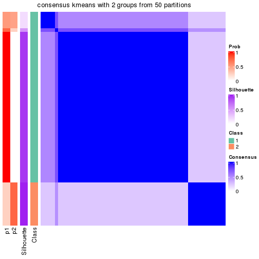</p>

</div>
<div id='tab-node-01-consensus-heatmap-2'>
<pre><code class="r">consensus_heatmap(res, k = 3)
</code></pre>

<p>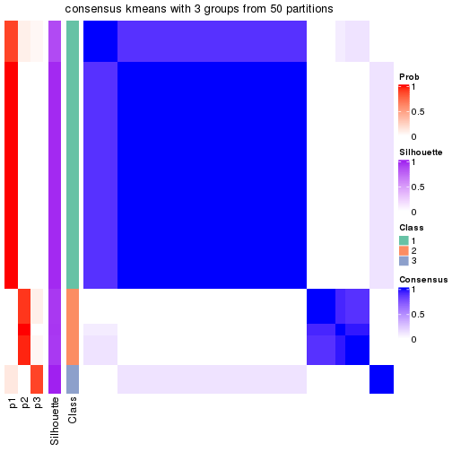</p>

</div>
<div id='tab-node-01-consensus-heatmap-3'>
<pre><code class="r">consensus_heatmap(res, k = 4)
</code></pre>

<p>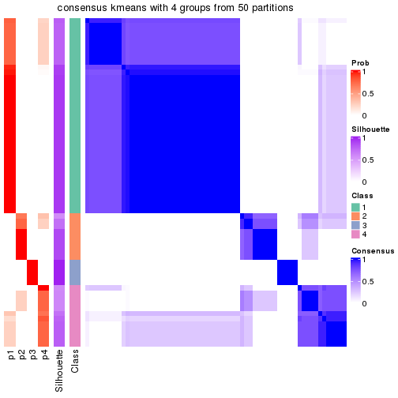</p>

</div>
<div id='tab-node-01-consensus-heatmap-4'>
<pre><code class="r">consensus_heatmap(res, k = 5)
</code></pre>

<p>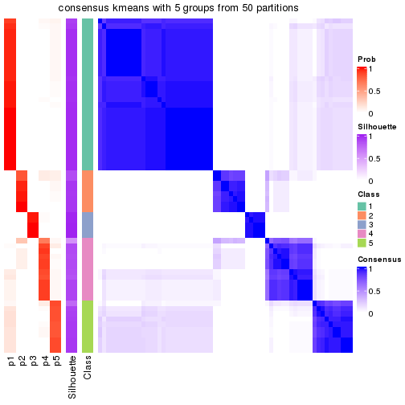</p>

</div>
<div id='tab-node-01-consensus-heatmap-5'>
<pre><code class="r">consensus_heatmap(res, k = 6)
</code></pre>

<p>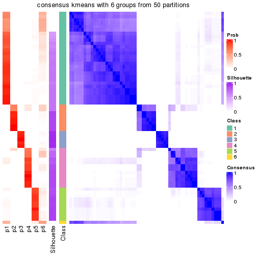</p>

</div>
<div id='tab-node-01-consensus-heatmap-6'>
<pre><code class="r">consensus_heatmap(res, k = 7)
</code></pre>

<p>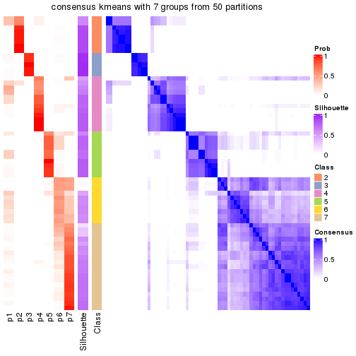</p>

</div>
<div id='tab-node-01-consensus-heatmap-7'>
<pre><code class="r">consensus_heatmap(res, k = 8)
</code></pre>

<p>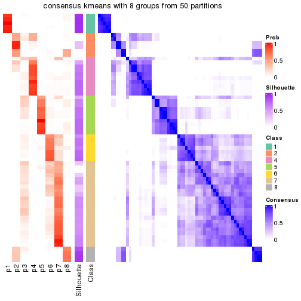</p>

</div>
</div>

Heatmaps for the membership of samples in all partitions to see how consistent they are:


<script>
$( function() {
	$( '#tabs-node-01-membership-heatmap' ).tabs();
} );
</script>
<div id='tabs-node-01-membership-heatmap'>
<ul>
<li><a href='#tab-node-01-membership-heatmap-1'>k = 2</a></li>
<li><a href='#tab-node-01-membership-heatmap-2'>k = 3</a></li>
<li><a href='#tab-node-01-membership-heatmap-3'>k = 4</a></li>
<li><a href='#tab-node-01-membership-heatmap-4'>k = 5</a></li>
<li><a href='#tab-node-01-membership-heatmap-5'>k = 6</a></li>
<li><a href='#tab-node-01-membership-heatmap-6'>k = 7</a></li>
<li><a href='#tab-node-01-membership-heatmap-7'>k = 8</a></li>
</ul>
<div id='tab-node-01-membership-heatmap-1'>
<pre><code class="r">membership_heatmap(res, k = 2)
</code></pre>

<p>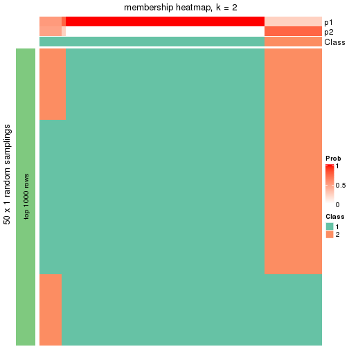</p>

</div>
<div id='tab-node-01-membership-heatmap-2'>
<pre><code class="r">membership_heatmap(res, k = 3)
</code></pre>

<p>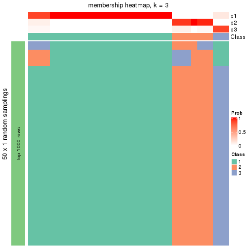</p>

</div>
<div id='tab-node-01-membership-heatmap-3'>
<pre><code class="r">membership_heatmap(res, k = 4)
</code></pre>

<p>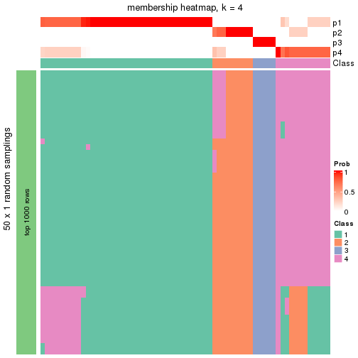</p>

</div>
<div id='tab-node-01-membership-heatmap-4'>
<pre><code class="r">membership_heatmap(res, k = 5)
</code></pre>

<p>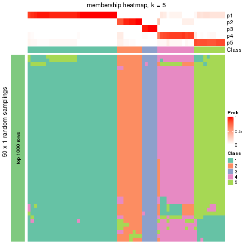</p>

</div>
<div id='tab-node-01-membership-heatmap-5'>
<pre><code class="r">membership_heatmap(res, k = 6)
</code></pre>

<p>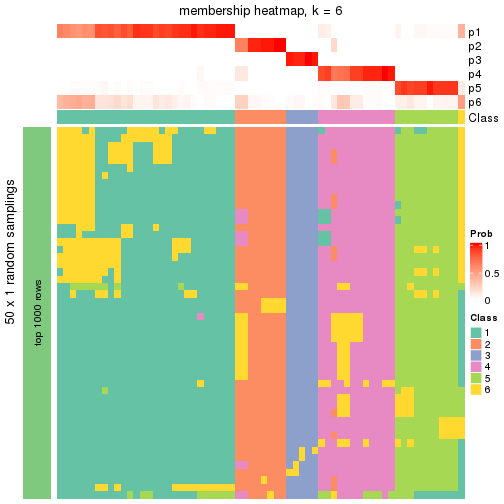</p>

</div>
<div id='tab-node-01-membership-heatmap-6'>
<pre><code class="r">membership_heatmap(res, k = 7)
</code></pre>

<p>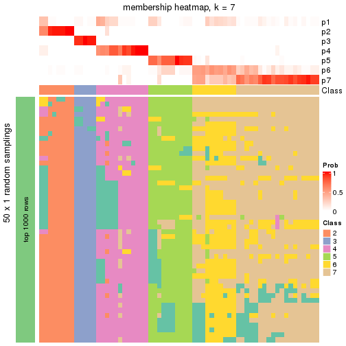</p>

</div>
<div id='tab-node-01-membership-heatmap-7'>
<pre><code class="r">membership_heatmap(res, k = 8)
</code></pre>

<p>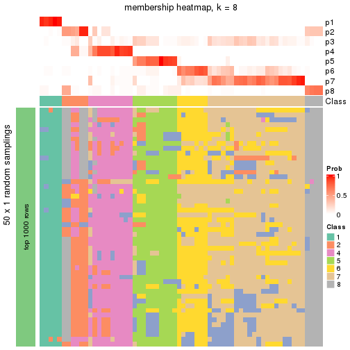</p>

</div>
</div>

As soon as the classes for columns are determined, the signatures
that are significantly different between subgroups can be looked for. 
Following are the heatmaps for signatures.


<script>
$( function() {
	$( '#tabs-node-01-get-signatures' ).tabs();
} );
</script>
<div id='tabs-node-01-get-signatures'>
<ul>
<li><a href='#tab-node-01-get-signatures-1'>k = 2</a></li>
<li><a href='#tab-node-01-get-signatures-2'>k = 3</a></li>
<li><a href='#tab-node-01-get-signatures-3'>k = 4</a></li>
<li><a href='#tab-node-01-get-signatures-4'>k = 5</a></li>
<li><a href='#tab-node-01-get-signatures-5'>k = 6</a></li>
<li><a href='#tab-node-01-get-signatures-6'>k = 7</a></li>
<li><a href='#tab-node-01-get-signatures-7'>k = 8</a></li>
</ul>
<div id='tab-node-01-get-signatures-1'>
<pre><code class="r">get_signatures(res, k = 2)
</code></pre>

<p>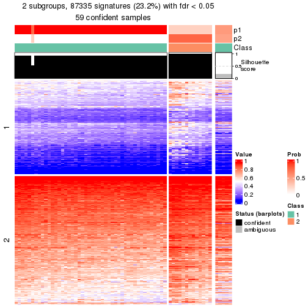</p>

</div>
<div id='tab-node-01-get-signatures-2'>
<pre><code class="r">get_signatures(res, k = 3)
</code></pre>

<p>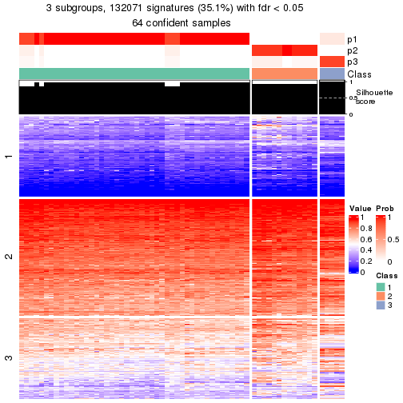</p>

</div>
<div id='tab-node-01-get-signatures-3'>
<pre><code class="r">get_signatures(res, k = 4)
</code></pre>

<p>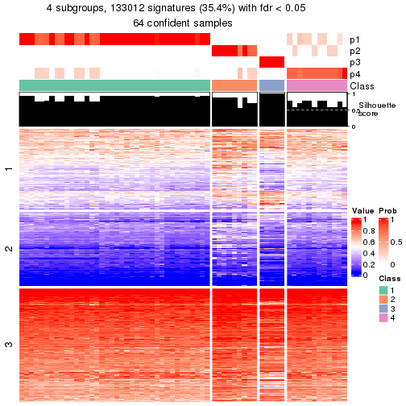</p>

</div>
<div id='tab-node-01-get-signatures-4'>
<pre><code class="r">get_signatures(res, k = 5)
</code></pre>

<p>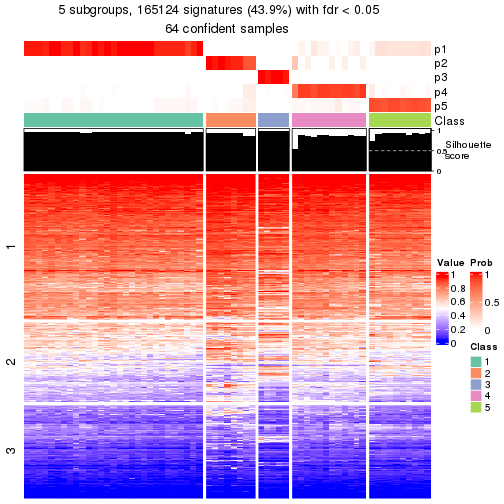</p>

</div>
<div id='tab-node-01-get-signatures-5'>
<pre><code class="r">get_signatures(res, k = 6)
</code></pre>

<p>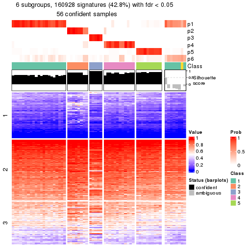</p>

</div>
<div id='tab-node-01-get-signatures-6'>
<pre><code class="r">get_signatures(res, k = 7)
</code></pre>

<p>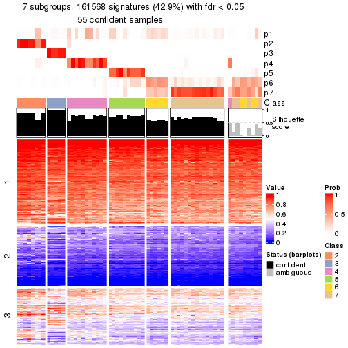</p>

</div>
<div id='tab-node-01-get-signatures-7'>
<pre><code class="r">get_signatures(res, k = 8)
</code></pre>

<p>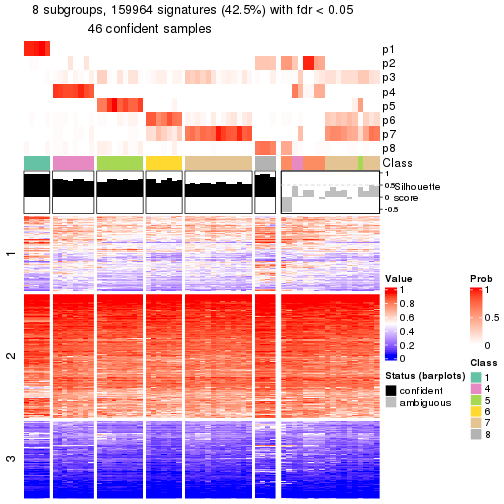</p>

</div>
</div>


Compare the overlap of signatures from different k:

```r
compare_signatures(res)
```

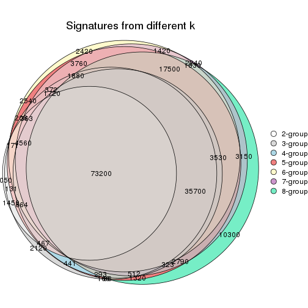

`get_signature()` returns a data frame invisibly. To get the list of signatures, the function
call should be assigned to a variable explicitly. In following code, if `plot` argument is set
to `FALSE`, no heatmap is plotted while only the differential analysis is performed.

```r
# code only for demonstration
tb = get_signature(res, k = ..., plot = FALSE)
```

An example of the output of `tb` is:

```
#>   which_row         fdr    mean_1    mean_2 scaled_mean_1 scaled_mean_2 km
#> 1        38 0.042760348  8.373488  9.131774    -0.5533452     0.5164555  1
#> 2        40 0.018707592  7.106213  8.469186    -0.6173731     0.5762149  1
#> 3        55 0.019134737 10.221463 11.207825    -0.6159697     0.5749050  1
#> 4        59 0.006059896  5.921854  7.869574    -0.6899429     0.6439467  1
#> 5        60 0.018055526  8.928898 10.211722    -0.6204761     0.5791110  1
#> 6        98 0.009384629 15.714769 14.887706     0.6635654    -0.6193277  2
...
```

The columns in `tb` are:

1. `which_row`: row indices corresponding to the input matrix.
2. `fdr`: FDR for the differential test. 
3. `mean_x`: The mean value in group x.
4. `scaled_mean_x`: The mean value in group x after rows are scaled.
5. `km`: Row groups if k-means clustering is applied to rows (which is done by automatically selecting number of clusters).

If there are too many signatures, `top_signatures = ...` can be set to only show the 
signatures with the highest FDRs:

```r
# code only for demonstration
# e.g. to show the top 500 most significant rows
tb = get_signature(res, k = ..., top_signatures = 500)
```

If the signatures are defined as these which are uniquely high in current group, `diff_method` argument
can be set to `"uniquely_high_in_one_group"`:

```r
# code only for demonstration
tb = get_signature(res, k = ..., diff_method = "uniquely_high_in_one_group")
```


UMAP plot which shows how samples are separated.


<script>
$( function() {
	$( '#tabs-node-01-dimension-reduction' ).tabs();
} );
</script>
<div id='tabs-node-01-dimension-reduction'>
<ul>
<li><a href='#tab-node-01-dimension-reduction-1'>k = 2</a></li>
<li><a href='#tab-node-01-dimension-reduction-2'>k = 3</a></li>
<li><a href='#tab-node-01-dimension-reduction-3'>k = 4</a></li>
<li><a href='#tab-node-01-dimension-reduction-4'>k = 5</a></li>
<li><a href='#tab-node-01-dimension-reduction-5'>k = 6</a></li>
<li><a href='#tab-node-01-dimension-reduction-6'>k = 7</a></li>
<li><a href='#tab-node-01-dimension-reduction-7'>k = 8</a></li>
</ul>
<div id='tab-node-01-dimension-reduction-1'>
<pre><code class="r">dimension_reduction(res, k = 2, method = &quot;UMAP&quot;)
</code></pre>

<p>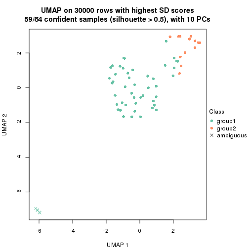</p>

</div>
<div id='tab-node-01-dimension-reduction-2'>
<pre><code class="r">dimension_reduction(res, k = 3, method = &quot;UMAP&quot;)
</code></pre>

<p>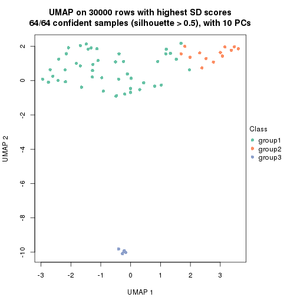</p>

</div>
<div id='tab-node-01-dimension-reduction-3'>
<pre><code class="r">dimension_reduction(res, k = 4, method = &quot;UMAP&quot;)
</code></pre>

<p></p>

</div>
<div id='tab-node-01-dimension-reduction-4'>
<pre><code class="r">dimension_reduction(res, k = 5, method = &quot;UMAP&quot;)
</code></pre>

<p>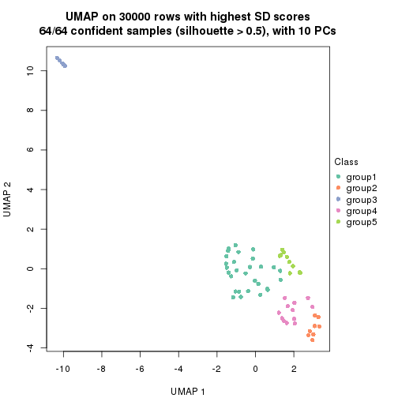</p>

</div>
<div id='tab-node-01-dimension-reduction-5'>
<pre><code class="r">dimension_reduction(res, k = 6, method = &quot;UMAP&quot;)
</code></pre>

<p>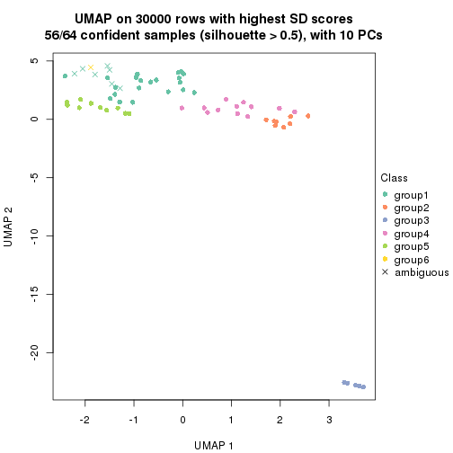</p>

</div>
<div id='tab-node-01-dimension-reduction-6'>
<pre><code class="r">dimension_reduction(res, k = 7, method = &quot;UMAP&quot;)
</code></pre>

<p>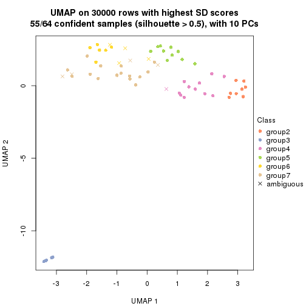</p>

</div>
<div id='tab-node-01-dimension-reduction-7'>
<pre><code class="r">dimension_reduction(res, k = 8, method = &quot;UMAP&quot;)
</code></pre>

<p>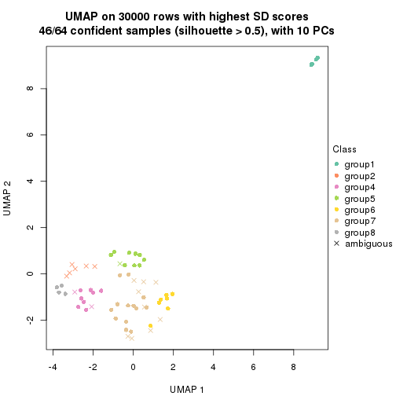</p>

</div>
</div>


Following heatmap shows how subgroups are split when increasing `k`:

```r
collect_classes(res)
```

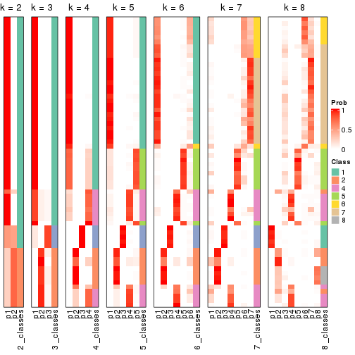


If matrix rows can be associated to genes, consider to use `functional_enrichment(res,
...)` to perform function enrichment for the signature genes. See [this vignette](https://jokergoo.github.io/cola_vignettes/functional_enrichment.html) for more detailed explanations.


 

---------------------------------------------------


### Node012


Parent node: [Node01](#Node01).
Child nodes: 
                Node0121-leaf
        ,
                Node0122-leaf
        ,
                Node0123-leaf
        ,
                Node0211-leaf
        ,
                [Node0212](#Node0212)
        ,
                Node0213-leaf
        ,
                [Node0221](#Node0221)
        ,
                Node0222-leaf
        ,
                Node0223-leaf
        ,
                [Node0231](#Node0231)
        ,
                Node0232-leaf
        ,
                Node0233-leaf
        ,
                Node0241-leaf
        ,
                Node0242-leaf
        ,
                Node0411-leaf
        ,
                Node0412-leaf
        ,
                Node0413-leaf
        ,
                Node0421-leaf
        ,
                Node0422-leaf
        ,
                Node0423-leaf
        ,
                Node0431-leaf
        ,
                Node0432-leaf
        ,
                Node0433-leaf
        ,
                Node0441-leaf
        ,
                Node0442-leaf
        ,
                Node0443-leaf
        ,
                Node0511-leaf
        ,
                [Node0512](#Node0512)
        ,
                Node0513-leaf
        ,
                Node0521-leaf
        ,
                Node0522-leaf
        ,
                Node0523-leaf
        .


The object with results only for a single top-value method and a single partitioning method 
can be extracted as:

```r
res = res_rh["012"]
```

A summary of `res` and all the functions that can be applied to it:

```r
res
```

```
#> A 'ConsensusPartition' object with k = 2, 3, 4, 5, 6, 7, 8.
#>   On a matrix with 30000 rows and 13 columns.
#>   Top rows (1000) are extracted by 'ATC' method.
#>   Subgroups are detected by 'kmeans' method.
#>   Performed in total 350 partitions by row resampling.
#>   Best k for subgroups seems to be 3.
#> 
#> Following methods can be applied to this 'ConsensusPartition' object:
#>  [1] "cola_report"             "collect_classes"         "collect_plots"          
#>  [4] "collect_stats"           "colnames"                "compare_partitions"     
#>  [7] "compare_signatures"      "consensus_heatmap"       "dimension_reduction"    
#> [10] "functional_enrichment"   "get_anno_col"            "get_anno"               
#> [13] "get_classes"             "get_consensus"           "get_matrix"             
#> [16] "get_membership"          "get_param"               "get_signatures"         
#> [19] "get_stats"               "is_best_k"               "is_stable_k"            
#> [22] "membership_heatmap"      "ncol"                    "nrow"                   
#> [25] "plot_ecdf"               "predict_classes"         "rownames"               
#> [28] "select_partition_number" "show"                    "suggest_best_k"         
#> [31] "test_to_known_factors"   "top_rows_heatmap"
```

`collect_plots()` function collects all the plots made from `res` for all `k` (number of subgroups)
into one single page to provide an easy and fast comparison between different `k`.

```r
collect_plots(res)
```

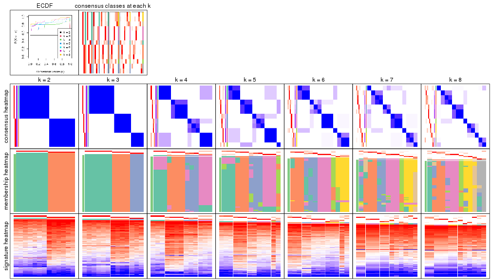

The plots are:

- The first row: a plot of the eCDF (empirical cumulative distribution
  function) curves of the consensus matrix for each `k` and the heatmap of
  predicted classes for each `k`.
- The second row: heatmaps of the consensus matrix for each `k`.
- The third row: heatmaps of the membership matrix for each `k`.
- The fouth row: heatmaps of the signatures for each `k`.

All the plots in panels can be made by individual functions and they are
plotted later in this section.

`select_partition_number()` produces several plots showing different
statistics for choosing "optimized" `k`. There are following statistics:

- eCDF curves of the consensus matrix for each `k`;
- 1-PAC. [The PAC score](https://en.wikipedia.org/wiki/Consensus_clustering#Over-interpretation_potential_of_consensus_clustering)
  measures the proportion of the ambiguous subgrouping.
- Mean silhouette score.
- Concordance. The mean probability of fiting the consensus subgroup labels in all
  partitions.
- Area increased. Denote $A_k$ as the area under the eCDF curve for current
  `k`, the area increased is defined as $A_k - A_{k-1}$.
- Rand index. The percent of pairs of samples that are both in a same cluster
  or both are not in a same cluster in the partition of k and k-1.
- Jaccard index. The ratio of pairs of samples are both in a same cluster in
  the partition of k and k-1 and the pairs of samples are both in a same
  cluster in the partition k or k-1.

The detailed explanations of these statistics can be found in [the _cola_
vignette](https://jokergoo.github.io/cola_vignettes/cola.html#toc_13).

Generally speaking, higher 1-PAC score, higher mean silhouette score or higher
concordance corresponds to better partition. Rand index and Jaccard index
measure how similar the current partition is compared to partition with `k-1`.
If they are too similar, we won't accept `k` is better than `k-1`.

```r
select_partition_number(res)
```

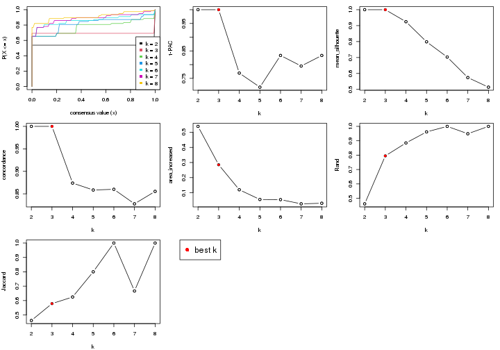

The numeric values for all these statistics can be obtained by `get_stats()`.

```r
get_stats(res)
```

```
#>   k 1-PAC mean_silhouette concordance area_increased  Rand Jaccard
#> 2 2 1.000           1.000       1.000         0.5389 0.462   0.462
#> 3 3 1.000           1.000       1.000         0.2852 0.795   0.579
#> 4 4 0.769           0.925       0.874         0.1198 0.885   0.625
#> 5 5 0.718           0.798       0.858         0.0555 0.962   0.800
#> 6 6 0.833           0.703       0.860         0.0546 1.000   1.000
#> 7 7 0.795           0.574       0.828         0.0267 0.949   0.667
#> 8 8 0.833           0.514       0.855         0.0306 1.000   1.000
```

`suggest_best_k()` suggests the best $k$ based on these statistics. The rules are as follows:

- All $k$ with Jaccard index larger than 0.95 are removed because increasing
  $k$ does not provide enough extra information. If all $k$ are removed, it is
  marked as no subgroup is detected.
- For all $k$ with 1-PAC score larger than 0.9, the maximal $k$ is taken as
  the best $k$, and other $k$ are marked as optional $k$.
- If it does not fit the second rule. The $k$ with the maximal vote of the
  highest 1-PAC score, highest mean silhouette, and highest concordance is
  taken as the best $k$.

```r
suggest_best_k(res)
```

```
#> [1] 3
#> attr(,"optional")
#> [1] 2
```

There is also optional best $k$ = 2 that is worth to check.

Following is the table of the partitions (You need to click the **show/hide
code output** link to see it). The membership matrix (columns with name `p*`)
is inferred by
[`clue::cl_consensus()`](https://www.rdocumentation.org/link/cl_consensus?package=clue)
function with the `SE` method. Basically the value in the membership matrix
represents the probability to belong to a certain group. The finall subgroup
label for an item is determined with the group with highest probability it
belongs to.

In `get_classes()` function, the entropy is calculated from the membership
matrix and the silhouette score is calculated from the consensus matrix.


<script>
$( function() {
	$( '#tabs-node-012-get-classes' ).tabs();
} );
</script>
<div id='tabs-node-012-get-classes'>
<ul>
<li><a href='#tab-node-012-get-classes-1'>k = 2</a></li>
<li><a href='#tab-node-012-get-classes-2'>k = 3</a></li>
<li><a href='#tab-node-012-get-classes-3'>k = 4</a></li>
<li><a href='#tab-node-012-get-classes-4'>k = 5</a></li>
<li><a href='#tab-node-012-get-classes-5'>k = 6</a></li>
<li><a href='#tab-node-012-get-classes-6'>k = 7</a></li>
<li><a href='#tab-node-012-get-classes-7'>k = 8</a></li>
</ul>

<div id='tab-node-012-get-classes-1'>
<p><a id='tab-node-012-get-classes-1-a' style='color:#0366d6' href='#'>show/hide code output</a></p>
<pre><code class="r">cbind(get_classes(res, k = 2), get_membership(res, k = 2))
</code></pre>

<pre><code>#&gt;                 class entropy silhouette p1 p2
#&gt; TCGA.EJ.AB20.01     2       0          1  0  1
#&gt; TCGA.EJ.7328.11     1       0          1  1  0
#&gt; TCGA.HC.7752.11     2       0          1  0  1
#&gt; TCGA.EJ.7125.11     1       0          1  1  0
#&gt; TCGA.G9.6385.01     2       0          1  0  1
#&gt; TCGA.H9.A6BX.01     1       0          1  1  0
#&gt; TCGA.G9.6364.11     2       0          1  0  1
#&gt; TCGA.EJ.7331.11     1       0          1  1  0
#&gt; TCGA.G9.6385.11     1       0          1  1  0
#&gt; TCGA.EJ.7786.11     1       0          1  1  0
#&gt; TCGA.FC.A8O0.01     2       0          1  0  1
#&gt; TCGA.EJ.7327.11     2       0          1  0  1
#&gt; TCGA.CH.5763.11     1       0          1  1  0
</code></pre>

<script>
$('#tab-node-012-get-classes-1-a').parent().next().next().hide();
$('#tab-node-012-get-classes-1-a').click(function(){
  $('#tab-node-012-get-classes-1-a').parent().next().next().toggle();
  return(false);
});
</script>
</div>

<div id='tab-node-012-get-classes-2'>
<p><a id='tab-node-012-get-classes-2-a' style='color:#0366d6' href='#'>show/hide code output</a></p>
<pre><code class="r">cbind(get_classes(res, k = 3), get_membership(res, k = 3))
</code></pre>

<pre><code>#&gt;                 class entropy silhouette p1 p2 p3
#&gt; TCGA.EJ.AB20.01     3       0          1  0  0  1
#&gt; TCGA.EJ.7328.11     1       0          1  1  0  0
#&gt; TCGA.HC.7752.11     2       0          1  0  1  0
#&gt; TCGA.EJ.7125.11     1       0          1  1  0  0
#&gt; TCGA.G9.6385.01     2       0          1  0  1  0
#&gt; TCGA.H9.A6BX.01     1       0          1  1  0  0
#&gt; TCGA.G9.6364.11     3       0          1  0  0  1
#&gt; TCGA.EJ.7331.11     1       0          1  1  0  0
#&gt; TCGA.G9.6385.11     3       0          1  0  0  1
#&gt; TCGA.EJ.7786.11     1       0          1  1  0  0
#&gt; TCGA.FC.A8O0.01     2       0          1  0  1  0
#&gt; TCGA.EJ.7327.11     2       0          1  0  1  0
#&gt; TCGA.CH.5763.11     1       0          1  1  0  0
</code></pre>

<script>
$('#tab-node-012-get-classes-2-a').parent().next().next().hide();
$('#tab-node-012-get-classes-2-a').click(function(){
  $('#tab-node-012-get-classes-2-a').parent().next().next().toggle();
  return(false);
});
</script>
</div>

<div id='tab-node-012-get-classes-3'>
<p><a id='tab-node-012-get-classes-3-a' style='color:#0366d6' href='#'>show/hide code output</a></p>
<pre><code class="r">cbind(get_classes(res, k = 4), get_membership(res, k = 4))
</code></pre>

<pre><code>#&gt;                 class entropy silhouette   p1  p2   p3   p4
#&gt; TCGA.EJ.AB20.01     3   0.234      0.826 0.00 0.0 0.90 0.10
#&gt; TCGA.EJ.7328.11     1   0.000      1.000 1.00 0.0 0.00 0.00
#&gt; TCGA.HC.7752.11     2   0.000      0.945 0.00 1.0 0.00 0.00
#&gt; TCGA.EJ.7125.11     4   0.471      1.000 0.36 0.0 0.00 0.64
#&gt; TCGA.G9.6385.01     2   0.000      0.945 0.00 1.0 0.00 0.00
#&gt; TCGA.H9.A6BX.01     1   0.000      1.000 1.00 0.0 0.00 0.00
#&gt; TCGA.G9.6364.11     3   0.000      0.842 0.00 0.0 1.00 0.00
#&gt; TCGA.EJ.7331.11     4   0.471      1.000 0.36 0.0 0.00 0.64
#&gt; TCGA.G9.6385.11     3   0.413      0.695 0.00 0.0 0.74 0.26
#&gt; TCGA.EJ.7786.11     4   0.471      1.000 0.36 0.0 0.00 0.64
#&gt; TCGA.FC.A8O0.01     2   0.361      0.824 0.00 0.8 0.00 0.20
#&gt; TCGA.EJ.7327.11     2   0.000      0.945 0.00 1.0 0.00 0.00
#&gt; TCGA.CH.5763.11     1   0.000      1.000 1.00 0.0 0.00 0.00
</code></pre>

<script>
$('#tab-node-012-get-classes-3-a').parent().next().next().hide();
$('#tab-node-012-get-classes-3-a').click(function(){
  $('#tab-node-012-get-classes-3-a').parent().next().next().toggle();
  return(false);
});
</script>
</div>

<div id='tab-node-012-get-classes-4'>
<p><a id='tab-node-012-get-classes-4-a' style='color:#0366d6' href='#'>show/hide code output</a></p>
<pre><code class="r">cbind(get_classes(res, k = 5), get_membership(res, k = 5))
</code></pre>

<pre><code>#&gt;                 class entropy silhouette   p1   p2   p3   p4   p5
#&gt; TCGA.EJ.AB20.01     3   0.000      0.705 0.00 0.00 1.00 0.00 0.00
#&gt; TCGA.EJ.7328.11     1   0.327      0.954 0.78 0.00 0.00 0.22 0.00
#&gt; TCGA.HC.7752.11     2   0.000      0.912 0.00 1.00 0.00 0.00 0.00
#&gt; TCGA.EJ.7125.11     4   0.000      1.000 0.00 0.00 0.00 1.00 0.00
#&gt; TCGA.G9.6385.01     2   0.000      0.912 0.00 1.00 0.00 0.00 0.00
#&gt; TCGA.H9.A6BX.01     1   0.327      0.954 0.78 0.00 0.00 0.22 0.00
#&gt; TCGA.G9.6364.11     3   0.275      0.723 0.04 0.00 0.88 0.00 0.08
#&gt; TCGA.EJ.7331.11     4   0.000      1.000 0.00 0.00 0.00 1.00 0.00
#&gt; TCGA.G9.6385.11     3   0.748      0.499 0.06 0.00 0.46 0.20 0.28
#&gt; TCGA.EJ.7786.11     4   0.000      1.000 0.00 0.00 0.00 1.00 0.00
#&gt; TCGA.FC.A8O0.01     5   0.413      0.000 0.00 0.38 0.00 0.00 0.62
#&gt; TCGA.EJ.7327.11     2   0.228      0.815 0.12 0.88 0.00 0.00 0.00
#&gt; TCGA.CH.5763.11     1   0.513      0.906 0.68 0.00 0.00 0.22 0.10
</code></pre>

<script>
$('#tab-node-012-get-classes-4-a').parent().next().next().hide();
$('#tab-node-012-get-classes-4-a').click(function(){
  $('#tab-node-012-get-classes-4-a').parent().next().next().toggle();
  return(false);
});
</script>
</div>

<div id='tab-node-012-get-classes-5'>
<p><a id='tab-node-012-get-classes-5-a' style='color:#0366d6' href='#'>show/hide code output</a></p>
<pre><code class="r">cbind(get_classes(res, k = 6), get_membership(res, k = 6))
</code></pre>

<pre><code>#&gt;                 class entropy silhouette   p1   p2  p3   p4   p5   p6
#&gt; TCGA.EJ.AB20.01     3  0.3819      0.507 0.28 0.00 0.7 0.00 0.00 0.02
#&gt; TCGA.EJ.7328.11     6  0.4609      0.808 0.00 0.00 0.0 0.04 0.42 0.54
#&gt; TCGA.HC.7752.11     2  0.0000      0.872 0.00 1.00 0.0 0.00 0.00 0.00
#&gt; TCGA.EJ.7125.11     4  0.0000      1.000 0.00 0.00 0.0 1.00 0.00 0.00
#&gt; TCGA.G9.6385.01     2  0.0000      0.872 0.00 1.00 0.0 0.00 0.00 0.00
#&gt; TCGA.H9.A6BX.01     6  0.4609      0.808 0.00 0.00 0.0 0.04 0.42 0.54
#&gt; TCGA.G9.6364.11     3  0.0000      0.600 0.00 0.00 1.0 0.00 0.00 0.00
#&gt; TCGA.EJ.7331.11     4  0.0000      1.000 0.00 0.00 0.0 1.00 0.00 0.00
#&gt; TCGA.G9.6385.11     3  0.5265      0.373 0.40 0.00 0.5 0.10 0.00 0.00
#&gt; TCGA.EJ.7786.11     4  0.0000      1.000 0.00 0.00 0.0 1.00 0.00 0.00
#&gt; TCGA.FC.A8O0.01     5  0.5289      0.000 0.14 0.28 0.0 0.00 0.58 0.00
#&gt; TCGA.EJ.7327.11     2  0.3156      0.724 0.18 0.80 0.0 0.00 0.00 0.02
#&gt; TCGA.CH.5763.11     6  0.0937      0.574 0.00 0.00 0.0 0.04 0.00 0.96
</code></pre>

<script>
$('#tab-node-012-get-classes-5-a').parent().next().next().hide();
$('#tab-node-012-get-classes-5-a').click(function(){
  $('#tab-node-012-get-classes-5-a').parent().next().next().toggle();
  return(false);
});
</script>
</div>

<div id='tab-node-012-get-classes-6'>
<p><a id='tab-node-012-get-classes-6-a' style='color:#0366d6' href='#'>show/hide code output</a></p>
<pre><code class="r">cbind(get_classes(res, k = 7), get_membership(res, k = 7))
</code></pre>

<pre><code>#&gt;                 class entropy silhouette   p1   p2   p3   p4   p5   p6   p7
#&gt; TCGA.EJ.AB20.01     3  0.0000      0.569 0.00 0.00 1.00 0.00 0.00 0.00 0.00
#&gt; TCGA.EJ.7328.11     6  0.0863      0.820 0.00 0.00 0.00 0.04 0.00 0.96 0.00
#&gt; TCGA.HC.7752.11     2  0.0863      0.751 0.04 0.96 0.00 0.00 0.00 0.00 0.00
#&gt; TCGA.EJ.7125.11     4  0.1671      0.896 0.00 0.00 0.00 0.90 0.10 0.00 0.00
#&gt; TCGA.G9.6385.01     2  0.0000      0.751 0.00 1.00 0.00 0.00 0.00 0.00 0.00
#&gt; TCGA.H9.A6BX.01     6  0.3404      0.820 0.08 0.00 0.00 0.04 0.06 0.82 0.00
#&gt; TCGA.G9.6364.11     3  0.4993      0.471 0.26 0.00 0.64 0.00 0.02 0.04 0.04
#&gt; TCGA.EJ.7331.11     4  0.0000      0.949 0.00 0.00 0.00 1.00 0.00 0.00 0.00
#&gt; TCGA.G9.6385.11     1  0.3670      0.000 0.76 0.00 0.10 0.14 0.00 0.00 0.00
#&gt; TCGA.EJ.7786.11     4  0.0000      0.949 0.00 0.00 0.00 1.00 0.00 0.00 0.00
#&gt; TCGA.FC.A8O0.01     5  0.2422      0.000 0.00 0.18 0.00 0.00 0.82 0.00 0.00
#&gt; TCGA.EJ.7327.11     2  0.4714      0.485 0.12 0.60 0.00 0.00 0.00 0.00 0.28
#&gt; TCGA.CH.5763.11     7  0.3841      0.000 0.00 0.00 0.00 0.04 0.00 0.28 0.68
</code></pre>

<script>
$('#tab-node-012-get-classes-6-a').parent().next().next().hide();
$('#tab-node-012-get-classes-6-a').click(function(){
  $('#tab-node-012-get-classes-6-a').parent().next().next().toggle();
  return(false);
});
</script>
</div>

<div id='tab-node-012-get-classes-7'>
<p><a id='tab-node-012-get-classes-7-a' style='color:#0366d6' href='#'>show/hide code output</a></p>
<pre><code class="r">cbind(get_classes(res, k = 8), get_membership(res, k = 8))
</code></pre>

<pre><code>#&gt;                 class entropy silhouette   p1   p2   p3   p4   p5   p6   p7   p8
#&gt; TCGA.EJ.AB20.01     8   0.330      0.530 0.44 0.00 0.00 0.00 0.00 0.00 0.00 0.56
#&gt; TCGA.EJ.7328.11     6   0.000      0.683 0.00 0.00 0.00 0.00 0.00 1.00 0.00 0.00
#&gt; TCGA.HC.7752.11     2   0.332      0.703 0.00 0.54 0.46 0.00 0.00 0.00 0.00 0.00
#&gt; TCGA.EJ.7125.11     4   0.388      0.741 0.14 0.00 0.02 0.74 0.10 0.00 0.00 0.00
#&gt; TCGA.G9.6385.01     2   0.472      0.703 0.02 0.54 0.36 0.00 0.00 0.00 0.08 0.00
#&gt; TCGA.H9.A6BX.01     6   0.384      0.683 0.02 0.00 0.24 0.00 0.04 0.70 0.00 0.00
#&gt; TCGA.G9.6364.11     8   0.000      0.434 0.00 0.00 0.00 0.00 0.00 0.00 0.00 1.00
#&gt; TCGA.EJ.7331.11     4   0.000      0.879 0.00 0.00 0.00 1.00 0.00 0.00 0.00 0.00
#&gt; TCGA.G9.6385.11     1   0.635      0.000 0.38 0.00 0.28 0.02 0.00 0.00 0.06 0.26
#&gt; TCGA.EJ.7786.11     4   0.000      0.879 0.00 0.00 0.00 1.00 0.00 0.00 0.00 0.00
#&gt; TCGA.FC.A8O0.01     5   0.195      0.000 0.00 0.14 0.00 0.00 0.86 0.00 0.00 0.00
#&gt; TCGA.EJ.7327.11     2   0.000      0.446 0.00 1.00 0.00 0.00 0.00 0.00 0.00 0.00
#&gt; TCGA.CH.5763.11     7   0.195      0.000 0.00 0.00 0.00 0.00 0.00 0.14 0.86 0.00
</code></pre>

<script>
$('#tab-node-012-get-classes-7-a').parent().next().next().hide();
$('#tab-node-012-get-classes-7-a').click(function(){
  $('#tab-node-012-get-classes-7-a').parent().next().next().toggle();
  return(false);
});
</script>
</div>
</div>

Heatmaps for the consensus matrix. It visualizes the probability of two
samples to be in a same group.


<script>
$( function() {
	$( '#tabs-node-012-consensus-heatmap' ).tabs();
} );
</script>
<div id='tabs-node-012-consensus-heatmap'>
<ul>
<li><a href='#tab-node-012-consensus-heatmap-1'>k = 2</a></li>
<li><a href='#tab-node-012-consensus-heatmap-2'>k = 3</a></li>
<li><a href='#tab-node-012-consensus-heatmap-3'>k = 4</a></li>
<li><a href='#tab-node-012-consensus-heatmap-4'>k = 5</a></li>
<li><a href='#tab-node-012-consensus-heatmap-5'>k = 6</a></li>
<li><a href='#tab-node-012-consensus-heatmap-6'>k = 7</a></li>
<li><a href='#tab-node-012-consensus-heatmap-7'>k = 8</a></li>
</ul>
<div id='tab-node-012-consensus-heatmap-1'>
<pre><code class="r">consensus_heatmap(res, k = 2)
</code></pre>

<p>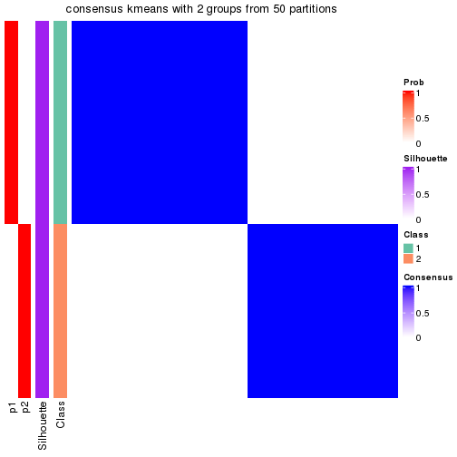</p>

</div>
<div id='tab-node-012-consensus-heatmap-2'>
<pre><code class="r">consensus_heatmap(res, k = 3)
</code></pre>

<p>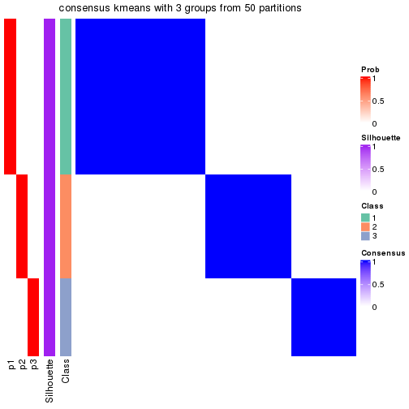</p>

</div>
<div id='tab-node-012-consensus-heatmap-3'>
<pre><code class="r">consensus_heatmap(res, k = 4)
</code></pre>

<p>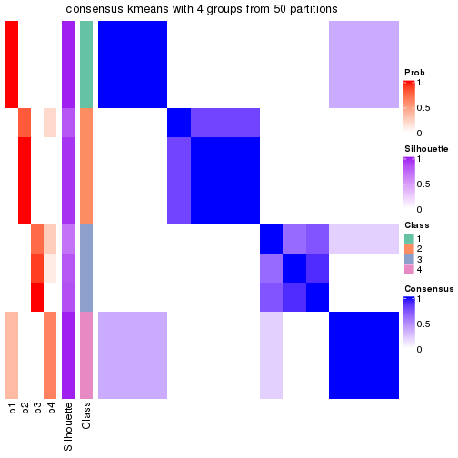</p>

</div>
<div id='tab-node-012-consensus-heatmap-4'>
<pre><code class="r">consensus_heatmap(res, k = 5)
</code></pre>

<p>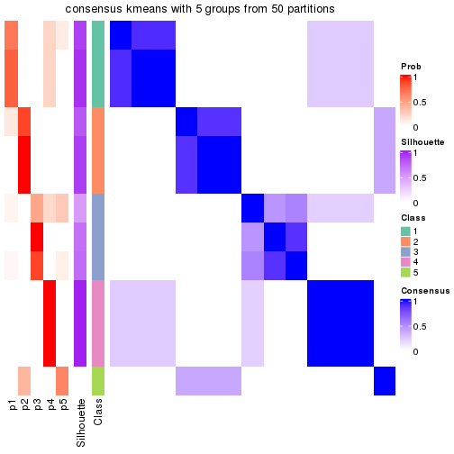</p>

</div>
<div id='tab-node-012-consensus-heatmap-5'>
<pre><code class="r">consensus_heatmap(res, k = 6)
</code></pre>

<p>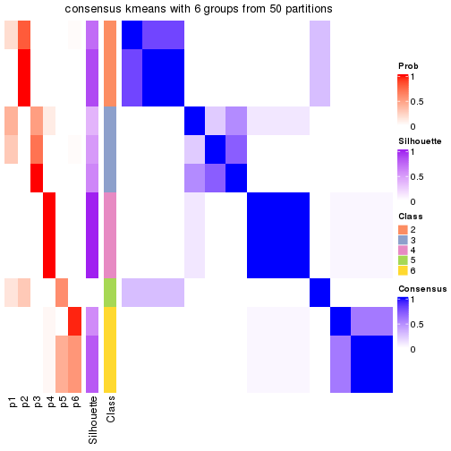</p>

</div>
<div id='tab-node-012-consensus-heatmap-6'>
<pre><code class="r">consensus_heatmap(res, k = 7)
</code></pre>

<p>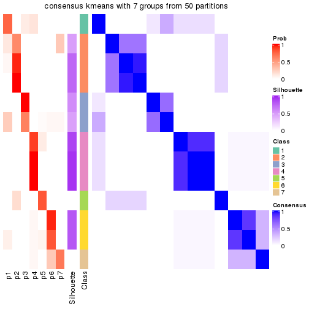</p>

</div>
<div id='tab-node-012-consensus-heatmap-7'>
<pre><code class="r">consensus_heatmap(res, k = 8)
</code></pre>

<p>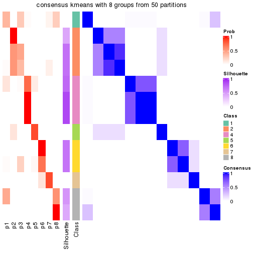</p>

</div>
</div>

Heatmaps for the membership of samples in all partitions to see how consistent they are:


<script>
$( function() {
	$( '#tabs-node-012-membership-heatmap' ).tabs();
} );
</script>
<div id='tabs-node-012-membership-heatmap'>
<ul>
<li><a href='#tab-node-012-membership-heatmap-1'>k = 2</a></li>
<li><a href='#tab-node-012-membership-heatmap-2'>k = 3</a></li>
<li><a href='#tab-node-012-membership-heatmap-3'>k = 4</a></li>
<li><a href='#tab-node-012-membership-heatmap-4'>k = 5</a></li>
<li><a href='#tab-node-012-membership-heatmap-5'>k = 6</a></li>
<li><a href='#tab-node-012-membership-heatmap-6'>k = 7</a></li>
<li><a href='#tab-node-012-membership-heatmap-7'>k = 8</a></li>
</ul>
<div id='tab-node-012-membership-heatmap-1'>
<pre><code class="r">membership_heatmap(res, k = 2)
</code></pre>

<p>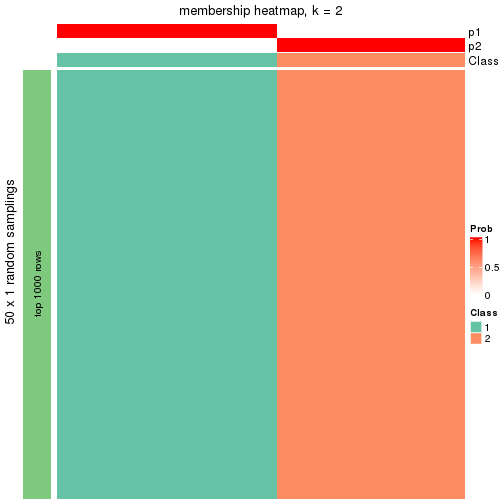</p>

</div>
<div id='tab-node-012-membership-heatmap-2'>
<pre><code class="r">membership_heatmap(res, k = 3)
</code></pre>

<p>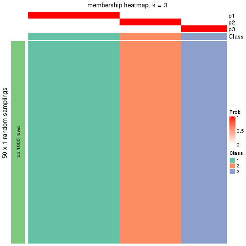</p>

</div>
<div id='tab-node-012-membership-heatmap-3'>
<pre><code class="r">membership_heatmap(res, k = 4)
</code></pre>

<p>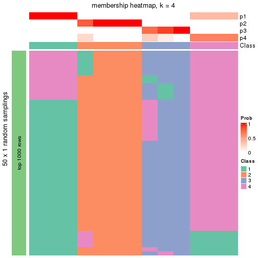</p>

</div>
<div id='tab-node-012-membership-heatmap-4'>
<pre><code class="r">membership_heatmap(res, k = 5)
</code></pre>

<p>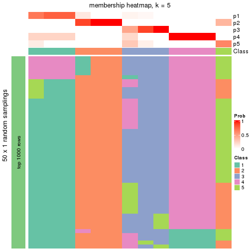</p>

</div>
<div id='tab-node-012-membership-heatmap-5'>
<pre><code class="r">membership_heatmap(res, k = 6)
</code></pre>

<p>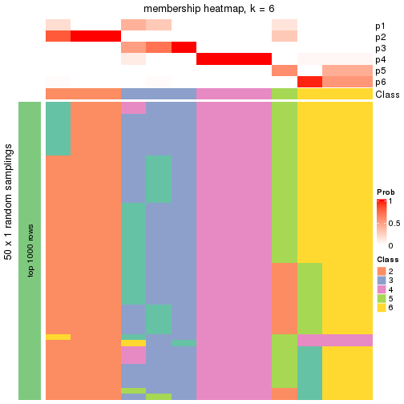</p>

</div>
<div id='tab-node-012-membership-heatmap-6'>
<pre><code class="r">membership_heatmap(res, k = 7)
</code></pre>

<p>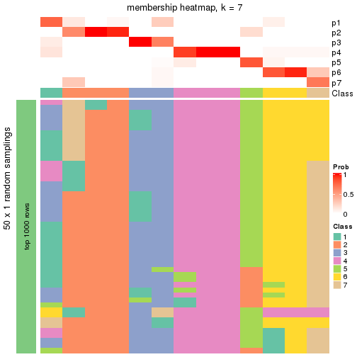</p>

</div>
<div id='tab-node-012-membership-heatmap-7'>
<pre><code class="r">membership_heatmap(res, k = 8)
</code></pre>

<p>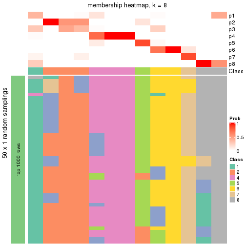</p>

</div>
</div>

As soon as the classes for columns are determined, the signatures
that are significantly different between subgroups can be looked for. 
Following are the heatmaps for signatures.


<script>
$( function() {
	$( '#tabs-node-012-get-signatures' ).tabs();
} );
</script>
<div id='tabs-node-012-get-signatures'>
<ul>
<li><a href='#tab-node-012-get-signatures-1'>k = 2</a></li>
<li><a href='#tab-node-012-get-signatures-2'>k = 3</a></li>
<li><a href='#tab-node-012-get-signatures-3'>k = 4</a></li>
<li><a href='#tab-node-012-get-signatures-4'>k = 5</a></li>
<li><a href='#tab-node-012-get-signatures-5'>k = 6</a></li>
<li><a href='#tab-node-012-get-signatures-6'>k = 7</a></li>
<li><a href='#tab-node-012-get-signatures-7'>k = 8</a></li>
</ul>
<div id='tab-node-012-get-signatures-1'>
<pre><code class="r">get_signatures(res, k = 2)
</code></pre>

<p>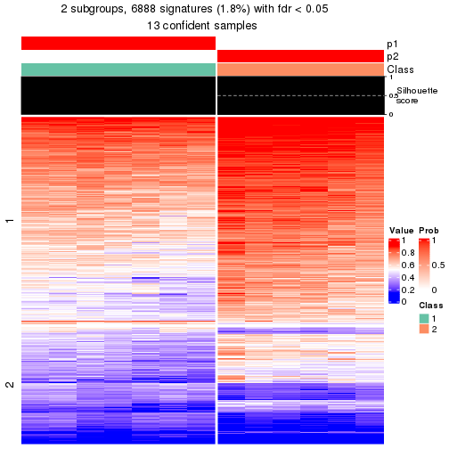</p>

</div>
<div id='tab-node-012-get-signatures-2'>
<pre><code class="r">get_signatures(res, k = 3)
</code></pre>

<p>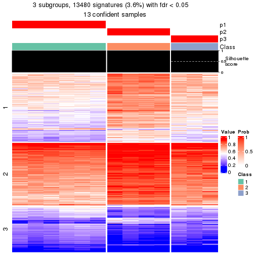</p>

</div>
<div id='tab-node-012-get-signatures-3'>
<pre><code class="r">get_signatures(res, k = 4)
</code></pre>

<p>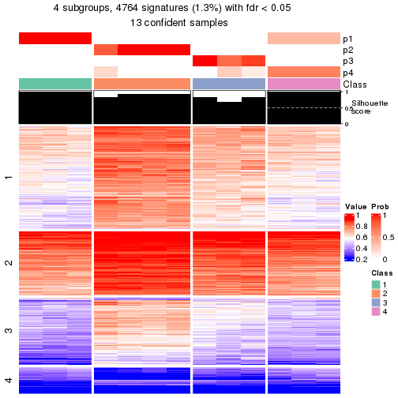</p>

</div>
<div id='tab-node-012-get-signatures-4'>
<pre><code class="r">get_signatures(res, k = 5)
</code></pre>

<p>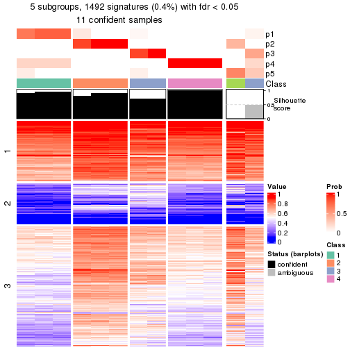</p>

</div>
<div id='tab-node-012-get-signatures-5'>
<pre><code class="r">get_signatures(res, k = 6)
</code></pre>

<p>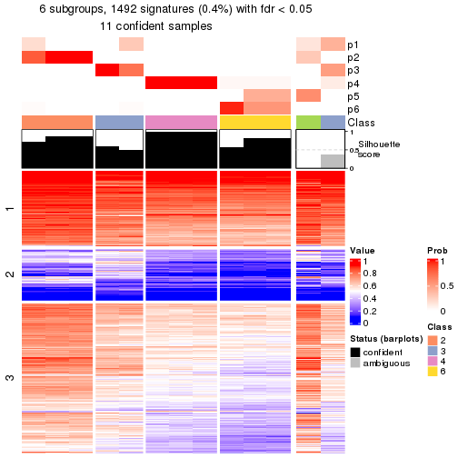</p>

</div>
<div id='tab-node-012-get-signatures-6'>
<pre><code class="r">get_signatures(res, k = 7)
</code></pre>

<p>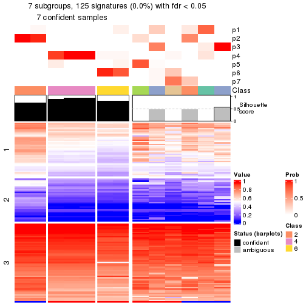</p>

</div>
<div id='tab-node-012-get-signatures-7'>
<pre><code class="r">get_signatures(res, k = 8)
</code></pre>

<p>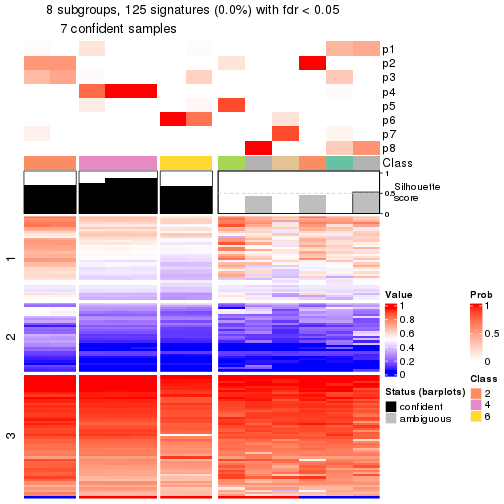</p>

</div>
</div>


Compare the overlap of signatures from different k:

```r
compare_signatures(res)
```

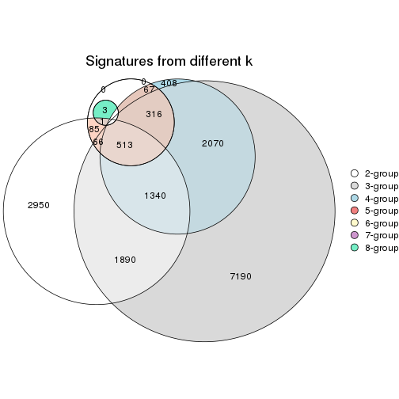

`get_signature()` returns a data frame invisibly. To get the list of signatures, the function
call should be assigned to a variable explicitly. In following code, if `plot` argument is set
to `FALSE`, no heatmap is plotted while only the differential analysis is performed.

```r
# code only for demonstration
tb = get_signature(res, k = ..., plot = FALSE)
```

An example of the output of `tb` is:

```
#>   which_row         fdr    mean_1    mean_2 scaled_mean_1 scaled_mean_2 km
#> 1        38 0.042760348  8.373488  9.131774    -0.5533452     0.5164555  1
#> 2        40 0.018707592  7.106213  8.469186    -0.6173731     0.5762149  1
#> 3        55 0.019134737 10.221463 11.207825    -0.6159697     0.5749050  1
#> 4        59 0.006059896  5.921854  7.869574    -0.6899429     0.6439467  1
#> 5        60 0.018055526  8.928898 10.211722    -0.6204761     0.5791110  1
#> 6        98 0.009384629 15.714769 14.887706     0.6635654    -0.6193277  2
...
```

The columns in `tb` are:

1. `which_row`: row indices corresponding to the input matrix.
2. `fdr`: FDR for the differential test. 
3. `mean_x`: The mean value in group x.
4. `scaled_mean_x`: The mean value in group x after rows are scaled.
5. `km`: Row groups if k-means clustering is applied to rows (which is done by automatically selecting number of clusters).

If there are too many signatures, `top_signatures = ...` can be set to only show the 
signatures with the highest FDRs:

```r
# code only for demonstration
# e.g. to show the top 500 most significant rows
tb = get_signature(res, k = ..., top_signatures = 500)
```

If the signatures are defined as these which are uniquely high in current group, `diff_method` argument
can be set to `"uniquely_high_in_one_group"`:

```r
# code only for demonstration
tb = get_signature(res, k = ..., diff_method = "uniquely_high_in_one_group")
```


UMAP plot which shows how samples are separated.


<script>
$( function() {
	$( '#tabs-node-012-dimension-reduction' ).tabs();
} );
</script>
<div id='tabs-node-012-dimension-reduction'>
<ul>
<li><a href='#tab-node-012-dimension-reduction-1'>k = 2</a></li>
<li><a href='#tab-node-012-dimension-reduction-2'>k = 3</a></li>
<li><a href='#tab-node-012-dimension-reduction-3'>k = 4</a></li>
<li><a href='#tab-node-012-dimension-reduction-4'>k = 5</a></li>
<li><a href='#tab-node-012-dimension-reduction-5'>k = 6</a></li>
<li><a href='#tab-node-012-dimension-reduction-6'>k = 7</a></li>
<li><a href='#tab-node-012-dimension-reduction-7'>k = 8</a></li>
</ul>
<div id='tab-node-012-dimension-reduction-1'>
<pre><code class="r">dimension_reduction(res, k = 2, method = &quot;UMAP&quot;)
</code></pre>

<p>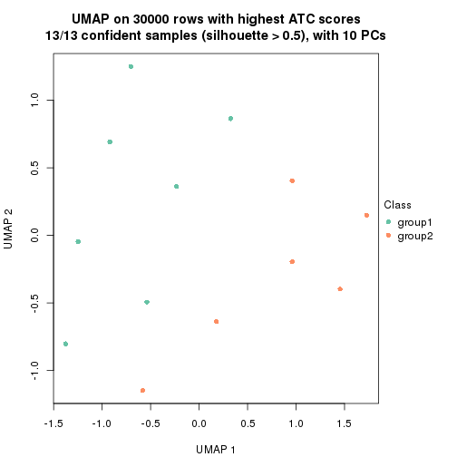</p>

</div>
<div id='tab-node-012-dimension-reduction-2'>
<pre><code class="r">dimension_reduction(res, k = 3, method = &quot;UMAP&quot;)
</code></pre>

<p>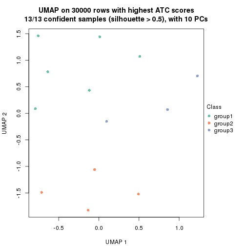</p>

</div>
<div id='tab-node-012-dimension-reduction-3'>
<pre><code class="r">dimension_reduction(res, k = 4, method = &quot;UMAP&quot;)
</code></pre>

<p>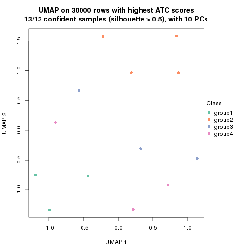</p>

</div>
<div id='tab-node-012-dimension-reduction-4'>
<pre><code class="r">dimension_reduction(res, k = 5, method = &quot;UMAP&quot;)
</code></pre>

<p>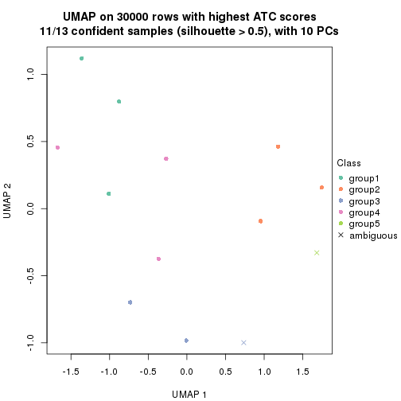</p>

</div>
<div id='tab-node-012-dimension-reduction-5'>
<pre><code class="r">dimension_reduction(res, k = 6, method = &quot;UMAP&quot;)
</code></pre>

<p>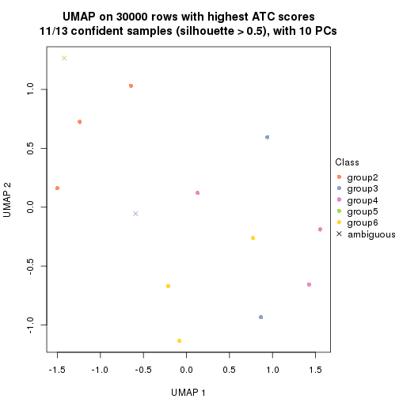</p>

</div>
<div id='tab-node-012-dimension-reduction-6'>
<pre><code class="r">dimension_reduction(res, k = 7, method = &quot;UMAP&quot;)
</code></pre>

<p>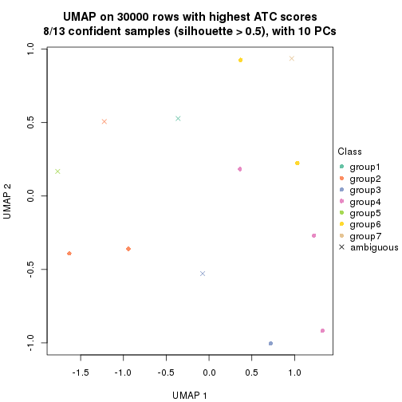</p>

</div>
<div id='tab-node-012-dimension-reduction-7'>
<pre><code class="r">dimension_reduction(res, k = 8, method = &quot;UMAP&quot;)
</code></pre>

<p>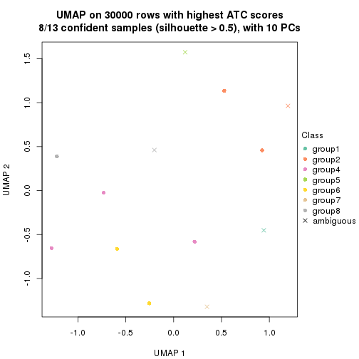</p>

</div>
</div>


Following heatmap shows how subgroups are split when increasing `k`:

```r
collect_classes(res)
```

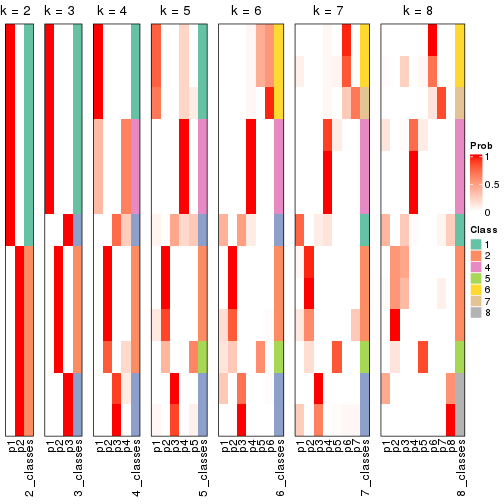


If matrix rows can be associated to genes, consider to use `functional_enrichment(res,
...)` to perform function enrichment for the signature genes. See [this vignette](https://jokergoo.github.io/cola_vignettes/functional_enrichment.html) for more detailed explanations.


 

---------------------------------------------------


### Node02


Parent node: [Node0](#Node0).
Child nodes: 
                Node011-leaf
        ,
                [Node012](#Node012)
        ,
                Node013-leaf
        ,
                [Node021](#Node021)
        ,
                [Node022](#Node022)
        ,
                [Node023](#Node023)
        ,
                [Node024](#Node024)
        ,
                Node031-leaf
        ,
                Node032-leaf
        ,
                Node033-leaf
        ,
                Node034-leaf
        ,
                [Node041](#Node041)
        ,
                [Node042](#Node042)
        ,
                [Node043](#Node043)
        ,
                [Node044](#Node044)
        ,
                [Node051](#Node051)
        ,
                [Node052](#Node052)
        ,
                Node053-leaf
        .


The object with results only for a single top-value method and a single partitioning method 
can be extracted as:

```r
res = res_rh["02"]
```

A summary of `res` and all the functions that can be applied to it:

```r
res
```

```
#> A 'ConsensusPartition' object with k = 2, 3, 4, 5, 6, 7, 8.
#>   On a matrix with 30000 rows and 193 columns.
#>   Top rows (1000) are extracted by 'ATC' method.
#>   Subgroups are detected by 'kmeans' method.
#>   Performed in total 350 partitions by row resampling.
#>   Best k for subgroups seems to be 4.
#> 
#> Following methods can be applied to this 'ConsensusPartition' object:
#>  [1] "cola_report"             "collect_classes"         "collect_plots"          
#>  [4] "collect_stats"           "colnames"                "compare_partitions"     
#>  [7] "compare_signatures"      "consensus_heatmap"       "dimension_reduction"    
#> [10] "functional_enrichment"   "get_anno_col"            "get_anno"               
#> [13] "get_classes"             "get_consensus"           "get_matrix"             
#> [16] "get_membership"          "get_param"               "get_signatures"         
#> [19] "get_stats"               "is_best_k"               "is_stable_k"            
#> [22] "membership_heatmap"      "ncol"                    "nrow"                   
#> [25] "plot_ecdf"               "predict_classes"         "rownames"               
#> [28] "select_partition_number" "show"                    "suggest_best_k"         
#> [31] "test_to_known_factors"   "top_rows_heatmap"
```

`collect_plots()` function collects all the plots made from `res` for all `k` (number of subgroups)
into one single page to provide an easy and fast comparison between different `k`.

```r
collect_plots(res)
```

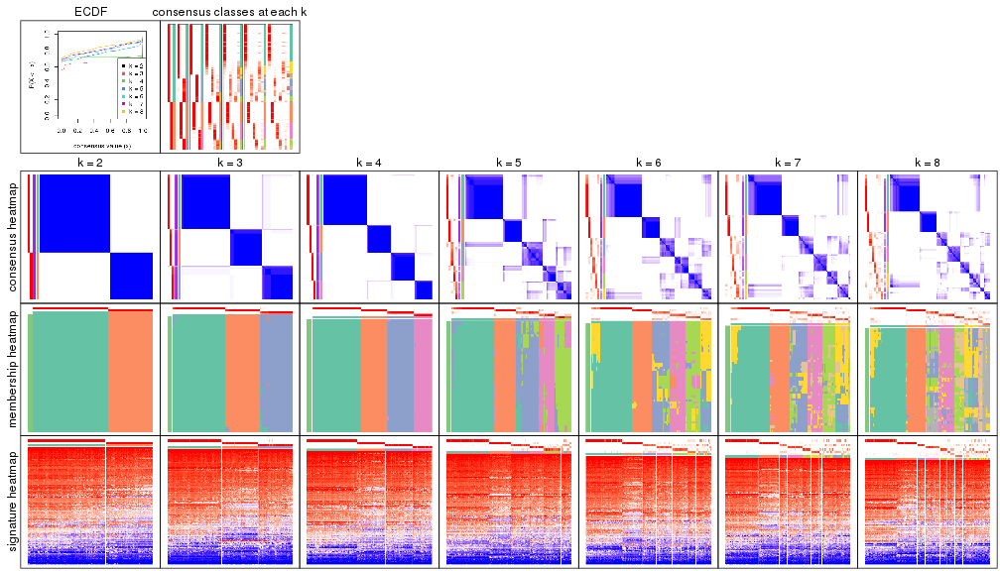

The plots are:

- The first row: a plot of the eCDF (empirical cumulative distribution
  function) curves of the consensus matrix for each `k` and the heatmap of
  predicted classes for each `k`.
- The second row: heatmaps of the consensus matrix for each `k`.
- The third row: heatmaps of the membership matrix for each `k`.
- The fouth row: heatmaps of the signatures for each `k`.

All the plots in panels can be made by individual functions and they are
plotted later in this section.

`select_partition_number()` produces several plots showing different
statistics for choosing "optimized" `k`. There are following statistics:

- eCDF curves of the consensus matrix for each `k`;
- 1-PAC. [The PAC score](https://en.wikipedia.org/wiki/Consensus_clustering#Over-interpretation_potential_of_consensus_clustering)
  measures the proportion of the ambiguous subgrouping.
- Mean silhouette score.
- Concordance. The mean probability of fiting the consensus subgroup labels in all
  partitions.
- Area increased. Denote $A_k$ as the area under the eCDF curve for current
  `k`, the area increased is defined as $A_k - A_{k-1}$.
- Rand index. The percent of pairs of samples that are both in a same cluster
  or both are not in a same cluster in the partition of k and k-1.
- Jaccard index. The ratio of pairs of samples are both in a same cluster in
  the partition of k and k-1 and the pairs of samples are both in a same
  cluster in the partition k or k-1.

The detailed explanations of these statistics can be found in [the _cola_
vignette](https://jokergoo.github.io/cola_vignettes/cola.html#toc_13).

Generally speaking, higher 1-PAC score, higher mean silhouette score or higher
concordance corresponds to better partition. Rand index and Jaccard index
measure how similar the current partition is compared to partition with `k-1`.
If they are too similar, we won't accept `k` is better than `k-1`.

```r
select_partition_number(res)
```

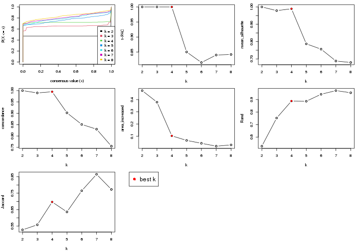

The numeric values for all these statistics can be obtained by `get_stats()`.

```r
get_stats(res)
```

```
#>   k 1-PAC mean_silhouette concordance area_increased  Rand Jaccard
#> 2 2 1.000           1.000       1.000         0.4733 0.527   0.527
#> 3 3 1.000           0.979       0.990         0.3789 0.752   0.558
#> 4 4 1.000           0.989       0.995         0.1031 0.888   0.697
#> 5 5 0.850           0.787       0.902         0.0658 0.887   0.636
#> 6 6 0.815           0.756       0.851         0.0420 0.942   0.765
#> 7 7 0.840           0.688       0.830         0.0186 0.971   0.865
#> 8 8 0.842           0.679       0.755         0.0289 0.954   0.773
```

`suggest_best_k()` suggests the best $k$ based on these statistics. The rules are as follows:

- All $k$ with Jaccard index larger than 0.95 are removed because increasing
  $k$ does not provide enough extra information. If all $k$ are removed, it is
  marked as no subgroup is detected.
- For all $k$ with 1-PAC score larger than 0.9, the maximal $k$ is taken as
  the best $k$, and other $k$ are marked as optional $k$.
- If it does not fit the second rule. The $k$ with the maximal vote of the
  highest 1-PAC score, highest mean silhouette, and highest concordance is
  taken as the best $k$.

```r
suggest_best_k(res)
```

```
#> [1] 4
#> attr(,"optional")
#> [1] 2 3
```

There is also optional best $k$ = 2 3 that is worth to check.

Following is the table of the partitions (You need to click the **show/hide
code output** link to see it). The membership matrix (columns with name `p*`)
is inferred by
[`clue::cl_consensus()`](https://www.rdocumentation.org/link/cl_consensus?package=clue)
function with the `SE` method. Basically the value in the membership matrix
represents the probability to belong to a certain group. The finall subgroup
label for an item is determined with the group with highest probability it
belongs to.

In `get_classes()` function, the entropy is calculated from the membership
matrix and the silhouette score is calculated from the consensus matrix.


<script>
$( function() {
	$( '#tabs-node-02-get-classes' ).tabs();
} );
</script>
<div id='tabs-node-02-get-classes'>
<ul>
<li><a href='#tab-node-02-get-classes-1'>k = 2</a></li>
<li><a href='#tab-node-02-get-classes-2'>k = 3</a></li>
<li><a href='#tab-node-02-get-classes-3'>k = 4</a></li>
<li><a href='#tab-node-02-get-classes-4'>k = 5</a></li>
<li><a href='#tab-node-02-get-classes-5'>k = 6</a></li>
<li><a href='#tab-node-02-get-classes-6'>k = 7</a></li>
<li><a href='#tab-node-02-get-classes-7'>k = 8</a></li>
</ul>

<div id='tab-node-02-get-classes-1'>
<p><a id='tab-node-02-get-classes-1-a' style='color:#0366d6' href='#'>show/hide code output</a></p>
<pre><code class="r">cbind(get_classes(res, k = 2), get_membership(res, k = 2))
</code></pre>

<pre><code>#&gt;                 class entropy silhouette p1 p2
#&gt; TCGA.KK.A8IA.01     1       0          1  1  0
#&gt; TCGA.KK.A6E4.01     1       0          1  1  0
#&gt; TCGA.H9.7775.01     1       0          1  1  0
#&gt; TCGA.XJ.A9DX.01     1       0          1  1  0
#&gt; TCGA.V1.A9OF.01     1       0          1  1  0
#&gt; TCGA.EJ.7125.01     2       0          1  0  1
#&gt; TCGA.YL.A9WI.01     2       0          1  0  1
#&gt; TCGA.QU.A6IN.01     1       0          1  1  0
#&gt; TCGA.HC.A6AO.01     2       0          1  0  1
#&gt; TCGA.KK.A7B3.01     1       0          1  1  0
#&gt; TCGA.CH.5788.01     1       0          1  1  0
#&gt; TCGA.KK.A8I5.01     1       0          1  1  0
#&gt; TCGA.YL.A8S9.01     2       0          1  0  1
#&gt; TCGA.CH.5761.01     2       0          1  0  1
#&gt; TCGA.KK.A7AZ.01     1       0          1  1  0
#&gt; TCGA.HC.7819.01     1       0          1  1  0
#&gt; TCGA.J9.A8CL.01     1       0          1  1  0
#&gt; TCGA.EJ.A7NF.01     1       0          1  1  0
#&gt; TCGA.XK.AAJA.01     2       0          1  0  1
#&gt; TCGA.KK.A6E8.01     2       0          1  0  1
#&gt; TCGA.HC.7821.01     1       0          1  1  0
#&gt; TCGA.EJ.8474.01     1       0          1  1  0
#&gt; TCGA.HC.7075.01     1       0          1  1  0
#&gt; TCGA.KC.A7F6.01     1       0          1  1  0
#&gt; TCGA.V1.A8WS.01     1       0          1  1  0
#&gt; TCGA.HC.8213.01     1       0          1  1  0
#&gt; TCGA.ZG.A9LZ.01     1       0          1  1  0
#&gt; TCGA.CH.5765.01     1       0          1  1  0
#&gt; TCGA.V1.A8WW.01     1       0          1  1  0
#&gt; TCGA.HC.A48F.01     1       0          1  1  0
#&gt; TCGA.V1.A9OQ.01     2       0          1  0  1
#&gt; TCGA.YL.A8HM.01     2       0          1  0  1
#&gt; TCGA.G9.6377.01     1       0          1  1  0
#&gt; TCGA.M7.A722.01     2       0          1  0  1
#&gt; TCGA.G9.6361.01     1       0          1  1  0
#&gt; TCGA.EJ.5511.01     1       0          1  1  0
#&gt; TCGA.ZG.A9KY.01     2       0          1  0  1
#&gt; TCGA.YJ.A8SW.01     1       0          1  1  0
#&gt; TCGA.EJ.A46F.01     1       0          1  1  0
#&gt; TCGA.MG.AAMC.01     1       0          1  1  0
#&gt; TCGA.ZG.A9L0.01     2       0          1  0  1
#&gt; TCGA.HC.7077.01     1       0          1  1  0
#&gt; TCGA.EJ.5519.01     2       0          1  0  1
#&gt; TCGA.VN.A88R.01     2       0          1  0  1
#&gt; TCGA.H9.A6BY.01     1       0          1  1  0
#&gt; TCGA.EJ.5517.01     1       0          1  1  0
#&gt; TCGA.J4.AAU2.01     1       0          1  1  0
#&gt; TCGA.Y6.A9XI.01     2       0          1  0  1
#&gt; TCGA.CH.5737.01     2       0          1  0  1
#&gt; TCGA.G9.6338.01     2       0          1  0  1
#&gt; TCGA.2A.AAYF.01     1       0          1  1  0
#&gt; TCGA.M7.A71Z.01     1       0          1  1  0
#&gt; TCGA.KC.A4BV.01     1       0          1  1  0
#&gt; TCGA.CH.5750.01     1       0          1  1  0
#&gt; TCGA.ZG.A9ND.01     2       0          1  0  1
#&gt; TCGA.EJ.8469.01     1       0          1  1  0
#&gt; TCGA.EJ.7315.01     1       0          1  1  0
#&gt; TCGA.YL.A8SP.01     1       0          1  1  0
#&gt; TCGA.CH.5791.01     1       0          1  1  0
#&gt; TCGA.HC.A76X.01     1       0          1  1  0
#&gt; TCGA.KK.A8IF.01     2       0          1  0  1
#&gt; TCGA.EJ.A65D.01     1       0          1  1  0
#&gt; TCGA.HC.A4ZV.01     2       0          1  0  1
#&gt; TCGA.KK.A7AP.01     2       0          1  0  1
#&gt; TCGA.VP.A87D.01     1       0          1  1  0
#&gt; TCGA.KK.A8II.01     1       0          1  1  0
#&gt; TCGA.J9.A52B.01     1       0          1  1  0
#&gt; TCGA.CH.5767.01     2       0          1  0  1
#&gt; TCGA.CH.5752.01     1       0          1  1  0
#&gt; TCGA.YL.A9WK.01     1       0          1  1  0
#&gt; TCGA.HC.7078.01     1       0          1  1  0
#&gt; TCGA.FC.A5OB.01     1       0          1  1  0
#&gt; TCGA.J4.AATZ.01     2       0          1  0  1
#&gt; TCGA.V1.A9OL.01     2       0          1  0  1
#&gt; TCGA.J9.A52D.01     1       0          1  1  0
#&gt; TCGA.EJ.7788.01     1       0          1  1  0
#&gt; TCGA.J9.A8CN.01     2       0          1  0  1
#&gt; TCGA.ZG.A9L1.01     1       0          1  1  0
#&gt; TCGA.VP.A875.01     1       0          1  1  0
#&gt; TCGA.KK.A59Y.01     1       0          1  1  0
#&gt; TCGA.G9.6362.11     1       0          1  1  0
#&gt; TCGA.HC.A631.01     1       0          1  1  0
#&gt; TCGA.YL.A8SA.01     1       0          1  1  0
#&gt; TCGA.KC.A7FD.01     1       0          1  1  0
#&gt; TCGA.EJ.7784.01     1       0          1  1  0
#&gt; TCGA.J4.A83I.01     1       0          1  1  0
#&gt; TCGA.G9.6373.01     1       0          1  1  0
#&gt; TCGA.G9.6371.01     2       0          1  0  1
#&gt; TCGA.XQ.A8TA.01     1       0          1  1  0
#&gt; TCGA.ZG.A9L9.01     1       0          1  1  0
#&gt; TCGA.M7.A724.01     2       0          1  0  1
#&gt; TCGA.VN.A88K.01     1       0          1  1  0
#&gt; TCGA.KK.A8ID.01     2       0          1  0  1
#&gt; TCGA.CH.5790.01     1       0          1  1  0
#&gt; TCGA.HC.7231.01     1       0          1  1  0
#&gt; TCGA.ZG.A9L5.01     2       0          1  0  1
#&gt; TCGA.HC.7230.01     1       0          1  1  0
#&gt; TCGA.CH.5741.01     1       0          1  1  0
#&gt; TCGA.KK.A59V.01     1       0          1  1  0
#&gt; TCGA.KK.A7AQ.01     2       0          1  0  1
#&gt; TCGA.HC.A6AL.01     2       0          1  0  1
#&gt; TCGA.HC.8264.01     2       0          1  0  1
#&gt; TCGA.HI.7171.01     1       0          1  1  0
#&gt; TCGA.XK.AAJP.01     2       0          1  0  1
#&gt; TCGA.HC.7212.01     1       0          1  1  0
#&gt; TCGA.2A.A8VO.01     1       0          1  1  0
#&gt; TCGA.HC.8259.01     1       0          1  1  0
#&gt; TCGA.VN.A88P.01     1       0          1  1  0
#&gt; TCGA.G9.6369.01     2       0          1  0  1
#&gt; TCGA.KK.A6E1.01     2       0          1  0  1
#&gt; TCGA.XJ.A83F.01     1       0          1  1  0
#&gt; TCGA.G9.A9S4.01     1       0          1  1  0
#&gt; TCGA.VP.A87B.01     2       0          1  0  1
#&gt; TCGA.YL.A8SR.01     2       0          1  0  1
#&gt; TCGA.KK.A7AY.01     1       0          1  1  0
#&gt; TCGA.2A.AAYU.01     1       0          1  1  0
#&gt; TCGA.G9.7525.01     1       0          1  1  0
#&gt; TCGA.VP.A87J.01     2       0          1  0  1
#&gt; TCGA.KK.A8IK.01     2       0          1  0  1
#&gt; TCGA.KK.A7AU.01     1       0          1  1  0
#&gt; TCGA.VN.A943.01     2       0          1  0  1
#&gt; TCGA.KK.A59X.01     2       0          1  0  1
#&gt; TCGA.EJ.5494.01     1       0          1  1  0
#&gt; TCGA.HC.7213.01     1       0          1  1  0
#&gt; TCGA.CH.5772.01     1       0          1  1  0
#&gt; TCGA.EJ.7325.01     1       0          1  1  0
#&gt; TCGA.EJ.7789.01     2       0          1  0  1
#&gt; TCGA.HC.8257.01     1       0          1  1  0
#&gt; TCGA.FC.A4JI.01     2       0          1  0  1
#&gt; TCGA.2A.AAYO.01     1       0          1  1  0
#&gt; TCGA.YL.A8SL.01     1       0          1  1  0
#&gt; TCGA.KK.A5A1.01     2       0          1  0  1
#&gt; TCGA.YL.A9WL.01     1       0          1  1  0
#&gt; TCGA.HC.7080.01     2       0          1  0  1
#&gt; TCGA.V1.A9O5.06     2       0          1  0  1
#&gt; TCGA.KC.A7F5.01     2       0          1  0  1
#&gt; TCGA.EJ.A8FS.01     2       0          1  0  1
#&gt; TCGA.YL.A8HL.01     2       0          1  0  1
#&gt; TCGA.CH.5753.01     1       0          1  1  0
#&gt; TCGA.YL.A8SH.01     1       0          1  1  0
#&gt; TCGA.G9.6362.01     1       0          1  1  0
#&gt; TCGA.EJ.5530.01     1       0          1  1  0
#&gt; TCGA.VN.A88M.01     1       0          1  1  0
#&gt; TCGA.EJ.7782.01     2       0          1  0  1
#&gt; TCGA.KK.A6E2.01     1       0          1  1  0
#&gt; TCGA.J4.A6M7.01     1       0          1  1  0
#&gt; TCGA.HC.7744.01     1       0          1  1  0
#&gt; TCGA.XK.AAJ3.01     2       0          1  0  1
#&gt; TCGA.HC.A8CY.01     1       0          1  1  0
#&gt; TCGA.KK.A6E0.01     2       0          1  0  1
#&gt; TCGA.XK.AAK1.01     2       0          1  0  1
#&gt; TCGA.XK.AAIW.01     2       0          1  0  1
#&gt; TCGA.TP.A8TV.01     2       0          1  0  1
#&gt; TCGA.FC.A6HD.01     2       0          1  0  1
#&gt; TCGA.EJ.8472.01     1       0          1  1  0
#&gt; TCGA.YL.A9WH.01     1       0          1  1  0
#&gt; TCGA.KK.A7AW.01     1       0          1  1  0
#&gt; TCGA.WW.A8ZI.01     2       0          1  0  1
#&gt; TCGA.J4.A83N.01     1       0          1  1  0
#&gt; TCGA.HC.A6AN.01     1       0          1  1  0
#&gt; TCGA.QU.A6IL.01     2       0          1  0  1
#&gt; TCGA.V1.A9ZI.01     1       0          1  1  0
#&gt; TCGA.YL.A8SQ.01     1       0          1  1  0
#&gt; TCGA.KK.A7B4.01     1       0          1  1  0
#&gt; TCGA.J4.A83J.01     2       0          1  0  1
#&gt; TCGA.M7.A725.01     2       0          1  0  1
#&gt; TCGA.J4.A67N.01     1       0          1  1  0
#&gt; TCGA.XJ.A83G.01     2       0          1  0  1
#&gt; TCGA.VP.A876.01     1       0          1  1  0
#&gt; TCGA.CH.5739.01     1       0          1  1  0
#&gt; TCGA.KK.A8IH.01     1       0          1  1  0
#&gt; TCGA.VP.A87K.01     1       0          1  1  0
#&gt; TCGA.HC.A632.01     2       0          1  0  1
#&gt; TCGA.G9.6496.01     2       0          1  0  1
#&gt; TCGA.2A.A8VV.01     1       0          1  1  0
#&gt; TCGA.EJ.5525.01     1       0          1  1  0
#&gt; TCGA.KK.A59Z.01     2       0          1  0  1
#&gt; TCGA.HC.7752.01     1       0          1  1  0
#&gt; TCGA.EJ.A65J.01     2       0          1  0  1
#&gt; TCGA.2A.A8VX.01     2       0          1  0  1
#&gt; TCGA.V1.A9OT.01     1       0          1  1  0
#&gt; TCGA.KC.A7FA.01     2       0          1  0  1
#&gt; TCGA.HC.7738.01     2       0          1  0  1
#&gt; TCGA.J4.8198.01     1       0          1  1  0
#&gt; TCGA.EJ.7123.01     2       0          1  0  1
#&gt; TCGA.2A.A8W1.01     2       0          1  0  1
#&gt; TCGA.CH.5768.01     1       0          1  1  0
#&gt; TCGA.G9.6332.01     1       0          1  1  0
#&gt; TCGA.EJ.A46G.01     1       0          1  1  0
#&gt; TCGA.EJ.7312.01     2       0          1  0  1
#&gt; TCGA.V1.A8MM.01     2       0          1  0  1
#&gt; TCGA.EJ.A65F.01     1       0          1  1  0
#&gt; TCGA.G9.6498.01     2       0          1  0  1
</code></pre>

<script>
$('#tab-node-02-get-classes-1-a').parent().next().next().hide();
$('#tab-node-02-get-classes-1-a').click(function(){
  $('#tab-node-02-get-classes-1-a').parent().next().next().toggle();
  return(false);
});
</script>
</div>

<div id='tab-node-02-get-classes-2'>
<p><a id='tab-node-02-get-classes-2-a' style='color:#0366d6' href='#'>show/hide code output</a></p>
<pre><code class="r">cbind(get_classes(res, k = 3), get_membership(res, k = 3))
</code></pre>

<pre><code>#&gt;                 class entropy silhouette   p1   p2   p3
#&gt; TCGA.KK.A8IA.01     3  0.0000      0.972 0.00 0.00 1.00
#&gt; TCGA.KK.A6E4.01     1  0.0000      0.998 1.00 0.00 0.00
#&gt; TCGA.H9.7775.01     1  0.0000      0.998 1.00 0.00 0.00
#&gt; TCGA.XJ.A9DX.01     1  0.0000      0.998 1.00 0.00 0.00
#&gt; TCGA.V1.A9OF.01     3  0.0000      0.972 0.00 0.00 1.00
#&gt; TCGA.EJ.7125.01     2  0.0000      0.992 0.00 1.00 0.00
#&gt; TCGA.YL.A9WI.01     2  0.0000      0.992 0.00 1.00 0.00
#&gt; TCGA.QU.A6IN.01     1  0.0000      0.998 1.00 0.00 0.00
#&gt; TCGA.HC.A6AO.01     2  0.0000      0.992 0.00 1.00 0.00
#&gt; TCGA.KK.A7B3.01     1  0.0000      0.998 1.00 0.00 0.00
#&gt; TCGA.CH.5788.01     3  0.0000      0.972 0.00 0.00 1.00
#&gt; TCGA.KK.A8I5.01     1  0.0000      0.998 1.00 0.00 0.00
#&gt; TCGA.YL.A8S9.01     2  0.0892      0.976 0.00 0.98 0.02
#&gt; TCGA.CH.5761.01     2  0.0000      0.992 0.00 1.00 0.00
#&gt; TCGA.KK.A7AZ.01     3  0.0000      0.972 0.00 0.00 1.00
#&gt; TCGA.HC.7819.01     1  0.0000      0.998 1.00 0.00 0.00
#&gt; TCGA.J9.A8CL.01     3  0.0000      0.972 0.00 0.00 1.00
#&gt; TCGA.EJ.A7NF.01     1  0.0000      0.998 1.00 0.00 0.00
#&gt; TCGA.XK.AAJA.01     2  0.0000      0.992 0.00 1.00 0.00
#&gt; TCGA.KK.A6E8.01     2  0.0000      0.992 0.00 1.00 0.00
#&gt; TCGA.HC.7821.01     1  0.0000      0.998 1.00 0.00 0.00
#&gt; TCGA.EJ.8474.01     1  0.0000      0.998 1.00 0.00 0.00
#&gt; TCGA.HC.7075.01     3  0.0000      0.972 0.00 0.00 1.00
#&gt; TCGA.KC.A7F6.01     1  0.0000      0.998 1.00 0.00 0.00
#&gt; TCGA.V1.A8WS.01     1  0.0000      0.998 1.00 0.00 0.00
#&gt; TCGA.HC.8213.01     1  0.0000      0.998 1.00 0.00 0.00
#&gt; TCGA.ZG.A9LZ.01     1  0.0000      0.998 1.00 0.00 0.00
#&gt; TCGA.CH.5765.01     1  0.0000      0.998 1.00 0.00 0.00
#&gt; TCGA.V1.A8WW.01     1  0.0000      0.998 1.00 0.00 0.00
#&gt; TCGA.HC.A48F.01     1  0.0000      0.998 1.00 0.00 0.00
#&gt; TCGA.V1.A9OQ.01     2  0.0000      0.992 0.00 1.00 0.00
#&gt; TCGA.YL.A8HM.01     2  0.0000      0.992 0.00 1.00 0.00
#&gt; TCGA.G9.6377.01     1  0.0000      0.998 1.00 0.00 0.00
#&gt; TCGA.M7.A722.01     2  0.0000      0.992 0.00 1.00 0.00
#&gt; TCGA.G9.6361.01     3  0.2959      0.891 0.10 0.00 0.90
#&gt; TCGA.EJ.5511.01     3  0.0000      0.972 0.00 0.00 1.00
#&gt; TCGA.ZG.A9KY.01     3  0.2066      0.919 0.00 0.06 0.94
#&gt; TCGA.YJ.A8SW.01     1  0.0000      0.998 1.00 0.00 0.00
#&gt; TCGA.EJ.A46F.01     1  0.0000      0.998 1.00 0.00 0.00
#&gt; TCGA.MG.AAMC.01     1  0.0000      0.998 1.00 0.00 0.00
#&gt; TCGA.ZG.A9L0.01     2  0.1529      0.960 0.00 0.96 0.04
#&gt; TCGA.HC.7077.01     1  0.0000      0.998 1.00 0.00 0.00
#&gt; TCGA.EJ.5519.01     3  0.0000      0.972 0.00 0.00 1.00
#&gt; TCGA.VN.A88R.01     2  0.0000      0.992 0.00 1.00 0.00
#&gt; TCGA.H9.A6BY.01     1  0.0000      0.998 1.00 0.00 0.00
#&gt; TCGA.EJ.5517.01     3  0.1529      0.949 0.04 0.00 0.96
#&gt; TCGA.J4.AAU2.01     1  0.0000      0.998 1.00 0.00 0.00
#&gt; TCGA.Y6.A9XI.01     2  0.0000      0.992 0.00 1.00 0.00
#&gt; TCGA.CH.5737.01     2  0.0000      0.992 0.00 1.00 0.00
#&gt; TCGA.G9.6338.01     2  0.0000      0.992 0.00 1.00 0.00
#&gt; TCGA.2A.AAYF.01     1  0.0000      0.998 1.00 0.00 0.00
#&gt; TCGA.M7.A71Z.01     1  0.0000      0.998 1.00 0.00 0.00
#&gt; TCGA.KC.A4BV.01     3  0.0000      0.972 0.00 0.00 1.00
#&gt; TCGA.CH.5750.01     1  0.0000      0.998 1.00 0.00 0.00
#&gt; TCGA.ZG.A9ND.01     2  0.0000      0.992 0.00 1.00 0.00
#&gt; TCGA.EJ.8469.01     1  0.0000      0.998 1.00 0.00 0.00
#&gt; TCGA.EJ.7315.01     3  0.0000      0.972 0.00 0.00 1.00
#&gt; TCGA.YL.A8SP.01     1  0.0000      0.998 1.00 0.00 0.00
#&gt; TCGA.CH.5791.01     1  0.0000      0.998 1.00 0.00 0.00
#&gt; TCGA.HC.A76X.01     1  0.0000      0.998 1.00 0.00 0.00
#&gt; TCGA.KK.A8IF.01     2  0.0000      0.992 0.00 1.00 0.00
#&gt; TCGA.EJ.A65D.01     1  0.0000      0.998 1.00 0.00 0.00
#&gt; TCGA.HC.A4ZV.01     2  0.0000      0.992 0.00 1.00 0.00
#&gt; TCGA.KK.A7AP.01     3  0.0000      0.972 0.00 0.00 1.00
#&gt; TCGA.VP.A87D.01     1  0.0000      0.998 1.00 0.00 0.00
#&gt; TCGA.KK.A8II.01     1  0.0000      0.998 1.00 0.00 0.00
#&gt; TCGA.J9.A52B.01     1  0.0000      0.998 1.00 0.00 0.00
#&gt; TCGA.CH.5767.01     2  0.0000      0.992 0.00 1.00 0.00
#&gt; TCGA.CH.5752.01     1  0.0000      0.998 1.00 0.00 0.00
#&gt; TCGA.YL.A9WK.01     3  0.0000      0.972 0.00 0.00 1.00
#&gt; TCGA.HC.7078.01     3  0.1529      0.949 0.04 0.00 0.96
#&gt; TCGA.FC.A5OB.01     1  0.1529      0.958 0.96 0.00 0.04
#&gt; TCGA.J4.AATZ.01     2  0.0000      0.992 0.00 1.00 0.00
#&gt; TCGA.V1.A9OL.01     3  0.0000      0.972 0.00 0.00 1.00
#&gt; TCGA.J9.A52D.01     3  0.1529      0.949 0.04 0.00 0.96
#&gt; TCGA.EJ.7788.01     1  0.0000      0.998 1.00 0.00 0.00
#&gt; TCGA.J9.A8CN.01     3  0.0000      0.972 0.00 0.00 1.00
#&gt; TCGA.ZG.A9L1.01     3  0.1529      0.949 0.04 0.00 0.96
#&gt; TCGA.VP.A875.01     3  0.0000      0.972 0.00 0.00 1.00
#&gt; TCGA.KK.A59Y.01     1  0.0000      0.998 1.00 0.00 0.00
#&gt; TCGA.G9.6362.11     1  0.0000      0.998 1.00 0.00 0.00
#&gt; TCGA.HC.A631.01     1  0.0000      0.998 1.00 0.00 0.00
#&gt; TCGA.YL.A8SA.01     1  0.0000      0.998 1.00 0.00 0.00
#&gt; TCGA.KC.A7FD.01     3  0.0000      0.972 0.00 0.00 1.00
#&gt; TCGA.EJ.7784.01     1  0.0000      0.998 1.00 0.00 0.00
#&gt; TCGA.J4.A83I.01     3  0.1529      0.949 0.04 0.00 0.96
#&gt; TCGA.G9.6373.01     1  0.0000      0.998 1.00 0.00 0.00
#&gt; TCGA.G9.6371.01     3  0.0000      0.972 0.00 0.00 1.00
#&gt; TCGA.XQ.A8TA.01     3  0.0000      0.972 0.00 0.00 1.00
#&gt; TCGA.ZG.A9L9.01     1  0.0000      0.998 1.00 0.00 0.00
#&gt; TCGA.M7.A724.01     3  0.0000      0.972 0.00 0.00 1.00
#&gt; TCGA.VN.A88K.01     1  0.0000      0.998 1.00 0.00 0.00
#&gt; TCGA.KK.A8ID.01     2  0.0000      0.992 0.00 1.00 0.00
#&gt; TCGA.CH.5790.01     1  0.0000      0.998 1.00 0.00 0.00
#&gt; TCGA.HC.7231.01     1  0.0000      0.998 1.00 0.00 0.00
#&gt; TCGA.ZG.A9L5.01     2  0.0000      0.992 0.00 1.00 0.00
#&gt; TCGA.HC.7230.01     1  0.0000      0.998 1.00 0.00 0.00
#&gt; TCGA.CH.5741.01     1  0.0000      0.998 1.00 0.00 0.00
#&gt; TCGA.KK.A59V.01     1  0.0000      0.998 1.00 0.00 0.00
#&gt; TCGA.KK.A7AQ.01     2  0.0000      0.992 0.00 1.00 0.00
#&gt; TCGA.HC.A6AL.01     2  0.0000      0.992 0.00 1.00 0.00
#&gt; TCGA.HC.8264.01     3  0.0000      0.972 0.00 0.00 1.00
#&gt; TCGA.HI.7171.01     1  0.0000      0.998 1.00 0.00 0.00
#&gt; TCGA.XK.AAJP.01     3  0.0000      0.972 0.00 0.00 1.00
#&gt; TCGA.HC.7212.01     1  0.0892      0.978 0.98 0.00 0.02
#&gt; TCGA.2A.A8VO.01     3  0.3340      0.869 0.12 0.00 0.88
#&gt; TCGA.HC.8259.01     1  0.0000      0.998 1.00 0.00 0.00
#&gt; TCGA.VN.A88P.01     3  0.0000      0.972 0.00 0.00 1.00
#&gt; TCGA.G9.6369.01     2  0.1529      0.960 0.00 0.96 0.04
#&gt; TCGA.KK.A6E1.01     3  0.0000      0.972 0.00 0.00 1.00
#&gt; TCGA.XJ.A83F.01     1  0.0000      0.998 1.00 0.00 0.00
#&gt; TCGA.G9.A9S4.01     1  0.0000      0.998 1.00 0.00 0.00
#&gt; TCGA.VP.A87B.01     3  0.0000      0.972 0.00 0.00 1.00
#&gt; TCGA.YL.A8SR.01     2  0.0000      0.992 0.00 1.00 0.00
#&gt; TCGA.KK.A7AY.01     3  0.5706      0.560 0.32 0.00 0.68
#&gt; TCGA.2A.AAYU.01     3  0.0000      0.972 0.00 0.00 1.00
#&gt; TCGA.G9.7525.01     1  0.0000      0.998 1.00 0.00 0.00
#&gt; TCGA.VP.A87J.01     3  0.0000      0.972 0.00 0.00 1.00
#&gt; TCGA.KK.A8IK.01     2  0.0000      0.992 0.00 1.00 0.00
#&gt; TCGA.KK.A7AU.01     1  0.0000      0.998 1.00 0.00 0.00
#&gt; TCGA.VN.A943.01     3  0.0000      0.972 0.00 0.00 1.00
#&gt; TCGA.KK.A59X.01     2  0.0000      0.992 0.00 1.00 0.00
#&gt; TCGA.EJ.5494.01     3  0.0000      0.972 0.00 0.00 1.00
#&gt; TCGA.HC.7213.01     3  0.1529      0.949 0.04 0.00 0.96
#&gt; TCGA.CH.5772.01     3  0.0000      0.972 0.00 0.00 1.00
#&gt; TCGA.EJ.7325.01     1  0.0000      0.998 1.00 0.00 0.00
#&gt; TCGA.EJ.7789.01     2  0.0000      0.992 0.00 1.00 0.00
#&gt; TCGA.HC.8257.01     1  0.0000      0.998 1.00 0.00 0.00
#&gt; TCGA.FC.A4JI.01     2  0.0000      0.992 0.00 1.00 0.00
#&gt; TCGA.2A.AAYO.01     1  0.1529      0.958 0.96 0.00 0.04
#&gt; TCGA.YL.A8SL.01     1  0.0000      0.998 1.00 0.00 0.00
#&gt; TCGA.KK.A5A1.01     2  0.0000      0.992 0.00 1.00 0.00
#&gt; TCGA.YL.A9WL.01     1  0.0000      0.998 1.00 0.00 0.00
#&gt; TCGA.HC.7080.01     2  0.0000      0.992 0.00 1.00 0.00
#&gt; TCGA.V1.A9O5.06     2  0.0000      0.992 0.00 1.00 0.00
#&gt; TCGA.KC.A7F5.01     2  0.0000      0.992 0.00 1.00 0.00
#&gt; TCGA.EJ.A8FS.01     2  0.1529      0.960 0.00 0.96 0.04
#&gt; TCGA.YL.A8HL.01     3  0.0000      0.972 0.00 0.00 1.00
#&gt; TCGA.CH.5753.01     1  0.2959      0.887 0.90 0.00 0.10
#&gt; TCGA.YL.A8SH.01     3  0.0000      0.972 0.00 0.00 1.00
#&gt; TCGA.G9.6362.01     1  0.0000      0.998 1.00 0.00 0.00
#&gt; TCGA.EJ.5530.01     1  0.0000      0.998 1.00 0.00 0.00
#&gt; TCGA.VN.A88M.01     1  0.0000      0.998 1.00 0.00 0.00
#&gt; TCGA.EJ.7782.01     2  0.0000      0.992 0.00 1.00 0.00
#&gt; TCGA.KK.A6E2.01     1  0.0000      0.998 1.00 0.00 0.00
#&gt; TCGA.J4.A6M7.01     1  0.0000      0.998 1.00 0.00 0.00
#&gt; TCGA.HC.7744.01     3  0.0000      0.972 0.00 0.00 1.00
#&gt; TCGA.XK.AAJ3.01     2  0.0000      0.992 0.00 1.00 0.00
#&gt; TCGA.HC.A8CY.01     3  0.0000      0.972 0.00 0.00 1.00
#&gt; TCGA.KK.A6E0.01     2  0.1529      0.960 0.00 0.96 0.04
#&gt; TCGA.XK.AAK1.01     2  0.0000      0.992 0.00 1.00 0.00
#&gt; TCGA.XK.AAIW.01     2  0.5216      0.664 0.00 0.74 0.26
#&gt; TCGA.TP.A8TV.01     2  0.0000      0.992 0.00 1.00 0.00
#&gt; TCGA.FC.A6HD.01     2  0.0000      0.992 0.00 1.00 0.00
#&gt; TCGA.EJ.8472.01     1  0.0000      0.998 1.00 0.00 0.00
#&gt; TCGA.YL.A9WH.01     1  0.0000      0.998 1.00 0.00 0.00
#&gt; TCGA.KK.A7AW.01     3  0.0000      0.972 0.00 0.00 1.00
#&gt; TCGA.WW.A8ZI.01     3  0.0000      0.972 0.00 0.00 1.00
#&gt; TCGA.J4.A83N.01     1  0.0000      0.998 1.00 0.00 0.00
#&gt; TCGA.HC.A6AN.01     1  0.0000      0.998 1.00 0.00 0.00
#&gt; TCGA.QU.A6IL.01     2  0.0000      0.992 0.00 1.00 0.00
#&gt; TCGA.V1.A9ZI.01     3  0.1529      0.949 0.04 0.00 0.96
#&gt; TCGA.YL.A8SQ.01     3  0.0000      0.972 0.00 0.00 1.00
#&gt; TCGA.KK.A7B4.01     3  0.1529      0.949 0.04 0.00 0.96
#&gt; TCGA.J4.A83J.01     2  0.0000      0.992 0.00 1.00 0.00
#&gt; TCGA.M7.A725.01     2  0.0000      0.992 0.00 1.00 0.00
#&gt; TCGA.J4.A67N.01     1  0.0000      0.998 1.00 0.00 0.00
#&gt; TCGA.XJ.A83G.01     2  0.0000      0.992 0.00 1.00 0.00
#&gt; TCGA.VP.A876.01     1  0.0000      0.998 1.00 0.00 0.00
#&gt; TCGA.CH.5739.01     1  0.0000      0.998 1.00 0.00 0.00
#&gt; TCGA.KK.A8IH.01     1  0.0000      0.998 1.00 0.00 0.00
#&gt; TCGA.VP.A87K.01     1  0.0000      0.998 1.00 0.00 0.00
#&gt; TCGA.HC.A632.01     3  0.0000      0.972 0.00 0.00 1.00
#&gt; TCGA.G9.6496.01     2  0.0000      0.992 0.00 1.00 0.00
#&gt; TCGA.2A.A8VV.01     1  0.0000      0.998 1.00 0.00 0.00
#&gt; TCGA.EJ.5525.01     1  0.0000      0.998 1.00 0.00 0.00
#&gt; TCGA.KK.A59Z.01     2  0.0000      0.992 0.00 1.00 0.00
#&gt; TCGA.HC.7752.01     3  0.1529      0.949 0.04 0.00 0.96
#&gt; TCGA.EJ.A65J.01     2  0.0000      0.992 0.00 1.00 0.00
#&gt; TCGA.2A.A8VX.01     2  0.0000      0.992 0.00 1.00 0.00
#&gt; TCGA.V1.A9OT.01     1  0.0000      0.998 1.00 0.00 0.00
#&gt; TCGA.KC.A7FA.01     3  0.0000      0.972 0.00 0.00 1.00
#&gt; TCGA.HC.7738.01     2  0.0000      0.992 0.00 1.00 0.00
#&gt; TCGA.J4.8198.01     3  0.5397      0.639 0.28 0.00 0.72
#&gt; TCGA.EJ.7123.01     2  0.0000      0.992 0.00 1.00 0.00
#&gt; TCGA.2A.A8W1.01     2  0.0000      0.992 0.00 1.00 0.00
#&gt; TCGA.CH.5768.01     3  0.1529      0.949 0.04 0.00 0.96
#&gt; TCGA.G9.6332.01     1  0.0000      0.998 1.00 0.00 0.00
#&gt; TCGA.EJ.A46G.01     1  0.0000      0.998 1.00 0.00 0.00
#&gt; TCGA.EJ.7312.01     2  0.0000      0.992 0.00 1.00 0.00
#&gt; TCGA.V1.A8MM.01     2  0.0000      0.992 0.00 1.00 0.00
#&gt; TCGA.EJ.A65F.01     1  0.0000      0.998 1.00 0.00 0.00
#&gt; TCGA.G9.6498.01     2  0.1529      0.960 0.00 0.96 0.04
</code></pre>

<script>
$('#tab-node-02-get-classes-2-a').parent().next().next().hide();
$('#tab-node-02-get-classes-2-a').click(function(){
  $('#tab-node-02-get-classes-2-a').parent().next().next().toggle();
  return(false);
});
</script>
</div>

<div id='tab-node-02-get-classes-3'>
<p><a id='tab-node-02-get-classes-3-a' style='color:#0366d6' href='#'>show/hide code output</a></p>
<pre><code class="r">cbind(get_classes(res, k = 4), get_membership(res, k = 4))
</code></pre>

<pre><code>#&gt;                 class entropy silhouette   p1   p2   p3   p4
#&gt; TCGA.KK.A8IA.01     3  0.0000      0.994 0.00 0.00 1.00 0.00
#&gt; TCGA.KK.A6E4.01     1  0.0000      0.997 1.00 0.00 0.00 0.00
#&gt; TCGA.H9.7775.01     1  0.0000      0.997 1.00 0.00 0.00 0.00
#&gt; TCGA.XJ.A9DX.01     1  0.0000      0.997 1.00 0.00 0.00 0.00
#&gt; TCGA.V1.A9OF.01     3  0.0707      0.978 0.00 0.00 0.98 0.02
#&gt; TCGA.EJ.7125.01     2  0.0000      0.995 0.00 1.00 0.00 0.00
#&gt; TCGA.YL.A9WI.01     2  0.0000      0.995 0.00 1.00 0.00 0.00
#&gt; TCGA.QU.A6IN.01     1  0.0000      0.997 1.00 0.00 0.00 0.00
#&gt; TCGA.HC.A6AO.01     2  0.0000      0.995 0.00 1.00 0.00 0.00
#&gt; TCGA.KK.A7B3.01     1  0.0000      0.997 1.00 0.00 0.00 0.00
#&gt; TCGA.CH.5788.01     3  0.0707      0.978 0.00 0.00 0.98 0.02
#&gt; TCGA.KK.A8I5.01     1  0.0000      0.997 1.00 0.00 0.00 0.00
#&gt; TCGA.YL.A8S9.01     4  0.0000      0.990 0.00 0.00 0.00 1.00
#&gt; TCGA.CH.5761.01     2  0.0000      0.995 0.00 1.00 0.00 0.00
#&gt; TCGA.KK.A7AZ.01     3  0.0000      0.994 0.00 0.00 1.00 0.00
#&gt; TCGA.HC.7819.01     1  0.0000      0.997 1.00 0.00 0.00 0.00
#&gt; TCGA.J9.A8CL.01     3  0.1637      0.941 0.00 0.00 0.94 0.06
#&gt; TCGA.EJ.A7NF.01     1  0.0000      0.997 1.00 0.00 0.00 0.00
#&gt; TCGA.XK.AAJA.01     2  0.0000      0.995 0.00 1.00 0.00 0.00
#&gt; TCGA.KK.A6E8.01     2  0.0000      0.995 0.00 1.00 0.00 0.00
#&gt; TCGA.HC.7821.01     1  0.0000      0.997 1.00 0.00 0.00 0.00
#&gt; TCGA.EJ.8474.01     1  0.0000      0.997 1.00 0.00 0.00 0.00
#&gt; TCGA.HC.7075.01     3  0.0000      0.994 0.00 0.00 1.00 0.00
#&gt; TCGA.KC.A7F6.01     1  0.0000      0.997 1.00 0.00 0.00 0.00
#&gt; TCGA.V1.A8WS.01     1  0.0000      0.997 1.00 0.00 0.00 0.00
#&gt; TCGA.HC.8213.01     1  0.0000      0.997 1.00 0.00 0.00 0.00
#&gt; TCGA.ZG.A9LZ.01     1  0.3172      0.812 0.84 0.00 0.16 0.00
#&gt; TCGA.CH.5765.01     1  0.0000      0.997 1.00 0.00 0.00 0.00
#&gt; TCGA.V1.A8WW.01     1  0.0000      0.997 1.00 0.00 0.00 0.00
#&gt; TCGA.HC.A48F.01     1  0.0000      0.997 1.00 0.00 0.00 0.00
#&gt; TCGA.V1.A9OQ.01     2  0.0000      0.995 0.00 1.00 0.00 0.00
#&gt; TCGA.YL.A8HM.01     2  0.0000      0.995 0.00 1.00 0.00 0.00
#&gt; TCGA.G9.6377.01     1  0.0000      0.997 1.00 0.00 0.00 0.00
#&gt; TCGA.M7.A722.01     2  0.0000      0.995 0.00 1.00 0.00 0.00
#&gt; TCGA.G9.6361.01     3  0.0000      0.994 0.00 0.00 1.00 0.00
#&gt; TCGA.EJ.5511.01     3  0.0000      0.994 0.00 0.00 1.00 0.00
#&gt; TCGA.ZG.A9KY.01     4  0.0000      0.990 0.00 0.00 0.00 1.00
#&gt; TCGA.YJ.A8SW.01     1  0.0000      0.997 1.00 0.00 0.00 0.00
#&gt; TCGA.EJ.A46F.01     1  0.0000      0.997 1.00 0.00 0.00 0.00
#&gt; TCGA.MG.AAMC.01     1  0.0000      0.997 1.00 0.00 0.00 0.00
#&gt; TCGA.ZG.A9L0.01     4  0.0000      0.990 0.00 0.00 0.00 1.00
#&gt; TCGA.HC.7077.01     1  0.0000      0.997 1.00 0.00 0.00 0.00
#&gt; TCGA.EJ.5519.01     4  0.0000      0.990 0.00 0.00 0.00 1.00
#&gt; TCGA.VN.A88R.01     2  0.0000      0.995 0.00 1.00 0.00 0.00
#&gt; TCGA.H9.A6BY.01     1  0.0000      0.997 1.00 0.00 0.00 0.00
#&gt; TCGA.EJ.5517.01     3  0.0000      0.994 0.00 0.00 1.00 0.00
#&gt; TCGA.J4.AAU2.01     3  0.0000      0.994 0.00 0.00 1.00 0.00
#&gt; TCGA.Y6.A9XI.01     2  0.0000      0.995 0.00 1.00 0.00 0.00
#&gt; TCGA.CH.5737.01     2  0.0000      0.995 0.00 1.00 0.00 0.00
#&gt; TCGA.G9.6338.01     4  0.0000      0.990 0.00 0.00 0.00 1.00
#&gt; TCGA.2A.AAYF.01     1  0.0000      0.997 1.00 0.00 0.00 0.00
#&gt; TCGA.M7.A71Z.01     1  0.0000      0.997 1.00 0.00 0.00 0.00
#&gt; TCGA.KC.A4BV.01     3  0.0000      0.994 0.00 0.00 1.00 0.00
#&gt; TCGA.CH.5750.01     1  0.0000      0.997 1.00 0.00 0.00 0.00
#&gt; TCGA.ZG.A9ND.01     4  0.0000      0.990 0.00 0.00 0.00 1.00
#&gt; TCGA.EJ.8469.01     1  0.0707      0.978 0.98 0.00 0.02 0.00
#&gt; TCGA.EJ.7315.01     3  0.0000      0.994 0.00 0.00 1.00 0.00
#&gt; TCGA.YL.A8SP.01     1  0.0000      0.997 1.00 0.00 0.00 0.00
#&gt; TCGA.CH.5791.01     1  0.0000      0.997 1.00 0.00 0.00 0.00
#&gt; TCGA.HC.A76X.01     1  0.0000      0.997 1.00 0.00 0.00 0.00
#&gt; TCGA.KK.A8IF.01     2  0.0000      0.995 0.00 1.00 0.00 0.00
#&gt; TCGA.EJ.A65D.01     1  0.0000      0.997 1.00 0.00 0.00 0.00
#&gt; TCGA.HC.A4ZV.01     4  0.0000      0.990 0.00 0.00 0.00 1.00
#&gt; TCGA.KK.A7AP.01     4  0.0000      0.990 0.00 0.00 0.00 1.00
#&gt; TCGA.VP.A87D.01     1  0.0000      0.997 1.00 0.00 0.00 0.00
#&gt; TCGA.KK.A8II.01     1  0.0000      0.997 1.00 0.00 0.00 0.00
#&gt; TCGA.J9.A52B.01     1  0.0000      0.997 1.00 0.00 0.00 0.00
#&gt; TCGA.CH.5767.01     2  0.0000      0.995 0.00 1.00 0.00 0.00
#&gt; TCGA.CH.5752.01     1  0.0000      0.997 1.00 0.00 0.00 0.00
#&gt; TCGA.YL.A9WK.01     3  0.0000      0.994 0.00 0.00 1.00 0.00
#&gt; TCGA.HC.7078.01     3  0.0000      0.994 0.00 0.00 1.00 0.00
#&gt; TCGA.FC.A5OB.01     3  0.0000      0.994 0.00 0.00 1.00 0.00
#&gt; TCGA.J4.AATZ.01     2  0.0000      0.995 0.00 1.00 0.00 0.00
#&gt; TCGA.V1.A9OL.01     4  0.0000      0.990 0.00 0.00 0.00 1.00
#&gt; TCGA.J9.A52D.01     3  0.0000      0.994 0.00 0.00 1.00 0.00
#&gt; TCGA.EJ.7788.01     3  0.0000      0.994 0.00 0.00 1.00 0.00
#&gt; TCGA.J9.A8CN.01     4  0.0000      0.990 0.00 0.00 0.00 1.00
#&gt; TCGA.ZG.A9L1.01     3  0.0000      0.994 0.00 0.00 1.00 0.00
#&gt; TCGA.VP.A875.01     3  0.0000      0.994 0.00 0.00 1.00 0.00
#&gt; TCGA.KK.A59Y.01     1  0.0000      0.997 1.00 0.00 0.00 0.00
#&gt; TCGA.G9.6362.11     1  0.0000      0.997 1.00 0.00 0.00 0.00
#&gt; TCGA.HC.A631.01     1  0.0000      0.997 1.00 0.00 0.00 0.00
#&gt; TCGA.YL.A8SA.01     1  0.0000      0.997 1.00 0.00 0.00 0.00
#&gt; TCGA.KC.A7FD.01     3  0.0000      0.994 0.00 0.00 1.00 0.00
#&gt; TCGA.EJ.7784.01     1  0.0000      0.997 1.00 0.00 0.00 0.00
#&gt; TCGA.J4.A83I.01     3  0.0000      0.994 0.00 0.00 1.00 0.00
#&gt; TCGA.G9.6373.01     1  0.0000      0.997 1.00 0.00 0.00 0.00
#&gt; TCGA.G9.6371.01     4  0.0000      0.990 0.00 0.00 0.00 1.00
#&gt; TCGA.XQ.A8TA.01     3  0.0000      0.994 0.00 0.00 1.00 0.00
#&gt; TCGA.ZG.A9L9.01     1  0.0000      0.997 1.00 0.00 0.00 0.00
#&gt; TCGA.M7.A724.01     4  0.0000      0.990 0.00 0.00 0.00 1.00
#&gt; TCGA.VN.A88K.01     1  0.0000      0.997 1.00 0.00 0.00 0.00
#&gt; TCGA.KK.A8ID.01     4  0.2345      0.888 0.00 0.10 0.00 0.90
#&gt; TCGA.CH.5790.01     1  0.0000      0.997 1.00 0.00 0.00 0.00
#&gt; TCGA.HC.7231.01     1  0.0000      0.997 1.00 0.00 0.00 0.00
#&gt; TCGA.ZG.A9L5.01     2  0.0000      0.995 0.00 1.00 0.00 0.00
#&gt; TCGA.HC.7230.01     1  0.0000      0.997 1.00 0.00 0.00 0.00
#&gt; TCGA.CH.5741.01     1  0.0000      0.997 1.00 0.00 0.00 0.00
#&gt; TCGA.KK.A59V.01     1  0.0000      0.997 1.00 0.00 0.00 0.00
#&gt; TCGA.KK.A7AQ.01     2  0.0000      0.995 0.00 1.00 0.00 0.00
#&gt; TCGA.HC.A6AL.01     4  0.0000      0.990 0.00 0.00 0.00 1.00
#&gt; TCGA.HC.8264.01     4  0.0000      0.990 0.00 0.00 0.00 1.00
#&gt; TCGA.HI.7171.01     1  0.0707      0.978 0.98 0.00 0.02 0.00
#&gt; TCGA.XK.AAJP.01     4  0.0000      0.990 0.00 0.00 0.00 1.00
#&gt; TCGA.HC.7212.01     3  0.0000      0.994 0.00 0.00 1.00 0.00
#&gt; TCGA.2A.A8VO.01     3  0.0000      0.994 0.00 0.00 1.00 0.00
#&gt; TCGA.HC.8259.01     1  0.0000      0.997 1.00 0.00 0.00 0.00
#&gt; TCGA.VN.A88P.01     3  0.0000      0.994 0.00 0.00 1.00 0.00
#&gt; TCGA.G9.6369.01     4  0.0000      0.990 0.00 0.00 0.00 1.00
#&gt; TCGA.KK.A6E1.01     4  0.0000      0.990 0.00 0.00 0.00 1.00
#&gt; TCGA.XJ.A83F.01     1  0.0000      0.997 1.00 0.00 0.00 0.00
#&gt; TCGA.G9.A9S4.01     1  0.0000      0.997 1.00 0.00 0.00 0.00
#&gt; TCGA.VP.A87B.01     4  0.0000      0.990 0.00 0.00 0.00 1.00
#&gt; TCGA.YL.A8SR.01     2  0.3801      0.713 0.00 0.78 0.00 0.22
#&gt; TCGA.KK.A7AY.01     3  0.0000      0.994 0.00 0.00 1.00 0.00
#&gt; TCGA.2A.AAYU.01     3  0.0000      0.994 0.00 0.00 1.00 0.00
#&gt; TCGA.G9.7525.01     1  0.0000      0.997 1.00 0.00 0.00 0.00
#&gt; TCGA.VP.A87J.01     4  0.0000      0.990 0.00 0.00 0.00 1.00
#&gt; TCGA.KK.A8IK.01     2  0.0000      0.995 0.00 1.00 0.00 0.00
#&gt; TCGA.KK.A7AU.01     1  0.0000      0.997 1.00 0.00 0.00 0.00
#&gt; TCGA.VN.A943.01     4  0.0000      0.990 0.00 0.00 0.00 1.00
#&gt; TCGA.KK.A59X.01     2  0.0000      0.995 0.00 1.00 0.00 0.00
#&gt; TCGA.EJ.5494.01     3  0.0707      0.978 0.00 0.00 0.98 0.02
#&gt; TCGA.HC.7213.01     3  0.0000      0.994 0.00 0.00 1.00 0.00
#&gt; TCGA.CH.5772.01     3  0.0000      0.994 0.00 0.00 1.00 0.00
#&gt; TCGA.EJ.7325.01     1  0.0000      0.997 1.00 0.00 0.00 0.00
#&gt; TCGA.EJ.7789.01     2  0.0000      0.995 0.00 1.00 0.00 0.00
#&gt; TCGA.HC.8257.01     1  0.0000      0.997 1.00 0.00 0.00 0.00
#&gt; TCGA.FC.A4JI.01     2  0.0000      0.995 0.00 1.00 0.00 0.00
#&gt; TCGA.2A.AAYO.01     3  0.0000      0.994 0.00 0.00 1.00 0.00
#&gt; TCGA.YL.A8SL.01     1  0.0000      0.997 1.00 0.00 0.00 0.00
#&gt; TCGA.KK.A5A1.01     2  0.0000      0.995 0.00 1.00 0.00 0.00
#&gt; TCGA.YL.A9WL.01     1  0.0000      0.997 1.00 0.00 0.00 0.00
#&gt; TCGA.HC.7080.01     2  0.0000      0.995 0.00 1.00 0.00 0.00
#&gt; TCGA.V1.A9O5.06     2  0.0000      0.995 0.00 1.00 0.00 0.00
#&gt; TCGA.KC.A7F5.01     2  0.0000      0.995 0.00 1.00 0.00 0.00
#&gt; TCGA.EJ.A8FS.01     4  0.0000      0.990 0.00 0.00 0.00 1.00
#&gt; TCGA.YL.A8HL.01     4  0.0000      0.990 0.00 0.00 0.00 1.00
#&gt; TCGA.CH.5753.01     3  0.0000      0.994 0.00 0.00 1.00 0.00
#&gt; TCGA.YL.A8SH.01     3  0.2011      0.920 0.00 0.00 0.92 0.08
#&gt; TCGA.G9.6362.01     1  0.0000      0.997 1.00 0.00 0.00 0.00
#&gt; TCGA.EJ.5530.01     1  0.0000      0.997 1.00 0.00 0.00 0.00
#&gt; TCGA.VN.A88M.01     1  0.0000      0.997 1.00 0.00 0.00 0.00
#&gt; TCGA.EJ.7782.01     2  0.0000      0.995 0.00 1.00 0.00 0.00
#&gt; TCGA.KK.A6E2.01     1  0.0000      0.997 1.00 0.00 0.00 0.00
#&gt; TCGA.J4.A6M7.01     1  0.0000      0.997 1.00 0.00 0.00 0.00
#&gt; TCGA.HC.7744.01     3  0.0000      0.994 0.00 0.00 1.00 0.00
#&gt; TCGA.XK.AAJ3.01     2  0.0000      0.995 0.00 1.00 0.00 0.00
#&gt; TCGA.HC.A8CY.01     3  0.1637      0.941 0.00 0.00 0.94 0.06
#&gt; TCGA.KK.A6E0.01     4  0.0000      0.990 0.00 0.00 0.00 1.00
#&gt; TCGA.XK.AAK1.01     2  0.0000      0.995 0.00 1.00 0.00 0.00
#&gt; TCGA.XK.AAIW.01     4  0.0000      0.990 0.00 0.00 0.00 1.00
#&gt; TCGA.TP.A8TV.01     2  0.0000      0.995 0.00 1.00 0.00 0.00
#&gt; TCGA.FC.A6HD.01     2  0.0000      0.995 0.00 1.00 0.00 0.00
#&gt; TCGA.EJ.8472.01     1  0.0000      0.997 1.00 0.00 0.00 0.00
#&gt; TCGA.YL.A9WH.01     1  0.0000      0.997 1.00 0.00 0.00 0.00
#&gt; TCGA.KK.A7AW.01     3  0.0000      0.994 0.00 0.00 1.00 0.00
#&gt; TCGA.WW.A8ZI.01     4  0.0000      0.990 0.00 0.00 0.00 1.00
#&gt; TCGA.J4.A83N.01     1  0.0000      0.997 1.00 0.00 0.00 0.00
#&gt; TCGA.HC.A6AN.01     1  0.0000      0.997 1.00 0.00 0.00 0.00
#&gt; TCGA.QU.A6IL.01     2  0.0000      0.995 0.00 1.00 0.00 0.00
#&gt; TCGA.V1.A9ZI.01     3  0.0000      0.994 0.00 0.00 1.00 0.00
#&gt; TCGA.YL.A8SQ.01     3  0.0000      0.994 0.00 0.00 1.00 0.00
#&gt; TCGA.KK.A7B4.01     3  0.0000      0.994 0.00 0.00 1.00 0.00
#&gt; TCGA.J4.A83J.01     2  0.0000      0.995 0.00 1.00 0.00 0.00
#&gt; TCGA.M7.A725.01     4  0.3172      0.812 0.00 0.16 0.00 0.84
#&gt; TCGA.J4.A67N.01     1  0.0000      0.997 1.00 0.00 0.00 0.00
#&gt; TCGA.XJ.A83G.01     2  0.0000      0.995 0.00 1.00 0.00 0.00
#&gt; TCGA.VP.A876.01     1  0.0000      0.997 1.00 0.00 0.00 0.00
#&gt; TCGA.CH.5739.01     1  0.0000      0.997 1.00 0.00 0.00 0.00
#&gt; TCGA.KK.A8IH.01     1  0.0000      0.997 1.00 0.00 0.00 0.00
#&gt; TCGA.VP.A87K.01     1  0.0000      0.997 1.00 0.00 0.00 0.00
#&gt; TCGA.HC.A632.01     4  0.0000      0.990 0.00 0.00 0.00 1.00
#&gt; TCGA.G9.6496.01     2  0.0000      0.995 0.00 1.00 0.00 0.00
#&gt; TCGA.2A.A8VV.01     1  0.0000      0.997 1.00 0.00 0.00 0.00
#&gt; TCGA.EJ.5525.01     1  0.0000      0.997 1.00 0.00 0.00 0.00
#&gt; TCGA.KK.A59Z.01     2  0.0000      0.995 0.00 1.00 0.00 0.00
#&gt; TCGA.HC.7752.01     3  0.0000      0.994 0.00 0.00 1.00 0.00
#&gt; TCGA.EJ.A65J.01     2  0.0000      0.995 0.00 1.00 0.00 0.00
#&gt; TCGA.2A.A8VX.01     2  0.0000      0.995 0.00 1.00 0.00 0.00
#&gt; TCGA.V1.A9OT.01     1  0.0000      0.997 1.00 0.00 0.00 0.00
#&gt; TCGA.KC.A7FA.01     4  0.0707      0.971 0.00 0.00 0.02 0.98
#&gt; TCGA.HC.7738.01     2  0.0000      0.995 0.00 1.00 0.00 0.00
#&gt; TCGA.J4.8198.01     3  0.0000      0.994 0.00 0.00 1.00 0.00
#&gt; TCGA.EJ.7123.01     2  0.0000      0.995 0.00 1.00 0.00 0.00
#&gt; TCGA.2A.A8W1.01     2  0.0000      0.995 0.00 1.00 0.00 0.00
#&gt; TCGA.CH.5768.01     3  0.0000      0.994 0.00 0.00 1.00 0.00
#&gt; TCGA.G9.6332.01     1  0.0000      0.997 1.00 0.00 0.00 0.00
#&gt; TCGA.EJ.A46G.01     1  0.0000      0.997 1.00 0.00 0.00 0.00
#&gt; TCGA.EJ.7312.01     2  0.0000      0.995 0.00 1.00 0.00 0.00
#&gt; TCGA.V1.A8MM.01     2  0.0000      0.995 0.00 1.00 0.00 0.00
#&gt; TCGA.EJ.A65F.01     1  0.0000      0.997 1.00 0.00 0.00 0.00
#&gt; TCGA.G9.6498.01     4  0.0000      0.990 0.00 0.00 0.00 1.00
</code></pre>

<script>
$('#tab-node-02-get-classes-3-a').parent().next().next().hide();
$('#tab-node-02-get-classes-3-a').click(function(){
  $('#tab-node-02-get-classes-3-a').parent().next().next().toggle();
  return(false);
});
</script>
</div>

<div id='tab-node-02-get-classes-4'>
<p><a id='tab-node-02-get-classes-4-a' style='color:#0366d6' href='#'>show/hide code output</a></p>
<pre><code class="r">cbind(get_classes(res, k = 5), get_membership(res, k = 5))
</code></pre>

<pre><code>#&gt;                 class entropy silhouette   p1   p2   p3   p4   p5
#&gt; TCGA.KK.A8IA.01     3  0.2280    0.74490 0.00 0.00 0.88 0.00 0.12
#&gt; TCGA.KK.A6E4.01     1  0.0000    0.96671 1.00 0.00 0.00 0.00 0.00
#&gt; TCGA.H9.7775.01     1  0.0000    0.96671 1.00 0.00 0.00 0.00 0.00
#&gt; TCGA.XJ.A9DX.01     1  0.0000    0.96671 1.00 0.00 0.00 0.00 0.00
#&gt; TCGA.V1.A9OF.01     5  0.0000    0.76378 0.00 0.00 0.00 0.00 1.00
#&gt; TCGA.EJ.7125.01     4  0.3561    0.62901 0.00 0.26 0.00 0.74 0.00
#&gt; TCGA.YL.A9WI.01     4  0.3796    0.57826 0.00 0.30 0.00 0.70 0.00
#&gt; TCGA.QU.A6IN.01     1  0.0000    0.96671 1.00 0.00 0.00 0.00 0.00
#&gt; TCGA.HC.A6AO.01     2  0.0000    0.96391 0.00 1.00 0.00 0.00 0.00
#&gt; TCGA.KK.A7B3.01     1  0.0000    0.96671 1.00 0.00 0.00 0.00 0.00
#&gt; TCGA.CH.5788.01     5  0.0000    0.76378 0.00 0.00 0.00 0.00 1.00
#&gt; TCGA.KK.A8I5.01     1  0.0000    0.96671 1.00 0.00 0.00 0.00 0.00
#&gt; TCGA.YL.A8S9.01     4  0.0000    0.77616 0.00 0.00 0.00 1.00 0.00
#&gt; TCGA.CH.5761.01     2  0.3684    0.55049 0.00 0.72 0.00 0.28 0.00
#&gt; TCGA.KK.A7AZ.01     5  0.3274    0.57059 0.00 0.00 0.22 0.00 0.78
#&gt; TCGA.HC.7819.01     1  0.0000    0.96671 1.00 0.00 0.00 0.00 0.00
#&gt; TCGA.J9.A8CL.01     5  0.0000    0.76378 0.00 0.00 0.00 0.00 1.00
#&gt; TCGA.EJ.A7NF.01     1  0.0000    0.96671 1.00 0.00 0.00 0.00 0.00
#&gt; TCGA.XK.AAJA.01     2  0.0000    0.96391 0.00 1.00 0.00 0.00 0.00
#&gt; TCGA.KK.A6E8.01     2  0.0000    0.96391 0.00 1.00 0.00 0.00 0.00
#&gt; TCGA.HC.7821.01     1  0.0000    0.96671 1.00 0.00 0.00 0.00 0.00
#&gt; TCGA.EJ.8474.01     1  0.2516    0.84013 0.86 0.00 0.14 0.00 0.00
#&gt; TCGA.HC.7075.01     5  0.4302   -0.14765 0.00 0.00 0.48 0.00 0.52
#&gt; TCGA.KC.A7F6.01     1  0.0000    0.96671 1.00 0.00 0.00 0.00 0.00
#&gt; TCGA.V1.A8WS.01     1  0.0000    0.96671 1.00 0.00 0.00 0.00 0.00
#&gt; TCGA.HC.8213.01     1  0.0000    0.96671 1.00 0.00 0.00 0.00 0.00
#&gt; TCGA.ZG.A9LZ.01     3  0.0609    0.75078 0.02 0.00 0.98 0.00 0.00
#&gt; TCGA.CH.5765.01     1  0.1043    0.94116 0.96 0.00 0.04 0.00 0.00
#&gt; TCGA.V1.A8WW.01     1  0.0000    0.96671 1.00 0.00 0.00 0.00 0.00
#&gt; TCGA.HC.A48F.01     1  0.1410    0.92522 0.94 0.00 0.06 0.00 0.00
#&gt; TCGA.V1.A9OQ.01     2  0.4287    0.01431 0.00 0.54 0.00 0.46 0.00
#&gt; TCGA.YL.A8HM.01     2  0.0000    0.96391 0.00 1.00 0.00 0.00 0.00
#&gt; TCGA.G9.6377.01     1  0.0000    0.96671 1.00 0.00 0.00 0.00 0.00
#&gt; TCGA.M7.A722.01     2  0.0000    0.96391 0.00 1.00 0.00 0.00 0.00
#&gt; TCGA.G9.6361.01     3  0.0609    0.75615 0.00 0.00 0.98 0.00 0.02
#&gt; TCGA.EJ.5511.01     3  0.3684    0.65608 0.00 0.00 0.72 0.00 0.28
#&gt; TCGA.ZG.A9KY.01     4  0.1410    0.72994 0.00 0.00 0.00 0.94 0.06
#&gt; TCGA.YJ.A8SW.01     1  0.0000    0.96671 1.00 0.00 0.00 0.00 0.00
#&gt; TCGA.EJ.A46F.01     1  0.0000    0.96671 1.00 0.00 0.00 0.00 0.00
#&gt; TCGA.MG.AAMC.01     1  0.0000    0.96671 1.00 0.00 0.00 0.00 0.00
#&gt; TCGA.ZG.A9L0.01     4  0.0000    0.77616 0.00 0.00 0.00 1.00 0.00
#&gt; TCGA.HC.7077.01     1  0.4287    0.11968 0.54 0.00 0.46 0.00 0.00
#&gt; TCGA.EJ.5519.01     5  0.3983    0.61891 0.00 0.00 0.00 0.34 0.66
#&gt; TCGA.VN.A88R.01     2  0.0000    0.96391 0.00 1.00 0.00 0.00 0.00
#&gt; TCGA.H9.A6BY.01     1  0.0000    0.96671 1.00 0.00 0.00 0.00 0.00
#&gt; TCGA.EJ.5517.01     3  0.3274    0.71408 0.00 0.00 0.78 0.00 0.22
#&gt; TCGA.J4.AAU2.01     3  0.2280    0.74006 0.00 0.00 0.88 0.00 0.12
#&gt; TCGA.Y6.A9XI.01     2  0.0000    0.96391 0.00 1.00 0.00 0.00 0.00
#&gt; TCGA.CH.5737.01     2  0.0000    0.96391 0.00 1.00 0.00 0.00 0.00
#&gt; TCGA.G9.6338.01     4  0.0000    0.77616 0.00 0.00 0.00 1.00 0.00
#&gt; TCGA.2A.AAYF.01     3  0.4182    0.34835 0.40 0.00 0.60 0.00 0.00
#&gt; TCGA.M7.A71Z.01     1  0.0000    0.96671 1.00 0.00 0.00 0.00 0.00
#&gt; TCGA.KC.A4BV.01     3  0.4262    0.12173 0.00 0.00 0.56 0.00 0.44
#&gt; TCGA.CH.5750.01     1  0.1732    0.90654 0.92 0.00 0.08 0.00 0.00
#&gt; TCGA.ZG.A9ND.01     4  0.0000    0.77616 0.00 0.00 0.00 1.00 0.00
#&gt; TCGA.EJ.8469.01     3  0.3109    0.61531 0.20 0.00 0.80 0.00 0.00
#&gt; TCGA.EJ.7315.01     5  0.2929    0.69870 0.00 0.00 0.18 0.00 0.82
#&gt; TCGA.YL.A8SP.01     1  0.1043    0.94116 0.96 0.00 0.04 0.00 0.00
#&gt; TCGA.CH.5791.01     1  0.0000    0.96671 1.00 0.00 0.00 0.00 0.00
#&gt; TCGA.HC.A76X.01     1  0.0000    0.96671 1.00 0.00 0.00 0.00 0.00
#&gt; TCGA.KK.A8IF.01     2  0.0000    0.96391 0.00 1.00 0.00 0.00 0.00
#&gt; TCGA.EJ.A65D.01     1  0.4307    0.00705 0.50 0.00 0.50 0.00 0.00
#&gt; TCGA.HC.A4ZV.01     4  0.0000    0.77616 0.00 0.00 0.00 1.00 0.00
#&gt; TCGA.KK.A7AP.01     5  0.3796    0.67217 0.00 0.00 0.00 0.30 0.70
#&gt; TCGA.VP.A87D.01     1  0.0000    0.96671 1.00 0.00 0.00 0.00 0.00
#&gt; TCGA.KK.A8II.01     1  0.0000    0.96671 1.00 0.00 0.00 0.00 0.00
#&gt; TCGA.J9.A52B.01     3  0.4182    0.34835 0.40 0.00 0.60 0.00 0.00
#&gt; TCGA.CH.5767.01     2  0.0000    0.96391 0.00 1.00 0.00 0.00 0.00
#&gt; TCGA.CH.5752.01     1  0.0000    0.96671 1.00 0.00 0.00 0.00 0.00
#&gt; TCGA.YL.A9WK.01     5  0.3274    0.57059 0.00 0.00 0.22 0.00 0.78
#&gt; TCGA.HC.7078.01     3  0.3109    0.72628 0.00 0.00 0.80 0.00 0.20
#&gt; TCGA.FC.A5OB.01     3  0.2280    0.74006 0.00 0.00 0.88 0.00 0.12
#&gt; TCGA.J4.AATZ.01     2  0.3796    0.50659 0.00 0.70 0.00 0.30 0.00
#&gt; TCGA.V1.A9OL.01     4  0.2516    0.63935 0.00 0.00 0.00 0.86 0.14
#&gt; TCGA.J9.A52D.01     3  0.3424    0.69958 0.00 0.00 0.76 0.00 0.24
#&gt; TCGA.EJ.7788.01     3  0.0609    0.75500 0.00 0.00 0.98 0.00 0.02
#&gt; TCGA.J9.A8CN.01     5  0.3424    0.70601 0.00 0.00 0.00 0.24 0.76
#&gt; TCGA.ZG.A9L1.01     3  0.1732    0.76014 0.00 0.00 0.92 0.00 0.08
#&gt; TCGA.VP.A875.01     3  0.4126    0.31286 0.00 0.00 0.62 0.00 0.38
#&gt; TCGA.KK.A59Y.01     1  0.0000    0.96671 1.00 0.00 0.00 0.00 0.00
#&gt; TCGA.G9.6362.11     1  0.0000    0.96671 1.00 0.00 0.00 0.00 0.00
#&gt; TCGA.HC.A631.01     3  0.4262    0.22887 0.44 0.00 0.56 0.00 0.00
#&gt; TCGA.YL.A8SA.01     1  0.1043    0.94116 0.96 0.00 0.04 0.00 0.00
#&gt; TCGA.KC.A7FD.01     5  0.4227    0.07042 0.00 0.00 0.42 0.00 0.58
#&gt; TCGA.EJ.7784.01     1  0.1732    0.90654 0.92 0.00 0.08 0.00 0.00
#&gt; TCGA.J4.A83I.01     3  0.2020    0.75204 0.00 0.00 0.90 0.00 0.10
#&gt; TCGA.G9.6373.01     1  0.0000    0.96671 1.00 0.00 0.00 0.00 0.00
#&gt; TCGA.G9.6371.01     5  0.3424    0.70601 0.00 0.00 0.00 0.24 0.76
#&gt; TCGA.XQ.A8TA.01     3  0.2280    0.74490 0.00 0.00 0.88 0.00 0.12
#&gt; TCGA.ZG.A9L9.01     3  0.4126    0.39787 0.38 0.00 0.62 0.00 0.00
#&gt; TCGA.M7.A724.01     5  0.3424    0.70601 0.00 0.00 0.00 0.24 0.76
#&gt; TCGA.VN.A88K.01     1  0.0000    0.96671 1.00 0.00 0.00 0.00 0.00
#&gt; TCGA.KK.A8ID.01     4  0.0609    0.77391 0.00 0.02 0.00 0.98 0.00
#&gt; TCGA.CH.5790.01     1  0.0000    0.96671 1.00 0.00 0.00 0.00 0.00
#&gt; TCGA.HC.7231.01     1  0.0000    0.96671 1.00 0.00 0.00 0.00 0.00
#&gt; TCGA.ZG.A9L5.01     4  0.4302    0.15536 0.00 0.48 0.00 0.52 0.00
#&gt; TCGA.HC.7230.01     1  0.0000    0.96671 1.00 0.00 0.00 0.00 0.00
#&gt; TCGA.CH.5741.01     1  0.0609    0.95456 0.98 0.00 0.02 0.00 0.00
#&gt; TCGA.KK.A59V.01     3  0.4126    0.39787 0.38 0.00 0.62 0.00 0.00
#&gt; TCGA.KK.A7AQ.01     2  0.0000    0.96391 0.00 1.00 0.00 0.00 0.00
#&gt; TCGA.HC.A6AL.01     4  0.0000    0.77616 0.00 0.00 0.00 1.00 0.00
#&gt; TCGA.HC.8264.01     5  0.3424    0.70601 0.00 0.00 0.00 0.24 0.76
#&gt; TCGA.HI.7171.01     3  0.3274    0.60452 0.22 0.00 0.78 0.00 0.00
#&gt; TCGA.XK.AAJP.01     4  0.4302   -0.16031 0.00 0.00 0.00 0.52 0.48
#&gt; TCGA.HC.7212.01     3  0.0000    0.75186 0.00 0.00 1.00 0.00 0.00
#&gt; TCGA.2A.A8VO.01     3  0.2516    0.74041 0.00 0.00 0.86 0.00 0.14
#&gt; TCGA.HC.8259.01     1  0.0000    0.96671 1.00 0.00 0.00 0.00 0.00
#&gt; TCGA.VN.A88P.01     5  0.3274    0.57081 0.00 0.00 0.22 0.00 0.78
#&gt; TCGA.G9.6369.01     4  0.0000    0.77616 0.00 0.00 0.00 1.00 0.00
#&gt; TCGA.KK.A6E1.01     5  0.3796    0.67217 0.00 0.00 0.00 0.30 0.70
#&gt; TCGA.XJ.A83F.01     1  0.0000    0.96671 1.00 0.00 0.00 0.00 0.00
#&gt; TCGA.G9.A9S4.01     1  0.0000    0.96671 1.00 0.00 0.00 0.00 0.00
#&gt; TCGA.VP.A87B.01     4  0.4302   -0.16031 0.00 0.00 0.00 0.52 0.48
#&gt; TCGA.YL.A8SR.01     4  0.3109    0.69206 0.00 0.20 0.00 0.80 0.00
#&gt; TCGA.KK.A7AY.01     3  0.0000    0.75186 0.00 0.00 1.00 0.00 0.00
#&gt; TCGA.2A.AAYU.01     3  0.3895    0.53698 0.00 0.00 0.68 0.00 0.32
#&gt; TCGA.G9.7525.01     1  0.0000    0.96671 1.00 0.00 0.00 0.00 0.00
#&gt; TCGA.VP.A87J.01     5  0.3561    0.69717 0.00 0.00 0.00 0.26 0.74
#&gt; TCGA.KK.A8IK.01     2  0.0000    0.96391 0.00 1.00 0.00 0.00 0.00
#&gt; TCGA.KK.A7AU.01     1  0.0000    0.96671 1.00 0.00 0.00 0.00 0.00
#&gt; TCGA.VN.A943.01     5  0.3424    0.70601 0.00 0.00 0.00 0.24 0.76
#&gt; TCGA.KK.A59X.01     2  0.0000    0.96391 0.00 1.00 0.00 0.00 0.00
#&gt; TCGA.EJ.5494.01     5  0.0000    0.76378 0.00 0.00 0.00 0.00 1.00
#&gt; TCGA.HC.7213.01     3  0.2280    0.75331 0.00 0.00 0.88 0.00 0.12
#&gt; TCGA.CH.5772.01     5  0.3109    0.59743 0.00 0.00 0.20 0.00 0.80
#&gt; TCGA.EJ.7325.01     1  0.0000    0.96671 1.00 0.00 0.00 0.00 0.00
#&gt; TCGA.EJ.7789.01     2  0.0000    0.96391 0.00 1.00 0.00 0.00 0.00
#&gt; TCGA.HC.8257.01     1  0.0000    0.96671 1.00 0.00 0.00 0.00 0.00
#&gt; TCGA.FC.A4JI.01     2  0.0000    0.96391 0.00 1.00 0.00 0.00 0.00
#&gt; TCGA.2A.AAYO.01     3  0.2280    0.74006 0.00 0.00 0.88 0.00 0.12
#&gt; TCGA.YL.A8SL.01     1  0.0000    0.96671 1.00 0.00 0.00 0.00 0.00
#&gt; TCGA.KK.A5A1.01     2  0.0000    0.96391 0.00 1.00 0.00 0.00 0.00
#&gt; TCGA.YL.A9WL.01     1  0.2020    0.88636 0.90 0.00 0.10 0.00 0.00
#&gt; TCGA.HC.7080.01     2  0.0000    0.96391 0.00 1.00 0.00 0.00 0.00
#&gt; TCGA.V1.A9O5.06     4  0.3796    0.57826 0.00 0.30 0.00 0.70 0.00
#&gt; TCGA.KC.A7F5.01     2  0.0000    0.96391 0.00 1.00 0.00 0.00 0.00
#&gt; TCGA.EJ.A8FS.01     4  0.0000    0.77616 0.00 0.00 0.00 1.00 0.00
#&gt; TCGA.YL.A8HL.01     5  0.4252    0.68045 0.00 0.00 0.02 0.28 0.70
#&gt; TCGA.CH.5753.01     3  0.0000    0.75186 0.00 0.00 1.00 0.00 0.00
#&gt; TCGA.YL.A8SH.01     5  0.0000    0.76378 0.00 0.00 0.00 0.00 1.00
#&gt; TCGA.G9.6362.01     1  0.0000    0.96671 1.00 0.00 0.00 0.00 0.00
#&gt; TCGA.EJ.5530.01     1  0.0000    0.96671 1.00 0.00 0.00 0.00 0.00
#&gt; TCGA.VN.A88M.01     1  0.0609    0.95456 0.98 0.00 0.02 0.00 0.00
#&gt; TCGA.EJ.7782.01     2  0.0000    0.96391 0.00 1.00 0.00 0.00 0.00
#&gt; TCGA.KK.A6E2.01     1  0.0000    0.96671 1.00 0.00 0.00 0.00 0.00
#&gt; TCGA.J4.A6M7.01     1  0.0000    0.96671 1.00 0.00 0.00 0.00 0.00
#&gt; TCGA.HC.7744.01     3  0.2280    0.74490 0.00 0.00 0.88 0.00 0.12
#&gt; TCGA.XK.AAJ3.01     2  0.0000    0.96391 0.00 1.00 0.00 0.00 0.00
#&gt; TCGA.HC.A8CY.01     5  0.0000    0.76378 0.00 0.00 0.00 0.00 1.00
#&gt; TCGA.KK.A6E0.01     4  0.0000    0.77616 0.00 0.00 0.00 1.00 0.00
#&gt; TCGA.XK.AAK1.01     2  0.0000    0.96391 0.00 1.00 0.00 0.00 0.00
#&gt; TCGA.XK.AAIW.01     4  0.2280    0.69396 0.00 0.00 0.00 0.88 0.12
#&gt; TCGA.TP.A8TV.01     2  0.0000    0.96391 0.00 1.00 0.00 0.00 0.00
#&gt; TCGA.FC.A6HD.01     4  0.4302    0.15473 0.00 0.48 0.00 0.52 0.00
#&gt; TCGA.EJ.8472.01     1  0.0000    0.96671 1.00 0.00 0.00 0.00 0.00
#&gt; TCGA.YL.A9WH.01     1  0.0000    0.96671 1.00 0.00 0.00 0.00 0.00
#&gt; TCGA.KK.A7AW.01     5  0.0609    0.75847 0.00 0.00 0.02 0.00 0.98
#&gt; TCGA.WW.A8ZI.01     5  0.3424    0.70601 0.00 0.00 0.00 0.24 0.76
#&gt; TCGA.J4.A83N.01     1  0.0000    0.96671 1.00 0.00 0.00 0.00 0.00
#&gt; TCGA.HC.A6AN.01     1  0.0000    0.96671 1.00 0.00 0.00 0.00 0.00
#&gt; TCGA.QU.A6IL.01     2  0.0000    0.96391 0.00 1.00 0.00 0.00 0.00
#&gt; TCGA.V1.A9ZI.01     3  0.2280    0.75331 0.00 0.00 0.88 0.00 0.12
#&gt; TCGA.YL.A8SQ.01     5  0.0000    0.76378 0.00 0.00 0.00 0.00 1.00
#&gt; TCGA.KK.A7B4.01     3  0.2280    0.75331 0.00 0.00 0.88 0.00 0.12
#&gt; TCGA.J4.A83J.01     2  0.0000    0.96391 0.00 1.00 0.00 0.00 0.00
#&gt; TCGA.M7.A725.01     4  0.0609    0.77391 0.00 0.02 0.00 0.98 0.00
#&gt; TCGA.J4.A67N.01     1  0.3684    0.61335 0.72 0.00 0.28 0.00 0.00
#&gt; TCGA.XJ.A83G.01     2  0.0000    0.96391 0.00 1.00 0.00 0.00 0.00
#&gt; TCGA.VP.A876.01     1  0.0000    0.96671 1.00 0.00 0.00 0.00 0.00
#&gt; TCGA.CH.5739.01     1  0.0000    0.96671 1.00 0.00 0.00 0.00 0.00
#&gt; TCGA.KK.A8IH.01     1  0.0000    0.96671 1.00 0.00 0.00 0.00 0.00
#&gt; TCGA.VP.A87K.01     1  0.0000    0.96671 1.00 0.00 0.00 0.00 0.00
#&gt; TCGA.HC.A632.01     5  0.3796    0.67217 0.00 0.00 0.00 0.30 0.70
#&gt; TCGA.G9.6496.01     2  0.0000    0.96391 0.00 1.00 0.00 0.00 0.00
#&gt; TCGA.2A.A8VV.01     1  0.0000    0.96671 1.00 0.00 0.00 0.00 0.00
#&gt; TCGA.EJ.5525.01     3  0.3424    0.58661 0.24 0.00 0.76 0.00 0.00
#&gt; TCGA.KK.A59Z.01     2  0.0000    0.96391 0.00 1.00 0.00 0.00 0.00
#&gt; TCGA.HC.7752.01     3  0.3109    0.72473 0.00 0.00 0.80 0.00 0.20
#&gt; TCGA.EJ.A65J.01     2  0.0000    0.96391 0.00 1.00 0.00 0.00 0.00
#&gt; TCGA.2A.A8VX.01     4  0.3796    0.57826 0.00 0.30 0.00 0.70 0.00
#&gt; TCGA.V1.A9OT.01     1  0.1043    0.94116 0.96 0.00 0.04 0.00 0.00
#&gt; TCGA.KC.A7FA.01     5  0.1043    0.75910 0.00 0.00 0.00 0.04 0.96
#&gt; TCGA.HC.7738.01     2  0.0000    0.96391 0.00 1.00 0.00 0.00 0.00
#&gt; TCGA.J4.8198.01     3  0.1043    0.75894 0.00 0.00 0.96 0.00 0.04
#&gt; TCGA.EJ.7123.01     2  0.0000    0.96391 0.00 1.00 0.00 0.00 0.00
#&gt; TCGA.2A.A8W1.01     2  0.0000    0.96391 0.00 1.00 0.00 0.00 0.00
#&gt; TCGA.CH.5768.01     3  0.2516    0.74439 0.00 0.00 0.86 0.00 0.14
#&gt; TCGA.G9.6332.01     1  0.1043    0.94116 0.96 0.00 0.04 0.00 0.00
#&gt; TCGA.EJ.A46G.01     1  0.2732    0.81400 0.84 0.00 0.16 0.00 0.00
#&gt; TCGA.EJ.7312.01     4  0.3424    0.65041 0.00 0.24 0.00 0.76 0.00
#&gt; TCGA.V1.A8MM.01     2  0.0000    0.96391 0.00 1.00 0.00 0.00 0.00
#&gt; TCGA.EJ.A65F.01     1  0.1043    0.94116 0.96 0.00 0.04 0.00 0.00
#&gt; TCGA.G9.6498.01     4  0.0000    0.77616 0.00 0.00 0.00 1.00 0.00
</code></pre>

<script>
$('#tab-node-02-get-classes-4-a').parent().next().next().hide();
$('#tab-node-02-get-classes-4-a').click(function(){
  $('#tab-node-02-get-classes-4-a').parent().next().next().toggle();
  return(false);
});
</script>
</div>

<div id='tab-node-02-get-classes-5'>
<p><a id='tab-node-02-get-classes-5-a' style='color:#0366d6' href='#'>show/hide code output</a></p>
<pre><code class="r">cbind(get_classes(res, k = 6), get_membership(res, k = 6))
</code></pre>

<pre><code>#&gt;                 class entropy silhouette   p1   p2   p3   p4   p5   p6
#&gt; TCGA.KK.A8IA.01     3  0.3916   0.679386 0.00 0.00 0.68 0.00 0.02 0.30
#&gt; TCGA.KK.A6E4.01     1  0.2048   0.797628 0.88 0.00 0.00 0.00 0.00 0.12
#&gt; TCGA.H9.7775.01     1  0.0000   0.903833 1.00 0.00 0.00 0.00 0.00 0.00
#&gt; TCGA.XJ.A9DX.01     1  0.0000   0.903833 1.00 0.00 0.00 0.00 0.00 0.00
#&gt; TCGA.V1.A9OF.01     5  0.3076   0.761710 0.00 0.00 0.24 0.00 0.76 0.00
#&gt; TCGA.EJ.7125.01     4  0.3475   0.782414 0.00 0.14 0.00 0.80 0.00 0.06
#&gt; TCGA.YL.A9WI.01     4  0.3829   0.765403 0.00 0.18 0.00 0.76 0.00 0.06
#&gt; TCGA.QU.A6IN.01     1  0.0000   0.903833 1.00 0.00 0.00 0.00 0.00 0.00
#&gt; TCGA.HC.A6AO.01     2  0.0000   0.989076 0.00 1.00 0.00 0.00 0.00 0.00
#&gt; TCGA.KK.A7B3.01     1  0.0000   0.903833 1.00 0.00 0.00 0.00 0.00 0.00
#&gt; TCGA.CH.5788.01     5  0.3076   0.761710 0.00 0.00 0.24 0.00 0.76 0.00
#&gt; TCGA.KK.A8I5.01     1  0.0000   0.903833 1.00 0.00 0.00 0.00 0.00 0.00
#&gt; TCGA.YL.A8S9.01     4  0.1814   0.809685 0.00 0.00 0.00 0.90 0.10 0.00
#&gt; TCGA.CH.5761.01     4  0.4845   0.419110 0.00 0.40 0.00 0.54 0.00 0.06
#&gt; TCGA.KK.A7AZ.01     3  0.4873   0.032075 0.00 0.00 0.60 0.00 0.32 0.08
#&gt; TCGA.HC.7819.01     1  0.0000   0.903833 1.00 0.00 0.00 0.00 0.00 0.00
#&gt; TCGA.J9.A8CL.01     5  0.3076   0.761710 0.00 0.00 0.24 0.00 0.76 0.00
#&gt; TCGA.EJ.A7NF.01     1  0.0000   0.903833 1.00 0.00 0.00 0.00 0.00 0.00
#&gt; TCGA.XK.AAJA.01     2  0.0000   0.989076 0.00 1.00 0.00 0.00 0.00 0.00
#&gt; TCGA.KK.A6E8.01     2  0.0000   0.989076 0.00 1.00 0.00 0.00 0.00 0.00
#&gt; TCGA.HC.7821.01     1  0.0000   0.903833 1.00 0.00 0.00 0.00 0.00 0.00
#&gt; TCGA.EJ.8474.01     1  0.3869   0.060631 0.50 0.00 0.00 0.00 0.00 0.50
#&gt; TCGA.HC.7075.01     3  0.2350   0.628709 0.00 0.00 0.88 0.00 0.10 0.02
#&gt; TCGA.KC.A7F6.01     1  0.0000   0.903833 1.00 0.00 0.00 0.00 0.00 0.00
#&gt; TCGA.V1.A8WS.01     1  0.0000   0.903833 1.00 0.00 0.00 0.00 0.00 0.00
#&gt; TCGA.HC.8213.01     1  0.0000   0.903833 1.00 0.00 0.00 0.00 0.00 0.00
#&gt; TCGA.ZG.A9LZ.01     6  0.4165   0.535332 0.00 0.00 0.16 0.10 0.00 0.74
#&gt; TCGA.CH.5765.01     1  0.3309   0.600435 0.72 0.00 0.00 0.00 0.00 0.28
#&gt; TCGA.V1.A8WW.01     1  0.0000   0.903833 1.00 0.00 0.00 0.00 0.00 0.00
#&gt; TCGA.HC.A48F.01     1  0.3578   0.494483 0.66 0.00 0.00 0.00 0.00 0.34
#&gt; TCGA.V1.A9OQ.01     4  0.4121   0.733889 0.00 0.22 0.00 0.72 0.00 0.06
#&gt; TCGA.YL.A8HM.01     2  0.0000   0.989076 0.00 1.00 0.00 0.00 0.00 0.00
#&gt; TCGA.G9.6377.01     1  0.0000   0.903833 1.00 0.00 0.00 0.00 0.00 0.00
#&gt; TCGA.M7.A722.01     2  0.0000   0.989076 0.00 1.00 0.00 0.00 0.00 0.00
#&gt; TCGA.G9.6361.01     3  0.5235   0.486076 0.00 0.00 0.52 0.10 0.00 0.38
#&gt; TCGA.EJ.5511.01     3  0.2350   0.679137 0.00 0.00 0.88 0.00 0.02 0.10
#&gt; TCGA.ZG.A9KY.01     4  0.3711   0.671155 0.00 0.00 0.00 0.72 0.26 0.02
#&gt; TCGA.YJ.A8SW.01     1  0.0000   0.903833 1.00 0.00 0.00 0.00 0.00 0.00
#&gt; TCGA.EJ.A46F.01     1  0.0000   0.903833 1.00 0.00 0.00 0.00 0.00 0.00
#&gt; TCGA.MG.AAMC.01     1  0.0000   0.903833 1.00 0.00 0.00 0.00 0.00 0.00
#&gt; TCGA.ZG.A9L0.01     4  0.2981   0.771548 0.00 0.00 0.00 0.82 0.16 0.02
#&gt; TCGA.HC.7077.01     6  0.4380   0.620885 0.22 0.00 0.08 0.00 0.00 0.70
#&gt; TCGA.EJ.5519.01     5  0.4251   0.735494 0.00 0.00 0.06 0.10 0.78 0.06
#&gt; TCGA.VN.A88R.01     2  0.0000   0.989076 0.00 1.00 0.00 0.00 0.00 0.00
#&gt; TCGA.H9.A6BY.01     1  0.0000   0.903833 1.00 0.00 0.00 0.00 0.00 0.00
#&gt; TCGA.EJ.5517.01     3  0.3409   0.607980 0.00 0.00 0.70 0.00 0.00 0.30
#&gt; TCGA.J4.AAU2.01     6  0.3797   0.148596 0.00 0.00 0.42 0.00 0.00 0.58
#&gt; TCGA.Y6.A9XI.01     2  0.0937   0.963352 0.00 0.96 0.00 0.00 0.00 0.04
#&gt; TCGA.CH.5737.01     2  0.0000   0.989076 0.00 1.00 0.00 0.00 0.00 0.00
#&gt; TCGA.G9.6338.01     4  0.2350   0.803889 0.00 0.00 0.00 0.88 0.10 0.02
#&gt; TCGA.2A.AAYF.01     6  0.4723   0.626192 0.14 0.00 0.18 0.00 0.00 0.68
#&gt; TCGA.M7.A71Z.01     1  0.0000   0.903833 1.00 0.00 0.00 0.00 0.00 0.00
#&gt; TCGA.KC.A4BV.01     3  0.3660   0.646776 0.00 0.00 0.78 0.00 0.06 0.16
#&gt; TCGA.CH.5750.01     1  0.3647   0.452477 0.64 0.00 0.00 0.00 0.00 0.36
#&gt; TCGA.ZG.A9ND.01     4  0.1814   0.809685 0.00 0.00 0.00 0.90 0.10 0.00
#&gt; TCGA.EJ.8469.01     6  0.4756   0.651436 0.10 0.00 0.06 0.10 0.00 0.74
#&gt; TCGA.EJ.7315.01     5  0.4873   0.707053 0.00 0.00 0.32 0.00 0.60 0.08
#&gt; TCGA.YL.A8SP.01     1  0.5235   0.148479 0.52 0.00 0.00 0.10 0.00 0.38
#&gt; TCGA.CH.5791.01     1  0.0000   0.903833 1.00 0.00 0.00 0.00 0.00 0.00
#&gt; TCGA.HC.A76X.01     1  0.0000   0.903833 1.00 0.00 0.00 0.00 0.00 0.00
#&gt; TCGA.KK.A8IF.01     2  0.0000   0.989076 0.00 1.00 0.00 0.00 0.00 0.00
#&gt; TCGA.EJ.A65D.01     6  0.4328   0.642035 0.18 0.00 0.00 0.10 0.00 0.72
#&gt; TCGA.HC.A4ZV.01     4  0.1814   0.809685 0.00 0.00 0.00 0.90 0.10 0.00
#&gt; TCGA.KK.A7AP.01     5  0.4008   0.750702 0.00 0.00 0.06 0.08 0.80 0.06
#&gt; TCGA.VP.A87D.01     1  0.0000   0.903833 1.00 0.00 0.00 0.00 0.00 0.00
#&gt; TCGA.KK.A8II.01     1  0.0000   0.903833 1.00 0.00 0.00 0.00 0.00 0.00
#&gt; TCGA.J9.A52B.01     6  0.4607   0.661840 0.18 0.00 0.02 0.08 0.00 0.72
#&gt; TCGA.CH.5767.01     2  0.0000   0.989076 0.00 1.00 0.00 0.00 0.00 0.00
#&gt; TCGA.CH.5752.01     1  0.0000   0.903833 1.00 0.00 0.00 0.00 0.00 0.00
#&gt; TCGA.YL.A9WK.01     3  0.3198   0.464012 0.00 0.00 0.74 0.00 0.26 0.00
#&gt; TCGA.HC.7078.01     3  0.3409   0.607980 0.00 0.00 0.70 0.00 0.00 0.30
#&gt; TCGA.FC.A5OB.01     3  0.3756   0.455281 0.00 0.00 0.60 0.00 0.00 0.40
#&gt; TCGA.J4.AATZ.01     4  0.4700   0.549203 0.00 0.34 0.00 0.60 0.00 0.06
#&gt; TCGA.V1.A9OL.01     4  0.5115   0.120145 0.00 0.00 0.02 0.48 0.46 0.04
#&gt; TCGA.J9.A52D.01     3  0.3409   0.607980 0.00 0.00 0.70 0.00 0.00 0.30
#&gt; TCGA.EJ.7788.01     6  0.3578   0.349969 0.00 0.00 0.34 0.00 0.00 0.66
#&gt; TCGA.J9.A8CN.01     5  0.1807   0.819817 0.00 0.00 0.06 0.02 0.92 0.00
#&gt; TCGA.ZG.A9L1.01     3  0.3578   0.655610 0.00 0.00 0.66 0.00 0.00 0.34
#&gt; TCGA.VP.A875.01     3  0.3928   0.610040 0.00 0.00 0.76 0.00 0.08 0.16
#&gt; TCGA.KK.A59Y.01     1  0.0000   0.903833 1.00 0.00 0.00 0.00 0.00 0.00
#&gt; TCGA.G9.6362.11     1  0.0000   0.903833 1.00 0.00 0.00 0.00 0.00 0.00
#&gt; TCGA.HC.A631.01     6  0.4723   0.630118 0.18 0.00 0.14 0.00 0.00 0.68
#&gt; TCGA.YL.A8SA.01     1  0.3309   0.600435 0.72 0.00 0.00 0.00 0.00 0.28
#&gt; TCGA.KC.A7FD.01     3  0.2260   0.609903 0.00 0.00 0.86 0.00 0.14 0.00
#&gt; TCGA.EJ.7784.01     1  0.3647   0.452477 0.64 0.00 0.00 0.00 0.00 0.36
#&gt; TCGA.J4.A83I.01     3  0.5195   0.515291 0.00 0.00 0.54 0.10 0.00 0.36
#&gt; TCGA.G9.6373.01     1  0.0000   0.903833 1.00 0.00 0.00 0.00 0.00 0.00
#&gt; TCGA.G9.6371.01     5  0.3045   0.814154 0.00 0.00 0.10 0.00 0.84 0.06
#&gt; TCGA.XQ.A8TA.01     3  0.3592   0.679112 0.00 0.00 0.74 0.00 0.02 0.24
#&gt; TCGA.ZG.A9L9.01     6  0.4737   0.636937 0.16 0.00 0.16 0.00 0.00 0.68
#&gt; TCGA.M7.A724.01     5  0.0547   0.803782 0.00 0.00 0.00 0.02 0.98 0.00
#&gt; TCGA.VN.A88K.01     1  0.0000   0.903833 1.00 0.00 0.00 0.00 0.00 0.00
#&gt; TCGA.KK.A8ID.01     4  0.1814   0.809685 0.00 0.00 0.00 0.90 0.10 0.00
#&gt; TCGA.CH.5790.01     1  0.0000   0.903833 1.00 0.00 0.00 0.00 0.00 0.00
#&gt; TCGA.HC.7231.01     1  0.0000   0.903833 1.00 0.00 0.00 0.00 0.00 0.00
#&gt; TCGA.ZG.A9L5.01     4  0.4121   0.733889 0.00 0.22 0.00 0.72 0.00 0.06
#&gt; TCGA.HC.7230.01     1  0.0000   0.903833 1.00 0.00 0.00 0.00 0.00 0.00
#&gt; TCGA.CH.5741.01     1  0.3309   0.600435 0.72 0.00 0.00 0.00 0.00 0.28
#&gt; TCGA.KK.A59V.01     6  0.4723   0.631680 0.14 0.00 0.18 0.00 0.00 0.68
#&gt; TCGA.KK.A7AQ.01     2  0.1267   0.947385 0.00 0.94 0.00 0.00 0.00 0.06
#&gt; TCGA.HC.A6AL.01     4  0.1814   0.809685 0.00 0.00 0.00 0.90 0.10 0.00
#&gt; TCGA.HC.8264.01     5  0.1807   0.819817 0.00 0.00 0.06 0.02 0.92 0.00
#&gt; TCGA.HI.7171.01     6  0.4756   0.623146 0.06 0.00 0.10 0.10 0.00 0.74
#&gt; TCGA.XK.AAJP.01     5  0.2350   0.739982 0.00 0.00 0.00 0.10 0.88 0.02
#&gt; TCGA.HC.7212.01     6  0.4165   0.535332 0.00 0.00 0.16 0.10 0.00 0.74
#&gt; TCGA.2A.A8VO.01     3  0.3578   0.561907 0.00 0.00 0.66 0.00 0.00 0.34
#&gt; TCGA.HC.8259.01     1  0.0000   0.903833 1.00 0.00 0.00 0.00 0.00 0.00
#&gt; TCGA.VN.A88P.01     3  0.3198   0.464012 0.00 0.00 0.74 0.00 0.26 0.00
#&gt; TCGA.G9.6369.01     4  0.2981   0.771548 0.00 0.00 0.00 0.82 0.16 0.02
#&gt; TCGA.KK.A6E1.01     5  0.4251   0.735494 0.00 0.00 0.06 0.10 0.78 0.06
#&gt; TCGA.XJ.A83F.01     1  0.0000   0.903833 1.00 0.00 0.00 0.00 0.00 0.00
#&gt; TCGA.G9.A9S4.01     1  0.0000   0.903833 1.00 0.00 0.00 0.00 0.00 0.00
#&gt; TCGA.VP.A87B.01     5  0.2350   0.739982 0.00 0.00 0.00 0.10 0.88 0.02
#&gt; TCGA.YL.A8SR.01     4  0.2728   0.798442 0.00 0.10 0.00 0.86 0.00 0.04
#&gt; TCGA.KK.A7AY.01     6  0.5235  -0.155865 0.00 0.00 0.38 0.10 0.00 0.52
#&gt; TCGA.2A.AAYU.01     3  0.3351   0.677339 0.00 0.00 0.80 0.00 0.04 0.16
#&gt; TCGA.G9.7525.01     1  0.0000   0.903833 1.00 0.00 0.00 0.00 0.00 0.00
#&gt; TCGA.VP.A87J.01     5  0.3420   0.775528 0.00 0.00 0.06 0.04 0.84 0.06
#&gt; TCGA.KK.A8IK.01     2  0.0000   0.989076 0.00 1.00 0.00 0.00 0.00 0.00
#&gt; TCGA.KK.A7AU.01     1  0.0000   0.903833 1.00 0.00 0.00 0.00 0.00 0.00
#&gt; TCGA.VN.A943.01     5  0.1807   0.819817 0.00 0.00 0.06 0.02 0.92 0.00
#&gt; TCGA.KK.A59X.01     2  0.0000   0.989076 0.00 1.00 0.00 0.00 0.00 0.00
#&gt; TCGA.EJ.5494.01     5  0.3076   0.761710 0.00 0.00 0.24 0.00 0.76 0.00
#&gt; TCGA.HC.7213.01     3  0.3309   0.684642 0.00 0.00 0.72 0.00 0.00 0.28
#&gt; TCGA.CH.5772.01     3  0.3309   0.420614 0.00 0.00 0.72 0.00 0.28 0.00
#&gt; TCGA.EJ.7325.01     1  0.0000   0.903833 1.00 0.00 0.00 0.00 0.00 0.00
#&gt; TCGA.EJ.7789.01     2  0.0000   0.989076 0.00 1.00 0.00 0.00 0.00 0.00
#&gt; TCGA.HC.8257.01     1  0.0000   0.903833 1.00 0.00 0.00 0.00 0.00 0.00
#&gt; TCGA.FC.A4JI.01     2  0.0000   0.989076 0.00 1.00 0.00 0.00 0.00 0.00
#&gt; TCGA.2A.AAYO.01     3  0.3756   0.455281 0.00 0.00 0.60 0.00 0.00 0.40
#&gt; TCGA.YL.A8SL.01     1  0.0000   0.903833 1.00 0.00 0.00 0.00 0.00 0.00
#&gt; TCGA.KK.A5A1.01     2  0.1267   0.947385 0.00 0.94 0.00 0.00 0.00 0.06
#&gt; TCGA.YL.A9WL.01     1  0.5285   0.000753 0.48 0.00 0.00 0.10 0.00 0.42
#&gt; TCGA.HC.7080.01     2  0.1267   0.947385 0.00 0.94 0.00 0.00 0.00 0.06
#&gt; TCGA.V1.A9O5.06     4  0.3829   0.765403 0.00 0.18 0.00 0.76 0.00 0.06
#&gt; TCGA.KC.A7F5.01     2  0.0000   0.989076 0.00 1.00 0.00 0.00 0.00 0.00
#&gt; TCGA.EJ.A8FS.01     4  0.1814   0.809685 0.00 0.00 0.00 0.90 0.10 0.00
#&gt; TCGA.YL.A8HL.01     5  0.3735   0.762630 0.00 0.00 0.06 0.06 0.82 0.06
#&gt; TCGA.CH.5753.01     6  0.4475   0.468549 0.00 0.00 0.20 0.10 0.00 0.70
#&gt; TCGA.YL.A8SH.01     5  0.2941   0.771430 0.00 0.00 0.22 0.00 0.78 0.00
#&gt; TCGA.G9.6362.01     1  0.0000   0.903833 1.00 0.00 0.00 0.00 0.00 0.00
#&gt; TCGA.EJ.5530.01     1  0.0000   0.903833 1.00 0.00 0.00 0.00 0.00 0.00
#&gt; TCGA.VN.A88M.01     1  0.3309   0.600435 0.72 0.00 0.00 0.00 0.00 0.28
#&gt; TCGA.EJ.7782.01     2  0.0000   0.989076 0.00 1.00 0.00 0.00 0.00 0.00
#&gt; TCGA.KK.A6E2.01     1  0.0000   0.903833 1.00 0.00 0.00 0.00 0.00 0.00
#&gt; TCGA.J4.A6M7.01     1  0.0000   0.903833 1.00 0.00 0.00 0.00 0.00 0.00
#&gt; TCGA.HC.7744.01     3  0.3916   0.679386 0.00 0.00 0.68 0.00 0.02 0.30
#&gt; TCGA.XK.AAJ3.01     2  0.0000   0.989076 0.00 1.00 0.00 0.00 0.00 0.00
#&gt; TCGA.HC.A8CY.01     5  0.2793   0.781301 0.00 0.00 0.20 0.00 0.80 0.00
#&gt; TCGA.KK.A6E0.01     4  0.1814   0.809685 0.00 0.00 0.00 0.90 0.10 0.00
#&gt; TCGA.XK.AAK1.01     2  0.0000   0.989076 0.00 1.00 0.00 0.00 0.00 0.00
#&gt; TCGA.XK.AAIW.01     4  0.3198   0.681671 0.00 0.00 0.00 0.74 0.26 0.00
#&gt; TCGA.TP.A8TV.01     2  0.0000   0.989076 0.00 1.00 0.00 0.00 0.00 0.00
#&gt; TCGA.FC.A6HD.01     4  0.4121   0.733889 0.00 0.22 0.00 0.72 0.00 0.06
#&gt; TCGA.EJ.8472.01     1  0.0000   0.903833 1.00 0.00 0.00 0.00 0.00 0.00
#&gt; TCGA.YL.A9WH.01     1  0.0000   0.903833 1.00 0.00 0.00 0.00 0.00 0.00
#&gt; TCGA.KK.A7AW.01     5  0.4700   0.686214 0.00 0.00 0.34 0.00 0.60 0.06
#&gt; TCGA.WW.A8ZI.01     5  0.1807   0.819817 0.00 0.00 0.06 0.02 0.92 0.00
#&gt; TCGA.J4.A83N.01     1  0.0000   0.903833 1.00 0.00 0.00 0.00 0.00 0.00
#&gt; TCGA.HC.A6AN.01     1  0.0000   0.903833 1.00 0.00 0.00 0.00 0.00 0.00
#&gt; TCGA.QU.A6IL.01     2  0.0000   0.989076 0.00 1.00 0.00 0.00 0.00 0.00
#&gt; TCGA.V1.A9ZI.01     3  0.3309   0.684642 0.00 0.00 0.72 0.00 0.00 0.28
#&gt; TCGA.YL.A8SQ.01     5  0.3198   0.739969 0.00 0.00 0.26 0.00 0.74 0.00
#&gt; TCGA.KK.A7B4.01     3  0.3499   0.665029 0.00 0.00 0.68 0.00 0.00 0.32
#&gt; TCGA.J4.A83J.01     2  0.0937   0.963352 0.00 0.96 0.00 0.00 0.00 0.04
#&gt; TCGA.M7.A725.01     4  0.2728   0.806261 0.00 0.00 0.00 0.86 0.10 0.04
#&gt; TCGA.J4.A67N.01     6  0.5144   0.457004 0.34 0.00 0.00 0.10 0.00 0.56
#&gt; TCGA.XJ.A83G.01     2  0.0000   0.989076 0.00 1.00 0.00 0.00 0.00 0.00
#&gt; TCGA.VP.A876.01     1  0.0000   0.903833 1.00 0.00 0.00 0.00 0.00 0.00
#&gt; TCGA.CH.5739.01     1  0.0000   0.903833 1.00 0.00 0.00 0.00 0.00 0.00
#&gt; TCGA.KK.A8IH.01     1  0.0000   0.903833 1.00 0.00 0.00 0.00 0.00 0.00
#&gt; TCGA.VP.A87K.01     1  0.0000   0.903833 1.00 0.00 0.00 0.00 0.00 0.00
#&gt; TCGA.HC.A632.01     5  0.4251   0.735494 0.00 0.00 0.06 0.10 0.78 0.06
#&gt; TCGA.G9.6496.01     2  0.0000   0.989076 0.00 1.00 0.00 0.00 0.00 0.00
#&gt; TCGA.2A.A8VV.01     1  0.0000   0.903833 1.00 0.00 0.00 0.00 0.00 0.00
#&gt; TCGA.EJ.5525.01     6  0.4667   0.656960 0.12 0.00 0.04 0.10 0.00 0.74
#&gt; TCGA.KK.A59Z.01     2  0.1267   0.947385 0.00 0.94 0.00 0.00 0.00 0.06
#&gt; TCGA.HC.7752.01     3  0.3499   0.587127 0.00 0.00 0.68 0.00 0.00 0.32
#&gt; TCGA.EJ.A65J.01     2  0.0000   0.989076 0.00 1.00 0.00 0.00 0.00 0.00
#&gt; TCGA.2A.A8VX.01     4  0.3829   0.765403 0.00 0.18 0.00 0.76 0.00 0.06
#&gt; TCGA.V1.A9OT.01     1  0.3076   0.657108 0.76 0.00 0.00 0.00 0.00 0.24
#&gt; TCGA.KC.A7FA.01     5  0.2454   0.792859 0.00 0.00 0.16 0.00 0.84 0.00
#&gt; TCGA.HC.7738.01     2  0.0000   0.989076 0.00 1.00 0.00 0.00 0.00 0.00
#&gt; TCGA.J4.8198.01     3  0.3647   0.556597 0.00 0.00 0.64 0.00 0.00 0.36
#&gt; TCGA.EJ.7123.01     2  0.0000   0.989076 0.00 1.00 0.00 0.00 0.00 0.00
#&gt; TCGA.2A.A8W1.01     2  0.0547   0.976872 0.00 0.98 0.00 0.00 0.00 0.02
#&gt; TCGA.CH.5768.01     3  0.3409   0.677017 0.00 0.00 0.70 0.00 0.00 0.30
#&gt; TCGA.G9.6332.01     1  0.5144   0.272030 0.56 0.00 0.00 0.10 0.00 0.34
#&gt; TCGA.EJ.A46G.01     1  0.3869   0.060631 0.50 0.00 0.00 0.00 0.00 0.50
#&gt; TCGA.EJ.7312.01     4  0.2728   0.798442 0.00 0.10 0.00 0.86 0.00 0.04
#&gt; TCGA.V1.A8MM.01     2  0.0000   0.989076 0.00 1.00 0.00 0.00 0.00 0.00
#&gt; TCGA.EJ.A65F.01     1  0.3578   0.494483 0.66 0.00 0.00 0.00 0.00 0.34
#&gt; TCGA.G9.6498.01     4  0.1814   0.809685 0.00 0.00 0.00 0.90 0.10 0.00
</code></pre>

<script>
$('#tab-node-02-get-classes-5-a').parent().next().next().hide();
$('#tab-node-02-get-classes-5-a').click(function(){
  $('#tab-node-02-get-classes-5-a').parent().next().next().toggle();
  return(false);
});
</script>
</div>

<div id='tab-node-02-get-classes-6'>
<p><a id='tab-node-02-get-classes-6-a' style='color:#0366d6' href='#'>show/hide code output</a></p>
<pre><code class="r">cbind(get_classes(res, k = 7), get_membership(res, k = 7))
</code></pre>

<pre><code>#&gt;                 class entropy silhouette   p1   p2   p3   p4   p5   p6   p7
#&gt; TCGA.KK.A8IA.01     3  0.4970     0.5193 0.00 0.00 0.58 0.00 0.00 0.24 0.18
#&gt; TCGA.KK.A6E4.01     1  0.2081     0.7903 0.86 0.00 0.00 0.00 0.00 0.14 0.00
#&gt; TCGA.H9.7775.01     1  0.0000     0.9165 1.00 0.00 0.00 0.00 0.00 0.00 0.00
#&gt; TCGA.XJ.A9DX.01     1  0.0000     0.9165 1.00 0.00 0.00 0.00 0.00 0.00 0.00
#&gt; TCGA.V1.A9OF.01     5  0.3052     0.5710 0.00 0.00 0.20 0.00 0.78 0.00 0.02
#&gt; TCGA.EJ.7125.01     4  0.0863     0.8454 0.00 0.00 0.00 0.96 0.00 0.00 0.04
#&gt; TCGA.YL.A9WI.01     4  0.1433     0.8377 0.00 0.00 0.00 0.92 0.00 0.00 0.08
#&gt; TCGA.QU.A6IN.01     1  0.0000     0.9165 1.00 0.00 0.00 0.00 0.00 0.00 0.00
#&gt; TCGA.HC.A6AO.01     2  0.0000     0.9656 0.00 1.00 0.00 0.00 0.00 0.00 0.00
#&gt; TCGA.KK.A7B3.01     1  0.0000     0.9165 1.00 0.00 0.00 0.00 0.00 0.00 0.00
#&gt; TCGA.CH.5788.01     5  0.3307     0.5278 0.00 0.00 0.24 0.00 0.74 0.00 0.02
#&gt; TCGA.KK.A8I5.01     1  0.0000     0.9165 1.00 0.00 0.00 0.00 0.00 0.00 0.00
#&gt; TCGA.YL.A8S9.01     4  0.3199     0.7946 0.00 0.00 0.00 0.80 0.06 0.00 0.14
#&gt; TCGA.CH.5761.01     4  0.4499     0.6261 0.00 0.16 0.02 0.70 0.00 0.00 0.12
#&gt; TCGA.KK.A7AZ.01     3  0.5232    -0.2814 0.00 0.00 0.46 0.00 0.38 0.00 0.16
#&gt; TCGA.HC.7819.01     1  0.0000     0.9165 1.00 0.00 0.00 0.00 0.00 0.00 0.00
#&gt; TCGA.J9.A8CL.01     5  0.3052     0.5710 0.00 0.00 0.20 0.00 0.78 0.00 0.02
#&gt; TCGA.EJ.A7NF.01     1  0.0000     0.9165 1.00 0.00 0.00 0.00 0.00 0.00 0.00
#&gt; TCGA.XK.AAJA.01     2  0.0000     0.9656 0.00 1.00 0.00 0.00 0.00 0.00 0.00
#&gt; TCGA.KK.A6E8.01     2  0.0000     0.9656 0.00 1.00 0.00 0.00 0.00 0.00 0.00
#&gt; TCGA.HC.7821.01     1  0.0000     0.9165 1.00 0.00 0.00 0.00 0.00 0.00 0.00
#&gt; TCGA.EJ.8474.01     6  0.4681     0.4791 0.32 0.00 0.00 0.00 0.00 0.58 0.10
#&gt; TCGA.HC.7075.01     3  0.2569     0.4931 0.00 0.00 0.84 0.00 0.14 0.02 0.00
#&gt; TCGA.KC.A7F6.01     1  0.0000     0.9165 1.00 0.00 0.00 0.00 0.00 0.00 0.00
#&gt; TCGA.V1.A8WS.01     1  0.0000     0.9165 1.00 0.00 0.00 0.00 0.00 0.00 0.00
#&gt; TCGA.HC.8213.01     1  0.0000     0.9165 1.00 0.00 0.00 0.00 0.00 0.00 0.00
#&gt; TCGA.ZG.A9LZ.01     6  0.1664     0.5630 0.02 0.00 0.06 0.00 0.00 0.92 0.00
#&gt; TCGA.CH.5765.01     1  0.3358     0.4530 0.64 0.00 0.00 0.00 0.00 0.36 0.00
#&gt; TCGA.V1.A8WW.01     1  0.0000     0.9165 1.00 0.00 0.00 0.00 0.00 0.00 0.00
#&gt; TCGA.HC.A48F.01     1  0.3294     0.4906 0.66 0.00 0.00 0.00 0.00 0.34 0.00
#&gt; TCGA.V1.A9OQ.01     4  0.1166     0.8422 0.00 0.00 0.00 0.94 0.00 0.00 0.06
#&gt; TCGA.YL.A8HM.01     2  0.0000     0.9656 0.00 1.00 0.00 0.00 0.00 0.00 0.00
#&gt; TCGA.G9.6377.01     1  0.0863     0.8888 0.96 0.00 0.00 0.00 0.00 0.04 0.00
#&gt; TCGA.M7.A722.01     2  0.0000     0.9656 0.00 1.00 0.00 0.00 0.00 0.00 0.00
#&gt; TCGA.G9.6361.01     6  0.5086    -0.1854 0.00 0.00 0.36 0.00 0.00 0.50 0.14
#&gt; TCGA.EJ.5511.01     3  0.2163     0.5918 0.00 0.00 0.88 0.00 0.02 0.10 0.00
#&gt; TCGA.ZG.A9KY.01     4  0.5293     0.5163 0.00 0.00 0.02 0.58 0.24 0.00 0.16
#&gt; TCGA.YJ.A8SW.01     1  0.0863     0.8888 0.96 0.00 0.00 0.00 0.00 0.04 0.00
#&gt; TCGA.EJ.A46F.01     1  0.0000     0.9165 1.00 0.00 0.00 0.00 0.00 0.00 0.00
#&gt; TCGA.MG.AAMC.01     1  0.0000     0.9165 1.00 0.00 0.00 0.00 0.00 0.00 0.00
#&gt; TCGA.ZG.A9L0.01     4  0.4001     0.7588 0.00 0.00 0.06 0.74 0.00 0.02 0.18
#&gt; TCGA.HC.7077.01     6  0.3965     0.5852 0.12 0.00 0.02 0.00 0.00 0.76 0.10
#&gt; TCGA.EJ.5519.01     5  0.3417     0.1886 0.00 0.00 0.00 0.02 0.72 0.00 0.26
#&gt; TCGA.VN.A88R.01     2  0.0000     0.9656 0.00 1.00 0.00 0.00 0.00 0.00 0.00
#&gt; TCGA.H9.A6BY.01     1  0.0000     0.9165 1.00 0.00 0.00 0.00 0.00 0.00 0.00
#&gt; TCGA.EJ.5517.01     3  0.4783     0.5239 0.00 0.00 0.54 0.00 0.00 0.36 0.10
#&gt; TCGA.J4.AAU2.01     3  0.4848     0.4846 0.00 0.00 0.50 0.00 0.00 0.40 0.10
#&gt; TCGA.Y6.A9XI.01     2  0.1363     0.9255 0.00 0.94 0.00 0.04 0.00 0.00 0.02
#&gt; TCGA.CH.5737.01     2  0.0000     0.9656 0.00 1.00 0.00 0.00 0.00 0.00 0.00
#&gt; TCGA.G9.6338.01     4  0.3289     0.8070 0.00 0.00 0.06 0.82 0.00 0.02 0.10
#&gt; TCGA.2A.AAYF.01     6  0.4620     0.5237 0.08 0.00 0.10 0.00 0.00 0.72 0.10
#&gt; TCGA.M7.A71Z.01     1  0.0000     0.9165 1.00 0.00 0.00 0.00 0.00 0.00 0.00
#&gt; TCGA.KC.A4BV.01     3  0.4338     0.3633 0.00 0.00 0.64 0.00 0.00 0.08 0.28
#&gt; TCGA.CH.5750.01     1  0.3294     0.4906 0.66 0.00 0.00 0.00 0.00 0.34 0.00
#&gt; TCGA.ZG.A9ND.01     4  0.2654     0.8292 0.00 0.00 0.02 0.86 0.00 0.02 0.10
#&gt; TCGA.EJ.8469.01     6  0.3914     0.5800 0.10 0.00 0.06 0.00 0.00 0.78 0.06
#&gt; TCGA.EJ.7315.01     7  0.5341     0.4069 0.00 0.00 0.24 0.00 0.26 0.00 0.50
#&gt; TCGA.YL.A8SP.01     1  0.4278     0.0392 0.50 0.00 0.00 0.00 0.00 0.46 0.04
#&gt; TCGA.CH.5791.01     1  0.0000     0.9165 1.00 0.00 0.00 0.00 0.00 0.00 0.00
#&gt; TCGA.HC.A76X.01     1  0.0000     0.9165 1.00 0.00 0.00 0.00 0.00 0.00 0.00
#&gt; TCGA.KK.A8IF.01     2  0.0000     0.9656 0.00 1.00 0.00 0.00 0.00 0.00 0.00
#&gt; TCGA.EJ.A65D.01     6  0.3863     0.5689 0.20 0.00 0.02 0.00 0.00 0.74 0.04
#&gt; TCGA.HC.A4ZV.01     4  0.1928     0.8413 0.00 0.00 0.00 0.90 0.00 0.02 0.08
#&gt; TCGA.KK.A7AP.01     5  0.3358    -0.1971 0.00 0.00 0.00 0.00 0.64 0.00 0.36
#&gt; TCGA.VP.A87D.01     1  0.0000     0.9165 1.00 0.00 0.00 0.00 0.00 0.00 0.00
#&gt; TCGA.KK.A8II.01     1  0.0000     0.9165 1.00 0.00 0.00 0.00 0.00 0.00 0.00
#&gt; TCGA.J9.A52B.01     6  0.1433     0.6158 0.08 0.00 0.00 0.00 0.00 0.92 0.00
#&gt; TCGA.CH.5767.01     2  0.0000     0.9656 0.00 1.00 0.00 0.00 0.00 0.00 0.00
#&gt; TCGA.CH.5752.01     1  0.0000     0.9165 1.00 0.00 0.00 0.00 0.00 0.00 0.00
#&gt; TCGA.YL.A9WK.01     3  0.3685     0.1964 0.00 0.00 0.66 0.00 0.32 0.00 0.02
#&gt; TCGA.HC.7078.01     3  0.3927     0.5808 0.00 0.00 0.66 0.00 0.00 0.30 0.04
#&gt; TCGA.FC.A5OB.01     3  0.4848     0.4846 0.00 0.00 0.50 0.00 0.00 0.40 0.10
#&gt; TCGA.J4.AATZ.01     4  0.3744     0.7322 0.00 0.08 0.02 0.78 0.00 0.00 0.12
#&gt; TCGA.V1.A9OL.01     5  0.5539    -0.2404 0.00 0.00 0.00 0.38 0.38 0.00 0.24
#&gt; TCGA.J9.A52D.01     3  0.4547     0.5512 0.00 0.00 0.58 0.00 0.00 0.34 0.08
#&gt; TCGA.EJ.7788.01     3  0.4848     0.4846 0.00 0.00 0.50 0.00 0.00 0.40 0.10
#&gt; TCGA.J9.A8CN.01     5  0.0504     0.5841 0.00 0.00 0.00 0.00 0.98 0.00 0.02
#&gt; TCGA.ZG.A9L1.01     3  0.3221     0.5892 0.00 0.00 0.68 0.00 0.00 0.32 0.00
#&gt; TCGA.VP.A875.01     3  0.4705     0.0821 0.00 0.00 0.48 0.00 0.00 0.08 0.44
#&gt; TCGA.KK.A59Y.01     1  0.0000     0.9165 1.00 0.00 0.00 0.00 0.00 0.00 0.00
#&gt; TCGA.G9.6362.11     1  0.0000     0.9165 1.00 0.00 0.00 0.00 0.00 0.00 0.00
#&gt; TCGA.HC.A631.01     6  0.4161     0.5482 0.06 0.00 0.08 0.00 0.00 0.76 0.10
#&gt; TCGA.YL.A8SA.01     1  0.3358     0.4530 0.64 0.00 0.00 0.00 0.00 0.36 0.00
#&gt; TCGA.KC.A7FD.01     3  0.3386     0.4356 0.00 0.00 0.78 0.00 0.18 0.02 0.02
#&gt; TCGA.EJ.7784.01     1  0.3294     0.4906 0.66 0.00 0.00 0.00 0.00 0.34 0.00
#&gt; TCGA.J4.A83I.01     6  0.5485    -0.3309 0.00 0.00 0.38 0.00 0.00 0.40 0.22
#&gt; TCGA.G9.6373.01     1  0.0000     0.9165 1.00 0.00 0.00 0.00 0.00 0.00 0.00
#&gt; TCGA.G9.6371.01     5  0.3011     0.5093 0.00 0.00 0.06 0.00 0.82 0.00 0.12
#&gt; TCGA.XQ.A8TA.01     3  0.4873     0.4584 0.00 0.00 0.60 0.00 0.00 0.18 0.22
#&gt; TCGA.ZG.A9L9.01     6  0.4161     0.5482 0.06 0.00 0.08 0.00 0.00 0.76 0.10
#&gt; TCGA.M7.A724.01     5  0.1166     0.5656 0.00 0.00 0.00 0.00 0.94 0.00 0.06
#&gt; TCGA.VN.A88K.01     1  0.0863     0.8888 0.96 0.00 0.00 0.00 0.00 0.04 0.00
#&gt; TCGA.KK.A8ID.01     4  0.0504     0.8479 0.00 0.00 0.00 0.98 0.00 0.00 0.02
#&gt; TCGA.CH.5790.01     1  0.0000     0.9165 1.00 0.00 0.00 0.00 0.00 0.00 0.00
#&gt; TCGA.HC.7231.01     1  0.0000     0.9165 1.00 0.00 0.00 0.00 0.00 0.00 0.00
#&gt; TCGA.ZG.A9L5.01     4  0.2654     0.8051 0.00 0.00 0.02 0.86 0.00 0.02 0.10
#&gt; TCGA.HC.7230.01     1  0.0000     0.9165 1.00 0.00 0.00 0.00 0.00 0.00 0.00
#&gt; TCGA.CH.5741.01     1  0.3358     0.4530 0.64 0.00 0.00 0.00 0.00 0.36 0.00
#&gt; TCGA.KK.A59V.01     6  0.4161     0.5482 0.06 0.00 0.08 0.00 0.00 0.76 0.10
#&gt; TCGA.KK.A7AQ.01     2  0.4340     0.7031 0.00 0.72 0.02 0.14 0.00 0.00 0.12
#&gt; TCGA.HC.A6AL.01     4  0.1671     0.8373 0.00 0.00 0.00 0.90 0.00 0.00 0.10
#&gt; TCGA.HC.8264.01     5  0.0504     0.5841 0.00 0.00 0.00 0.00 0.98 0.00 0.02
#&gt; TCGA.HI.7171.01     6  0.2509     0.5959 0.06 0.00 0.02 0.00 0.00 0.88 0.04
#&gt; TCGA.XK.AAJP.01     5  0.4158     0.4171 0.00 0.00 0.06 0.02 0.76 0.02 0.14
#&gt; TCGA.HC.7212.01     6  0.3670     0.4356 0.00 0.00 0.14 0.00 0.00 0.76 0.10
#&gt; TCGA.2A.A8VO.01     3  0.4848     0.4846 0.00 0.00 0.50 0.00 0.00 0.40 0.10
#&gt; TCGA.HC.8259.01     1  0.0000     0.9165 1.00 0.00 0.00 0.00 0.00 0.00 0.00
#&gt; TCGA.VN.A88P.01     3  0.3517     0.2856 0.00 0.00 0.70 0.00 0.28 0.00 0.02
#&gt; TCGA.G9.6369.01     4  0.4708     0.7212 0.00 0.00 0.08 0.64 0.00 0.02 0.26
#&gt; TCGA.KK.A6E1.01     7  0.3525     0.6867 0.00 0.00 0.00 0.00 0.44 0.00 0.56
#&gt; TCGA.XJ.A83F.01     1  0.0000     0.9165 1.00 0.00 0.00 0.00 0.00 0.00 0.00
#&gt; TCGA.G9.A9S4.01     1  0.0000     0.9165 1.00 0.00 0.00 0.00 0.00 0.00 0.00
#&gt; TCGA.VP.A87B.01     5  0.3208     0.4660 0.00 0.00 0.04 0.02 0.82 0.00 0.12
#&gt; TCGA.YL.A8SR.01     4  0.0504     0.8461 0.00 0.00 0.00 0.98 0.00 0.02 0.00
#&gt; TCGA.KK.A7AY.01     6  0.4108     0.1086 0.00 0.00 0.28 0.00 0.00 0.66 0.06
#&gt; TCGA.2A.AAYU.01     3  0.4594     0.4581 0.00 0.00 0.64 0.00 0.00 0.14 0.22
#&gt; TCGA.G9.7525.01     1  0.0000     0.9165 1.00 0.00 0.00 0.00 0.00 0.00 0.00
#&gt; TCGA.VP.A87J.01     5  0.3815    -0.1980 0.00 0.00 0.02 0.00 0.62 0.00 0.36
#&gt; TCGA.KK.A8IK.01     2  0.0000     0.9656 0.00 1.00 0.00 0.00 0.00 0.00 0.00
#&gt; TCGA.KK.A7AU.01     1  0.0000     0.9165 1.00 0.00 0.00 0.00 0.00 0.00 0.00
#&gt; TCGA.VN.A943.01     5  0.0504     0.5841 0.00 0.00 0.00 0.00 0.98 0.00 0.02
#&gt; TCGA.KK.A59X.01     2  0.0000     0.9656 0.00 1.00 0.00 0.00 0.00 0.00 0.00
#&gt; TCGA.EJ.5494.01     5  0.3052     0.5710 0.00 0.00 0.20 0.00 0.78 0.00 0.02
#&gt; TCGA.HC.7213.01     3  0.3221     0.5892 0.00 0.00 0.68 0.00 0.00 0.32 0.00
#&gt; TCGA.CH.5772.01     3  0.4244    -0.1064 0.00 0.00 0.54 0.00 0.42 0.00 0.04
#&gt; TCGA.EJ.7325.01     1  0.0000     0.9165 1.00 0.00 0.00 0.00 0.00 0.00 0.00
#&gt; TCGA.EJ.7789.01     2  0.0000     0.9656 0.00 1.00 0.00 0.00 0.00 0.00 0.00
#&gt; TCGA.HC.8257.01     1  0.0000     0.9165 1.00 0.00 0.00 0.00 0.00 0.00 0.00
#&gt; TCGA.FC.A4JI.01     2  0.0000     0.9656 0.00 1.00 0.00 0.00 0.00 0.00 0.00
#&gt; TCGA.2A.AAYO.01     3  0.4848     0.4846 0.00 0.00 0.50 0.00 0.00 0.40 0.10
#&gt; TCGA.YL.A8SL.01     1  0.0863     0.8888 0.96 0.00 0.00 0.00 0.00 0.04 0.00
#&gt; TCGA.KK.A5A1.01     2  0.2016     0.8930 0.00 0.90 0.00 0.06 0.00 0.00 0.04
#&gt; TCGA.YL.A9WL.01     6  0.3558    -0.0385 0.48 0.00 0.00 0.00 0.00 0.52 0.00
#&gt; TCGA.HC.7080.01     2  0.3370     0.7684 0.00 0.78 0.00 0.16 0.00 0.00 0.06
#&gt; TCGA.V1.A9O5.06     4  0.2654     0.8051 0.00 0.00 0.02 0.86 0.00 0.02 0.10
#&gt; TCGA.KC.A7F5.01     2  0.0000     0.9656 0.00 1.00 0.00 0.00 0.00 0.00 0.00
#&gt; TCGA.EJ.A8FS.01     4  0.3744     0.7851 0.00 0.00 0.02 0.78 0.08 0.00 0.12
#&gt; TCGA.YL.A8HL.01     7  0.4214     0.7009 0.00 0.00 0.04 0.00 0.40 0.00 0.56
#&gt; TCGA.CH.5753.01     6  0.3086     0.4393 0.00 0.00 0.16 0.00 0.00 0.80 0.04
#&gt; TCGA.YL.A8SH.01     5  0.3244     0.5730 0.00 0.00 0.18 0.00 0.78 0.00 0.04
#&gt; TCGA.G9.6362.01     1  0.0000     0.9165 1.00 0.00 0.00 0.00 0.00 0.00 0.00
#&gt; TCGA.EJ.5530.01     1  0.0000     0.9165 1.00 0.00 0.00 0.00 0.00 0.00 0.00
#&gt; TCGA.VN.A88M.01     1  0.3358     0.4530 0.64 0.00 0.00 0.00 0.00 0.36 0.00
#&gt; TCGA.EJ.7782.01     2  0.0000     0.9656 0.00 1.00 0.00 0.00 0.00 0.00 0.00
#&gt; TCGA.KK.A6E2.01     1  0.0000     0.9165 1.00 0.00 0.00 0.00 0.00 0.00 0.00
#&gt; TCGA.J4.A6M7.01     1  0.0000     0.9165 1.00 0.00 0.00 0.00 0.00 0.00 0.00
#&gt; TCGA.HC.7744.01     3  0.3637     0.5868 0.00 0.00 0.72 0.00 0.00 0.24 0.04
#&gt; TCGA.XK.AAJ3.01     2  0.0000     0.9656 0.00 1.00 0.00 0.00 0.00 0.00 0.00
#&gt; TCGA.HC.A8CY.01     5  0.2722     0.5896 0.00 0.00 0.12 0.00 0.84 0.00 0.04
#&gt; TCGA.KK.A6E0.01     4  0.2376     0.8204 0.00 0.00 0.00 0.86 0.00 0.02 0.12
#&gt; TCGA.XK.AAK1.01     2  0.0000     0.9656 0.00 1.00 0.00 0.00 0.00 0.00 0.00
#&gt; TCGA.XK.AAIW.01     4  0.4902     0.3911 0.00 0.00 0.00 0.54 0.34 0.00 0.12
#&gt; TCGA.TP.A8TV.01     2  0.0000     0.9656 0.00 1.00 0.00 0.00 0.00 0.00 0.00
#&gt; TCGA.FC.A6HD.01     4  0.1166     0.8422 0.00 0.00 0.00 0.94 0.00 0.00 0.06
#&gt; TCGA.EJ.8472.01     1  0.0000     0.9165 1.00 0.00 0.00 0.00 0.00 0.00 0.00
#&gt; TCGA.YL.A9WH.01     1  0.0000     0.9165 1.00 0.00 0.00 0.00 0.00 0.00 0.00
#&gt; TCGA.KK.A7AW.01     5  0.4615     0.3568 0.00 0.00 0.30 0.00 0.60 0.00 0.10
#&gt; TCGA.WW.A8ZI.01     5  0.0504     0.5841 0.00 0.00 0.00 0.00 0.98 0.00 0.02
#&gt; TCGA.J4.A83N.01     1  0.0000     0.9165 1.00 0.00 0.00 0.00 0.00 0.00 0.00
#&gt; TCGA.HC.A6AN.01     1  0.0000     0.9165 1.00 0.00 0.00 0.00 0.00 0.00 0.00
#&gt; TCGA.QU.A6IL.01     2  0.0000     0.9656 0.00 1.00 0.00 0.00 0.00 0.00 0.00
#&gt; TCGA.V1.A9ZI.01     3  0.3221     0.5892 0.00 0.00 0.68 0.00 0.00 0.32 0.00
#&gt; TCGA.YL.A8SQ.01     5  0.3517     0.4724 0.00 0.00 0.28 0.00 0.70 0.00 0.02
#&gt; TCGA.KK.A7B4.01     3  0.3221     0.5892 0.00 0.00 0.68 0.00 0.00 0.32 0.00
#&gt; TCGA.J4.A83J.01     2  0.1664     0.9092 0.00 0.92 0.00 0.06 0.00 0.00 0.02
#&gt; TCGA.M7.A725.01     4  0.0504     0.8461 0.00 0.00 0.00 0.98 0.00 0.02 0.00
#&gt; TCGA.J4.A67N.01     6  0.3047     0.5306 0.28 0.00 0.00 0.00 0.00 0.72 0.00
#&gt; TCGA.XJ.A83G.01     2  0.0000     0.9656 0.00 1.00 0.00 0.00 0.00 0.00 0.00
#&gt; TCGA.VP.A876.01     1  0.0000     0.9165 1.00 0.00 0.00 0.00 0.00 0.00 0.00
#&gt; TCGA.CH.5739.01     1  0.0000     0.9165 1.00 0.00 0.00 0.00 0.00 0.00 0.00
#&gt; TCGA.KK.A8IH.01     1  0.0863     0.8888 0.96 0.00 0.00 0.00 0.00 0.04 0.00
#&gt; TCGA.VP.A87K.01     1  0.0000     0.9165 1.00 0.00 0.00 0.00 0.00 0.00 0.00
#&gt; TCGA.HC.A632.01     7  0.3496     0.6968 0.00 0.00 0.00 0.00 0.42 0.00 0.58
#&gt; TCGA.G9.6496.01     2  0.0000     0.9656 0.00 1.00 0.00 0.00 0.00 0.00 0.00
#&gt; TCGA.2A.A8VV.01     1  0.0000     0.9165 1.00 0.00 0.00 0.00 0.00 0.00 0.00
#&gt; TCGA.EJ.5525.01     6  0.1664     0.6071 0.06 0.00 0.02 0.00 0.00 0.92 0.00
#&gt; TCGA.KK.A59Z.01     2  0.4499     0.6758 0.00 0.70 0.02 0.16 0.00 0.00 0.12
#&gt; TCGA.HC.7752.01     3  0.4737     0.5358 0.00 0.00 0.56 0.00 0.00 0.34 0.10
#&gt; TCGA.EJ.A65J.01     2  0.0000     0.9656 0.00 1.00 0.00 0.00 0.00 0.00 0.00
#&gt; TCGA.2A.A8VX.01     4  0.0863     0.8454 0.00 0.00 0.00 0.96 0.00 0.00 0.04
#&gt; TCGA.V1.A9OT.01     1  0.2572     0.7159 0.80 0.00 0.00 0.00 0.00 0.20 0.00
#&gt; TCGA.KC.A7FA.01     5  0.1664     0.5996 0.00 0.00 0.06 0.00 0.92 0.00 0.02
#&gt; TCGA.HC.7738.01     2  0.0000     0.9656 0.00 1.00 0.00 0.00 0.00 0.00 0.00
#&gt; TCGA.J4.8198.01     3  0.4848     0.4846 0.00 0.00 0.50 0.00 0.00 0.40 0.10
#&gt; TCGA.EJ.7123.01     2  0.0504     0.9540 0.00 0.98 0.00 0.00 0.00 0.00 0.02
#&gt; TCGA.2A.A8W1.01     2  0.0504     0.9540 0.00 0.98 0.00 0.00 0.00 0.00 0.02
#&gt; TCGA.CH.5768.01     3  0.3047     0.5986 0.00 0.00 0.72 0.00 0.00 0.28 0.00
#&gt; TCGA.G9.6332.01     1  0.3558     0.1258 0.52 0.00 0.00 0.00 0.00 0.48 0.00
#&gt; TCGA.EJ.A46G.01     6  0.4820     0.3372 0.38 0.00 0.00 0.00 0.00 0.52 0.10
#&gt; TCGA.EJ.7312.01     4  0.3000     0.7990 0.00 0.00 0.04 0.84 0.00 0.02 0.10
#&gt; TCGA.V1.A8MM.01     2  0.0000     0.9656 0.00 1.00 0.00 0.00 0.00 0.00 0.00
#&gt; TCGA.EJ.A65F.01     1  0.3358     0.4530 0.64 0.00 0.00 0.00 0.00 0.36 0.00
#&gt; TCGA.G9.6498.01     4  0.2722     0.8175 0.00 0.00 0.00 0.84 0.04 0.00 0.12
</code></pre>

<script>
$('#tab-node-02-get-classes-6-a').parent().next().next().hide();
$('#tab-node-02-get-classes-6-a').click(function(){
  $('#tab-node-02-get-classes-6-a').parent().next().next().toggle();
  return(false);
});
</script>
</div>

<div id='tab-node-02-get-classes-7'>
<p><a id='tab-node-02-get-classes-7-a' style='color:#0366d6' href='#'>show/hide code output</a></p>
<pre><code class="r">cbind(get_classes(res, k = 8), get_membership(res, k = 8))
</code></pre>

<pre><code>#&gt;                 class entropy silhouette   p1   p2   p3   p4   p5   p6   p7   p8
#&gt; TCGA.KK.A8IA.01     3  0.1091     0.6395 0.00 0.00 0.94 0.00 0.00 0.06 0.00 0.00
#&gt; TCGA.KK.A6E4.01     1  0.5109     0.2934 0.58 0.00 0.00 0.00 0.00 0.24 0.14 0.04
#&gt; TCGA.H9.7775.01     1  0.1804     0.8322 0.90 0.00 0.00 0.00 0.00 0.00 0.08 0.02
#&gt; TCGA.XJ.A9DX.01     1  0.2224     0.7976 0.86 0.00 0.00 0.00 0.00 0.00 0.12 0.02
#&gt; TCGA.V1.A9OF.01     5  0.1091     0.6251 0.00 0.00 0.06 0.00 0.94 0.00 0.00 0.00
#&gt; TCGA.EJ.7125.01     4  0.0471     0.8247 0.00 0.00 0.00 0.98 0.00 0.00 0.00 0.02
#&gt; TCGA.YL.A9WI.01     4  0.1557     0.8229 0.00 0.00 0.00 0.92 0.00 0.00 0.02 0.06
#&gt; TCGA.QU.A6IN.01     1  0.0000     0.8984 1.00 0.00 0.00 0.00 0.00 0.00 0.00 0.00
#&gt; TCGA.HC.A6AO.01     2  0.0000     0.9709 0.00 1.00 0.00 0.00 0.00 0.00 0.00 0.00
#&gt; TCGA.KK.A7B3.01     1  0.0000     0.8984 1.00 0.00 0.00 0.00 0.00 0.00 0.00 0.00
#&gt; TCGA.CH.5788.01     5  0.2756     0.4596 0.00 0.00 0.26 0.00 0.74 0.00 0.00 0.00
#&gt; TCGA.KK.A8I5.01     1  0.0000     0.8984 1.00 0.00 0.00 0.00 0.00 0.00 0.00 0.00
#&gt; TCGA.YL.A8S9.01     4  0.2025     0.7623 0.00 0.00 0.00 0.88 0.02 0.00 0.10 0.00
#&gt; TCGA.CH.5761.01     4  0.4896     0.6974 0.00 0.12 0.00 0.68 0.00 0.02 0.06 0.12
#&gt; TCGA.KK.A7AZ.01     3  0.4557     0.4079 0.00 0.00 0.58 0.00 0.28 0.00 0.14 0.00
#&gt; TCGA.HC.7819.01     1  0.0000     0.8984 1.00 0.00 0.00 0.00 0.00 0.00 0.00 0.00
#&gt; TCGA.J9.A8CL.01     5  0.1091     0.6251 0.00 0.00 0.06 0.00 0.94 0.00 0.00 0.00
#&gt; TCGA.EJ.A7NF.01     1  0.0000     0.8984 1.00 0.00 0.00 0.00 0.00 0.00 0.00 0.00
#&gt; TCGA.XK.AAJA.01     2  0.0000     0.9709 0.00 1.00 0.00 0.00 0.00 0.00 0.00 0.00
#&gt; TCGA.KK.A6E8.01     2  0.0000     0.9709 0.00 1.00 0.00 0.00 0.00 0.00 0.00 0.00
#&gt; TCGA.HC.7821.01     1  0.0000     0.8984 1.00 0.00 0.00 0.00 0.00 0.00 0.00 0.00
#&gt; TCGA.EJ.8474.01     6  0.5816     0.3067 0.08 0.00 0.00 0.00 0.00 0.42 0.14 0.36
#&gt; TCGA.HC.7075.01     3  0.5178     0.1460 0.00 0.00 0.40 0.00 0.24 0.00 0.00 0.36
#&gt; TCGA.KC.A7F6.01     1  0.0000     0.8984 1.00 0.00 0.00 0.00 0.00 0.00 0.00 0.00
#&gt; TCGA.V1.A8WS.01     1  0.0000     0.8984 1.00 0.00 0.00 0.00 0.00 0.00 0.00 0.00
#&gt; TCGA.HC.8213.01     1  0.0000     0.8984 1.00 0.00 0.00 0.00 0.00 0.00 0.00 0.00
#&gt; TCGA.ZG.A9LZ.01     6  0.2224     0.4577 0.00 0.00 0.12 0.00 0.00 0.86 0.00 0.02
#&gt; TCGA.CH.5765.01     6  0.5448     0.3001 0.38 0.00 0.00 0.00 0.00 0.44 0.14 0.04
#&gt; TCGA.V1.A8WW.01     1  0.0000     0.8984 1.00 0.00 0.00 0.00 0.00 0.00 0.00 0.00
#&gt; TCGA.HC.A48F.01     1  0.5458    -0.2357 0.42 0.00 0.00 0.00 0.00 0.40 0.14 0.04
#&gt; TCGA.V1.A9OQ.01     4  0.1741     0.8133 0.00 0.04 0.00 0.92 0.00 0.00 0.02 0.02
#&gt; TCGA.YL.A8HM.01     2  0.0000     0.9709 0.00 1.00 0.00 0.00 0.00 0.00 0.00 0.00
#&gt; TCGA.G9.6377.01     1  0.2725     0.7566 0.82 0.00 0.00 0.00 0.00 0.00 0.14 0.04
#&gt; TCGA.M7.A722.01     2  0.0000     0.9709 0.00 1.00 0.00 0.00 0.00 0.00 0.00 0.00
#&gt; TCGA.G9.6361.01     3  0.4077     0.2899 0.00 0.00 0.56 0.00 0.00 0.40 0.02 0.02
#&gt; TCGA.EJ.5511.01     3  0.3729     0.5329 0.00 0.00 0.72 0.00 0.10 0.00 0.00 0.18
#&gt; TCGA.ZG.A9KY.01     4  0.5922    -0.0129 0.00 0.00 0.00 0.46 0.20 0.08 0.26 0.00
#&gt; TCGA.YJ.A8SW.01     1  0.2725     0.7566 0.82 0.00 0.00 0.00 0.00 0.00 0.14 0.04
#&gt; TCGA.EJ.A46F.01     1  0.0000     0.8984 1.00 0.00 0.00 0.00 0.00 0.00 0.00 0.00
#&gt; TCGA.MG.AAMC.01     1  0.0000     0.8984 1.00 0.00 0.00 0.00 0.00 0.00 0.00 0.00
#&gt; TCGA.ZG.A9L0.01     4  0.4529     0.7271 0.00 0.00 0.00 0.68 0.00 0.08 0.18 0.06
#&gt; TCGA.HC.7077.01     6  0.5429     0.2560 0.04 0.00 0.00 0.00 0.00 0.46 0.14 0.36
#&gt; TCGA.EJ.5519.01     7  0.4004     0.6349 0.00 0.00 0.00 0.04 0.46 0.00 0.50 0.00
#&gt; TCGA.VN.A88R.01     2  0.0000     0.9709 0.00 1.00 0.00 0.00 0.00 0.00 0.00 0.00
#&gt; TCGA.H9.A6BY.01     1  0.0000     0.8984 1.00 0.00 0.00 0.00 0.00 0.00 0.00 0.00
#&gt; TCGA.EJ.5517.01     8  0.3504     0.7382 0.00 0.00 0.26 0.00 0.00 0.04 0.00 0.70
#&gt; TCGA.J4.AAU2.01     8  0.3434     0.7906 0.00 0.00 0.14 0.00 0.00 0.10 0.00 0.76
#&gt; TCGA.Y6.A9XI.01     2  0.0471     0.9565 0.00 0.98 0.00 0.00 0.00 0.00 0.00 0.02
#&gt; TCGA.CH.5737.01     2  0.0000     0.9709 0.00 1.00 0.00 0.00 0.00 0.00 0.00 0.00
#&gt; TCGA.G9.6338.01     4  0.4394     0.7444 0.00 0.00 0.00 0.70 0.00 0.08 0.16 0.06
#&gt; TCGA.2A.AAYF.01     8  0.3198     0.5193 0.00 0.00 0.02 0.00 0.00 0.26 0.00 0.72
#&gt; TCGA.M7.A71Z.01     1  0.0000     0.8984 1.00 0.00 0.00 0.00 0.00 0.00 0.00 0.00
#&gt; TCGA.KC.A4BV.01     3  0.0471     0.6469 0.00 0.00 0.98 0.00 0.00 0.00 0.02 0.00
#&gt; TCGA.CH.5750.01     6  0.5947     0.3737 0.34 0.00 0.00 0.00 0.00 0.42 0.14 0.10
#&gt; TCGA.ZG.A9ND.01     4  0.0941     0.8210 0.00 0.00 0.00 0.96 0.00 0.02 0.02 0.00
#&gt; TCGA.EJ.8469.01     6  0.2859     0.4413 0.00 0.00 0.14 0.00 0.00 0.82 0.02 0.02
#&gt; TCGA.EJ.7315.01     3  0.4813    -0.1574 0.00 0.00 0.44 0.00 0.14 0.00 0.42 0.00
#&gt; TCGA.YL.A8SP.01     6  0.3637     0.5095 0.26 0.00 0.00 0.00 0.00 0.70 0.02 0.02
#&gt; TCGA.CH.5791.01     1  0.0000     0.8984 1.00 0.00 0.00 0.00 0.00 0.00 0.00 0.00
#&gt; TCGA.HC.A76X.01     1  0.0000     0.8984 1.00 0.00 0.00 0.00 0.00 0.00 0.00 0.00
#&gt; TCGA.KK.A8IF.01     2  0.0000     0.9709 0.00 1.00 0.00 0.00 0.00 0.00 0.00 0.00
#&gt; TCGA.EJ.A65D.01     6  0.3262     0.4820 0.04 0.00 0.10 0.00 0.00 0.82 0.02 0.02
#&gt; TCGA.HC.A4ZV.01     4  0.2591     0.8214 0.00 0.00 0.00 0.86 0.00 0.02 0.08 0.04
#&gt; TCGA.KK.A7AP.01     7  0.3658     0.7892 0.00 0.00 0.00 0.02 0.40 0.00 0.58 0.00
#&gt; TCGA.VP.A87D.01     1  0.0000     0.8984 1.00 0.00 0.00 0.00 0.00 0.00 0.00 0.00
#&gt; TCGA.KK.A8II.01     1  0.1341     0.8475 0.92 0.00 0.00 0.00 0.00 0.00 0.08 0.00
#&gt; TCGA.J9.A52B.01     6  0.4371     0.4133 0.00 0.00 0.02 0.00 0.00 0.68 0.14 0.16
#&gt; TCGA.CH.5767.01     2  0.0000     0.9709 0.00 1.00 0.00 0.00 0.00 0.00 0.00 0.00
#&gt; TCGA.CH.5752.01     1  0.0000     0.8984 1.00 0.00 0.00 0.00 0.00 0.00 0.00 0.00
#&gt; TCGA.YL.A9WK.01     3  0.4302     0.4234 0.00 0.00 0.56 0.00 0.36 0.00 0.00 0.08
#&gt; TCGA.HC.7078.01     8  0.3746     0.6434 0.00 0.00 0.32 0.00 0.00 0.04 0.00 0.64
#&gt; TCGA.FC.A5OB.01     8  0.3434     0.7906 0.00 0.00 0.14 0.00 0.00 0.10 0.00 0.76
#&gt; TCGA.J4.AATZ.01     4  0.4720     0.7195 0.00 0.10 0.00 0.70 0.00 0.02 0.06 0.12
#&gt; TCGA.V1.A9OL.01     7  0.5033     0.5366 0.00 0.00 0.00 0.22 0.30 0.00 0.48 0.00
#&gt; TCGA.J9.A52D.01     8  0.3594     0.7121 0.00 0.00 0.28 0.00 0.00 0.04 0.00 0.68
#&gt; TCGA.EJ.7788.01     8  0.3263     0.7612 0.00 0.00 0.10 0.00 0.00 0.12 0.00 0.78
#&gt; TCGA.J9.A8CN.01     5  0.2569     0.5528 0.00 0.00 0.00 0.00 0.82 0.02 0.16 0.00
#&gt; TCGA.ZG.A9L1.01     3  0.2623     0.6216 0.00 0.00 0.84 0.00 0.00 0.06 0.00 0.10
#&gt; TCGA.VP.A875.01     3  0.2224     0.5980 0.00 0.00 0.86 0.00 0.00 0.00 0.12 0.02
#&gt; TCGA.KK.A59Y.01     1  0.0000     0.8984 1.00 0.00 0.00 0.00 0.00 0.00 0.00 0.00
#&gt; TCGA.G9.6362.11     1  0.0000     0.8984 1.00 0.00 0.00 0.00 0.00 0.00 0.00 0.00
#&gt; TCGA.HC.A631.01     8  0.5080    -0.1029 0.00 0.00 0.02 0.00 0.00 0.40 0.12 0.46
#&gt; TCGA.YL.A8SA.01     6  0.5448     0.3001 0.38 0.00 0.00 0.00 0.00 0.44 0.14 0.04
#&gt; TCGA.KC.A7FD.01     3  0.4433     0.4436 0.00 0.00 0.56 0.00 0.34 0.00 0.00 0.10
#&gt; TCGA.EJ.7784.01     1  0.5661    -0.2843 0.40 0.00 0.00 0.00 0.00 0.40 0.14 0.06
#&gt; TCGA.J4.A83I.01     3  0.4040     0.3204 0.00 0.00 0.58 0.00 0.00 0.38 0.02 0.02
#&gt; TCGA.G9.6373.01     1  0.0000     0.8984 1.00 0.00 0.00 0.00 0.00 0.00 0.00 0.00
#&gt; TCGA.G9.6371.01     5  0.2856     0.3161 0.00 0.00 0.02 0.00 0.78 0.00 0.20 0.00
#&gt; TCGA.XQ.A8TA.01     3  0.1408     0.6379 0.00 0.00 0.94 0.00 0.00 0.02 0.02 0.02
#&gt; TCGA.ZG.A9L9.01     6  0.5089     0.0908 0.00 0.00 0.02 0.00 0.00 0.44 0.12 0.42
#&gt; TCGA.M7.A724.01     5  0.2725     0.5115 0.00 0.00 0.00 0.00 0.82 0.04 0.14 0.00
#&gt; TCGA.VN.A88K.01     1  0.2725     0.7566 0.82 0.00 0.00 0.00 0.00 0.00 0.14 0.04
#&gt; TCGA.KK.A8ID.01     4  0.0471     0.8257 0.00 0.00 0.00 0.98 0.00 0.02 0.00 0.00
#&gt; TCGA.CH.5790.01     1  0.0000     0.8984 1.00 0.00 0.00 0.00 0.00 0.00 0.00 0.00
#&gt; TCGA.HC.7231.01     1  0.0000     0.8984 1.00 0.00 0.00 0.00 0.00 0.00 0.00 0.00
#&gt; TCGA.ZG.A9L5.01     4  0.4119     0.7788 0.00 0.02 0.00 0.74 0.00 0.02 0.08 0.14
#&gt; TCGA.HC.7230.01     1  0.0000     0.8984 1.00 0.00 0.00 0.00 0.00 0.00 0.00 0.00
#&gt; TCGA.CH.5741.01     1  0.5448    -0.1760 0.44 0.00 0.00 0.00 0.00 0.38 0.14 0.04
#&gt; TCGA.KK.A59V.01     6  0.5089     0.0908 0.00 0.00 0.02 0.00 0.00 0.44 0.12 0.42
#&gt; TCGA.KK.A7AQ.01     2  0.4339     0.7197 0.00 0.74 0.00 0.08 0.00 0.02 0.06 0.10
#&gt; TCGA.HC.A6AL.01     4  0.0471     0.8178 0.00 0.00 0.00 0.98 0.00 0.00 0.02 0.00
#&gt; TCGA.HC.8264.01     5  0.2569     0.5528 0.00 0.00 0.00 0.00 0.82 0.02 0.16 0.00
#&gt; TCGA.HI.7171.01     6  0.2547     0.4515 0.00 0.00 0.12 0.00 0.00 0.84 0.00 0.04
#&gt; TCGA.XK.AAJP.01     5  0.4487     0.3166 0.00 0.00 0.00 0.00 0.62 0.08 0.28 0.02
#&gt; TCGA.HC.7212.01     6  0.3995     0.1240 0.00 0.00 0.36 0.00 0.00 0.60 0.02 0.02
#&gt; TCGA.2A.A8VO.01     8  0.3385     0.7872 0.00 0.00 0.16 0.00 0.00 0.08 0.00 0.76
#&gt; TCGA.HC.8259.01     1  0.2224     0.7973 0.86 0.00 0.00 0.00 0.00 0.00 0.12 0.02
#&gt; TCGA.VN.A88P.01     3  0.4302     0.4234 0.00 0.00 0.56 0.00 0.36 0.00 0.00 0.08
#&gt; TCGA.G9.6369.01     4  0.4937     0.7071 0.00 0.00 0.00 0.64 0.00 0.10 0.18 0.08
#&gt; TCGA.KK.A6E1.01     7  0.4518     0.8060 0.00 0.00 0.06 0.02 0.36 0.00 0.56 0.00
#&gt; TCGA.XJ.A83F.01     1  0.0000     0.8984 1.00 0.00 0.00 0.00 0.00 0.00 0.00 0.00
#&gt; TCGA.G9.A9S4.01     1  0.0000     0.8984 1.00 0.00 0.00 0.00 0.00 0.00 0.00 0.00
#&gt; TCGA.VP.A87B.01     5  0.4406     0.3387 0.00 0.00 0.00 0.00 0.64 0.08 0.26 0.02
#&gt; TCGA.YL.A8SR.01     4  0.2348     0.8253 0.00 0.00 0.00 0.88 0.00 0.02 0.04 0.06
#&gt; TCGA.KK.A7AY.01     6  0.4125    -0.1096 0.00 0.00 0.44 0.00 0.00 0.52 0.02 0.02
#&gt; TCGA.2A.AAYU.01     3  0.0000     0.6509 0.00 0.00 1.00 0.00 0.00 0.00 0.00 0.00
#&gt; TCGA.G9.7525.01     1  0.0000     0.8984 1.00 0.00 0.00 0.00 0.00 0.00 0.00 0.00
#&gt; TCGA.VP.A87J.01     7  0.3299     0.7482 0.00 0.00 0.00 0.00 0.44 0.00 0.56 0.00
#&gt; TCGA.KK.A8IK.01     2  0.0000     0.9709 0.00 1.00 0.00 0.00 0.00 0.00 0.00 0.00
#&gt; TCGA.KK.A7AU.01     1  0.0000     0.8984 1.00 0.00 0.00 0.00 0.00 0.00 0.00 0.00
#&gt; TCGA.VN.A943.01     5  0.2569     0.5528 0.00 0.00 0.00 0.00 0.82 0.02 0.16 0.00
#&gt; TCGA.KK.A59X.01     2  0.0000     0.9709 0.00 1.00 0.00 0.00 0.00 0.00 0.00 0.00
#&gt; TCGA.EJ.5494.01     5  0.1091     0.6251 0.00 0.00 0.06 0.00 0.94 0.00 0.00 0.00
#&gt; TCGA.HC.7213.01     3  0.2818     0.6067 0.00 0.00 0.82 0.00 0.00 0.06 0.00 0.12
#&gt; TCGA.CH.5772.01     3  0.3272     0.3317 0.00 0.00 0.58 0.00 0.42 0.00 0.00 0.00
#&gt; TCGA.EJ.7325.01     1  0.0000     0.8984 1.00 0.00 0.00 0.00 0.00 0.00 0.00 0.00
#&gt; TCGA.EJ.7789.01     2  0.0000     0.9709 0.00 1.00 0.00 0.00 0.00 0.00 0.00 0.00
#&gt; TCGA.HC.8257.01     1  0.0000     0.8984 1.00 0.00 0.00 0.00 0.00 0.00 0.00 0.00
#&gt; TCGA.FC.A4JI.01     2  0.0000     0.9709 0.00 1.00 0.00 0.00 0.00 0.00 0.00 0.00
#&gt; TCGA.2A.AAYO.01     8  0.3434     0.7906 0.00 0.00 0.14 0.00 0.00 0.10 0.00 0.76
#&gt; TCGA.YL.A8SL.01     1  0.3444     0.7030 0.78 0.00 0.00 0.00 0.00 0.06 0.14 0.02
#&gt; TCGA.KK.A5A1.01     2  0.2265     0.8730 0.00 0.88 0.00 0.02 0.00 0.00 0.02 0.08
#&gt; TCGA.YL.A9WL.01     6  0.2981     0.5322 0.22 0.00 0.00 0.00 0.00 0.76 0.02 0.00
#&gt; TCGA.HC.7080.01     2  0.3102     0.8094 0.00 0.82 0.00 0.08 0.00 0.00 0.02 0.08
#&gt; TCGA.V1.A9O5.06     4  0.3675     0.7877 0.00 0.00 0.00 0.76 0.00 0.02 0.08 0.14
#&gt; TCGA.KC.A7F5.01     2  0.0000     0.9709 0.00 1.00 0.00 0.00 0.00 0.00 0.00 0.00
#&gt; TCGA.EJ.A8FS.01     4  0.2484     0.7473 0.00 0.00 0.00 0.86 0.02 0.02 0.10 0.00
#&gt; TCGA.YL.A8HL.01     7  0.4628     0.7578 0.00 0.00 0.12 0.00 0.36 0.00 0.52 0.00
#&gt; TCGA.CH.5753.01     6  0.3995     0.1115 0.00 0.00 0.36 0.00 0.00 0.60 0.02 0.02
#&gt; TCGA.YL.A8SH.01     5  0.1091     0.6251 0.00 0.00 0.06 0.00 0.94 0.00 0.00 0.00
#&gt; TCGA.G9.6362.01     1  0.0000     0.8984 1.00 0.00 0.00 0.00 0.00 0.00 0.00 0.00
#&gt; TCGA.EJ.5530.01     1  0.1804     0.8322 0.90 0.00 0.00 0.00 0.00 0.00 0.08 0.02
#&gt; TCGA.VN.A88M.01     1  0.5458    -0.2351 0.42 0.00 0.00 0.00 0.00 0.40 0.14 0.04
#&gt; TCGA.EJ.7782.01     2  0.0000     0.9709 0.00 1.00 0.00 0.00 0.00 0.00 0.00 0.00
#&gt; TCGA.KK.A6E2.01     1  0.0000     0.8984 1.00 0.00 0.00 0.00 0.00 0.00 0.00 0.00
#&gt; TCGA.J4.A6M7.01     1  0.0000     0.8984 1.00 0.00 0.00 0.00 0.00 0.00 0.00 0.00
#&gt; TCGA.HC.7744.01     3  0.1887     0.6337 0.00 0.00 0.90 0.00 0.00 0.06 0.00 0.04
#&gt; TCGA.XK.AAJ3.01     2  0.0000     0.9709 0.00 1.00 0.00 0.00 0.00 0.00 0.00 0.00
#&gt; TCGA.HC.A8CY.01     5  0.1275     0.6090 0.00 0.00 0.04 0.00 0.94 0.00 0.02 0.00
#&gt; TCGA.KK.A6E0.01     4  0.2591     0.8214 0.00 0.00 0.00 0.86 0.00 0.02 0.08 0.04
#&gt; TCGA.XK.AAK1.01     2  0.0000     0.9709 0.00 1.00 0.00 0.00 0.00 0.00 0.00 0.00
#&gt; TCGA.XK.AAIW.01     4  0.5069     0.1409 0.00 0.00 0.00 0.56 0.24 0.02 0.18 0.00
#&gt; TCGA.TP.A8TV.01     2  0.0000     0.9709 0.00 1.00 0.00 0.00 0.00 0.00 0.00 0.00
#&gt; TCGA.FC.A6HD.01     4  0.1741     0.8133 0.00 0.04 0.00 0.92 0.00 0.00 0.02 0.02
#&gt; TCGA.EJ.8472.01     1  0.0000     0.8984 1.00 0.00 0.00 0.00 0.00 0.00 0.00 0.00
#&gt; TCGA.YL.A9WH.01     1  0.0000     0.8984 1.00 0.00 0.00 0.00 0.00 0.00 0.00 0.00
#&gt; TCGA.KK.A7AW.01     5  0.4622     0.2606 0.00 0.00 0.30 0.00 0.56 0.00 0.14 0.00
#&gt; TCGA.WW.A8ZI.01     5  0.2569     0.5528 0.00 0.00 0.00 0.00 0.82 0.02 0.16 0.00
#&gt; TCGA.J4.A83N.01     1  0.0000     0.8984 1.00 0.00 0.00 0.00 0.00 0.00 0.00 0.00
#&gt; TCGA.HC.A6AN.01     1  0.0808     0.8754 0.96 0.00 0.00 0.00 0.00 0.00 0.04 0.00
#&gt; TCGA.QU.A6IL.01     2  0.0000     0.9709 0.00 1.00 0.00 0.00 0.00 0.00 0.00 0.00
#&gt; TCGA.V1.A9ZI.01     3  0.2623     0.6216 0.00 0.00 0.84 0.00 0.00 0.06 0.00 0.10
#&gt; TCGA.YL.A8SQ.01     5  0.3015     0.3689 0.00 0.00 0.32 0.00 0.68 0.00 0.00 0.00
#&gt; TCGA.KK.A7B4.01     3  0.2623     0.6216 0.00 0.00 0.84 0.00 0.00 0.06 0.00 0.10
#&gt; TCGA.J4.A83J.01     2  0.0471     0.9565 0.00 0.98 0.00 0.00 0.00 0.00 0.00 0.02
#&gt; TCGA.M7.A725.01     4  0.2071     0.8257 0.00 0.00 0.00 0.90 0.00 0.02 0.04 0.04
#&gt; TCGA.J4.A67N.01     6  0.1947     0.5268 0.14 0.00 0.00 0.00 0.00 0.86 0.00 0.00
#&gt; TCGA.XJ.A83G.01     2  0.0000     0.9709 0.00 1.00 0.00 0.00 0.00 0.00 0.00 0.00
#&gt; TCGA.VP.A876.01     1  0.0000     0.8984 1.00 0.00 0.00 0.00 0.00 0.00 0.00 0.00
#&gt; TCGA.CH.5739.01     1  0.1091     0.8617 0.94 0.00 0.00 0.00 0.00 0.00 0.06 0.00
#&gt; TCGA.KK.A8IH.01     1  0.3178     0.7324 0.80 0.00 0.00 0.00 0.00 0.02 0.14 0.04
#&gt; TCGA.VP.A87K.01     1  0.0000     0.8984 1.00 0.00 0.00 0.00 0.00 0.00 0.00 0.00
#&gt; TCGA.HC.A632.01     7  0.4717     0.7996 0.00 0.00 0.08 0.02 0.36 0.00 0.54 0.00
#&gt; TCGA.G9.6496.01     2  0.0000     0.9709 0.00 1.00 0.00 0.00 0.00 0.00 0.00 0.00
#&gt; TCGA.2A.A8VV.01     1  0.0000     0.8984 1.00 0.00 0.00 0.00 0.00 0.00 0.00 0.00
#&gt; TCGA.EJ.5525.01     6  0.2680     0.4624 0.00 0.00 0.12 0.00 0.00 0.84 0.02 0.02
#&gt; TCGA.KK.A59Z.01     2  0.4940     0.6341 0.00 0.68 0.00 0.10 0.00 0.02 0.08 0.12
#&gt; TCGA.HC.7752.01     8  0.3504     0.7382 0.00 0.00 0.26 0.00 0.00 0.04 0.00 0.70
#&gt; TCGA.EJ.A65J.01     2  0.0000     0.9709 0.00 1.00 0.00 0.00 0.00 0.00 0.00 0.00
#&gt; TCGA.2A.A8VX.01     4  0.0471     0.8247 0.00 0.00 0.00 0.98 0.00 0.00 0.00 0.02
#&gt; TCGA.V1.A9OT.01     1  0.5539     0.0437 0.50 0.00 0.00 0.00 0.00 0.30 0.14 0.06
#&gt; TCGA.KC.A7FA.01     5  0.2114     0.5633 0.00 0.00 0.00 0.00 0.84 0.00 0.16 0.00
#&gt; TCGA.HC.7738.01     2  0.0000     0.9709 0.00 1.00 0.00 0.00 0.00 0.00 0.00 0.00
#&gt; TCGA.J4.8198.01     8  0.3757     0.7393 0.00 0.00 0.26 0.00 0.00 0.06 0.00 0.68
#&gt; TCGA.EJ.7123.01     2  0.0000     0.9709 0.00 1.00 0.00 0.00 0.00 0.00 0.00 0.00
#&gt; TCGA.2A.A8W1.01     2  0.0000     0.9709 0.00 1.00 0.00 0.00 0.00 0.00 0.00 0.00
#&gt; TCGA.CH.5768.01     3  0.2623     0.6216 0.00 0.00 0.84 0.00 0.00 0.06 0.00 0.10
#&gt; TCGA.G9.6332.01     6  0.3594     0.5090 0.28 0.00 0.00 0.00 0.00 0.68 0.04 0.00
#&gt; TCGA.EJ.A46G.01     6  0.5816     0.3067 0.08 0.00 0.00 0.00 0.00 0.42 0.14 0.36
#&gt; TCGA.EJ.7312.01     4  0.4022     0.7871 0.00 0.00 0.00 0.74 0.00 0.04 0.10 0.12
#&gt; TCGA.V1.A8MM.01     2  0.0000     0.9709 0.00 1.00 0.00 0.00 0.00 0.00 0.00 0.00
#&gt; TCGA.EJ.A65F.01     6  0.5458     0.2432 0.40 0.00 0.00 0.00 0.00 0.42 0.14 0.04
#&gt; TCGA.G9.6498.01     4  0.1557     0.7889 0.00 0.00 0.00 0.92 0.02 0.00 0.06 0.00
</code></pre>

<script>
$('#tab-node-02-get-classes-7-a').parent().next().next().hide();
$('#tab-node-02-get-classes-7-a').click(function(){
  $('#tab-node-02-get-classes-7-a').parent().next().next().toggle();
  return(false);
});
</script>
</div>
</div>

Heatmaps for the consensus matrix. It visualizes the probability of two
samples to be in a same group.


<script>
$( function() {
	$( '#tabs-node-02-consensus-heatmap' ).tabs();
} );
</script>
<div id='tabs-node-02-consensus-heatmap'>
<ul>
<li><a href='#tab-node-02-consensus-heatmap-1'>k = 2</a></li>
<li><a href='#tab-node-02-consensus-heatmap-2'>k = 3</a></li>
<li><a href='#tab-node-02-consensus-heatmap-3'>k = 4</a></li>
<li><a href='#tab-node-02-consensus-heatmap-4'>k = 5</a></li>
<li><a href='#tab-node-02-consensus-heatmap-5'>k = 6</a></li>
<li><a href='#tab-node-02-consensus-heatmap-6'>k = 7</a></li>
<li><a href='#tab-node-02-consensus-heatmap-7'>k = 8</a></li>
</ul>
<div id='tab-node-02-consensus-heatmap-1'>
<pre><code class="r">consensus_heatmap(res, k = 2)
</code></pre>

<p>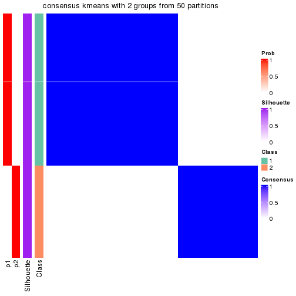</p>

</div>
<div id='tab-node-02-consensus-heatmap-2'>
<pre><code class="r">consensus_heatmap(res, k = 3)
</code></pre>

<p>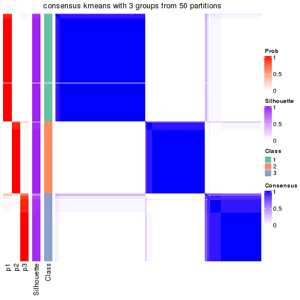</p>

</div>
<div id='tab-node-02-consensus-heatmap-3'>
<pre><code class="r">consensus_heatmap(res, k = 4)
</code></pre>

<p>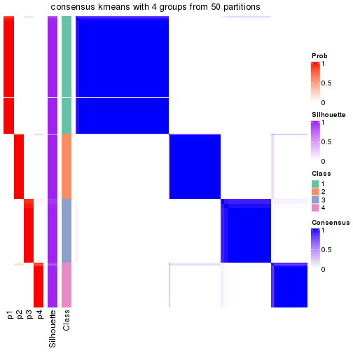</p>

</div>
<div id='tab-node-02-consensus-heatmap-4'>
<pre><code class="r">consensus_heatmap(res, k = 5)
</code></pre>

<p>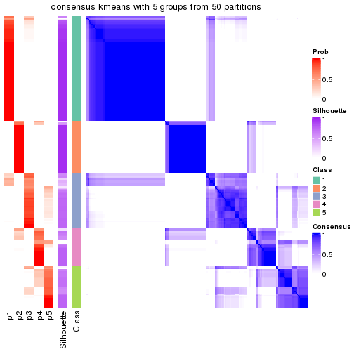</p>

</div>
<div id='tab-node-02-consensus-heatmap-5'>
<pre><code class="r">consensus_heatmap(res, k = 6)
</code></pre>

<p>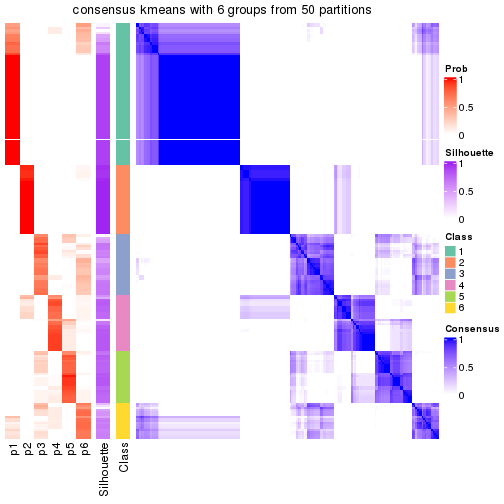</p>

</div>
<div id='tab-node-02-consensus-heatmap-6'>
<pre><code class="r">consensus_heatmap(res, k = 7)
</code></pre>

<p>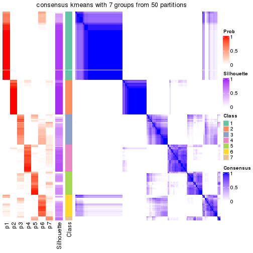</p>

</div>
<div id='tab-node-02-consensus-heatmap-7'>
<pre><code class="r">consensus_heatmap(res, k = 8)
</code></pre>

<p>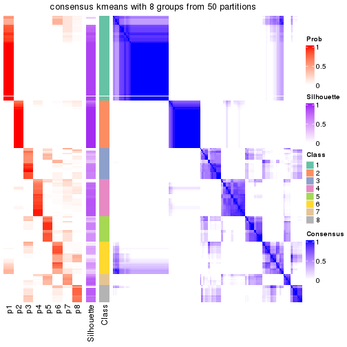</p>

</div>
</div>

Heatmaps for the membership of samples in all partitions to see how consistent they are:


<script>
$( function() {
	$( '#tabs-node-02-membership-heatmap' ).tabs();
} );
</script>
<div id='tabs-node-02-membership-heatmap'>
<ul>
<li><a href='#tab-node-02-membership-heatmap-1'>k = 2</a></li>
<li><a href='#tab-node-02-membership-heatmap-2'>k = 3</a></li>
<li><a href='#tab-node-02-membership-heatmap-3'>k = 4</a></li>
<li><a href='#tab-node-02-membership-heatmap-4'>k = 5</a></li>
<li><a href='#tab-node-02-membership-heatmap-5'>k = 6</a></li>
<li><a href='#tab-node-02-membership-heatmap-6'>k = 7</a></li>
<li><a href='#tab-node-02-membership-heatmap-7'>k = 8</a></li>
</ul>
<div id='tab-node-02-membership-heatmap-1'>
<pre><code class="r">membership_heatmap(res, k = 2)
</code></pre>

<p>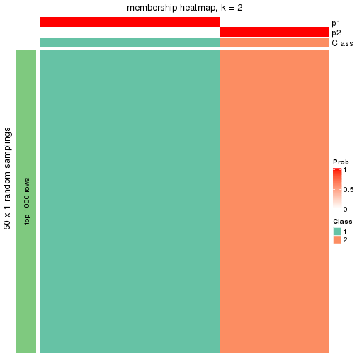</p>

</div>
<div id='tab-node-02-membership-heatmap-2'>
<pre><code class="r">membership_heatmap(res, k = 3)
</code></pre>

<p>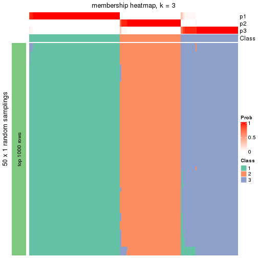</p>

</div>
<div id='tab-node-02-membership-heatmap-3'>
<pre><code class="r">membership_heatmap(res, k = 4)
</code></pre>

<p>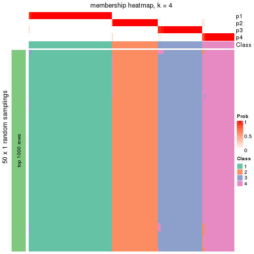</p>

</div>
<div id='tab-node-02-membership-heatmap-4'>
<pre><code class="r">membership_heatmap(res, k = 5)
</code></pre>

<p>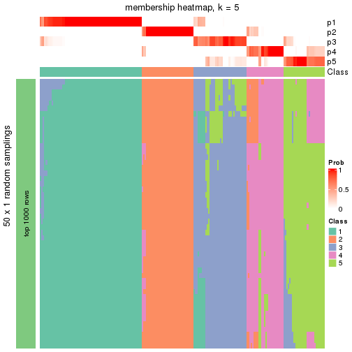</p>

</div>
<div id='tab-node-02-membership-heatmap-5'>
<pre><code class="r">membership_heatmap(res, k = 6)
</code></pre>

<p>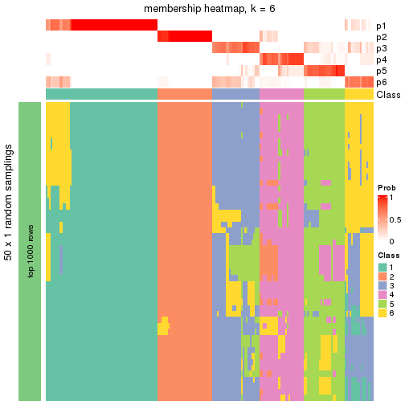</p>

</div>
<div id='tab-node-02-membership-heatmap-6'>
<pre><code class="r">membership_heatmap(res, k = 7)
</code></pre>

<p>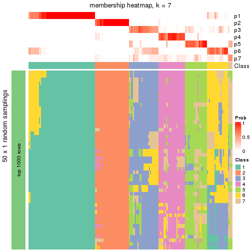</p>

</div>
<div id='tab-node-02-membership-heatmap-7'>
<pre><code class="r">membership_heatmap(res, k = 8)
</code></pre>

<p>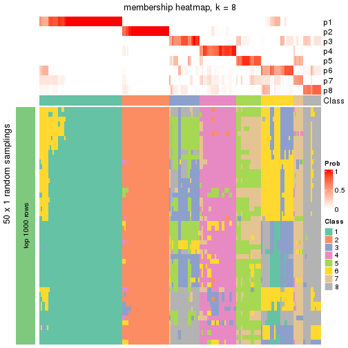</p>

</div>
</div>

As soon as the classes for columns are determined, the signatures
that are significantly different between subgroups can be looked for. 
Following are the heatmaps for signatures.


<script>
$( function() {
	$( '#tabs-node-02-get-signatures' ).tabs();
} );
</script>
<div id='tabs-node-02-get-signatures'>
<ul>
<li><a href='#tab-node-02-get-signatures-1'>k = 2</a></li>
<li><a href='#tab-node-02-get-signatures-2'>k = 3</a></li>
<li><a href='#tab-node-02-get-signatures-3'>k = 4</a></li>
<li><a href='#tab-node-02-get-signatures-4'>k = 5</a></li>
<li><a href='#tab-node-02-get-signatures-5'>k = 6</a></li>
<li><a href='#tab-node-02-get-signatures-6'>k = 7</a></li>
<li><a href='#tab-node-02-get-signatures-7'>k = 8</a></li>
</ul>
<div id='tab-node-02-get-signatures-1'>
<pre><code class="r">get_signatures(res, k = 2)
</code></pre>

<p>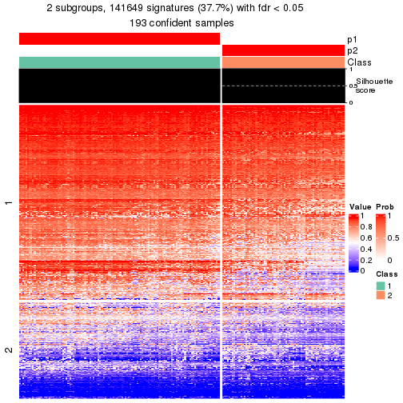</p>

</div>
<div id='tab-node-02-get-signatures-2'>
<pre><code class="r">get_signatures(res, k = 3)
</code></pre>

<p>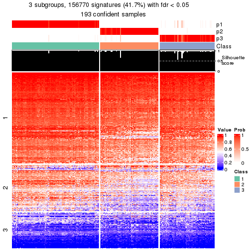</p>

</div>
<div id='tab-node-02-get-signatures-3'>
<pre><code class="r">get_signatures(res, k = 4)
</code></pre>

<p>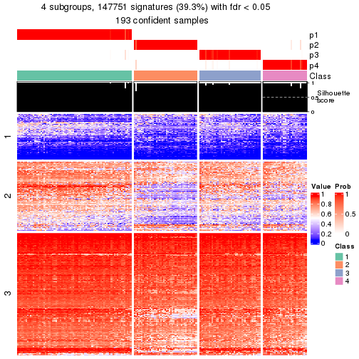</p>

</div>
<div id='tab-node-02-get-signatures-4'>
<pre><code class="r">get_signatures(res, k = 5)
</code></pre>

<p>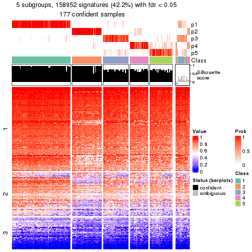</p>

</div>
<div id='tab-node-02-get-signatures-5'>
<pre><code class="r">get_signatures(res, k = 6)
</code></pre>

<p>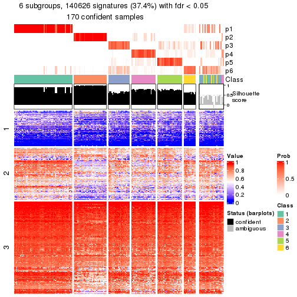</p>

</div>
<div id='tab-node-02-get-signatures-6'>
<pre><code class="r">get_signatures(res, k = 7)
</code></pre>

<p>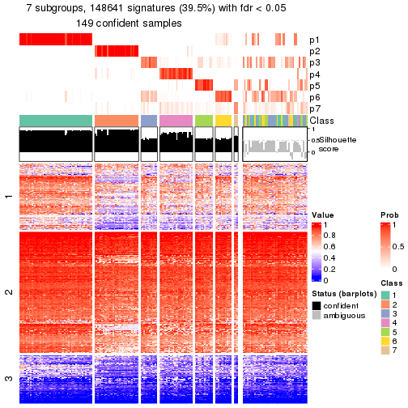</p>

</div>
<div id='tab-node-02-get-signatures-7'>
<pre><code class="r">get_signatures(res, k = 8)
</code></pre>

<p>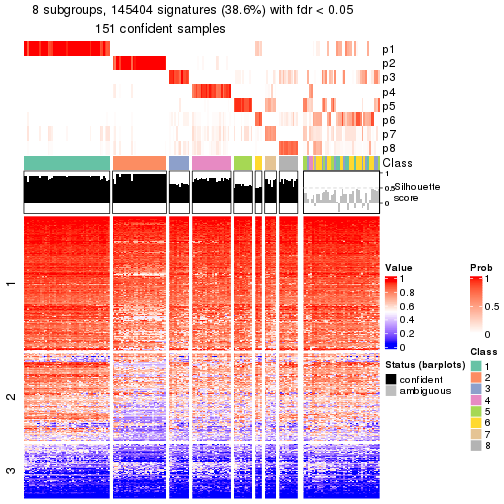</p>

</div>
</div>


Compare the overlap of signatures from different k:

```r
compare_signatures(res)
```

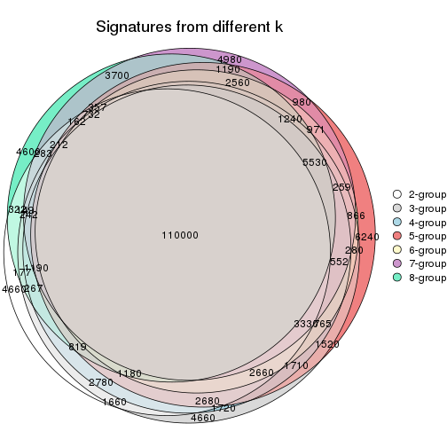

`get_signature()` returns a data frame invisibly. To get the list of signatures, the function
call should be assigned to a variable explicitly. In following code, if `plot` argument is set
to `FALSE`, no heatmap is plotted while only the differential analysis is performed.

```r
# code only for demonstration
tb = get_signature(res, k = ..., plot = FALSE)
```

An example of the output of `tb` is:

```
#>   which_row         fdr    mean_1    mean_2 scaled_mean_1 scaled_mean_2 km
#> 1        38 0.042760348  8.373488  9.131774    -0.5533452     0.5164555  1
#> 2        40 0.018707592  7.106213  8.469186    -0.6173731     0.5762149  1
#> 3        55 0.019134737 10.221463 11.207825    -0.6159697     0.5749050  1
#> 4        59 0.006059896  5.921854  7.869574    -0.6899429     0.6439467  1
#> 5        60 0.018055526  8.928898 10.211722    -0.6204761     0.5791110  1
#> 6        98 0.009384629 15.714769 14.887706     0.6635654    -0.6193277  2
...
```

The columns in `tb` are:

1. `which_row`: row indices corresponding to the input matrix.
2. `fdr`: FDR for the differential test. 
3. `mean_x`: The mean value in group x.
4. `scaled_mean_x`: The mean value in group x after rows are scaled.
5. `km`: Row groups if k-means clustering is applied to rows (which is done by automatically selecting number of clusters).

If there are too many signatures, `top_signatures = ...` can be set to only show the 
signatures with the highest FDRs:

```r
# code only for demonstration
# e.g. to show the top 500 most significant rows
tb = get_signature(res, k = ..., top_signatures = 500)
```

If the signatures are defined as these which are uniquely high in current group, `diff_method` argument
can be set to `"uniquely_high_in_one_group"`:

```r
# code only for demonstration
tb = get_signature(res, k = ..., diff_method = "uniquely_high_in_one_group")
```


UMAP plot which shows how samples are separated.


<script>
$( function() {
	$( '#tabs-node-02-dimension-reduction' ).tabs();
} );
</script>
<div id='tabs-node-02-dimension-reduction'>
<ul>
<li><a href='#tab-node-02-dimension-reduction-1'>k = 2</a></li>
<li><a href='#tab-node-02-dimension-reduction-2'>k = 3</a></li>
<li><a href='#tab-node-02-dimension-reduction-3'>k = 4</a></li>
<li><a href='#tab-node-02-dimension-reduction-4'>k = 5</a></li>
<li><a href='#tab-node-02-dimension-reduction-5'>k = 6</a></li>
<li><a href='#tab-node-02-dimension-reduction-6'>k = 7</a></li>
<li><a href='#tab-node-02-dimension-reduction-7'>k = 8</a></li>
</ul>
<div id='tab-node-02-dimension-reduction-1'>
<pre><code class="r">dimension_reduction(res, k = 2, method = &quot;UMAP&quot;)
</code></pre>

<p>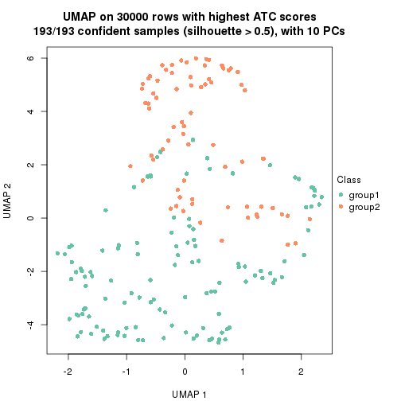</p>

</div>
<div id='tab-node-02-dimension-reduction-2'>
<pre><code class="r">dimension_reduction(res, k = 3, method = &quot;UMAP&quot;)
</code></pre>

<p>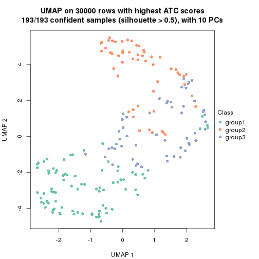</p>

</div>
<div id='tab-node-02-dimension-reduction-3'>
<pre><code class="r">dimension_reduction(res, k = 4, method = &quot;UMAP&quot;)
</code></pre>

<p>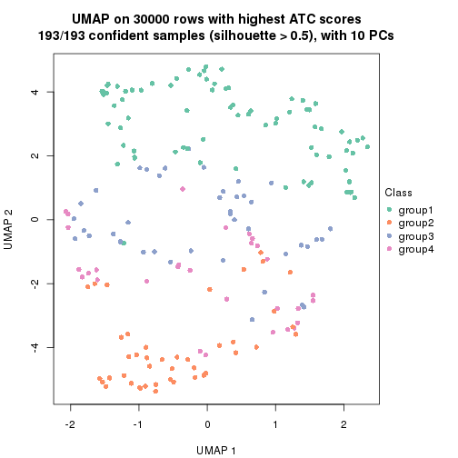</p>

</div>
<div id='tab-node-02-dimension-reduction-4'>
<pre><code class="r">dimension_reduction(res, k = 5, method = &quot;UMAP&quot;)
</code></pre>

<p>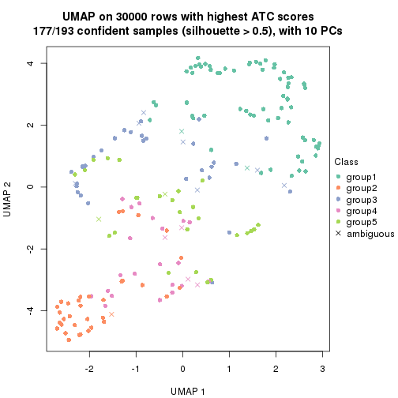</p>

</div>
<div id='tab-node-02-dimension-reduction-5'>
<pre><code class="r">dimension_reduction(res, k = 6, method = &quot;UMAP&quot;)
</code></pre>

<p>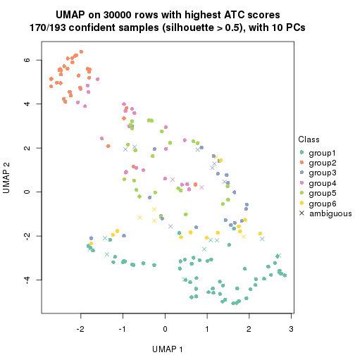</p>

</div>
<div id='tab-node-02-dimension-reduction-6'>
<pre><code class="r">dimension_reduction(res, k = 7, method = &quot;UMAP&quot;)
</code></pre>

<p>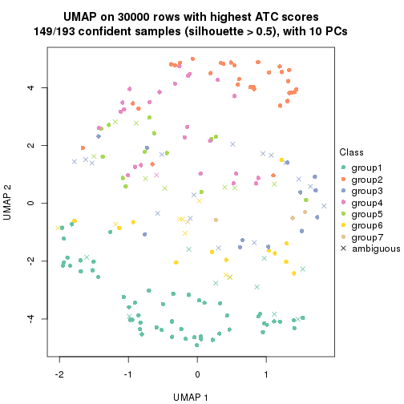</p>

</div>
<div id='tab-node-02-dimension-reduction-7'>
<pre><code class="r">dimension_reduction(res, k = 8, method = &quot;UMAP&quot;)
</code></pre>

<p>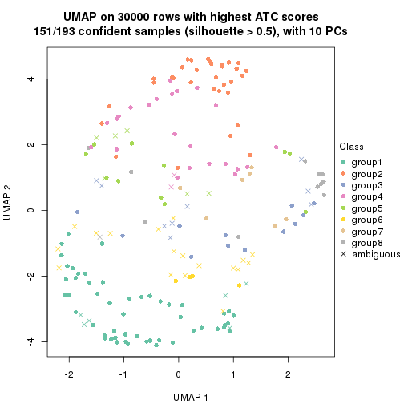</p>

</div>
</div>


Following heatmap shows how subgroups are split when increasing `k`:

```r
collect_classes(res)
```

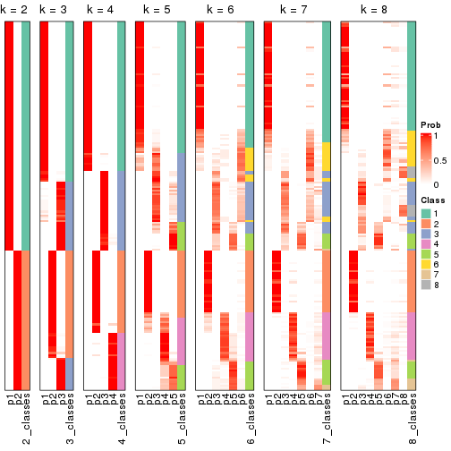


If matrix rows can be associated to genes, consider to use `functional_enrichment(res,
...)` to perform function enrichment for the signature genes. See [this vignette](https://jokergoo.github.io/cola_vignettes/functional_enrichment.html) for more detailed explanations.


 

---------------------------------------------------


### Node021


Parent node: [Node02](#Node02).
Child nodes: 
                Node0121-leaf
        ,
                Node0122-leaf
        ,
                Node0123-leaf
        ,
                Node0211-leaf
        ,
                [Node0212](#Node0212)
        ,
                Node0213-leaf
        ,
                [Node0221](#Node0221)
        ,
                Node0222-leaf
        ,
                Node0223-leaf
        ,
                [Node0231](#Node0231)
        ,
                Node0232-leaf
        ,
                Node0233-leaf
        ,
                Node0241-leaf
        ,
                Node0242-leaf
        ,
                Node0411-leaf
        ,
                Node0412-leaf
        ,
                Node0413-leaf
        ,
                Node0421-leaf
        ,
                Node0422-leaf
        ,
                Node0423-leaf
        ,
                Node0431-leaf
        ,
                Node0432-leaf
        ,
                Node0433-leaf
        ,
                Node0441-leaf
        ,
                Node0442-leaf
        ,
                Node0443-leaf
        ,
                Node0511-leaf
        ,
                [Node0512](#Node0512)
        ,
                Node0513-leaf
        ,
                Node0521-leaf
        ,
                Node0522-leaf
        ,
                Node0523-leaf
        .


The object with results only for a single top-value method and a single partitioning method 
can be extracted as:

```r
res = res_rh["021"]
```

A summary of `res` and all the functions that can be applied to it:

```r
res
```

```
#> A 'ConsensusPartition' object with k = 2, 3, 4, 5, 6, 7, 8.
#>   On a matrix with 30000 rows and 78 columns.
#>   Top rows (1000) are extracted by 'SD' method.
#>   Subgroups are detected by 'kmeans' method.
#>   Performed in total 350 partitions by row resampling.
#>   Best k for subgroups seems to be 3.
#> 
#> Following methods can be applied to this 'ConsensusPartition' object:
#>  [1] "cola_report"             "collect_classes"         "collect_plots"          
#>  [4] "collect_stats"           "colnames"                "compare_partitions"     
#>  [7] "compare_signatures"      "consensus_heatmap"       "dimension_reduction"    
#> [10] "functional_enrichment"   "get_anno_col"            "get_anno"               
#> [13] "get_classes"             "get_consensus"           "get_matrix"             
#> [16] "get_membership"          "get_param"               "get_signatures"         
#> [19] "get_stats"               "is_best_k"               "is_stable_k"            
#> [22] "membership_heatmap"      "ncol"                    "nrow"                   
#> [25] "plot_ecdf"               "predict_classes"         "rownames"               
#> [28] "select_partition_number" "show"                    "suggest_best_k"         
#> [31] "test_to_known_factors"   "top_rows_heatmap"
```

`collect_plots()` function collects all the plots made from `res` for all `k` (number of subgroups)
into one single page to provide an easy and fast comparison between different `k`.

```r
collect_plots(res)
```

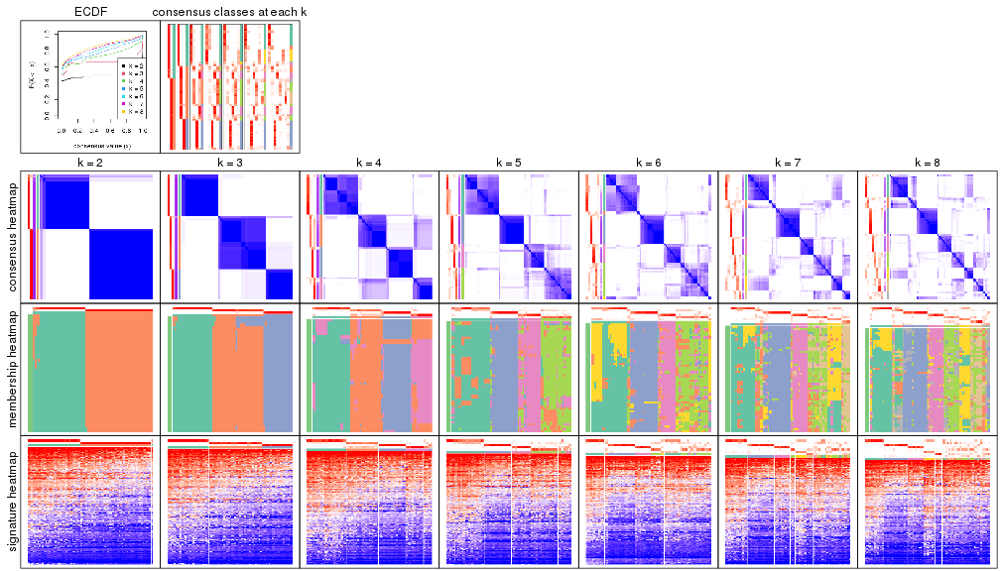

The plots are:

- The first row: a plot of the eCDF (empirical cumulative distribution
  function) curves of the consensus matrix for each `k` and the heatmap of
  predicted classes for each `k`.
- The second row: heatmaps of the consensus matrix for each `k`.
- The third row: heatmaps of the membership matrix for each `k`.
- The fouth row: heatmaps of the signatures for each `k`.

All the plots in panels can be made by individual functions and they are
plotted later in this section.

`select_partition_number()` produces several plots showing different
statistics for choosing "optimized" `k`. There are following statistics:

- eCDF curves of the consensus matrix for each `k`;
- 1-PAC. [The PAC score](https://en.wikipedia.org/wiki/Consensus_clustering#Over-interpretation_potential_of_consensus_clustering)
  measures the proportion of the ambiguous subgrouping.
- Mean silhouette score.
- Concordance. The mean probability of fiting the consensus subgroup labels in all
  partitions.
- Area increased. Denote $A_k$ as the area under the eCDF curve for current
  `k`, the area increased is defined as $A_k - A_{k-1}$.
- Rand index. The percent of pairs of samples that are both in a same cluster
  or both are not in a same cluster in the partition of k and k-1.
- Jaccard index. The ratio of pairs of samples are both in a same cluster in
  the partition of k and k-1 and the pairs of samples are both in a same
  cluster in the partition k or k-1.

The detailed explanations of these statistics can be found in [the _cola_
vignette](https://jokergoo.github.io/cola_vignettes/cola.html#toc_13).

Generally speaking, higher 1-PAC score, higher mean silhouette score or higher
concordance corresponds to better partition. Rand index and Jaccard index
measure how similar the current partition is compared to partition with `k-1`.
If they are too similar, we won't accept `k` is better than `k-1`.

```r
select_partition_number(res)
```

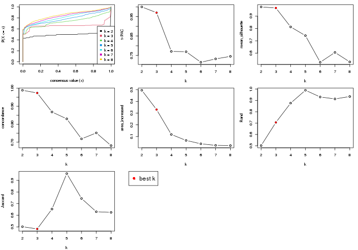

The numeric values for all these statistics can be obtained by `get_stats()`.

```r
get_stats(res)
```

```
#>   k 1-PAC mean_silhouette concordance area_increased  Rand Jaccard
#> 2 2 1.000           0.974       0.989         0.4953 0.502   0.502
#> 3 3 0.970           0.966       0.974         0.3305 0.706   0.483
#> 4 4 0.771           0.812       0.868         0.1175 0.876   0.654
#> 5 5 0.769           0.742       0.830         0.0668 0.989   0.958
#> 6 6 0.715           0.526       0.718         0.0379 0.930   0.744
#> 7 7 0.732           0.606       0.752         0.0247 0.913   0.630
#> 8 8 0.745           0.529       0.681         0.0226 0.934   0.625
```

`suggest_best_k()` suggests the best $k$ based on these statistics. The rules are as follows:

- All $k$ with Jaccard index larger than 0.95 are removed because increasing
  $k$ does not provide enough extra information. If all $k$ are removed, it is
  marked as no subgroup is detected.
- For all $k$ with 1-PAC score larger than 0.9, the maximal $k$ is taken as
  the best $k$, and other $k$ are marked as optional $k$.
- If it does not fit the second rule. The $k$ with the maximal vote of the
  highest 1-PAC score, highest mean silhouette, and highest concordance is
  taken as the best $k$.

```r
suggest_best_k(res)
```

```
#> [1] 3
#> attr(,"optional")
#> [1] 2
```

There is also optional best $k$ = 2 that is worth to check.

Following is the table of the partitions (You need to click the **show/hide
code output** link to see it). The membership matrix (columns with name `p*`)
is inferred by
[`clue::cl_consensus()`](https://www.rdocumentation.org/link/cl_consensus?package=clue)
function with the `SE` method. Basically the value in the membership matrix
represents the probability to belong to a certain group. The finall subgroup
label for an item is determined with the group with highest probability it
belongs to.

In `get_classes()` function, the entropy is calculated from the membership
matrix and the silhouette score is calculated from the consensus matrix.


<script>
$( function() {
	$( '#tabs-node-021-get-classes' ).tabs();
} );
</script>
<div id='tabs-node-021-get-classes'>
<ul>
<li><a href='#tab-node-021-get-classes-1'>k = 2</a></li>
<li><a href='#tab-node-021-get-classes-2'>k = 3</a></li>
<li><a href='#tab-node-021-get-classes-3'>k = 4</a></li>
<li><a href='#tab-node-021-get-classes-4'>k = 5</a></li>
<li><a href='#tab-node-021-get-classes-5'>k = 6</a></li>
<li><a href='#tab-node-021-get-classes-6'>k = 7</a></li>
<li><a href='#tab-node-021-get-classes-7'>k = 8</a></li>
</ul>

<div id='tab-node-021-get-classes-1'>
<p><a id='tab-node-021-get-classes-1-a' style='color:#0366d6' href='#'>show/hide code output</a></p>
<pre><code class="r">cbind(get_classes(res, k = 2), get_membership(res, k = 2))
</code></pre>

<pre><code>#&gt;                 class entropy silhouette   p1   p2
#&gt; TCGA.KK.A6E4.01     1   0.000      0.974 1.00 0.00
#&gt; TCGA.H9.7775.01     2   0.000      0.999 0.00 1.00
#&gt; TCGA.XJ.A9DX.01     1   0.000      0.974 1.00 0.00
#&gt; TCGA.QU.A6IN.01     2   0.000      0.999 0.00 1.00
#&gt; TCGA.KK.A7B3.01     1   0.000      0.974 1.00 0.00
#&gt; TCGA.KK.A8I5.01     1   0.000      0.974 1.00 0.00
#&gt; TCGA.HC.7819.01     1   0.000      0.974 1.00 0.00
#&gt; TCGA.EJ.A7NF.01     2   0.000      0.999 0.00 1.00
#&gt; TCGA.HC.7821.01     1   0.000      0.974 1.00 0.00
#&gt; TCGA.EJ.8474.01     1   0.000      0.974 1.00 0.00
#&gt; TCGA.KC.A7F6.01     1   0.000      0.974 1.00 0.00
#&gt; TCGA.V1.A8WS.01     1   0.000      0.974 1.00 0.00
#&gt; TCGA.HC.8213.01     2   0.000      0.999 0.00 1.00
#&gt; TCGA.ZG.A9LZ.01     2   0.000      0.999 0.00 1.00
#&gt; TCGA.CH.5765.01     1   0.000      0.974 1.00 0.00
#&gt; TCGA.V1.A8WW.01     2   0.000      0.999 0.00 1.00
#&gt; TCGA.HC.A48F.01     2   0.000      0.999 0.00 1.00
#&gt; TCGA.G9.6377.01     2   0.000      0.999 0.00 1.00
#&gt; TCGA.YJ.A8SW.01     1   0.000      0.974 1.00 0.00
#&gt; TCGA.EJ.A46F.01     1   0.000      0.974 1.00 0.00
#&gt; TCGA.MG.AAMC.01     1   0.529      0.861 0.88 0.12
#&gt; TCGA.HC.7077.01     1   0.000      0.974 1.00 0.00
#&gt; TCGA.H9.A6BY.01     2   0.000      0.999 0.00 1.00
#&gt; TCGA.2A.AAYF.01     2   0.000      0.999 0.00 1.00
#&gt; TCGA.M7.A71Z.01     1   0.000      0.974 1.00 0.00
#&gt; TCGA.CH.5750.01     2   0.000      0.999 0.00 1.00
#&gt; TCGA.EJ.8469.01     1   0.000      0.974 1.00 0.00
#&gt; TCGA.YL.A8SP.01     2   0.000      0.999 0.00 1.00
#&gt; TCGA.CH.5791.01     2   0.000      0.999 0.00 1.00
#&gt; TCGA.HC.A76X.01     2   0.000      0.999 0.00 1.00
#&gt; TCGA.EJ.A65D.01     2   0.000      0.999 0.00 1.00
#&gt; TCGA.VP.A87D.01     2   0.000      0.999 0.00 1.00
#&gt; TCGA.KK.A8II.01     1   0.827      0.665 0.74 0.26
#&gt; TCGA.J9.A52B.01     2   0.000      0.999 0.00 1.00
#&gt; TCGA.CH.5752.01     1   0.000      0.974 1.00 0.00
#&gt; TCGA.KK.A59Y.01     2   0.000      0.999 0.00 1.00
#&gt; TCGA.G9.6362.11     2   0.000      0.999 0.00 1.00
#&gt; TCGA.HC.A631.01     1   0.000      0.974 1.00 0.00
#&gt; TCGA.YL.A8SA.01     2   0.000      0.999 0.00 1.00
#&gt; TCGA.EJ.7784.01     1   0.000      0.974 1.00 0.00
#&gt; TCGA.G9.6373.01     2   0.000      0.999 0.00 1.00
#&gt; TCGA.ZG.A9L9.01     2   0.000      0.999 0.00 1.00
#&gt; TCGA.VN.A88K.01     2   0.000      0.999 0.00 1.00
#&gt; TCGA.CH.5790.01     2   0.000      0.999 0.00 1.00
#&gt; TCGA.HC.7231.01     1   0.402      0.903 0.92 0.08
#&gt; TCGA.HC.7230.01     2   0.000      0.999 0.00 1.00
#&gt; TCGA.CH.5741.01     2   0.000      0.999 0.00 1.00
#&gt; TCGA.KK.A59V.01     1   0.000      0.974 1.00 0.00
#&gt; TCGA.HI.7171.01     1   0.000      0.974 1.00 0.00
#&gt; TCGA.HC.8259.01     2   0.000      0.999 0.00 1.00
#&gt; TCGA.XJ.A83F.01     2   0.000      0.999 0.00 1.00
#&gt; TCGA.G9.A9S4.01     1   0.000      0.974 1.00 0.00
#&gt; TCGA.G9.7525.01     2   0.000      0.999 0.00 1.00
#&gt; TCGA.KK.A7AU.01     2   0.000      0.999 0.00 1.00
#&gt; TCGA.EJ.7325.01     1   0.000      0.974 1.00 0.00
#&gt; TCGA.HC.8257.01     1   0.000      0.974 1.00 0.00
#&gt; TCGA.YL.A8SL.01     1   0.000      0.974 1.00 0.00
#&gt; TCGA.YL.A9WL.01     2   0.000      0.999 0.00 1.00
#&gt; TCGA.G9.6362.01     2   0.000      0.999 0.00 1.00
#&gt; TCGA.EJ.5530.01     2   0.000      0.999 0.00 1.00
#&gt; TCGA.VN.A88M.01     2   0.000      0.999 0.00 1.00
#&gt; TCGA.KK.A6E2.01     1   0.000      0.974 1.00 0.00
#&gt; TCGA.J4.A6M7.01     2   0.000      0.999 0.00 1.00
#&gt; TCGA.EJ.8472.01     1   0.000      0.974 1.00 0.00
#&gt; TCGA.YL.A9WH.01     1   0.000      0.974 1.00 0.00
#&gt; TCGA.J4.A83N.01     2   0.000      0.999 0.00 1.00
#&gt; TCGA.HC.A6AN.01     1   0.000      0.974 1.00 0.00
#&gt; TCGA.J4.A67N.01     2   0.000      0.999 0.00 1.00
#&gt; TCGA.VP.A876.01     2   0.000      0.999 0.00 1.00
#&gt; TCGA.CH.5739.01     1   0.958      0.414 0.62 0.38
#&gt; TCGA.KK.A8IH.01     2   0.000      0.999 0.00 1.00
#&gt; TCGA.VP.A87K.01     2   0.000      0.999 0.00 1.00
#&gt; TCGA.2A.A8VV.01     2   0.000      0.999 0.00 1.00
#&gt; TCGA.EJ.5525.01     2   0.000      0.999 0.00 1.00
#&gt; TCGA.V1.A9OT.01     1   0.000      0.974 1.00 0.00
#&gt; TCGA.G9.6332.01     2   0.000      0.999 0.00 1.00
#&gt; TCGA.EJ.A46G.01     2   0.242      0.957 0.04 0.96
#&gt; TCGA.EJ.A65F.01     1   0.000      0.974 1.00 0.00
</code></pre>

<script>
$('#tab-node-021-get-classes-1-a').parent().next().next().hide();
$('#tab-node-021-get-classes-1-a').click(function(){
  $('#tab-node-021-get-classes-1-a').parent().next().next().toggle();
  return(false);
});
</script>
</div>

<div id='tab-node-021-get-classes-2'>
<p><a id='tab-node-021-get-classes-2-a' style='color:#0366d6' href='#'>show/hide code output</a></p>
<pre><code class="r">cbind(get_classes(res, k = 3), get_membership(res, k = 3))
</code></pre>

<pre><code>#&gt;                 class entropy silhouette   p1   p2   p3
#&gt; TCGA.KK.A6E4.01     1   0.153      0.961 0.96 0.04 0.00
#&gt; TCGA.H9.7775.01     2   0.000      0.945 0.00 1.00 0.00
#&gt; TCGA.XJ.A9DX.01     1   0.000      0.992 1.00 0.00 0.00
#&gt; TCGA.QU.A6IN.01     2   0.000      0.945 0.00 1.00 0.00
#&gt; TCGA.KK.A7B3.01     1   0.000      0.992 1.00 0.00 0.00
#&gt; TCGA.KK.A8I5.01     1   0.254      0.926 0.92 0.08 0.00
#&gt; TCGA.HC.7819.01     1   0.000      0.992 1.00 0.00 0.00
#&gt; TCGA.EJ.A7NF.01     2   0.207      0.951 0.00 0.94 0.06
#&gt; TCGA.HC.7821.01     1   0.000      0.992 1.00 0.00 0.00
#&gt; TCGA.EJ.8474.01     1   0.000      0.992 1.00 0.00 0.00
#&gt; TCGA.KC.A7F6.01     1   0.000      0.992 1.00 0.00 0.00
#&gt; TCGA.V1.A8WS.01     2   0.254      0.911 0.08 0.92 0.00
#&gt; TCGA.HC.8213.01     3   0.153      0.955 0.00 0.04 0.96
#&gt; TCGA.ZG.A9LZ.01     2   0.000      0.945 0.00 1.00 0.00
#&gt; TCGA.CH.5765.01     1   0.000      0.992 1.00 0.00 0.00
#&gt; TCGA.V1.A8WW.01     2   0.000      0.945 0.00 1.00 0.00
#&gt; TCGA.HC.A48F.01     3   0.000      0.994 0.00 0.00 1.00
#&gt; TCGA.G9.6377.01     3   0.000      0.994 0.00 0.00 1.00
#&gt; TCGA.YJ.A8SW.01     1   0.000      0.992 1.00 0.00 0.00
#&gt; TCGA.EJ.A46F.01     1   0.000      0.992 1.00 0.00 0.00
#&gt; TCGA.MG.AAMC.01     2   0.000      0.945 0.00 1.00 0.00
#&gt; TCGA.HC.7077.01     1   0.000      0.992 1.00 0.00 0.00
#&gt; TCGA.H9.A6BY.01     2   0.207      0.951 0.00 0.94 0.06
#&gt; TCGA.2A.AAYF.01     3   0.000      0.994 0.00 0.00 1.00
#&gt; TCGA.M7.A71Z.01     1   0.000      0.992 1.00 0.00 0.00
#&gt; TCGA.CH.5750.01     3   0.000      0.994 0.00 0.00 1.00
#&gt; TCGA.EJ.8469.01     1   0.000      0.992 1.00 0.00 0.00
#&gt; TCGA.YL.A8SP.01     2   0.207      0.951 0.00 0.94 0.06
#&gt; TCGA.CH.5791.01     2   0.254      0.949 0.00 0.92 0.08
#&gt; TCGA.HC.A76X.01     2   0.254      0.949 0.00 0.92 0.08
#&gt; TCGA.EJ.A65D.01     2   0.254      0.949 0.00 0.92 0.08
#&gt; TCGA.VP.A87D.01     3   0.000      0.994 0.00 0.00 1.00
#&gt; TCGA.KK.A8II.01     2   0.000      0.945 0.00 1.00 0.00
#&gt; TCGA.J9.A52B.01     2   0.254      0.949 0.00 0.92 0.08
#&gt; TCGA.CH.5752.01     1   0.000      0.992 1.00 0.00 0.00
#&gt; TCGA.KK.A59Y.01     3   0.000      0.994 0.00 0.00 1.00
#&gt; TCGA.G9.6362.11     2   0.296      0.935 0.00 0.90 0.10
#&gt; TCGA.HC.A631.01     1   0.000      0.992 1.00 0.00 0.00
#&gt; TCGA.YL.A8SA.01     2   0.556      0.662 0.00 0.70 0.30
#&gt; TCGA.EJ.7784.01     1   0.000      0.992 1.00 0.00 0.00
#&gt; TCGA.G9.6373.01     3   0.000      0.994 0.00 0.00 1.00
#&gt; TCGA.ZG.A9L9.01     2   0.000      0.945 0.00 1.00 0.00
#&gt; TCGA.VN.A88K.01     3   0.000      0.994 0.00 0.00 1.00
#&gt; TCGA.CH.5790.01     3   0.000      0.994 0.00 0.00 1.00
#&gt; TCGA.HC.7231.01     2   0.000      0.945 0.00 1.00 0.00
#&gt; TCGA.HC.7230.01     2   0.254      0.949 0.00 0.92 0.08
#&gt; TCGA.CH.5741.01     3   0.207      0.931 0.00 0.06 0.94
#&gt; TCGA.KK.A59V.01     1   0.000      0.992 1.00 0.00 0.00
#&gt; TCGA.HI.7171.01     2   0.000      0.945 0.00 1.00 0.00
#&gt; TCGA.HC.8259.01     3   0.000      0.994 0.00 0.00 1.00
#&gt; TCGA.XJ.A83F.01     3   0.000      0.994 0.00 0.00 1.00
#&gt; TCGA.G9.A9S4.01     2   0.153      0.933 0.04 0.96 0.00
#&gt; TCGA.G9.7525.01     2   0.254      0.949 0.00 0.92 0.08
#&gt; TCGA.KK.A7AU.01     2   0.254      0.949 0.00 0.92 0.08
#&gt; TCGA.EJ.7325.01     2   0.000      0.945 0.00 1.00 0.00
#&gt; TCGA.HC.8257.01     1   0.000      0.992 1.00 0.00 0.00
#&gt; TCGA.YL.A8SL.01     1   0.000      0.992 1.00 0.00 0.00
#&gt; TCGA.YL.A9WL.01     2   0.254      0.949 0.00 0.92 0.08
#&gt; TCGA.G9.6362.01     2   0.296      0.935 0.00 0.90 0.10
#&gt; TCGA.EJ.5530.01     3   0.000      0.994 0.00 0.00 1.00
#&gt; TCGA.VN.A88M.01     3   0.000      0.994 0.00 0.00 1.00
#&gt; TCGA.KK.A6E2.01     1   0.000      0.992 1.00 0.00 0.00
#&gt; TCGA.J4.A6M7.01     3   0.000      0.994 0.00 0.00 1.00
#&gt; TCGA.EJ.8472.01     1   0.000      0.992 1.00 0.00 0.00
#&gt; TCGA.YL.A9WH.01     1   0.000      0.992 1.00 0.00 0.00
#&gt; TCGA.J4.A83N.01     2   0.254      0.949 0.00 0.92 0.08
#&gt; TCGA.HC.A6AN.01     1   0.000      0.992 1.00 0.00 0.00
#&gt; TCGA.J4.A67N.01     3   0.000      0.994 0.00 0.00 1.00
#&gt; TCGA.VP.A876.01     3   0.000      0.994 0.00 0.00 1.00
#&gt; TCGA.CH.5739.01     2   0.000      0.945 0.00 1.00 0.00
#&gt; TCGA.KK.A8IH.01     2   0.000      0.945 0.00 1.00 0.00
#&gt; TCGA.VP.A87K.01     2   0.254      0.949 0.00 0.92 0.08
#&gt; TCGA.2A.A8VV.01     3   0.000      0.994 0.00 0.00 1.00
#&gt; TCGA.EJ.5525.01     2   0.254      0.949 0.00 0.92 0.08
#&gt; TCGA.V1.A9OT.01     1   0.254      0.926 0.92 0.08 0.00
#&gt; TCGA.G9.6332.01     2   0.254      0.949 0.00 0.92 0.08
#&gt; TCGA.EJ.A46G.01     2   0.000      0.945 0.00 1.00 0.00
#&gt; TCGA.EJ.A65F.01     1   0.000      0.992 1.00 0.00 0.00
</code></pre>

<script>
$('#tab-node-021-get-classes-2-a').parent().next().next().hide();
$('#tab-node-021-get-classes-2-a').click(function(){
  $('#tab-node-021-get-classes-2-a').parent().next().next().toggle();
  return(false);
});
</script>
</div>

<div id='tab-node-021-get-classes-3'>
<p><a id='tab-node-021-get-classes-3-a' style='color:#0366d6' href='#'>show/hide code output</a></p>
<pre><code class="r">cbind(get_classes(res, k = 4), get_membership(res, k = 4))
</code></pre>

<pre><code>#&gt;                 class entropy silhouette   p1   p2   p3   p4
#&gt; TCGA.KK.A6E4.01     1  0.5489     0.6601 0.70 0.06 0.00 0.24
#&gt; TCGA.H9.7775.01     2  0.4790     0.7664 0.00 0.62 0.00 0.38
#&gt; TCGA.XJ.A9DX.01     1  0.2921     0.8650 0.86 0.14 0.00 0.00
#&gt; TCGA.QU.A6IN.01     4  0.0000     0.8401 0.00 0.00 0.00 1.00
#&gt; TCGA.KK.A7B3.01     1  0.2011     0.8897 0.92 0.08 0.00 0.00
#&gt; TCGA.KK.A8I5.01     4  0.5392     0.3993 0.28 0.04 0.00 0.68
#&gt; TCGA.HC.7819.01     1  0.0707     0.9071 0.98 0.02 0.00 0.00
#&gt; TCGA.EJ.A7NF.01     4  0.5767     0.1881 0.00 0.28 0.06 0.66
#&gt; TCGA.HC.7821.01     1  0.0000     0.9075 1.00 0.00 0.00 0.00
#&gt; TCGA.EJ.8474.01     1  0.2011     0.8897 0.92 0.08 0.00 0.00
#&gt; TCGA.KC.A7F6.01     1  0.0707     0.9071 0.98 0.02 0.00 0.00
#&gt; TCGA.V1.A8WS.01     2  0.3972     0.6262 0.08 0.84 0.00 0.08
#&gt; TCGA.HC.8213.01     3  0.4790     0.3808 0.00 0.00 0.62 0.38
#&gt; TCGA.ZG.A9LZ.01     4  0.0000     0.8401 0.00 0.00 0.00 1.00
#&gt; TCGA.CH.5765.01     1  0.2921     0.8786 0.86 0.14 0.00 0.00
#&gt; TCGA.V1.A8WW.01     4  0.0000     0.8401 0.00 0.00 0.00 1.00
#&gt; TCGA.HC.A48F.01     3  0.0707     0.9354 0.00 0.02 0.98 0.00
#&gt; TCGA.G9.6377.01     3  0.0000     0.9381 0.00 0.00 1.00 0.00
#&gt; TCGA.YJ.A8SW.01     1  0.2921     0.8650 0.86 0.14 0.00 0.00
#&gt; TCGA.EJ.A46F.01     1  0.2921     0.8786 0.86 0.14 0.00 0.00
#&gt; TCGA.MG.AAMC.01     4  0.0000     0.8401 0.00 0.00 0.00 1.00
#&gt; TCGA.HC.7077.01     1  0.2011     0.8897 0.92 0.08 0.00 0.00
#&gt; TCGA.H9.A6BY.01     2  0.5256     0.8834 0.00 0.70 0.04 0.26
#&gt; TCGA.2A.AAYF.01     3  0.0707     0.9354 0.00 0.02 0.98 0.00
#&gt; TCGA.M7.A71Z.01     1  0.2921     0.8786 0.86 0.14 0.00 0.00
#&gt; TCGA.CH.5750.01     3  0.0707     0.9354 0.00 0.02 0.98 0.00
#&gt; TCGA.EJ.8469.01     1  0.2921     0.8786 0.86 0.14 0.00 0.00
#&gt; TCGA.YL.A8SP.01     2  0.5256     0.8834 0.00 0.70 0.04 0.26
#&gt; TCGA.CH.5791.01     2  0.5512     0.8589 0.00 0.66 0.04 0.30
#&gt; TCGA.HC.A76X.01     2  0.6074     0.8068 0.00 0.60 0.06 0.34
#&gt; TCGA.EJ.A65D.01     2  0.5256     0.8834 0.00 0.70 0.04 0.26
#&gt; TCGA.VP.A87D.01     3  0.0707     0.9354 0.00 0.02 0.98 0.00
#&gt; TCGA.KK.A8II.01     2  0.4977     0.6206 0.00 0.54 0.00 0.46
#&gt; TCGA.J9.A52B.01     2  0.5256     0.8834 0.00 0.70 0.04 0.26
#&gt; TCGA.CH.5752.01     1  0.2921     0.8786 0.86 0.14 0.00 0.00
#&gt; TCGA.KK.A59Y.01     3  0.0000     0.9381 0.00 0.00 1.00 0.00
#&gt; TCGA.G9.6362.11     2  0.5256     0.8834 0.00 0.70 0.04 0.26
#&gt; TCGA.HC.A631.01     1  0.2011     0.8897 0.92 0.08 0.00 0.00
#&gt; TCGA.YL.A8SA.01     3  0.7550    -0.1807 0.00 0.22 0.48 0.30
#&gt; TCGA.EJ.7784.01     1  0.2921     0.8786 0.86 0.14 0.00 0.00
#&gt; TCGA.G9.6373.01     3  0.0707     0.9354 0.00 0.02 0.98 0.00
#&gt; TCGA.ZG.A9L9.01     4  0.0000     0.8401 0.00 0.00 0.00 1.00
#&gt; TCGA.VN.A88K.01     3  0.0707     0.9354 0.00 0.02 0.98 0.00
#&gt; TCGA.CH.5790.01     3  0.0000     0.9381 0.00 0.00 1.00 0.00
#&gt; TCGA.HC.7231.01     4  0.0000     0.8401 0.00 0.00 0.00 1.00
#&gt; TCGA.HC.7230.01     2  0.5883     0.8500 0.00 0.64 0.06 0.30
#&gt; TCGA.CH.5741.01     2  0.5392     0.5622 0.00 0.68 0.28 0.04
#&gt; TCGA.KK.A59V.01     1  0.0000     0.9075 1.00 0.00 0.00 0.00
#&gt; TCGA.HI.7171.01     4  0.0000     0.8401 0.00 0.00 0.00 1.00
#&gt; TCGA.HC.8259.01     3  0.0000     0.9381 0.00 0.00 1.00 0.00
#&gt; TCGA.XJ.A83F.01     3  0.0000     0.9381 0.00 0.00 1.00 0.00
#&gt; TCGA.G9.A9S4.01     2  0.3821     0.6830 0.04 0.84 0.00 0.12
#&gt; TCGA.G9.7525.01     2  0.6299     0.6643 0.00 0.52 0.06 0.42
#&gt; TCGA.KK.A7AU.01     2  0.5256     0.8834 0.00 0.70 0.04 0.26
#&gt; TCGA.EJ.7325.01     4  0.3400     0.5969 0.00 0.18 0.00 0.82
#&gt; TCGA.HC.8257.01     1  0.0000     0.9075 1.00 0.00 0.00 0.00
#&gt; TCGA.YL.A8SL.01     1  0.0000     0.9075 1.00 0.00 0.00 0.00
#&gt; TCGA.YL.A9WL.01     2  0.5256     0.8834 0.00 0.70 0.04 0.26
#&gt; TCGA.G9.6362.01     2  0.5256     0.8834 0.00 0.70 0.04 0.26
#&gt; TCGA.EJ.5530.01     3  0.0000     0.9381 0.00 0.00 1.00 0.00
#&gt; TCGA.VN.A88M.01     3  0.0000     0.9381 0.00 0.00 1.00 0.00
#&gt; TCGA.KK.A6E2.01     1  0.2647     0.8850 0.88 0.12 0.00 0.00
#&gt; TCGA.J4.A6M7.01     3  0.0000     0.9381 0.00 0.00 1.00 0.00
#&gt; TCGA.EJ.8472.01     1  0.2921     0.8786 0.86 0.14 0.00 0.00
#&gt; TCGA.YL.A9WH.01     1  0.2011     0.8897 0.92 0.08 0.00 0.00
#&gt; TCGA.J4.A83N.01     4  0.6074    -0.0951 0.00 0.34 0.06 0.60
#&gt; TCGA.HC.A6AN.01     1  0.0000     0.9075 1.00 0.00 0.00 0.00
#&gt; TCGA.J4.A67N.01     3  0.0707     0.9354 0.00 0.02 0.98 0.00
#&gt; TCGA.VP.A876.01     3  0.0000     0.9381 0.00 0.00 1.00 0.00
#&gt; TCGA.CH.5739.01     4  0.0000     0.8401 0.00 0.00 0.00 1.00
#&gt; TCGA.KK.A8IH.01     4  0.0000     0.8401 0.00 0.00 0.00 1.00
#&gt; TCGA.VP.A87K.01     2  0.5256     0.8834 0.00 0.70 0.04 0.26
#&gt; TCGA.2A.A8VV.01     3  0.0000     0.9381 0.00 0.00 1.00 0.00
#&gt; TCGA.EJ.5525.01     2  0.5256     0.8834 0.00 0.70 0.04 0.26
#&gt; TCGA.V1.A9OT.01     1  0.5767     0.5953 0.66 0.06 0.00 0.28
#&gt; TCGA.G9.6332.01     2  0.5883     0.8500 0.00 0.64 0.06 0.30
#&gt; TCGA.EJ.A46G.01     4  0.3172     0.7391 0.00 0.16 0.00 0.84
#&gt; TCGA.EJ.A65F.01     1  0.0707     0.9071 0.98 0.02 0.00 0.00
</code></pre>

<script>
$('#tab-node-021-get-classes-3-a').parent().next().next().hide();
$('#tab-node-021-get-classes-3-a').click(function(){
  $('#tab-node-021-get-classes-3-a').parent().next().next().toggle();
  return(false);
});
</script>
</div>

<div id='tab-node-021-get-classes-4'>
<p><a id='tab-node-021-get-classes-4-a' style='color:#0366d6' href='#'>show/hide code output</a></p>
<pre><code class="r">cbind(get_classes(res, k = 5), get_membership(res, k = 5))
</code></pre>

<pre><code>#&gt;                 class entropy silhouette   p1   p2   p3   p4   p5
#&gt; TCGA.KK.A6E4.01     1  0.4096    0.51478 0.76 0.04 0.00 0.20 0.00
#&gt; TCGA.H9.7775.01     5  0.5759    0.69287 0.00 0.20 0.00 0.18 0.62
#&gt; TCGA.XJ.A9DX.01     1  0.1410    0.72237 0.94 0.06 0.00 0.00 0.00
#&gt; TCGA.QU.A6IN.01     4  0.0000    0.80654 0.00 0.00 0.00 1.00 0.00
#&gt; TCGA.KK.A7B3.01     1  0.0000    0.75454 1.00 0.00 0.00 0.00 0.00
#&gt; TCGA.KK.A8I5.01     4  0.3521    0.69424 0.14 0.04 0.00 0.82 0.00
#&gt; TCGA.HC.7819.01     1  0.3895    0.82417 0.68 0.32 0.00 0.00 0.00
#&gt; TCGA.EJ.A7NF.01     4  0.5659    0.37487 0.00 0.10 0.00 0.58 0.32
#&gt; TCGA.HC.7821.01     1  0.3561    0.82717 0.74 0.26 0.00 0.00 0.00
#&gt; TCGA.EJ.8474.01     1  0.0000    0.75454 1.00 0.00 0.00 0.00 0.00
#&gt; TCGA.KC.A7F6.01     1  0.3796    0.82705 0.70 0.30 0.00 0.00 0.00
#&gt; TCGA.V1.A8WS.01     5  0.5173    0.30838 0.04 0.46 0.00 0.00 0.50
#&gt; TCGA.HC.8213.01     4  0.5607    0.29047 0.00 0.08 0.38 0.54 0.00
#&gt; TCGA.ZG.A9LZ.01     4  0.1732    0.78581 0.00 0.08 0.00 0.92 0.00
#&gt; TCGA.CH.5765.01     1  0.4182    0.80271 0.60 0.40 0.00 0.00 0.00
#&gt; TCGA.V1.A8WW.01     4  0.1043    0.79364 0.00 0.04 0.00 0.96 0.00
#&gt; TCGA.HC.A48F.01     3  0.0000    0.95023 0.00 0.00 1.00 0.00 0.00
#&gt; TCGA.G9.6377.01     3  0.0000    0.95023 0.00 0.00 1.00 0.00 0.00
#&gt; TCGA.YJ.A8SW.01     1  0.1410    0.72237 0.94 0.06 0.00 0.00 0.00
#&gt; TCGA.EJ.A46F.01     1  0.4798    0.76804 0.54 0.44 0.00 0.00 0.02
#&gt; TCGA.MG.AAMC.01     4  0.0609    0.80501 0.00 0.02 0.00 0.98 0.00
#&gt; TCGA.HC.7077.01     1  0.0000    0.75454 1.00 0.00 0.00 0.00 0.00
#&gt; TCGA.H9.A6BY.01     5  0.2331    0.73774 0.00 0.02 0.00 0.08 0.90
#&gt; TCGA.2A.AAYF.01     3  0.1732    0.89753 0.00 0.08 0.92 0.00 0.00
#&gt; TCGA.M7.A71Z.01     1  0.4227    0.79420 0.58 0.42 0.00 0.00 0.00
#&gt; TCGA.CH.5750.01     3  0.2280    0.87169 0.00 0.12 0.88 0.00 0.00
#&gt; TCGA.EJ.8469.01     1  0.5157    0.74793 0.52 0.44 0.00 0.00 0.04
#&gt; TCGA.YL.A8SP.01     5  0.4426    0.75241 0.00 0.22 0.02 0.02 0.74
#&gt; TCGA.CH.5791.01     5  0.2616    0.73450 0.00 0.00 0.02 0.10 0.88
#&gt; TCGA.HC.A76X.01     5  0.5156    0.64236 0.00 0.06 0.02 0.22 0.70
#&gt; TCGA.EJ.A65D.01     5  0.4426    0.75241 0.00 0.22 0.02 0.02 0.74
#&gt; TCGA.VP.A87D.01     3  0.0000    0.95023 0.00 0.00 1.00 0.00 0.00
#&gt; TCGA.KK.A8II.01     5  0.6200    0.43538 0.00 0.16 0.00 0.32 0.52
#&gt; TCGA.J9.A52B.01     5  0.4426    0.75241 0.00 0.22 0.02 0.02 0.74
#&gt; TCGA.CH.5752.01     1  0.4798    0.76804 0.54 0.44 0.00 0.00 0.02
#&gt; TCGA.KK.A59Y.01     3  0.0000    0.95023 0.00 0.00 1.00 0.00 0.00
#&gt; TCGA.G9.6362.11     5  0.4268    0.74470 0.00 0.20 0.02 0.02 0.76
#&gt; TCGA.HC.A631.01     1  0.0000    0.75454 1.00 0.00 0.00 0.00 0.00
#&gt; TCGA.YL.A8SA.01     3  0.6903   -0.17486 0.00 0.04 0.44 0.12 0.40
#&gt; TCGA.EJ.7784.01     1  0.5447    0.73009 0.50 0.44 0.00 0.00 0.06
#&gt; TCGA.G9.6373.01     3  0.0000    0.95023 0.00 0.00 1.00 0.00 0.00
#&gt; TCGA.ZG.A9L9.01     4  0.1043    0.80124 0.00 0.04 0.00 0.96 0.00
#&gt; TCGA.VN.A88K.01     3  0.0000    0.95023 0.00 0.00 1.00 0.00 0.00
#&gt; TCGA.CH.5790.01     3  0.1043    0.92763 0.00 0.04 0.96 0.00 0.00
#&gt; TCGA.HC.7231.01     4  0.0000    0.80654 0.00 0.00 0.00 1.00 0.00
#&gt; TCGA.HC.7230.01     5  0.3903    0.70289 0.00 0.02 0.02 0.16 0.80
#&gt; TCGA.CH.5741.01     5  0.5050    0.68067 0.00 0.12 0.18 0.00 0.70
#&gt; TCGA.KK.A59V.01     1  0.3561    0.82717 0.74 0.26 0.00 0.00 0.00
#&gt; TCGA.HI.7171.01     4  0.1410    0.79555 0.00 0.06 0.00 0.94 0.00
#&gt; TCGA.HC.8259.01     3  0.0000    0.95023 0.00 0.00 1.00 0.00 0.00
#&gt; TCGA.XJ.A83F.01     3  0.1216    0.92454 0.00 0.02 0.96 0.02 0.00
#&gt; TCGA.G9.A9S4.01     5  0.4540    0.51237 0.02 0.34 0.00 0.00 0.64
#&gt; TCGA.G9.7525.01     5  0.6124    0.41630 0.00 0.10 0.02 0.30 0.58
#&gt; TCGA.KK.A7AU.01     5  0.1410    0.75206 0.00 0.06 0.00 0.00 0.94
#&gt; TCGA.EJ.7325.01     4  0.5136    0.53111 0.00 0.08 0.00 0.66 0.26
#&gt; TCGA.HC.8257.01     1  0.3796    0.82705 0.70 0.30 0.00 0.00 0.00
#&gt; TCGA.YL.A8SL.01     1  0.3561    0.82717 0.74 0.26 0.00 0.00 0.00
#&gt; TCGA.YL.A9WL.01     5  0.3977    0.75667 0.00 0.10 0.02 0.06 0.82
#&gt; TCGA.G9.6362.01     5  0.4268    0.74470 0.00 0.20 0.02 0.02 0.76
#&gt; TCGA.EJ.5530.01     3  0.0000    0.95023 0.00 0.00 1.00 0.00 0.00
#&gt; TCGA.VN.A88M.01     3  0.0000    0.95023 0.00 0.00 1.00 0.00 0.00
#&gt; TCGA.KK.A6E2.01     1  0.4126    0.80938 0.62 0.38 0.00 0.00 0.00
#&gt; TCGA.J4.A6M7.01     3  0.0000    0.95023 0.00 0.00 1.00 0.00 0.00
#&gt; TCGA.EJ.8472.01     1  0.4126    0.80938 0.62 0.38 0.00 0.00 0.00
#&gt; TCGA.YL.A9WH.01     1  0.0000    0.75454 1.00 0.00 0.00 0.00 0.00
#&gt; TCGA.J4.A83N.01     4  0.6205   -0.00836 0.00 0.08 0.02 0.46 0.44
#&gt; TCGA.HC.A6AN.01     1  0.3561    0.82717 0.74 0.26 0.00 0.00 0.00
#&gt; TCGA.J4.A67N.01     3  0.0000    0.95023 0.00 0.00 1.00 0.00 0.00
#&gt; TCGA.VP.A876.01     3  0.0000    0.95023 0.00 0.00 1.00 0.00 0.00
#&gt; TCGA.CH.5739.01     4  0.0609    0.80551 0.00 0.02 0.00 0.98 0.00
#&gt; TCGA.KK.A8IH.01     4  0.0000    0.80654 0.00 0.00 0.00 1.00 0.00
#&gt; TCGA.VP.A87K.01     5  0.3903    0.75579 0.00 0.16 0.02 0.02 0.80
#&gt; TCGA.2A.A8VV.01     3  0.0000    0.95023 0.00 0.00 1.00 0.00 0.00
#&gt; TCGA.EJ.5525.01     5  0.4268    0.75676 0.00 0.20 0.02 0.02 0.76
#&gt; TCGA.V1.A9OT.01     1  0.4728    0.42625 0.70 0.06 0.00 0.24 0.00
#&gt; TCGA.G9.6332.01     5  0.4653    0.70367 0.00 0.06 0.02 0.16 0.76
#&gt; TCGA.EJ.A46G.01     4  0.5083    0.65119 0.00 0.16 0.00 0.70 0.14
#&gt; TCGA.EJ.A65F.01     1  0.3796    0.82705 0.70 0.30 0.00 0.00 0.00
</code></pre>

<script>
$('#tab-node-021-get-classes-4-a').parent().next().next().hide();
$('#tab-node-021-get-classes-4-a').click(function(){
  $('#tab-node-021-get-classes-4-a').parent().next().next().toggle();
  return(false);
});
</script>
</div>

<div id='tab-node-021-get-classes-5'>
<p><a id='tab-node-021-get-classes-5-a' style='color:#0366d6' href='#'>show/hide code output</a></p>
<pre><code class="r">cbind(get_classes(res, k = 6), get_membership(res, k = 6))
</code></pre>

<pre><code>#&gt;                 class entropy silhouette   p1   p2   p3   p4   p5   p6
#&gt; TCGA.KK.A6E4.01     6  0.5882     0.9121 0.38 0.00 0.00 0.20 0.00 0.42
#&gt; TCGA.H9.7775.01     5  0.6167     0.4897 0.00 0.26 0.00 0.16 0.54 0.04
#&gt; TCGA.XJ.A9DX.01     1  0.4938    -0.1735 0.58 0.08 0.00 0.00 0.00 0.34
#&gt; TCGA.QU.A6IN.01     4  0.0000     0.8346 0.00 0.00 0.00 1.00 0.00 0.00
#&gt; TCGA.KK.A7B3.01     1  0.3797    -0.2120 0.58 0.00 0.00 0.00 0.00 0.42
#&gt; TCGA.KK.A8I5.01     4  0.3928     0.5720 0.08 0.00 0.00 0.76 0.00 0.16
#&gt; TCGA.HC.7819.01     1  0.1480     0.5757 0.94 0.04 0.00 0.00 0.00 0.02
#&gt; TCGA.EJ.A7NF.01     5  0.6862     0.0579 0.00 0.08 0.00 0.36 0.40 0.16
#&gt; TCGA.HC.7821.01     1  0.1267     0.5427 0.94 0.00 0.00 0.00 0.00 0.06
#&gt; TCGA.EJ.8474.01     1  0.4246    -0.1970 0.58 0.02 0.00 0.00 0.00 0.40
#&gt; TCGA.KC.A7F6.01     1  0.1092     0.5671 0.96 0.02 0.00 0.00 0.00 0.02
#&gt; TCGA.V1.A8WS.01     2  0.7351     0.6526 0.24 0.44 0.00 0.02 0.22 0.08
#&gt; TCGA.HC.8213.01     3  0.6900     0.0846 0.00 0.06 0.38 0.34 0.00 0.22
#&gt; TCGA.ZG.A9LZ.01     4  0.2403     0.8047 0.00 0.04 0.00 0.90 0.02 0.04
#&gt; TCGA.CH.5765.01     1  0.2474     0.5688 0.88 0.08 0.00 0.00 0.00 0.04
#&gt; TCGA.V1.A8WW.01     4  0.1635     0.8173 0.00 0.02 0.00 0.94 0.02 0.02
#&gt; TCGA.HC.A48F.01     3  0.0000     0.9101 0.00 0.00 1.00 0.00 0.00 0.00
#&gt; TCGA.G9.6377.01     3  0.0937     0.9038 0.00 0.00 0.96 0.00 0.00 0.04
#&gt; TCGA.YJ.A8SW.01     1  0.4938    -0.1735 0.58 0.08 0.00 0.00 0.00 0.34
#&gt; TCGA.EJ.A46F.01     1  0.4798     0.3042 0.62 0.30 0.00 0.00 0.00 0.08
#&gt; TCGA.MG.AAMC.01     4  0.1267     0.8248 0.00 0.00 0.00 0.94 0.00 0.06
#&gt; TCGA.HC.7077.01     1  0.3797    -0.2120 0.58 0.00 0.00 0.00 0.00 0.42
#&gt; TCGA.H9.A6BY.01     5  0.4462     0.1864 0.00 0.28 0.00 0.06 0.66 0.00
#&gt; TCGA.2A.AAYF.01     3  0.4121     0.7303 0.00 0.06 0.72 0.00 0.00 0.22
#&gt; TCGA.M7.A71Z.01     1  0.3544     0.5363 0.80 0.12 0.00 0.00 0.00 0.08
#&gt; TCGA.CH.5750.01     3  0.4983     0.6937 0.00 0.06 0.68 0.04 0.00 0.22
#&gt; TCGA.EJ.8469.01     1  0.4993     0.1784 0.56 0.36 0.00 0.00 0.00 0.08
#&gt; TCGA.YL.A8SP.01     5  0.3499     0.5029 0.00 0.32 0.00 0.00 0.68 0.00
#&gt; TCGA.CH.5791.01     5  0.4502     0.4119 0.00 0.14 0.00 0.10 0.74 0.02
#&gt; TCGA.HC.A76X.01     5  0.4195     0.4725 0.00 0.00 0.02 0.20 0.74 0.04
#&gt; TCGA.EJ.A65D.01     5  0.3499     0.5029 0.00 0.32 0.00 0.00 0.68 0.00
#&gt; TCGA.VP.A87D.01     3  0.0000     0.9101 0.00 0.00 1.00 0.00 0.00 0.00
#&gt; TCGA.KK.A8II.01     5  0.6851     0.2575 0.00 0.22 0.00 0.30 0.42 0.06
#&gt; TCGA.J9.A52B.01     5  0.3499     0.5029 0.00 0.32 0.00 0.00 0.68 0.00
#&gt; TCGA.CH.5752.01     1  0.4873     0.2724 0.60 0.32 0.00 0.00 0.00 0.08
#&gt; TCGA.KK.A59Y.01     3  0.0000     0.9101 0.00 0.00 1.00 0.00 0.00 0.00
#&gt; TCGA.G9.6362.11     5  0.5569     0.3940 0.00 0.32 0.00 0.00 0.52 0.16
#&gt; TCGA.HC.A631.01     1  0.4246    -0.1970 0.58 0.02 0.00 0.00 0.00 0.40
#&gt; TCGA.YL.A8SA.01     5  0.6769     0.2474 0.00 0.04 0.36 0.10 0.46 0.04
#&gt; TCGA.EJ.7784.01     1  0.5474     0.1368 0.54 0.36 0.00 0.00 0.02 0.08
#&gt; TCGA.G9.6373.01     3  0.0000     0.9101 0.00 0.00 1.00 0.00 0.00 0.00
#&gt; TCGA.ZG.A9L9.01     4  0.2020     0.8222 0.00 0.02 0.00 0.92 0.02 0.04
#&gt; TCGA.VN.A88K.01     3  0.0547     0.9079 0.00 0.00 0.98 0.00 0.00 0.02
#&gt; TCGA.CH.5790.01     3  0.2020     0.8634 0.00 0.00 0.92 0.02 0.04 0.02
#&gt; TCGA.HC.7231.01     4  0.0000     0.8346 0.00 0.00 0.00 1.00 0.00 0.00
#&gt; TCGA.HC.7230.01     5  0.3318     0.4765 0.00 0.02 0.02 0.14 0.82 0.00
#&gt; TCGA.CH.5741.01     5  0.3873     0.4731 0.00 0.04 0.16 0.00 0.78 0.02
#&gt; TCGA.KK.A59V.01     1  0.0937     0.5501 0.96 0.00 0.00 0.00 0.00 0.04
#&gt; TCGA.HI.7171.01     4  0.3007     0.7924 0.00 0.02 0.00 0.86 0.04 0.08
#&gt; TCGA.HC.8259.01     3  0.0937     0.9038 0.00 0.00 0.96 0.00 0.00 0.04
#&gt; TCGA.XJ.A83F.01     3  0.3045     0.8506 0.00 0.02 0.86 0.06 0.00 0.06
#&gt; TCGA.G9.A9S4.01     2  0.6857     0.5457 0.06 0.44 0.00 0.04 0.38 0.08
#&gt; TCGA.G9.7525.01     5  0.7054     0.2846 0.00 0.06 0.04 0.22 0.52 0.16
#&gt; TCGA.KK.A7AU.01     5  0.3156     0.3919 0.00 0.18 0.00 0.02 0.80 0.00
#&gt; TCGA.EJ.7325.01     4  0.6347    -0.0311 0.00 0.22 0.00 0.44 0.32 0.02
#&gt; TCGA.HC.8257.01     1  0.1092     0.5772 0.96 0.02 0.00 0.00 0.00 0.02
#&gt; TCGA.YL.A8SL.01     1  0.0937     0.5655 0.96 0.00 0.00 0.00 0.00 0.04
#&gt; TCGA.YL.A9WL.01     5  0.0937     0.5126 0.00 0.04 0.00 0.00 0.96 0.00
#&gt; TCGA.G9.6362.01     5  0.5569     0.3940 0.00 0.32 0.00 0.00 0.52 0.16
#&gt; TCGA.EJ.5530.01     3  0.0000     0.9101 0.00 0.00 1.00 0.00 0.00 0.00
#&gt; TCGA.VN.A88M.01     3  0.0937     0.9038 0.00 0.00 0.96 0.00 0.00 0.04
#&gt; TCGA.KK.A6E2.01     1  0.2190     0.5729 0.90 0.04 0.00 0.00 0.00 0.06
#&gt; TCGA.J4.A6M7.01     3  0.0000     0.9101 0.00 0.00 1.00 0.00 0.00 0.00
#&gt; TCGA.EJ.8472.01     1  0.3163     0.5445 0.82 0.14 0.00 0.00 0.00 0.04
#&gt; TCGA.YL.A9WH.01     1  0.4078    -0.0629 0.64 0.02 0.00 0.00 0.00 0.34
#&gt; TCGA.J4.A83N.01     5  0.7063     0.2428 0.00 0.06 0.04 0.30 0.48 0.12
#&gt; TCGA.HC.A6AN.01     1  0.1814     0.5009 0.90 0.00 0.00 0.00 0.00 0.10
#&gt; TCGA.J4.A67N.01     3  0.1807     0.8873 0.00 0.02 0.92 0.00 0.00 0.06
#&gt; TCGA.VP.A876.01     3  0.0000     0.9101 0.00 0.00 1.00 0.00 0.00 0.00
#&gt; TCGA.CH.5739.01     4  0.0547     0.8320 0.00 0.00 0.00 0.98 0.00 0.02
#&gt; TCGA.KK.A8IH.01     4  0.0000     0.8346 0.00 0.00 0.00 1.00 0.00 0.00
#&gt; TCGA.VP.A87K.01     5  0.3499     0.5015 0.00 0.32 0.00 0.00 0.68 0.00
#&gt; TCGA.2A.A8VV.01     3  0.0000     0.9101 0.00 0.00 1.00 0.00 0.00 0.00
#&gt; TCGA.EJ.5525.01     5  0.4002     0.5060 0.00 0.32 0.00 0.00 0.66 0.02
#&gt; TCGA.V1.A9OT.01     6  0.5945     0.9146 0.36 0.00 0.00 0.22 0.00 0.42
#&gt; TCGA.G9.6332.01     5  0.4055     0.4911 0.00 0.00 0.04 0.14 0.78 0.04
#&gt; TCGA.EJ.A46G.01     4  0.6649     0.4289 0.00 0.12 0.00 0.52 0.12 0.24
#&gt; TCGA.EJ.A65F.01     1  0.0547     0.5730 0.98 0.00 0.00 0.00 0.00 0.02
</code></pre>

<script>
$('#tab-node-021-get-classes-5-a').parent().next().next().hide();
$('#tab-node-021-get-classes-5-a').click(function(){
  $('#tab-node-021-get-classes-5-a').parent().next().next().toggle();
  return(false);
});
</script>
</div>

<div id='tab-node-021-get-classes-6'>
<p><a id='tab-node-021-get-classes-6-a' style='color:#0366d6' href='#'>show/hide code output</a></p>
<pre><code class="r">cbind(get_classes(res, k = 7), get_membership(res, k = 7))
</code></pre>

<pre><code>#&gt;                 class entropy silhouette   p1   p2   p3   p4   p5   p6   p7
#&gt; TCGA.KK.A6E4.01     6  0.5995   0.459047 0.16 0.02 0.00 0.32 0.00 0.48 0.02
#&gt; TCGA.H9.7775.01     5  0.4505  -0.445906 0.00 0.06 0.00 0.00 0.50 0.00 0.44
#&gt; TCGA.XJ.A9DX.01     6  0.4765   0.662672 0.28 0.04 0.00 0.00 0.02 0.64 0.02
#&gt; TCGA.QU.A6IN.01     4  0.0863   0.857402 0.00 0.00 0.00 0.96 0.04 0.00 0.00
#&gt; TCGA.KK.A7B3.01     6  0.3909   0.702542 0.40 0.02 0.00 0.00 0.00 0.58 0.00
#&gt; TCGA.KK.A8I5.01     4  0.1928   0.792991 0.00 0.02 0.00 0.90 0.00 0.08 0.00
#&gt; TCGA.HC.7819.01     1  0.1928   0.730713 0.90 0.02 0.00 0.00 0.00 0.08 0.00
#&gt; TCGA.EJ.A7NF.01     5  0.5600   0.427416 0.00 0.16 0.00 0.16 0.62 0.04 0.02
#&gt; TCGA.HC.7821.01     1  0.1886   0.702104 0.88 0.00 0.00 0.00 0.00 0.12 0.00
#&gt; TCGA.EJ.8474.01     6  0.3459   0.705447 0.40 0.00 0.00 0.00 0.00 0.60 0.00
#&gt; TCGA.KC.A7F6.01     1  0.2163   0.715356 0.88 0.02 0.00 0.00 0.00 0.10 0.00
#&gt; TCGA.V1.A8WS.01     2  0.4737   0.220057 0.34 0.56 0.00 0.00 0.10 0.00 0.00
#&gt; TCGA.HC.8213.01     3  0.7357   0.401332 0.00 0.08 0.50 0.20 0.08 0.10 0.04
#&gt; TCGA.ZG.A9LZ.01     4  0.2421   0.826582 0.00 0.02 0.00 0.88 0.00 0.02 0.08
#&gt; TCGA.CH.5765.01     1  0.0000   0.751597 1.00 0.00 0.00 0.00 0.00 0.00 0.00
#&gt; TCGA.V1.A8WW.01     4  0.3680   0.741716 0.00 0.02 0.00 0.78 0.14 0.00 0.06
#&gt; TCGA.HC.A48F.01     3  0.0504   0.895470 0.00 0.00 0.98 0.00 0.00 0.00 0.02
#&gt; TCGA.G9.6377.01     3  0.0504   0.896015 0.00 0.00 0.98 0.00 0.00 0.00 0.02
#&gt; TCGA.YJ.A8SW.01     6  0.4765   0.662672 0.28 0.04 0.00 0.00 0.02 0.64 0.02
#&gt; TCGA.EJ.A46F.01     1  0.2945   0.588029 0.74 0.26 0.00 0.00 0.00 0.00 0.00
#&gt; TCGA.MG.AAMC.01     4  0.0504   0.855990 0.00 0.00 0.00 0.98 0.02 0.00 0.00
#&gt; TCGA.HC.7077.01     6  0.3909   0.702542 0.40 0.02 0.00 0.00 0.00 0.58 0.00
#&gt; TCGA.H9.A6BY.01     5  0.3909   0.311243 0.00 0.40 0.00 0.02 0.58 0.00 0.00
#&gt; TCGA.2A.AAYF.01     3  0.5536   0.683225 0.00 0.08 0.68 0.02 0.02 0.12 0.08
#&gt; TCGA.M7.A71Z.01     1  0.0863   0.736013 0.96 0.04 0.00 0.00 0.00 0.00 0.00
#&gt; TCGA.CH.5750.01     3  0.7056   0.511660 0.00 0.10 0.54 0.02 0.08 0.12 0.14
#&gt; TCGA.EJ.8469.01     1  0.3413   0.422332 0.62 0.38 0.00 0.00 0.00 0.00 0.00
#&gt; TCGA.YL.A8SP.01     7  0.2945   0.714490 0.00 0.00 0.00 0.00 0.26 0.00 0.74
#&gt; TCGA.CH.5791.01     5  0.4461   0.464476 0.00 0.22 0.00 0.04 0.70 0.02 0.02
#&gt; TCGA.HC.A76X.01     5  0.1860   0.504800 0.00 0.00 0.02 0.02 0.92 0.00 0.04
#&gt; TCGA.EJ.A65D.01     7  0.2945   0.714490 0.00 0.00 0.00 0.00 0.26 0.00 0.74
#&gt; TCGA.VP.A87D.01     3  0.0504   0.893462 0.00 0.00 0.98 0.00 0.02 0.00 0.00
#&gt; TCGA.KK.A8II.01     7  0.7624   0.102998 0.00 0.18 0.00 0.24 0.24 0.04 0.30
#&gt; TCGA.J9.A52B.01     7  0.2945   0.714490 0.00 0.00 0.00 0.00 0.26 0.00 0.74
#&gt; TCGA.CH.5752.01     1  0.3047   0.574366 0.72 0.28 0.00 0.00 0.00 0.00 0.00
#&gt; TCGA.KK.A59Y.01     3  0.0504   0.893462 0.00 0.00 0.98 0.00 0.02 0.00 0.00
#&gt; TCGA.G9.6362.11     2  0.6809  -0.012159 0.00 0.34 0.00 0.00 0.24 0.12 0.30
#&gt; TCGA.HC.A631.01     6  0.3909   0.704800 0.40 0.00 0.00 0.00 0.00 0.58 0.02
#&gt; TCGA.YL.A8SA.01     5  0.5582   0.247153 0.00 0.04 0.24 0.02 0.60 0.00 0.10
#&gt; TCGA.EJ.7784.01     1  0.4244   0.353291 0.54 0.42 0.00 0.00 0.00 0.04 0.00
#&gt; TCGA.G9.6373.01     3  0.0504   0.895470 0.00 0.00 0.98 0.00 0.00 0.00 0.02
#&gt; TCGA.ZG.A9L9.01     4  0.2159   0.835814 0.00 0.02 0.00 0.90 0.00 0.02 0.06
#&gt; TCGA.VN.A88K.01     3  0.0504   0.895470 0.00 0.00 0.98 0.00 0.00 0.00 0.02
#&gt; TCGA.CH.5790.01     3  0.2906   0.732434 0.00 0.00 0.80 0.00 0.18 0.00 0.02
#&gt; TCGA.HC.7231.01     4  0.0863   0.857402 0.00 0.00 0.00 0.96 0.04 0.00 0.00
#&gt; TCGA.HC.7230.01     5  0.2912   0.538637 0.00 0.14 0.00 0.04 0.82 0.00 0.00
#&gt; TCGA.CH.5741.01     5  0.4177   0.271085 0.00 0.00 0.12 0.00 0.70 0.00 0.18
#&gt; TCGA.KK.A59V.01     1  0.2376   0.697534 0.86 0.02 0.00 0.00 0.00 0.12 0.00
#&gt; TCGA.HI.7171.01     4  0.2563   0.812511 0.00 0.04 0.00 0.88 0.00 0.04 0.04
#&gt; TCGA.HC.8259.01     3  0.0504   0.896015 0.00 0.00 0.98 0.00 0.00 0.00 0.02
#&gt; TCGA.XJ.A83F.01     3  0.2355   0.861912 0.00 0.04 0.90 0.00 0.02 0.02 0.02
#&gt; TCGA.G9.A9S4.01     2  0.5417   0.261110 0.18 0.56 0.00 0.00 0.24 0.00 0.02
#&gt; TCGA.G9.7525.01     5  0.5448   0.464628 0.00 0.14 0.00 0.08 0.66 0.10 0.02
#&gt; TCGA.KK.A7AU.01     5  0.5438   0.247758 0.00 0.32 0.00 0.00 0.52 0.02 0.14
#&gt; TCGA.EJ.7325.01     2  0.5930   0.023934 0.00 0.42 0.00 0.30 0.26 0.02 0.00
#&gt; TCGA.HC.8257.01     1  0.0863   0.748992 0.96 0.00 0.00 0.00 0.00 0.04 0.00
#&gt; TCGA.YL.A8SL.01     1  0.1886   0.702104 0.88 0.00 0.00 0.00 0.00 0.12 0.00
#&gt; TCGA.YL.A9WL.01     5  0.3991   0.352981 0.00 0.04 0.00 0.02 0.72 0.00 0.22
#&gt; TCGA.G9.6362.01     2  0.6809  -0.012159 0.00 0.34 0.00 0.00 0.24 0.12 0.30
#&gt; TCGA.EJ.5530.01     3  0.0000   0.896490 0.00 0.00 1.00 0.00 0.00 0.00 0.00
#&gt; TCGA.VN.A88M.01     3  0.0504   0.896015 0.00 0.00 0.98 0.00 0.00 0.00 0.02
#&gt; TCGA.KK.A6E2.01     1  0.0000   0.751597 1.00 0.00 0.00 0.00 0.00 0.00 0.00
#&gt; TCGA.J4.A6M7.01     3  0.0000   0.896490 0.00 0.00 1.00 0.00 0.00 0.00 0.00
#&gt; TCGA.EJ.8472.01     1  0.2163   0.726130 0.88 0.10 0.00 0.00 0.00 0.02 0.00
#&gt; TCGA.YL.A9WH.01     6  0.3985   0.624558 0.46 0.00 0.00 0.00 0.00 0.52 0.02
#&gt; TCGA.J4.A83N.01     5  0.4575   0.508601 0.00 0.10 0.00 0.10 0.74 0.04 0.02
#&gt; TCGA.HC.A6AN.01     1  0.2422   0.608859 0.82 0.00 0.00 0.00 0.00 0.18 0.00
#&gt; TCGA.J4.A67N.01     3  0.2355   0.865225 0.00 0.02 0.90 0.00 0.02 0.02 0.04
#&gt; TCGA.VP.A876.01     3  0.0504   0.893462 0.00 0.00 0.98 0.00 0.02 0.00 0.00
#&gt; TCGA.CH.5739.01     4  0.0863   0.857402 0.00 0.00 0.00 0.96 0.04 0.00 0.00
#&gt; TCGA.KK.A8IH.01     4  0.1363   0.854674 0.00 0.02 0.00 0.94 0.04 0.00 0.00
#&gt; TCGA.VP.A87K.01     7  0.4127   0.597389 0.00 0.04 0.00 0.00 0.36 0.00 0.60
#&gt; TCGA.2A.A8VV.01     3  0.0504   0.893462 0.00 0.00 0.98 0.00 0.02 0.00 0.00
#&gt; TCGA.EJ.5525.01     7  0.3546   0.409999 0.00 0.00 0.00 0.00 0.46 0.00 0.54
#&gt; TCGA.V1.A9OT.01     6  0.6351   0.317542 0.12 0.04 0.00 0.34 0.00 0.46 0.04
#&gt; TCGA.G9.6332.01     5  0.3000   0.444104 0.00 0.00 0.04 0.02 0.84 0.00 0.10
#&gt; TCGA.EJ.A46G.01     4  0.7858   0.000826 0.00 0.14 0.00 0.32 0.18 0.26 0.10
#&gt; TCGA.EJ.A65F.01     1  0.1166   0.744595 0.94 0.00 0.00 0.00 0.00 0.06 0.00
</code></pre>

<script>
$('#tab-node-021-get-classes-6-a').parent().next().next().hide();
$('#tab-node-021-get-classes-6-a').click(function(){
  $('#tab-node-021-get-classes-6-a').parent().next().next().toggle();
  return(false);
});
</script>
</div>

<div id='tab-node-021-get-classes-7'>
<p><a id='tab-node-021-get-classes-7-a' style='color:#0366d6' href='#'>show/hide code output</a></p>
<pre><code class="r">cbind(get_classes(res, k = 8), get_membership(res, k = 8))
</code></pre>

<pre><code>#&gt;                 class entropy silhouette   p1   p2   p3   p4   p5   p6   p7   p8
#&gt; TCGA.KK.A6E4.01     1  0.6949   -0.42585 0.30 0.00 0.00 0.28 0.06 0.28 0.00 0.08
#&gt; TCGA.H9.7775.01     7  0.6422    0.17320 0.00 0.08 0.00 0.10 0.36 0.00 0.40 0.06
#&gt; TCGA.XJ.A9DX.01     6  0.4169    0.58940 0.18 0.00 0.00 0.00 0.02 0.70 0.00 0.10
#&gt; TCGA.QU.A6IN.01     4  0.0471    0.78812 0.00 0.00 0.00 0.98 0.02 0.00 0.00 0.00
#&gt; TCGA.KK.A7B3.01     6  0.4383    0.76794 0.42 0.00 0.00 0.00 0.02 0.52 0.00 0.04
#&gt; TCGA.KK.A8I5.01     4  0.3402    0.72821 0.06 0.00 0.00 0.82 0.04 0.06 0.00 0.02
#&gt; TCGA.HC.7819.01     1  0.0471    0.74661 0.98 0.00 0.00 0.02 0.00 0.00 0.00 0.00
#&gt; TCGA.EJ.A7NF.01     5  0.6758    0.48488 0.00 0.12 0.00 0.10 0.46 0.00 0.10 0.22
#&gt; TCGA.HC.7821.01     1  0.0471    0.75686 0.98 0.00 0.00 0.00 0.02 0.00 0.00 0.00
#&gt; TCGA.EJ.8474.01     6  0.3299    0.78099 0.44 0.00 0.00 0.00 0.00 0.56 0.00 0.00
#&gt; TCGA.KC.A7F6.01     1  0.0000    0.75601 1.00 0.00 0.00 0.00 0.00 0.00 0.00 0.00
#&gt; TCGA.V1.A8WS.01     2  0.3021    0.54664 0.16 0.80 0.00 0.02 0.00 0.00 0.02 0.00
#&gt; TCGA.HC.8213.01     8  0.5677    0.08720 0.00 0.00 0.34 0.12 0.08 0.00 0.00 0.46
#&gt; TCGA.ZG.A9LZ.01     4  0.4767    0.67860 0.00 0.06 0.00 0.70 0.14 0.04 0.00 0.06
#&gt; TCGA.CH.5765.01     1  0.2404    0.70704 0.84 0.14 0.00 0.00 0.02 0.00 0.00 0.00
#&gt; TCGA.V1.A8WW.01     4  0.4544    0.56226 0.00 0.06 0.00 0.66 0.22 0.00 0.00 0.06
#&gt; TCGA.HC.A48F.01     3  0.0000    0.87386 0.00 0.00 1.00 0.00 0.00 0.00 0.00 0.00
#&gt; TCGA.G9.6377.01     3  0.2404    0.82118 0.00 0.00 0.84 0.00 0.02 0.00 0.00 0.14
#&gt; TCGA.YJ.A8SW.01     6  0.3970    0.59491 0.18 0.00 0.00 0.00 0.02 0.72 0.00 0.08
#&gt; TCGA.EJ.A46F.01     1  0.3737   -0.14283 0.50 0.48 0.00 0.00 0.02 0.00 0.00 0.00
#&gt; TCGA.MG.AAMC.01     4  0.1275    0.78613 0.00 0.00 0.00 0.94 0.02 0.00 0.00 0.04
#&gt; TCGA.HC.7077.01     6  0.3714    0.77584 0.44 0.00 0.00 0.00 0.00 0.54 0.00 0.02
#&gt; TCGA.H9.A6BY.01     5  0.5703    0.34230 0.00 0.38 0.00 0.04 0.38 0.00 0.20 0.00
#&gt; TCGA.2A.AAYF.01     3  0.3329    0.21724 0.00 0.00 0.52 0.00 0.00 0.00 0.00 0.48
#&gt; TCGA.M7.A71Z.01     1  0.2719    0.65303 0.80 0.18 0.00 0.00 0.02 0.00 0.00 0.00
#&gt; TCGA.CH.5750.01     8  0.5242   -0.03075 0.00 0.00 0.38 0.02 0.06 0.00 0.04 0.50
#&gt; TCGA.EJ.8469.01     2  0.3514    0.37929 0.34 0.64 0.00 0.00 0.02 0.00 0.00 0.00
#&gt; TCGA.YL.A8SP.01     7  0.0471    0.58625 0.00 0.00 0.00 0.00 0.02 0.00 0.98 0.00
#&gt; TCGA.CH.5791.01     5  0.5922    0.43340 0.00 0.26 0.00 0.04 0.48 0.00 0.20 0.02
#&gt; TCGA.HC.A76X.01     5  0.3991    0.47184 0.00 0.02 0.00 0.06 0.70 0.00 0.22 0.00
#&gt; TCGA.EJ.A65D.01     7  0.0000    0.58935 0.00 0.00 0.00 0.00 0.00 0.00 1.00 0.00
#&gt; TCGA.VP.A87D.01     3  0.0471    0.87178 0.00 0.00 0.98 0.00 0.02 0.00 0.00 0.00
#&gt; TCGA.KK.A8II.01     2  0.7963   -0.18427 0.00 0.26 0.00 0.22 0.18 0.04 0.22 0.08
#&gt; TCGA.J9.A52B.01     7  0.0471    0.58806 0.00 0.00 0.00 0.00 0.00 0.02 0.98 0.00
#&gt; TCGA.CH.5752.01     2  0.3737    0.00619 0.48 0.50 0.00 0.00 0.02 0.00 0.00 0.00
#&gt; TCGA.KK.A59Y.01     3  0.1557    0.85697 0.00 0.00 0.92 0.00 0.02 0.00 0.00 0.06
#&gt; TCGA.G9.6362.11     8  0.7526   -0.01136 0.00 0.14 0.00 0.00 0.24 0.12 0.24 0.26
#&gt; TCGA.HC.A631.01     6  0.3272    0.78472 0.42 0.00 0.00 0.00 0.00 0.58 0.00 0.00
#&gt; TCGA.YL.A8SA.01     5  0.6762    0.15186 0.00 0.06 0.14 0.10 0.54 0.00 0.10 0.06
#&gt; TCGA.EJ.7784.01     2  0.3449    0.43508 0.32 0.66 0.00 0.00 0.00 0.00 0.00 0.02
#&gt; TCGA.G9.6373.01     3  0.0000    0.87386 0.00 0.00 1.00 0.00 0.00 0.00 0.00 0.00
#&gt; TCGA.ZG.A9L9.01     4  0.3131    0.75260 0.00 0.04 0.00 0.84 0.04 0.02 0.00 0.06
#&gt; TCGA.VN.A88K.01     3  0.0000    0.87386 0.00 0.00 1.00 0.00 0.00 0.00 0.00 0.00
#&gt; TCGA.CH.5790.01     3  0.4294    0.53789 0.00 0.00 0.68 0.00 0.22 0.00 0.04 0.06
#&gt; TCGA.HC.7231.01     4  0.0000    0.79144 0.00 0.00 0.00 1.00 0.00 0.00 0.00 0.00
#&gt; TCGA.HC.7230.01     5  0.5671    0.48375 0.00 0.12 0.00 0.04 0.56 0.00 0.24 0.04
#&gt; TCGA.CH.5741.01     5  0.4199    0.33425 0.00 0.00 0.08 0.00 0.60 0.00 0.32 0.00
#&gt; TCGA.KK.A59V.01     1  0.0000    0.75601 1.00 0.00 0.00 0.00 0.00 0.00 0.00 0.00
#&gt; TCGA.HI.7171.01     4  0.3402    0.74720 0.00 0.04 0.00 0.82 0.06 0.02 0.00 0.06
#&gt; TCGA.HC.8259.01     3  0.2224    0.83272 0.00 0.00 0.86 0.00 0.02 0.00 0.00 0.12
#&gt; TCGA.XJ.A83F.01     3  0.3154    0.76572 0.00 0.00 0.78 0.00 0.06 0.00 0.00 0.16
#&gt; TCGA.G9.A9S4.01     2  0.3319    0.47108 0.08 0.82 0.00 0.02 0.02 0.00 0.06 0.00
#&gt; TCGA.G9.7525.01     5  0.6020    0.40942 0.00 0.04 0.00 0.06 0.46 0.00 0.10 0.34
#&gt; TCGA.KK.A7AU.01     7  0.5970   -0.25426 0.00 0.18 0.00 0.00 0.32 0.02 0.44 0.04
#&gt; TCGA.EJ.7325.01     2  0.5837   -0.13864 0.00 0.46 0.00 0.30 0.16 0.00 0.08 0.00
#&gt; TCGA.HC.8257.01     1  0.0808    0.76137 0.96 0.04 0.00 0.00 0.00 0.00 0.00 0.00
#&gt; TCGA.YL.A8SL.01     1  0.0000    0.75601 1.00 0.00 0.00 0.00 0.00 0.00 0.00 0.00
#&gt; TCGA.YL.A9WL.01     7  0.4533   -0.22847 0.00 0.02 0.00 0.00 0.44 0.02 0.50 0.02
#&gt; TCGA.G9.6362.01     8  0.7526   -0.01136 0.00 0.14 0.00 0.00 0.24 0.12 0.24 0.26
#&gt; TCGA.EJ.5530.01     3  0.0000    0.87386 0.00 0.00 1.00 0.00 0.00 0.00 0.00 0.00
#&gt; TCGA.VN.A88M.01     3  0.2224    0.83272 0.00 0.00 0.86 0.00 0.02 0.00 0.00 0.12
#&gt; TCGA.KK.A6E2.01     1  0.2025    0.73793 0.88 0.10 0.00 0.00 0.02 0.00 0.00 0.00
#&gt; TCGA.J4.A6M7.01     3  0.0000    0.87386 0.00 0.00 1.00 0.00 0.00 0.00 0.00 0.00
#&gt; TCGA.EJ.8472.01     1  0.2114    0.70233 0.84 0.16 0.00 0.00 0.00 0.00 0.00 0.00
#&gt; TCGA.YL.A9WH.01     6  0.3329    0.72022 0.48 0.00 0.00 0.00 0.00 0.52 0.00 0.00
#&gt; TCGA.J4.A83N.01     5  0.5862    0.50678 0.00 0.04 0.00 0.08 0.56 0.00 0.10 0.22
#&gt; TCGA.HC.A6AN.01     1  0.0471    0.73133 0.98 0.00 0.00 0.00 0.00 0.02 0.00 0.00
#&gt; TCGA.J4.A67N.01     3  0.1563    0.83203 0.00 0.00 0.90 0.00 0.00 0.00 0.00 0.10
#&gt; TCGA.VP.A876.01     3  0.0000    0.87386 0.00 0.00 1.00 0.00 0.00 0.00 0.00 0.00
#&gt; TCGA.CH.5739.01     4  0.1275    0.78544 0.02 0.00 0.00 0.94 0.04 0.00 0.00 0.00
#&gt; TCGA.KK.A8IH.01     4  0.0941    0.78352 0.00 0.00 0.00 0.96 0.02 0.00 0.00 0.02
#&gt; TCGA.VP.A87K.01     7  0.2265    0.54194 0.00 0.00 0.00 0.00 0.08 0.02 0.88 0.02
#&gt; TCGA.2A.A8VV.01     3  0.0471    0.87178 0.00 0.00 0.98 0.00 0.02 0.00 0.00 0.00
#&gt; TCGA.EJ.5525.01     7  0.4898    0.39584 0.00 0.12 0.00 0.00 0.20 0.02 0.64 0.02
#&gt; TCGA.V1.A9OT.01     4  0.7282   -0.21812 0.26 0.02 0.00 0.32 0.06 0.26 0.00 0.08
#&gt; TCGA.G9.6332.01     5  0.3977    0.47816 0.00 0.02 0.00 0.02 0.70 0.00 0.24 0.02
#&gt; TCGA.EJ.A46G.01     8  0.6558    0.09140 0.00 0.04 0.00 0.16 0.10 0.26 0.00 0.44
#&gt; TCGA.EJ.A65F.01     1  0.0471    0.76200 0.98 0.02 0.00 0.00 0.00 0.00 0.00 0.00
</code></pre>

<script>
$('#tab-node-021-get-classes-7-a').parent().next().next().hide();
$('#tab-node-021-get-classes-7-a').click(function(){
  $('#tab-node-021-get-classes-7-a').parent().next().next().toggle();
  return(false);
});
</script>
</div>
</div>

Heatmaps for the consensus matrix. It visualizes the probability of two
samples to be in a same group.


<script>
$( function() {
	$( '#tabs-node-021-consensus-heatmap' ).tabs();
} );
</script>
<div id='tabs-node-021-consensus-heatmap'>
<ul>
<li><a href='#tab-node-021-consensus-heatmap-1'>k = 2</a></li>
<li><a href='#tab-node-021-consensus-heatmap-2'>k = 3</a></li>
<li><a href='#tab-node-021-consensus-heatmap-3'>k = 4</a></li>
<li><a href='#tab-node-021-consensus-heatmap-4'>k = 5</a></li>
<li><a href='#tab-node-021-consensus-heatmap-5'>k = 6</a></li>
<li><a href='#tab-node-021-consensus-heatmap-6'>k = 7</a></li>
<li><a href='#tab-node-021-consensus-heatmap-7'>k = 8</a></li>
</ul>
<div id='tab-node-021-consensus-heatmap-1'>
<pre><code class="r">consensus_heatmap(res, k = 2)
</code></pre>

<p>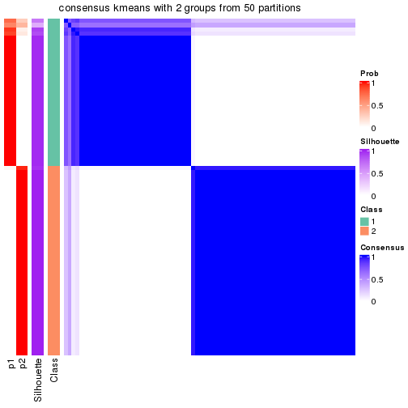</p>

</div>
<div id='tab-node-021-consensus-heatmap-2'>
<pre><code class="r">consensus_heatmap(res, k = 3)
</code></pre>

<p>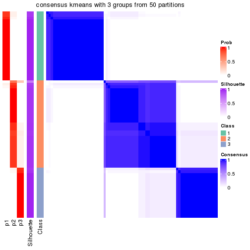</p>

</div>
<div id='tab-node-021-consensus-heatmap-3'>
<pre><code class="r">consensus_heatmap(res, k = 4)
</code></pre>

<p>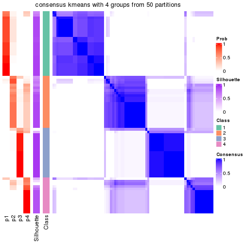</p>

</div>
<div id='tab-node-021-consensus-heatmap-4'>
<pre><code class="r">consensus_heatmap(res, k = 5)
</code></pre>

<p>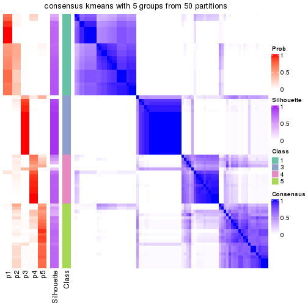</p>

</div>
<div id='tab-node-021-consensus-heatmap-5'>
<pre><code class="r">consensus_heatmap(res, k = 6)
</code></pre>

<p>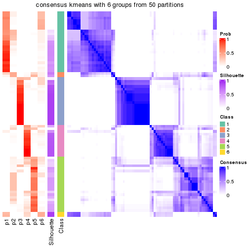</p>

</div>
<div id='tab-node-021-consensus-heatmap-6'>
<pre><code class="r">consensus_heatmap(res, k = 7)
</code></pre>

<p>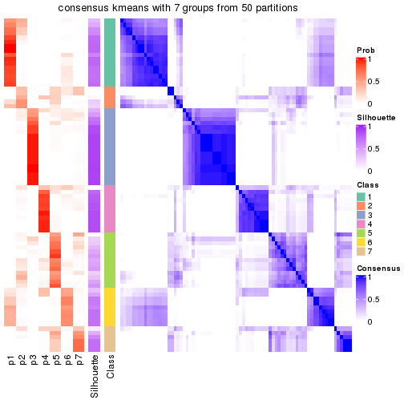</p>

</div>
<div id='tab-node-021-consensus-heatmap-7'>
<pre><code class="r">consensus_heatmap(res, k = 8)
</code></pre>

<p>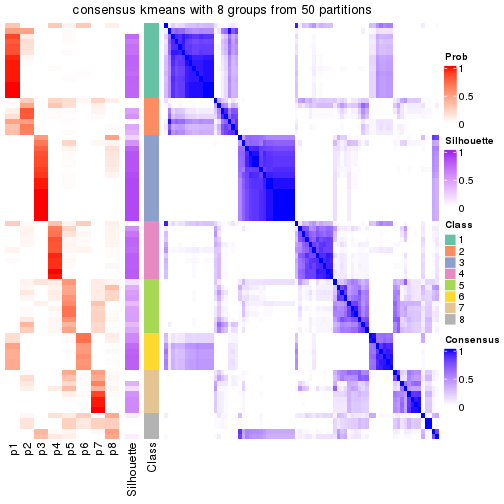</p>

</div>
</div>

Heatmaps for the membership of samples in all partitions to see how consistent they are:


<script>
$( function() {
	$( '#tabs-node-021-membership-heatmap' ).tabs();
} );
</script>
<div id='tabs-node-021-membership-heatmap'>
<ul>
<li><a href='#tab-node-021-membership-heatmap-1'>k = 2</a></li>
<li><a href='#tab-node-021-membership-heatmap-2'>k = 3</a></li>
<li><a href='#tab-node-021-membership-heatmap-3'>k = 4</a></li>
<li><a href='#tab-node-021-membership-heatmap-4'>k = 5</a></li>
<li><a href='#tab-node-021-membership-heatmap-5'>k = 6</a></li>
<li><a href='#tab-node-021-membership-heatmap-6'>k = 7</a></li>
<li><a href='#tab-node-021-membership-heatmap-7'>k = 8</a></li>
</ul>
<div id='tab-node-021-membership-heatmap-1'>
<pre><code class="r">membership_heatmap(res, k = 2)
</code></pre>

<p>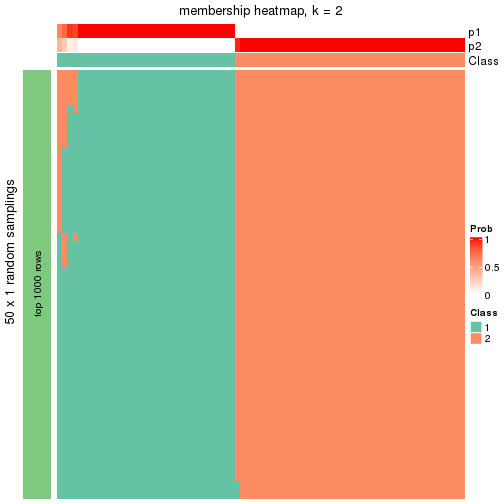</p>

</div>
<div id='tab-node-021-membership-heatmap-2'>
<pre><code class="r">membership_heatmap(res, k = 3)
</code></pre>

<p>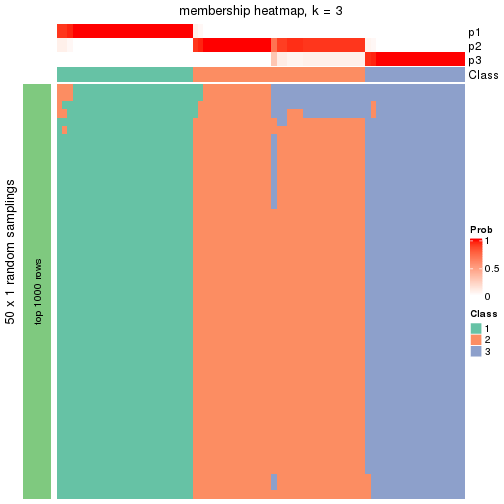</p>

</div>
<div id='tab-node-021-membership-heatmap-3'>
<pre><code class="r">membership_heatmap(res, k = 4)
</code></pre>

<p>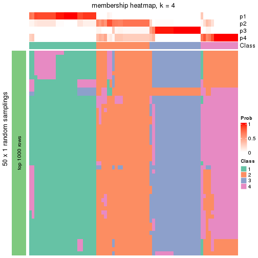</p>

</div>
<div id='tab-node-021-membership-heatmap-4'>
<pre><code class="r">membership_heatmap(res, k = 5)
</code></pre>

<p>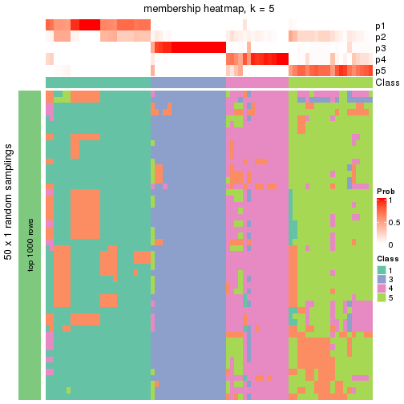</p>

</div>
<div id='tab-node-021-membership-heatmap-5'>
<pre><code class="r">membership_heatmap(res, k = 6)
</code></pre>

<p>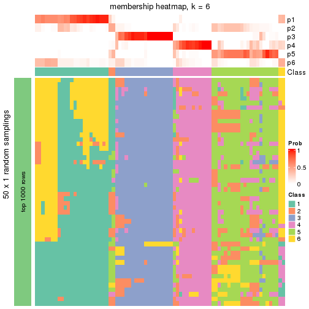</p>

</div>
<div id='tab-node-021-membership-heatmap-6'>
<pre><code class="r">membership_heatmap(res, k = 7)
</code></pre>

<p>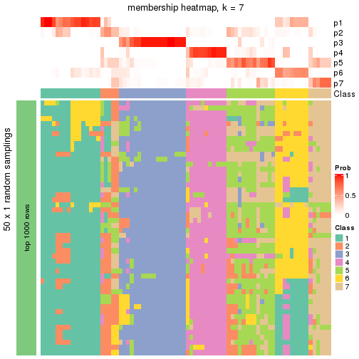</p>

</div>
<div id='tab-node-021-membership-heatmap-7'>
<pre><code class="r">membership_heatmap(res, k = 8)
</code></pre>

<p>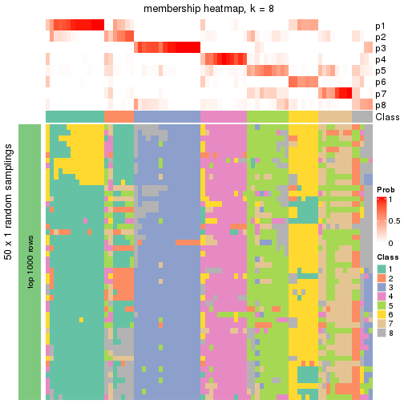</p>

</div>
</div>

As soon as the classes for columns are determined, the signatures
that are significantly different between subgroups can be looked for. 
Following are the heatmaps for signatures.


<script>
$( function() {
	$( '#tabs-node-021-get-signatures' ).tabs();
} );
</script>
<div id='tabs-node-021-get-signatures'>
<ul>
<li><a href='#tab-node-021-get-signatures-1'>k = 2</a></li>
<li><a href='#tab-node-021-get-signatures-2'>k = 3</a></li>
<li><a href='#tab-node-021-get-signatures-3'>k = 4</a></li>
<li><a href='#tab-node-021-get-signatures-4'>k = 5</a></li>
<li><a href='#tab-node-021-get-signatures-5'>k = 6</a></li>
<li><a href='#tab-node-021-get-signatures-6'>k = 7</a></li>
<li><a href='#tab-node-021-get-signatures-7'>k = 8</a></li>
</ul>
<div id='tab-node-021-get-signatures-1'>
<pre><code class="r">get_signatures(res, k = 2)
</code></pre>

<p>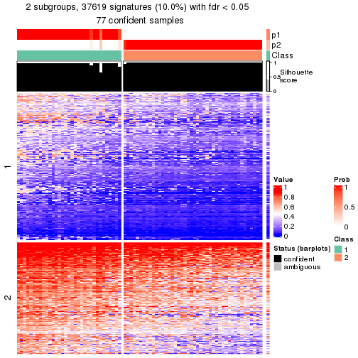</p>

</div>
<div id='tab-node-021-get-signatures-2'>
<pre><code class="r">get_signatures(res, k = 3)
</code></pre>

<p>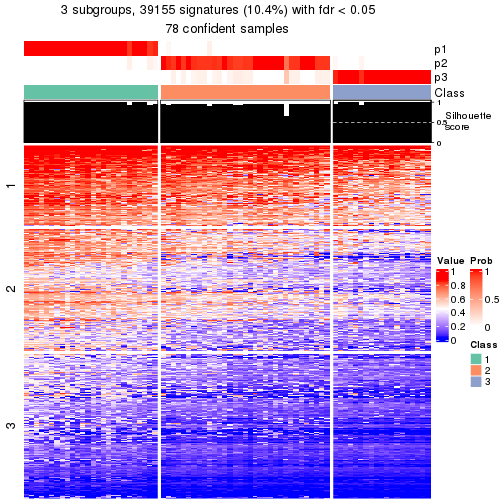</p>

</div>
<div id='tab-node-021-get-signatures-3'>
<pre><code class="r">get_signatures(res, k = 4)
</code></pre>

<p>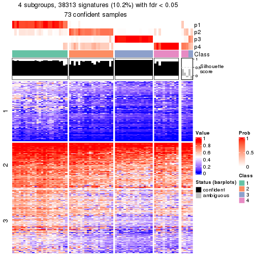</p>

</div>
<div id='tab-node-021-get-signatures-4'>
<pre><code class="r">get_signatures(res, k = 5)
</code></pre>

<p>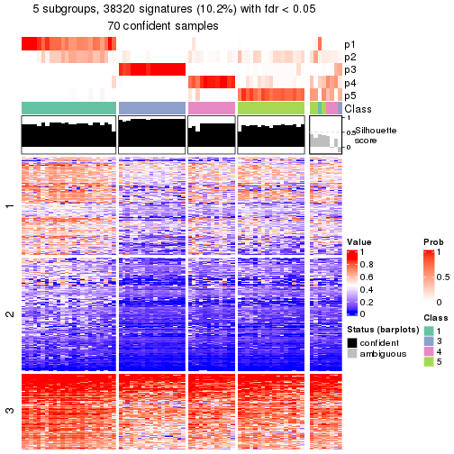</p>

</div>
<div id='tab-node-021-get-signatures-5'>
<pre><code class="r">get_signatures(res, k = 6)
</code></pre>

<p>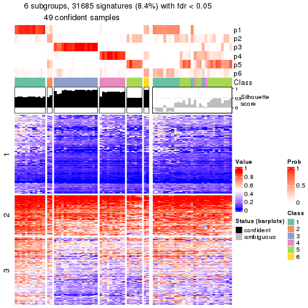</p>

</div>
<div id='tab-node-021-get-signatures-6'>
<pre><code class="r">get_signatures(res, k = 7)
</code></pre>

<p>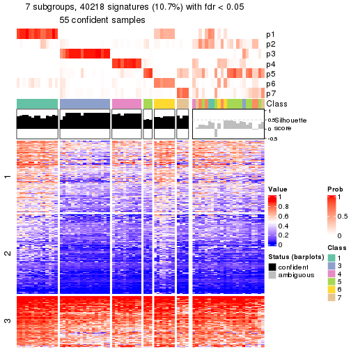</p>

</div>
<div id='tab-node-021-get-signatures-7'>
<pre><code class="r">get_signatures(res, k = 8)
</code></pre>

<p>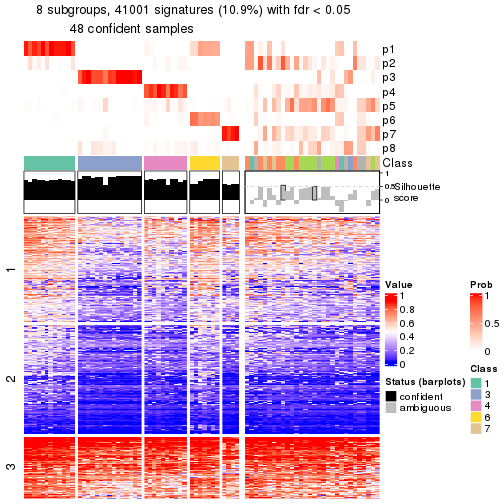</p>

</div>
</div>


Compare the overlap of signatures from different k:

```r
compare_signatures(res)
```

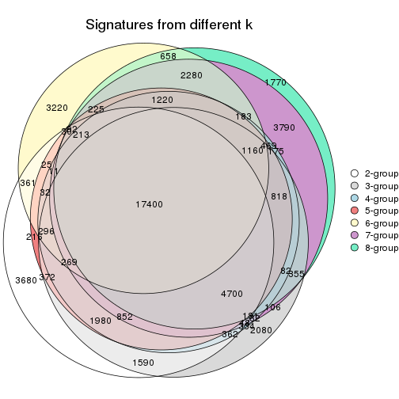

`get_signature()` returns a data frame invisibly. To get the list of signatures, the function
call should be assigned to a variable explicitly. In following code, if `plot` argument is set
to `FALSE`, no heatmap is plotted while only the differential analysis is performed.

```r
# code only for demonstration
tb = get_signature(res, k = ..., plot = FALSE)
```

An example of the output of `tb` is:

```
#>   which_row         fdr    mean_1    mean_2 scaled_mean_1 scaled_mean_2 km
#> 1        38 0.042760348  8.373488  9.131774    -0.5533452     0.5164555  1
#> 2        40 0.018707592  7.106213  8.469186    -0.6173731     0.5762149  1
#> 3        55 0.019134737 10.221463 11.207825    -0.6159697     0.5749050  1
#> 4        59 0.006059896  5.921854  7.869574    -0.6899429     0.6439467  1
#> 5        60 0.018055526  8.928898 10.211722    -0.6204761     0.5791110  1
#> 6        98 0.009384629 15.714769 14.887706     0.6635654    -0.6193277  2
...
```

The columns in `tb` are:

1. `which_row`: row indices corresponding to the input matrix.
2. `fdr`: FDR for the differential test. 
3. `mean_x`: The mean value in group x.
4. `scaled_mean_x`: The mean value in group x after rows are scaled.
5. `km`: Row groups if k-means clustering is applied to rows (which is done by automatically selecting number of clusters).

If there are too many signatures, `top_signatures = ...` can be set to only show the 
signatures with the highest FDRs:

```r
# code only for demonstration
# e.g. to show the top 500 most significant rows
tb = get_signature(res, k = ..., top_signatures = 500)
```

If the signatures are defined as these which are uniquely high in current group, `diff_method` argument
can be set to `"uniquely_high_in_one_group"`:

```r
# code only for demonstration
tb = get_signature(res, k = ..., diff_method = "uniquely_high_in_one_group")
```


UMAP plot which shows how samples are separated.


<script>
$( function() {
	$( '#tabs-node-021-dimension-reduction' ).tabs();
} );
</script>
<div id='tabs-node-021-dimension-reduction'>
<ul>
<li><a href='#tab-node-021-dimension-reduction-1'>k = 2</a></li>
<li><a href='#tab-node-021-dimension-reduction-2'>k = 3</a></li>
<li><a href='#tab-node-021-dimension-reduction-3'>k = 4</a></li>
<li><a href='#tab-node-021-dimension-reduction-4'>k = 5</a></li>
<li><a href='#tab-node-021-dimension-reduction-5'>k = 6</a></li>
<li><a href='#tab-node-021-dimension-reduction-6'>k = 7</a></li>
<li><a href='#tab-node-021-dimension-reduction-7'>k = 8</a></li>
</ul>
<div id='tab-node-021-dimension-reduction-1'>
<pre><code class="r">dimension_reduction(res, k = 2, method = &quot;UMAP&quot;)
</code></pre>

<p>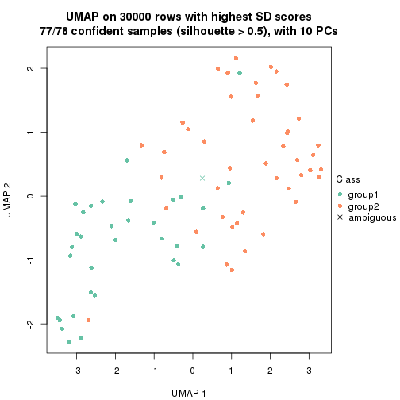</p>

</div>
<div id='tab-node-021-dimension-reduction-2'>
<pre><code class="r">dimension_reduction(res, k = 3, method = &quot;UMAP&quot;)
</code></pre>

<p>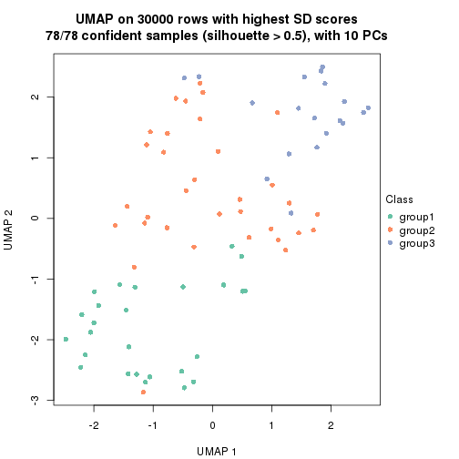</p>

</div>
<div id='tab-node-021-dimension-reduction-3'>
<pre><code class="r">dimension_reduction(res, k = 4, method = &quot;UMAP&quot;)
</code></pre>

<p>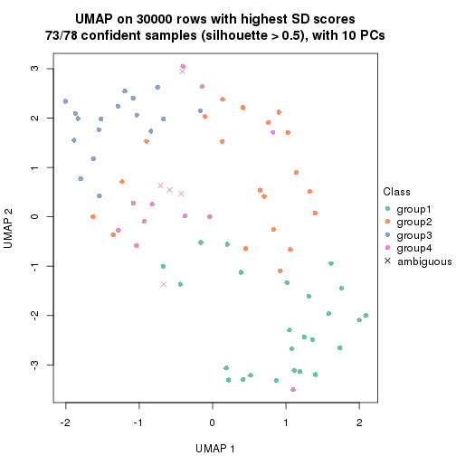</p>

</div>
<div id='tab-node-021-dimension-reduction-4'>
<pre><code class="r">dimension_reduction(res, k = 5, method = &quot;UMAP&quot;)
</code></pre>

<p>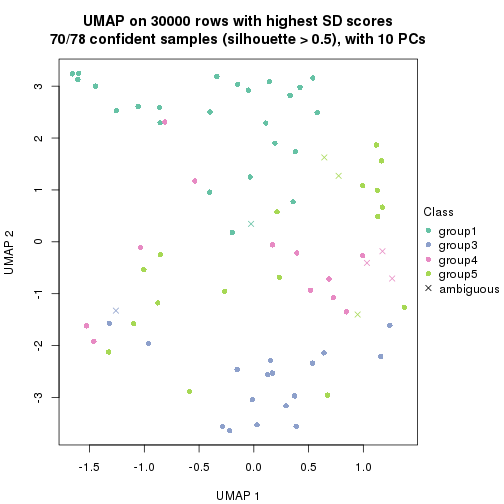</p>

</div>
<div id='tab-node-021-dimension-reduction-5'>
<pre><code class="r">dimension_reduction(res, k = 6, method = &quot;UMAP&quot;)
</code></pre>

<p>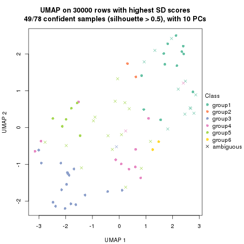</p>

</div>
<div id='tab-node-021-dimension-reduction-6'>
<pre><code class="r">dimension_reduction(res, k = 7, method = &quot;UMAP&quot;)
</code></pre>

<p>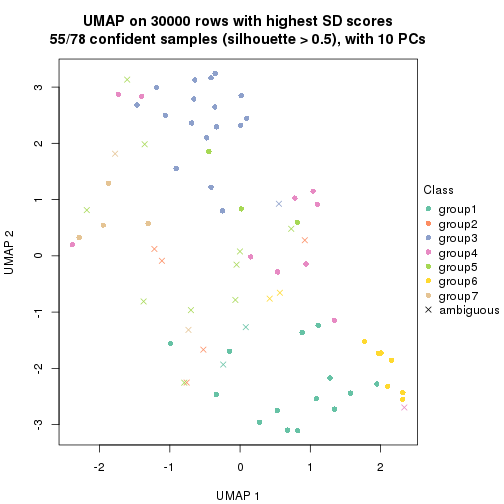</p>

</div>
<div id='tab-node-021-dimension-reduction-7'>
<pre><code class="r">dimension_reduction(res, k = 8, method = &quot;UMAP&quot;)
</code></pre>

<p>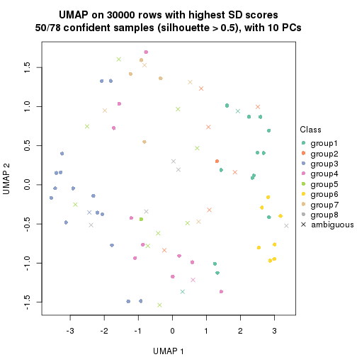</p>

</div>
</div>


Following heatmap shows how subgroups are split when increasing `k`:

```r
collect_classes(res)
```

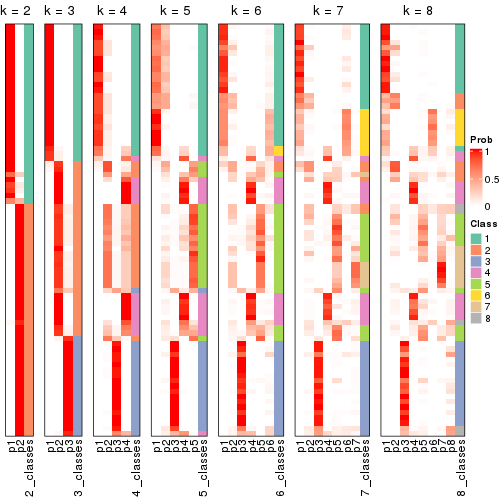


If matrix rows can be associated to genes, consider to use `functional_enrichment(res,
...)` to perform function enrichment for the signature genes. See [this vignette](https://jokergoo.github.io/cola_vignettes/functional_enrichment.html) for more detailed explanations.


 

---------------------------------------------------


### Node0212


Parent node: [Node021](#Node021).
Child nodes: 
                Node02121-leaf
        ,
                Node02122-leaf
        ,
                Node02123-leaf
        ,
                Node02211-leaf
        ,
                Node02212-leaf
        ,
                Node02213-leaf
        ,
                Node02214-leaf
        ,
                Node02311-leaf
        ,
                Node02312-leaf
        ,
                Node02313-leaf
        ,
                Node05121-leaf
        ,
                Node05122-leaf
        ,
                Node05123-leaf
        .


The object with results only for a single top-value method and a single partitioning method 
can be extracted as:

```r
res = res_rh["0212"]
```

A summary of `res` and all the functions that can be applied to it:

```r
res
```

```
#> A 'ConsensusPartition' object with k = 2, 3, 4, 5, 6, 7, 8.
#>   On a matrix with 30000 rows and 33 columns.
#>   Top rows (1000) are extracted by 'ATC' method.
#>   Subgroups are detected by 'kmeans' method.
#>   Performed in total 350 partitions by row resampling.
#>   Best k for subgroups seems to be 3.
#> 
#> Following methods can be applied to this 'ConsensusPartition' object:
#>  [1] "cola_report"             "collect_classes"         "collect_plots"          
#>  [4] "collect_stats"           "colnames"                "compare_partitions"     
#>  [7] "compare_signatures"      "consensus_heatmap"       "dimension_reduction"    
#> [10] "functional_enrichment"   "get_anno_col"            "get_anno"               
#> [13] "get_classes"             "get_consensus"           "get_matrix"             
#> [16] "get_membership"          "get_param"               "get_signatures"         
#> [19] "get_stats"               "is_best_k"               "is_stable_k"            
#> [22] "membership_heatmap"      "ncol"                    "nrow"                   
#> [25] "plot_ecdf"               "predict_classes"         "rownames"               
#> [28] "select_partition_number" "show"                    "suggest_best_k"         
#> [31] "test_to_known_factors"   "top_rows_heatmap"
```

`collect_plots()` function collects all the plots made from `res` for all `k` (number of subgroups)
into one single page to provide an easy and fast comparison between different `k`.

```r
collect_plots(res)
```

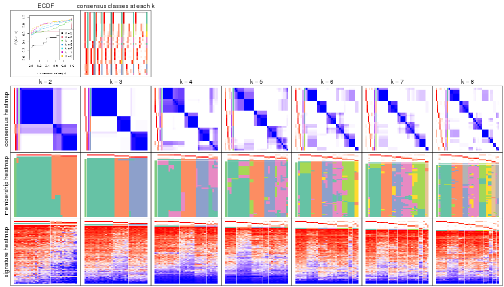

The plots are:

- The first row: a plot of the eCDF (empirical cumulative distribution
  function) curves of the consensus matrix for each `k` and the heatmap of
  predicted classes for each `k`.
- The second row: heatmaps of the consensus matrix for each `k`.
- The third row: heatmaps of the membership matrix for each `k`.
- The fouth row: heatmaps of the signatures for each `k`.

All the plots in panels can be made by individual functions and they are
plotted later in this section.

`select_partition_number()` produces several plots showing different
statistics for choosing "optimized" `k`. There are following statistics:

- eCDF curves of the consensus matrix for each `k`;
- 1-PAC. [The PAC score](https://en.wikipedia.org/wiki/Consensus_clustering#Over-interpretation_potential_of_consensus_clustering)
  measures the proportion of the ambiguous subgrouping.
- Mean silhouette score.
- Concordance. The mean probability of fiting the consensus subgroup labels in all
  partitions.
- Area increased. Denote $A_k$ as the area under the eCDF curve for current
  `k`, the area increased is defined as $A_k - A_{k-1}$.
- Rand index. The percent of pairs of samples that are both in a same cluster
  or both are not in a same cluster in the partition of k and k-1.
- Jaccard index. The ratio of pairs of samples are both in a same cluster in
  the partition of k and k-1 and the pairs of samples are both in a same
  cluster in the partition k or k-1.

The detailed explanations of these statistics can be found in [the _cola_
vignette](https://jokergoo.github.io/cola_vignettes/cola.html#toc_13).

Generally speaking, higher 1-PAC score, higher mean silhouette score or higher
concordance corresponds to better partition. Rand index and Jaccard index
measure how similar the current partition is compared to partition with `k-1`.
If they are too similar, we won't accept `k` is better than `k-1`.

```r
select_partition_number(res)
```

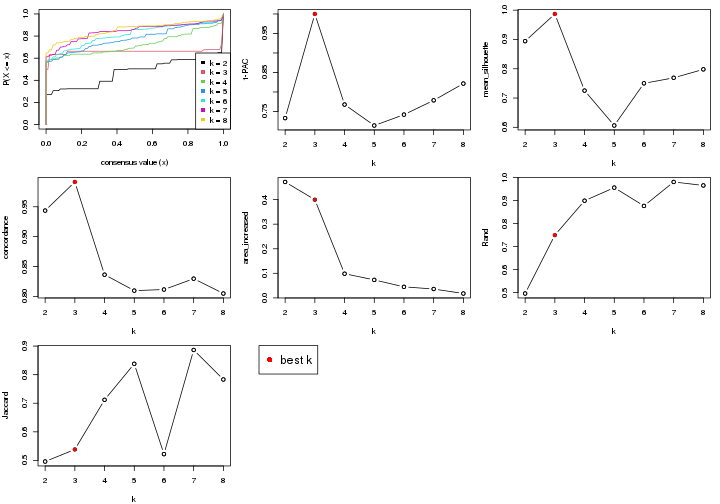

The numeric values for all these statistics can be obtained by `get_stats()`.

```r
get_stats(res)
```

```
#>   k 1-PAC mean_silhouette concordance area_increased  Rand Jaccard
#> 2 2 0.733           0.894       0.944         0.4717 0.496   0.496
#> 3 3 1.000           0.987       0.992         0.3995 0.750   0.538
#> 4 4 0.768           0.725       0.836         0.0984 0.900   0.712
#> 5 5 0.714           0.606       0.810         0.0732 0.956   0.838
#> 6 6 0.742           0.750       0.812         0.0450 0.877   0.522
#> 7 7 0.778           0.769       0.830         0.0362 0.981   0.886
#> 8 8 0.822           0.798       0.805         0.0178 0.966   0.783
```

`suggest_best_k()` suggests the best $k$ based on these statistics. The rules are as follows:

- All $k$ with Jaccard index larger than 0.95 are removed because increasing
  $k$ does not provide enough extra information. If all $k$ are removed, it is
  marked as no subgroup is detected.
- For all $k$ with 1-PAC score larger than 0.9, the maximal $k$ is taken as
  the best $k$, and other $k$ are marked as optional $k$.
- If it does not fit the second rule. The $k$ with the maximal vote of the
  highest 1-PAC score, highest mean silhouette, and highest concordance is
  taken as the best $k$.

```r
suggest_best_k(res)
```

```
#> [1] 3
```


Following is the table of the partitions (You need to click the **show/hide
code output** link to see it). The membership matrix (columns with name `p*`)
is inferred by
[`clue::cl_consensus()`](https://www.rdocumentation.org/link/cl_consensus?package=clue)
function with the `SE` method. Basically the value in the membership matrix
represents the probability to belong to a certain group. The finall subgroup
label for an item is determined with the group with highest probability it
belongs to.

In `get_classes()` function, the entropy is calculated from the membership
matrix and the silhouette score is calculated from the consensus matrix.


<script>
$( function() {
	$( '#tabs-node-0212-get-classes' ).tabs();
} );
</script>
<div id='tabs-node-0212-get-classes'>
<ul>
<li><a href='#tab-node-0212-get-classes-1'>k = 2</a></li>
<li><a href='#tab-node-0212-get-classes-2'>k = 3</a></li>
<li><a href='#tab-node-0212-get-classes-3'>k = 4</a></li>
<li><a href='#tab-node-0212-get-classes-4'>k = 5</a></li>
<li><a href='#tab-node-0212-get-classes-5'>k = 6</a></li>
<li><a href='#tab-node-0212-get-classes-6'>k = 7</a></li>
<li><a href='#tab-node-0212-get-classes-7'>k = 8</a></li>
</ul>

<div id='tab-node-0212-get-classes-1'>
<p><a id='tab-node-0212-get-classes-1-a' style='color:#0366d6' href='#'>show/hide code output</a></p>
<pre><code class="r">cbind(get_classes(res, k = 2), get_membership(res, k = 2))
</code></pre>

<pre><code>#&gt;                 class entropy silhouette   p1   p2
#&gt; TCGA.H9.7775.01     1   0.000      0.995 1.00 0.00
#&gt; TCGA.QU.A6IN.01     1   0.000      0.995 1.00 0.00
#&gt; TCGA.EJ.A7NF.01     1   0.000      0.995 1.00 0.00
#&gt; TCGA.V1.A8WS.01     2   0.958      0.566 0.38 0.62
#&gt; TCGA.ZG.A9LZ.01     2   0.000      0.854 0.00 1.00
#&gt; TCGA.V1.A8WW.01     1   0.000      0.995 1.00 0.00
#&gt; TCGA.MG.AAMC.01     1   0.000      0.995 1.00 0.00
#&gt; TCGA.H9.A6BY.01     1   0.000      0.995 1.00 0.00
#&gt; TCGA.YL.A8SP.01     2   0.000      0.854 0.00 1.00
#&gt; TCGA.CH.5791.01     1   0.000      0.995 1.00 0.00
#&gt; TCGA.HC.A76X.01     1   0.000      0.995 1.00 0.00
#&gt; TCGA.EJ.A65D.01     2   0.000      0.854 0.00 1.00
#&gt; TCGA.KK.A8II.01     1   0.000      0.995 1.00 0.00
#&gt; TCGA.J9.A52B.01     2   0.000      0.854 0.00 1.00
#&gt; TCGA.G9.6362.11     2   0.881      0.673 0.30 0.70
#&gt; TCGA.YL.A8SA.01     2   0.000      0.854 0.00 1.00
#&gt; TCGA.ZG.A9L9.01     1   0.000      0.995 1.00 0.00
#&gt; TCGA.HC.7231.01     1   0.000      0.995 1.00 0.00
#&gt; TCGA.HC.7230.01     1   0.000      0.995 1.00 0.00
#&gt; TCGA.HI.7171.01     2   0.000      0.854 0.00 1.00
#&gt; TCGA.G9.A9S4.01     2   0.958      0.566 0.38 0.62
#&gt; TCGA.G9.7525.01     1   0.000      0.995 1.00 0.00
#&gt; TCGA.KK.A7AU.01     2   0.881      0.673 0.30 0.70
#&gt; TCGA.EJ.7325.01     1   0.000      0.995 1.00 0.00
#&gt; TCGA.YL.A9WL.01     2   0.000      0.854 0.00 1.00
#&gt; TCGA.G9.6362.01     2   0.958      0.566 0.38 0.62
#&gt; TCGA.J4.A83N.01     1   0.000      0.995 1.00 0.00
#&gt; TCGA.CH.5739.01     1   0.000      0.995 1.00 0.00
#&gt; TCGA.KK.A8IH.01     1   0.000      0.995 1.00 0.00
#&gt; TCGA.VP.A87K.01     1   0.402      0.893 0.92 0.08
#&gt; TCGA.EJ.5525.01     2   0.000      0.854 0.00 1.00
#&gt; TCGA.G9.6332.01     2   0.242      0.841 0.04 0.96
#&gt; TCGA.EJ.A46G.01     1   0.000      0.995 1.00 0.00
</code></pre>

<script>
$('#tab-node-0212-get-classes-1-a').parent().next().next().hide();
$('#tab-node-0212-get-classes-1-a').click(function(){
  $('#tab-node-0212-get-classes-1-a').parent().next().next().toggle();
  return(false);
});
</script>
</div>

<div id='tab-node-0212-get-classes-2'>
<p><a id='tab-node-0212-get-classes-2-a' style='color:#0366d6' href='#'>show/hide code output</a></p>
<pre><code class="r">cbind(get_classes(res, k = 3), get_membership(res, k = 3))
</code></pre>

<pre><code>#&gt;                 class entropy silhouette   p1   p2   p3
#&gt; TCGA.H9.7775.01     1  0.0000      1.000 1.00 0.00 0.00
#&gt; TCGA.QU.A6IN.01     1  0.0000      1.000 1.00 0.00 0.00
#&gt; TCGA.EJ.A7NF.01     1  0.0000      1.000 1.00 0.00 0.00
#&gt; TCGA.V1.A8WS.01     3  0.0000      0.978 0.00 0.00 1.00
#&gt; TCGA.ZG.A9LZ.01     2  0.0892      0.995 0.00 0.98 0.02
#&gt; TCGA.V1.A8WW.01     1  0.0000      1.000 1.00 0.00 0.00
#&gt; TCGA.MG.AAMC.01     1  0.0000      1.000 1.00 0.00 0.00
#&gt; TCGA.H9.A6BY.01     3  0.0892      0.966 0.02 0.00 0.98
#&gt; TCGA.YL.A8SP.01     2  0.0000      0.984 0.00 1.00 0.00
#&gt; TCGA.CH.5791.01     1  0.0000      1.000 1.00 0.00 0.00
#&gt; TCGA.HC.A76X.01     1  0.0000      1.000 1.00 0.00 0.00
#&gt; TCGA.EJ.A65D.01     2  0.0000      0.984 0.00 1.00 0.00
#&gt; TCGA.KK.A8II.01     3  0.0892      0.966 0.02 0.00 0.98
#&gt; TCGA.J9.A52B.01     2  0.0892      0.995 0.00 0.98 0.02
#&gt; TCGA.G9.6362.11     3  0.0000      0.978 0.00 0.00 1.00
#&gt; TCGA.YL.A8SA.01     2  0.0892      0.995 0.00 0.98 0.02
#&gt; TCGA.ZG.A9L9.01     1  0.0000      1.000 1.00 0.00 0.00
#&gt; TCGA.HC.7231.01     1  0.0000      1.000 1.00 0.00 0.00
#&gt; TCGA.HC.7230.01     1  0.0000      1.000 1.00 0.00 0.00
#&gt; TCGA.HI.7171.01     2  0.0892      0.995 0.00 0.98 0.02
#&gt; TCGA.G9.A9S4.01     3  0.0000      0.978 0.00 0.00 1.00
#&gt; TCGA.G9.7525.01     1  0.0000      1.000 1.00 0.00 0.00
#&gt; TCGA.KK.A7AU.01     3  0.0000      0.978 0.00 0.00 1.00
#&gt; TCGA.EJ.7325.01     1  0.0000      1.000 1.00 0.00 0.00
#&gt; TCGA.YL.A9WL.01     2  0.0892      0.995 0.00 0.98 0.02
#&gt; TCGA.G9.6362.01     3  0.0000      0.978 0.00 0.00 1.00
#&gt; TCGA.J4.A83N.01     1  0.0000      1.000 1.00 0.00 0.00
#&gt; TCGA.CH.5739.01     1  0.0000      1.000 1.00 0.00 0.00
#&gt; TCGA.KK.A8IH.01     1  0.0000      1.000 1.00 0.00 0.00
#&gt; TCGA.VP.A87K.01     3  0.0000      0.978 0.00 0.00 1.00
#&gt; TCGA.EJ.5525.01     2  0.0892      0.995 0.00 0.98 0.02
#&gt; TCGA.G9.6332.01     3  0.0000      0.978 0.00 0.00 1.00
#&gt; TCGA.EJ.A46G.01     3  0.3340      0.858 0.12 0.00 0.88
</code></pre>

<script>
$('#tab-node-0212-get-classes-2-a').parent().next().next().hide();
$('#tab-node-0212-get-classes-2-a').click(function(){
  $('#tab-node-0212-get-classes-2-a').parent().next().next().toggle();
  return(false);
});
</script>
</div>

<div id='tab-node-0212-get-classes-3'>
<p><a id='tab-node-0212-get-classes-3-a' style='color:#0366d6' href='#'>show/hide code output</a></p>
<pre><code class="r">cbind(get_classes(res, k = 4), get_membership(res, k = 4))
</code></pre>

<pre><code>#&gt;                 class entropy silhouette   p1   p2   p3   p4
#&gt; TCGA.H9.7775.01     4   0.485     0.1050 0.40 0.00 0.00 0.60
#&gt; TCGA.QU.A6IN.01     1   0.000     0.8413 1.00 0.00 0.00 0.00
#&gt; TCGA.EJ.A7NF.01     1   0.340     0.8273 0.82 0.00 0.00 0.18
#&gt; TCGA.V1.A8WS.01     3   0.121     0.8849 0.00 0.00 0.96 0.04
#&gt; TCGA.ZG.A9LZ.01     2   0.000     0.9221 0.00 1.00 0.00 0.00
#&gt; TCGA.V1.A8WW.01     1   0.000     0.8413 1.00 0.00 0.00 0.00
#&gt; TCGA.MG.AAMC.01     1   0.000     0.8413 1.00 0.00 0.00 0.00
#&gt; TCGA.H9.A6BY.01     4   0.498     0.1661 0.00 0.00 0.46 0.54
#&gt; TCGA.YL.A8SP.01     2   0.462     0.7419 0.00 0.66 0.00 0.34
#&gt; TCGA.CH.5791.01     1   0.340     0.8273 0.82 0.00 0.00 0.18
#&gt; TCGA.HC.A76X.01     4   0.495    -0.0384 0.44 0.00 0.00 0.56
#&gt; TCGA.EJ.A65D.01     2   0.462     0.7419 0.00 0.66 0.00 0.34
#&gt; TCGA.KK.A8II.01     4   0.500     0.0288 0.00 0.00 0.50 0.50
#&gt; TCGA.J9.A52B.01     2   0.000     0.9221 0.00 1.00 0.00 0.00
#&gt; TCGA.G9.6362.11     3   0.000     0.9000 0.00 0.00 1.00 0.00
#&gt; TCGA.YL.A8SA.01     2   0.000     0.9221 0.00 1.00 0.00 0.00
#&gt; TCGA.ZG.A9L9.01     1   0.334     0.7374 0.86 0.02 0.00 0.12
#&gt; TCGA.HC.7231.01     1   0.340     0.8273 0.82 0.00 0.00 0.18
#&gt; TCGA.HC.7230.01     1   0.340     0.8273 0.82 0.00 0.00 0.18
#&gt; TCGA.HI.7171.01     2   0.000     0.9221 0.00 1.00 0.00 0.00
#&gt; TCGA.G9.A9S4.01     3   0.000     0.9000 0.00 0.00 1.00 0.00
#&gt; TCGA.G9.7525.01     1   0.340     0.8273 0.82 0.00 0.00 0.18
#&gt; TCGA.KK.A7AU.01     3   0.000     0.9000 0.00 0.00 1.00 0.00
#&gt; TCGA.EJ.7325.01     1   0.164     0.8120 0.94 0.00 0.00 0.06
#&gt; TCGA.YL.A9WL.01     2   0.000     0.9221 0.00 1.00 0.00 0.00
#&gt; TCGA.G9.6362.01     3   0.000     0.9000 0.00 0.00 1.00 0.00
#&gt; TCGA.J4.A83N.01     1   0.340     0.8273 0.82 0.00 0.00 0.18
#&gt; TCGA.CH.5739.01     1   0.201     0.7985 0.92 0.00 0.00 0.08
#&gt; TCGA.KK.A8IH.01     1   0.000     0.8413 1.00 0.00 0.00 0.00
#&gt; TCGA.VP.A87K.01     3   0.471     0.2601 0.00 0.00 0.64 0.36
#&gt; TCGA.EJ.5525.01     2   0.000     0.9221 0.00 1.00 0.00 0.00
#&gt; TCGA.G9.6332.01     3   0.121     0.8849 0.00 0.00 0.96 0.04
#&gt; TCGA.EJ.A46G.01     4   0.630     0.3522 0.08 0.00 0.32 0.60
</code></pre>

<script>
$('#tab-node-0212-get-classes-3-a').parent().next().next().hide();
$('#tab-node-0212-get-classes-3-a').click(function(){
  $('#tab-node-0212-get-classes-3-a').parent().next().next().toggle();
  return(false);
});
</script>
</div>

<div id='tab-node-0212-get-classes-4'>
<p><a id='tab-node-0212-get-classes-4-a' style='color:#0366d6' href='#'>show/hide code output</a></p>
<pre><code class="r">cbind(get_classes(res, k = 5), get_membership(res, k = 5))
</code></pre>

<pre><code>#&gt;                 class entropy silhouette   p1   p2   p3   p4   p5
#&gt; TCGA.H9.7775.01     4   0.342      0.547 0.24 0.00 0.00 0.76 0.00
#&gt; TCGA.QU.A6IN.01     1   0.389      0.500 0.68 0.00 0.00 0.00 0.32
#&gt; TCGA.EJ.A7NF.01     1   0.000      0.662 1.00 0.00 0.00 0.00 0.00
#&gt; TCGA.V1.A8WS.01     3   0.342      0.608 0.00 0.00 0.76 0.24 0.00
#&gt; TCGA.ZG.A9LZ.01     2   0.000      0.877 0.00 1.00 0.00 0.00 0.00
#&gt; TCGA.V1.A8WW.01     1   0.389      0.500 0.68 0.00 0.00 0.00 0.32
#&gt; TCGA.MG.AAMC.01     1   0.389      0.500 0.68 0.00 0.00 0.00 0.32
#&gt; TCGA.H9.A6BY.01     4   0.513      0.666 0.10 0.00 0.22 0.68 0.00
#&gt; TCGA.YL.A8SP.01     2   0.556      0.618 0.00 0.56 0.00 0.08 0.36
#&gt; TCGA.CH.5791.01     1   0.000      0.662 1.00 0.00 0.00 0.00 0.00
#&gt; TCGA.HC.A76X.01     4   0.453      0.473 0.26 0.00 0.00 0.70 0.04
#&gt; TCGA.EJ.A65D.01     2   0.556      0.618 0.00 0.56 0.00 0.08 0.36
#&gt; TCGA.KK.A8II.01     4   0.473      0.669 0.08 0.00 0.20 0.72 0.00
#&gt; TCGA.J9.A52B.01     2   0.104      0.869 0.00 0.96 0.00 0.04 0.00
#&gt; TCGA.G9.6362.11     3   0.000      0.896 0.00 0.00 1.00 0.00 0.00
#&gt; TCGA.YL.A8SA.01     2   0.000      0.877 0.00 1.00 0.00 0.00 0.00
#&gt; TCGA.ZG.A9L9.01     5   0.788      0.000 0.22 0.08 0.00 0.32 0.38
#&gt; TCGA.HC.7231.01     1   0.000      0.662 1.00 0.00 0.00 0.00 0.00
#&gt; TCGA.HC.7230.01     1   0.000      0.662 1.00 0.00 0.00 0.00 0.00
#&gt; TCGA.HI.7171.01     2   0.000      0.877 0.00 1.00 0.00 0.00 0.00
#&gt; TCGA.G9.A9S4.01     3   0.000      0.896 0.00 0.00 1.00 0.00 0.00
#&gt; TCGA.G9.7525.01     1   0.000      0.662 1.00 0.00 0.00 0.00 0.00
#&gt; TCGA.KK.A7AU.01     3   0.244      0.866 0.00 0.00 0.90 0.04 0.06
#&gt; TCGA.EJ.7325.01     1   0.618     -0.191 0.48 0.00 0.00 0.14 0.38
#&gt; TCGA.YL.A9WL.01     2   0.104      0.869 0.00 0.96 0.00 0.04 0.00
#&gt; TCGA.G9.6362.01     3   0.000      0.896 0.00 0.00 1.00 0.00 0.00
#&gt; TCGA.J4.A83N.01     1   0.000      0.662 1.00 0.00 0.00 0.00 0.00
#&gt; TCGA.CH.5739.01     1   0.655     -0.439 0.42 0.00 0.00 0.20 0.38
#&gt; TCGA.KK.A8IH.01     1   0.389      0.500 0.68 0.00 0.00 0.00 0.32
#&gt; TCGA.VP.A87K.01     4   0.413      0.403 0.00 0.00 0.38 0.62 0.00
#&gt; TCGA.EJ.5525.01     2   0.000      0.877 0.00 1.00 0.00 0.00 0.00
#&gt; TCGA.G9.6332.01     3   0.311      0.857 0.00 0.00 0.86 0.08 0.06
#&gt; TCGA.EJ.A46G.01     4   0.805      0.403 0.32 0.00 0.12 0.38 0.18
</code></pre>

<script>
$('#tab-node-0212-get-classes-4-a').parent().next().next().hide();
$('#tab-node-0212-get-classes-4-a').click(function(){
  $('#tab-node-0212-get-classes-4-a').parent().next().next().toggle();
  return(false);
});
</script>
</div>

<div id='tab-node-0212-get-classes-5'>
<p><a id='tab-node-0212-get-classes-5-a' style='color:#0366d6' href='#'>show/hide code output</a></p>
<pre><code class="r">cbind(get_classes(res, k = 6), get_membership(res, k = 6))
</code></pre>

<pre><code>#&gt;                 class entropy silhouette   p1   p2   p3   p4   p5   p6
#&gt; TCGA.H9.7775.01     4  0.3198      0.680 0.26 0.00 0.00 0.74 0.00 0.00
#&gt; TCGA.QU.A6IN.01     5  0.3864      0.644 0.48 0.00 0.00 0.00 0.52 0.00
#&gt; TCGA.EJ.A7NF.01     1  0.0000      0.845 1.00 0.00 0.00 0.00 0.00 0.00
#&gt; TCGA.V1.A8WS.01     3  0.4002      0.475 0.00 0.00 0.66 0.32 0.00 0.02
#&gt; TCGA.ZG.A9LZ.01     2  0.0000      0.973 0.00 1.00 0.00 0.00 0.00 0.00
#&gt; TCGA.V1.A8WW.01     5  0.3864      0.644 0.48 0.00 0.00 0.00 0.52 0.00
#&gt; TCGA.MG.AAMC.01     5  0.3864      0.644 0.48 0.00 0.00 0.00 0.52 0.00
#&gt; TCGA.H9.A6BY.01     4  0.3787      0.756 0.10 0.00 0.12 0.78 0.00 0.00
#&gt; TCGA.YL.A8SP.01     6  0.2793      0.987 0.00 0.20 0.00 0.00 0.00 0.80
#&gt; TCGA.CH.5791.01     1  0.0000      0.845 1.00 0.00 0.00 0.00 0.00 0.00
#&gt; TCGA.HC.A76X.01     4  0.4608      0.635 0.22 0.00 0.00 0.68 0.10 0.00
#&gt; TCGA.EJ.A65D.01     6  0.3315      0.987 0.00 0.20 0.00 0.00 0.02 0.78
#&gt; TCGA.KK.A8II.01     4  0.3475      0.744 0.06 0.00 0.14 0.80 0.00 0.00
#&gt; TCGA.J9.A52B.01     2  0.1480      0.945 0.00 0.94 0.00 0.02 0.04 0.00
#&gt; TCGA.G9.6362.11     3  0.0000      0.846 0.00 0.00 1.00 0.00 0.00 0.00
#&gt; TCGA.YL.A8SA.01     2  0.0000      0.973 0.00 1.00 0.00 0.00 0.00 0.00
#&gt; TCGA.ZG.A9L9.01     5  0.6431      0.387 0.10 0.06 0.00 0.26 0.56 0.02
#&gt; TCGA.HC.7231.01     1  0.0000      0.845 1.00 0.00 0.00 0.00 0.00 0.00
#&gt; TCGA.HC.7230.01     1  0.0000      0.845 1.00 0.00 0.00 0.00 0.00 0.00
#&gt; TCGA.HI.7171.01     2  0.0000      0.973 0.00 1.00 0.00 0.00 0.00 0.00
#&gt; TCGA.G9.A9S4.01     3  0.0547      0.845 0.00 0.00 0.98 0.00 0.02 0.00
#&gt; TCGA.G9.7525.01     1  0.0000      0.845 1.00 0.00 0.00 0.00 0.00 0.00
#&gt; TCGA.KK.A7AU.01     3  0.3045      0.801 0.00 0.00 0.84 0.00 0.06 0.10
#&gt; TCGA.EJ.7325.01     5  0.5919      0.589 0.28 0.00 0.00 0.16 0.54 0.02
#&gt; TCGA.YL.A9WL.01     2  0.1480      0.945 0.00 0.94 0.00 0.02 0.04 0.00
#&gt; TCGA.G9.6362.01     3  0.0000      0.846 0.00 0.00 1.00 0.00 0.00 0.00
#&gt; TCGA.J4.A83N.01     1  0.0000      0.845 1.00 0.00 0.00 0.00 0.00 0.00
#&gt; TCGA.CH.5739.01     5  0.6086      0.570 0.26 0.00 0.00 0.20 0.52 0.02
#&gt; TCGA.KK.A8IH.01     5  0.3864      0.644 0.48 0.00 0.00 0.00 0.52 0.00
#&gt; TCGA.VP.A87K.01     4  0.3309      0.544 0.00 0.00 0.28 0.72 0.00 0.00
#&gt; TCGA.EJ.5525.01     2  0.0000      0.973 0.00 1.00 0.00 0.00 0.00 0.00
#&gt; TCGA.G9.6332.01     3  0.4879      0.752 0.00 0.00 0.72 0.12 0.04 0.12
#&gt; TCGA.EJ.A46G.01     1  0.6564     -0.123 0.42 0.00 0.00 0.38 0.14 0.06
</code></pre>

<script>
$('#tab-node-0212-get-classes-5-a').parent().next().next().hide();
$('#tab-node-0212-get-classes-5-a').click(function(){
  $('#tab-node-0212-get-classes-5-a').parent().next().next().toggle();
  return(false);
});
</script>
</div>

<div id='tab-node-0212-get-classes-6'>
<p><a id='tab-node-0212-get-classes-6-a' style='color:#0366d6' href='#'>show/hide code output</a></p>
<pre><code class="r">cbind(get_classes(res, k = 7), get_membership(res, k = 7))
</code></pre>

<pre><code>#&gt;                 class entropy silhouette   p1   p2   p3   p4   p5   p6   p7
#&gt; TCGA.H9.7775.01     4  0.2569      0.735 0.14 0.00 0.00 0.84 0.00 0.02 0.00
#&gt; TCGA.QU.A6IN.01     5  0.2832      0.703 0.24 0.00 0.00 0.00 0.76 0.00 0.00
#&gt; TCGA.EJ.A7NF.01     1  0.0000      0.910 1.00 0.00 0.00 0.00 0.00 0.00 0.00
#&gt; TCGA.V1.A8WS.01     4  0.3909      0.335 0.00 0.00 0.40 0.58 0.00 0.02 0.00
#&gt; TCGA.ZG.A9LZ.01     2  0.0504      0.943 0.00 0.98 0.00 0.00 0.00 0.02 0.00
#&gt; TCGA.V1.A8WW.01     5  0.2832      0.703 0.24 0.00 0.00 0.00 0.76 0.00 0.00
#&gt; TCGA.MG.AAMC.01     5  0.2832      0.703 0.24 0.00 0.00 0.00 0.76 0.00 0.00
#&gt; TCGA.H9.A6BY.01     4  0.2829      0.786 0.08 0.00 0.08 0.84 0.00 0.00 0.00
#&gt; TCGA.YL.A8SP.01     7  0.1664      0.988 0.00 0.06 0.00 0.00 0.00 0.02 0.92
#&gt; TCGA.CH.5791.01     1  0.0000      0.910 1.00 0.00 0.00 0.00 0.00 0.00 0.00
#&gt; TCGA.HC.A76X.01     4  0.4079      0.681 0.12 0.00 0.00 0.76 0.08 0.04 0.00
#&gt; TCGA.EJ.A65D.01     7  0.1166      0.988 0.00 0.06 0.00 0.00 0.00 0.00 0.94
#&gt; TCGA.KK.A8II.01     4  0.2803      0.784 0.06 0.00 0.10 0.84 0.00 0.00 0.00
#&gt; TCGA.J9.A52B.01     2  0.2509      0.902 0.00 0.88 0.00 0.02 0.04 0.06 0.00
#&gt; TCGA.G9.6362.11     3  0.0000      0.811 0.00 0.00 1.00 0.00 0.00 0.00 0.00
#&gt; TCGA.YL.A8SA.01     2  0.0000      0.946 0.00 1.00 0.00 0.00 0.00 0.00 0.00
#&gt; TCGA.ZG.A9L9.01     5  0.5517      0.367 0.02 0.00 0.00 0.14 0.48 0.36 0.00
#&gt; TCGA.HC.7231.01     1  0.0000      0.910 1.00 0.00 0.00 0.00 0.00 0.00 0.00
#&gt; TCGA.HC.7230.01     1  0.0000      0.910 1.00 0.00 0.00 0.00 0.00 0.00 0.00
#&gt; TCGA.HI.7171.01     2  0.0000      0.946 0.00 1.00 0.00 0.00 0.00 0.00 0.00
#&gt; TCGA.G9.A9S4.01     3  0.0000      0.811 0.00 0.00 1.00 0.00 0.00 0.00 0.00
#&gt; TCGA.G9.7525.01     1  0.0000      0.910 1.00 0.00 0.00 0.00 0.00 0.00 0.00
#&gt; TCGA.KK.A7AU.01     3  0.4305      0.694 0.00 0.00 0.66 0.02 0.00 0.28 0.04
#&gt; TCGA.EJ.7325.01     5  0.6405      0.570 0.18 0.00 0.00 0.10 0.46 0.26 0.00
#&gt; TCGA.YL.A9WL.01     2  0.2509      0.902 0.00 0.88 0.00 0.02 0.04 0.06 0.00
#&gt; TCGA.G9.6362.01     3  0.0000      0.811 0.00 0.00 1.00 0.00 0.00 0.00 0.00
#&gt; TCGA.J4.A83N.01     1  0.0000      0.910 1.00 0.00 0.00 0.00 0.00 0.00 0.00
#&gt; TCGA.CH.5739.01     5  0.6465      0.554 0.14 0.00 0.00 0.14 0.46 0.26 0.00
#&gt; TCGA.KK.A8IH.01     5  0.2832      0.703 0.24 0.00 0.00 0.00 0.76 0.00 0.00
#&gt; TCGA.VP.A87K.01     4  0.2906      0.716 0.00 0.00 0.18 0.80 0.00 0.02 0.00
#&gt; TCGA.EJ.5525.01     2  0.0504      0.943 0.00 0.98 0.00 0.00 0.00 0.02 0.00
#&gt; TCGA.G9.6332.01     3  0.5861      0.534 0.00 0.00 0.50 0.18 0.00 0.28 0.04
#&gt; TCGA.EJ.A46G.01     1  0.5604      0.359 0.52 0.00 0.00 0.20 0.00 0.26 0.02
</code></pre>

<script>
$('#tab-node-0212-get-classes-6-a').parent().next().next().hide();
$('#tab-node-0212-get-classes-6-a').click(function(){
  $('#tab-node-0212-get-classes-6-a').parent().next().next().toggle();
  return(false);
});
</script>
</div>

<div id='tab-node-0212-get-classes-7'>
<p><a id='tab-node-0212-get-classes-7-a' style='color:#0366d6' href='#'>show/hide code output</a></p>
<pre><code class="r">cbind(get_classes(res, k = 8), get_membership(res, k = 8))
</code></pre>

<pre><code>#&gt;                 class entropy silhouette   p1   p2   p3   p4   p5   p6   p7   p8
#&gt; TCGA.H9.7775.01     4  0.2994    0.71351 0.06 0.00 0.00 0.80 0.00 0.14 0.00 0.00
#&gt; TCGA.QU.A6IN.01     5  0.4537    1.00000 0.40 0.00 0.00 0.00 0.50 0.10 0.00 0.00
#&gt; TCGA.EJ.A7NF.01     1  0.0471    0.81082 0.98 0.00 0.00 0.00 0.00 0.02 0.00 0.00
#&gt; TCGA.V1.A8WS.01     4  0.4186    0.57684 0.00 0.00 0.18 0.72 0.02 0.00 0.02 0.06
#&gt; TCGA.ZG.A9LZ.01     2  0.0808    0.87718 0.00 0.96 0.00 0.00 0.00 0.00 0.00 0.04
#&gt; TCGA.V1.A8WW.01     5  0.4537    1.00000 0.40 0.00 0.00 0.00 0.50 0.10 0.00 0.00
#&gt; TCGA.MG.AAMC.01     5  0.4537    1.00000 0.40 0.00 0.00 0.00 0.50 0.10 0.00 0.00
#&gt; TCGA.H9.A6BY.01     4  0.0471    0.78993 0.02 0.00 0.00 0.98 0.00 0.00 0.00 0.00
#&gt; TCGA.YL.A8SP.01     7  0.0808    0.95800 0.00 0.04 0.00 0.00 0.00 0.00 0.96 0.00
#&gt; TCGA.CH.5791.01     1  0.0000    0.81984 1.00 0.00 0.00 0.00 0.00 0.00 0.00 0.00
#&gt; TCGA.HC.A76X.01     4  0.3449    0.54840 0.02 0.00 0.00 0.66 0.00 0.32 0.00 0.00
#&gt; TCGA.EJ.A65D.01     7  0.2204    0.95800 0.00 0.04 0.00 0.02 0.02 0.00 0.90 0.02
#&gt; TCGA.KK.A8II.01     4  0.1741    0.78517 0.00 0.00 0.00 0.92 0.00 0.02 0.02 0.04
#&gt; TCGA.J9.A52B.01     2  0.3710    0.79590 0.00 0.76 0.02 0.00 0.10 0.00 0.00 0.12
#&gt; TCGA.G9.6362.11     3  0.0808    0.95562 0.00 0.00 0.96 0.04 0.00 0.00 0.00 0.00
#&gt; TCGA.YL.A8SA.01     2  0.0000    0.88615 0.00 1.00 0.00 0.00 0.00 0.00 0.00 0.00
#&gt; TCGA.ZG.A9L9.01     6  0.1557    0.59608 0.00 0.00 0.00 0.00 0.02 0.92 0.00 0.06
#&gt; TCGA.HC.7231.01     1  0.0000    0.81984 1.00 0.00 0.00 0.00 0.00 0.00 0.00 0.00
#&gt; TCGA.HC.7230.01     1  0.0000    0.81984 1.00 0.00 0.00 0.00 0.00 0.00 0.00 0.00
#&gt; TCGA.HI.7171.01     2  0.0000    0.88615 0.00 1.00 0.00 0.00 0.00 0.00 0.00 0.00
#&gt; TCGA.G9.A9S4.01     3  0.2071    0.90883 0.00 0.00 0.90 0.04 0.04 0.00 0.02 0.00
#&gt; TCGA.G9.7525.01     1  0.0000    0.81984 1.00 0.00 0.00 0.00 0.00 0.00 0.00 0.00
#&gt; TCGA.KK.A7AU.01     8  0.4004    0.56081 0.00 0.00 0.46 0.00 0.04 0.00 0.00 0.50
#&gt; TCGA.EJ.7325.01     6  0.3879    0.80026 0.14 0.00 0.00 0.02 0.10 0.74 0.00 0.00
#&gt; TCGA.YL.A9WL.01     2  0.3710    0.79590 0.00 0.76 0.02 0.00 0.10 0.00 0.00 0.12
#&gt; TCGA.G9.6362.01     3  0.0808    0.95562 0.00 0.00 0.96 0.04 0.00 0.00 0.00 0.00
#&gt; TCGA.J4.A83N.01     1  0.0471    0.81082 0.98 0.00 0.00 0.00 0.00 0.02 0.00 0.00
#&gt; TCGA.CH.5739.01     6  0.3879    0.80026 0.14 0.00 0.00 0.02 0.10 0.74 0.00 0.00
#&gt; TCGA.KK.A8IH.01     5  0.4537    1.00000 0.40 0.00 0.00 0.00 0.50 0.10 0.00 0.00
#&gt; TCGA.VP.A87K.01     4  0.1408    0.77678 0.00 0.00 0.02 0.94 0.00 0.00 0.02 0.02
#&gt; TCGA.EJ.5525.01     2  0.1341    0.86507 0.00 0.92 0.00 0.00 0.00 0.00 0.00 0.08
#&gt; TCGA.G9.6332.01     8  0.4622    0.64271 0.00 0.00 0.30 0.14 0.00 0.00 0.00 0.56
#&gt; TCGA.EJ.A46G.01     1  0.6749   -0.00287 0.34 0.00 0.02 0.20 0.30 0.00 0.00 0.14
</code></pre>

<script>
$('#tab-node-0212-get-classes-7-a').parent().next().next().hide();
$('#tab-node-0212-get-classes-7-a').click(function(){
  $('#tab-node-0212-get-classes-7-a').parent().next().next().toggle();
  return(false);
});
</script>
</div>
</div>

Heatmaps for the consensus matrix. It visualizes the probability of two
samples to be in a same group.


<script>
$( function() {
	$( '#tabs-node-0212-consensus-heatmap' ).tabs();
} );
</script>
<div id='tabs-node-0212-consensus-heatmap'>
<ul>
<li><a href='#tab-node-0212-consensus-heatmap-1'>k = 2</a></li>
<li><a href='#tab-node-0212-consensus-heatmap-2'>k = 3</a></li>
<li><a href='#tab-node-0212-consensus-heatmap-3'>k = 4</a></li>
<li><a href='#tab-node-0212-consensus-heatmap-4'>k = 5</a></li>
<li><a href='#tab-node-0212-consensus-heatmap-5'>k = 6</a></li>
<li><a href='#tab-node-0212-consensus-heatmap-6'>k = 7</a></li>
<li><a href='#tab-node-0212-consensus-heatmap-7'>k = 8</a></li>
</ul>
<div id='tab-node-0212-consensus-heatmap-1'>
<pre><code class="r">consensus_heatmap(res, k = 2)
</code></pre>

<p>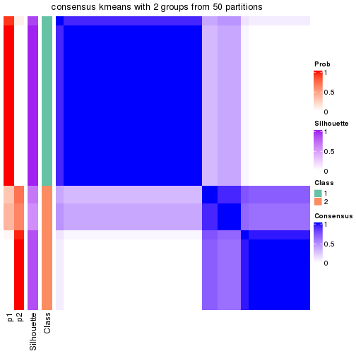</p>

</div>
<div id='tab-node-0212-consensus-heatmap-2'>
<pre><code class="r">consensus_heatmap(res, k = 3)
</code></pre>

<p>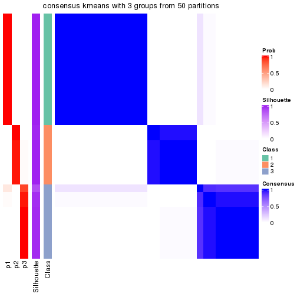</p>

</div>
<div id='tab-node-0212-consensus-heatmap-3'>
<pre><code class="r">consensus_heatmap(res, k = 4)
</code></pre>

<p>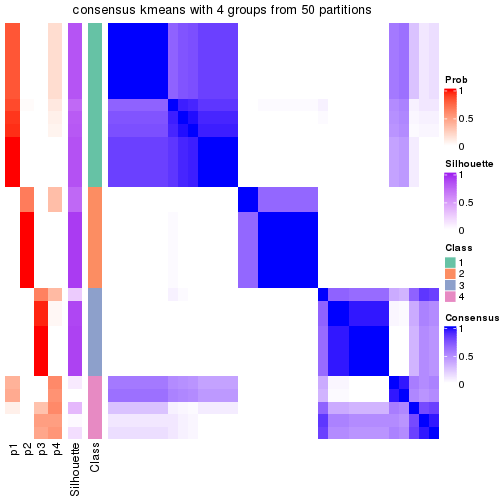</p>

</div>
<div id='tab-node-0212-consensus-heatmap-4'>
<pre><code class="r">consensus_heatmap(res, k = 5)
</code></pre>

<p>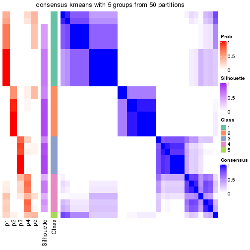</p>

</div>
<div id='tab-node-0212-consensus-heatmap-5'>
<pre><code class="r">consensus_heatmap(res, k = 6)
</code></pre>

<p>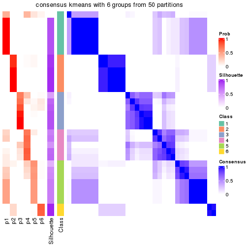</p>

</div>
<div id='tab-node-0212-consensus-heatmap-6'>
<pre><code class="r">consensus_heatmap(res, k = 7)
</code></pre>

<p>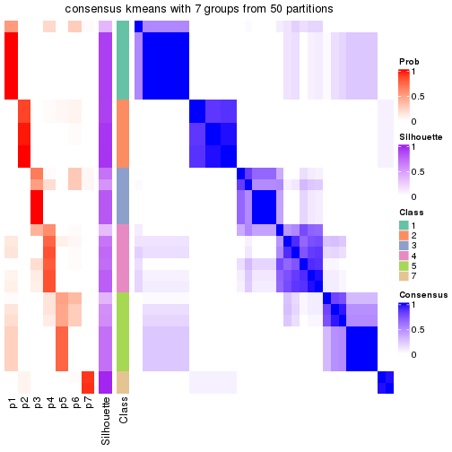</p>

</div>
<div id='tab-node-0212-consensus-heatmap-7'>
<pre><code class="r">consensus_heatmap(res, k = 8)
</code></pre>

<p>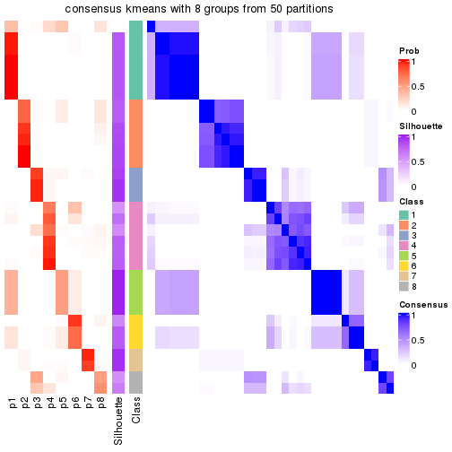</p>

</div>
</div>

Heatmaps for the membership of samples in all partitions to see how consistent they are:


<script>
$( function() {
	$( '#tabs-node-0212-membership-heatmap' ).tabs();
} );
</script>
<div id='tabs-node-0212-membership-heatmap'>
<ul>
<li><a href='#tab-node-0212-membership-heatmap-1'>k = 2</a></li>
<li><a href='#tab-node-0212-membership-heatmap-2'>k = 3</a></li>
<li><a href='#tab-node-0212-membership-heatmap-3'>k = 4</a></li>
<li><a href='#tab-node-0212-membership-heatmap-4'>k = 5</a></li>
<li><a href='#tab-node-0212-membership-heatmap-5'>k = 6</a></li>
<li><a href='#tab-node-0212-membership-heatmap-6'>k = 7</a></li>
<li><a href='#tab-node-0212-membership-heatmap-7'>k = 8</a></li>
</ul>
<div id='tab-node-0212-membership-heatmap-1'>
<pre><code class="r">membership_heatmap(res, k = 2)
</code></pre>

<p>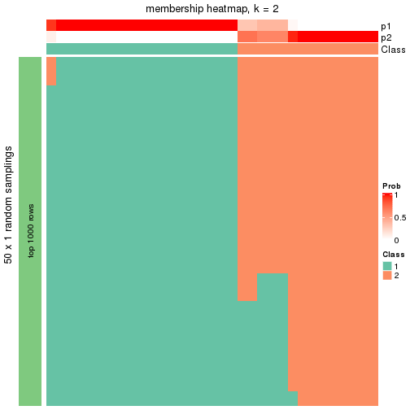</p>

</div>
<div id='tab-node-0212-membership-heatmap-2'>
<pre><code class="r">membership_heatmap(res, k = 3)
</code></pre>

<p>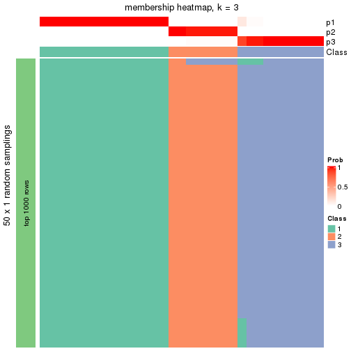</p>

</div>
<div id='tab-node-0212-membership-heatmap-3'>
<pre><code class="r">membership_heatmap(res, k = 4)
</code></pre>

<p>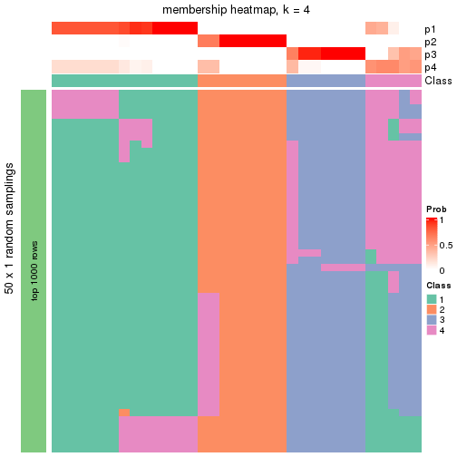</p>

</div>
<div id='tab-node-0212-membership-heatmap-4'>
<pre><code class="r">membership_heatmap(res, k = 5)
</code></pre>

<p>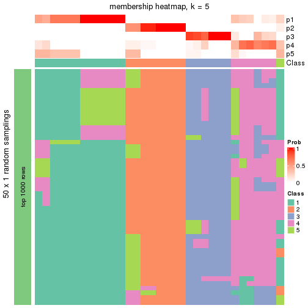</p>

</div>
<div id='tab-node-0212-membership-heatmap-5'>
<pre><code class="r">membership_heatmap(res, k = 6)
</code></pre>

<p>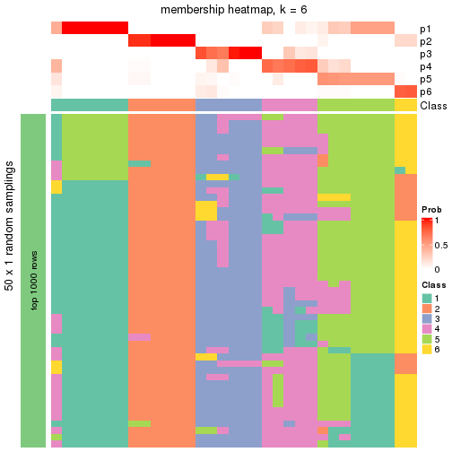</p>

</div>
<div id='tab-node-0212-membership-heatmap-6'>
<pre><code class="r">membership_heatmap(res, k = 7)
</code></pre>

<p>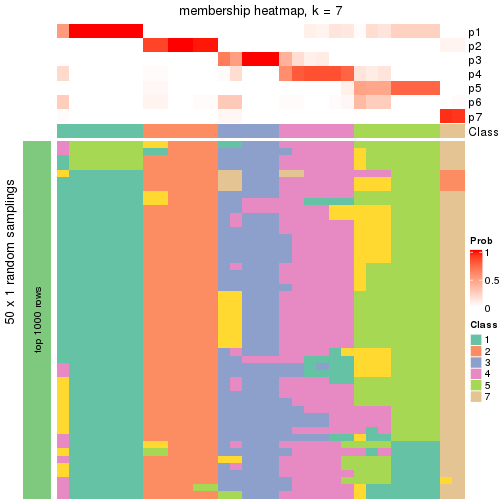</p>

</div>
<div id='tab-node-0212-membership-heatmap-7'>
<pre><code class="r">membership_heatmap(res, k = 8)
</code></pre>

<p>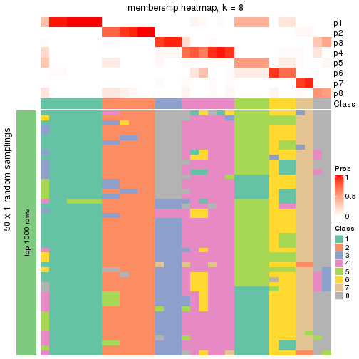</p>

</div>
</div>

As soon as the classes for columns are determined, the signatures
that are significantly different between subgroups can be looked for. 
Following are the heatmaps for signatures.


<script>
$( function() {
	$( '#tabs-node-0212-get-signatures' ).tabs();
} );
</script>
<div id='tabs-node-0212-get-signatures'>
<ul>
<li><a href='#tab-node-0212-get-signatures-1'>k = 2</a></li>
<li><a href='#tab-node-0212-get-signatures-2'>k = 3</a></li>
<li><a href='#tab-node-0212-get-signatures-3'>k = 4</a></li>
<li><a href='#tab-node-0212-get-signatures-4'>k = 5</a></li>
<li><a href='#tab-node-0212-get-signatures-5'>k = 6</a></li>
<li><a href='#tab-node-0212-get-signatures-6'>k = 7</a></li>
<li><a href='#tab-node-0212-get-signatures-7'>k = 8</a></li>
</ul>
<div id='tab-node-0212-get-signatures-1'>
<pre><code class="r">get_signatures(res, k = 2)
</code></pre>

<p>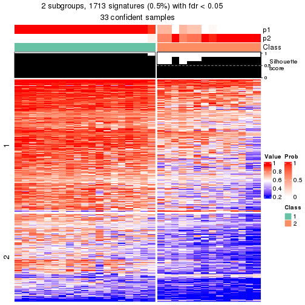</p>

</div>
<div id='tab-node-0212-get-signatures-2'>
<pre><code class="r">get_signatures(res, k = 3)
</code></pre>

<p>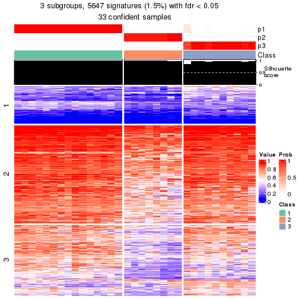</p>

</div>
<div id='tab-node-0212-get-signatures-3'>
<pre><code class="r">get_signatures(res, k = 4)
</code></pre>

<p>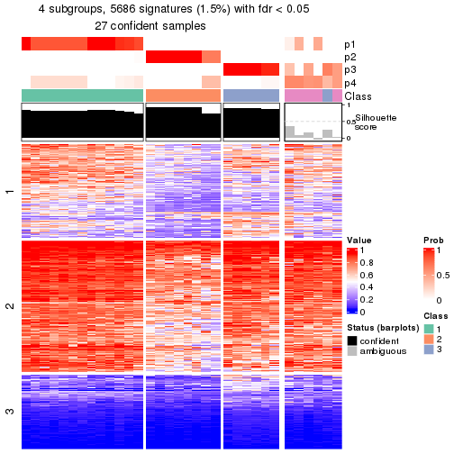</p>

</div>
<div id='tab-node-0212-get-signatures-4'>
<pre><code class="r">get_signatures(res, k = 5)
</code></pre>

<p>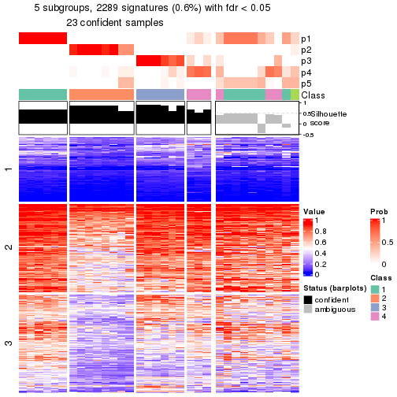</p>

</div>
<div id='tab-node-0212-get-signatures-5'>
<pre><code class="r">get_signatures(res, k = 6)
</code></pre>

<p>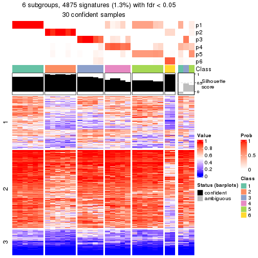</p>

</div>
<div id='tab-node-0212-get-signatures-6'>
<pre><code class="r">get_signatures(res, k = 7)
</code></pre>

<p>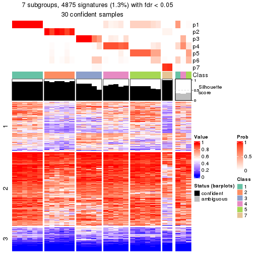</p>

</div>
<div id='tab-node-0212-get-signatures-7'>
<pre><code class="r">get_signatures(res, k = 8)
</code></pre>

<p>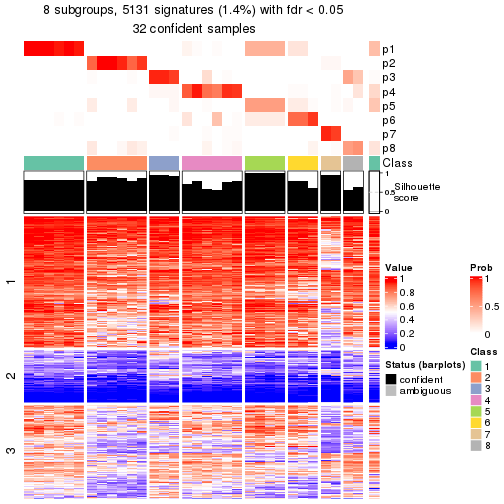</p>

</div>
</div>


Compare the overlap of signatures from different k:

```r
compare_signatures(res)
```

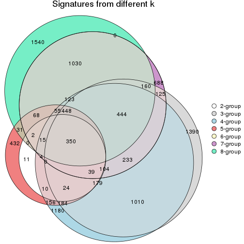

`get_signature()` returns a data frame invisibly. To get the list of signatures, the function
call should be assigned to a variable explicitly. In following code, if `plot` argument is set
to `FALSE`, no heatmap is plotted while only the differential analysis is performed.

```r
# code only for demonstration
tb = get_signature(res, k = ..., plot = FALSE)
```

An example of the output of `tb` is:

```
#>   which_row         fdr    mean_1    mean_2 scaled_mean_1 scaled_mean_2 km
#> 1        38 0.042760348  8.373488  9.131774    -0.5533452     0.5164555  1
#> 2        40 0.018707592  7.106213  8.469186    -0.6173731     0.5762149  1
#> 3        55 0.019134737 10.221463 11.207825    -0.6159697     0.5749050  1
#> 4        59 0.006059896  5.921854  7.869574    -0.6899429     0.6439467  1
#> 5        60 0.018055526  8.928898 10.211722    -0.6204761     0.5791110  1
#> 6        98 0.009384629 15.714769 14.887706     0.6635654    -0.6193277  2
...
```

The columns in `tb` are:

1. `which_row`: row indices corresponding to the input matrix.
2. `fdr`: FDR for the differential test. 
3. `mean_x`: The mean value in group x.
4. `scaled_mean_x`: The mean value in group x after rows are scaled.
5. `km`: Row groups if k-means clustering is applied to rows (which is done by automatically selecting number of clusters).

If there are too many signatures, `top_signatures = ...` can be set to only show the 
signatures with the highest FDRs:

```r
# code only for demonstration
# e.g. to show the top 500 most significant rows
tb = get_signature(res, k = ..., top_signatures = 500)
```

If the signatures are defined as these which are uniquely high in current group, `diff_method` argument
can be set to `"uniquely_high_in_one_group"`:

```r
# code only for demonstration
tb = get_signature(res, k = ..., diff_method = "uniquely_high_in_one_group")
```


UMAP plot which shows how samples are separated.


<script>
$( function() {
	$( '#tabs-node-0212-dimension-reduction' ).tabs();
} );
</script>
<div id='tabs-node-0212-dimension-reduction'>
<ul>
<li><a href='#tab-node-0212-dimension-reduction-1'>k = 2</a></li>
<li><a href='#tab-node-0212-dimension-reduction-2'>k = 3</a></li>
<li><a href='#tab-node-0212-dimension-reduction-3'>k = 4</a></li>
<li><a href='#tab-node-0212-dimension-reduction-4'>k = 5</a></li>
<li><a href='#tab-node-0212-dimension-reduction-5'>k = 6</a></li>
<li><a href='#tab-node-0212-dimension-reduction-6'>k = 7</a></li>
<li><a href='#tab-node-0212-dimension-reduction-7'>k = 8</a></li>
</ul>
<div id='tab-node-0212-dimension-reduction-1'>
<pre><code class="r">dimension_reduction(res, k = 2, method = &quot;UMAP&quot;)
</code></pre>

<p>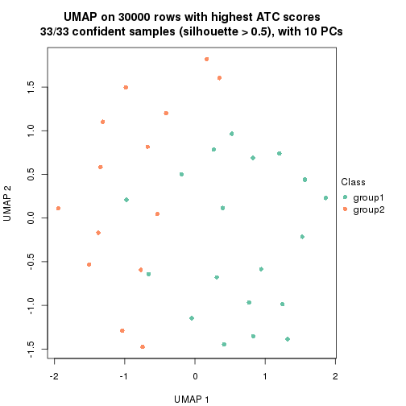</p>

</div>
<div id='tab-node-0212-dimension-reduction-2'>
<pre><code class="r">dimension_reduction(res, k = 3, method = &quot;UMAP&quot;)
</code></pre>

<p>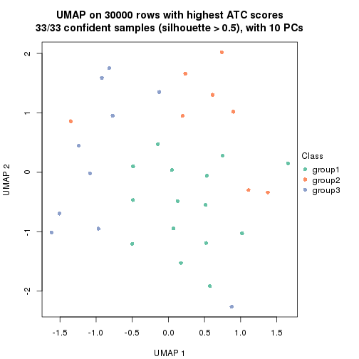</p>

</div>
<div id='tab-node-0212-dimension-reduction-3'>
<pre><code class="r">dimension_reduction(res, k = 4, method = &quot;UMAP&quot;)
</code></pre>

<p>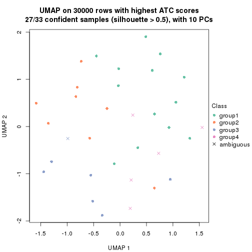</p>

</div>
<div id='tab-node-0212-dimension-reduction-4'>
<pre><code class="r">dimension_reduction(res, k = 5, method = &quot;UMAP&quot;)
</code></pre>

<p>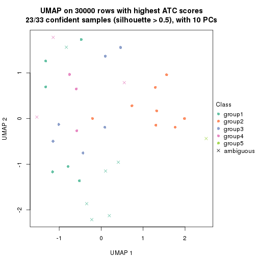</p>

</div>
<div id='tab-node-0212-dimension-reduction-5'>
<pre><code class="r">dimension_reduction(res, k = 6, method = &quot;UMAP&quot;)
</code></pre>

<p>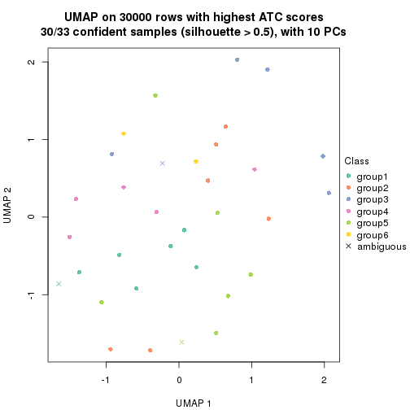</p>

</div>
<div id='tab-node-0212-dimension-reduction-6'>
<pre><code class="r">dimension_reduction(res, k = 7, method = &quot;UMAP&quot;)
</code></pre>

<p>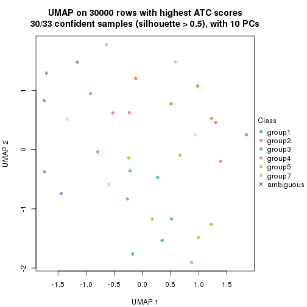</p>

</div>
<div id='tab-node-0212-dimension-reduction-7'>
<pre><code class="r">dimension_reduction(res, k = 8, method = &quot;UMAP&quot;)
</code></pre>

<p>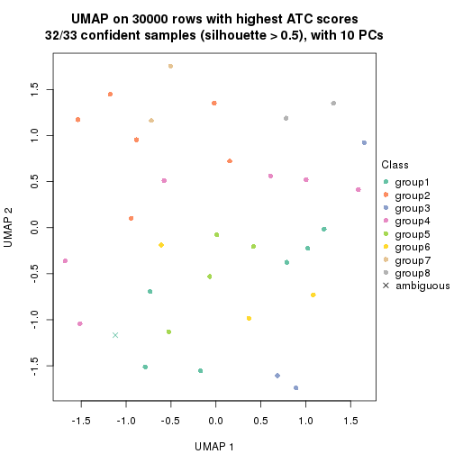</p>

</div>
</div>


Following heatmap shows how subgroups are split when increasing `k`:

```r
collect_classes(res)
```

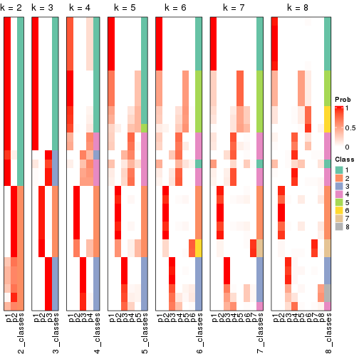


If matrix rows can be associated to genes, consider to use `functional_enrichment(res,
...)` to perform function enrichment for the signature genes. See [this vignette](https://jokergoo.github.io/cola_vignettes/functional_enrichment.html) for more detailed explanations.


 

---------------------------------------------------


### Node022


Parent node: [Node02](#Node02).
Child nodes: 
                Node0121-leaf
        ,
                Node0122-leaf
        ,
                Node0123-leaf
        ,
                Node0211-leaf
        ,
                [Node0212](#Node0212)
        ,
                Node0213-leaf
        ,
                [Node0221](#Node0221)
        ,
                Node0222-leaf
        ,
                Node0223-leaf
        ,
                [Node0231](#Node0231)
        ,
                Node0232-leaf
        ,
                Node0233-leaf
        ,
                Node0241-leaf
        ,
                Node0242-leaf
        ,
                Node0411-leaf
        ,
                Node0412-leaf
        ,
                Node0413-leaf
        ,
                Node0421-leaf
        ,
                Node0422-leaf
        ,
                Node0423-leaf
        ,
                Node0431-leaf
        ,
                Node0432-leaf
        ,
                Node0433-leaf
        ,
                Node0441-leaf
        ,
                Node0442-leaf
        ,
                Node0443-leaf
        ,
                Node0511-leaf
        ,
                [Node0512](#Node0512)
        ,
                Node0513-leaf
        ,
                Node0521-leaf
        ,
                Node0522-leaf
        ,
                Node0523-leaf
        .


The object with results only for a single top-value method and a single partitioning method 
can be extracted as:

```r
res = res_rh["022"]
```

A summary of `res` and all the functions that can be applied to it:

```r
res
```

```
#> A 'ConsensusPartition' object with k = 2, 3, 4, 5, 6, 7, 8.
#>   On a matrix with 30000 rows and 43 columns.
#>   Top rows (1000) are extracted by 'ATC' method.
#>   Subgroups are detected by 'kmeans' method.
#>   Performed in total 350 partitions by row resampling.
#>   Best k for subgroups seems to be 3.
#> 
#> Following methods can be applied to this 'ConsensusPartition' object:
#>  [1] "cola_report"             "collect_classes"         "collect_plots"          
#>  [4] "collect_stats"           "colnames"                "compare_partitions"     
#>  [7] "compare_signatures"      "consensus_heatmap"       "dimension_reduction"    
#> [10] "functional_enrichment"   "get_anno_col"            "get_anno"               
#> [13] "get_classes"             "get_consensus"           "get_matrix"             
#> [16] "get_membership"          "get_param"               "get_signatures"         
#> [19] "get_stats"               "is_best_k"               "is_stable_k"            
#> [22] "membership_heatmap"      "ncol"                    "nrow"                   
#> [25] "plot_ecdf"               "predict_classes"         "rownames"               
#> [28] "select_partition_number" "show"                    "suggest_best_k"         
#> [31] "test_to_known_factors"   "top_rows_heatmap"
```

`collect_plots()` function collects all the plots made from `res` for all `k` (number of subgroups)
into one single page to provide an easy and fast comparison between different `k`.

```r
collect_plots(res)
```

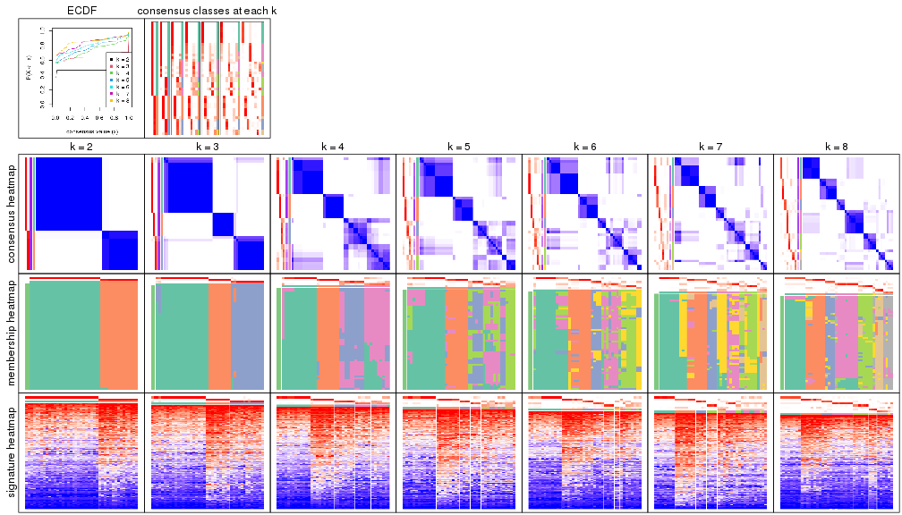

The plots are:

- The first row: a plot of the eCDF (empirical cumulative distribution
  function) curves of the consensus matrix for each `k` and the heatmap of
  predicted classes for each `k`.
- The second row: heatmaps of the consensus matrix for each `k`.
- The third row: heatmaps of the membership matrix for each `k`.
- The fouth row: heatmaps of the signatures for each `k`.

All the plots in panels can be made by individual functions and they are
plotted later in this section.

`select_partition_number()` produces several plots showing different
statistics for choosing "optimized" `k`. There are following statistics:

- eCDF curves of the consensus matrix for each `k`;
- 1-PAC. [The PAC score](https://en.wikipedia.org/wiki/Consensus_clustering#Over-interpretation_potential_of_consensus_clustering)
  measures the proportion of the ambiguous subgrouping.
- Mean silhouette score.
- Concordance. The mean probability of fiting the consensus subgroup labels in all
  partitions.
- Area increased. Denote $A_k$ as the area under the eCDF curve for current
  `k`, the area increased is defined as $A_k - A_{k-1}$.
- Rand index. The percent of pairs of samples that are both in a same cluster
  or both are not in a same cluster in the partition of k and k-1.
- Jaccard index. The ratio of pairs of samples are both in a same cluster in
  the partition of k and k-1 and the pairs of samples are both in a same
  cluster in the partition k or k-1.

The detailed explanations of these statistics can be found in [the _cola_
vignette](https://jokergoo.github.io/cola_vignettes/cola.html#toc_13).

Generally speaking, higher 1-PAC score, higher mean silhouette score or higher
concordance corresponds to better partition. Rand index and Jaccard index
measure how similar the current partition is compared to partition with `k-1`.
If they are too similar, we won't accept `k` is better than `k-1`.

```r
select_partition_number(res)
```

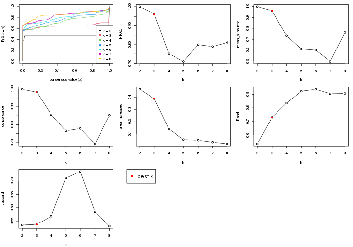

The numeric values for all these statistics can be obtained by `get_stats()`.

```r
get_stats(res)
```

```
#>   k 1-PAC mean_silhouette concordance area_increased  Rand Jaccard
#> 2 2 1.000           0.998       0.999         0.4646 0.535   0.535
#> 3 3 0.962           0.960       0.983         0.3865 0.731   0.537
#> 4 4 0.751           0.733       0.856         0.1396 0.835   0.568
#> 5 5 0.710           0.611       0.766         0.0541 0.924   0.711
#> 6 6 0.800           0.599       0.779         0.0492 0.938   0.736
#> 7 7 0.790           0.496       0.693         0.0334 0.905   0.585
#> 8 8 0.812           0.762       0.853         0.0197 0.907   0.531
```

`suggest_best_k()` suggests the best $k$ based on these statistics. The rules are as follows:

- All $k$ with Jaccard index larger than 0.95 are removed because increasing
  $k$ does not provide enough extra information. If all $k$ are removed, it is
  marked as no subgroup is detected.
- For all $k$ with 1-PAC score larger than 0.9, the maximal $k$ is taken as
  the best $k$, and other $k$ are marked as optional $k$.
- If it does not fit the second rule. The $k$ with the maximal vote of the
  highest 1-PAC score, highest mean silhouette, and highest concordance is
  taken as the best $k$.

```r
suggest_best_k(res)
```

```
#> [1] 3
#> attr(,"optional")
#> [1] 2
```

There is also optional best $k$ = 2 that is worth to check.

Following is the table of the partitions (You need to click the **show/hide
code output** link to see it). The membership matrix (columns with name `p*`)
is inferred by
[`clue::cl_consensus()`](https://www.rdocumentation.org/link/cl_consensus?package=clue)
function with the `SE` method. Basically the value in the membership matrix
represents the probability to belong to a certain group. The finall subgroup
label for an item is determined with the group with highest probability it
belongs to.

In `get_classes()` function, the entropy is calculated from the membership
matrix and the silhouette score is calculated from the consensus matrix.


<script>
$( function() {
	$( '#tabs-node-022-get-classes' ).tabs();
} );
</script>
<div id='tabs-node-022-get-classes'>
<ul>
<li><a href='#tab-node-022-get-classes-1'>k = 2</a></li>
<li><a href='#tab-node-022-get-classes-2'>k = 3</a></li>
<li><a href='#tab-node-022-get-classes-3'>k = 4</a></li>
<li><a href='#tab-node-022-get-classes-4'>k = 5</a></li>
<li><a href='#tab-node-022-get-classes-5'>k = 6</a></li>
<li><a href='#tab-node-022-get-classes-6'>k = 7</a></li>
<li><a href='#tab-node-022-get-classes-7'>k = 8</a></li>
</ul>

<div id='tab-node-022-get-classes-1'>
<p><a id='tab-node-022-get-classes-1-a' style='color:#0366d6' href='#'>show/hide code output</a></p>
<pre><code class="r">cbind(get_classes(res, k = 2), get_membership(res, k = 2))
</code></pre>

<pre><code>#&gt;                 class entropy silhouette   p1   p2
#&gt; TCGA.EJ.7125.01     2   0.000      0.996 0.00 1.00
#&gt; TCGA.YL.A9WI.01     2   0.000      0.996 0.00 1.00
#&gt; TCGA.HC.A6AO.01     1   0.000      1.000 1.00 0.00
#&gt; TCGA.CH.5761.01     2   0.141      0.983 0.02 0.98
#&gt; TCGA.XK.AAJA.01     1   0.000      1.000 1.00 0.00
#&gt; TCGA.KK.A6E8.01     1   0.000      1.000 1.00 0.00
#&gt; TCGA.V1.A9OQ.01     1   0.000      1.000 1.00 0.00
#&gt; TCGA.YL.A8HM.01     2   0.000      0.996 0.00 1.00
#&gt; TCGA.M7.A722.01     2   0.000      0.996 0.00 1.00
#&gt; TCGA.VN.A88R.01     1   0.000      1.000 1.00 0.00
#&gt; TCGA.Y6.A9XI.01     1   0.000      1.000 1.00 0.00
#&gt; TCGA.CH.5737.01     1   0.000      1.000 1.00 0.00
#&gt; TCGA.KK.A8IF.01     1   0.000      1.000 1.00 0.00
#&gt; TCGA.CH.5767.01     1   0.000      1.000 1.00 0.00
#&gt; TCGA.J4.AATZ.01     1   0.000      1.000 1.00 0.00
#&gt; TCGA.ZG.A9L5.01     2   0.000      0.996 0.00 1.00
#&gt; TCGA.KK.A7AQ.01     2   0.141      0.983 0.02 0.98
#&gt; TCGA.YL.A8SR.01     1   0.000      1.000 1.00 0.00
#&gt; TCGA.KK.A8IK.01     1   0.000      1.000 1.00 0.00
#&gt; TCGA.KK.A59X.01     2   0.000      0.996 0.00 1.00
#&gt; TCGA.EJ.7789.01     2   0.000      0.996 0.00 1.00
#&gt; TCGA.FC.A4JI.01     1   0.000      1.000 1.00 0.00
#&gt; TCGA.KK.A5A1.01     2   0.000      0.996 0.00 1.00
#&gt; TCGA.HC.7080.01     2   0.000      0.996 0.00 1.00
#&gt; TCGA.V1.A9O5.06     2   0.000      0.996 0.00 1.00
#&gt; TCGA.KC.A7F5.01     1   0.000      1.000 1.00 0.00
#&gt; TCGA.EJ.7782.01     1   0.000      1.000 1.00 0.00
#&gt; TCGA.XK.AAJ3.01     1   0.000      1.000 1.00 0.00
#&gt; TCGA.XK.AAK1.01     1   0.000      1.000 1.00 0.00
#&gt; TCGA.TP.A8TV.01     1   0.000      1.000 1.00 0.00
#&gt; TCGA.FC.A6HD.01     1   0.000      1.000 1.00 0.00
#&gt; TCGA.QU.A6IL.01     1   0.000      1.000 1.00 0.00
#&gt; TCGA.J4.A83J.01     1   0.000      1.000 1.00 0.00
#&gt; TCGA.XJ.A83G.01     1   0.000      1.000 1.00 0.00
#&gt; TCGA.G9.6496.01     1   0.000      1.000 1.00 0.00
#&gt; TCGA.KK.A59Z.01     2   0.000      0.996 0.00 1.00
#&gt; TCGA.EJ.A65J.01     1   0.000      1.000 1.00 0.00
#&gt; TCGA.2A.A8VX.01     2   0.141      0.983 0.02 0.98
#&gt; TCGA.HC.7738.01     1   0.000      1.000 1.00 0.00
#&gt; TCGA.EJ.7123.01     1   0.000      1.000 1.00 0.00
#&gt; TCGA.2A.A8W1.01     1   0.000      1.000 1.00 0.00
#&gt; TCGA.EJ.7312.01     2   0.000      0.996 0.00 1.00
#&gt; TCGA.V1.A8MM.01     1   0.000      1.000 1.00 0.00
</code></pre>

<script>
$('#tab-node-022-get-classes-1-a').parent().next().next().hide();
$('#tab-node-022-get-classes-1-a').click(function(){
  $('#tab-node-022-get-classes-1-a').parent().next().next().toggle();
  return(false);
});
</script>
</div>

<div id='tab-node-022-get-classes-2'>
<p><a id='tab-node-022-get-classes-2-a' style='color:#0366d6' href='#'>show/hide code output</a></p>
<pre><code class="r">cbind(get_classes(res, k = 3), get_membership(res, k = 3))
</code></pre>

<pre><code>#&gt;                 class entropy silhouette   p1  p2   p3
#&gt; TCGA.EJ.7125.01     3   0.000      0.970 0.00 0.0 1.00
#&gt; TCGA.YL.A9WI.01     2   0.000      1.000 0.00 1.0 0.00
#&gt; TCGA.HC.A6AO.01     3   0.000      0.970 0.00 0.0 1.00
#&gt; TCGA.CH.5761.01     3   0.000      0.970 0.00 0.0 1.00
#&gt; TCGA.XK.AAJA.01     1   0.000      0.978 1.00 0.0 0.00
#&gt; TCGA.KK.A6E8.01     1   0.000      0.978 1.00 0.0 0.00
#&gt; TCGA.V1.A9OQ.01     1   0.000      0.978 1.00 0.0 0.00
#&gt; TCGA.YL.A8HM.01     3   0.000      0.970 0.00 0.0 1.00
#&gt; TCGA.M7.A722.01     2   0.000      1.000 0.00 1.0 0.00
#&gt; TCGA.VN.A88R.01     1   0.000      0.978 1.00 0.0 0.00
#&gt; TCGA.Y6.A9XI.01     1   0.000      0.978 1.00 0.0 0.00
#&gt; TCGA.CH.5737.01     1   0.000      0.978 1.00 0.0 0.00
#&gt; TCGA.KK.A8IF.01     3   0.000      0.970 0.00 0.0 1.00
#&gt; TCGA.CH.5767.01     1   0.000      0.978 1.00 0.0 0.00
#&gt; TCGA.J4.AATZ.01     1   0.000      0.978 1.00 0.0 0.00
#&gt; TCGA.ZG.A9L5.01     2   0.000      1.000 0.00 1.0 0.00
#&gt; TCGA.KK.A7AQ.01     3   0.000      0.970 0.00 0.0 1.00
#&gt; TCGA.YL.A8SR.01     3   0.000      0.970 0.00 0.0 1.00
#&gt; TCGA.KK.A8IK.01     1   0.000      0.978 1.00 0.0 0.00
#&gt; TCGA.KK.A59X.01     2   0.000      1.000 0.00 1.0 0.00
#&gt; TCGA.EJ.7789.01     3   0.455      0.742 0.00 0.2 0.80
#&gt; TCGA.FC.A4JI.01     1   0.000      0.978 1.00 0.0 0.00
#&gt; TCGA.KK.A5A1.01     2   0.000      1.000 0.00 1.0 0.00
#&gt; TCGA.HC.7080.01     2   0.000      1.000 0.00 1.0 0.00
#&gt; TCGA.V1.A9O5.06     2   0.000      1.000 0.00 1.0 0.00
#&gt; TCGA.KC.A7F5.01     1   0.000      0.978 1.00 0.0 0.00
#&gt; TCGA.EJ.7782.01     3   0.000      0.970 0.00 0.0 1.00
#&gt; TCGA.XK.AAJ3.01     3   0.334      0.834 0.12 0.0 0.88
#&gt; TCGA.XK.AAK1.01     1   0.000      0.978 1.00 0.0 0.00
#&gt; TCGA.TP.A8TV.01     3   0.000      0.970 0.00 0.0 1.00
#&gt; TCGA.FC.A6HD.01     1   0.522      0.659 0.74 0.0 0.26
#&gt; TCGA.QU.A6IL.01     1   0.000      0.978 1.00 0.0 0.00
#&gt; TCGA.J4.A83J.01     1   0.000      0.978 1.00 0.0 0.00
#&gt; TCGA.XJ.A83G.01     1   0.000      0.978 1.00 0.0 0.00
#&gt; TCGA.G9.6496.01     1   0.400      0.810 0.84 0.0 0.16
#&gt; TCGA.KK.A59Z.01     2   0.000      1.000 0.00 1.0 0.00
#&gt; TCGA.EJ.A65J.01     1   0.000      0.978 1.00 0.0 0.00
#&gt; TCGA.2A.A8VX.01     3   0.000      0.970 0.00 0.0 1.00
#&gt; TCGA.HC.7738.01     1   0.000      0.978 1.00 0.0 0.00
#&gt; TCGA.EJ.7123.01     1   0.000      0.978 1.00 0.0 0.00
#&gt; TCGA.2A.A8W1.01     1   0.000      0.978 1.00 0.0 0.00
#&gt; TCGA.EJ.7312.01     2   0.000      1.000 0.00 1.0 0.00
#&gt; TCGA.V1.A8MM.01     3   0.000      0.970 0.00 0.0 1.00
</code></pre>

<script>
$('#tab-node-022-get-classes-2-a').parent().next().next().hide();
$('#tab-node-022-get-classes-2-a').click(function(){
  $('#tab-node-022-get-classes-2-a').parent().next().next().toggle();
  return(false);
});
</script>
</div>

<div id='tab-node-022-get-classes-3'>
<p><a id='tab-node-022-get-classes-3-a' style='color:#0366d6' href='#'>show/hide code output</a></p>
<pre><code class="r">cbind(get_classes(res, k = 4), get_membership(res, k = 4))
</code></pre>

<pre><code>#&gt;                 class entropy silhouette   p1   p2   p3   p4
#&gt; TCGA.EJ.7125.01     3  0.3172    0.71327 0.00 0.00 0.84 0.16
#&gt; TCGA.YL.A9WI.01     2  0.0000    0.98324 0.00 1.00 0.00 0.00
#&gt; TCGA.HC.A6AO.01     4  0.4948    0.23072 0.00 0.00 0.44 0.56
#&gt; TCGA.CH.5761.01     3  0.3172    0.73549 0.00 0.00 0.84 0.16
#&gt; TCGA.XK.AAJA.01     1  0.0000    0.92988 1.00 0.00 0.00 0.00
#&gt; TCGA.KK.A6E8.01     1  0.0000    0.92988 1.00 0.00 0.00 0.00
#&gt; TCGA.V1.A9OQ.01     1  0.0000    0.92988 1.00 0.00 0.00 0.00
#&gt; TCGA.YL.A8HM.01     3  0.2011    0.77799 0.00 0.00 0.92 0.08
#&gt; TCGA.M7.A722.01     2  0.3172    0.85373 0.00 0.84 0.00 0.16
#&gt; TCGA.VN.A88R.01     1  0.1211    0.90906 0.96 0.00 0.00 0.04
#&gt; TCGA.Y6.A9XI.01     1  0.0000    0.92988 1.00 0.00 0.00 0.00
#&gt; TCGA.CH.5737.01     1  0.1211    0.90906 0.96 0.00 0.00 0.04
#&gt; TCGA.KK.A8IF.01     3  0.4994   -0.12977 0.00 0.00 0.52 0.48
#&gt; TCGA.CH.5767.01     4  0.4977    0.44621 0.46 0.00 0.00 0.54
#&gt; TCGA.J4.AATZ.01     4  0.4277    0.68699 0.28 0.00 0.00 0.72
#&gt; TCGA.ZG.A9L5.01     2  0.0000    0.98324 0.00 1.00 0.00 0.00
#&gt; TCGA.KK.A7AQ.01     3  0.2011    0.77799 0.00 0.00 0.92 0.08
#&gt; TCGA.YL.A8SR.01     3  0.0707    0.76788 0.00 0.00 0.98 0.02
#&gt; TCGA.KK.A8IK.01     1  0.0000    0.92988 1.00 0.00 0.00 0.00
#&gt; TCGA.KK.A59X.01     2  0.0000    0.98324 0.00 1.00 0.00 0.00
#&gt; TCGA.EJ.7789.01     3  0.3172    0.71327 0.00 0.00 0.84 0.16
#&gt; TCGA.FC.A4JI.01     4  0.4406    0.67675 0.30 0.00 0.00 0.70
#&gt; TCGA.KK.A5A1.01     2  0.0000    0.98324 0.00 1.00 0.00 0.00
#&gt; TCGA.HC.7080.01     2  0.0000    0.98324 0.00 1.00 0.00 0.00
#&gt; TCGA.V1.A9O5.06     2  0.0000    0.98324 0.00 1.00 0.00 0.00
#&gt; TCGA.KC.A7F5.01     1  0.0000    0.92988 1.00 0.00 0.00 0.00
#&gt; TCGA.EJ.7782.01     4  0.4948    0.23072 0.00 0.00 0.44 0.56
#&gt; TCGA.XK.AAJ3.01     4  0.3853    0.52663 0.02 0.00 0.16 0.82
#&gt; TCGA.XK.AAK1.01     1  0.5000   -0.43194 0.50 0.00 0.00 0.50
#&gt; TCGA.TP.A8TV.01     3  0.4948    0.00698 0.00 0.00 0.56 0.44
#&gt; TCGA.FC.A6HD.01     4  0.5677    0.67271 0.14 0.00 0.14 0.72
#&gt; TCGA.QU.A6IL.01     1  0.0000    0.92988 1.00 0.00 0.00 0.00
#&gt; TCGA.J4.A83J.01     1  0.1211    0.90906 0.96 0.00 0.00 0.04
#&gt; TCGA.XJ.A83G.01     1  0.1211    0.90906 0.96 0.00 0.00 0.04
#&gt; TCGA.G9.6496.01     4  0.5677    0.66961 0.14 0.00 0.14 0.72
#&gt; TCGA.KK.A59Z.01     2  0.0000    0.98324 0.00 1.00 0.00 0.00
#&gt; TCGA.EJ.A65J.01     1  0.0000    0.92988 1.00 0.00 0.00 0.00
#&gt; TCGA.2A.A8VX.01     3  0.2345    0.77214 0.00 0.00 0.90 0.10
#&gt; TCGA.HC.7738.01     1  0.0000    0.92988 1.00 0.00 0.00 0.00
#&gt; TCGA.EJ.7123.01     4  0.4948    0.49112 0.44 0.00 0.00 0.56
#&gt; TCGA.2A.A8W1.01     4  0.4406    0.67205 0.30 0.00 0.00 0.70
#&gt; TCGA.EJ.7312.01     2  0.0000    0.98324 0.00 1.00 0.00 0.00
#&gt; TCGA.V1.A8MM.01     3  0.0707    0.76788 0.00 0.00 0.98 0.02
</code></pre>

<script>
$('#tab-node-022-get-classes-3-a').parent().next().next().hide();
$('#tab-node-022-get-classes-3-a').click(function(){
  $('#tab-node-022-get-classes-3-a').parent().next().next().toggle();
  return(false);
});
</script>
</div>

<div id='tab-node-022-get-classes-4'>
<p><a id='tab-node-022-get-classes-4-a' style='color:#0366d6' href='#'>show/hide code output</a></p>
<pre><code class="r">cbind(get_classes(res, k = 5), get_membership(res, k = 5))
</code></pre>

<pre><code>#&gt;                 class entropy silhouette   p1   p2   p3   p4   p5
#&gt; TCGA.EJ.7125.01     5  0.4287    -0.2933 0.00 0.00 0.46 0.00 0.54
#&gt; TCGA.YL.A9WI.01     2  0.2249     0.9154 0.00 0.92 0.04 0.02 0.02
#&gt; TCGA.HC.A6AO.01     5  0.5895     0.4657 0.00 0.00 0.10 0.44 0.46
#&gt; TCGA.CH.5761.01     3  0.2438     0.6391 0.00 0.00 0.90 0.06 0.04
#&gt; TCGA.XK.AAJA.01     1  0.0000     0.8454 1.00 0.00 0.00 0.00 0.00
#&gt; TCGA.KK.A6E8.01     1  0.0000     0.8454 1.00 0.00 0.00 0.00 0.00
#&gt; TCGA.V1.A9OQ.01     1  0.2616     0.8118 0.88 0.00 0.00 0.10 0.02
#&gt; TCGA.YL.A8HM.01     3  0.0609     0.6424 0.00 0.00 0.98 0.00 0.02
#&gt; TCGA.M7.A722.01     2  0.4126     0.5766 0.00 0.62 0.00 0.00 0.38
#&gt; TCGA.VN.A88R.01     1  0.3106     0.7926 0.84 0.00 0.00 0.14 0.02
#&gt; TCGA.Y6.A9XI.01     1  0.0000     0.8454 1.00 0.00 0.00 0.00 0.00
#&gt; TCGA.CH.5737.01     1  0.3106     0.7926 0.84 0.00 0.00 0.14 0.02
#&gt; TCGA.KK.A8IF.01     5  0.6064     0.4812 0.00 0.00 0.12 0.42 0.46
#&gt; TCGA.CH.5767.01     1  0.5689    -0.0858 0.48 0.00 0.00 0.44 0.08
#&gt; TCGA.J4.AATZ.01     4  0.3109     0.6359 0.20 0.00 0.00 0.80 0.00
#&gt; TCGA.ZG.A9L5.01     2  0.0000     0.9324 0.00 1.00 0.00 0.00 0.00
#&gt; TCGA.KK.A7AQ.01     3  0.1648     0.6580 0.00 0.00 0.94 0.04 0.02
#&gt; TCGA.YL.A8SR.01     3  0.6705     0.0488 0.00 0.00 0.42 0.26 0.32
#&gt; TCGA.KK.A8IK.01     1  0.0000     0.8454 1.00 0.00 0.00 0.00 0.00
#&gt; TCGA.KK.A59X.01     2  0.0000     0.9324 0.00 1.00 0.00 0.00 0.00
#&gt; TCGA.EJ.7789.01     5  0.4287    -0.2933 0.00 0.00 0.46 0.00 0.54
#&gt; TCGA.FC.A4JI.01     4  0.4216     0.5992 0.12 0.00 0.00 0.78 0.10
#&gt; TCGA.KK.A5A1.01     2  0.2249     0.9154 0.00 0.92 0.04 0.02 0.02
#&gt; TCGA.HC.7080.01     2  0.2249     0.9154 0.00 0.92 0.04 0.02 0.02
#&gt; TCGA.V1.A9O5.06     2  0.0000     0.9324 0.00 1.00 0.00 0.00 0.00
#&gt; TCGA.KC.A7F5.01     1  0.0000     0.8454 1.00 0.00 0.00 0.00 0.00
#&gt; TCGA.EJ.7782.01     5  0.5895     0.4657 0.00 0.00 0.10 0.44 0.46
#&gt; TCGA.XK.AAJ3.01     4  0.5048     0.1070 0.00 0.00 0.38 0.58 0.04
#&gt; TCGA.XK.AAK1.01     1  0.5558     0.2233 0.56 0.00 0.00 0.36 0.08
#&gt; TCGA.TP.A8TV.01     5  0.6207     0.4823 0.00 0.00 0.14 0.40 0.46
#&gt; TCGA.FC.A6HD.01     4  0.1043     0.5634 0.04 0.00 0.00 0.96 0.00
#&gt; TCGA.QU.A6IL.01     1  0.0000     0.8454 1.00 0.00 0.00 0.00 0.00
#&gt; TCGA.J4.A83J.01     1  0.3106     0.7926 0.84 0.00 0.00 0.14 0.02
#&gt; TCGA.XJ.A83G.01     1  0.3106     0.7926 0.84 0.00 0.00 0.14 0.02
#&gt; TCGA.G9.6496.01     4  0.3922     0.4063 0.04 0.00 0.00 0.78 0.18
#&gt; TCGA.KK.A59Z.01     2  0.0000     0.9324 0.00 1.00 0.00 0.00 0.00
#&gt; TCGA.EJ.A65J.01     1  0.0000     0.8454 1.00 0.00 0.00 0.00 0.00
#&gt; TCGA.2A.A8VX.01     3  0.1410     0.6576 0.00 0.00 0.94 0.06 0.00
#&gt; TCGA.HC.7738.01     1  0.0000     0.8454 1.00 0.00 0.00 0.00 0.00
#&gt; TCGA.EJ.7123.01     4  0.5579     0.4562 0.30 0.00 0.00 0.60 0.10
#&gt; TCGA.2A.A8W1.01     4  0.4132     0.5630 0.26 0.00 0.00 0.72 0.02
#&gt; TCGA.EJ.7312.01     2  0.0000     0.9324 0.00 1.00 0.00 0.00 0.00
#&gt; TCGA.V1.A8MM.01     3  0.6638     0.1022 0.00 0.00 0.44 0.24 0.32
</code></pre>

<script>
$('#tab-node-022-get-classes-4-a').parent().next().next().hide();
$('#tab-node-022-get-classes-4-a').click(function(){
  $('#tab-node-022-get-classes-4-a').parent().next().next().toggle();
  return(false);
});
</script>
</div>

<div id='tab-node-022-get-classes-5'>
<p><a id='tab-node-022-get-classes-5-a' style='color:#0366d6' href='#'>show/hide code output</a></p>
<pre><code class="r">cbind(get_classes(res, k = 6), get_membership(res, k = 6))
</code></pre>

<pre><code>#&gt;                 class entropy silhouette   p1   p2   p3   p4   p5   p6
#&gt; TCGA.EJ.7125.01     6  0.4246    1.00000 0.00 0.00 0.40 0.00 0.02 0.58
#&gt; TCGA.YL.A9WI.01     2  0.4279    0.80952 0.00 0.78 0.08 0.06 0.00 0.08
#&gt; TCGA.HC.A6AO.01     5  0.1092    0.61681 0.00 0.00 0.02 0.02 0.96 0.00
#&gt; TCGA.CH.5761.01     3  0.4334    0.59385 0.00 0.00 0.72 0.04 0.02 0.22
#&gt; TCGA.XK.AAJA.01     1  0.0000    0.75061 1.00 0.00 0.00 0.00 0.00 0.00
#&gt; TCGA.KK.A6E8.01     1  0.0000    0.75061 1.00 0.00 0.00 0.00 0.00 0.00
#&gt; TCGA.V1.A9OQ.01     1  0.4754    0.60032 0.68 0.00 0.00 0.24 0.02 0.06
#&gt; TCGA.YL.A8HM.01     3  0.0937    0.77459 0.00 0.00 0.96 0.00 0.04 0.00
#&gt; TCGA.M7.A722.01     2  0.3756    0.39583 0.00 0.60 0.00 0.00 0.00 0.40
#&gt; TCGA.VN.A88R.01     1  0.5625    0.52922 0.58 0.00 0.00 0.30 0.04 0.08
#&gt; TCGA.Y6.A9XI.01     1  0.0000    0.75061 1.00 0.00 0.00 0.00 0.00 0.00
#&gt; TCGA.CH.5737.01     1  0.5625    0.52922 0.58 0.00 0.00 0.30 0.04 0.08
#&gt; TCGA.KK.A8IF.01     5  0.1480    0.61446 0.00 0.00 0.04 0.00 0.94 0.02
#&gt; TCGA.CH.5767.01     4  0.7165   -0.12778 0.32 0.00 0.00 0.34 0.26 0.08
#&gt; TCGA.J4.AATZ.01     4  0.2725    0.65045 0.02 0.00 0.00 0.88 0.06 0.04
#&gt; TCGA.ZG.A9L5.01     2  0.0000    0.87548 0.00 1.00 0.00 0.00 0.00 0.00
#&gt; TCGA.KK.A7AQ.01     3  0.0937    0.77459 0.00 0.00 0.96 0.00 0.04 0.00
#&gt; TCGA.YL.A8SR.01     5  0.5736    0.03594 0.00 0.00 0.34 0.00 0.48 0.18
#&gt; TCGA.KK.A8IK.01     1  0.0000    0.75061 1.00 0.00 0.00 0.00 0.00 0.00
#&gt; TCGA.KK.A59X.01     2  0.0000    0.87548 0.00 1.00 0.00 0.00 0.00 0.00
#&gt; TCGA.EJ.7789.01     6  0.4246    1.00000 0.00 0.00 0.40 0.00 0.02 0.58
#&gt; TCGA.FC.A4JI.01     4  0.4179    0.61230 0.02 0.00 0.00 0.76 0.16 0.06
#&gt; TCGA.KK.A5A1.01     2  0.4008    0.81809 0.00 0.80 0.06 0.06 0.00 0.08
#&gt; TCGA.HC.7080.01     2  0.4279    0.80952 0.00 0.78 0.08 0.06 0.00 0.08
#&gt; TCGA.V1.A9O5.06     2  0.0000    0.87548 0.00 1.00 0.00 0.00 0.00 0.00
#&gt; TCGA.KC.A7F5.01     1  0.0000    0.75061 1.00 0.00 0.00 0.00 0.00 0.00
#&gt; TCGA.EJ.7782.01     5  0.0547    0.60146 0.00 0.00 0.00 0.02 0.98 0.00
#&gt; TCGA.XK.AAJ3.01     4  0.5292    0.17558 0.00 0.00 0.18 0.60 0.00 0.22
#&gt; TCGA.XK.AAK1.01     1  0.7165   -0.01869 0.34 0.00 0.00 0.32 0.26 0.08
#&gt; TCGA.TP.A8TV.01     5  0.1480    0.61446 0.00 0.00 0.04 0.00 0.94 0.02
#&gt; TCGA.FC.A6HD.01     4  0.2794    0.64260 0.00 0.00 0.00 0.86 0.08 0.06
#&gt; TCGA.QU.A6IL.01     1  0.0000    0.75061 1.00 0.00 0.00 0.00 0.00 0.00
#&gt; TCGA.J4.A83J.01     1  0.5625    0.52922 0.58 0.00 0.00 0.30 0.04 0.08
#&gt; TCGA.XJ.A83G.01     1  0.5625    0.52922 0.58 0.00 0.00 0.30 0.04 0.08
#&gt; TCGA.G9.6496.01     4  0.5110    0.21934 0.00 0.00 0.00 0.48 0.44 0.08
#&gt; TCGA.KK.A59Z.01     2  0.0000    0.87548 0.00 1.00 0.00 0.00 0.00 0.00
#&gt; TCGA.EJ.A65J.01     1  0.0000    0.75061 1.00 0.00 0.00 0.00 0.00 0.00
#&gt; TCGA.2A.A8VX.01     3  0.2350    0.74539 0.00 0.00 0.88 0.00 0.02 0.10
#&gt; TCGA.HC.7738.01     1  0.0000    0.75061 1.00 0.00 0.00 0.00 0.00 0.00
#&gt; TCGA.EJ.7123.01     5  0.7023   -0.31055 0.20 0.00 0.00 0.34 0.38 0.08
#&gt; TCGA.2A.A8W1.01     4  0.1865    0.63875 0.04 0.00 0.00 0.92 0.04 0.00
#&gt; TCGA.EJ.7312.01     2  0.0000    0.87548 0.00 1.00 0.00 0.00 0.00 0.00
#&gt; TCGA.V1.A8MM.01     5  0.5769   -0.00867 0.00 0.00 0.36 0.00 0.46 0.18
</code></pre>

<script>
$('#tab-node-022-get-classes-5-a').parent().next().next().hide();
$('#tab-node-022-get-classes-5-a').click(function(){
  $('#tab-node-022-get-classes-5-a').parent().next().next().toggle();
  return(false);
});
</script>
</div>

<div id='tab-node-022-get-classes-6'>
<p><a id='tab-node-022-get-classes-6-a' style='color:#0366d6' href='#'>show/hide code output</a></p>
<pre><code class="r">cbind(get_classes(res, k = 7), get_membership(res, k = 7))
</code></pre>

<pre><code>#&gt;                 class entropy silhouette   p1   p2   p3   p4   p5   p6   p7
#&gt; TCGA.EJ.7125.01     7  0.5451     0.2063 0.00 0.00 0.16 0.00 0.02 0.28 0.54
#&gt; TCGA.YL.A9WI.01     2  0.1006     0.7775 0.00 0.96 0.02 0.00 0.00 0.00 0.02
#&gt; TCGA.HC.A6AO.01     5  0.1664     0.6546 0.00 0.00 0.00 0.06 0.92 0.02 0.00
#&gt; TCGA.CH.5761.01     3  0.2572     0.7910 0.00 0.00 0.80 0.00 0.00 0.20 0.00
#&gt; TCGA.XK.AAJA.01     1  0.0000     0.7415 1.00 0.00 0.00 0.00 0.00 0.00 0.00
#&gt; TCGA.KK.A6E8.01     1  0.0000     0.7415 1.00 0.00 0.00 0.00 0.00 0.00 0.00
#&gt; TCGA.V1.A9OQ.01     1  0.5619    -0.1581 0.38 0.00 0.00 0.30 0.00 0.00 0.32
#&gt; TCGA.YL.A8HM.01     3  0.0504     0.9007 0.00 0.00 0.98 0.00 0.00 0.00 0.02
#&gt; TCGA.M7.A722.01     7  0.5378    -0.0417 0.00 0.30 0.00 0.00 0.00 0.22 0.48
#&gt; TCGA.VN.A88R.01     1  0.5631    -0.1864 0.36 0.00 0.00 0.30 0.00 0.00 0.34
#&gt; TCGA.Y6.A9XI.01     1  0.0504     0.7405 0.98 0.00 0.00 0.00 0.00 0.02 0.00
#&gt; TCGA.CH.5737.01     4  0.5631     0.1471 0.30 0.00 0.00 0.36 0.00 0.00 0.34
#&gt; TCGA.KK.A8IF.01     5  0.0863     0.6738 0.00 0.00 0.04 0.00 0.96 0.00 0.00
#&gt; TCGA.CH.5767.01     4  0.6991     0.3734 0.16 0.00 0.00 0.36 0.12 0.02 0.34
#&gt; TCGA.J4.AATZ.01     4  0.0000     0.4646 0.00 0.00 0.00 1.00 0.00 0.00 0.00
#&gt; TCGA.ZG.A9L5.01     2  0.2945     0.8740 0.00 0.74 0.00 0.00 0.00 0.26 0.00
#&gt; TCGA.KK.A7AQ.01     3  0.0504     0.9007 0.00 0.00 0.98 0.00 0.00 0.00 0.02
#&gt; TCGA.YL.A8SR.01     5  0.6257     0.3525 0.00 0.00 0.28 0.00 0.48 0.12 0.12
#&gt; TCGA.KK.A8IK.01     1  0.0504     0.7405 0.98 0.00 0.00 0.00 0.00 0.02 0.00
#&gt; TCGA.KK.A59X.01     2  0.2945     0.8740 0.00 0.74 0.00 0.00 0.00 0.26 0.00
#&gt; TCGA.EJ.7789.01     7  0.5052     0.2362 0.00 0.02 0.14 0.00 0.00 0.22 0.62
#&gt; TCGA.FC.A4JI.01     4  0.5404     0.2362 0.00 0.00 0.00 0.62 0.16 0.16 0.06
#&gt; TCGA.KK.A5A1.01     2  0.1006     0.7775 0.00 0.96 0.02 0.00 0.00 0.00 0.02
#&gt; TCGA.HC.7080.01     2  0.1006     0.7775 0.00 0.96 0.02 0.00 0.00 0.00 0.02
#&gt; TCGA.V1.A9O5.06     2  0.2945     0.8740 0.00 0.74 0.00 0.00 0.00 0.26 0.00
#&gt; TCGA.KC.A7F5.01     1  0.0000     0.7415 1.00 0.00 0.00 0.00 0.00 0.00 0.00
#&gt; TCGA.EJ.7782.01     5  0.0000     0.6685 0.00 0.00 0.00 0.00 1.00 0.00 0.00
#&gt; TCGA.XK.AAJ3.01     4  0.5128    -0.0943 0.00 0.00 0.18 0.54 0.00 0.28 0.00
#&gt; TCGA.XK.AAK1.01     4  0.6669     0.3522 0.18 0.00 0.00 0.36 0.12 0.00 0.34
#&gt; TCGA.TP.A8TV.01     5  0.0863     0.6738 0.00 0.00 0.04 0.00 0.96 0.00 0.00
#&gt; TCGA.FC.A6HD.01     4  0.0863     0.4465 0.00 0.00 0.00 0.96 0.00 0.04 0.00
#&gt; TCGA.QU.A6IL.01     1  0.0000     0.7415 1.00 0.00 0.00 0.00 0.00 0.00 0.00
#&gt; TCGA.J4.A83J.01     7  0.5644    -0.4756 0.34 0.00 0.00 0.32 0.00 0.00 0.34
#&gt; TCGA.XJ.A83G.01     1  0.5644    -0.2152 0.34 0.00 0.00 0.32 0.00 0.00 0.34
#&gt; TCGA.G9.6496.01     5  0.5976    -0.2849 0.00 0.00 0.00 0.34 0.38 0.02 0.26
#&gt; TCGA.KK.A59Z.01     2  0.2945     0.8740 0.00 0.74 0.00 0.00 0.00 0.26 0.00
#&gt; TCGA.EJ.A65J.01     1  0.0504     0.7405 0.98 0.00 0.00 0.00 0.00 0.02 0.00
#&gt; TCGA.2A.A8VX.01     3  0.1433     0.8835 0.00 0.00 0.92 0.00 0.00 0.08 0.00
#&gt; TCGA.HC.7738.01     1  0.0504     0.7405 0.98 0.00 0.00 0.00 0.00 0.02 0.00
#&gt; TCGA.EJ.7123.01     4  0.6756     0.3590 0.06 0.00 0.00 0.36 0.22 0.02 0.34
#&gt; TCGA.2A.A8W1.01     4  0.1363     0.4684 0.00 0.00 0.00 0.94 0.00 0.02 0.04
#&gt; TCGA.EJ.7312.01     2  0.2945     0.8740 0.00 0.74 0.00 0.00 0.00 0.26 0.00
#&gt; TCGA.V1.A8MM.01     5  0.6257     0.3525 0.00 0.00 0.28 0.00 0.48 0.12 0.12
</code></pre>

<script>
$('#tab-node-022-get-classes-6-a').parent().next().next().hide();
$('#tab-node-022-get-classes-6-a').click(function(){
  $('#tab-node-022-get-classes-6-a').parent().next().next().toggle();
  return(false);
});
</script>
</div>

<div id='tab-node-022-get-classes-7'>
<p><a id='tab-node-022-get-classes-7-a' style='color:#0366d6' href='#'>show/hide code output</a></p>
<pre><code class="r">cbind(get_classes(res, k = 8), get_membership(res, k = 8))
</code></pre>

<pre><code>#&gt;                 class entropy silhouette   p1   p2   p3   p4   p5   p6   p7   p8
#&gt; TCGA.EJ.7125.01     7  0.1874     0.7934 0.02 0.00 0.00 0.02 0.02 0.02 0.92 0.00
#&gt; TCGA.YL.A9WI.01     2  0.4028     0.7405 0.00 0.66 0.04 0.00 0.00 0.28 0.02 0.00
#&gt; TCGA.HC.A6AO.01     5  0.2680     0.7546 0.00 0.00 0.02 0.00 0.84 0.12 0.00 0.02
#&gt; TCGA.CH.5761.01     3  0.3021     0.7097 0.02 0.00 0.80 0.02 0.00 0.00 0.00 0.16
#&gt; TCGA.XK.AAJA.01     1  0.2224     0.9890 0.86 0.00 0.00 0.12 0.00 0.02 0.00 0.00
#&gt; TCGA.KK.A6E8.01     1  0.2224     0.9890 0.86 0.00 0.00 0.12 0.00 0.02 0.00 0.00
#&gt; TCGA.V1.A9OQ.01     4  0.2025     0.8180 0.10 0.00 0.00 0.88 0.00 0.02 0.00 0.00
#&gt; TCGA.YL.A8HM.01     3  0.2864     0.8360 0.00 0.00 0.84 0.00 0.06 0.02 0.08 0.00
#&gt; TCGA.M7.A722.01     7  0.2719     0.6741 0.00 0.18 0.00 0.00 0.00 0.02 0.80 0.00
#&gt; TCGA.VN.A88R.01     4  0.0808     0.9020 0.04 0.00 0.00 0.96 0.00 0.00 0.00 0.00
#&gt; TCGA.Y6.A9XI.01     1  0.1765     0.9890 0.88 0.00 0.00 0.12 0.00 0.00 0.00 0.00
#&gt; TCGA.CH.5737.01     4  0.0808     0.9020 0.04 0.00 0.00 0.96 0.00 0.00 0.00 0.00
#&gt; TCGA.KK.A8IF.01     5  0.0000     0.8148 0.00 0.00 0.00 0.00 1.00 0.00 0.00 0.00
#&gt; TCGA.CH.5767.01     4  0.0808     0.8906 0.00 0.00 0.00 0.96 0.04 0.00 0.00 0.00
#&gt; TCGA.J4.AATZ.01     8  0.4342     0.2608 0.00 0.00 0.00 0.18 0.00 0.18 0.00 0.64
#&gt; TCGA.ZG.A9L5.01     2  0.0000     0.8587 0.00 1.00 0.00 0.00 0.00 0.00 0.00 0.00
#&gt; TCGA.KK.A7AQ.01     3  0.2648     0.8344 0.00 0.00 0.84 0.00 0.08 0.00 0.08 0.00
#&gt; TCGA.YL.A8SR.01     5  0.4948     0.6936 0.02 0.00 0.12 0.00 0.66 0.04 0.16 0.00
#&gt; TCGA.KK.A8IK.01     1  0.1765     0.9890 0.88 0.00 0.00 0.12 0.00 0.00 0.00 0.00
#&gt; TCGA.KK.A59X.01     2  0.0808     0.8517 0.00 0.96 0.00 0.00 0.00 0.04 0.00 0.00
#&gt; TCGA.EJ.7789.01     7  0.0000     0.8111 0.00 0.00 0.00 0.00 0.00 0.00 1.00 0.00
#&gt; TCGA.FC.A4JI.01     6  0.4559     0.0000 0.00 0.00 0.00 0.08 0.02 0.60 0.00 0.30
#&gt; TCGA.KK.A5A1.01     2  0.3843     0.7581 0.04 0.70 0.00 0.00 0.00 0.24 0.02 0.00
#&gt; TCGA.HC.7080.01     2  0.4028     0.7405 0.00 0.66 0.04 0.00 0.00 0.28 0.02 0.00
#&gt; TCGA.V1.A9O5.06     2  0.0000     0.8587 0.00 1.00 0.00 0.00 0.00 0.00 0.00 0.00
#&gt; TCGA.KC.A7F5.01     1  0.2224     0.9890 0.86 0.00 0.00 0.12 0.00 0.02 0.00 0.00
#&gt; TCGA.EJ.7782.01     5  0.0808     0.8009 0.00 0.00 0.00 0.00 0.96 0.04 0.00 0.00
#&gt; TCGA.XK.AAJ3.01     8  0.3262     0.0763 0.02 0.00 0.10 0.02 0.00 0.04 0.00 0.82
#&gt; TCGA.XK.AAK1.01     4  0.0808     0.8906 0.00 0.00 0.00 0.96 0.04 0.00 0.00 0.00
#&gt; TCGA.TP.A8TV.01     5  0.0000     0.8148 0.00 0.00 0.00 0.00 1.00 0.00 0.00 0.00
#&gt; TCGA.FC.A6HD.01     8  0.3729     0.2322 0.00 0.00 0.00 0.10 0.00 0.18 0.00 0.72
#&gt; TCGA.QU.A6IL.01     1  0.2224     0.9890 0.86 0.00 0.00 0.12 0.00 0.02 0.00 0.00
#&gt; TCGA.J4.A83J.01     4  0.0808     0.9020 0.04 0.00 0.00 0.96 0.00 0.00 0.00 0.00
#&gt; TCGA.XJ.A83G.01     4  0.0808     0.9020 0.04 0.00 0.00 0.96 0.00 0.00 0.00 0.00
#&gt; TCGA.G9.6496.01     4  0.4838     0.4287 0.00 0.00 0.00 0.66 0.08 0.14 0.00 0.12
#&gt; TCGA.KK.A59Z.01     2  0.0000     0.8587 0.00 1.00 0.00 0.00 0.00 0.00 0.00 0.00
#&gt; TCGA.EJ.A65J.01     1  0.1765     0.9890 0.88 0.00 0.00 0.12 0.00 0.00 0.00 0.00
#&gt; TCGA.2A.A8VX.01     3  0.2858     0.7896 0.04 0.00 0.86 0.00 0.00 0.04 0.04 0.02
#&gt; TCGA.HC.7738.01     1  0.1765     0.9890 0.88 0.00 0.00 0.12 0.00 0.00 0.00 0.00
#&gt; TCGA.EJ.7123.01     4  0.1091     0.8688 0.00 0.00 0.00 0.94 0.06 0.00 0.00 0.00
#&gt; TCGA.2A.A8W1.01     8  0.3237     0.2325 0.00 0.00 0.00 0.40 0.00 0.00 0.00 0.60
#&gt; TCGA.EJ.7312.01     2  0.0000     0.8587 0.00 1.00 0.00 0.00 0.00 0.00 0.00 0.00
#&gt; TCGA.V1.A8MM.01     5  0.5103     0.6735 0.02 0.00 0.14 0.00 0.64 0.04 0.16 0.00
</code></pre>

<script>
$('#tab-node-022-get-classes-7-a').parent().next().next().hide();
$('#tab-node-022-get-classes-7-a').click(function(){
  $('#tab-node-022-get-classes-7-a').parent().next().next().toggle();
  return(false);
});
</script>
</div>
</div>

Heatmaps for the consensus matrix. It visualizes the probability of two
samples to be in a same group.


<script>
$( function() {
	$( '#tabs-node-022-consensus-heatmap' ).tabs();
} );
</script>
<div id='tabs-node-022-consensus-heatmap'>
<ul>
<li><a href='#tab-node-022-consensus-heatmap-1'>k = 2</a></li>
<li><a href='#tab-node-022-consensus-heatmap-2'>k = 3</a></li>
<li><a href='#tab-node-022-consensus-heatmap-3'>k = 4</a></li>
<li><a href='#tab-node-022-consensus-heatmap-4'>k = 5</a></li>
<li><a href='#tab-node-022-consensus-heatmap-5'>k = 6</a></li>
<li><a href='#tab-node-022-consensus-heatmap-6'>k = 7</a></li>
<li><a href='#tab-node-022-consensus-heatmap-7'>k = 8</a></li>
</ul>
<div id='tab-node-022-consensus-heatmap-1'>
<pre><code class="r">consensus_heatmap(res, k = 2)
</code></pre>

<p>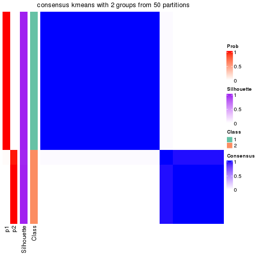</p>

</div>
<div id='tab-node-022-consensus-heatmap-2'>
<pre><code class="r">consensus_heatmap(res, k = 3)
</code></pre>

<p>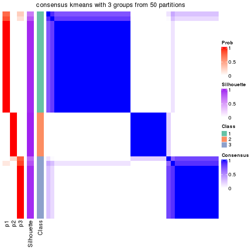</p>

</div>
<div id='tab-node-022-consensus-heatmap-3'>
<pre><code class="r">consensus_heatmap(res, k = 4)
</code></pre>

<p>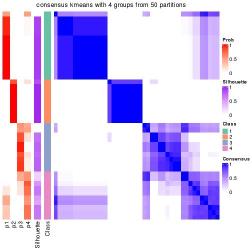</p>

</div>
<div id='tab-node-022-consensus-heatmap-4'>
<pre><code class="r">consensus_heatmap(res, k = 5)
</code></pre>

<p>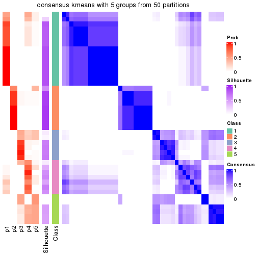</p>

</div>
<div id='tab-node-022-consensus-heatmap-5'>
<pre><code class="r">consensus_heatmap(res, k = 6)
</code></pre>

<p>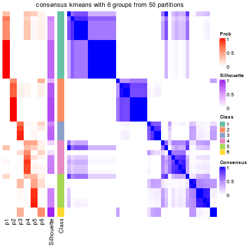</p>

</div>
<div id='tab-node-022-consensus-heatmap-6'>
<pre><code class="r">consensus_heatmap(res, k = 7)
</code></pre>

<p>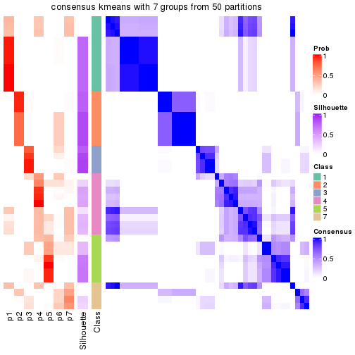</p>

</div>
<div id='tab-node-022-consensus-heatmap-7'>
<pre><code class="r">consensus_heatmap(res, k = 8)
</code></pre>

<p>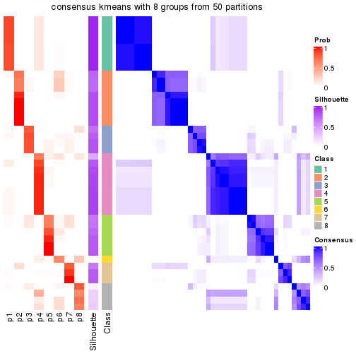</p>

</div>
</div>

Heatmaps for the membership of samples in all partitions to see how consistent they are:


<script>
$( function() {
	$( '#tabs-node-022-membership-heatmap' ).tabs();
} );
</script>
<div id='tabs-node-022-membership-heatmap'>
<ul>
<li><a href='#tab-node-022-membership-heatmap-1'>k = 2</a></li>
<li><a href='#tab-node-022-membership-heatmap-2'>k = 3</a></li>
<li><a href='#tab-node-022-membership-heatmap-3'>k = 4</a></li>
<li><a href='#tab-node-022-membership-heatmap-4'>k = 5</a></li>
<li><a href='#tab-node-022-membership-heatmap-5'>k = 6</a></li>
<li><a href='#tab-node-022-membership-heatmap-6'>k = 7</a></li>
<li><a href='#tab-node-022-membership-heatmap-7'>k = 8</a></li>
</ul>
<div id='tab-node-022-membership-heatmap-1'>
<pre><code class="r">membership_heatmap(res, k = 2)
</code></pre>

<p>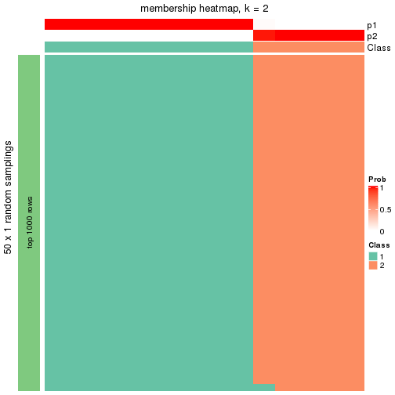</p>

</div>
<div id='tab-node-022-membership-heatmap-2'>
<pre><code class="r">membership_heatmap(res, k = 3)
</code></pre>

<p>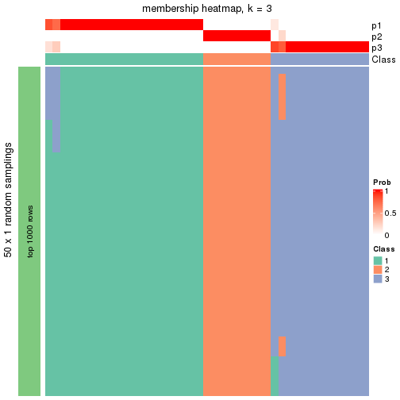</p>

</div>
<div id='tab-node-022-membership-heatmap-3'>
<pre><code class="r">membership_heatmap(res, k = 4)
</code></pre>

<p>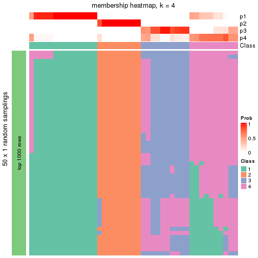</p>

</div>
<div id='tab-node-022-membership-heatmap-4'>
<pre><code class="r">membership_heatmap(res, k = 5)
</code></pre>

<p>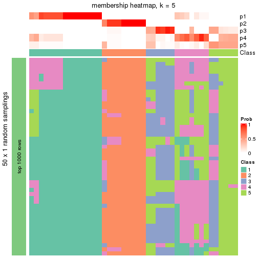</p>

</div>
<div id='tab-node-022-membership-heatmap-5'>
<pre><code class="r">membership_heatmap(res, k = 6)
</code></pre>

<p>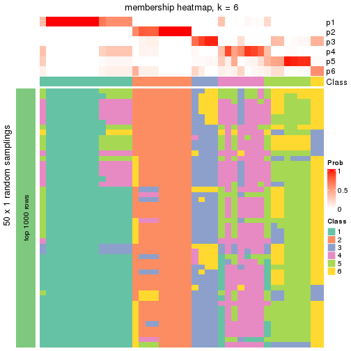</p>

</div>
<div id='tab-node-022-membership-heatmap-6'>
<pre><code class="r">membership_heatmap(res, k = 7)
</code></pre>

<p>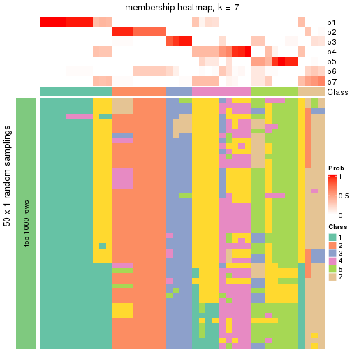</p>

</div>
<div id='tab-node-022-membership-heatmap-7'>
<pre><code class="r">membership_heatmap(res, k = 8)
</code></pre>

<p>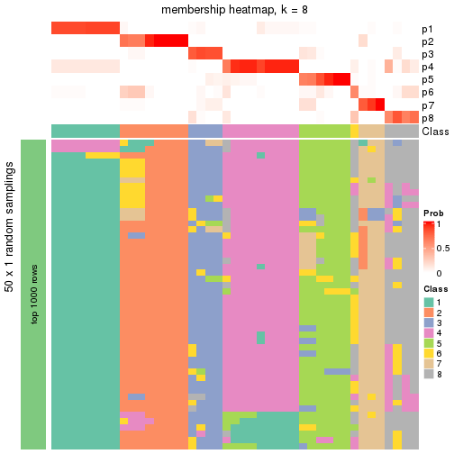</p>

</div>
</div>

As soon as the classes for columns are determined, the signatures
that are significantly different between subgroups can be looked for. 
Following are the heatmaps for signatures.


<script>
$( function() {
	$( '#tabs-node-022-get-signatures' ).tabs();
} );
</script>
<div id='tabs-node-022-get-signatures'>
<ul>
<li><a href='#tab-node-022-get-signatures-1'>k = 2</a></li>
<li><a href='#tab-node-022-get-signatures-2'>k = 3</a></li>
<li><a href='#tab-node-022-get-signatures-3'>k = 4</a></li>
<li><a href='#tab-node-022-get-signatures-4'>k = 5</a></li>
<li><a href='#tab-node-022-get-signatures-5'>k = 6</a></li>
<li><a href='#tab-node-022-get-signatures-6'>k = 7</a></li>
<li><a href='#tab-node-022-get-signatures-7'>k = 8</a></li>
</ul>
<div id='tab-node-022-get-signatures-1'>
<pre><code class="r">get_signatures(res, k = 2)
</code></pre>

<p>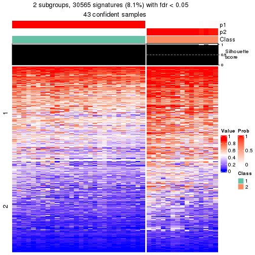</p>

</div>
<div id='tab-node-022-get-signatures-2'>
<pre><code class="r">get_signatures(res, k = 3)
</code></pre>

<p>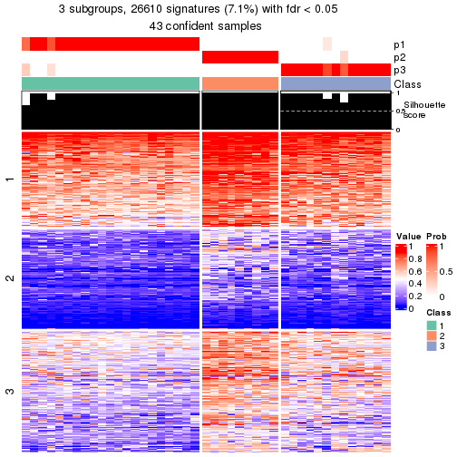</p>

</div>
<div id='tab-node-022-get-signatures-3'>
<pre><code class="r">get_signatures(res, k = 4)
</code></pre>

<p>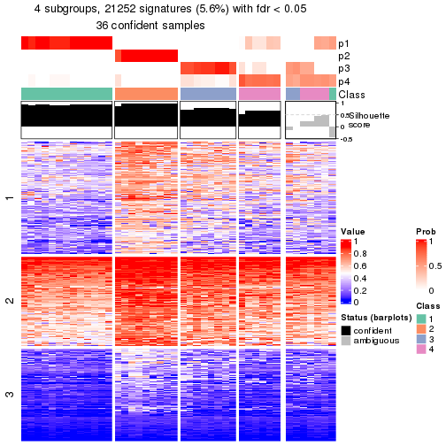</p>

</div>
<div id='tab-node-022-get-signatures-4'>
<pre><code class="r">get_signatures(res, k = 5)
</code></pre>

<p>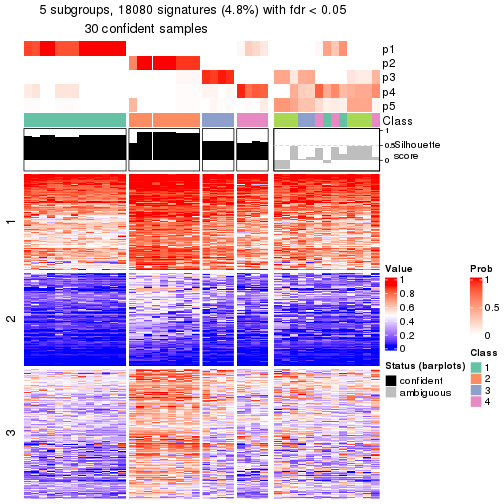</p>

</div>
<div id='tab-node-022-get-signatures-5'>
<pre><code class="r">get_signatures(res, k = 6)
</code></pre>

<p>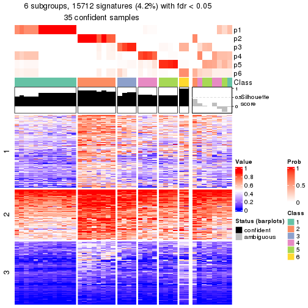</p>

</div>
<div id='tab-node-022-get-signatures-6'>
<pre><code class="r">get_signatures(res, k = 7)
</code></pre>

<p>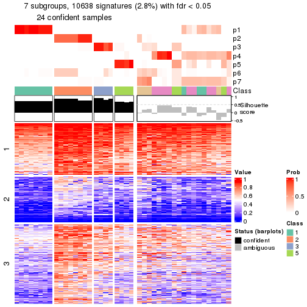</p>

</div>
<div id='tab-node-022-get-signatures-7'>
<pre><code class="r">get_signatures(res, k = 8)
</code></pre>

<p>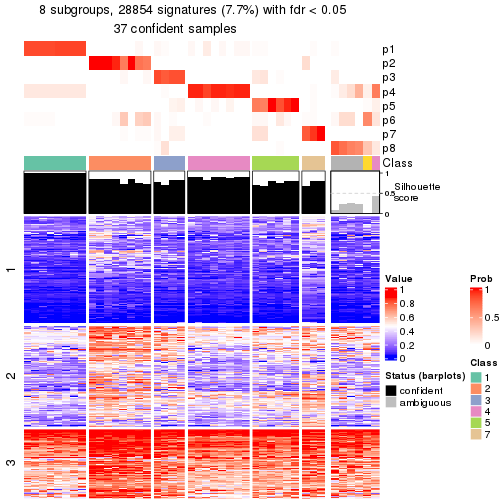</p>

</div>
</div>


Compare the overlap of signatures from different k:

```r
compare_signatures(res)
```

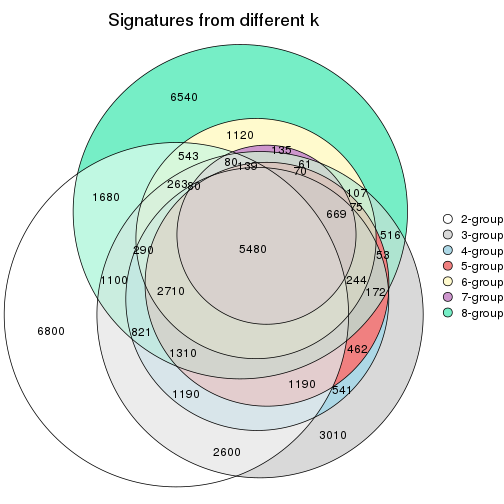

`get_signature()` returns a data frame invisibly. To get the list of signatures, the function
call should be assigned to a variable explicitly. In following code, if `plot` argument is set
to `FALSE`, no heatmap is plotted while only the differential analysis is performed.

```r
# code only for demonstration
tb = get_signature(res, k = ..., plot = FALSE)
```

An example of the output of `tb` is:

```
#>   which_row         fdr    mean_1    mean_2 scaled_mean_1 scaled_mean_2 km
#> 1        38 0.042760348  8.373488  9.131774    -0.5533452     0.5164555  1
#> 2        40 0.018707592  7.106213  8.469186    -0.6173731     0.5762149  1
#> 3        55 0.019134737 10.221463 11.207825    -0.6159697     0.5749050  1
#> 4        59 0.006059896  5.921854  7.869574    -0.6899429     0.6439467  1
#> 5        60 0.018055526  8.928898 10.211722    -0.6204761     0.5791110  1
#> 6        98 0.009384629 15.714769 14.887706     0.6635654    -0.6193277  2
...
```

The columns in `tb` are:

1. `which_row`: row indices corresponding to the input matrix.
2. `fdr`: FDR for the differential test. 
3. `mean_x`: The mean value in group x.
4. `scaled_mean_x`: The mean value in group x after rows are scaled.
5. `km`: Row groups if k-means clustering is applied to rows (which is done by automatically selecting number of clusters).

If there are too many signatures, `top_signatures = ...` can be set to only show the 
signatures with the highest FDRs:

```r
# code only for demonstration
# e.g. to show the top 500 most significant rows
tb = get_signature(res, k = ..., top_signatures = 500)
```

If the signatures are defined as these which are uniquely high in current group, `diff_method` argument
can be set to `"uniquely_high_in_one_group"`:

```r
# code only for demonstration
tb = get_signature(res, k = ..., diff_method = "uniquely_high_in_one_group")
```


UMAP plot which shows how samples are separated.


<script>
$( function() {
	$( '#tabs-node-022-dimension-reduction' ).tabs();
} );
</script>
<div id='tabs-node-022-dimension-reduction'>
<ul>
<li><a href='#tab-node-022-dimension-reduction-1'>k = 2</a></li>
<li><a href='#tab-node-022-dimension-reduction-2'>k = 3</a></li>
<li><a href='#tab-node-022-dimension-reduction-3'>k = 4</a></li>
<li><a href='#tab-node-022-dimension-reduction-4'>k = 5</a></li>
<li><a href='#tab-node-022-dimension-reduction-5'>k = 6</a></li>
<li><a href='#tab-node-022-dimension-reduction-6'>k = 7</a></li>
<li><a href='#tab-node-022-dimension-reduction-7'>k = 8</a></li>
</ul>
<div id='tab-node-022-dimension-reduction-1'>
<pre><code class="r">dimension_reduction(res, k = 2, method = &quot;UMAP&quot;)
</code></pre>

<p>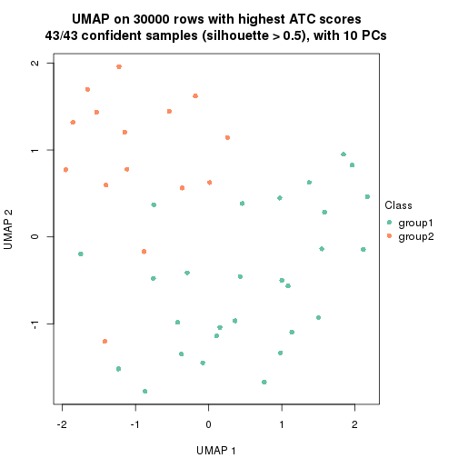</p>

</div>
<div id='tab-node-022-dimension-reduction-2'>
<pre><code class="r">dimension_reduction(res, k = 3, method = &quot;UMAP&quot;)
</code></pre>

<p>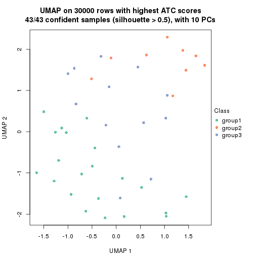</p>

</div>
<div id='tab-node-022-dimension-reduction-3'>
<pre><code class="r">dimension_reduction(res, k = 4, method = &quot;UMAP&quot;)
</code></pre>

<p>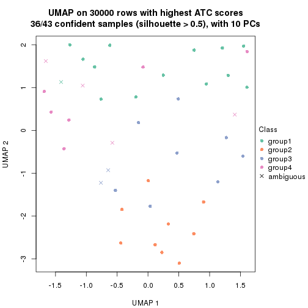</p>

</div>
<div id='tab-node-022-dimension-reduction-4'>
<pre><code class="r">dimension_reduction(res, k = 5, method = &quot;UMAP&quot;)
</code></pre>

<p>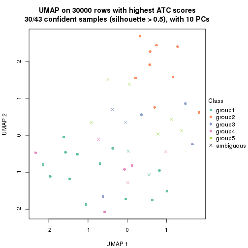</p>

</div>
<div id='tab-node-022-dimension-reduction-5'>
<pre><code class="r">dimension_reduction(res, k = 6, method = &quot;UMAP&quot;)
</code></pre>

<p>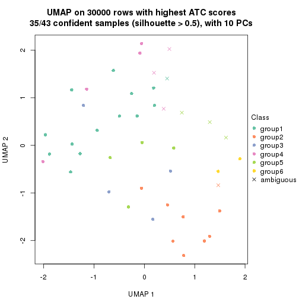</p>

</div>
<div id='tab-node-022-dimension-reduction-6'>
<pre><code class="r">dimension_reduction(res, k = 7, method = &quot;UMAP&quot;)
</code></pre>

<p>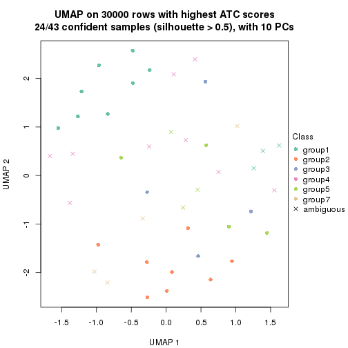</p>

</div>
<div id='tab-node-022-dimension-reduction-7'>
<pre><code class="r">dimension_reduction(res, k = 8, method = &quot;UMAP&quot;)
</code></pre>

<p>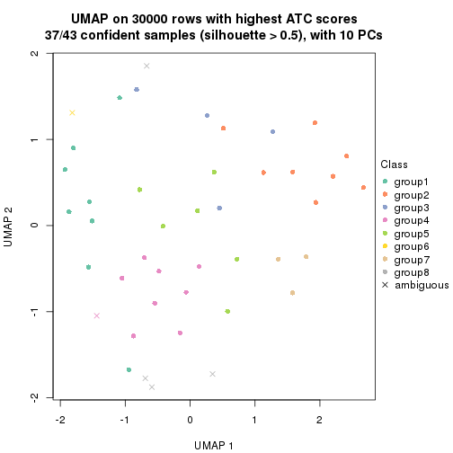</p>

</div>
</div>


Following heatmap shows how subgroups are split when increasing `k`:

```r
collect_classes(res)
```

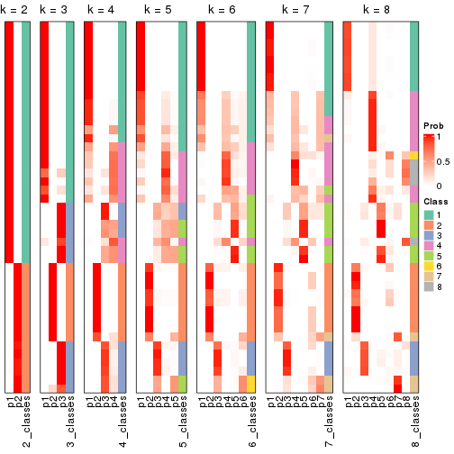


If matrix rows can be associated to genes, consider to use `functional_enrichment(res,
...)` to perform function enrichment for the signature genes. See [this vignette](https://jokergoo.github.io/cola_vignettes/functional_enrichment.html) for more detailed explanations.


 

---------------------------------------------------


### Node0221


Parent node: [Node022](#Node022).
Child nodes: 
                Node02121-leaf
        ,
                Node02122-leaf
        ,
                Node02123-leaf
        ,
                Node02211-leaf
        ,
                Node02212-leaf
        ,
                Node02213-leaf
        ,
                Node02214-leaf
        ,
                Node02311-leaf
        ,
                Node02312-leaf
        ,
                Node02313-leaf
        ,
                Node05121-leaf
        ,
                Node05122-leaf
        ,
                Node05123-leaf
        .


The object with results only for a single top-value method and a single partitioning method 
can be extracted as:

```r
res = res_rh["0221"]
```

A summary of `res` and all the functions that can be applied to it:

```r
res
```

```
#> A 'ConsensusPartition' object with k = 2, 3, 4, 5, 6, 7, 8.
#>   On a matrix with 30000 rows and 21 columns.
#>   Top rows (1000) are extracted by 'ATC' method.
#>   Subgroups are detected by 'skmeans' method.
#>   Performed in total 350 partitions by row resampling.
#>   Best k for subgroups seems to be 3.
#> 
#> Following methods can be applied to this 'ConsensusPartition' object:
#>  [1] "cola_report"             "collect_classes"         "collect_plots"          
#>  [4] "collect_stats"           "colnames"                "compare_partitions"     
#>  [7] "compare_signatures"      "consensus_heatmap"       "dimension_reduction"    
#> [10] "functional_enrichment"   "get_anno_col"            "get_anno"               
#> [13] "get_classes"             "get_consensus"           "get_matrix"             
#> [16] "get_membership"          "get_param"               "get_signatures"         
#> [19] "get_stats"               "is_best_k"               "is_stable_k"            
#> [22] "membership_heatmap"      "ncol"                    "nrow"                   
#> [25] "plot_ecdf"               "predict_classes"         "rownames"               
#> [28] "select_partition_number" "show"                    "suggest_best_k"         
#> [31] "test_to_known_factors"   "top_rows_heatmap"
```

`collect_plots()` function collects all the plots made from `res` for all `k` (number of subgroups)
into one single page to provide an easy and fast comparison between different `k`.

```r
collect_plots(res)
```

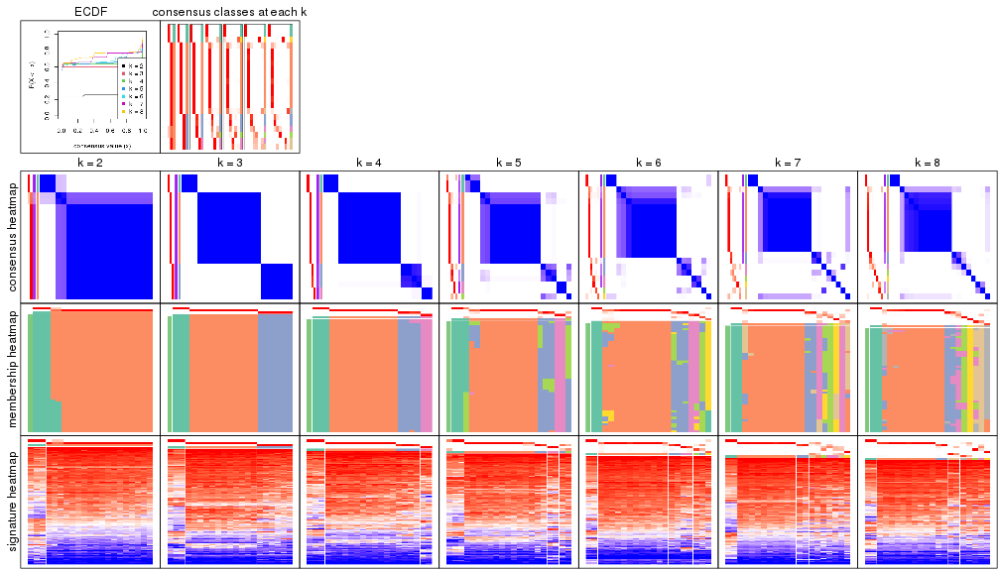

The plots are:

- The first row: a plot of the eCDF (empirical cumulative distribution
  function) curves of the consensus matrix for each `k` and the heatmap of
  predicted classes for each `k`.
- The second row: heatmaps of the consensus matrix for each `k`.
- The third row: heatmaps of the membership matrix for each `k`.
- The fouth row: heatmaps of the signatures for each `k`.

All the plots in panels can be made by individual functions and they are
plotted later in this section.

`select_partition_number()` produces several plots showing different
statistics for choosing "optimized" `k`. There are following statistics:

- eCDF curves of the consensus matrix for each `k`;
- 1-PAC. [The PAC score](https://en.wikipedia.org/wiki/Consensus_clustering#Over-interpretation_potential_of_consensus_clustering)
  measures the proportion of the ambiguous subgrouping.
- Mean silhouette score.
- Concordance. The mean probability of fiting the consensus subgroup labels in all
  partitions.
- Area increased. Denote $A_k$ as the area under the eCDF curve for current
  `k`, the area increased is defined as $A_k - A_{k-1}$.
- Rand index. The percent of pairs of samples that are both in a same cluster
  or both are not in a same cluster in the partition of k and k-1.
- Jaccard index. The ratio of pairs of samples are both in a same cluster in
  the partition of k and k-1 and the pairs of samples are both in a same
  cluster in the partition k or k-1.

The detailed explanations of these statistics can be found in [the _cola_
vignette](https://jokergoo.github.io/cola_vignettes/cola.html#toc_13).

Generally speaking, higher 1-PAC score, higher mean silhouette score or higher
concordance corresponds to better partition. Rand index and Jaccard index
measure how similar the current partition is compared to partition with `k-1`.
If they are too similar, we won't accept `k` is better than `k-1`.

```r
select_partition_number(res)
```

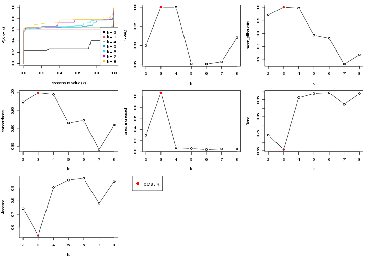

The numeric values for all these statistics can be obtained by `get_stats()`.

```r
get_stats(res)
```

```
#>   k 1-PAC mean_silhouette concordance area_increased  Rand Jaccard
#> 2 2 0.900           0.942       0.974         0.2913 0.743   0.743
#> 3 3 1.000           1.000       1.000         1.0610 0.657   0.538
#> 4 4 1.000           0.993       0.995         0.0620 0.962   0.905
#> 5 5 0.853           0.786       0.915         0.0492 0.986   0.961
#> 6 6 0.852           0.763       0.923         0.0301 0.990   0.973
#> 7 7 0.858           0.568       0.841         0.0411 0.924   0.781
#> 8 8 0.921           0.639       0.910         0.0401 0.986   0.950
```

`suggest_best_k()` suggests the best $k$ based on these statistics. The rules are as follows:

- All $k$ with Jaccard index larger than 0.95 are removed because increasing
  $k$ does not provide enough extra information. If all $k$ are removed, it is
  marked as no subgroup is detected.
- For all $k$ with 1-PAC score larger than 0.9, the maximal $k$ is taken as
  the best $k$, and other $k$ are marked as optional $k$.
- If it does not fit the second rule. The $k$ with the maximal vote of the
  highest 1-PAC score, highest mean silhouette, and highest concordance is
  taken as the best $k$.

```r
suggest_best_k(res)
```

```
#> [1] 3
#> attr(,"optional")
#> [1] 2
```

There is also optional best $k$ = 2 that is worth to check.

Following is the table of the partitions (You need to click the **show/hide
code output** link to see it). The membership matrix (columns with name `p*`)
is inferred by
[`clue::cl_consensus()`](https://www.rdocumentation.org/link/cl_consensus?package=clue)
function with the `SE` method. Basically the value in the membership matrix
represents the probability to belong to a certain group. The finall subgroup
label for an item is determined with the group with highest probability it
belongs to.

In `get_classes()` function, the entropy is calculated from the membership
matrix and the silhouette score is calculated from the consensus matrix.


<script>
$( function() {
	$( '#tabs-node-0221-get-classes' ).tabs();
} );
</script>
<div id='tabs-node-0221-get-classes'>
<ul>
<li><a href='#tab-node-0221-get-classes-1'>k = 2</a></li>
<li><a href='#tab-node-0221-get-classes-2'>k = 3</a></li>
<li><a href='#tab-node-0221-get-classes-3'>k = 4</a></li>
<li><a href='#tab-node-0221-get-classes-4'>k = 5</a></li>
<li><a href='#tab-node-0221-get-classes-5'>k = 6</a></li>
<li><a href='#tab-node-0221-get-classes-6'>k = 7</a></li>
<li><a href='#tab-node-0221-get-classes-7'>k = 8</a></li>
</ul>

<div id='tab-node-0221-get-classes-1'>
<p><a id='tab-node-0221-get-classes-1-a' style='color:#0366d6' href='#'>show/hide code output</a></p>
<pre><code class="r">cbind(get_classes(res, k = 2), get_membership(res, k = 2))
</code></pre>

<pre><code>#&gt;                 class entropy silhouette   p1   p2
#&gt; TCGA.XK.AAJA.01     2   0.000      0.967 0.00 1.00
#&gt; TCGA.KK.A6E8.01     2   0.855      0.635 0.28 0.72
#&gt; TCGA.V1.A9OQ.01     2   0.000      0.967 0.00 1.00
#&gt; TCGA.VN.A88R.01     2   0.000      0.967 0.00 1.00
#&gt; TCGA.Y6.A9XI.01     2   0.000      0.967 0.00 1.00
#&gt; TCGA.CH.5737.01     2   0.000      0.967 0.00 1.00
#&gt; TCGA.CH.5767.01     2   0.000      0.967 0.00 1.00
#&gt; TCGA.J4.AATZ.01     2   0.000      0.967 0.00 1.00
#&gt; TCGA.KK.A8IK.01     1   0.000      1.000 1.00 0.00
#&gt; TCGA.FC.A4JI.01     1   0.000      1.000 1.00 0.00
#&gt; TCGA.KC.A7F5.01     2   0.827      0.667 0.26 0.74
#&gt; TCGA.XK.AAK1.01     2   0.000      0.967 0.00 1.00
#&gt; TCGA.FC.A6HD.01     2   0.000      0.967 0.00 1.00
#&gt; TCGA.QU.A6IL.01     2   0.000      0.967 0.00 1.00
#&gt; TCGA.J4.A83J.01     2   0.000      0.967 0.00 1.00
#&gt; TCGA.XJ.A83G.01     2   0.000      0.967 0.00 1.00
#&gt; TCGA.G9.6496.01     2   0.000      0.967 0.00 1.00
#&gt; TCGA.EJ.A65J.01     1   0.000      1.000 1.00 0.00
#&gt; TCGA.HC.7738.01     2   0.000      0.967 0.00 1.00
#&gt; TCGA.EJ.7123.01     2   0.000      0.967 0.00 1.00
#&gt; TCGA.2A.A8W1.01     2   0.000      0.967 0.00 1.00
</code></pre>

<script>
$('#tab-node-0221-get-classes-1-a').parent().next().next().hide();
$('#tab-node-0221-get-classes-1-a').click(function(){
  $('#tab-node-0221-get-classes-1-a').parent().next().next().toggle();
  return(false);
});
</script>
</div>

<div id='tab-node-0221-get-classes-2'>
<p><a id='tab-node-0221-get-classes-2-a' style='color:#0366d6' href='#'>show/hide code output</a></p>
<pre><code class="r">cbind(get_classes(res, k = 3), get_membership(res, k = 3))
</code></pre>

<pre><code>#&gt;                 class entropy silhouette p1 p2 p3
#&gt; TCGA.XK.AAJA.01     2       0          1  0  1  0
#&gt; TCGA.KK.A6E8.01     3       0          1  0  0  1
#&gt; TCGA.V1.A9OQ.01     2       0          1  0  1  0
#&gt; TCGA.VN.A88R.01     2       0          1  0  1  0
#&gt; TCGA.Y6.A9XI.01     3       0          1  0  0  1
#&gt; TCGA.CH.5737.01     2       0          1  0  1  0
#&gt; TCGA.CH.5767.01     2       0          1  0  1  0
#&gt; TCGA.J4.AATZ.01     3       0          1  0  0  1
#&gt; TCGA.KK.A8IK.01     1       0          1  1  0  0
#&gt; TCGA.FC.A4JI.01     1       0          1  1  0  0
#&gt; TCGA.KC.A7F5.01     3       0          1  0  0  1
#&gt; TCGA.XK.AAK1.01     2       0          1  0  1  0
#&gt; TCGA.FC.A6HD.01     2       0          1  0  1  0
#&gt; TCGA.QU.A6IL.01     3       0          1  0  0  1
#&gt; TCGA.J4.A83J.01     2       0          1  0  1  0
#&gt; TCGA.XJ.A83G.01     2       0          1  0  1  0
#&gt; TCGA.G9.6496.01     2       0          1  0  1  0
#&gt; TCGA.EJ.A65J.01     1       0          1  1  0  0
#&gt; TCGA.HC.7738.01     3       0          1  0  0  1
#&gt; TCGA.EJ.7123.01     2       0          1  0  1  0
#&gt; TCGA.2A.A8W1.01     2       0          1  0  1  0
</code></pre>

<script>
$('#tab-node-0221-get-classes-2-a').parent().next().next().hide();
$('#tab-node-0221-get-classes-2-a').click(function(){
  $('#tab-node-0221-get-classes-2-a').parent().next().next().toggle();
  return(false);
});
</script>
</div>

<div id='tab-node-0221-get-classes-3'>
<p><a id='tab-node-0221-get-classes-3-a' style='color:#0366d6' href='#'>show/hide code output</a></p>
<pre><code class="r">cbind(get_classes(res, k = 4), get_membership(res, k = 4))
</code></pre>

<pre><code>#&gt;                 class entropy silhouette p1   p2   p3   p4
#&gt; TCGA.XK.AAJA.01     2   0.000      1.000  0 1.00 0.00 0.00
#&gt; TCGA.KK.A6E8.01     3   0.000      0.967  0 0.00 1.00 0.00
#&gt; TCGA.V1.A9OQ.01     2   0.000      1.000  0 1.00 0.00 0.00
#&gt; TCGA.VN.A88R.01     2   0.000      1.000  0 1.00 0.00 0.00
#&gt; TCGA.Y6.A9XI.01     4   0.000      1.000  0 0.00 0.00 1.00
#&gt; TCGA.CH.5737.01     2   0.000      1.000  0 1.00 0.00 0.00
#&gt; TCGA.CH.5767.01     2   0.000      1.000  0 1.00 0.00 0.00
#&gt; TCGA.J4.AATZ.01     4   0.000      1.000  0 0.00 0.00 1.00
#&gt; TCGA.KK.A8IK.01     1   0.000      1.000  1 0.00 0.00 0.00
#&gt; TCGA.FC.A4JI.01     1   0.000      1.000  1 0.00 0.00 0.00
#&gt; TCGA.KC.A7F5.01     3   0.000      0.967  0 0.00 1.00 0.00
#&gt; TCGA.XK.AAK1.01     2   0.000      1.000  0 1.00 0.00 0.00
#&gt; TCGA.FC.A6HD.01     2   0.000      1.000  0 1.00 0.00 0.00
#&gt; TCGA.QU.A6IL.01     3   0.121      0.961  0 0.00 0.96 0.04
#&gt; TCGA.J4.A83J.01     2   0.000      1.000  0 1.00 0.00 0.00
#&gt; TCGA.XJ.A83G.01     2   0.000      1.000  0 1.00 0.00 0.00
#&gt; TCGA.G9.6496.01     2   0.000      1.000  0 1.00 0.00 0.00
#&gt; TCGA.EJ.A65J.01     1   0.000      1.000  1 0.00 0.00 0.00
#&gt; TCGA.HC.7738.01     3   0.191      0.949  0 0.02 0.94 0.04
#&gt; TCGA.EJ.7123.01     2   0.000      1.000  0 1.00 0.00 0.00
#&gt; TCGA.2A.A8W1.01     2   0.000      1.000  0 1.00 0.00 0.00
</code></pre>

<script>
$('#tab-node-0221-get-classes-3-a').parent().next().next().hide();
$('#tab-node-0221-get-classes-3-a').click(function(){
  $('#tab-node-0221-get-classes-3-a').parent().next().next().toggle();
  return(false);
});
</script>
</div>

<div id='tab-node-0221-get-classes-4'>
<p><a id='tab-node-0221-get-classes-4-a' style='color:#0366d6' href='#'>show/hide code output</a></p>
<pre><code class="r">cbind(get_classes(res, k = 5), get_membership(res, k = 5))
</code></pre>

<pre><code>#&gt;                 class entropy silhouette   p1   p2   p3   p4   p5
#&gt; TCGA.XK.AAJA.01     2   0.410      0.732 0.00 0.76 0.20 0.00 0.04
#&gt; TCGA.KK.A6E8.01     3   0.380     -0.190 0.00 0.00 0.70 0.00 0.30
#&gt; TCGA.V1.A9OQ.01     2   0.000      0.960 0.00 1.00 0.00 0.00 0.00
#&gt; TCGA.VN.A88R.01     2   0.000      0.960 0.00 1.00 0.00 0.00 0.00
#&gt; TCGA.Y6.A9XI.01     4   0.000      1.000 0.00 0.00 0.00 1.00 0.00
#&gt; TCGA.CH.5737.01     2   0.000      0.960 0.00 1.00 0.00 0.00 0.00
#&gt; TCGA.CH.5767.01     2   0.000      0.960 0.00 1.00 0.00 0.00 0.00
#&gt; TCGA.J4.AATZ.01     4   0.000      1.000 0.00 0.00 0.00 1.00 0.00
#&gt; TCGA.KK.A8IK.01     1   0.000      0.848 1.00 0.00 0.00 0.00 0.00
#&gt; TCGA.FC.A4JI.01     1   0.000      0.848 1.00 0.00 0.00 0.00 0.00
#&gt; TCGA.KC.A7F5.01     5   0.423      0.000 0.00 0.00 0.42 0.00 0.58
#&gt; TCGA.XK.AAK1.01     2   0.000      0.960 0.00 1.00 0.00 0.00 0.00
#&gt; TCGA.FC.A6HD.01     2   0.000      0.960 0.00 1.00 0.00 0.00 0.00
#&gt; TCGA.QU.A6IL.01     3   0.000      0.616 0.00 0.00 1.00 0.00 0.00
#&gt; TCGA.J4.A83J.01     2   0.000      0.960 0.00 1.00 0.00 0.00 0.00
#&gt; TCGA.XJ.A83G.01     2   0.000      0.960 0.00 1.00 0.00 0.00 0.00
#&gt; TCGA.G9.6496.01     2   0.000      0.960 0.00 1.00 0.00 0.00 0.00
#&gt; TCGA.EJ.A65J.01     1   0.406      0.673 0.64 0.00 0.00 0.00 0.36
#&gt; TCGA.HC.7738.01     3   0.165      0.596 0.00 0.02 0.94 0.00 0.04
#&gt; TCGA.EJ.7123.01     2   0.000      0.960 0.00 1.00 0.00 0.00 0.00
#&gt; TCGA.2A.A8W1.01     2   0.411      0.785 0.00 0.80 0.14 0.02 0.04
</code></pre>

<script>
$('#tab-node-0221-get-classes-4-a').parent().next().next().hide();
$('#tab-node-0221-get-classes-4-a').click(function(){
  $('#tab-node-0221-get-classes-4-a').parent().next().next().toggle();
  return(false);
});
</script>
</div>

<div id='tab-node-0221-get-classes-5'>
<p><a id='tab-node-0221-get-classes-5-a' style='color:#0366d6' href='#'>show/hide code output</a></p>
<pre><code class="r">cbind(get_classes(res, k = 6), get_membership(res, k = 6))
</code></pre>

<pre><code>#&gt;                 class entropy silhouette  p1   p2   p3   p4   p5   p6
#&gt; TCGA.XK.AAJA.01     2   0.511      0.600 0.0 0.66 0.22 0.00 0.02 0.10
#&gt; TCGA.KK.A6E8.01     3   0.458      0.172 0.0 0.00 0.56 0.00 0.40 0.04
#&gt; TCGA.V1.A9OQ.01     2   0.000      0.944 0.0 1.00 0.00 0.00 0.00 0.00
#&gt; TCGA.VN.A88R.01     2   0.000      0.944 0.0 1.00 0.00 0.00 0.00 0.00
#&gt; TCGA.Y6.A9XI.01     4   0.279      0.882 0.0 0.00 0.00 0.86 0.06 0.08
#&gt; TCGA.CH.5737.01     2   0.000      0.944 0.0 1.00 0.00 0.00 0.00 0.00
#&gt; TCGA.CH.5767.01     2   0.000      0.944 0.0 1.00 0.00 0.00 0.00 0.00
#&gt; TCGA.J4.AATZ.01     4   0.000      0.882 0.0 0.00 0.00 1.00 0.00 0.00
#&gt; TCGA.KK.A8IK.01     1   0.000      1.000 1.0 0.00 0.00 0.00 0.00 0.00
#&gt; TCGA.FC.A4JI.01     1   0.000      1.000 1.0 0.00 0.00 0.00 0.00 0.00
#&gt; TCGA.KC.A7F5.01     5   0.205      0.000 0.0 0.00 0.12 0.00 0.88 0.00
#&gt; TCGA.XK.AAK1.01     2   0.000      0.944 0.0 1.00 0.00 0.00 0.00 0.00
#&gt; TCGA.FC.A6HD.01     2   0.109      0.919 0.0 0.96 0.00 0.00 0.02 0.02
#&gt; TCGA.QU.A6IL.01     3   0.156      0.680 0.0 0.00 0.92 0.00 0.08 0.00
#&gt; TCGA.J4.A83J.01     2   0.000      0.944 0.0 1.00 0.00 0.00 0.00 0.00
#&gt; TCGA.XJ.A83G.01     2   0.000      0.944 0.0 1.00 0.00 0.00 0.00 0.00
#&gt; TCGA.G9.6496.01     2   0.000      0.944 0.0 1.00 0.00 0.00 0.00 0.00
#&gt; TCGA.EJ.A65J.01     6   0.331      0.000 0.2 0.00 0.02 0.00 0.00 0.78
#&gt; TCGA.HC.7738.01     3   0.000      0.670 0.0 0.00 1.00 0.00 0.00 0.00
#&gt; TCGA.EJ.7123.01     2   0.000      0.944 0.0 1.00 0.00 0.00 0.00 0.00
#&gt; TCGA.2A.A8W1.01     2   0.509      0.718 0.0 0.74 0.08 0.04 0.04 0.10
</code></pre>

<script>
$('#tab-node-0221-get-classes-5-a').parent().next().next().hide();
$('#tab-node-0221-get-classes-5-a').click(function(){
  $('#tab-node-0221-get-classes-5-a').parent().next().next().toggle();
  return(false);
});
</script>
</div>

<div id='tab-node-0221-get-classes-6'>
<p><a id='tab-node-0221-get-classes-6-a' style='color:#0366d6' href='#'>show/hide code output</a></p>
<pre><code class="r">cbind(get_classes(res, k = 7), get_membership(res, k = 7))
</code></pre>

<pre><code>#&gt;                 class entropy silhouette p1   p2   p3   p4   p5   p6   p7
#&gt; TCGA.XK.AAJA.01     2  0.5055     0.1221  0 0.56 0.18 0.00 0.00 0.00 0.26
#&gt; TCGA.KK.A6E8.01     4  0.3815    -0.4212  0 0.00 0.36 0.62 0.00 0.02 0.00
#&gt; TCGA.V1.A9OQ.01     2  0.0000     0.9439  0 1.00 0.00 0.00 0.00 0.00 0.00
#&gt; TCGA.VN.A88R.01     2  0.0504     0.9252  0 0.98 0.00 0.00 0.00 0.00 0.02
#&gt; TCGA.Y6.A9XI.01     7  0.5589    -0.5424  0 0.00 0.00 0.28 0.32 0.00 0.40
#&gt; TCGA.CH.5737.01     2  0.0000     0.9439  0 1.00 0.00 0.00 0.00 0.00 0.00
#&gt; TCGA.CH.5767.01     2  0.0000     0.9439  0 1.00 0.00 0.00 0.00 0.00 0.00
#&gt; TCGA.J4.AATZ.01     4  0.5612    -0.3541  0 0.00 0.00 0.36 0.36 0.00 0.28
#&gt; TCGA.KK.A8IK.01     1  0.0000     1.0000  1 0.00 0.00 0.00 0.00 0.00 0.00
#&gt; TCGA.FC.A4JI.01     1  0.0000     1.0000  1 0.00 0.00 0.00 0.00 0.00 0.00
#&gt; TCGA.KC.A7F5.01     5  0.3358     0.0000  0 0.00 0.00 0.36 0.64 0.00 0.00
#&gt; TCGA.XK.AAK1.01     2  0.0000     0.9439  0 1.00 0.00 0.00 0.00 0.00 0.00
#&gt; TCGA.FC.A6HD.01     2  0.0000     0.9439  0 1.00 0.00 0.00 0.00 0.00 0.00
#&gt; TCGA.QU.A6IL.01     3  0.1664     0.8929  0 0.00 0.92 0.06 0.02 0.00 0.00
#&gt; TCGA.J4.A83J.01     2  0.0000     0.9439  0 1.00 0.00 0.00 0.00 0.00 0.00
#&gt; TCGA.XJ.A83G.01     2  0.0000     0.9439  0 1.00 0.00 0.00 0.00 0.00 0.00
#&gt; TCGA.G9.6496.01     2  0.0000     0.9439  0 1.00 0.00 0.00 0.00 0.00 0.00
#&gt; TCGA.EJ.A65J.01     6  0.0000     0.0000  0 0.00 0.00 0.00 0.00 1.00 0.00
#&gt; TCGA.HC.7738.01     3  0.0504     0.8939  0 0.02 0.98 0.00 0.00 0.00 0.00
#&gt; TCGA.EJ.7123.01     2  0.0000     0.9439  0 1.00 0.00 0.00 0.00 0.00 0.00
#&gt; TCGA.2A.A8W1.01     7  0.4175    -0.0939  0 0.38 0.04 0.00 0.00 0.00 0.58
</code></pre>

<script>
$('#tab-node-0221-get-classes-6-a').parent().next().next().hide();
$('#tab-node-0221-get-classes-6-a').click(function(){
  $('#tab-node-0221-get-classes-6-a').parent().next().next().toggle();
  return(false);
});
</script>
</div>

<div id='tab-node-0221-get-classes-7'>
<p><a id='tab-node-0221-get-classes-7-a' style='color:#0366d6' href='#'>show/hide code output</a></p>
<pre><code class="r">cbind(get_classes(res, k = 8), get_membership(res, k = 8))
</code></pre>

<pre><code>#&gt;                 class entropy silhouette p1   p2   p3   p4   p5 p6   p7   p8
#&gt; TCGA.XK.AAJA.01     2  0.5455     -0.358  0 0.40 0.20 0.02 0.00  0 0.00 0.38
#&gt; TCGA.KK.A6E8.01     4  0.4669      0.000  0 0.00 0.22 0.58 0.20  0 0.00 0.00
#&gt; TCGA.V1.A9OQ.01     2  0.0000      0.918  0 1.00 0.00 0.00 0.00  0 0.00 0.00
#&gt; TCGA.VN.A88R.01     2  0.0000      0.918  0 1.00 0.00 0.00 0.00  0 0.00 0.00
#&gt; TCGA.Y6.A9XI.01     7  0.4302      0.570  0 0.00 0.00 0.36 0.00  0 0.56 0.08
#&gt; TCGA.CH.5737.01     2  0.0471      0.908  0 0.98 0.00 0.02 0.00  0 0.00 0.00
#&gt; TCGA.CH.5767.01     2  0.0000      0.918  0 1.00 0.00 0.00 0.00  0 0.00 0.00
#&gt; TCGA.J4.AATZ.01     7  0.0471      0.570  0 0.00 0.00 0.00 0.00  0 0.98 0.02
#&gt; TCGA.KK.A8IK.01     1  0.0000      1.000  1 0.00 0.00 0.00 0.00  0 0.00 0.00
#&gt; TCGA.FC.A4JI.01     1  0.0000      1.000  1 0.00 0.00 0.00 0.00  0 0.00 0.00
#&gt; TCGA.KC.A7F5.01     5  0.0000      0.000  0 0.00 0.00 0.00 1.00  0 0.00 0.00
#&gt; TCGA.XK.AAK1.01     2  0.0000      0.918  0 1.00 0.00 0.00 0.00  0 0.00 0.00
#&gt; TCGA.FC.A6HD.01     2  0.1275      0.877  0 0.94 0.00 0.02 0.00  0 0.00 0.04
#&gt; TCGA.QU.A6IL.01     3  0.3002      0.752  0 0.00 0.82 0.12 0.02  0 0.00 0.04
#&gt; TCGA.J4.A83J.01     2  0.0000      0.918  0 1.00 0.00 0.00 0.00  0 0.00 0.00
#&gt; TCGA.XJ.A83G.01     2  0.0000      0.918  0 1.00 0.00 0.00 0.00  0 0.00 0.00
#&gt; TCGA.G9.6496.01     2  0.0941      0.896  0 0.96 0.00 0.02 0.00  0 0.00 0.02
#&gt; TCGA.EJ.A65J.01     6  0.0000      0.000  0 0.00 0.00 0.00 0.00  1 0.00 0.00
#&gt; TCGA.HC.7738.01     3  0.0000      0.769  0 0.00 1.00 0.00 0.00  0 0.00 0.00
#&gt; TCGA.EJ.7123.01     2  0.0000      0.918  0 1.00 0.00 0.00 0.00  0 0.00 0.00
#&gt; TCGA.2A.A8W1.01     8  0.1765      0.000  0 0.12 0.00 0.00 0.00  0 0.00 0.88
</code></pre>

<script>
$('#tab-node-0221-get-classes-7-a').parent().next().next().hide();
$('#tab-node-0221-get-classes-7-a').click(function(){
  $('#tab-node-0221-get-classes-7-a').parent().next().next().toggle();
  return(false);
});
</script>
</div>
</div>

Heatmaps for the consensus matrix. It visualizes the probability of two
samples to be in a same group.


<script>
$( function() {
	$( '#tabs-node-0221-consensus-heatmap' ).tabs();
} );
</script>
<div id='tabs-node-0221-consensus-heatmap'>
<ul>
<li><a href='#tab-node-0221-consensus-heatmap-1'>k = 2</a></li>
<li><a href='#tab-node-0221-consensus-heatmap-2'>k = 3</a></li>
<li><a href='#tab-node-0221-consensus-heatmap-3'>k = 4</a></li>
<li><a href='#tab-node-0221-consensus-heatmap-4'>k = 5</a></li>
<li><a href='#tab-node-0221-consensus-heatmap-5'>k = 6</a></li>
<li><a href='#tab-node-0221-consensus-heatmap-6'>k = 7</a></li>
<li><a href='#tab-node-0221-consensus-heatmap-7'>k = 8</a></li>
</ul>
<div id='tab-node-0221-consensus-heatmap-1'>
<pre><code class="r">consensus_heatmap(res, k = 2)
</code></pre>

<p>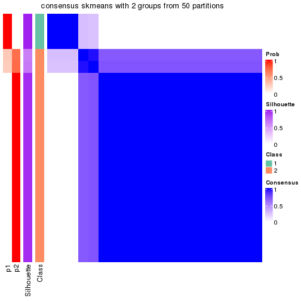</p>

</div>
<div id='tab-node-0221-consensus-heatmap-2'>
<pre><code class="r">consensus_heatmap(res, k = 3)
</code></pre>

<p>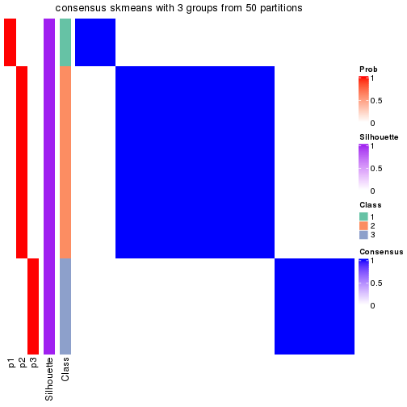</p>

</div>
<div id='tab-node-0221-consensus-heatmap-3'>
<pre><code class="r">consensus_heatmap(res, k = 4)
</code></pre>

<p>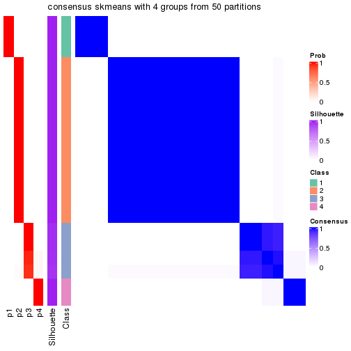</p>

</div>
<div id='tab-node-0221-consensus-heatmap-4'>
<pre><code class="r">consensus_heatmap(res, k = 5)
</code></pre>

<p>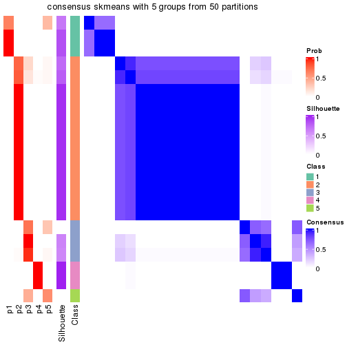</p>

</div>
<div id='tab-node-0221-consensus-heatmap-5'>
<pre><code class="r">consensus_heatmap(res, k = 6)
</code></pre>

<p>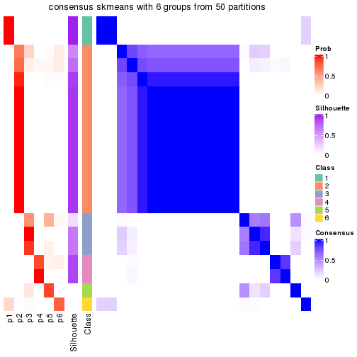</p>

</div>
<div id='tab-node-0221-consensus-heatmap-6'>
<pre><code class="r">consensus_heatmap(res, k = 7)
</code></pre>

<p>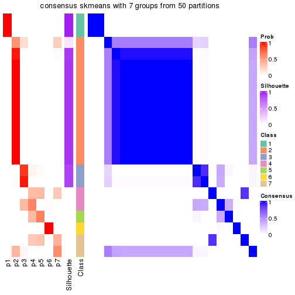</p>

</div>
<div id='tab-node-0221-consensus-heatmap-7'>
<pre><code class="r">consensus_heatmap(res, k = 8)
</code></pre>

<p>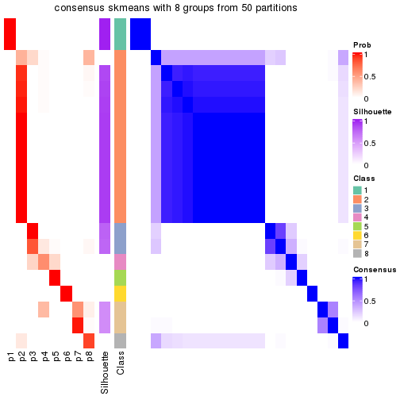</p>

</div>
</div>

Heatmaps for the membership of samples in all partitions to see how consistent they are:


<script>
$( function() {
	$( '#tabs-node-0221-membership-heatmap' ).tabs();
} );
</script>
<div id='tabs-node-0221-membership-heatmap'>
<ul>
<li><a href='#tab-node-0221-membership-heatmap-1'>k = 2</a></li>
<li><a href='#tab-node-0221-membership-heatmap-2'>k = 3</a></li>
<li><a href='#tab-node-0221-membership-heatmap-3'>k = 4</a></li>
<li><a href='#tab-node-0221-membership-heatmap-4'>k = 5</a></li>
<li><a href='#tab-node-0221-membership-heatmap-5'>k = 6</a></li>
<li><a href='#tab-node-0221-membership-heatmap-6'>k = 7</a></li>
<li><a href='#tab-node-0221-membership-heatmap-7'>k = 8</a></li>
</ul>
<div id='tab-node-0221-membership-heatmap-1'>
<pre><code class="r">membership_heatmap(res, k = 2)
</code></pre>

<p>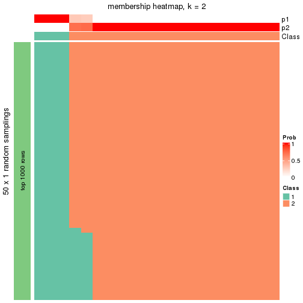</p>

</div>
<div id='tab-node-0221-membership-heatmap-2'>
<pre><code class="r">membership_heatmap(res, k = 3)
</code></pre>

<p>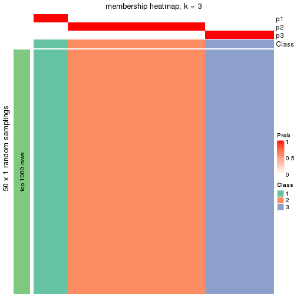</p>

</div>
<div id='tab-node-0221-membership-heatmap-3'>
<pre><code class="r">membership_heatmap(res, k = 4)
</code></pre>

<p>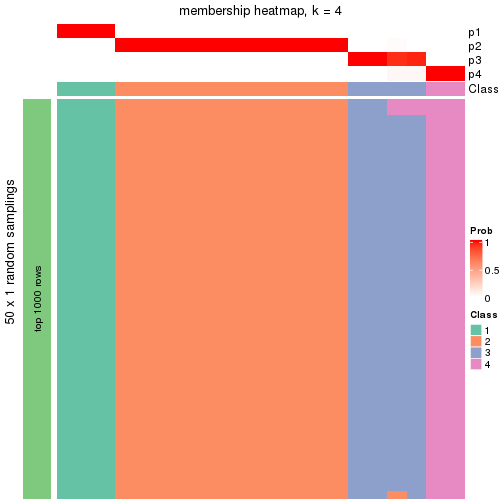</p>

</div>
<div id='tab-node-0221-membership-heatmap-4'>
<pre><code class="r">membership_heatmap(res, k = 5)
</code></pre>

<p>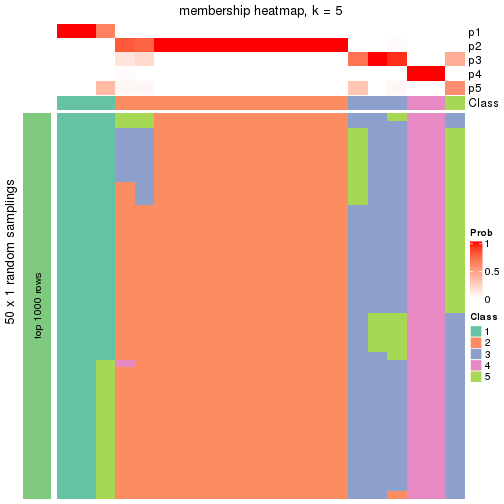</p>

</div>
<div id='tab-node-0221-membership-heatmap-5'>
<pre><code class="r">membership_heatmap(res, k = 6)
</code></pre>

<p>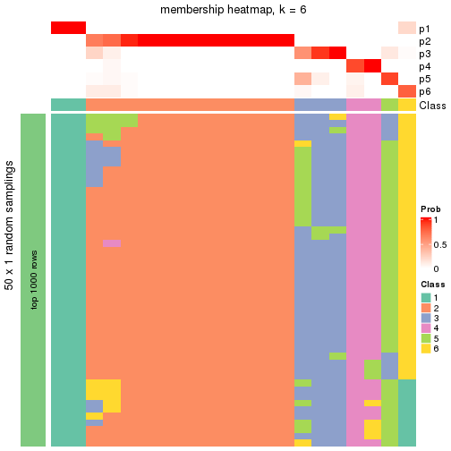</p>

</div>
<div id='tab-node-0221-membership-heatmap-6'>
<pre><code class="r">membership_heatmap(res, k = 7)
</code></pre>

<p>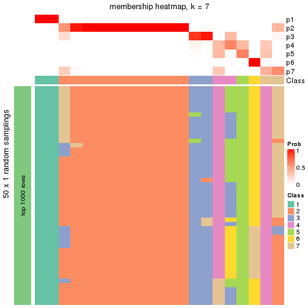</p>

</div>
<div id='tab-node-0221-membership-heatmap-7'>
<pre><code class="r">membership_heatmap(res, k = 8)
</code></pre>

<p>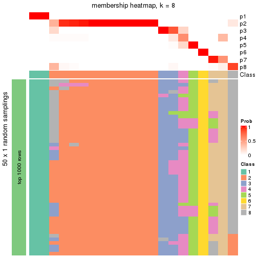</p>

</div>
</div>

As soon as the classes for columns are determined, the signatures
that are significantly different between subgroups can be looked for. 
Following are the heatmaps for signatures.


<script>
$( function() {
	$( '#tabs-node-0221-get-signatures' ).tabs();
} );
</script>
<div id='tabs-node-0221-get-signatures'>
<ul>
<li><a href='#tab-node-0221-get-signatures-1'>k = 2</a></li>
<li><a href='#tab-node-0221-get-signatures-2'>k = 3</a></li>
<li><a href='#tab-node-0221-get-signatures-3'>k = 4</a></li>
<li><a href='#tab-node-0221-get-signatures-4'>k = 5</a></li>
<li><a href='#tab-node-0221-get-signatures-5'>k = 6</a></li>
<li><a href='#tab-node-0221-get-signatures-6'>k = 7</a></li>
<li><a href='#tab-node-0221-get-signatures-7'>k = 8</a></li>
</ul>
<div id='tab-node-0221-get-signatures-1'>
<pre><code class="r">get_signatures(res, k = 2)
</code></pre>

<p>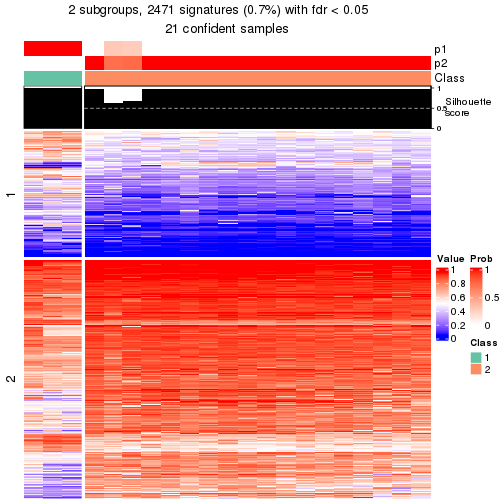</p>

</div>
<div id='tab-node-0221-get-signatures-2'>
<pre><code class="r">get_signatures(res, k = 3)
</code></pre>

<p>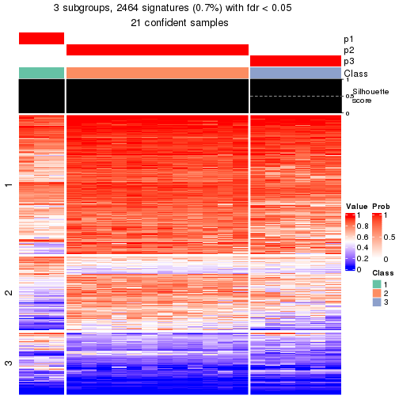</p>

</div>
<div id='tab-node-0221-get-signatures-3'>
<pre><code class="r">get_signatures(res, k = 4)
</code></pre>

<p>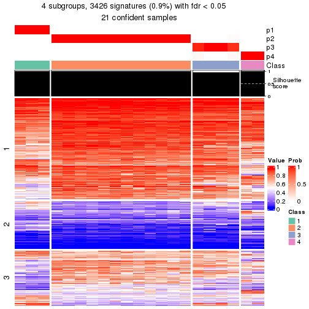</p>

</div>
<div id='tab-node-0221-get-signatures-4'>
<pre><code class="r">get_signatures(res, k = 5)
</code></pre>

<p>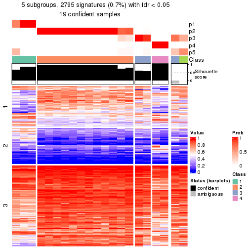</p>

</div>
<div id='tab-node-0221-get-signatures-5'>
<pre><code class="r">get_signatures(res, k = 6)
</code></pre>

<p>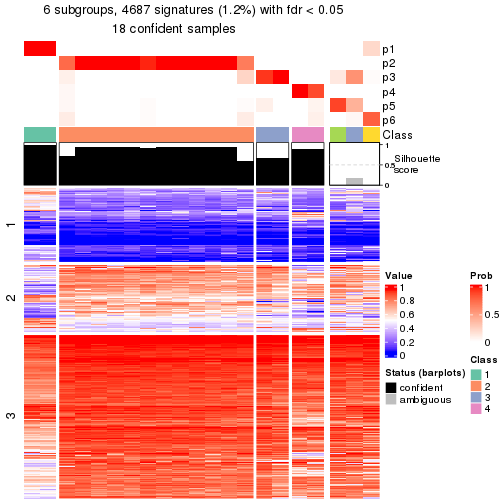</p>

</div>
<div id='tab-node-0221-get-signatures-6'>
<pre><code class="r">get_signatures(res, k = 7)
</code></pre>

<p>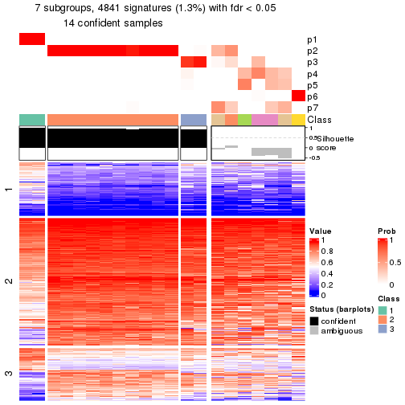</p>

</div>
<div id='tab-node-0221-get-signatures-7'>
<pre><code class="r">get_signatures(res, k = 8)
</code></pre>

<p>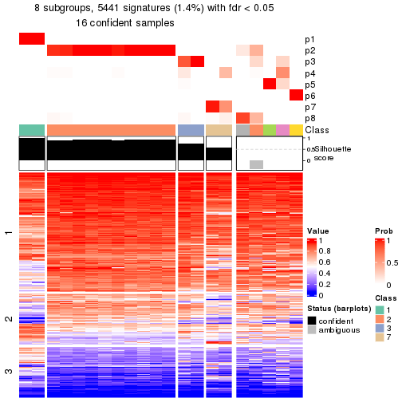</p>

</div>
</div>


Compare the overlap of signatures from different k:

```r
compare_signatures(res)
```

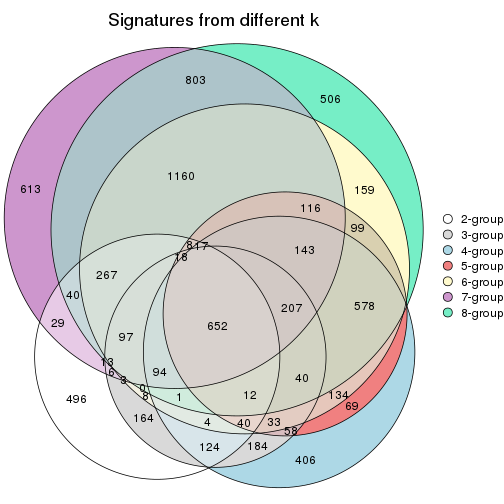

`get_signature()` returns a data frame invisibly. To get the list of signatures, the function
call should be assigned to a variable explicitly. In following code, if `plot` argument is set
to `FALSE`, no heatmap is plotted while only the differential analysis is performed.

```r
# code only for demonstration
tb = get_signature(res, k = ..., plot = FALSE)
```

An example of the output of `tb` is:

```
#>   which_row         fdr    mean_1    mean_2 scaled_mean_1 scaled_mean_2 km
#> 1        38 0.042760348  8.373488  9.131774    -0.5533452     0.5164555  1
#> 2        40 0.018707592  7.106213  8.469186    -0.6173731     0.5762149  1
#> 3        55 0.019134737 10.221463 11.207825    -0.6159697     0.5749050  1
#> 4        59 0.006059896  5.921854  7.869574    -0.6899429     0.6439467  1
#> 5        60 0.018055526  8.928898 10.211722    -0.6204761     0.5791110  1
#> 6        98 0.009384629 15.714769 14.887706     0.6635654    -0.6193277  2
...
```

The columns in `tb` are:

1. `which_row`: row indices corresponding to the input matrix.
2. `fdr`: FDR for the differential test. 
3. `mean_x`: The mean value in group x.
4. `scaled_mean_x`: The mean value in group x after rows are scaled.
5. `km`: Row groups if k-means clustering is applied to rows (which is done by automatically selecting number of clusters).

If there are too many signatures, `top_signatures = ...` can be set to only show the 
signatures with the highest FDRs:

```r
# code only for demonstration
# e.g. to show the top 500 most significant rows
tb = get_signature(res, k = ..., top_signatures = 500)
```

If the signatures are defined as these which are uniquely high in current group, `diff_method` argument
can be set to `"uniquely_high_in_one_group"`:

```r
# code only for demonstration
tb = get_signature(res, k = ..., diff_method = "uniquely_high_in_one_group")
```


UMAP plot which shows how samples are separated.


<script>
$( function() {
	$( '#tabs-node-0221-dimension-reduction' ).tabs();
} );
</script>
<div id='tabs-node-0221-dimension-reduction'>
<ul>
<li><a href='#tab-node-0221-dimension-reduction-1'>k = 2</a></li>
<li><a href='#tab-node-0221-dimension-reduction-2'>k = 3</a></li>
<li><a href='#tab-node-0221-dimension-reduction-3'>k = 4</a></li>
<li><a href='#tab-node-0221-dimension-reduction-4'>k = 5</a></li>
<li><a href='#tab-node-0221-dimension-reduction-5'>k = 6</a></li>
<li><a href='#tab-node-0221-dimension-reduction-6'>k = 7</a></li>
<li><a href='#tab-node-0221-dimension-reduction-7'>k = 8</a></li>
</ul>
<div id='tab-node-0221-dimension-reduction-1'>
<pre><code class="r">dimension_reduction(res, k = 2, method = &quot;UMAP&quot;)
</code></pre>

<p>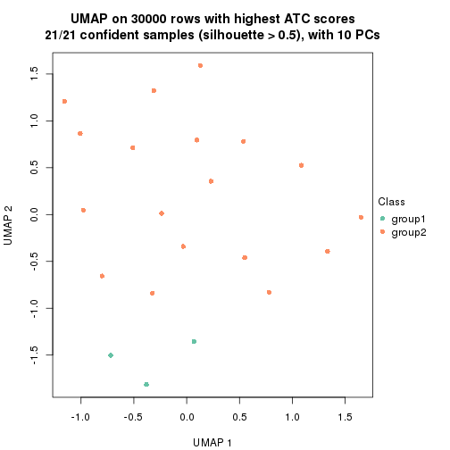</p>

</div>
<div id='tab-node-0221-dimension-reduction-2'>
<pre><code class="r">dimension_reduction(res, k = 3, method = &quot;UMAP&quot;)
</code></pre>

<p>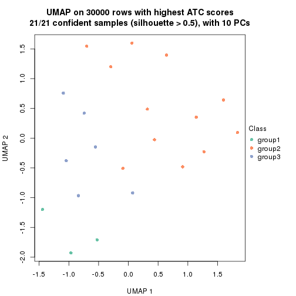</p>

</div>
<div id='tab-node-0221-dimension-reduction-3'>
<pre><code class="r">dimension_reduction(res, k = 4, method = &quot;UMAP&quot;)
</code></pre>

<p>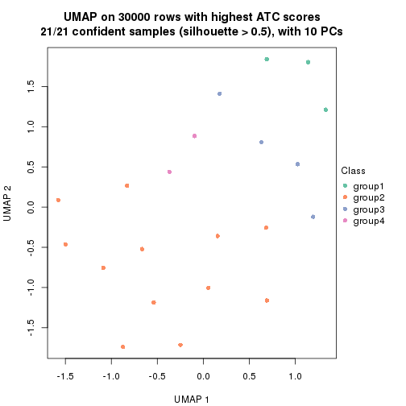</p>

</div>
<div id='tab-node-0221-dimension-reduction-4'>
<pre><code class="r">dimension_reduction(res, k = 5, method = &quot;UMAP&quot;)
</code></pre>

<p>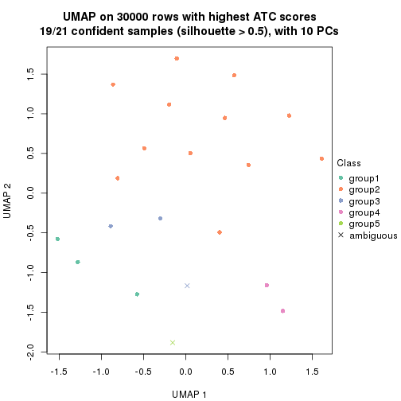</p>

</div>
<div id='tab-node-0221-dimension-reduction-5'>
<pre><code class="r">dimension_reduction(res, k = 6, method = &quot;UMAP&quot;)
</code></pre>

<p>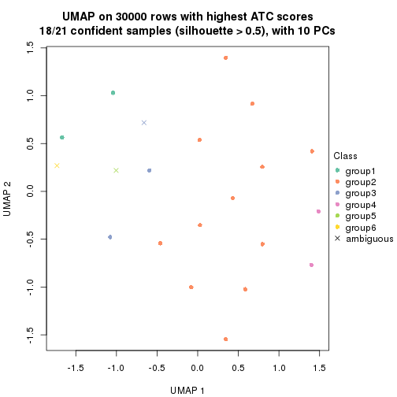</p>

</div>
<div id='tab-node-0221-dimension-reduction-6'>
<pre><code class="r">dimension_reduction(res, k = 7, method = &quot;UMAP&quot;)
</code></pre>

<p>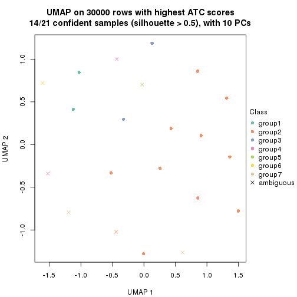</p>

</div>
<div id='tab-node-0221-dimension-reduction-7'>
<pre><code class="r">dimension_reduction(res, k = 8, method = &quot;UMAP&quot;)
</code></pre>

<p>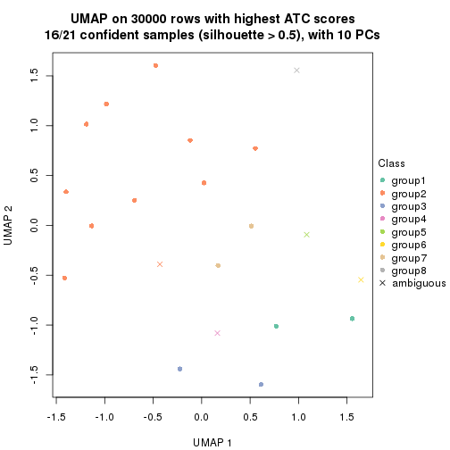</p>

</div>
</div>


Following heatmap shows how subgroups are split when increasing `k`:

```r
collect_classes(res)
```

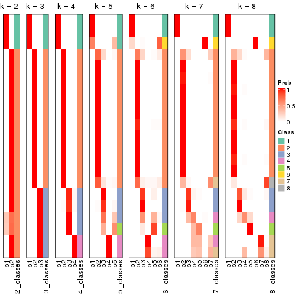


If matrix rows can be associated to genes, consider to use `functional_enrichment(res,
...)` to perform function enrichment for the signature genes. See [this vignette](https://jokergoo.github.io/cola_vignettes/functional_enrichment.html) for more detailed explanations.


 

---------------------------------------------------


### Node023


Parent node: [Node02](#Node02).
Child nodes: 
                Node0121-leaf
        ,
                Node0122-leaf
        ,
                Node0123-leaf
        ,
                Node0211-leaf
        ,
                [Node0212](#Node0212)
        ,
                Node0213-leaf
        ,
                [Node0221](#Node0221)
        ,
                Node0222-leaf
        ,
                Node0223-leaf
        ,
                [Node0231](#Node0231)
        ,
                Node0232-leaf
        ,
                Node0233-leaf
        ,
                Node0241-leaf
        ,
                Node0242-leaf
        ,
                Node0411-leaf
        ,
                Node0412-leaf
        ,
                Node0413-leaf
        ,
                Node0421-leaf
        ,
                Node0422-leaf
        ,
                Node0423-leaf
        ,
                Node0431-leaf
        ,
                Node0432-leaf
        ,
                Node0433-leaf
        ,
                Node0441-leaf
        ,
                Node0442-leaf
        ,
                Node0443-leaf
        ,
                Node0511-leaf
        ,
                [Node0512](#Node0512)
        ,
                Node0513-leaf
        ,
                Node0521-leaf
        ,
                Node0522-leaf
        ,
                Node0523-leaf
        .


The object with results only for a single top-value method and a single partitioning method 
can be extracted as:

```r
res = res_rh["023"]
```

A summary of `res` and all the functions that can be applied to it:

```r
res
```

```
#> A 'ConsensusPartition' object with k = 2, 3, 4, 5, 6, 7, 8.
#>   On a matrix with 30000 rows and 42 columns.
#>   Top rows (1000) are extracted by 'ATC' method.
#>   Subgroups are detected by 'kmeans' method.
#>   Performed in total 350 partitions by row resampling.
#>   Best k for subgroups seems to be 3.
#> 
#> Following methods can be applied to this 'ConsensusPartition' object:
#>  [1] "cola_report"             "collect_classes"         "collect_plots"          
#>  [4] "collect_stats"           "colnames"                "compare_partitions"     
#>  [7] "compare_signatures"      "consensus_heatmap"       "dimension_reduction"    
#> [10] "functional_enrichment"   "get_anno_col"            "get_anno"               
#> [13] "get_classes"             "get_consensus"           "get_matrix"             
#> [16] "get_membership"          "get_param"               "get_signatures"         
#> [19] "get_stats"               "is_best_k"               "is_stable_k"            
#> [22] "membership_heatmap"      "ncol"                    "nrow"                   
#> [25] "plot_ecdf"               "predict_classes"         "rownames"               
#> [28] "select_partition_number" "show"                    "suggest_best_k"         
#> [31] "test_to_known_factors"   "top_rows_heatmap"
```

`collect_plots()` function collects all the plots made from `res` for all `k` (number of subgroups)
into one single page to provide an easy and fast comparison between different `k`.

```r
collect_plots(res)
```

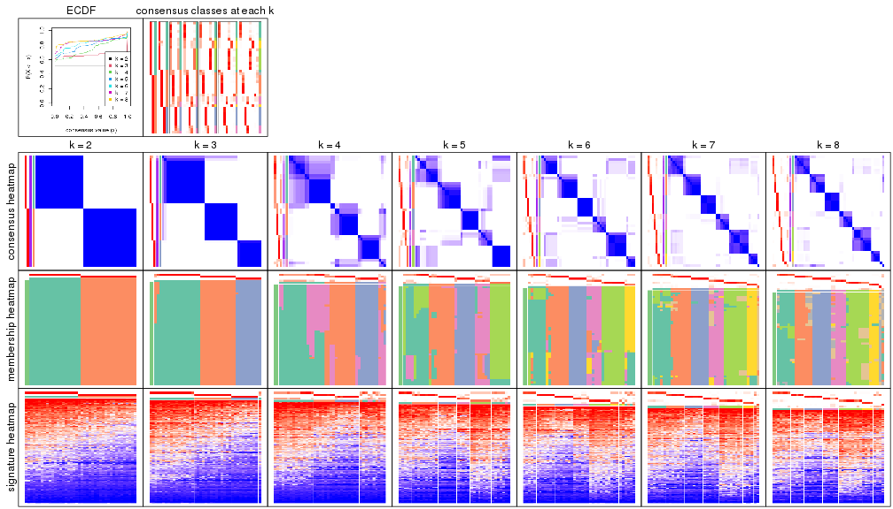

The plots are:

- The first row: a plot of the eCDF (empirical cumulative distribution
  function) curves of the consensus matrix for each `k` and the heatmap of
  predicted classes for each `k`.
- The second row: heatmaps of the consensus matrix for each `k`.
- The third row: heatmaps of the membership matrix for each `k`.
- The fouth row: heatmaps of the signatures for each `k`.

All the plots in panels can be made by individual functions and they are
plotted later in this section.

`select_partition_number()` produces several plots showing different
statistics for choosing "optimized" `k`. There are following statistics:

- eCDF curves of the consensus matrix for each `k`;
- 1-PAC. [The PAC score](https://en.wikipedia.org/wiki/Consensus_clustering#Over-interpretation_potential_of_consensus_clustering)
  measures the proportion of the ambiguous subgrouping.
- Mean silhouette score.
- Concordance. The mean probability of fiting the consensus subgroup labels in all
  partitions.
- Area increased. Denote $A_k$ as the area under the eCDF curve for current
  `k`, the area increased is defined as $A_k - A_{k-1}$.
- Rand index. The percent of pairs of samples that are both in a same cluster
  or both are not in a same cluster in the partition of k and k-1.
- Jaccard index. The ratio of pairs of samples are both in a same cluster in
  the partition of k and k-1 and the pairs of samples are both in a same
  cluster in the partition k or k-1.

The detailed explanations of these statistics can be found in [the _cola_
vignette](https://jokergoo.github.io/cola_vignettes/cola.html#toc_13).

Generally speaking, higher 1-PAC score, higher mean silhouette score or higher
concordance corresponds to better partition. Rand index and Jaccard index
measure how similar the current partition is compared to partition with `k-1`.
If they are too similar, we won't accept `k` is better than `k-1`.

```r
select_partition_number(res)
```

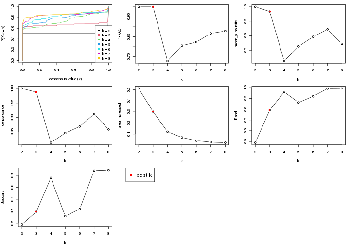

The numeric values for all these statistics can be obtained by `get_stats()`.

```r
get_stats(res)
```

```
#>   k 1-PAC mean_silhouette concordance area_increased  Rand Jaccard
#> 2 2 1.000           1.000       1.000         0.5115 0.489   0.489
#> 3 3 1.000           0.967       0.987         0.3021 0.791   0.596
#> 4 4 0.728           0.625       0.813         0.1205 0.959   0.880
#> 5 5 0.806           0.727       0.846         0.0691 0.862   0.558
#> 6 6 0.823           0.793       0.869         0.0397 0.919   0.617
#> 7 7 0.867           0.844       0.912         0.0263 0.991   0.941
#> 8 8 0.879           0.744       0.859         0.0216 0.992   0.945
```

`suggest_best_k()` suggests the best $k$ based on these statistics. The rules are as follows:

- All $k$ with Jaccard index larger than 0.95 are removed because increasing
  $k$ does not provide enough extra information. If all $k$ are removed, it is
  marked as no subgroup is detected.
- For all $k$ with 1-PAC score larger than 0.9, the maximal $k$ is taken as
  the best $k$, and other $k$ are marked as optional $k$.
- If it does not fit the second rule. The $k$ with the maximal vote of the
  highest 1-PAC score, highest mean silhouette, and highest concordance is
  taken as the best $k$.

```r
suggest_best_k(res)
```

```
#> [1] 3
#> attr(,"optional")
#> [1] 2
```

There is also optional best $k$ = 2 that is worth to check.

Following is the table of the partitions (You need to click the **show/hide
code output** link to see it). The membership matrix (columns with name `p*`)
is inferred by
[`clue::cl_consensus()`](https://www.rdocumentation.org/link/cl_consensus?package=clue)
function with the `SE` method. Basically the value in the membership matrix
represents the probability to belong to a certain group. The finall subgroup
label for an item is determined with the group with highest probability it
belongs to.

In `get_classes()` function, the entropy is calculated from the membership
matrix and the silhouette score is calculated from the consensus matrix.


<script>
$( function() {
	$( '#tabs-node-023-get-classes' ).tabs();
} );
</script>
<div id='tabs-node-023-get-classes'>
<ul>
<li><a href='#tab-node-023-get-classes-1'>k = 2</a></li>
<li><a href='#tab-node-023-get-classes-2'>k = 3</a></li>
<li><a href='#tab-node-023-get-classes-3'>k = 4</a></li>
<li><a href='#tab-node-023-get-classes-4'>k = 5</a></li>
<li><a href='#tab-node-023-get-classes-5'>k = 6</a></li>
<li><a href='#tab-node-023-get-classes-6'>k = 7</a></li>
<li><a href='#tab-node-023-get-classes-7'>k = 8</a></li>
</ul>

<div id='tab-node-023-get-classes-1'>
<p><a id='tab-node-023-get-classes-1-a' style='color:#0366d6' href='#'>show/hide code output</a></p>
<pre><code class="r">cbind(get_classes(res, k = 2), get_membership(res, k = 2))
</code></pre>

<pre><code>#&gt;                 class entropy silhouette p1 p2
#&gt; TCGA.KK.A8IA.01     1       0          1  1  0
#&gt; TCGA.V1.A9OF.01     2       0          1  0  1
#&gt; TCGA.CH.5788.01     2       0          1  0  1
#&gt; TCGA.KK.A7AZ.01     2       0          1  0  1
#&gt; TCGA.J9.A8CL.01     1       0          1  1  0
#&gt; TCGA.HC.7075.01     2       0          1  0  1
#&gt; TCGA.G9.6361.01     1       0          1  1  0
#&gt; TCGA.EJ.5511.01     2       0          1  0  1
#&gt; TCGA.EJ.5517.01     2       0          1  0  1
#&gt; TCGA.J4.AAU2.01     2       0          1  0  1
#&gt; TCGA.KC.A4BV.01     1       0          1  1  0
#&gt; TCGA.EJ.7315.01     1       0          1  1  0
#&gt; TCGA.YL.A9WK.01     1       0          1  1  0
#&gt; TCGA.HC.7078.01     1       0          1  1  0
#&gt; TCGA.FC.A5OB.01     1       0          1  1  0
#&gt; TCGA.J9.A52D.01     1       0          1  1  0
#&gt; TCGA.EJ.7788.01     1       0          1  1  0
#&gt; TCGA.ZG.A9L1.01     2       0          1  0  1
#&gt; TCGA.VP.A875.01     1       0          1  1  0
#&gt; TCGA.KC.A7FD.01     2       0          1  0  1
#&gt; TCGA.J4.A83I.01     1       0          1  1  0
#&gt; TCGA.XQ.A8TA.01     1       0          1  1  0
#&gt; TCGA.HC.7212.01     2       0          1  0  1
#&gt; TCGA.2A.A8VO.01     2       0          1  0  1
#&gt; TCGA.VN.A88P.01     2       0          1  0  1
#&gt; TCGA.KK.A7AY.01     1       0          1  1  0
#&gt; TCGA.2A.AAYU.01     2       0          1  0  1
#&gt; TCGA.EJ.5494.01     1       0          1  1  0
#&gt; TCGA.HC.7213.01     2       0          1  0  1
#&gt; TCGA.CH.5772.01     1       0          1  1  0
#&gt; TCGA.2A.AAYO.01     2       0          1  0  1
#&gt; TCGA.CH.5753.01     2       0          1  0  1
#&gt; TCGA.YL.A8SH.01     1       0          1  1  0
#&gt; TCGA.HC.7744.01     2       0          1  0  1
#&gt; TCGA.HC.A8CY.01     1       0          1  1  0
#&gt; TCGA.KK.A7AW.01     1       0          1  1  0
#&gt; TCGA.V1.A9ZI.01     2       0          1  0  1
#&gt; TCGA.YL.A8SQ.01     1       0          1  1  0
#&gt; TCGA.KK.A7B4.01     2       0          1  0  1
#&gt; TCGA.HC.7752.01     2       0          1  0  1
#&gt; TCGA.J4.8198.01     2       0          1  0  1
#&gt; TCGA.CH.5768.01     2       0          1  0  1
</code></pre>

<script>
$('#tab-node-023-get-classes-1-a').parent().next().next().hide();
$('#tab-node-023-get-classes-1-a').click(function(){
  $('#tab-node-023-get-classes-1-a').parent().next().next().toggle();
  return(false);
});
</script>
</div>

<div id='tab-node-023-get-classes-2'>
<p><a id='tab-node-023-get-classes-2-a' style='color:#0366d6' href='#'>show/hide code output</a></p>
<pre><code class="r">cbind(get_classes(res, k = 3), get_membership(res, k = 3))
</code></pre>

<pre><code>#&gt;                 class entropy silhouette   p1   p2   p3
#&gt; TCGA.KK.A8IA.01     1  0.0000      0.967 1.00 0.00 0.00
#&gt; TCGA.V1.A9OF.01     2  0.0000      1.000 0.00 1.00 0.00
#&gt; TCGA.CH.5788.01     2  0.0000      1.000 0.00 1.00 0.00
#&gt; TCGA.KK.A7AZ.01     3  0.0000      0.998 0.00 0.00 1.00
#&gt; TCGA.J9.A8CL.01     1  0.0000      0.967 1.00 0.00 0.00
#&gt; TCGA.HC.7075.01     2  0.0000      1.000 0.00 1.00 0.00
#&gt; TCGA.G9.6361.01     1  0.0000      0.967 1.00 0.00 0.00
#&gt; TCGA.EJ.5511.01     3  0.0000      0.998 0.00 0.00 1.00
#&gt; TCGA.EJ.5517.01     3  0.0000      0.998 0.00 0.00 1.00
#&gt; TCGA.J4.AAU2.01     3  0.0000      0.998 0.00 0.00 1.00
#&gt; TCGA.KC.A4BV.01     1  0.0000      0.967 1.00 0.00 0.00
#&gt; TCGA.EJ.7315.01     1  0.0000      0.967 1.00 0.00 0.00
#&gt; TCGA.YL.A9WK.01     1  0.0000      0.967 1.00 0.00 0.00
#&gt; TCGA.HC.7078.01     1  0.6126      0.353 0.60 0.40 0.00
#&gt; TCGA.FC.A5OB.01     1  0.3340      0.850 0.88 0.12 0.00
#&gt; TCGA.J9.A52D.01     1  0.0000      0.967 1.00 0.00 0.00
#&gt; TCGA.EJ.7788.01     2  0.0000      1.000 0.00 1.00 0.00
#&gt; TCGA.ZG.A9L1.01     3  0.0000      0.998 0.00 0.00 1.00
#&gt; TCGA.VP.A875.01     2  0.0000      1.000 0.00 1.00 0.00
#&gt; TCGA.KC.A7FD.01     2  0.0000      1.000 0.00 1.00 0.00
#&gt; TCGA.J4.A83I.01     1  0.0000      0.967 1.00 0.00 0.00
#&gt; TCGA.XQ.A8TA.01     1  0.0000      0.967 1.00 0.00 0.00
#&gt; TCGA.HC.7212.01     2  0.0000      1.000 0.00 1.00 0.00
#&gt; TCGA.2A.A8VO.01     3  0.0892      0.979 0.00 0.02 0.98
#&gt; TCGA.VN.A88P.01     2  0.0000      1.000 0.00 1.00 0.00
#&gt; TCGA.KK.A7AY.01     1  0.0000      0.967 1.00 0.00 0.00
#&gt; TCGA.2A.AAYU.01     3  0.0000      0.998 0.00 0.00 1.00
#&gt; TCGA.EJ.5494.01     1  0.0000      0.967 1.00 0.00 0.00
#&gt; TCGA.HC.7213.01     3  0.0000      0.998 0.00 0.00 1.00
#&gt; TCGA.CH.5772.01     1  0.0000      0.967 1.00 0.00 0.00
#&gt; TCGA.2A.AAYO.01     3  0.0000      0.998 0.00 0.00 1.00
#&gt; TCGA.CH.5753.01     2  0.0000      1.000 0.00 1.00 0.00
#&gt; TCGA.YL.A8SH.01     1  0.0000      0.967 1.00 0.00 0.00
#&gt; TCGA.HC.7744.01     2  0.0000      1.000 0.00 1.00 0.00
#&gt; TCGA.HC.A8CY.01     1  0.0000      0.967 1.00 0.00 0.00
#&gt; TCGA.KK.A7AW.01     1  0.0000      0.967 1.00 0.00 0.00
#&gt; TCGA.V1.A9ZI.01     2  0.0000      1.000 0.00 1.00 0.00
#&gt; TCGA.YL.A8SQ.01     1  0.0000      0.967 1.00 0.00 0.00
#&gt; TCGA.KK.A7B4.01     2  0.0000      1.000 0.00 1.00 0.00
#&gt; TCGA.HC.7752.01     3  0.0000      0.998 0.00 0.00 1.00
#&gt; TCGA.J4.8198.01     2  0.0000      1.000 0.00 1.00 0.00
#&gt; TCGA.CH.5768.01     2  0.0000      1.000 0.00 1.00 0.00
</code></pre>

<script>
$('#tab-node-023-get-classes-2-a').parent().next().next().hide();
$('#tab-node-023-get-classes-2-a').click(function(){
  $('#tab-node-023-get-classes-2-a').parent().next().next().toggle();
  return(false);
});
</script>
</div>

<div id='tab-node-023-get-classes-3'>
<p><a id='tab-node-023-get-classes-3-a' style='color:#0366d6' href='#'>show/hide code output</a></p>
<pre><code class="r">cbind(get_classes(res, k = 4), get_membership(res, k = 4))
</code></pre>

<pre><code>#&gt;                 class entropy silhouette   p1   p2   p3   p4
#&gt; TCGA.KK.A8IA.01     1  0.4994      0.735 0.52 0.00 0.00 0.48
#&gt; TCGA.V1.A9OF.01     4  0.7497      0.403 0.26 0.24 0.00 0.50
#&gt; TCGA.CH.5788.01     2  0.0000      0.723 0.00 1.00 0.00 0.00
#&gt; TCGA.KK.A7AZ.01     3  0.0000      0.939 0.00 0.00 1.00 0.00
#&gt; TCGA.J9.A8CL.01     1  0.4994      0.735 0.52 0.00 0.00 0.48
#&gt; TCGA.HC.7075.01     4  0.4994      0.278 0.00 0.48 0.00 0.52
#&gt; TCGA.G9.6361.01     1  0.4994      0.735 0.52 0.00 0.00 0.48
#&gt; TCGA.EJ.5511.01     3  0.0000      0.939 0.00 0.00 1.00 0.00
#&gt; TCGA.EJ.5517.01     3  0.0000      0.939 0.00 0.00 1.00 0.00
#&gt; TCGA.J4.AAU2.01     3  0.4406      0.554 0.00 0.00 0.70 0.30
#&gt; TCGA.KC.A4BV.01     1  0.0000      0.608 1.00 0.00 0.00 0.00
#&gt; TCGA.EJ.7315.01     1  0.4994      0.735 0.52 0.00 0.00 0.48
#&gt; TCGA.YL.A9WK.01     1  0.4134      0.703 0.74 0.00 0.00 0.26
#&gt; TCGA.HC.7078.01     1  0.4472      0.315 0.76 0.02 0.00 0.22
#&gt; TCGA.FC.A5OB.01     1  0.4642      0.275 0.74 0.02 0.00 0.24
#&gt; TCGA.J9.A52D.01     1  0.4994      0.735 0.52 0.00 0.00 0.48
#&gt; TCGA.EJ.7788.01     2  0.4948      0.198 0.44 0.56 0.00 0.00
#&gt; TCGA.ZG.A9L1.01     3  0.0000      0.939 0.00 0.00 1.00 0.00
#&gt; TCGA.VP.A875.01     2  0.4948      0.198 0.44 0.56 0.00 0.00
#&gt; TCGA.KC.A7FD.01     2  0.0000      0.723 0.00 1.00 0.00 0.00
#&gt; TCGA.J4.A83I.01     1  0.0707      0.619 0.98 0.00 0.00 0.02
#&gt; TCGA.XQ.A8TA.01     1  0.4994      0.735 0.52 0.00 0.00 0.48
#&gt; TCGA.HC.7212.01     2  0.0000      0.723 0.00 1.00 0.00 0.00
#&gt; TCGA.2A.A8VO.01     4  0.7816      0.368 0.00 0.26 0.34 0.40
#&gt; TCGA.VN.A88P.01     2  0.4855     -0.237 0.00 0.60 0.00 0.40
#&gt; TCGA.KK.A7AY.01     1  0.3801      0.693 0.78 0.00 0.00 0.22
#&gt; TCGA.2A.AAYU.01     3  0.0000      0.939 0.00 0.00 1.00 0.00
#&gt; TCGA.EJ.5494.01     1  0.2647      0.496 0.88 0.00 0.00 0.12
#&gt; TCGA.HC.7213.01     3  0.0000      0.939 0.00 0.00 1.00 0.00
#&gt; TCGA.CH.5772.01     1  0.4994      0.735 0.52 0.00 0.00 0.48
#&gt; TCGA.2A.AAYO.01     3  0.2647      0.832 0.00 0.00 0.88 0.12
#&gt; TCGA.CH.5753.01     2  0.0000      0.723 0.00 1.00 0.00 0.00
#&gt; TCGA.YL.A8SH.01     1  0.4994      0.735 0.52 0.00 0.00 0.48
#&gt; TCGA.HC.7744.01     2  0.0000      0.723 0.00 1.00 0.00 0.00
#&gt; TCGA.HC.A8CY.01     1  0.0707      0.619 0.98 0.00 0.00 0.02
#&gt; TCGA.KK.A7AW.01     1  0.0000      0.608 1.00 0.00 0.00 0.00
#&gt; TCGA.V1.A9ZI.01     2  0.4855     -0.237 0.00 0.60 0.00 0.40
#&gt; TCGA.YL.A8SQ.01     1  0.4994      0.735 0.52 0.00 0.00 0.48
#&gt; TCGA.KK.A7B4.01     2  0.0707      0.701 0.00 0.98 0.00 0.02
#&gt; TCGA.HC.7752.01     3  0.0000      0.939 0.00 0.00 1.00 0.00
#&gt; TCGA.J4.8198.01     2  0.0000      0.723 0.00 1.00 0.00 0.00
#&gt; TCGA.CH.5768.01     2  0.0000      0.723 0.00 1.00 0.00 0.00
</code></pre>

<script>
$('#tab-node-023-get-classes-3-a').parent().next().next().hide();
$('#tab-node-023-get-classes-3-a').click(function(){
  $('#tab-node-023-get-classes-3-a').parent().next().next().toggle();
  return(false);
});
</script>
</div>

<div id='tab-node-023-get-classes-4'>
<p><a id='tab-node-023-get-classes-4-a' style='color:#0366d6' href='#'>show/hide code output</a></p>
<pre><code class="r">cbind(get_classes(res, k = 5), get_membership(res, k = 5))
</code></pre>

<pre><code>#&gt;                 class entropy silhouette   p1   p2   p3   p4   p5
#&gt; TCGA.KK.A8IA.01     5  0.3684     1.0000 0.28 0.00 0.00 0.00 0.72
#&gt; TCGA.V1.A9OF.01     4  0.5005     0.4450 0.06 0.02 0.00 0.72 0.20
#&gt; TCGA.CH.5788.01     2  0.2331     0.8468 0.00 0.90 0.00 0.02 0.08
#&gt; TCGA.KK.A7AZ.01     3  0.0000     0.9257 0.00 0.00 1.00 0.00 0.00
#&gt; TCGA.J9.A8CL.01     5  0.3684     1.0000 0.28 0.00 0.00 0.00 0.72
#&gt; TCGA.HC.7075.01     4  0.1732     0.7035 0.00 0.08 0.00 0.92 0.00
#&gt; TCGA.G9.6361.01     1  0.4302    -0.5452 0.52 0.00 0.00 0.00 0.48
#&gt; TCGA.EJ.5511.01     3  0.0000     0.9257 0.00 0.00 1.00 0.00 0.00
#&gt; TCGA.EJ.5517.01     3  0.0000     0.9257 0.00 0.00 1.00 0.00 0.00
#&gt; TCGA.J4.AAU2.01     4  0.3684     0.5221 0.00 0.00 0.28 0.72 0.00
#&gt; TCGA.KC.A4BV.01     1  0.0000     0.6553 1.00 0.00 0.00 0.00 0.00
#&gt; TCGA.EJ.7315.01     5  0.3684     1.0000 0.28 0.00 0.00 0.00 0.72
#&gt; TCGA.YL.A9WK.01     1  0.3983     0.0580 0.66 0.00 0.00 0.00 0.34
#&gt; TCGA.HC.7078.01     1  0.6244     0.4512 0.54 0.00 0.00 0.26 0.20
#&gt; TCGA.FC.A5OB.01     1  0.6327     0.4167 0.52 0.00 0.00 0.28 0.20
#&gt; TCGA.J9.A52D.01     5  0.3684     1.0000 0.28 0.00 0.00 0.00 0.72
#&gt; TCGA.EJ.7788.01     2  0.3999     0.6790 0.24 0.74 0.00 0.00 0.02
#&gt; TCGA.ZG.A9L1.01     3  0.0000     0.9257 0.00 0.00 1.00 0.00 0.00
#&gt; TCGA.VP.A875.01     2  0.4613     0.5186 0.36 0.62 0.00 0.00 0.02
#&gt; TCGA.KC.A7FD.01     2  0.0609     0.8924 0.00 0.98 0.00 0.00 0.02
#&gt; TCGA.J4.A83I.01     1  0.0609     0.6425 0.98 0.00 0.00 0.00 0.02
#&gt; TCGA.XQ.A8TA.01     5  0.3684     1.0000 0.28 0.00 0.00 0.00 0.72
#&gt; TCGA.HC.7212.01     2  0.0000     0.8967 0.00 1.00 0.00 0.00 0.00
#&gt; TCGA.2A.A8VO.01     4  0.4433     0.6364 0.00 0.06 0.20 0.74 0.00
#&gt; TCGA.VN.A88P.01     4  0.3895     0.6321 0.00 0.32 0.00 0.68 0.00
#&gt; TCGA.KK.A7AY.01     1  0.1410     0.6015 0.94 0.00 0.00 0.00 0.06
#&gt; TCGA.2A.AAYU.01     3  0.0000     0.9257 0.00 0.00 1.00 0.00 0.00
#&gt; TCGA.EJ.5494.01     1  0.6146     0.4745 0.56 0.00 0.00 0.24 0.20
#&gt; TCGA.HC.7213.01     3  0.0000     0.9257 0.00 0.00 1.00 0.00 0.00
#&gt; TCGA.CH.5772.01     5  0.3684     1.0000 0.28 0.00 0.00 0.00 0.72
#&gt; TCGA.2A.AAYO.01     3  0.4262     0.0865 0.00 0.00 0.56 0.44 0.00
#&gt; TCGA.CH.5753.01     2  0.0609     0.8924 0.00 0.98 0.00 0.00 0.02
#&gt; TCGA.YL.A8SH.01     5  0.3684     1.0000 0.28 0.00 0.00 0.00 0.72
#&gt; TCGA.HC.7744.01     2  0.0000     0.8967 0.00 1.00 0.00 0.00 0.00
#&gt; TCGA.HC.A8CY.01     1  0.0000     0.6553 1.00 0.00 0.00 0.00 0.00
#&gt; TCGA.KK.A7AW.01     1  0.0000     0.6553 1.00 0.00 0.00 0.00 0.00
#&gt; TCGA.V1.A9ZI.01     4  0.3895     0.6321 0.00 0.32 0.00 0.68 0.00
#&gt; TCGA.YL.A8SQ.01     5  0.3684     1.0000 0.28 0.00 0.00 0.00 0.72
#&gt; TCGA.KK.A7B4.01     2  0.0000     0.8967 0.00 1.00 0.00 0.00 0.00
#&gt; TCGA.HC.7752.01     3  0.0000     0.9257 0.00 0.00 1.00 0.00 0.00
#&gt; TCGA.J4.8198.01     2  0.0000     0.8967 0.00 1.00 0.00 0.00 0.00
#&gt; TCGA.CH.5768.01     2  0.0000     0.8967 0.00 1.00 0.00 0.00 0.00
</code></pre>

<script>
$('#tab-node-023-get-classes-4-a').parent().next().next().hide();
$('#tab-node-023-get-classes-4-a').click(function(){
  $('#tab-node-023-get-classes-4-a').parent().next().next().toggle();
  return(false);
});
</script>
</div>

<div id='tab-node-023-get-classes-5'>
<p><a id='tab-node-023-get-classes-5-a' style='color:#0366d6' href='#'>show/hide code output</a></p>
<pre><code class="r">cbind(get_classes(res, k = 6), get_membership(res, k = 6))
</code></pre>

<pre><code>#&gt;                 class entropy silhouette   p1   p2   p3   p4   p5   p6
#&gt; TCGA.KK.A8IA.01     5  0.0547      0.936 0.00 0.00 0.00 0.02 0.98 0.00
#&gt; TCGA.V1.A9OF.01     6  0.3315      0.443 0.02 0.00 0.00 0.20 0.00 0.78
#&gt; TCGA.CH.5788.01     2  0.6768      0.294 0.12 0.44 0.00 0.10 0.00 0.34
#&gt; TCGA.KK.A7AZ.01     3  0.0000      1.000 0.00 0.00 1.00 0.00 0.00 0.00
#&gt; TCGA.J9.A8CL.01     5  0.0000      0.942 0.00 0.00 0.00 0.00 1.00 0.00
#&gt; TCGA.HC.7075.01     4  0.2474      0.731 0.00 0.08 0.00 0.88 0.00 0.04
#&gt; TCGA.G9.6361.01     1  0.3851      0.302 0.54 0.00 0.00 0.00 0.46 0.00
#&gt; TCGA.EJ.5511.01     3  0.0000      1.000 0.00 0.00 1.00 0.00 0.00 0.00
#&gt; TCGA.EJ.5517.01     3  0.0000      1.000 0.00 0.00 1.00 0.00 0.00 0.00
#&gt; TCGA.J4.AAU2.01     4  0.2048      0.728 0.00 0.00 0.12 0.88 0.00 0.00
#&gt; TCGA.KC.A4BV.01     1  0.2048      0.785 0.88 0.00 0.00 0.00 0.12 0.00
#&gt; TCGA.EJ.7315.01     5  0.0000      0.942 0.00 0.00 0.00 0.00 1.00 0.00
#&gt; TCGA.YL.A9WK.01     5  0.3409      0.432 0.30 0.00 0.00 0.00 0.70 0.00
#&gt; TCGA.HC.7078.01     6  0.3578      0.823 0.34 0.00 0.00 0.00 0.00 0.66
#&gt; TCGA.FC.A5OB.01     6  0.3578      0.823 0.34 0.00 0.00 0.00 0.00 0.66
#&gt; TCGA.J9.A52D.01     5  0.0547      0.936 0.00 0.00 0.00 0.02 0.98 0.00
#&gt; TCGA.EJ.7788.01     2  0.4700      0.404 0.34 0.60 0.00 0.00 0.00 0.06
#&gt; TCGA.ZG.A9L1.01     3  0.0000      1.000 0.00 0.00 1.00 0.00 0.00 0.00
#&gt; TCGA.VP.A875.01     1  0.4552      0.331 0.64 0.30 0.00 0.00 0.00 0.06
#&gt; TCGA.KC.A7FD.01     2  0.0000      0.875 0.00 1.00 0.00 0.00 0.00 0.00
#&gt; TCGA.J4.A83I.01     1  0.2048      0.785 0.88 0.00 0.00 0.00 0.12 0.00
#&gt; TCGA.XQ.A8TA.01     5  0.0547      0.936 0.00 0.00 0.00 0.02 0.98 0.00
#&gt; TCGA.HC.7212.01     2  0.0000      0.875 0.00 1.00 0.00 0.00 0.00 0.00
#&gt; TCGA.2A.A8VO.01     4  0.2725      0.747 0.00 0.04 0.06 0.88 0.00 0.02
#&gt; TCGA.VN.A88P.01     4  0.5977      0.646 0.04 0.22 0.00 0.58 0.00 0.16
#&gt; TCGA.KK.A7AY.01     1  0.2260      0.772 0.86 0.00 0.00 0.00 0.14 0.00
#&gt; TCGA.2A.AAYU.01     3  0.0000      1.000 0.00 0.00 1.00 0.00 0.00 0.00
#&gt; TCGA.EJ.5494.01     6  0.4078      0.809 0.34 0.00 0.00 0.00 0.02 0.64
#&gt; TCGA.HC.7213.01     3  0.0000      1.000 0.00 0.00 1.00 0.00 0.00 0.00
#&gt; TCGA.CH.5772.01     5  0.0000      0.942 0.00 0.00 0.00 0.00 1.00 0.00
#&gt; TCGA.2A.AAYO.01     4  0.3309      0.593 0.00 0.00 0.28 0.72 0.00 0.00
#&gt; TCGA.CH.5753.01     2  0.0547      0.864 0.02 0.98 0.00 0.00 0.00 0.00
#&gt; TCGA.YL.A8SH.01     5  0.0000      0.942 0.00 0.00 0.00 0.00 1.00 0.00
#&gt; TCGA.HC.7744.01     2  0.0000      0.875 0.00 1.00 0.00 0.00 0.00 0.00
#&gt; TCGA.HC.A8CY.01     1  0.2048      0.785 0.88 0.00 0.00 0.00 0.12 0.00
#&gt; TCGA.KK.A7AW.01     1  0.2048      0.785 0.88 0.00 0.00 0.00 0.12 0.00
#&gt; TCGA.V1.A9ZI.01     4  0.5977      0.646 0.04 0.22 0.00 0.58 0.00 0.16
#&gt; TCGA.YL.A8SQ.01     5  0.0000      0.942 0.00 0.00 0.00 0.00 1.00 0.00
#&gt; TCGA.KK.A7B4.01     2  0.0000      0.875 0.00 1.00 0.00 0.00 0.00 0.00
#&gt; TCGA.HC.7752.01     3  0.0000      1.000 0.00 0.00 1.00 0.00 0.00 0.00
#&gt; TCGA.J4.8198.01     2  0.0000      0.875 0.00 1.00 0.00 0.00 0.00 0.00
#&gt; TCGA.CH.5768.01     2  0.0000      0.875 0.00 1.00 0.00 0.00 0.00 0.00
</code></pre>

<script>
$('#tab-node-023-get-classes-5-a').parent().next().next().hide();
$('#tab-node-023-get-classes-5-a').click(function(){
  $('#tab-node-023-get-classes-5-a').parent().next().next().toggle();
  return(false);
});
</script>
</div>

<div id='tab-node-023-get-classes-6'>
<p><a id='tab-node-023-get-classes-6-a' style='color:#0366d6' href='#'>show/hide code output</a></p>
<pre><code class="r">cbind(get_classes(res, k = 7), get_membership(res, k = 7))
</code></pre>

<pre><code>#&gt;                 class entropy silhouette   p1   p2   p3   p4   p5   p6   p7
#&gt; TCGA.KK.A8IA.01     5  0.2376      0.893 0.00 0.00 0.00 0.00 0.86 0.02 0.12
#&gt; TCGA.V1.A9OF.01     6  0.0863      0.807 0.00 0.00 0.00 0.04 0.00 0.96 0.00
#&gt; TCGA.CH.5788.01     7  0.2864      0.000 0.02 0.12 0.00 0.02 0.00 0.00 0.84
#&gt; TCGA.KK.A7AZ.01     3  0.0504      0.987 0.00 0.00 0.98 0.00 0.00 0.00 0.02
#&gt; TCGA.J9.A8CL.01     5  0.0000      0.916 0.00 0.00 0.00 0.00 1.00 0.00 0.00
#&gt; TCGA.HC.7075.01     4  0.0504      0.816 0.00 0.00 0.00 0.98 0.00 0.02 0.00
#&gt; TCGA.G9.6361.01     1  0.2832      0.788 0.76 0.00 0.00 0.00 0.24 0.00 0.00
#&gt; TCGA.EJ.5511.01     3  0.0504      0.987 0.00 0.00 0.98 0.00 0.00 0.00 0.02
#&gt; TCGA.EJ.5517.01     3  0.0000      0.990 0.00 0.00 1.00 0.00 0.00 0.00 0.00
#&gt; TCGA.J4.AAU2.01     4  0.1006      0.814 0.02 0.00 0.02 0.96 0.00 0.00 0.00
#&gt; TCGA.KC.A4BV.01     1  0.1928      0.877 0.90 0.00 0.00 0.00 0.08 0.00 0.02
#&gt; TCGA.EJ.7315.01     5  0.0504      0.906 0.02 0.00 0.00 0.00 0.98 0.00 0.00
#&gt; TCGA.YL.A9WK.01     5  0.1886      0.809 0.12 0.00 0.00 0.00 0.88 0.00 0.00
#&gt; TCGA.HC.7078.01     6  0.1886      0.930 0.12 0.00 0.00 0.00 0.00 0.88 0.00
#&gt; TCGA.FC.A5OB.01     6  0.1886      0.930 0.12 0.00 0.00 0.00 0.00 0.88 0.00
#&gt; TCGA.J9.A52D.01     5  0.2376      0.893 0.00 0.00 0.00 0.00 0.86 0.02 0.12
#&gt; TCGA.EJ.7788.01     2  0.4718      0.399 0.32 0.60 0.00 0.00 0.00 0.02 0.06
#&gt; TCGA.ZG.A9L1.01     3  0.0000      0.990 0.00 0.00 1.00 0.00 0.00 0.00 0.00
#&gt; TCGA.VP.A875.01     1  0.2769      0.681 0.86 0.08 0.00 0.00 0.00 0.02 0.04
#&gt; TCGA.KC.A7FD.01     2  0.1363      0.873 0.04 0.94 0.00 0.00 0.00 0.00 0.02
#&gt; TCGA.J4.A83I.01     1  0.1671      0.882 0.90 0.00 0.00 0.00 0.10 0.00 0.00
#&gt; TCGA.XQ.A8TA.01     5  0.2376      0.893 0.00 0.00 0.00 0.00 0.86 0.02 0.12
#&gt; TCGA.HC.7212.01     2  0.0504      0.892 0.02 0.98 0.00 0.00 0.00 0.00 0.00
#&gt; TCGA.2A.A8VO.01     4  0.0504      0.816 0.00 0.00 0.00 0.98 0.00 0.02 0.00
#&gt; TCGA.VN.A88P.01     4  0.4702      0.643 0.00 0.04 0.00 0.68 0.00 0.08 0.20
#&gt; TCGA.KK.A7AY.01     1  0.2422      0.852 0.82 0.00 0.00 0.00 0.18 0.00 0.00
#&gt; TCGA.2A.AAYU.01     3  0.0000      0.990 0.00 0.00 1.00 0.00 0.00 0.00 0.00
#&gt; TCGA.EJ.5494.01     6  0.2376      0.915 0.12 0.00 0.00 0.00 0.02 0.86 0.00
#&gt; TCGA.HC.7213.01     3  0.0000      0.990 0.00 0.00 1.00 0.00 0.00 0.00 0.00
#&gt; TCGA.CH.5772.01     5  0.0000      0.916 0.00 0.00 0.00 0.00 1.00 0.00 0.00
#&gt; TCGA.2A.AAYO.01     4  0.2421      0.763 0.02 0.00 0.08 0.88 0.00 0.00 0.02
#&gt; TCGA.CH.5753.01     2  0.2509      0.827 0.06 0.88 0.00 0.00 0.00 0.02 0.04
#&gt; TCGA.YL.A8SH.01     5  0.1664      0.907 0.00 0.00 0.00 0.00 0.92 0.02 0.06
#&gt; TCGA.HC.7744.01     2  0.0000      0.896 0.00 1.00 0.00 0.00 0.00 0.00 0.00
#&gt; TCGA.HC.A8CY.01     1  0.1928      0.877 0.90 0.00 0.00 0.00 0.08 0.00 0.02
#&gt; TCGA.KK.A7AW.01     1  0.2081      0.872 0.86 0.00 0.00 0.00 0.14 0.00 0.00
#&gt; TCGA.V1.A9ZI.01     4  0.4702      0.643 0.00 0.04 0.00 0.68 0.00 0.08 0.20
#&gt; TCGA.YL.A8SQ.01     5  0.0000      0.916 0.00 0.00 0.00 0.00 1.00 0.00 0.00
#&gt; TCGA.KK.A7B4.01     2  0.0000      0.896 0.00 1.00 0.00 0.00 0.00 0.00 0.00
#&gt; TCGA.HC.7752.01     3  0.0504      0.987 0.00 0.00 0.98 0.00 0.00 0.00 0.02
#&gt; TCGA.J4.8198.01     2  0.0000      0.896 0.00 1.00 0.00 0.00 0.00 0.00 0.00
#&gt; TCGA.CH.5768.01     2  0.0000      0.896 0.00 1.00 0.00 0.00 0.00 0.00 0.00
</code></pre>

<script>
$('#tab-node-023-get-classes-6-a').parent().next().next().hide();
$('#tab-node-023-get-classes-6-a').click(function(){
  $('#tab-node-023-get-classes-6-a').parent().next().next().toggle();
  return(false);
});
</script>
</div>

<div id='tab-node-023-get-classes-7'>
<p><a id='tab-node-023-get-classes-7-a' style='color:#0366d6' href='#'>show/hide code output</a></p>
<pre><code class="r">cbind(get_classes(res, k = 8), get_membership(res, k = 8))
</code></pre>

<pre><code>#&gt;                 class entropy silhouette   p1   p2   p3   p4   p5   p6   p7   p8
#&gt; TCGA.KK.A8IA.01     5  0.3015      0.729 0.00 0.00 0.00 0.00 0.68 0.00 0.00 0.32
#&gt; TCGA.V1.A9OF.01     6  0.1765      0.869 0.00 0.00 0.00 0.00 0.00 0.88 0.00 0.12
#&gt; TCGA.CH.5788.01     7  0.0471      0.000 0.00 0.02 0.00 0.00 0.00 0.00 0.98 0.00
#&gt; TCGA.KK.A7AZ.01     3  0.0471      0.987 0.00 0.00 0.98 0.00 0.00 0.00 0.02 0.00
#&gt; TCGA.J9.A8CL.01     5  0.0000      0.819 0.00 0.00 0.00 0.00 1.00 0.00 0.00 0.00
#&gt; TCGA.HC.7075.01     4  0.0941      0.777 0.02 0.00 0.00 0.96 0.00 0.00 0.00 0.02
#&gt; TCGA.G9.6361.01     1  0.2114      0.813 0.84 0.00 0.00 0.00 0.16 0.00 0.00 0.00
#&gt; TCGA.EJ.5511.01     3  0.0471      0.987 0.00 0.00 0.98 0.00 0.00 0.00 0.02 0.00
#&gt; TCGA.EJ.5517.01     3  0.0000      0.990 0.00 0.00 1.00 0.00 0.00 0.00 0.00 0.00
#&gt; TCGA.J4.AAU2.01     4  0.0000      0.774 0.00 0.00 0.00 1.00 0.00 0.00 0.00 0.00
#&gt; TCGA.KC.A4BV.01     1  0.0941      0.823 0.96 0.00 0.00 0.00 0.02 0.00 0.00 0.02
#&gt; TCGA.EJ.7315.01     5  0.0471      0.808 0.02 0.00 0.00 0.00 0.98 0.00 0.00 0.00
#&gt; TCGA.YL.A9WK.01     5  0.3036      0.600 0.18 0.00 0.00 0.00 0.78 0.04 0.00 0.00
#&gt; TCGA.HC.7078.01     6  0.0471      0.949 0.02 0.00 0.00 0.00 0.00 0.98 0.00 0.00
#&gt; TCGA.FC.A5OB.01     6  0.0941      0.945 0.02 0.00 0.00 0.00 0.00 0.96 0.00 0.02
#&gt; TCGA.J9.A52D.01     5  0.3015      0.729 0.00 0.00 0.00 0.00 0.68 0.00 0.00 0.32
#&gt; TCGA.EJ.7788.01     8  0.5577      0.000 0.26 0.32 0.00 0.00 0.00 0.00 0.02 0.40
#&gt; TCGA.ZG.A9L1.01     3  0.0000      0.990 0.00 0.00 1.00 0.00 0.00 0.00 0.00 0.00
#&gt; TCGA.VP.A875.01     1  0.2981      0.507 0.76 0.02 0.00 0.00 0.00 0.00 0.00 0.22
#&gt; TCGA.KC.A7FD.01     2  0.3449      0.393 0.00 0.66 0.00 0.00 0.00 0.00 0.02 0.32
#&gt; TCGA.J4.A83I.01     1  0.0808      0.835 0.96 0.00 0.00 0.00 0.04 0.00 0.00 0.00
#&gt; TCGA.XQ.A8TA.01     5  0.3015      0.729 0.00 0.00 0.00 0.00 0.68 0.00 0.00 0.32
#&gt; TCGA.HC.7212.01     2  0.2406      0.608 0.00 0.80 0.00 0.00 0.00 0.00 0.00 0.20
#&gt; TCGA.2A.A8VO.01     4  0.0941      0.777 0.02 0.00 0.00 0.96 0.00 0.00 0.00 0.02
#&gt; TCGA.VN.A88P.01     4  0.6034      0.501 0.00 0.14 0.00 0.54 0.00 0.02 0.16 0.14
#&gt; TCGA.KK.A7AY.01     1  0.2404      0.817 0.84 0.00 0.00 0.00 0.14 0.02 0.00 0.00
#&gt; TCGA.2A.AAYU.01     3  0.0000      0.990 0.00 0.00 1.00 0.00 0.00 0.00 0.00 0.00
#&gt; TCGA.EJ.5494.01     6  0.0471      0.949 0.02 0.00 0.00 0.00 0.00 0.98 0.00 0.00
#&gt; TCGA.HC.7213.01     3  0.0000      0.990 0.00 0.00 1.00 0.00 0.00 0.00 0.00 0.00
#&gt; TCGA.CH.5772.01     5  0.0000      0.819 0.00 0.00 0.00 0.00 1.00 0.00 0.00 0.00
#&gt; TCGA.2A.AAYO.01     4  0.0941      0.761 0.00 0.00 0.02 0.96 0.00 0.00 0.02 0.00
#&gt; TCGA.CH.5753.01     2  0.3570      0.278 0.00 0.62 0.00 0.00 0.00 0.00 0.02 0.36
#&gt; TCGA.YL.A8SH.01     5  0.1765      0.794 0.00 0.00 0.00 0.00 0.88 0.00 0.00 0.12
#&gt; TCGA.HC.7744.01     2  0.0471      0.746 0.00 0.98 0.00 0.00 0.00 0.00 0.00 0.02
#&gt; TCGA.HC.A8CY.01     1  0.1275      0.812 0.94 0.00 0.00 0.00 0.02 0.00 0.00 0.04
#&gt; TCGA.KK.A7AW.01     1  0.2725      0.805 0.82 0.00 0.00 0.00 0.14 0.04 0.00 0.00
#&gt; TCGA.V1.A9ZI.01     4  0.6034      0.501 0.00 0.14 0.00 0.54 0.00 0.02 0.16 0.14
#&gt; TCGA.YL.A8SQ.01     5  0.0000      0.819 0.00 0.00 0.00 0.00 1.00 0.00 0.00 0.00
#&gt; TCGA.KK.A7B4.01     2  0.0000      0.749 0.00 1.00 0.00 0.00 0.00 0.00 0.00 0.00
#&gt; TCGA.HC.7752.01     3  0.0471      0.987 0.00 0.00 0.98 0.00 0.00 0.00 0.02 0.00
#&gt; TCGA.J4.8198.01     2  0.0000      0.749 0.00 1.00 0.00 0.00 0.00 0.00 0.00 0.00
#&gt; TCGA.CH.5768.01     2  0.0000      0.749 0.00 1.00 0.00 0.00 0.00 0.00 0.00 0.00
</code></pre>

<script>
$('#tab-node-023-get-classes-7-a').parent().next().next().hide();
$('#tab-node-023-get-classes-7-a').click(function(){
  $('#tab-node-023-get-classes-7-a').parent().next().next().toggle();
  return(false);
});
</script>
</div>
</div>

Heatmaps for the consensus matrix. It visualizes the probability of two
samples to be in a same group.


<script>
$( function() {
	$( '#tabs-node-023-consensus-heatmap' ).tabs();
} );
</script>
<div id='tabs-node-023-consensus-heatmap'>
<ul>
<li><a href='#tab-node-023-consensus-heatmap-1'>k = 2</a></li>
<li><a href='#tab-node-023-consensus-heatmap-2'>k = 3</a></li>
<li><a href='#tab-node-023-consensus-heatmap-3'>k = 4</a></li>
<li><a href='#tab-node-023-consensus-heatmap-4'>k = 5</a></li>
<li><a href='#tab-node-023-consensus-heatmap-5'>k = 6</a></li>
<li><a href='#tab-node-023-consensus-heatmap-6'>k = 7</a></li>
<li><a href='#tab-node-023-consensus-heatmap-7'>k = 8</a></li>
</ul>
<div id='tab-node-023-consensus-heatmap-1'>
<pre><code class="r">consensus_heatmap(res, k = 2)
</code></pre>

<p>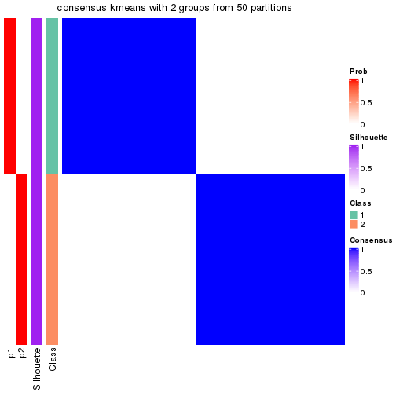</p>

</div>
<div id='tab-node-023-consensus-heatmap-2'>
<pre><code class="r">consensus_heatmap(res, k = 3)
</code></pre>

<p>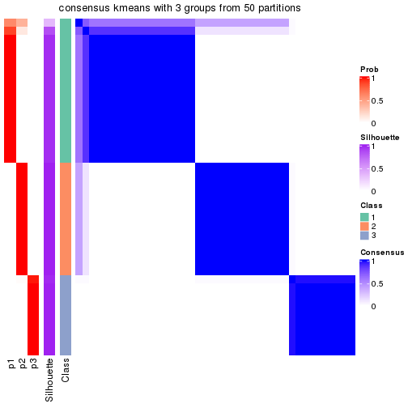</p>

</div>
<div id='tab-node-023-consensus-heatmap-3'>
<pre><code class="r">consensus_heatmap(res, k = 4)
</code></pre>

<p>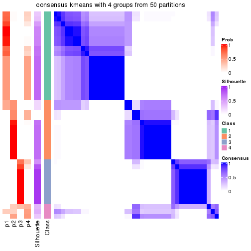</p>

</div>
<div id='tab-node-023-consensus-heatmap-4'>
<pre><code class="r">consensus_heatmap(res, k = 5)
</code></pre>

<p>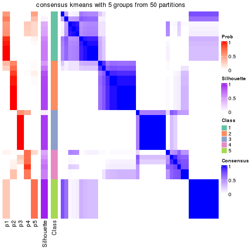</p>

</div>
<div id='tab-node-023-consensus-heatmap-5'>
<pre><code class="r">consensus_heatmap(res, k = 6)
</code></pre>

<p>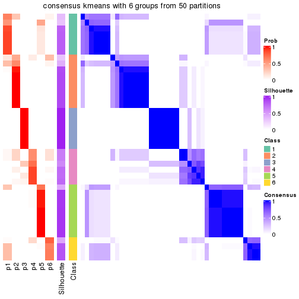</p>

</div>
<div id='tab-node-023-consensus-heatmap-6'>
<pre><code class="r">consensus_heatmap(res, k = 7)
</code></pre>

<p>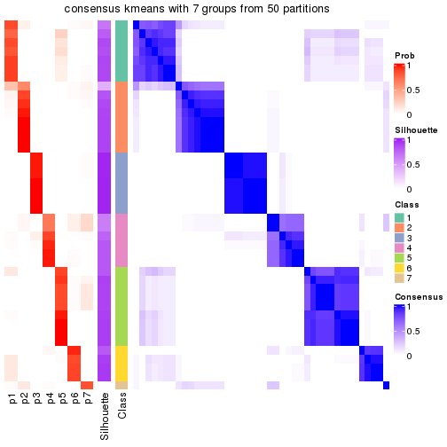</p>

</div>
<div id='tab-node-023-consensus-heatmap-7'>
<pre><code class="r">consensus_heatmap(res, k = 8)
</code></pre>

<p>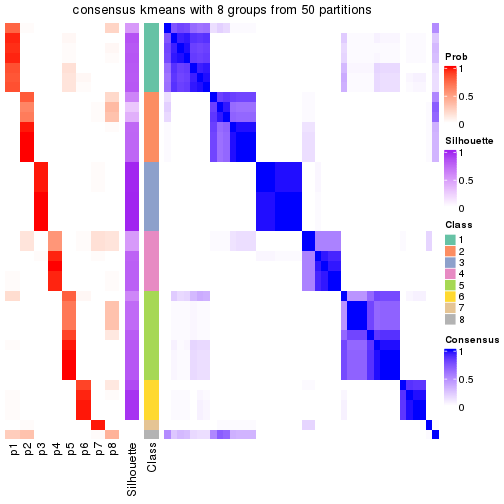</p>

</div>
</div>

Heatmaps for the membership of samples in all partitions to see how consistent they are:


<script>
$( function() {
	$( '#tabs-node-023-membership-heatmap' ).tabs();
} );
</script>
<div id='tabs-node-023-membership-heatmap'>
<ul>
<li><a href='#tab-node-023-membership-heatmap-1'>k = 2</a></li>
<li><a href='#tab-node-023-membership-heatmap-2'>k = 3</a></li>
<li><a href='#tab-node-023-membership-heatmap-3'>k = 4</a></li>
<li><a href='#tab-node-023-membership-heatmap-4'>k = 5</a></li>
<li><a href='#tab-node-023-membership-heatmap-5'>k = 6</a></li>
<li><a href='#tab-node-023-membership-heatmap-6'>k = 7</a></li>
<li><a href='#tab-node-023-membership-heatmap-7'>k = 8</a></li>
</ul>
<div id='tab-node-023-membership-heatmap-1'>
<pre><code class="r">membership_heatmap(res, k = 2)
</code></pre>

<p>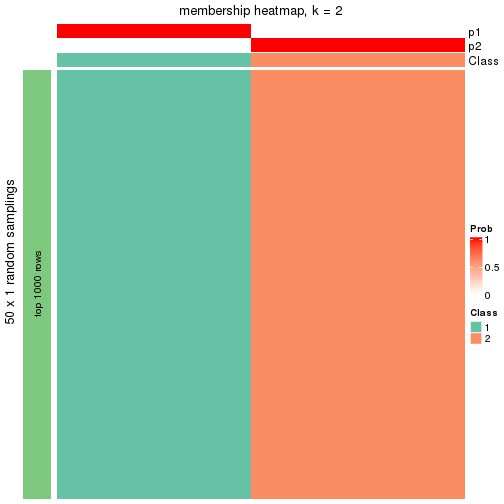</p>

</div>
<div id='tab-node-023-membership-heatmap-2'>
<pre><code class="r">membership_heatmap(res, k = 3)
</code></pre>

<p>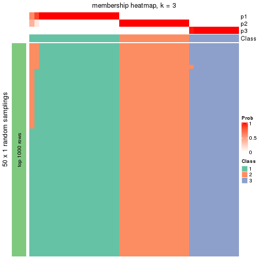</p>

</div>
<div id='tab-node-023-membership-heatmap-3'>
<pre><code class="r">membership_heatmap(res, k = 4)
</code></pre>

<p>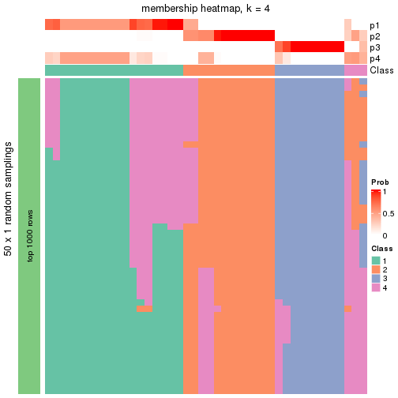</p>

</div>
<div id='tab-node-023-membership-heatmap-4'>
<pre><code class="r">membership_heatmap(res, k = 5)
</code></pre>

<p>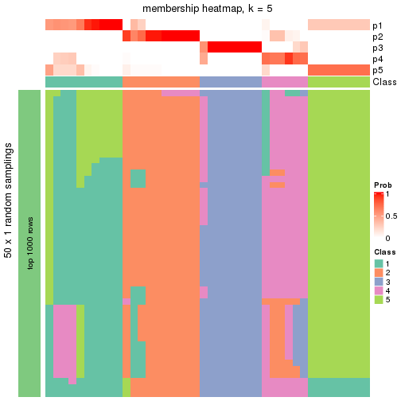</p>

</div>
<div id='tab-node-023-membership-heatmap-5'>
<pre><code class="r">membership_heatmap(res, k = 6)
</code></pre>

<p>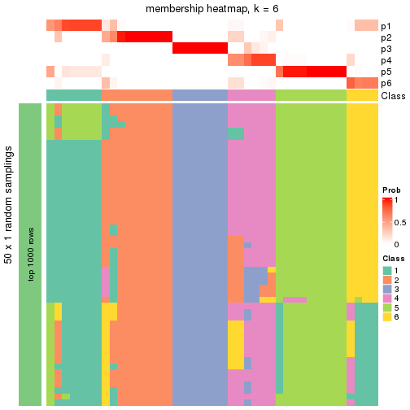</p>

</div>
<div id='tab-node-023-membership-heatmap-6'>
<pre><code class="r">membership_heatmap(res, k = 7)
</code></pre>

<p>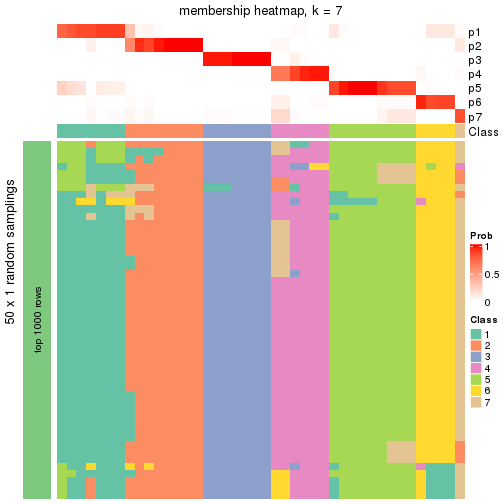</p>

</div>
<div id='tab-node-023-membership-heatmap-7'>
<pre><code class="r">membership_heatmap(res, k = 8)
</code></pre>

<p>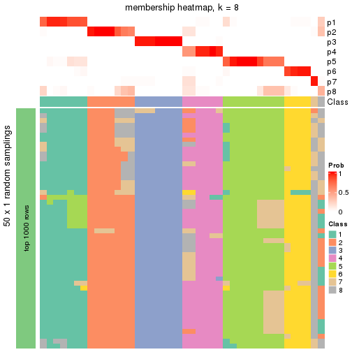</p>

</div>
</div>

As soon as the classes for columns are determined, the signatures
that are significantly different between subgroups can be looked for. 
Following are the heatmaps for signatures.


<script>
$( function() {
	$( '#tabs-node-023-get-signatures' ).tabs();
} );
</script>
<div id='tabs-node-023-get-signatures'>
<ul>
<li><a href='#tab-node-023-get-signatures-1'>k = 2</a></li>
<li><a href='#tab-node-023-get-signatures-2'>k = 3</a></li>
<li><a href='#tab-node-023-get-signatures-3'>k = 4</a></li>
<li><a href='#tab-node-023-get-signatures-4'>k = 5</a></li>
<li><a href='#tab-node-023-get-signatures-5'>k = 6</a></li>
<li><a href='#tab-node-023-get-signatures-6'>k = 7</a></li>
<li><a href='#tab-node-023-get-signatures-7'>k = 8</a></li>
</ul>
<div id='tab-node-023-get-signatures-1'>
<pre><code class="r">get_signatures(res, k = 2)
</code></pre>

<p>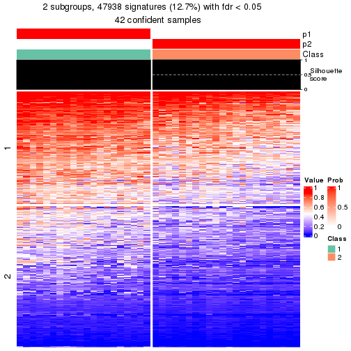</p>

</div>
<div id='tab-node-023-get-signatures-2'>
<pre><code class="r">get_signatures(res, k = 3)
</code></pre>

<p>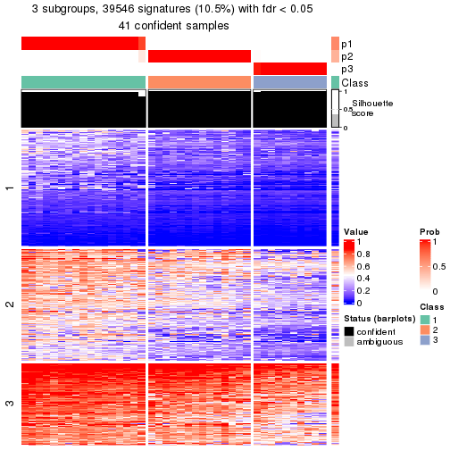</p>

</div>
<div id='tab-node-023-get-signatures-3'>
<pre><code class="r">get_signatures(res, k = 4)
</code></pre>

<p>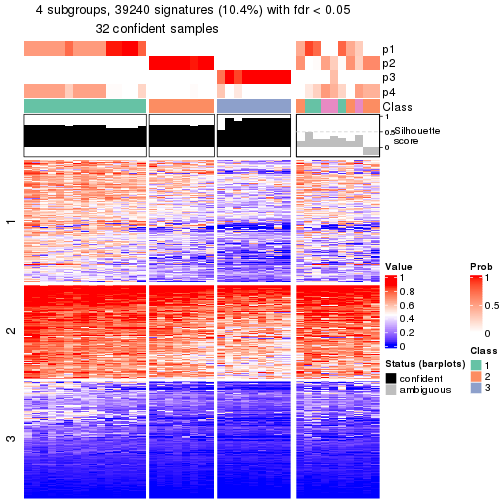</p>

</div>
<div id='tab-node-023-get-signatures-4'>
<pre><code class="r">get_signatures(res, k = 5)
</code></pre>

<p>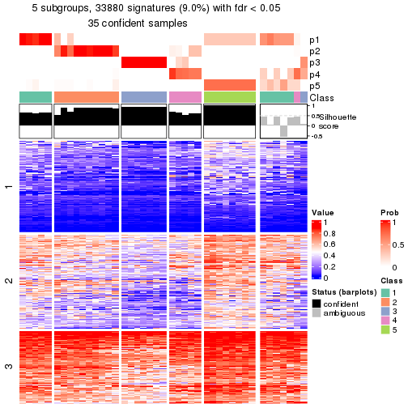</p>

</div>
<div id='tab-node-023-get-signatures-5'>
<pre><code class="r">get_signatures(res, k = 6)
</code></pre>

<p>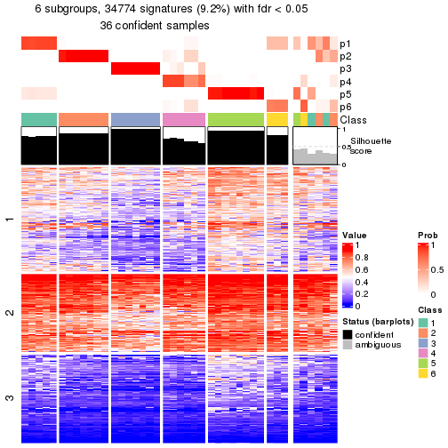</p>

</div>
<div id='tab-node-023-get-signatures-6'>
<pre><code class="r">get_signatures(res, k = 7)
</code></pre>

<p>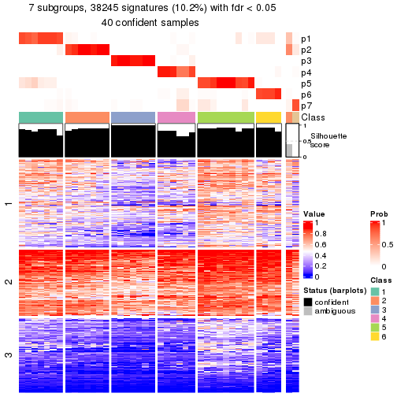</p>

</div>
<div id='tab-node-023-get-signatures-7'>
<pre><code class="r">get_signatures(res, k = 8)
</code></pre>

<p>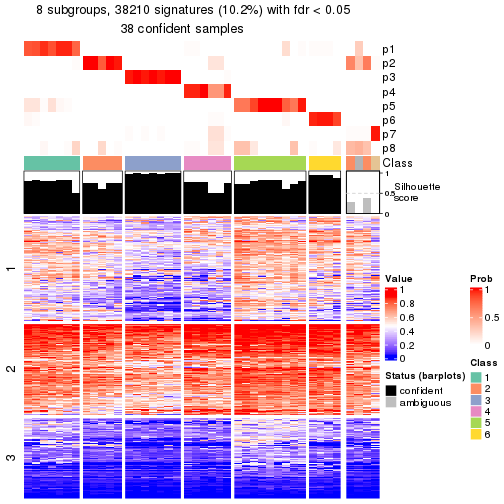</p>

</div>
</div>


Compare the overlap of signatures from different k:

```r
compare_signatures(res)
```

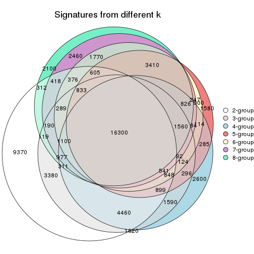

`get_signature()` returns a data frame invisibly. To get the list of signatures, the function
call should be assigned to a variable explicitly. In following code, if `plot` argument is set
to `FALSE`, no heatmap is plotted while only the differential analysis is performed.

```r
# code only for demonstration
tb = get_signature(res, k = ..., plot = FALSE)
```

An example of the output of `tb` is:

```
#>   which_row         fdr    mean_1    mean_2 scaled_mean_1 scaled_mean_2 km
#> 1        38 0.042760348  8.373488  9.131774    -0.5533452     0.5164555  1
#> 2        40 0.018707592  7.106213  8.469186    -0.6173731     0.5762149  1
#> 3        55 0.019134737 10.221463 11.207825    -0.6159697     0.5749050  1
#> 4        59 0.006059896  5.921854  7.869574    -0.6899429     0.6439467  1
#> 5        60 0.018055526  8.928898 10.211722    -0.6204761     0.5791110  1
#> 6        98 0.009384629 15.714769 14.887706     0.6635654    -0.6193277  2
...
```

The columns in `tb` are:

1. `which_row`: row indices corresponding to the input matrix.
2. `fdr`: FDR for the differential test. 
3. `mean_x`: The mean value in group x.
4. `scaled_mean_x`: The mean value in group x after rows are scaled.
5. `km`: Row groups if k-means clustering is applied to rows (which is done by automatically selecting number of clusters).

If there are too many signatures, `top_signatures = ...` can be set to only show the 
signatures with the highest FDRs:

```r
# code only for demonstration
# e.g. to show the top 500 most significant rows
tb = get_signature(res, k = ..., top_signatures = 500)
```

If the signatures are defined as these which are uniquely high in current group, `diff_method` argument
can be set to `"uniquely_high_in_one_group"`:

```r
# code only for demonstration
tb = get_signature(res, k = ..., diff_method = "uniquely_high_in_one_group")
```


UMAP plot which shows how samples are separated.


<script>
$( function() {
	$( '#tabs-node-023-dimension-reduction' ).tabs();
} );
</script>
<div id='tabs-node-023-dimension-reduction'>
<ul>
<li><a href='#tab-node-023-dimension-reduction-1'>k = 2</a></li>
<li><a href='#tab-node-023-dimension-reduction-2'>k = 3</a></li>
<li><a href='#tab-node-023-dimension-reduction-3'>k = 4</a></li>
<li><a href='#tab-node-023-dimension-reduction-4'>k = 5</a></li>
<li><a href='#tab-node-023-dimension-reduction-5'>k = 6</a></li>
<li><a href='#tab-node-023-dimension-reduction-6'>k = 7</a></li>
<li><a href='#tab-node-023-dimension-reduction-7'>k = 8</a></li>
</ul>
<div id='tab-node-023-dimension-reduction-1'>
<pre><code class="r">dimension_reduction(res, k = 2, method = &quot;UMAP&quot;)
</code></pre>

<p>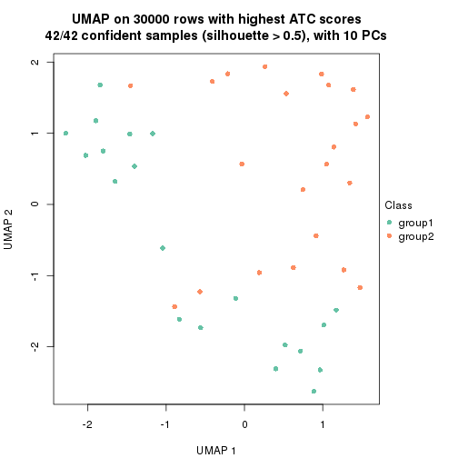</p>

</div>
<div id='tab-node-023-dimension-reduction-2'>
<pre><code class="r">dimension_reduction(res, k = 3, method = &quot;UMAP&quot;)
</code></pre>

<p>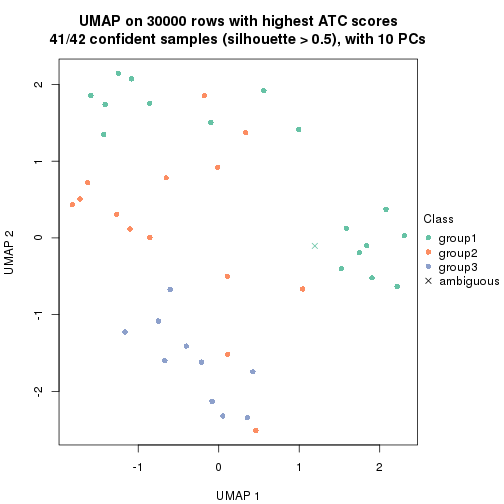</p>

</div>
<div id='tab-node-023-dimension-reduction-3'>
<pre><code class="r">dimension_reduction(res, k = 4, method = &quot;UMAP&quot;)
</code></pre>

<p>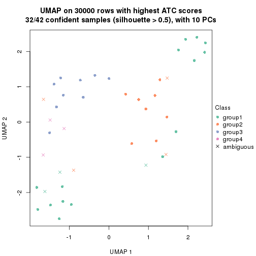</p>

</div>
<div id='tab-node-023-dimension-reduction-4'>
<pre><code class="r">dimension_reduction(res, k = 5, method = &quot;UMAP&quot;)
</code></pre>

<p>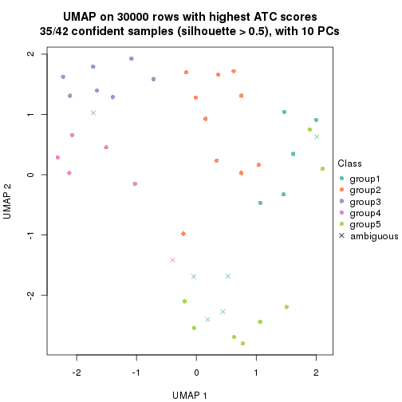</p>

</div>
<div id='tab-node-023-dimension-reduction-5'>
<pre><code class="r">dimension_reduction(res, k = 6, method = &quot;UMAP&quot;)
</code></pre>

<p>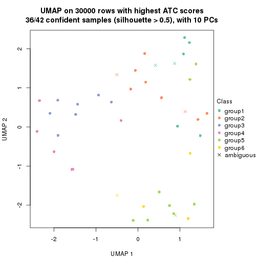</p>

</div>
<div id='tab-node-023-dimension-reduction-6'>
<pre><code class="r">dimension_reduction(res, k = 7, method = &quot;UMAP&quot;)
</code></pre>

<p>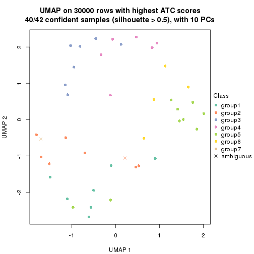</p>

</div>
<div id='tab-node-023-dimension-reduction-7'>
<pre><code class="r">dimension_reduction(res, k = 8, method = &quot;UMAP&quot;)
</code></pre>

<p>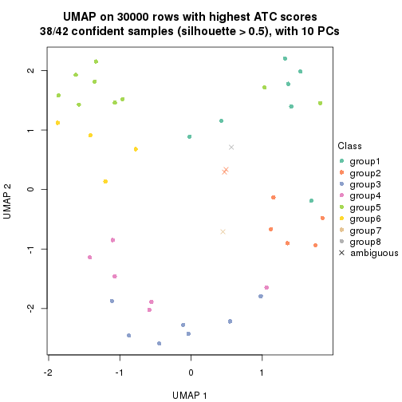</p>

</div>
</div>


Following heatmap shows how subgroups are split when increasing `k`:

```r
collect_classes(res)
```

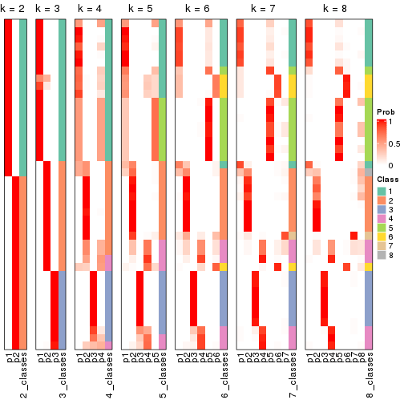


If matrix rows can be associated to genes, consider to use `functional_enrichment(res,
...)` to perform function enrichment for the signature genes. See [this vignette](https://jokergoo.github.io/cola_vignettes/functional_enrichment.html) for more detailed explanations.


 

---------------------------------------------------


### Node0231


Parent node: [Node023](#Node023).
Child nodes: 
                Node02121-leaf
        ,
                Node02122-leaf
        ,
                Node02123-leaf
        ,
                Node02211-leaf
        ,
                Node02212-leaf
        ,
                Node02213-leaf
        ,
                Node02214-leaf
        ,
                Node02311-leaf
        ,
                Node02312-leaf
        ,
                Node02313-leaf
        ,
                Node05121-leaf
        ,
                Node05122-leaf
        ,
                Node05123-leaf
        .


The object with results only for a single top-value method and a single partitioning method 
can be extracted as:

```r
res = res_rh["0231"]
```

A summary of `res` and all the functions that can be applied to it:

```r
res
```

```
#> A 'ConsensusPartition' object with k = 2, 3, 4, 5, 6, 7, 8.
#>   On a matrix with 30000 rows and 18 columns.
#>   Top rows (1000) are extracted by 'ATC' method.
#>   Subgroups are detected by 'skmeans' method.
#>   Performed in total 350 partitions by row resampling.
#>   Best k for subgroups seems to be 6.
#> 
#> Following methods can be applied to this 'ConsensusPartition' object:
#>  [1] "cola_report"             "collect_classes"         "collect_plots"          
#>  [4] "collect_stats"           "colnames"                "compare_partitions"     
#>  [7] "compare_signatures"      "consensus_heatmap"       "dimension_reduction"    
#> [10] "functional_enrichment"   "get_anno_col"            "get_anno"               
#> [13] "get_classes"             "get_consensus"           "get_matrix"             
#> [16] "get_membership"          "get_param"               "get_signatures"         
#> [19] "get_stats"               "is_best_k"               "is_stable_k"            
#> [22] "membership_heatmap"      "ncol"                    "nrow"                   
#> [25] "plot_ecdf"               "predict_classes"         "rownames"               
#> [28] "select_partition_number" "show"                    "suggest_best_k"         
#> [31] "test_to_known_factors"   "top_rows_heatmap"
```

`collect_plots()` function collects all the plots made from `res` for all `k` (number of subgroups)
into one single page to provide an easy and fast comparison between different `k`.

```r
collect_plots(res)
```

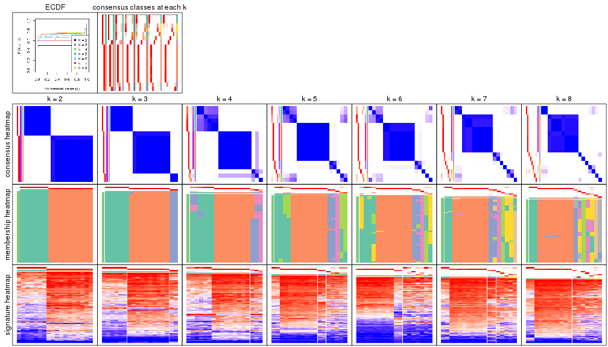

The plots are:

- The first row: a plot of the eCDF (empirical cumulative distribution
  function) curves of the consensus matrix for each `k` and the heatmap of
  predicted classes for each `k`.
- The second row: heatmaps of the consensus matrix for each `k`.
- The third row: heatmaps of the membership matrix for each `k`.
- The fouth row: heatmaps of the signatures for each `k`.

All the plots in panels can be made by individual functions and they are
plotted later in this section.

`select_partition_number()` produces several plots showing different
statistics for choosing "optimized" `k`. There are following statistics:

- eCDF curves of the consensus matrix for each `k`;
- 1-PAC. [The PAC score](https://en.wikipedia.org/wiki/Consensus_clustering#Over-interpretation_potential_of_consensus_clustering)
  measures the proportion of the ambiguous subgrouping.
- Mean silhouette score.
- Concordance. The mean probability of fiting the consensus subgroup labels in all
  partitions.
- Area increased. Denote $A_k$ as the area under the eCDF curve for current
  `k`, the area increased is defined as $A_k - A_{k-1}$.
- Rand index. The percent of pairs of samples that are both in a same cluster
  or both are not in a same cluster in the partition of k and k-1.
- Jaccard index. The ratio of pairs of samples are both in a same cluster in
  the partition of k and k-1 and the pairs of samples are both in a same
  cluster in the partition k or k-1.

The detailed explanations of these statistics can be found in [the _cola_
vignette](https://jokergoo.github.io/cola_vignettes/cola.html#toc_13).

Generally speaking, higher 1-PAC score, higher mean silhouette score or higher
concordance corresponds to better partition. Rand index and Jaccard index
measure how similar the current partition is compared to partition with `k-1`.
If they are too similar, we won't accept `k` is better than `k-1`.

```r
select_partition_number(res)
```

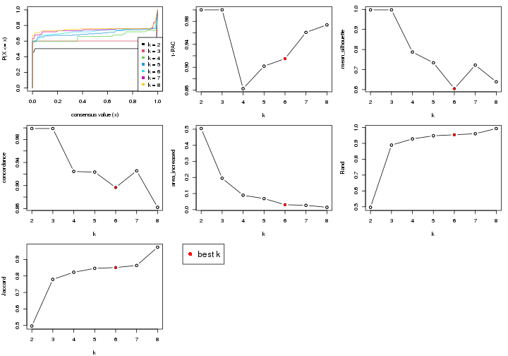

The numeric values for all these statistics can be obtained by `get_stats()`.

```r
get_stats(res)
```

```
#>   k 1-PAC mean_silhouette concordance area_increased  Rand Jaccard
#> 2 2 1.000           0.998       0.999         0.5041 0.497   0.497
#> 3 3 1.000           0.998       0.999         0.1953 0.889   0.779
#> 4 4 0.863           0.787       0.924         0.0895 0.928   0.823
#> 5 5 0.902           0.734       0.923         0.0687 0.948   0.846
#> 6 6 0.915           0.605       0.897         0.0308 0.954   0.851
#> 7 7 0.961           0.722       0.926         0.0270 0.961   0.864
#> 8 8 0.974           0.639       0.862         0.0145 0.993   0.974
```

`suggest_best_k()` suggests the best $k$ based on these statistics. The rules are as follows:

- All $k$ with Jaccard index larger than 0.95 are removed because increasing
  $k$ does not provide enough extra information. If all $k$ are removed, it is
  marked as no subgroup is detected.
- For all $k$ with 1-PAC score larger than 0.9, the maximal $k$ is taken as
  the best $k$, and other $k$ are marked as optional $k$.
- If it does not fit the second rule. The $k$ with the maximal vote of the
  highest 1-PAC score, highest mean silhouette, and highest concordance is
  taken as the best $k$.

```r
suggest_best_k(res)
```

```
#> [1] 6
#> attr(,"optional")
#> [1] 2 3 5
```

There is also optional best $k$ = 2 3 5 that is worth to check.

Following is the table of the partitions (You need to click the **show/hide
code output** link to see it). The membership matrix (columns with name `p*`)
is inferred by
[`clue::cl_consensus()`](https://www.rdocumentation.org/link/cl_consensus?package=clue)
function with the `SE` method. Basically the value in the membership matrix
represents the probability to belong to a certain group. The finall subgroup
label for an item is determined with the group with highest probability it
belongs to.

In `get_classes()` function, the entropy is calculated from the membership
matrix and the silhouette score is calculated from the consensus matrix.


<script>
$( function() {
	$( '#tabs-node-0231-get-classes' ).tabs();
} );
</script>
<div id='tabs-node-0231-get-classes'>
<ul>
<li><a href='#tab-node-0231-get-classes-1'>k = 2</a></li>
<li><a href='#tab-node-0231-get-classes-2'>k = 3</a></li>
<li><a href='#tab-node-0231-get-classes-3'>k = 4</a></li>
<li><a href='#tab-node-0231-get-classes-4'>k = 5</a></li>
<li><a href='#tab-node-0231-get-classes-5'>k = 6</a></li>
<li><a href='#tab-node-0231-get-classes-6'>k = 7</a></li>
<li><a href='#tab-node-0231-get-classes-7'>k = 8</a></li>
</ul>

<div id='tab-node-0231-get-classes-1'>
<p><a id='tab-node-0231-get-classes-1-a' style='color:#0366d6' href='#'>show/hide code output</a></p>
<pre><code class="r">cbind(get_classes(res, k = 2), get_membership(res, k = 2))
</code></pre>

<pre><code>#&gt;                 class entropy silhouette   p1   p2
#&gt; TCGA.KK.A8IA.01     1   0.000      1.000 1.00 0.00
#&gt; TCGA.J9.A8CL.01     2   0.000      0.998 0.00 1.00
#&gt; TCGA.G9.6361.01     1   0.000      1.000 1.00 0.00
#&gt; TCGA.KC.A4BV.01     1   0.000      1.000 1.00 0.00
#&gt; TCGA.EJ.7315.01     1   0.000      1.000 1.00 0.00
#&gt; TCGA.YL.A9WK.01     2   0.000      0.998 0.00 1.00
#&gt; TCGA.HC.7078.01     2   0.000      0.998 0.00 1.00
#&gt; TCGA.FC.A5OB.01     2   0.000      0.998 0.00 1.00
#&gt; TCGA.J9.A52D.01     2   0.000      0.998 0.00 1.00
#&gt; TCGA.J4.A83I.01     1   0.000      1.000 1.00 0.00
#&gt; TCGA.XQ.A8TA.01     2   0.000      0.998 0.00 1.00
#&gt; TCGA.KK.A7AY.01     1   0.000      1.000 1.00 0.00
#&gt; TCGA.EJ.5494.01     2   0.000      0.998 0.00 1.00
#&gt; TCGA.CH.5772.01     2   0.000      0.998 0.00 1.00
#&gt; TCGA.YL.A8SH.01     2   0.000      0.998 0.00 1.00
#&gt; TCGA.HC.A8CY.01     1   0.000      1.000 1.00 0.00
#&gt; TCGA.KK.A7AW.01     2   0.141      0.980 0.02 0.98
#&gt; TCGA.YL.A8SQ.01     2   0.000      0.998 0.00 1.00
</code></pre>

<script>
$('#tab-node-0231-get-classes-1-a').parent().next().next().hide();
$('#tab-node-0231-get-classes-1-a').click(function(){
  $('#tab-node-0231-get-classes-1-a').parent().next().next().toggle();
  return(false);
});
</script>
</div>

<div id='tab-node-0231-get-classes-2'>
<p><a id='tab-node-0231-get-classes-2-a' style='color:#0366d6' href='#'>show/hide code output</a></p>
<pre><code class="r">cbind(get_classes(res, k = 3), get_membership(res, k = 3))
</code></pre>

<pre><code>#&gt;                 class entropy silhouette p1   p2   p3
#&gt; TCGA.KK.A8IA.01     1  0.0000      1.000  1 0.00 0.00
#&gt; TCGA.J9.A8CL.01     2  0.0000      0.998  0 1.00 0.00
#&gt; TCGA.G9.6361.01     1  0.0000      1.000  1 0.00 0.00
#&gt; TCGA.KC.A4BV.01     1  0.0000      1.000  1 0.00 0.00
#&gt; TCGA.EJ.7315.01     1  0.0000      1.000  1 0.00 0.00
#&gt; TCGA.YL.A9WK.01     2  0.0000      0.998  0 1.00 0.00
#&gt; TCGA.HC.7078.01     2  0.0000      0.998  0 1.00 0.00
#&gt; TCGA.FC.A5OB.01     2  0.0892      0.980  0 0.98 0.02
#&gt; TCGA.J9.A52D.01     2  0.0000      0.998  0 1.00 0.00
#&gt; TCGA.J4.A83I.01     1  0.0000      1.000  1 0.00 0.00
#&gt; TCGA.XQ.A8TA.01     2  0.0000      0.998  0 1.00 0.00
#&gt; TCGA.KK.A7AY.01     1  0.0000      1.000  1 0.00 0.00
#&gt; TCGA.EJ.5494.01     2  0.0000      0.998  0 1.00 0.00
#&gt; TCGA.CH.5772.01     2  0.0000      0.998  0 1.00 0.00
#&gt; TCGA.YL.A8SH.01     2  0.0000      0.998  0 1.00 0.00
#&gt; TCGA.HC.A8CY.01     3  0.0000      1.000  0 0.00 1.00
#&gt; TCGA.KK.A7AW.01     3  0.0000      1.000  0 0.00 1.00
#&gt; TCGA.YL.A8SQ.01     2  0.0000      0.998  0 1.00 0.00
</code></pre>

<script>
$('#tab-node-0231-get-classes-2-a').parent().next().next().hide();
$('#tab-node-0231-get-classes-2-a').click(function(){
  $('#tab-node-0231-get-classes-2-a').parent().next().next().toggle();
  return(false);
});
</script>
</div>

<div id='tab-node-0231-get-classes-3'>
<p><a id='tab-node-0231-get-classes-3-a' style='color:#0366d6' href='#'>show/hide code output</a></p>
<pre><code class="r">cbind(get_classes(res, k = 4), get_membership(res, k = 4))
</code></pre>

<pre><code>#&gt;                 class entropy silhouette   p1   p2   p3   p4
#&gt; TCGA.KK.A8IA.01     1  0.2345      0.824 0.90 0.00 0.00 0.10
#&gt; TCGA.J9.A8CL.01     2  0.0000      1.000 0.00 1.00 0.00 0.00
#&gt; TCGA.G9.6361.01     1  0.0000      0.873 1.00 0.00 0.00 0.00
#&gt; TCGA.KC.A4BV.01     1  0.4134      0.769 0.74 0.00 0.00 0.26
#&gt; TCGA.EJ.7315.01     1  0.4134      0.769 0.74 0.00 0.00 0.26
#&gt; TCGA.YL.A9WK.01     2  0.0000      1.000 0.00 1.00 0.00 0.00
#&gt; TCGA.HC.7078.01     2  0.0000      1.000 0.00 1.00 0.00 0.00
#&gt; TCGA.FC.A5OB.01     3  0.4713      0.308 0.00 0.36 0.64 0.00
#&gt; TCGA.J9.A52D.01     2  0.0000      1.000 0.00 1.00 0.00 0.00
#&gt; TCGA.J4.A83I.01     1  0.0000      0.873 1.00 0.00 0.00 0.00
#&gt; TCGA.XQ.A8TA.01     2  0.0000      1.000 0.00 1.00 0.00 0.00
#&gt; TCGA.KK.A7AY.01     1  0.0707      0.868 0.98 0.00 0.00 0.02
#&gt; TCGA.EJ.5494.01     2  0.0000      1.000 0.00 1.00 0.00 0.00
#&gt; TCGA.CH.5772.01     2  0.0000      1.000 0.00 1.00 0.00 0.00
#&gt; TCGA.YL.A8SH.01     2  0.0000      1.000 0.00 1.00 0.00 0.00
#&gt; TCGA.HC.A8CY.01     4  0.4713      0.000 0.00 0.00 0.36 0.64
#&gt; TCGA.KK.A7AW.01     3  0.0000     -0.111 0.00 0.00 1.00 0.00
#&gt; TCGA.YL.A8SQ.01     2  0.0000      1.000 0.00 1.00 0.00 0.00
</code></pre>

<script>
$('#tab-node-0231-get-classes-3-a').parent().next().next().hide();
$('#tab-node-0231-get-classes-3-a').click(function(){
  $('#tab-node-0231-get-classes-3-a').parent().next().next().toggle();
  return(false);
});
</script>
</div>

<div id='tab-node-0231-get-classes-4'>
<p><a id='tab-node-0231-get-classes-4-a' style='color:#0366d6' href='#'>show/hide code output</a></p>
<pre><code class="r">cbind(get_classes(res, k = 5), get_membership(res, k = 5))
</code></pre>

<pre><code>#&gt;                 class entropy silhouette   p1   p2   p3  p4   p5
#&gt; TCGA.KK.A8IA.01     5   0.202      0.432 0.10 0.00 0.00 0.0 0.90
#&gt; TCGA.J9.A8CL.01     2   0.000      1.000 0.00 1.00 0.00 0.0 0.00
#&gt; TCGA.G9.6361.01     1   0.398      0.440 0.66 0.00 0.00 0.0 0.34
#&gt; TCGA.KC.A4BV.01     1   0.141      0.591 0.94 0.00 0.00 0.0 0.06
#&gt; TCGA.EJ.7315.01     1   0.000      0.555 1.00 0.00 0.00 0.0 0.00
#&gt; TCGA.YL.A9WK.01     2   0.000      1.000 0.00 1.00 0.00 0.0 0.00
#&gt; TCGA.HC.7078.01     2   0.000      1.000 0.00 1.00 0.00 0.0 0.00
#&gt; TCGA.FC.A5OB.01     3   0.104      0.858 0.00 0.04 0.96 0.0 0.00
#&gt; TCGA.J9.A52D.01     2   0.000      1.000 0.00 1.00 0.00 0.0 0.00
#&gt; TCGA.J4.A83I.01     1   0.418      0.306 0.60 0.00 0.00 0.0 0.40
#&gt; TCGA.XQ.A8TA.01     2   0.000      1.000 0.00 1.00 0.00 0.0 0.00
#&gt; TCGA.KK.A7AY.01     5   0.446      0.179 0.32 0.00 0.02 0.0 0.66
#&gt; TCGA.EJ.5494.01     2   0.000      1.000 0.00 1.00 0.00 0.0 0.00
#&gt; TCGA.CH.5772.01     2   0.000      1.000 0.00 1.00 0.00 0.0 0.00
#&gt; TCGA.YL.A8SH.01     2   0.000      1.000 0.00 1.00 0.00 0.0 0.00
#&gt; TCGA.HC.A8CY.01     4   0.000      0.000 0.00 0.00 0.00 1.0 0.00
#&gt; TCGA.KK.A7AW.01     3   0.202      0.851 0.00 0.00 0.90 0.1 0.00
#&gt; TCGA.YL.A8SQ.01     2   0.000      1.000 0.00 1.00 0.00 0.0 0.00
</code></pre>

<script>
$('#tab-node-0231-get-classes-4-a').parent().next().next().hide();
$('#tab-node-0231-get-classes-4-a').click(function(){
  $('#tab-node-0231-get-classes-4-a').parent().next().next().toggle();
  return(false);
});
</script>
</div>

<div id='tab-node-0231-get-classes-5'>
<p><a id='tab-node-0231-get-classes-5-a' style='color:#0366d6' href='#'>show/hide code output</a></p>
<pre><code class="r">cbind(get_classes(res, k = 6), get_membership(res, k = 6))
</code></pre>

<pre><code>#&gt;                 class entropy silhouette   p1   p2   p3   p4   p5   p6
#&gt; TCGA.KK.A8IA.01     5  0.5801      0.000 0.24 0.00 0.00 0.00 0.50 0.26
#&gt; TCGA.J9.A8CL.01     2  0.0000      0.995 0.00 1.00 0.00 0.00 0.00 0.00
#&gt; TCGA.G9.6361.01     1  0.1092      0.487 0.96 0.00 0.00 0.00 0.02 0.02
#&gt; TCGA.KC.A4BV.01     1  0.4806     -0.629 0.48 0.00 0.02 0.00 0.02 0.48
#&gt; TCGA.EJ.7315.01     6  0.3409      0.000 0.30 0.00 0.00 0.00 0.00 0.70
#&gt; TCGA.YL.A9WK.01     2  0.0000      0.995 0.00 1.00 0.00 0.00 0.00 0.00
#&gt; TCGA.HC.7078.01     2  0.0000      0.995 0.00 1.00 0.00 0.00 0.00 0.00
#&gt; TCGA.FC.A5OB.01     3  0.3324      0.711 0.00 0.06 0.84 0.00 0.08 0.02
#&gt; TCGA.J9.A52D.01     2  0.0547      0.982 0.00 0.98 0.00 0.00 0.00 0.02
#&gt; TCGA.J4.A83I.01     1  0.0000      0.500 1.00 0.00 0.00 0.00 0.00 0.00
#&gt; TCGA.XQ.A8TA.01     2  0.0547      0.982 0.00 0.98 0.00 0.00 0.00 0.02
#&gt; TCGA.KK.A7AY.01     1  0.3828      0.201 0.56 0.00 0.00 0.00 0.44 0.00
#&gt; TCGA.EJ.5494.01     2  0.0000      0.995 0.00 1.00 0.00 0.00 0.00 0.00
#&gt; TCGA.CH.5772.01     2  0.0000      0.995 0.00 1.00 0.00 0.00 0.00 0.00
#&gt; TCGA.YL.A8SH.01     2  0.0000      0.995 0.00 1.00 0.00 0.00 0.00 0.00
#&gt; TCGA.HC.A8CY.01     4  0.0000      0.000 0.00 0.00 0.00 1.00 0.00 0.00
#&gt; TCGA.KK.A7AW.01     3  0.2048      0.689 0.00 0.00 0.88 0.12 0.00 0.00
#&gt; TCGA.YL.A8SQ.01     2  0.0000      0.995 0.00 1.00 0.00 0.00 0.00 0.00
</code></pre>

<script>
$('#tab-node-0231-get-classes-5-a').parent().next().next().hide();
$('#tab-node-0231-get-classes-5-a').click(function(){
  $('#tab-node-0231-get-classes-5-a').parent().next().next().toggle();
  return(false);
});
</script>
</div>

<div id='tab-node-0231-get-classes-6'>
<p><a id='tab-node-0231-get-classes-6-a' style='color:#0366d6' href='#'>show/hide code output</a></p>
<pre><code class="r">cbind(get_classes(res, k = 7), get_membership(res, k = 7))
</code></pre>

<pre><code>#&gt;                 class entropy silhouette   p1   p2   p3   p4   p5   p6   p7
#&gt; TCGA.KK.A8IA.01     5  0.1433      0.000 0.08 0.00 0.00 0.00 0.92 0.00 0.00
#&gt; TCGA.J9.A8CL.01     2  0.0000      0.988 0.00 1.00 0.00 0.00 0.00 0.00 0.00
#&gt; TCGA.G9.6361.01     1  0.0504      0.959 0.98 0.00 0.00 0.00 0.00 0.00 0.02
#&gt; TCGA.KC.A4BV.01     6  0.4901      0.370 0.40 0.00 0.00 0.00 0.02 0.52 0.06
#&gt; TCGA.EJ.7315.01     6  0.1433      0.523 0.08 0.00 0.00 0.00 0.00 0.92 0.00
#&gt; TCGA.YL.A9WK.01     2  0.0000      0.988 0.00 1.00 0.00 0.00 0.00 0.00 0.00
#&gt; TCGA.HC.7078.01     2  0.0000      0.988 0.00 1.00 0.00 0.00 0.00 0.00 0.00
#&gt; TCGA.FC.A5OB.01     3  0.4831      0.680 0.00 0.02 0.72 0.00 0.06 0.08 0.12
#&gt; TCGA.J9.A52D.01     2  0.1006      0.970 0.00 0.96 0.02 0.00 0.00 0.00 0.02
#&gt; TCGA.J4.A83I.01     1  0.0504      0.959 0.98 0.00 0.00 0.00 0.00 0.00 0.02
#&gt; TCGA.XQ.A8TA.01     2  0.1006      0.970 0.00 0.96 0.02 0.00 0.00 0.00 0.02
#&gt; TCGA.KK.A7AY.01     7  0.2906      0.000 0.18 0.00 0.00 0.00 0.02 0.00 0.80
#&gt; TCGA.EJ.5494.01     2  0.0000      0.988 0.00 1.00 0.00 0.00 0.00 0.00 0.00
#&gt; TCGA.CH.5772.01     2  0.0000      0.988 0.00 1.00 0.00 0.00 0.00 0.00 0.00
#&gt; TCGA.YL.A8SH.01     2  0.0504      0.980 0.00 0.98 0.02 0.00 0.00 0.00 0.00
#&gt; TCGA.HC.A8CY.01     4  0.0000      0.000 0.00 0.00 0.00 1.00 0.00 0.00 0.00
#&gt; TCGA.KK.A7AW.01     3  0.1433      0.664 0.00 0.00 0.92 0.08 0.00 0.00 0.00
#&gt; TCGA.YL.A8SQ.01     2  0.0000      0.988 0.00 1.00 0.00 0.00 0.00 0.00 0.00
</code></pre>

<script>
$('#tab-node-0231-get-classes-6-a').parent().next().next().hide();
$('#tab-node-0231-get-classes-6-a').click(function(){
  $('#tab-node-0231-get-classes-6-a').parent().next().next().toggle();
  return(false);
});
</script>
</div>

<div id='tab-node-0231-get-classes-7'>
<p><a id='tab-node-0231-get-classes-7-a' style='color:#0366d6' href='#'>show/hide code output</a></p>
<pre><code class="r">cbind(get_classes(res, k = 8), get_membership(res, k = 8))
</code></pre>

<pre><code>#&gt;                 class entropy silhouette   p1   p2   p3 p4   p5   p6   p7   p8
#&gt; TCGA.KK.A8IA.01     5  0.0000      0.000 0.00 0.00 0.00  0 1.00 0.00 0.00 0.00
#&gt; TCGA.J9.A8CL.01     2  0.0471      0.981 0.00 0.98 0.02  0 0.00 0.00 0.00 0.00
#&gt; TCGA.G9.6361.01     1  0.0000      1.000 1.00 0.00 0.00  0 0.00 0.00 0.00 0.00
#&gt; TCGA.KC.A4BV.01     6  0.6386      0.306 0.26 0.00 0.22  0 0.02 0.42 0.08 0.00
#&gt; TCGA.EJ.7315.01     6  0.1341      0.374 0.08 0.00 0.00  0 0.00 0.92 0.00 0.00
#&gt; TCGA.YL.A9WK.01     2  0.0000      0.985 0.00 1.00 0.00  0 0.00 0.00 0.00 0.00
#&gt; TCGA.HC.7078.01     2  0.0471      0.981 0.00 0.98 0.02  0 0.00 0.00 0.00 0.00
#&gt; TCGA.FC.A5OB.01     3  0.2650      0.000 0.00 0.00 0.76  0 0.00 0.00 0.00 0.24
#&gt; TCGA.J9.A52D.01     2  0.0471      0.977 0.00 0.98 0.00  0 0.00 0.02 0.00 0.00
#&gt; TCGA.J4.A83I.01     1  0.0000      1.000 1.00 0.00 0.00  0 0.00 0.00 0.00 0.00
#&gt; TCGA.XQ.A8TA.01     2  0.0941      0.963 0.00 0.96 0.02  0 0.00 0.02 0.00 0.00
#&gt; TCGA.KK.A7AY.01     7  0.1091      0.000 0.06 0.00 0.00  0 0.00 0.00 0.94 0.00
#&gt; TCGA.EJ.5494.01     2  0.0471      0.981 0.00 0.98 0.02  0 0.00 0.00 0.00 0.00
#&gt; TCGA.CH.5772.01     2  0.0000      0.985 0.00 1.00 0.00  0 0.00 0.00 0.00 0.00
#&gt; TCGA.YL.A8SH.01     2  0.0000      0.985 0.00 1.00 0.00  0 0.00 0.00 0.00 0.00
#&gt; TCGA.HC.A8CY.01     4  0.0000      0.000 0.00 0.00 0.00  1 0.00 0.00 0.00 0.00
#&gt; TCGA.KK.A7AW.01     8  0.0000      0.000 0.00 0.00 0.00  0 0.00 0.00 0.00 1.00
#&gt; TCGA.YL.A8SQ.01     2  0.0000      0.985 0.00 1.00 0.00  0 0.00 0.00 0.00 0.00
</code></pre>

<script>
$('#tab-node-0231-get-classes-7-a').parent().next().next().hide();
$('#tab-node-0231-get-classes-7-a').click(function(){
  $('#tab-node-0231-get-classes-7-a').parent().next().next().toggle();
  return(false);
});
</script>
</div>
</div>

Heatmaps for the consensus matrix. It visualizes the probability of two
samples to be in a same group.


<script>
$( function() {
	$( '#tabs-node-0231-consensus-heatmap' ).tabs();
} );
</script>
<div id='tabs-node-0231-consensus-heatmap'>
<ul>
<li><a href='#tab-node-0231-consensus-heatmap-1'>k = 2</a></li>
<li><a href='#tab-node-0231-consensus-heatmap-2'>k = 3</a></li>
<li><a href='#tab-node-0231-consensus-heatmap-3'>k = 4</a></li>
<li><a href='#tab-node-0231-consensus-heatmap-4'>k = 5</a></li>
<li><a href='#tab-node-0231-consensus-heatmap-5'>k = 6</a></li>
<li><a href='#tab-node-0231-consensus-heatmap-6'>k = 7</a></li>
<li><a href='#tab-node-0231-consensus-heatmap-7'>k = 8</a></li>
</ul>
<div id='tab-node-0231-consensus-heatmap-1'>
<pre><code class="r">consensus_heatmap(res, k = 2)
</code></pre>

<p>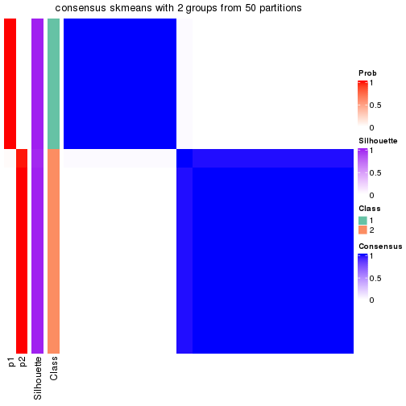</p>

</div>
<div id='tab-node-0231-consensus-heatmap-2'>
<pre><code class="r">consensus_heatmap(res, k = 3)
</code></pre>

<p>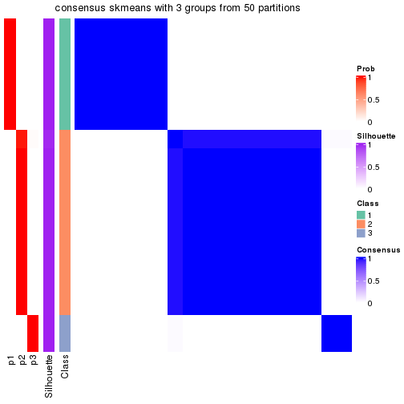</p>

</div>
<div id='tab-node-0231-consensus-heatmap-3'>
<pre><code class="r">consensus_heatmap(res, k = 4)
</code></pre>

<p>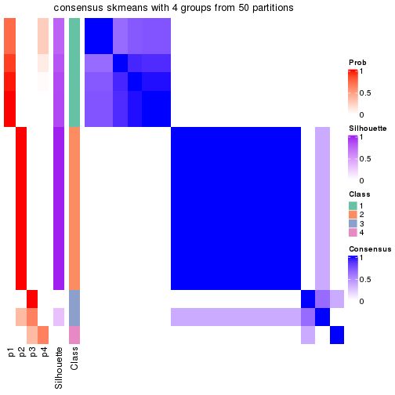</p>

</div>
<div id='tab-node-0231-consensus-heatmap-4'>
<pre><code class="r">consensus_heatmap(res, k = 5)
</code></pre>

<p>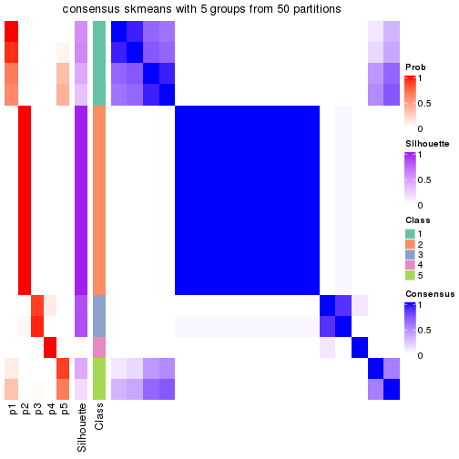</p>

</div>
<div id='tab-node-0231-consensus-heatmap-5'>
<pre><code class="r">consensus_heatmap(res, k = 6)
</code></pre>

<p>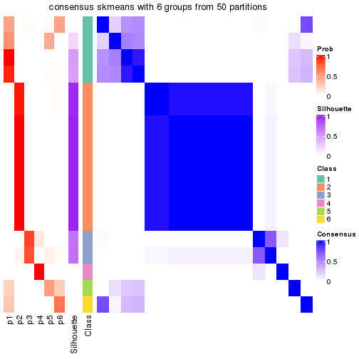</p>

</div>
<div id='tab-node-0231-consensus-heatmap-6'>
<pre><code class="r">consensus_heatmap(res, k = 7)
</code></pre>

<p>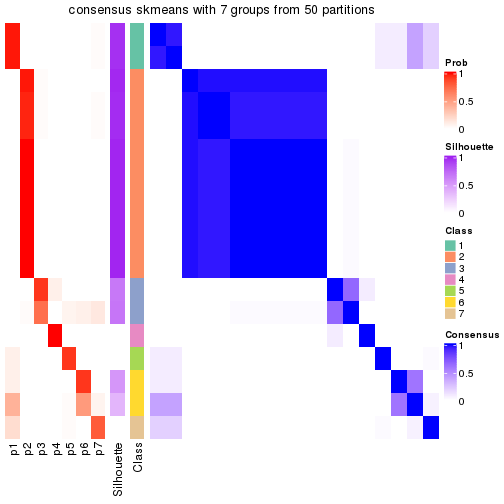</p>

</div>
<div id='tab-node-0231-consensus-heatmap-7'>
<pre><code class="r">consensus_heatmap(res, k = 8)
</code></pre>

<p>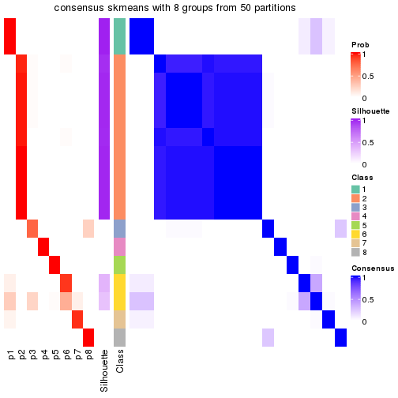</p>

</div>
</div>

Heatmaps for the membership of samples in all partitions to see how consistent they are:


<script>
$( function() {
	$( '#tabs-node-0231-membership-heatmap' ).tabs();
} );
</script>
<div id='tabs-node-0231-membership-heatmap'>
<ul>
<li><a href='#tab-node-0231-membership-heatmap-1'>k = 2</a></li>
<li><a href='#tab-node-0231-membership-heatmap-2'>k = 3</a></li>
<li><a href='#tab-node-0231-membership-heatmap-3'>k = 4</a></li>
<li><a href='#tab-node-0231-membership-heatmap-4'>k = 5</a></li>
<li><a href='#tab-node-0231-membership-heatmap-5'>k = 6</a></li>
<li><a href='#tab-node-0231-membership-heatmap-6'>k = 7</a></li>
<li><a href='#tab-node-0231-membership-heatmap-7'>k = 8</a></li>
</ul>
<div id='tab-node-0231-membership-heatmap-1'>
<pre><code class="r">membership_heatmap(res, k = 2)
</code></pre>

<p>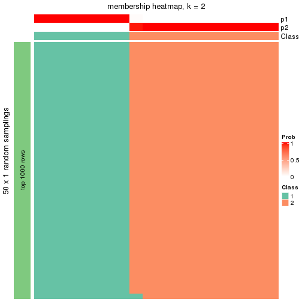</p>

</div>
<div id='tab-node-0231-membership-heatmap-2'>
<pre><code class="r">membership_heatmap(res, k = 3)
</code></pre>

<p>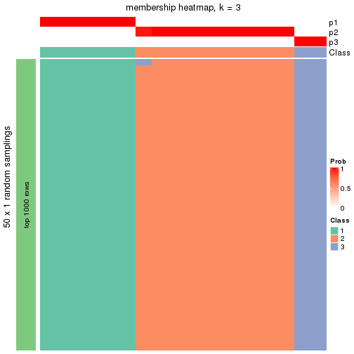</p>

</div>
<div id='tab-node-0231-membership-heatmap-3'>
<pre><code class="r">membership_heatmap(res, k = 4)
</code></pre>

<p>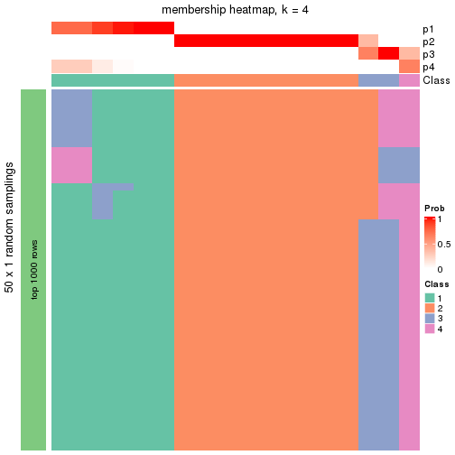</p>

</div>
<div id='tab-node-0231-membership-heatmap-4'>
<pre><code class="r">membership_heatmap(res, k = 5)
</code></pre>

<p>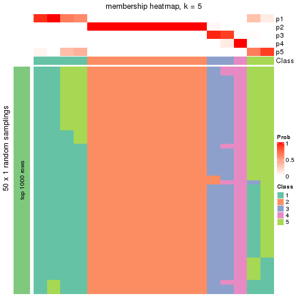</p>

</div>
<div id='tab-node-0231-membership-heatmap-5'>
<pre><code class="r">membership_heatmap(res, k = 6)
</code></pre>

<p></p>

</div>
<div id='tab-node-0231-membership-heatmap-6'>
<pre><code class="r">membership_heatmap(res, k = 7)
</code></pre>

<p>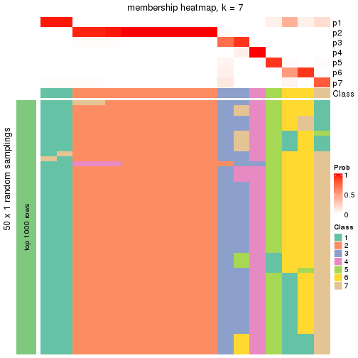</p>

</div>
<div id='tab-node-0231-membership-heatmap-7'>
<pre><code class="r">membership_heatmap(res, k = 8)
</code></pre>

<p>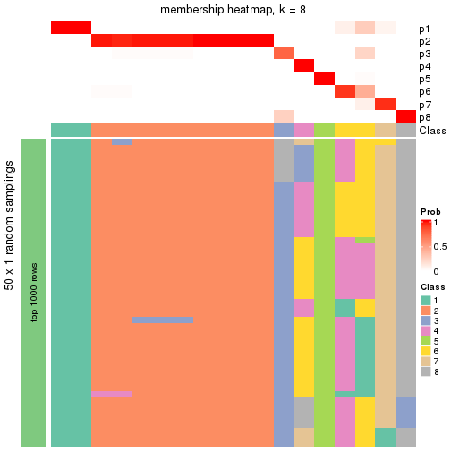</p>

</div>
</div>

As soon as the classes for columns are determined, the signatures
that are significantly different between subgroups can be looked for. 
Following are the heatmaps for signatures.


<script>
$( function() {
	$( '#tabs-node-0231-get-signatures' ).tabs();
} );
</script>
<div id='tabs-node-0231-get-signatures'>
<ul>
<li><a href='#tab-node-0231-get-signatures-1'>k = 2</a></li>
<li><a href='#tab-node-0231-get-signatures-2'>k = 3</a></li>
<li><a href='#tab-node-0231-get-signatures-3'>k = 4</a></li>
<li><a href='#tab-node-0231-get-signatures-4'>k = 5</a></li>
<li><a href='#tab-node-0231-get-signatures-5'>k = 6</a></li>
<li><a href='#tab-node-0231-get-signatures-6'>k = 7</a></li>
<li><a href='#tab-node-0231-get-signatures-7'>k = 8</a></li>
</ul>
<div id='tab-node-0231-get-signatures-1'>
<pre><code class="r">get_signatures(res, k = 2)
</code></pre>

<p>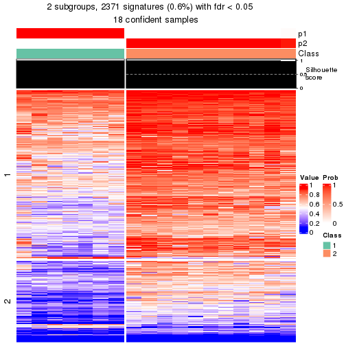</p>

</div>
<div id='tab-node-0231-get-signatures-2'>
<pre><code class="r">get_signatures(res, k = 3)
</code></pre>

<p>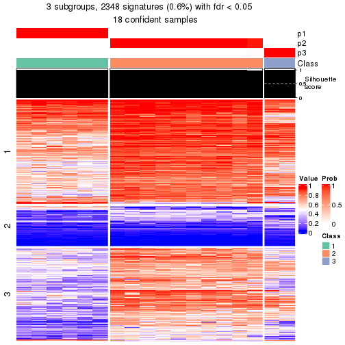</p>

</div>
<div id='tab-node-0231-get-signatures-3'>
<pre><code class="r">get_signatures(res, k = 4)
</code></pre>

<p>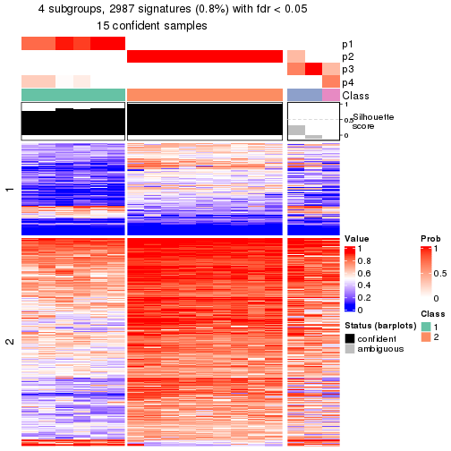</p>

</div>
<div id='tab-node-0231-get-signatures-4'>
<pre><code class="r">get_signatures(res, k = 5)
</code></pre>

<p>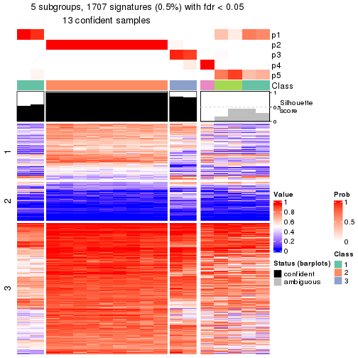</p>

</div>
<div id='tab-node-0231-get-signatures-5'>
<pre><code class="r">get_signatures(res, k = 6)
</code></pre>

<p>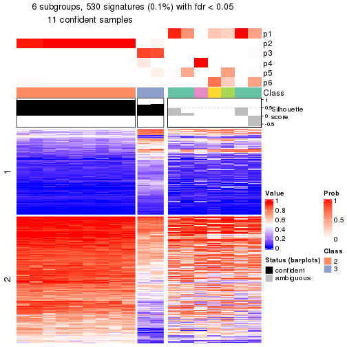</p>

</div>
<div id='tab-node-0231-get-signatures-6'>
<pre><code class="r">get_signatures(res, k = 7)
</code></pre>

<p>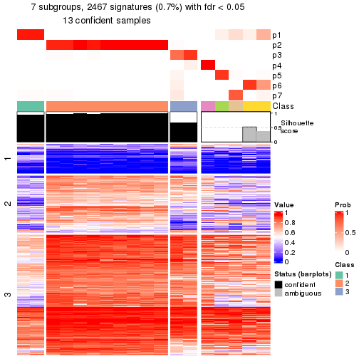</p>

</div>
<div id='tab-node-0231-get-signatures-7'>
<pre><code class="r">get_signatures(res, k = 8)
</code></pre>

<p>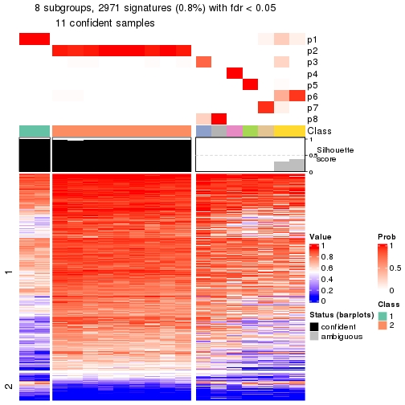</p>

</div>
</div>


Compare the overlap of signatures from different k:

```r
compare_signatures(res)
```

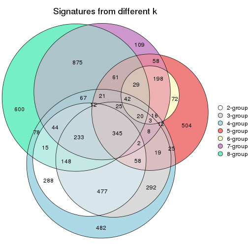

`get_signature()` returns a data frame invisibly. To get the list of signatures, the function
call should be assigned to a variable explicitly. In following code, if `plot` argument is set
to `FALSE`, no heatmap is plotted while only the differential analysis is performed.

```r
# code only for demonstration
tb = get_signature(res, k = ..., plot = FALSE)
```

An example of the output of `tb` is:

```
#>   which_row         fdr    mean_1    mean_2 scaled_mean_1 scaled_mean_2 km
#> 1        38 0.042760348  8.373488  9.131774    -0.5533452     0.5164555  1
#> 2        40 0.018707592  7.106213  8.469186    -0.6173731     0.5762149  1
#> 3        55 0.019134737 10.221463 11.207825    -0.6159697     0.5749050  1
#> 4        59 0.006059896  5.921854  7.869574    -0.6899429     0.6439467  1
#> 5        60 0.018055526  8.928898 10.211722    -0.6204761     0.5791110  1
#> 6        98 0.009384629 15.714769 14.887706     0.6635654    -0.6193277  2
...
```

The columns in `tb` are:

1. `which_row`: row indices corresponding to the input matrix.
2. `fdr`: FDR for the differential test. 
3. `mean_x`: The mean value in group x.
4. `scaled_mean_x`: The mean value in group x after rows are scaled.
5. `km`: Row groups if k-means clustering is applied to rows (which is done by automatically selecting number of clusters).

If there are too many signatures, `top_signatures = ...` can be set to only show the 
signatures with the highest FDRs:

```r
# code only for demonstration
# e.g. to show the top 500 most significant rows
tb = get_signature(res, k = ..., top_signatures = 500)
```

If the signatures are defined as these which are uniquely high in current group, `diff_method` argument
can be set to `"uniquely_high_in_one_group"`:

```r
# code only for demonstration
tb = get_signature(res, k = ..., diff_method = "uniquely_high_in_one_group")
```


UMAP plot which shows how samples are separated.


<script>
$( function() {
	$( '#tabs-node-0231-dimension-reduction' ).tabs();
} );
</script>
<div id='tabs-node-0231-dimension-reduction'>
<ul>
<li><a href='#tab-node-0231-dimension-reduction-1'>k = 2</a></li>
<li><a href='#tab-node-0231-dimension-reduction-2'>k = 3</a></li>
<li><a href='#tab-node-0231-dimension-reduction-3'>k = 4</a></li>
<li><a href='#tab-node-0231-dimension-reduction-4'>k = 5</a></li>
<li><a href='#tab-node-0231-dimension-reduction-5'>k = 6</a></li>
<li><a href='#tab-node-0231-dimension-reduction-6'>k = 7</a></li>
<li><a href='#tab-node-0231-dimension-reduction-7'>k = 8</a></li>
</ul>
<div id='tab-node-0231-dimension-reduction-1'>
<pre><code class="r">dimension_reduction(res, k = 2, method = &quot;UMAP&quot;)
</code></pre>

<p>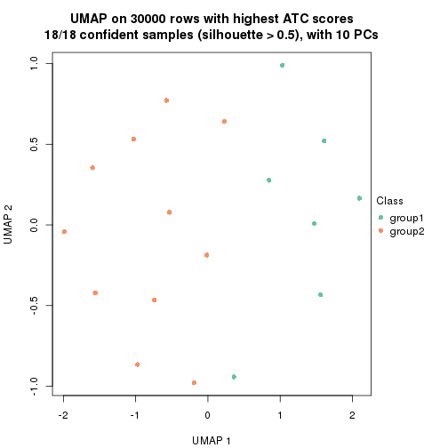</p>

</div>
<div id='tab-node-0231-dimension-reduction-2'>
<pre><code class="r">dimension_reduction(res, k = 3, method = &quot;UMAP&quot;)
</code></pre>

<p>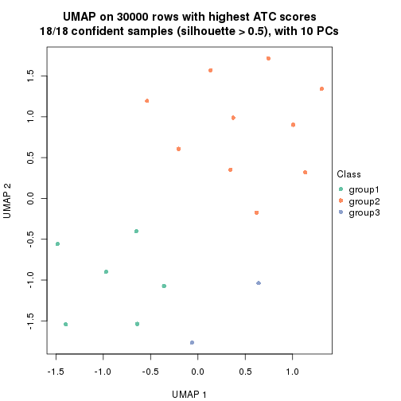</p>

</div>
<div id='tab-node-0231-dimension-reduction-3'>
<pre><code class="r">dimension_reduction(res, k = 4, method = &quot;UMAP&quot;)
</code></pre>

<p>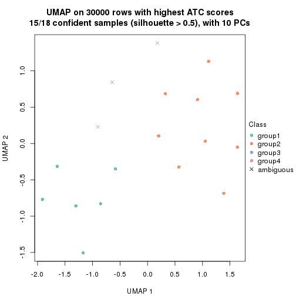</p>

</div>
<div id='tab-node-0231-dimension-reduction-4'>
<pre><code class="r">dimension_reduction(res, k = 5, method = &quot;UMAP&quot;)
</code></pre>

<p>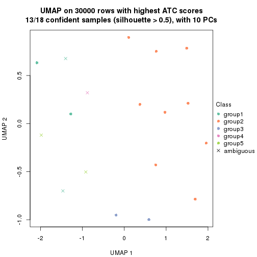</p>

</div>
<div id='tab-node-0231-dimension-reduction-5'>
<pre><code class="r">dimension_reduction(res, k = 6, method = &quot;UMAP&quot;)
</code></pre>

<p>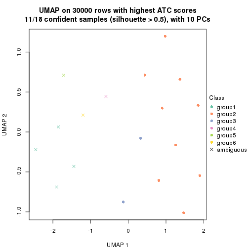</p>

</div>
<div id='tab-node-0231-dimension-reduction-6'>
<pre><code class="r">dimension_reduction(res, k = 7, method = &quot;UMAP&quot;)
</code></pre>

<p>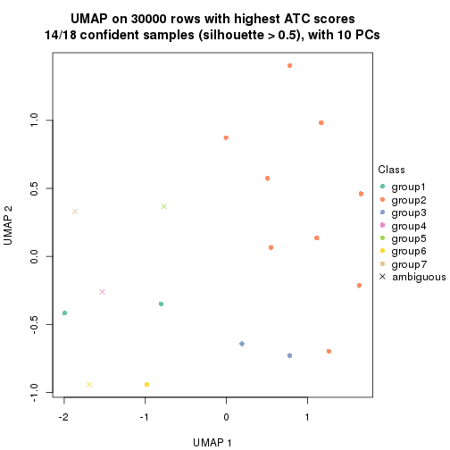</p>

</div>
<div id='tab-node-0231-dimension-reduction-7'>
<pre><code class="r">dimension_reduction(res, k = 8, method = &quot;UMAP&quot;)
</code></pre>

<p>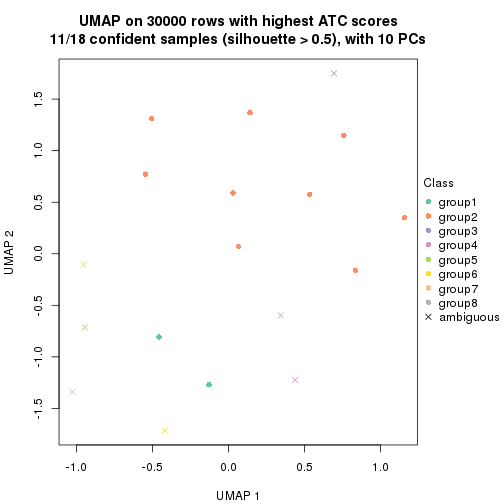</p>

</div>
</div>


Following heatmap shows how subgroups are split when increasing `k`:

```r
collect_classes(res)
```

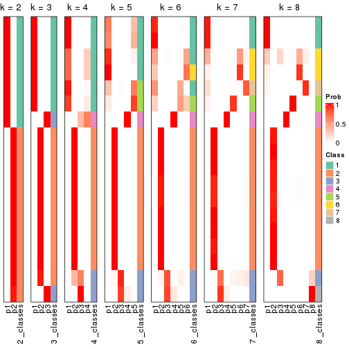


If matrix rows can be associated to genes, consider to use `functional_enrichment(res,
...)` to perform function enrichment for the signature genes. See [this vignette](https://jokergoo.github.io/cola_vignettes/functional_enrichment.html) for more detailed explanations.


 

---------------------------------------------------


### Node024


Parent node: [Node02](#Node02).
Child nodes: 
                Node0121-leaf
        ,
                Node0122-leaf
        ,
                Node0123-leaf
        ,
                Node0211-leaf
        ,
                [Node0212](#Node0212)
        ,
                Node0213-leaf
        ,
                [Node0221](#Node0221)
        ,
                Node0222-leaf
        ,
                Node0223-leaf
        ,
                [Node0231](#Node0231)
        ,
                Node0232-leaf
        ,
                Node0233-leaf
        ,
                Node0241-leaf
        ,
                Node0242-leaf
        ,
                Node0411-leaf
        ,
                Node0412-leaf
        ,
                Node0413-leaf
        ,
                Node0421-leaf
        ,
                Node0422-leaf
        ,
                Node0423-leaf
        ,
                Node0431-leaf
        ,
                Node0432-leaf
        ,
                Node0433-leaf
        ,
                Node0441-leaf
        ,
                Node0442-leaf
        ,
                Node0443-leaf
        ,
                Node0511-leaf
        ,
                [Node0512](#Node0512)
        ,
                Node0513-leaf
        ,
                Node0521-leaf
        ,
                Node0522-leaf
        ,
                Node0523-leaf
        .


The object with results only for a single top-value method and a single partitioning method 
can be extracted as:

```r
res = res_rh["024"]
```

A summary of `res` and all the functions that can be applied to it:

```r
res
```

```
#> A 'ConsensusPartition' object with k = 2, 3, 4, 5, 6, 7, 8.
#>   On a matrix with 30000 rows and 30 columns.
#>   Top rows (1000) are extracted by 'ATC' method.
#>   Subgroups are detected by 'kmeans' method.
#>   Performed in total 350 partitions by row resampling.
#>   Best k for subgroups seems to be 2.
#> 
#> Following methods can be applied to this 'ConsensusPartition' object:
#>  [1] "cola_report"             "collect_classes"         "collect_plots"          
#>  [4] "collect_stats"           "colnames"                "compare_partitions"     
#>  [7] "compare_signatures"      "consensus_heatmap"       "dimension_reduction"    
#> [10] "functional_enrichment"   "get_anno_col"            "get_anno"               
#> [13] "get_classes"             "get_consensus"           "get_matrix"             
#> [16] "get_membership"          "get_param"               "get_signatures"         
#> [19] "get_stats"               "is_best_k"               "is_stable_k"            
#> [22] "membership_heatmap"      "ncol"                    "nrow"                   
#> [25] "plot_ecdf"               "predict_classes"         "rownames"               
#> [28] "select_partition_number" "show"                    "suggest_best_k"         
#> [31] "test_to_known_factors"   "top_rows_heatmap"
```

`collect_plots()` function collects all the plots made from `res` for all `k` (number of subgroups)
into one single page to provide an easy and fast comparison between different `k`.

```r
collect_plots(res)
```

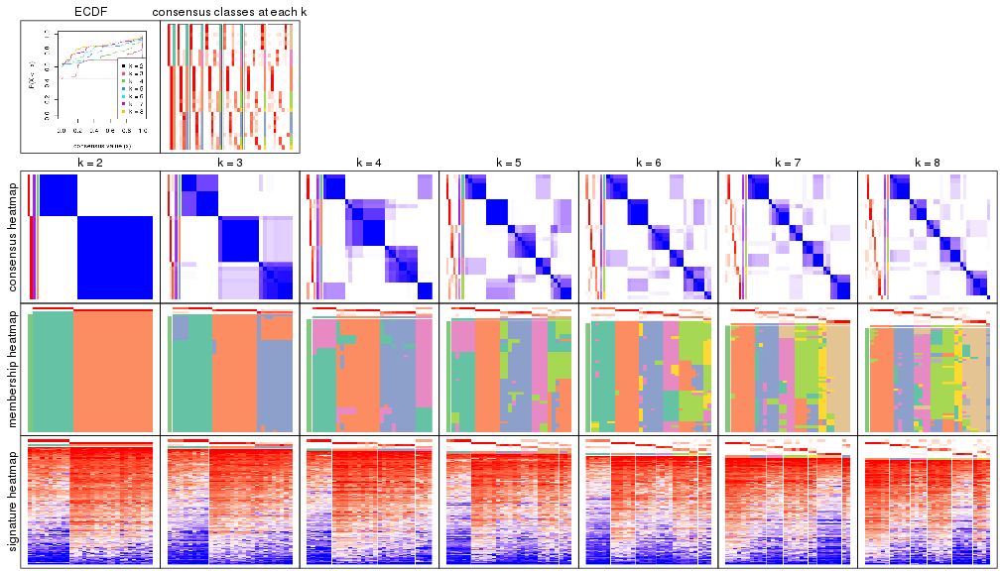

The plots are:

- The first row: a plot of the eCDF (empirical cumulative distribution
  function) curves of the consensus matrix for each `k` and the heatmap of
  predicted classes for each `k`.
- The second row: heatmaps of the consensus matrix for each `k`.
- The third row: heatmaps of the membership matrix for each `k`.
- The fouth row: heatmaps of the signatures for each `k`.

All the plots in panels can be made by individual functions and they are
plotted later in this section.

`select_partition_number()` produces several plots showing different
statistics for choosing "optimized" `k`. There are following statistics:

- eCDF curves of the consensus matrix for each `k`;
- 1-PAC. [The PAC score](https://en.wikipedia.org/wiki/Consensus_clustering#Over-interpretation_potential_of_consensus_clustering)
  measures the proportion of the ambiguous subgrouping.
- Mean silhouette score.
- Concordance. The mean probability of fiting the consensus subgroup labels in all
  partitions.
- Area increased. Denote $A_k$ as the area under the eCDF curve for current
  `k`, the area increased is defined as $A_k - A_{k-1}$.
- Rand index. The percent of pairs of samples that are both in a same cluster
  or both are not in a same cluster in the partition of k and k-1.
- Jaccard index. The ratio of pairs of samples are both in a same cluster in
  the partition of k and k-1 and the pairs of samples are both in a same
  cluster in the partition k or k-1.

The detailed explanations of these statistics can be found in [the _cola_
vignette](https://jokergoo.github.io/cola_vignettes/cola.html#toc_13).

Generally speaking, higher 1-PAC score, higher mean silhouette score or higher
concordance corresponds to better partition. Rand index and Jaccard index
measure how similar the current partition is compared to partition with `k-1`.
If they are too similar, we won't accept `k` is better than `k-1`.

```r
select_partition_number(res)
```

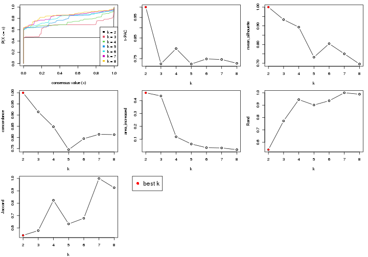

The numeric values for all these statistics can be obtained by `get_stats()`.

```r
get_stats(res)
```

```
#>   k 1-PAC mean_silhouette concordance area_increased  Rand Jaccard
#> 2 2 1.000           1.000       1.000         0.4603 0.540   0.540
#> 3 3 0.725           0.933       0.915         0.4357 0.772   0.579
#> 4 4 0.799           0.893       0.848         0.1192 0.945   0.824
#> 5 5 0.724           0.732       0.745         0.0631 0.901   0.632
#> 6 6 0.749           0.805       0.795         0.0346 0.936   0.678
#> 7 7 0.746           0.750       0.814         0.0326 1.000   1.000
#> 8 8 0.728           0.696       0.813         0.0192 0.989   0.925
```

`suggest_best_k()` suggests the best $k$ based on these statistics. The rules are as follows:

- All $k$ with Jaccard index larger than 0.95 are removed because increasing
  $k$ does not provide enough extra information. If all $k$ are removed, it is
  marked as no subgroup is detected.
- For all $k$ with 1-PAC score larger than 0.9, the maximal $k$ is taken as
  the best $k$, and other $k$ are marked as optional $k$.
- If it does not fit the second rule. The $k$ with the maximal vote of the
  highest 1-PAC score, highest mean silhouette, and highest concordance is
  taken as the best $k$.

```r
suggest_best_k(res)
```

```
#> [1] 2
```


Following is the table of the partitions (You need to click the **show/hide
code output** link to see it). The membership matrix (columns with name `p*`)
is inferred by
[`clue::cl_consensus()`](https://www.rdocumentation.org/link/cl_consensus?package=clue)
function with the `SE` method. Basically the value in the membership matrix
represents the probability to belong to a certain group. The finall subgroup
label for an item is determined with the group with highest probability it
belongs to.

In `get_classes()` function, the entropy is calculated from the membership
matrix and the silhouette score is calculated from the consensus matrix.


<script>
$( function() {
	$( '#tabs-node-024-get-classes' ).tabs();
} );
</script>
<div id='tabs-node-024-get-classes'>
<ul>
<li><a href='#tab-node-024-get-classes-1'>k = 2</a></li>
<li><a href='#tab-node-024-get-classes-2'>k = 3</a></li>
<li><a href='#tab-node-024-get-classes-3'>k = 4</a></li>
<li><a href='#tab-node-024-get-classes-4'>k = 5</a></li>
<li><a href='#tab-node-024-get-classes-5'>k = 6</a></li>
<li><a href='#tab-node-024-get-classes-6'>k = 7</a></li>
<li><a href='#tab-node-024-get-classes-7'>k = 8</a></li>
</ul>

<div id='tab-node-024-get-classes-1'>
<p><a id='tab-node-024-get-classes-1-a' style='color:#0366d6' href='#'>show/hide code output</a></p>
<pre><code class="r">cbind(get_classes(res, k = 2), get_membership(res, k = 2))
</code></pre>

<pre><code>#&gt;                 class entropy silhouette p1 p2
#&gt; TCGA.YL.A8S9.01     2       0          1  0  1
#&gt; TCGA.ZG.A9KY.01     2       0          1  0  1
#&gt; TCGA.ZG.A9L0.01     2       0          1  0  1
#&gt; TCGA.EJ.5519.01     1       0          1  1  0
#&gt; TCGA.G9.6338.01     2       0          1  0  1
#&gt; TCGA.ZG.A9ND.01     2       0          1  0  1
#&gt; TCGA.HC.A4ZV.01     1       0          1  1  0
#&gt; TCGA.KK.A7AP.01     2       0          1  0  1
#&gt; TCGA.V1.A9OL.01     1       0          1  1  0
#&gt; TCGA.J9.A8CN.01     2       0          1  0  1
#&gt; TCGA.G9.6371.01     2       0          1  0  1
#&gt; TCGA.M7.A724.01     2       0          1  0  1
#&gt; TCGA.KK.A8ID.01     2       0          1  0  1
#&gt; TCGA.HC.A6AL.01     1       0          1  1  0
#&gt; TCGA.HC.8264.01     2       0          1  0  1
#&gt; TCGA.XK.AAJP.01     2       0          1  0  1
#&gt; TCGA.G9.6369.01     2       0          1  0  1
#&gt; TCGA.KK.A6E1.01     1       0          1  1  0
#&gt; TCGA.VP.A87B.01     2       0          1  0  1
#&gt; TCGA.VP.A87J.01     1       0          1  1  0
#&gt; TCGA.VN.A943.01     2       0          1  0  1
#&gt; TCGA.EJ.A8FS.01     2       0          1  0  1
#&gt; TCGA.YL.A8HL.01     1       0          1  1  0
#&gt; TCGA.KK.A6E0.01     2       0          1  0  1
#&gt; TCGA.XK.AAIW.01     2       0          1  0  1
#&gt; TCGA.WW.A8ZI.01     2       0          1  0  1
#&gt; TCGA.M7.A725.01     1       0          1  1  0
#&gt; TCGA.HC.A632.01     1       0          1  1  0
#&gt; TCGA.KC.A7FA.01     1       0          1  1  0
#&gt; TCGA.G9.6498.01     2       0          1  0  1
</code></pre>

<script>
$('#tab-node-024-get-classes-1-a').parent().next().next().hide();
$('#tab-node-024-get-classes-1-a').click(function(){
  $('#tab-node-024-get-classes-1-a').parent().next().next().toggle();
  return(false);
});
</script>
</div>

<div id='tab-node-024-get-classes-2'>
<p><a id='tab-node-024-get-classes-2-a' style='color:#0366d6' href='#'>show/hide code output</a></p>
<pre><code class="r">cbind(get_classes(res, k = 3), get_membership(res, k = 3))
</code></pre>

<pre><code>#&gt;                 class entropy silhouette  p1   p2   p3
#&gt; TCGA.YL.A8S9.01     2   0.000      0.985 0.0 1.00 0.00
#&gt; TCGA.ZG.A9KY.01     2   0.000      0.985 0.0 1.00 0.00
#&gt; TCGA.ZG.A9L0.01     2   0.000      0.985 0.0 1.00 0.00
#&gt; TCGA.EJ.5519.01     1   0.455      0.888 0.8 0.00 0.20
#&gt; TCGA.G9.6338.01     2   0.334      0.822 0.0 0.88 0.12
#&gt; TCGA.ZG.A9ND.01     2   0.000      0.985 0.0 1.00 0.00
#&gt; TCGA.HC.A4ZV.01     1   0.455      0.888 0.8 0.00 0.20
#&gt; TCGA.KK.A7AP.01     2   0.000      0.985 0.0 1.00 0.00
#&gt; TCGA.V1.A9OL.01     1   0.000      0.928 1.0 0.00 0.00
#&gt; TCGA.J9.A8CN.01     3   0.455      0.945 0.0 0.20 0.80
#&gt; TCGA.G9.6371.01     3   0.000      0.732 0.0 0.00 1.00
#&gt; TCGA.M7.A724.01     2   0.000      0.985 0.0 1.00 0.00
#&gt; TCGA.KK.A8ID.01     3   0.455      0.945 0.0 0.20 0.80
#&gt; TCGA.HC.A6AL.01     1   0.455      0.888 0.8 0.00 0.20
#&gt; TCGA.HC.8264.01     2   0.000      0.985 0.0 1.00 0.00
#&gt; TCGA.XK.AAJP.01     2   0.000      0.985 0.0 1.00 0.00
#&gt; TCGA.G9.6369.01     2   0.000      0.985 0.0 1.00 0.00
#&gt; TCGA.KK.A6E1.01     1   0.000      0.928 1.0 0.00 0.00
#&gt; TCGA.VP.A87B.01     2   0.000      0.985 0.0 1.00 0.00
#&gt; TCGA.VP.A87J.01     1   0.000      0.928 1.0 0.00 0.00
#&gt; TCGA.VN.A943.01     3   0.455      0.945 0.0 0.20 0.80
#&gt; TCGA.EJ.A8FS.01     3   0.522      0.885 0.0 0.26 0.74
#&gt; TCGA.YL.A8HL.01     1   0.000      0.928 1.0 0.00 0.00
#&gt; TCGA.KK.A6E0.01     3   0.480      0.931 0.0 0.22 0.78
#&gt; TCGA.XK.AAIW.01     3   0.455      0.945 0.0 0.20 0.80
#&gt; TCGA.WW.A8ZI.01     3   0.429      0.937 0.0 0.18 0.82
#&gt; TCGA.M7.A725.01     1   0.000      0.928 1.0 0.00 0.00
#&gt; TCGA.HC.A632.01     1   0.455      0.888 0.8 0.00 0.20
#&gt; TCGA.KC.A7FA.01     1   0.000      0.928 1.0 0.00 0.00
#&gt; TCGA.G9.6498.01     3   0.429      0.937 0.0 0.18 0.82
</code></pre>

<script>
$('#tab-node-024-get-classes-2-a').parent().next().next().hide();
$('#tab-node-024-get-classes-2-a').click(function(){
  $('#tab-node-024-get-classes-2-a').parent().next().next().toggle();
  return(false);
});
</script>
</div>

<div id='tab-node-024-get-classes-3'>
<p><a id='tab-node-024-get-classes-3-a' style='color:#0366d6' href='#'>show/hide code output</a></p>
<pre><code class="r">cbind(get_classes(res, k = 4), get_membership(res, k = 4))
</code></pre>

<pre><code>#&gt;                 class entropy silhouette   p1   p2   p3   p4
#&gt; TCGA.YL.A8S9.01     2  0.2921      0.870 0.00 0.86 0.00 0.14
#&gt; TCGA.ZG.A9KY.01     2  0.0000      0.898 0.00 1.00 0.00 0.00
#&gt; TCGA.ZG.A9L0.01     2  0.2921      0.870 0.00 0.86 0.00 0.14
#&gt; TCGA.EJ.5519.01     4  0.4994      1.000 0.48 0.00 0.00 0.52
#&gt; TCGA.G9.6338.01     2  0.6686      0.581 0.00 0.62 0.20 0.18
#&gt; TCGA.ZG.A9ND.01     2  0.0000      0.898 0.00 1.00 0.00 0.00
#&gt; TCGA.HC.A4ZV.01     4  0.4994      1.000 0.48 0.00 0.00 0.52
#&gt; TCGA.KK.A7AP.01     2  0.4624      0.733 0.00 0.66 0.00 0.34
#&gt; TCGA.V1.A9OL.01     1  0.0000      0.976 1.00 0.00 0.00 0.00
#&gt; TCGA.J9.A8CN.01     3  0.1211      0.899 0.00 0.00 0.96 0.04
#&gt; TCGA.G9.6371.01     3  0.0707      0.891 0.00 0.00 0.98 0.02
#&gt; TCGA.M7.A724.01     2  0.0000      0.898 0.00 1.00 0.00 0.00
#&gt; TCGA.KK.A8ID.01     3  0.4790      0.711 0.00 0.00 0.62 0.38
#&gt; TCGA.HC.A6AL.01     4  0.4994      1.000 0.48 0.00 0.00 0.52
#&gt; TCGA.HC.8264.01     2  0.2921      0.870 0.00 0.86 0.00 0.14
#&gt; TCGA.XK.AAJP.01     2  0.0000      0.898 0.00 1.00 0.00 0.00
#&gt; TCGA.G9.6369.01     2  0.0000      0.898 0.00 1.00 0.00 0.00
#&gt; TCGA.KK.A6E1.01     1  0.0000      0.976 1.00 0.00 0.00 0.00
#&gt; TCGA.VP.A87B.01     2  0.0000      0.898 0.00 1.00 0.00 0.00
#&gt; TCGA.VP.A87J.01     1  0.1637      0.870 0.94 0.00 0.00 0.06
#&gt; TCGA.VN.A943.01     3  0.1211      0.899 0.00 0.00 0.96 0.04
#&gt; TCGA.EJ.A8FS.01     3  0.4079      0.837 0.00 0.02 0.80 0.18
#&gt; TCGA.YL.A8HL.01     1  0.0000      0.976 1.00 0.00 0.00 0.00
#&gt; TCGA.KK.A6E0.01     3  0.3400      0.848 0.00 0.00 0.82 0.18
#&gt; TCGA.XK.AAIW.01     3  0.0000      0.897 0.00 0.00 1.00 0.00
#&gt; TCGA.WW.A8ZI.01     3  0.2345      0.851 0.00 0.00 0.90 0.10
#&gt; TCGA.M7.A725.01     1  0.0000      0.976 1.00 0.00 0.00 0.00
#&gt; TCGA.HC.A632.01     4  0.4994      1.000 0.48 0.00 0.00 0.52
#&gt; TCGA.KC.A7FA.01     1  0.0000      0.976 1.00 0.00 0.00 0.00
#&gt; TCGA.G9.6498.01     3  0.0000      0.897 0.00 0.00 1.00 0.00
</code></pre>

<script>
$('#tab-node-024-get-classes-3-a').parent().next().next().hide();
$('#tab-node-024-get-classes-3-a').click(function(){
  $('#tab-node-024-get-classes-3-a').parent().next().next().toggle();
  return(false);
});
</script>
</div>

<div id='tab-node-024-get-classes-4'>
<p><a id='tab-node-024-get-classes-4-a' style='color:#0366d6' href='#'>show/hide code output</a></p>
<pre><code class="r">cbind(get_classes(res, k = 5), get_membership(res, k = 5))
</code></pre>

<pre><code>#&gt;                 class entropy silhouette   p1   p2   p3   p4   p5
#&gt; TCGA.YL.A8S9.01     5  0.4307     0.5817 0.00 0.50 0.00 0.00 0.50
#&gt; TCGA.ZG.A9KY.01     2  0.0000     1.0000 0.00 1.00 0.00 0.00 0.00
#&gt; TCGA.ZG.A9L0.01     5  0.4307     0.5817 0.00 0.50 0.00 0.00 0.50
#&gt; TCGA.EJ.5519.01     4  0.3684     0.8850 0.28 0.00 0.00 0.72 0.00
#&gt; TCGA.G9.6338.01     5  0.7304     0.5074 0.00 0.28 0.22 0.04 0.46
#&gt; TCGA.ZG.A9ND.01     2  0.0000     1.0000 0.00 1.00 0.00 0.00 0.00
#&gt; TCGA.HC.A4ZV.01     4  0.6054     0.8859 0.28 0.00 0.00 0.56 0.16
#&gt; TCGA.KK.A7AP.01     5  0.5979     0.5116 0.00 0.36 0.00 0.12 0.52
#&gt; TCGA.V1.A9OL.01     1  0.0000     0.9144 1.00 0.00 0.00 0.00 0.00
#&gt; TCGA.J9.A8CN.01     3  0.0609     0.7623 0.00 0.00 0.98 0.00 0.02
#&gt; TCGA.G9.6371.01     3  0.2732     0.6906 0.00 0.00 0.84 0.16 0.00
#&gt; TCGA.M7.A724.01     2  0.0000     1.0000 0.00 1.00 0.00 0.00 0.00
#&gt; TCGA.KK.A8ID.01     5  0.5927    -0.0601 0.00 0.00 0.34 0.12 0.54
#&gt; TCGA.HC.A6AL.01     4  0.3684     0.8850 0.28 0.00 0.00 0.72 0.00
#&gt; TCGA.HC.8264.01     5  0.4307     0.5817 0.00 0.50 0.00 0.00 0.50
#&gt; TCGA.XK.AAJP.01     2  0.0000     1.0000 0.00 1.00 0.00 0.00 0.00
#&gt; TCGA.G9.6369.01     2  0.0000     1.0000 0.00 1.00 0.00 0.00 0.00
#&gt; TCGA.KK.A6E1.01     1  0.0000     0.9144 1.00 0.00 0.00 0.00 0.00
#&gt; TCGA.VP.A87B.01     2  0.0000     1.0000 0.00 1.00 0.00 0.00 0.00
#&gt; TCGA.VP.A87J.01     1  0.4637     0.6292 0.74 0.00 0.00 0.16 0.10
#&gt; TCGA.VN.A943.01     3  0.0609     0.7623 0.00 0.00 0.98 0.00 0.02
#&gt; TCGA.EJ.A8FS.01     3  0.5695     0.0787 0.00 0.02 0.48 0.04 0.46
#&gt; TCGA.YL.A8HL.01     1  0.0000     0.9144 1.00 0.00 0.00 0.00 0.00
#&gt; TCGA.KK.A6E0.01     3  0.5695     0.0787 0.00 0.02 0.48 0.04 0.46
#&gt; TCGA.XK.AAIW.01     3  0.1043     0.7556 0.00 0.00 0.96 0.04 0.00
#&gt; TCGA.WW.A8ZI.01     3  0.3946     0.6931 0.00 0.00 0.80 0.12 0.08
#&gt; TCGA.M7.A725.01     1  0.2020     0.8540 0.90 0.00 0.00 0.00 0.10
#&gt; TCGA.HC.A632.01     4  0.6054     0.8859 0.28 0.00 0.00 0.56 0.16
#&gt; TCGA.KC.A7FA.01     1  0.0000     0.9144 1.00 0.00 0.00 0.00 0.00
#&gt; TCGA.G9.6498.01     3  0.0000     0.7629 0.00 0.00 1.00 0.00 0.00
</code></pre>

<script>
$('#tab-node-024-get-classes-4-a').parent().next().next().hide();
$('#tab-node-024-get-classes-4-a').click(function(){
  $('#tab-node-024-get-classes-4-a').parent().next().next().toggle();
  return(false);
});
</script>
</div>

<div id='tab-node-024-get-classes-5'>
<p><a id='tab-node-024-get-classes-5-a' style='color:#0366d6' href='#'>show/hide code output</a></p>
<pre><code class="r">cbind(get_classes(res, k = 6), get_membership(res, k = 6))
</code></pre>

<pre><code>#&gt;                 class entropy silhouette   p1   p2   p3   p4   p5   p6
#&gt; TCGA.YL.A8S9.01     5  0.4534      0.635 0.00 0.38 0.00 0.00 0.58 0.04
#&gt; TCGA.ZG.A9KY.01     2  0.0937      0.946 0.00 0.96 0.00 0.00 0.00 0.04
#&gt; TCGA.ZG.A9L0.01     5  0.4534      0.635 0.00 0.38 0.00 0.00 0.58 0.04
#&gt; TCGA.EJ.5519.01     4  0.2094      0.910 0.00 0.00 0.00 0.90 0.08 0.02
#&gt; TCGA.G9.6338.01     5  0.4863      0.597 0.00 0.20 0.14 0.00 0.66 0.00
#&gt; TCGA.ZG.A9ND.01     2  0.0000      0.990 0.00 1.00 0.00 0.00 0.00 0.00
#&gt; TCGA.HC.A4ZV.01     4  0.0937      0.898 0.00 0.00 0.00 0.96 0.04 0.00
#&gt; TCGA.KK.A7AP.01     6  0.4094      0.754 0.00 0.08 0.00 0.00 0.18 0.74
#&gt; TCGA.V1.A9OL.01     1  0.3309      0.920 0.72 0.00 0.00 0.28 0.00 0.00
#&gt; TCGA.J9.A8CN.01     3  0.0937      0.834 0.00 0.00 0.96 0.00 0.04 0.00
#&gt; TCGA.G9.6371.01     3  0.3324      0.724 0.00 0.00 0.84 0.06 0.08 0.02
#&gt; TCGA.M7.A724.01     2  0.0000      0.990 0.00 1.00 0.00 0.00 0.00 0.00
#&gt; TCGA.KK.A8ID.01     6  0.5356      0.773 0.08 0.00 0.08 0.00 0.16 0.68
#&gt; TCGA.HC.A6AL.01     4  0.2094      0.910 0.00 0.00 0.00 0.90 0.08 0.02
#&gt; TCGA.HC.8264.01     5  0.4576      0.616 0.00 0.40 0.00 0.00 0.56 0.04
#&gt; TCGA.XK.AAJP.01     2  0.0000      0.990 0.00 1.00 0.00 0.00 0.00 0.00
#&gt; TCGA.G9.6369.01     2  0.0000      0.990 0.00 1.00 0.00 0.00 0.00 0.00
#&gt; TCGA.KK.A6E1.01     1  0.3819      0.920 0.70 0.00 0.00 0.28 0.02 0.00
#&gt; TCGA.VP.A87B.01     2  0.0000      0.990 0.00 1.00 0.00 0.00 0.00 0.00
#&gt; TCGA.VP.A87J.01     1  0.5544      0.716 0.50 0.00 0.00 0.40 0.02 0.08
#&gt; TCGA.VN.A943.01     3  0.0937      0.834 0.00 0.00 0.96 0.00 0.04 0.00
#&gt; TCGA.EJ.A8FS.01     5  0.4265      0.468 0.00 0.04 0.30 0.00 0.66 0.00
#&gt; TCGA.YL.A8HL.01     1  0.3819      0.920 0.70 0.00 0.00 0.28 0.02 0.00
#&gt; TCGA.KK.A6E0.01     5  0.4002      0.437 0.00 0.02 0.32 0.00 0.66 0.00
#&gt; TCGA.XK.AAIW.01     3  0.0547      0.837 0.00 0.00 0.98 0.00 0.00 0.02
#&gt; TCGA.WW.A8ZI.01     3  0.6873      0.373 0.20 0.00 0.50 0.00 0.18 0.12
#&gt; TCGA.M7.A725.01     1  0.5208      0.872 0.62 0.00 0.00 0.28 0.02 0.08
#&gt; TCGA.HC.A632.01     4  0.0547      0.906 0.00 0.00 0.00 0.98 0.02 0.00
#&gt; TCGA.KC.A7FA.01     1  0.3309      0.920 0.72 0.00 0.00 0.28 0.00 0.00
#&gt; TCGA.G9.6498.01     3  0.0000      0.838 0.00 0.00 1.00 0.00 0.00 0.00
</code></pre>

<script>
$('#tab-node-024-get-classes-5-a').parent().next().next().hide();
$('#tab-node-024-get-classes-5-a').click(function(){
  $('#tab-node-024-get-classes-5-a').parent().next().next().toggle();
  return(false);
});
</script>
</div>

<div id='tab-node-024-get-classes-6'>
<p><a id='tab-node-024-get-classes-6-a' style='color:#0366d6' href='#'>show/hide code output</a></p>
<pre><code class="r">cbind(get_classes(res, k = 7), get_membership(res, k = 7))
</code></pre>

<pre><code>#&gt;                 class entropy silhouette   p1   p2   p3   p4   p5   p6   p7
#&gt; TCGA.YL.A8S9.01     5  0.5234      0.586 0.12 0.30 0.00 0.00 0.56 0.02 0.00
#&gt; TCGA.ZG.A9KY.01     2  0.1886      0.862 0.12 0.88 0.00 0.00 0.00 0.00 0.00
#&gt; TCGA.ZG.A9L0.01     5  0.5234      0.586 0.12 0.30 0.00 0.00 0.56 0.02 0.00
#&gt; TCGA.EJ.5519.01     4  0.1886      0.807 0.00 0.00 0.00 0.88 0.00 0.00 0.12
#&gt; TCGA.G9.6338.01     5  0.1166      0.571 0.00 0.06 0.00 0.00 0.94 0.00 0.00
#&gt; TCGA.ZG.A9ND.01     2  0.0863      0.942 0.04 0.96 0.00 0.00 0.00 0.00 0.00
#&gt; TCGA.HC.A4ZV.01     4  0.6283      0.799 0.16 0.00 0.04 0.58 0.00 0.10 0.12
#&gt; TCGA.KK.A7AP.01     6  0.5818      0.730 0.12 0.06 0.00 0.06 0.12 0.64 0.00
#&gt; TCGA.V1.A9OL.01     7  0.0000      0.904 0.00 0.00 0.00 0.00 0.00 0.00 1.00
#&gt; TCGA.J9.A8CN.01     3  0.3047      0.757 0.00 0.00 0.72 0.00 0.28 0.00 0.00
#&gt; TCGA.G9.6371.01     3  0.3755      0.484 0.00 0.00 0.64 0.34 0.02 0.00 0.00
#&gt; TCGA.M7.A724.01     2  0.0000      0.964 0.00 1.00 0.00 0.00 0.00 0.00 0.00
#&gt; TCGA.KK.A8ID.01     6  0.2259      0.747 0.00 0.00 0.00 0.00 0.16 0.84 0.00
#&gt; TCGA.HC.A6AL.01     4  0.1886      0.807 0.00 0.00 0.00 0.88 0.00 0.00 0.12
#&gt; TCGA.HC.8264.01     5  0.5234      0.586 0.12 0.30 0.00 0.00 0.56 0.02 0.00
#&gt; TCGA.XK.AAJP.01     2  0.0000      0.964 0.00 1.00 0.00 0.00 0.00 0.00 0.00
#&gt; TCGA.G9.6369.01     2  0.0000      0.964 0.00 1.00 0.00 0.00 0.00 0.00 0.00
#&gt; TCGA.KK.A6E1.01     7  0.0000      0.904 0.00 0.00 0.00 0.00 0.00 0.00 1.00
#&gt; TCGA.VP.A87B.01     2  0.0000      0.964 0.00 1.00 0.00 0.00 0.00 0.00 0.00
#&gt; TCGA.VP.A87J.01     7  0.3795      0.748 0.22 0.00 0.00 0.06 0.00 0.00 0.72
#&gt; TCGA.VN.A943.01     3  0.3047      0.757 0.00 0.00 0.72 0.00 0.28 0.00 0.00
#&gt; TCGA.EJ.A8FS.01     5  0.0504      0.538 0.00 0.00 0.02 0.00 0.98 0.00 0.00
#&gt; TCGA.YL.A8HL.01     7  0.0000      0.904 0.00 0.00 0.00 0.00 0.00 0.00 1.00
#&gt; TCGA.KK.A6E0.01     5  0.0504      0.538 0.00 0.00 0.02 0.00 0.98 0.00 0.00
#&gt; TCGA.XK.AAIW.01     3  0.4461      0.707 0.02 0.00 0.70 0.02 0.22 0.04 0.00
#&gt; TCGA.WW.A8ZI.01     3  0.5639      0.133 0.42 0.00 0.46 0.04 0.06 0.02 0.00
#&gt; TCGA.M7.A725.01     7  0.2708      0.799 0.22 0.00 0.00 0.00 0.00 0.00 0.78
#&gt; TCGA.HC.A632.01     4  0.6217      0.799 0.18 0.00 0.04 0.58 0.00 0.08 0.12
#&gt; TCGA.KC.A7FA.01     7  0.0000      0.904 0.00 0.00 0.00 0.00 0.00 0.00 1.00
#&gt; TCGA.G9.6498.01     3  0.3047      0.757 0.00 0.00 0.72 0.00 0.28 0.00 0.00
</code></pre>

<script>
$('#tab-node-024-get-classes-6-a').parent().next().next().hide();
$('#tab-node-024-get-classes-6-a').click(function(){
  $('#tab-node-024-get-classes-6-a').parent().next().next().toggle();
  return(false);
});
</script>
</div>

<div id='tab-node-024-get-classes-7'>
<p><a id='tab-node-024-get-classes-7-a' style='color:#0366d6' href='#'>show/hide code output</a></p>
<pre><code class="r">cbind(get_classes(res, k = 8), get_membership(res, k = 8))
</code></pre>

<pre><code>#&gt;                 class entropy silhouette   p1   p2   p3   p4   p5   p6   p7   p8
#&gt; TCGA.YL.A8S9.01     5   0.527      0.604 0.22 0.18 0.00 0.00 0.56 0.04 0.00 0.00
#&gt; TCGA.ZG.A9KY.01     2   0.227      0.786 0.18 0.82 0.00 0.00 0.00 0.00 0.00 0.00
#&gt; TCGA.ZG.A9L0.01     5   0.527      0.604 0.22 0.18 0.00 0.00 0.56 0.04 0.00 0.00
#&gt; TCGA.EJ.5519.01     4   0.156      0.756 0.00 0.00 0.00 0.90 0.00 0.00 0.10 0.00
#&gt; TCGA.G9.6338.01     5   0.255      0.607 0.00 0.04 0.12 0.00 0.84 0.00 0.00 0.00
#&gt; TCGA.ZG.A9ND.01     2   0.109      0.911 0.06 0.94 0.00 0.00 0.00 0.00 0.00 0.00
#&gt; TCGA.HC.A4ZV.01     4   0.616      0.676 0.30 0.00 0.00 0.48 0.00 0.06 0.10 0.06
#&gt; TCGA.KK.A7AP.01     6   0.697      0.531 0.22 0.10 0.00 0.04 0.08 0.48 0.00 0.08
#&gt; TCGA.V1.A9OL.01     7   0.000      0.818 0.00 0.00 0.00 0.00 0.00 0.00 1.00 0.00
#&gt; TCGA.J9.A8CN.01     3   0.000      0.811 0.00 0.00 1.00 0.00 0.00 0.00 0.00 0.00
#&gt; TCGA.G9.6371.01     3   0.276      0.509 0.00 0.00 0.74 0.26 0.00 0.00 0.00 0.00
#&gt; TCGA.M7.A724.01     2   0.000      0.944 0.00 1.00 0.00 0.00 0.00 0.00 0.00 0.00
#&gt; TCGA.KK.A8ID.01     6   0.286      0.486 0.00 0.00 0.10 0.00 0.08 0.82 0.00 0.00
#&gt; TCGA.HC.A6AL.01     4   0.156      0.756 0.00 0.00 0.00 0.90 0.00 0.00 0.10 0.00
#&gt; TCGA.HC.8264.01     5   0.527      0.604 0.22 0.18 0.00 0.00 0.56 0.04 0.00 0.00
#&gt; TCGA.XK.AAJP.01     2   0.000      0.944 0.00 1.00 0.00 0.00 0.00 0.00 0.00 0.00
#&gt; TCGA.G9.6369.01     2   0.000      0.944 0.00 1.00 0.00 0.00 0.00 0.00 0.00 0.00
#&gt; TCGA.KK.A6E1.01     7   0.109      0.816 0.00 0.00 0.00 0.00 0.00 0.06 0.94 0.00
#&gt; TCGA.VP.A87B.01     2   0.000      0.944 0.00 1.00 0.00 0.00 0.00 0.00 0.00 0.00
#&gt; TCGA.VP.A87J.01     7   0.686      0.469 0.08 0.00 0.00 0.14 0.16 0.02 0.50 0.10
#&gt; TCGA.VN.A943.01     3   0.000      0.811 0.00 0.00 1.00 0.00 0.00 0.00 0.00 0.00
#&gt; TCGA.EJ.A8FS.01     5   0.211      0.587 0.00 0.00 0.16 0.00 0.84 0.00 0.00 0.00
#&gt; TCGA.YL.A8HL.01     7   0.109      0.816 0.00 0.00 0.00 0.00 0.00 0.06 0.94 0.00
#&gt; TCGA.KK.A6E0.01     5   0.211      0.587 0.00 0.00 0.16 0.00 0.84 0.00 0.00 0.00
#&gt; TCGA.XK.AAIW.01     3   0.374      0.557 0.18 0.00 0.74 0.06 0.00 0.02 0.00 0.00
#&gt; TCGA.WW.A8ZI.01     8   0.265      0.000 0.00 0.00 0.24 0.00 0.00 0.00 0.00 0.76
#&gt; TCGA.M7.A725.01     7   0.524      0.655 0.08 0.00 0.00 0.00 0.12 0.04 0.66 0.10
#&gt; TCGA.HC.A632.01     4   0.480      0.719 0.32 0.00 0.00 0.56 0.00 0.00 0.10 0.02
#&gt; TCGA.KC.A7FA.01     7   0.000      0.818 0.00 0.00 0.00 0.00 0.00 0.00 1.00 0.00
#&gt; TCGA.G9.6498.01     3   0.000      0.811 0.00 0.00 1.00 0.00 0.00 0.00 0.00 0.00
</code></pre>

<script>
$('#tab-node-024-get-classes-7-a').parent().next().next().hide();
$('#tab-node-024-get-classes-7-a').click(function(){
  $('#tab-node-024-get-classes-7-a').parent().next().next().toggle();
  return(false);
});
</script>
</div>
</div>

Heatmaps for the consensus matrix. It visualizes the probability of two
samples to be in a same group.


<script>
$( function() {
	$( '#tabs-node-024-consensus-heatmap' ).tabs();
} );
</script>
<div id='tabs-node-024-consensus-heatmap'>
<ul>
<li><a href='#tab-node-024-consensus-heatmap-1'>k = 2</a></li>
<li><a href='#tab-node-024-consensus-heatmap-2'>k = 3</a></li>
<li><a href='#tab-node-024-consensus-heatmap-3'>k = 4</a></li>
<li><a href='#tab-node-024-consensus-heatmap-4'>k = 5</a></li>
<li><a href='#tab-node-024-consensus-heatmap-5'>k = 6</a></li>
<li><a href='#tab-node-024-consensus-heatmap-6'>k = 7</a></li>
<li><a href='#tab-node-024-consensus-heatmap-7'>k = 8</a></li>
</ul>
<div id='tab-node-024-consensus-heatmap-1'>
<pre><code class="r">consensus_heatmap(res, k = 2)
</code></pre>

<p>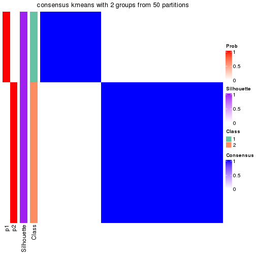</p>

</div>
<div id='tab-node-024-consensus-heatmap-2'>
<pre><code class="r">consensus_heatmap(res, k = 3)
</code></pre>

<p>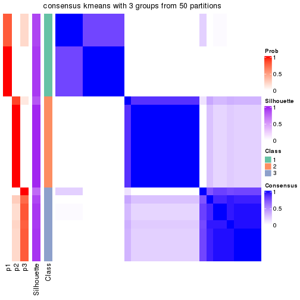</p>

</div>
<div id='tab-node-024-consensus-heatmap-3'>
<pre><code class="r">consensus_heatmap(res, k = 4)
</code></pre>

<p>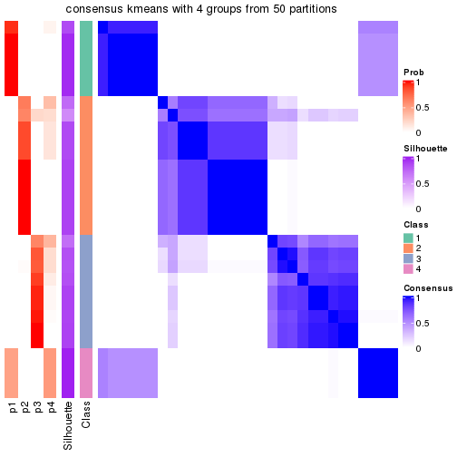</p>

</div>
<div id='tab-node-024-consensus-heatmap-4'>
<pre><code class="r">consensus_heatmap(res, k = 5)
</code></pre>

<p>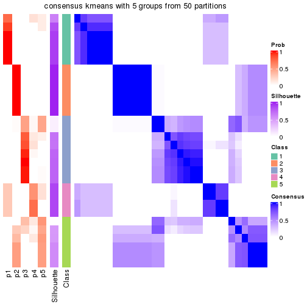</p>

</div>
<div id='tab-node-024-consensus-heatmap-5'>
<pre><code class="r">consensus_heatmap(res, k = 6)
</code></pre>

<p>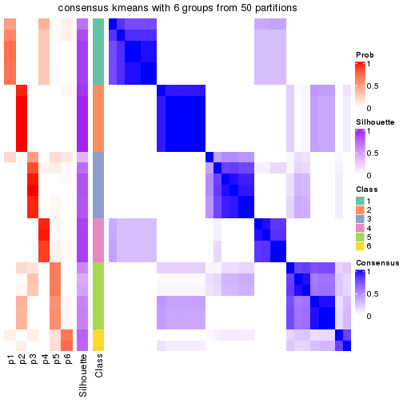</p>

</div>
<div id='tab-node-024-consensus-heatmap-6'>
<pre><code class="r">consensus_heatmap(res, k = 7)
</code></pre>

<p>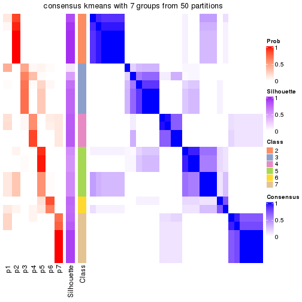</p>

</div>
<div id='tab-node-024-consensus-heatmap-7'>
<pre><code class="r">consensus_heatmap(res, k = 8)
</code></pre>

<p>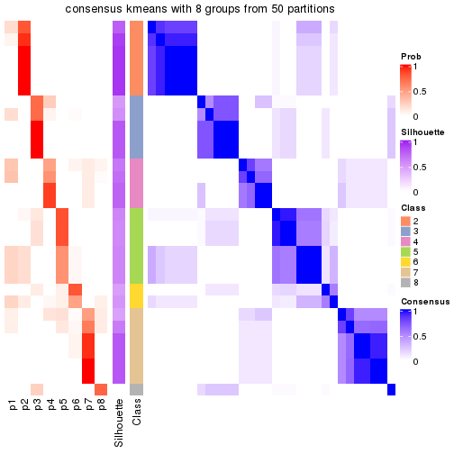</p>

</div>
</div>

Heatmaps for the membership of samples in all partitions to see how consistent they are:


<script>
$( function() {
	$( '#tabs-node-024-membership-heatmap' ).tabs();
} );
</script>
<div id='tabs-node-024-membership-heatmap'>
<ul>
<li><a href='#tab-node-024-membership-heatmap-1'>k = 2</a></li>
<li><a href='#tab-node-024-membership-heatmap-2'>k = 3</a></li>
<li><a href='#tab-node-024-membership-heatmap-3'>k = 4</a></li>
<li><a href='#tab-node-024-membership-heatmap-4'>k = 5</a></li>
<li><a href='#tab-node-024-membership-heatmap-5'>k = 6</a></li>
<li><a href='#tab-node-024-membership-heatmap-6'>k = 7</a></li>
<li><a href='#tab-node-024-membership-heatmap-7'>k = 8</a></li>
</ul>
<div id='tab-node-024-membership-heatmap-1'>
<pre><code class="r">membership_heatmap(res, k = 2)
</code></pre>

<p>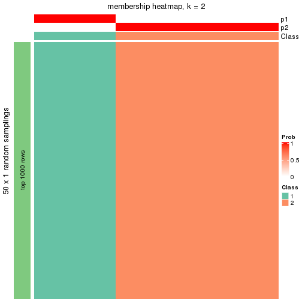</p>

</div>
<div id='tab-node-024-membership-heatmap-2'>
<pre><code class="r">membership_heatmap(res, k = 3)
</code></pre>

<p>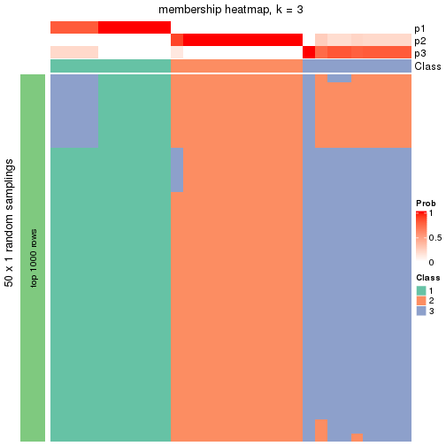</p>

</div>
<div id='tab-node-024-membership-heatmap-3'>
<pre><code class="r">membership_heatmap(res, k = 4)
</code></pre>

<p>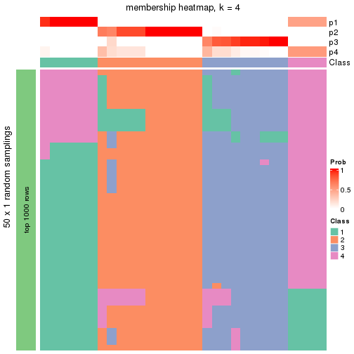</p>

</div>
<div id='tab-node-024-membership-heatmap-4'>
<pre><code class="r">membership_heatmap(res, k = 5)
</code></pre>

<p>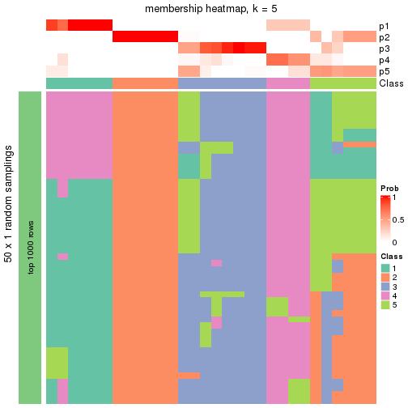</p>

</div>
<div id='tab-node-024-membership-heatmap-5'>
<pre><code class="r">membership_heatmap(res, k = 6)
</code></pre>

<p>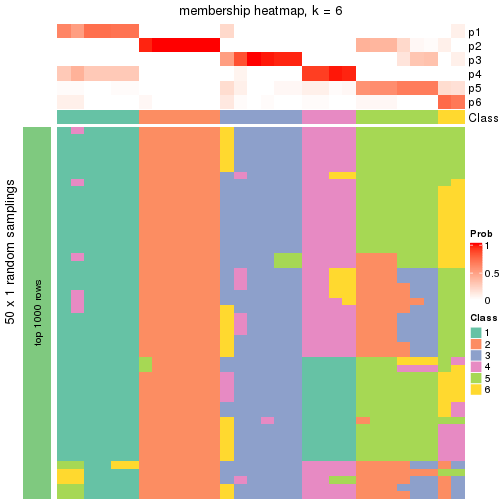</p>

</div>
<div id='tab-node-024-membership-heatmap-6'>
<pre><code class="r">membership_heatmap(res, k = 7)
</code></pre>

<p>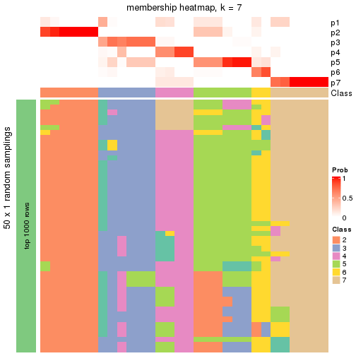</p>

</div>
<div id='tab-node-024-membership-heatmap-7'>
<pre><code class="r">membership_heatmap(res, k = 8)
</code></pre>

<p>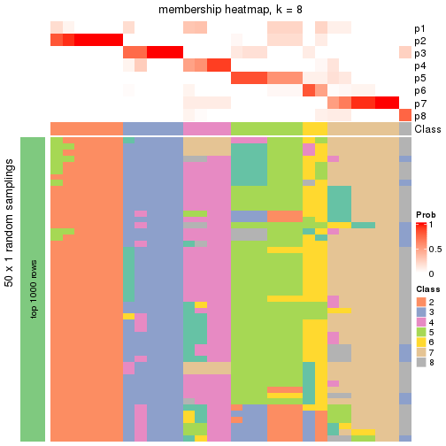</p>

</div>
</div>

As soon as the classes for columns are determined, the signatures
that are significantly different between subgroups can be looked for. 
Following are the heatmaps for signatures.


<script>
$( function() {
	$( '#tabs-node-024-get-signatures' ).tabs();
} );
</script>
<div id='tabs-node-024-get-signatures'>
<ul>
<li><a href='#tab-node-024-get-signatures-1'>k = 2</a></li>
<li><a href='#tab-node-024-get-signatures-2'>k = 3</a></li>
<li><a href='#tab-node-024-get-signatures-3'>k = 4</a></li>
<li><a href='#tab-node-024-get-signatures-4'>k = 5</a></li>
<li><a href='#tab-node-024-get-signatures-5'>k = 6</a></li>
<li><a href='#tab-node-024-get-signatures-6'>k = 7</a></li>
<li><a href='#tab-node-024-get-signatures-7'>k = 8</a></li>
</ul>
<div id='tab-node-024-get-signatures-1'>
<pre><code class="r">get_signatures(res, k = 2)
</code></pre>

<p>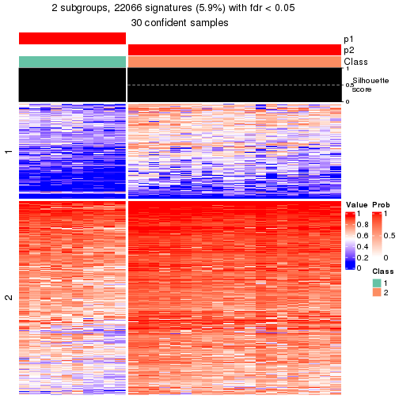</p>

</div>
<div id='tab-node-024-get-signatures-2'>
<pre><code class="r">get_signatures(res, k = 3)
</code></pre>

<p>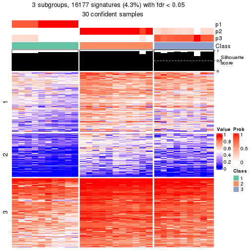</p>

</div>
<div id='tab-node-024-get-signatures-3'>
<pre><code class="r">get_signatures(res, k = 4)
</code></pre>

<p>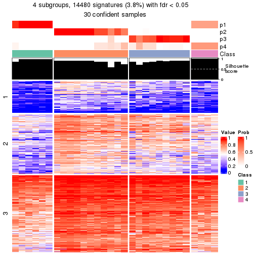</p>

</div>
<div id='tab-node-024-get-signatures-4'>
<pre><code class="r">get_signatures(res, k = 5)
</code></pre>

<p>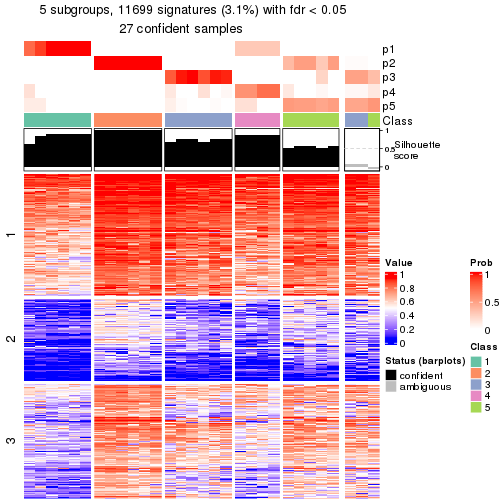</p>

</div>
<div id='tab-node-024-get-signatures-5'>
<pre><code class="r">get_signatures(res, k = 6)
</code></pre>

<p>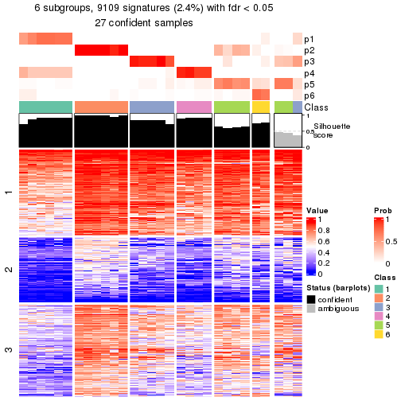</p>

</div>
<div id='tab-node-024-get-signatures-6'>
<pre><code class="r">get_signatures(res, k = 7)
</code></pre>

<p>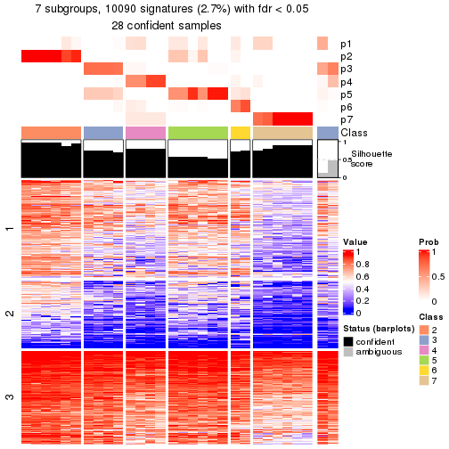</p>

</div>
<div id='tab-node-024-get-signatures-7'>
<pre><code class="r">get_signatures(res, k = 8)
</code></pre>

<p>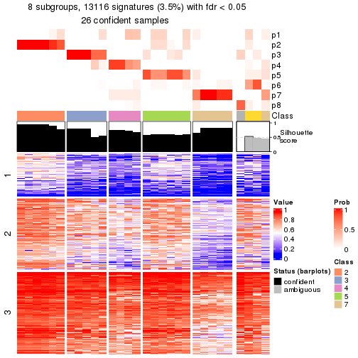</p>

</div>
</div>


Compare the overlap of signatures from different k:

```r
compare_signatures(res)
```

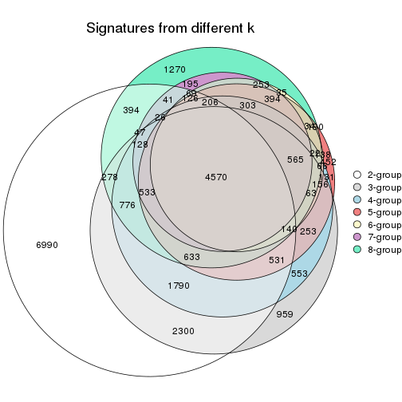

`get_signature()` returns a data frame invisibly. To get the list of signatures, the function
call should be assigned to a variable explicitly. In following code, if `plot` argument is set
to `FALSE`, no heatmap is plotted while only the differential analysis is performed.

```r
# code only for demonstration
tb = get_signature(res, k = ..., plot = FALSE)
```

An example of the output of `tb` is:

```
#>   which_row         fdr    mean_1    mean_2 scaled_mean_1 scaled_mean_2 km
#> 1        38 0.042760348  8.373488  9.131774    -0.5533452     0.5164555  1
#> 2        40 0.018707592  7.106213  8.469186    -0.6173731     0.5762149  1
#> 3        55 0.019134737 10.221463 11.207825    -0.6159697     0.5749050  1
#> 4        59 0.006059896  5.921854  7.869574    -0.6899429     0.6439467  1
#> 5        60 0.018055526  8.928898 10.211722    -0.6204761     0.5791110  1
#> 6        98 0.009384629 15.714769 14.887706     0.6635654    -0.6193277  2
...
```

The columns in `tb` are:

1. `which_row`: row indices corresponding to the input matrix.
2. `fdr`: FDR for the differential test. 
3. `mean_x`: The mean value in group x.
4. `scaled_mean_x`: The mean value in group x after rows are scaled.
5. `km`: Row groups if k-means clustering is applied to rows (which is done by automatically selecting number of clusters).

If there are too many signatures, `top_signatures = ...` can be set to only show the 
signatures with the highest FDRs:

```r
# code only for demonstration
# e.g. to show the top 500 most significant rows
tb = get_signature(res, k = ..., top_signatures = 500)
```

If the signatures are defined as these which are uniquely high in current group, `diff_method` argument
can be set to `"uniquely_high_in_one_group"`:

```r
# code only for demonstration
tb = get_signature(res, k = ..., diff_method = "uniquely_high_in_one_group")
```


UMAP plot which shows how samples are separated.


<script>
$( function() {
	$( '#tabs-node-024-dimension-reduction' ).tabs();
} );
</script>
<div id='tabs-node-024-dimension-reduction'>
<ul>
<li><a href='#tab-node-024-dimension-reduction-1'>k = 2</a></li>
<li><a href='#tab-node-024-dimension-reduction-2'>k = 3</a></li>
<li><a href='#tab-node-024-dimension-reduction-3'>k = 4</a></li>
<li><a href='#tab-node-024-dimension-reduction-4'>k = 5</a></li>
<li><a href='#tab-node-024-dimension-reduction-5'>k = 6</a></li>
<li><a href='#tab-node-024-dimension-reduction-6'>k = 7</a></li>
<li><a href='#tab-node-024-dimension-reduction-7'>k = 8</a></li>
</ul>
<div id='tab-node-024-dimension-reduction-1'>
<pre><code class="r">dimension_reduction(res, k = 2, method = &quot;UMAP&quot;)
</code></pre>

<p>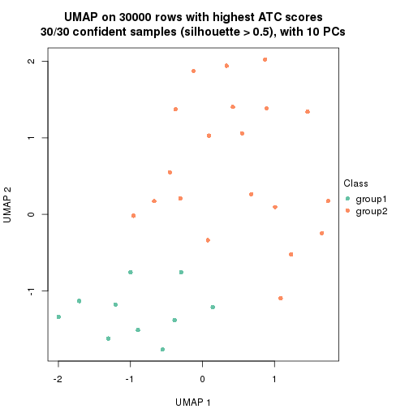</p>

</div>
<div id='tab-node-024-dimension-reduction-2'>
<pre><code class="r">dimension_reduction(res, k = 3, method = &quot;UMAP&quot;)
</code></pre>

<p>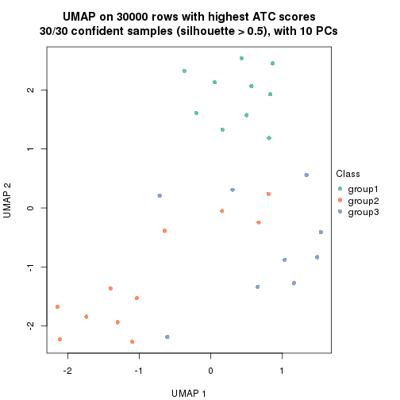</p>

</div>
<div id='tab-node-024-dimension-reduction-3'>
<pre><code class="r">dimension_reduction(res, k = 4, method = &quot;UMAP&quot;)
</code></pre>

<p>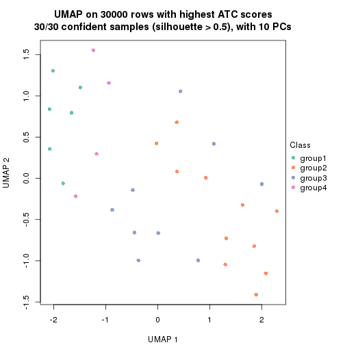</p>

</div>
<div id='tab-node-024-dimension-reduction-4'>
<pre><code class="r">dimension_reduction(res, k = 5, method = &quot;UMAP&quot;)
</code></pre>

<p>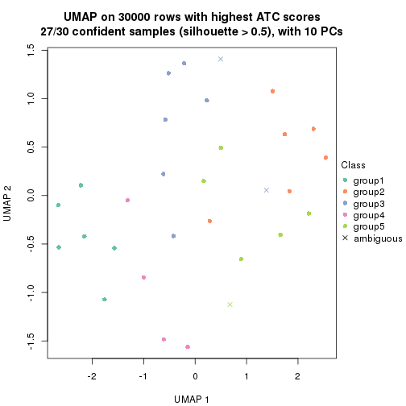</p>

</div>
<div id='tab-node-024-dimension-reduction-5'>
<pre><code class="r">dimension_reduction(res, k = 6, method = &quot;UMAP&quot;)
</code></pre>

<p>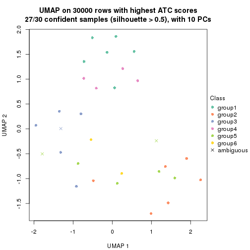</p>

</div>
<div id='tab-node-024-dimension-reduction-6'>
<pre><code class="r">dimension_reduction(res, k = 7, method = &quot;UMAP&quot;)
</code></pre>

<p>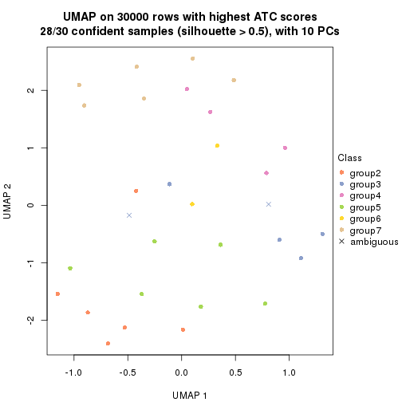</p>

</div>
<div id='tab-node-024-dimension-reduction-7'>
<pre><code class="r">dimension_reduction(res, k = 8, method = &quot;UMAP&quot;)
</code></pre>

<p>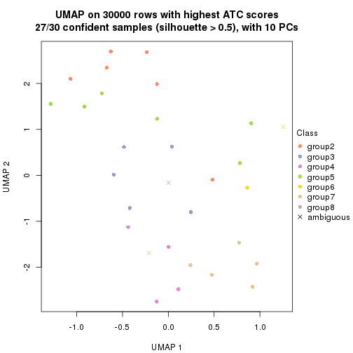</p>

</div>
</div>


Following heatmap shows how subgroups are split when increasing `k`:

```r
collect_classes(res)
```

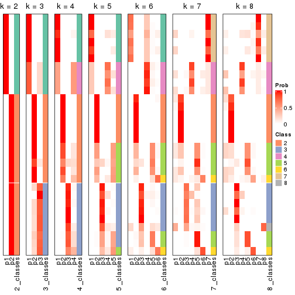


If matrix rows can be associated to genes, consider to use `functional_enrichment(res,
...)` to perform function enrichment for the signature genes. See [this vignette](https://jokergoo.github.io/cola_vignettes/functional_enrichment.html) for more detailed explanations.


 

---------------------------------------------------


### Node03


Parent node: [Node0](#Node0).
Child nodes: 
                Node011-leaf
        ,
                [Node012](#Node012)
        ,
                Node013-leaf
        ,
                [Node021](#Node021)
        ,
                [Node022](#Node022)
        ,
                [Node023](#Node023)
        ,
                [Node024](#Node024)
        ,
                Node031-leaf
        ,
                Node032-leaf
        ,
                Node033-leaf
        ,
                Node034-leaf
        ,
                [Node041](#Node041)
        ,
                [Node042](#Node042)
        ,
                [Node043](#Node043)
        ,
                [Node044](#Node044)
        ,
                [Node051](#Node051)
        ,
                [Node052](#Node052)
        ,
                Node053-leaf
        .


The object with results only for a single top-value method and a single partitioning method 
can be extracted as:

```r
res = res_rh["03"]
```

A summary of `res` and all the functions that can be applied to it:

```r
res
```

```
#> A 'ConsensusPartition' object with k = 2, 3, 4, 5, 6, 7, 8.
#>   On a matrix with 30000 rows and 50 columns.
#>   Top rows (1000) are extracted by 'ATC' method.
#>   Subgroups are detected by 'skmeans' method.
#>   Performed in total 350 partitions by row resampling.
#>   Best k for subgroups seems to be 4.
#> 
#> Following methods can be applied to this 'ConsensusPartition' object:
#>  [1] "cola_report"             "collect_classes"         "collect_plots"          
#>  [4] "collect_stats"           "colnames"                "compare_partitions"     
#>  [7] "compare_signatures"      "consensus_heatmap"       "dimension_reduction"    
#> [10] "functional_enrichment"   "get_anno_col"            "get_anno"               
#> [13] "get_classes"             "get_consensus"           "get_matrix"             
#> [16] "get_membership"          "get_param"               "get_signatures"         
#> [19] "get_stats"               "is_best_k"               "is_stable_k"            
#> [22] "membership_heatmap"      "ncol"                    "nrow"                   
#> [25] "plot_ecdf"               "predict_classes"         "rownames"               
#> [28] "select_partition_number" "show"                    "suggest_best_k"         
#> [31] "test_to_known_factors"   "top_rows_heatmap"
```

`collect_plots()` function collects all the plots made from `res` for all `k` (number of subgroups)
into one single page to provide an easy and fast comparison between different `k`.

```r
collect_plots(res)
```

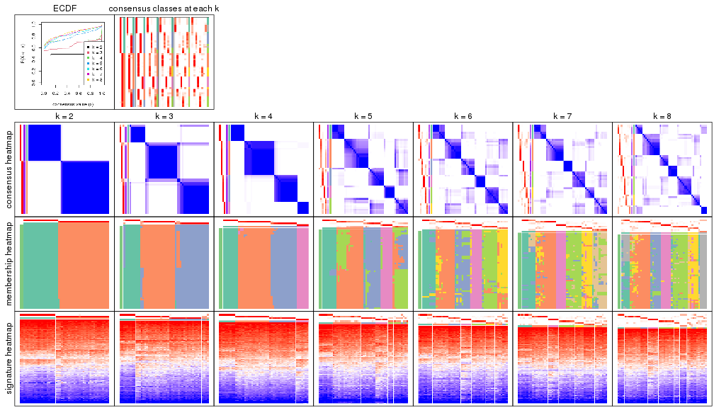

The plots are:

- The first row: a plot of the eCDF (empirical cumulative distribution
  function) curves of the consensus matrix for each `k` and the heatmap of
  predicted classes for each `k`.
- The second row: heatmaps of the consensus matrix for each `k`.
- The third row: heatmaps of the membership matrix for each `k`.
- The fouth row: heatmaps of the signatures for each `k`.

All the plots in panels can be made by individual functions and they are
plotted later in this section.

`select_partition_number()` produces several plots showing different
statistics for choosing "optimized" `k`. There are following statistics:

- eCDF curves of the consensus matrix for each `k`;
- 1-PAC. [The PAC score](https://en.wikipedia.org/wiki/Consensus_clustering#Over-interpretation_potential_of_consensus_clustering)
  measures the proportion of the ambiguous subgrouping.
- Mean silhouette score.
- Concordance. The mean probability of fiting the consensus subgroup labels in all
  partitions.
- Area increased. Denote $A_k$ as the area under the eCDF curve for current
  `k`, the area increased is defined as $A_k - A_{k-1}$.
- Rand index. The percent of pairs of samples that are both in a same cluster
  or both are not in a same cluster in the partition of k and k-1.
- Jaccard index. The ratio of pairs of samples are both in a same cluster in
  the partition of k and k-1 and the pairs of samples are both in a same
  cluster in the partition k or k-1.

The detailed explanations of these statistics can be found in [the _cola_
vignette](https://jokergoo.github.io/cola_vignettes/cola.html#toc_13).

Generally speaking, higher 1-PAC score, higher mean silhouette score or higher
concordance corresponds to better partition. Rand index and Jaccard index
measure how similar the current partition is compared to partition with `k-1`.
If they are too similar, we won't accept `k` is better than `k-1`.

```r
select_partition_number(res)
```

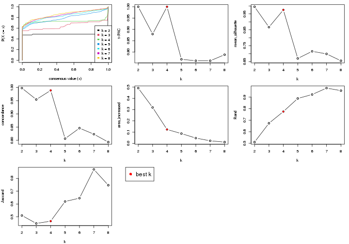

The numeric values for all these statistics can be obtained by `get_stats()`.

```r
get_stats(res)
```

```
#>   k 1-PAC mean_silhouette concordance area_increased  Rand Jaccard
#> 2 2 1.000           0.995       0.998         0.4912 0.510   0.510
#> 3 3 0.879           0.867       0.954         0.3190 0.673   0.448
#> 4 4 1.000           0.975       0.989         0.1236 0.775   0.466
#> 5 5 0.768           0.670       0.806         0.0872 0.888   0.619
#> 6 6 0.761           0.715       0.846         0.0473 0.922   0.646
#> 7 7 0.761           0.699       0.823         0.0230 0.978   0.870
#> 8 8 0.788           0.655       0.793         0.0115 0.956   0.746
```

`suggest_best_k()` suggests the best $k$ based on these statistics. The rules are as follows:

- All $k$ with Jaccard index larger than 0.95 are removed because increasing
  $k$ does not provide enough extra information. If all $k$ are removed, it is
  marked as no subgroup is detected.
- For all $k$ with 1-PAC score larger than 0.9, the maximal $k$ is taken as
  the best $k$, and other $k$ are marked as optional $k$.
- If it does not fit the second rule. The $k$ with the maximal vote of the
  highest 1-PAC score, highest mean silhouette, and highest concordance is
  taken as the best $k$.

```r
suggest_best_k(res)
```

```
#> [1] 4
#> attr(,"optional")
#> [1] 2
```

There is also optional best $k$ = 2 that is worth to check.

Following is the table of the partitions (You need to click the **show/hide
code output** link to see it). The membership matrix (columns with name `p*`)
is inferred by
[`clue::cl_consensus()`](https://www.rdocumentation.org/link/cl_consensus?package=clue)
function with the `SE` method. Basically the value in the membership matrix
represents the probability to belong to a certain group. The finall subgroup
label for an item is determined with the group with highest probability it
belongs to.

In `get_classes()` function, the entropy is calculated from the membership
matrix and the silhouette score is calculated from the consensus matrix.


<script>
$( function() {
	$( '#tabs-node-03-get-classes' ).tabs();
} );
</script>
<div id='tabs-node-03-get-classes'>
<ul>
<li><a href='#tab-node-03-get-classes-1'>k = 2</a></li>
<li><a href='#tab-node-03-get-classes-2'>k = 3</a></li>
<li><a href='#tab-node-03-get-classes-3'>k = 4</a></li>
<li><a href='#tab-node-03-get-classes-4'>k = 5</a></li>
<li><a href='#tab-node-03-get-classes-5'>k = 6</a></li>
<li><a href='#tab-node-03-get-classes-6'>k = 7</a></li>
<li><a href='#tab-node-03-get-classes-7'>k = 8</a></li>
</ul>

<div id='tab-node-03-get-classes-1'>
<p><a id='tab-node-03-get-classes-1-a' style='color:#0366d6' href='#'>show/hide code output</a></p>
<pre><code class="r">cbind(get_classes(res, k = 2), get_membership(res, k = 2))
</code></pre>

<pre><code>#&gt;                 class entropy silhouette   p1   p2
#&gt; TCGA.EJ.AB27.01     2   0.000      0.996 0.00 1.00
#&gt; TCGA.KC.A4BL.01     2   0.000      0.996 0.00 1.00
#&gt; TCGA.EJ.A46B.01     1   0.000      1.000 1.00 0.00
#&gt; TCGA.X4.A8KS.01     1   0.000      1.000 1.00 0.00
#&gt; TCGA.KC.A7FE.01     2   0.000      0.996 0.00 1.00
#&gt; TCGA.HC.7817.01     2   0.000      0.996 0.00 1.00
#&gt; TCGA.HC.A8D0.01     2   0.000      0.996 0.00 1.00
#&gt; TCGA.SU.A7E7.01     2   0.000      0.996 0.00 1.00
#&gt; TCGA.G9.6342.11     1   0.000      1.000 1.00 0.00
#&gt; TCGA.EJ.A65B.01     2   0.000      0.996 0.00 1.00
#&gt; TCGA.ZG.A9LU.01     1   0.000      1.000 1.00 0.00
#&gt; TCGA.EJ.5506.01     1   0.000      1.000 1.00 0.00
#&gt; TCGA.EJ.A8FO.01     1   0.000      1.000 1.00 0.00
#&gt; TCGA.J4.AATV.01     2   0.000      0.996 0.00 1.00
#&gt; TCGA.KK.A8I7.01     2   0.000      0.996 0.00 1.00
#&gt; TCGA.EJ.7791.01     2   0.000      0.996 0.00 1.00
#&gt; TCGA.KK.A8IC.01     2   0.000      0.996 0.00 1.00
#&gt; TCGA.CH.5765.11     1   0.000      1.000 1.00 0.00
#&gt; TCGA.V1.A9O7.01     2   0.000      0.996 0.00 1.00
#&gt; TCGA.EJ.5498.01     2   0.000      0.996 0.00 1.00
#&gt; TCGA.EJ.A46D.01     1   0.000      1.000 1.00 0.00
#&gt; TCGA.V1.A8MK.01     2   0.529      0.864 0.12 0.88
#&gt; TCGA.YL.A8HJ.01     2   0.000      0.996 0.00 1.00
#&gt; TCGA.G9.6353.01     1   0.000      1.000 1.00 0.00
#&gt; TCGA.XJ.A9DQ.01     1   0.000      1.000 1.00 0.00
#&gt; TCGA.ZG.A9MC.01     2   0.000      0.996 0.00 1.00
#&gt; TCGA.G9.6378.01     1   0.000      1.000 1.00 0.00
#&gt; TCGA.HC.7079.01     2   0.000      0.996 0.00 1.00
#&gt; TCGA.HC.A8D1.01     2   0.000      0.996 0.00 1.00
#&gt; TCGA.EJ.A7NG.01     1   0.000      1.000 1.00 0.00
#&gt; TCGA.KC.A4BR.01     2   0.000      0.996 0.00 1.00
#&gt; TCGA.CH.5768.11     1   0.000      1.000 1.00 0.00
#&gt; TCGA.HC.A6HX.01     1   0.000      1.000 1.00 0.00
#&gt; TCGA.M7.A71Y.01     1   0.000      1.000 1.00 0.00
#&gt; TCGA.VN.A88I.01     2   0.000      0.996 0.00 1.00
#&gt; TCGA.EJ.5531.01     2   0.000      0.996 0.00 1.00
#&gt; TCGA.HC.8258.01     2   0.000      0.996 0.00 1.00
#&gt; TCGA.J4.A6G1.01     2   0.000      0.996 0.00 1.00
#&gt; TCGA.HC.8260.01     1   0.000      1.000 1.00 0.00
#&gt; TCGA.HC.7740.01     2   0.000      0.996 0.00 1.00
#&gt; TCGA.KK.A7B2.01     2   0.000      0.996 0.00 1.00
#&gt; TCGA.HC.7742.11     1   0.000      1.000 1.00 0.00
#&gt; TCGA.G9.6351.11     1   0.000      1.000 1.00 0.00
#&gt; TCGA.YL.A9WX.01     2   0.000      0.996 0.00 1.00
#&gt; TCGA.ZG.A9L6.01     2   0.000      0.996 0.00 1.00
#&gt; TCGA.M7.A723.01     1   0.000      1.000 1.00 0.00
#&gt; TCGA.CH.5771.01     2   0.000      0.996 0.00 1.00
#&gt; TCGA.EJ.A6RA.01     1   0.000      1.000 1.00 0.00
#&gt; TCGA.J4.A6G3.01     2   0.000      0.996 0.00 1.00
#&gt; TCGA.G9.6329.01     2   0.000      0.996 0.00 1.00
</code></pre>

<script>
$('#tab-node-03-get-classes-1-a').parent().next().next().hide();
$('#tab-node-03-get-classes-1-a').click(function(){
  $('#tab-node-03-get-classes-1-a').parent().next().next().toggle();
  return(false);
});
</script>
</div>

<div id='tab-node-03-get-classes-2'>
<p><a id='tab-node-03-get-classes-2-a' style='color:#0366d6' href='#'>show/hide code output</a></p>
<pre><code class="r">cbind(get_classes(res, k = 3), get_membership(res, k = 3))
</code></pre>

<pre><code>#&gt;                 class entropy silhouette  p1   p2   p3
#&gt; TCGA.EJ.AB27.01     2   0.630     0.0135 0.0 0.52 0.48
#&gt; TCGA.KC.A4BL.01     3   0.624     0.1923 0.0 0.44 0.56
#&gt; TCGA.EJ.A46B.01     1   0.000     0.9431 1.0 0.00 0.00
#&gt; TCGA.X4.A8KS.01     3   0.000     0.9296 0.0 0.00 1.00
#&gt; TCGA.KC.A7FE.01     3   0.624     0.1923 0.0 0.44 0.56
#&gt; TCGA.HC.7817.01     2   0.000     0.9557 0.0 1.00 0.00
#&gt; TCGA.HC.A8D0.01     2   0.000     0.9557 0.0 1.00 0.00
#&gt; TCGA.SU.A7E7.01     3   0.000     0.9296 0.0 0.00 1.00
#&gt; TCGA.G9.6342.11     3   0.000     0.9296 0.0 0.00 1.00
#&gt; TCGA.EJ.A65B.01     2   0.502     0.6541 0.0 0.76 0.24
#&gt; TCGA.ZG.A9LU.01     3   0.000     0.9296 0.0 0.00 1.00
#&gt; TCGA.EJ.5506.01     1   0.000     0.9431 1.0 0.00 0.00
#&gt; TCGA.EJ.A8FO.01     3   0.000     0.9296 0.0 0.00 1.00
#&gt; TCGA.J4.AATV.01     3   0.000     0.9296 0.0 0.00 1.00
#&gt; TCGA.KK.A8I7.01     2   0.000     0.9557 0.0 1.00 0.00
#&gt; TCGA.EJ.7791.01     2   0.000     0.9557 0.0 1.00 0.00
#&gt; TCGA.KK.A8IC.01     3   0.000     0.9296 0.0 0.00 1.00
#&gt; TCGA.CH.5765.11     1   0.000     0.9431 1.0 0.00 0.00
#&gt; TCGA.V1.A9O7.01     2   0.000     0.9557 0.0 1.00 0.00
#&gt; TCGA.EJ.5498.01     2   0.000     0.9557 0.0 1.00 0.00
#&gt; TCGA.EJ.A46D.01     3   0.000     0.9296 0.0 0.00 1.00
#&gt; TCGA.V1.A8MK.01     3   0.000     0.9296 0.0 0.00 1.00
#&gt; TCGA.YL.A8HJ.01     2   0.000     0.9557 0.0 1.00 0.00
#&gt; TCGA.G9.6353.01     3   0.000     0.9296 0.0 0.00 1.00
#&gt; TCGA.XJ.A9DQ.01     1   0.000     0.9431 1.0 0.00 0.00
#&gt; TCGA.ZG.A9MC.01     2   0.000     0.9557 0.0 1.00 0.00
#&gt; TCGA.G9.6378.01     3   0.296     0.8226 0.1 0.00 0.90
#&gt; TCGA.HC.7079.01     2   0.000     0.9557 0.0 1.00 0.00
#&gt; TCGA.HC.A8D1.01     2   0.000     0.9557 0.0 1.00 0.00
#&gt; TCGA.EJ.A7NG.01     3   0.000     0.9296 0.0 0.00 1.00
#&gt; TCGA.KC.A4BR.01     2   0.000     0.9557 0.0 1.00 0.00
#&gt; TCGA.CH.5768.11     1   0.000     0.9431 1.0 0.00 0.00
#&gt; TCGA.HC.A6HX.01     3   0.000     0.9296 0.0 0.00 1.00
#&gt; TCGA.M7.A71Y.01     1   0.000     0.9431 1.0 0.00 0.00
#&gt; TCGA.VN.A88I.01     2   0.000     0.9557 0.0 1.00 0.00
#&gt; TCGA.EJ.5531.01     3   0.254     0.8524 0.0 0.08 0.92
#&gt; TCGA.HC.8258.01     2   0.000     0.9557 0.0 1.00 0.00
#&gt; TCGA.J4.A6G1.01     2   0.000     0.9557 0.0 1.00 0.00
#&gt; TCGA.HC.8260.01     1   0.000     0.9431 1.0 0.00 0.00
#&gt; TCGA.HC.7740.01     2   0.000     0.9557 0.0 1.00 0.00
#&gt; TCGA.KK.A7B2.01     3   0.000     0.9296 0.0 0.00 1.00
#&gt; TCGA.HC.7742.11     1   0.000     0.9431 1.0 0.00 0.00
#&gt; TCGA.G9.6351.11     3   0.000     0.9296 0.0 0.00 1.00
#&gt; TCGA.YL.A9WX.01     3   0.000     0.9296 0.0 0.00 1.00
#&gt; TCGA.ZG.A9L6.01     2   0.000     0.9557 0.0 1.00 0.00
#&gt; TCGA.M7.A723.01     1   0.631     0.0469 0.5 0.00 0.50
#&gt; TCGA.CH.5771.01     2   0.000     0.9557 0.0 1.00 0.00
#&gt; TCGA.EJ.A6RA.01     1   0.000     0.9431 1.0 0.00 0.00
#&gt; TCGA.J4.A6G3.01     2   0.000     0.9557 0.0 1.00 0.00
#&gt; TCGA.G9.6329.01     3   0.000     0.9296 0.0 0.00 1.00
</code></pre>

<script>
$('#tab-node-03-get-classes-2-a').parent().next().next().hide();
$('#tab-node-03-get-classes-2-a').click(function(){
  $('#tab-node-03-get-classes-2-a').parent().next().next().toggle();
  return(false);
});
</script>
</div>

<div id='tab-node-03-get-classes-3'>
<p><a id='tab-node-03-get-classes-3-a' style='color:#0366d6' href='#'>show/hide code output</a></p>
<pre><code class="r">cbind(get_classes(res, k = 4), get_membership(res, k = 4))
</code></pre>

<pre><code>#&gt;                 class entropy silhouette p1   p2   p3   p4
#&gt; TCGA.EJ.AB27.01     2  0.0000      0.989  0 1.00 0.00 0.00
#&gt; TCGA.KC.A4BL.01     2  0.0000      0.989  0 1.00 0.00 0.00
#&gt; TCGA.EJ.A46B.01     1  0.0000      1.000  1 0.00 0.00 0.00
#&gt; TCGA.X4.A8KS.01     3  0.0000      0.967  0 0.00 1.00 0.00
#&gt; TCGA.KC.A7FE.01     2  0.0000      0.989  0 1.00 0.00 0.00
#&gt; TCGA.HC.7817.01     2  0.0000      0.989  0 1.00 0.00 0.00
#&gt; TCGA.HC.A8D0.01     2  0.0000      0.989  0 1.00 0.00 0.00
#&gt; TCGA.SU.A7E7.01     2  0.0707      0.974  0 0.98 0.02 0.00
#&gt; TCGA.G9.6342.11     3  0.0000      0.967  0 0.00 1.00 0.00
#&gt; TCGA.EJ.A65B.01     2  0.0000      0.989  0 1.00 0.00 0.00
#&gt; TCGA.ZG.A9LU.01     3  0.0000      0.967  0 0.00 1.00 0.00
#&gt; TCGA.EJ.5506.01     1  0.0000      1.000  1 0.00 0.00 0.00
#&gt; TCGA.EJ.A8FO.01     3  0.0000      0.967  0 0.00 1.00 0.00
#&gt; TCGA.J4.AATV.01     2  0.0000      0.989  0 1.00 0.00 0.00
#&gt; TCGA.KK.A8I7.01     2  0.0000      0.989  0 1.00 0.00 0.00
#&gt; TCGA.EJ.7791.01     2  0.0000      0.989  0 1.00 0.00 0.00
#&gt; TCGA.KK.A8IC.01     3  0.2345      0.873  0 0.10 0.90 0.00
#&gt; TCGA.CH.5765.11     1  0.0000      1.000  1 0.00 0.00 0.00
#&gt; TCGA.V1.A9O7.01     4  0.0000      1.000  0 0.00 0.00 1.00
#&gt; TCGA.EJ.5498.01     2  0.0000      0.989  0 1.00 0.00 0.00
#&gt; TCGA.EJ.A46D.01     3  0.0000      0.967  0 0.00 1.00 0.00
#&gt; TCGA.V1.A8MK.01     3  0.0707      0.953  0 0.02 0.98 0.00
#&gt; TCGA.YL.A8HJ.01     4  0.0000      1.000  0 0.00 0.00 1.00
#&gt; TCGA.G9.6353.01     3  0.0000      0.967  0 0.00 1.00 0.00
#&gt; TCGA.XJ.A9DQ.01     1  0.0000      1.000  1 0.00 0.00 0.00
#&gt; TCGA.ZG.A9MC.01     4  0.0000      1.000  0 0.00 0.00 1.00
#&gt; TCGA.G9.6378.01     3  0.0000      0.967  0 0.00 1.00 0.00
#&gt; TCGA.HC.7079.01     4  0.0000      1.000  0 0.00 0.00 1.00
#&gt; TCGA.HC.A8D1.01     2  0.0000      0.989  0 1.00 0.00 0.00
#&gt; TCGA.EJ.A7NG.01     3  0.0000      0.967  0 0.00 1.00 0.00
#&gt; TCGA.KC.A4BR.01     4  0.0000      1.000  0 0.00 0.00 1.00
#&gt; TCGA.CH.5768.11     1  0.0000      1.000  1 0.00 0.00 0.00
#&gt; TCGA.HC.A6HX.01     3  0.0000      0.967  0 0.00 1.00 0.00
#&gt; TCGA.M7.A71Y.01     1  0.0000      1.000  1 0.00 0.00 0.00
#&gt; TCGA.VN.A88I.01     4  0.0000      1.000  0 0.00 0.00 1.00
#&gt; TCGA.EJ.5531.01     2  0.0000      0.989  0 1.00 0.00 0.00
#&gt; TCGA.HC.8258.01     2  0.1211      0.959  0 0.96 0.00 0.04
#&gt; TCGA.J4.A6G1.01     4  0.0000      1.000  0 0.00 0.00 1.00
#&gt; TCGA.HC.8260.01     1  0.0000      1.000  1 0.00 0.00 0.00
#&gt; TCGA.HC.7740.01     2  0.0000      0.989  0 1.00 0.00 0.00
#&gt; TCGA.KK.A7B2.01     3  0.0707      0.953  0 0.02 0.98 0.00
#&gt; TCGA.HC.7742.11     1  0.0000      1.000  1 0.00 0.00 0.00
#&gt; TCGA.G9.6351.11     3  0.0000      0.967  0 0.00 1.00 0.00
#&gt; TCGA.YL.A9WX.01     2  0.1211      0.954  0 0.96 0.04 0.00
#&gt; TCGA.ZG.A9L6.01     2  0.1211      0.958  0 0.96 0.00 0.04
#&gt; TCGA.M7.A723.01     3  0.0000      0.967  0 0.00 1.00 0.00
#&gt; TCGA.CH.5771.01     2  0.0000      0.989  0 1.00 0.00 0.00
#&gt; TCGA.EJ.A6RA.01     1  0.0000      1.000  1 0.00 0.00 0.00
#&gt; TCGA.J4.A6G3.01     2  0.1211      0.959  0 0.96 0.00 0.04
#&gt; TCGA.G9.6329.01     3  0.3975      0.689  0 0.24 0.76 0.00
</code></pre>

<script>
$('#tab-node-03-get-classes-3-a').parent().next().next().hide();
$('#tab-node-03-get-classes-3-a').click(function(){
  $('#tab-node-03-get-classes-3-a').parent().next().next().toggle();
  return(false);
});
</script>
</div>

<div id='tab-node-03-get-classes-4'>
<p><a id='tab-node-03-get-classes-4-a' style='color:#0366d6' href='#'>show/hide code output</a></p>
<pre><code class="r">cbind(get_classes(res, k = 5), get_membership(res, k = 5))
</code></pre>

<pre><code>#&gt;                 class entropy silhouette   p1   p2   p3   p4   p5
#&gt; TCGA.EJ.AB27.01     2  0.3684      0.727 0.00 0.72 0.00 0.00 0.28
#&gt; TCGA.KC.A4BL.01     2  0.4262      0.754 0.00 0.56 0.00 0.00 0.44
#&gt; TCGA.EJ.A46B.01     3  0.4302     -0.208 0.48 0.00 0.52 0.00 0.00
#&gt; TCGA.X4.A8KS.01     3  0.1410      0.744 0.00 0.00 0.94 0.00 0.06
#&gt; TCGA.KC.A7FE.01     2  0.4262      0.754 0.00 0.56 0.00 0.00 0.44
#&gt; TCGA.HC.7817.01     2  0.4262      0.754 0.00 0.56 0.00 0.00 0.44
#&gt; TCGA.HC.A8D0.01     2  0.1410      0.630 0.00 0.94 0.00 0.00 0.06
#&gt; TCGA.SU.A7E7.01     5  0.3868      0.471 0.00 0.14 0.06 0.00 0.80
#&gt; TCGA.G9.6342.11     3  0.1043      0.768 0.00 0.00 0.96 0.00 0.04
#&gt; TCGA.EJ.A65B.01     2  0.4262      0.754 0.00 0.56 0.00 0.00 0.44
#&gt; TCGA.ZG.A9LU.01     3  0.4302     -0.309 0.00 0.00 0.52 0.00 0.48
#&gt; TCGA.EJ.5506.01     1  0.0000      0.956 1.00 0.00 0.00 0.00 0.00
#&gt; TCGA.EJ.A8FO.01     5  0.4262      0.364 0.00 0.00 0.44 0.00 0.56
#&gt; TCGA.J4.AATV.01     5  0.4287     -0.730 0.00 0.46 0.00 0.00 0.54
#&gt; TCGA.KK.A8I7.01     2  0.4182      0.757 0.00 0.60 0.00 0.00 0.40
#&gt; TCGA.EJ.7791.01     2  0.4262      0.754 0.00 0.56 0.00 0.00 0.44
#&gt; TCGA.KK.A8IC.01     5  0.4456      0.536 0.00 0.02 0.32 0.00 0.66
#&gt; TCGA.CH.5765.11     1  0.0000      0.956 1.00 0.00 0.00 0.00 0.00
#&gt; TCGA.V1.A9O7.01     4  0.0000      0.947 0.00 0.00 0.00 1.00 0.00
#&gt; TCGA.EJ.5498.01     2  0.1043      0.644 0.00 0.96 0.00 0.00 0.04
#&gt; TCGA.EJ.A46D.01     5  0.4302      0.267 0.00 0.00 0.48 0.00 0.52
#&gt; TCGA.V1.A8MK.01     5  0.4227      0.422 0.00 0.00 0.42 0.00 0.58
#&gt; TCGA.YL.A8HJ.01     4  0.3983      0.646 0.00 0.34 0.00 0.66 0.00
#&gt; TCGA.G9.6353.01     3  0.0609      0.779 0.00 0.00 0.98 0.00 0.02
#&gt; TCGA.XJ.A9DQ.01     1  0.1732      0.948 0.92 0.00 0.08 0.00 0.00
#&gt; TCGA.ZG.A9MC.01     4  0.0000      0.947 0.00 0.00 0.00 1.00 0.00
#&gt; TCGA.G9.6378.01     3  0.0000      0.771 0.00 0.00 1.00 0.00 0.00
#&gt; TCGA.HC.7079.01     4  0.0000      0.947 0.00 0.00 0.00 1.00 0.00
#&gt; TCGA.HC.A8D1.01     2  0.2732      0.516 0.00 0.84 0.00 0.00 0.16
#&gt; TCGA.EJ.A7NG.01     3  0.0609      0.779 0.00 0.00 0.98 0.00 0.02
#&gt; TCGA.KC.A4BR.01     4  0.0000      0.947 0.00 0.00 0.00 1.00 0.00
#&gt; TCGA.CH.5768.11     1  0.0000      0.956 1.00 0.00 0.00 0.00 0.00
#&gt; TCGA.HC.A6HX.01     3  0.3109      0.555 0.00 0.00 0.80 0.00 0.20
#&gt; TCGA.M7.A71Y.01     1  0.1732      0.948 0.92 0.00 0.08 0.00 0.00
#&gt; TCGA.VN.A88I.01     4  0.0000      0.947 0.00 0.00 0.00 1.00 0.00
#&gt; TCGA.EJ.5531.01     2  0.4060      0.715 0.00 0.64 0.00 0.00 0.36
#&gt; TCGA.HC.8258.01     2  0.4227      0.756 0.00 0.58 0.00 0.00 0.42
#&gt; TCGA.J4.A6G1.01     4  0.0000      0.947 0.00 0.00 0.00 1.00 0.00
#&gt; TCGA.HC.8260.01     1  0.1732      0.948 0.92 0.00 0.08 0.00 0.00
#&gt; TCGA.HC.7740.01     2  0.4262      0.754 0.00 0.56 0.00 0.00 0.44
#&gt; TCGA.KK.A7B2.01     5  0.3983      0.522 0.00 0.00 0.34 0.00 0.66
#&gt; TCGA.HC.7742.11     1  0.0000      0.956 1.00 0.00 0.00 0.00 0.00
#&gt; TCGA.G9.6351.11     3  0.0609      0.779 0.00 0.00 0.98 0.00 0.02
#&gt; TCGA.YL.A9WX.01     5  0.2438      0.489 0.00 0.04 0.06 0.00 0.90
#&gt; TCGA.ZG.A9L6.01     2  0.2012      0.616 0.00 0.92 0.00 0.02 0.06
#&gt; TCGA.M7.A723.01     3  0.0609      0.757 0.02 0.00 0.98 0.00 0.00
#&gt; TCGA.CH.5771.01     2  0.2020      0.655 0.00 0.90 0.00 0.00 0.10
#&gt; TCGA.EJ.A6RA.01     1  0.1410      0.954 0.94 0.00 0.06 0.00 0.00
#&gt; TCGA.J4.A6G3.01     2  0.2280      0.707 0.00 0.88 0.00 0.00 0.12
#&gt; TCGA.G9.6329.01     5  0.3999      0.557 0.00 0.02 0.24 0.00 0.74
</code></pre>

<script>
$('#tab-node-03-get-classes-4-a').parent().next().next().hide();
$('#tab-node-03-get-classes-4-a').click(function(){
  $('#tab-node-03-get-classes-4-a').parent().next().next().toggle();
  return(false);
});
</script>
</div>

<div id='tab-node-03-get-classes-5'>
<p><a id='tab-node-03-get-classes-5-a' style='color:#0366d6' href='#'>show/hide code output</a></p>
<pre><code class="r">cbind(get_classes(res, k = 6), get_membership(res, k = 6))
</code></pre>

<pre><code>#&gt;                 class entropy silhouette   p1   p2   p3   p4   p5   p6
#&gt; TCGA.EJ.AB27.01     2  0.5110    -0.2962 0.00 0.48 0.00 0.00 0.08 0.44
#&gt; TCGA.KC.A4BL.01     2  0.0000     0.8037 0.00 1.00 0.00 0.00 0.00 0.00
#&gt; TCGA.EJ.A46B.01     3  0.4420     0.0640 0.34 0.00 0.62 0.00 0.00 0.04
#&gt; TCGA.X4.A8KS.01     3  0.4873     0.5047 0.00 0.00 0.60 0.00 0.32 0.08
#&gt; TCGA.KC.A7FE.01     2  0.0000     0.8037 0.00 1.00 0.00 0.00 0.00 0.00
#&gt; TCGA.HC.7817.01     2  0.0547     0.7975 0.00 0.98 0.00 0.00 0.00 0.02
#&gt; TCGA.HC.A8D0.01     6  0.3523     0.8209 0.00 0.18 0.00 0.00 0.04 0.78
#&gt; TCGA.SU.A7E7.01     5  0.3746     0.7453 0.00 0.08 0.00 0.00 0.78 0.14
#&gt; TCGA.G9.6342.11     3  0.2631     0.7601 0.00 0.00 0.82 0.00 0.18 0.00
#&gt; TCGA.EJ.A65B.01     2  0.0000     0.8037 0.00 1.00 0.00 0.00 0.00 0.00
#&gt; TCGA.ZG.A9LU.01     5  0.3499     0.3859 0.00 0.00 0.32 0.00 0.68 0.00
#&gt; TCGA.EJ.5506.01     1  0.0000     0.8474 1.00 0.00 0.00 0.00 0.00 0.00
#&gt; TCGA.EJ.A8FO.01     5  0.1480     0.8541 0.00 0.00 0.04 0.00 0.94 0.02
#&gt; TCGA.J4.AATV.01     2  0.2956     0.6767 0.00 0.84 0.00 0.00 0.12 0.04
#&gt; TCGA.KK.A8I7.01     2  0.2941     0.5575 0.00 0.78 0.00 0.00 0.00 0.22
#&gt; TCGA.EJ.7791.01     2  0.0000     0.8037 0.00 1.00 0.00 0.00 0.00 0.00
#&gt; TCGA.KK.A8IC.01     5  0.1480     0.8610 0.00 0.04 0.00 0.00 0.94 0.02
#&gt; TCGA.CH.5765.11     1  0.0000     0.8474 1.00 0.00 0.00 0.00 0.00 0.00
#&gt; TCGA.V1.A9O7.01     4  0.0000     0.9188 0.00 0.00 0.00 1.00 0.00 0.00
#&gt; TCGA.EJ.5498.01     6  0.2941     0.8122 0.00 0.22 0.00 0.00 0.00 0.78
#&gt; TCGA.EJ.A46D.01     5  0.1267     0.8405 0.00 0.00 0.06 0.00 0.94 0.00
#&gt; TCGA.V1.A8MK.01     5  0.1092     0.8661 0.00 0.02 0.02 0.00 0.96 0.00
#&gt; TCGA.YL.A8HJ.01     4  0.3864     0.1761 0.00 0.00 0.00 0.52 0.00 0.48
#&gt; TCGA.G9.6353.01     3  0.2793     0.7547 0.00 0.00 0.80 0.00 0.20 0.00
#&gt; TCGA.XJ.A9DQ.01     1  0.3660     0.8262 0.78 0.00 0.16 0.00 0.00 0.06
#&gt; TCGA.ZG.A9MC.01     4  0.0000     0.9188 0.00 0.00 0.00 1.00 0.00 0.00
#&gt; TCGA.G9.6378.01     3  0.2094     0.6807 0.00 0.00 0.90 0.00 0.02 0.08
#&gt; TCGA.HC.7079.01     4  0.0000     0.9188 0.00 0.00 0.00 1.00 0.00 0.00
#&gt; TCGA.HC.A8D1.01     6  0.3746     0.7960 0.00 0.14 0.00 0.00 0.08 0.78
#&gt; TCGA.EJ.A7NG.01     3  0.2631     0.7601 0.00 0.00 0.82 0.00 0.18 0.00
#&gt; TCGA.KC.A4BR.01     4  0.0000     0.9188 0.00 0.00 0.00 1.00 0.00 0.00
#&gt; TCGA.CH.5768.11     1  0.0000     0.8474 1.00 0.00 0.00 0.00 0.00 0.00
#&gt; TCGA.HC.A6HX.01     3  0.3756     0.4720 0.00 0.00 0.60 0.00 0.40 0.00
#&gt; TCGA.M7.A71Y.01     1  0.3982     0.8090 0.74 0.00 0.20 0.00 0.00 0.06
#&gt; TCGA.VN.A88I.01     4  0.0000     0.9188 0.00 0.00 0.00 1.00 0.00 0.00
#&gt; TCGA.EJ.5531.01     2  0.5801     0.0652 0.00 0.50 0.00 0.00 0.24 0.26
#&gt; TCGA.HC.8258.01     2  0.0547     0.7941 0.00 0.98 0.00 0.00 0.00 0.02
#&gt; TCGA.J4.A6G1.01     4  0.0000     0.9188 0.00 0.00 0.00 1.00 0.00 0.00
#&gt; TCGA.HC.8260.01     1  0.4247     0.7623 0.70 0.00 0.24 0.00 0.00 0.06
#&gt; TCGA.HC.7740.01     2  0.0547     0.7941 0.00 0.98 0.00 0.00 0.00 0.02
#&gt; TCGA.KK.A7B2.01     5  0.1865     0.8616 0.00 0.04 0.04 0.00 0.92 0.00
#&gt; TCGA.HC.7742.11     1  0.0000     0.8474 1.00 0.00 0.00 0.00 0.00 0.00
#&gt; TCGA.G9.6351.11     3  0.2793     0.7547 0.00 0.00 0.80 0.00 0.20 0.00
#&gt; TCGA.YL.A9WX.01     5  0.2350     0.8392 0.00 0.10 0.00 0.00 0.88 0.02
#&gt; TCGA.ZG.A9L6.01     6  0.2581     0.7633 0.00 0.12 0.00 0.00 0.02 0.86
#&gt; TCGA.M7.A723.01     3  0.0547     0.7007 0.00 0.00 0.98 0.00 0.00 0.02
#&gt; TCGA.CH.5771.01     6  0.4067     0.7731 0.00 0.26 0.00 0.00 0.04 0.70
#&gt; TCGA.EJ.A6RA.01     1  0.3982     0.8092 0.74 0.00 0.20 0.00 0.00 0.06
#&gt; TCGA.J4.A6G3.01     6  0.4337     0.3212 0.00 0.48 0.00 0.02 0.00 0.50
#&gt; TCGA.G9.6329.01     5  0.2345     0.8627 0.00 0.06 0.02 0.00 0.90 0.02
</code></pre>

<script>
$('#tab-node-03-get-classes-5-a').parent().next().next().hide();
$('#tab-node-03-get-classes-5-a').click(function(){
  $('#tab-node-03-get-classes-5-a').parent().next().next().toggle();
  return(false);
});
</script>
</div>

<div id='tab-node-03-get-classes-6'>
<p><a id='tab-node-03-get-classes-6-a' style='color:#0366d6' href='#'>show/hide code output</a></p>
<pre><code class="r">cbind(get_classes(res, k = 7), get_membership(res, k = 7))
</code></pre>

<pre><code>#&gt;                 class entropy silhouette   p1   p2   p3   p4   p5   p6   p7
#&gt; TCGA.EJ.AB27.01     2  0.6226      0.074 0.00 0.40 0.14 0.00 0.08 0.38 0.00
#&gt; TCGA.KC.A4BL.01     2  0.0000      0.787 0.00 1.00 0.00 0.00 0.00 0.00 0.00
#&gt; TCGA.EJ.A46B.01     7  0.4030      0.397 0.16 0.00 0.12 0.00 0.00 0.00 0.72
#&gt; TCGA.X4.A8KS.01     7  0.5490      0.293 0.00 0.00 0.24 0.00 0.32 0.00 0.44
#&gt; TCGA.KC.A7FE.01     2  0.2159      0.751 0.00 0.90 0.06 0.00 0.02 0.02 0.00
#&gt; TCGA.HC.7817.01     2  0.0000      0.787 0.00 1.00 0.00 0.00 0.00 0.00 0.00
#&gt; TCGA.HC.A8D0.01     6  0.1664      0.774 0.00 0.06 0.00 0.00 0.02 0.92 0.00
#&gt; TCGA.SU.A7E7.01     5  0.4984      0.646 0.00 0.08 0.14 0.00 0.68 0.10 0.00
#&gt; TCGA.G9.6342.11     7  0.2906      0.697 0.00 0.00 0.02 0.00 0.18 0.00 0.80
#&gt; TCGA.EJ.A65B.01     2  0.0000      0.787 0.00 1.00 0.00 0.00 0.00 0.00 0.00
#&gt; TCGA.ZG.A9LU.01     5  0.3519      0.604 0.00 0.00 0.04 0.00 0.74 0.00 0.22
#&gt; TCGA.EJ.5506.01     1  0.0000      0.786 1.00 0.00 0.00 0.00 0.00 0.00 0.00
#&gt; TCGA.EJ.A8FO.01     5  0.2016      0.805 0.00 0.00 0.06 0.00 0.90 0.04 0.00
#&gt; TCGA.J4.AATV.01     2  0.5276      0.554 0.00 0.64 0.10 0.00 0.18 0.08 0.00
#&gt; TCGA.KK.A8I7.01     2  0.2422      0.678 0.00 0.82 0.00 0.00 0.00 0.18 0.00
#&gt; TCGA.EJ.7791.01     2  0.0504      0.783 0.00 0.98 0.02 0.00 0.00 0.00 0.00
#&gt; TCGA.KK.A8IC.01     5  0.1718      0.822 0.00 0.00 0.04 0.00 0.92 0.04 0.00
#&gt; TCGA.CH.5765.11     1  0.0000      0.786 1.00 0.00 0.00 0.00 0.00 0.00 0.00
#&gt; TCGA.V1.A9O7.01     4  0.0000      1.000 0.00 0.00 0.00 1.00 0.00 0.00 0.00
#&gt; TCGA.EJ.5498.01     6  0.1671      0.767 0.00 0.10 0.00 0.00 0.00 0.90 0.00
#&gt; TCGA.EJ.A46D.01     5  0.0504      0.827 0.00 0.00 0.00 0.00 0.98 0.00 0.02
#&gt; TCGA.V1.A8MK.01     5  0.0504      0.829 0.00 0.00 0.02 0.00 0.98 0.00 0.00
#&gt; TCGA.YL.A8HJ.01     6  0.3525      0.186 0.00 0.00 0.00 0.44 0.00 0.56 0.00
#&gt; TCGA.G9.6353.01     7  0.3052      0.688 0.00 0.00 0.02 0.00 0.20 0.00 0.78
#&gt; TCGA.XJ.A9DQ.01     1  0.4883      0.737 0.60 0.00 0.20 0.00 0.00 0.00 0.20
#&gt; TCGA.ZG.A9MC.01     4  0.0000      1.000 0.00 0.00 0.00 1.00 0.00 0.00 0.00
#&gt; TCGA.G9.6378.01     7  0.3755      0.531 0.00 0.00 0.34 0.00 0.02 0.00 0.64
#&gt; TCGA.HC.7079.01     4  0.0000      1.000 0.00 0.00 0.00 1.00 0.00 0.00 0.00
#&gt; TCGA.HC.A8D1.01     6  0.1928      0.771 0.00 0.08 0.00 0.00 0.02 0.90 0.00
#&gt; TCGA.EJ.A7NG.01     7  0.2081      0.703 0.00 0.00 0.00 0.00 0.14 0.00 0.86
#&gt; TCGA.KC.A4BR.01     4  0.0000      1.000 0.00 0.00 0.00 1.00 0.00 0.00 0.00
#&gt; TCGA.CH.5768.11     1  0.0000      0.786 1.00 0.00 0.00 0.00 0.00 0.00 0.00
#&gt; TCGA.HC.A6HX.01     7  0.3985      0.207 0.00 0.00 0.02 0.00 0.46 0.00 0.52
#&gt; TCGA.M7.A71Y.01     1  0.4990      0.728 0.58 0.00 0.20 0.00 0.00 0.00 0.22
#&gt; TCGA.VN.A88I.01     4  0.0000      1.000 0.00 0.00 0.00 1.00 0.00 0.00 0.00
#&gt; TCGA.EJ.5531.01     2  0.6357      0.360 0.00 0.50 0.14 0.00 0.16 0.20 0.00
#&gt; TCGA.HC.8258.01     2  0.0000      0.787 0.00 1.00 0.00 0.00 0.00 0.00 0.00
#&gt; TCGA.J4.A6G1.01     4  0.0000      1.000 0.00 0.00 0.00 1.00 0.00 0.00 0.00
#&gt; TCGA.HC.8260.01     1  0.4990      0.728 0.58 0.00 0.20 0.00 0.00 0.00 0.22
#&gt; TCGA.HC.7740.01     2  0.0000      0.787 0.00 1.00 0.00 0.00 0.00 0.00 0.00
#&gt; TCGA.KK.A7B2.01     5  0.3000      0.773 0.00 0.02 0.04 0.00 0.84 0.00 0.10
#&gt; TCGA.HC.7742.11     1  0.0504      0.788 0.98 0.00 0.02 0.00 0.00 0.00 0.00
#&gt; TCGA.G9.6351.11     7  0.3307      0.656 0.00 0.00 0.02 0.00 0.24 0.00 0.74
#&gt; TCGA.YL.A9WX.01     5  0.4110      0.751 0.00 0.06 0.10 0.00 0.78 0.04 0.02
#&gt; TCGA.ZG.A9L6.01     6  0.3047      0.644 0.00 0.00 0.28 0.00 0.00 0.72 0.00
#&gt; TCGA.M7.A723.01     7  0.2278      0.661 0.00 0.00 0.08 0.00 0.04 0.00 0.88
#&gt; TCGA.CH.5771.01     6  0.3388      0.649 0.00 0.20 0.04 0.00 0.00 0.76 0.00
#&gt; TCGA.EJ.A6RA.01     1  0.4429      0.737 0.66 0.00 0.12 0.00 0.00 0.00 0.22
#&gt; TCGA.J4.A6G3.01     2  0.3909      0.217 0.00 0.58 0.02 0.00 0.00 0.40 0.00
#&gt; TCGA.G9.6329.01     5  0.2355      0.822 0.00 0.02 0.04 0.00 0.90 0.02 0.02
</code></pre>

<script>
$('#tab-node-03-get-classes-6-a').parent().next().next().hide();
$('#tab-node-03-get-classes-6-a').click(function(){
  $('#tab-node-03-get-classes-6-a').parent().next().next().toggle();
  return(false);
});
</script>
</div>

<div id='tab-node-03-get-classes-7'>
<p><a id='tab-node-03-get-classes-7-a' style='color:#0366d6' href='#'>show/hide code output</a></p>
<pre><code class="r">cbind(get_classes(res, k = 8), get_membership(res, k = 8))
</code></pre>

<pre><code>#&gt;                 class entropy silhouette   p1   p2   p3   p4   p5   p6   p7   p8
#&gt; TCGA.EJ.AB27.01     2  0.5860      0.321 0.00 0.50 0.00 0.00 0.10 0.22 0.18 0.00
#&gt; TCGA.KC.A4BL.01     2  0.0000      0.771 0.00 1.00 0.00 0.00 0.00 0.00 0.00 0.00
#&gt; TCGA.EJ.A46B.01     1  0.5246      0.194 0.48 0.00 0.38 0.00 0.00 0.00 0.06 0.08
#&gt; TCGA.X4.A8KS.01     5  0.7354     -0.130 0.10 0.00 0.26 0.00 0.30 0.00 0.22 0.12
#&gt; TCGA.KC.A7FE.01     2  0.0941      0.758 0.02 0.96 0.00 0.00 0.00 0.00 0.02 0.00
#&gt; TCGA.HC.7817.01     2  0.1275      0.756 0.00 0.94 0.00 0.00 0.00 0.04 0.02 0.00
#&gt; TCGA.HC.A8D0.01     6  0.2407      0.687 0.00 0.08 0.00 0.00 0.06 0.86 0.00 0.00
#&gt; TCGA.SU.A7E7.01     5  0.0808      0.815 0.00 0.04 0.00 0.00 0.96 0.00 0.00 0.00
#&gt; TCGA.G9.6342.11     3  0.1557      0.803 0.02 0.00 0.92 0.00 0.06 0.00 0.00 0.00
#&gt; TCGA.EJ.A65B.01     2  0.0000      0.771 0.00 1.00 0.00 0.00 0.00 0.00 0.00 0.00
#&gt; TCGA.ZG.A9LU.01     5  0.3154      0.708 0.00 0.00 0.16 0.00 0.78 0.00 0.06 0.00
#&gt; TCGA.EJ.5506.01     8  0.3142      0.664 0.36 0.00 0.00 0.00 0.00 0.00 0.00 0.64
#&gt; TCGA.EJ.A8FO.01     5  0.2807      0.793 0.00 0.00 0.02 0.00 0.84 0.00 0.10 0.04
#&gt; TCGA.J4.AATV.01     2  0.4983      0.365 0.02 0.54 0.00 0.00 0.36 0.04 0.04 0.00
#&gt; TCGA.KK.A8I7.01     2  0.3198      0.571 0.00 0.72 0.00 0.00 0.00 0.26 0.02 0.00
#&gt; TCGA.EJ.7791.01     2  0.0000      0.771 0.00 1.00 0.00 0.00 0.00 0.00 0.00 0.00
#&gt; TCGA.KK.A8IC.01     5  0.2224      0.812 0.00 0.00 0.02 0.00 0.86 0.00 0.12 0.00
#&gt; TCGA.CH.5765.11     8  0.3142      0.664 0.36 0.00 0.00 0.00 0.00 0.00 0.00 0.64
#&gt; TCGA.V1.A9O7.01     4  0.0471      0.981 0.00 0.00 0.00 0.98 0.00 0.02 0.00 0.00
#&gt; TCGA.EJ.5498.01     6  0.2114      0.644 0.00 0.16 0.00 0.00 0.00 0.84 0.00 0.00
#&gt; TCGA.EJ.A46D.01     5  0.3002      0.781 0.00 0.00 0.12 0.00 0.82 0.00 0.04 0.02
#&gt; TCGA.V1.A8MK.01     5  0.1275      0.830 0.00 0.00 0.02 0.00 0.94 0.00 0.04 0.00
#&gt; TCGA.YL.A8HJ.01     6  0.3299      0.129 0.00 0.00 0.00 0.44 0.00 0.56 0.00 0.00
#&gt; TCGA.G9.6353.01     3  0.1887      0.803 0.04 0.00 0.90 0.00 0.06 0.00 0.00 0.00
#&gt; TCGA.XJ.A9DQ.01     1  0.1275      0.733 0.94 0.00 0.04 0.00 0.00 0.00 0.00 0.02
#&gt; TCGA.ZG.A9MC.01     4  0.0000      0.991 0.00 0.00 0.00 1.00 0.00 0.00 0.00 0.00
#&gt; TCGA.G9.6378.01     8  0.6552     -0.261 0.08 0.00 0.30 0.00 0.02 0.00 0.28 0.32
#&gt; TCGA.HC.7079.01     4  0.0000      0.991 0.00 0.00 0.00 1.00 0.00 0.00 0.00 0.00
#&gt; TCGA.HC.A8D1.01     6  0.2407      0.684 0.00 0.06 0.00 0.00 0.08 0.86 0.00 0.00
#&gt; TCGA.EJ.A7NG.01     3  0.2020      0.800 0.02 0.00 0.90 0.00 0.06 0.00 0.00 0.02
#&gt; TCGA.KC.A4BR.01     4  0.0000      0.991 0.00 0.00 0.00 1.00 0.00 0.00 0.00 0.00
#&gt; TCGA.CH.5768.11     8  0.3142      0.664 0.36 0.00 0.00 0.00 0.00 0.00 0.00 0.64
#&gt; TCGA.HC.A6HX.01     3  0.3514      0.462 0.02 0.00 0.64 0.00 0.34 0.00 0.00 0.00
#&gt; TCGA.M7.A71Y.01     1  0.1091      0.737 0.94 0.00 0.06 0.00 0.00 0.00 0.00 0.00
#&gt; TCGA.VN.A88I.01     4  0.0471      0.981 0.00 0.00 0.00 0.98 0.00 0.02 0.00 0.00
#&gt; TCGA.EJ.5531.01     2  0.6146      0.206 0.00 0.42 0.00 0.00 0.26 0.22 0.10 0.00
#&gt; TCGA.HC.8258.01     2  0.0471      0.766 0.00 0.98 0.00 0.00 0.00 0.02 0.00 0.00
#&gt; TCGA.J4.A6G1.01     4  0.0000      0.991 0.00 0.00 0.00 1.00 0.00 0.00 0.00 0.00
#&gt; TCGA.HC.8260.01     1  0.1275      0.737 0.94 0.00 0.04 0.00 0.00 0.00 0.02 0.00
#&gt; TCGA.HC.7740.01     2  0.0000      0.771 0.00 1.00 0.00 0.00 0.00 0.00 0.00 0.00
#&gt; TCGA.KK.A7B2.01     5  0.1091      0.821 0.00 0.00 0.06 0.00 0.94 0.00 0.00 0.00
#&gt; TCGA.HC.7742.11     8  0.3142      0.664 0.36 0.00 0.00 0.00 0.00 0.00 0.00 0.64
#&gt; TCGA.G9.6351.11     3  0.2623      0.782 0.06 0.00 0.84 0.00 0.10 0.00 0.00 0.00
#&gt; TCGA.YL.A9WX.01     5  0.1275      0.816 0.00 0.04 0.02 0.00 0.94 0.00 0.00 0.00
#&gt; TCGA.ZG.A9L6.01     6  0.3333      0.374 0.00 0.00 0.00 0.00 0.00 0.50 0.50 0.00
#&gt; TCGA.M7.A723.01     3  0.4644      0.350 0.24 0.00 0.64 0.00 0.00 0.00 0.06 0.06
#&gt; TCGA.CH.5771.01     6  0.3941      0.481 0.00 0.26 0.00 0.00 0.02 0.68 0.04 0.00
#&gt; TCGA.EJ.A6RA.01     1  0.3314      0.634 0.80 0.00 0.08 0.00 0.00 0.00 0.02 0.10
#&gt; TCGA.J4.A6G3.01     2  0.3594      0.516 0.00 0.68 0.00 0.04 0.00 0.28 0.00 0.00
#&gt; TCGA.G9.6329.01     5  0.0471      0.828 0.00 0.00 0.02 0.00 0.98 0.00 0.00 0.00
</code></pre>

<script>
$('#tab-node-03-get-classes-7-a').parent().next().next().hide();
$('#tab-node-03-get-classes-7-a').click(function(){
  $('#tab-node-03-get-classes-7-a').parent().next().next().toggle();
  return(false);
});
</script>
</div>
</div>

Heatmaps for the consensus matrix. It visualizes the probability of two
samples to be in a same group.


<script>
$( function() {
	$( '#tabs-node-03-consensus-heatmap' ).tabs();
} );
</script>
<div id='tabs-node-03-consensus-heatmap'>
<ul>
<li><a href='#tab-node-03-consensus-heatmap-1'>k = 2</a></li>
<li><a href='#tab-node-03-consensus-heatmap-2'>k = 3</a></li>
<li><a href='#tab-node-03-consensus-heatmap-3'>k = 4</a></li>
<li><a href='#tab-node-03-consensus-heatmap-4'>k = 5</a></li>
<li><a href='#tab-node-03-consensus-heatmap-5'>k = 6</a></li>
<li><a href='#tab-node-03-consensus-heatmap-6'>k = 7</a></li>
<li><a href='#tab-node-03-consensus-heatmap-7'>k = 8</a></li>
</ul>
<div id='tab-node-03-consensus-heatmap-1'>
<pre><code class="r">consensus_heatmap(res, k = 2)
</code></pre>

<p>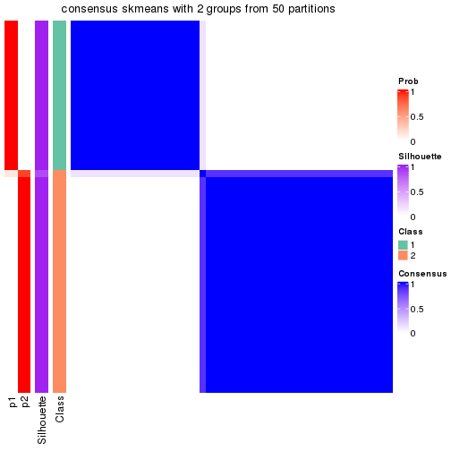</p>

</div>
<div id='tab-node-03-consensus-heatmap-2'>
<pre><code class="r">consensus_heatmap(res, k = 3)
</code></pre>

<p>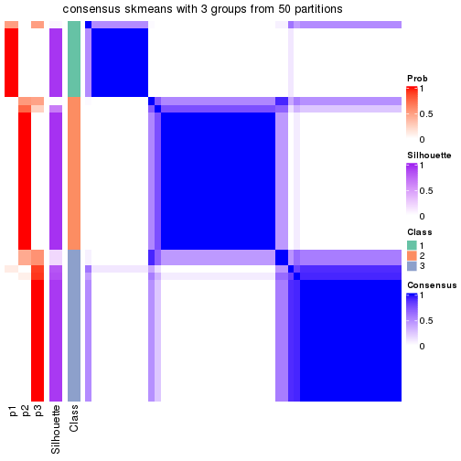</p>

</div>
<div id='tab-node-03-consensus-heatmap-3'>
<pre><code class="r">consensus_heatmap(res, k = 4)
</code></pre>

<p>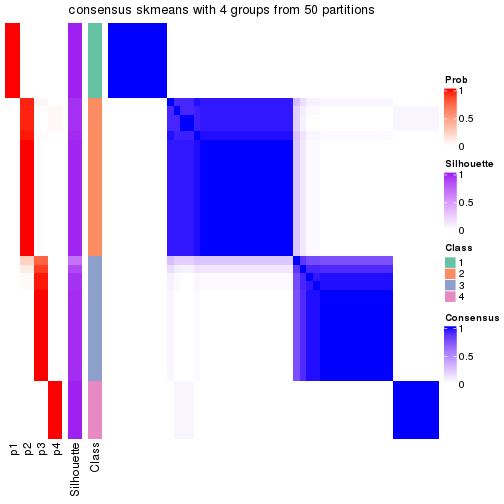</p>

</div>
<div id='tab-node-03-consensus-heatmap-4'>
<pre><code class="r">consensus_heatmap(res, k = 5)
</code></pre>

<p>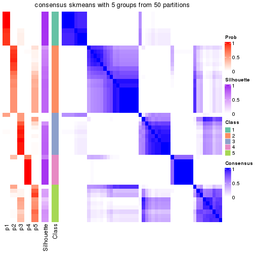</p>

</div>
<div id='tab-node-03-consensus-heatmap-5'>
<pre><code class="r">consensus_heatmap(res, k = 6)
</code></pre>

<p>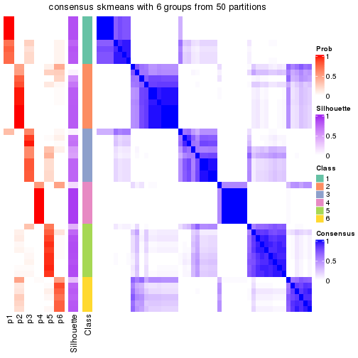</p>

</div>
<div id='tab-node-03-consensus-heatmap-6'>
<pre><code class="r">consensus_heatmap(res, k = 7)
</code></pre>

<p>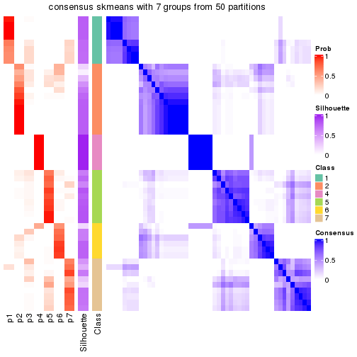</p>

</div>
<div id='tab-node-03-consensus-heatmap-7'>
<pre><code class="r">consensus_heatmap(res, k = 8)
</code></pre>

<p>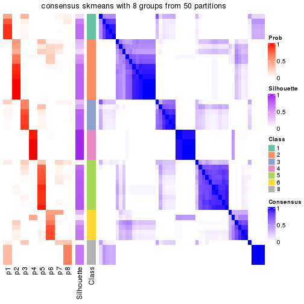</p>

</div>
</div>

Heatmaps for the membership of samples in all partitions to see how consistent they are:


<script>
$( function() {
	$( '#tabs-node-03-membership-heatmap' ).tabs();
} );
</script>
<div id='tabs-node-03-membership-heatmap'>
<ul>
<li><a href='#tab-node-03-membership-heatmap-1'>k = 2</a></li>
<li><a href='#tab-node-03-membership-heatmap-2'>k = 3</a></li>
<li><a href='#tab-node-03-membership-heatmap-3'>k = 4</a></li>
<li><a href='#tab-node-03-membership-heatmap-4'>k = 5</a></li>
<li><a href='#tab-node-03-membership-heatmap-5'>k = 6</a></li>
<li><a href='#tab-node-03-membership-heatmap-6'>k = 7</a></li>
<li><a href='#tab-node-03-membership-heatmap-7'>k = 8</a></li>
</ul>
<div id='tab-node-03-membership-heatmap-1'>
<pre><code class="r">membership_heatmap(res, k = 2)
</code></pre>

<p>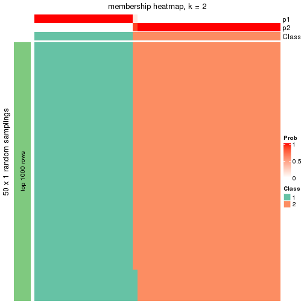</p>

</div>
<div id='tab-node-03-membership-heatmap-2'>
<pre><code class="r">membership_heatmap(res, k = 3)
</code></pre>

<p>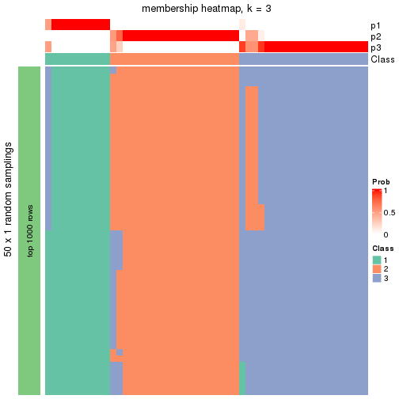</p>

</div>
<div id='tab-node-03-membership-heatmap-3'>
<pre><code class="r">membership_heatmap(res, k = 4)
</code></pre>

<p>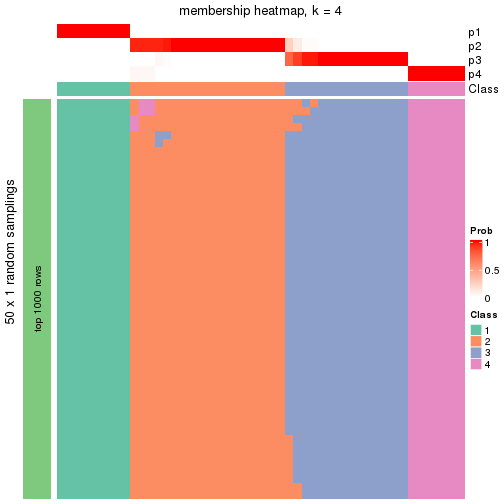</p>

</div>
<div id='tab-node-03-membership-heatmap-4'>
<pre><code class="r">membership_heatmap(res, k = 5)
</code></pre>

<p>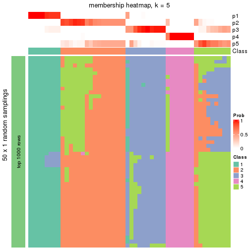</p>

</div>
<div id='tab-node-03-membership-heatmap-5'>
<pre><code class="r">membership_heatmap(res, k = 6)
</code></pre>

<p>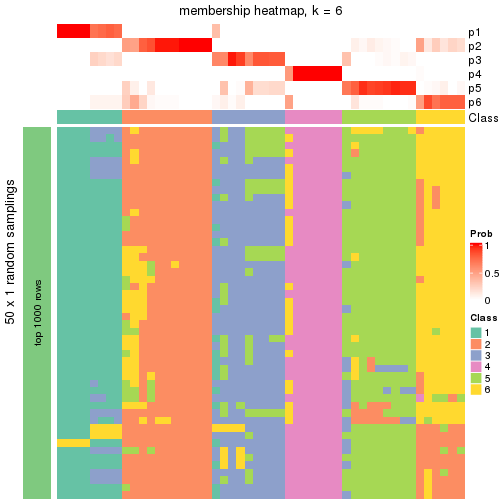</p>

</div>
<div id='tab-node-03-membership-heatmap-6'>
<pre><code class="r">membership_heatmap(res, k = 7)
</code></pre>

<p>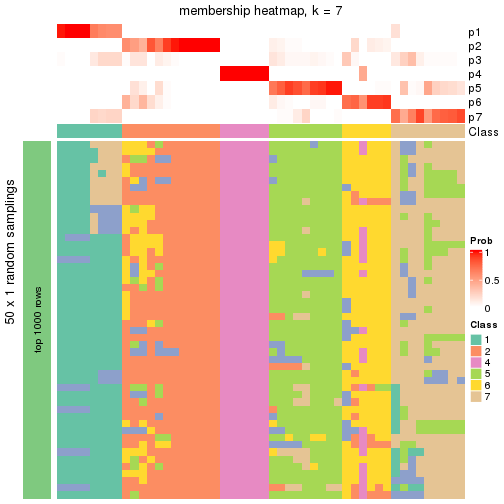</p>

</div>
<div id='tab-node-03-membership-heatmap-7'>
<pre><code class="r">membership_heatmap(res, k = 8)
</code></pre>

<p>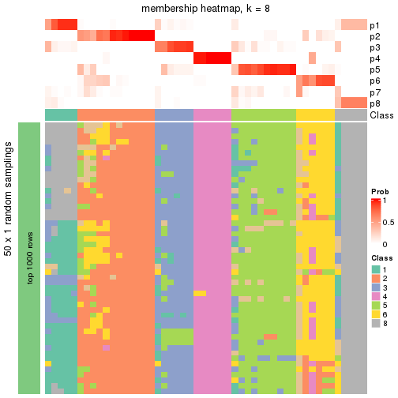</p>

</div>
</div>

As soon as the classes for columns are determined, the signatures
that are significantly different between subgroups can be looked for. 
Following are the heatmaps for signatures.


<script>
$( function() {
	$( '#tabs-node-03-get-signatures' ).tabs();
} );
</script>
<div id='tabs-node-03-get-signatures'>
<ul>
<li><a href='#tab-node-03-get-signatures-1'>k = 2</a></li>
<li><a href='#tab-node-03-get-signatures-2'>k = 3</a></li>
<li><a href='#tab-node-03-get-signatures-3'>k = 4</a></li>
<li><a href='#tab-node-03-get-signatures-4'>k = 5</a></li>
<li><a href='#tab-node-03-get-signatures-5'>k = 6</a></li>
<li><a href='#tab-node-03-get-signatures-6'>k = 7</a></li>
<li><a href='#tab-node-03-get-signatures-7'>k = 8</a></li>
</ul>
<div id='tab-node-03-get-signatures-1'>
<pre><code class="r">get_signatures(res, k = 2)
</code></pre>

<p>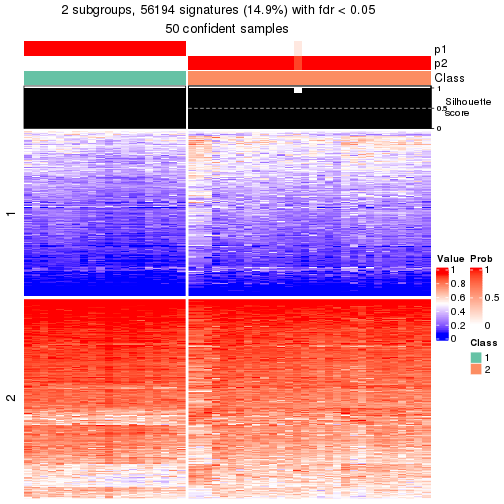</p>

</div>
<div id='tab-node-03-get-signatures-2'>
<pre><code class="r">get_signatures(res, k = 3)
</code></pre>

<p>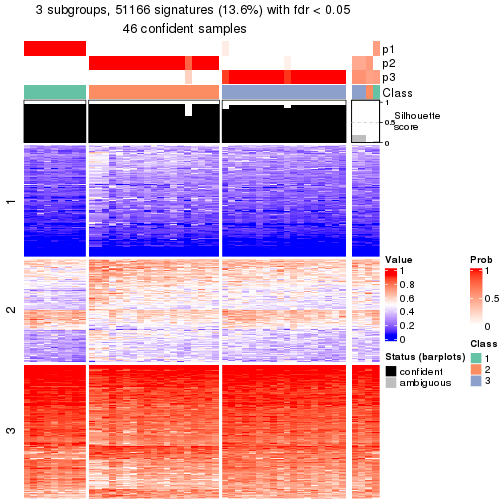</p>

</div>
<div id='tab-node-03-get-signatures-3'>
<pre><code class="r">get_signatures(res, k = 4)
</code></pre>

<p>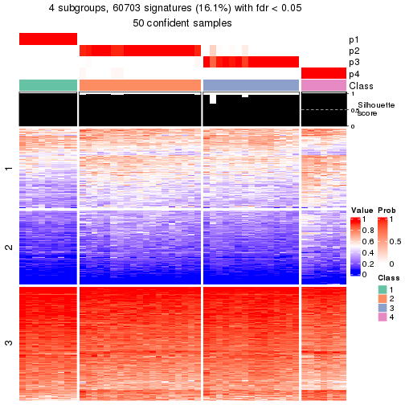</p>

</div>
<div id='tab-node-03-get-signatures-4'>
<pre><code class="r">get_signatures(res, k = 5)
</code></pre>

<p>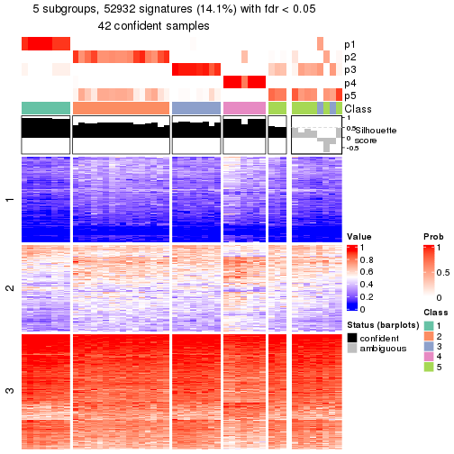</p>

</div>
<div id='tab-node-03-get-signatures-5'>
<pre><code class="r">get_signatures(res, k = 6)
</code></pre>

<p>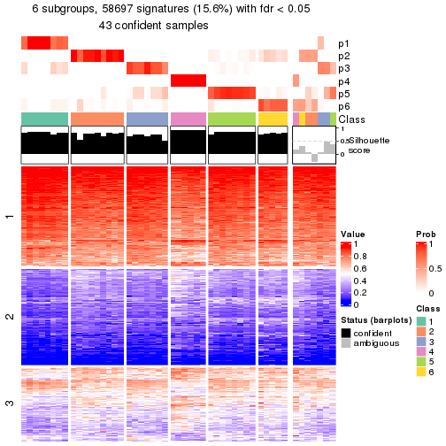</p>

</div>
<div id='tab-node-03-get-signatures-6'>
<pre><code class="r">get_signatures(res, k = 7)
</code></pre>

<p>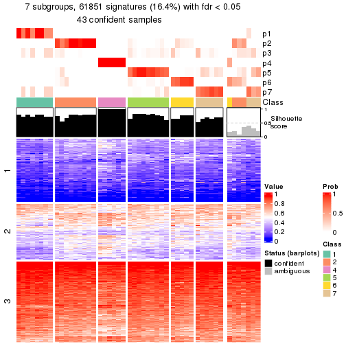</p>

</div>
<div id='tab-node-03-get-signatures-7'>
<pre><code class="r">get_signatures(res, k = 8)
</code></pre>

<p>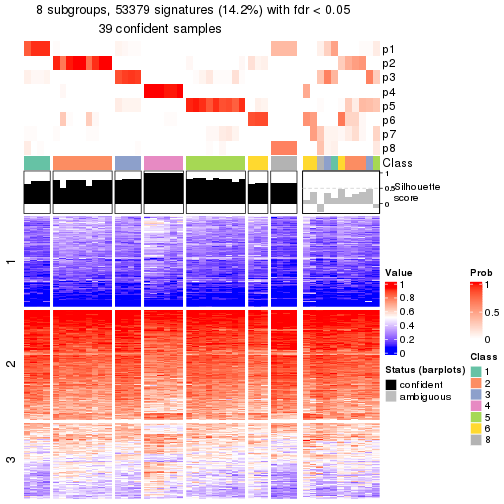</p>

</div>
</div>


Compare the overlap of signatures from different k:

```r
compare_signatures(res)
```

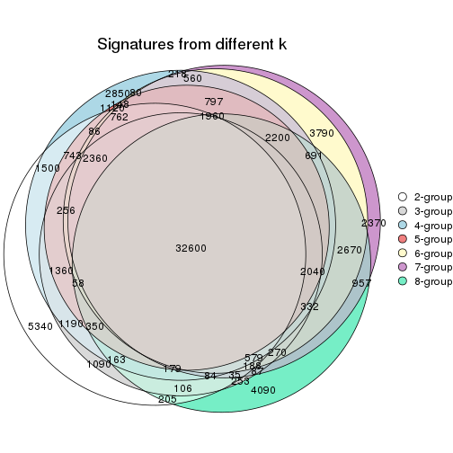

`get_signature()` returns a data frame invisibly. To get the list of signatures, the function
call should be assigned to a variable explicitly. In following code, if `plot` argument is set
to `FALSE`, no heatmap is plotted while only the differential analysis is performed.

```r
# code only for demonstration
tb = get_signature(res, k = ..., plot = FALSE)
```

An example of the output of `tb` is:

```
#>   which_row         fdr    mean_1    mean_2 scaled_mean_1 scaled_mean_2 km
#> 1        38 0.042760348  8.373488  9.131774    -0.5533452     0.5164555  1
#> 2        40 0.018707592  7.106213  8.469186    -0.6173731     0.5762149  1
#> 3        55 0.019134737 10.221463 11.207825    -0.6159697     0.5749050  1
#> 4        59 0.006059896  5.921854  7.869574    -0.6899429     0.6439467  1
#> 5        60 0.018055526  8.928898 10.211722    -0.6204761     0.5791110  1
#> 6        98 0.009384629 15.714769 14.887706     0.6635654    -0.6193277  2
...
```

The columns in `tb` are:

1. `which_row`: row indices corresponding to the input matrix.
2. `fdr`: FDR for the differential test. 
3. `mean_x`: The mean value in group x.
4. `scaled_mean_x`: The mean value in group x after rows are scaled.
5. `km`: Row groups if k-means clustering is applied to rows (which is done by automatically selecting number of clusters).

If there are too many signatures, `top_signatures = ...` can be set to only show the 
signatures with the highest FDRs:

```r
# code only for demonstration
# e.g. to show the top 500 most significant rows
tb = get_signature(res, k = ..., top_signatures = 500)
```

If the signatures are defined as these which are uniquely high in current group, `diff_method` argument
can be set to `"uniquely_high_in_one_group"`:

```r
# code only for demonstration
tb = get_signature(res, k = ..., diff_method = "uniquely_high_in_one_group")
```


UMAP plot which shows how samples are separated.


<script>
$( function() {
	$( '#tabs-node-03-dimension-reduction' ).tabs();
} );
</script>
<div id='tabs-node-03-dimension-reduction'>
<ul>
<li><a href='#tab-node-03-dimension-reduction-1'>k = 2</a></li>
<li><a href='#tab-node-03-dimension-reduction-2'>k = 3</a></li>
<li><a href='#tab-node-03-dimension-reduction-3'>k = 4</a></li>
<li><a href='#tab-node-03-dimension-reduction-4'>k = 5</a></li>
<li><a href='#tab-node-03-dimension-reduction-5'>k = 6</a></li>
<li><a href='#tab-node-03-dimension-reduction-6'>k = 7</a></li>
<li><a href='#tab-node-03-dimension-reduction-7'>k = 8</a></li>
</ul>
<div id='tab-node-03-dimension-reduction-1'>
<pre><code class="r">dimension_reduction(res, k = 2, method = &quot;UMAP&quot;)
</code></pre>

<p>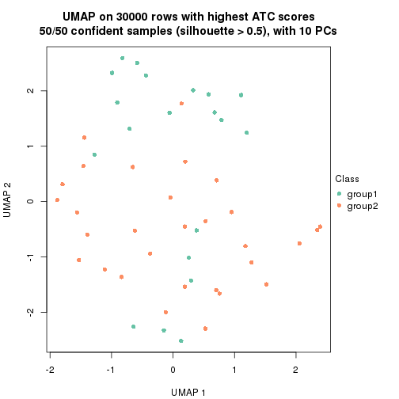</p>

</div>
<div id='tab-node-03-dimension-reduction-2'>
<pre><code class="r">dimension_reduction(res, k = 3, method = &quot;UMAP&quot;)
</code></pre>

<p>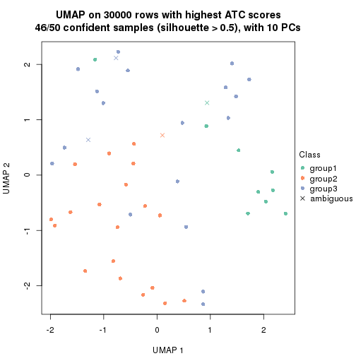</p>

</div>
<div id='tab-node-03-dimension-reduction-3'>
<pre><code class="r">dimension_reduction(res, k = 4, method = &quot;UMAP&quot;)
</code></pre>

<p>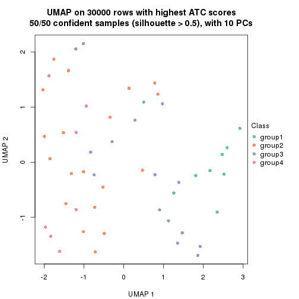</p>

</div>
<div id='tab-node-03-dimension-reduction-4'>
<pre><code class="r">dimension_reduction(res, k = 5, method = &quot;UMAP&quot;)
</code></pre>

<p>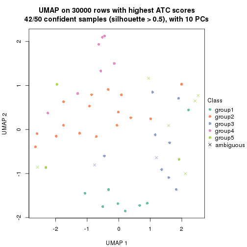</p>

</div>
<div id='tab-node-03-dimension-reduction-5'>
<pre><code class="r">dimension_reduction(res, k = 6, method = &quot;UMAP&quot;)
</code></pre>

<p>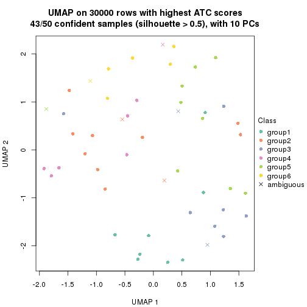</p>

</div>
<div id='tab-node-03-dimension-reduction-6'>
<pre><code class="r">dimension_reduction(res, k = 7, method = &quot;UMAP&quot;)
</code></pre>

<p>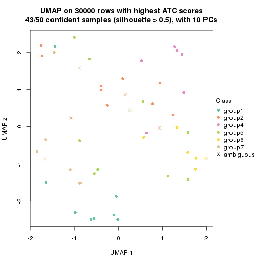</p>

</div>
<div id='tab-node-03-dimension-reduction-7'>
<pre><code class="r">dimension_reduction(res, k = 8, method = &quot;UMAP&quot;)
</code></pre>

<p>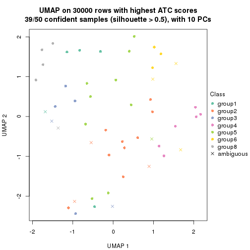</p>

</div>
</div>


Following heatmap shows how subgroups are split when increasing `k`:

```r
collect_classes(res)
```

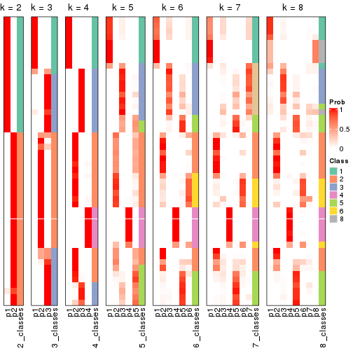


If matrix rows can be associated to genes, consider to use `functional_enrichment(res,
...)` to perform function enrichment for the signature genes. See [this vignette](https://jokergoo.github.io/cola_vignettes/functional_enrichment.html) for more detailed explanations.


 

---------------------------------------------------


### Node04


Parent node: [Node0](#Node0).
Child nodes: 
                Node011-leaf
        ,
                [Node012](#Node012)
        ,
                Node013-leaf
        ,
                [Node021](#Node021)
        ,
                [Node022](#Node022)
        ,
                [Node023](#Node023)
        ,
                [Node024](#Node024)
        ,
                Node031-leaf
        ,
                Node032-leaf
        ,
                Node033-leaf
        ,
                Node034-leaf
        ,
                [Node041](#Node041)
        ,
                [Node042](#Node042)
        ,
                [Node043](#Node043)
        ,
                [Node044](#Node044)
        ,
                [Node051](#Node051)
        ,
                [Node052](#Node052)
        ,
                Node053-leaf
        .


The object with results only for a single top-value method and a single partitioning method 
can be extracted as:

```r
res = res_rh["04"]
```

A summary of `res` and all the functions that can be applied to it:

```r
res
```

```
#> A 'ConsensusPartition' object with k = 2, 3, 4, 5, 6, 7, 8.
#>   On a matrix with 30000 rows and 155 columns.
#>   Top rows (1000) are extracted by 'ATC' method.
#>   Subgroups are detected by 'kmeans' method.
#>   Performed in total 350 partitions by row resampling.
#>   Best k for subgroups seems to be 4.
#> 
#> Following methods can be applied to this 'ConsensusPartition' object:
#>  [1] "cola_report"             "collect_classes"         "collect_plots"          
#>  [4] "collect_stats"           "colnames"                "compare_partitions"     
#>  [7] "compare_signatures"      "consensus_heatmap"       "dimension_reduction"    
#> [10] "functional_enrichment"   "get_anno_col"            "get_anno"               
#> [13] "get_classes"             "get_consensus"           "get_matrix"             
#> [16] "get_membership"          "get_param"               "get_signatures"         
#> [19] "get_stats"               "is_best_k"               "is_stable_k"            
#> [22] "membership_heatmap"      "ncol"                    "nrow"                   
#> [25] "plot_ecdf"               "predict_classes"         "rownames"               
#> [28] "select_partition_number" "show"                    "suggest_best_k"         
#> [31] "test_to_known_factors"   "top_rows_heatmap"
```

`collect_plots()` function collects all the plots made from `res` for all `k` (number of subgroups)
into one single page to provide an easy and fast comparison between different `k`.

```r
collect_plots(res)
```

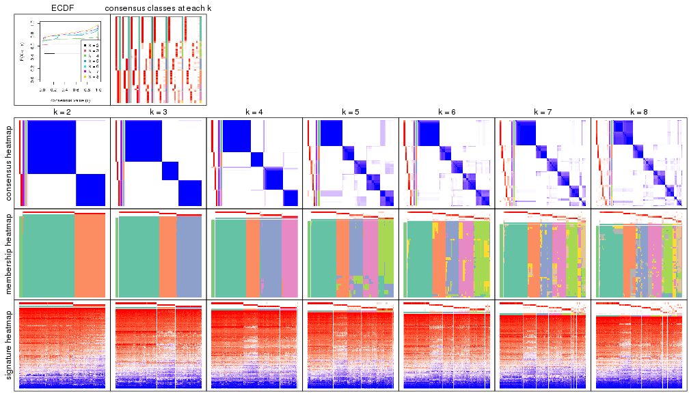

The plots are:

- The first row: a plot of the eCDF (empirical cumulative distribution
  function) curves of the consensus matrix for each `k` and the heatmap of
  predicted classes for each `k`.
- The second row: heatmaps of the consensus matrix for each `k`.
- The third row: heatmaps of the membership matrix for each `k`.
- The fouth row: heatmaps of the signatures for each `k`.

All the plots in panels can be made by individual functions and they are
plotted later in this section.

`select_partition_number()` produces several plots showing different
statistics for choosing "optimized" `k`. There are following statistics:

- eCDF curves of the consensus matrix for each `k`;
- 1-PAC. [The PAC score](https://en.wikipedia.org/wiki/Consensus_clustering#Over-interpretation_potential_of_consensus_clustering)
  measures the proportion of the ambiguous subgrouping.
- Mean silhouette score.
- Concordance. The mean probability of fiting the consensus subgroup labels in all
  partitions.
- Area increased. Denote $A_k$ as the area under the eCDF curve for current
  `k`, the area increased is defined as $A_k - A_{k-1}$.
- Rand index. The percent of pairs of samples that are both in a same cluster
  or both are not in a same cluster in the partition of k and k-1.
- Jaccard index. The ratio of pairs of samples are both in a same cluster in
  the partition of k and k-1 and the pairs of samples are both in a same
  cluster in the partition k or k-1.

The detailed explanations of these statistics can be found in [the _cola_
vignette](https://jokergoo.github.io/cola_vignettes/cola.html#toc_13).

Generally speaking, higher 1-PAC score, higher mean silhouette score or higher
concordance corresponds to better partition. Rand index and Jaccard index
measure how similar the current partition is compared to partition with `k-1`.
If they are too similar, we won't accept `k` is better than `k-1`.

```r
select_partition_number(res)
```

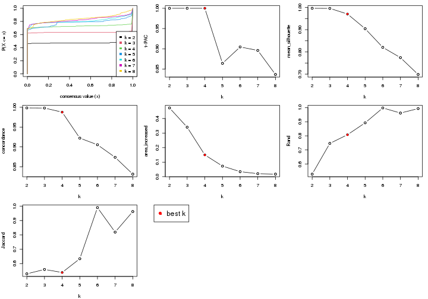

The numeric values for all these statistics can be obtained by `get_stats()`.

```r
get_stats(res)
```

```
#>   k 1-PAC mean_silhouette concordance area_increased  Rand Jaccard
#> 2 2 1.000           0.996       0.998         0.4727 0.529   0.529
#> 3 3 1.000           0.996       0.998         0.3403 0.747   0.559
#> 4 4 1.000           0.970       0.988         0.1499 0.808   0.538
#> 5 5 0.864           0.904       0.922         0.0728 0.892   0.634
#> 6 6 0.904           0.820       0.905         0.0346 0.998   0.990
#> 7 7 0.896           0.774       0.874         0.0206 0.962   0.819
#> 8 8 0.837           0.699       0.831         0.0175 0.993   0.963
```

`suggest_best_k()` suggests the best $k$ based on these statistics. The rules are as follows:

- All $k$ with Jaccard index larger than 0.95 are removed because increasing
  $k$ does not provide enough extra information. If all $k$ are removed, it is
  marked as no subgroup is detected.
- For all $k$ with 1-PAC score larger than 0.9, the maximal $k$ is taken as
  the best $k$, and other $k$ are marked as optional $k$.
- If it does not fit the second rule. The $k$ with the maximal vote of the
  highest 1-PAC score, highest mean silhouette, and highest concordance is
  taken as the best $k$.

```r
suggest_best_k(res)
```

```
#> [1] 4
#> attr(,"optional")
#> [1] 2 3
```

There is also optional best $k$ = 2 3 that is worth to check.

Following is the table of the partitions (You need to click the **show/hide
code output** link to see it). The membership matrix (columns with name `p*`)
is inferred by
[`clue::cl_consensus()`](https://www.rdocumentation.org/link/cl_consensus?package=clue)
function with the `SE` method. Basically the value in the membership matrix
represents the probability to belong to a certain group. The finall subgroup
label for an item is determined with the group with highest probability it
belongs to.

In `get_classes()` function, the entropy is calculated from the membership
matrix and the silhouette score is calculated from the consensus matrix.


<script>
$( function() {
	$( '#tabs-node-04-get-classes' ).tabs();
} );
</script>
<div id='tabs-node-04-get-classes'>
<ul>
<li><a href='#tab-node-04-get-classes-1'>k = 2</a></li>
<li><a href='#tab-node-04-get-classes-2'>k = 3</a></li>
<li><a href='#tab-node-04-get-classes-3'>k = 4</a></li>
<li><a href='#tab-node-04-get-classes-4'>k = 5</a></li>
<li><a href='#tab-node-04-get-classes-5'>k = 6</a></li>
<li><a href='#tab-node-04-get-classes-6'>k = 7</a></li>
<li><a href='#tab-node-04-get-classes-7'>k = 8</a></li>
</ul>

<div id='tab-node-04-get-classes-1'>
<p><a id='tab-node-04-get-classes-1-a' style='color:#0366d6' href='#'>show/hide code output</a></p>
<pre><code class="r">cbind(get_classes(res, k = 2), get_membership(res, k = 2))
</code></pre>

<pre><code>#&gt;                 class entropy silhouette   p1   p2
#&gt; TCGA.G9.6343.01     2   0.000      1.000 0.00 1.00
#&gt; TCGA.KK.A6E6.01     1   0.000      0.997 1.00 0.00
#&gt; TCGA.G9.6339.01     1   0.000      0.997 1.00 0.00
#&gt; TCGA.EJ.5509.01     2   0.000      1.000 0.00 1.00
#&gt; TCGA.EJ.5521.01     1   0.000      0.997 1.00 0.00
#&gt; TCGA.CH.5754.01     2   0.000      1.000 0.00 1.00
#&gt; TCGA.EJ.7314.01     1   0.000      0.997 1.00 0.00
#&gt; TCGA.XA.A8JR.01     1   0.000      0.997 1.00 0.00
#&gt; TCGA.EJ.7781.01     1   0.000      0.997 1.00 0.00
#&gt; TCGA.CH.5751.01     1   0.000      0.997 1.00 0.00
#&gt; TCGA.V1.A8WL.01     2   0.000      1.000 0.00 1.00
#&gt; TCGA.XK.AAJT.01     2   0.000      1.000 0.00 1.00
#&gt; TCGA.G9.6366.01     1   0.000      0.997 1.00 0.00
#&gt; TCGA.KC.A4BN.01     1   0.000      0.997 1.00 0.00
#&gt; TCGA.KK.A8IG.01     2   0.000      1.000 0.00 1.00
#&gt; TCGA.EJ.7786.01     1   0.000      0.997 1.00 0.00
#&gt; TCGA.J4.A83K.01     1   0.000      0.997 1.00 0.00
#&gt; TCGA.EJ.8470.01     1   0.242      0.957 0.96 0.04
#&gt; TCGA.VP.AA1N.01     2   0.000      1.000 0.00 1.00
#&gt; TCGA.EJ.5524.01     1   0.000      0.997 1.00 0.00
#&gt; TCGA.HC.7209.01     1   0.000      0.997 1.00 0.00
#&gt; TCGA.HC.7742.01     1   0.000      0.997 1.00 0.00
#&gt; TCGA.J9.A8CP.01     2   0.000      1.000 0.00 1.00
#&gt; TCGA.V1.A9O5.01     2   0.000      1.000 0.00 1.00
#&gt; TCGA.VP.A879.01     1   0.000      0.997 1.00 0.00
#&gt; TCGA.VN.A88Q.01     1   0.000      0.997 1.00 0.00
#&gt; TCGA.M7.A721.01     2   0.000      1.000 0.00 1.00
#&gt; TCGA.EJ.5514.01     2   0.000      1.000 0.00 1.00
#&gt; TCGA.EJ.5526.01     1   0.000      0.997 1.00 0.00
#&gt; TCGA.EJ.5542.01     1   0.000      0.997 1.00 0.00
#&gt; TCGA.CH.5769.01     1   0.000      0.997 1.00 0.00
#&gt; TCGA.HC.7748.01     1   0.000      0.997 1.00 0.00
#&gt; TCGA.G9.6365.01     1   0.000      0.997 1.00 0.00
#&gt; TCGA.G9.7510.01     2   0.000      1.000 0.00 1.00
#&gt; TCGA.V1.A8MG.01     2   0.000      1.000 0.00 1.00
#&gt; TCGA.EJ.A7NN.01     1   0.000      0.997 1.00 0.00
#&gt; TCGA.HC.8265.01     2   0.000      1.000 0.00 1.00
#&gt; TCGA.KK.A7AV.01     2   0.000      1.000 0.00 1.00
#&gt; TCGA.EJ.7218.01     2   0.000      1.000 0.00 1.00
#&gt; TCGA.YL.A8SC.01     1   0.000      0.997 1.00 0.00
#&gt; TCGA.V1.A8X3.01     1   0.000      0.997 1.00 0.00
#&gt; TCGA.KK.A6DY.01     1   0.000      0.997 1.00 0.00
#&gt; TCGA.KK.A8I8.01     1   0.000      0.997 1.00 0.00
#&gt; TCGA.QU.A6IO.01     2   0.000      1.000 0.00 1.00
#&gt; TCGA.XJ.A83H.01     2   0.000      1.000 0.00 1.00
#&gt; TCGA.ZG.A8QY.01     2   0.000      1.000 0.00 1.00
#&gt; TCGA.YL.A8SO.01     2   0.000      1.000 0.00 1.00
#&gt; TCGA.EJ.5522.01     1   0.000      0.997 1.00 0.00
#&gt; TCGA.ZG.A9M4.01     2   0.000      1.000 0.00 1.00
#&gt; TCGA.G9.A9S0.01     2   0.000      1.000 0.00 1.00
#&gt; TCGA.TP.A8TT.01     1   0.000      0.997 1.00 0.00
#&gt; TCGA.V1.A9Z9.01     2   0.000      1.000 0.00 1.00
#&gt; TCGA.HC.7232.01     1   0.000      0.997 1.00 0.00
#&gt; TCGA.HC.7081.01     1   0.000      0.997 1.00 0.00
#&gt; TCGA.VP.A87H.01     2   0.000      1.000 0.00 1.00
#&gt; TCGA.G9.7521.01     2   0.000      1.000 0.00 1.00
#&gt; TCGA.YL.A8HO.01     2   0.000      1.000 0.00 1.00
#&gt; TCGA.J4.A83M.01     1   0.000      0.997 1.00 0.00
#&gt; TCGA.HC.7736.01     2   0.000      1.000 0.00 1.00
#&gt; TCGA.VN.A88N.01     1   0.000      0.997 1.00 0.00
#&gt; TCGA.QU.A6IP.01     1   0.000      0.997 1.00 0.00
#&gt; TCGA.V1.A9O9.01     1   0.000      0.997 1.00 0.00
#&gt; TCGA.HC.7210.01     2   0.000      1.000 0.00 1.00
#&gt; TCGA.ZG.A9LB.01     1   0.000      0.997 1.00 0.00
#&gt; TCGA.EJ.8468.01     1   0.000      0.997 1.00 0.00
#&gt; TCGA.KK.A7B1.01     1   0.000      0.997 1.00 0.00
#&gt; TCGA.HC.8262.01     1   0.000      0.997 1.00 0.00
#&gt; TCGA.HI.7170.01     1   0.000      0.997 1.00 0.00
#&gt; TCGA.J4.A67L.01     1   0.000      0.997 1.00 0.00
#&gt; TCGA.KC.A7F3.01     2   0.000      1.000 0.00 1.00
#&gt; TCGA.HC.8256.01     1   0.000      0.997 1.00 0.00
#&gt; TCGA.CH.5769.11     1   0.000      0.997 1.00 0.00
#&gt; TCGA.G9.6499.11     2   0.000      1.000 0.00 1.00
#&gt; TCGA.KK.A8I9.01     2   0.000      1.000 0.00 1.00
#&gt; TCGA.EJ.7317.01     2   0.000      1.000 0.00 1.00
#&gt; TCGA.YL.A8S8.01     2   0.000      1.000 0.00 1.00
#&gt; TCGA.Y6.A8TL.01     1   0.000      0.997 1.00 0.00
#&gt; TCGA.V1.A8MF.01     1   0.000      0.997 1.00 0.00
#&gt; TCGA.EJ.A65E.01     2   0.000      1.000 0.00 1.00
#&gt; TCGA.ZG.A8QX.01     2   0.000      1.000 0.00 1.00
#&gt; TCGA.G9.6342.01     1   0.000      0.997 1.00 0.00
#&gt; TCGA.J4.8200.01     1   0.000      0.997 1.00 0.00
#&gt; TCGA.EJ.5532.01     1   0.000      0.997 1.00 0.00
#&gt; TCGA.HI.7168.01     2   0.000      1.000 0.00 1.00
#&gt; TCGA.HC.7233.01     1   0.000      0.997 1.00 0.00
#&gt; TCGA.EJ.A65M.01     2   0.000      1.000 0.00 1.00
#&gt; TCGA.EJ.A8FN.01     2   0.000      1.000 0.00 1.00
#&gt; TCGA.J4.A83L.01     1   0.000      0.997 1.00 0.00
#&gt; TCGA.EJ.5507.01     1   0.000      0.997 1.00 0.00
#&gt; TCGA.J9.A8CK.01     1   0.000      0.997 1.00 0.00
#&gt; TCGA.CH.5744.01     1   0.000      0.997 1.00 0.00
#&gt; TCGA.ZG.A9N3.01     2   0.000      1.000 0.00 1.00
#&gt; TCGA.G9.6354.01     1   0.000      0.997 1.00 0.00
#&gt; TCGA.VN.A88O.01     2   0.000      1.000 0.00 1.00
#&gt; TCGA.HC.7211.01     2   0.000      1.000 0.00 1.00
#&gt; TCGA.KK.A8I6.01     2   0.000      1.000 0.00 1.00
#&gt; TCGA.EJ.7327.01     1   0.000      0.997 1.00 0.00
#&gt; TCGA.EJ.A65G.01     1   0.000      0.997 1.00 0.00
#&gt; TCGA.HC.A76W.01     1   0.000      0.997 1.00 0.00
#&gt; TCGA.G9.A9S7.01     1   0.000      0.997 1.00 0.00
#&gt; TCGA.HC.8216.01     1   0.000      0.997 1.00 0.00
#&gt; TCGA.CH.5794.01     1   0.000      0.997 1.00 0.00
#&gt; TCGA.V1.A9OA.01     1   0.000      0.997 1.00 0.00
#&gt; TCGA.J9.A52E.01     1   0.000      0.997 1.00 0.00
#&gt; TCGA.HC.7818.01     1   0.000      0.997 1.00 0.00
#&gt; TCGA.FC.7961.01     2   0.000      1.000 0.00 1.00
#&gt; TCGA.EJ.5504.01     2   0.000      1.000 0.00 1.00
#&gt; TCGA.J4.A67S.01     1   0.000      0.997 1.00 0.00
#&gt; TCGA.HC.A6AQ.01     1   0.000      0.997 1.00 0.00
#&gt; TCGA.CH.5766.01     2   0.000      1.000 0.00 1.00
#&gt; TCGA.EJ.7321.01     1   0.000      0.997 1.00 0.00
#&gt; TCGA.G9.7523.01     2   0.000      1.000 0.00 1.00
#&gt; TCGA.2A.A8VT.01     1   0.000      0.997 1.00 0.00
#&gt; TCGA.G9.7519.01     1   0.000      0.997 1.00 0.00
#&gt; TCGA.ZG.A9LM.01     1   0.000      0.997 1.00 0.00
#&gt; TCGA.EJ.7318.01     1   0.000      0.997 1.00 0.00
#&gt; TCGA.J9.A8CM.01     2   0.000      1.000 0.00 1.00
#&gt; TCGA.G9.6364.01     1   0.000      0.997 1.00 0.00
#&gt; TCGA.EJ.7331.01     2   0.000      1.000 0.00 1.00
#&gt; TCGA.G9.6494.01     1   0.000      0.997 1.00 0.00
#&gt; TCGA.HI.7169.01     1   0.000      0.997 1.00 0.00
#&gt; TCGA.J4.A67K.01     1   0.000      0.997 1.00 0.00
#&gt; TCGA.QU.A6IM.01     1   0.000      0.997 1.00 0.00
#&gt; TCGA.HC.A9TE.01     2   0.000      1.000 0.00 1.00
#&gt; TCGA.EJ.7115.01     2   0.000      1.000 0.00 1.00
#&gt; TCGA.YL.A8SF.01     1   0.000      0.997 1.00 0.00
#&gt; TCGA.VP.A872.01     1   0.000      0.997 1.00 0.00
#&gt; TCGA.V1.A8ML.01     2   0.000      1.000 0.00 1.00
#&gt; TCGA.CH.5745.01     1   0.000      0.997 1.00 0.00
#&gt; TCGA.CH.5740.01     1   0.000      0.997 1.00 0.00
#&gt; TCGA.G9.7509.01     1   0.000      0.997 1.00 0.00
#&gt; TCGA.KK.A8IJ.01     1   0.000      0.997 1.00 0.00
#&gt; TCGA.CH.5748.01     1   0.000      0.997 1.00 0.00
#&gt; TCGA.V1.A8MU.01     2   0.000      1.000 0.00 1.00
#&gt; TCGA.V1.A9Z7.01     1   0.760      0.719 0.78 0.22
#&gt; TCGA.KK.A6E5.01     2   0.000      1.000 0.00 1.00
#&gt; TCGA.KK.A8IL.01     1   0.000      0.997 1.00 0.00
#&gt; TCGA.HC.7820.01     1   0.000      0.997 1.00 0.00
#&gt; TCGA.EJ.5518.01     2   0.000      1.000 0.00 1.00
#&gt; TCGA.ZG.A9NI.01     1   0.000      0.997 1.00 0.00
#&gt; TCGA.HC.A6HY.01     1   0.000      0.997 1.00 0.00
#&gt; TCGA.EJ.A7NM.01     2   0.000      1.000 0.00 1.00
#&gt; TCGA.CH.5764.01     1   0.000      0.997 1.00 0.00
#&gt; TCGA.EJ.A6RC.01     1   0.000      0.997 1.00 0.00
#&gt; TCGA.HC.A9TH.01     2   0.000      1.000 0.00 1.00
#&gt; TCGA.V1.A8WV.01     2   0.000      1.000 0.00 1.00
#&gt; TCGA.YL.A8SJ.01     1   0.000      0.997 1.00 0.00
#&gt; TCGA.G9.6363.01     1   0.000      0.997 1.00 0.00
#&gt; TCGA.HC.7749.01     1   0.000      0.997 1.00 0.00
#&gt; TCGA.KK.A6E7.01     1   0.000      0.997 1.00 0.00
#&gt; TCGA.V1.A9OX.01     2   0.000      1.000 0.00 1.00
#&gt; TCGA.VN.A88L.01     1   0.000      0.997 1.00 0.00
#&gt; TCGA.HC.8261.01     1   0.000      0.997 1.00 0.00
#&gt; TCGA.XQ.A8TB.01     1   0.000      0.997 1.00 0.00
#&gt; TCGA.EJ.5496.01     1   0.000      0.997 1.00 0.00
</code></pre>

<script>
$('#tab-node-04-get-classes-1-a').parent().next().next().hide();
$('#tab-node-04-get-classes-1-a').click(function(){
  $('#tab-node-04-get-classes-1-a').parent().next().next().toggle();
  return(false);
});
</script>
</div>

<div id='tab-node-04-get-classes-2'>
<p><a id='tab-node-04-get-classes-2-a' style='color:#0366d6' href='#'>show/hide code output</a></p>
<pre><code class="r">cbind(get_classes(res, k = 3), get_membership(res, k = 3))
</code></pre>

<pre><code>#&gt;                 class entropy silhouette   p1  p2   p3
#&gt; TCGA.G9.6343.01     3   0.000      0.998 0.00 0.0 1.00
#&gt; TCGA.KK.A6E6.01     1   0.000      0.997 1.00 0.0 0.00
#&gt; TCGA.G9.6339.01     1   0.000      0.997 1.00 0.0 0.00
#&gt; TCGA.EJ.5509.01     2   0.000      1.000 0.00 1.0 0.00
#&gt; TCGA.EJ.5521.01     3   0.000      0.998 0.00 0.0 1.00
#&gt; TCGA.CH.5754.01     3   0.000      0.998 0.00 0.0 1.00
#&gt; TCGA.EJ.7314.01     1   0.000      0.997 1.00 0.0 0.00
#&gt; TCGA.XA.A8JR.01     1   0.000      0.997 1.00 0.0 0.00
#&gt; TCGA.EJ.7781.01     1   0.000      0.997 1.00 0.0 0.00
#&gt; TCGA.CH.5751.01     3   0.000      0.998 0.00 0.0 1.00
#&gt; TCGA.V1.A8WL.01     3   0.000      0.998 0.00 0.0 1.00
#&gt; TCGA.XK.AAJT.01     2   0.000      1.000 0.00 1.0 0.00
#&gt; TCGA.G9.6366.01     1   0.000      0.997 1.00 0.0 0.00
#&gt; TCGA.KC.A4BN.01     1   0.000      0.997 1.00 0.0 0.00
#&gt; TCGA.KK.A8IG.01     2   0.000      1.000 0.00 1.0 0.00
#&gt; TCGA.EJ.7786.01     1   0.000      0.997 1.00 0.0 0.00
#&gt; TCGA.J4.A83K.01     1   0.000      0.997 1.00 0.0 0.00
#&gt; TCGA.EJ.8470.01     3   0.000      0.998 0.00 0.0 1.00
#&gt; TCGA.VP.AA1N.01     2   0.000      1.000 0.00 1.0 0.00
#&gt; TCGA.EJ.5524.01     1   0.000      0.997 1.00 0.0 0.00
#&gt; TCGA.HC.7209.01     1   0.000      0.997 1.00 0.0 0.00
#&gt; TCGA.HC.7742.01     3   0.000      0.998 0.00 0.0 1.00
#&gt; TCGA.J9.A8CP.01     2   0.000      1.000 0.00 1.0 0.00
#&gt; TCGA.V1.A9O5.01     2   0.000      1.000 0.00 1.0 0.00
#&gt; TCGA.VP.A879.01     1   0.000      0.997 1.00 0.0 0.00
#&gt; TCGA.VN.A88Q.01     1   0.000      0.997 1.00 0.0 0.00
#&gt; TCGA.M7.A721.01     2   0.000      1.000 0.00 1.0 0.00
#&gt; TCGA.EJ.5514.01     2   0.000      1.000 0.00 1.0 0.00
#&gt; TCGA.EJ.5526.01     1   0.000      0.997 1.00 0.0 0.00
#&gt; TCGA.EJ.5542.01     1   0.000      0.997 1.00 0.0 0.00
#&gt; TCGA.CH.5769.01     1   0.000      0.997 1.00 0.0 0.00
#&gt; TCGA.HC.7748.01     1   0.000      0.997 1.00 0.0 0.00
#&gt; TCGA.G9.6365.01     1   0.000      0.997 1.00 0.0 0.00
#&gt; TCGA.G9.7510.01     2   0.000      1.000 0.00 1.0 0.00
#&gt; TCGA.V1.A8MG.01     2   0.000      1.000 0.00 1.0 0.00
#&gt; TCGA.EJ.A7NN.01     3   0.000      0.998 0.00 0.0 1.00
#&gt; TCGA.HC.8265.01     2   0.000      1.000 0.00 1.0 0.00
#&gt; TCGA.KK.A7AV.01     3   0.296      0.889 0.00 0.1 0.90
#&gt; TCGA.EJ.7218.01     2   0.000      1.000 0.00 1.0 0.00
#&gt; TCGA.YL.A8SC.01     1   0.000      0.997 1.00 0.0 0.00
#&gt; TCGA.V1.A8X3.01     3   0.000      0.998 0.00 0.0 1.00
#&gt; TCGA.KK.A6DY.01     1   0.000      0.997 1.00 0.0 0.00
#&gt; TCGA.KK.A8I8.01     1   0.000      0.997 1.00 0.0 0.00
#&gt; TCGA.QU.A6IO.01     2   0.000      1.000 0.00 1.0 0.00
#&gt; TCGA.XJ.A83H.01     3   0.000      0.998 0.00 0.0 1.00
#&gt; TCGA.ZG.A8QY.01     3   0.000      0.998 0.00 0.0 1.00
#&gt; TCGA.YL.A8SO.01     2   0.000      1.000 0.00 1.0 0.00
#&gt; TCGA.EJ.5522.01     1   0.000      0.997 1.00 0.0 0.00
#&gt; TCGA.ZG.A9M4.01     2   0.000      1.000 0.00 1.0 0.00
#&gt; TCGA.G9.A9S0.01     3   0.000      0.998 0.00 0.0 1.00
#&gt; TCGA.TP.A8TT.01     1   0.000      0.997 1.00 0.0 0.00
#&gt; TCGA.V1.A9Z9.01     2   0.000      1.000 0.00 1.0 0.00
#&gt; TCGA.HC.7232.01     1   0.000      0.997 1.00 0.0 0.00
#&gt; TCGA.HC.7081.01     1   0.000      0.997 1.00 0.0 0.00
#&gt; TCGA.VP.A87H.01     3   0.000      0.998 0.00 0.0 1.00
#&gt; TCGA.G9.7521.01     2   0.000      1.000 0.00 1.0 0.00
#&gt; TCGA.YL.A8HO.01     2   0.000      1.000 0.00 1.0 0.00
#&gt; TCGA.J4.A83M.01     1   0.000      0.997 1.00 0.0 0.00
#&gt; TCGA.HC.7736.01     3   0.000      0.998 0.00 0.0 1.00
#&gt; TCGA.VN.A88N.01     1   0.000      0.997 1.00 0.0 0.00
#&gt; TCGA.QU.A6IP.01     1   0.000      0.997 1.00 0.0 0.00
#&gt; TCGA.V1.A9O9.01     1   0.000      0.997 1.00 0.0 0.00
#&gt; TCGA.HC.7210.01     2   0.000      1.000 0.00 1.0 0.00
#&gt; TCGA.ZG.A9LB.01     1   0.000      0.997 1.00 0.0 0.00
#&gt; TCGA.EJ.8468.01     1   0.400      0.811 0.84 0.0 0.16
#&gt; TCGA.KK.A7B1.01     1   0.000      0.997 1.00 0.0 0.00
#&gt; TCGA.HC.8262.01     1   0.000      0.997 1.00 0.0 0.00
#&gt; TCGA.HI.7170.01     1   0.000      0.997 1.00 0.0 0.00
#&gt; TCGA.J4.A67L.01     1   0.000      0.997 1.00 0.0 0.00
#&gt; TCGA.KC.A7F3.01     2   0.000      1.000 0.00 1.0 0.00
#&gt; TCGA.HC.8256.01     3   0.000      0.998 0.00 0.0 1.00
#&gt; TCGA.CH.5769.11     1   0.000      0.997 1.00 0.0 0.00
#&gt; TCGA.G9.6499.11     3   0.000      0.998 0.00 0.0 1.00
#&gt; TCGA.KK.A8I9.01     3   0.000      0.998 0.00 0.0 1.00
#&gt; TCGA.EJ.7317.01     3   0.000      0.998 0.00 0.0 1.00
#&gt; TCGA.YL.A8S8.01     2   0.000      1.000 0.00 1.0 0.00
#&gt; TCGA.Y6.A8TL.01     1   0.153      0.955 0.96 0.0 0.04
#&gt; TCGA.V1.A8MF.01     1   0.000      0.997 1.00 0.0 0.00
#&gt; TCGA.EJ.A65E.01     3   0.000      0.998 0.00 0.0 1.00
#&gt; TCGA.ZG.A8QX.01     3   0.000      0.998 0.00 0.0 1.00
#&gt; TCGA.G9.6342.01     1   0.000      0.997 1.00 0.0 0.00
#&gt; TCGA.J4.8200.01     1   0.000      0.997 1.00 0.0 0.00
#&gt; TCGA.EJ.5532.01     3   0.000      0.998 0.00 0.0 1.00
#&gt; TCGA.HI.7168.01     2   0.000      1.000 0.00 1.0 0.00
#&gt; TCGA.HC.7233.01     1   0.000      0.997 1.00 0.0 0.00
#&gt; TCGA.EJ.A65M.01     3   0.000      0.998 0.00 0.0 1.00
#&gt; TCGA.EJ.A8FN.01     2   0.000      1.000 0.00 1.0 0.00
#&gt; TCGA.J4.A83L.01     1   0.000      0.997 1.00 0.0 0.00
#&gt; TCGA.EJ.5507.01     3   0.000      0.998 0.00 0.0 1.00
#&gt; TCGA.J9.A8CK.01     1   0.000      0.997 1.00 0.0 0.00
#&gt; TCGA.CH.5744.01     1   0.000      0.997 1.00 0.0 0.00
#&gt; TCGA.ZG.A9N3.01     2   0.000      1.000 0.00 1.0 0.00
#&gt; TCGA.G9.6354.01     1   0.000      0.997 1.00 0.0 0.00
#&gt; TCGA.VN.A88O.01     2   0.000      1.000 0.00 1.0 0.00
#&gt; TCGA.HC.7211.01     3   0.000      0.998 0.00 0.0 1.00
#&gt; TCGA.KK.A8I6.01     3   0.000      0.998 0.00 0.0 1.00
#&gt; TCGA.EJ.7327.01     1   0.000      0.997 1.00 0.0 0.00
#&gt; TCGA.EJ.A65G.01     1   0.000      0.997 1.00 0.0 0.00
#&gt; TCGA.HC.A76W.01     3   0.000      0.998 0.00 0.0 1.00
#&gt; TCGA.G9.A9S7.01     1   0.000      0.997 1.00 0.0 0.00
#&gt; TCGA.HC.8216.01     1   0.000      0.997 1.00 0.0 0.00
#&gt; TCGA.CH.5794.01     1   0.000      0.997 1.00 0.0 0.00
#&gt; TCGA.V1.A9OA.01     1   0.000      0.997 1.00 0.0 0.00
#&gt; TCGA.J9.A52E.01     1   0.000      0.997 1.00 0.0 0.00
#&gt; TCGA.HC.7818.01     3   0.000      0.998 0.00 0.0 1.00
#&gt; TCGA.FC.7961.01     2   0.000      1.000 0.00 1.0 0.00
#&gt; TCGA.EJ.5504.01     2   0.000      1.000 0.00 1.0 0.00
#&gt; TCGA.J4.A67S.01     1   0.000      0.997 1.00 0.0 0.00
#&gt; TCGA.HC.A6AQ.01     1   0.000      0.997 1.00 0.0 0.00
#&gt; TCGA.CH.5766.01     3   0.000      0.998 0.00 0.0 1.00
#&gt; TCGA.EJ.7321.01     1   0.000      0.997 1.00 0.0 0.00
#&gt; TCGA.G9.7523.01     3   0.000      0.998 0.00 0.0 1.00
#&gt; TCGA.2A.A8VT.01     3   0.000      0.998 0.00 0.0 1.00
#&gt; TCGA.G9.7519.01     1   0.000      0.997 1.00 0.0 0.00
#&gt; TCGA.ZG.A9LM.01     3   0.000      0.998 0.00 0.0 1.00
#&gt; TCGA.EJ.7318.01     1   0.000      0.997 1.00 0.0 0.00
#&gt; TCGA.J9.A8CM.01     3   0.000      0.998 0.00 0.0 1.00
#&gt; TCGA.G9.6364.01     1   0.000      0.997 1.00 0.0 0.00
#&gt; TCGA.EJ.7331.01     3   0.000      0.998 0.00 0.0 1.00
#&gt; TCGA.G9.6494.01     3   0.000      0.998 0.00 0.0 1.00
#&gt; TCGA.HI.7169.01     1   0.000      0.997 1.00 0.0 0.00
#&gt; TCGA.J4.A67K.01     1   0.000      0.997 1.00 0.0 0.00
#&gt; TCGA.QU.A6IM.01     3   0.000      0.998 0.00 0.0 1.00
#&gt; TCGA.HC.A9TE.01     3   0.000      0.998 0.00 0.0 1.00
#&gt; TCGA.EJ.7115.01     2   0.000      1.000 0.00 1.0 0.00
#&gt; TCGA.YL.A8SF.01     1   0.000      0.997 1.00 0.0 0.00
#&gt; TCGA.VP.A872.01     1   0.000      0.997 1.00 0.0 0.00
#&gt; TCGA.V1.A8ML.01     3   0.000      0.998 0.00 0.0 1.00
#&gt; TCGA.CH.5745.01     1   0.000      0.997 1.00 0.0 0.00
#&gt; TCGA.CH.5740.01     1   0.000      0.997 1.00 0.0 0.00
#&gt; TCGA.G9.7509.01     1   0.000      0.997 1.00 0.0 0.00
#&gt; TCGA.KK.A8IJ.01     3   0.000      0.998 0.00 0.0 1.00
#&gt; TCGA.CH.5748.01     3   0.000      0.998 0.00 0.0 1.00
#&gt; TCGA.V1.A8MU.01     2   0.000      1.000 0.00 1.0 0.00
#&gt; TCGA.V1.A9Z7.01     3   0.000      0.998 0.00 0.0 1.00
#&gt; TCGA.KK.A6E5.01     2   0.000      1.000 0.00 1.0 0.00
#&gt; TCGA.KK.A8IL.01     1   0.000      0.997 1.00 0.0 0.00
#&gt; TCGA.HC.7820.01     1   0.000      0.997 1.00 0.0 0.00
#&gt; TCGA.EJ.5518.01     3   0.000      0.998 0.00 0.0 1.00
#&gt; TCGA.ZG.A9NI.01     1   0.000      0.997 1.00 0.0 0.00
#&gt; TCGA.HC.A6HY.01     1   0.000      0.997 1.00 0.0 0.00
#&gt; TCGA.EJ.A7NM.01     2   0.000      1.000 0.00 1.0 0.00
#&gt; TCGA.CH.5764.01     1   0.000      0.997 1.00 0.0 0.00
#&gt; TCGA.EJ.A6RC.01     1   0.000      0.997 1.00 0.0 0.00
#&gt; TCGA.HC.A9TH.01     3   0.000      0.998 0.00 0.0 1.00
#&gt; TCGA.V1.A8WV.01     2   0.000      1.000 0.00 1.0 0.00
#&gt; TCGA.YL.A8SJ.01     3   0.000      0.998 0.00 0.0 1.00
#&gt; TCGA.G9.6363.01     1   0.000      0.997 1.00 0.0 0.00
#&gt; TCGA.HC.7749.01     3   0.000      0.998 0.00 0.0 1.00
#&gt; TCGA.KK.A6E7.01     3   0.000      0.998 0.00 0.0 1.00
#&gt; TCGA.V1.A9OX.01     2   0.000      1.000 0.00 1.0 0.00
#&gt; TCGA.VN.A88L.01     1   0.000      0.997 1.00 0.0 0.00
#&gt; TCGA.HC.8261.01     3   0.000      0.998 0.00 0.0 1.00
#&gt; TCGA.XQ.A8TB.01     1   0.000      0.997 1.00 0.0 0.00
#&gt; TCGA.EJ.5496.01     1   0.000      0.997 1.00 0.0 0.00
</code></pre>

<script>
$('#tab-node-04-get-classes-2-a').parent().next().next().hide();
$('#tab-node-04-get-classes-2-a').click(function(){
  $('#tab-node-04-get-classes-2-a').parent().next().next().toggle();
  return(false);
});
</script>
</div>

<div id='tab-node-04-get-classes-3'>
<p><a id='tab-node-04-get-classes-3-a' style='color:#0366d6' href='#'>show/hide code output</a></p>
<pre><code class="r">cbind(get_classes(res, k = 4), get_membership(res, k = 4))
</code></pre>

<pre><code>#&gt;                 class entropy silhouette   p1   p2   p3   p4
#&gt; TCGA.G9.6343.01     4  0.0000      0.985 0.00 0.00 0.00 1.00
#&gt; TCGA.KK.A6E6.01     1  0.0000      1.000 1.00 0.00 0.00 0.00
#&gt; TCGA.G9.6339.01     1  0.0000      1.000 1.00 0.00 0.00 0.00
#&gt; TCGA.EJ.5509.01     2  0.0000      0.998 0.00 1.00 0.00 0.00
#&gt; TCGA.EJ.5521.01     3  0.0000      0.959 0.00 0.00 1.00 0.00
#&gt; TCGA.CH.5754.01     4  0.0000      0.985 0.00 0.00 0.00 1.00
#&gt; TCGA.EJ.7314.01     1  0.0000      1.000 1.00 0.00 0.00 0.00
#&gt; TCGA.XA.A8JR.01     3  0.0000      0.959 0.00 0.00 1.00 0.00
#&gt; TCGA.EJ.7781.01     3  0.0000      0.959 0.00 0.00 1.00 0.00
#&gt; TCGA.CH.5751.01     3  0.0000      0.959 0.00 0.00 1.00 0.00
#&gt; TCGA.V1.A8WL.01     3  0.2345      0.871 0.00 0.00 0.90 0.10
#&gt; TCGA.XK.AAJT.01     4  0.0000      0.985 0.00 0.00 0.00 1.00
#&gt; TCGA.G9.6366.01     1  0.0000      1.000 1.00 0.00 0.00 0.00
#&gt; TCGA.KC.A4BN.01     1  0.0000      1.000 1.00 0.00 0.00 0.00
#&gt; TCGA.KK.A8IG.01     2  0.0000      0.998 0.00 1.00 0.00 0.00
#&gt; TCGA.EJ.7786.01     3  0.0000      0.959 0.00 0.00 1.00 0.00
#&gt; TCGA.J4.A83K.01     1  0.0000      1.000 1.00 0.00 0.00 0.00
#&gt; TCGA.EJ.8470.01     3  0.2011      0.891 0.00 0.00 0.92 0.08
#&gt; TCGA.VP.AA1N.01     2  0.0000      0.998 0.00 1.00 0.00 0.00
#&gt; TCGA.EJ.5524.01     1  0.0000      1.000 1.00 0.00 0.00 0.00
#&gt; TCGA.HC.7209.01     1  0.0000      1.000 1.00 0.00 0.00 0.00
#&gt; TCGA.HC.7742.01     3  0.0000      0.959 0.00 0.00 1.00 0.00
#&gt; TCGA.J9.A8CP.01     2  0.0000      0.998 0.00 1.00 0.00 0.00
#&gt; TCGA.V1.A9O5.01     4  0.3172      0.809 0.00 0.16 0.00 0.84
#&gt; TCGA.VP.A879.01     1  0.0000      1.000 1.00 0.00 0.00 0.00
#&gt; TCGA.VN.A88Q.01     1  0.0000      1.000 1.00 0.00 0.00 0.00
#&gt; TCGA.M7.A721.01     4  0.3975      0.689 0.00 0.24 0.00 0.76
#&gt; TCGA.EJ.5514.01     2  0.0000      0.998 0.00 1.00 0.00 0.00
#&gt; TCGA.EJ.5526.01     1  0.0000      1.000 1.00 0.00 0.00 0.00
#&gt; TCGA.EJ.5542.01     1  0.0000      1.000 1.00 0.00 0.00 0.00
#&gt; TCGA.CH.5769.01     3  0.0000      0.959 0.00 0.00 1.00 0.00
#&gt; TCGA.HC.7748.01     1  0.0000      1.000 1.00 0.00 0.00 0.00
#&gt; TCGA.G9.6365.01     1  0.0000      1.000 1.00 0.00 0.00 0.00
#&gt; TCGA.G9.7510.01     4  0.0000      0.985 0.00 0.00 0.00 1.00
#&gt; TCGA.V1.A8MG.01     2  0.0000      0.998 0.00 1.00 0.00 0.00
#&gt; TCGA.EJ.A7NN.01     3  0.0000      0.959 0.00 0.00 1.00 0.00
#&gt; TCGA.HC.8265.01     2  0.1211      0.958 0.00 0.96 0.00 0.04
#&gt; TCGA.KK.A7AV.01     4  0.0000      0.985 0.00 0.00 0.00 1.00
#&gt; TCGA.EJ.7218.01     2  0.0000      0.998 0.00 1.00 0.00 0.00
#&gt; TCGA.YL.A8SC.01     3  0.0000      0.959 0.00 0.00 1.00 0.00
#&gt; TCGA.V1.A8X3.01     3  0.0000      0.959 0.00 0.00 1.00 0.00
#&gt; TCGA.KK.A6DY.01     3  0.0000      0.959 0.00 0.00 1.00 0.00
#&gt; TCGA.KK.A8I8.01     1  0.0000      1.000 1.00 0.00 0.00 0.00
#&gt; TCGA.QU.A6IO.01     2  0.0000      0.998 0.00 1.00 0.00 0.00
#&gt; TCGA.XJ.A83H.01     4  0.0000      0.985 0.00 0.00 0.00 1.00
#&gt; TCGA.ZG.A8QY.01     4  0.0000      0.985 0.00 0.00 0.00 1.00
#&gt; TCGA.YL.A8SO.01     2  0.0000      0.998 0.00 1.00 0.00 0.00
#&gt; TCGA.EJ.5522.01     1  0.0000      1.000 1.00 0.00 0.00 0.00
#&gt; TCGA.ZG.A9M4.01     2  0.0000      0.998 0.00 1.00 0.00 0.00
#&gt; TCGA.G9.A9S0.01     4  0.0000      0.985 0.00 0.00 0.00 1.00
#&gt; TCGA.TP.A8TT.01     1  0.0000      1.000 1.00 0.00 0.00 0.00
#&gt; TCGA.V1.A9Z9.01     2  0.0000      0.998 0.00 1.00 0.00 0.00
#&gt; TCGA.HC.7232.01     1  0.0000      1.000 1.00 0.00 0.00 0.00
#&gt; TCGA.HC.7081.01     1  0.0000      1.000 1.00 0.00 0.00 0.00
#&gt; TCGA.VP.A87H.01     4  0.0000      0.985 0.00 0.00 0.00 1.00
#&gt; TCGA.G9.7521.01     2  0.0000      0.998 0.00 1.00 0.00 0.00
#&gt; TCGA.YL.A8HO.01     2  0.0000      0.998 0.00 1.00 0.00 0.00
#&gt; TCGA.J4.A83M.01     1  0.0000      1.000 1.00 0.00 0.00 0.00
#&gt; TCGA.HC.7736.01     4  0.0000      0.985 0.00 0.00 0.00 1.00
#&gt; TCGA.VN.A88N.01     3  0.0000      0.959 0.00 0.00 1.00 0.00
#&gt; TCGA.QU.A6IP.01     1  0.0000      1.000 1.00 0.00 0.00 0.00
#&gt; TCGA.V1.A9O9.01     1  0.0000      1.000 1.00 0.00 0.00 0.00
#&gt; TCGA.HC.7210.01     2  0.0000      0.998 0.00 1.00 0.00 0.00
#&gt; TCGA.ZG.A9LB.01     1  0.0000      1.000 1.00 0.00 0.00 0.00
#&gt; TCGA.EJ.8468.01     3  0.0000      0.959 0.00 0.00 1.00 0.00
#&gt; TCGA.KK.A7B1.01     1  0.0000      1.000 1.00 0.00 0.00 0.00
#&gt; TCGA.HC.8262.01     1  0.0000      1.000 1.00 0.00 0.00 0.00
#&gt; TCGA.HI.7170.01     1  0.0000      1.000 1.00 0.00 0.00 0.00
#&gt; TCGA.J4.A67L.01     1  0.0000      1.000 1.00 0.00 0.00 0.00
#&gt; TCGA.KC.A7F3.01     2  0.0000      0.998 0.00 1.00 0.00 0.00
#&gt; TCGA.HC.8256.01     3  0.0000      0.959 0.00 0.00 1.00 0.00
#&gt; TCGA.CH.5769.11     3  0.0000      0.959 0.00 0.00 1.00 0.00
#&gt; TCGA.G9.6499.11     4  0.0000      0.985 0.00 0.00 0.00 1.00
#&gt; TCGA.KK.A8I9.01     4  0.0000      0.985 0.00 0.00 0.00 1.00
#&gt; TCGA.EJ.7317.01     4  0.0000      0.985 0.00 0.00 0.00 1.00
#&gt; TCGA.YL.A8S8.01     2  0.0000      0.998 0.00 1.00 0.00 0.00
#&gt; TCGA.Y6.A8TL.01     3  0.0000      0.959 0.00 0.00 1.00 0.00
#&gt; TCGA.V1.A8MF.01     3  0.0000      0.959 0.00 0.00 1.00 0.00
#&gt; TCGA.EJ.A65E.01     4  0.0000      0.985 0.00 0.00 0.00 1.00
#&gt; TCGA.ZG.A8QX.01     4  0.0000      0.985 0.00 0.00 0.00 1.00
#&gt; TCGA.G9.6342.01     1  0.0000      1.000 1.00 0.00 0.00 0.00
#&gt; TCGA.J4.8200.01     1  0.0000      1.000 1.00 0.00 0.00 0.00
#&gt; TCGA.EJ.5532.01     3  0.0000      0.959 0.00 0.00 1.00 0.00
#&gt; TCGA.HI.7168.01     4  0.0000      0.985 0.00 0.00 0.00 1.00
#&gt; TCGA.HC.7233.01     1  0.0000      1.000 1.00 0.00 0.00 0.00
#&gt; TCGA.EJ.A65M.01     4  0.0000      0.985 0.00 0.00 0.00 1.00
#&gt; TCGA.EJ.A8FN.01     2  0.0000      0.998 0.00 1.00 0.00 0.00
#&gt; TCGA.J4.A83L.01     1  0.0000      1.000 1.00 0.00 0.00 0.00
#&gt; TCGA.EJ.5507.01     3  0.0000      0.959 0.00 0.00 1.00 0.00
#&gt; TCGA.J9.A8CK.01     1  0.0000      1.000 1.00 0.00 0.00 0.00
#&gt; TCGA.CH.5744.01     1  0.0000      1.000 1.00 0.00 0.00 0.00
#&gt; TCGA.ZG.A9N3.01     2  0.0000      0.998 0.00 1.00 0.00 0.00
#&gt; TCGA.G9.6354.01     1  0.0000      1.000 1.00 0.00 0.00 0.00
#&gt; TCGA.VN.A88O.01     2  0.0000      0.998 0.00 1.00 0.00 0.00
#&gt; TCGA.HC.7211.01     4  0.0000      0.985 0.00 0.00 0.00 1.00
#&gt; TCGA.KK.A8I6.01     4  0.0000      0.985 0.00 0.00 0.00 1.00
#&gt; TCGA.EJ.7327.01     1  0.0000      1.000 1.00 0.00 0.00 0.00
#&gt; TCGA.EJ.A65G.01     3  0.0000      0.959 0.00 0.00 1.00 0.00
#&gt; TCGA.HC.A76W.01     3  0.0000      0.959 0.00 0.00 1.00 0.00
#&gt; TCGA.G9.A9S7.01     3  0.4522      0.538 0.32 0.00 0.68 0.00
#&gt; TCGA.HC.8216.01     3  0.1637      0.899 0.06 0.00 0.94 0.00
#&gt; TCGA.CH.5794.01     3  0.0000      0.959 0.00 0.00 1.00 0.00
#&gt; TCGA.V1.A9OA.01     1  0.0000      1.000 1.00 0.00 0.00 0.00
#&gt; TCGA.J9.A52E.01     1  0.0000      1.000 1.00 0.00 0.00 0.00
#&gt; TCGA.HC.7818.01     3  0.0000      0.959 0.00 0.00 1.00 0.00
#&gt; TCGA.FC.7961.01     2  0.0000      0.998 0.00 1.00 0.00 0.00
#&gt; TCGA.EJ.5504.01     4  0.0000      0.985 0.00 0.00 0.00 1.00
#&gt; TCGA.J4.A67S.01     1  0.0000      1.000 1.00 0.00 0.00 0.00
#&gt; TCGA.HC.A6AQ.01     1  0.0000      1.000 1.00 0.00 0.00 0.00
#&gt; TCGA.CH.5766.01     4  0.0000      0.985 0.00 0.00 0.00 1.00
#&gt; TCGA.EJ.7321.01     1  0.0000      1.000 1.00 0.00 0.00 0.00
#&gt; TCGA.G9.7523.01     4  0.0000      0.985 0.00 0.00 0.00 1.00
#&gt; TCGA.2A.A8VT.01     3  0.0000      0.959 0.00 0.00 1.00 0.00
#&gt; TCGA.G9.7519.01     1  0.0000      1.000 1.00 0.00 0.00 0.00
#&gt; TCGA.ZG.A9LM.01     3  0.0000      0.959 0.00 0.00 1.00 0.00
#&gt; TCGA.EJ.7318.01     1  0.0000      1.000 1.00 0.00 0.00 0.00
#&gt; TCGA.J9.A8CM.01     4  0.0707      0.965 0.00 0.00 0.02 0.98
#&gt; TCGA.G9.6364.01     1  0.0000      1.000 1.00 0.00 0.00 0.00
#&gt; TCGA.EJ.7331.01     4  0.0000      0.985 0.00 0.00 0.00 1.00
#&gt; TCGA.G9.6494.01     3  0.0000      0.959 0.00 0.00 1.00 0.00
#&gt; TCGA.HI.7169.01     1  0.0000      1.000 1.00 0.00 0.00 0.00
#&gt; TCGA.J4.A67K.01     1  0.0000      1.000 1.00 0.00 0.00 0.00
#&gt; TCGA.QU.A6IM.01     3  0.0000      0.959 0.00 0.00 1.00 0.00
#&gt; TCGA.HC.A9TE.01     4  0.0000      0.985 0.00 0.00 0.00 1.00
#&gt; TCGA.EJ.7115.01     4  0.0000      0.985 0.00 0.00 0.00 1.00
#&gt; TCGA.YL.A8SF.01     1  0.0000      1.000 1.00 0.00 0.00 0.00
#&gt; TCGA.VP.A872.01     3  0.0000      0.959 0.00 0.00 1.00 0.00
#&gt; TCGA.V1.A8ML.01     4  0.0000      0.985 0.00 0.00 0.00 1.00
#&gt; TCGA.CH.5745.01     1  0.0000      1.000 1.00 0.00 0.00 0.00
#&gt; TCGA.CH.5740.01     1  0.0000      1.000 1.00 0.00 0.00 0.00
#&gt; TCGA.G9.7509.01     1  0.0000      1.000 1.00 0.00 0.00 0.00
#&gt; TCGA.KK.A8IJ.01     3  0.0000      0.959 0.00 0.00 1.00 0.00
#&gt; TCGA.CH.5748.01     3  0.0000      0.959 0.00 0.00 1.00 0.00
#&gt; TCGA.V1.A8MU.01     2  0.0000      0.998 0.00 1.00 0.00 0.00
#&gt; TCGA.V1.A9Z7.01     3  0.3400      0.777 0.00 0.00 0.82 0.18
#&gt; TCGA.KK.A6E5.01     2  0.0000      0.998 0.00 1.00 0.00 0.00
#&gt; TCGA.KK.A8IL.01     1  0.0000      1.000 1.00 0.00 0.00 0.00
#&gt; TCGA.HC.7820.01     1  0.0000      1.000 1.00 0.00 0.00 0.00
#&gt; TCGA.EJ.5518.01     4  0.0000      0.985 0.00 0.00 0.00 1.00
#&gt; TCGA.ZG.A9NI.01     1  0.0000      1.000 1.00 0.00 0.00 0.00
#&gt; TCGA.HC.A6HY.01     1  0.0000      1.000 1.00 0.00 0.00 0.00
#&gt; TCGA.EJ.A7NM.01     2  0.0000      0.998 0.00 1.00 0.00 0.00
#&gt; TCGA.CH.5764.01     1  0.0000      1.000 1.00 0.00 0.00 0.00
#&gt; TCGA.EJ.A6RC.01     3  0.4977      0.168 0.46 0.00 0.54 0.00
#&gt; TCGA.HC.A9TH.01     3  0.3975      0.688 0.00 0.00 0.76 0.24
#&gt; TCGA.V1.A8WV.01     2  0.0000      0.998 0.00 1.00 0.00 0.00
#&gt; TCGA.YL.A8SJ.01     3  0.0000      0.959 0.00 0.00 1.00 0.00
#&gt; TCGA.G9.6363.01     1  0.0000      1.000 1.00 0.00 0.00 0.00
#&gt; TCGA.HC.7749.01     3  0.0000      0.959 0.00 0.00 1.00 0.00
#&gt; TCGA.KK.A6E7.01     3  0.0000      0.959 0.00 0.00 1.00 0.00
#&gt; TCGA.V1.A9OX.01     2  0.0000      0.998 0.00 1.00 0.00 0.00
#&gt; TCGA.VN.A88L.01     1  0.0000      1.000 1.00 0.00 0.00 0.00
#&gt; TCGA.HC.8261.01     3  0.0000      0.959 0.00 0.00 1.00 0.00
#&gt; TCGA.XQ.A8TB.01     1  0.0000      1.000 1.00 0.00 0.00 0.00
#&gt; TCGA.EJ.5496.01     1  0.0000      1.000 1.00 0.00 0.00 0.00
</code></pre>

<script>
$('#tab-node-04-get-classes-3-a').parent().next().next().hide();
$('#tab-node-04-get-classes-3-a').click(function(){
  $('#tab-node-04-get-classes-3-a').parent().next().next().toggle();
  return(false);
});
</script>
</div>

<div id='tab-node-04-get-classes-4'>
<p><a id='tab-node-04-get-classes-4-a' style='color:#0366d6' href='#'>show/hide code output</a></p>
<pre><code class="r">cbind(get_classes(res, k = 5), get_membership(res, k = 5))
</code></pre>

<pre><code>#&gt;                 class entropy silhouette   p1   p2   p3   p4   p5
#&gt; TCGA.G9.6343.01     4  0.0000      0.936 0.00 0.00 0.00 1.00 0.00
#&gt; TCGA.KK.A6E6.01     1  0.0000      0.998 1.00 0.00 0.00 0.00 0.00
#&gt; TCGA.G9.6339.01     1  0.0609      0.976 0.98 0.00 0.00 0.00 0.02
#&gt; TCGA.EJ.5509.01     2  0.4676      0.745 0.00 0.74 0.12 0.14 0.00
#&gt; TCGA.EJ.5521.01     5  0.3274      0.422 0.00 0.00 0.22 0.00 0.78
#&gt; TCGA.CH.5754.01     4  0.1732      0.905 0.00 0.00 0.08 0.92 0.00
#&gt; TCGA.EJ.7314.01     1  0.0000      0.998 1.00 0.00 0.00 0.00 0.00
#&gt; TCGA.XA.A8JR.01     5  0.1410      0.775 0.00 0.00 0.06 0.00 0.94
#&gt; TCGA.EJ.7781.01     5  0.1410      0.775 0.00 0.00 0.06 0.00 0.94
#&gt; TCGA.CH.5751.01     3  0.3274      0.907 0.00 0.00 0.78 0.00 0.22
#&gt; TCGA.V1.A8WL.01     3  0.3291      0.821 0.00 0.00 0.84 0.12 0.04
#&gt; TCGA.XK.AAJT.01     4  0.2280      0.903 0.00 0.00 0.12 0.88 0.00
#&gt; TCGA.G9.6366.01     1  0.0000      0.998 1.00 0.00 0.00 0.00 0.00
#&gt; TCGA.KC.A4BN.01     1  0.0000      0.998 1.00 0.00 0.00 0.00 0.00
#&gt; TCGA.KK.A8IG.01     2  0.0000      0.970 0.00 1.00 0.00 0.00 0.00
#&gt; TCGA.EJ.7786.01     5  0.1410      0.775 0.00 0.00 0.06 0.00 0.94
#&gt; TCGA.J4.A83K.01     1  0.0000      0.998 1.00 0.00 0.00 0.00 0.00
#&gt; TCGA.EJ.8470.01     3  0.3641      0.833 0.00 0.00 0.82 0.12 0.06
#&gt; TCGA.VP.AA1N.01     2  0.0000      0.970 0.00 1.00 0.00 0.00 0.00
#&gt; TCGA.EJ.5524.01     1  0.0000      0.998 1.00 0.00 0.00 0.00 0.00
#&gt; TCGA.HC.7209.01     1  0.0000      0.998 1.00 0.00 0.00 0.00 0.00
#&gt; TCGA.HC.7742.01     3  0.3274      0.907 0.00 0.00 0.78 0.00 0.22
#&gt; TCGA.J9.A8CP.01     2  0.0000      0.970 0.00 1.00 0.00 0.00 0.00
#&gt; TCGA.V1.A9O5.01     4  0.2280      0.903 0.00 0.00 0.12 0.88 0.00
#&gt; TCGA.VP.A879.01     1  0.0000      0.998 1.00 0.00 0.00 0.00 0.00
#&gt; TCGA.VN.A88Q.01     1  0.0000      0.998 1.00 0.00 0.00 0.00 0.00
#&gt; TCGA.M7.A721.01     4  0.2280      0.903 0.00 0.00 0.12 0.88 0.00
#&gt; TCGA.EJ.5514.01     2  0.1043      0.962 0.00 0.96 0.04 0.00 0.00
#&gt; TCGA.EJ.5526.01     1  0.0000      0.998 1.00 0.00 0.00 0.00 0.00
#&gt; TCGA.EJ.5542.01     1  0.0000      0.998 1.00 0.00 0.00 0.00 0.00
#&gt; TCGA.CH.5769.01     5  0.0000      0.782 0.00 0.00 0.00 0.00 1.00
#&gt; TCGA.HC.7748.01     5  0.3684      0.728 0.28 0.00 0.00 0.00 0.72
#&gt; TCGA.G9.6365.01     1  0.0000      0.998 1.00 0.00 0.00 0.00 0.00
#&gt; TCGA.G9.7510.01     4  0.2280      0.903 0.00 0.00 0.12 0.88 0.00
#&gt; TCGA.V1.A8MG.01     2  0.0000      0.970 0.00 1.00 0.00 0.00 0.00
#&gt; TCGA.EJ.A7NN.01     3  0.3274      0.907 0.00 0.00 0.78 0.00 0.22
#&gt; TCGA.HC.8265.01     4  0.5864      0.406 0.00 0.32 0.12 0.56 0.00
#&gt; TCGA.KK.A7AV.01     4  0.1732      0.918 0.00 0.00 0.08 0.92 0.00
#&gt; TCGA.EJ.7218.01     2  0.0000      0.970 0.00 1.00 0.00 0.00 0.00
#&gt; TCGA.YL.A8SC.01     5  0.0000      0.782 0.00 0.00 0.00 0.00 1.00
#&gt; TCGA.V1.A8X3.01     3  0.2929      0.899 0.00 0.00 0.82 0.00 0.18
#&gt; TCGA.KK.A6DY.01     5  0.0000      0.782 0.00 0.00 0.00 0.00 1.00
#&gt; TCGA.KK.A8I8.01     1  0.0000      0.998 1.00 0.00 0.00 0.00 0.00
#&gt; TCGA.QU.A6IO.01     2  0.0000      0.970 0.00 1.00 0.00 0.00 0.00
#&gt; TCGA.XJ.A83H.01     4  0.0000      0.936 0.00 0.00 0.00 1.00 0.00
#&gt; TCGA.ZG.A8QY.01     4  0.0609      0.930 0.00 0.00 0.02 0.98 0.00
#&gt; TCGA.YL.A8SO.01     2  0.1043      0.962 0.00 0.96 0.04 0.00 0.00
#&gt; TCGA.EJ.5522.01     1  0.0000      0.998 1.00 0.00 0.00 0.00 0.00
#&gt; TCGA.ZG.A9M4.01     2  0.0000      0.970 0.00 1.00 0.00 0.00 0.00
#&gt; TCGA.G9.A9S0.01     4  0.0000      0.936 0.00 0.00 0.00 1.00 0.00
#&gt; TCGA.TP.A8TT.01     1  0.0000      0.998 1.00 0.00 0.00 0.00 0.00
#&gt; TCGA.V1.A9Z9.01     2  0.0000      0.970 0.00 1.00 0.00 0.00 0.00
#&gt; TCGA.HC.7232.01     5  0.3274      0.741 0.22 0.00 0.00 0.00 0.78
#&gt; TCGA.HC.7081.01     5  0.3561      0.736 0.26 0.00 0.00 0.00 0.74
#&gt; TCGA.VP.A87H.01     3  0.3424      0.698 0.00 0.00 0.76 0.24 0.00
#&gt; TCGA.G9.7521.01     2  0.0609      0.967 0.00 0.98 0.02 0.00 0.00
#&gt; TCGA.YL.A8HO.01     2  0.2280      0.913 0.00 0.88 0.12 0.00 0.00
#&gt; TCGA.J4.A83M.01     1  0.0000      0.998 1.00 0.00 0.00 0.00 0.00
#&gt; TCGA.HC.7736.01     4  0.1410      0.913 0.00 0.00 0.06 0.94 0.00
#&gt; TCGA.VN.A88N.01     5  0.1410      0.775 0.00 0.00 0.06 0.00 0.94
#&gt; TCGA.QU.A6IP.01     1  0.0000      0.998 1.00 0.00 0.00 0.00 0.00
#&gt; TCGA.V1.A9O9.01     1  0.0000      0.998 1.00 0.00 0.00 0.00 0.00
#&gt; TCGA.HC.7210.01     2  0.2280      0.913 0.00 0.88 0.12 0.00 0.00
#&gt; TCGA.ZG.A9LB.01     5  0.3684      0.728 0.28 0.00 0.00 0.00 0.72
#&gt; TCGA.EJ.8468.01     5  0.1732      0.756 0.00 0.00 0.08 0.00 0.92
#&gt; TCGA.KK.A7B1.01     1  0.0000      0.998 1.00 0.00 0.00 0.00 0.00
#&gt; TCGA.HC.8262.01     1  0.0000      0.998 1.00 0.00 0.00 0.00 0.00
#&gt; TCGA.HI.7170.01     5  0.3684      0.728 0.28 0.00 0.00 0.00 0.72
#&gt; TCGA.J4.A67L.01     1  0.0000      0.998 1.00 0.00 0.00 0.00 0.00
#&gt; TCGA.KC.A7F3.01     2  0.0000      0.970 0.00 1.00 0.00 0.00 0.00
#&gt; TCGA.HC.8256.01     3  0.3684      0.848 0.00 0.00 0.72 0.00 0.28
#&gt; TCGA.CH.5769.11     5  0.0000      0.782 0.00 0.00 0.00 0.00 1.00
#&gt; TCGA.G9.6499.11     4  0.1410      0.924 0.00 0.00 0.06 0.94 0.00
#&gt; TCGA.KK.A8I9.01     4  0.0609      0.930 0.00 0.00 0.02 0.98 0.00
#&gt; TCGA.EJ.7317.01     4  0.0000      0.936 0.00 0.00 0.00 1.00 0.00
#&gt; TCGA.YL.A8S8.01     2  0.0000      0.970 0.00 1.00 0.00 0.00 0.00
#&gt; TCGA.Y6.A8TL.01     5  0.1410      0.775 0.00 0.00 0.06 0.00 0.94
#&gt; TCGA.V1.A8MF.01     5  0.1410      0.775 0.00 0.00 0.06 0.00 0.94
#&gt; TCGA.EJ.A65E.01     4  0.0000      0.936 0.00 0.00 0.00 1.00 0.00
#&gt; TCGA.ZG.A8QX.01     4  0.0000      0.936 0.00 0.00 0.00 1.00 0.00
#&gt; TCGA.G9.6342.01     1  0.0000      0.998 1.00 0.00 0.00 0.00 0.00
#&gt; TCGA.J4.8200.01     5  0.3684      0.728 0.28 0.00 0.00 0.00 0.72
#&gt; TCGA.EJ.5532.01     3  0.3274      0.907 0.00 0.00 0.78 0.00 0.22
#&gt; TCGA.HI.7168.01     4  0.2280      0.903 0.00 0.00 0.12 0.88 0.00
#&gt; TCGA.HC.7233.01     1  0.0000      0.998 1.00 0.00 0.00 0.00 0.00
#&gt; TCGA.EJ.A65M.01     4  0.0000      0.936 0.00 0.00 0.00 1.00 0.00
#&gt; TCGA.EJ.A8FN.01     2  0.1043      0.962 0.00 0.96 0.04 0.00 0.00
#&gt; TCGA.J4.A83L.01     1  0.0000      0.998 1.00 0.00 0.00 0.00 0.00
#&gt; TCGA.EJ.5507.01     3  0.3561      0.893 0.00 0.00 0.74 0.00 0.26
#&gt; TCGA.J9.A8CK.01     1  0.0000      0.998 1.00 0.00 0.00 0.00 0.00
#&gt; TCGA.CH.5744.01     1  0.0000      0.998 1.00 0.00 0.00 0.00 0.00
#&gt; TCGA.ZG.A9N3.01     2  0.0000      0.970 0.00 1.00 0.00 0.00 0.00
#&gt; TCGA.G9.6354.01     1  0.0000      0.998 1.00 0.00 0.00 0.00 0.00
#&gt; TCGA.VN.A88O.01     2  0.1043      0.962 0.00 0.96 0.04 0.00 0.00
#&gt; TCGA.HC.7211.01     4  0.1043      0.930 0.00 0.00 0.04 0.96 0.00
#&gt; TCGA.KK.A8I6.01     4  0.2020      0.894 0.00 0.00 0.10 0.90 0.00
#&gt; TCGA.EJ.7327.01     1  0.0000      0.998 1.00 0.00 0.00 0.00 0.00
#&gt; TCGA.EJ.A65G.01     5  0.1410      0.775 0.00 0.00 0.06 0.00 0.94
#&gt; TCGA.HC.A76W.01     3  0.3684      0.883 0.00 0.00 0.72 0.00 0.28
#&gt; TCGA.G9.A9S7.01     5  0.0609      0.786 0.02 0.00 0.00 0.00 0.98
#&gt; TCGA.HC.8216.01     5  0.1648      0.789 0.04 0.00 0.02 0.00 0.94
#&gt; TCGA.CH.5794.01     5  0.0000      0.782 0.00 0.00 0.00 0.00 1.00
#&gt; TCGA.V1.A9OA.01     1  0.0000      0.998 1.00 0.00 0.00 0.00 0.00
#&gt; TCGA.J9.A52E.01     5  0.3684      0.728 0.28 0.00 0.00 0.00 0.72
#&gt; TCGA.HC.7818.01     3  0.3561      0.884 0.00 0.00 0.74 0.00 0.26
#&gt; TCGA.FC.7961.01     2  0.2280      0.913 0.00 0.88 0.12 0.00 0.00
#&gt; TCGA.EJ.5504.01     4  0.2280      0.903 0.00 0.00 0.12 0.88 0.00
#&gt; TCGA.J4.A67S.01     1  0.0000      0.998 1.00 0.00 0.00 0.00 0.00
#&gt; TCGA.HC.A6AQ.01     1  0.0000      0.998 1.00 0.00 0.00 0.00 0.00
#&gt; TCGA.CH.5766.01     4  0.2020      0.894 0.00 0.00 0.10 0.90 0.00
#&gt; TCGA.EJ.7321.01     1  0.0000      0.998 1.00 0.00 0.00 0.00 0.00
#&gt; TCGA.G9.7523.01     4  0.0000      0.936 0.00 0.00 0.00 1.00 0.00
#&gt; TCGA.2A.A8VT.01     3  0.3697      0.804 0.00 0.00 0.82 0.08 0.10
#&gt; TCGA.G9.7519.01     5  0.3684      0.728 0.28 0.00 0.00 0.00 0.72
#&gt; TCGA.ZG.A9LM.01     3  0.3274      0.907 0.00 0.00 0.78 0.00 0.22
#&gt; TCGA.EJ.7318.01     5  0.3684      0.728 0.28 0.00 0.00 0.00 0.72
#&gt; TCGA.J9.A8CM.01     3  0.3641      0.770 0.00 0.00 0.82 0.12 0.06
#&gt; TCGA.G9.6364.01     5  0.3684      0.728 0.28 0.00 0.00 0.00 0.72
#&gt; TCGA.EJ.7331.01     4  0.0000      0.936 0.00 0.00 0.00 1.00 0.00
#&gt; TCGA.G9.6494.01     3  0.2929      0.899 0.00 0.00 0.82 0.00 0.18
#&gt; TCGA.HI.7169.01     1  0.0000      0.998 1.00 0.00 0.00 0.00 0.00
#&gt; TCGA.J4.A67K.01     1  0.0000      0.998 1.00 0.00 0.00 0.00 0.00
#&gt; TCGA.QU.A6IM.01     3  0.3274      0.907 0.00 0.00 0.78 0.00 0.22
#&gt; TCGA.HC.A9TE.01     4  0.2020      0.894 0.00 0.00 0.10 0.90 0.00
#&gt; TCGA.EJ.7115.01     4  0.2280      0.903 0.00 0.00 0.12 0.88 0.00
#&gt; TCGA.YL.A8SF.01     1  0.0000      0.998 1.00 0.00 0.00 0.00 0.00
#&gt; TCGA.VP.A872.01     5  0.0000      0.782 0.00 0.00 0.00 0.00 1.00
#&gt; TCGA.V1.A8ML.01     4  0.0609      0.930 0.00 0.00 0.02 0.98 0.00
#&gt; TCGA.CH.5745.01     1  0.0000      0.998 1.00 0.00 0.00 0.00 0.00
#&gt; TCGA.CH.5740.01     1  0.0000      0.998 1.00 0.00 0.00 0.00 0.00
#&gt; TCGA.G9.7509.01     1  0.0000      0.998 1.00 0.00 0.00 0.00 0.00
#&gt; TCGA.KK.A8IJ.01     3  0.3274      0.907 0.00 0.00 0.78 0.00 0.22
#&gt; TCGA.CH.5748.01     3  0.3274      0.907 0.00 0.00 0.78 0.00 0.22
#&gt; TCGA.V1.A8MU.01     2  0.1043      0.962 0.00 0.96 0.04 0.00 0.00
#&gt; TCGA.V1.A9Z7.01     3  0.3641      0.833 0.00 0.00 0.82 0.12 0.06
#&gt; TCGA.KK.A6E5.01     2  0.0609      0.967 0.00 0.98 0.02 0.00 0.00
#&gt; TCGA.KK.A8IL.01     5  0.3561      0.739 0.26 0.00 0.00 0.00 0.74
#&gt; TCGA.HC.7820.01     1  0.0000      0.998 1.00 0.00 0.00 0.00 0.00
#&gt; TCGA.EJ.5518.01     4  0.0000      0.936 0.00 0.00 0.00 1.00 0.00
#&gt; TCGA.ZG.A9NI.01     1  0.0000      0.998 1.00 0.00 0.00 0.00 0.00
#&gt; TCGA.HC.A6HY.01     1  0.0000      0.998 1.00 0.00 0.00 0.00 0.00
#&gt; TCGA.EJ.A7NM.01     2  0.0000      0.970 0.00 1.00 0.00 0.00 0.00
#&gt; TCGA.CH.5764.01     1  0.0000      0.998 1.00 0.00 0.00 0.00 0.00
#&gt; TCGA.EJ.A6RC.01     5  0.1648      0.789 0.04 0.00 0.02 0.00 0.94
#&gt; TCGA.HC.A9TH.01     3  0.2280      0.792 0.00 0.00 0.88 0.12 0.00
#&gt; TCGA.V1.A8WV.01     2  0.0000      0.970 0.00 1.00 0.00 0.00 0.00
#&gt; TCGA.YL.A8SJ.01     3  0.3274      0.907 0.00 0.00 0.78 0.00 0.22
#&gt; TCGA.G9.6363.01     1  0.1410      0.926 0.94 0.00 0.00 0.00 0.06
#&gt; TCGA.HC.7749.01     3  0.3684      0.883 0.00 0.00 0.72 0.00 0.28
#&gt; TCGA.KK.A6E7.01     3  0.3274      0.907 0.00 0.00 0.78 0.00 0.22
#&gt; TCGA.V1.A9OX.01     2  0.0000      0.970 0.00 1.00 0.00 0.00 0.00
#&gt; TCGA.VN.A88L.01     1  0.0000      0.998 1.00 0.00 0.00 0.00 0.00
#&gt; TCGA.HC.8261.01     3  0.3274      0.907 0.00 0.00 0.78 0.00 0.22
#&gt; TCGA.XQ.A8TB.01     1  0.0000      0.998 1.00 0.00 0.00 0.00 0.00
#&gt; TCGA.EJ.5496.01     1  0.0000      0.998 1.00 0.00 0.00 0.00 0.00
</code></pre>

<script>
$('#tab-node-04-get-classes-4-a').parent().next().next().hide();
$('#tab-node-04-get-classes-4-a').click(function(){
  $('#tab-node-04-get-classes-4-a').parent().next().next().toggle();
  return(false);
});
</script>
</div>

<div id='tab-node-04-get-classes-5'>
<p><a id='tab-node-04-get-classes-5-a' style='color:#0366d6' href='#'>show/hide code output</a></p>
<pre><code class="r">cbind(get_classes(res, k = 6), get_membership(res, k = 6))
</code></pre>

<pre><code>#&gt;                 class entropy silhouette   p1   p2   p3   p4   p5   p6
#&gt; TCGA.G9.6343.01     4  0.0547      0.865 0.00 0.00 0.00 0.98 0.00 0.02
#&gt; TCGA.KK.A6E6.01     1  0.0000      0.981 1.00 0.00 0.00 0.00 0.00 0.00
#&gt; TCGA.G9.6339.01     1  0.1092      0.945 0.96 0.00 0.00 0.00 0.02 0.02
#&gt; TCGA.EJ.5509.01     2  0.5963      0.252 0.00 0.44 0.00 0.32 0.00 0.24
#&gt; TCGA.EJ.5521.01     5  0.6039      0.220 0.00 0.00 0.28 0.00 0.42 0.30
#&gt; TCGA.CH.5754.01     4  0.3309      0.671 0.00 0.00 0.00 0.72 0.00 0.28
#&gt; TCGA.EJ.7314.01     1  0.0000      0.981 1.00 0.00 0.00 0.00 0.00 0.00
#&gt; TCGA.XA.A8JR.01     5  0.0547      0.825 0.00 0.00 0.02 0.00 0.98 0.00
#&gt; TCGA.EJ.7781.01     5  0.0937      0.814 0.00 0.00 0.04 0.00 0.96 0.00
#&gt; TCGA.CH.5751.01     3  0.0937      0.784 0.00 0.00 0.96 0.00 0.04 0.00
#&gt; TCGA.V1.A8WL.01     3  0.0547      0.760 0.00 0.00 0.98 0.02 0.00 0.00
#&gt; TCGA.XK.AAJT.01     4  0.3460      0.765 0.00 0.00 0.00 0.76 0.02 0.22
#&gt; TCGA.G9.6366.01     1  0.0000      0.981 1.00 0.00 0.00 0.00 0.00 0.00
#&gt; TCGA.KC.A4BN.01     1  0.0000      0.981 1.00 0.00 0.00 0.00 0.00 0.00
#&gt; TCGA.KK.A8IG.01     2  0.0000      0.909 0.00 1.00 0.00 0.00 0.00 0.00
#&gt; TCGA.EJ.7786.01     5  0.0547      0.825 0.00 0.00 0.02 0.00 0.98 0.00
#&gt; TCGA.J4.A83K.01     1  0.0000      0.981 1.00 0.00 0.00 0.00 0.00 0.00
#&gt; TCGA.EJ.8470.01     3  0.1480      0.732 0.00 0.00 0.94 0.02 0.00 0.04
#&gt; TCGA.VP.AA1N.01     2  0.0000      0.909 0.00 1.00 0.00 0.00 0.00 0.00
#&gt; TCGA.EJ.5524.01     1  0.0000      0.981 1.00 0.00 0.00 0.00 0.00 0.00
#&gt; TCGA.HC.7209.01     1  0.0000      0.981 1.00 0.00 0.00 0.00 0.00 0.00
#&gt; TCGA.HC.7742.01     3  0.0547      0.797 0.00 0.00 0.98 0.00 0.02 0.00
#&gt; TCGA.J9.A8CP.01     2  0.0000      0.909 0.00 1.00 0.00 0.00 0.00 0.00
#&gt; TCGA.V1.A9O5.01     4  0.3460      0.765 0.00 0.00 0.00 0.76 0.02 0.22
#&gt; TCGA.VP.A879.01     1  0.0000      0.981 1.00 0.00 0.00 0.00 0.00 0.00
#&gt; TCGA.VN.A88Q.01     1  0.0000      0.981 1.00 0.00 0.00 0.00 0.00 0.00
#&gt; TCGA.M7.A721.01     4  0.3076      0.762 0.00 0.00 0.00 0.76 0.00 0.24
#&gt; TCGA.EJ.5514.01     2  0.2454      0.867 0.00 0.84 0.00 0.00 0.00 0.16
#&gt; TCGA.EJ.5526.01     1  0.0000      0.981 1.00 0.00 0.00 0.00 0.00 0.00
#&gt; TCGA.EJ.5542.01     1  0.0000      0.981 1.00 0.00 0.00 0.00 0.00 0.00
#&gt; TCGA.CH.5769.01     5  0.3592      0.777 0.00 0.00 0.02 0.00 0.74 0.24
#&gt; TCGA.HC.7748.01     5  0.4348      0.729 0.04 0.00 0.00 0.00 0.64 0.32
#&gt; TCGA.G9.6365.01     1  0.0000      0.981 1.00 0.00 0.00 0.00 0.00 0.00
#&gt; TCGA.G9.7510.01     4  0.3076      0.762 0.00 0.00 0.00 0.76 0.00 0.24
#&gt; TCGA.V1.A8MG.01     2  0.0000      0.909 0.00 1.00 0.00 0.00 0.00 0.00
#&gt; TCGA.EJ.A7NN.01     3  0.0937      0.784 0.00 0.00 0.96 0.00 0.04 0.00
#&gt; TCGA.HC.8265.01     4  0.4834      0.645 0.00 0.10 0.00 0.64 0.00 0.26
#&gt; TCGA.KK.A7AV.01     4  0.0937      0.861 0.00 0.00 0.00 0.96 0.00 0.04
#&gt; TCGA.EJ.7218.01     2  0.0000      0.909 0.00 1.00 0.00 0.00 0.00 0.00
#&gt; TCGA.YL.A8SC.01     5  0.3592      0.777 0.00 0.00 0.02 0.00 0.74 0.24
#&gt; TCGA.V1.A8X3.01     3  0.0937      0.762 0.00 0.00 0.96 0.00 0.00 0.04
#&gt; TCGA.KK.A6DY.01     5  0.4246      0.689 0.00 0.00 0.02 0.00 0.58 0.40
#&gt; TCGA.KK.A8I8.01     1  0.2454      0.821 0.84 0.00 0.00 0.00 0.00 0.16
#&gt; TCGA.QU.A6IO.01     2  0.0000      0.909 0.00 1.00 0.00 0.00 0.00 0.00
#&gt; TCGA.XJ.A83H.01     4  0.0547      0.865 0.00 0.00 0.00 0.98 0.00 0.02
#&gt; TCGA.ZG.A8QY.01     4  0.2094      0.831 0.00 0.00 0.02 0.90 0.00 0.08
#&gt; TCGA.YL.A8SO.01     2  0.2260      0.876 0.00 0.86 0.00 0.00 0.00 0.14
#&gt; TCGA.EJ.5522.01     1  0.0000      0.981 1.00 0.00 0.00 0.00 0.00 0.00
#&gt; TCGA.ZG.A9M4.01     2  0.0000      0.909 0.00 1.00 0.00 0.00 0.00 0.00
#&gt; TCGA.G9.A9S0.01     4  0.0000      0.867 0.00 0.00 0.00 1.00 0.00 0.00
#&gt; TCGA.TP.A8TT.01     1  0.0000      0.981 1.00 0.00 0.00 0.00 0.00 0.00
#&gt; TCGA.V1.A9Z9.01     2  0.0000      0.909 0.00 1.00 0.00 0.00 0.00 0.00
#&gt; TCGA.HC.7232.01     5  0.4246      0.684 0.02 0.00 0.00 0.00 0.58 0.40
#&gt; TCGA.HC.7081.01     5  0.4078      0.731 0.02 0.00 0.00 0.00 0.64 0.34
#&gt; TCGA.VP.A87H.01     3  0.3567      0.380 0.00 0.00 0.80 0.10 0.00 0.10
#&gt; TCGA.G9.7521.01     2  0.1556      0.894 0.00 0.92 0.00 0.00 0.00 0.08
#&gt; TCGA.YL.A8HO.01     2  0.3076      0.810 0.00 0.76 0.00 0.00 0.00 0.24
#&gt; TCGA.J4.A83M.01     1  0.0000      0.981 1.00 0.00 0.00 0.00 0.00 0.00
#&gt; TCGA.HC.7736.01     4  0.2094      0.835 0.00 0.00 0.02 0.90 0.00 0.08
#&gt; TCGA.VN.A88N.01     5  0.0547      0.825 0.00 0.00 0.02 0.00 0.98 0.00
#&gt; TCGA.QU.A6IP.01     1  0.0000      0.981 1.00 0.00 0.00 0.00 0.00 0.00
#&gt; TCGA.V1.A9O9.01     1  0.0000      0.981 1.00 0.00 0.00 0.00 0.00 0.00
#&gt; TCGA.HC.7210.01     2  0.3592      0.791 0.00 0.74 0.00 0.02 0.00 0.24
#&gt; TCGA.ZG.A9LB.01     5  0.1480      0.820 0.04 0.00 0.00 0.00 0.94 0.02
#&gt; TCGA.EJ.8468.01     5  0.2260      0.712 0.00 0.00 0.14 0.00 0.86 0.00
#&gt; TCGA.KK.A7B1.01     1  0.0000      0.981 1.00 0.00 0.00 0.00 0.00 0.00
#&gt; TCGA.HC.8262.01     1  0.0000      0.981 1.00 0.00 0.00 0.00 0.00 0.00
#&gt; TCGA.HI.7170.01     5  0.1480      0.820 0.04 0.00 0.00 0.00 0.94 0.02
#&gt; TCGA.J4.A67L.01     1  0.0547      0.964 0.98 0.00 0.00 0.00 0.00 0.02
#&gt; TCGA.KC.A7F3.01     2  0.0000      0.909 0.00 1.00 0.00 0.00 0.00 0.00
#&gt; TCGA.HC.8256.01     3  0.3499      0.122 0.00 0.00 0.68 0.00 0.32 0.00
#&gt; TCGA.CH.5769.11     5  0.3711      0.776 0.00 0.00 0.02 0.00 0.72 0.26
#&gt; TCGA.G9.6499.11     4  0.0547      0.865 0.00 0.00 0.00 0.98 0.00 0.02
#&gt; TCGA.KK.A8I9.01     4  0.2094      0.831 0.00 0.00 0.02 0.90 0.00 0.08
#&gt; TCGA.EJ.7317.01     4  0.0547      0.864 0.00 0.00 0.02 0.98 0.00 0.00
#&gt; TCGA.YL.A8S8.01     2  0.0547      0.905 0.00 0.98 0.00 0.00 0.02 0.00
#&gt; TCGA.Y6.A8TL.01     5  0.1556      0.783 0.00 0.00 0.08 0.00 0.92 0.00
#&gt; TCGA.V1.A8MF.01     5  0.0547      0.825 0.00 0.00 0.02 0.00 0.98 0.00
#&gt; TCGA.EJ.A65E.01     4  0.0000      0.867 0.00 0.00 0.00 1.00 0.00 0.00
#&gt; TCGA.ZG.A8QX.01     4  0.0000      0.867 0.00 0.00 0.00 1.00 0.00 0.00
#&gt; TCGA.G9.6342.01     1  0.3315      0.749 0.78 0.00 0.00 0.00 0.02 0.20
#&gt; TCGA.J4.8200.01     5  0.1480      0.820 0.04 0.00 0.00 0.00 0.94 0.02
#&gt; TCGA.EJ.5532.01     3  0.0937      0.784 0.00 0.00 0.96 0.00 0.04 0.00
#&gt; TCGA.HI.7168.01     4  0.2260      0.832 0.00 0.00 0.00 0.86 0.00 0.14
#&gt; TCGA.HC.7233.01     1  0.0000      0.981 1.00 0.00 0.00 0.00 0.00 0.00
#&gt; TCGA.EJ.A65M.01     4  0.0000      0.867 0.00 0.00 0.00 1.00 0.00 0.00
#&gt; TCGA.EJ.A8FN.01     2  0.2454      0.867 0.00 0.84 0.00 0.00 0.00 0.16
#&gt; TCGA.J4.A83L.01     1  0.0000      0.981 1.00 0.00 0.00 0.00 0.00 0.00
#&gt; TCGA.EJ.5507.01     3  0.2094      0.668 0.00 0.00 0.90 0.00 0.02 0.08
#&gt; TCGA.J9.A8CK.01     1  0.0000      0.981 1.00 0.00 0.00 0.00 0.00 0.00
#&gt; TCGA.CH.5744.01     1  0.0000      0.981 1.00 0.00 0.00 0.00 0.00 0.00
#&gt; TCGA.ZG.A9N3.01     2  0.0000      0.909 0.00 1.00 0.00 0.00 0.00 0.00
#&gt; TCGA.G9.6354.01     1  0.0000      0.981 1.00 0.00 0.00 0.00 0.00 0.00
#&gt; TCGA.VN.A88O.01     2  0.2454      0.867 0.00 0.84 0.00 0.00 0.00 0.16
#&gt; TCGA.HC.7211.01     4  0.0937      0.866 0.00 0.00 0.00 0.96 0.00 0.04
#&gt; TCGA.KK.A8I6.01     4  0.3819      0.657 0.00 0.00 0.02 0.70 0.00 0.28
#&gt; TCGA.EJ.7327.01     1  0.0000      0.981 1.00 0.00 0.00 0.00 0.00 0.00
#&gt; TCGA.EJ.A65G.01     5  0.0547      0.825 0.00 0.00 0.02 0.00 0.98 0.00
#&gt; TCGA.HC.A76W.01     3  0.2048      0.676 0.00 0.00 0.88 0.00 0.00 0.12
#&gt; TCGA.G9.A9S7.01     5  0.4246      0.689 0.00 0.00 0.02 0.00 0.58 0.40
#&gt; TCGA.HC.8216.01     5  0.0547      0.825 0.00 0.00 0.02 0.00 0.98 0.00
#&gt; TCGA.CH.5794.01     5  0.4199      0.688 0.00 0.00 0.02 0.00 0.60 0.38
#&gt; TCGA.V1.A9OA.01     1  0.0000      0.981 1.00 0.00 0.00 0.00 0.00 0.00
#&gt; TCGA.J9.A52E.01     5  0.1480      0.820 0.04 0.00 0.00 0.00 0.94 0.02
#&gt; TCGA.HC.7818.01     3  0.2048      0.676 0.00 0.00 0.88 0.00 0.00 0.12
#&gt; TCGA.FC.7961.01     2  0.3076      0.810 0.00 0.76 0.00 0.00 0.00 0.24
#&gt; TCGA.EJ.5504.01     4  0.3076      0.762 0.00 0.00 0.00 0.76 0.00 0.24
#&gt; TCGA.J4.A67S.01     1  0.0000      0.981 1.00 0.00 0.00 0.00 0.00 0.00
#&gt; TCGA.HC.A6AQ.01     1  0.0000      0.981 1.00 0.00 0.00 0.00 0.00 0.00
#&gt; TCGA.CH.5766.01     4  0.3819      0.657 0.00 0.00 0.02 0.70 0.00 0.28
#&gt; TCGA.EJ.7321.01     1  0.0000      0.981 1.00 0.00 0.00 0.00 0.00 0.00
#&gt; TCGA.G9.7523.01     4  0.0547      0.864 0.00 0.00 0.02 0.98 0.00 0.00
#&gt; TCGA.2A.A8VT.01     6  0.4337      0.000 0.00 0.00 0.48 0.02 0.00 0.50
#&gt; TCGA.G9.7519.01     5  0.1480      0.820 0.04 0.00 0.00 0.00 0.94 0.02
#&gt; TCGA.ZG.A9LM.01     3  0.0547      0.797 0.00 0.00 0.98 0.00 0.02 0.00
#&gt; TCGA.EJ.7318.01     5  0.1480      0.820 0.04 0.00 0.00 0.00 0.94 0.02
#&gt; TCGA.J9.A8CM.01     3  0.4845     -0.698 0.00 0.00 0.54 0.06 0.00 0.40
#&gt; TCGA.G9.6364.01     5  0.4078      0.731 0.02 0.00 0.00 0.00 0.64 0.34
#&gt; TCGA.EJ.7331.01     4  0.0547      0.864 0.00 0.00 0.02 0.98 0.00 0.00
#&gt; TCGA.G9.6494.01     3  0.0937      0.762 0.00 0.00 0.96 0.00 0.00 0.04
#&gt; TCGA.HI.7169.01     1  0.0000      0.981 1.00 0.00 0.00 0.00 0.00 0.00
#&gt; TCGA.J4.A67K.01     1  0.0000      0.981 1.00 0.00 0.00 0.00 0.00 0.00
#&gt; TCGA.QU.A6IM.01     3  0.0547      0.797 0.00 0.00 0.98 0.00 0.02 0.00
#&gt; TCGA.HC.A9TE.01     4  0.3819      0.657 0.00 0.00 0.02 0.70 0.00 0.28
#&gt; TCGA.EJ.7115.01     4  0.3460      0.765 0.00 0.00 0.00 0.76 0.02 0.22
#&gt; TCGA.YL.A8SF.01     1  0.0000      0.981 1.00 0.00 0.00 0.00 0.00 0.00
#&gt; TCGA.VP.A872.01     5  0.3592      0.777 0.00 0.00 0.02 0.00 0.74 0.24
#&gt; TCGA.V1.A8ML.01     4  0.1092      0.861 0.00 0.00 0.02 0.96 0.00 0.02
#&gt; TCGA.CH.5745.01     1  0.0000      0.981 1.00 0.00 0.00 0.00 0.00 0.00
#&gt; TCGA.CH.5740.01     1  0.0000      0.981 1.00 0.00 0.00 0.00 0.00 0.00
#&gt; TCGA.G9.7509.01     1  0.0000      0.981 1.00 0.00 0.00 0.00 0.00 0.00
#&gt; TCGA.KK.A8IJ.01     3  0.0547      0.797 0.00 0.00 0.98 0.00 0.02 0.00
#&gt; TCGA.CH.5748.01     3  0.0937      0.784 0.00 0.00 0.96 0.00 0.04 0.00
#&gt; TCGA.V1.A8MU.01     2  0.2260      0.876 0.00 0.86 0.00 0.00 0.00 0.14
#&gt; TCGA.V1.A9Z7.01     3  0.2094      0.679 0.00 0.00 0.90 0.02 0.00 0.08
#&gt; TCGA.KK.A6E5.01     2  0.1814      0.889 0.00 0.90 0.00 0.00 0.00 0.10
#&gt; TCGA.KK.A8IL.01     5  0.1092      0.825 0.00 0.00 0.02 0.00 0.96 0.02
#&gt; TCGA.HC.7820.01     1  0.0000      0.981 1.00 0.00 0.00 0.00 0.00 0.00
#&gt; TCGA.EJ.5518.01     4  0.0000      0.867 0.00 0.00 0.00 1.00 0.00 0.00
#&gt; TCGA.ZG.A9NI.01     1  0.0000      0.981 1.00 0.00 0.00 0.00 0.00 0.00
#&gt; TCGA.HC.A6HY.01     1  0.0000      0.981 1.00 0.00 0.00 0.00 0.00 0.00
#&gt; TCGA.EJ.A7NM.01     2  0.0000      0.909 0.00 1.00 0.00 0.00 0.00 0.00
#&gt; TCGA.CH.5764.01     1  0.0000      0.981 1.00 0.00 0.00 0.00 0.00 0.00
#&gt; TCGA.EJ.A6RC.01     5  0.1092      0.825 0.00 0.00 0.02 0.00 0.96 0.02
#&gt; TCGA.HC.A9TH.01     3  0.2981      0.443 0.00 0.00 0.82 0.02 0.00 0.16
#&gt; TCGA.V1.A8WV.01     2  0.0000      0.909 0.00 1.00 0.00 0.00 0.00 0.00
#&gt; TCGA.YL.A8SJ.01     3  0.0547      0.797 0.00 0.00 0.98 0.00 0.02 0.00
#&gt; TCGA.G9.6363.01     1  0.4926      0.521 0.64 0.00 0.00 0.00 0.12 0.24
#&gt; TCGA.HC.7749.01     3  0.3156      0.450 0.00 0.00 0.80 0.00 0.02 0.18
#&gt; TCGA.KK.A6E7.01     3  0.0547      0.797 0.00 0.00 0.98 0.00 0.02 0.00
#&gt; TCGA.V1.A9OX.01     2  0.0000      0.909 0.00 1.00 0.00 0.00 0.00 0.00
#&gt; TCGA.VN.A88L.01     1  0.0000      0.981 1.00 0.00 0.00 0.00 0.00 0.00
#&gt; TCGA.HC.8261.01     3  0.0547      0.797 0.00 0.00 0.98 0.00 0.02 0.00
#&gt; TCGA.XQ.A8TB.01     1  0.1556      0.911 0.92 0.00 0.00 0.00 0.00 0.08
#&gt; TCGA.EJ.5496.01     1  0.0000      0.981 1.00 0.00 0.00 0.00 0.00 0.00
</code></pre>

<script>
$('#tab-node-04-get-classes-5-a').parent().next().next().hide();
$('#tab-node-04-get-classes-5-a').click(function(){
  $('#tab-node-04-get-classes-5-a').parent().next().next().toggle();
  return(false);
});
</script>
</div>

<div id='tab-node-04-get-classes-6'>
<p><a id='tab-node-04-get-classes-6-a' style='color:#0366d6' href='#'>show/hide code output</a></p>
<pre><code class="r">cbind(get_classes(res, k = 7), get_membership(res, k = 7))
</code></pre>

<pre><code>#&gt;                 class entropy silhouette   p1   p2   p3   p4   p5   p6   p7
#&gt; TCGA.G9.6343.01     4  0.3221     0.7482 0.00 0.00 0.00 0.68 0.00 0.32 0.00
#&gt; TCGA.KK.A6E6.01     1  0.0504     0.9586 0.98 0.00 0.00 0.00 0.00 0.00 0.02
#&gt; TCGA.G9.6339.01     1  0.1166     0.9209 0.94 0.00 0.00 0.00 0.00 0.00 0.06
#&gt; TCGA.EJ.5509.01     4  0.3685     0.0377 0.00 0.32 0.00 0.66 0.00 0.00 0.02
#&gt; TCGA.EJ.5521.01     7  0.6909     0.2755 0.00 0.00 0.16 0.00 0.22 0.26 0.36
#&gt; TCGA.CH.5754.01     6  0.4939     0.5991 0.00 0.00 0.00 0.30 0.00 0.56 0.14
#&gt; TCGA.EJ.7314.01     1  0.0000     0.9735 1.00 0.00 0.00 0.00 0.00 0.00 0.00
#&gt; TCGA.XA.A8JR.01     5  0.0000     0.8335 0.00 0.00 0.00 0.00 1.00 0.00 0.00
#&gt; TCGA.EJ.7781.01     5  0.0504     0.8202 0.00 0.00 0.02 0.00 0.98 0.00 0.00
#&gt; TCGA.CH.5751.01     3  0.3149     0.8243 0.00 0.00 0.84 0.00 0.06 0.06 0.04
#&gt; TCGA.V1.A8WL.01     3  0.0504     0.8490 0.00 0.00 0.98 0.00 0.00 0.02 0.00
#&gt; TCGA.XK.AAJT.01     4  0.0504     0.5737 0.00 0.00 0.00 0.98 0.00 0.00 0.02
#&gt; TCGA.G9.6366.01     1  0.0504     0.9586 0.98 0.00 0.00 0.00 0.00 0.00 0.02
#&gt; TCGA.KC.A4BN.01     1  0.0504     0.9586 0.98 0.00 0.00 0.00 0.00 0.00 0.02
#&gt; TCGA.KK.A8IG.01     2  0.0000     0.9050 0.00 1.00 0.00 0.00 0.00 0.00 0.00
#&gt; TCGA.EJ.7786.01     5  0.0000     0.8335 0.00 0.00 0.00 0.00 1.00 0.00 0.00
#&gt; TCGA.J4.A83K.01     1  0.0000     0.9735 1.00 0.00 0.00 0.00 0.00 0.00 0.00
#&gt; TCGA.EJ.8470.01     3  0.0863     0.8410 0.00 0.00 0.96 0.00 0.00 0.00 0.04
#&gt; TCGA.VP.AA1N.01     2  0.0000     0.9050 0.00 1.00 0.00 0.00 0.00 0.00 0.00
#&gt; TCGA.EJ.5524.01     1  0.0000     0.9735 1.00 0.00 0.00 0.00 0.00 0.00 0.00
#&gt; TCGA.HC.7209.01     1  0.0000     0.9735 1.00 0.00 0.00 0.00 0.00 0.00 0.00
#&gt; TCGA.HC.7742.01     3  0.1363     0.8569 0.00 0.00 0.94 0.00 0.02 0.00 0.04
#&gt; TCGA.J9.A8CP.01     2  0.0000     0.9050 0.00 1.00 0.00 0.00 0.00 0.00 0.00
#&gt; TCGA.V1.A9O5.01     4  0.0863     0.5551 0.00 0.00 0.00 0.96 0.00 0.00 0.04
#&gt; TCGA.VP.A879.01     1  0.0000     0.9735 1.00 0.00 0.00 0.00 0.00 0.00 0.00
#&gt; TCGA.VN.A88Q.01     1  0.0000     0.9735 1.00 0.00 0.00 0.00 0.00 0.00 0.00
#&gt; TCGA.M7.A721.01     4  0.0504     0.5505 0.00 0.00 0.00 0.98 0.00 0.00 0.02
#&gt; TCGA.EJ.5514.01     2  0.2906     0.8424 0.00 0.80 0.00 0.18 0.00 0.00 0.02
#&gt; TCGA.EJ.5526.01     1  0.0000     0.9735 1.00 0.00 0.00 0.00 0.00 0.00 0.00
#&gt; TCGA.EJ.5542.01     1  0.0000     0.9735 1.00 0.00 0.00 0.00 0.00 0.00 0.00
#&gt; TCGA.CH.5769.01     5  0.4418     0.2818 0.00 0.00 0.00 0.00 0.62 0.08 0.30
#&gt; TCGA.HC.7748.01     7  0.3815     0.4815 0.02 0.00 0.00 0.00 0.36 0.00 0.62
#&gt; TCGA.G9.6365.01     1  0.0000     0.9735 1.00 0.00 0.00 0.00 0.00 0.00 0.00
#&gt; TCGA.G9.7510.01     4  0.0000     0.5722 0.00 0.00 0.00 1.00 0.00 0.00 0.00
#&gt; TCGA.V1.A8MG.01     2  0.0000     0.9050 0.00 1.00 0.00 0.00 0.00 0.00 0.00
#&gt; TCGA.EJ.A7NN.01     3  0.2213     0.8473 0.00 0.00 0.90 0.00 0.04 0.02 0.04
#&gt; TCGA.HC.8265.01     4  0.2376     0.3756 0.00 0.12 0.00 0.86 0.00 0.00 0.02
#&gt; TCGA.KK.A7AV.01     4  0.3139     0.7439 0.00 0.00 0.00 0.70 0.00 0.30 0.00
#&gt; TCGA.EJ.7218.01     2  0.0000     0.9050 0.00 1.00 0.00 0.00 0.00 0.00 0.00
#&gt; TCGA.YL.A8SC.01     5  0.4108     0.3730 0.00 0.00 0.00 0.00 0.66 0.06 0.28
#&gt; TCGA.V1.A8X3.01     3  0.1363     0.8507 0.00 0.00 0.94 0.00 0.02 0.00 0.04
#&gt; TCGA.KK.A6DY.01     7  0.3517     0.5652 0.00 0.00 0.00 0.00 0.28 0.02 0.70
#&gt; TCGA.KK.A8I8.01     1  0.3496     0.2167 0.58 0.00 0.00 0.00 0.00 0.00 0.42
#&gt; TCGA.QU.A6IO.01     2  0.0000     0.9050 0.00 1.00 0.00 0.00 0.00 0.00 0.00
#&gt; TCGA.XJ.A83H.01     4  0.3221     0.7482 0.00 0.00 0.00 0.68 0.00 0.32 0.00
#&gt; TCGA.ZG.A8QY.01     4  0.4577     0.6633 0.00 0.00 0.02 0.58 0.00 0.36 0.04
#&gt; TCGA.YL.A8SO.01     2  0.2906     0.8424 0.00 0.80 0.00 0.18 0.00 0.00 0.02
#&gt; TCGA.EJ.5522.01     1  0.0000     0.9735 1.00 0.00 0.00 0.00 0.00 0.00 0.00
#&gt; TCGA.ZG.A9M4.01     2  0.0000     0.9050 0.00 1.00 0.00 0.00 0.00 0.00 0.00
#&gt; TCGA.G9.A9S0.01     4  0.3221     0.7482 0.00 0.00 0.00 0.68 0.00 0.32 0.00
#&gt; TCGA.TP.A8TT.01     1  0.0000     0.9735 1.00 0.00 0.00 0.00 0.00 0.00 0.00
#&gt; TCGA.V1.A9Z9.01     2  0.0000     0.9050 0.00 1.00 0.00 0.00 0.00 0.00 0.00
#&gt; TCGA.HC.7232.01     7  0.3887     0.5727 0.02 0.00 0.00 0.00 0.26 0.02 0.70
#&gt; TCGA.HC.7081.01     7  0.3755     0.5056 0.02 0.00 0.00 0.00 0.34 0.00 0.64
#&gt; TCGA.VP.A87H.01     3  0.3667     0.6201 0.00 0.00 0.74 0.00 0.00 0.20 0.06
#&gt; TCGA.G9.7521.01     2  0.1928     0.8838 0.00 0.90 0.00 0.08 0.00 0.00 0.02
#&gt; TCGA.YL.A8HO.01     2  0.3685     0.7189 0.00 0.66 0.00 0.32 0.00 0.00 0.02
#&gt; TCGA.J4.A83M.01     1  0.0504     0.9586 0.98 0.00 0.00 0.00 0.00 0.00 0.02
#&gt; TCGA.HC.7736.01     4  0.3546     0.5554 0.00 0.00 0.00 0.54 0.00 0.46 0.00
#&gt; TCGA.VN.A88N.01     5  0.0000     0.8335 0.00 0.00 0.00 0.00 1.00 0.00 0.00
#&gt; TCGA.QU.A6IP.01     1  0.0000     0.9735 1.00 0.00 0.00 0.00 0.00 0.00 0.00
#&gt; TCGA.V1.A9O9.01     1  0.0000     0.9735 1.00 0.00 0.00 0.00 0.00 0.00 0.00
#&gt; TCGA.HC.7210.01     2  0.3685     0.7189 0.00 0.66 0.00 0.32 0.00 0.00 0.02
#&gt; TCGA.ZG.A9LB.01     5  0.1363     0.8238 0.02 0.00 0.00 0.00 0.94 0.00 0.04
#&gt; TCGA.EJ.8468.01     5  0.3149     0.6884 0.00 0.00 0.06 0.00 0.84 0.06 0.04
#&gt; TCGA.KK.A7B1.01     1  0.1433     0.9011 0.92 0.00 0.00 0.00 0.00 0.00 0.08
#&gt; TCGA.HC.8262.01     1  0.0000     0.9735 1.00 0.00 0.00 0.00 0.00 0.00 0.00
#&gt; TCGA.HI.7170.01     5  0.1363     0.8238 0.02 0.00 0.00 0.00 0.94 0.00 0.04
#&gt; TCGA.J4.A67L.01     1  0.0863     0.9396 0.96 0.00 0.00 0.00 0.00 0.00 0.04
#&gt; TCGA.KC.A7F3.01     2  0.0000     0.9050 0.00 1.00 0.00 0.00 0.00 0.00 0.00
#&gt; TCGA.HC.8256.01     3  0.4016     0.7632 0.00 0.00 0.76 0.00 0.14 0.06 0.04
#&gt; TCGA.CH.5769.11     5  0.4328     0.2615 0.00 0.00 0.00 0.00 0.60 0.06 0.34
#&gt; TCGA.G9.6499.11     4  0.3221     0.7482 0.00 0.00 0.00 0.68 0.00 0.32 0.00
#&gt; TCGA.KK.A8I9.01     4  0.4577     0.6633 0.00 0.00 0.02 0.58 0.00 0.36 0.04
#&gt; TCGA.EJ.7317.01     4  0.3358     0.7317 0.00 0.00 0.00 0.64 0.00 0.36 0.00
#&gt; TCGA.YL.A8S8.01     2  0.0504     0.9011 0.00 0.98 0.00 0.00 0.00 0.00 0.02
#&gt; TCGA.Y6.A8TL.01     5  0.2509     0.7378 0.00 0.00 0.02 0.00 0.88 0.06 0.04
#&gt; TCGA.V1.A8MF.01     5  0.0000     0.8335 0.00 0.00 0.00 0.00 1.00 0.00 0.00
#&gt; TCGA.EJ.A65E.01     4  0.3294     0.7422 0.00 0.00 0.00 0.66 0.00 0.34 0.00
#&gt; TCGA.ZG.A8QX.01     4  0.3221     0.7482 0.00 0.00 0.00 0.68 0.00 0.32 0.00
#&gt; TCGA.G9.6342.01     7  0.3558     0.0154 0.48 0.00 0.00 0.00 0.00 0.00 0.52
#&gt; TCGA.J4.8200.01     5  0.1363     0.8238 0.02 0.00 0.00 0.00 0.94 0.00 0.04
#&gt; TCGA.EJ.5532.01     3  0.3149     0.8243 0.00 0.00 0.84 0.00 0.06 0.06 0.04
#&gt; TCGA.HI.7168.01     4  0.1671     0.6326 0.00 0.00 0.00 0.90 0.00 0.10 0.00
#&gt; TCGA.HC.7233.01     1  0.0000     0.9735 1.00 0.00 0.00 0.00 0.00 0.00 0.00
#&gt; TCGA.EJ.A65M.01     4  0.3221     0.7482 0.00 0.00 0.00 0.68 0.00 0.32 0.00
#&gt; TCGA.EJ.A8FN.01     2  0.2906     0.8424 0.00 0.80 0.00 0.18 0.00 0.00 0.02
#&gt; TCGA.J4.A83L.01     1  0.0000     0.9735 1.00 0.00 0.00 0.00 0.00 0.00 0.00
#&gt; TCGA.EJ.5507.01     3  0.5091     0.6780 0.00 0.00 0.64 0.00 0.04 0.20 0.12
#&gt; TCGA.J9.A8CK.01     1  0.0000     0.9735 1.00 0.00 0.00 0.00 0.00 0.00 0.00
#&gt; TCGA.CH.5744.01     1  0.0504     0.9577 0.98 0.00 0.00 0.00 0.00 0.00 0.02
#&gt; TCGA.ZG.A9N3.01     2  0.0000     0.9050 0.00 1.00 0.00 0.00 0.00 0.00 0.00
#&gt; TCGA.G9.6354.01     1  0.0000     0.9735 1.00 0.00 0.00 0.00 0.00 0.00 0.00
#&gt; TCGA.VN.A88O.01     2  0.2906     0.8424 0.00 0.80 0.00 0.18 0.00 0.00 0.02
#&gt; TCGA.HC.7211.01     4  0.3221     0.7482 0.00 0.00 0.00 0.68 0.00 0.32 0.00
#&gt; TCGA.KK.A8I6.01     6  0.4939     0.5991 0.00 0.00 0.00 0.30 0.00 0.56 0.14
#&gt; TCGA.EJ.7327.01     1  0.0000     0.9735 1.00 0.00 0.00 0.00 0.00 0.00 0.00
#&gt; TCGA.EJ.A65G.01     5  0.0504     0.8356 0.00 0.00 0.00 0.00 0.98 0.00 0.02
#&gt; TCGA.HC.A76W.01     3  0.5218     0.6373 0.00 0.00 0.60 0.00 0.02 0.20 0.18
#&gt; TCGA.G9.A9S7.01     7  0.3517     0.5652 0.00 0.00 0.00 0.00 0.28 0.02 0.70
#&gt; TCGA.HC.8216.01     5  0.0504     0.8356 0.00 0.00 0.00 0.00 0.98 0.00 0.02
#&gt; TCGA.CH.5794.01     7  0.5341     0.3984 0.00 0.00 0.00 0.00 0.26 0.24 0.50
#&gt; TCGA.V1.A9OA.01     1  0.0000     0.9735 1.00 0.00 0.00 0.00 0.00 0.00 0.00
#&gt; TCGA.J9.A52E.01     5  0.1363     0.8238 0.02 0.00 0.00 0.00 0.94 0.00 0.04
#&gt; TCGA.HC.7818.01     3  0.5324     0.6235 0.00 0.00 0.58 0.00 0.02 0.22 0.18
#&gt; TCGA.FC.7961.01     2  0.3685     0.7189 0.00 0.66 0.00 0.32 0.00 0.00 0.02
#&gt; TCGA.EJ.5504.01     4  0.0000     0.5722 0.00 0.00 0.00 1.00 0.00 0.00 0.00
#&gt; TCGA.J4.A67S.01     1  0.0000     0.9735 1.00 0.00 0.00 0.00 0.00 0.00 0.00
#&gt; TCGA.HC.A6AQ.01     1  0.0000     0.9735 1.00 0.00 0.00 0.00 0.00 0.00 0.00
#&gt; TCGA.CH.5766.01     6  0.4939     0.5991 0.00 0.00 0.00 0.30 0.00 0.56 0.14
#&gt; TCGA.EJ.7321.01     1  0.0000     0.9735 1.00 0.00 0.00 0.00 0.00 0.00 0.00
#&gt; TCGA.G9.7523.01     4  0.3358     0.7317 0.00 0.00 0.00 0.64 0.00 0.36 0.00
#&gt; TCGA.2A.A8VT.01     6  0.4681     0.2840 0.00 0.00 0.10 0.00 0.00 0.58 0.32
#&gt; TCGA.G9.7519.01     5  0.1363     0.8238 0.02 0.00 0.00 0.00 0.94 0.00 0.04
#&gt; TCGA.ZG.A9LM.01     3  0.0504     0.8576 0.00 0.00 0.98 0.00 0.02 0.00 0.00
#&gt; TCGA.EJ.7318.01     5  0.1363     0.8238 0.02 0.00 0.00 0.00 0.94 0.00 0.04
#&gt; TCGA.J9.A8CM.01     6  0.4629     0.3897 0.00 0.00 0.16 0.00 0.00 0.64 0.20
#&gt; TCGA.G9.6364.01     7  0.3815     0.4815 0.02 0.00 0.00 0.00 0.36 0.00 0.62
#&gt; TCGA.EJ.7331.01     4  0.3358     0.7317 0.00 0.00 0.00 0.64 0.00 0.36 0.00
#&gt; TCGA.G9.6494.01     3  0.1363     0.8507 0.00 0.00 0.94 0.00 0.02 0.00 0.04
#&gt; TCGA.HI.7169.01     1  0.0000     0.9735 1.00 0.00 0.00 0.00 0.00 0.00 0.00
#&gt; TCGA.J4.A67K.01     1  0.0000     0.9735 1.00 0.00 0.00 0.00 0.00 0.00 0.00
#&gt; TCGA.QU.A6IM.01     3  0.0504     0.8576 0.00 0.00 0.98 0.00 0.02 0.00 0.00
#&gt; TCGA.HC.A9TE.01     6  0.4939     0.5991 0.00 0.00 0.00 0.30 0.00 0.56 0.14
#&gt; TCGA.EJ.7115.01     4  0.1006     0.5682 0.00 0.00 0.00 0.96 0.00 0.02 0.02
#&gt; TCGA.YL.A8SF.01     1  0.0000     0.9735 1.00 0.00 0.00 0.00 0.00 0.00 0.00
#&gt; TCGA.VP.A872.01     5  0.4681     0.1805 0.00 0.00 0.00 0.00 0.58 0.10 0.32
#&gt; TCGA.V1.A8ML.01     4  0.3755     0.7248 0.00 0.00 0.00 0.64 0.00 0.34 0.02
#&gt; TCGA.CH.5745.01     1  0.0000     0.9735 1.00 0.00 0.00 0.00 0.00 0.00 0.00
#&gt; TCGA.CH.5740.01     1  0.0000     0.9735 1.00 0.00 0.00 0.00 0.00 0.00 0.00
#&gt; TCGA.G9.7509.01     1  0.0000     0.9735 1.00 0.00 0.00 0.00 0.00 0.00 0.00
#&gt; TCGA.KK.A8IJ.01     3  0.0504     0.8576 0.00 0.00 0.98 0.00 0.02 0.00 0.00
#&gt; TCGA.CH.5748.01     3  0.3149     0.8243 0.00 0.00 0.84 0.00 0.06 0.06 0.04
#&gt; TCGA.V1.A8MU.01     2  0.2569     0.8618 0.00 0.84 0.00 0.14 0.00 0.00 0.02
#&gt; TCGA.V1.A9Z7.01     3  0.1664     0.8225 0.00 0.00 0.92 0.00 0.00 0.02 0.06
#&gt; TCGA.KK.A6E5.01     2  0.2163     0.8775 0.00 0.88 0.00 0.10 0.00 0.00 0.02
#&gt; TCGA.KK.A8IL.01     5  0.1006     0.8287 0.02 0.00 0.00 0.00 0.96 0.00 0.02
#&gt; TCGA.HC.7820.01     1  0.0000     0.9735 1.00 0.00 0.00 0.00 0.00 0.00 0.00
#&gt; TCGA.EJ.5518.01     4  0.3221     0.7482 0.00 0.00 0.00 0.68 0.00 0.32 0.00
#&gt; TCGA.ZG.A9NI.01     1  0.0000     0.9735 1.00 0.00 0.00 0.00 0.00 0.00 0.00
#&gt; TCGA.HC.A6HY.01     1  0.0000     0.9735 1.00 0.00 0.00 0.00 0.00 0.00 0.00
#&gt; TCGA.EJ.A7NM.01     2  0.0504     0.9021 0.00 0.98 0.00 0.00 0.00 0.00 0.02
#&gt; TCGA.CH.5764.01     1  0.0000     0.9735 1.00 0.00 0.00 0.00 0.00 0.00 0.00
#&gt; TCGA.EJ.A6RC.01     5  0.0504     0.8356 0.00 0.00 0.00 0.00 0.98 0.00 0.02
#&gt; TCGA.HC.A9TH.01     3  0.3199     0.7454 0.00 0.00 0.80 0.00 0.00 0.14 0.06
#&gt; TCGA.V1.A8WV.01     2  0.0000     0.9050 0.00 1.00 0.00 0.00 0.00 0.00 0.00
#&gt; TCGA.YL.A8SJ.01     3  0.0504     0.8576 0.00 0.00 0.98 0.00 0.02 0.00 0.00
#&gt; TCGA.G9.6363.01     7  0.4426     0.3359 0.38 0.00 0.00 0.00 0.06 0.00 0.56
#&gt; TCGA.HC.7749.01     3  0.6166     0.3978 0.00 0.00 0.42 0.00 0.04 0.26 0.28
#&gt; TCGA.KK.A6E7.01     3  0.1006     0.8585 0.00 0.00 0.96 0.00 0.02 0.00 0.02
#&gt; TCGA.V1.A9OX.01     2  0.0000     0.9050 0.00 1.00 0.00 0.00 0.00 0.00 0.00
#&gt; TCGA.VN.A88L.01     1  0.0000     0.9735 1.00 0.00 0.00 0.00 0.00 0.00 0.00
#&gt; TCGA.HC.8261.01     3  0.1363     0.8569 0.00 0.00 0.94 0.00 0.02 0.00 0.04
#&gt; TCGA.XQ.A8TB.01     1  0.3358     0.4153 0.64 0.00 0.00 0.00 0.00 0.00 0.36
#&gt; TCGA.EJ.5496.01     1  0.0000     0.9735 1.00 0.00 0.00 0.00 0.00 0.00 0.00
</code></pre>

<script>
$('#tab-node-04-get-classes-6-a').parent().next().next().hide();
$('#tab-node-04-get-classes-6-a').click(function(){
  $('#tab-node-04-get-classes-6-a').parent().next().next().toggle();
  return(false);
});
</script>
</div>

<div id='tab-node-04-get-classes-7'>
<p><a id='tab-node-04-get-classes-7-a' style='color:#0366d6' href='#'>show/hide code output</a></p>
<pre><code class="r">cbind(get_classes(res, k = 8), get_membership(res, k = 8))
</code></pre>

<pre><code>#&gt;                 class entropy silhouette   p1   p2   p3   p4   p5   p6   p7   p8
#&gt; TCGA.G9.6343.01     4  0.0000     0.7339 0.00 0.00 0.00 1.00 0.00 0.00 0.00 0.00
#&gt; TCGA.KK.A6E6.01     1  0.0471     0.9084 0.98 0.00 0.00 0.00 0.00 0.00 0.00 0.02
#&gt; TCGA.G9.6339.01     1  0.2864     0.7816 0.84 0.00 0.00 0.00 0.06 0.00 0.02 0.08
#&gt; TCGA.EJ.5509.01     8  0.5211     0.0000 0.00 0.26 0.00 0.34 0.00 0.00 0.00 0.40
#&gt; TCGA.EJ.5521.01     7  0.7312     0.0611 0.00 0.00 0.18 0.00 0.06 0.26 0.26 0.24
#&gt; TCGA.CH.5754.01     6  0.3237     0.7026 0.00 0.00 0.00 0.40 0.00 0.60 0.00 0.00
#&gt; TCGA.EJ.7314.01     1  0.1765     0.9036 0.88 0.00 0.00 0.00 0.00 0.00 0.00 0.12
#&gt; TCGA.XA.A8JR.01     5  0.1887     0.7508 0.00 0.00 0.06 0.00 0.90 0.00 0.00 0.04
#&gt; TCGA.EJ.7781.01     5  0.1887     0.7508 0.00 0.00 0.06 0.00 0.90 0.00 0.00 0.04
#&gt; TCGA.CH.5751.01     3  0.4034     0.7048 0.00 0.00 0.76 0.00 0.06 0.04 0.02 0.12
#&gt; TCGA.V1.A8WL.01     3  0.2071     0.7481 0.00 0.00 0.90 0.04 0.00 0.04 0.00 0.02
#&gt; TCGA.XK.AAJT.01     4  0.4775     0.3161 0.00 0.00 0.00 0.60 0.02 0.02 0.06 0.30
#&gt; TCGA.G9.6366.01     1  0.1341     0.8686 0.92 0.00 0.00 0.00 0.00 0.00 0.00 0.08
#&gt; TCGA.KC.A4BN.01     1  0.0808     0.8973 0.96 0.00 0.00 0.00 0.00 0.00 0.00 0.04
#&gt; TCGA.KK.A8IG.01     2  0.0000     0.8464 0.00 1.00 0.00 0.00 0.00 0.00 0.00 0.00
#&gt; TCGA.EJ.7786.01     5  0.1887     0.7508 0.00 0.00 0.06 0.00 0.90 0.00 0.00 0.04
#&gt; TCGA.J4.A83K.01     1  0.1765     0.9036 0.88 0.00 0.00 0.00 0.00 0.00 0.00 0.12
#&gt; TCGA.EJ.8470.01     3  0.2071     0.7383 0.00 0.00 0.90 0.02 0.00 0.00 0.04 0.04
#&gt; TCGA.VP.AA1N.01     2  0.0000     0.8464 0.00 1.00 0.00 0.00 0.00 0.00 0.00 0.00
#&gt; TCGA.EJ.5524.01     1  0.1765     0.9036 0.88 0.00 0.00 0.00 0.00 0.00 0.00 0.12
#&gt; TCGA.HC.7209.01     1  0.1765     0.9036 0.88 0.00 0.00 0.00 0.00 0.00 0.00 0.12
#&gt; TCGA.HC.7742.01     3  0.0471     0.7803 0.00 0.00 0.98 0.00 0.00 0.00 0.02 0.00
#&gt; TCGA.J9.A8CP.01     2  0.0000     0.8464 0.00 1.00 0.00 0.00 0.00 0.00 0.00 0.00
#&gt; TCGA.V1.A9O5.01     4  0.4599     0.3139 0.00 0.00 0.00 0.60 0.02 0.02 0.04 0.32
#&gt; TCGA.VP.A879.01     1  0.0000     0.9159 1.00 0.00 0.00 0.00 0.00 0.00 0.00 0.00
#&gt; TCGA.VN.A88Q.01     1  0.0000     0.9159 1.00 0.00 0.00 0.00 0.00 0.00 0.00 0.00
#&gt; TCGA.M7.A721.01     4  0.3618     0.2326 0.00 0.00 0.00 0.60 0.00 0.00 0.02 0.38
#&gt; TCGA.EJ.5514.01     2  0.2888     0.7697 0.00 0.80 0.00 0.00 0.04 0.00 0.00 0.16
#&gt; TCGA.EJ.5526.01     1  0.1765     0.9036 0.88 0.00 0.00 0.00 0.00 0.00 0.00 0.12
#&gt; TCGA.EJ.5542.01     1  0.1091     0.9146 0.94 0.00 0.00 0.00 0.00 0.00 0.00 0.06
#&gt; TCGA.CH.5769.01     5  0.6982     0.1496 0.00 0.00 0.06 0.00 0.36 0.10 0.24 0.24
#&gt; TCGA.HC.7748.01     7  0.4019     0.6532 0.06 0.00 0.00 0.00 0.14 0.00 0.74 0.06
#&gt; TCGA.G9.6365.01     1  0.1765     0.9036 0.88 0.00 0.00 0.00 0.00 0.00 0.00 0.12
#&gt; TCGA.G9.7510.01     4  0.3995     0.2684 0.00 0.00 0.00 0.60 0.00 0.02 0.02 0.36
#&gt; TCGA.V1.A8MG.01     2  0.0000     0.8464 0.00 1.00 0.00 0.00 0.00 0.00 0.00 0.00
#&gt; TCGA.EJ.A7NN.01     3  0.2348     0.7592 0.00 0.00 0.88 0.00 0.00 0.04 0.02 0.06
#&gt; TCGA.HC.8265.01     4  0.4325    -0.0839 0.00 0.04 0.00 0.56 0.02 0.00 0.00 0.38
#&gt; TCGA.KK.A7AV.01     4  0.1408     0.7239 0.00 0.00 0.00 0.94 0.00 0.02 0.02 0.02
#&gt; TCGA.EJ.7218.01     2  0.0000     0.8464 0.00 1.00 0.00 0.00 0.00 0.00 0.00 0.00
#&gt; TCGA.YL.A8SC.01     5  0.6731     0.2198 0.00 0.00 0.06 0.00 0.42 0.08 0.20 0.24
#&gt; TCGA.V1.A8X3.01     3  0.0808     0.7756 0.00 0.00 0.96 0.00 0.00 0.00 0.00 0.04
#&gt; TCGA.KK.A6DY.01     7  0.2623     0.6115 0.00 0.00 0.06 0.00 0.10 0.00 0.84 0.00
#&gt; TCGA.KK.A8I8.01     7  0.3142     0.4249 0.36 0.00 0.00 0.00 0.00 0.00 0.64 0.00
#&gt; TCGA.QU.A6IO.01     2  0.0000     0.8464 0.00 1.00 0.00 0.00 0.00 0.00 0.00 0.00
#&gt; TCGA.XJ.A83H.01     4  0.0000     0.7339 0.00 0.00 0.00 1.00 0.00 0.00 0.00 0.00
#&gt; TCGA.ZG.A8QY.01     4  0.3894     0.5817 0.00 0.00 0.00 0.76 0.00 0.08 0.06 0.10
#&gt; TCGA.YL.A8SO.01     2  0.2888     0.7697 0.00 0.80 0.00 0.00 0.04 0.00 0.00 0.16
#&gt; TCGA.EJ.5522.01     1  0.1765     0.9036 0.88 0.00 0.00 0.00 0.00 0.00 0.00 0.12
#&gt; TCGA.ZG.A9M4.01     2  0.0000     0.8464 0.00 1.00 0.00 0.00 0.00 0.00 0.00 0.00
#&gt; TCGA.G9.A9S0.01     4  0.1275     0.7259 0.00 0.00 0.00 0.94 0.00 0.02 0.04 0.00
#&gt; TCGA.TP.A8TT.01     1  0.0000     0.9159 1.00 0.00 0.00 0.00 0.00 0.00 0.00 0.00
#&gt; TCGA.V1.A9Z9.01     2  0.0000     0.8464 0.00 1.00 0.00 0.00 0.00 0.00 0.00 0.00
#&gt; TCGA.HC.7232.01     7  0.2623     0.6617 0.06 0.00 0.00 0.00 0.10 0.00 0.84 0.00
#&gt; TCGA.HC.7081.01     7  0.4019     0.6532 0.06 0.00 0.00 0.00 0.14 0.00 0.74 0.06
#&gt; TCGA.VP.A87H.01     3  0.5936     0.4075 0.00 0.00 0.58 0.16 0.00 0.08 0.06 0.12
#&gt; TCGA.G9.7521.01     2  0.2725     0.7851 0.00 0.82 0.00 0.00 0.04 0.00 0.00 0.14
#&gt; TCGA.YL.A8HO.01     2  0.3862     0.4076 0.00 0.60 0.00 0.00 0.04 0.00 0.00 0.36
#&gt; TCGA.J4.A83M.01     1  0.1091     0.8853 0.94 0.00 0.00 0.00 0.00 0.00 0.00 0.06
#&gt; TCGA.HC.7736.01     4  0.1563     0.6487 0.00 0.00 0.00 0.90 0.00 0.10 0.00 0.00
#&gt; TCGA.VN.A88N.01     5  0.1887     0.7508 0.00 0.00 0.06 0.00 0.90 0.00 0.00 0.04
#&gt; TCGA.QU.A6IP.01     1  0.1765     0.9036 0.88 0.00 0.00 0.00 0.00 0.00 0.00 0.12
#&gt; TCGA.V1.A9O9.01     1  0.0000     0.9159 1.00 0.00 0.00 0.00 0.00 0.00 0.00 0.00
#&gt; TCGA.HC.7210.01     2  0.4325     0.2200 0.00 0.56 0.00 0.04 0.02 0.00 0.00 0.38
#&gt; TCGA.ZG.A9LB.01     5  0.2407     0.6985 0.06 0.00 0.00 0.00 0.86 0.00 0.00 0.08
#&gt; TCGA.EJ.8468.01     5  0.4896     0.6057 0.00 0.00 0.12 0.00 0.68 0.06 0.02 0.12
#&gt; TCGA.KK.A7B1.01     1  0.1887     0.8484 0.90 0.00 0.00 0.00 0.00 0.00 0.06 0.04
#&gt; TCGA.HC.8262.01     1  0.0808     0.9161 0.96 0.00 0.00 0.00 0.00 0.00 0.00 0.04
#&gt; TCGA.HI.7170.01     5  0.2648     0.6861 0.08 0.00 0.00 0.00 0.84 0.00 0.00 0.08
#&gt; TCGA.J4.A67L.01     1  0.2132     0.8300 0.88 0.00 0.00 0.00 0.04 0.00 0.00 0.08
#&gt; TCGA.KC.A7F3.01     2  0.0000     0.8464 0.00 1.00 0.00 0.00 0.00 0.00 0.00 0.00
#&gt; TCGA.HC.8256.01     3  0.4720     0.6615 0.00 0.00 0.70 0.00 0.10 0.06 0.02 0.12
#&gt; TCGA.CH.5769.11     5  0.6795     0.1705 0.00 0.00 0.06 0.00 0.40 0.08 0.24 0.22
#&gt; TCGA.G9.6499.11     4  0.0941     0.7292 0.00 0.00 0.00 0.96 0.00 0.00 0.02 0.02
#&gt; TCGA.KK.A8I9.01     4  0.3894     0.5817 0.00 0.00 0.00 0.76 0.00 0.08 0.06 0.10
#&gt; TCGA.EJ.7317.01     4  0.1804     0.6971 0.00 0.00 0.00 0.90 0.00 0.00 0.02 0.08
#&gt; TCGA.YL.A8S8.01     2  0.0471     0.8407 0.00 0.98 0.00 0.00 0.02 0.00 0.00 0.00
#&gt; TCGA.Y6.A8TL.01     5  0.4896     0.6057 0.00 0.00 0.12 0.00 0.68 0.06 0.02 0.12
#&gt; TCGA.V1.A8MF.01     5  0.1091     0.7556 0.00 0.00 0.06 0.00 0.94 0.00 0.00 0.00
#&gt; TCGA.EJ.A65E.01     4  0.1275     0.7259 0.00 0.00 0.00 0.94 0.00 0.02 0.04 0.00
#&gt; TCGA.ZG.A8QX.01     4  0.0000     0.7339 0.00 0.00 0.00 1.00 0.00 0.00 0.00 0.00
#&gt; TCGA.G9.6342.01     7  0.3374     0.5145 0.30 0.00 0.00 0.00 0.00 0.00 0.68 0.02
#&gt; TCGA.J4.8200.01     5  0.2648     0.6861 0.08 0.00 0.00 0.00 0.84 0.00 0.00 0.08
#&gt; TCGA.EJ.5532.01     3  0.4295     0.6941 0.00 0.00 0.74 0.00 0.06 0.06 0.02 0.12
#&gt; TCGA.HI.7168.01     4  0.3843     0.4735 0.00 0.00 0.00 0.70 0.00 0.02 0.04 0.24
#&gt; TCGA.HC.7233.01     1  0.0808     0.8985 0.96 0.00 0.00 0.00 0.00 0.00 0.00 0.04
#&gt; TCGA.EJ.A65M.01     4  0.0000     0.7339 0.00 0.00 0.00 1.00 0.00 0.00 0.00 0.00
#&gt; TCGA.EJ.A8FN.01     2  0.3170     0.7252 0.00 0.76 0.00 0.00 0.04 0.00 0.00 0.20
#&gt; TCGA.J4.A83L.01     1  0.0808     0.8985 0.96 0.00 0.00 0.00 0.00 0.00 0.00 0.04
#&gt; TCGA.EJ.5507.01     3  0.6055     0.3704 0.00 0.00 0.42 0.00 0.00 0.24 0.08 0.26
#&gt; TCGA.J9.A8CK.01     1  0.0000     0.9159 1.00 0.00 0.00 0.00 0.00 0.00 0.00 0.00
#&gt; TCGA.CH.5744.01     1  0.0471     0.9092 0.98 0.00 0.00 0.00 0.00 0.00 0.02 0.00
#&gt; TCGA.ZG.A9N3.01     2  0.0000     0.8464 0.00 1.00 0.00 0.00 0.00 0.00 0.00 0.00
#&gt; TCGA.G9.6354.01     1  0.0000     0.9159 1.00 0.00 0.00 0.00 0.00 0.00 0.00 0.00
#&gt; TCGA.VN.A88O.01     2  0.3170     0.7252 0.00 0.76 0.00 0.00 0.04 0.00 0.00 0.20
#&gt; TCGA.HC.7211.01     4  0.0941     0.7292 0.00 0.00 0.00 0.96 0.00 0.00 0.02 0.02
#&gt; TCGA.KK.A8I6.01     6  0.3237     0.7026 0.00 0.00 0.00 0.40 0.00 0.60 0.00 0.00
#&gt; TCGA.EJ.7327.01     1  0.1765     0.9036 0.88 0.00 0.00 0.00 0.00 0.00 0.00 0.12
#&gt; TCGA.EJ.A65G.01     5  0.1091     0.7556 0.00 0.00 0.06 0.00 0.94 0.00 0.00 0.00
#&gt; TCGA.HC.A76W.01     3  0.5755     0.5142 0.00 0.00 0.52 0.00 0.00 0.22 0.10 0.16
#&gt; TCGA.G9.A9S7.01     7  0.2623     0.6115 0.00 0.00 0.06 0.00 0.10 0.00 0.84 0.00
#&gt; TCGA.HC.8216.01     5  0.1091     0.7556 0.00 0.00 0.06 0.00 0.94 0.00 0.00 0.00
#&gt; TCGA.CH.5794.01     7  0.6739     0.2964 0.00 0.00 0.06 0.00 0.08 0.22 0.42 0.22
#&gt; TCGA.V1.A9OA.01     1  0.1765     0.9036 0.88 0.00 0.00 0.00 0.00 0.00 0.00 0.12
#&gt; TCGA.J9.A52E.01     5  0.2648     0.6861 0.08 0.00 0.00 0.00 0.84 0.00 0.00 0.08
#&gt; TCGA.HC.7818.01     3  0.5896     0.4761 0.00 0.00 0.48 0.00 0.00 0.26 0.10 0.16
#&gt; TCGA.FC.7961.01     2  0.3862     0.4076 0.00 0.60 0.00 0.00 0.04 0.00 0.00 0.36
#&gt; TCGA.EJ.5504.01     4  0.3995     0.2684 0.00 0.00 0.00 0.60 0.00 0.02 0.02 0.36
#&gt; TCGA.J4.A67S.01     1  0.0000     0.9159 1.00 0.00 0.00 0.00 0.00 0.00 0.00 0.00
#&gt; TCGA.HC.A6AQ.01     1  0.0000     0.9159 1.00 0.00 0.00 0.00 0.00 0.00 0.00 0.00
#&gt; TCGA.CH.5766.01     6  0.3237     0.7026 0.00 0.00 0.00 0.40 0.00 0.60 0.00 0.00
#&gt; TCGA.EJ.7321.01     1  0.1765     0.9036 0.88 0.00 0.00 0.00 0.00 0.00 0.00 0.12
#&gt; TCGA.G9.7523.01     4  0.1804     0.6971 0.00 0.00 0.00 0.90 0.00 0.00 0.02 0.08
#&gt; TCGA.2A.A8VT.01     6  0.1887     0.4640 0.00 0.00 0.04 0.00 0.00 0.90 0.06 0.00
#&gt; TCGA.G9.7519.01     5  0.2165     0.7084 0.06 0.00 0.00 0.00 0.88 0.00 0.00 0.06
#&gt; TCGA.ZG.A9LM.01     3  0.0808     0.7759 0.00 0.00 0.96 0.00 0.00 0.04 0.00 0.00
#&gt; TCGA.EJ.7318.01     5  0.2648     0.6861 0.08 0.00 0.00 0.00 0.84 0.00 0.00 0.08
#&gt; TCGA.J9.A8CM.01     6  0.2350     0.4856 0.00 0.00 0.10 0.00 0.00 0.86 0.04 0.00
#&gt; TCGA.G9.6364.01     7  0.4019     0.6532 0.06 0.00 0.00 0.00 0.14 0.00 0.74 0.06
#&gt; TCGA.EJ.7331.01     4  0.1804     0.6971 0.00 0.00 0.00 0.90 0.00 0.00 0.02 0.08
#&gt; TCGA.G9.6494.01     3  0.0808     0.7756 0.00 0.00 0.96 0.00 0.00 0.00 0.00 0.04
#&gt; TCGA.HI.7169.01     1  0.0000     0.9159 1.00 0.00 0.00 0.00 0.00 0.00 0.00 0.00
#&gt; TCGA.J4.A67K.01     1  0.1765     0.9036 0.88 0.00 0.00 0.00 0.00 0.00 0.00 0.12
#&gt; TCGA.QU.A6IM.01     3  0.0471     0.7775 0.00 0.00 0.98 0.00 0.00 0.02 0.00 0.00
#&gt; TCGA.HC.A9TE.01     6  0.3237     0.7026 0.00 0.00 0.00 0.40 0.00 0.60 0.00 0.00
#&gt; TCGA.EJ.7115.01     4  0.4599     0.3139 0.00 0.00 0.00 0.60 0.02 0.02 0.04 0.32
#&gt; TCGA.YL.A8SF.01     1  0.1341     0.9118 0.92 0.00 0.00 0.00 0.00 0.00 0.00 0.08
#&gt; TCGA.VP.A872.01     5  0.7133     0.0119 0.00 0.00 0.06 0.00 0.30 0.12 0.28 0.24
#&gt; TCGA.V1.A8ML.01     4  0.1804     0.7012 0.00 0.00 0.00 0.90 0.00 0.00 0.02 0.08
#&gt; TCGA.CH.5745.01     1  0.1765     0.9036 0.88 0.00 0.00 0.00 0.00 0.00 0.00 0.12
#&gt; TCGA.CH.5740.01     1  0.1765     0.9036 0.88 0.00 0.00 0.00 0.00 0.00 0.00 0.12
#&gt; TCGA.G9.7509.01     1  0.0000     0.9159 1.00 0.00 0.00 0.00 0.00 0.00 0.00 0.00
#&gt; TCGA.KK.A8IJ.01     3  0.0471     0.7780 0.00 0.00 0.98 0.00 0.00 0.00 0.00 0.02
#&gt; TCGA.CH.5748.01     3  0.4295     0.6941 0.00 0.00 0.74 0.00 0.06 0.06 0.02 0.12
#&gt; TCGA.V1.A8MU.01     2  0.2725     0.7851 0.00 0.82 0.00 0.00 0.04 0.00 0.00 0.14
#&gt; TCGA.V1.A9Z7.01     3  0.5047     0.5671 0.00 0.00 0.68 0.04 0.00 0.08 0.08 0.12
#&gt; TCGA.KK.A6E5.01     2  0.2725     0.7851 0.00 0.82 0.00 0.00 0.04 0.00 0.00 0.14
#&gt; TCGA.KK.A8IL.01     5  0.2071     0.7316 0.04 0.00 0.02 0.00 0.90 0.00 0.00 0.04
#&gt; TCGA.HC.7820.01     1  0.1765     0.9036 0.88 0.00 0.00 0.00 0.00 0.00 0.00 0.12
#&gt; TCGA.EJ.5518.01     4  0.0000     0.7339 0.00 0.00 0.00 1.00 0.00 0.00 0.00 0.00
#&gt; TCGA.ZG.A9NI.01     1  0.0000     0.9159 1.00 0.00 0.00 0.00 0.00 0.00 0.00 0.00
#&gt; TCGA.HC.A6HY.01     1  0.0000     0.9159 1.00 0.00 0.00 0.00 0.00 0.00 0.00 0.00
#&gt; TCGA.EJ.A7NM.01     2  0.1887     0.8203 0.00 0.90 0.00 0.00 0.04 0.00 0.00 0.06
#&gt; TCGA.CH.5764.01     1  0.0000     0.9159 1.00 0.00 0.00 0.00 0.00 0.00 0.00 0.00
#&gt; TCGA.EJ.A6RC.01     5  0.1091     0.7556 0.00 0.00 0.06 0.00 0.94 0.00 0.00 0.00
#&gt; TCGA.HC.A9TH.01     3  0.3404     0.5894 0.00 0.00 0.72 0.00 0.00 0.24 0.00 0.04
#&gt; TCGA.V1.A8WV.01     2  0.0471     0.8431 0.00 0.98 0.00 0.00 0.02 0.00 0.00 0.00
#&gt; TCGA.YL.A8SJ.01     3  0.0471     0.7780 0.00 0.00 0.98 0.00 0.00 0.00 0.00 0.02
#&gt; TCGA.G9.6363.01     7  0.4041     0.5875 0.22 0.00 0.00 0.00 0.04 0.00 0.70 0.04
#&gt; TCGA.HC.7749.01     3  0.6424     0.2672 0.00 0.00 0.36 0.00 0.00 0.26 0.14 0.24
#&gt; TCGA.KK.A6E7.01     3  0.0471     0.7803 0.00 0.00 0.98 0.00 0.00 0.00 0.02 0.00
#&gt; TCGA.V1.A9OX.01     2  0.0000     0.8464 0.00 1.00 0.00 0.00 0.00 0.00 0.00 0.00
#&gt; TCGA.VN.A88L.01     1  0.1765     0.9036 0.88 0.00 0.00 0.00 0.00 0.00 0.00 0.12
#&gt; TCGA.HC.8261.01     3  0.0471     0.7803 0.00 0.00 0.98 0.00 0.00 0.00 0.02 0.00
#&gt; TCGA.XQ.A8TB.01     1  0.3971    -0.0274 0.54 0.00 0.00 0.00 0.00 0.00 0.42 0.04
#&gt; TCGA.EJ.5496.01     1  0.1091     0.9146 0.94 0.00 0.00 0.00 0.00 0.00 0.00 0.06
</code></pre>

<script>
$('#tab-node-04-get-classes-7-a').parent().next().next().hide();
$('#tab-node-04-get-classes-7-a').click(function(){
  $('#tab-node-04-get-classes-7-a').parent().next().next().toggle();
  return(false);
});
</script>
</div>
</div>

Heatmaps for the consensus matrix. It visualizes the probability of two
samples to be in a same group.


<script>
$( function() {
	$( '#tabs-node-04-consensus-heatmap' ).tabs();
} );
</script>
<div id='tabs-node-04-consensus-heatmap'>
<ul>
<li><a href='#tab-node-04-consensus-heatmap-1'>k = 2</a></li>
<li><a href='#tab-node-04-consensus-heatmap-2'>k = 3</a></li>
<li><a href='#tab-node-04-consensus-heatmap-3'>k = 4</a></li>
<li><a href='#tab-node-04-consensus-heatmap-4'>k = 5</a></li>
<li><a href='#tab-node-04-consensus-heatmap-5'>k = 6</a></li>
<li><a href='#tab-node-04-consensus-heatmap-6'>k = 7</a></li>
<li><a href='#tab-node-04-consensus-heatmap-7'>k = 8</a></li>
</ul>
<div id='tab-node-04-consensus-heatmap-1'>
<pre><code class="r">consensus_heatmap(res, k = 2)
</code></pre>

<p>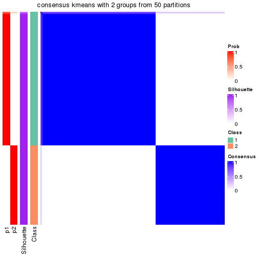</p>

</div>
<div id='tab-node-04-consensus-heatmap-2'>
<pre><code class="r">consensus_heatmap(res, k = 3)
</code></pre>

<p>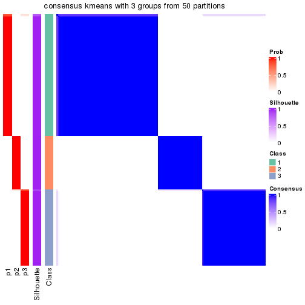</p>

</div>
<div id='tab-node-04-consensus-heatmap-3'>
<pre><code class="r">consensus_heatmap(res, k = 4)
</code></pre>

<p>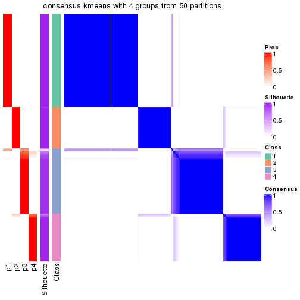</p>

</div>
<div id='tab-node-04-consensus-heatmap-4'>
<pre><code class="r">consensus_heatmap(res, k = 5)
</code></pre>

<p>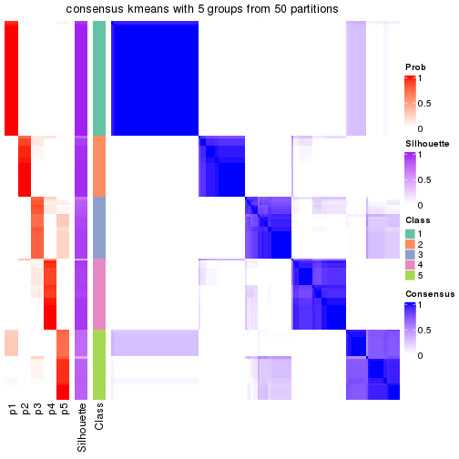</p>

</div>
<div id='tab-node-04-consensus-heatmap-5'>
<pre><code class="r">consensus_heatmap(res, k = 6)
</code></pre>

<p>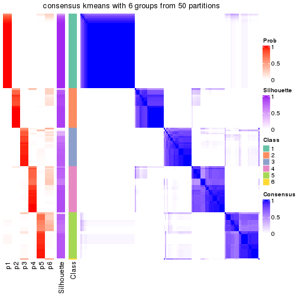</p>

</div>
<div id='tab-node-04-consensus-heatmap-6'>
<pre><code class="r">consensus_heatmap(res, k = 7)
</code></pre>

<p>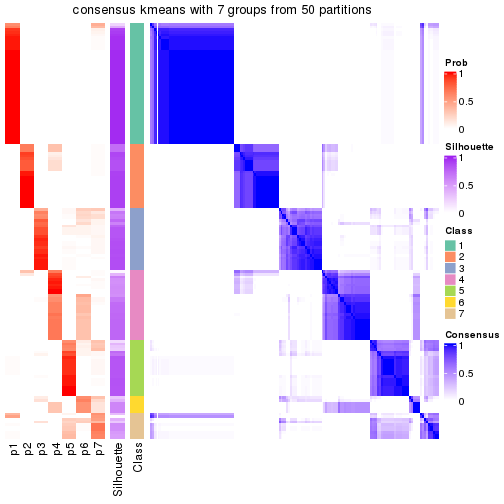</p>

</div>
<div id='tab-node-04-consensus-heatmap-7'>
<pre><code class="r">consensus_heatmap(res, k = 8)
</code></pre>

<p>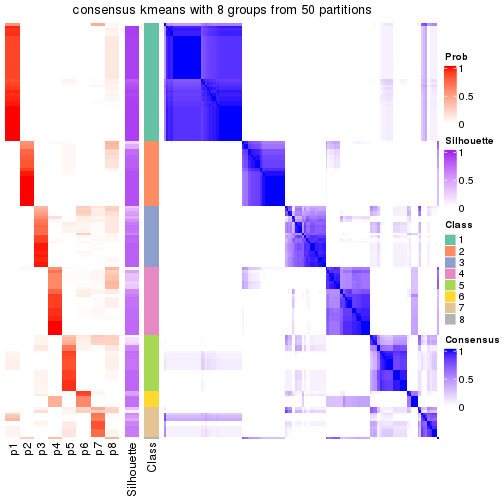</p>

</div>
</div>

Heatmaps for the membership of samples in all partitions to see how consistent they are:


<script>
$( function() {
	$( '#tabs-node-04-membership-heatmap' ).tabs();
} );
</script>
<div id='tabs-node-04-membership-heatmap'>
<ul>
<li><a href='#tab-node-04-membership-heatmap-1'>k = 2</a></li>
<li><a href='#tab-node-04-membership-heatmap-2'>k = 3</a></li>
<li><a href='#tab-node-04-membership-heatmap-3'>k = 4</a></li>
<li><a href='#tab-node-04-membership-heatmap-4'>k = 5</a></li>
<li><a href='#tab-node-04-membership-heatmap-5'>k = 6</a></li>
<li><a href='#tab-node-04-membership-heatmap-6'>k = 7</a></li>
<li><a href='#tab-node-04-membership-heatmap-7'>k = 8</a></li>
</ul>
<div id='tab-node-04-membership-heatmap-1'>
<pre><code class="r">membership_heatmap(res, k = 2)
</code></pre>

<p>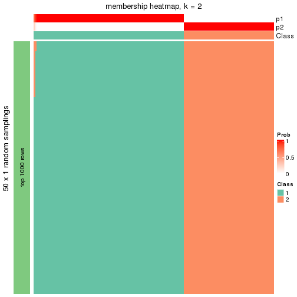</p>

</div>
<div id='tab-node-04-membership-heatmap-2'>
<pre><code class="r">membership_heatmap(res, k = 3)
</code></pre>

<p>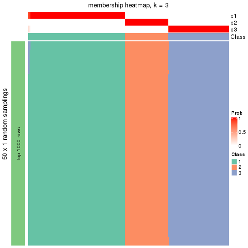</p>

</div>
<div id='tab-node-04-membership-heatmap-3'>
<pre><code class="r">membership_heatmap(res, k = 4)
</code></pre>

<p>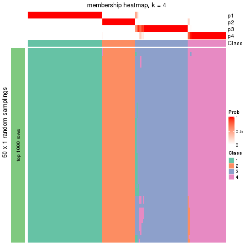</p>

</div>
<div id='tab-node-04-membership-heatmap-4'>
<pre><code class="r">membership_heatmap(res, k = 5)
</code></pre>

<p>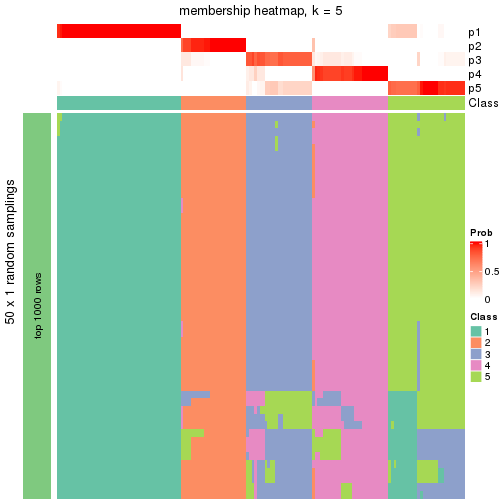</p>

</div>
<div id='tab-node-04-membership-heatmap-5'>
<pre><code class="r">membership_heatmap(res, k = 6)
</code></pre>

<p>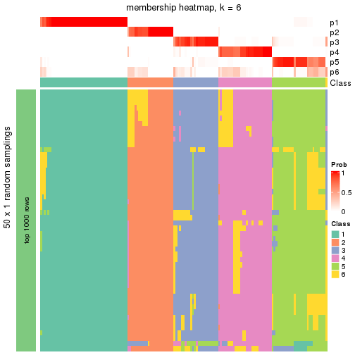</p>

</div>
<div id='tab-node-04-membership-heatmap-6'>
<pre><code class="r">membership_heatmap(res, k = 7)
</code></pre>

<p>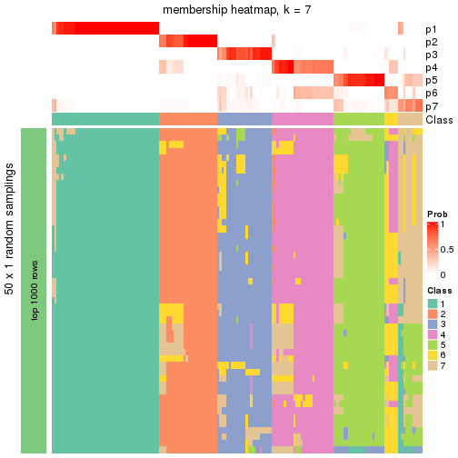</p>

</div>
<div id='tab-node-04-membership-heatmap-7'>
<pre><code class="r">membership_heatmap(res, k = 8)
</code></pre>

<p>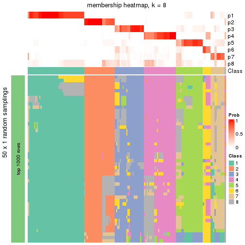</p>

</div>
</div>

As soon as the classes for columns are determined, the signatures
that are significantly different between subgroups can be looked for. 
Following are the heatmaps for signatures.


<script>
$( function() {
	$( '#tabs-node-04-get-signatures' ).tabs();
} );
</script>
<div id='tabs-node-04-get-signatures'>
<ul>
<li><a href='#tab-node-04-get-signatures-1'>k = 2</a></li>
<li><a href='#tab-node-04-get-signatures-2'>k = 3</a></li>
<li><a href='#tab-node-04-get-signatures-3'>k = 4</a></li>
<li><a href='#tab-node-04-get-signatures-4'>k = 5</a></li>
<li><a href='#tab-node-04-get-signatures-5'>k = 6</a></li>
<li><a href='#tab-node-04-get-signatures-6'>k = 7</a></li>
<li><a href='#tab-node-04-get-signatures-7'>k = 8</a></li>
</ul>
<div id='tab-node-04-get-signatures-1'>
<pre><code class="r">get_signatures(res, k = 2)
</code></pre>

<p>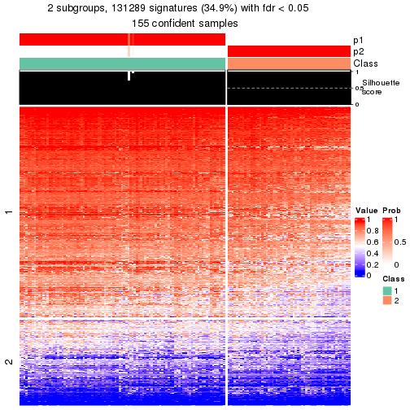</p>

</div>
<div id='tab-node-04-get-signatures-2'>
<pre><code class="r">get_signatures(res, k = 3)
</code></pre>

<p>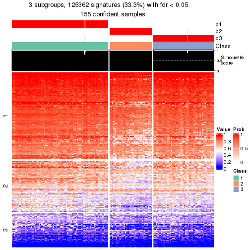</p>

</div>
<div id='tab-node-04-get-signatures-3'>
<pre><code class="r">get_signatures(res, k = 4)
</code></pre>

<p>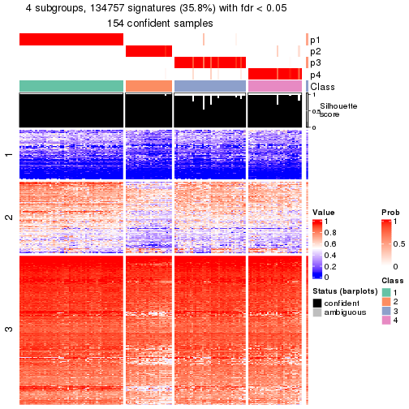</p>

</div>
<div id='tab-node-04-get-signatures-4'>
<pre><code class="r">get_signatures(res, k = 5)
</code></pre>

<p>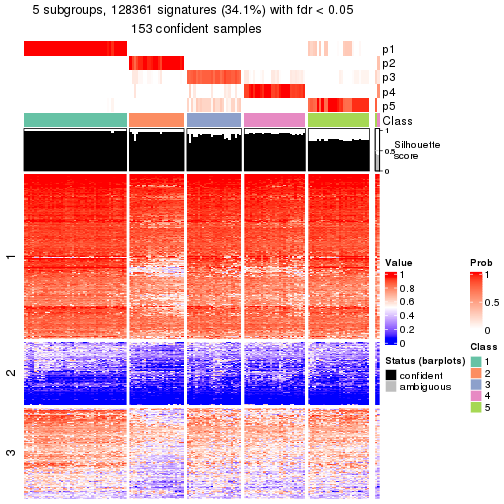</p>

</div>
<div id='tab-node-04-get-signatures-5'>
<pre><code class="r">get_signatures(res, k = 6)
</code></pre>

<p>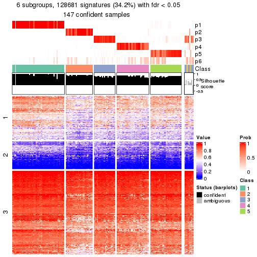</p>

</div>
<div id='tab-node-04-get-signatures-6'>
<pre><code class="r">get_signatures(res, k = 7)
</code></pre>

<p>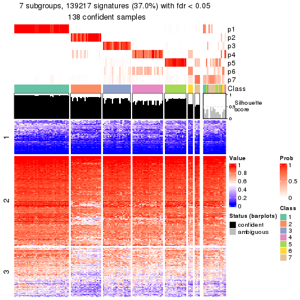</p>

</div>
<div id='tab-node-04-get-signatures-7'>
<pre><code class="r">get_signatures(res, k = 8)
</code></pre>

<p>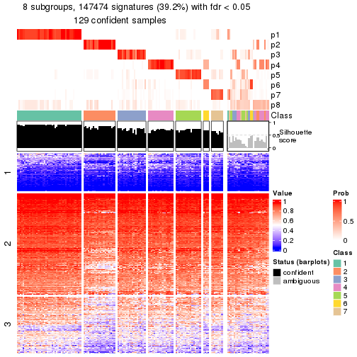</p>

</div>
</div>


Compare the overlap of signatures from different k:

```r
compare_signatures(res)
```

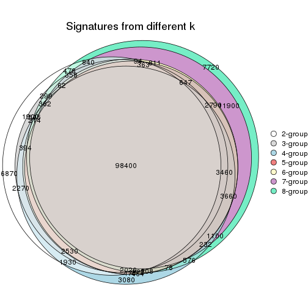

`get_signature()` returns a data frame invisibly. To get the list of signatures, the function
call should be assigned to a variable explicitly. In following code, if `plot` argument is set
to `FALSE`, no heatmap is plotted while only the differential analysis is performed.

```r
# code only for demonstration
tb = get_signature(res, k = ..., plot = FALSE)
```

An example of the output of `tb` is:

```
#>   which_row         fdr    mean_1    mean_2 scaled_mean_1 scaled_mean_2 km
#> 1        38 0.042760348  8.373488  9.131774    -0.5533452     0.5164555  1
#> 2        40 0.018707592  7.106213  8.469186    -0.6173731     0.5762149  1
#> 3        55 0.019134737 10.221463 11.207825    -0.6159697     0.5749050  1
#> 4        59 0.006059896  5.921854  7.869574    -0.6899429     0.6439467  1
#> 5        60 0.018055526  8.928898 10.211722    -0.6204761     0.5791110  1
#> 6        98 0.009384629 15.714769 14.887706     0.6635654    -0.6193277  2
...
```

The columns in `tb` are:

1. `which_row`: row indices corresponding to the input matrix.
2. `fdr`: FDR for the differential test. 
3. `mean_x`: The mean value in group x.
4. `scaled_mean_x`: The mean value in group x after rows are scaled.
5. `km`: Row groups if k-means clustering is applied to rows (which is done by automatically selecting number of clusters).

If there are too many signatures, `top_signatures = ...` can be set to only show the 
signatures with the highest FDRs:

```r
# code only for demonstration
# e.g. to show the top 500 most significant rows
tb = get_signature(res, k = ..., top_signatures = 500)
```

If the signatures are defined as these which are uniquely high in current group, `diff_method` argument
can be set to `"uniquely_high_in_one_group"`:

```r
# code only for demonstration
tb = get_signature(res, k = ..., diff_method = "uniquely_high_in_one_group")
```


UMAP plot which shows how samples are separated.


<script>
$( function() {
	$( '#tabs-node-04-dimension-reduction' ).tabs();
} );
</script>
<div id='tabs-node-04-dimension-reduction'>
<ul>
<li><a href='#tab-node-04-dimension-reduction-1'>k = 2</a></li>
<li><a href='#tab-node-04-dimension-reduction-2'>k = 3</a></li>
<li><a href='#tab-node-04-dimension-reduction-3'>k = 4</a></li>
<li><a href='#tab-node-04-dimension-reduction-4'>k = 5</a></li>
<li><a href='#tab-node-04-dimension-reduction-5'>k = 6</a></li>
<li><a href='#tab-node-04-dimension-reduction-6'>k = 7</a></li>
<li><a href='#tab-node-04-dimension-reduction-7'>k = 8</a></li>
</ul>
<div id='tab-node-04-dimension-reduction-1'>
<pre><code class="r">dimension_reduction(res, k = 2, method = &quot;UMAP&quot;)
</code></pre>

<p>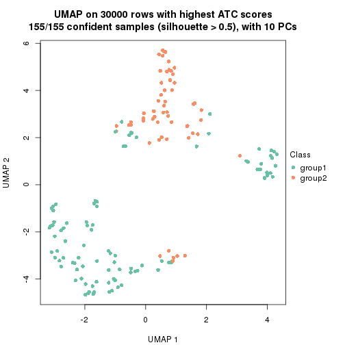</p>

</div>
<div id='tab-node-04-dimension-reduction-2'>
<pre><code class="r">dimension_reduction(res, k = 3, method = &quot;UMAP&quot;)
</code></pre>

<p>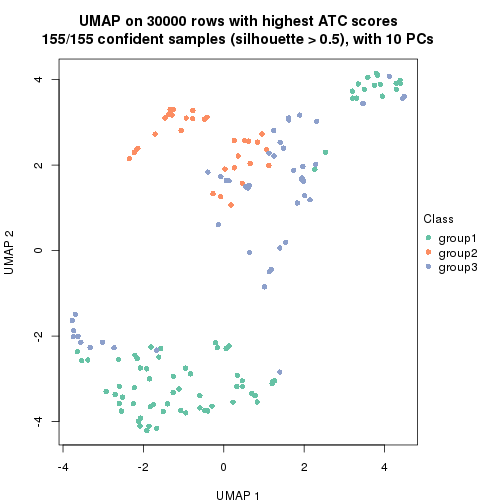</p>

</div>
<div id='tab-node-04-dimension-reduction-3'>
<pre><code class="r">dimension_reduction(res, k = 4, method = &quot;UMAP&quot;)
</code></pre>

<p>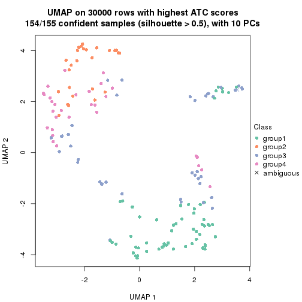</p>

</div>
<div id='tab-node-04-dimension-reduction-4'>
<pre><code class="r">dimension_reduction(res, k = 5, method = &quot;UMAP&quot;)
</code></pre>

<p>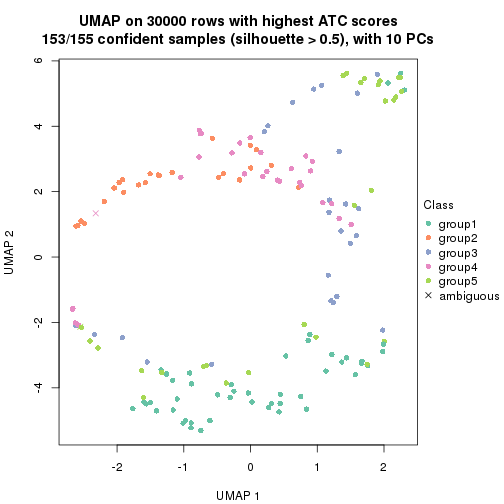</p>

</div>
<div id='tab-node-04-dimension-reduction-5'>
<pre><code class="r">dimension_reduction(res, k = 6, method = &quot;UMAP&quot;)
</code></pre>

<p>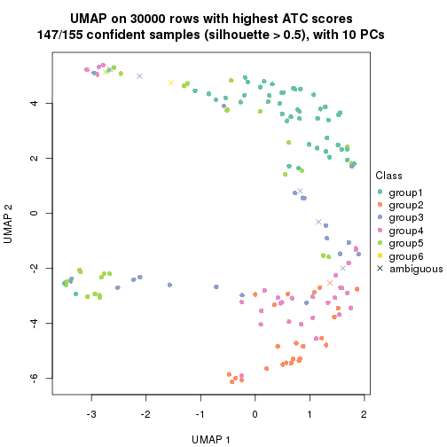</p>

</div>
<div id='tab-node-04-dimension-reduction-6'>
<pre><code class="r">dimension_reduction(res, k = 7, method = &quot;UMAP&quot;)
</code></pre>

<p>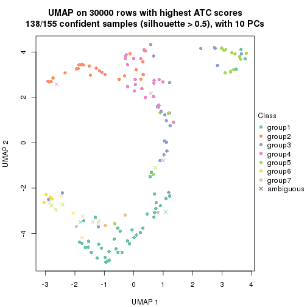</p>

</div>
<div id='tab-node-04-dimension-reduction-7'>
<pre><code class="r">dimension_reduction(res, k = 8, method = &quot;UMAP&quot;)
</code></pre>

<p>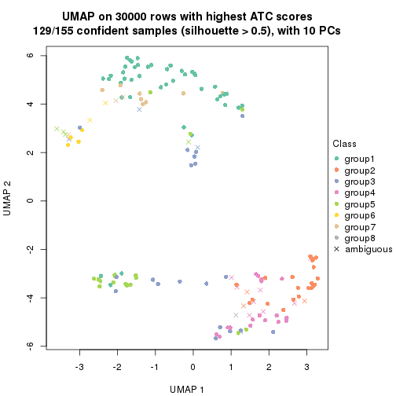</p>

</div>
</div>


Following heatmap shows how subgroups are split when increasing `k`:

```r
collect_classes(res)
```

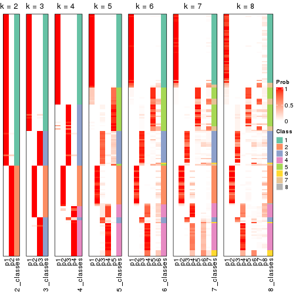


If matrix rows can be associated to genes, consider to use `functional_enrichment(res,
...)` to perform function enrichment for the signature genes. See [this vignette](https://jokergoo.github.io/cola_vignettes/functional_enrichment.html) for more detailed explanations.


 

---------------------------------------------------


### Node041


Parent node: [Node04](#Node04).
Child nodes: 
                Node0121-leaf
        ,
                Node0122-leaf
        ,
                Node0123-leaf
        ,
                Node0211-leaf
        ,
                [Node0212](#Node0212)
        ,
                Node0213-leaf
        ,
                [Node0221](#Node0221)
        ,
                Node0222-leaf
        ,
                Node0223-leaf
        ,
                [Node0231](#Node0231)
        ,
                Node0232-leaf
        ,
                Node0233-leaf
        ,
                Node0241-leaf
        ,
                Node0242-leaf
        ,
                Node0411-leaf
        ,
                Node0412-leaf
        ,
                Node0413-leaf
        ,
                Node0421-leaf
        ,
                Node0422-leaf
        ,
                Node0423-leaf
        ,
                Node0431-leaf
        ,
                Node0432-leaf
        ,
                Node0433-leaf
        ,
                Node0441-leaf
        ,
                Node0442-leaf
        ,
                Node0443-leaf
        ,
                Node0511-leaf
        ,
                [Node0512](#Node0512)
        ,
                Node0513-leaf
        ,
                Node0521-leaf
        ,
                Node0522-leaf
        ,
                Node0523-leaf
        .


The object with results only for a single top-value method and a single partitioning method 
can be extracted as:

```r
res = res_rh["041"]
```

A summary of `res` and all the functions that can be applied to it:

```r
res
```

```
#> A 'ConsensusPartition' object with k = 2, 3, 4, 5, 6, 7, 8.
#>   On a matrix with 30000 rows and 58 columns.
#>   Top rows (1000) are extracted by 'ATC' method.
#>   Subgroups are detected by 'kmeans' method.
#>   Performed in total 350 partitions by row resampling.
#>   Best k for subgroups seems to be 3.
#> 
#> Following methods can be applied to this 'ConsensusPartition' object:
#>  [1] "cola_report"             "collect_classes"         "collect_plots"          
#>  [4] "collect_stats"           "colnames"                "compare_partitions"     
#>  [7] "compare_signatures"      "consensus_heatmap"       "dimension_reduction"    
#> [10] "functional_enrichment"   "get_anno_col"            "get_anno"               
#> [13] "get_classes"             "get_consensus"           "get_matrix"             
#> [16] "get_membership"          "get_param"               "get_signatures"         
#> [19] "get_stats"               "is_best_k"               "is_stable_k"            
#> [22] "membership_heatmap"      "ncol"                    "nrow"                   
#> [25] "plot_ecdf"               "predict_classes"         "rownames"               
#> [28] "select_partition_number" "show"                    "suggest_best_k"         
#> [31] "test_to_known_factors"   "top_rows_heatmap"
```

`collect_plots()` function collects all the plots made from `res` for all `k` (number of subgroups)
into one single page to provide an easy and fast comparison between different `k`.

```r
collect_plots(res)
```

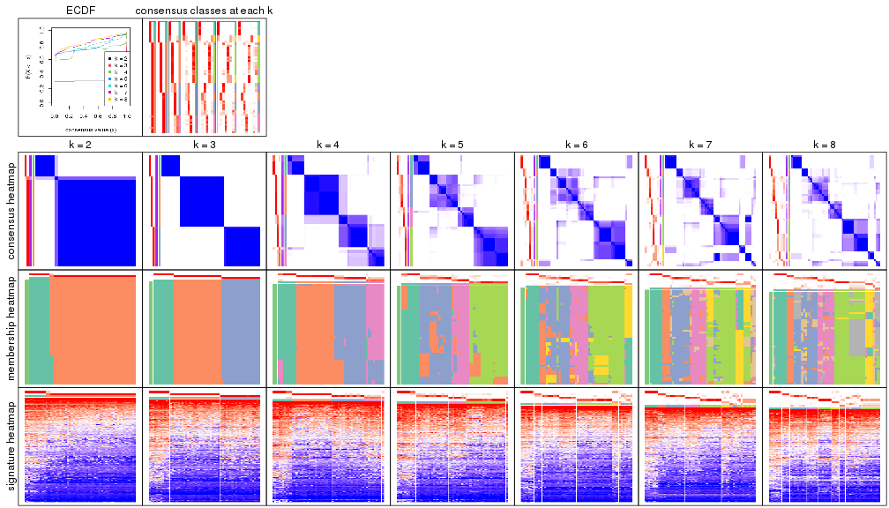

The plots are:

- The first row: a plot of the eCDF (empirical cumulative distribution
  function) curves of the consensus matrix for each `k` and the heatmap of
  predicted classes for each `k`.
- The second row: heatmaps of the consensus matrix for each `k`.
- The third row: heatmaps of the membership matrix for each `k`.
- The fouth row: heatmaps of the signatures for each `k`.

All the plots in panels can be made by individual functions and they are
plotted later in this section.

`select_partition_number()` produces several plots showing different
statistics for choosing "optimized" `k`. There are following statistics:

- eCDF curves of the consensus matrix for each `k`;
- 1-PAC. [The PAC score](https://en.wikipedia.org/wiki/Consensus_clustering#Over-interpretation_potential_of_consensus_clustering)
  measures the proportion of the ambiguous subgrouping.
- Mean silhouette score.
- Concordance. The mean probability of fiting the consensus subgroup labels in all
  partitions.
- Area increased. Denote $A_k$ as the area under the eCDF curve for current
  `k`, the area increased is defined as $A_k - A_{k-1}$.
- Rand index. The percent of pairs of samples that are both in a same cluster
  or both are not in a same cluster in the partition of k and k-1.
- Jaccard index. The ratio of pairs of samples are both in a same cluster in
  the partition of k and k-1 and the pairs of samples are both in a same
  cluster in the partition k or k-1.

The detailed explanations of these statistics can be found in [the _cola_
vignette](https://jokergoo.github.io/cola_vignettes/cola.html#toc_13).

Generally speaking, higher 1-PAC score, higher mean silhouette score or higher
concordance corresponds to better partition. Rand index and Jaccard index
measure how similar the current partition is compared to partition with `k-1`.
If they are too similar, we won't accept `k` is better than `k-1`.

```r
select_partition_number(res)
```

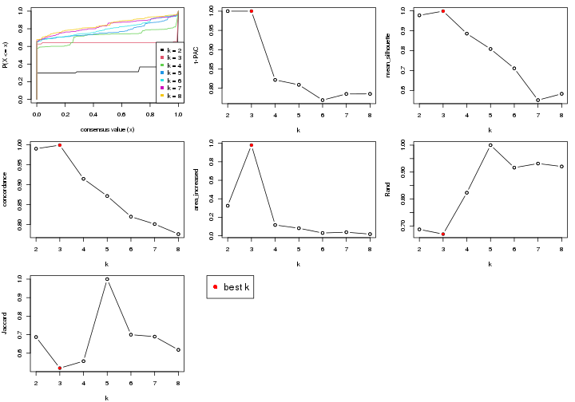

The numeric values for all these statistics can be obtained by `get_stats()`.

```r
get_stats(res)
```

```
#>   k 1-PAC mean_silhouette concordance area_increased  Rand Jaccard
#> 2 2 1.000           0.977       0.990         0.3249 0.687   0.687
#> 3 3 1.000           0.998       0.999         0.9797 0.670   0.519
#> 4 4 0.821           0.885       0.915         0.1168 0.823   0.557
#> 5 5 0.809           0.808       0.872         0.0817 1.000   1.000
#> 6 6 0.769           0.711       0.820         0.0302 0.917   0.700
#> 7 7 0.785           0.552       0.801         0.0389 0.932   0.690
#> 8 8 0.785           0.583       0.776         0.0181 0.921   0.618
```

`suggest_best_k()` suggests the best $k$ based on these statistics. The rules are as follows:

- All $k$ with Jaccard index larger than 0.95 are removed because increasing
  $k$ does not provide enough extra information. If all $k$ are removed, it is
  marked as no subgroup is detected.
- For all $k$ with 1-PAC score larger than 0.9, the maximal $k$ is taken as
  the best $k$, and other $k$ are marked as optional $k$.
- If it does not fit the second rule. The $k$ with the maximal vote of the
  highest 1-PAC score, highest mean silhouette, and highest concordance is
  taken as the best $k$.

```r
suggest_best_k(res)
```

```
#> [1] 3
#> attr(,"optional")
#> [1] 2
```

There is also optional best $k$ = 2 that is worth to check.

Following is the table of the partitions (You need to click the **show/hide
code output** link to see it). The membership matrix (columns with name `p*`)
is inferred by
[`clue::cl_consensus()`](https://www.rdocumentation.org/link/cl_consensus?package=clue)
function with the `SE` method. Basically the value in the membership matrix
represents the probability to belong to a certain group. The finall subgroup
label for an item is determined with the group with highest probability it
belongs to.

In `get_classes()` function, the entropy is calculated from the membership
matrix and the silhouette score is calculated from the consensus matrix.


<script>
$( function() {
	$( '#tabs-node-041-get-classes' ).tabs();
} );
</script>
<div id='tabs-node-041-get-classes'>
<ul>
<li><a href='#tab-node-041-get-classes-1'>k = 2</a></li>
<li><a href='#tab-node-041-get-classes-2'>k = 3</a></li>
<li><a href='#tab-node-041-get-classes-3'>k = 4</a></li>
<li><a href='#tab-node-041-get-classes-4'>k = 5</a></li>
<li><a href='#tab-node-041-get-classes-5'>k = 6</a></li>
<li><a href='#tab-node-041-get-classes-6'>k = 7</a></li>
<li><a href='#tab-node-041-get-classes-7'>k = 8</a></li>
</ul>

<div id='tab-node-041-get-classes-1'>
<p><a id='tab-node-041-get-classes-1-a' style='color:#0366d6' href='#'>show/hide code output</a></p>
<pre><code class="r">cbind(get_classes(res, k = 2), get_membership(res, k = 2))
</code></pre>

<pre><code>#&gt;                 class entropy silhouette   p1   p2
#&gt; TCGA.KK.A6E6.01     2   0.855      0.620 0.28 0.72
#&gt; TCGA.G9.6339.01     2   0.000      0.988 0.00 1.00
#&gt; TCGA.EJ.7314.01     1   0.000      1.000 1.00 0.00
#&gt; TCGA.G9.6366.01     2   0.000      0.988 0.00 1.00
#&gt; TCGA.KC.A4BN.01     2   0.000      0.988 0.00 1.00
#&gt; TCGA.J4.A83K.01     2   0.000      0.988 0.00 1.00
#&gt; TCGA.EJ.5524.01     2   0.000      0.988 0.00 1.00
#&gt; TCGA.HC.7209.01     2   0.000      0.988 0.00 1.00
#&gt; TCGA.VP.A879.01     2   0.000      0.988 0.00 1.00
#&gt; TCGA.VN.A88Q.01     2   0.000      0.988 0.00 1.00
#&gt; TCGA.EJ.5526.01     1   0.000      1.000 1.00 0.00
#&gt; TCGA.EJ.5542.01     2   0.000      0.988 0.00 1.00
#&gt; TCGA.HC.7748.01     2   0.000      0.988 0.00 1.00
#&gt; TCGA.G9.6365.01     2   0.000      0.988 0.00 1.00
#&gt; TCGA.KK.A8I8.01     2   0.000      0.988 0.00 1.00
#&gt; TCGA.EJ.5522.01     2   0.000      0.988 0.00 1.00
#&gt; TCGA.TP.A8TT.01     2   0.000      0.988 0.00 1.00
#&gt; TCGA.HC.7232.01     1   0.000      1.000 1.00 0.00
#&gt; TCGA.HC.7081.01     2   0.000      0.988 0.00 1.00
#&gt; TCGA.J4.A83M.01     2   0.000      0.988 0.00 1.00
#&gt; TCGA.QU.A6IP.01     2   0.000      0.988 0.00 1.00
#&gt; TCGA.V1.A9O9.01     2   0.000      0.988 0.00 1.00
#&gt; TCGA.ZG.A9LB.01     1   0.000      1.000 1.00 0.00
#&gt; TCGA.KK.A7B1.01     2   0.000      0.988 0.00 1.00
#&gt; TCGA.HC.8262.01     1   0.000      1.000 1.00 0.00
#&gt; TCGA.HI.7170.01     2   0.000      0.988 0.00 1.00
#&gt; TCGA.J4.A67L.01     2   0.000      0.988 0.00 1.00
#&gt; TCGA.G9.6342.01     2   0.000      0.988 0.00 1.00
#&gt; TCGA.J4.8200.01     2   0.000      0.988 0.00 1.00
#&gt; TCGA.HC.7233.01     2   0.000      0.988 0.00 1.00
#&gt; TCGA.J4.A83L.01     2   0.000      0.988 0.00 1.00
#&gt; TCGA.J9.A8CK.01     2   0.000      0.988 0.00 1.00
#&gt; TCGA.CH.5744.01     2   0.000      0.988 0.00 1.00
#&gt; TCGA.G9.6354.01     2   0.000      0.988 0.00 1.00
#&gt; TCGA.EJ.7327.01     2   0.000      0.988 0.00 1.00
#&gt; TCGA.V1.A9OA.01     1   0.000      1.000 1.00 0.00
#&gt; TCGA.J9.A52E.01     2   0.000      0.988 0.00 1.00
#&gt; TCGA.J4.A67S.01     2   0.000      0.988 0.00 1.00
#&gt; TCGA.HC.A6AQ.01     2   0.000      0.988 0.00 1.00
#&gt; TCGA.EJ.7321.01     1   0.000      1.000 1.00 0.00
#&gt; TCGA.G9.7519.01     2   0.000      0.988 0.00 1.00
#&gt; TCGA.EJ.7318.01     2   0.000      0.988 0.00 1.00
#&gt; TCGA.G9.6364.01     2   0.000      0.988 0.00 1.00
#&gt; TCGA.HI.7169.01     2   0.000      0.988 0.00 1.00
#&gt; TCGA.J4.A67K.01     2   0.000      0.988 0.00 1.00
#&gt; TCGA.YL.A8SF.01     1   0.000      1.000 1.00 0.00
#&gt; TCGA.CH.5745.01     1   0.000      1.000 1.00 0.00
#&gt; TCGA.CH.5740.01     2   0.855      0.620 0.28 0.72
#&gt; TCGA.G9.7509.01     2   0.000      0.988 0.00 1.00
#&gt; TCGA.KK.A8IL.01     2   0.000      0.988 0.00 1.00
#&gt; TCGA.HC.7820.01     2   0.000      0.988 0.00 1.00
#&gt; TCGA.ZG.A9NI.01     1   0.000      1.000 1.00 0.00
#&gt; TCGA.HC.A6HY.01     2   0.000      0.988 0.00 1.00
#&gt; TCGA.CH.5764.01     2   0.000      0.988 0.00 1.00
#&gt; TCGA.G9.6363.01     2   0.000      0.988 0.00 1.00
#&gt; TCGA.VN.A88L.01     2   0.000      0.988 0.00 1.00
#&gt; TCGA.XQ.A8TB.01     1   0.000      1.000 1.00 0.00
#&gt; TCGA.EJ.5496.01     2   0.000      0.988 0.00 1.00
</code></pre>

<script>
$('#tab-node-041-get-classes-1-a').parent().next().next().hide();
$('#tab-node-041-get-classes-1-a').click(function(){
  $('#tab-node-041-get-classes-1-a').parent().next().next().toggle();
  return(false);
});
</script>
</div>

<div id='tab-node-041-get-classes-2'>
<p><a id='tab-node-041-get-classes-2-a' style='color:#0366d6' href='#'>show/hide code output</a></p>
<pre><code class="r">cbind(get_classes(res, k = 3), get_membership(res, k = 3))
</code></pre>

<pre><code>#&gt;                 class entropy silhouette p1   p2   p3
#&gt; TCGA.KK.A6E6.01     3   0.000      0.998  0 0.00 1.00
#&gt; TCGA.G9.6339.01     3   0.000      0.998  0 0.00 1.00
#&gt; TCGA.EJ.7314.01     1   0.000      1.000  1 0.00 0.00
#&gt; TCGA.G9.6366.01     2   0.000      1.000  0 1.00 0.00
#&gt; TCGA.KC.A4BN.01     2   0.000      1.000  0 1.00 0.00
#&gt; TCGA.J4.A83K.01     2   0.000      1.000  0 1.00 0.00
#&gt; TCGA.EJ.5524.01     3   0.000      0.998  0 0.00 1.00
#&gt; TCGA.HC.7209.01     3   0.000      0.998  0 0.00 1.00
#&gt; TCGA.VP.A879.01     2   0.000      1.000  0 1.00 0.00
#&gt; TCGA.VN.A88Q.01     3   0.000      0.998  0 0.00 1.00
#&gt; TCGA.EJ.5526.01     1   0.000      1.000  1 0.00 0.00
#&gt; TCGA.EJ.5542.01     2   0.000      1.000  0 1.00 0.00
#&gt; TCGA.HC.7748.01     3   0.000      0.998  0 0.00 1.00
#&gt; TCGA.G9.6365.01     2   0.000      1.000  0 1.00 0.00
#&gt; TCGA.KK.A8I8.01     3   0.000      0.998  0 0.00 1.00
#&gt; TCGA.EJ.5522.01     2   0.000      1.000  0 1.00 0.00
#&gt; TCGA.TP.A8TT.01     3   0.000      0.998  0 0.00 1.00
#&gt; TCGA.HC.7232.01     1   0.000      1.000  1 0.00 0.00
#&gt; TCGA.HC.7081.01     3   0.000      0.998  0 0.00 1.00
#&gt; TCGA.J4.A83M.01     3   0.000      0.998  0 0.00 1.00
#&gt; TCGA.QU.A6IP.01     2   0.000      1.000  0 1.00 0.00
#&gt; TCGA.V1.A9O9.01     3   0.000      0.998  0 0.00 1.00
#&gt; TCGA.ZG.A9LB.01     1   0.000      1.000  1 0.00 0.00
#&gt; TCGA.KK.A7B1.01     2   0.000      1.000  0 1.00 0.00
#&gt; TCGA.HC.8262.01     1   0.000      1.000  1 0.00 0.00
#&gt; TCGA.HI.7170.01     2   0.000      1.000  0 1.00 0.00
#&gt; TCGA.J4.A67L.01     2   0.000      1.000  0 1.00 0.00
#&gt; TCGA.G9.6342.01     3   0.000      0.998  0 0.00 1.00
#&gt; TCGA.J4.8200.01     2   0.000      1.000  0 1.00 0.00
#&gt; TCGA.HC.7233.01     2   0.000      1.000  0 1.00 0.00
#&gt; TCGA.J4.A83L.01     2   0.000      1.000  0 1.00 0.00
#&gt; TCGA.J9.A8CK.01     3   0.000      0.998  0 0.00 1.00
#&gt; TCGA.CH.5744.01     2   0.000      1.000  0 1.00 0.00
#&gt; TCGA.G9.6354.01     2   0.000      1.000  0 1.00 0.00
#&gt; TCGA.EJ.7327.01     3   0.000      0.998  0 0.00 1.00
#&gt; TCGA.V1.A9OA.01     1   0.000      1.000  1 0.00 0.00
#&gt; TCGA.J9.A52E.01     3   0.000      0.998  0 0.00 1.00
#&gt; TCGA.J4.A67S.01     2   0.000      1.000  0 1.00 0.00
#&gt; TCGA.HC.A6AQ.01     3   0.153      0.950  0 0.04 0.96
#&gt; TCGA.EJ.7321.01     1   0.000      1.000  1 0.00 0.00
#&gt; TCGA.G9.7519.01     2   0.000      1.000  0 1.00 0.00
#&gt; TCGA.EJ.7318.01     3   0.000      0.998  0 0.00 1.00
#&gt; TCGA.G9.6364.01     2   0.000      1.000  0 1.00 0.00
#&gt; TCGA.HI.7169.01     2   0.000      1.000  0 1.00 0.00
#&gt; TCGA.J4.A67K.01     3   0.000      0.998  0 0.00 1.00
#&gt; TCGA.YL.A8SF.01     1   0.000      1.000  1 0.00 0.00
#&gt; TCGA.CH.5745.01     1   0.000      1.000  1 0.00 0.00
#&gt; TCGA.CH.5740.01     3   0.000      0.998  0 0.00 1.00
#&gt; TCGA.G9.7509.01     2   0.000      1.000  0 1.00 0.00
#&gt; TCGA.KK.A8IL.01     2   0.000      1.000  0 1.00 0.00
#&gt; TCGA.HC.7820.01     2   0.000      1.000  0 1.00 0.00
#&gt; TCGA.ZG.A9NI.01     1   0.000      1.000  1 0.00 0.00
#&gt; TCGA.HC.A6HY.01     2   0.000      1.000  0 1.00 0.00
#&gt; TCGA.CH.5764.01     3   0.000      0.998  0 0.00 1.00
#&gt; TCGA.G9.6363.01     2   0.000      1.000  0 1.00 0.00
#&gt; TCGA.VN.A88L.01     3   0.000      0.998  0 0.00 1.00
#&gt; TCGA.XQ.A8TB.01     1   0.000      1.000  1 0.00 0.00
#&gt; TCGA.EJ.5496.01     2   0.000      1.000  0 1.00 0.00
</code></pre>

<script>
$('#tab-node-041-get-classes-2-a').parent().next().next().hide();
$('#tab-node-041-get-classes-2-a').click(function(){
  $('#tab-node-041-get-classes-2-a').parent().next().next().toggle();
  return(false);
});
</script>
</div>

<div id='tab-node-041-get-classes-3'>
<p><a id='tab-node-041-get-classes-3-a' style='color:#0366d6' href='#'>show/hide code output</a></p>
<pre><code class="r">cbind(get_classes(res, k = 4), get_membership(res, k = 4))
</code></pre>

<pre><code>#&gt;                 class entropy silhouette   p1   p2   p3   p4
#&gt; TCGA.KK.A6E6.01     4  0.3801      0.882 0.00 0.00 0.22 0.78
#&gt; TCGA.G9.6339.01     3  0.0000      0.843 0.00 0.00 1.00 0.00
#&gt; TCGA.EJ.7314.01     1  0.0000      0.940 1.00 0.00 0.00 0.00
#&gt; TCGA.G9.6366.01     2  0.0707      0.987 0.00 0.98 0.00 0.02
#&gt; TCGA.KC.A4BN.01     2  0.0000      0.991 0.00 1.00 0.00 0.00
#&gt; TCGA.J4.A83K.01     3  0.4134      0.679 0.00 0.26 0.74 0.00
#&gt; TCGA.EJ.5524.01     4  0.4134      0.901 0.00 0.00 0.26 0.74
#&gt; TCGA.HC.7209.01     4  0.4624      0.828 0.00 0.00 0.34 0.66
#&gt; TCGA.VP.A879.01     2  0.0000      0.991 0.00 1.00 0.00 0.00
#&gt; TCGA.VN.A88Q.01     3  0.0000      0.843 0.00 0.00 1.00 0.00
#&gt; TCGA.EJ.5526.01     1  0.3610      0.859 0.80 0.00 0.00 0.20
#&gt; TCGA.EJ.5542.01     2  0.0000      0.991 0.00 1.00 0.00 0.00
#&gt; TCGA.HC.7748.01     3  0.0000      0.843 0.00 0.00 1.00 0.00
#&gt; TCGA.G9.6365.01     3  0.4134      0.679 0.00 0.26 0.74 0.00
#&gt; TCGA.KK.A8I8.01     4  0.4134      0.901 0.00 0.00 0.26 0.74
#&gt; TCGA.EJ.5522.01     2  0.0000      0.991 0.00 1.00 0.00 0.00
#&gt; TCGA.TP.A8TT.01     3  0.0000      0.843 0.00 0.00 1.00 0.00
#&gt; TCGA.HC.7232.01     1  0.0000      0.940 1.00 0.00 0.00 0.00
#&gt; TCGA.HC.7081.01     4  0.4134      0.901 0.00 0.00 0.26 0.74
#&gt; TCGA.J4.A83M.01     3  0.0000      0.843 0.00 0.00 1.00 0.00
#&gt; TCGA.QU.A6IP.01     2  0.0000      0.991 0.00 1.00 0.00 0.00
#&gt; TCGA.V1.A9O9.01     3  0.2011      0.742 0.00 0.00 0.92 0.08
#&gt; TCGA.ZG.A9LB.01     1  0.0000      0.940 1.00 0.00 0.00 0.00
#&gt; TCGA.KK.A7B1.01     2  0.0707      0.974 0.00 0.98 0.02 0.00
#&gt; TCGA.HC.8262.01     1  0.3975      0.837 0.76 0.00 0.00 0.24
#&gt; TCGA.HI.7170.01     2  0.0707      0.987 0.00 0.98 0.00 0.02
#&gt; TCGA.J4.A67L.01     2  0.0707      0.987 0.00 0.98 0.00 0.02
#&gt; TCGA.G9.6342.01     3  0.0000      0.843 0.00 0.00 1.00 0.00
#&gt; TCGA.J4.8200.01     2  0.0707      0.987 0.00 0.98 0.00 0.02
#&gt; TCGA.HC.7233.01     2  0.0707      0.987 0.00 0.98 0.00 0.02
#&gt; TCGA.J4.A83L.01     2  0.0707      0.987 0.00 0.98 0.00 0.02
#&gt; TCGA.J9.A8CK.01     4  0.4713      0.800 0.00 0.00 0.36 0.64
#&gt; TCGA.CH.5744.01     3  0.4134      0.679 0.00 0.26 0.74 0.00
#&gt; TCGA.G9.6354.01     2  0.0000      0.991 0.00 1.00 0.00 0.00
#&gt; TCGA.EJ.7327.01     4  0.4134      0.901 0.00 0.00 0.26 0.74
#&gt; TCGA.V1.A9OA.01     1  0.0000      0.940 1.00 0.00 0.00 0.00
#&gt; TCGA.J9.A52E.01     3  0.0000      0.843 0.00 0.00 1.00 0.00
#&gt; TCGA.J4.A67S.01     3  0.4797      0.657 0.00 0.26 0.72 0.02
#&gt; TCGA.HC.A6AQ.01     3  0.0707      0.832 0.00 0.00 0.98 0.02
#&gt; TCGA.EJ.7321.01     4  0.3975      0.228 0.24 0.00 0.00 0.76
#&gt; TCGA.G9.7519.01     2  0.0707      0.987 0.00 0.98 0.00 0.02
#&gt; TCGA.EJ.7318.01     3  0.0000      0.843 0.00 0.00 1.00 0.00
#&gt; TCGA.G9.6364.01     2  0.0000      0.991 0.00 1.00 0.00 0.00
#&gt; TCGA.HI.7169.01     2  0.0000      0.991 0.00 1.00 0.00 0.00
#&gt; TCGA.J4.A67K.01     3  0.0000      0.843 0.00 0.00 1.00 0.00
#&gt; TCGA.YL.A8SF.01     1  0.0000      0.940 1.00 0.00 0.00 0.00
#&gt; TCGA.CH.5745.01     1  0.3975      0.837 0.76 0.00 0.00 0.24
#&gt; TCGA.CH.5740.01     4  0.3610      0.868 0.00 0.00 0.20 0.80
#&gt; TCGA.G9.7509.01     2  0.0000      0.991 0.00 1.00 0.00 0.00
#&gt; TCGA.KK.A8IL.01     2  0.0707      0.987 0.00 0.98 0.00 0.02
#&gt; TCGA.HC.7820.01     2  0.0000      0.991 0.00 1.00 0.00 0.00
#&gt; TCGA.ZG.A9NI.01     1  0.0000      0.940 1.00 0.00 0.00 0.00
#&gt; TCGA.HC.A6HY.01     2  0.0000      0.991 0.00 1.00 0.00 0.00
#&gt; TCGA.CH.5764.01     3  0.0000      0.843 0.00 0.00 1.00 0.00
#&gt; TCGA.G9.6363.01     3  0.4134      0.679 0.00 0.26 0.74 0.00
#&gt; TCGA.VN.A88L.01     4  0.4134      0.901 0.00 0.00 0.26 0.74
#&gt; TCGA.XQ.A8TB.01     1  0.0000      0.940 1.00 0.00 0.00 0.00
#&gt; TCGA.EJ.5496.01     2  0.0000      0.991 0.00 1.00 0.00 0.00
</code></pre>

<script>
$('#tab-node-041-get-classes-3-a').parent().next().next().hide();
$('#tab-node-041-get-classes-3-a').click(function(){
  $('#tab-node-041-get-classes-3-a').parent().next().next().toggle();
  return(false);
});
</script>
</div>

<div id='tab-node-041-get-classes-4'>
<p><a id='tab-node-041-get-classes-4-a' style='color:#0366d6' href='#'>show/hide code output</a></p>
<pre><code class="r">cbind(get_classes(res, k = 5), get_membership(res, k = 5))
</code></pre>

<pre><code>#&gt;                 class entropy silhouette   p1   p2   p3   p4   p5
#&gt; TCGA.KK.A6E6.01     4  0.0000      0.870 0.00 0.00 0.00 1.00 0.00
#&gt; TCGA.G9.6339.01     3  0.4060      0.671 0.00 0.36 0.64 0.00 0.00
#&gt; TCGA.EJ.7314.01     1  0.0000      0.932 1.00 0.00 0.00 0.00 0.00
#&gt; TCGA.G9.6366.01     5  0.1732      0.890 0.00 0.08 0.00 0.00 0.92
#&gt; TCGA.KC.A4BN.01     5  0.0000      0.898 0.00 0.00 0.00 0.00 1.00
#&gt; TCGA.J4.A83K.01     3  0.3424      0.711 0.00 0.24 0.76 0.00 0.00
#&gt; TCGA.EJ.5524.01     4  0.0609      0.869 0.00 0.02 0.00 0.98 0.00
#&gt; TCGA.HC.7209.01     4  0.5210      0.614 0.00 0.12 0.20 0.68 0.00
#&gt; TCGA.VP.A879.01     5  0.0000      0.898 0.00 0.00 0.00 0.00 1.00
#&gt; TCGA.VN.A88Q.01     3  0.2873      0.756 0.00 0.12 0.86 0.02 0.00
#&gt; TCGA.EJ.5526.01     1  0.3424      0.831 0.76 0.24 0.00 0.00 0.00
#&gt; TCGA.EJ.5542.01     5  0.2516      0.839 0.00 0.14 0.00 0.00 0.86
#&gt; TCGA.HC.7748.01     3  0.1410      0.786 0.00 0.06 0.94 0.00 0.00
#&gt; TCGA.G9.6365.01     3  0.3424      0.711 0.00 0.24 0.76 0.00 0.00
#&gt; TCGA.KK.A8I8.01     4  0.2020      0.842 0.00 0.10 0.00 0.90 0.00
#&gt; TCGA.EJ.5522.01     5  0.0000      0.898 0.00 0.00 0.00 0.00 1.00
#&gt; TCGA.TP.A8TT.01     3  0.2020      0.776 0.00 0.10 0.90 0.00 0.00
#&gt; TCGA.HC.7232.01     1  0.0000      0.932 1.00 0.00 0.00 0.00 0.00
#&gt; TCGA.HC.7081.01     4  0.0000      0.870 0.00 0.00 0.00 1.00 0.00
#&gt; TCGA.J4.A83M.01     3  0.4060      0.671 0.00 0.36 0.64 0.00 0.00
#&gt; TCGA.QU.A6IP.01     5  0.0000      0.898 0.00 0.00 0.00 0.00 1.00
#&gt; TCGA.V1.A9O9.01     3  0.5258      0.629 0.00 0.18 0.68 0.14 0.00
#&gt; TCGA.ZG.A9LB.01     1  0.0000      0.932 1.00 0.00 0.00 0.00 0.00
#&gt; TCGA.KK.A7B1.01     5  0.6009      0.519 0.00 0.24 0.18 0.00 0.58
#&gt; TCGA.HC.8262.01     1  0.3424      0.831 0.76 0.24 0.00 0.00 0.00
#&gt; TCGA.HI.7170.01     5  0.1732      0.890 0.00 0.08 0.00 0.00 0.92
#&gt; TCGA.J4.A67L.01     5  0.2020      0.890 0.00 0.10 0.00 0.00 0.90
#&gt; TCGA.G9.6342.01     3  0.0000      0.788 0.00 0.00 1.00 0.00 0.00
#&gt; TCGA.J4.8200.01     5  0.1732      0.890 0.00 0.08 0.00 0.00 0.92
#&gt; TCGA.HC.7233.01     5  0.1732      0.890 0.00 0.08 0.00 0.00 0.92
#&gt; TCGA.J4.A83L.01     5  0.1732      0.890 0.00 0.08 0.00 0.00 0.92
#&gt; TCGA.J9.A8CK.01     4  0.5597      0.566 0.00 0.16 0.20 0.64 0.00
#&gt; TCGA.CH.5744.01     3  0.3424      0.711 0.00 0.24 0.76 0.00 0.00
#&gt; TCGA.G9.6354.01     5  0.3424      0.768 0.00 0.24 0.00 0.00 0.76
#&gt; TCGA.EJ.7327.01     4  0.0000      0.870 0.00 0.00 0.00 1.00 0.00
#&gt; TCGA.V1.A9OA.01     1  0.0000      0.932 1.00 0.00 0.00 0.00 0.00
#&gt; TCGA.J9.A52E.01     3  0.2280      0.774 0.00 0.12 0.88 0.00 0.00
#&gt; TCGA.J4.A67S.01     3  0.3999      0.701 0.00 0.24 0.74 0.00 0.02
#&gt; TCGA.HC.A6AQ.01     3  0.3895      0.688 0.00 0.32 0.68 0.00 0.00
#&gt; TCGA.EJ.7321.01     4  0.5680      0.484 0.14 0.24 0.00 0.62 0.00
#&gt; TCGA.G9.7519.01     5  0.1732      0.890 0.00 0.08 0.00 0.00 0.92
#&gt; TCGA.EJ.7318.01     3  0.4060      0.671 0.00 0.36 0.64 0.00 0.00
#&gt; TCGA.G9.6364.01     5  0.0000      0.898 0.00 0.00 0.00 0.00 1.00
#&gt; TCGA.HI.7169.01     5  0.0000      0.898 0.00 0.00 0.00 0.00 1.00
#&gt; TCGA.J4.A67K.01     3  0.0000      0.788 0.00 0.00 1.00 0.00 0.00
#&gt; TCGA.YL.A8SF.01     1  0.0000      0.932 1.00 0.00 0.00 0.00 0.00
#&gt; TCGA.CH.5745.01     1  0.3424      0.831 0.76 0.24 0.00 0.00 0.00
#&gt; TCGA.CH.5740.01     4  0.0000      0.870 0.00 0.00 0.00 1.00 0.00
#&gt; TCGA.G9.7509.01     5  0.3424      0.768 0.00 0.24 0.00 0.00 0.76
#&gt; TCGA.KK.A8IL.01     5  0.1732      0.890 0.00 0.08 0.00 0.00 0.92
#&gt; TCGA.HC.7820.01     5  0.2280      0.850 0.00 0.12 0.00 0.00 0.88
#&gt; TCGA.ZG.A9NI.01     1  0.0000      0.932 1.00 0.00 0.00 0.00 0.00
#&gt; TCGA.HC.A6HY.01     5  0.0000      0.898 0.00 0.00 0.00 0.00 1.00
#&gt; TCGA.CH.5764.01     3  0.0000      0.788 0.00 0.00 1.00 0.00 0.00
#&gt; TCGA.G9.6363.01     3  0.3424      0.711 0.00 0.24 0.76 0.00 0.00
#&gt; TCGA.VN.A88L.01     4  0.0609      0.869 0.00 0.02 0.00 0.98 0.00
#&gt; TCGA.XQ.A8TB.01     1  0.0000      0.932 1.00 0.00 0.00 0.00 0.00
#&gt; TCGA.EJ.5496.01     5  0.5263      0.653 0.00 0.24 0.10 0.00 0.66
</code></pre>

<script>
$('#tab-node-041-get-classes-4-a').parent().next().next().hide();
$('#tab-node-041-get-classes-4-a').click(function(){
  $('#tab-node-041-get-classes-4-a').parent().next().next().toggle();
  return(false);
});
</script>
</div>

<div id='tab-node-041-get-classes-5'>
<p><a id='tab-node-041-get-classes-5-a' style='color:#0366d6' href='#'>show/hide code output</a></p>
<pre><code class="r">cbind(get_classes(res, k = 6), get_membership(res, k = 6))
</code></pre>

<pre><code>#&gt;                 class entropy silhouette   p1   p2   p3   p4   p5   p6
#&gt; TCGA.KK.A6E6.01     4  0.1814      0.770 0.00 0.10 0.00 0.90 0.00 0.00
#&gt; TCGA.G9.6339.01     2  0.3309      0.987 0.00 0.72 0.28 0.00 0.00 0.00
#&gt; TCGA.EJ.7314.01     1  0.0000      0.972 1.00 0.00 0.00 0.00 0.00 0.00
#&gt; TCGA.G9.6366.01     5  0.2793      0.840 0.00 0.00 0.00 0.00 0.80 0.20
#&gt; TCGA.KC.A4BN.01     5  0.0000      0.865 0.00 0.00 0.00 0.00 1.00 0.00
#&gt; TCGA.J4.A83K.01     3  0.0000      0.615 0.00 0.00 1.00 0.00 0.00 0.00
#&gt; TCGA.EJ.5524.01     4  0.0000      0.785 0.00 0.00 0.00 1.00 0.00 0.00
#&gt; TCGA.HC.7209.01     4  0.3631      0.729 0.00 0.10 0.04 0.82 0.00 0.04
#&gt; TCGA.VP.A879.01     5  0.0000      0.865 0.00 0.00 0.00 0.00 1.00 0.00
#&gt; TCGA.VN.A88Q.01     3  0.7062      0.225 0.00 0.16 0.44 0.12 0.00 0.28
#&gt; TCGA.EJ.5526.01     6  0.3864      0.691 0.48 0.00 0.00 0.00 0.00 0.52
#&gt; TCGA.EJ.5542.01     5  0.1814      0.821 0.00 0.00 0.10 0.00 0.90 0.00
#&gt; TCGA.HC.7748.01     3  0.3523      0.514 0.00 0.18 0.78 0.00 0.00 0.04
#&gt; TCGA.G9.6365.01     3  0.0000      0.615 0.00 0.00 1.00 0.00 0.00 0.00
#&gt; TCGA.KK.A8I8.01     4  0.4165      0.677 0.00 0.10 0.00 0.74 0.00 0.16
#&gt; TCGA.EJ.5522.01     5  0.0000      0.865 0.00 0.00 0.00 0.00 1.00 0.00
#&gt; TCGA.TP.A8TT.01     3  0.5354      0.200 0.00 0.26 0.58 0.00 0.00 0.16
#&gt; TCGA.HC.7232.01     1  0.0000      0.972 1.00 0.00 0.00 0.00 0.00 0.00
#&gt; TCGA.HC.7081.01     4  0.0547      0.786 0.00 0.02 0.00 0.98 0.00 0.00
#&gt; TCGA.J4.A83M.01     2  0.3309      0.987 0.00 0.72 0.28 0.00 0.00 0.00
#&gt; TCGA.QU.A6IP.01     5  0.0000      0.865 0.00 0.00 0.00 0.00 1.00 0.00
#&gt; TCGA.V1.A9O9.01     4  0.7374     -0.231 0.00 0.28 0.24 0.36 0.00 0.12
#&gt; TCGA.ZG.A9LB.01     1  0.0000      0.972 1.00 0.00 0.00 0.00 0.00 0.00
#&gt; TCGA.KK.A7B1.01     3  0.4328     -0.240 0.00 0.00 0.52 0.00 0.46 0.02
#&gt; TCGA.HC.8262.01     6  0.3864      0.691 0.48 0.00 0.00 0.00 0.00 0.52
#&gt; TCGA.HI.7170.01     5  0.2793      0.840 0.00 0.00 0.00 0.00 0.80 0.20
#&gt; TCGA.J4.A67L.01     5  0.3163      0.850 0.00 0.00 0.04 0.00 0.82 0.14
#&gt; TCGA.G9.6342.01     3  0.3787      0.568 0.00 0.10 0.78 0.00 0.00 0.12
#&gt; TCGA.J4.8200.01     5  0.2793      0.840 0.00 0.00 0.00 0.00 0.80 0.20
#&gt; TCGA.HC.7233.01     5  0.2793      0.840 0.00 0.00 0.00 0.00 0.80 0.20
#&gt; TCGA.J4.A83L.01     5  0.2793      0.840 0.00 0.00 0.00 0.00 0.80 0.20
#&gt; TCGA.J9.A8CK.01     4  0.4851      0.601 0.00 0.20 0.04 0.70 0.00 0.06
#&gt; TCGA.CH.5744.01     3  0.0000      0.615 0.00 0.00 1.00 0.00 0.00 0.00
#&gt; TCGA.G9.6354.01     5  0.3198      0.685 0.00 0.00 0.26 0.00 0.74 0.00
#&gt; TCGA.EJ.7327.01     4  0.1267      0.779 0.00 0.06 0.00 0.94 0.00 0.00
#&gt; TCGA.V1.A9OA.01     1  0.2350      0.815 0.88 0.10 0.00 0.00 0.00 0.02
#&gt; TCGA.J9.A52E.01     3  0.5684      0.166 0.00 0.28 0.52 0.00 0.00 0.20
#&gt; TCGA.J4.A67S.01     3  0.1092      0.581 0.00 0.00 0.96 0.00 0.02 0.02
#&gt; TCGA.HC.A6AQ.01     2  0.3409      0.959 0.00 0.70 0.30 0.00 0.00 0.00
#&gt; TCGA.EJ.7321.01     6  0.5844      0.302 0.12 0.02 0.00 0.36 0.00 0.50
#&gt; TCGA.G9.7519.01     5  0.2793      0.840 0.00 0.00 0.00 0.00 0.80 0.20
#&gt; TCGA.EJ.7318.01     2  0.3309      0.987 0.00 0.72 0.28 0.00 0.00 0.00
#&gt; TCGA.G9.6364.01     5  0.0000      0.865 0.00 0.00 0.00 0.00 1.00 0.00
#&gt; TCGA.HI.7169.01     5  0.0000      0.865 0.00 0.00 0.00 0.00 1.00 0.00
#&gt; TCGA.J4.A67K.01     3  0.3787      0.568 0.00 0.10 0.78 0.00 0.00 0.12
#&gt; TCGA.YL.A8SF.01     1  0.0000      0.972 1.00 0.00 0.00 0.00 0.00 0.00
#&gt; TCGA.CH.5745.01     6  0.3864      0.691 0.48 0.00 0.00 0.00 0.00 0.52
#&gt; TCGA.CH.5740.01     4  0.1814      0.770 0.00 0.10 0.00 0.90 0.00 0.00
#&gt; TCGA.G9.7509.01     5  0.3460      0.735 0.00 0.00 0.22 0.00 0.76 0.02
#&gt; TCGA.KK.A8IL.01     5  0.2793      0.840 0.00 0.00 0.00 0.00 0.80 0.20
#&gt; TCGA.HC.7820.01     5  0.1267      0.843 0.00 0.00 0.06 0.00 0.94 0.00
#&gt; TCGA.ZG.A9NI.01     1  0.0000      0.972 1.00 0.00 0.00 0.00 0.00 0.00
#&gt; TCGA.HC.A6HY.01     5  0.0000      0.865 0.00 0.00 0.00 0.00 1.00 0.00
#&gt; TCGA.CH.5764.01     3  0.3787      0.568 0.00 0.10 0.78 0.00 0.00 0.12
#&gt; TCGA.G9.6363.01     3  0.0000      0.615 0.00 0.00 1.00 0.00 0.00 0.00
#&gt; TCGA.VN.A88L.01     4  0.1814      0.769 0.00 0.00 0.00 0.90 0.00 0.10
#&gt; TCGA.XQ.A8TB.01     1  0.0000      0.972 1.00 0.00 0.00 0.00 0.00 0.00
#&gt; TCGA.EJ.5496.01     5  0.3797      0.389 0.00 0.00 0.42 0.00 0.58 0.00
</code></pre>

<script>
$('#tab-node-041-get-classes-5-a').parent().next().next().hide();
$('#tab-node-041-get-classes-5-a').click(function(){
  $('#tab-node-041-get-classes-5-a').parent().next().next().toggle();
  return(false);
});
</script>
</div>

<div id='tab-node-041-get-classes-6'>
<p><a id='tab-node-041-get-classes-6-a' style='color:#0366d6' href='#'>show/hide code output</a></p>
<pre><code class="r">cbind(get_classes(res, k = 7), get_membership(res, k = 7))
</code></pre>

<pre><code>#&gt;                 class entropy silhouette   p1   p2   p3   p4   p5   p6   p7
#&gt; TCGA.KK.A6E6.01     4  0.1664     0.7442 0.00 0.02 0.00 0.92 0.00 0.00 0.06
#&gt; TCGA.G9.6339.01     2  0.1433     0.9625 0.00 0.92 0.08 0.00 0.00 0.00 0.00
#&gt; TCGA.EJ.7314.01     1  0.0000     0.9972 1.00 0.00 0.00 0.00 0.00 0.00 0.00
#&gt; TCGA.G9.6366.01     5  0.3562     0.0447 0.00 0.00 0.00 0.00 0.50 0.50 0.00
#&gt; TCGA.KC.A4BN.01     5  0.0000     0.7443 0.00 0.00 0.00 0.00 1.00 0.00 0.00
#&gt; TCGA.J4.A83K.01     3  0.0000     0.7914 0.00 0.00 1.00 0.00 0.00 0.00 0.00
#&gt; TCGA.EJ.5524.01     4  0.1664     0.7658 0.00 0.02 0.00 0.92 0.00 0.00 0.06
#&gt; TCGA.HC.7209.01     4  0.3487     0.6960 0.00 0.12 0.00 0.78 0.00 0.00 0.10
#&gt; TCGA.VP.A879.01     5  0.0000     0.7443 0.00 0.00 0.00 0.00 1.00 0.00 0.00
#&gt; TCGA.VN.A88Q.01     7  0.3848     0.5212 0.00 0.02 0.16 0.06 0.00 0.00 0.76
#&gt; TCGA.EJ.5526.01     6  0.5438    -0.1989 0.42 0.02 0.00 0.00 0.00 0.44 0.12
#&gt; TCGA.EJ.5542.01     5  0.1363     0.7156 0.00 0.00 0.04 0.00 0.94 0.00 0.02
#&gt; TCGA.HC.7748.01     3  0.2829     0.7678 0.00 0.08 0.84 0.00 0.00 0.00 0.08
#&gt; TCGA.G9.6365.01     3  0.0000     0.7914 0.00 0.00 1.00 0.00 0.00 0.00 0.00
#&gt; TCGA.KK.A8I8.01     7  0.3139     0.1727 0.00 0.00 0.00 0.30 0.00 0.00 0.70
#&gt; TCGA.EJ.5522.01     5  0.0000     0.7443 0.00 0.00 0.00 0.00 1.00 0.00 0.00
#&gt; TCGA.TP.A8TT.01     3  0.5669     0.1050 0.00 0.20 0.50 0.00 0.00 0.02 0.28
#&gt; TCGA.HC.7232.01     1  0.0000     0.9972 1.00 0.00 0.00 0.00 0.00 0.00 0.00
#&gt; TCGA.HC.7081.01     4  0.0000     0.7717 0.00 0.00 0.00 1.00 0.00 0.00 0.00
#&gt; TCGA.J4.A83M.01     2  0.1433     0.9625 0.00 0.92 0.08 0.00 0.00 0.00 0.00
#&gt; TCGA.QU.A6IP.01     5  0.0000     0.7443 0.00 0.00 0.00 0.00 1.00 0.00 0.00
#&gt; TCGA.V1.A9O9.01     4  0.6980    -0.2362 0.00 0.26 0.16 0.32 0.00 0.00 0.26
#&gt; TCGA.ZG.A9LB.01     1  0.0000     0.9972 1.00 0.00 0.00 0.00 0.00 0.00 0.00
#&gt; TCGA.KK.A7B1.01     3  0.2745     0.5512 0.00 0.00 0.82 0.00 0.16 0.02 0.00
#&gt; TCGA.HC.8262.01     6  0.5438    -0.1989 0.42 0.02 0.00 0.00 0.00 0.44 0.12
#&gt; TCGA.HI.7170.01     5  0.3562     0.0447 0.00 0.00 0.00 0.00 0.50 0.50 0.00
#&gt; TCGA.J4.A67L.01     5  0.3139     0.4509 0.00 0.00 0.00 0.00 0.70 0.30 0.00
#&gt; TCGA.G9.6342.01     3  0.2803     0.7753 0.00 0.06 0.84 0.00 0.00 0.00 0.10
#&gt; TCGA.J4.8200.01     6  0.3562    -0.2164 0.00 0.00 0.00 0.00 0.50 0.50 0.00
#&gt; TCGA.HC.7233.01     6  0.3562    -0.2164 0.00 0.00 0.00 0.00 0.50 0.50 0.00
#&gt; TCGA.J4.A83L.01     6  0.3562    -0.2164 0.00 0.00 0.00 0.00 0.50 0.50 0.00
#&gt; TCGA.J9.A8CK.01     4  0.3985     0.6337 0.00 0.18 0.00 0.72 0.00 0.00 0.10
#&gt; TCGA.CH.5744.01     3  0.1166     0.7984 0.00 0.00 0.94 0.00 0.00 0.00 0.06
#&gt; TCGA.G9.6354.01     5  0.3052     0.5978 0.00 0.00 0.20 0.00 0.78 0.00 0.02
#&gt; TCGA.EJ.7327.01     4  0.0863     0.7641 0.00 0.00 0.00 0.96 0.00 0.00 0.04
#&gt; TCGA.V1.A9OA.01     1  0.0504     0.9831 0.98 0.02 0.00 0.00 0.00 0.00 0.00
#&gt; TCGA.J9.A52E.01     7  0.6268     0.1658 0.00 0.20 0.32 0.00 0.00 0.06 0.42
#&gt; TCGA.J4.A67S.01     3  0.0504     0.7772 0.00 0.00 0.98 0.00 0.00 0.02 0.00
#&gt; TCGA.HC.A6AQ.01     2  0.1886     0.9164 0.00 0.88 0.12 0.00 0.00 0.00 0.00
#&gt; TCGA.EJ.7321.01     6  0.6623    -0.1312 0.10 0.02 0.00 0.32 0.00 0.44 0.12
#&gt; TCGA.G9.7519.01     5  0.3562     0.0447 0.00 0.00 0.00 0.00 0.50 0.50 0.00
#&gt; TCGA.EJ.7318.01     2  0.1166     0.9399 0.00 0.94 0.06 0.00 0.00 0.00 0.00
#&gt; TCGA.G9.6364.01     5  0.0000     0.7443 0.00 0.00 0.00 0.00 1.00 0.00 0.00
#&gt; TCGA.HI.7169.01     5  0.0000     0.7443 0.00 0.00 0.00 0.00 1.00 0.00 0.00
#&gt; TCGA.J4.A67K.01     3  0.3058     0.7623 0.00 0.08 0.82 0.00 0.00 0.00 0.10
#&gt; TCGA.YL.A8SF.01     1  0.0000     0.9972 1.00 0.00 0.00 0.00 0.00 0.00 0.00
#&gt; TCGA.CH.5745.01     6  0.5438    -0.1989 0.42 0.02 0.00 0.00 0.00 0.44 0.12
#&gt; TCGA.CH.5740.01     4  0.0863     0.7641 0.00 0.00 0.00 0.96 0.00 0.00 0.04
#&gt; TCGA.G9.7509.01     5  0.2906     0.6383 0.00 0.00 0.18 0.00 0.80 0.02 0.00
#&gt; TCGA.KK.A8IL.01     6  0.3562    -0.2164 0.00 0.00 0.00 0.00 0.50 0.50 0.00
#&gt; TCGA.HC.7820.01     5  0.1006     0.7275 0.00 0.00 0.02 0.00 0.96 0.00 0.02
#&gt; TCGA.ZG.A9NI.01     1  0.0000     0.9972 1.00 0.00 0.00 0.00 0.00 0.00 0.00
#&gt; TCGA.HC.A6HY.01     5  0.0000     0.7443 0.00 0.00 0.00 0.00 1.00 0.00 0.00
#&gt; TCGA.CH.5764.01     3  0.3058     0.7623 0.00 0.08 0.82 0.00 0.00 0.00 0.10
#&gt; TCGA.G9.6363.01     3  0.1166     0.7984 0.00 0.00 0.94 0.00 0.00 0.00 0.06
#&gt; TCGA.VN.A88L.01     4  0.2163     0.7539 0.00 0.02 0.00 0.88 0.00 0.00 0.10
#&gt; TCGA.XQ.A8TB.01     1  0.0000     0.9972 1.00 0.00 0.00 0.00 0.00 0.00 0.00
#&gt; TCGA.EJ.5496.01     5  0.3968     0.1621 0.00 0.00 0.44 0.00 0.54 0.00 0.02
</code></pre>

<script>
$('#tab-node-041-get-classes-6-a').parent().next().next().hide();
$('#tab-node-041-get-classes-6-a').click(function(){
  $('#tab-node-041-get-classes-6-a').parent().next().next().toggle();
  return(false);
});
</script>
</div>

<div id='tab-node-041-get-classes-7'>
<p><a id='tab-node-041-get-classes-7-a' style='color:#0366d6' href='#'>show/hide code output</a></p>
<pre><code class="r">cbind(get_classes(res, k = 8), get_membership(res, k = 8))
</code></pre>

<pre><code>#&gt;                 class entropy silhouette   p1   p2   p3   p4   p5   p6   p7   p8
#&gt; TCGA.KK.A6E6.01     4  0.4073      0.357 0.00 0.00 0.00 0.66 0.00 0.00 0.24 0.10
#&gt; TCGA.G9.6339.01     2  0.1341      1.000 0.00 0.92 0.08 0.00 0.00 0.00 0.00 0.00
#&gt; TCGA.EJ.7314.01     1  0.0000      0.961 1.00 0.00 0.00 0.00 0.00 0.00 0.00 0.00
#&gt; TCGA.G9.6366.01     5  0.0000      0.531 0.00 0.00 0.00 0.00 1.00 0.00 0.00 0.00
#&gt; TCGA.KC.A4BN.01     5  0.4799      0.462 0.00 0.00 0.00 0.00 0.52 0.00 0.16 0.32
#&gt; TCGA.J4.A83K.01     3  0.3237      0.551 0.00 0.00 0.60 0.00 0.00 0.00 0.00 0.40
#&gt; TCGA.EJ.5524.01     4  0.0000      0.641 0.00 0.00 0.00 1.00 0.00 0.00 0.00 0.00
#&gt; TCGA.HC.7209.01     4  0.2132      0.597 0.00 0.08 0.04 0.88 0.00 0.00 0.00 0.00
#&gt; TCGA.VP.A879.01     5  0.4799      0.462 0.00 0.00 0.00 0.00 0.52 0.00 0.16 0.32
#&gt; TCGA.VN.A88Q.01     3  0.4958     -0.157 0.00 0.00 0.44 0.10 0.00 0.02 0.44 0.00
#&gt; TCGA.EJ.5526.01     6  0.2267      0.891 0.18 0.00 0.00 0.00 0.00 0.82 0.00 0.00
#&gt; TCGA.EJ.5542.01     5  0.4914      0.161 0.00 0.00 0.00 0.00 0.42 0.00 0.16 0.42
#&gt; TCGA.HC.7748.01     3  0.2719      0.564 0.00 0.18 0.80 0.00 0.00 0.00 0.00 0.02
#&gt; TCGA.G9.6365.01     3  0.3237      0.551 0.00 0.00 0.60 0.00 0.00 0.00 0.00 0.40
#&gt; TCGA.KK.A8I8.01     7  0.3845      0.000 0.00 0.00 0.00 0.28 0.00 0.06 0.66 0.00
#&gt; TCGA.EJ.5522.01     5  0.4799      0.462 0.00 0.00 0.00 0.00 0.52 0.00 0.16 0.32
#&gt; TCGA.TP.A8TT.01     3  0.5020      0.408 0.00 0.06 0.68 0.00 0.00 0.06 0.14 0.06
#&gt; TCGA.HC.7232.01     1  0.0000      0.961 1.00 0.00 0.00 0.00 0.00 0.00 0.00 0.00
#&gt; TCGA.HC.7081.01     4  0.0808      0.640 0.00 0.00 0.00 0.96 0.00 0.00 0.04 0.00
#&gt; TCGA.J4.A83M.01     2  0.1341      1.000 0.00 0.92 0.08 0.00 0.00 0.00 0.00 0.00
#&gt; TCGA.QU.A6IP.01     5  0.4799      0.462 0.00 0.00 0.00 0.00 0.52 0.00 0.16 0.32
#&gt; TCGA.V1.A9O9.01     4  0.6509     -0.038 0.00 0.14 0.26 0.48 0.00 0.02 0.06 0.04
#&gt; TCGA.ZG.A9LB.01     1  0.0000      0.961 1.00 0.00 0.00 0.00 0.00 0.00 0.00 0.00
#&gt; TCGA.KK.A7B1.01     3  0.4562      0.280 0.00 0.00 0.46 0.00 0.10 0.00 0.00 0.44
#&gt; TCGA.HC.8262.01     6  0.2267      0.891 0.18 0.00 0.00 0.00 0.00 0.82 0.00 0.00
#&gt; TCGA.HI.7170.01     5  0.0000      0.531 0.00 0.00 0.00 0.00 1.00 0.00 0.00 0.00
#&gt; TCGA.J4.A67L.01     5  0.2981      0.435 0.00 0.00 0.00 0.00 0.76 0.00 0.02 0.22
#&gt; TCGA.G9.6342.01     3  0.0471      0.632 0.00 0.00 0.98 0.00 0.00 0.00 0.02 0.00
#&gt; TCGA.J4.8200.01     5  0.0000      0.531 0.00 0.00 0.00 0.00 1.00 0.00 0.00 0.00
#&gt; TCGA.HC.7233.01     5  0.0000      0.531 0.00 0.00 0.00 0.00 1.00 0.00 0.00 0.00
#&gt; TCGA.J4.A83L.01     5  0.0000      0.531 0.00 0.00 0.00 0.00 1.00 0.00 0.00 0.00
#&gt; TCGA.J9.A8CK.01     4  0.3319      0.539 0.00 0.08 0.06 0.82 0.00 0.02 0.02 0.00
#&gt; TCGA.CH.5744.01     3  0.2406      0.652 0.00 0.00 0.80 0.00 0.00 0.00 0.00 0.20
#&gt; TCGA.G9.6354.01     8  0.4059      0.536 0.00 0.00 0.00 0.00 0.28 0.00 0.08 0.64
#&gt; TCGA.EJ.7327.01     4  0.2569      0.555 0.00 0.00 0.00 0.82 0.00 0.00 0.16 0.02
#&gt; TCGA.V1.A9OA.01     1  0.4077      0.730 0.76 0.08 0.00 0.00 0.00 0.02 0.04 0.10
#&gt; TCGA.J9.A52E.01     3  0.5758      0.284 0.00 0.04 0.58 0.00 0.00 0.14 0.18 0.06
#&gt; TCGA.J4.A67S.01     3  0.3943      0.515 0.00 0.00 0.56 0.00 0.04 0.00 0.00 0.40
#&gt; TCGA.HC.A6AQ.01     2  0.1341      1.000 0.00 0.92 0.08 0.00 0.00 0.00 0.00 0.00
#&gt; TCGA.EJ.7321.01     6  0.3036      0.619 0.00 0.00 0.00 0.18 0.00 0.78 0.00 0.04
#&gt; TCGA.G9.7519.01     5  0.0000      0.531 0.00 0.00 0.00 0.00 1.00 0.00 0.00 0.00
#&gt; TCGA.EJ.7318.01     2  0.1341      1.000 0.00 0.92 0.08 0.00 0.00 0.00 0.00 0.00
#&gt; TCGA.G9.6364.01     5  0.4799      0.462 0.00 0.00 0.00 0.00 0.52 0.00 0.16 0.32
#&gt; TCGA.HI.7169.01     5  0.4799      0.462 0.00 0.00 0.00 0.00 0.52 0.00 0.16 0.32
#&gt; TCGA.J4.A67K.01     3  0.0941      0.629 0.00 0.00 0.96 0.02 0.00 0.00 0.02 0.00
#&gt; TCGA.YL.A8SF.01     1  0.0000      0.961 1.00 0.00 0.00 0.00 0.00 0.00 0.00 0.00
#&gt; TCGA.CH.5745.01     6  0.2267      0.891 0.18 0.00 0.00 0.00 0.00 0.82 0.00 0.00
#&gt; TCGA.CH.5740.01     4  0.3657      0.434 0.00 0.00 0.00 0.72 0.00 0.00 0.20 0.08
#&gt; TCGA.G9.7509.01     8  0.3015      0.634 0.00 0.00 0.00 0.00 0.32 0.00 0.00 0.68
#&gt; TCGA.KK.A8IL.01     5  0.0000      0.531 0.00 0.00 0.00 0.00 1.00 0.00 0.00 0.00
#&gt; TCGA.HC.7820.01     5  0.4910      0.235 0.00 0.00 0.00 0.00 0.44 0.00 0.16 0.40
#&gt; TCGA.ZG.A9NI.01     1  0.0000      0.961 1.00 0.00 0.00 0.00 0.00 0.00 0.00 0.00
#&gt; TCGA.HC.A6HY.01     5  0.4799      0.462 0.00 0.00 0.00 0.00 0.52 0.00 0.16 0.32
#&gt; TCGA.CH.5764.01     3  0.0471      0.632 0.00 0.00 0.98 0.00 0.00 0.00 0.02 0.00
#&gt; TCGA.G9.6363.01     3  0.2650      0.641 0.00 0.00 0.76 0.00 0.00 0.00 0.00 0.24
#&gt; TCGA.VN.A88L.01     4  0.1275      0.629 0.00 0.00 0.04 0.94 0.00 0.00 0.02 0.00
#&gt; TCGA.XQ.A8TB.01     1  0.0000      0.961 1.00 0.00 0.00 0.00 0.00 0.00 0.00 0.00
#&gt; TCGA.EJ.5496.01     8  0.3909      0.551 0.00 0.00 0.18 0.00 0.12 0.00 0.00 0.70
</code></pre>

<script>
$('#tab-node-041-get-classes-7-a').parent().next().next().hide();
$('#tab-node-041-get-classes-7-a').click(function(){
  $('#tab-node-041-get-classes-7-a').parent().next().next().toggle();
  return(false);
});
</script>
</div>
</div>

Heatmaps for the consensus matrix. It visualizes the probability of two
samples to be in a same group.


<script>
$( function() {
	$( '#tabs-node-041-consensus-heatmap' ).tabs();
} );
</script>
<div id='tabs-node-041-consensus-heatmap'>
<ul>
<li><a href='#tab-node-041-consensus-heatmap-1'>k = 2</a></li>
<li><a href='#tab-node-041-consensus-heatmap-2'>k = 3</a></li>
<li><a href='#tab-node-041-consensus-heatmap-3'>k = 4</a></li>
<li><a href='#tab-node-041-consensus-heatmap-4'>k = 5</a></li>
<li><a href='#tab-node-041-consensus-heatmap-5'>k = 6</a></li>
<li><a href='#tab-node-041-consensus-heatmap-6'>k = 7</a></li>
<li><a href='#tab-node-041-consensus-heatmap-7'>k = 8</a></li>
</ul>
<div id='tab-node-041-consensus-heatmap-1'>
<pre><code class="r">consensus_heatmap(res, k = 2)
</code></pre>

<p>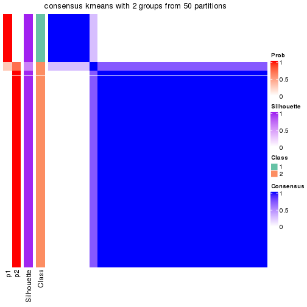</p>

</div>
<div id='tab-node-041-consensus-heatmap-2'>
<pre><code class="r">consensus_heatmap(res, k = 3)
</code></pre>

<p>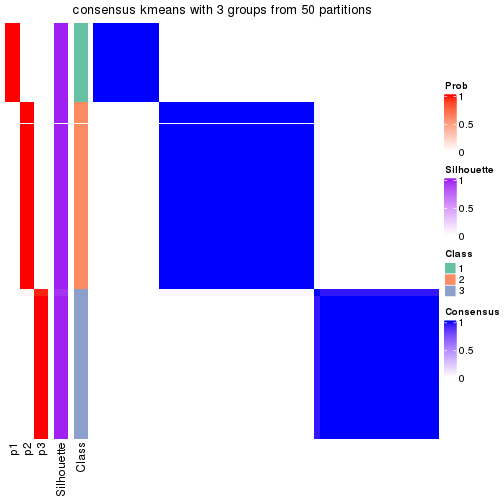</p>

</div>
<div id='tab-node-041-consensus-heatmap-3'>
<pre><code class="r">consensus_heatmap(res, k = 4)
</code></pre>

<p>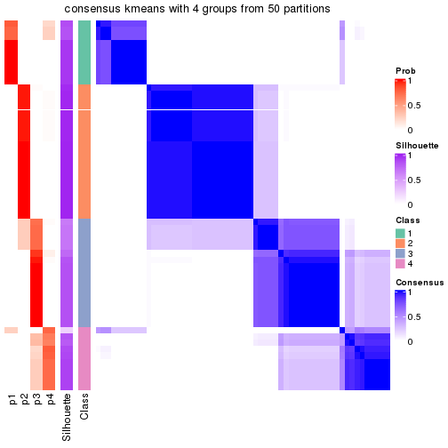</p>

</div>
<div id='tab-node-041-consensus-heatmap-4'>
<pre><code class="r">consensus_heatmap(res, k = 5)
</code></pre>

<p>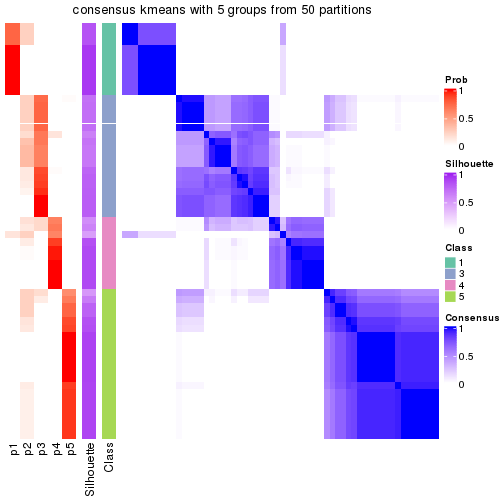</p>

</div>
<div id='tab-node-041-consensus-heatmap-5'>
<pre><code class="r">consensus_heatmap(res, k = 6)
</code></pre>

<p>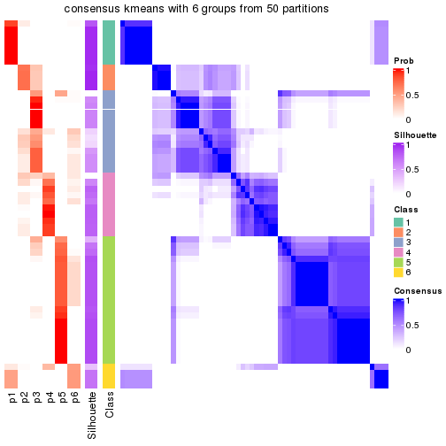</p>

</div>
<div id='tab-node-041-consensus-heatmap-6'>
<pre><code class="r">consensus_heatmap(res, k = 7)
</code></pre>

<p>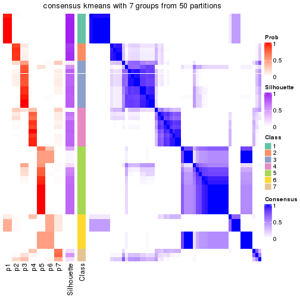</p>

</div>
<div id='tab-node-041-consensus-heatmap-7'>
<pre><code class="r">consensus_heatmap(res, k = 8)
</code></pre>

<p>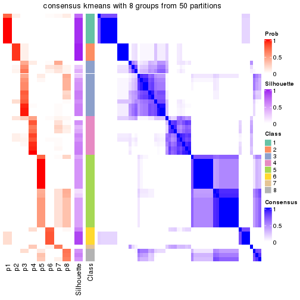</p>

</div>
</div>

Heatmaps for the membership of samples in all partitions to see how consistent they are:


<script>
$( function() {
	$( '#tabs-node-041-membership-heatmap' ).tabs();
} );
</script>
<div id='tabs-node-041-membership-heatmap'>
<ul>
<li><a href='#tab-node-041-membership-heatmap-1'>k = 2</a></li>
<li><a href='#tab-node-041-membership-heatmap-2'>k = 3</a></li>
<li><a href='#tab-node-041-membership-heatmap-3'>k = 4</a></li>
<li><a href='#tab-node-041-membership-heatmap-4'>k = 5</a></li>
<li><a href='#tab-node-041-membership-heatmap-5'>k = 6</a></li>
<li><a href='#tab-node-041-membership-heatmap-6'>k = 7</a></li>
<li><a href='#tab-node-041-membership-heatmap-7'>k = 8</a></li>
</ul>
<div id='tab-node-041-membership-heatmap-1'>
<pre><code class="r">membership_heatmap(res, k = 2)
</code></pre>

<p>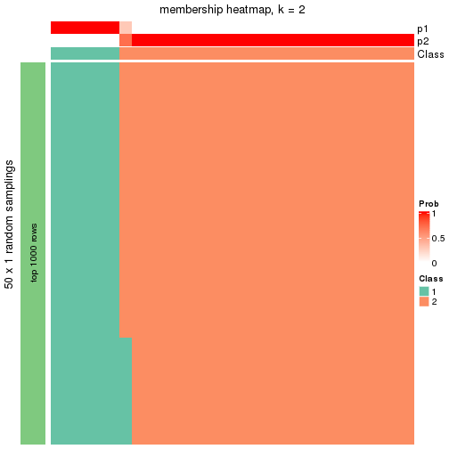</p>

</div>
<div id='tab-node-041-membership-heatmap-2'>
<pre><code class="r">membership_heatmap(res, k = 3)
</code></pre>

<p>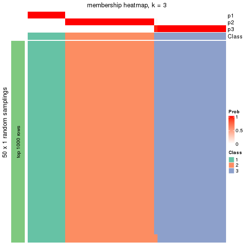</p>

</div>
<div id='tab-node-041-membership-heatmap-3'>
<pre><code class="r">membership_heatmap(res, k = 4)
</code></pre>

<p>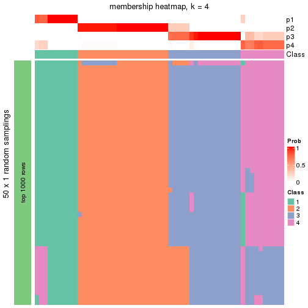</p>

</div>
<div id='tab-node-041-membership-heatmap-4'>
<pre><code class="r">membership_heatmap(res, k = 5)
</code></pre>

<p>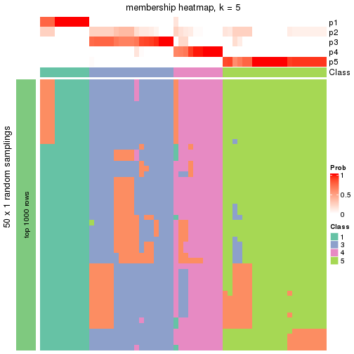</p>

</div>
<div id='tab-node-041-membership-heatmap-5'>
<pre><code class="r">membership_heatmap(res, k = 6)
</code></pre>

<p>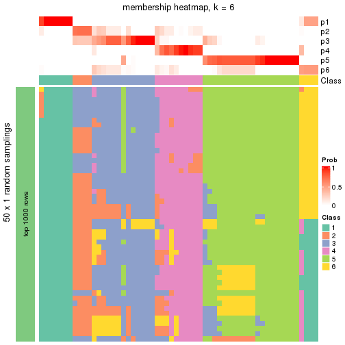</p>

</div>
<div id='tab-node-041-membership-heatmap-6'>
<pre><code class="r">membership_heatmap(res, k = 7)
</code></pre>

<p>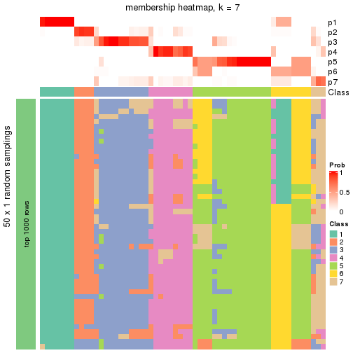</p>

</div>
<div id='tab-node-041-membership-heatmap-7'>
<pre><code class="r">membership_heatmap(res, k = 8)
</code></pre>

<p>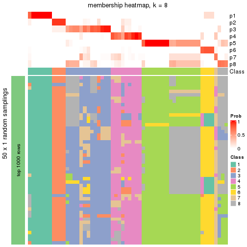</p>

</div>
</div>

As soon as the classes for columns are determined, the signatures
that are significantly different between subgroups can be looked for. 
Following are the heatmaps for signatures.


<script>
$( function() {
	$( '#tabs-node-041-get-signatures' ).tabs();
} );
</script>
<div id='tabs-node-041-get-signatures'>
<ul>
<li><a href='#tab-node-041-get-signatures-1'>k = 2</a></li>
<li><a href='#tab-node-041-get-signatures-2'>k = 3</a></li>
<li><a href='#tab-node-041-get-signatures-3'>k = 4</a></li>
<li><a href='#tab-node-041-get-signatures-4'>k = 5</a></li>
<li><a href='#tab-node-041-get-signatures-5'>k = 6</a></li>
<li><a href='#tab-node-041-get-signatures-6'>k = 7</a></li>
<li><a href='#tab-node-041-get-signatures-7'>k = 8</a></li>
</ul>
<div id='tab-node-041-get-signatures-1'>
<pre><code class="r">get_signatures(res, k = 2)
</code></pre>

<p>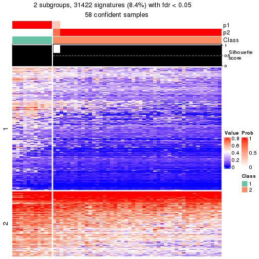</p>

</div>
<div id='tab-node-041-get-signatures-2'>
<pre><code class="r">get_signatures(res, k = 3)
</code></pre>

<p>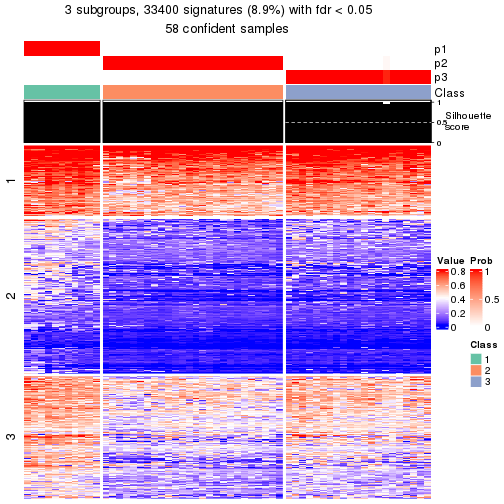</p>

</div>
<div id='tab-node-041-get-signatures-3'>
<pre><code class="r">get_signatures(res, k = 4)
</code></pre>

<p>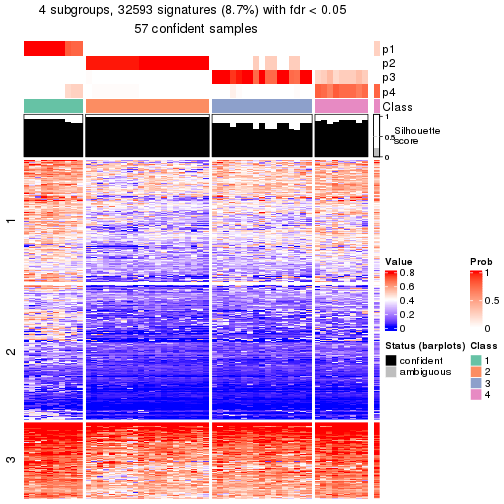</p>

</div>
<div id='tab-node-041-get-signatures-4'>
<pre><code class="r">get_signatures(res, k = 5)
</code></pre>

<p>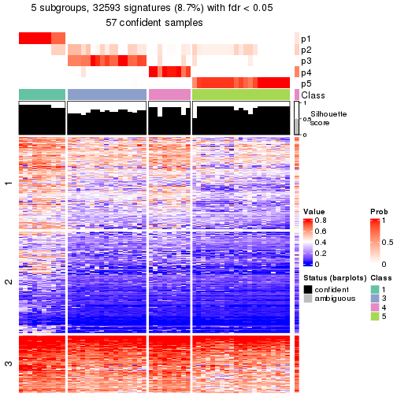</p>

</div>
<div id='tab-node-041-get-signatures-5'>
<pre><code class="r">get_signatures(res, k = 6)
</code></pre>

<p>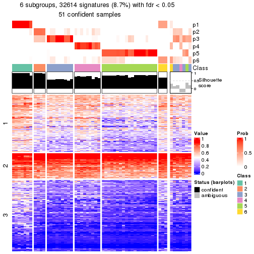</p>

</div>
<div id='tab-node-041-get-signatures-6'>
<pre><code class="r">get_signatures(res, k = 7)
</code></pre>

<p>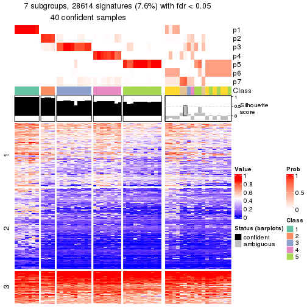</p>

</div>
<div id='tab-node-041-get-signatures-7'>
<pre><code class="r">get_signatures(res, k = 8)
</code></pre>

<p>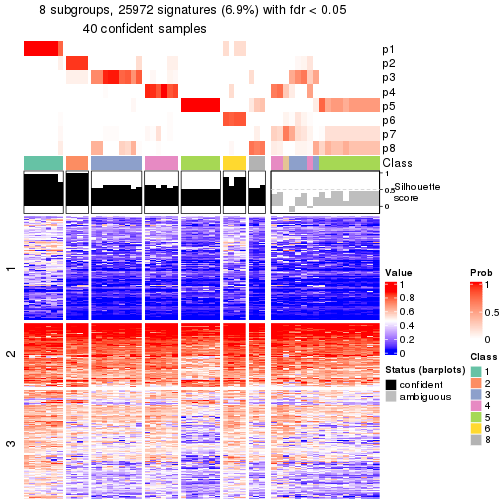</p>

</div>
</div>


Compare the overlap of signatures from different k:

```r
compare_signatures(res)
```

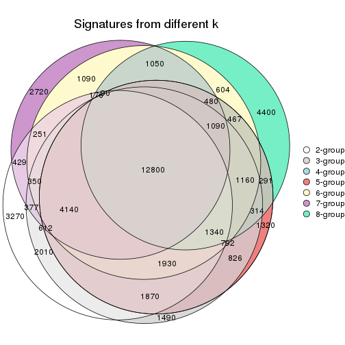

`get_signature()` returns a data frame invisibly. To get the list of signatures, the function
call should be assigned to a variable explicitly. In following code, if `plot` argument is set
to `FALSE`, no heatmap is plotted while only the differential analysis is performed.

```r
# code only for demonstration
tb = get_signature(res, k = ..., plot = FALSE)
```

An example of the output of `tb` is:

```
#>   which_row         fdr    mean_1    mean_2 scaled_mean_1 scaled_mean_2 km
#> 1        38 0.042760348  8.373488  9.131774    -0.5533452     0.5164555  1
#> 2        40 0.018707592  7.106213  8.469186    -0.6173731     0.5762149  1
#> 3        55 0.019134737 10.221463 11.207825    -0.6159697     0.5749050  1
#> 4        59 0.006059896  5.921854  7.869574    -0.6899429     0.6439467  1
#> 5        60 0.018055526  8.928898 10.211722    -0.6204761     0.5791110  1
#> 6        98 0.009384629 15.714769 14.887706     0.6635654    -0.6193277  2
...
```

The columns in `tb` are:

1. `which_row`: row indices corresponding to the input matrix.
2. `fdr`: FDR for the differential test. 
3. `mean_x`: The mean value in group x.
4. `scaled_mean_x`: The mean value in group x after rows are scaled.
5. `km`: Row groups if k-means clustering is applied to rows (which is done by automatically selecting number of clusters).

If there are too many signatures, `top_signatures = ...` can be set to only show the 
signatures with the highest FDRs:

```r
# code only for demonstration
# e.g. to show the top 500 most significant rows
tb = get_signature(res, k = ..., top_signatures = 500)
```

If the signatures are defined as these which are uniquely high in current group, `diff_method` argument
can be set to `"uniquely_high_in_one_group"`:

```r
# code only for demonstration
tb = get_signature(res, k = ..., diff_method = "uniquely_high_in_one_group")
```


UMAP plot which shows how samples are separated.


<script>
$( function() {
	$( '#tabs-node-041-dimension-reduction' ).tabs();
} );
</script>
<div id='tabs-node-041-dimension-reduction'>
<ul>
<li><a href='#tab-node-041-dimension-reduction-1'>k = 2</a></li>
<li><a href='#tab-node-041-dimension-reduction-2'>k = 3</a></li>
<li><a href='#tab-node-041-dimension-reduction-3'>k = 4</a></li>
<li><a href='#tab-node-041-dimension-reduction-4'>k = 5</a></li>
<li><a href='#tab-node-041-dimension-reduction-5'>k = 6</a></li>
<li><a href='#tab-node-041-dimension-reduction-6'>k = 7</a></li>
<li><a href='#tab-node-041-dimension-reduction-7'>k = 8</a></li>
</ul>
<div id='tab-node-041-dimension-reduction-1'>
<pre><code class="r">dimension_reduction(res, k = 2, method = &quot;UMAP&quot;)
</code></pre>

<p>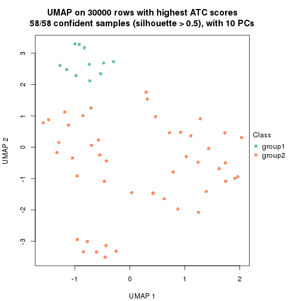</p>

</div>
<div id='tab-node-041-dimension-reduction-2'>
<pre><code class="r">dimension_reduction(res, k = 3, method = &quot;UMAP&quot;)
</code></pre>

<p>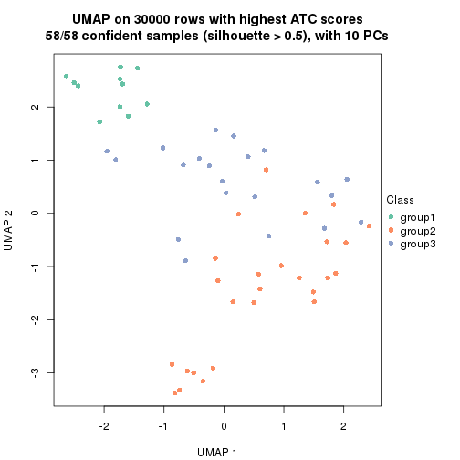</p>

</div>
<div id='tab-node-041-dimension-reduction-3'>
<pre><code class="r">dimension_reduction(res, k = 4, method = &quot;UMAP&quot;)
</code></pre>

<p>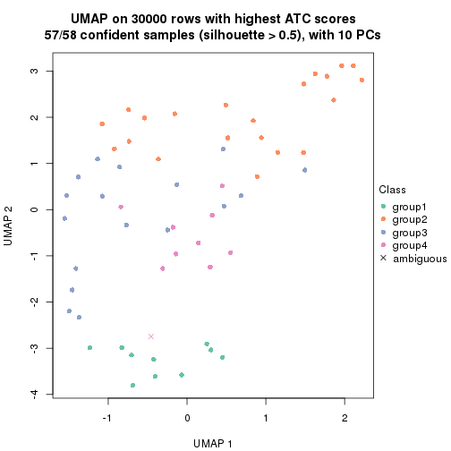</p>

</div>
<div id='tab-node-041-dimension-reduction-4'>
<pre><code class="r">dimension_reduction(res, k = 5, method = &quot;UMAP&quot;)
</code></pre>

<p>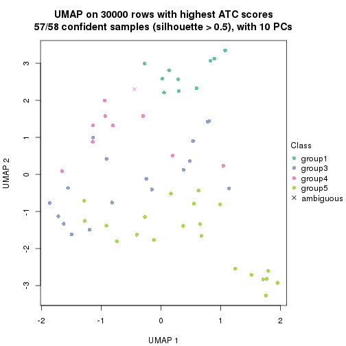</p>

</div>
<div id='tab-node-041-dimension-reduction-5'>
<pre><code class="r">dimension_reduction(res, k = 6, method = &quot;UMAP&quot;)
</code></pre>

<p>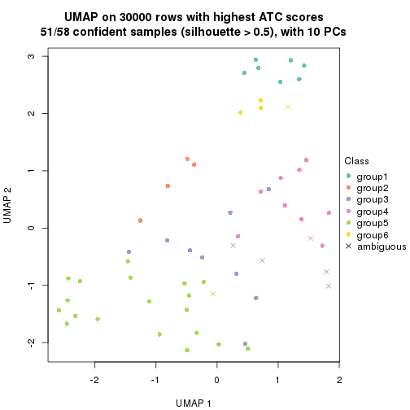</p>

</div>
<div id='tab-node-041-dimension-reduction-6'>
<pre><code class="r">dimension_reduction(res, k = 7, method = &quot;UMAP&quot;)
</code></pre>

<p>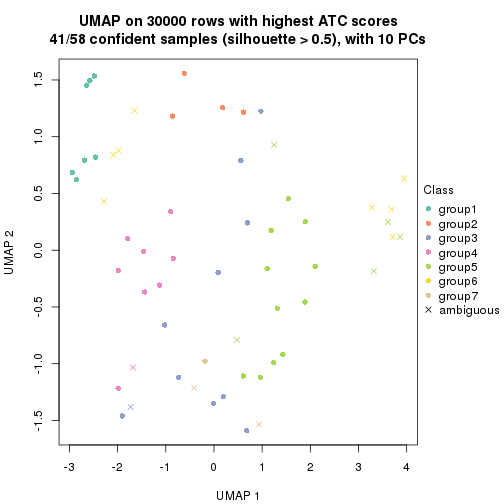</p>

</div>
<div id='tab-node-041-dimension-reduction-7'>
<pre><code class="r">dimension_reduction(res, k = 8, method = &quot;UMAP&quot;)
</code></pre>

<p>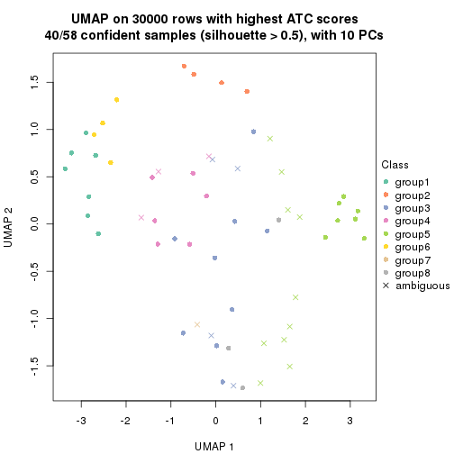</p>

</div>
</div>


Following heatmap shows how subgroups are split when increasing `k`:

```r
collect_classes(res)
```

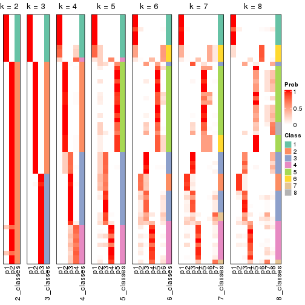


If matrix rows can be associated to genes, consider to use `functional_enrichment(res,
...)` to perform function enrichment for the signature genes. See [this vignette](https://jokergoo.github.io/cola_vignettes/functional_enrichment.html) for more detailed explanations.


 

---------------------------------------------------


### Node042


Parent node: [Node04](#Node04).
Child nodes: 
                Node0121-leaf
        ,
                Node0122-leaf
        ,
                Node0123-leaf
        ,
                Node0211-leaf
        ,
                [Node0212](#Node0212)
        ,
                Node0213-leaf
        ,
                [Node0221](#Node0221)
        ,
                Node0222-leaf
        ,
                Node0223-leaf
        ,
                [Node0231](#Node0231)
        ,
                Node0232-leaf
        ,
                Node0233-leaf
        ,
                Node0241-leaf
        ,
                Node0242-leaf
        ,
                Node0411-leaf
        ,
                Node0412-leaf
        ,
                Node0413-leaf
        ,
                Node0421-leaf
        ,
                Node0422-leaf
        ,
                Node0423-leaf
        ,
                Node0431-leaf
        ,
                Node0432-leaf
        ,
                Node0433-leaf
        ,
                Node0441-leaf
        ,
                Node0442-leaf
        ,
                Node0443-leaf
        ,
                Node0511-leaf
        ,
                [Node0512](#Node0512)
        ,
                Node0513-leaf
        ,
                Node0521-leaf
        ,
                Node0522-leaf
        ,
                Node0523-leaf
        .


The object with results only for a single top-value method and a single partitioning method 
can be extracted as:

```r
res = res_rh["042"]
```

A summary of `res` and all the functions that can be applied to it:

```r
res
```

```
#> A 'ConsensusPartition' object with k = 2, 3, 4, 5, 6, 7, 8.
#>   On a matrix with 30000 rows and 26 columns.
#>   Top rows (1000) are extracted by 'ATC' method.
#>   Subgroups are detected by 'kmeans' method.
#>   Performed in total 350 partitions by row resampling.
#>   Best k for subgroups seems to be 3.
#> 
#> Following methods can be applied to this 'ConsensusPartition' object:
#>  [1] "cola_report"             "collect_classes"         "collect_plots"          
#>  [4] "collect_stats"           "colnames"                "compare_partitions"     
#>  [7] "compare_signatures"      "consensus_heatmap"       "dimension_reduction"    
#> [10] "functional_enrichment"   "get_anno_col"            "get_anno"               
#> [13] "get_classes"             "get_consensus"           "get_matrix"             
#> [16] "get_membership"          "get_param"               "get_signatures"         
#> [19] "get_stats"               "is_best_k"               "is_stable_k"            
#> [22] "membership_heatmap"      "ncol"                    "nrow"                   
#> [25] "plot_ecdf"               "predict_classes"         "rownames"               
#> [28] "select_partition_number" "show"                    "suggest_best_k"         
#> [31] "test_to_known_factors"   "top_rows_heatmap"
```

`collect_plots()` function collects all the plots made from `res` for all `k` (number of subgroups)
into one single page to provide an easy and fast comparison between different `k`.

```r
collect_plots(res)
```

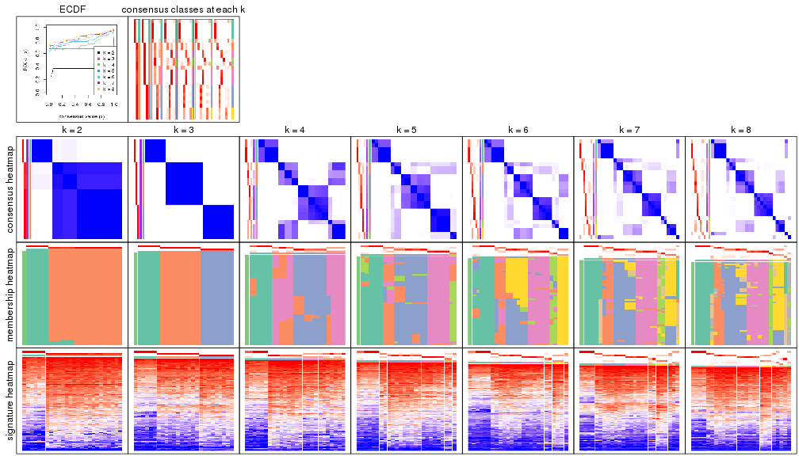

The plots are:

- The first row: a plot of the eCDF (empirical cumulative distribution
  function) curves of the consensus matrix for each `k` and the heatmap of
  predicted classes for each `k`.
- The second row: heatmaps of the consensus matrix for each `k`.
- The third row: heatmaps of the membership matrix for each `k`.
- The fouth row: heatmaps of the signatures for each `k`.

All the plots in panels can be made by individual functions and they are
plotted later in this section.

`select_partition_number()` produces several plots showing different
statistics for choosing "optimized" `k`. There are following statistics:

- eCDF curves of the consensus matrix for each `k`;
- 1-PAC. [The PAC score](https://en.wikipedia.org/wiki/Consensus_clustering#Over-interpretation_potential_of_consensus_clustering)
  measures the proportion of the ambiguous subgrouping.
- Mean silhouette score.
- Concordance. The mean probability of fiting the consensus subgroup labels in all
  partitions.
- Area increased. Denote $A_k$ as the area under the eCDF curve for current
  `k`, the area increased is defined as $A_k - A_{k-1}$.
- Rand index. The percent of pairs of samples that are both in a same cluster
  or both are not in a same cluster in the partition of k and k-1.
- Jaccard index. The ratio of pairs of samples are both in a same cluster in
  the partition of k and k-1 and the pairs of samples are both in a same
  cluster in the partition k or k-1.

The detailed explanations of these statistics can be found in [the _cola_
vignette](https://jokergoo.github.io/cola_vignettes/cola.html#toc_13).

Generally speaking, higher 1-PAC score, higher mean silhouette score or higher
concordance corresponds to better partition. Rand index and Jaccard index
measure how similar the current partition is compared to partition with `k-1`.
If they are too similar, we won't accept `k` is better than `k-1`.

```r
select_partition_number(res)
```

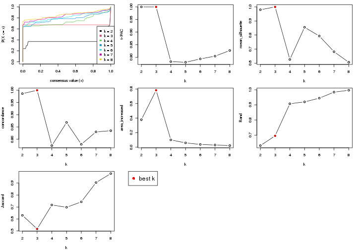

The numeric values for all these statistics can be obtained by `get_stats()`.

```r
get_stats(res)
```

```
#>   k 1-PAC mean_silhouette concordance area_increased  Rand Jaccard
#> 2 2 1.000           0.980       0.986         0.3782 0.631   0.631
#> 3 3 1.000           1.000       1.000         0.7827 0.695   0.517
#> 4 4 0.783           0.626       0.774         0.1001 0.908   0.717
#> 5 5 0.780           0.855       0.868         0.0589 0.920   0.698
#> 6 6 0.793           0.793       0.779         0.0378 0.945   0.743
#> 7 7 0.804           0.681       0.830         0.0294 0.985   0.904
#> 8 8 0.827           0.606       0.835         0.0217 0.997   0.979
```

`suggest_best_k()` suggests the best $k$ based on these statistics. The rules are as follows:

- All $k$ with Jaccard index larger than 0.95 are removed because increasing
  $k$ does not provide enough extra information. If all $k$ are removed, it is
  marked as no subgroup is detected.
- For all $k$ with 1-PAC score larger than 0.9, the maximal $k$ is taken as
  the best $k$, and other $k$ are marked as optional $k$.
- If it does not fit the second rule. The $k$ with the maximal vote of the
  highest 1-PAC score, highest mean silhouette, and highest concordance is
  taken as the best $k$.

```r
suggest_best_k(res)
```

```
#> [1] 3
#> attr(,"optional")
#> [1] 2
```

There is also optional best $k$ = 2 that is worth to check.

Following is the table of the partitions (You need to click the **show/hide
code output** link to see it). The membership matrix (columns with name `p*`)
is inferred by
[`clue::cl_consensus()`](https://www.rdocumentation.org/link/cl_consensus?package=clue)
function with the `SE` method. Basically the value in the membership matrix
represents the probability to belong to a certain group. The finall subgroup
label for an item is determined with the group with highest probability it
belongs to.

In `get_classes()` function, the entropy is calculated from the membership
matrix and the silhouette score is calculated from the consensus matrix.


<script>
$( function() {
	$( '#tabs-node-042-get-classes' ).tabs();
} );
</script>
<div id='tabs-node-042-get-classes'>
<ul>
<li><a href='#tab-node-042-get-classes-1'>k = 2</a></li>
<li><a href='#tab-node-042-get-classes-2'>k = 3</a></li>
<li><a href='#tab-node-042-get-classes-3'>k = 4</a></li>
<li><a href='#tab-node-042-get-classes-4'>k = 5</a></li>
<li><a href='#tab-node-042-get-classes-5'>k = 6</a></li>
<li><a href='#tab-node-042-get-classes-6'>k = 7</a></li>
<li><a href='#tab-node-042-get-classes-7'>k = 8</a></li>
</ul>

<div id='tab-node-042-get-classes-1'>
<p><a id='tab-node-042-get-classes-1-a' style='color:#0366d6' href='#'>show/hide code output</a></p>
<pre><code class="r">cbind(get_classes(res, k = 2), get_membership(res, k = 2))
</code></pre>

<pre><code>#&gt;                 class entropy silhouette   p1   p2
#&gt; TCGA.EJ.5509.01     2   0.000      0.981 0.00 1.00
#&gt; TCGA.KK.A8IG.01     2   0.327      0.955 0.06 0.94
#&gt; TCGA.VP.AA1N.01     2   0.000      0.981 0.00 1.00
#&gt; TCGA.J9.A8CP.01     2   0.242      0.967 0.04 0.96
#&gt; TCGA.EJ.5514.01     2   0.242      0.967 0.04 0.96
#&gt; TCGA.V1.A8MG.01     2   0.000      0.981 0.00 1.00
#&gt; TCGA.HC.8265.01     1   0.000      1.000 1.00 0.00
#&gt; TCGA.EJ.7218.01     2   0.327      0.955 0.06 0.94
#&gt; TCGA.QU.A6IO.01     2   0.000      0.981 0.00 1.00
#&gt; TCGA.YL.A8SO.01     2   0.000      0.981 0.00 1.00
#&gt; TCGA.ZG.A9M4.01     1   0.000      1.000 1.00 0.00
#&gt; TCGA.V1.A9Z9.01     2   0.000      0.981 0.00 1.00
#&gt; TCGA.G9.7521.01     1   0.000      1.000 1.00 0.00
#&gt; TCGA.YL.A8HO.01     2   0.000      0.981 0.00 1.00
#&gt; TCGA.HC.7210.01     2   0.000      0.981 0.00 1.00
#&gt; TCGA.KC.A7F3.01     2   0.327      0.955 0.06 0.94
#&gt; TCGA.YL.A8S8.01     2   0.000      0.981 0.00 1.00
#&gt; TCGA.EJ.A8FN.01     1   0.000      1.000 1.00 0.00
#&gt; TCGA.ZG.A9N3.01     1   0.000      1.000 1.00 0.00
#&gt; TCGA.VN.A88O.01     2   0.000      0.981 0.00 1.00
#&gt; TCGA.FC.7961.01     2   0.000      0.981 0.00 1.00
#&gt; TCGA.V1.A8MU.01     2   0.327      0.955 0.06 0.94
#&gt; TCGA.KK.A6E5.01     2   0.000      0.981 0.00 1.00
#&gt; TCGA.EJ.A7NM.01     2   0.000      0.981 0.00 1.00
#&gt; TCGA.V1.A8WV.01     1   0.000      1.000 1.00 0.00
#&gt; TCGA.V1.A9OX.01     2   0.242      0.967 0.04 0.96
</code></pre>

<script>
$('#tab-node-042-get-classes-1-a').parent().next().next().hide();
$('#tab-node-042-get-classes-1-a').click(function(){
  $('#tab-node-042-get-classes-1-a').parent().next().next().toggle();
  return(false);
});
</script>
</div>

<div id='tab-node-042-get-classes-2'>
<p><a id='tab-node-042-get-classes-2-a' style='color:#0366d6' href='#'>show/hide code output</a></p>
<pre><code class="r">cbind(get_classes(res, k = 3), get_membership(res, k = 3))
</code></pre>

<pre><code>#&gt;                 class entropy silhouette p1 p2 p3
#&gt; TCGA.EJ.5509.01     3       0          1  0  0  1
#&gt; TCGA.KK.A8IG.01     2       0          1  0  1  0
#&gt; TCGA.VP.AA1N.01     2       0          1  0  1  0
#&gt; TCGA.J9.A8CP.01     2       0          1  0  1  0
#&gt; TCGA.EJ.5514.01     2       0          1  0  1  0
#&gt; TCGA.V1.A8MG.01     3       0          1  0  0  1
#&gt; TCGA.HC.8265.01     1       0          1  1  0  0
#&gt; TCGA.EJ.7218.01     2       0          1  0  1  0
#&gt; TCGA.QU.A6IO.01     3       0          1  0  0  1
#&gt; TCGA.YL.A8SO.01     3       0          1  0  0  1
#&gt; TCGA.ZG.A9M4.01     1       0          1  1  0  0
#&gt; TCGA.V1.A9Z9.01     3       0          1  0  0  1
#&gt; TCGA.G9.7521.01     1       0          1  1  0  0
#&gt; TCGA.YL.A8HO.01     3       0          1  0  0  1
#&gt; TCGA.HC.7210.01     2       0          1  0  1  0
#&gt; TCGA.KC.A7F3.01     2       0          1  0  1  0
#&gt; TCGA.YL.A8S8.01     3       0          1  0  0  1
#&gt; TCGA.EJ.A8FN.01     1       0          1  1  0  0
#&gt; TCGA.ZG.A9N3.01     1       0          1  1  0  0
#&gt; TCGA.VN.A88O.01     3       0          1  0  0  1
#&gt; TCGA.FC.7961.01     3       0          1  0  0  1
#&gt; TCGA.V1.A8MU.01     2       0          1  0  1  0
#&gt; TCGA.KK.A6E5.01     2       0          1  0  1  0
#&gt; TCGA.EJ.A7NM.01     2       0          1  0  1  0
#&gt; TCGA.V1.A8WV.01     1       0          1  1  0  0
#&gt; TCGA.V1.A9OX.01     2       0          1  0  1  0
</code></pre>

<script>
$('#tab-node-042-get-classes-2-a').parent().next().next().hide();
$('#tab-node-042-get-classes-2-a').click(function(){
  $('#tab-node-042-get-classes-2-a').parent().next().next().toggle();
  return(false);
});
</script>
</div>

<div id='tab-node-042-get-classes-3'>
<p><a id='tab-node-042-get-classes-3-a' style='color:#0366d6' href='#'>show/hide code output</a></p>
<pre><code class="r">cbind(get_classes(res, k = 4), get_membership(res, k = 4))
</code></pre>

<pre><code>#&gt;                 class entropy silhouette  p1   p2   p3   p4
#&gt; TCGA.EJ.5509.01     3   0.000      0.847 0.0 0.00 1.00 0.00
#&gt; TCGA.KK.A8IG.01     2   0.485     -0.271 0.0 0.60 0.00 0.40
#&gt; TCGA.VP.AA1N.01     2   0.441      0.238 0.0 0.70 0.00 0.30
#&gt; TCGA.J9.A8CP.01     4   0.499      0.568 0.0 0.48 0.00 0.52
#&gt; TCGA.EJ.5514.01     2   0.000      0.399 0.0 1.00 0.00 0.00
#&gt; TCGA.V1.A8MG.01     3   0.380      0.909 0.0 0.00 0.78 0.22
#&gt; TCGA.HC.8265.01     1   0.361      0.879 0.8 0.00 0.00 0.20
#&gt; TCGA.EJ.7218.01     4   0.499      0.568 0.0 0.48 0.00 0.52
#&gt; TCGA.QU.A6IO.01     3   0.428      0.890 0.0 0.00 0.72 0.28
#&gt; TCGA.YL.A8SO.01     3   0.361      0.910 0.0 0.00 0.80 0.20
#&gt; TCGA.ZG.A9M4.01     1   0.000      0.941 1.0 0.00 0.00 0.00
#&gt; TCGA.V1.A9Z9.01     3   0.428      0.890 0.0 0.00 0.72 0.28
#&gt; TCGA.G9.7521.01     1   0.000      0.941 1.0 0.00 0.00 0.00
#&gt; TCGA.YL.A8HO.01     3   0.361      0.910 0.0 0.00 0.80 0.20
#&gt; TCGA.HC.7210.01     2   0.441      0.238 0.0 0.70 0.00 0.30
#&gt; TCGA.KC.A7F3.01     4   0.499      0.568 0.0 0.48 0.00 0.52
#&gt; TCGA.YL.A8S8.01     3   0.000      0.847 0.0 0.00 1.00 0.00
#&gt; TCGA.EJ.A8FN.01     1   0.361      0.879 0.8 0.00 0.00 0.20
#&gt; TCGA.ZG.A9N3.01     1   0.000      0.941 1.0 0.00 0.00 0.00
#&gt; TCGA.VN.A88O.01     3   0.398      0.905 0.0 0.00 0.76 0.24
#&gt; TCGA.FC.7961.01     3   0.000      0.847 0.0 0.00 1.00 0.00
#&gt; TCGA.V1.A8MU.01     2   0.485     -0.271 0.0 0.60 0.00 0.40
#&gt; TCGA.KK.A6E5.01     4   0.498     -0.202 0.0 0.46 0.00 0.54
#&gt; TCGA.EJ.A7NM.01     2   0.000      0.399 0.0 1.00 0.00 0.00
#&gt; TCGA.V1.A8WV.01     1   0.000      0.941 1.0 0.00 0.00 0.00
#&gt; TCGA.V1.A9OX.01     4   0.499      0.568 0.0 0.48 0.00 0.52
</code></pre>

<script>
$('#tab-node-042-get-classes-3-a').parent().next().next().hide();
$('#tab-node-042-get-classes-3-a').click(function(){
  $('#tab-node-042-get-classes-3-a').parent().next().next().toggle();
  return(false);
});
</script>
</div>

<div id='tab-node-042-get-classes-4'>
<p><a id='tab-node-042-get-classes-4-a' style='color:#0366d6' href='#'>show/hide code output</a></p>
<pre><code class="r">cbind(get_classes(res, k = 5), get_membership(res, k = 5))
</code></pre>

<pre><code>#&gt;                 class entropy silhouette   p1   p2   p3   p4   p5
#&gt; TCGA.EJ.5509.01     3  0.4818      0.755 0.00 0.18 0.72 0.00 0.10
#&gt; TCGA.KK.A8IG.01     4  0.0609      0.977 0.00 0.02 0.00 0.98 0.00
#&gt; TCGA.VP.AA1N.01     2  0.3895      0.738 0.00 0.68 0.00 0.32 0.00
#&gt; TCGA.J9.A8CP.01     4  0.0000      0.988 0.00 0.00 0.00 1.00 0.00
#&gt; TCGA.EJ.5514.01     5  0.5599      0.935 0.00 0.26 0.00 0.12 0.62
#&gt; TCGA.V1.A8MG.01     3  0.0609      0.847 0.00 0.00 0.98 0.00 0.02
#&gt; TCGA.HC.8265.01     1  0.4263      0.812 0.76 0.06 0.00 0.00 0.18
#&gt; TCGA.EJ.7218.01     4  0.0000      0.988 0.00 0.00 0.00 1.00 0.00
#&gt; TCGA.QU.A6IO.01     3  0.2616      0.792 0.00 0.10 0.88 0.00 0.02
#&gt; TCGA.YL.A8SO.01     3  0.0609      0.848 0.00 0.00 0.98 0.00 0.02
#&gt; TCGA.ZG.A9M4.01     1  0.0000      0.914 1.00 0.00 0.00 0.00 0.00
#&gt; TCGA.V1.A9Z9.01     3  0.2616      0.792 0.00 0.10 0.88 0.00 0.02
#&gt; TCGA.G9.7521.01     1  0.0000      0.914 1.00 0.00 0.00 0.00 0.00
#&gt; TCGA.YL.A8HO.01     3  0.0609      0.848 0.00 0.00 0.98 0.00 0.02
#&gt; TCGA.HC.7210.01     2  0.3895      0.738 0.00 0.68 0.00 0.32 0.00
#&gt; TCGA.KC.A7F3.01     4  0.0000      0.988 0.00 0.00 0.00 1.00 0.00
#&gt; TCGA.YL.A8S8.01     3  0.5050      0.746 0.00 0.18 0.70 0.00 0.12
#&gt; TCGA.EJ.A8FN.01     1  0.4676      0.799 0.74 0.12 0.00 0.00 0.14
#&gt; TCGA.ZG.A9N3.01     1  0.0000      0.914 1.00 0.00 0.00 0.00 0.00
#&gt; TCGA.VN.A88O.01     3  0.0609      0.847 0.00 0.00 0.98 0.00 0.02
#&gt; TCGA.FC.7961.01     3  0.4818      0.755 0.00 0.18 0.72 0.00 0.10
#&gt; TCGA.V1.A8MU.01     4  0.0609      0.977 0.00 0.02 0.00 0.98 0.00
#&gt; TCGA.KK.A6E5.01     2  0.5555      0.487 0.00 0.64 0.22 0.14 0.00
#&gt; TCGA.EJ.A7NM.01     5  0.5263      0.936 0.00 0.24 0.00 0.10 0.66
#&gt; TCGA.V1.A8WV.01     1  0.0000      0.914 1.00 0.00 0.00 0.00 0.00
#&gt; TCGA.V1.A9OX.01     4  0.0000      0.988 0.00 0.00 0.00 1.00 0.00
</code></pre>

<script>
$('#tab-node-042-get-classes-4-a').parent().next().next().hide();
$('#tab-node-042-get-classes-4-a').click(function(){
  $('#tab-node-042-get-classes-4-a').parent().next().next().toggle();
  return(false);
});
</script>
</div>

<div id='tab-node-042-get-classes-5'>
<p><a id='tab-node-042-get-classes-5-a' style='color:#0366d6' href='#'>show/hide code output</a></p>
<pre><code class="r">cbind(get_classes(res, k = 6), get_membership(res, k = 6))
</code></pre>

<pre><code>#&gt;                 class entropy silhouette   p1   p2   p3   p4   p5   p6
#&gt; TCGA.EJ.5509.01     6  0.3851      1.000 0.00 0.00 0.46 0.00 0.00 0.54
#&gt; TCGA.KK.A8IG.01     4  0.2581      0.860 0.00 0.00 0.00 0.86 0.12 0.02
#&gt; TCGA.VP.AA1N.01     2  0.3819      0.658 0.00 0.70 0.00 0.28 0.00 0.02
#&gt; TCGA.J9.A8CP.01     4  0.0937      0.914 0.00 0.00 0.00 0.96 0.00 0.04
#&gt; TCGA.EJ.5514.01     5  0.2474      0.681 0.00 0.04 0.00 0.08 0.88 0.00
#&gt; TCGA.V1.A8MG.01     3  0.1267      0.753 0.00 0.00 0.94 0.00 0.00 0.06
#&gt; TCGA.HC.8265.01     1  0.4727      0.703 0.66 0.10 0.00 0.00 0.00 0.24
#&gt; TCGA.EJ.7218.01     4  0.0547      0.918 0.00 0.00 0.00 0.98 0.00 0.02
#&gt; TCGA.QU.A6IO.01     3  0.1267      0.755 0.00 0.06 0.94 0.00 0.00 0.00
#&gt; TCGA.YL.A8SO.01     3  0.3942      0.628 0.00 0.04 0.80 0.00 0.06 0.10
#&gt; TCGA.ZG.A9M4.01     1  0.0000      0.874 1.00 0.00 0.00 0.00 0.00 0.00
#&gt; TCGA.V1.A9Z9.01     3  0.1267      0.755 0.00 0.06 0.94 0.00 0.00 0.00
#&gt; TCGA.G9.7521.01     1  0.0000      0.874 1.00 0.00 0.00 0.00 0.00 0.00
#&gt; TCGA.YL.A8HO.01     3  0.3942      0.628 0.00 0.04 0.80 0.00 0.06 0.10
#&gt; TCGA.HC.7210.01     2  0.3309      0.661 0.00 0.72 0.00 0.28 0.00 0.00
#&gt; TCGA.KC.A7F3.01     4  0.0000      0.922 0.00 0.00 0.00 1.00 0.00 0.00
#&gt; TCGA.YL.A8S8.01     6  0.3851      1.000 0.00 0.00 0.46 0.00 0.00 0.54
#&gt; TCGA.EJ.A8FN.01     1  0.5545      0.703 0.66 0.14 0.00 0.00 0.06 0.14
#&gt; TCGA.ZG.A9N3.01     1  0.0000      0.874 1.00 0.00 0.00 0.00 0.00 0.00
#&gt; TCGA.VN.A88O.01     3  0.0000      0.775 0.00 0.00 1.00 0.00 0.00 0.00
#&gt; TCGA.FC.7961.01     6  0.3851      1.000 0.00 0.00 0.46 0.00 0.00 0.54
#&gt; TCGA.V1.A8MU.01     4  0.2048      0.865 0.00 0.00 0.00 0.88 0.12 0.00
#&gt; TCGA.KK.A6E5.01     2  0.4873      0.336 0.00 0.52 0.42 0.06 0.00 0.00
#&gt; TCGA.EJ.A7NM.01     5  0.5390      0.690 0.00 0.18 0.00 0.02 0.64 0.16
#&gt; TCGA.V1.A8WV.01     1  0.0000      0.874 1.00 0.00 0.00 0.00 0.00 0.00
#&gt; TCGA.V1.A9OX.01     4  0.0000      0.922 0.00 0.00 0.00 1.00 0.00 0.00
</code></pre>

<script>
$('#tab-node-042-get-classes-5-a').parent().next().next().hide();
$('#tab-node-042-get-classes-5-a').click(function(){
  $('#tab-node-042-get-classes-5-a').parent().next().next().toggle();
  return(false);
});
</script>
</div>

<div id='tab-node-042-get-classes-6'>
<p><a id='tab-node-042-get-classes-6-a' style='color:#0366d6' href='#'>show/hide code output</a></p>
<pre><code class="r">cbind(get_classes(res, k = 7), get_membership(res, k = 7))
</code></pre>

<pre><code>#&gt;                 class entropy silhouette   p1   p2   p3   p4   p5   p6   p7
#&gt; TCGA.EJ.5509.01     6  0.3047      0.942 0.00 0.00 0.28 0.00 0.00 0.72 0.00
#&gt; TCGA.KK.A8IG.01     4  0.2278      0.898 0.00 0.00 0.00 0.88 0.08 0.04 0.00
#&gt; TCGA.VP.AA1N.01     2  0.2081      0.688 0.00 0.86 0.00 0.14 0.00 0.00 0.00
#&gt; TCGA.J9.A8CP.01     4  0.0863      0.936 0.00 0.00 0.00 0.96 0.00 0.04 0.00
#&gt; TCGA.EJ.5514.01     5  0.0504      0.583 0.00 0.02 0.00 0.00 0.98 0.00 0.00
#&gt; TCGA.V1.A8MG.01     3  0.2572      0.684 0.00 0.00 0.80 0.00 0.00 0.20 0.00
#&gt; TCGA.HC.8265.01     1  0.5837     -0.812 0.48 0.06 0.00 0.00 0.02 0.06 0.38
#&gt; TCGA.EJ.7218.01     4  0.0504      0.940 0.00 0.00 0.00 0.98 0.00 0.02 0.00
#&gt; TCGA.QU.A6IO.01     3  0.0504      0.747 0.00 0.02 0.98 0.00 0.00 0.00 0.00
#&gt; TCGA.YL.A8SO.01     3  0.4033      0.647 0.00 0.00 0.70 0.00 0.00 0.22 0.08
#&gt; TCGA.ZG.A9M4.01     1  0.0000      0.757 1.00 0.00 0.00 0.00 0.00 0.00 0.00
#&gt; TCGA.V1.A9Z9.01     3  0.0504      0.747 0.00 0.02 0.98 0.00 0.00 0.00 0.00
#&gt; TCGA.G9.7521.01     1  0.0000      0.757 1.00 0.00 0.00 0.00 0.00 0.00 0.00
#&gt; TCGA.YL.A8HO.01     3  0.4033      0.647 0.00 0.00 0.70 0.00 0.00 0.22 0.08
#&gt; TCGA.HC.7210.01     2  0.2259      0.687 0.00 0.84 0.00 0.16 0.00 0.00 0.00
#&gt; TCGA.KC.A7F3.01     4  0.0000      0.944 0.00 0.00 0.00 1.00 0.00 0.00 0.00
#&gt; TCGA.YL.A8S8.01     6  0.4569      0.886 0.00 0.02 0.28 0.00 0.00 0.64 0.06
#&gt; TCGA.EJ.A8FN.01     7  0.3546      0.000 0.46 0.00 0.00 0.00 0.00 0.00 0.54
#&gt; TCGA.ZG.A9N3.01     1  0.0000      0.757 1.00 0.00 0.00 0.00 0.00 0.00 0.00
#&gt; TCGA.VN.A88O.01     3  0.0000      0.752 0.00 0.00 1.00 0.00 0.00 0.00 0.00
#&gt; TCGA.FC.7961.01     6  0.3047      0.942 0.00 0.00 0.28 0.00 0.00 0.72 0.00
#&gt; TCGA.V1.A8MU.01     4  0.1928      0.903 0.00 0.00 0.00 0.90 0.08 0.02 0.00
#&gt; TCGA.KK.A6E5.01     2  0.3943      0.398 0.00 0.56 0.42 0.02 0.00 0.00 0.00
#&gt; TCGA.EJ.A7NM.01     5  0.6194      0.583 0.00 0.08 0.00 0.00 0.44 0.14 0.34
#&gt; TCGA.V1.A8WV.01     1  0.0000      0.757 1.00 0.00 0.00 0.00 0.00 0.00 0.00
#&gt; TCGA.V1.A9OX.01     4  0.0000      0.944 0.00 0.00 0.00 1.00 0.00 0.00 0.00
</code></pre>

<script>
$('#tab-node-042-get-classes-6-a').parent().next().next().hide();
$('#tab-node-042-get-classes-6-a').click(function(){
  $('#tab-node-042-get-classes-6-a').parent().next().next().toggle();
  return(false);
});
</script>
</div>

<div id='tab-node-042-get-classes-7'>
<p><a id='tab-node-042-get-classes-7-a' style='color:#0366d6' href='#'>show/hide code output</a></p>
<pre><code class="r">cbind(get_classes(res, k = 8), get_membership(res, k = 8))
</code></pre>

<pre><code>#&gt;                 class entropy silhouette   p1   p2   p3   p4   p5   p6   p7   p8
#&gt; TCGA.EJ.5509.01     6  0.3318      0.884 0.00 0.00 0.46 0.00 0.00 0.54 0.00 0.00
#&gt; TCGA.KK.A8IG.01     4  0.3102      0.854 0.00 0.00 0.00 0.82 0.02 0.08 0.08 0.00
#&gt; TCGA.VP.AA1N.01     2  0.3262      0.641 0.00 0.82 0.00 0.02 0.00 0.04 0.02 0.10
#&gt; TCGA.J9.A8CP.01     4  0.2532      0.892 0.00 0.04 0.00 0.88 0.00 0.04 0.02 0.02
#&gt; TCGA.EJ.5514.01     5  0.0000      0.000 0.00 0.00 0.00 0.00 1.00 0.00 0.00 0.00
#&gt; TCGA.V1.A8MG.01     3  0.0000      0.594 0.00 0.00 1.00 0.00 0.00 0.00 0.00 0.00
#&gt; TCGA.HC.8265.01     1  0.5753     -0.755 0.40 0.00 0.00 0.00 0.00 0.06 0.38 0.16
#&gt; TCGA.EJ.7218.01     4  0.0941      0.925 0.00 0.00 0.00 0.96 0.00 0.02 0.00 0.02
#&gt; TCGA.QU.A6IO.01     3  0.4428      0.692 0.00 0.02 0.72 0.00 0.00 0.08 0.14 0.04
#&gt; TCGA.YL.A8SO.01     3  0.2224      0.536 0.00 0.00 0.86 0.00 0.00 0.02 0.12 0.00
#&gt; TCGA.ZG.A9M4.01     1  0.0000      0.757 1.00 0.00 0.00 0.00 0.00 0.00 0.00 0.00
#&gt; TCGA.V1.A9Z9.01     3  0.4428      0.692 0.00 0.02 0.72 0.00 0.00 0.08 0.14 0.04
#&gt; TCGA.G9.7521.01     1  0.0000      0.757 1.00 0.00 0.00 0.00 0.00 0.00 0.00 0.00
#&gt; TCGA.YL.A8HO.01     3  0.2404      0.526 0.00 0.00 0.84 0.00 0.00 0.02 0.14 0.00
#&gt; TCGA.HC.7210.01     2  0.0471      0.670 0.00 0.98 0.00 0.02 0.00 0.00 0.00 0.00
#&gt; TCGA.KC.A7F3.01     4  0.0000      0.932 0.00 0.00 0.00 1.00 0.00 0.00 0.00 0.00
#&gt; TCGA.YL.A8S8.01     6  0.2938      0.778 0.00 0.00 0.30 0.00 0.00 0.70 0.00 0.00
#&gt; TCGA.EJ.A8FN.01     7  0.3193      0.000 0.38 0.00 0.00 0.00 0.00 0.00 0.62 0.00
#&gt; TCGA.ZG.A9N3.01     1  0.0000      0.757 1.00 0.00 0.00 0.00 0.00 0.00 0.00 0.00
#&gt; TCGA.VN.A88O.01     3  0.4684      0.688 0.00 0.02 0.70 0.00 0.00 0.08 0.14 0.06
#&gt; TCGA.FC.7961.01     6  0.3318      0.884 0.00 0.00 0.46 0.00 0.00 0.54 0.00 0.00
#&gt; TCGA.V1.A8MU.01     4  0.1275      0.915 0.00 0.00 0.00 0.94 0.02 0.04 0.00 0.00
#&gt; TCGA.KK.A6E5.01     2  0.5352      0.462 0.00 0.64 0.12 0.00 0.00 0.06 0.14 0.04
#&gt; TCGA.EJ.A7NM.01     8  0.3083      0.000 0.00 0.00 0.00 0.00 0.34 0.00 0.00 0.66
#&gt; TCGA.V1.A8WV.01     1  0.0000      0.757 1.00 0.00 0.00 0.00 0.00 0.00 0.00 0.00
#&gt; TCGA.V1.A9OX.01     4  0.0000      0.932 0.00 0.00 0.00 1.00 0.00 0.00 0.00 0.00
</code></pre>

<script>
$('#tab-node-042-get-classes-7-a').parent().next().next().hide();
$('#tab-node-042-get-classes-7-a').click(function(){
  $('#tab-node-042-get-classes-7-a').parent().next().next().toggle();
  return(false);
});
</script>
</div>
</div>

Heatmaps for the consensus matrix. It visualizes the probability of two
samples to be in a same group.


<script>
$( function() {
	$( '#tabs-node-042-consensus-heatmap' ).tabs();
} );
</script>
<div id='tabs-node-042-consensus-heatmap'>
<ul>
<li><a href='#tab-node-042-consensus-heatmap-1'>k = 2</a></li>
<li><a href='#tab-node-042-consensus-heatmap-2'>k = 3</a></li>
<li><a href='#tab-node-042-consensus-heatmap-3'>k = 4</a></li>
<li><a href='#tab-node-042-consensus-heatmap-4'>k = 5</a></li>
<li><a href='#tab-node-042-consensus-heatmap-5'>k = 6</a></li>
<li><a href='#tab-node-042-consensus-heatmap-6'>k = 7</a></li>
<li><a href='#tab-node-042-consensus-heatmap-7'>k = 8</a></li>
</ul>
<div id='tab-node-042-consensus-heatmap-1'>
<pre><code class="r">consensus_heatmap(res, k = 2)
</code></pre>

<p>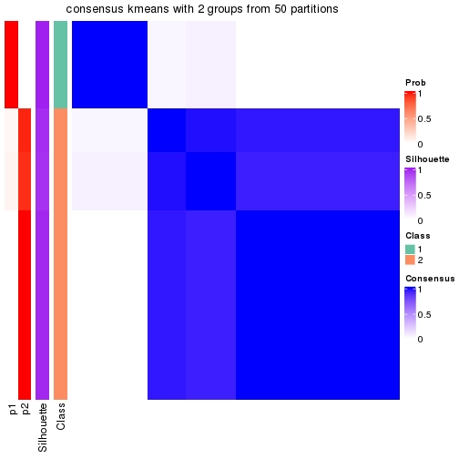</p>

</div>
<div id='tab-node-042-consensus-heatmap-2'>
<pre><code class="r">consensus_heatmap(res, k = 3)
</code></pre>

<p>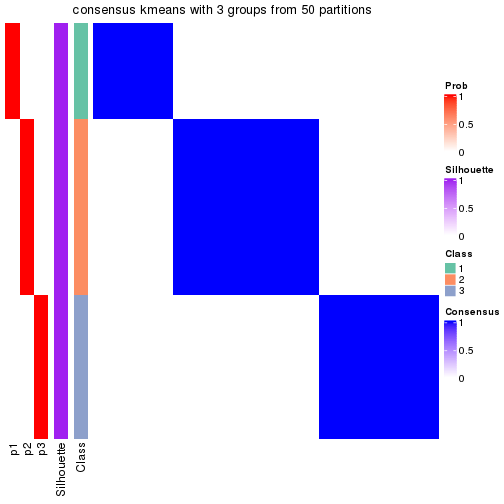</p>

</div>
<div id='tab-node-042-consensus-heatmap-3'>
<pre><code class="r">consensus_heatmap(res, k = 4)
</code></pre>

<p>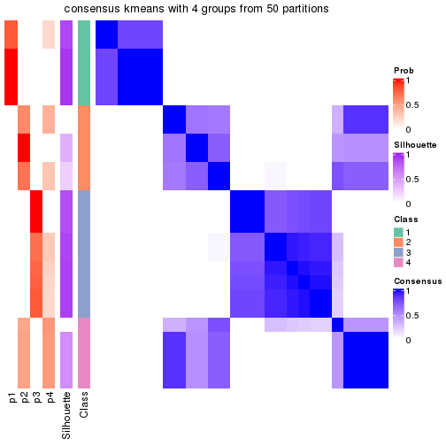</p>

</div>
<div id='tab-node-042-consensus-heatmap-4'>
<pre><code class="r">consensus_heatmap(res, k = 5)
</code></pre>

<p>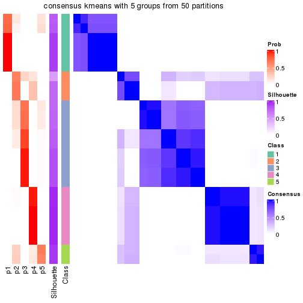</p>

</div>
<div id='tab-node-042-consensus-heatmap-5'>
<pre><code class="r">consensus_heatmap(res, k = 6)
</code></pre>

<p>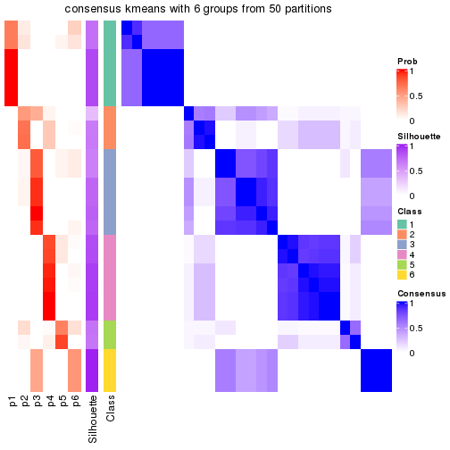</p>

</div>
<div id='tab-node-042-consensus-heatmap-6'>
<pre><code class="r">consensus_heatmap(res, k = 7)
</code></pre>

<p>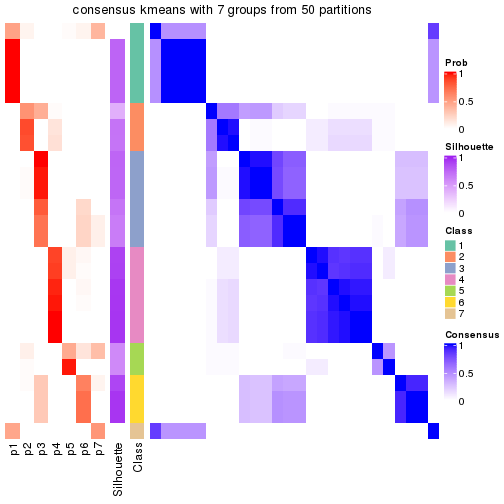</p>

</div>
<div id='tab-node-042-consensus-heatmap-7'>
<pre><code class="r">consensus_heatmap(res, k = 8)
</code></pre>

<p>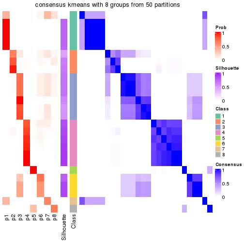</p>

</div>
</div>

Heatmaps for the membership of samples in all partitions to see how consistent they are:


<script>
$( function() {
	$( '#tabs-node-042-membership-heatmap' ).tabs();
} );
</script>
<div id='tabs-node-042-membership-heatmap'>
<ul>
<li><a href='#tab-node-042-membership-heatmap-1'>k = 2</a></li>
<li><a href='#tab-node-042-membership-heatmap-2'>k = 3</a></li>
<li><a href='#tab-node-042-membership-heatmap-3'>k = 4</a></li>
<li><a href='#tab-node-042-membership-heatmap-4'>k = 5</a></li>
<li><a href='#tab-node-042-membership-heatmap-5'>k = 6</a></li>
<li><a href='#tab-node-042-membership-heatmap-6'>k = 7</a></li>
<li><a href='#tab-node-042-membership-heatmap-7'>k = 8</a></li>
</ul>
<div id='tab-node-042-membership-heatmap-1'>
<pre><code class="r">membership_heatmap(res, k = 2)
</code></pre>

<p>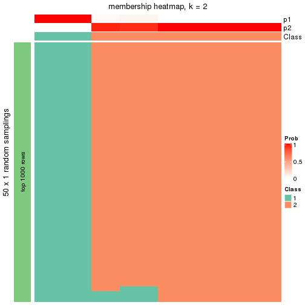</p>

</div>
<div id='tab-node-042-membership-heatmap-2'>
<pre><code class="r">membership_heatmap(res, k = 3)
</code></pre>

<p>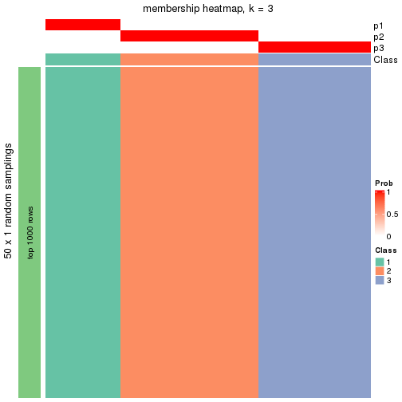</p>

</div>
<div id='tab-node-042-membership-heatmap-3'>
<pre><code class="r">membership_heatmap(res, k = 4)
</code></pre>

<p>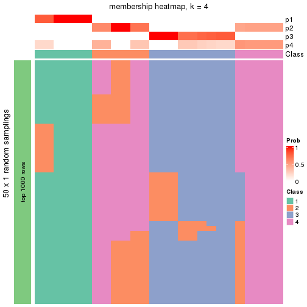</p>

</div>
<div id='tab-node-042-membership-heatmap-4'>
<pre><code class="r">membership_heatmap(res, k = 5)
</code></pre>

<p>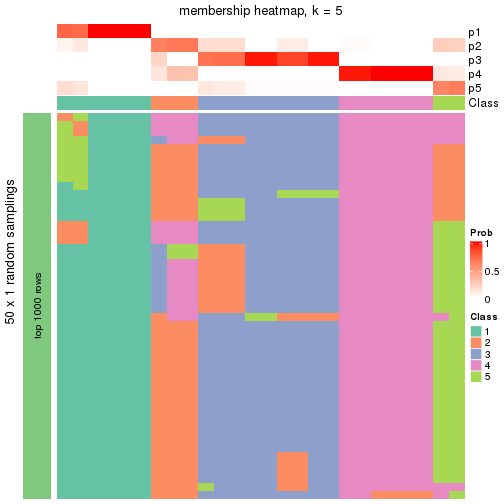</p>

</div>
<div id='tab-node-042-membership-heatmap-5'>
<pre><code class="r">membership_heatmap(res, k = 6)
</code></pre>

<p>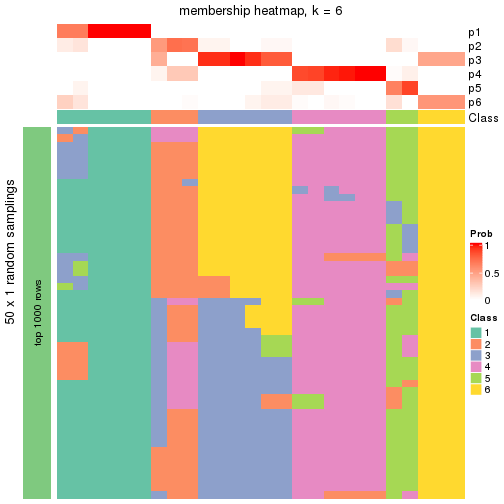</p>

</div>
<div id='tab-node-042-membership-heatmap-6'>
<pre><code class="r">membership_heatmap(res, k = 7)
</code></pre>

<p>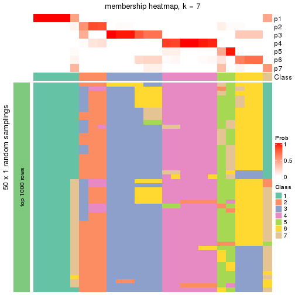</p>

</div>
<div id='tab-node-042-membership-heatmap-7'>
<pre><code class="r">membership_heatmap(res, k = 8)
</code></pre>

<p>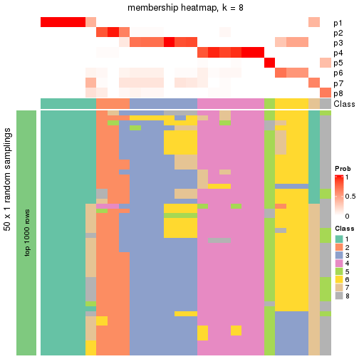</p>

</div>
</div>

As soon as the classes for columns are determined, the signatures
that are significantly different between subgroups can be looked for. 
Following are the heatmaps for signatures.


<script>
$( function() {
	$( '#tabs-node-042-get-signatures' ).tabs();
} );
</script>
<div id='tabs-node-042-get-signatures'>
<ul>
<li><a href='#tab-node-042-get-signatures-1'>k = 2</a></li>
<li><a href='#tab-node-042-get-signatures-2'>k = 3</a></li>
<li><a href='#tab-node-042-get-signatures-3'>k = 4</a></li>
<li><a href='#tab-node-042-get-signatures-4'>k = 5</a></li>
<li><a href='#tab-node-042-get-signatures-5'>k = 6</a></li>
<li><a href='#tab-node-042-get-signatures-6'>k = 7</a></li>
<li><a href='#tab-node-042-get-signatures-7'>k = 8</a></li>
</ul>
<div id='tab-node-042-get-signatures-1'>
<pre><code class="r">get_signatures(res, k = 2)
</code></pre>

<p>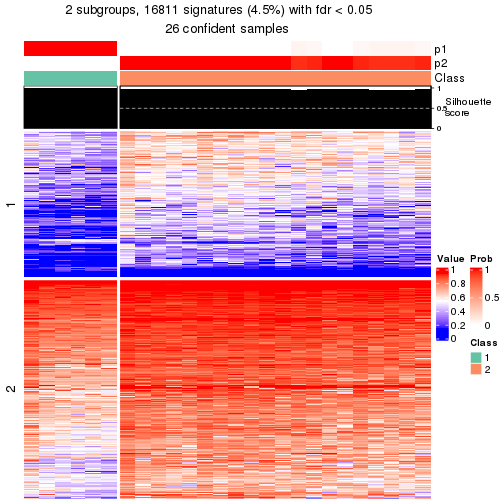</p>

</div>
<div id='tab-node-042-get-signatures-2'>
<pre><code class="r">get_signatures(res, k = 3)
</code></pre>

<p>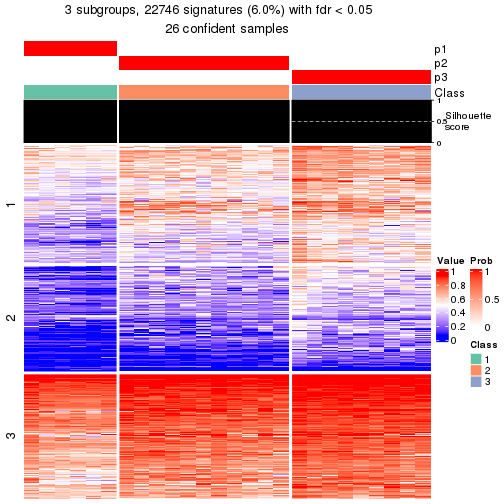</p>

</div>
<div id='tab-node-042-get-signatures-3'>
<pre><code class="r">get_signatures(res, k = 4)
</code></pre>

<p>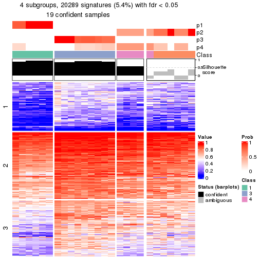</p>

</div>
<div id='tab-node-042-get-signatures-4'>
<pre><code class="r">get_signatures(res, k = 5)
</code></pre>

<p>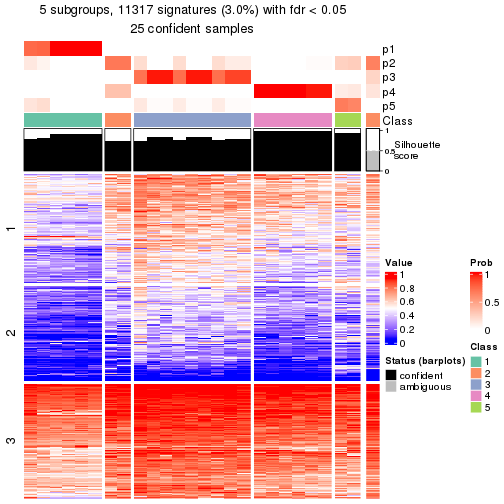</p>

</div>
<div id='tab-node-042-get-signatures-5'>
<pre><code class="r">get_signatures(res, k = 6)
</code></pre>

<p>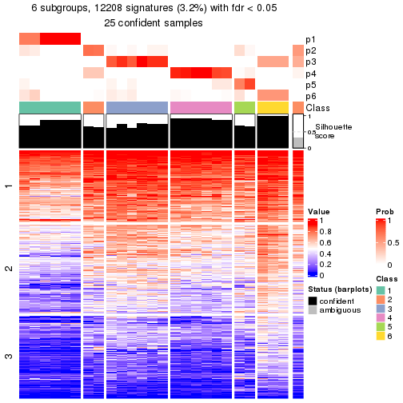</p>

</div>
<div id='tab-node-042-get-signatures-6'>
<pre><code class="r">get_signatures(res, k = 7)
</code></pre>

<p>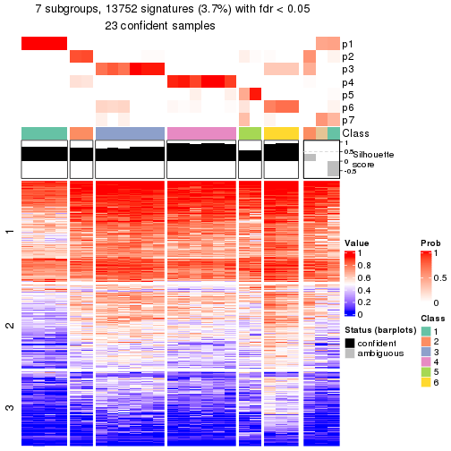</p>

</div>
<div id='tab-node-042-get-signatures-7'>
<pre><code class="r">get_signatures(res, k = 8)
</code></pre>

<p>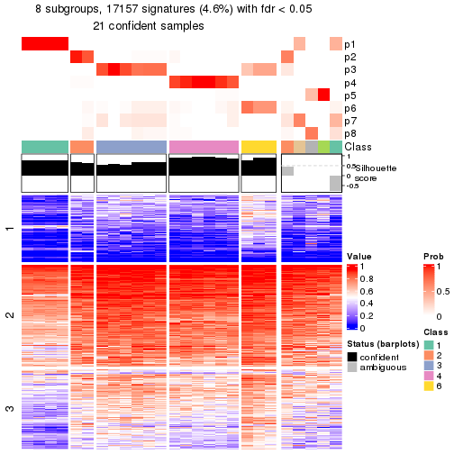</p>

</div>
</div>


Compare the overlap of signatures from different k:

```r
compare_signatures(res)
```

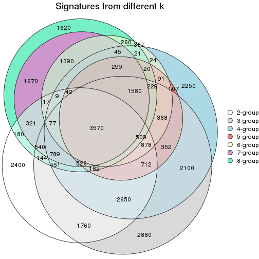

`get_signature()` returns a data frame invisibly. To get the list of signatures, the function
call should be assigned to a variable explicitly. In following code, if `plot` argument is set
to `FALSE`, no heatmap is plotted while only the differential analysis is performed.

```r
# code only for demonstration
tb = get_signature(res, k = ..., plot = FALSE)
```

An example of the output of `tb` is:

```
#>   which_row         fdr    mean_1    mean_2 scaled_mean_1 scaled_mean_2 km
#> 1        38 0.042760348  8.373488  9.131774    -0.5533452     0.5164555  1
#> 2        40 0.018707592  7.106213  8.469186    -0.6173731     0.5762149  1
#> 3        55 0.019134737 10.221463 11.207825    -0.6159697     0.5749050  1
#> 4        59 0.006059896  5.921854  7.869574    -0.6899429     0.6439467  1
#> 5        60 0.018055526  8.928898 10.211722    -0.6204761     0.5791110  1
#> 6        98 0.009384629 15.714769 14.887706     0.6635654    -0.6193277  2
...
```

The columns in `tb` are:

1. `which_row`: row indices corresponding to the input matrix.
2. `fdr`: FDR for the differential test. 
3. `mean_x`: The mean value in group x.
4. `scaled_mean_x`: The mean value in group x after rows are scaled.
5. `km`: Row groups if k-means clustering is applied to rows (which is done by automatically selecting number of clusters).

If there are too many signatures, `top_signatures = ...` can be set to only show the 
signatures with the highest FDRs:

```r
# code only for demonstration
# e.g. to show the top 500 most significant rows
tb = get_signature(res, k = ..., top_signatures = 500)
```

If the signatures are defined as these which are uniquely high in current group, `diff_method` argument
can be set to `"uniquely_high_in_one_group"`:

```r
# code only for demonstration
tb = get_signature(res, k = ..., diff_method = "uniquely_high_in_one_group")
```


UMAP plot which shows how samples are separated.


<script>
$( function() {
	$( '#tabs-node-042-dimension-reduction' ).tabs();
} );
</script>
<div id='tabs-node-042-dimension-reduction'>
<ul>
<li><a href='#tab-node-042-dimension-reduction-1'>k = 2</a></li>
<li><a href='#tab-node-042-dimension-reduction-2'>k = 3</a></li>
<li><a href='#tab-node-042-dimension-reduction-3'>k = 4</a></li>
<li><a href='#tab-node-042-dimension-reduction-4'>k = 5</a></li>
<li><a href='#tab-node-042-dimension-reduction-5'>k = 6</a></li>
<li><a href='#tab-node-042-dimension-reduction-6'>k = 7</a></li>
<li><a href='#tab-node-042-dimension-reduction-7'>k = 8</a></li>
</ul>
<div id='tab-node-042-dimension-reduction-1'>
<pre><code class="r">dimension_reduction(res, k = 2, method = &quot;UMAP&quot;)
</code></pre>

<p>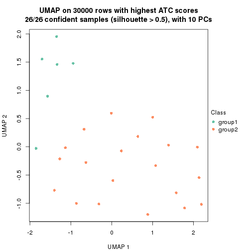</p>

</div>
<div id='tab-node-042-dimension-reduction-2'>
<pre><code class="r">dimension_reduction(res, k = 3, method = &quot;UMAP&quot;)
</code></pre>

<p>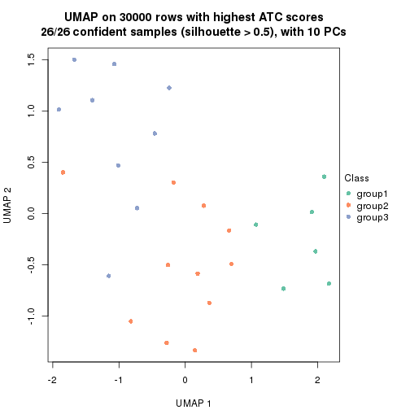</p>

</div>
<div id='tab-node-042-dimension-reduction-3'>
<pre><code class="r">dimension_reduction(res, k = 4, method = &quot;UMAP&quot;)
</code></pre>

<p>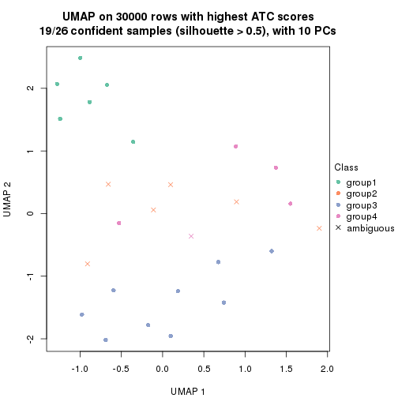</p>

</div>
<div id='tab-node-042-dimension-reduction-4'>
<pre><code class="r">dimension_reduction(res, k = 5, method = &quot;UMAP&quot;)
</code></pre>

<p>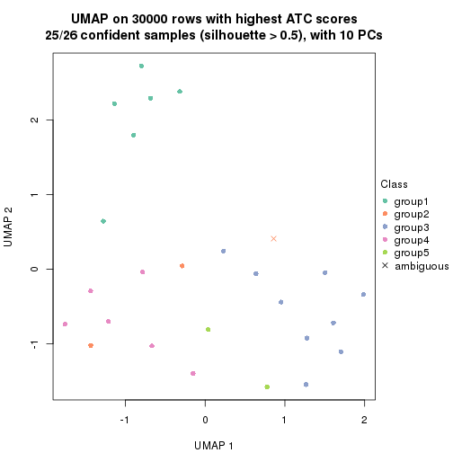</p>

</div>
<div id='tab-node-042-dimension-reduction-5'>
<pre><code class="r">dimension_reduction(res, k = 6, method = &quot;UMAP&quot;)
</code></pre>

<p>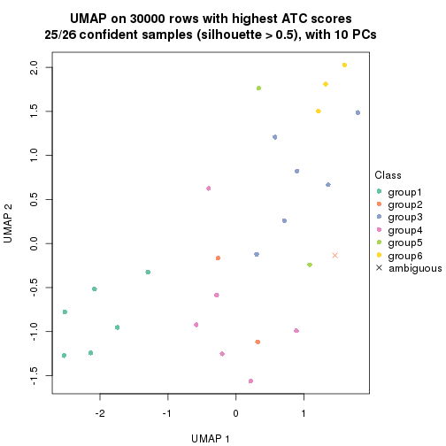</p>

</div>
<div id='tab-node-042-dimension-reduction-6'>
<pre><code class="r">dimension_reduction(res, k = 7, method = &quot;UMAP&quot;)
</code></pre>

<p>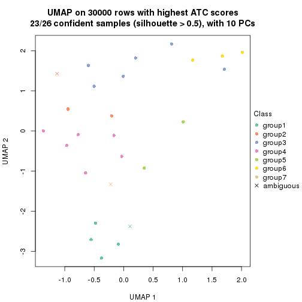</p>

</div>
<div id='tab-node-042-dimension-reduction-7'>
<pre><code class="r">dimension_reduction(res, k = 8, method = &quot;UMAP&quot;)
</code></pre>

<p>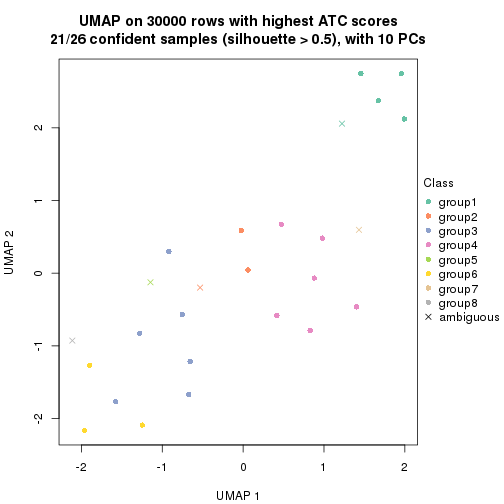</p>

</div>
</div>


Following heatmap shows how subgroups are split when increasing `k`:

```r
collect_classes(res)
```

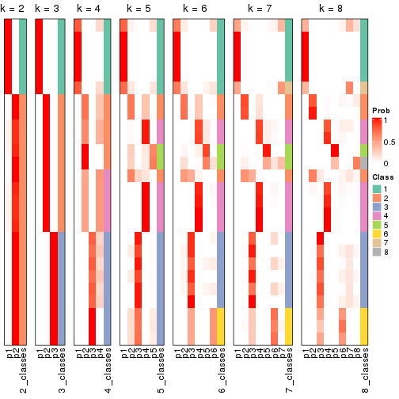


If matrix rows can be associated to genes, consider to use `functional_enrichment(res,
...)` to perform function enrichment for the signature genes. See [this vignette](https://jokergoo.github.io/cola_vignettes/functional_enrichment.html) for more detailed explanations.


 

---------------------------------------------------


### Node043


Parent node: [Node04](#Node04).
Child nodes: 
                Node0121-leaf
        ,
                Node0122-leaf
        ,
                Node0123-leaf
        ,
                Node0211-leaf
        ,
                [Node0212](#Node0212)
        ,
                Node0213-leaf
        ,
                [Node0221](#Node0221)
        ,
                Node0222-leaf
        ,
                Node0223-leaf
        ,
                [Node0231](#Node0231)
        ,
                Node0232-leaf
        ,
                Node0233-leaf
        ,
                Node0241-leaf
        ,
                Node0242-leaf
        ,
                Node0411-leaf
        ,
                Node0412-leaf
        ,
                Node0413-leaf
        ,
                Node0421-leaf
        ,
                Node0422-leaf
        ,
                Node0423-leaf
        ,
                Node0431-leaf
        ,
                Node0432-leaf
        ,
                Node0433-leaf
        ,
                Node0441-leaf
        ,
                Node0442-leaf
        ,
                Node0443-leaf
        ,
                Node0511-leaf
        ,
                [Node0512](#Node0512)
        ,
                Node0513-leaf
        ,
                Node0521-leaf
        ,
                Node0522-leaf
        ,
                Node0523-leaf
        .


The object with results only for a single top-value method and a single partitioning method 
can be extracted as:

```r
res = res_rh["043"]
```

A summary of `res` and all the functions that can be applied to it:

```r
res
```

```
#> A 'ConsensusPartition' object with k = 2, 3, 4, 5, 6, 7, 8.
#>   On a matrix with 30000 rows and 41 columns.
#>   Top rows (1000) are extracted by 'ATC' method.
#>   Subgroups are detected by 'skmeans' method.
#>   Performed in total 350 partitions by row resampling.
#>   Best k for subgroups seems to be 3.
#> 
#> Following methods can be applied to this 'ConsensusPartition' object:
#>  [1] "cola_report"             "collect_classes"         "collect_plots"          
#>  [4] "collect_stats"           "colnames"                "compare_partitions"     
#>  [7] "compare_signatures"      "consensus_heatmap"       "dimension_reduction"    
#> [10] "functional_enrichment"   "get_anno_col"            "get_anno"               
#> [13] "get_classes"             "get_consensus"           "get_matrix"             
#> [16] "get_membership"          "get_param"               "get_signatures"         
#> [19] "get_stats"               "is_best_k"               "is_stable_k"            
#> [22] "membership_heatmap"      "ncol"                    "nrow"                   
#> [25] "plot_ecdf"               "predict_classes"         "rownames"               
#> [28] "select_partition_number" "show"                    "suggest_best_k"         
#> [31] "test_to_known_factors"   "top_rows_heatmap"
```

`collect_plots()` function collects all the plots made from `res` for all `k` (number of subgroups)
into one single page to provide an easy and fast comparison between different `k`.

```r
collect_plots(res)
```

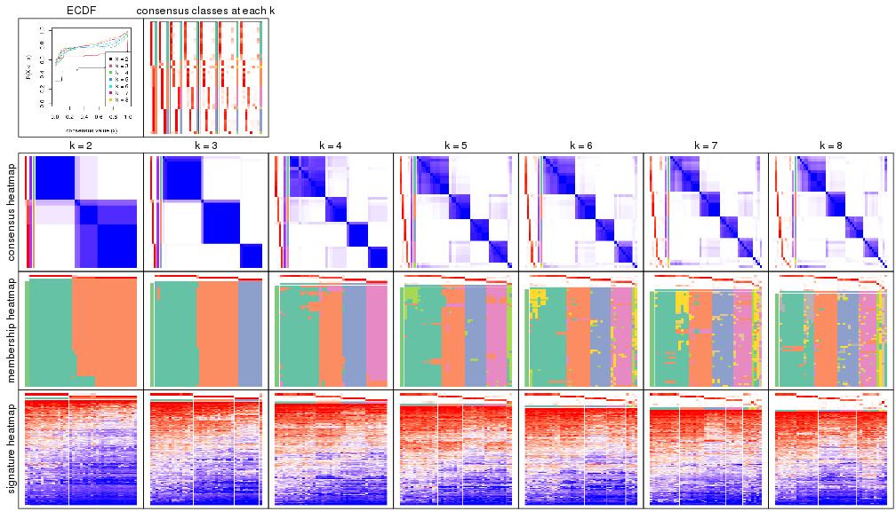

The plots are:

- The first row: a plot of the eCDF (empirical cumulative distribution
  function) curves of the consensus matrix for each `k` and the heatmap of
  predicted classes for each `k`.
- The second row: heatmaps of the consensus matrix for each `k`.
- The third row: heatmaps of the membership matrix for each `k`.
- The fouth row: heatmaps of the signatures for each `k`.

All the plots in panels can be made by individual functions and they are
plotted later in this section.

`select_partition_number()` produces several plots showing different
statistics for choosing "optimized" `k`. There are following statistics:

- eCDF curves of the consensus matrix for each `k`;
- 1-PAC. [The PAC score](https://en.wikipedia.org/wiki/Consensus_clustering#Over-interpretation_potential_of_consensus_clustering)
  measures the proportion of the ambiguous subgrouping.
- Mean silhouette score.
- Concordance. The mean probability of fiting the consensus subgroup labels in all
  partitions.
- Area increased. Denote $A_k$ as the area under the eCDF curve for current
  `k`, the area increased is defined as $A_k - A_{k-1}$.
- Rand index. The percent of pairs of samples that are both in a same cluster
  or both are not in a same cluster in the partition of k and k-1.
- Jaccard index. The ratio of pairs of samples are both in a same cluster in
  the partition of k and k-1 and the pairs of samples are both in a same
  cluster in the partition k or k-1.

The detailed explanations of these statistics can be found in [the _cola_
vignette](https://jokergoo.github.io/cola_vignettes/cola.html#toc_13).

Generally speaking, higher 1-PAC score, higher mean silhouette score or higher
concordance corresponds to better partition. Rand index and Jaccard index
measure how similar the current partition is compared to partition with `k-1`.
If they are too similar, we won't accept `k` is better than `k-1`.

```r
select_partition_number(res)
```

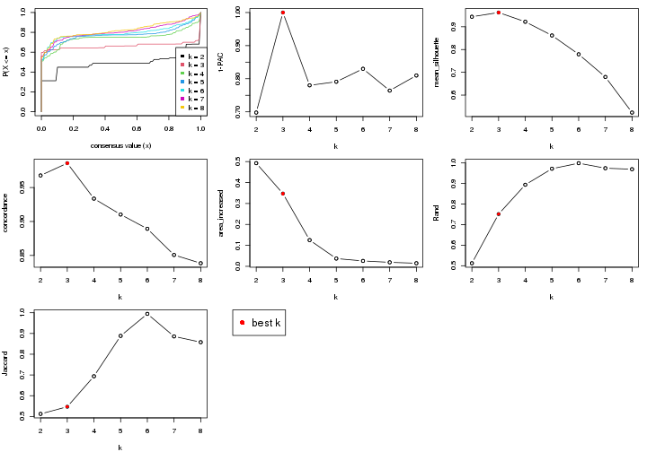

The numeric values for all these statistics can be obtained by `get_stats()`.

```r
get_stats(res)
```

```
#>   k 1-PAC mean_silhouette concordance area_increased  Rand Jaccard
#> 2 2 0.698           0.944       0.968         0.4923 0.512   0.512
#> 3 3 1.000           0.962       0.986         0.3473 0.751   0.547
#> 4 4 0.780           0.922       0.934         0.1253 0.894   0.694
#> 5 5 0.791           0.862       0.910         0.0371 0.972   0.888
#> 6 6 0.830           0.779       0.889         0.0258 0.999   0.995
#> 7 7 0.764           0.680       0.851         0.0192 0.974   0.886
#> 8 8 0.810           0.523       0.839         0.0148 0.970   0.858
```

`suggest_best_k()` suggests the best $k$ based on these statistics. The rules are as follows:

- All $k$ with Jaccard index larger than 0.95 are removed because increasing
  $k$ does not provide enough extra information. If all $k$ are removed, it is
  marked as no subgroup is detected.
- For all $k$ with 1-PAC score larger than 0.9, the maximal $k$ is taken as
  the best $k$, and other $k$ are marked as optional $k$.
- If it does not fit the second rule. The $k$ with the maximal vote of the
  highest 1-PAC score, highest mean silhouette, and highest concordance is
  taken as the best $k$.

```r
suggest_best_k(res)
```

```
#> [1] 3
```


Following is the table of the partitions (You need to click the **show/hide
code output** link to see it). The membership matrix (columns with name `p*`)
is inferred by
[`clue::cl_consensus()`](https://www.rdocumentation.org/link/cl_consensus?package=clue)
function with the `SE` method. Basically the value in the membership matrix
represents the probability to belong to a certain group. The finall subgroup
label for an item is determined with the group with highest probability it
belongs to.

In `get_classes()` function, the entropy is calculated from the membership
matrix and the silhouette score is calculated from the consensus matrix.


<script>
$( function() {
	$( '#tabs-node-043-get-classes' ).tabs();
} );
</script>
<div id='tabs-node-043-get-classes'>
<ul>
<li><a href='#tab-node-043-get-classes-1'>k = 2</a></li>
<li><a href='#tab-node-043-get-classes-2'>k = 3</a></li>
<li><a href='#tab-node-043-get-classes-3'>k = 4</a></li>
<li><a href='#tab-node-043-get-classes-4'>k = 5</a></li>
<li><a href='#tab-node-043-get-classes-5'>k = 6</a></li>
<li><a href='#tab-node-043-get-classes-6'>k = 7</a></li>
<li><a href='#tab-node-043-get-classes-7'>k = 8</a></li>
</ul>

<div id='tab-node-043-get-classes-1'>
<p><a id='tab-node-043-get-classes-1-a' style='color:#0366d6' href='#'>show/hide code output</a></p>
<pre><code class="r">cbind(get_classes(res, k = 2), get_membership(res, k = 2))
</code></pre>

<pre><code>#&gt;                 class entropy silhouette   p1   p2
#&gt; TCGA.EJ.5521.01     2   0.000      0.944 0.00 1.00
#&gt; TCGA.XA.A8JR.01     2   0.469      0.905 0.10 0.90
#&gt; TCGA.EJ.7781.01     2   0.000      0.944 0.00 1.00
#&gt; TCGA.CH.5751.01     1   0.000      1.000 1.00 0.00
#&gt; TCGA.V1.A8WL.01     2   0.000      0.944 0.00 1.00
#&gt; TCGA.EJ.7786.01     1   0.000      1.000 1.00 0.00
#&gt; TCGA.EJ.8470.01     1   0.000      1.000 1.00 0.00
#&gt; TCGA.HC.7742.01     2   0.000      0.944 0.00 1.00
#&gt; TCGA.CH.5769.01     2   0.000      0.944 0.00 1.00
#&gt; TCGA.EJ.A7NN.01     2   0.000      0.944 0.00 1.00
#&gt; TCGA.YL.A8SC.01     1   0.000      1.000 1.00 0.00
#&gt; TCGA.V1.A8X3.01     1   0.000      1.000 1.00 0.00
#&gt; TCGA.KK.A6DY.01     1   0.000      1.000 1.00 0.00
#&gt; TCGA.VN.A88N.01     2   0.000      0.944 0.00 1.00
#&gt; TCGA.EJ.8468.01     1   0.000      1.000 1.00 0.00
#&gt; TCGA.HC.8256.01     1   0.000      1.000 1.00 0.00
#&gt; TCGA.CH.5769.11     2   0.000      0.944 0.00 1.00
#&gt; TCGA.Y6.A8TL.01     1   0.000      1.000 1.00 0.00
#&gt; TCGA.V1.A8MF.01     2   0.000      0.944 0.00 1.00
#&gt; TCGA.EJ.5532.01     2   0.469      0.905 0.10 0.90
#&gt; TCGA.EJ.5507.01     2   0.000      0.944 0.00 1.00
#&gt; TCGA.EJ.A65G.01     2   0.469      0.905 0.10 0.90
#&gt; TCGA.HC.A76W.01     1   0.000      1.000 1.00 0.00
#&gt; TCGA.G9.A9S7.01     2   0.000      0.944 0.00 1.00
#&gt; TCGA.HC.8216.01     2   0.000      0.944 0.00 1.00
#&gt; TCGA.CH.5794.01     2   0.000      0.944 0.00 1.00
#&gt; TCGA.HC.7818.01     2   0.469      0.905 0.10 0.90
#&gt; TCGA.2A.A8VT.01     2   0.881      0.652 0.30 0.70
#&gt; TCGA.ZG.A9LM.01     2   0.000      0.944 0.00 1.00
#&gt; TCGA.G9.6494.01     1   0.000      1.000 1.00 0.00
#&gt; TCGA.QU.A6IM.01     2   0.469      0.905 0.10 0.90
#&gt; TCGA.VP.A872.01     2   0.000      0.944 0.00 1.00
#&gt; TCGA.KK.A8IJ.01     1   0.000      1.000 1.00 0.00
#&gt; TCGA.CH.5748.01     2   0.469      0.905 0.10 0.90
#&gt; TCGA.V1.A9Z7.01     1   0.000      1.000 1.00 0.00
#&gt; TCGA.EJ.A6RC.01     2   0.469      0.905 0.10 0.90
#&gt; TCGA.HC.A9TH.01     2   0.000      0.944 0.00 1.00
#&gt; TCGA.YL.A8SJ.01     2   0.904      0.605 0.32 0.68
#&gt; TCGA.HC.7749.01     1   0.000      1.000 1.00 0.00
#&gt; TCGA.KK.A6E7.01     1   0.000      1.000 1.00 0.00
#&gt; TCGA.HC.8261.01     1   0.000      1.000 1.00 0.00
</code></pre>

<script>
$('#tab-node-043-get-classes-1-a').parent().next().next().hide();
$('#tab-node-043-get-classes-1-a').click(function(){
  $('#tab-node-043-get-classes-1-a').parent().next().next().toggle();
  return(false);
});
</script>
</div>

<div id='tab-node-043-get-classes-2'>
<p><a id='tab-node-043-get-classes-2-a' style='color:#0366d6' href='#'>show/hide code output</a></p>
<pre><code class="r">cbind(get_classes(res, k = 3), get_membership(res, k = 3))
</code></pre>

<pre><code>#&gt;                 class entropy silhouette   p1   p2   p3
#&gt; TCGA.EJ.5521.01     3  0.0000      0.997 0.00 0.00 1.00
#&gt; TCGA.XA.A8JR.01     2  0.0000      0.969 0.00 1.00 0.00
#&gt; TCGA.EJ.7781.01     2  0.0000      0.969 0.00 1.00 0.00
#&gt; TCGA.CH.5751.01     1  0.0000      0.988 1.00 0.00 0.00
#&gt; TCGA.V1.A8WL.01     2  0.0000      0.969 0.00 1.00 0.00
#&gt; TCGA.EJ.7786.01     2  0.6126      0.319 0.40 0.60 0.00
#&gt; TCGA.EJ.8470.01     1  0.0000      0.988 1.00 0.00 0.00
#&gt; TCGA.HC.7742.01     2  0.0000      0.969 0.00 1.00 0.00
#&gt; TCGA.CH.5769.01     3  0.0000      0.997 0.00 0.00 1.00
#&gt; TCGA.EJ.A7NN.01     2  0.0000      0.969 0.00 1.00 0.00
#&gt; TCGA.YL.A8SC.01     1  0.0000      0.988 1.00 0.00 0.00
#&gt; TCGA.V1.A8X3.01     1  0.0000      0.988 1.00 0.00 0.00
#&gt; TCGA.KK.A6DY.01     1  0.0000      0.988 1.00 0.00 0.00
#&gt; TCGA.VN.A88N.01     2  0.0000      0.969 0.00 1.00 0.00
#&gt; TCGA.EJ.8468.01     1  0.0000      0.988 1.00 0.00 0.00
#&gt; TCGA.HC.8256.01     1  0.0000      0.988 1.00 0.00 0.00
#&gt; TCGA.CH.5769.11     3  0.0000      0.997 0.00 0.00 1.00
#&gt; TCGA.Y6.A8TL.01     1  0.3340      0.855 0.88 0.12 0.00
#&gt; TCGA.V1.A8MF.01     2  0.0000      0.969 0.00 1.00 0.00
#&gt; TCGA.EJ.5532.01     2  0.0000      0.969 0.00 1.00 0.00
#&gt; TCGA.EJ.5507.01     3  0.0000      0.997 0.00 0.00 1.00
#&gt; TCGA.EJ.A65G.01     2  0.0000      0.969 0.00 1.00 0.00
#&gt; TCGA.HC.A76W.01     1  0.0000      0.988 1.00 0.00 0.00
#&gt; TCGA.G9.A9S7.01     3  0.0000      0.997 0.00 0.00 1.00
#&gt; TCGA.HC.8216.01     2  0.0000      0.969 0.00 1.00 0.00
#&gt; TCGA.CH.5794.01     3  0.0000      0.997 0.00 0.00 1.00
#&gt; TCGA.HC.7818.01     2  0.0000      0.969 0.00 1.00 0.00
#&gt; TCGA.2A.A8VT.01     3  0.0892      0.979 0.02 0.00 0.98
#&gt; TCGA.ZG.A9LM.01     2  0.0000      0.969 0.00 1.00 0.00
#&gt; TCGA.G9.6494.01     1  0.0000      0.988 1.00 0.00 0.00
#&gt; TCGA.QU.A6IM.01     2  0.0000      0.969 0.00 1.00 0.00
#&gt; TCGA.VP.A872.01     3  0.0000      0.997 0.00 0.00 1.00
#&gt; TCGA.KK.A8IJ.01     1  0.0000      0.988 1.00 0.00 0.00
#&gt; TCGA.CH.5748.01     2  0.0000      0.969 0.00 1.00 0.00
#&gt; TCGA.V1.A9Z7.01     1  0.0000      0.988 1.00 0.00 0.00
#&gt; TCGA.EJ.A6RC.01     2  0.0000      0.969 0.00 1.00 0.00
#&gt; TCGA.HC.A9TH.01     3  0.0000      0.997 0.00 0.00 1.00
#&gt; TCGA.YL.A8SJ.01     1  0.1529      0.951 0.96 0.00 0.04
#&gt; TCGA.HC.7749.01     1  0.0000      0.988 1.00 0.00 0.00
#&gt; TCGA.KK.A6E7.01     1  0.0000      0.988 1.00 0.00 0.00
#&gt; TCGA.HC.8261.01     1  0.0000      0.988 1.00 0.00 0.00
</code></pre>

<script>
$('#tab-node-043-get-classes-2-a').parent().next().next().hide();
$('#tab-node-043-get-classes-2-a').click(function(){
  $('#tab-node-043-get-classes-2-a').parent().next().next().toggle();
  return(false);
});
</script>
</div>

<div id='tab-node-043-get-classes-3'>
<p><a id='tab-node-043-get-classes-3-a' style='color:#0366d6' href='#'>show/hide code output</a></p>
<pre><code class="r">cbind(get_classes(res, k = 4), get_membership(res, k = 4))
</code></pre>

<pre><code>#&gt;                 class entropy silhouette   p1   p2   p3   p4
#&gt; TCGA.EJ.5521.01     3  0.0000      0.965 0.00 0.00 1.00 0.00
#&gt; TCGA.XA.A8JR.01     2  0.2345      0.946 0.00 0.90 0.00 0.10
#&gt; TCGA.EJ.7781.01     4  0.0707      0.989 0.00 0.02 0.00 0.98
#&gt; TCGA.CH.5751.01     1  0.0000      0.918 1.00 0.00 0.00 0.00
#&gt; TCGA.V1.A8WL.01     4  0.0707      0.989 0.00 0.02 0.00 0.98
#&gt; TCGA.EJ.7786.01     2  0.2411      0.901 0.04 0.92 0.00 0.04
#&gt; TCGA.EJ.8470.01     1  0.3172      0.867 0.84 0.16 0.00 0.00
#&gt; TCGA.HC.7742.01     4  0.0707      0.989 0.00 0.02 0.00 0.98
#&gt; TCGA.CH.5769.01     3  0.0000      0.965 0.00 0.00 1.00 0.00
#&gt; TCGA.EJ.A7NN.01     4  0.0707      0.989 0.00 0.02 0.00 0.98
#&gt; TCGA.YL.A8SC.01     1  0.1637      0.898 0.94 0.06 0.00 0.00
#&gt; TCGA.V1.A8X3.01     1  0.0000      0.918 1.00 0.00 0.00 0.00
#&gt; TCGA.KK.A6DY.01     1  0.0000      0.918 1.00 0.00 0.00 0.00
#&gt; TCGA.VN.A88N.01     4  0.0707      0.989 0.00 0.02 0.00 0.98
#&gt; TCGA.EJ.8468.01     1  0.3610      0.826 0.80 0.20 0.00 0.00
#&gt; TCGA.HC.8256.01     1  0.3172      0.867 0.84 0.16 0.00 0.00
#&gt; TCGA.CH.5769.11     3  0.0000      0.965 0.00 0.00 1.00 0.00
#&gt; TCGA.Y6.A8TL.01     2  0.2345      0.832 0.10 0.90 0.00 0.00
#&gt; TCGA.V1.A8MF.01     4  0.0707      0.989 0.00 0.02 0.00 0.98
#&gt; TCGA.EJ.5532.01     2  0.3801      0.817 0.00 0.78 0.00 0.22
#&gt; TCGA.EJ.5507.01     3  0.0000      0.965 0.00 0.00 1.00 0.00
#&gt; TCGA.EJ.A65G.01     2  0.2345      0.946 0.00 0.90 0.00 0.10
#&gt; TCGA.HC.A76W.01     1  0.0707      0.913 0.98 0.02 0.00 0.00
#&gt; TCGA.G9.A9S7.01     3  0.0000      0.965 0.00 0.00 1.00 0.00
#&gt; TCGA.HC.8216.01     4  0.0707      0.989 0.00 0.02 0.00 0.98
#&gt; TCGA.CH.5794.01     3  0.0000      0.965 0.00 0.00 1.00 0.00
#&gt; TCGA.HC.7818.01     2  0.3037      0.932 0.02 0.88 0.00 0.10
#&gt; TCGA.2A.A8VT.01     3  0.6122      0.660 0.16 0.16 0.68 0.00
#&gt; TCGA.ZG.A9LM.01     4  0.1637      0.921 0.00 0.06 0.00 0.94
#&gt; TCGA.G9.6494.01     1  0.0000      0.918 1.00 0.00 0.00 0.00
#&gt; TCGA.QU.A6IM.01     2  0.2345      0.946 0.00 0.90 0.00 0.10
#&gt; TCGA.VP.A872.01     3  0.0000      0.965 0.00 0.00 1.00 0.00
#&gt; TCGA.KK.A8IJ.01     1  0.2345      0.901 0.90 0.10 0.00 0.00
#&gt; TCGA.CH.5748.01     2  0.2345      0.946 0.00 0.90 0.00 0.10
#&gt; TCGA.V1.A9Z7.01     1  0.1637      0.914 0.94 0.06 0.00 0.00
#&gt; TCGA.EJ.A6RC.01     2  0.2345      0.946 0.00 0.90 0.00 0.10
#&gt; TCGA.HC.A9TH.01     3  0.0000      0.965 0.00 0.00 1.00 0.00
#&gt; TCGA.YL.A8SJ.01     1  0.4088      0.805 0.82 0.14 0.00 0.04
#&gt; TCGA.HC.7749.01     1  0.0707      0.913 0.98 0.02 0.00 0.00
#&gt; TCGA.KK.A6E7.01     1  0.1637      0.914 0.94 0.06 0.00 0.00
#&gt; TCGA.HC.8261.01     1  0.3172      0.867 0.84 0.16 0.00 0.00
</code></pre>

<script>
$('#tab-node-043-get-classes-3-a').parent().next().next().hide();
$('#tab-node-043-get-classes-3-a').click(function(){
  $('#tab-node-043-get-classes-3-a').parent().next().next().toggle();
  return(false);
});
</script>
</div>

<div id='tab-node-043-get-classes-4'>
<p><a id='tab-node-043-get-classes-4-a' style='color:#0366d6' href='#'>show/hide code output</a></p>
<pre><code class="r">cbind(get_classes(res, k = 5), get_membership(res, k = 5))
</code></pre>

<pre><code>#&gt;                 class entropy silhouette   p1   p2   p3   p4   p5
#&gt; TCGA.EJ.5521.01     3  0.0609      0.976 0.00 0.00 0.98 0.00 0.02
#&gt; TCGA.XA.A8JR.01     2  0.0000      0.915 0.00 1.00 0.00 0.00 0.00
#&gt; TCGA.EJ.7781.01     4  0.2732      0.928 0.00 0.16 0.00 0.84 0.00
#&gt; TCGA.CH.5751.01     1  0.0609      0.854 0.98 0.00 0.00 0.00 0.02
#&gt; TCGA.V1.A8WL.01     4  0.2929      0.921 0.00 0.18 0.00 0.82 0.00
#&gt; TCGA.EJ.7786.01     2  0.2280      0.811 0.12 0.88 0.00 0.00 0.00
#&gt; TCGA.EJ.8470.01     1  0.1732      0.840 0.92 0.08 0.00 0.00 0.00
#&gt; TCGA.HC.7742.01     4  0.2873      0.926 0.00 0.12 0.00 0.86 0.02
#&gt; TCGA.CH.5769.01     3  0.0000      0.978 0.00 0.00 1.00 0.00 0.00
#&gt; TCGA.EJ.A7NN.01     4  0.2438      0.867 0.00 0.06 0.00 0.90 0.04
#&gt; TCGA.YL.A8SC.01     1  0.4360      0.557 0.68 0.02 0.00 0.00 0.30
#&gt; TCGA.V1.A8X3.01     1  0.2516      0.804 0.86 0.00 0.00 0.00 0.14
#&gt; TCGA.KK.A6DY.01     1  0.1410      0.844 0.94 0.00 0.00 0.00 0.06
#&gt; TCGA.VN.A88N.01     4  0.2280      0.927 0.00 0.12 0.00 0.88 0.00
#&gt; TCGA.EJ.8468.01     1  0.1732      0.840 0.92 0.08 0.00 0.00 0.00
#&gt; TCGA.HC.8256.01     1  0.1732      0.840 0.92 0.08 0.00 0.00 0.00
#&gt; TCGA.CH.5769.11     3  0.0000      0.978 0.00 0.00 1.00 0.00 0.00
#&gt; TCGA.Y6.A8TL.01     2  0.2516      0.789 0.14 0.86 0.00 0.00 0.00
#&gt; TCGA.V1.A8MF.01     4  0.2020      0.918 0.00 0.10 0.00 0.90 0.00
#&gt; TCGA.EJ.5532.01     2  0.2732      0.722 0.00 0.84 0.00 0.16 0.00
#&gt; TCGA.EJ.5507.01     3  0.0000      0.978 0.00 0.00 1.00 0.00 0.00
#&gt; TCGA.EJ.A65G.01     2  0.0000      0.915 0.00 1.00 0.00 0.00 0.00
#&gt; TCGA.HC.A76W.01     1  0.2929      0.769 0.82 0.00 0.00 0.00 0.18
#&gt; TCGA.G9.A9S7.01     3  0.0609      0.976 0.00 0.00 0.98 0.00 0.02
#&gt; TCGA.HC.8216.01     4  0.2929      0.921 0.00 0.18 0.00 0.82 0.00
#&gt; TCGA.CH.5794.01     3  0.1043      0.969 0.00 0.00 0.96 0.00 0.04
#&gt; TCGA.HC.7818.01     2  0.1043      0.896 0.00 0.96 0.00 0.00 0.04
#&gt; TCGA.2A.A8VT.01     5  0.3348      0.622 0.02 0.00 0.08 0.04 0.86
#&gt; TCGA.ZG.A9LM.01     4  0.4254      0.841 0.00 0.22 0.00 0.74 0.04
#&gt; TCGA.G9.6494.01     1  0.2280      0.817 0.88 0.00 0.00 0.00 0.12
#&gt; TCGA.QU.A6IM.01     2  0.0609      0.908 0.02 0.98 0.00 0.00 0.00
#&gt; TCGA.VP.A872.01     3  0.1043      0.955 0.00 0.00 0.96 0.00 0.04
#&gt; TCGA.KK.A8IJ.01     1  0.1043      0.857 0.96 0.04 0.00 0.00 0.00
#&gt; TCGA.CH.5748.01     2  0.0000      0.915 0.00 1.00 0.00 0.00 0.00
#&gt; TCGA.V1.A9Z7.01     1  0.0609      0.860 0.98 0.02 0.00 0.00 0.00
#&gt; TCGA.EJ.A6RC.01     2  0.0000      0.915 0.00 1.00 0.00 0.00 0.00
#&gt; TCGA.HC.A9TH.01     3  0.1043      0.960 0.00 0.00 0.96 0.00 0.04
#&gt; TCGA.YL.A8SJ.01     5  0.4398      0.574 0.24 0.04 0.00 0.00 0.72
#&gt; TCGA.HC.7749.01     1  0.3109      0.748 0.80 0.00 0.00 0.00 0.20
#&gt; TCGA.KK.A6E7.01     1  0.0609      0.860 0.98 0.02 0.00 0.00 0.00
#&gt; TCGA.HC.8261.01     1  0.1732      0.840 0.92 0.08 0.00 0.00 0.00
</code></pre>

<script>
$('#tab-node-043-get-classes-4-a').parent().next().next().hide();
$('#tab-node-043-get-classes-4-a').click(function(){
  $('#tab-node-043-get-classes-4-a').parent().next().next().toggle();
  return(false);
});
</script>
</div>

<div id='tab-node-043-get-classes-5'>
<p><a id='tab-node-043-get-classes-5-a' style='color:#0366d6' href='#'>show/hide code output</a></p>
<pre><code class="r">cbind(get_classes(res, k = 6), get_membership(res, k = 6))
</code></pre>

<pre><code>#&gt;                 class entropy silhouette   p1   p2   p3   p4   p5   p6
#&gt; TCGA.EJ.5521.01     3  0.1267      0.935 0.00 0.00 0.94 0.00 0.00 0.06
#&gt; TCGA.XA.A8JR.01     2  0.0000      0.928 0.00 1.00 0.00 0.00 0.00 0.00
#&gt; TCGA.EJ.7781.01     4  0.1267      0.841 0.00 0.06 0.00 0.94 0.00 0.00
#&gt; TCGA.CH.5751.01     1  0.1092      0.839 0.96 0.00 0.00 0.00 0.02 0.02
#&gt; TCGA.V1.A8WL.01     4  0.1556      0.839 0.00 0.08 0.00 0.92 0.00 0.00
#&gt; TCGA.EJ.7786.01     2  0.0937      0.898 0.04 0.96 0.00 0.00 0.00 0.00
#&gt; TCGA.EJ.8470.01     1  0.0937      0.845 0.96 0.04 0.00 0.00 0.00 0.00
#&gt; TCGA.HC.7742.01     4  0.2512      0.835 0.00 0.06 0.00 0.88 0.00 0.06
#&gt; TCGA.CH.5769.01     3  0.0000      0.947 0.00 0.00 1.00 0.00 0.00 0.00
#&gt; TCGA.EJ.A7NN.01     4  0.3578      0.506 0.00 0.00 0.00 0.66 0.00 0.34
#&gt; TCGA.YL.A8SC.01     1  0.6167      0.269 0.54 0.04 0.00 0.00 0.26 0.16
#&gt; TCGA.V1.A8X3.01     1  0.2790      0.787 0.84 0.00 0.00 0.00 0.02 0.14
#&gt; TCGA.KK.A6DY.01     1  0.2794      0.795 0.86 0.00 0.00 0.00 0.06 0.08
#&gt; TCGA.VN.A88N.01     4  0.1807      0.844 0.00 0.06 0.00 0.92 0.00 0.02
#&gt; TCGA.EJ.8468.01     1  0.0937      0.845 0.96 0.04 0.00 0.00 0.00 0.00
#&gt; TCGA.HC.8256.01     1  0.0937      0.845 0.96 0.04 0.00 0.00 0.00 0.00
#&gt; TCGA.CH.5769.11     3  0.0000      0.947 0.00 0.00 1.00 0.00 0.00 0.00
#&gt; TCGA.Y6.A8TL.01     2  0.1267      0.881 0.06 0.94 0.00 0.00 0.00 0.00
#&gt; TCGA.V1.A8MF.01     4  0.1480      0.835 0.00 0.04 0.00 0.94 0.00 0.02
#&gt; TCGA.EJ.5532.01     2  0.3460      0.627 0.00 0.76 0.00 0.22 0.02 0.00
#&gt; TCGA.EJ.5507.01     3  0.0000      0.947 0.00 0.00 1.00 0.00 0.00 0.00
#&gt; TCGA.EJ.A65G.01     2  0.0000      0.928 0.00 1.00 0.00 0.00 0.00 0.00
#&gt; TCGA.HC.A76W.01     1  0.3679      0.717 0.76 0.00 0.00 0.00 0.04 0.20
#&gt; TCGA.G9.A9S7.01     3  0.3045      0.870 0.00 0.00 0.84 0.00 0.06 0.10
#&gt; TCGA.HC.8216.01     4  0.1814      0.822 0.00 0.10 0.00 0.90 0.00 0.00
#&gt; TCGA.CH.5794.01     3  0.2094      0.917 0.00 0.00 0.90 0.00 0.02 0.08
#&gt; TCGA.HC.7818.01     2  0.1814      0.849 0.00 0.90 0.00 0.00 0.10 0.00
#&gt; TCGA.2A.A8VT.01     5  0.1807      0.000 0.00 0.02 0.06 0.00 0.92 0.00
#&gt; TCGA.ZG.A9LM.01     4  0.6168      0.341 0.00 0.14 0.00 0.52 0.04 0.30
#&gt; TCGA.G9.6494.01     1  0.2790      0.787 0.84 0.00 0.00 0.00 0.02 0.14
#&gt; TCGA.QU.A6IM.01     2  0.0000      0.928 0.00 1.00 0.00 0.00 0.00 0.00
#&gt; TCGA.VP.A872.01     3  0.1480      0.917 0.00 0.00 0.94 0.00 0.04 0.02
#&gt; TCGA.KK.A8IJ.01     1  0.0547      0.850 0.98 0.02 0.00 0.00 0.00 0.00
#&gt; TCGA.CH.5748.01     2  0.0000      0.928 0.00 1.00 0.00 0.00 0.00 0.00
#&gt; TCGA.V1.A9Z7.01     1  0.0547      0.850 0.98 0.02 0.00 0.00 0.00 0.00
#&gt; TCGA.EJ.A6RC.01     2  0.0000      0.928 0.00 1.00 0.00 0.00 0.00 0.00
#&gt; TCGA.HC.A9TH.01     3  0.0547      0.946 0.00 0.00 0.98 0.00 0.00 0.02
#&gt; TCGA.YL.A8SJ.01     6  0.7753      0.000 0.12 0.06 0.00 0.10 0.36 0.36
#&gt; TCGA.HC.7749.01     1  0.4247      0.637 0.70 0.00 0.00 0.00 0.06 0.24
#&gt; TCGA.KK.A6E7.01     1  0.0547      0.850 0.98 0.02 0.00 0.00 0.00 0.00
#&gt; TCGA.HC.8261.01     1  0.0937      0.845 0.96 0.04 0.00 0.00 0.00 0.00
</code></pre>

<script>
$('#tab-node-043-get-classes-5-a').parent().next().next().hide();
$('#tab-node-043-get-classes-5-a').click(function(){
  $('#tab-node-043-get-classes-5-a').parent().next().next().toggle();
  return(false);
});
</script>
</div>

<div id='tab-node-043-get-classes-6'>
<p><a id='tab-node-043-get-classes-6-a' style='color:#0366d6' href='#'>show/hide code output</a></p>
<pre><code class="r">cbind(get_classes(res, k = 7), get_membership(res, k = 7))
</code></pre>

<pre><code>#&gt;                 class entropy silhouette   p1   p2   p3   p4   p5   p6   p7
#&gt; TCGA.EJ.5521.01     3  0.1433     0.9008 0.00 0.00 0.92 0.00 0.00 0.00 0.08
#&gt; TCGA.XA.A8JR.01     2  0.0000     0.9092 0.00 1.00 0.00 0.00 0.00 0.00 0.00
#&gt; TCGA.EJ.7781.01     4  0.2569     0.7738 0.00 0.14 0.00 0.84 0.00 0.02 0.00
#&gt; TCGA.CH.5751.01     1  0.1166     0.7467 0.94 0.00 0.00 0.00 0.00 0.06 0.00
#&gt; TCGA.V1.A8WL.01     4  0.3055     0.7707 0.00 0.14 0.00 0.82 0.00 0.02 0.02
#&gt; TCGA.EJ.7786.01     2  0.1433     0.8474 0.08 0.92 0.00 0.00 0.00 0.00 0.00
#&gt; TCGA.EJ.8470.01     1  0.1433     0.7349 0.92 0.08 0.00 0.00 0.00 0.00 0.00
#&gt; TCGA.HC.7742.01     4  0.2278     0.6954 0.00 0.08 0.00 0.88 0.00 0.00 0.04
#&gt; TCGA.CH.5769.01     3  0.0504     0.9120 0.00 0.00 0.98 0.00 0.00 0.02 0.00
#&gt; TCGA.EJ.A7NN.01     7  0.3525     0.0000 0.00 0.00 0.00 0.44 0.00 0.00 0.56
#&gt; TCGA.YL.A8SC.01     6  0.7016     0.1932 0.32 0.08 0.00 0.02 0.10 0.44 0.04
#&gt; TCGA.V1.A8X3.01     1  0.3221     0.5292 0.68 0.00 0.00 0.00 0.00 0.32 0.00
#&gt; TCGA.KK.A6DY.01     1  0.3417     0.5756 0.72 0.00 0.00 0.02 0.00 0.26 0.00
#&gt; TCGA.VN.A88N.01     4  0.3908     0.6589 0.00 0.20 0.00 0.72 0.00 0.00 0.08
#&gt; TCGA.EJ.8468.01     1  0.1166     0.7465 0.94 0.06 0.00 0.00 0.00 0.00 0.00
#&gt; TCGA.HC.8256.01     1  0.1433     0.7349 0.92 0.08 0.00 0.00 0.00 0.00 0.00
#&gt; TCGA.CH.5769.11     3  0.0504     0.9120 0.00 0.00 0.98 0.00 0.00 0.02 0.00
#&gt; TCGA.Y6.A8TL.01     2  0.1671     0.8235 0.10 0.90 0.00 0.00 0.00 0.00 0.00
#&gt; TCGA.V1.A8MF.01     4  0.4022     0.6607 0.00 0.10 0.00 0.78 0.02 0.02 0.08
#&gt; TCGA.EJ.5532.01     2  0.3417     0.5262 0.00 0.72 0.00 0.26 0.00 0.02 0.00
#&gt; TCGA.EJ.5507.01     3  0.0504     0.9103 0.00 0.00 0.98 0.00 0.00 0.00 0.02
#&gt; TCGA.EJ.A65G.01     2  0.0000     0.9092 0.00 1.00 0.00 0.00 0.00 0.00 0.00
#&gt; TCGA.HC.A76W.01     1  0.3413     0.4490 0.62 0.00 0.00 0.00 0.00 0.38 0.00
#&gt; TCGA.G9.A9S7.01     3  0.4161     0.7918 0.00 0.00 0.76 0.00 0.08 0.06 0.10
#&gt; TCGA.HC.8216.01     4  0.2569     0.7708 0.00 0.14 0.00 0.84 0.00 0.02 0.00
#&gt; TCGA.CH.5794.01     3  0.2572     0.8736 0.00 0.00 0.86 0.00 0.00 0.06 0.08
#&gt; TCGA.HC.7818.01     2  0.1928     0.8462 0.00 0.90 0.00 0.00 0.02 0.08 0.00
#&gt; TCGA.2A.A8VT.01     5  0.0863     0.0000 0.00 0.00 0.00 0.00 0.96 0.04 0.00
#&gt; TCGA.ZG.A9LM.01     4  0.5386     0.3062 0.00 0.06 0.00 0.60 0.00 0.10 0.24
#&gt; TCGA.G9.6494.01     1  0.2832     0.6253 0.76 0.00 0.00 0.00 0.00 0.24 0.00
#&gt; TCGA.QU.A6IM.01     2  0.0000     0.9092 0.00 1.00 0.00 0.00 0.00 0.00 0.00
#&gt; TCGA.VP.A872.01     3  0.2016     0.8741 0.00 0.00 0.90 0.00 0.06 0.00 0.04
#&gt; TCGA.KK.A8IJ.01     1  0.0504     0.7594 0.98 0.02 0.00 0.00 0.00 0.00 0.00
#&gt; TCGA.CH.5748.01     2  0.0000     0.9092 0.00 1.00 0.00 0.00 0.00 0.00 0.00
#&gt; TCGA.V1.A9Z7.01     1  0.0000     0.7596 1.00 0.00 0.00 0.00 0.00 0.00 0.00
#&gt; TCGA.EJ.A6RC.01     2  0.0000     0.9092 0.00 1.00 0.00 0.00 0.00 0.00 0.00
#&gt; TCGA.HC.A9TH.01     3  0.1363     0.9109 0.00 0.00 0.94 0.00 0.02 0.00 0.04
#&gt; TCGA.YL.A8SJ.01     6  0.6028    -0.0468 0.06 0.00 0.06 0.08 0.10 0.66 0.04
#&gt; TCGA.HC.7749.01     1  0.3546     0.2489 0.54 0.00 0.00 0.00 0.00 0.46 0.00
#&gt; TCGA.KK.A6E7.01     1  0.0000     0.7596 1.00 0.00 0.00 0.00 0.00 0.00 0.00
#&gt; TCGA.HC.8261.01     1  0.1433     0.7349 0.92 0.08 0.00 0.00 0.00 0.00 0.00
</code></pre>

<script>
$('#tab-node-043-get-classes-6-a').parent().next().next().hide();
$('#tab-node-043-get-classes-6-a').click(function(){
  $('#tab-node-043-get-classes-6-a').parent().next().next().toggle();
  return(false);
});
</script>
</div>

<div id='tab-node-043-get-classes-7'>
<p><a id='tab-node-043-get-classes-7-a' style='color:#0366d6' href='#'>show/hide code output</a></p>
<pre><code class="r">cbind(get_classes(res, k = 8), get_membership(res, k = 8))
</code></pre>

<pre><code>#&gt;                 class entropy silhouette   p1   p2   p3   p4   p5   p6   p7   p8
#&gt; TCGA.EJ.5521.01     3  0.2265     0.8579 0.00 0.00 0.88 0.00 0.02 0.00 0.02 0.08
#&gt; TCGA.XA.A8JR.01     2  0.0000     0.9153 0.00 1.00 0.00 0.00 0.00 0.00 0.00 0.00
#&gt; TCGA.EJ.7781.01     4  0.2265     0.7284 0.00 0.08 0.00 0.88 0.00 0.02 0.02 0.00
#&gt; TCGA.CH.5751.01     1  0.2132     0.5722 0.88 0.04 0.00 0.00 0.00 0.00 0.00 0.08
#&gt; TCGA.V1.A8WL.01     4  0.3002     0.7098 0.00 0.12 0.00 0.82 0.00 0.00 0.04 0.02
#&gt; TCGA.EJ.7786.01     2  0.0471     0.9015 0.02 0.98 0.00 0.00 0.00 0.00 0.00 0.00
#&gt; TCGA.EJ.8470.01     1  0.1091     0.6406 0.94 0.06 0.00 0.00 0.00 0.00 0.00 0.00
#&gt; TCGA.HC.7742.01     4  0.2407     0.6931 0.00 0.06 0.00 0.86 0.00 0.00 0.08 0.00
#&gt; TCGA.CH.5769.01     3  0.0000     0.8750 0.00 0.00 1.00 0.00 0.00 0.00 0.00 0.00
#&gt; TCGA.EJ.A7NN.01     7  0.2267     0.0000 0.00 0.00 0.00 0.18 0.00 0.00 0.82 0.00
#&gt; TCGA.YL.A8SC.01     1  0.7042    -0.4943 0.38 0.06 0.00 0.00 0.08 0.10 0.04 0.34
#&gt; TCGA.V1.A8X3.01     1  0.3015    -0.2618 0.68 0.00 0.00 0.00 0.00 0.00 0.00 0.32
#&gt; TCGA.KK.A6DY.01     1  0.3615     0.1531 0.74 0.00 0.00 0.00 0.00 0.02 0.04 0.20
#&gt; TCGA.VN.A88N.01     4  0.4041     0.5411 0.00 0.22 0.00 0.70 0.00 0.04 0.04 0.00
#&gt; TCGA.EJ.8468.01     1  0.1341     0.6255 0.92 0.08 0.00 0.00 0.00 0.00 0.00 0.00
#&gt; TCGA.HC.8256.01     1  0.1341     0.6255 0.92 0.08 0.00 0.00 0.00 0.00 0.00 0.00
#&gt; TCGA.CH.5769.11     3  0.0000     0.8750 0.00 0.00 1.00 0.00 0.00 0.00 0.00 0.00
#&gt; TCGA.Y6.A8TL.01     2  0.0808     0.8828 0.04 0.96 0.00 0.00 0.00 0.00 0.00 0.00
#&gt; TCGA.V1.A8MF.01     4  0.3454     0.5659 0.00 0.02 0.00 0.80 0.00 0.04 0.12 0.02
#&gt; TCGA.EJ.5532.01     2  0.3618     0.2058 0.00 0.60 0.00 0.38 0.00 0.02 0.00 0.00
#&gt; TCGA.EJ.5507.01     3  0.0000     0.8750 0.00 0.00 1.00 0.00 0.00 0.00 0.00 0.00
#&gt; TCGA.EJ.A65G.01     2  0.0000     0.9153 0.00 1.00 0.00 0.00 0.00 0.00 0.00 0.00
#&gt; TCGA.HC.A76W.01     1  0.4004    -0.8742 0.50 0.00 0.00 0.00 0.00 0.04 0.00 0.46
#&gt; TCGA.G9.A9S7.01     3  0.4734     0.7317 0.00 0.00 0.70 0.00 0.08 0.04 0.04 0.14
#&gt; TCGA.HC.8216.01     4  0.2591     0.7256 0.00 0.08 0.00 0.86 0.00 0.04 0.00 0.02
#&gt; TCGA.CH.5794.01     3  0.4661     0.7521 0.00 0.00 0.70 0.00 0.06 0.04 0.04 0.16
#&gt; TCGA.HC.7818.01     2  0.2337     0.8445 0.02 0.90 0.00 0.02 0.02 0.00 0.02 0.02
#&gt; TCGA.2A.A8VT.01     5  0.0000     0.0000 0.00 0.00 0.00 0.00 1.00 0.00 0.00 0.00
#&gt; TCGA.ZG.A9LM.01     4  0.4619     0.0622 0.02 0.00 0.00 0.48 0.00 0.44 0.06 0.00
#&gt; TCGA.G9.6494.01     1  0.2938    -0.1750 0.70 0.00 0.00 0.00 0.00 0.00 0.00 0.30
#&gt; TCGA.QU.A6IM.01     2  0.0000     0.9153 0.00 1.00 0.00 0.00 0.00 0.00 0.00 0.00
#&gt; TCGA.VP.A872.01     3  0.2348     0.8214 0.00 0.00 0.88 0.00 0.00 0.04 0.06 0.02
#&gt; TCGA.KK.A8IJ.01     1  0.0808     0.6411 0.96 0.04 0.00 0.00 0.00 0.00 0.00 0.00
#&gt; TCGA.CH.5748.01     2  0.0000     0.9153 0.00 1.00 0.00 0.00 0.00 0.00 0.00 0.00
#&gt; TCGA.V1.A9Z7.01     1  0.0808     0.6411 0.96 0.04 0.00 0.00 0.00 0.00 0.00 0.00
#&gt; TCGA.EJ.A6RC.01     2  0.0000     0.9153 0.00 1.00 0.00 0.00 0.00 0.00 0.00 0.00
#&gt; TCGA.HC.A9TH.01     3  0.2484     0.8511 0.00 0.00 0.86 0.00 0.02 0.02 0.00 0.10
#&gt; TCGA.YL.A8SJ.01     6  0.5989     0.0000 0.10 0.00 0.02 0.00 0.12 0.52 0.00 0.24
#&gt; TCGA.HC.7749.01     8  0.3318     0.0000 0.46 0.00 0.00 0.00 0.00 0.00 0.00 0.54
#&gt; TCGA.KK.A6E7.01     1  0.0808     0.6411 0.96 0.04 0.00 0.00 0.00 0.00 0.00 0.00
#&gt; TCGA.HC.8261.01     1  0.1091     0.6406 0.94 0.06 0.00 0.00 0.00 0.00 0.00 0.00
</code></pre>

<script>
$('#tab-node-043-get-classes-7-a').parent().next().next().hide();
$('#tab-node-043-get-classes-7-a').click(function(){
  $('#tab-node-043-get-classes-7-a').parent().next().next().toggle();
  return(false);
});
</script>
</div>
</div>

Heatmaps for the consensus matrix. It visualizes the probability of two
samples to be in a same group.


<script>
$( function() {
	$( '#tabs-node-043-consensus-heatmap' ).tabs();
} );
</script>
<div id='tabs-node-043-consensus-heatmap'>
<ul>
<li><a href='#tab-node-043-consensus-heatmap-1'>k = 2</a></li>
<li><a href='#tab-node-043-consensus-heatmap-2'>k = 3</a></li>
<li><a href='#tab-node-043-consensus-heatmap-3'>k = 4</a></li>
<li><a href='#tab-node-043-consensus-heatmap-4'>k = 5</a></li>
<li><a href='#tab-node-043-consensus-heatmap-5'>k = 6</a></li>
<li><a href='#tab-node-043-consensus-heatmap-6'>k = 7</a></li>
<li><a href='#tab-node-043-consensus-heatmap-7'>k = 8</a></li>
</ul>
<div id='tab-node-043-consensus-heatmap-1'>
<pre><code class="r">consensus_heatmap(res, k = 2)
</code></pre>

<p>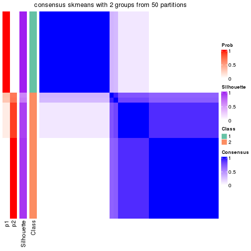</p>

</div>
<div id='tab-node-043-consensus-heatmap-2'>
<pre><code class="r">consensus_heatmap(res, k = 3)
</code></pre>

<p>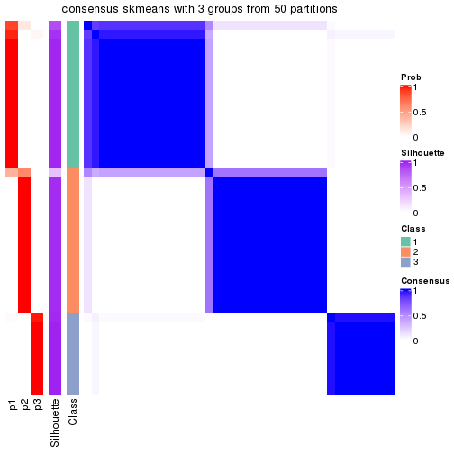</p>

</div>
<div id='tab-node-043-consensus-heatmap-3'>
<pre><code class="r">consensus_heatmap(res, k = 4)
</code></pre>

<p>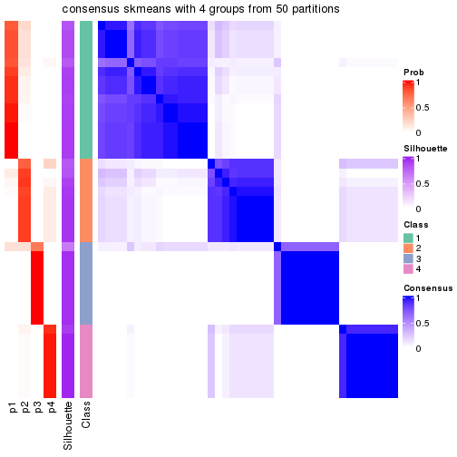</p>

</div>
<div id='tab-node-043-consensus-heatmap-4'>
<pre><code class="r">consensus_heatmap(res, k = 5)
</code></pre>

<p>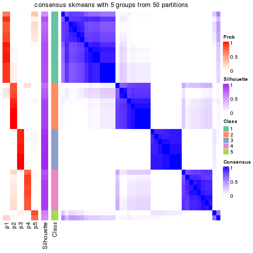</p>

</div>
<div id='tab-node-043-consensus-heatmap-5'>
<pre><code class="r">consensus_heatmap(res, k = 6)
</code></pre>

<p>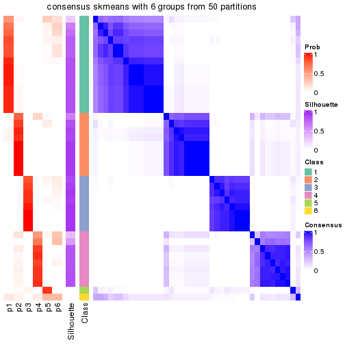</p>

</div>
<div id='tab-node-043-consensus-heatmap-6'>
<pre><code class="r">consensus_heatmap(res, k = 7)
</code></pre>

<p>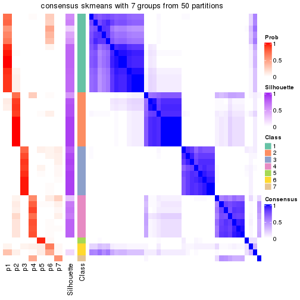</p>

</div>
<div id='tab-node-043-consensus-heatmap-7'>
<pre><code class="r">consensus_heatmap(res, k = 8)
</code></pre>

<p>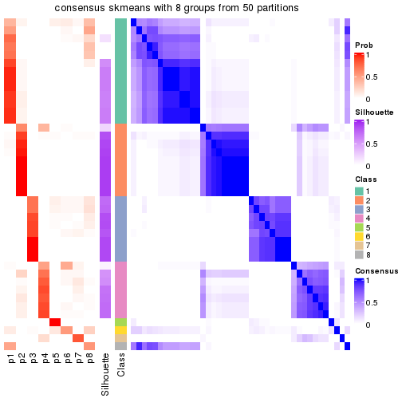</p>

</div>
</div>

Heatmaps for the membership of samples in all partitions to see how consistent they are:


<script>
$( function() {
	$( '#tabs-node-043-membership-heatmap' ).tabs();
} );
</script>
<div id='tabs-node-043-membership-heatmap'>
<ul>
<li><a href='#tab-node-043-membership-heatmap-1'>k = 2</a></li>
<li><a href='#tab-node-043-membership-heatmap-2'>k = 3</a></li>
<li><a href='#tab-node-043-membership-heatmap-3'>k = 4</a></li>
<li><a href='#tab-node-043-membership-heatmap-4'>k = 5</a></li>
<li><a href='#tab-node-043-membership-heatmap-5'>k = 6</a></li>
<li><a href='#tab-node-043-membership-heatmap-6'>k = 7</a></li>
<li><a href='#tab-node-043-membership-heatmap-7'>k = 8</a></li>
</ul>
<div id='tab-node-043-membership-heatmap-1'>
<pre><code class="r">membership_heatmap(res, k = 2)
</code></pre>

<p>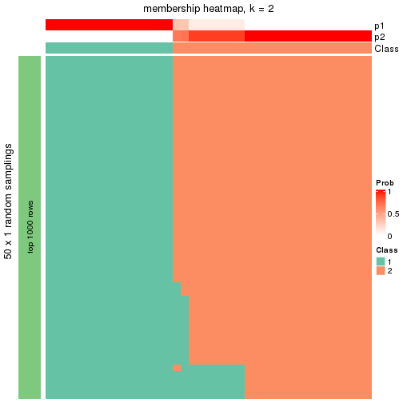</p>

</div>
<div id='tab-node-043-membership-heatmap-2'>
<pre><code class="r">membership_heatmap(res, k = 3)
</code></pre>

<p>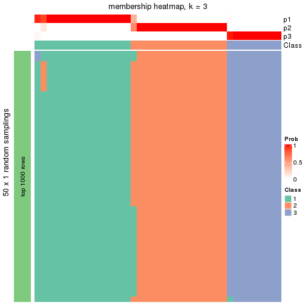</p>

</div>
<div id='tab-node-043-membership-heatmap-3'>
<pre><code class="r">membership_heatmap(res, k = 4)
</code></pre>

<p>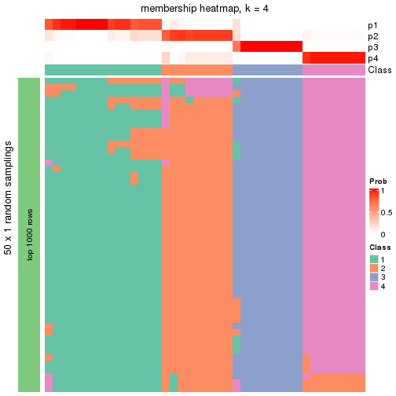</p>

</div>
<div id='tab-node-043-membership-heatmap-4'>
<pre><code class="r">membership_heatmap(res, k = 5)
</code></pre>

<p>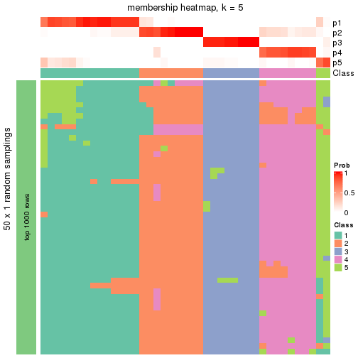</p>

</div>
<div id='tab-node-043-membership-heatmap-5'>
<pre><code class="r">membership_heatmap(res, k = 6)
</code></pre>

<p>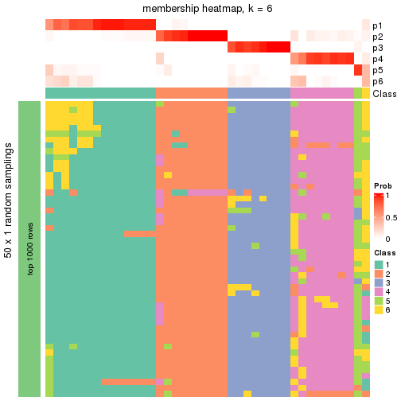</p>

</div>
<div id='tab-node-043-membership-heatmap-6'>
<pre><code class="r">membership_heatmap(res, k = 7)
</code></pre>

<p>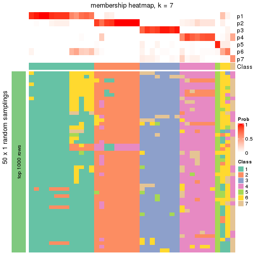</p>

</div>
<div id='tab-node-043-membership-heatmap-7'>
<pre><code class="r">membership_heatmap(res, k = 8)
</code></pre>

<p>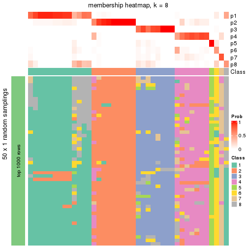</p>

</div>
</div>

As soon as the classes for columns are determined, the signatures
that are significantly different between subgroups can be looked for. 
Following are the heatmaps for signatures.


<script>
$( function() {
	$( '#tabs-node-043-get-signatures' ).tabs();
} );
</script>
<div id='tabs-node-043-get-signatures'>
<ul>
<li><a href='#tab-node-043-get-signatures-1'>k = 2</a></li>
<li><a href='#tab-node-043-get-signatures-2'>k = 3</a></li>
<li><a href='#tab-node-043-get-signatures-3'>k = 4</a></li>
<li><a href='#tab-node-043-get-signatures-4'>k = 5</a></li>
<li><a href='#tab-node-043-get-signatures-5'>k = 6</a></li>
<li><a href='#tab-node-043-get-signatures-6'>k = 7</a></li>
<li><a href='#tab-node-043-get-signatures-7'>k = 8</a></li>
</ul>
<div id='tab-node-043-get-signatures-1'>
<pre><code class="r">get_signatures(res, k = 2)
</code></pre>

<p>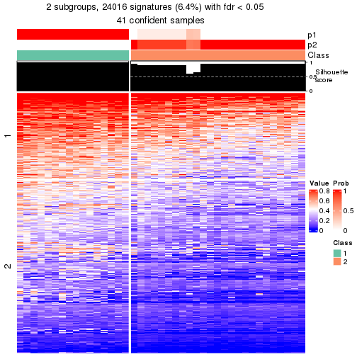</p>

</div>
<div id='tab-node-043-get-signatures-2'>
<pre><code class="r">get_signatures(res, k = 3)
</code></pre>

<p>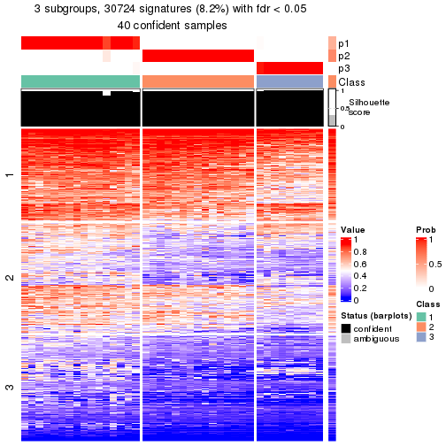</p>

</div>
<div id='tab-node-043-get-signatures-3'>
<pre><code class="r">get_signatures(res, k = 4)
</code></pre>

<p>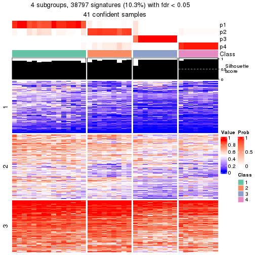</p>

</div>
<div id='tab-node-043-get-signatures-4'>
<pre><code class="r">get_signatures(res, k = 5)
</code></pre>

<p>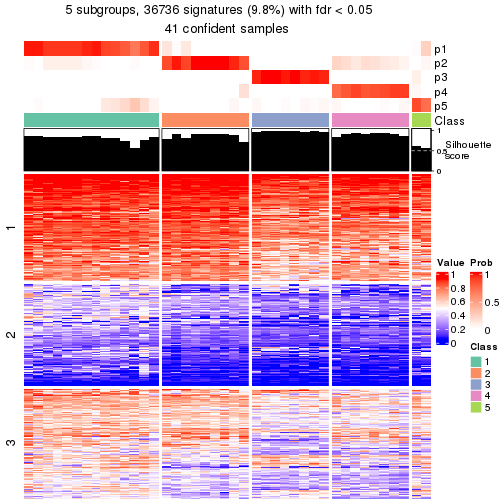</p>

</div>
<div id='tab-node-043-get-signatures-5'>
<pre><code class="r">get_signatures(res, k = 6)
</code></pre>

<p>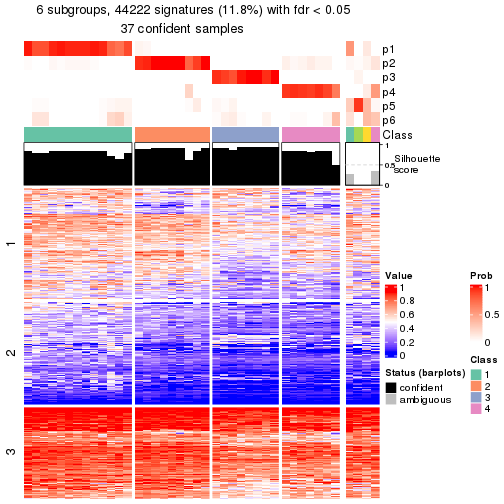</p>

</div>
<div id='tab-node-043-get-signatures-6'>
<pre><code class="r">get_signatures(res, k = 7)
</code></pre>

<p>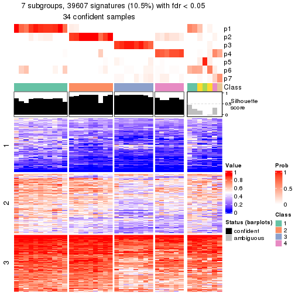</p>

</div>
<div id='tab-node-043-get-signatures-7'>
<pre><code class="r">get_signatures(res, k = 8)
</code></pre>

<p>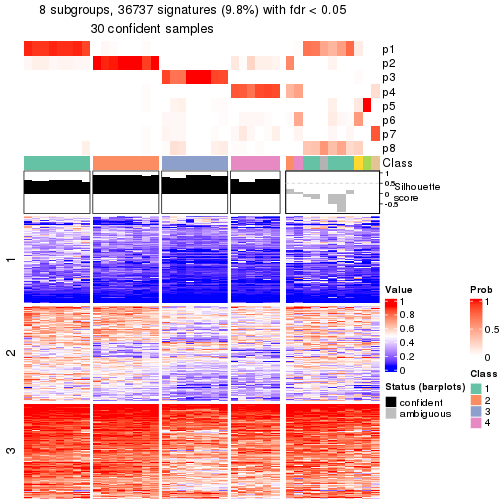</p>

</div>
</div>


Compare the overlap of signatures from different k:

```r
compare_signatures(res)
```

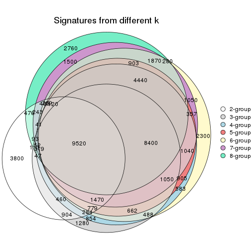

`get_signature()` returns a data frame invisibly. To get the list of signatures, the function
call should be assigned to a variable explicitly. In following code, if `plot` argument is set
to `FALSE`, no heatmap is plotted while only the differential analysis is performed.

```r
# code only for demonstration
tb = get_signature(res, k = ..., plot = FALSE)
```

An example of the output of `tb` is:

```
#>   which_row         fdr    mean_1    mean_2 scaled_mean_1 scaled_mean_2 km
#> 1        38 0.042760348  8.373488  9.131774    -0.5533452     0.5164555  1
#> 2        40 0.018707592  7.106213  8.469186    -0.6173731     0.5762149  1
#> 3        55 0.019134737 10.221463 11.207825    -0.6159697     0.5749050  1
#> 4        59 0.006059896  5.921854  7.869574    -0.6899429     0.6439467  1
#> 5        60 0.018055526  8.928898 10.211722    -0.6204761     0.5791110  1
#> 6        98 0.009384629 15.714769 14.887706     0.6635654    -0.6193277  2
...
```

The columns in `tb` are:

1. `which_row`: row indices corresponding to the input matrix.
2. `fdr`: FDR for the differential test. 
3. `mean_x`: The mean value in group x.
4. `scaled_mean_x`: The mean value in group x after rows are scaled.
5. `km`: Row groups if k-means clustering is applied to rows (which is done by automatically selecting number of clusters).

If there are too many signatures, `top_signatures = ...` can be set to only show the 
signatures with the highest FDRs:

```r
# code only for demonstration
# e.g. to show the top 500 most significant rows
tb = get_signature(res, k = ..., top_signatures = 500)
```

If the signatures are defined as these which are uniquely high in current group, `diff_method` argument
can be set to `"uniquely_high_in_one_group"`:

```r
# code only for demonstration
tb = get_signature(res, k = ..., diff_method = "uniquely_high_in_one_group")
```


UMAP plot which shows how samples are separated.


<script>
$( function() {
	$( '#tabs-node-043-dimension-reduction' ).tabs();
} );
</script>
<div id='tabs-node-043-dimension-reduction'>
<ul>
<li><a href='#tab-node-043-dimension-reduction-1'>k = 2</a></li>
<li><a href='#tab-node-043-dimension-reduction-2'>k = 3</a></li>
<li><a href='#tab-node-043-dimension-reduction-3'>k = 4</a></li>
<li><a href='#tab-node-043-dimension-reduction-4'>k = 5</a></li>
<li><a href='#tab-node-043-dimension-reduction-5'>k = 6</a></li>
<li><a href='#tab-node-043-dimension-reduction-6'>k = 7</a></li>
<li><a href='#tab-node-043-dimension-reduction-7'>k = 8</a></li>
</ul>
<div id='tab-node-043-dimension-reduction-1'>
<pre><code class="r">dimension_reduction(res, k = 2, method = &quot;UMAP&quot;)
</code></pre>

<p>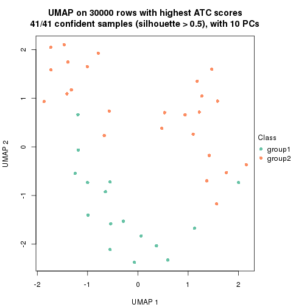</p>

</div>
<div id='tab-node-043-dimension-reduction-2'>
<pre><code class="r">dimension_reduction(res, k = 3, method = &quot;UMAP&quot;)
</code></pre>

<p>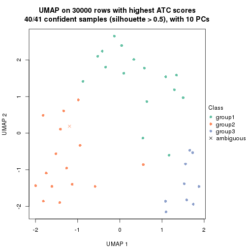</p>

</div>
<div id='tab-node-043-dimension-reduction-3'>
<pre><code class="r">dimension_reduction(res, k = 4, method = &quot;UMAP&quot;)
</code></pre>

<p>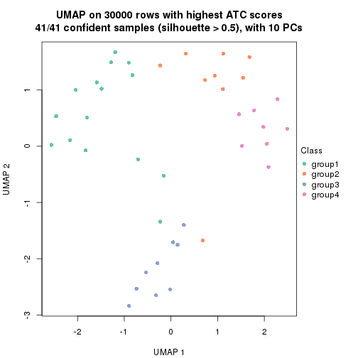</p>

</div>
<div id='tab-node-043-dimension-reduction-4'>
<pre><code class="r">dimension_reduction(res, k = 5, method = &quot;UMAP&quot;)
</code></pre>

<p>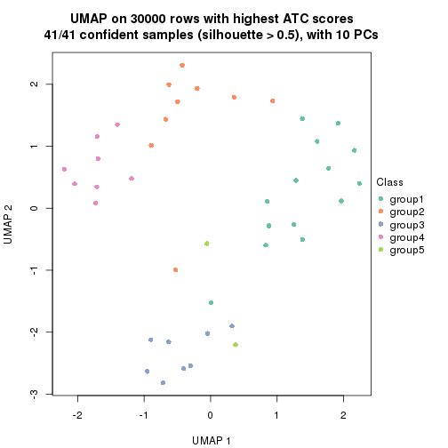</p>

</div>
<div id='tab-node-043-dimension-reduction-5'>
<pre><code class="r">dimension_reduction(res, k = 6, method = &quot;UMAP&quot;)
</code></pre>

<p>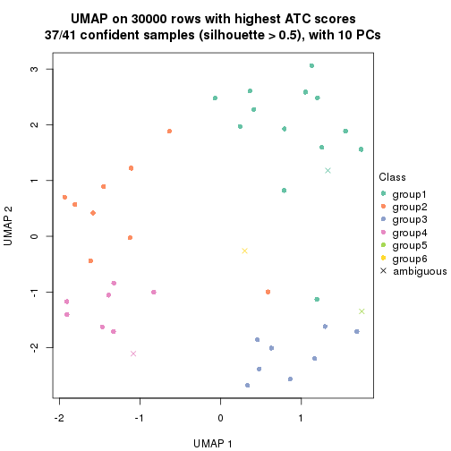</p>

</div>
<div id='tab-node-043-dimension-reduction-6'>
<pre><code class="r">dimension_reduction(res, k = 7, method = &quot;UMAP&quot;)
</code></pre>

<p>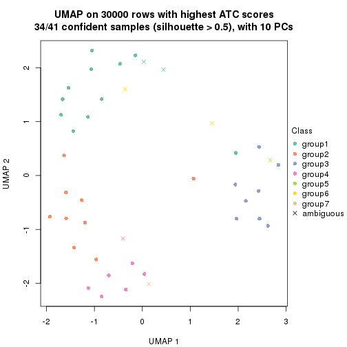</p>

</div>
<div id='tab-node-043-dimension-reduction-7'>
<pre><code class="r">dimension_reduction(res, k = 8, method = &quot;UMAP&quot;)
</code></pre>

<p>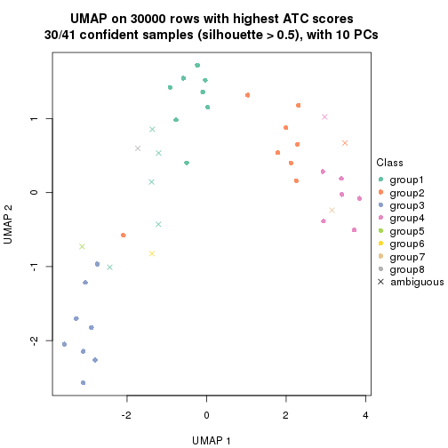</p>

</div>
</div>


Following heatmap shows how subgroups are split when increasing `k`:

```r
collect_classes(res)
```

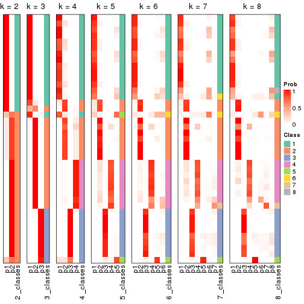


If matrix rows can be associated to genes, consider to use `functional_enrichment(res,
...)` to perform function enrichment for the signature genes. See [this vignette](https://jokergoo.github.io/cola_vignettes/functional_enrichment.html) for more detailed explanations.


 

---------------------------------------------------


### Node044


Parent node: [Node04](#Node04).
Child nodes: 
                Node0121-leaf
        ,
                Node0122-leaf
        ,
                Node0123-leaf
        ,
                Node0211-leaf
        ,
                [Node0212](#Node0212)
        ,
                Node0213-leaf
        ,
                [Node0221](#Node0221)
        ,
                Node0222-leaf
        ,
                Node0223-leaf
        ,
                [Node0231](#Node0231)
        ,
                Node0232-leaf
        ,
                Node0233-leaf
        ,
                Node0241-leaf
        ,
                Node0242-leaf
        ,
                Node0411-leaf
        ,
                Node0412-leaf
        ,
                Node0413-leaf
        ,
                Node0421-leaf
        ,
                Node0422-leaf
        ,
                Node0423-leaf
        ,
                Node0431-leaf
        ,
                Node0432-leaf
        ,
                Node0433-leaf
        ,
                Node0441-leaf
        ,
                Node0442-leaf
        ,
                Node0443-leaf
        ,
                Node0511-leaf
        ,
                [Node0512](#Node0512)
        ,
                Node0513-leaf
        ,
                Node0521-leaf
        ,
                Node0522-leaf
        ,
                Node0523-leaf
        .


The object with results only for a single top-value method and a single partitioning method 
can be extracted as:

```r
res = res_rh["044"]
```

A summary of `res` and all the functions that can be applied to it:

```r
res
```

```
#> A 'ConsensusPartition' object with k = 2, 3, 4, 5, 6, 7, 8.
#>   On a matrix with 30000 rows and 30 columns.
#>   Top rows (1000) are extracted by 'ATC' method.
#>   Subgroups are detected by 'kmeans' method.
#>   Performed in total 350 partitions by row resampling.
#>   Best k for subgroups seems to be 3.
#> 
#> Following methods can be applied to this 'ConsensusPartition' object:
#>  [1] "cola_report"             "collect_classes"         "collect_plots"          
#>  [4] "collect_stats"           "colnames"                "compare_partitions"     
#>  [7] "compare_signatures"      "consensus_heatmap"       "dimension_reduction"    
#> [10] "functional_enrichment"   "get_anno_col"            "get_anno"               
#> [13] "get_classes"             "get_consensus"           "get_matrix"             
#> [16] "get_membership"          "get_param"               "get_signatures"         
#> [19] "get_stats"               "is_best_k"               "is_stable_k"            
#> [22] "membership_heatmap"      "ncol"                    "nrow"                   
#> [25] "plot_ecdf"               "predict_classes"         "rownames"               
#> [28] "select_partition_number" "show"                    "suggest_best_k"         
#> [31] "test_to_known_factors"   "top_rows_heatmap"
```

`collect_plots()` function collects all the plots made from `res` for all `k` (number of subgroups)
into one single page to provide an easy and fast comparison between different `k`.

```r
collect_plots(res)
```

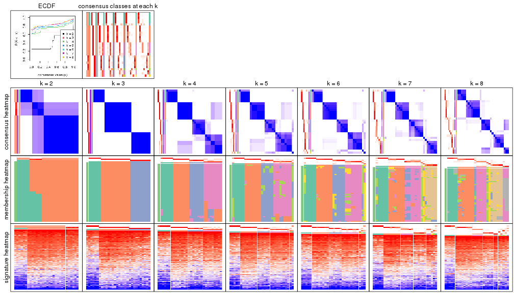

The plots are:

- The first row: a plot of the eCDF (empirical cumulative distribution
  function) curves of the consensus matrix for each `k` and the heatmap of
  predicted classes for each `k`.
- The second row: heatmaps of the consensus matrix for each `k`.
- The third row: heatmaps of the membership matrix for each `k`.
- The fouth row: heatmaps of the signatures for each `k`.

All the plots in panels can be made by individual functions and they are
plotted later in this section.

`select_partition_number()` produces several plots showing different
statistics for choosing "optimized" `k`. There are following statistics:

- eCDF curves of the consensus matrix for each `k`;
- 1-PAC. [The PAC score](https://en.wikipedia.org/wiki/Consensus_clustering#Over-interpretation_potential_of_consensus_clustering)
  measures the proportion of the ambiguous subgrouping.
- Mean silhouette score.
- Concordance. The mean probability of fiting the consensus subgroup labels in all
  partitions.
- Area increased. Denote $A_k$ as the area under the eCDF curve for current
  `k`, the area increased is defined as $A_k - A_{k-1}$.
- Rand index. The percent of pairs of samples that are both in a same cluster
  or both are not in a same cluster in the partition of k and k-1.
- Jaccard index. The ratio of pairs of samples are both in a same cluster in
  the partition of k and k-1 and the pairs of samples are both in a same
  cluster in the partition k or k-1.

The detailed explanations of these statistics can be found in [the _cola_
vignette](https://jokergoo.github.io/cola_vignettes/cola.html#toc_13).

Generally speaking, higher 1-PAC score, higher mean silhouette score or higher
concordance corresponds to better partition. Rand index and Jaccard index
measure how similar the current partition is compared to partition with `k-1`.
If they are too similar, we won't accept `k` is better than `k-1`.

```r
select_partition_number(res)
```

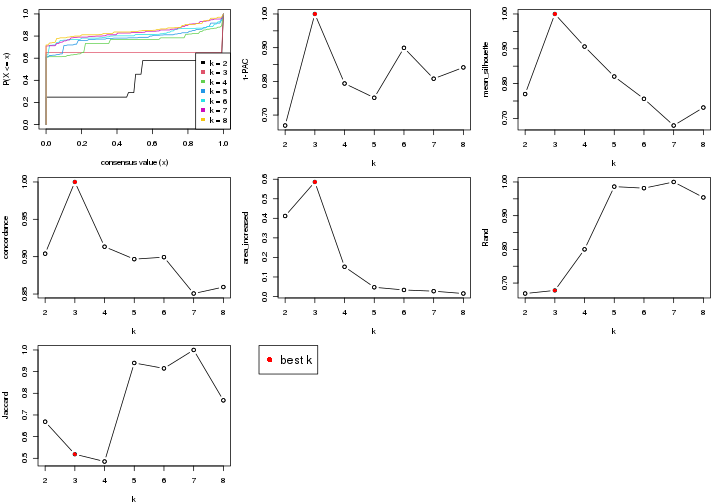

The numeric values for all these statistics can be obtained by `get_stats()`.

```r
get_stats(res)
```

```
#>   k 1-PAC mean_silhouette concordance area_increased  Rand Jaccard
#> 2 2 0.669           0.770       0.904         0.4119 0.669   0.669
#> 3 3 1.000           1.000       1.000         0.5860 0.678   0.519
#> 4 4 0.794           0.906       0.913         0.1520 0.800   0.485
#> 5 5 0.751           0.820       0.897         0.0472 0.986   0.940
#> 6 6 0.899           0.756       0.899         0.0335 0.982   0.915
#> 7 7 0.808           0.680       0.851         0.0273 1.000   1.000
#> 8 8 0.841           0.731       0.859         0.0153 0.954   0.767
```

`suggest_best_k()` suggests the best $k$ based on these statistics. The rules are as follows:

- All $k$ with Jaccard index larger than 0.95 are removed because increasing
  $k$ does not provide enough extra information. If all $k$ are removed, it is
  marked as no subgroup is detected.
- For all $k$ with 1-PAC score larger than 0.9, the maximal $k$ is taken as
  the best $k$, and other $k$ are marked as optional $k$.
- If it does not fit the second rule. The $k$ with the maximal vote of the
  highest 1-PAC score, highest mean silhouette, and highest concordance is
  taken as the best $k$.

```r
suggest_best_k(res)
```

```
#> [1] 3
```


Following is the table of the partitions (You need to click the **show/hide
code output** link to see it). The membership matrix (columns with name `p*`)
is inferred by
[`clue::cl_consensus()`](https://www.rdocumentation.org/link/cl_consensus?package=clue)
function with the `SE` method. Basically the value in the membership matrix
represents the probability to belong to a certain group. The finall subgroup
label for an item is determined with the group with highest probability it
belongs to.

In `get_classes()` function, the entropy is calculated from the membership
matrix and the silhouette score is calculated from the consensus matrix.


<script>
$( function() {
	$( '#tabs-node-044-get-classes' ).tabs();
} );
</script>
<div id='tabs-node-044-get-classes'>
<ul>
<li><a href='#tab-node-044-get-classes-1'>k = 2</a></li>
<li><a href='#tab-node-044-get-classes-2'>k = 3</a></li>
<li><a href='#tab-node-044-get-classes-3'>k = 4</a></li>
<li><a href='#tab-node-044-get-classes-4'>k = 5</a></li>
<li><a href='#tab-node-044-get-classes-5'>k = 6</a></li>
<li><a href='#tab-node-044-get-classes-6'>k = 7</a></li>
<li><a href='#tab-node-044-get-classes-7'>k = 8</a></li>
</ul>

<div id='tab-node-044-get-classes-1'>
<p><a id='tab-node-044-get-classes-1-a' style='color:#0366d6' href='#'>show/hide code output</a></p>
<pre><code class="r">cbind(get_classes(res, k = 2), get_membership(res, k = 2))
</code></pre>

<pre><code>#&gt;                 class entropy silhouette   p1   p2
#&gt; TCGA.G9.6343.01     2   0.995      0.861 0.46 0.54
#&gt; TCGA.CH.5754.01     1   0.995      1.000 0.54 0.46
#&gt; TCGA.XK.AAJT.01     2   0.995      0.861 0.46 0.54
#&gt; TCGA.V1.A9O5.01     2   0.000      0.314 0.00 1.00
#&gt; TCGA.M7.A721.01     2   0.995      0.861 0.46 0.54
#&gt; TCGA.G9.7510.01     2   0.995      0.861 0.46 0.54
#&gt; TCGA.KK.A7AV.01     2   0.995      0.861 0.46 0.54
#&gt; TCGA.XJ.A83H.01     2   0.242      0.219 0.04 0.96
#&gt; TCGA.ZG.A8QY.01     2   0.995      0.861 0.46 0.54
#&gt; TCGA.G9.A9S0.01     2   0.242      0.219 0.04 0.96
#&gt; TCGA.VP.A87H.01     2   0.995      0.861 0.46 0.54
#&gt; TCGA.HC.7736.01     2   0.995      0.861 0.46 0.54
#&gt; TCGA.G9.6499.11     2   0.995      0.861 0.46 0.54
#&gt; TCGA.KK.A8I9.01     2   0.995      0.861 0.46 0.54
#&gt; TCGA.EJ.7317.01     2   0.995      0.861 0.46 0.54
#&gt; TCGA.EJ.A65E.01     2   0.995      0.861 0.46 0.54
#&gt; TCGA.ZG.A8QX.01     2   0.995      0.861 0.46 0.54
#&gt; TCGA.HI.7168.01     1   0.995      1.000 0.54 0.46
#&gt; TCGA.EJ.A65M.01     2   0.995      0.861 0.46 0.54
#&gt; TCGA.HC.7211.01     2   0.242      0.219 0.04 0.96
#&gt; TCGA.KK.A8I6.01     1   0.995      1.000 0.54 0.46
#&gt; TCGA.EJ.5504.01     2   0.000      0.314 0.00 1.00
#&gt; TCGA.CH.5766.01     1   0.995      1.000 0.54 0.46
#&gt; TCGA.G9.7523.01     2   0.995      0.861 0.46 0.54
#&gt; TCGA.J9.A8CM.01     1   0.995      1.000 0.54 0.46
#&gt; TCGA.EJ.7331.01     2   0.995      0.861 0.46 0.54
#&gt; TCGA.HC.A9TE.01     1   0.995      1.000 0.54 0.46
#&gt; TCGA.EJ.7115.01     2   0.995      0.861 0.46 0.54
#&gt; TCGA.V1.A8ML.01     2   0.995      0.861 0.46 0.54
#&gt; TCGA.EJ.5518.01     2   0.000      0.314 0.00 1.00
</code></pre>

<script>
$('#tab-node-044-get-classes-1-a').parent().next().next().hide();
$('#tab-node-044-get-classes-1-a').click(function(){
  $('#tab-node-044-get-classes-1-a').parent().next().next().toggle();
  return(false);
});
</script>
</div>

<div id='tab-node-044-get-classes-2'>
<p><a id='tab-node-044-get-classes-2-a' style='color:#0366d6' href='#'>show/hide code output</a></p>
<pre><code class="r">cbind(get_classes(res, k = 3), get_membership(res, k = 3))
</code></pre>

<pre><code>#&gt;                 class entropy silhouette p1 p2 p3
#&gt; TCGA.G9.6343.01     3       0          1  0  0  1
#&gt; TCGA.CH.5754.01     1       0          1  1  0  0
#&gt; TCGA.XK.AAJT.01     3       0          1  0  0  1
#&gt; TCGA.V1.A9O5.01     3       0          1  0  0  1
#&gt; TCGA.M7.A721.01     3       0          1  0  0  1
#&gt; TCGA.G9.7510.01     2       0          1  0  1  0
#&gt; TCGA.KK.A7AV.01     2       0          1  0  1  0
#&gt; TCGA.XJ.A83H.01     3       0          1  0  0  1
#&gt; TCGA.ZG.A8QY.01     2       0          1  0  1  0
#&gt; TCGA.G9.A9S0.01     3       0          1  0  0  1
#&gt; TCGA.VP.A87H.01     2       0          1  0  1  0
#&gt; TCGA.HC.7736.01     3       0          1  0  0  1
#&gt; TCGA.G9.6499.11     2       0          1  0  1  0
#&gt; TCGA.KK.A8I9.01     2       0          1  0  1  0
#&gt; TCGA.EJ.7317.01     2       0          1  0  1  0
#&gt; TCGA.EJ.A65E.01     2       0          1  0  1  0
#&gt; TCGA.ZG.A8QX.01     2       0          1  0  1  0
#&gt; TCGA.HI.7168.01     1       0          1  1  0  0
#&gt; TCGA.EJ.A65M.01     2       0          1  0  1  0
#&gt; TCGA.HC.7211.01     3       0          1  0  0  1
#&gt; TCGA.KK.A8I6.01     1       0          1  1  0  0
#&gt; TCGA.EJ.5504.01     3       0          1  0  0  1
#&gt; TCGA.CH.5766.01     1       0          1  1  0  0
#&gt; TCGA.G9.7523.01     2       0          1  0  1  0
#&gt; TCGA.J9.A8CM.01     1       0          1  1  0  0
#&gt; TCGA.EJ.7331.01     2       0          1  0  1  0
#&gt; TCGA.HC.A9TE.01     1       0          1  1  0  0
#&gt; TCGA.EJ.7115.01     2       0          1  0  1  0
#&gt; TCGA.V1.A8ML.01     2       0          1  0  1  0
#&gt; TCGA.EJ.5518.01     3       0          1  0  0  1
</code></pre>

<script>
$('#tab-node-044-get-classes-2-a').parent().next().next().hide();
$('#tab-node-044-get-classes-2-a').click(function(){
  $('#tab-node-044-get-classes-2-a').parent().next().next().toggle();
  return(false);
});
</script>
</div>

<div id='tab-node-044-get-classes-3'>
<p><a id='tab-node-044-get-classes-3-a' style='color:#0366d6' href='#'>show/hide code output</a></p>
<pre><code class="r">cbind(get_classes(res, k = 4), get_membership(res, k = 4))
</code></pre>

<pre><code>#&gt;                 class entropy silhouette   p1   p2   p3   p4
#&gt; TCGA.G9.6343.01     4  0.3172      0.716 0.00 0.00 0.16 0.84
#&gt; TCGA.CH.5754.01     1  0.0000      0.982 1.00 0.00 0.00 0.00
#&gt; TCGA.XK.AAJT.01     4  0.3400      0.713 0.00 0.00 0.18 0.82
#&gt; TCGA.V1.A9O5.01     3  0.1211      0.946 0.00 0.00 0.96 0.04
#&gt; TCGA.M7.A721.01     4  0.3610      0.711 0.00 0.00 0.20 0.80
#&gt; TCGA.G9.7510.01     4  0.3801      0.834 0.00 0.22 0.00 0.78
#&gt; TCGA.KK.A7AV.01     4  0.3801      0.834 0.00 0.22 0.00 0.78
#&gt; TCGA.XJ.A83H.01     3  0.1637      0.925 0.00 0.00 0.94 0.06
#&gt; TCGA.ZG.A8QY.01     2  0.0000      1.000 0.00 1.00 0.00 0.00
#&gt; TCGA.G9.A9S0.01     3  0.0000      0.951 0.00 0.00 1.00 0.00
#&gt; TCGA.VP.A87H.01     2  0.0000      1.000 0.00 1.00 0.00 0.00
#&gt; TCGA.HC.7736.01     3  0.1211      0.946 0.00 0.00 0.96 0.04
#&gt; TCGA.G9.6499.11     4  0.4713      0.699 0.00 0.36 0.00 0.64
#&gt; TCGA.KK.A8I9.01     2  0.0000      1.000 0.00 1.00 0.00 0.00
#&gt; TCGA.EJ.7317.01     2  0.0000      1.000 0.00 1.00 0.00 0.00
#&gt; TCGA.EJ.A65E.01     2  0.0000      1.000 0.00 1.00 0.00 0.00
#&gt; TCGA.ZG.A8QX.01     4  0.3801      0.834 0.00 0.22 0.00 0.78
#&gt; TCGA.HI.7168.01     1  0.2647      0.903 0.88 0.00 0.00 0.12
#&gt; TCGA.EJ.A65M.01     4  0.4713      0.699 0.00 0.36 0.00 0.64
#&gt; TCGA.HC.7211.01     3  0.3400      0.838 0.00 0.00 0.82 0.18
#&gt; TCGA.KK.A8I6.01     1  0.0000      0.982 1.00 0.00 0.00 0.00
#&gt; TCGA.EJ.5504.01     3  0.0707      0.950 0.00 0.00 0.98 0.02
#&gt; TCGA.CH.5766.01     1  0.0000      0.982 1.00 0.00 0.00 0.00
#&gt; TCGA.G9.7523.01     2  0.0000      1.000 0.00 1.00 0.00 0.00
#&gt; TCGA.J9.A8CM.01     1  0.0000      0.982 1.00 0.00 0.00 0.00
#&gt; TCGA.EJ.7331.01     4  0.3801      0.834 0.00 0.22 0.00 0.78
#&gt; TCGA.HC.A9TE.01     1  0.0000      0.982 1.00 0.00 0.00 0.00
#&gt; TCGA.EJ.7115.01     2  0.0000      1.000 0.00 1.00 0.00 0.00
#&gt; TCGA.V1.A8ML.01     2  0.0000      1.000 0.00 1.00 0.00 0.00
#&gt; TCGA.EJ.5518.01     3  0.0000      0.951 0.00 0.00 1.00 0.00
</code></pre>

<script>
$('#tab-node-044-get-classes-3-a').parent().next().next().hide();
$('#tab-node-044-get-classes-3-a').click(function(){
  $('#tab-node-044-get-classes-3-a').parent().next().next().toggle();
  return(false);
});
</script>
</div>

<div id='tab-node-044-get-classes-4'>
<p><a id='tab-node-044-get-classes-4-a' style='color:#0366d6' href='#'>show/hide code output</a></p>
<pre><code class="r">cbind(get_classes(res, k = 5), get_membership(res, k = 5))
</code></pre>

<pre><code>#&gt;                 class entropy silhouette   p1   p2   p3   p4   p5
#&gt; TCGA.G9.6343.01     4  0.2616      0.772 0.00 0.00 0.02 0.88 0.10
#&gt; TCGA.CH.5754.01     1  0.0000      0.917 1.00 0.00 0.00 0.00 0.00
#&gt; TCGA.XK.AAJT.01     4  0.5341      0.545 0.00 0.00 0.08 0.62 0.30
#&gt; TCGA.V1.A9O5.01     3  0.3852      0.736 0.00 0.00 0.76 0.02 0.22
#&gt; TCGA.M7.A721.01     4  0.3697      0.774 0.00 0.00 0.10 0.82 0.08
#&gt; TCGA.G9.7510.01     4  0.2020      0.864 0.00 0.10 0.00 0.90 0.00
#&gt; TCGA.KK.A7AV.01     4  0.2020      0.864 0.00 0.10 0.00 0.90 0.00
#&gt; TCGA.XJ.A83H.01     3  0.2754      0.760 0.00 0.00 0.88 0.04 0.08
#&gt; TCGA.ZG.A8QY.01     2  0.0000      0.980 0.00 1.00 0.00 0.00 0.00
#&gt; TCGA.G9.A9S0.01     3  0.0000      0.824 0.00 0.00 1.00 0.00 0.00
#&gt; TCGA.VP.A87H.01     2  0.0000      0.980 0.00 1.00 0.00 0.00 0.00
#&gt; TCGA.HC.7736.01     3  0.2732      0.734 0.00 0.00 0.84 0.00 0.16
#&gt; TCGA.G9.6499.11     4  0.2929      0.818 0.00 0.18 0.00 0.82 0.00
#&gt; TCGA.KK.A8I9.01     2  0.0000      0.980 0.00 1.00 0.00 0.00 0.00
#&gt; TCGA.EJ.7317.01     2  0.2012      0.910 0.00 0.92 0.00 0.06 0.02
#&gt; TCGA.EJ.A65E.01     2  0.0609      0.977 0.00 0.98 0.00 0.00 0.02
#&gt; TCGA.ZG.A8QX.01     4  0.2020      0.864 0.00 0.10 0.00 0.90 0.00
#&gt; TCGA.HI.7168.01     1  0.4227      0.400 0.58 0.00 0.00 0.00 0.42
#&gt; TCGA.EJ.A65M.01     4  0.2929      0.818 0.00 0.18 0.00 0.82 0.00
#&gt; TCGA.HC.7211.01     5  0.5498      0.000 0.00 0.00 0.34 0.08 0.58
#&gt; TCGA.KK.A8I6.01     1  0.0000      0.917 1.00 0.00 0.00 0.00 0.00
#&gt; TCGA.EJ.5504.01     3  0.2280      0.815 0.00 0.00 0.88 0.00 0.12
#&gt; TCGA.CH.5766.01     1  0.0000      0.917 1.00 0.00 0.00 0.00 0.00
#&gt; TCGA.G9.7523.01     2  0.0000      0.980 0.00 1.00 0.00 0.00 0.00
#&gt; TCGA.J9.A8CM.01     1  0.0000      0.917 1.00 0.00 0.00 0.00 0.00
#&gt; TCGA.EJ.7331.01     4  0.3697      0.850 0.00 0.10 0.00 0.82 0.08
#&gt; TCGA.HC.A9TE.01     1  0.0000      0.917 1.00 0.00 0.00 0.00 0.00
#&gt; TCGA.EJ.7115.01     2  0.0609      0.977 0.00 0.98 0.00 0.00 0.02
#&gt; TCGA.V1.A8ML.01     2  0.0609      0.977 0.00 0.98 0.00 0.00 0.02
#&gt; TCGA.EJ.5518.01     3  0.0000      0.824 0.00 0.00 1.00 0.00 0.00
</code></pre>

<script>
$('#tab-node-044-get-classes-4-a').parent().next().next().hide();
$('#tab-node-044-get-classes-4-a').click(function(){
  $('#tab-node-044-get-classes-4-a').parent().next().next().toggle();
  return(false);
});
</script>
</div>

<div id='tab-node-044-get-classes-5'>
<p><a id='tab-node-044-get-classes-5-a' style='color:#0366d6' href='#'>show/hide code output</a></p>
<pre><code class="r">cbind(get_classes(res, k = 6), get_membership(res, k = 6))
</code></pre>

<pre><code>#&gt;                 class entropy silhouette   p1   p2   p3   p4   p5   p6
#&gt; TCGA.G9.6343.01     4  0.4566      0.603 0.00 0.00 0.00 0.70 0.14 0.16
#&gt; TCGA.CH.5754.01     1  0.0000      0.898 1.00 0.00 0.00 0.00 0.00 0.00
#&gt; TCGA.XK.AAJT.01     6  0.3315      0.000 0.00 0.00 0.02 0.20 0.00 0.78
#&gt; TCGA.V1.A9O5.01     3  0.4200      0.639 0.00 0.00 0.74 0.00 0.12 0.14
#&gt; TCGA.M7.A721.01     4  0.4713      0.636 0.00 0.00 0.02 0.72 0.12 0.14
#&gt; TCGA.G9.7510.01     4  0.0547      0.798 0.00 0.02 0.00 0.98 0.00 0.00
#&gt; TCGA.KK.A7AV.01     4  0.0547      0.798 0.00 0.02 0.00 0.98 0.00 0.00
#&gt; TCGA.XJ.A83H.01     3  0.0547      0.808 0.00 0.00 0.98 0.02 0.00 0.00
#&gt; TCGA.ZG.A8QY.01     2  0.0000      0.973 0.00 1.00 0.00 0.00 0.00 0.00
#&gt; TCGA.G9.A9S0.01     3  0.0000      0.827 0.00 0.00 1.00 0.00 0.00 0.00
#&gt; TCGA.VP.A87H.01     2  0.0000      0.973 0.00 1.00 0.00 0.00 0.00 0.00
#&gt; TCGA.HC.7736.01     3  0.3309      0.596 0.00 0.00 0.72 0.00 0.00 0.28
#&gt; TCGA.G9.6499.11     4  0.1267      0.774 0.00 0.06 0.00 0.94 0.00 0.00
#&gt; TCGA.KK.A8I9.01     2  0.0000      0.973 0.00 1.00 0.00 0.00 0.00 0.00
#&gt; TCGA.EJ.7317.01     2  0.2190      0.902 0.00 0.90 0.00 0.04 0.06 0.00
#&gt; TCGA.EJ.A65E.01     2  0.1480      0.947 0.00 0.94 0.00 0.00 0.04 0.02
#&gt; TCGA.ZG.A8QX.01     4  0.0547      0.798 0.00 0.02 0.00 0.98 0.00 0.00
#&gt; TCGA.HI.7168.01     1  0.5523      0.229 0.50 0.00 0.00 0.00 0.36 0.14
#&gt; TCGA.EJ.A65M.01     4  0.1556      0.752 0.00 0.08 0.00 0.92 0.00 0.00
#&gt; TCGA.HC.7211.01     5  0.4144      0.000 0.00 0.00 0.36 0.02 0.62 0.00
#&gt; TCGA.KK.A8I6.01     1  0.0547      0.888 0.98 0.00 0.00 0.00 0.00 0.02
#&gt; TCGA.EJ.5504.01     3  0.0547      0.826 0.00 0.00 0.98 0.00 0.00 0.02
#&gt; TCGA.CH.5766.01     1  0.0000      0.898 1.00 0.00 0.00 0.00 0.00 0.00
#&gt; TCGA.G9.7523.01     2  0.0000      0.973 0.00 1.00 0.00 0.00 0.00 0.00
#&gt; TCGA.J9.A8CM.01     1  0.0000      0.898 1.00 0.00 0.00 0.00 0.00 0.00
#&gt; TCGA.EJ.7331.01     4  0.5073      0.628 0.00 0.02 0.00 0.68 0.14 0.16
#&gt; TCGA.HC.A9TE.01     1  0.0000      0.898 1.00 0.00 0.00 0.00 0.00 0.00
#&gt; TCGA.EJ.7115.01     2  0.0547      0.968 0.00 0.98 0.00 0.00 0.00 0.02
#&gt; TCGA.V1.A8ML.01     2  0.1092      0.963 0.00 0.96 0.00 0.00 0.02 0.02
#&gt; TCGA.EJ.5518.01     3  0.0000      0.827 0.00 0.00 1.00 0.00 0.00 0.00
</code></pre>

<script>
$('#tab-node-044-get-classes-5-a').parent().next().next().hide();
$('#tab-node-044-get-classes-5-a').click(function(){
  $('#tab-node-044-get-classes-5-a').parent().next().next().toggle();
  return(false);
});
</script>
</div>

<div id='tab-node-044-get-classes-6'>
<p><a id='tab-node-044-get-classes-6-a' style='color:#0366d6' href='#'>show/hide code output</a></p>
<pre><code class="r">cbind(get_classes(res, k = 7), get_membership(res, k = 7))
</code></pre>

<pre><code>#&gt;                 class entropy silhouette  p1   p2   p3   p4   p5   p6   p7
#&gt; TCGA.G9.6343.01     4   0.349     0.4102 0.0 0.00 0.12 0.78 0.10 0.00 0.00
#&gt; TCGA.CH.5754.01     1   0.000     0.8801 1.0 0.00 0.00 0.00 0.00 0.00 0.00
#&gt; TCGA.XK.AAJT.01     6   0.242     0.0000 0.0 0.00 0.00 0.18 0.00 0.82 0.00
#&gt; TCGA.V1.A9O5.01     7   0.523     0.5940 0.0 0.00 0.12 0.00 0.06 0.18 0.64
#&gt; TCGA.M7.A721.01     4   0.000     0.5585 0.0 0.00 0.00 1.00 0.00 0.00 0.00
#&gt; TCGA.G9.7510.01     4   0.341     0.6586 0.0 0.00 0.38 0.62 0.00 0.00 0.00
#&gt; TCGA.KK.A7AV.01     4   0.314     0.6703 0.0 0.00 0.30 0.70 0.00 0.00 0.00
#&gt; TCGA.XJ.A83H.01     7   0.172     0.8319 0.0 0.00 0.04 0.00 0.04 0.00 0.92
#&gt; TCGA.ZG.A8QY.01     2   0.000     0.8866 0.0 1.00 0.00 0.00 0.00 0.00 0.00
#&gt; TCGA.G9.A9S0.01     7   0.000     0.8394 0.0 0.00 0.00 0.00 0.00 0.00 1.00
#&gt; TCGA.VP.A87H.01     2   0.000     0.8866 0.0 1.00 0.00 0.00 0.00 0.00 0.00
#&gt; TCGA.HC.7736.01     7   0.208     0.7612 0.0 0.00 0.00 0.00 0.00 0.14 0.86
#&gt; TCGA.G9.6499.11     4   0.443     0.6260 0.0 0.06 0.38 0.56 0.00 0.00 0.00
#&gt; TCGA.KK.A8I9.01     2   0.000     0.8866 0.0 1.00 0.00 0.00 0.00 0.00 0.00
#&gt; TCGA.EJ.7317.01     2   0.319     0.7192 0.0 0.76 0.22 0.00 0.00 0.02 0.00
#&gt; TCGA.EJ.A65E.01     2   0.384     0.7716 0.0 0.74 0.16 0.00 0.10 0.00 0.00
#&gt; TCGA.ZG.A8QX.01     4   0.314     0.6675 0.0 0.00 0.30 0.70 0.00 0.00 0.00
#&gt; TCGA.HI.7168.01     1   0.639    -0.0573 0.4 0.00 0.18 0.00 0.34 0.08 0.00
#&gt; TCGA.EJ.A65M.01     4   0.443     0.6260 0.0 0.06 0.38 0.56 0.00 0.00 0.00
#&gt; TCGA.HC.7211.01     5   0.283     0.0000 0.0 0.00 0.00 0.00 0.76 0.00 0.24
#&gt; TCGA.KK.A8I6.01     1   0.000     0.8801 1.0 0.00 0.00 0.00 0.00 0.00 0.00
#&gt; TCGA.EJ.5504.01     7   0.221     0.8343 0.0 0.00 0.04 0.00 0.04 0.02 0.90
#&gt; TCGA.CH.5766.01     1   0.000     0.8801 1.0 0.00 0.00 0.00 0.00 0.00 0.00
#&gt; TCGA.G9.7523.01     2   0.000     0.8866 0.0 1.00 0.00 0.00 0.00 0.00 0.00
#&gt; TCGA.J9.A8CM.01     1   0.000     0.8801 1.0 0.00 0.00 0.00 0.00 0.00 0.00
#&gt; TCGA.EJ.7331.01     4   0.349     0.4102 0.0 0.00 0.12 0.78 0.10 0.00 0.00
#&gt; TCGA.HC.A9TE.01     1   0.000     0.8801 1.0 0.00 0.00 0.00 0.00 0.00 0.00
#&gt; TCGA.EJ.7115.01     2   0.238     0.8474 0.0 0.86 0.12 0.00 0.02 0.00 0.00
#&gt; TCGA.V1.A8ML.01     2   0.291     0.8319 0.0 0.80 0.18 0.00 0.02 0.00 0.00
#&gt; TCGA.EJ.5518.01     7   0.000     0.8394 0.0 0.00 0.00 0.00 0.00 0.00 1.00
</code></pre>

<script>
$('#tab-node-044-get-classes-6-a').parent().next().next().hide();
$('#tab-node-044-get-classes-6-a').click(function(){
  $('#tab-node-044-get-classes-6-a').parent().next().next().toggle();
  return(false);
});
</script>
</div>

<div id='tab-node-044-get-classes-7'>
<p><a id='tab-node-044-get-classes-7-a' style='color:#0366d6' href='#'>show/hide code output</a></p>
<pre><code class="r">cbind(get_classes(res, k = 8), get_membership(res, k = 8))
</code></pre>

<pre><code>#&gt;                 class entropy silhouette   p1   p2   p3   p4   p5   p6   p7   p8
#&gt; TCGA.G9.6343.01     8  0.0000      0.796 0.00 0.00 0.00 0.00 0.00 0.00 0.00 1.00
#&gt; TCGA.CH.5754.01     1  0.0000      0.916 1.00 0.00 0.00 0.00 0.00 0.00 0.00 0.00
#&gt; TCGA.XK.AAJT.01     6  0.0941      0.000 0.00 0.00 0.00 0.02 0.00 0.96 0.00 0.02
#&gt; TCGA.V1.A9O5.01     7  0.6478      0.455 0.00 0.00 0.14 0.12 0.14 0.08 0.52 0.00
#&gt; TCGA.M7.A721.01     8  0.2650      0.391 0.00 0.00 0.00 0.24 0.00 0.00 0.00 0.76
#&gt; TCGA.G9.7510.01     4  0.3193      0.890 0.00 0.00 0.00 0.62 0.00 0.00 0.00 0.38
#&gt; TCGA.KK.A7AV.01     4  0.3193      0.890 0.00 0.00 0.00 0.62 0.00 0.00 0.00 0.38
#&gt; TCGA.XJ.A83H.01     7  0.2348      0.812 0.00 0.00 0.00 0.06 0.04 0.02 0.88 0.00
#&gt; TCGA.ZG.A8QY.01     2  0.0000      0.887 0.00 1.00 0.00 0.00 0.00 0.00 0.00 0.00
#&gt; TCGA.G9.A9S0.01     7  0.0000      0.820 0.00 0.00 0.00 0.00 0.00 0.00 1.00 0.00
#&gt; TCGA.VP.A87H.01     2  0.0000      0.887 0.00 1.00 0.00 0.00 0.00 0.00 0.00 0.00
#&gt; TCGA.HC.7736.01     7  0.1765      0.752 0.00 0.00 0.00 0.00 0.00 0.12 0.88 0.00
#&gt; TCGA.G9.6499.11     4  0.4415      0.859 0.00 0.06 0.02 0.60 0.00 0.00 0.00 0.32
#&gt; TCGA.KK.A8I9.01     2  0.0000      0.887 0.00 1.00 0.00 0.00 0.00 0.00 0.00 0.00
#&gt; TCGA.EJ.7317.01     2  0.4211      0.645 0.00 0.68 0.22 0.08 0.00 0.02 0.00 0.00
#&gt; TCGA.EJ.A65E.01     2  0.3444      0.775 0.00 0.78 0.14 0.06 0.02 0.00 0.00 0.00
#&gt; TCGA.ZG.A8QX.01     4  0.3193      0.869 0.00 0.00 0.00 0.62 0.00 0.00 0.00 0.38
#&gt; TCGA.HI.7168.01     3  0.4952      0.000 0.20 0.00 0.50 0.00 0.30 0.00 0.00 0.00
#&gt; TCGA.EJ.A65M.01     4  0.4415      0.859 0.00 0.06 0.02 0.60 0.00 0.00 0.00 0.32
#&gt; TCGA.HC.7211.01     5  0.1765      0.000 0.00 0.00 0.00 0.00 0.88 0.00 0.12 0.00
#&gt; TCGA.KK.A8I6.01     1  0.0808      0.894 0.96 0.00 0.00 0.04 0.00 0.00 0.00 0.00
#&gt; TCGA.EJ.5504.01     7  0.2348      0.812 0.00 0.00 0.00 0.06 0.04 0.02 0.88 0.00
#&gt; TCGA.CH.5766.01     1  0.0000      0.916 1.00 0.00 0.00 0.00 0.00 0.00 0.00 0.00
#&gt; TCGA.G9.7523.01     2  0.0000      0.887 0.00 1.00 0.00 0.00 0.00 0.00 0.00 0.00
#&gt; TCGA.J9.A8CM.01     1  0.1765      0.886 0.88 0.00 0.00 0.12 0.00 0.00 0.00 0.00
#&gt; TCGA.EJ.7331.01     8  0.0000      0.796 0.00 0.00 0.00 0.00 0.00 0.00 0.00 1.00
#&gt; TCGA.HC.A9TE.01     1  0.1765      0.886 0.88 0.00 0.00 0.12 0.00 0.00 0.00 0.00
#&gt; TCGA.EJ.7115.01     2  0.1557      0.863 0.00 0.92 0.06 0.02 0.00 0.00 0.00 0.00
#&gt; TCGA.V1.A8ML.01     2  0.3483      0.789 0.00 0.76 0.18 0.04 0.00 0.02 0.00 0.00
#&gt; TCGA.EJ.5518.01     7  0.0000      0.820 0.00 0.00 0.00 0.00 0.00 0.00 1.00 0.00
</code></pre>

<script>
$('#tab-node-044-get-classes-7-a').parent().next().next().hide();
$('#tab-node-044-get-classes-7-a').click(function(){
  $('#tab-node-044-get-classes-7-a').parent().next().next().toggle();
  return(false);
});
</script>
</div>
</div>

Heatmaps for the consensus matrix. It visualizes the probability of two
samples to be in a same group.


<script>
$( function() {
	$( '#tabs-node-044-consensus-heatmap' ).tabs();
} );
</script>
<div id='tabs-node-044-consensus-heatmap'>
<ul>
<li><a href='#tab-node-044-consensus-heatmap-1'>k = 2</a></li>
<li><a href='#tab-node-044-consensus-heatmap-2'>k = 3</a></li>
<li><a href='#tab-node-044-consensus-heatmap-3'>k = 4</a></li>
<li><a href='#tab-node-044-consensus-heatmap-4'>k = 5</a></li>
<li><a href='#tab-node-044-consensus-heatmap-5'>k = 6</a></li>
<li><a href='#tab-node-044-consensus-heatmap-6'>k = 7</a></li>
<li><a href='#tab-node-044-consensus-heatmap-7'>k = 8</a></li>
</ul>
<div id='tab-node-044-consensus-heatmap-1'>
<pre><code class="r">consensus_heatmap(res, k = 2)
</code></pre>

<p>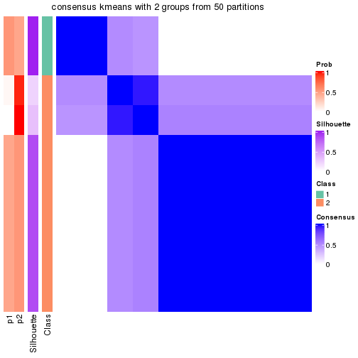</p>

</div>
<div id='tab-node-044-consensus-heatmap-2'>
<pre><code class="r">consensus_heatmap(res, k = 3)
</code></pre>

<p>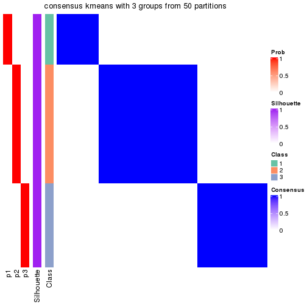</p>

</div>
<div id='tab-node-044-consensus-heatmap-3'>
<pre><code class="r">consensus_heatmap(res, k = 4)
</code></pre>

<p>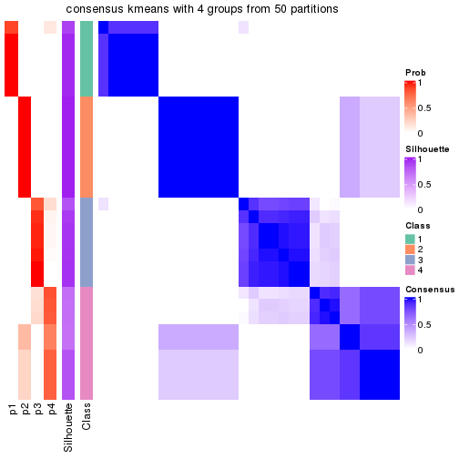</p>

</div>
<div id='tab-node-044-consensus-heatmap-4'>
<pre><code class="r">consensus_heatmap(res, k = 5)
</code></pre>

<p>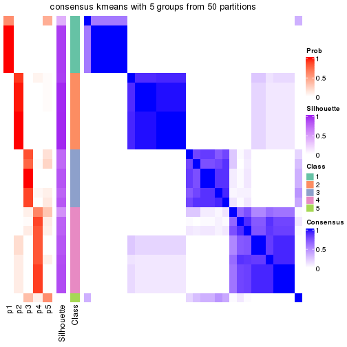</p>

</div>
<div id='tab-node-044-consensus-heatmap-5'>
<pre><code class="r">consensus_heatmap(res, k = 6)
</code></pre>

<p>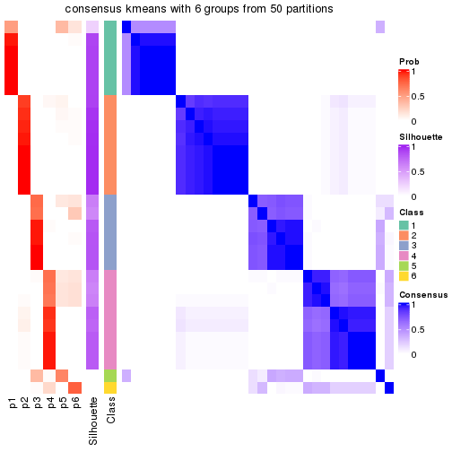</p>

</div>
<div id='tab-node-044-consensus-heatmap-6'>
<pre><code class="r">consensus_heatmap(res, k = 7)
</code></pre>

<p>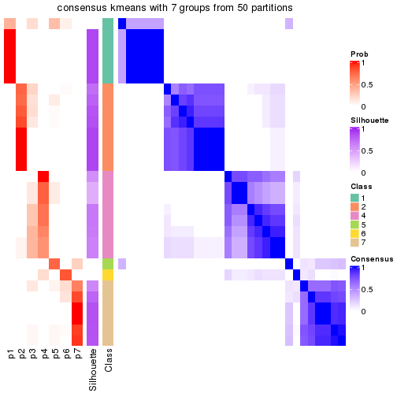</p>

</div>
<div id='tab-node-044-consensus-heatmap-7'>
<pre><code class="r">consensus_heatmap(res, k = 8)
</code></pre>

<p>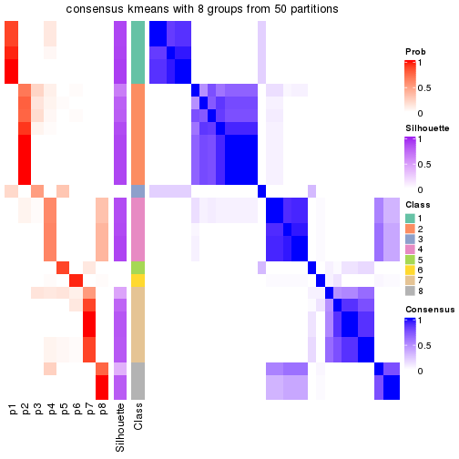</p>

</div>
</div>

Heatmaps for the membership of samples in all partitions to see how consistent they are:


<script>
$( function() {
	$( '#tabs-node-044-membership-heatmap' ).tabs();
} );
</script>
<div id='tabs-node-044-membership-heatmap'>
<ul>
<li><a href='#tab-node-044-membership-heatmap-1'>k = 2</a></li>
<li><a href='#tab-node-044-membership-heatmap-2'>k = 3</a></li>
<li><a href='#tab-node-044-membership-heatmap-3'>k = 4</a></li>
<li><a href='#tab-node-044-membership-heatmap-4'>k = 5</a></li>
<li><a href='#tab-node-044-membership-heatmap-5'>k = 6</a></li>
<li><a href='#tab-node-044-membership-heatmap-6'>k = 7</a></li>
<li><a href='#tab-node-044-membership-heatmap-7'>k = 8</a></li>
</ul>
<div id='tab-node-044-membership-heatmap-1'>
<pre><code class="r">membership_heatmap(res, k = 2)
</code></pre>

<p>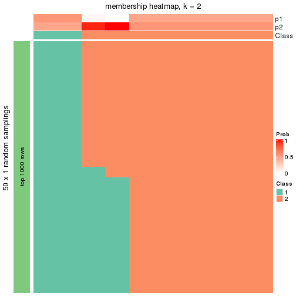</p>

</div>
<div id='tab-node-044-membership-heatmap-2'>
<pre><code class="r">membership_heatmap(res, k = 3)
</code></pre>

<p>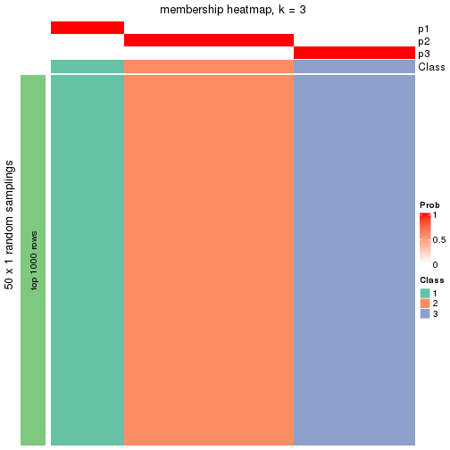</p>

</div>
<div id='tab-node-044-membership-heatmap-3'>
<pre><code class="r">membership_heatmap(res, k = 4)
</code></pre>

<p>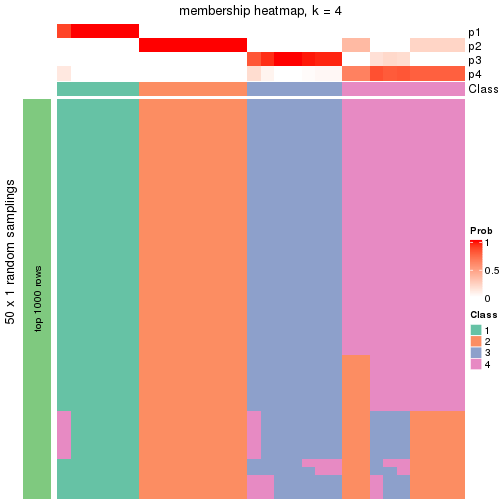</p>

</div>
<div id='tab-node-044-membership-heatmap-4'>
<pre><code class="r">membership_heatmap(res, k = 5)
</code></pre>

<p>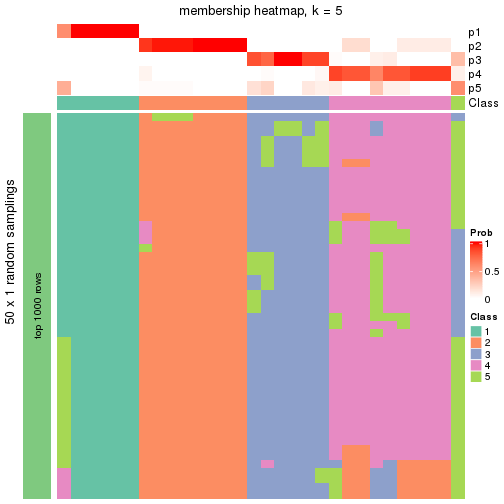</p>

</div>
<div id='tab-node-044-membership-heatmap-5'>
<pre><code class="r">membership_heatmap(res, k = 6)
</code></pre>

<p>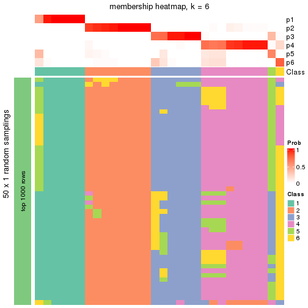</p>

</div>
<div id='tab-node-044-membership-heatmap-6'>
<pre><code class="r">membership_heatmap(res, k = 7)
</code></pre>

<p>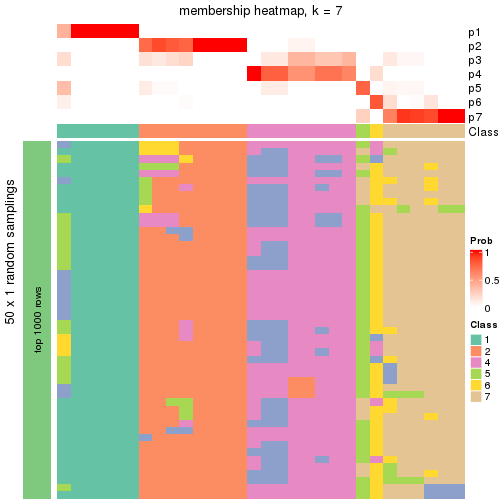</p>

</div>
<div id='tab-node-044-membership-heatmap-7'>
<pre><code class="r">membership_heatmap(res, k = 8)
</code></pre>

<p>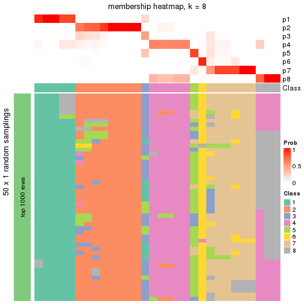</p>

</div>
</div>

As soon as the classes for columns are determined, the signatures
that are significantly different between subgroups can be looked for. 
Following are the heatmaps for signatures.


<script>
$( function() {
	$( '#tabs-node-044-get-signatures' ).tabs();
} );
</script>
<div id='tabs-node-044-get-signatures'>
<ul>
<li><a href='#tab-node-044-get-signatures-1'>k = 2</a></li>
<li><a href='#tab-node-044-get-signatures-2'>k = 3</a></li>
<li><a href='#tab-node-044-get-signatures-3'>k = 4</a></li>
<li><a href='#tab-node-044-get-signatures-4'>k = 5</a></li>
<li><a href='#tab-node-044-get-signatures-5'>k = 6</a></li>
<li><a href='#tab-node-044-get-signatures-6'>k = 7</a></li>
<li><a href='#tab-node-044-get-signatures-7'>k = 8</a></li>
</ul>
<div id='tab-node-044-get-signatures-1'>
<pre><code class="r">get_signatures(res, k = 2)
</code></pre>

<p>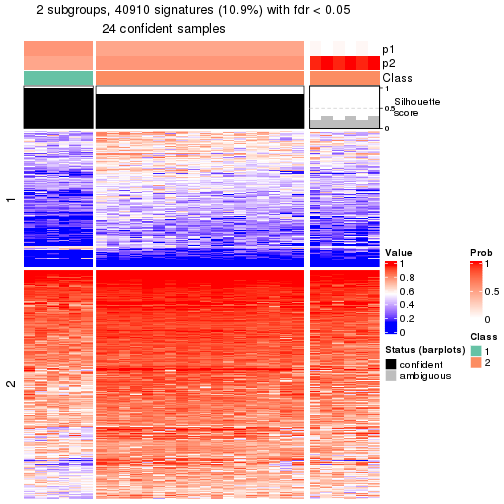</p>

</div>
<div id='tab-node-044-get-signatures-2'>
<pre><code class="r">get_signatures(res, k = 3)
</code></pre>

<p>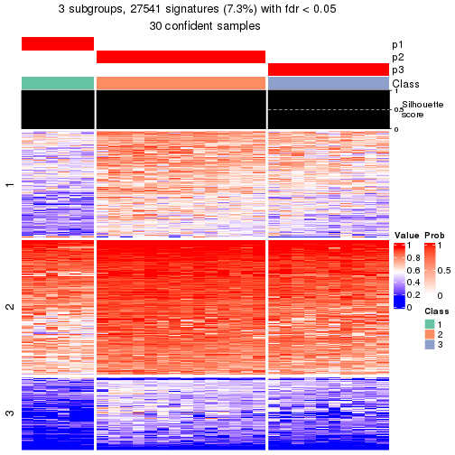</p>

</div>
<div id='tab-node-044-get-signatures-3'>
<pre><code class="r">get_signatures(res, k = 4)
</code></pre>

<p>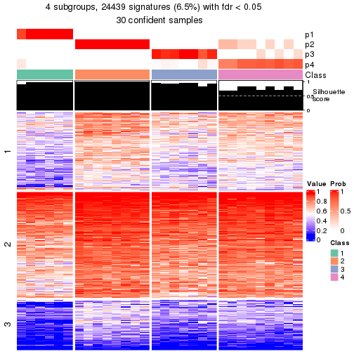</p>

</div>
<div id='tab-node-044-get-signatures-4'>
<pre><code class="r">get_signatures(res, k = 5)
</code></pre>

<p>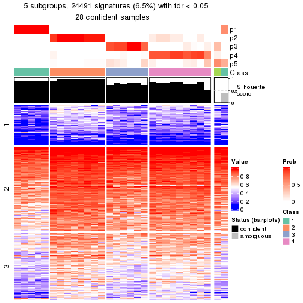</p>

</div>
<div id='tab-node-044-get-signatures-5'>
<pre><code class="r">get_signatures(res, k = 6)
</code></pre>

<p>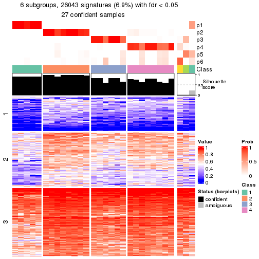</p>

</div>
<div id='tab-node-044-get-signatures-6'>
<pre><code class="r">get_signatures(res, k = 7)
</code></pre>

<p>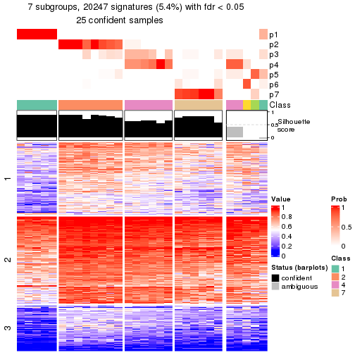</p>

</div>
<div id='tab-node-044-get-signatures-7'>
<pre><code class="r">get_signatures(res, k = 8)
</code></pre>

<p>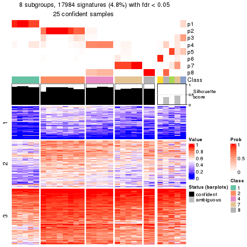</p>

</div>
</div>


Compare the overlap of signatures from different k:

```r
compare_signatures(res)
```

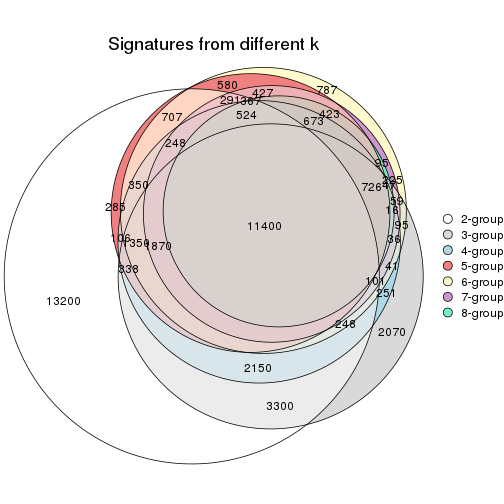

`get_signature()` returns a data frame invisibly. To get the list of signatures, the function
call should be assigned to a variable explicitly. In following code, if `plot` argument is set
to `FALSE`, no heatmap is plotted while only the differential analysis is performed.

```r
# code only for demonstration
tb = get_signature(res, k = ..., plot = FALSE)
```

An example of the output of `tb` is:

```
#>   which_row         fdr    mean_1    mean_2 scaled_mean_1 scaled_mean_2 km
#> 1        38 0.042760348  8.373488  9.131774    -0.5533452     0.5164555  1
#> 2        40 0.018707592  7.106213  8.469186    -0.6173731     0.5762149  1
#> 3        55 0.019134737 10.221463 11.207825    -0.6159697     0.5749050  1
#> 4        59 0.006059896  5.921854  7.869574    -0.6899429     0.6439467  1
#> 5        60 0.018055526  8.928898 10.211722    -0.6204761     0.5791110  1
#> 6        98 0.009384629 15.714769 14.887706     0.6635654    -0.6193277  2
...
```

The columns in `tb` are:

1. `which_row`: row indices corresponding to the input matrix.
2. `fdr`: FDR for the differential test. 
3. `mean_x`: The mean value in group x.
4. `scaled_mean_x`: The mean value in group x after rows are scaled.
5. `km`: Row groups if k-means clustering is applied to rows (which is done by automatically selecting number of clusters).

If there are too many signatures, `top_signatures = ...` can be set to only show the 
signatures with the highest FDRs:

```r
# code only for demonstration
# e.g. to show the top 500 most significant rows
tb = get_signature(res, k = ..., top_signatures = 500)
```

If the signatures are defined as these which are uniquely high in current group, `diff_method` argument
can be set to `"uniquely_high_in_one_group"`:

```r
# code only for demonstration
tb = get_signature(res, k = ..., diff_method = "uniquely_high_in_one_group")
```


UMAP plot which shows how samples are separated.


<script>
$( function() {
	$( '#tabs-node-044-dimension-reduction' ).tabs();
} );
</script>
<div id='tabs-node-044-dimension-reduction'>
<ul>
<li><a href='#tab-node-044-dimension-reduction-1'>k = 2</a></li>
<li><a href='#tab-node-044-dimension-reduction-2'>k = 3</a></li>
<li><a href='#tab-node-044-dimension-reduction-3'>k = 4</a></li>
<li><a href='#tab-node-044-dimension-reduction-4'>k = 5</a></li>
<li><a href='#tab-node-044-dimension-reduction-5'>k = 6</a></li>
<li><a href='#tab-node-044-dimension-reduction-6'>k = 7</a></li>
<li><a href='#tab-node-044-dimension-reduction-7'>k = 8</a></li>
</ul>
<div id='tab-node-044-dimension-reduction-1'>
<pre><code class="r">dimension_reduction(res, k = 2, method = &quot;UMAP&quot;)
</code></pre>

<p>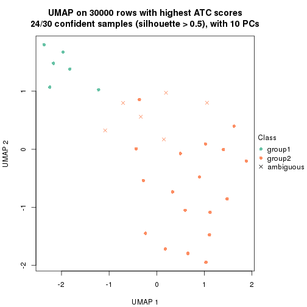</p>

</div>
<div id='tab-node-044-dimension-reduction-2'>
<pre><code class="r">dimension_reduction(res, k = 3, method = &quot;UMAP&quot;)
</code></pre>

<p>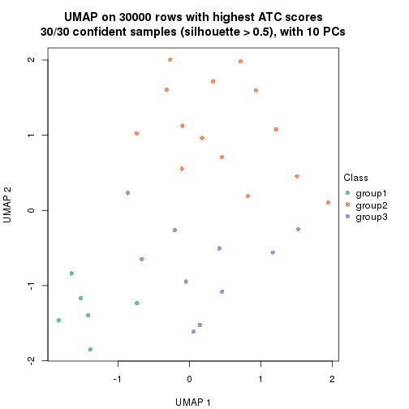</p>

</div>
<div id='tab-node-044-dimension-reduction-3'>
<pre><code class="r">dimension_reduction(res, k = 4, method = &quot;UMAP&quot;)
</code></pre>

<p>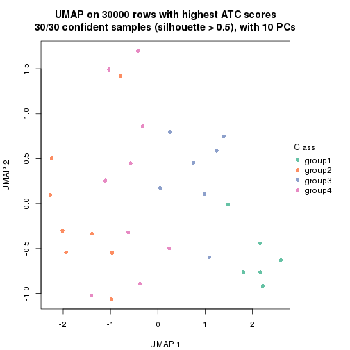</p>

</div>
<div id='tab-node-044-dimension-reduction-4'>
<pre><code class="r">dimension_reduction(res, k = 5, method = &quot;UMAP&quot;)
</code></pre>

<p>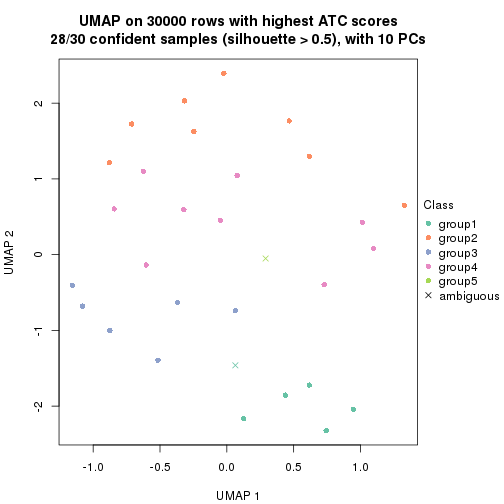</p>

</div>
<div id='tab-node-044-dimension-reduction-5'>
<pre><code class="r">dimension_reduction(res, k = 6, method = &quot;UMAP&quot;)
</code></pre>

<p>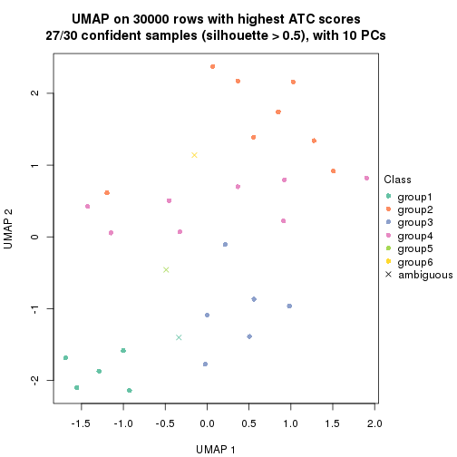</p>

</div>
<div id='tab-node-044-dimension-reduction-6'>
<pre><code class="r">dimension_reduction(res, k = 7, method = &quot;UMAP&quot;)
</code></pre>

<p>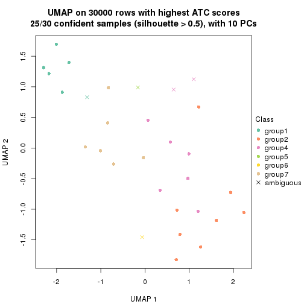</p>

</div>
<div id='tab-node-044-dimension-reduction-7'>
<pre><code class="r">dimension_reduction(res, k = 8, method = &quot;UMAP&quot;)
</code></pre>

<p>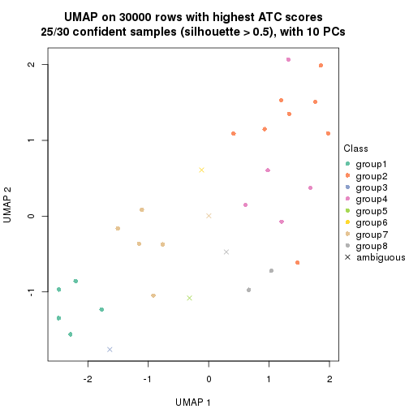</p>

</div>
</div>


Following heatmap shows how subgroups are split when increasing `k`:

```r
collect_classes(res)
```

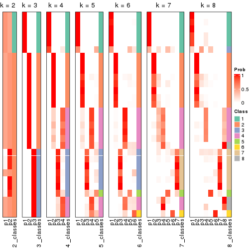


If matrix rows can be associated to genes, consider to use `functional_enrichment(res,
...)` to perform function enrichment for the signature genes. See [this vignette](https://jokergoo.github.io/cola_vignettes/functional_enrichment.html) for more detailed explanations.


 

---------------------------------------------------


### Node05


Parent node: [Node0](#Node0).
Child nodes: 
                Node011-leaf
        ,
                [Node012](#Node012)
        ,
                Node013-leaf
        ,
                [Node021](#Node021)
        ,
                [Node022](#Node022)
        ,
                [Node023](#Node023)
        ,
                [Node024](#Node024)
        ,
                Node031-leaf
        ,
                Node032-leaf
        ,
                Node033-leaf
        ,
                Node034-leaf
        ,
                [Node041](#Node041)
        ,
                [Node042](#Node042)
        ,
                [Node043](#Node043)
        ,
                [Node044](#Node044)
        ,
                [Node051](#Node051)
        ,
                [Node052](#Node052)
        ,
                Node053-leaf
        .


The object with results only for a single top-value method and a single partitioning method 
can be extracted as:

```r
res = res_rh["05"]
```

A summary of `res` and all the functions that can be applied to it:

```r
res
```

```
#> A 'ConsensusPartition' object with k = 2, 3, 4, 5, 6, 7, 8.
#>   On a matrix with 30000 rows and 87 columns.
#>   Top rows (1000) are extracted by 'ATC' method.
#>   Subgroups are detected by 'kmeans' method.
#>   Performed in total 350 partitions by row resampling.
#>   Best k for subgroups seems to be 4.
#> 
#> Following methods can be applied to this 'ConsensusPartition' object:
#>  [1] "cola_report"             "collect_classes"         "collect_plots"          
#>  [4] "collect_stats"           "colnames"                "compare_partitions"     
#>  [7] "compare_signatures"      "consensus_heatmap"       "dimension_reduction"    
#> [10] "functional_enrichment"   "get_anno_col"            "get_anno"               
#> [13] "get_classes"             "get_consensus"           "get_matrix"             
#> [16] "get_membership"          "get_param"               "get_signatures"         
#> [19] "get_stats"               "is_best_k"               "is_stable_k"            
#> [22] "membership_heatmap"      "ncol"                    "nrow"                   
#> [25] "plot_ecdf"               "predict_classes"         "rownames"               
#> [28] "select_partition_number" "show"                    "suggest_best_k"         
#> [31] "test_to_known_factors"   "top_rows_heatmap"
```

`collect_plots()` function collects all the plots made from `res` for all `k` (number of subgroups)
into one single page to provide an easy and fast comparison between different `k`.

```r
collect_plots(res)
```

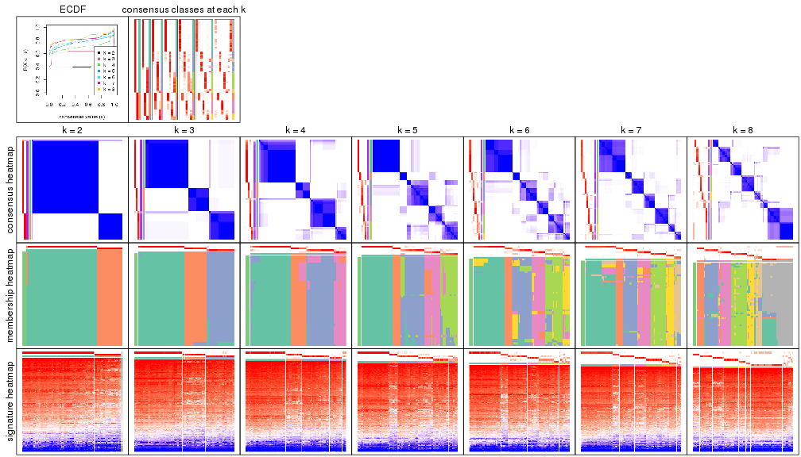

The plots are:

- The first row: a plot of the eCDF (empirical cumulative distribution
  function) curves of the consensus matrix for each `k` and the heatmap of
  predicted classes for each `k`.
- The second row: heatmaps of the consensus matrix for each `k`.
- The third row: heatmaps of the membership matrix for each `k`.
- The fouth row: heatmaps of the signatures for each `k`.

All the plots in panels can be made by individual functions and they are
plotted later in this section.

`select_partition_number()` produces several plots showing different
statistics for choosing "optimized" `k`. There are following statistics:

- eCDF curves of the consensus matrix for each `k`;
- 1-PAC. [The PAC score](https://en.wikipedia.org/wiki/Consensus_clustering#Over-interpretation_potential_of_consensus_clustering)
  measures the proportion of the ambiguous subgrouping.
- Mean silhouette score.
- Concordance. The mean probability of fiting the consensus subgroup labels in all
  partitions.
- Area increased. Denote $A_k$ as the area under the eCDF curve for current
  `k`, the area increased is defined as $A_k - A_{k-1}$.
- Rand index. The percent of pairs of samples that are both in a same cluster
  or both are not in a same cluster in the partition of k and k-1.
- Jaccard index. The ratio of pairs of samples are both in a same cluster in
  the partition of k and k-1 and the pairs of samples are both in a same
  cluster in the partition k or k-1.

The detailed explanations of these statistics can be found in [the _cola_
vignette](https://jokergoo.github.io/cola_vignettes/cola.html#toc_13).

Generally speaking, higher 1-PAC score, higher mean silhouette score or higher
concordance corresponds to better partition. Rand index and Jaccard index
measure how similar the current partition is compared to partition with `k-1`.
If they are too similar, we won't accept `k` is better than `k-1`.

```r
select_partition_number(res)
```

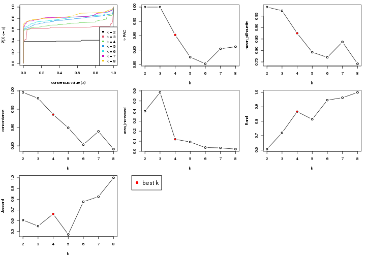

The numeric values for all these statistics can be obtained by `get_stats()`.

```r
get_stats(res)
```

```
#>   k 1-PAC mean_silhouette concordance area_increased  Rand Jaccard
#> 2 2 1.000           0.989       0.996         0.3979 0.607   0.607
#> 3 3 1.000           0.973       0.980         0.5848 0.719   0.550
#> 4 4 0.903           0.875       0.935         0.1193 0.867   0.663
#> 5 5 0.825           0.792       0.899         0.0921 0.813   0.473
#> 6 6 0.802           0.770       0.853         0.0368 0.947   0.777
#> 7 7 0.854           0.837       0.889         0.0337 0.963   0.824
#> 8 8 0.861           0.742       0.841         0.0217 1.000   1.000
```

`suggest_best_k()` suggests the best $k$ based on these statistics. The rules are as follows:

- All $k$ with Jaccard index larger than 0.95 are removed because increasing
  $k$ does not provide enough extra information. If all $k$ are removed, it is
  marked as no subgroup is detected.
- For all $k$ with 1-PAC score larger than 0.9, the maximal $k$ is taken as
  the best $k$, and other $k$ are marked as optional $k$.
- If it does not fit the second rule. The $k$ with the maximal vote of the
  highest 1-PAC score, highest mean silhouette, and highest concordance is
  taken as the best $k$.

```r
suggest_best_k(res)
```

```
#> [1] 4
#> attr(,"optional")
#> [1] 2 3
```

There is also optional best $k$ = 2 3 that is worth to check.

Following is the table of the partitions (You need to click the **show/hide
code output** link to see it). The membership matrix (columns with name `p*`)
is inferred by
[`clue::cl_consensus()`](https://www.rdocumentation.org/link/cl_consensus?package=clue)
function with the `SE` method. Basically the value in the membership matrix
represents the probability to belong to a certain group. The finall subgroup
label for an item is determined with the group with highest probability it
belongs to.

In `get_classes()` function, the entropy is calculated from the membership
matrix and the silhouette score is calculated from the consensus matrix.


<script>
$( function() {
	$( '#tabs-node-05-get-classes' ).tabs();
} );
</script>
<div id='tabs-node-05-get-classes'>
<ul>
<li><a href='#tab-node-05-get-classes-1'>k = 2</a></li>
<li><a href='#tab-node-05-get-classes-2'>k = 3</a></li>
<li><a href='#tab-node-05-get-classes-3'>k = 4</a></li>
<li><a href='#tab-node-05-get-classes-4'>k = 5</a></li>
<li><a href='#tab-node-05-get-classes-5'>k = 6</a></li>
<li><a href='#tab-node-05-get-classes-6'>k = 7</a></li>
<li><a href='#tab-node-05-get-classes-7'>k = 8</a></li>
</ul>

<div id='tab-node-05-get-classes-1'>
<p><a id='tab-node-05-get-classes-1-a' style='color:#0366d6' href='#'>show/hide code output</a></p>
<pre><code class="r">cbind(get_classes(res, k = 2), get_membership(res, k = 2))
</code></pre>

<pre><code>#&gt;                 class entropy silhouette   p1   p2
#&gt; TCGA.YL.A8SB.01     1   0.000      0.994 1.00 0.00
#&gt; TCGA.EJ.7797.01     1   0.000      0.994 1.00 0.00
#&gt; TCGA.ZG.A8QW.01     1   0.000      0.994 1.00 0.00
#&gt; TCGA.YL.A8HK.01     2   0.000      1.000 0.00 1.00
#&gt; TCGA.EJ.5501.01     1   0.000      0.994 1.00 0.00
#&gt; TCGA.EJ.7330.01     2   0.000      1.000 0.00 1.00
#&gt; TCGA.G9.6351.01     1   0.000      0.994 1.00 0.00
#&gt; TCGA.KK.A8IM.01     1   0.000      0.994 1.00 0.00
#&gt; TCGA.G9.6348.01     1   0.000      0.994 1.00 0.00
#&gt; TCGA.J4.A67Q.01     1   0.000      0.994 1.00 0.00
#&gt; TCGA.2A.A8VL.01     1   0.000      0.994 1.00 0.00
#&gt; TCGA.V1.A9ZK.01     2   0.000      1.000 0.00 1.00
#&gt; TCGA.HC.7737.01     2   0.000      1.000 0.00 1.00
#&gt; TCGA.G9.6384.01     1   0.000      0.994 1.00 0.00
#&gt; TCGA.V1.A9ZG.01     2   0.000      1.000 0.00 1.00
#&gt; TCGA.ZG.A9LN.01     1   0.000      0.994 1.00 0.00
#&gt; TCGA.EJ.7794.01     2   0.000      1.000 0.00 1.00
#&gt; TCGA.YL.A9WJ.01     2   0.000      1.000 0.00 1.00
#&gt; TCGA.V1.A9Z8.01     1   0.000      0.994 1.00 0.00
#&gt; TCGA.YL.A8SK.01     1   0.000      0.994 1.00 0.00
#&gt; TCGA.J4.A67M.01     1   0.000      0.994 1.00 0.00
#&gt; TCGA.G9.6499.01     2   0.000      1.000 0.00 1.00
#&gt; TCGA.J4.A67T.01     1   0.000      0.994 1.00 0.00
#&gt; TCGA.KK.A6E3.01     1   0.000      0.994 1.00 0.00
#&gt; TCGA.G9.6336.01     1   0.000      0.994 1.00 0.00
#&gt; TCGA.V1.A8MJ.01     1   0.000      0.994 1.00 0.00
#&gt; TCGA.VP.A87C.01     1   0.000      0.994 1.00 0.00
#&gt; TCGA.EJ.5497.01     1   0.000      0.994 1.00 0.00
#&gt; TCGA.XK.AAJR.01     2   0.000      1.000 0.00 1.00
#&gt; TCGA.G9.6363.11     1   0.000      0.994 1.00 0.00
#&gt; TCGA.V1.A9OY.01     1   0.000      0.994 1.00 0.00
#&gt; TCGA.ZG.A9L4.01     1   0.000      0.994 1.00 0.00
#&gt; TCGA.HC.7747.01     1   0.000      0.994 1.00 0.00
#&gt; TCGA.ZG.A9LS.01     1   0.000      0.994 1.00 0.00
#&gt; TCGA.V1.A9OH.01     2   0.000      1.000 0.00 1.00
#&gt; TCGA.VP.A878.01     1   0.000      0.994 1.00 0.00
#&gt; TCGA.HC.7745.01     1   0.000      0.994 1.00 0.00
#&gt; TCGA.G9.6379.01     1   0.000      0.994 1.00 0.00
#&gt; TCGA.CH.5762.01     1   0.000      0.994 1.00 0.00
#&gt; TCGA.EJ.5527.01     1   0.000      0.994 1.00 0.00
#&gt; TCGA.G9.6356.01     1   0.000      0.994 1.00 0.00
#&gt; TCGA.G9.6333.01     2   0.000      1.000 0.00 1.00
#&gt; TCGA.EJ.5495.01     1   0.000      0.994 1.00 0.00
#&gt; TCGA.V1.A8WN.01     1   0.000      0.994 1.00 0.00
#&gt; TCGA.HC.A6AS.01     1   0.000      0.994 1.00 0.00
#&gt; TCGA.EJ.7328.01     1   0.000      0.994 1.00 0.00
#&gt; TCGA.YL.A8SI.01     2   0.000      1.000 0.00 1.00
#&gt; TCGA.J4.A67O.01     1   0.000      0.994 1.00 0.00
#&gt; TCGA.XK.AAIV.01     2   0.000      1.000 0.00 1.00
#&gt; TCGA.KK.A8IB.01     2   0.000      1.000 0.00 1.00
#&gt; TCGA.XK.AAIR.01     2   0.000      1.000 0.00 1.00
#&gt; TCGA.EJ.7783.01     1   0.000      0.994 1.00 0.00
#&gt; TCGA.EJ.5502.01     1   0.000      0.994 1.00 0.00
#&gt; TCGA.EJ.7785.01     1   0.000      0.994 1.00 0.00
#&gt; TCGA.4L.AA1F.01     2   0.000      1.000 0.00 1.00
#&gt; TCGA.EJ.5516.01     1   0.000      0.994 1.00 0.00
#&gt; TCGA.KK.A7B0.01     2   0.000      1.000 0.00 1.00
#&gt; TCGA.KK.A8I4.01     1   0.000      0.994 1.00 0.00
#&gt; TCGA.EJ.5512.01     1   0.000      0.994 1.00 0.00
#&gt; TCGA.2A.A8W3.01     1   0.000      0.994 1.00 0.00
#&gt; TCGA.ZG.A9LY.01     1   0.000      0.994 1.00 0.00
#&gt; TCGA.EJ.7793.01     1   0.000      0.994 1.00 0.00
#&gt; TCGA.HC.8266.01     1   0.000      0.994 1.00 0.00
#&gt; TCGA.CH.5792.01     2   0.000      1.000 0.00 1.00
#&gt; TCGA.G9.6347.01     1   0.000      0.994 1.00 0.00
#&gt; TCGA.EJ.A46I.01     1   0.000      0.994 1.00 0.00
#&gt; TCGA.EJ.5508.01     1   0.000      0.994 1.00 0.00
#&gt; TCGA.EJ.A7NH.01     1   0.000      0.994 1.00 0.00
#&gt; TCGA.J9.A52C.01     1   0.000      0.994 1.00 0.00
#&gt; TCGA.FC.7708.01     1   0.000      0.994 1.00 0.00
#&gt; TCGA.J4.A67R.01     1   0.000      0.994 1.00 0.00
#&gt; TCGA.EJ.5499.01     2   0.000      1.000 0.00 1.00
#&gt; TCGA.CH.5738.01     1   0.000      0.994 1.00 0.00
#&gt; TCGA.G9.7522.01     1   0.000      0.994 1.00 0.00
#&gt; TCGA.HC.A6AP.01     2   0.000      1.000 0.00 1.00
#&gt; TCGA.EJ.5510.01     1   0.943      0.437 0.64 0.36
#&gt; TCGA.CH.5746.01     1   0.000      0.994 1.00 0.00
#&gt; TCGA.ZG.A8QZ.01     1   0.000      0.994 1.00 0.00
#&gt; TCGA.TK.A8OK.01     2   0.000      1.000 0.00 1.00
#&gt; TCGA.X4.A8KQ.01     1   0.000      0.994 1.00 0.00
#&gt; TCGA.HC.7750.01     1   0.000      0.994 1.00 0.00
#&gt; TCGA.YL.A9WY.01     2   0.000      1.000 0.00 1.00
#&gt; TCGA.VP.A87E.01     1   0.000      0.994 1.00 0.00
#&gt; TCGA.V1.A9ZR.01     2   0.000      1.000 0.00 1.00
#&gt; TCGA.EJ.7792.01     1   0.000      0.994 1.00 0.00
#&gt; TCGA.ZG.A9L2.01     1   0.000      0.994 1.00 0.00
#&gt; TCGA.EJ.5505.01     1   0.000      0.994 1.00 0.00
</code></pre>

<script>
$('#tab-node-05-get-classes-1-a').parent().next().next().hide();
$('#tab-node-05-get-classes-1-a').click(function(){
  $('#tab-node-05-get-classes-1-a').parent().next().next().toggle();
  return(false);
});
</script>
</div>

<div id='tab-node-05-get-classes-2'>
<p><a id='tab-node-05-get-classes-2-a' style='color:#0366d6' href='#'>show/hide code output</a></p>
<pre><code class="r">cbind(get_classes(res, k = 3), get_membership(res, k = 3))
</code></pre>

<pre><code>#&gt;                 class entropy silhouette   p1   p2   p3
#&gt; TCGA.YL.A8SB.01     1  0.0000      0.998 1.00 0.00 0.00
#&gt; TCGA.EJ.7797.01     1  0.0000      0.998 1.00 0.00 0.00
#&gt; TCGA.ZG.A8QW.01     3  0.1529      0.957 0.04 0.00 0.96
#&gt; TCGA.YL.A8HK.01     3  0.0000      0.935 0.00 0.00 1.00
#&gt; TCGA.EJ.5501.01     1  0.0892      0.979 0.98 0.00 0.02
#&gt; TCGA.EJ.7330.01     2  0.1529      0.986 0.00 0.96 0.04
#&gt; TCGA.G9.6351.01     1  0.0000      0.998 1.00 0.00 0.00
#&gt; TCGA.KK.A8IM.01     1  0.0000      0.998 1.00 0.00 0.00
#&gt; TCGA.G9.6348.01     1  0.0000      0.998 1.00 0.00 0.00
#&gt; TCGA.J4.A67Q.01     1  0.0000      0.998 1.00 0.00 0.00
#&gt; TCGA.2A.A8VL.01     1  0.0000      0.998 1.00 0.00 0.00
#&gt; TCGA.V1.A9ZK.01     2  0.0000      0.980 0.00 1.00 0.00
#&gt; TCGA.HC.7737.01     2  0.1529      0.986 0.00 0.96 0.04
#&gt; TCGA.G9.6384.01     1  0.0000      0.998 1.00 0.00 0.00
#&gt; TCGA.V1.A9ZG.01     2  0.1529      0.986 0.00 0.96 0.04
#&gt; TCGA.ZG.A9LN.01     3  0.1529      0.957 0.04 0.00 0.96
#&gt; TCGA.EJ.7794.01     2  0.1529      0.986 0.00 0.96 0.04
#&gt; TCGA.YL.A9WJ.01     2  0.1529      0.986 0.00 0.96 0.04
#&gt; TCGA.V1.A9Z8.01     1  0.0892      0.979 0.98 0.00 0.02
#&gt; TCGA.YL.A8SK.01     3  0.1529      0.957 0.04 0.00 0.96
#&gt; TCGA.J4.A67M.01     3  0.1529      0.957 0.04 0.00 0.96
#&gt; TCGA.G9.6499.01     2  0.1529      0.986 0.00 0.96 0.04
#&gt; TCGA.J4.A67T.01     1  0.0000      0.998 1.00 0.00 0.00
#&gt; TCGA.KK.A6E3.01     3  0.1529      0.957 0.04 0.00 0.96
#&gt; TCGA.G9.6336.01     1  0.0000      0.998 1.00 0.00 0.00
#&gt; TCGA.V1.A8MJ.01     1  0.0000      0.998 1.00 0.00 0.00
#&gt; TCGA.VP.A87C.01     1  0.0892      0.979 0.98 0.00 0.02
#&gt; TCGA.EJ.5497.01     1  0.0000      0.998 1.00 0.00 0.00
#&gt; TCGA.XK.AAJR.01     2  0.0000      0.980 0.00 1.00 0.00
#&gt; TCGA.G9.6363.11     3  0.1529      0.957 0.04 0.00 0.96
#&gt; TCGA.V1.A9OY.01     1  0.0000      0.998 1.00 0.00 0.00
#&gt; TCGA.ZG.A9L4.01     3  0.0000      0.935 0.00 0.00 1.00
#&gt; TCGA.HC.7747.01     1  0.0000      0.998 1.00 0.00 0.00
#&gt; TCGA.ZG.A9LS.01     3  0.0892      0.947 0.02 0.00 0.98
#&gt; TCGA.V1.A9OH.01     2  0.0000      0.980 0.00 1.00 0.00
#&gt; TCGA.VP.A878.01     3  0.1529      0.957 0.04 0.00 0.96
#&gt; TCGA.HC.7745.01     1  0.0000      0.998 1.00 0.00 0.00
#&gt; TCGA.G9.6379.01     3  0.1529      0.957 0.04 0.00 0.96
#&gt; TCGA.CH.5762.01     3  0.1529      0.957 0.04 0.00 0.96
#&gt; TCGA.EJ.5527.01     1  0.0000      0.998 1.00 0.00 0.00
#&gt; TCGA.G9.6356.01     1  0.0000      0.998 1.00 0.00 0.00
#&gt; TCGA.G9.6333.01     2  0.1529      0.986 0.00 0.96 0.04
#&gt; TCGA.EJ.5495.01     3  0.0000      0.935 0.00 0.00 1.00
#&gt; TCGA.V1.A8WN.01     1  0.0000      0.998 1.00 0.00 0.00
#&gt; TCGA.HC.A6AS.01     3  0.1529      0.957 0.04 0.00 0.96
#&gt; TCGA.EJ.7328.01     1  0.0000      0.998 1.00 0.00 0.00
#&gt; TCGA.YL.A8SI.01     2  0.1529      0.986 0.00 0.96 0.04
#&gt; TCGA.J4.A67O.01     1  0.0000      0.998 1.00 0.00 0.00
#&gt; TCGA.XK.AAIV.01     2  0.1529      0.986 0.00 0.96 0.04
#&gt; TCGA.KK.A8IB.01     2  0.0000      0.980 0.00 1.00 0.00
#&gt; TCGA.XK.AAIR.01     3  0.0000      0.935 0.00 0.00 1.00
#&gt; TCGA.EJ.7783.01     1  0.0000      0.998 1.00 0.00 0.00
#&gt; TCGA.EJ.5502.01     1  0.0000      0.998 1.00 0.00 0.00
#&gt; TCGA.EJ.7785.01     1  0.0000      0.998 1.00 0.00 0.00
#&gt; TCGA.4L.AA1F.01     2  0.1529      0.986 0.00 0.96 0.04
#&gt; TCGA.EJ.5516.01     1  0.0000      0.998 1.00 0.00 0.00
#&gt; TCGA.KK.A7B0.01     2  0.1529      0.986 0.00 0.96 0.04
#&gt; TCGA.KK.A8I4.01     3  0.1529      0.957 0.04 0.00 0.96
#&gt; TCGA.EJ.5512.01     1  0.0000      0.998 1.00 0.00 0.00
#&gt; TCGA.2A.A8W3.01     3  0.1529      0.957 0.04 0.00 0.96
#&gt; TCGA.ZG.A9LY.01     3  0.0000      0.935 0.00 0.00 1.00
#&gt; TCGA.EJ.7793.01     1  0.0000      0.998 1.00 0.00 0.00
#&gt; TCGA.HC.8266.01     3  0.1529      0.957 0.04 0.00 0.96
#&gt; TCGA.CH.5792.01     2  0.0000      0.980 0.00 1.00 0.00
#&gt; TCGA.G9.6347.01     1  0.0000      0.998 1.00 0.00 0.00
#&gt; TCGA.EJ.A46I.01     3  0.1529      0.957 0.04 0.00 0.96
#&gt; TCGA.EJ.5508.01     1  0.0000      0.998 1.00 0.00 0.00
#&gt; TCGA.EJ.A7NH.01     3  0.5397      0.667 0.28 0.00 0.72
#&gt; TCGA.J9.A52C.01     1  0.0000      0.998 1.00 0.00 0.00
#&gt; TCGA.FC.7708.01     1  0.0000      0.998 1.00 0.00 0.00
#&gt; TCGA.J4.A67R.01     1  0.0000      0.998 1.00 0.00 0.00
#&gt; TCGA.EJ.5499.01     3  0.0000      0.935 0.00 0.00 1.00
#&gt; TCGA.CH.5738.01     1  0.0000      0.998 1.00 0.00 0.00
#&gt; TCGA.G9.7522.01     1  0.0000      0.998 1.00 0.00 0.00
#&gt; TCGA.HC.A6AP.01     2  0.1529      0.986 0.00 0.96 0.04
#&gt; TCGA.EJ.5510.01     3  0.0000      0.935 0.00 0.00 1.00
#&gt; TCGA.CH.5746.01     1  0.0000      0.998 1.00 0.00 0.00
#&gt; TCGA.ZG.A8QZ.01     1  0.0000      0.998 1.00 0.00 0.00
#&gt; TCGA.TK.A8OK.01     2  0.0000      0.980 0.00 1.00 0.00
#&gt; TCGA.X4.A8KQ.01     3  0.5560      0.631 0.30 0.00 0.70
#&gt; TCGA.HC.7750.01     1  0.0000      0.998 1.00 0.00 0.00
#&gt; TCGA.YL.A9WY.01     2  0.0000      0.980 0.00 1.00 0.00
#&gt; TCGA.VP.A87E.01     1  0.0000      0.998 1.00 0.00 0.00
#&gt; TCGA.V1.A9ZR.01     2  0.0000      0.980 0.00 1.00 0.00
#&gt; TCGA.EJ.7792.01     1  0.0000      0.998 1.00 0.00 0.00
#&gt; TCGA.ZG.A9L2.01     3  0.1529      0.957 0.04 0.00 0.96
#&gt; TCGA.EJ.5505.01     1  0.0000      0.998 1.00 0.00 0.00
</code></pre>

<script>
$('#tab-node-05-get-classes-2-a').parent().next().next().hide();
$('#tab-node-05-get-classes-2-a').click(function(){
  $('#tab-node-05-get-classes-2-a').parent().next().next().toggle();
  return(false);
});
</script>
</div>

<div id='tab-node-05-get-classes-3'>
<p><a id='tab-node-05-get-classes-3-a' style='color:#0366d6' href='#'>show/hide code output</a></p>
<pre><code class="r">cbind(get_classes(res, k = 4), get_membership(res, k = 4))
</code></pre>

<pre><code>#&gt;                 class entropy silhouette   p1   p2   p3   p4
#&gt; TCGA.YL.A8SB.01     1   0.317      0.825 0.84 0.00 0.16 0.00
#&gt; TCGA.EJ.7797.01     1   0.000      0.951 1.00 0.00 0.00 0.00
#&gt; TCGA.ZG.A8QW.01     3   0.000      0.922 0.00 0.00 1.00 0.00
#&gt; TCGA.YL.A8HK.01     4   0.000      0.855 0.00 0.00 0.00 1.00
#&gt; TCGA.EJ.5501.01     3   0.000      0.922 0.00 0.00 1.00 0.00
#&gt; TCGA.EJ.7330.01     4   0.201      0.851 0.00 0.08 0.00 0.92
#&gt; TCGA.G9.6351.01     1   0.000      0.951 1.00 0.00 0.00 0.00
#&gt; TCGA.KK.A8IM.01     1   0.479      0.465 0.62 0.00 0.38 0.00
#&gt; TCGA.G9.6348.01     1   0.361      0.779 0.80 0.00 0.20 0.00
#&gt; TCGA.J4.A67Q.01     3   0.495      0.067 0.44 0.00 0.56 0.00
#&gt; TCGA.2A.A8VL.01     1   0.000      0.951 1.00 0.00 0.00 0.00
#&gt; TCGA.V1.A9ZK.01     2   0.361      0.858 0.00 0.80 0.00 0.20
#&gt; TCGA.HC.7737.01     2   0.380      0.837 0.00 0.78 0.00 0.22
#&gt; TCGA.G9.6384.01     1   0.000      0.951 1.00 0.00 0.00 0.00
#&gt; TCGA.V1.A9ZG.01     4   0.164      0.861 0.00 0.06 0.00 0.94
#&gt; TCGA.ZG.A9LN.01     3   0.164      0.917 0.00 0.00 0.94 0.06
#&gt; TCGA.EJ.7794.01     2   0.361      0.858 0.00 0.80 0.00 0.20
#&gt; TCGA.YL.A9WJ.01     2   0.361      0.858 0.00 0.80 0.00 0.20
#&gt; TCGA.V1.A9Z8.01     3   0.000      0.922 0.00 0.00 1.00 0.00
#&gt; TCGA.YL.A8SK.01     3   0.201      0.912 0.00 0.00 0.92 0.08
#&gt; TCGA.J4.A67M.01     3   0.201      0.912 0.00 0.00 0.92 0.08
#&gt; TCGA.G9.6499.01     2   0.361      0.858 0.00 0.80 0.00 0.20
#&gt; TCGA.J4.A67T.01     1   0.000      0.951 1.00 0.00 0.00 0.00
#&gt; TCGA.KK.A6E3.01     3   0.201      0.912 0.00 0.00 0.92 0.08
#&gt; TCGA.G9.6336.01     1   0.000      0.951 1.00 0.00 0.00 0.00
#&gt; TCGA.V1.A8MJ.01     1   0.201      0.900 0.92 0.00 0.08 0.00
#&gt; TCGA.VP.A87C.01     3   0.000      0.922 0.00 0.00 1.00 0.00
#&gt; TCGA.EJ.5497.01     1   0.000      0.951 1.00 0.00 0.00 0.00
#&gt; TCGA.XK.AAJR.01     2   0.000      0.873 0.00 1.00 0.00 0.00
#&gt; TCGA.G9.6363.11     3   0.201      0.912 0.00 0.00 0.92 0.08
#&gt; TCGA.V1.A9OY.01     1   0.201      0.900 0.92 0.00 0.08 0.00
#&gt; TCGA.ZG.A9L4.01     3   0.340      0.813 0.00 0.00 0.82 0.18
#&gt; TCGA.HC.7747.01     1   0.000      0.951 1.00 0.00 0.00 0.00
#&gt; TCGA.ZG.A9LS.01     3   0.201      0.912 0.00 0.00 0.92 0.08
#&gt; TCGA.V1.A9OH.01     2   0.000      0.873 0.00 1.00 0.00 0.00
#&gt; TCGA.VP.A878.01     3   0.201      0.912 0.00 0.00 0.92 0.08
#&gt; TCGA.HC.7745.01     1   0.000      0.951 1.00 0.00 0.00 0.00
#&gt; TCGA.G9.6379.01     3   0.000      0.922 0.00 0.00 1.00 0.00
#&gt; TCGA.CH.5762.01     3   0.164      0.917 0.00 0.00 0.94 0.06
#&gt; TCGA.EJ.5527.01     3   0.000      0.922 0.00 0.00 1.00 0.00
#&gt; TCGA.G9.6356.01     1   0.000      0.951 1.00 0.00 0.00 0.00
#&gt; TCGA.G9.6333.01     2   0.361      0.858 0.00 0.80 0.00 0.20
#&gt; TCGA.EJ.5495.01     4   0.398      0.612 0.00 0.00 0.24 0.76
#&gt; TCGA.V1.A8WN.01     1   0.000      0.951 1.00 0.00 0.00 0.00
#&gt; TCGA.HC.A6AS.01     3   0.000      0.922 0.00 0.00 1.00 0.00
#&gt; TCGA.EJ.7328.01     1   0.000      0.951 1.00 0.00 0.00 0.00
#&gt; TCGA.YL.A8SI.01     4   0.164      0.861 0.00 0.06 0.00 0.94
#&gt; TCGA.J4.A67O.01     1   0.000      0.951 1.00 0.00 0.00 0.00
#&gt; TCGA.XK.AAIV.01     4   0.201      0.851 0.00 0.08 0.00 0.92
#&gt; TCGA.KK.A8IB.01     2   0.000      0.873 0.00 1.00 0.00 0.00
#&gt; TCGA.XK.AAIR.01     4   0.000      0.855 0.00 0.00 0.00 1.00
#&gt; TCGA.EJ.7783.01     1   0.499      0.177 0.52 0.00 0.48 0.00
#&gt; TCGA.EJ.5502.01     1   0.000      0.951 1.00 0.00 0.00 0.00
#&gt; TCGA.EJ.7785.01     1   0.000      0.951 1.00 0.00 0.00 0.00
#&gt; TCGA.4L.AA1F.01     4   0.201      0.851 0.00 0.08 0.00 0.92
#&gt; TCGA.EJ.5516.01     1   0.000      0.951 1.00 0.00 0.00 0.00
#&gt; TCGA.KK.A7B0.01     4   0.340      0.721 0.00 0.18 0.00 0.82
#&gt; TCGA.KK.A8I4.01     3   0.000      0.922 0.00 0.00 1.00 0.00
#&gt; TCGA.EJ.5512.01     1   0.000      0.951 1.00 0.00 0.00 0.00
#&gt; TCGA.2A.A8W3.01     3   0.201      0.912 0.00 0.00 0.92 0.08
#&gt; TCGA.ZG.A9LY.01     3   0.340      0.813 0.00 0.00 0.82 0.18
#&gt; TCGA.EJ.7793.01     1   0.000      0.951 1.00 0.00 0.00 0.00
#&gt; TCGA.HC.8266.01     3   0.201      0.912 0.00 0.00 0.92 0.08
#&gt; TCGA.CH.5792.01     2   0.000      0.873 0.00 1.00 0.00 0.00
#&gt; TCGA.G9.6347.01     1   0.201      0.900 0.92 0.00 0.08 0.00
#&gt; TCGA.EJ.A46I.01     3   0.000      0.922 0.00 0.00 1.00 0.00
#&gt; TCGA.EJ.5508.01     1   0.000      0.951 1.00 0.00 0.00 0.00
#&gt; TCGA.EJ.A7NH.01     3   0.000      0.922 0.00 0.00 1.00 0.00
#&gt; TCGA.J9.A52C.01     1   0.000      0.951 1.00 0.00 0.00 0.00
#&gt; TCGA.FC.7708.01     1   0.000      0.951 1.00 0.00 0.00 0.00
#&gt; TCGA.J4.A67R.01     1   0.000      0.951 1.00 0.00 0.00 0.00
#&gt; TCGA.EJ.5499.01     4   0.000      0.855 0.00 0.00 0.00 1.00
#&gt; TCGA.CH.5738.01     1   0.000      0.951 1.00 0.00 0.00 0.00
#&gt; TCGA.G9.7522.01     1   0.000      0.951 1.00 0.00 0.00 0.00
#&gt; TCGA.HC.A6AP.01     2   0.361      0.858 0.00 0.80 0.00 0.20
#&gt; TCGA.EJ.5510.01     4   0.361      0.672 0.00 0.00 0.20 0.80
#&gt; TCGA.CH.5746.01     1   0.000      0.951 1.00 0.00 0.00 0.00
#&gt; TCGA.ZG.A8QZ.01     1   0.000      0.951 1.00 0.00 0.00 0.00
#&gt; TCGA.TK.A8OK.01     2   0.000      0.873 0.00 1.00 0.00 0.00
#&gt; TCGA.X4.A8KQ.01     3   0.000      0.922 0.00 0.00 1.00 0.00
#&gt; TCGA.HC.7750.01     1   0.000      0.951 1.00 0.00 0.00 0.00
#&gt; TCGA.YL.A9WY.01     2   0.000      0.873 0.00 1.00 0.00 0.00
#&gt; TCGA.VP.A87E.01     1   0.000      0.951 1.00 0.00 0.00 0.00
#&gt; TCGA.V1.A9ZR.01     2   0.000      0.873 0.00 1.00 0.00 0.00
#&gt; TCGA.EJ.7792.01     1   0.265      0.866 0.88 0.00 0.12 0.00
#&gt; TCGA.ZG.A9L2.01     3   0.000      0.922 0.00 0.00 1.00 0.00
#&gt; TCGA.EJ.5505.01     1   0.201      0.900 0.92 0.00 0.08 0.00
</code></pre>

<script>
$('#tab-node-05-get-classes-3-a').parent().next().next().hide();
$('#tab-node-05-get-classes-3-a').click(function(){
  $('#tab-node-05-get-classes-3-a').parent().next().next().toggle();
  return(false);
});
</script>
</div>

<div id='tab-node-05-get-classes-4'>
<p><a id='tab-node-05-get-classes-4-a' style='color:#0366d6' href='#'>show/hide code output</a></p>
<pre><code class="r">cbind(get_classes(res, k = 5), get_membership(res, k = 5))
</code></pre>

<pre><code>#&gt;                 class entropy silhouette   p1   p2   p3   p4   p5
#&gt; TCGA.YL.A8SB.01     3  0.2020    0.77416 0.10 0.00 0.90 0.00 0.00
#&gt; TCGA.EJ.7797.01     1  0.0000    1.00000 1.00 0.00 0.00 0.00 0.00
#&gt; TCGA.ZG.A8QW.01     3  0.4287   -0.00876 0.00 0.00 0.54 0.00 0.46
#&gt; TCGA.YL.A8HK.01     5  0.3983    0.40845 0.00 0.00 0.00 0.34 0.66
#&gt; TCGA.EJ.5501.01     3  0.0000    0.78212 0.00 0.00 1.00 0.00 0.00
#&gt; TCGA.EJ.7330.01     4  0.0000    0.77691 0.00 0.00 0.00 1.00 0.00
#&gt; TCGA.G9.6351.01     1  0.0000    1.00000 1.00 0.00 0.00 0.00 0.00
#&gt; TCGA.KK.A8IM.01     3  0.2012    0.78228 0.06 0.00 0.92 0.00 0.02
#&gt; TCGA.G9.6348.01     3  0.1732    0.78229 0.08 0.00 0.92 0.00 0.00
#&gt; TCGA.J4.A67Q.01     3  0.1043    0.78863 0.04 0.00 0.96 0.00 0.00
#&gt; TCGA.2A.A8VL.01     1  0.0000    1.00000 1.00 0.00 0.00 0.00 0.00
#&gt; TCGA.V1.A9ZK.01     4  0.3796    0.69312 0.00 0.30 0.00 0.70 0.00
#&gt; TCGA.HC.7737.01     4  0.1410    0.77563 0.00 0.06 0.00 0.94 0.00
#&gt; TCGA.G9.6384.01     1  0.0000    1.00000 1.00 0.00 0.00 0.00 0.00
#&gt; TCGA.V1.A9ZG.01     4  0.2020    0.72078 0.00 0.00 0.00 0.90 0.10
#&gt; TCGA.ZG.A9LN.01     5  0.4227    0.34962 0.00 0.00 0.42 0.00 0.58
#&gt; TCGA.EJ.7794.01     4  0.3796    0.69312 0.00 0.30 0.00 0.70 0.00
#&gt; TCGA.YL.A9WJ.01     4  0.3796    0.69312 0.00 0.30 0.00 0.70 0.00
#&gt; TCGA.V1.A9Z8.01     3  0.0609    0.78150 0.00 0.00 0.98 0.00 0.02
#&gt; TCGA.YL.A8SK.01     5  0.3109    0.75145 0.00 0.00 0.20 0.00 0.80
#&gt; TCGA.J4.A67M.01     5  0.3109    0.75145 0.00 0.00 0.20 0.00 0.80
#&gt; TCGA.G9.6499.01     4  0.3796    0.69312 0.00 0.30 0.00 0.70 0.00
#&gt; TCGA.J4.A67T.01     1  0.0000    1.00000 1.00 0.00 0.00 0.00 0.00
#&gt; TCGA.KK.A6E3.01     5  0.3109    0.75145 0.00 0.00 0.20 0.00 0.80
#&gt; TCGA.G9.6336.01     1  0.0000    1.00000 1.00 0.00 0.00 0.00 0.00
#&gt; TCGA.V1.A8MJ.01     3  0.2929    0.70132 0.18 0.00 0.82 0.00 0.00
#&gt; TCGA.VP.A87C.01     3  0.0609    0.78150 0.00 0.00 0.98 0.00 0.02
#&gt; TCGA.EJ.5497.01     1  0.0000    1.00000 1.00 0.00 0.00 0.00 0.00
#&gt; TCGA.XK.AAJR.01     2  0.0000    0.99206 0.00 1.00 0.00 0.00 0.00
#&gt; TCGA.G9.6363.11     5  0.1043    0.77450 0.00 0.00 0.04 0.00 0.96
#&gt; TCGA.V1.A9OY.01     3  0.3424    0.64686 0.24 0.00 0.76 0.00 0.00
#&gt; TCGA.ZG.A9L4.01     5  0.0000    0.77131 0.00 0.00 0.00 0.00 1.00
#&gt; TCGA.HC.7747.01     1  0.0000    1.00000 1.00 0.00 0.00 0.00 0.00
#&gt; TCGA.ZG.A9LS.01     5  0.2280    0.78557 0.00 0.00 0.12 0.00 0.88
#&gt; TCGA.V1.A9OH.01     2  0.0000    0.99206 0.00 1.00 0.00 0.00 0.00
#&gt; TCGA.VP.A878.01     5  0.2020    0.78735 0.00 0.00 0.10 0.00 0.90
#&gt; TCGA.HC.7745.01     1  0.0000    1.00000 1.00 0.00 0.00 0.00 0.00
#&gt; TCGA.G9.6379.01     3  0.4262    0.06739 0.00 0.00 0.56 0.00 0.44
#&gt; TCGA.CH.5762.01     5  0.3895    0.55378 0.00 0.00 0.32 0.00 0.68
#&gt; TCGA.EJ.5527.01     3  0.0609    0.77921 0.00 0.00 0.98 0.00 0.02
#&gt; TCGA.G9.6356.01     1  0.0000    1.00000 1.00 0.00 0.00 0.00 0.00
#&gt; TCGA.G9.6333.01     4  0.3796    0.69312 0.00 0.30 0.00 0.70 0.00
#&gt; TCGA.EJ.5495.01     5  0.0609    0.76617 0.00 0.00 0.00 0.02 0.98
#&gt; TCGA.V1.A8WN.01     1  0.0000    1.00000 1.00 0.00 0.00 0.00 0.00
#&gt; TCGA.HC.A6AS.01     3  0.4262    0.06739 0.00 0.00 0.56 0.00 0.44
#&gt; TCGA.EJ.7328.01     1  0.0000    1.00000 1.00 0.00 0.00 0.00 0.00
#&gt; TCGA.YL.A8SI.01     4  0.0609    0.77121 0.00 0.00 0.00 0.98 0.02
#&gt; TCGA.J4.A67O.01     1  0.0000    1.00000 1.00 0.00 0.00 0.00 0.00
#&gt; TCGA.XK.AAIV.01     4  0.0000    0.77691 0.00 0.00 0.00 1.00 0.00
#&gt; TCGA.KK.A8IB.01     2  0.0000    0.99206 0.00 1.00 0.00 0.00 0.00
#&gt; TCGA.XK.AAIR.01     4  0.3983    0.39141 0.00 0.00 0.00 0.66 0.34
#&gt; TCGA.EJ.7783.01     3  0.2331    0.77510 0.08 0.00 0.90 0.00 0.02
#&gt; TCGA.EJ.5502.01     1  0.0000    1.00000 1.00 0.00 0.00 0.00 0.00
#&gt; TCGA.EJ.7785.01     1  0.0000    1.00000 1.00 0.00 0.00 0.00 0.00
#&gt; TCGA.4L.AA1F.01     4  0.0609    0.77121 0.00 0.00 0.00 0.98 0.02
#&gt; TCGA.EJ.5516.01     1  0.0000    1.00000 1.00 0.00 0.00 0.00 0.00
#&gt; TCGA.KK.A7B0.01     4  0.0609    0.77868 0.00 0.02 0.00 0.98 0.00
#&gt; TCGA.KK.A8I4.01     3  0.0609    0.77921 0.00 0.00 0.98 0.00 0.02
#&gt; TCGA.EJ.5512.01     1  0.0000    1.00000 1.00 0.00 0.00 0.00 0.00
#&gt; TCGA.2A.A8W3.01     5  0.2020    0.78707 0.00 0.00 0.10 0.00 0.90
#&gt; TCGA.ZG.A9LY.01     5  0.1648    0.78482 0.00 0.00 0.04 0.02 0.94
#&gt; TCGA.EJ.7793.01     1  0.0000    1.00000 1.00 0.00 0.00 0.00 0.00
#&gt; TCGA.HC.8266.01     5  0.2929    0.75529 0.00 0.00 0.18 0.00 0.82
#&gt; TCGA.CH.5792.01     2  0.1043    0.95051 0.00 0.96 0.00 0.04 0.00
#&gt; TCGA.G9.6347.01     3  0.2280    0.76186 0.12 0.00 0.88 0.00 0.00
#&gt; TCGA.EJ.A46I.01     3  0.4287    0.04536 0.00 0.00 0.54 0.00 0.46
#&gt; TCGA.EJ.5508.01     1  0.0000    1.00000 1.00 0.00 0.00 0.00 0.00
#&gt; TCGA.EJ.A7NH.01     3  0.0609    0.78150 0.00 0.00 0.98 0.00 0.02
#&gt; TCGA.J9.A52C.01     1  0.0000    1.00000 1.00 0.00 0.00 0.00 0.00
#&gt; TCGA.FC.7708.01     1  0.0000    1.00000 1.00 0.00 0.00 0.00 0.00
#&gt; TCGA.J4.A67R.01     1  0.0000    1.00000 1.00 0.00 0.00 0.00 0.00
#&gt; TCGA.EJ.5499.01     5  0.4287    0.09061 0.00 0.00 0.00 0.46 0.54
#&gt; TCGA.CH.5738.01     1  0.0000    1.00000 1.00 0.00 0.00 0.00 0.00
#&gt; TCGA.G9.7522.01     1  0.0000    1.00000 1.00 0.00 0.00 0.00 0.00
#&gt; TCGA.HC.A6AP.01     4  0.3796    0.69312 0.00 0.30 0.00 0.70 0.00
#&gt; TCGA.EJ.5510.01     5  0.3561    0.53960 0.00 0.00 0.00 0.26 0.74
#&gt; TCGA.CH.5746.01     1  0.0000    1.00000 1.00 0.00 0.00 0.00 0.00
#&gt; TCGA.ZG.A8QZ.01     1  0.0000    1.00000 1.00 0.00 0.00 0.00 0.00
#&gt; TCGA.TK.A8OK.01     2  0.0000    0.99206 0.00 1.00 0.00 0.00 0.00
#&gt; TCGA.X4.A8KQ.01     3  0.0609    0.78150 0.00 0.00 0.98 0.00 0.02
#&gt; TCGA.HC.7750.01     1  0.0000    1.00000 1.00 0.00 0.00 0.00 0.00
#&gt; TCGA.YL.A9WY.01     2  0.0000    0.99206 0.00 1.00 0.00 0.00 0.00
#&gt; TCGA.VP.A87E.01     1  0.0000    1.00000 1.00 0.00 0.00 0.00 0.00
#&gt; TCGA.V1.A9ZR.01     2  0.0000    0.99206 0.00 1.00 0.00 0.00 0.00
#&gt; TCGA.EJ.7792.01     3  0.2280    0.76186 0.12 0.00 0.88 0.00 0.00
#&gt; TCGA.ZG.A9L2.01     3  0.0609    0.78150 0.00 0.00 0.98 0.00 0.02
#&gt; TCGA.EJ.5505.01     3  0.3983    0.51348 0.34 0.00 0.66 0.00 0.00
</code></pre>

<script>
$('#tab-node-05-get-classes-4-a').parent().next().next().hide();
$('#tab-node-05-get-classes-4-a').click(function(){
  $('#tab-node-05-get-classes-4-a').parent().next().next().toggle();
  return(false);
});
</script>
</div>

<div id='tab-node-05-get-classes-5'>
<p><a id='tab-node-05-get-classes-5-a' style='color:#0366d6' href='#'>show/hide code output</a></p>
<pre><code class="r">cbind(get_classes(res, k = 6), get_membership(res, k = 6))
</code></pre>

<pre><code>#&gt;                 class entropy silhouette   p1   p2   p3   p4   p5   p6
#&gt; TCGA.YL.A8SB.01     3  0.1267      0.739 0.06 0.00 0.94 0.00 0.00 0.00
#&gt; TCGA.EJ.7797.01     1  0.0000      0.963 1.00 0.00 0.00 0.00 0.00 0.00
#&gt; TCGA.ZG.A8QW.01     5  0.3756      0.649 0.00 0.00 0.40 0.00 0.60 0.00
#&gt; TCGA.YL.A8HK.01     6  0.0937      0.771 0.00 0.00 0.00 0.00 0.04 0.96
#&gt; TCGA.EJ.5501.01     3  0.0000      0.732 0.00 0.00 1.00 0.00 0.00 0.00
#&gt; TCGA.EJ.7330.01     4  0.2260      0.800 0.00 0.00 0.00 0.86 0.00 0.14
#&gt; TCGA.G9.6351.01     1  0.0000      0.963 1.00 0.00 0.00 0.00 0.00 0.00
#&gt; TCGA.KK.A8IM.01     3  0.5992      0.562 0.02 0.14 0.48 0.00 0.36 0.00
#&gt; TCGA.G9.6348.01     3  0.1267      0.739 0.06 0.00 0.94 0.00 0.00 0.00
#&gt; TCGA.J4.A67Q.01     3  0.0000      0.732 0.00 0.00 1.00 0.00 0.00 0.00
#&gt; TCGA.2A.A8VL.01     1  0.0000      0.963 1.00 0.00 0.00 0.00 0.00 0.00
#&gt; TCGA.V1.A9ZK.01     4  0.0000      0.836 0.00 0.00 0.00 1.00 0.00 0.00
#&gt; TCGA.HC.7737.01     4  0.1814      0.819 0.00 0.00 0.00 0.90 0.00 0.10
#&gt; TCGA.G9.6384.01     1  0.0000      0.963 1.00 0.00 0.00 0.00 0.00 0.00
#&gt; TCGA.V1.A9ZG.01     6  0.3578      0.165 0.00 0.00 0.00 0.34 0.00 0.66
#&gt; TCGA.ZG.A9LN.01     5  0.4199      0.665 0.00 0.00 0.38 0.00 0.60 0.02
#&gt; TCGA.EJ.7794.01     4  0.0000      0.836 0.00 0.00 0.00 1.00 0.00 0.00
#&gt; TCGA.YL.A9WJ.01     4  0.0000      0.836 0.00 0.00 0.00 1.00 0.00 0.00
#&gt; TCGA.V1.A9Z8.01     3  0.0000      0.732 0.00 0.00 1.00 0.00 0.00 0.00
#&gt; TCGA.YL.A8SK.01     5  0.5202      0.719 0.00 0.00 0.14 0.00 0.60 0.26
#&gt; TCGA.J4.A67M.01     5  0.5202      0.719 0.00 0.00 0.14 0.00 0.60 0.26
#&gt; TCGA.G9.6499.01     4  0.0000      0.836 0.00 0.00 0.00 1.00 0.00 0.00
#&gt; TCGA.J4.A67T.01     1  0.2558      0.936 0.90 0.02 0.02 0.00 0.04 0.02
#&gt; TCGA.KK.A6E3.01     5  0.5202      0.719 0.00 0.00 0.14 0.00 0.60 0.26
#&gt; TCGA.G9.6336.01     1  0.0000      0.963 1.00 0.00 0.00 0.00 0.00 0.00
#&gt; TCGA.V1.A8MJ.01     3  0.6480      0.570 0.06 0.14 0.48 0.00 0.32 0.00
#&gt; TCGA.VP.A87C.01     3  0.0000      0.732 0.00 0.00 1.00 0.00 0.00 0.00
#&gt; TCGA.EJ.5497.01     1  0.0000      0.963 1.00 0.00 0.00 0.00 0.00 0.00
#&gt; TCGA.XK.AAJR.01     2  0.2260      0.939 0.00 0.86 0.00 0.14 0.00 0.00
#&gt; TCGA.G9.6363.11     5  0.5295      0.302 0.00 0.10 0.00 0.00 0.46 0.44
#&gt; TCGA.V1.A9OY.01     3  0.5666      0.583 0.20 0.02 0.60 0.00 0.18 0.00
#&gt; TCGA.ZG.A9L4.01     5  0.3851      0.419 0.00 0.00 0.00 0.00 0.54 0.46
#&gt; TCGA.HC.7747.01     1  0.0000      0.963 1.00 0.00 0.00 0.00 0.00 0.00
#&gt; TCGA.ZG.A9LS.01     5  0.4873      0.679 0.00 0.00 0.08 0.00 0.60 0.32
#&gt; TCGA.V1.A9OH.01     2  0.2260      0.939 0.00 0.86 0.00 0.14 0.00 0.00
#&gt; TCGA.VP.A878.01     5  0.2956      0.353 0.00 0.12 0.00 0.00 0.84 0.04
#&gt; TCGA.HC.7745.01     1  0.0000      0.963 1.00 0.00 0.00 0.00 0.00 0.00
#&gt; TCGA.G9.6379.01     5  0.3756      0.649 0.00 0.00 0.40 0.00 0.60 0.00
#&gt; TCGA.CH.5762.01     5  0.5150      0.712 0.00 0.00 0.22 0.00 0.62 0.16
#&gt; TCGA.EJ.5527.01     3  0.5523      0.567 0.00 0.14 0.50 0.00 0.36 0.00
#&gt; TCGA.G9.6356.01     1  0.2558      0.936 0.90 0.02 0.02 0.00 0.04 0.02
#&gt; TCGA.G9.6333.01     4  0.0000      0.836 0.00 0.00 0.00 1.00 0.00 0.00
#&gt; TCGA.EJ.5495.01     6  0.3076      0.393 0.00 0.00 0.00 0.00 0.24 0.76
#&gt; TCGA.V1.A8WN.01     1  0.0000      0.963 1.00 0.00 0.00 0.00 0.00 0.00
#&gt; TCGA.HC.A6AS.01     5  0.3756      0.649 0.00 0.00 0.40 0.00 0.60 0.00
#&gt; TCGA.EJ.7328.01     1  0.0000      0.963 1.00 0.00 0.00 0.00 0.00 0.00
#&gt; TCGA.YL.A8SI.01     4  0.3756      0.445 0.00 0.00 0.00 0.60 0.00 0.40
#&gt; TCGA.J4.A67O.01     1  0.1092      0.957 0.96 0.00 0.00 0.00 0.02 0.02
#&gt; TCGA.XK.AAIV.01     4  0.2631      0.771 0.00 0.00 0.00 0.82 0.00 0.18
#&gt; TCGA.KK.A8IB.01     2  0.2260      0.939 0.00 0.86 0.00 0.14 0.00 0.00
#&gt; TCGA.XK.AAIR.01     6  0.2581      0.702 0.00 0.00 0.00 0.12 0.02 0.86
#&gt; TCGA.EJ.7783.01     3  0.5992      0.562 0.02 0.14 0.48 0.00 0.36 0.00
#&gt; TCGA.EJ.5502.01     1  0.2558      0.936 0.90 0.02 0.02 0.00 0.04 0.02
#&gt; TCGA.EJ.7785.01     1  0.1092      0.957 0.96 0.00 0.00 0.00 0.02 0.02
#&gt; TCGA.4L.AA1F.01     4  0.3869      0.205 0.00 0.00 0.00 0.50 0.00 0.50
#&gt; TCGA.EJ.5516.01     1  0.2558      0.936 0.90 0.02 0.02 0.00 0.04 0.02
#&gt; TCGA.KK.A7B0.01     4  0.2260      0.800 0.00 0.00 0.00 0.86 0.00 0.14
#&gt; TCGA.KK.A8I4.01     3  0.5481      0.576 0.00 0.14 0.52 0.00 0.34 0.00
#&gt; TCGA.EJ.5512.01     1  0.2558      0.936 0.90 0.02 0.02 0.00 0.04 0.02
#&gt; TCGA.2A.A8W3.01     5  0.4002      0.634 0.00 0.00 0.02 0.00 0.66 0.32
#&gt; TCGA.ZG.A9LY.01     5  0.4631      0.660 0.00 0.00 0.06 0.00 0.62 0.32
#&gt; TCGA.EJ.7793.01     1  0.0000      0.963 1.00 0.00 0.00 0.00 0.00 0.00
#&gt; TCGA.HC.8266.01     5  0.4834      0.708 0.00 0.00 0.10 0.00 0.64 0.26
#&gt; TCGA.CH.5792.01     2  0.3851      0.480 0.00 0.54 0.00 0.46 0.00 0.00
#&gt; TCGA.G9.6347.01     3  0.2094      0.727 0.08 0.00 0.90 0.00 0.00 0.02
#&gt; TCGA.EJ.A46I.01     5  0.3706      0.652 0.00 0.00 0.38 0.00 0.62 0.00
#&gt; TCGA.EJ.5508.01     1  0.0000      0.963 1.00 0.00 0.00 0.00 0.00 0.00
#&gt; TCGA.EJ.A7NH.01     3  0.0547      0.716 0.00 0.00 0.98 0.00 0.02 0.00
#&gt; TCGA.J9.A52C.01     1  0.0000      0.963 1.00 0.00 0.00 0.00 0.00 0.00
#&gt; TCGA.FC.7708.01     1  0.2558      0.936 0.90 0.02 0.02 0.00 0.04 0.02
#&gt; TCGA.J4.A67R.01     1  0.0000      0.963 1.00 0.00 0.00 0.00 0.00 0.00
#&gt; TCGA.EJ.5499.01     6  0.0547      0.775 0.00 0.00 0.00 0.02 0.00 0.98
#&gt; TCGA.CH.5738.01     1  0.1092      0.957 0.96 0.00 0.00 0.00 0.02 0.02
#&gt; TCGA.G9.7522.01     1  0.1092      0.957 0.96 0.00 0.00 0.00 0.02 0.02
#&gt; TCGA.HC.A6AP.01     4  0.0000      0.836 0.00 0.00 0.00 1.00 0.00 0.00
#&gt; TCGA.EJ.5510.01     6  0.0937      0.771 0.00 0.00 0.00 0.00 0.04 0.96
#&gt; TCGA.CH.5746.01     1  0.0000      0.963 1.00 0.00 0.00 0.00 0.00 0.00
#&gt; TCGA.ZG.A8QZ.01     1  0.2558      0.936 0.90 0.02 0.02 0.00 0.04 0.02
#&gt; TCGA.TK.A8OK.01     2  0.2260      0.939 0.00 0.86 0.00 0.14 0.00 0.00
#&gt; TCGA.X4.A8KQ.01     3  0.0547      0.716 0.00 0.00 0.98 0.00 0.02 0.00
#&gt; TCGA.HC.7750.01     1  0.2558      0.936 0.90 0.02 0.02 0.00 0.04 0.02
#&gt; TCGA.YL.A9WY.01     2  0.2260      0.939 0.00 0.86 0.00 0.14 0.00 0.00
#&gt; TCGA.VP.A87E.01     1  0.2558      0.936 0.90 0.02 0.02 0.00 0.04 0.02
#&gt; TCGA.V1.A9ZR.01     2  0.2260      0.939 0.00 0.86 0.00 0.14 0.00 0.00
#&gt; TCGA.EJ.7792.01     3  0.2094      0.727 0.08 0.00 0.90 0.00 0.00 0.02
#&gt; TCGA.ZG.A9L2.01     3  0.0547      0.716 0.00 0.00 0.98 0.00 0.02 0.00
#&gt; TCGA.EJ.5505.01     3  0.5337      0.463 0.32 0.02 0.60 0.00 0.04 0.02
</code></pre>

<script>
$('#tab-node-05-get-classes-5-a').parent().next().next().hide();
$('#tab-node-05-get-classes-5-a').click(function(){
  $('#tab-node-05-get-classes-5-a').parent().next().next().toggle();
  return(false);
});
</script>
</div>

<div id='tab-node-05-get-classes-6'>
<p><a id='tab-node-05-get-classes-6-a' style='color:#0366d6' href='#'>show/hide code output</a></p>
<pre><code class="r">cbind(get_classes(res, k = 7), get_membership(res, k = 7))
</code></pre>

<pre><code>#&gt;                 class entropy silhouette   p1   p2   p3   p4   p5   p6   p7
#&gt; TCGA.YL.A8SB.01     3  0.0504     0.9222 0.02 0.00 0.98 0.00 0.00 0.00 0.00
#&gt; TCGA.EJ.7797.01     1  0.2163     0.8942 0.88 0.10 0.00 0.00 0.00 0.00 0.02
#&gt; TCGA.ZG.A8QW.01     5  0.1718     0.9140 0.00 0.00 0.04 0.00 0.92 0.00 0.04
#&gt; TCGA.YL.A8HK.01     6  0.0863     0.8305 0.00 0.00 0.00 0.00 0.04 0.96 0.00
#&gt; TCGA.EJ.5501.01     3  0.0504     0.9270 0.00 0.00 0.98 0.00 0.02 0.00 0.00
#&gt; TCGA.EJ.7330.01     4  0.1886     0.7887 0.00 0.00 0.00 0.88 0.00 0.12 0.00
#&gt; TCGA.G9.6351.01     1  0.2512     0.8913 0.86 0.10 0.00 0.00 0.00 0.00 0.04
#&gt; TCGA.KK.A8IM.01     7  0.2708     0.8093 0.00 0.00 0.22 0.00 0.00 0.00 0.78
#&gt; TCGA.G9.6348.01     3  0.0504     0.9222 0.02 0.00 0.98 0.00 0.00 0.00 0.00
#&gt; TCGA.J4.A67Q.01     3  0.1006     0.9256 0.00 0.02 0.96 0.00 0.02 0.00 0.00
#&gt; TCGA.2A.A8VL.01     1  0.2512     0.8913 0.86 0.10 0.00 0.00 0.00 0.00 0.04
#&gt; TCGA.V1.A9ZK.01     4  0.0000     0.8404 0.00 0.00 0.00 1.00 0.00 0.00 0.00
#&gt; TCGA.HC.7737.01     4  0.1671     0.8020 0.00 0.00 0.00 0.90 0.00 0.10 0.00
#&gt; TCGA.G9.6384.01     1  0.2163     0.8942 0.88 0.10 0.00 0.00 0.00 0.00 0.02
#&gt; TCGA.V1.A9ZG.01     6  0.1718     0.8152 0.00 0.00 0.00 0.04 0.00 0.92 0.04
#&gt; TCGA.ZG.A9LN.01     5  0.0863     0.9229 0.00 0.00 0.04 0.00 0.96 0.00 0.00
#&gt; TCGA.EJ.7794.01     4  0.0000     0.8404 0.00 0.00 0.00 1.00 0.00 0.00 0.00
#&gt; TCGA.YL.A9WJ.01     4  0.0000     0.8404 0.00 0.00 0.00 1.00 0.00 0.00 0.00
#&gt; TCGA.V1.A9Z8.01     3  0.0504     0.9270 0.00 0.00 0.98 0.00 0.02 0.00 0.00
#&gt; TCGA.YL.A8SK.01     5  0.0000     0.9326 0.00 0.00 0.00 0.00 1.00 0.00 0.00
#&gt; TCGA.J4.A67M.01     5  0.0000     0.9326 0.00 0.00 0.00 0.00 1.00 0.00 0.00
#&gt; TCGA.G9.6499.01     4  0.0000     0.8404 0.00 0.00 0.00 1.00 0.00 0.00 0.00
#&gt; TCGA.J4.A67T.01     1  0.1860     0.8756 0.92 0.00 0.02 0.00 0.00 0.04 0.02
#&gt; TCGA.KK.A6E3.01     5  0.0000     0.9326 0.00 0.00 0.00 0.00 1.00 0.00 0.00
#&gt; TCGA.G9.6336.01     1  0.2512     0.8913 0.86 0.10 0.00 0.00 0.00 0.00 0.04
#&gt; TCGA.V1.A8MJ.01     7  0.4993     0.6517 0.12 0.00 0.24 0.00 0.00 0.02 0.62
#&gt; TCGA.VP.A87C.01     3  0.1006     0.9256 0.00 0.02 0.96 0.00 0.02 0.00 0.00
#&gt; TCGA.EJ.5497.01     1  0.2512     0.8913 0.86 0.10 0.00 0.00 0.00 0.00 0.04
#&gt; TCGA.XK.AAJR.01     2  0.2376     0.9876 0.00 0.86 0.00 0.12 0.00 0.00 0.02
#&gt; TCGA.G9.6363.11     7  0.4640     0.4965 0.00 0.00 0.00 0.00 0.18 0.18 0.64
#&gt; TCGA.V1.A9OY.01     3  0.4260     0.6327 0.14 0.00 0.74 0.00 0.00 0.04 0.08
#&gt; TCGA.ZG.A9L4.01     5  0.3745     0.5716 0.00 0.00 0.00 0.00 0.70 0.26 0.04
#&gt; TCGA.HC.7747.01     1  0.2512     0.8913 0.86 0.10 0.00 0.00 0.00 0.00 0.04
#&gt; TCGA.ZG.A9LS.01     5  0.0504     0.9281 0.00 0.00 0.00 0.00 0.98 0.00 0.02
#&gt; TCGA.V1.A9OH.01     2  0.1886     0.9938 0.00 0.88 0.00 0.12 0.00 0.00 0.00
#&gt; TCGA.VP.A878.01     7  0.3052     0.6138 0.00 0.00 0.00 0.00 0.20 0.02 0.78
#&gt; TCGA.HC.7745.01     1  0.2512     0.8913 0.86 0.10 0.00 0.00 0.00 0.00 0.04
#&gt; TCGA.G9.6379.01     5  0.1671     0.8782 0.00 0.00 0.10 0.00 0.90 0.00 0.00
#&gt; TCGA.CH.5762.01     5  0.0863     0.9239 0.00 0.00 0.00 0.00 0.96 0.00 0.04
#&gt; TCGA.EJ.5527.01     7  0.2708     0.8093 0.00 0.00 0.22 0.00 0.00 0.00 0.78
#&gt; TCGA.G9.6356.01     1  0.2016     0.8629 0.90 0.00 0.00 0.00 0.00 0.04 0.06
#&gt; TCGA.G9.6333.01     4  0.0000     0.8404 0.00 0.00 0.00 1.00 0.00 0.00 0.00
#&gt; TCGA.EJ.5495.01     6  0.3388     0.6274 0.00 0.00 0.00 0.00 0.20 0.76 0.04
#&gt; TCGA.V1.A8WN.01     1  0.2163     0.8942 0.88 0.10 0.00 0.00 0.00 0.00 0.02
#&gt; TCGA.HC.A6AS.01     5  0.1166     0.9130 0.00 0.00 0.06 0.00 0.94 0.00 0.00
#&gt; TCGA.EJ.7328.01     1  0.2512     0.8913 0.86 0.10 0.00 0.00 0.00 0.00 0.04
#&gt; TCGA.YL.A8SI.01     4  0.4923     0.0688 0.00 0.00 0.02 0.50 0.00 0.42 0.06
#&gt; TCGA.J4.A67O.01     1  0.1363     0.8819 0.94 0.00 0.00 0.00 0.00 0.04 0.02
#&gt; TCGA.XK.AAIV.01     4  0.3494     0.7310 0.00 0.00 0.02 0.80 0.00 0.12 0.06
#&gt; TCGA.KK.A8IB.01     2  0.1886     0.9938 0.00 0.88 0.00 0.12 0.00 0.00 0.00
#&gt; TCGA.XK.AAIR.01     6  0.2509     0.8021 0.00 0.00 0.02 0.04 0.00 0.88 0.06
#&gt; TCGA.EJ.7783.01     7  0.2572     0.8175 0.00 0.00 0.20 0.00 0.00 0.00 0.80
#&gt; TCGA.EJ.5502.01     1  0.1860     0.8756 0.92 0.00 0.02 0.00 0.00 0.04 0.02
#&gt; TCGA.EJ.7785.01     1  0.1363     0.8819 0.94 0.00 0.00 0.00 0.00 0.04 0.02
#&gt; TCGA.4L.AA1F.01     6  0.4869     0.1664 0.00 0.00 0.02 0.38 0.00 0.54 0.06
#&gt; TCGA.EJ.5516.01     1  0.1860     0.8756 0.92 0.00 0.02 0.00 0.00 0.04 0.02
#&gt; TCGA.KK.A7B0.01     4  0.1886     0.7887 0.00 0.00 0.00 0.88 0.00 0.12 0.00
#&gt; TCGA.KK.A8I4.01     7  0.2572     0.8175 0.00 0.00 0.20 0.00 0.00 0.00 0.80
#&gt; TCGA.EJ.5512.01     1  0.1860     0.8756 0.92 0.00 0.02 0.00 0.00 0.04 0.02
#&gt; TCGA.2A.A8W3.01     5  0.0504     0.9277 0.00 0.00 0.00 0.00 0.98 0.00 0.02
#&gt; TCGA.ZG.A9LY.01     5  0.0504     0.9281 0.00 0.00 0.00 0.00 0.98 0.00 0.02
#&gt; TCGA.EJ.7793.01     1  0.2512     0.8913 0.86 0.10 0.00 0.00 0.00 0.00 0.04
#&gt; TCGA.HC.8266.01     5  0.0863     0.9239 0.00 0.00 0.00 0.00 0.96 0.00 0.04
#&gt; TCGA.CH.5792.01     4  0.3496    -0.0296 0.00 0.42 0.00 0.58 0.00 0.00 0.00
#&gt; TCGA.G9.6347.01     3  0.1006     0.9214 0.02 0.02 0.96 0.00 0.00 0.00 0.00
#&gt; TCGA.EJ.A46I.01     5  0.1718     0.9140 0.00 0.00 0.04 0.00 0.92 0.00 0.04
#&gt; TCGA.EJ.5508.01     1  0.2512     0.8913 0.86 0.10 0.00 0.00 0.00 0.00 0.04
#&gt; TCGA.EJ.A7NH.01     3  0.0504     0.9270 0.00 0.00 0.98 0.00 0.02 0.00 0.00
#&gt; TCGA.J9.A52C.01     1  0.0863     0.8929 0.96 0.04 0.00 0.00 0.00 0.00 0.00
#&gt; TCGA.FC.7708.01     1  0.2213     0.8645 0.90 0.00 0.02 0.00 0.00 0.04 0.04
#&gt; TCGA.J4.A67R.01     1  0.2163     0.8942 0.88 0.10 0.00 0.00 0.00 0.00 0.02
#&gt; TCGA.EJ.5499.01     6  0.0863     0.8305 0.00 0.00 0.00 0.00 0.04 0.96 0.00
#&gt; TCGA.CH.5738.01     1  0.1363     0.8819 0.94 0.00 0.00 0.00 0.00 0.04 0.02
#&gt; TCGA.G9.7522.01     1  0.1363     0.8819 0.94 0.00 0.00 0.00 0.00 0.04 0.02
#&gt; TCGA.HC.A6AP.01     4  0.0000     0.8404 0.00 0.00 0.00 1.00 0.00 0.00 0.00
#&gt; TCGA.EJ.5510.01     6  0.0863     0.8305 0.00 0.00 0.00 0.00 0.04 0.96 0.00
#&gt; TCGA.CH.5746.01     1  0.2512     0.8913 0.86 0.10 0.00 0.00 0.00 0.00 0.04
#&gt; TCGA.ZG.A8QZ.01     1  0.2769     0.8323 0.86 0.00 0.02 0.00 0.00 0.04 0.08
#&gt; TCGA.TK.A8OK.01     2  0.1886     0.9938 0.00 0.88 0.00 0.12 0.00 0.00 0.00
#&gt; TCGA.X4.A8KQ.01     3  0.0863     0.9093 0.00 0.00 0.96 0.00 0.04 0.00 0.00
#&gt; TCGA.HC.7750.01     1  0.1860     0.8756 0.92 0.00 0.02 0.00 0.00 0.04 0.02
#&gt; TCGA.YL.A9WY.01     2  0.1886     0.9938 0.00 0.88 0.00 0.12 0.00 0.00 0.00
#&gt; TCGA.VP.A87E.01     1  0.2355     0.8655 0.90 0.02 0.02 0.00 0.00 0.04 0.02
#&gt; TCGA.V1.A9ZR.01     2  0.2376     0.9876 0.00 0.86 0.00 0.12 0.00 0.00 0.02
#&gt; TCGA.EJ.7792.01     3  0.1006     0.9214 0.02 0.02 0.96 0.00 0.00 0.00 0.00
#&gt; TCGA.ZG.A9L2.01     3  0.1363     0.9084 0.00 0.02 0.94 0.00 0.04 0.00 0.00
#&gt; TCGA.EJ.5505.01     3  0.3000     0.7636 0.10 0.00 0.84 0.00 0.00 0.04 0.02
</code></pre>

<script>
$('#tab-node-05-get-classes-6-a').parent().next().next().hide();
$('#tab-node-05-get-classes-6-a').click(function(){
  $('#tab-node-05-get-classes-6-a').parent().next().next().toggle();
  return(false);
});
</script>
</div>

<div id='tab-node-05-get-classes-7'>
<p><a id='tab-node-05-get-classes-7-a' style='color:#0366d6' href='#'>show/hide code output</a></p>
<pre><code class="r">cbind(get_classes(res, k = 8), get_membership(res, k = 8))
</code></pre>

<pre><code>#&gt;                 class entropy silhouette   p1   p2   p3   p4   p5   p6   p7   p8
#&gt; TCGA.YL.A8SB.01     3  0.1557     0.8012 0.00 0.00 0.92 0.00 0.00 0.00 0.02 0.06
#&gt; TCGA.EJ.7797.01     8  0.3237     0.7709 0.40 0.00 0.00 0.00 0.00 0.00 0.00 0.60
#&gt; TCGA.ZG.A8QW.01     5  0.2071     0.8919 0.02 0.00 0.04 0.00 0.90 0.00 0.04 0.00
#&gt; TCGA.YL.A8HK.01     6  0.0471     0.7675 0.00 0.00 0.00 0.00 0.00 0.98 0.02 0.00
#&gt; TCGA.EJ.5501.01     3  0.0471     0.7983 0.00 0.00 0.98 0.00 0.00 0.00 0.02 0.00
#&gt; TCGA.EJ.7330.01     4  0.1741     0.8386 0.04 0.00 0.00 0.92 0.00 0.02 0.02 0.00
#&gt; TCGA.G9.6351.01     8  0.3237     0.7709 0.40 0.00 0.00 0.00 0.00 0.00 0.00 0.60
#&gt; TCGA.KK.A8IM.01     7  0.2406     0.6972 0.00 0.00 0.20 0.00 0.00 0.00 0.80 0.00
#&gt; TCGA.G9.6348.01     3  0.1275     0.8059 0.00 0.00 0.94 0.00 0.00 0.00 0.02 0.04
#&gt; TCGA.J4.A67Q.01     3  0.3319     0.7959 0.08 0.02 0.82 0.00 0.00 0.00 0.02 0.06
#&gt; TCGA.2A.A8VL.01     8  0.3237     0.7709 0.40 0.00 0.00 0.00 0.00 0.00 0.00 0.60
#&gt; TCGA.V1.A9ZK.01     4  0.0471     0.8600 0.00 0.00 0.00 0.98 0.00 0.00 0.02 0.00
#&gt; TCGA.HC.7737.01     4  0.0471     0.8572 0.00 0.00 0.00 0.98 0.00 0.02 0.00 0.00
#&gt; TCGA.G9.6384.01     8  0.3237     0.7709 0.40 0.00 0.00 0.00 0.00 0.00 0.00 0.60
#&gt; TCGA.V1.A9ZG.01     6  0.3299     0.7211 0.18 0.00 0.00 0.00 0.00 0.76 0.06 0.00
#&gt; TCGA.ZG.A9LN.01     5  0.0471     0.9074 0.00 0.00 0.02 0.00 0.98 0.00 0.00 0.00
#&gt; TCGA.EJ.7794.01     4  0.0000     0.8656 0.00 0.00 0.00 1.00 0.00 0.00 0.00 0.00
#&gt; TCGA.YL.A9WJ.01     4  0.0000     0.8656 0.00 0.00 0.00 1.00 0.00 0.00 0.00 0.00
#&gt; TCGA.V1.A9Z8.01     3  0.0471     0.7994 0.00 0.00 0.98 0.00 0.02 0.00 0.00 0.00
#&gt; TCGA.YL.A8SK.01     5  0.0000     0.9098 0.00 0.00 0.00 0.00 1.00 0.00 0.00 0.00
#&gt; TCGA.J4.A67M.01     5  0.0000     0.9098 0.00 0.00 0.00 0.00 1.00 0.00 0.00 0.00
#&gt; TCGA.G9.6499.01     4  0.0000     0.8656 0.00 0.00 0.00 1.00 0.00 0.00 0.00 0.00
#&gt; TCGA.J4.A67T.01     8  0.0471     0.7024 0.00 0.00 0.00 0.00 0.00 0.00 0.02 0.98
#&gt; TCGA.KK.A6E3.01     5  0.0000     0.9098 0.00 0.00 0.00 0.00 1.00 0.00 0.00 0.00
#&gt; TCGA.G9.6336.01     8  0.3237     0.7709 0.40 0.00 0.00 0.00 0.00 0.00 0.00 0.60
#&gt; TCGA.V1.A8MJ.01     7  0.5698     0.2295 0.04 0.00 0.20 0.00 0.00 0.00 0.40 0.36
#&gt; TCGA.VP.A87C.01     3  0.2265     0.7945 0.08 0.02 0.88 0.00 0.02 0.00 0.00 0.00
#&gt; TCGA.EJ.5497.01     8  0.3237     0.7709 0.40 0.00 0.00 0.00 0.00 0.00 0.00 0.60
#&gt; TCGA.XK.AAJR.01     2  0.0941     0.9806 0.02 0.96 0.00 0.02 0.00 0.00 0.00 0.00
#&gt; TCGA.G9.6363.11     7  0.5534     0.1425 0.02 0.00 0.02 0.00 0.14 0.34 0.48 0.00
#&gt; TCGA.V1.A9OY.01     3  0.5827     0.0823 0.06 0.00 0.40 0.00 0.00 0.00 0.18 0.36
#&gt; TCGA.ZG.A9L4.01     5  0.5242     0.2183 0.04 0.00 0.02 0.00 0.50 0.38 0.06 0.00
#&gt; TCGA.HC.7747.01     8  0.3237     0.7709 0.40 0.00 0.00 0.00 0.00 0.00 0.00 0.60
#&gt; TCGA.ZG.A9LS.01     5  0.0941     0.8994 0.02 0.00 0.00 0.00 0.96 0.00 0.02 0.00
#&gt; TCGA.V1.A9OH.01     2  0.0471     0.9857 0.00 0.98 0.00 0.02 0.00 0.00 0.00 0.00
#&gt; TCGA.VP.A878.01     7  0.5241     0.4730 0.12 0.00 0.04 0.00 0.10 0.08 0.66 0.00
#&gt; TCGA.HC.7745.01     8  0.3237     0.7709 0.40 0.00 0.00 0.00 0.00 0.00 0.00 0.60
#&gt; TCGA.G9.6379.01     5  0.1341     0.8751 0.00 0.00 0.08 0.00 0.92 0.00 0.00 0.00
#&gt; TCGA.CH.5762.01     5  0.1557     0.8942 0.02 0.00 0.00 0.00 0.92 0.00 0.06 0.00
#&gt; TCGA.EJ.5527.01     7  0.2267     0.7151 0.00 0.00 0.18 0.00 0.00 0.00 0.82 0.00
#&gt; TCGA.G9.6356.01     8  0.1341     0.6676 0.00 0.00 0.00 0.00 0.00 0.00 0.08 0.92
#&gt; TCGA.G9.6333.01     4  0.0000     0.8656 0.00 0.00 0.00 1.00 0.00 0.00 0.00 0.00
#&gt; TCGA.EJ.5495.01     6  0.3262     0.6453 0.04 0.00 0.02 0.00 0.10 0.82 0.02 0.00
#&gt; TCGA.V1.A8WN.01     8  0.3237     0.7709 0.40 0.00 0.00 0.00 0.00 0.00 0.00 0.60
#&gt; TCGA.HC.A6AS.01     5  0.0808     0.8998 0.00 0.00 0.04 0.00 0.96 0.00 0.00 0.00
#&gt; TCGA.EJ.7328.01     8  0.3237     0.7709 0.40 0.00 0.00 0.00 0.00 0.00 0.00 0.60
#&gt; TCGA.YL.A8SI.01     4  0.5264     0.1504 0.18 0.00 0.00 0.50 0.00 0.30 0.02 0.00
#&gt; TCGA.J4.A67O.01     8  0.0000     0.7123 0.00 0.00 0.00 0.00 0.00 0.00 0.00 1.00
#&gt; TCGA.XK.AAIV.01     4  0.3970     0.6313 0.18 0.00 0.00 0.72 0.00 0.08 0.02 0.00
#&gt; TCGA.KK.A8IB.01     2  0.0471     0.9857 0.00 0.98 0.00 0.02 0.00 0.00 0.00 0.00
#&gt; TCGA.XK.AAIR.01     6  0.2719     0.7298 0.18 0.00 0.00 0.00 0.00 0.80 0.02 0.00
#&gt; TCGA.EJ.7783.01     7  0.2267     0.7151 0.00 0.00 0.18 0.00 0.00 0.00 0.82 0.00
#&gt; TCGA.EJ.5502.01     8  0.0941     0.6913 0.02 0.00 0.00 0.00 0.00 0.00 0.02 0.96
#&gt; TCGA.EJ.7785.01     8  0.0471     0.7194 0.02 0.00 0.00 0.00 0.00 0.00 0.00 0.98
#&gt; TCGA.4L.AA1F.01     6  0.5577     0.1917 0.26 0.00 0.00 0.32 0.00 0.40 0.02 0.00
#&gt; TCGA.EJ.5516.01     8  0.0941     0.6913 0.02 0.00 0.00 0.00 0.00 0.00 0.02 0.96
#&gt; TCGA.KK.A7B0.01     4  0.1741     0.8386 0.04 0.00 0.00 0.92 0.00 0.02 0.02 0.00
#&gt; TCGA.KK.A8I4.01     7  0.2406     0.7061 0.00 0.00 0.20 0.00 0.00 0.00 0.80 0.00
#&gt; TCGA.EJ.5512.01     8  0.0471     0.7024 0.00 0.00 0.00 0.00 0.00 0.00 0.02 0.98
#&gt; TCGA.2A.A8W3.01     5  0.2071     0.8874 0.04 0.00 0.02 0.00 0.90 0.00 0.04 0.00
#&gt; TCGA.ZG.A9LY.01     5  0.1408     0.8906 0.02 0.00 0.02 0.00 0.94 0.00 0.02 0.00
#&gt; TCGA.EJ.7793.01     8  0.3237     0.7709 0.40 0.00 0.00 0.00 0.00 0.00 0.00 0.60
#&gt; TCGA.HC.8266.01     5  0.1557     0.8942 0.02 0.00 0.00 0.00 0.92 0.00 0.06 0.00
#&gt; TCGA.CH.5792.01     4  0.3618     0.2765 0.00 0.38 0.00 0.60 0.00 0.00 0.02 0.00
#&gt; TCGA.G9.6347.01     3  0.3319     0.7959 0.08 0.02 0.82 0.00 0.00 0.00 0.02 0.06
#&gt; TCGA.EJ.A46I.01     5  0.2348     0.8841 0.02 0.00 0.04 0.00 0.88 0.00 0.06 0.00
#&gt; TCGA.EJ.5508.01     8  0.3237     0.7709 0.40 0.00 0.00 0.00 0.00 0.00 0.00 0.60
#&gt; TCGA.EJ.A7NH.01     3  0.0471     0.7994 0.00 0.00 0.98 0.00 0.02 0.00 0.00 0.00
#&gt; TCGA.J9.A52C.01     8  0.3015     0.7626 0.32 0.00 0.00 0.00 0.00 0.00 0.00 0.68
#&gt; TCGA.FC.7708.01     8  0.0808     0.6901 0.00 0.00 0.00 0.00 0.00 0.00 0.04 0.96
#&gt; TCGA.J4.A67R.01     8  0.3237     0.7709 0.40 0.00 0.00 0.00 0.00 0.00 0.00 0.60
#&gt; TCGA.EJ.5499.01     6  0.1275     0.7716 0.02 0.00 0.00 0.00 0.00 0.94 0.04 0.00
#&gt; TCGA.CH.5738.01     8  0.0471     0.7194 0.02 0.00 0.00 0.00 0.00 0.00 0.00 0.98
#&gt; TCGA.G9.7522.01     8  0.0471     0.7194 0.02 0.00 0.00 0.00 0.00 0.00 0.00 0.98
#&gt; TCGA.HC.A6AP.01     4  0.0000     0.8656 0.00 0.00 0.00 1.00 0.00 0.00 0.00 0.00
#&gt; TCGA.EJ.5510.01     6  0.0941     0.7593 0.00 0.00 0.02 0.00 0.00 0.96 0.02 0.00
#&gt; TCGA.CH.5746.01     8  0.3237     0.7709 0.40 0.00 0.00 0.00 0.00 0.00 0.00 0.60
#&gt; TCGA.ZG.A8QZ.01     8  0.1341     0.6525 0.00 0.00 0.00 0.00 0.00 0.00 0.08 0.92
#&gt; TCGA.TK.A8OK.01     2  0.0941     0.9784 0.00 0.96 0.00 0.02 0.00 0.00 0.02 0.00
#&gt; TCGA.X4.A8KQ.01     3  0.0941     0.7929 0.02 0.00 0.96 0.00 0.02 0.00 0.00 0.00
#&gt; TCGA.HC.7750.01     8  0.0941     0.6913 0.02 0.00 0.00 0.00 0.00 0.00 0.02 0.96
#&gt; TCGA.YL.A9WY.01     2  0.0471     0.9857 0.00 0.98 0.00 0.02 0.00 0.00 0.00 0.00
#&gt; TCGA.VP.A87E.01     8  0.1804     0.6332 0.08 0.00 0.00 0.00 0.00 0.00 0.02 0.90
#&gt; TCGA.V1.A9ZR.01     2  0.1557     0.9601 0.06 0.92 0.00 0.02 0.00 0.00 0.00 0.00
#&gt; TCGA.EJ.7792.01     3  0.3319     0.7959 0.08 0.02 0.82 0.00 0.00 0.00 0.02 0.06
#&gt; TCGA.ZG.A9L2.01     3  0.2265     0.7945 0.08 0.02 0.88 0.00 0.02 0.00 0.00 0.00
#&gt; TCGA.EJ.5505.01     3  0.3618     0.3694 0.00 0.00 0.60 0.00 0.00 0.00 0.02 0.38
</code></pre>

<script>
$('#tab-node-05-get-classes-7-a').parent().next().next().hide();
$('#tab-node-05-get-classes-7-a').click(function(){
  $('#tab-node-05-get-classes-7-a').parent().next().next().toggle();
  return(false);
});
</script>
</div>
</div>

Heatmaps for the consensus matrix. It visualizes the probability of two
samples to be in a same group.


<script>
$( function() {
	$( '#tabs-node-05-consensus-heatmap' ).tabs();
} );
</script>
<div id='tabs-node-05-consensus-heatmap'>
<ul>
<li><a href='#tab-node-05-consensus-heatmap-1'>k = 2</a></li>
<li><a href='#tab-node-05-consensus-heatmap-2'>k = 3</a></li>
<li><a href='#tab-node-05-consensus-heatmap-3'>k = 4</a></li>
<li><a href='#tab-node-05-consensus-heatmap-4'>k = 5</a></li>
<li><a href='#tab-node-05-consensus-heatmap-5'>k = 6</a></li>
<li><a href='#tab-node-05-consensus-heatmap-6'>k = 7</a></li>
<li><a href='#tab-node-05-consensus-heatmap-7'>k = 8</a></li>
</ul>
<div id='tab-node-05-consensus-heatmap-1'>
<pre><code class="r">consensus_heatmap(res, k = 2)
</code></pre>

<p>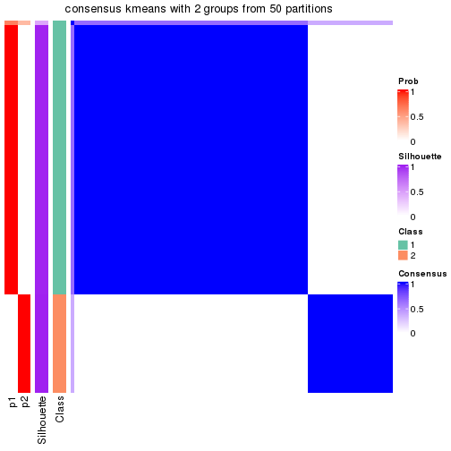</p>

</div>
<div id='tab-node-05-consensus-heatmap-2'>
<pre><code class="r">consensus_heatmap(res, k = 3)
</code></pre>

<p>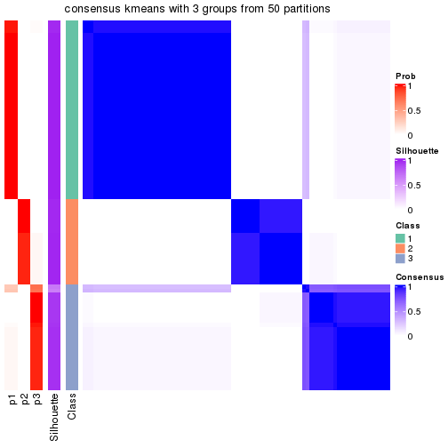</p>

</div>
<div id='tab-node-05-consensus-heatmap-3'>
<pre><code class="r">consensus_heatmap(res, k = 4)
</code></pre>

<p>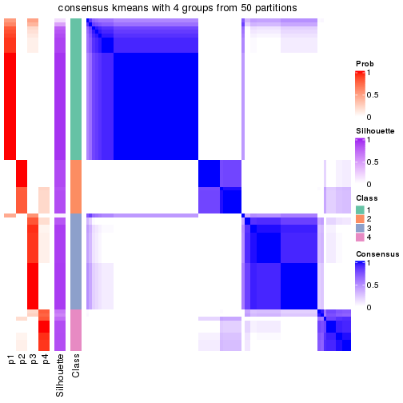</p>

</div>
<div id='tab-node-05-consensus-heatmap-4'>
<pre><code class="r">consensus_heatmap(res, k = 5)
</code></pre>

<p>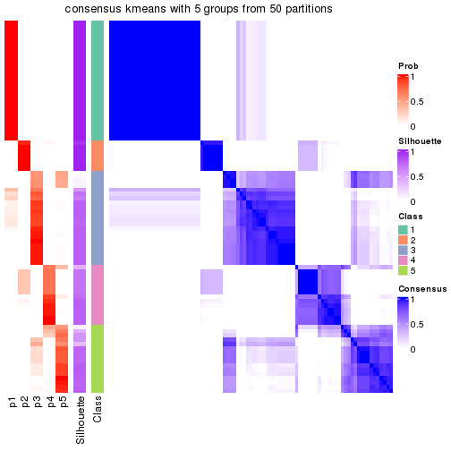</p>

</div>
<div id='tab-node-05-consensus-heatmap-5'>
<pre><code class="r">consensus_heatmap(res, k = 6)
</code></pre>

<p>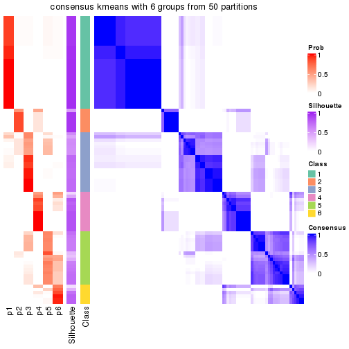</p>

</div>
<div id='tab-node-05-consensus-heatmap-6'>
<pre><code class="r">consensus_heatmap(res, k = 7)
</code></pre>

<p>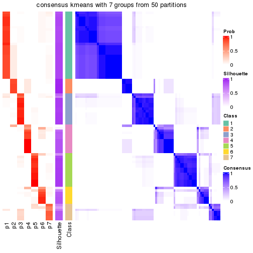</p>

</div>
<div id='tab-node-05-consensus-heatmap-7'>
<pre><code class="r">consensus_heatmap(res, k = 8)
</code></pre>

<p>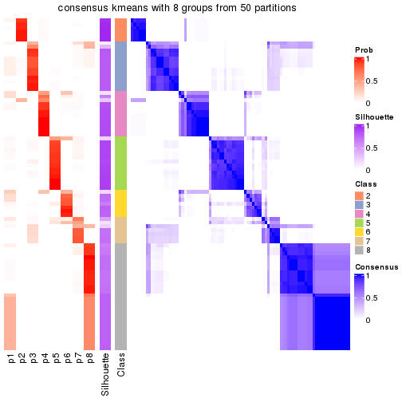</p>

</div>
</div>

Heatmaps for the membership of samples in all partitions to see how consistent they are:


<script>
$( function() {
	$( '#tabs-node-05-membership-heatmap' ).tabs();
} );
</script>
<div id='tabs-node-05-membership-heatmap'>
<ul>
<li><a href='#tab-node-05-membership-heatmap-1'>k = 2</a></li>
<li><a href='#tab-node-05-membership-heatmap-2'>k = 3</a></li>
<li><a href='#tab-node-05-membership-heatmap-3'>k = 4</a></li>
<li><a href='#tab-node-05-membership-heatmap-4'>k = 5</a></li>
<li><a href='#tab-node-05-membership-heatmap-5'>k = 6</a></li>
<li><a href='#tab-node-05-membership-heatmap-6'>k = 7</a></li>
<li><a href='#tab-node-05-membership-heatmap-7'>k = 8</a></li>
</ul>
<div id='tab-node-05-membership-heatmap-1'>
<pre><code class="r">membership_heatmap(res, k = 2)
</code></pre>

<p>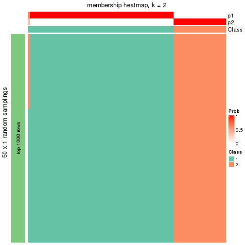</p>

</div>
<div id='tab-node-05-membership-heatmap-2'>
<pre><code class="r">membership_heatmap(res, k = 3)
</code></pre>

<p>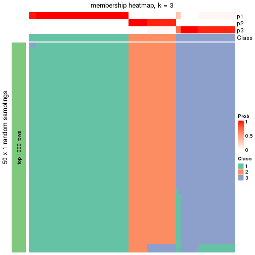</p>

</div>
<div id='tab-node-05-membership-heatmap-3'>
<pre><code class="r">membership_heatmap(res, k = 4)
</code></pre>

<p>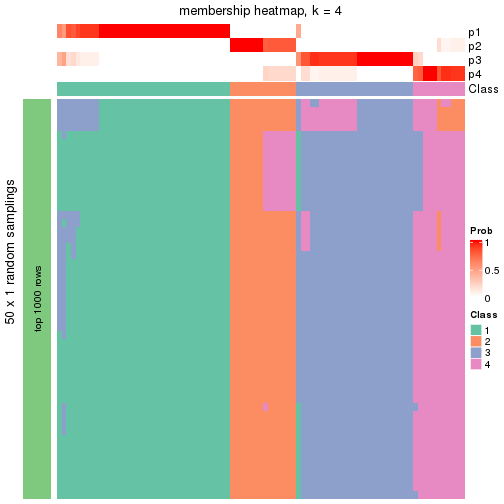</p>

</div>
<div id='tab-node-05-membership-heatmap-4'>
<pre><code class="r">membership_heatmap(res, k = 5)
</code></pre>

<p>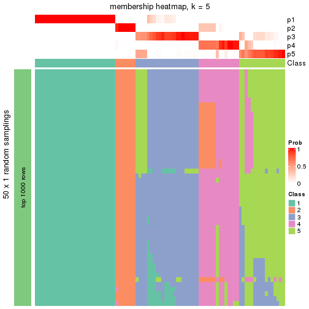</p>

</div>
<div id='tab-node-05-membership-heatmap-5'>
<pre><code class="r">membership_heatmap(res, k = 6)
</code></pre>

<p>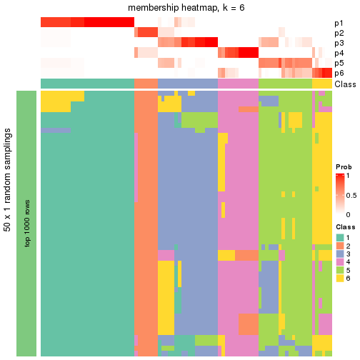</p>

</div>
<div id='tab-node-05-membership-heatmap-6'>
<pre><code class="r">membership_heatmap(res, k = 7)
</code></pre>

<p>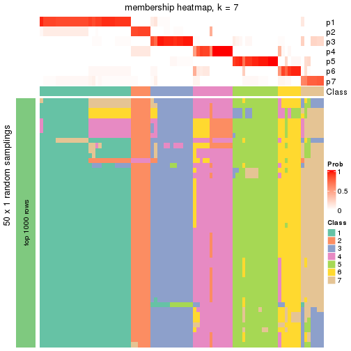</p>

</div>
<div id='tab-node-05-membership-heatmap-7'>
<pre><code class="r">membership_heatmap(res, k = 8)
</code></pre>

<p>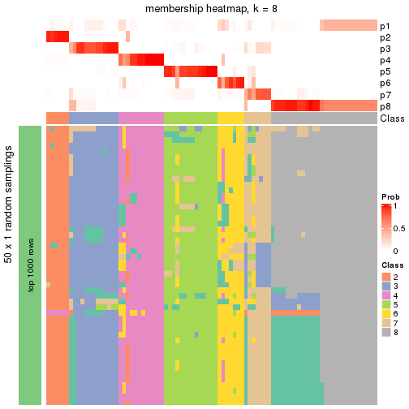</p>

</div>
</div>

As soon as the classes for columns are determined, the signatures
that are significantly different between subgroups can be looked for. 
Following are the heatmaps for signatures.


<script>
$( function() {
	$( '#tabs-node-05-get-signatures' ).tabs();
} );
</script>
<div id='tabs-node-05-get-signatures'>
<ul>
<li><a href='#tab-node-05-get-signatures-1'>k = 2</a></li>
<li><a href='#tab-node-05-get-signatures-2'>k = 3</a></li>
<li><a href='#tab-node-05-get-signatures-3'>k = 4</a></li>
<li><a href='#tab-node-05-get-signatures-4'>k = 5</a></li>
<li><a href='#tab-node-05-get-signatures-5'>k = 6</a></li>
<li><a href='#tab-node-05-get-signatures-6'>k = 7</a></li>
<li><a href='#tab-node-05-get-signatures-7'>k = 8</a></li>
</ul>
<div id='tab-node-05-get-signatures-1'>
<pre><code class="r">get_signatures(res, k = 2)
</code></pre>

<p>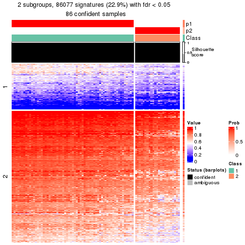</p>

</div>
<div id='tab-node-05-get-signatures-2'>
<pre><code class="r">get_signatures(res, k = 3)
</code></pre>

<p>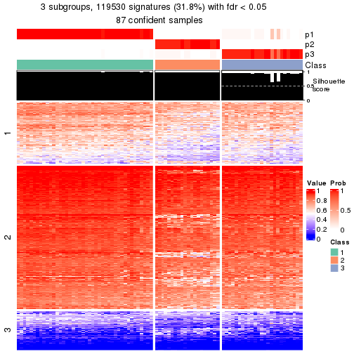</p>

</div>
<div id='tab-node-05-get-signatures-3'>
<pre><code class="r">get_signatures(res, k = 4)
</code></pre>

<p>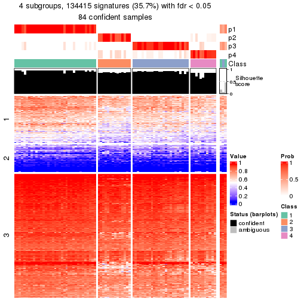</p>

</div>
<div id='tab-node-05-get-signatures-4'>
<pre><code class="r">get_signatures(res, k = 5)
</code></pre>

<p>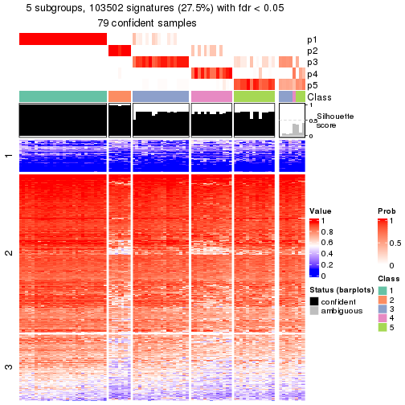</p>

</div>
<div id='tab-node-05-get-signatures-5'>
<pre><code class="r">get_signatures(res, k = 6)
</code></pre>

<p>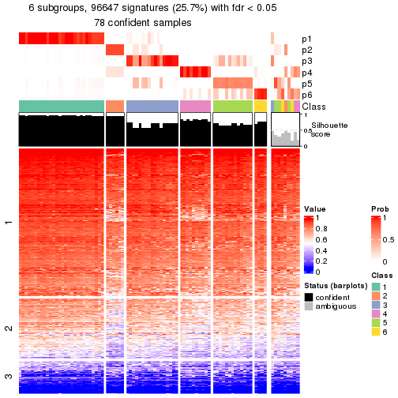</p>

</div>
<div id='tab-node-05-get-signatures-6'>
<pre><code class="r">get_signatures(res, k = 7)
</code></pre>

<p>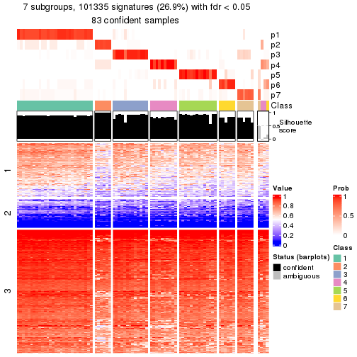</p>

</div>
<div id='tab-node-05-get-signatures-7'>
<pre><code class="r">get_signatures(res, k = 8)
</code></pre>

<p>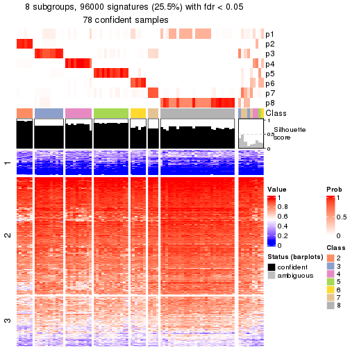</p>

</div>
</div>


Compare the overlap of signatures from different k:

```r
compare_signatures(res)
```

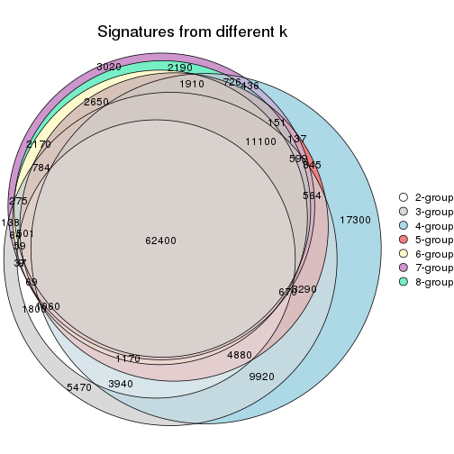

`get_signature()` returns a data frame invisibly. To get the list of signatures, the function
call should be assigned to a variable explicitly. In following code, if `plot` argument is set
to `FALSE`, no heatmap is plotted while only the differential analysis is performed.

```r
# code only for demonstration
tb = get_signature(res, k = ..., plot = FALSE)
```

An example of the output of `tb` is:

```
#>   which_row         fdr    mean_1    mean_2 scaled_mean_1 scaled_mean_2 km
#> 1        38 0.042760348  8.373488  9.131774    -0.5533452     0.5164555  1
#> 2        40 0.018707592  7.106213  8.469186    -0.6173731     0.5762149  1
#> 3        55 0.019134737 10.221463 11.207825    -0.6159697     0.5749050  1
#> 4        59 0.006059896  5.921854  7.869574    -0.6899429     0.6439467  1
#> 5        60 0.018055526  8.928898 10.211722    -0.6204761     0.5791110  1
#> 6        98 0.009384629 15.714769 14.887706     0.6635654    -0.6193277  2
...
```

The columns in `tb` are:

1. `which_row`: row indices corresponding to the input matrix.
2. `fdr`: FDR for the differential test. 
3. `mean_x`: The mean value in group x.
4. `scaled_mean_x`: The mean value in group x after rows are scaled.
5. `km`: Row groups if k-means clustering is applied to rows (which is done by automatically selecting number of clusters).

If there are too many signatures, `top_signatures = ...` can be set to only show the 
signatures with the highest FDRs:

```r
# code only for demonstration
# e.g. to show the top 500 most significant rows
tb = get_signature(res, k = ..., top_signatures = 500)
```

If the signatures are defined as these which are uniquely high in current group, `diff_method` argument
can be set to `"uniquely_high_in_one_group"`:

```r
# code only for demonstration
tb = get_signature(res, k = ..., diff_method = "uniquely_high_in_one_group")
```


UMAP plot which shows how samples are separated.


<script>
$( function() {
	$( '#tabs-node-05-dimension-reduction' ).tabs();
} );
</script>
<div id='tabs-node-05-dimension-reduction'>
<ul>
<li><a href='#tab-node-05-dimension-reduction-1'>k = 2</a></li>
<li><a href='#tab-node-05-dimension-reduction-2'>k = 3</a></li>
<li><a href='#tab-node-05-dimension-reduction-3'>k = 4</a></li>
<li><a href='#tab-node-05-dimension-reduction-4'>k = 5</a></li>
<li><a href='#tab-node-05-dimension-reduction-5'>k = 6</a></li>
<li><a href='#tab-node-05-dimension-reduction-6'>k = 7</a></li>
<li><a href='#tab-node-05-dimension-reduction-7'>k = 8</a></li>
</ul>
<div id='tab-node-05-dimension-reduction-1'>
<pre><code class="r">dimension_reduction(res, k = 2, method = &quot;UMAP&quot;)
</code></pre>

<p>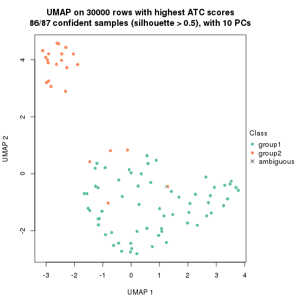</p>

</div>
<div id='tab-node-05-dimension-reduction-2'>
<pre><code class="r">dimension_reduction(res, k = 3, method = &quot;UMAP&quot;)
</code></pre>

<p>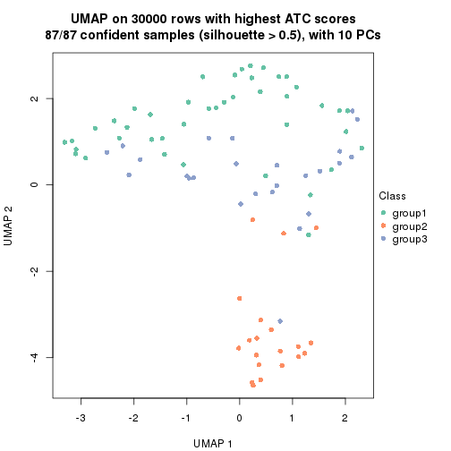</p>

</div>
<div id='tab-node-05-dimension-reduction-3'>
<pre><code class="r">dimension_reduction(res, k = 4, method = &quot;UMAP&quot;)
</code></pre>

<p>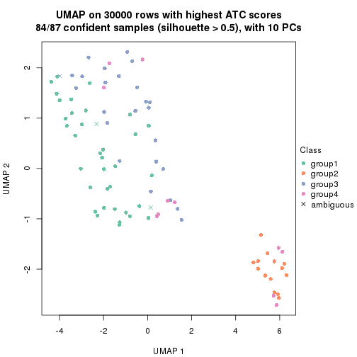</p>

</div>
<div id='tab-node-05-dimension-reduction-4'>
<pre><code class="r">dimension_reduction(res, k = 5, method = &quot;UMAP&quot;)
</code></pre>

<p>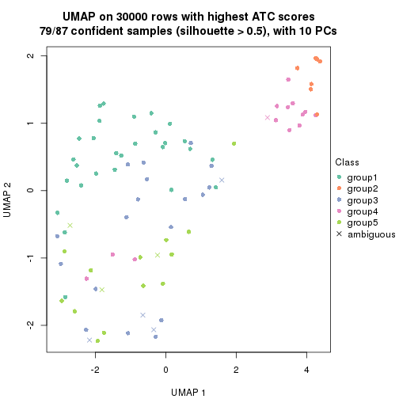</p>

</div>
<div id='tab-node-05-dimension-reduction-5'>
<pre><code class="r">dimension_reduction(res, k = 6, method = &quot;UMAP&quot;)
</code></pre>

<p>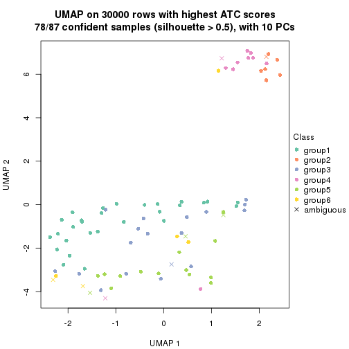</p>

</div>
<div id='tab-node-05-dimension-reduction-6'>
<pre><code class="r">dimension_reduction(res, k = 7, method = &quot;UMAP&quot;)
</code></pre>

<p>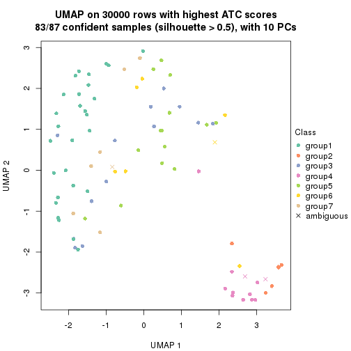</p>

</div>
<div id='tab-node-05-dimension-reduction-7'>
<pre><code class="r">dimension_reduction(res, k = 8, method = &quot;UMAP&quot;)
</code></pre>

<p>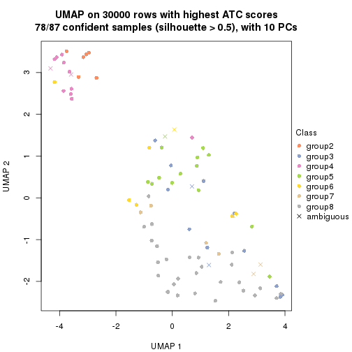</p>

</div>
</div>


Following heatmap shows how subgroups are split when increasing `k`:

```r
collect_classes(res)
```

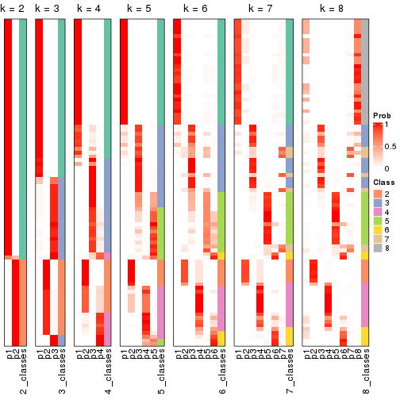


If matrix rows can be associated to genes, consider to use `functional_enrichment(res,
...)` to perform function enrichment for the signature genes. See [this vignette](https://jokergoo.github.io/cola_vignettes/functional_enrichment.html) for more detailed explanations.


 

---------------------------------------------------


### Node051


Parent node: [Node05](#Node05).
Child nodes: 
                Node0121-leaf
        ,
                Node0122-leaf
        ,
                Node0123-leaf
        ,
                Node0211-leaf
        ,
                [Node0212](#Node0212)
        ,
                Node0213-leaf
        ,
                [Node0221](#Node0221)
        ,
                Node0222-leaf
        ,
                Node0223-leaf
        ,
                [Node0231](#Node0231)
        ,
                Node0232-leaf
        ,
                Node0233-leaf
        ,
                Node0241-leaf
        ,
                Node0242-leaf
        ,
                Node0411-leaf
        ,
                Node0412-leaf
        ,
                Node0413-leaf
        ,
                Node0421-leaf
        ,
                Node0422-leaf
        ,
                Node0423-leaf
        ,
                Node0431-leaf
        ,
                Node0432-leaf
        ,
                Node0433-leaf
        ,
                Node0441-leaf
        ,
                Node0442-leaf
        ,
                Node0443-leaf
        ,
                Node0511-leaf
        ,
                [Node0512](#Node0512)
        ,
                Node0513-leaf
        ,
                Node0521-leaf
        ,
                Node0522-leaf
        ,
                Node0523-leaf
        .


The object with results only for a single top-value method and a single partitioning method 
can be extracted as:

```r
res = res_rh["051"]
```

A summary of `res` and all the functions that can be applied to it:

```r
res
```

```
#> A 'ConsensusPartition' object with k = 2, 3, 4, 5, 6, 7, 8.
#>   On a matrix with 30000 rows and 42 columns.
#>   Top rows (1000) are extracted by 'ATC' method.
#>   Subgroups are detected by 'skmeans' method.
#>   Performed in total 350 partitions by row resampling.
#>   Best k for subgroups seems to be 3.
#> 
#> Following methods can be applied to this 'ConsensusPartition' object:
#>  [1] "cola_report"             "collect_classes"         "collect_plots"          
#>  [4] "collect_stats"           "colnames"                "compare_partitions"     
#>  [7] "compare_signatures"      "consensus_heatmap"       "dimension_reduction"    
#> [10] "functional_enrichment"   "get_anno_col"            "get_anno"               
#> [13] "get_classes"             "get_consensus"           "get_matrix"             
#> [16] "get_membership"          "get_param"               "get_signatures"         
#> [19] "get_stats"               "is_best_k"               "is_stable_k"            
#> [22] "membership_heatmap"      "ncol"                    "nrow"                   
#> [25] "plot_ecdf"               "predict_classes"         "rownames"               
#> [28] "select_partition_number" "show"                    "suggest_best_k"         
#> [31] "test_to_known_factors"   "top_rows_heatmap"
```

`collect_plots()` function collects all the plots made from `res` for all `k` (number of subgroups)
into one single page to provide an easy and fast comparison between different `k`.

```r
collect_plots(res)
```

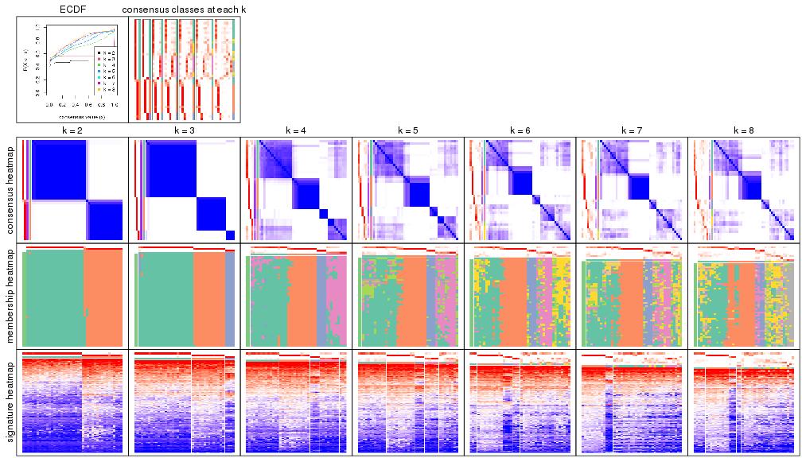

The plots are:

- The first row: a plot of the eCDF (empirical cumulative distribution
  function) curves of the consensus matrix for each `k` and the heatmap of
  predicted classes for each `k`.
- The second row: heatmaps of the consensus matrix for each `k`.
- The third row: heatmaps of the membership matrix for each `k`.
- The fouth row: heatmaps of the signatures for each `k`.

All the plots in panels can be made by individual functions and they are
plotted later in this section.

`select_partition_number()` produces several plots showing different
statistics for choosing "optimized" `k`. There are following statistics:

- eCDF curves of the consensus matrix for each `k`;
- 1-PAC. [The PAC score](https://en.wikipedia.org/wiki/Consensus_clustering#Over-interpretation_potential_of_consensus_clustering)
  measures the proportion of the ambiguous subgrouping.
- Mean silhouette score.
- Concordance. The mean probability of fiting the consensus subgroup labels in all
  partitions.
- Area increased. Denote $A_k$ as the area under the eCDF curve for current
  `k`, the area increased is defined as $A_k - A_{k-1}$.
- Rand index. The percent of pairs of samples that are both in a same cluster
  or both are not in a same cluster in the partition of k and k-1.
- Jaccard index. The ratio of pairs of samples are both in a same cluster in
  the partition of k and k-1 and the pairs of samples are both in a same
  cluster in the partition k or k-1.

The detailed explanations of these statistics can be found in [the _cola_
vignette](https://jokergoo.github.io/cola_vignettes/cola.html#toc_13).

Generally speaking, higher 1-PAC score, higher mean silhouette score or higher
concordance corresponds to better partition. Rand index and Jaccard index
measure how similar the current partition is compared to partition with `k-1`.
If they are too similar, we won't accept `k` is better than `k-1`.

```r
select_partition_number(res)
```

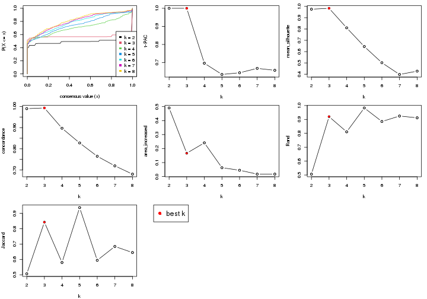

The numeric values for all these statistics can be obtained by `get_stats()`.

```r
get_stats(res)
```

```
#>   k 1-PAC mean_silhouette concordance area_increased  Rand Jaccard
#> 2 2 1.000           0.976       0.990         0.4903 0.506   0.506
#> 3 3 1.000           0.984       0.993         0.1669 0.920   0.843
#> 4 4 0.696           0.810       0.897         0.2410 0.811   0.580
#> 5 5 0.634           0.645       0.828         0.0633 0.983   0.938
#> 6 6 0.644           0.502       0.765         0.0453 0.885   0.594
#> 7 7 0.668           0.398       0.720         0.0175 0.925   0.684
#> 8 8 0.657           0.427       0.680         0.0176 0.912   0.645
```

`suggest_best_k()` suggests the best $k$ based on these statistics. The rules are as follows:

- All $k$ with Jaccard index larger than 0.95 are removed because increasing
  $k$ does not provide enough extra information. If all $k$ are removed, it is
  marked as no subgroup is detected.
- For all $k$ with 1-PAC score larger than 0.9, the maximal $k$ is taken as
  the best $k$, and other $k$ are marked as optional $k$.
- If it does not fit the second rule. The $k$ with the maximal vote of the
  highest 1-PAC score, highest mean silhouette, and highest concordance is
  taken as the best $k$.

```r
suggest_best_k(res)
```

```
#> [1] 3
#> attr(,"optional")
#> [1] 2
```

There is also optional best $k$ = 2 that is worth to check.

Following is the table of the partitions (You need to click the **show/hide
code output** link to see it). The membership matrix (columns with name `p*`)
is inferred by
[`clue::cl_consensus()`](https://www.rdocumentation.org/link/cl_consensus?package=clue)
function with the `SE` method. Basically the value in the membership matrix
represents the probability to belong to a certain group. The finall subgroup
label for an item is determined with the group with highest probability it
belongs to.

In `get_classes()` function, the entropy is calculated from the membership
matrix and the silhouette score is calculated from the consensus matrix.


<script>
$( function() {
	$( '#tabs-node-051-get-classes' ).tabs();
} );
</script>
<div id='tabs-node-051-get-classes'>
<ul>
<li><a href='#tab-node-051-get-classes-1'>k = 2</a></li>
<li><a href='#tab-node-051-get-classes-2'>k = 3</a></li>
<li><a href='#tab-node-051-get-classes-3'>k = 4</a></li>
<li><a href='#tab-node-051-get-classes-4'>k = 5</a></li>
<li><a href='#tab-node-051-get-classes-5'>k = 6</a></li>
<li><a href='#tab-node-051-get-classes-6'>k = 7</a></li>
<li><a href='#tab-node-051-get-classes-7'>k = 8</a></li>
</ul>

<div id='tab-node-051-get-classes-1'>
<p><a id='tab-node-051-get-classes-1-a' style='color:#0366d6' href='#'>show/hide code output</a></p>
<pre><code class="r">cbind(get_classes(res, k = 2), get_membership(res, k = 2))
</code></pre>

<pre><code>#&gt;                 class entropy silhouette   p1   p2
#&gt; TCGA.YL.A8SB.01     1   0.000      0.998 1.00 0.00
#&gt; TCGA.EJ.7797.01     1   0.000      0.998 1.00 0.00
#&gt; TCGA.EJ.5501.01     1   0.000      0.998 1.00 0.00
#&gt; TCGA.G9.6351.01     1   0.000      0.998 1.00 0.00
#&gt; TCGA.KK.A8IM.01     1   0.000      0.998 1.00 0.00
#&gt; TCGA.G9.6348.01     2   0.000      0.975 0.00 1.00
#&gt; TCGA.J4.A67Q.01     1   0.000      0.998 1.00 0.00
#&gt; TCGA.2A.A8VL.01     1   0.000      0.998 1.00 0.00
#&gt; TCGA.G9.6384.01     1   0.000      0.998 1.00 0.00
#&gt; TCGA.V1.A9Z8.01     2   0.000      0.975 0.00 1.00
#&gt; TCGA.J4.A67T.01     1   0.141      0.979 0.98 0.02
#&gt; TCGA.G9.6336.01     2   0.000      0.975 0.00 1.00
#&gt; TCGA.V1.A8MJ.01     1   0.000      0.998 1.00 0.00
#&gt; TCGA.VP.A87C.01     2   0.000      0.975 0.00 1.00
#&gt; TCGA.EJ.5497.01     1   0.000      0.998 1.00 0.00
#&gt; TCGA.V1.A9OY.01     1   0.000      0.998 1.00 0.00
#&gt; TCGA.HC.7747.01     1   0.000      0.998 1.00 0.00
#&gt; TCGA.HC.7745.01     1   0.000      0.998 1.00 0.00
#&gt; TCGA.EJ.5527.01     2   0.000      0.975 0.00 1.00
#&gt; TCGA.G9.6356.01     2   0.904      0.533 0.32 0.68
#&gt; TCGA.V1.A8WN.01     1   0.000      0.998 1.00 0.00
#&gt; TCGA.EJ.7328.01     2   0.000      0.975 0.00 1.00
#&gt; TCGA.J4.A67O.01     1   0.000      0.998 1.00 0.00
#&gt; TCGA.EJ.7783.01     2   0.000      0.975 0.00 1.00
#&gt; TCGA.EJ.5502.01     1   0.000      0.998 1.00 0.00
#&gt; TCGA.EJ.7785.01     1   0.000      0.998 1.00 0.00
#&gt; TCGA.EJ.5516.01     1   0.000      0.998 1.00 0.00
#&gt; TCGA.EJ.5512.01     1   0.000      0.998 1.00 0.00
#&gt; TCGA.EJ.7793.01     1   0.000      0.998 1.00 0.00
#&gt; TCGA.G9.6347.01     2   0.000      0.975 0.00 1.00
#&gt; TCGA.EJ.5508.01     2   0.000      0.975 0.00 1.00
#&gt; TCGA.J9.A52C.01     2   0.000      0.975 0.00 1.00
#&gt; TCGA.FC.7708.01     2   0.000      0.975 0.00 1.00
#&gt; TCGA.J4.A67R.01     2   0.000      0.975 0.00 1.00
#&gt; TCGA.CH.5738.01     1   0.000      0.998 1.00 0.00
#&gt; TCGA.G9.7522.01     1   0.000      0.998 1.00 0.00
#&gt; TCGA.CH.5746.01     1   0.000      0.998 1.00 0.00
#&gt; TCGA.ZG.A8QZ.01     2   0.000      0.975 0.00 1.00
#&gt; TCGA.HC.7750.01     2   0.402      0.900 0.08 0.92
#&gt; TCGA.VP.A87E.01     2   0.000      0.975 0.00 1.00
#&gt; TCGA.EJ.7792.01     1   0.141      0.979 0.98 0.02
#&gt; TCGA.EJ.5505.01     2   0.000      0.975 0.00 1.00
</code></pre>

<script>
$('#tab-node-051-get-classes-1-a').parent().next().next().hide();
$('#tab-node-051-get-classes-1-a').click(function(){
  $('#tab-node-051-get-classes-1-a').parent().next().next().toggle();
  return(false);
});
</script>
</div>

<div id='tab-node-051-get-classes-2'>
<p><a id='tab-node-051-get-classes-2-a' style='color:#0366d6' href='#'>show/hide code output</a></p>
<pre><code class="r">cbind(get_classes(res, k = 3), get_membership(res, k = 3))
</code></pre>

<pre><code>#&gt;                 class entropy silhouette   p1   p2  p3
#&gt; TCGA.YL.A8SB.01     1  0.0000      0.987 1.00 0.00 0.0
#&gt; TCGA.EJ.7797.01     1  0.0000      0.987 1.00 0.00 0.0
#&gt; TCGA.EJ.5501.01     1  0.0000      0.987 1.00 0.00 0.0
#&gt; TCGA.G9.6351.01     1  0.0000      0.987 1.00 0.00 0.0
#&gt; TCGA.KK.A8IM.01     1  0.0000      0.987 1.00 0.00 0.0
#&gt; TCGA.G9.6348.01     2  0.0000      0.998 0.00 1.00 0.0
#&gt; TCGA.J4.A67Q.01     1  0.4555      0.754 0.80 0.00 0.2
#&gt; TCGA.2A.A8VL.01     1  0.0000      0.987 1.00 0.00 0.0
#&gt; TCGA.G9.6384.01     1  0.0000      0.987 1.00 0.00 0.0
#&gt; TCGA.V1.A9Z8.01     2  0.0000      0.998 0.00 1.00 0.0
#&gt; TCGA.J4.A67T.01     1  0.0000      0.987 1.00 0.00 0.0
#&gt; TCGA.G9.6336.01     2  0.0000      0.998 0.00 1.00 0.0
#&gt; TCGA.V1.A8MJ.01     1  0.0000      0.987 1.00 0.00 0.0
#&gt; TCGA.VP.A87C.01     2  0.0000      0.998 0.00 1.00 0.0
#&gt; TCGA.EJ.5497.01     1  0.0000      0.987 1.00 0.00 0.0
#&gt; TCGA.V1.A9OY.01     1  0.0000      0.987 1.00 0.00 0.0
#&gt; TCGA.HC.7747.01     1  0.0000      0.987 1.00 0.00 0.0
#&gt; TCGA.HC.7745.01     1  0.0000      0.987 1.00 0.00 0.0
#&gt; TCGA.EJ.5527.01     2  0.0000      0.998 0.00 1.00 0.0
#&gt; TCGA.G9.6356.01     2  0.0892      0.971 0.02 0.98 0.0
#&gt; TCGA.V1.A8WN.01     1  0.2537      0.897 0.92 0.08 0.0
#&gt; TCGA.EJ.7328.01     2  0.0000      0.998 0.00 1.00 0.0
#&gt; TCGA.J4.A67O.01     1  0.0000      0.987 1.00 0.00 0.0
#&gt; TCGA.EJ.7783.01     2  0.0000      0.998 0.00 1.00 0.0
#&gt; TCGA.EJ.5502.01     1  0.0000      0.987 1.00 0.00 0.0
#&gt; TCGA.EJ.7785.01     1  0.0000      0.987 1.00 0.00 0.0
#&gt; TCGA.EJ.5516.01     1  0.0000      0.987 1.00 0.00 0.0
#&gt; TCGA.EJ.5512.01     1  0.0000      0.987 1.00 0.00 0.0
#&gt; TCGA.EJ.7793.01     1  0.0000      0.987 1.00 0.00 0.0
#&gt; TCGA.G9.6347.01     3  0.0000      1.000 0.00 0.00 1.0
#&gt; TCGA.EJ.5508.01     2  0.0000      0.998 0.00 1.00 0.0
#&gt; TCGA.J9.A52C.01     2  0.0000      0.998 0.00 1.00 0.0
#&gt; TCGA.FC.7708.01     2  0.0000      0.998 0.00 1.00 0.0
#&gt; TCGA.J4.A67R.01     2  0.0000      0.998 0.00 1.00 0.0
#&gt; TCGA.CH.5738.01     1  0.0000      0.987 1.00 0.00 0.0
#&gt; TCGA.G9.7522.01     1  0.0000      0.987 1.00 0.00 0.0
#&gt; TCGA.CH.5746.01     1  0.0000      0.987 1.00 0.00 0.0
#&gt; TCGA.ZG.A8QZ.01     2  0.0000      0.998 0.00 1.00 0.0
#&gt; TCGA.HC.7750.01     3  0.0000      1.000 0.00 0.00 1.0
#&gt; TCGA.VP.A87E.01     3  0.0000      1.000 0.00 0.00 1.0
#&gt; TCGA.EJ.7792.01     3  0.0000      1.000 0.00 0.00 1.0
#&gt; TCGA.EJ.5505.01     2  0.0000      0.998 0.00 1.00 0.0
</code></pre>

<script>
$('#tab-node-051-get-classes-2-a').parent().next().next().hide();
$('#tab-node-051-get-classes-2-a').click(function(){
  $('#tab-node-051-get-classes-2-a').parent().next().next().toggle();
  return(false);
});
</script>
</div>

<div id='tab-node-051-get-classes-3'>
<p><a id='tab-node-051-get-classes-3-a' style='color:#0366d6' href='#'>show/hide code output</a></p>
<pre><code class="r">cbind(get_classes(res, k = 4), get_membership(res, k = 4))
</code></pre>

<pre><code>#&gt;                 class entropy silhouette   p1   p2   p3   p4
#&gt; TCGA.YL.A8SB.01     1  0.4790      0.358 0.62 0.00 0.00 0.38
#&gt; TCGA.EJ.7797.01     4  0.0707      0.735 0.02 0.00 0.00 0.98
#&gt; TCGA.EJ.5501.01     4  0.4713      0.558 0.36 0.00 0.00 0.64
#&gt; TCGA.G9.6351.01     1  0.0707      0.837 0.98 0.00 0.00 0.02
#&gt; TCGA.KK.A8IM.01     1  0.2921      0.798 0.86 0.00 0.00 0.14
#&gt; TCGA.G9.6348.01     2  0.0000      0.961 0.00 1.00 0.00 0.00
#&gt; TCGA.J4.A67Q.01     1  0.7135      0.301 0.56 0.00 0.20 0.24
#&gt; TCGA.2A.A8VL.01     4  0.4907      0.448 0.42 0.00 0.00 0.58
#&gt; TCGA.G9.6384.01     4  0.4277      0.665 0.28 0.00 0.00 0.72
#&gt; TCGA.V1.A9Z8.01     2  0.0000      0.961 0.00 1.00 0.00 0.00
#&gt; TCGA.J4.A67T.01     1  0.0707      0.835 0.98 0.00 0.00 0.02
#&gt; TCGA.G9.6336.01     2  0.2345      0.875 0.10 0.90 0.00 0.00
#&gt; TCGA.V1.A8MJ.01     1  0.3198      0.795 0.88 0.00 0.08 0.04
#&gt; TCGA.VP.A87C.01     2  0.0000      0.961 0.00 1.00 0.00 0.00
#&gt; TCGA.EJ.5497.01     1  0.1211      0.837 0.96 0.00 0.00 0.04
#&gt; TCGA.V1.A9OY.01     1  0.3400      0.745 0.82 0.00 0.00 0.18
#&gt; TCGA.HC.7747.01     1  0.1637      0.834 0.94 0.00 0.00 0.06
#&gt; TCGA.HC.7745.01     1  0.2345      0.812 0.90 0.00 0.00 0.10
#&gt; TCGA.EJ.5527.01     2  0.0000      0.961 0.00 1.00 0.00 0.00
#&gt; TCGA.G9.6356.01     1  0.3801      0.584 0.78 0.22 0.00 0.00
#&gt; TCGA.V1.A8WN.01     1  0.1411      0.834 0.96 0.02 0.00 0.02
#&gt; TCGA.EJ.7328.01     2  0.0000      0.961 0.00 1.00 0.00 0.00
#&gt; TCGA.J4.A67O.01     1  0.2921      0.804 0.86 0.00 0.00 0.14
#&gt; TCGA.EJ.7783.01     2  0.0000      0.961 0.00 1.00 0.00 0.00
#&gt; TCGA.EJ.5502.01     1  0.1411      0.829 0.96 0.00 0.02 0.02
#&gt; TCGA.EJ.7785.01     1  0.1211      0.838 0.96 0.00 0.00 0.04
#&gt; TCGA.EJ.5516.01     1  0.1637      0.830 0.94 0.00 0.00 0.06
#&gt; TCGA.EJ.5512.01     4  0.0707      0.735 0.02 0.00 0.00 0.98
#&gt; TCGA.EJ.7793.01     4  0.4277      0.730 0.28 0.00 0.00 0.72
#&gt; TCGA.G9.6347.01     3  0.0000      1.000 0.00 0.00 1.00 0.00
#&gt; TCGA.EJ.5508.01     2  0.4134      0.667 0.26 0.74 0.00 0.00
#&gt; TCGA.J9.A52C.01     2  0.0000      0.961 0.00 1.00 0.00 0.00
#&gt; TCGA.FC.7708.01     2  0.0000      0.961 0.00 1.00 0.00 0.00
#&gt; TCGA.J4.A67R.01     2  0.1211      0.932 0.04 0.96 0.00 0.00
#&gt; TCGA.CH.5738.01     4  0.3801      0.737 0.22 0.00 0.00 0.78
#&gt; TCGA.G9.7522.01     4  0.4134      0.743 0.26 0.00 0.00 0.74
#&gt; TCGA.CH.5746.01     4  0.0707      0.735 0.02 0.00 0.00 0.98
#&gt; TCGA.ZG.A8QZ.01     2  0.0000      0.961 0.00 1.00 0.00 0.00
#&gt; TCGA.HC.7750.01     3  0.0000      1.000 0.00 0.00 1.00 0.00
#&gt; TCGA.VP.A87E.01     3  0.0000      1.000 0.00 0.00 1.00 0.00
#&gt; TCGA.EJ.7792.01     3  0.0000      1.000 0.00 0.00 1.00 0.00
#&gt; TCGA.EJ.5505.01     2  0.0000      0.961 0.00 1.00 0.00 0.00
</code></pre>

<script>
$('#tab-node-051-get-classes-3-a').parent().next().next().hide();
$('#tab-node-051-get-classes-3-a').click(function(){
  $('#tab-node-051-get-classes-3-a').parent().next().next().toggle();
  return(false);
});
</script>
</div>

<div id='tab-node-051-get-classes-4'>
<p><a id='tab-node-051-get-classes-4-a' style='color:#0366d6' href='#'>show/hide code output</a></p>
<pre><code class="r">cbind(get_classes(res, k = 5), get_membership(res, k = 5))
</code></pre>

<pre><code>#&gt;                 class entropy silhouette   p1   p2   p3   p4   p5
#&gt; TCGA.YL.A8SB.01     1  0.6794    -0.0287 0.38 0.00 0.00 0.32 0.30
#&gt; TCGA.EJ.7797.01     4  0.0609     0.6261 0.00 0.00 0.00 0.98 0.02
#&gt; TCGA.EJ.5501.01     4  0.5892     0.4108 0.22 0.00 0.00 0.60 0.18
#&gt; TCGA.G9.6351.01     1  0.1648     0.6722 0.94 0.00 0.00 0.02 0.04
#&gt; TCGA.KK.A8IM.01     1  0.5414     0.5552 0.66 0.00 0.00 0.14 0.20
#&gt; TCGA.G9.6348.01     2  0.0000     0.9052 0.00 1.00 0.00 0.00 0.00
#&gt; TCGA.J4.A67Q.01     5  0.5969     0.0000 0.12 0.00 0.14 0.06 0.68
#&gt; TCGA.2A.A8VL.01     4  0.6674     0.1623 0.28 0.00 0.00 0.44 0.28
#&gt; TCGA.G9.6384.01     4  0.4132     0.5221 0.26 0.00 0.00 0.72 0.02
#&gt; TCGA.V1.A9Z8.01     2  0.0000     0.9052 0.00 1.00 0.00 0.00 0.00
#&gt; TCGA.J4.A67T.01     1  0.3690     0.6129 0.78 0.00 0.00 0.02 0.20
#&gt; TCGA.G9.6336.01     2  0.3684     0.6390 0.28 0.72 0.00 0.00 0.00
#&gt; TCGA.V1.A8MJ.01     1  0.5525     0.5207 0.70 0.00 0.08 0.04 0.18
#&gt; TCGA.VP.A87C.01     2  0.0000     0.9052 0.00 1.00 0.00 0.00 0.00
#&gt; TCGA.EJ.5497.01     1  0.1216     0.6706 0.96 0.00 0.00 0.02 0.02
#&gt; TCGA.V1.A9OY.01     1  0.5597     0.4958 0.64 0.00 0.00 0.20 0.16
#&gt; TCGA.HC.7747.01     1  0.2077     0.6754 0.92 0.00 0.00 0.04 0.04
#&gt; TCGA.HC.7745.01     1  0.5263     0.5819 0.66 0.00 0.00 0.10 0.24
#&gt; TCGA.EJ.5527.01     2  0.0000     0.9052 0.00 1.00 0.00 0.00 0.00
#&gt; TCGA.G9.6356.01     1  0.3274     0.4147 0.78 0.22 0.00 0.00 0.00
#&gt; TCGA.V1.A8WN.01     1  0.1216     0.6660 0.96 0.02 0.00 0.00 0.02
#&gt; TCGA.EJ.7328.01     2  0.0000     0.9052 0.00 1.00 0.00 0.00 0.00
#&gt; TCGA.J4.A67O.01     1  0.5680     0.5019 0.62 0.00 0.00 0.14 0.24
#&gt; TCGA.EJ.7783.01     2  0.0000     0.9052 0.00 1.00 0.00 0.00 0.00
#&gt; TCGA.EJ.5502.01     1  0.4106     0.6076 0.80 0.00 0.04 0.02 0.14
#&gt; TCGA.EJ.7785.01     1  0.4075     0.6399 0.78 0.00 0.00 0.06 0.16
#&gt; TCGA.EJ.5516.01     1  0.4872     0.5827 0.72 0.00 0.00 0.12 0.16
#&gt; TCGA.EJ.5512.01     4  0.0609     0.6261 0.00 0.00 0.00 0.98 0.02
#&gt; TCGA.EJ.7793.01     4  0.5680     0.4059 0.14 0.00 0.00 0.62 0.24
#&gt; TCGA.G9.6347.01     3  0.0609     0.9476 0.00 0.00 0.98 0.00 0.02
#&gt; TCGA.EJ.5508.01     2  0.4287     0.2973 0.46 0.54 0.00 0.00 0.00
#&gt; TCGA.J9.A52C.01     2  0.0000     0.9052 0.00 1.00 0.00 0.00 0.00
#&gt; TCGA.FC.7708.01     2  0.0000     0.9052 0.00 1.00 0.00 0.00 0.00
#&gt; TCGA.J4.A67R.01     2  0.3274     0.7141 0.22 0.78 0.00 0.00 0.00
#&gt; TCGA.CH.5738.01     4  0.4216     0.5856 0.12 0.00 0.00 0.78 0.10
#&gt; TCGA.G9.7522.01     4  0.5083     0.5458 0.14 0.00 0.00 0.70 0.16
#&gt; TCGA.CH.5746.01     4  0.0000     0.6291 0.00 0.00 0.00 1.00 0.00
#&gt; TCGA.ZG.A8QZ.01     2  0.0000     0.9052 0.00 1.00 0.00 0.00 0.00
#&gt; TCGA.HC.7750.01     3  0.0609     0.9416 0.00 0.00 0.98 0.00 0.02
#&gt; TCGA.VP.A87E.01     3  0.0609     0.9476 0.00 0.00 0.98 0.00 0.02
#&gt; TCGA.EJ.7792.01     3  0.2020     0.8811 0.00 0.00 0.90 0.00 0.10
#&gt; TCGA.EJ.5505.01     2  0.0000     0.9052 0.00 1.00 0.00 0.00 0.00
</code></pre>

<script>
$('#tab-node-051-get-classes-4-a').parent().next().next().hide();
$('#tab-node-051-get-classes-4-a').click(function(){
  $('#tab-node-051-get-classes-4-a').parent().next().next().toggle();
  return(false);
});
</script>
</div>

<div id='tab-node-051-get-classes-5'>
<p><a id='tab-node-051-get-classes-5-a' style='color:#0366d6' href='#'>show/hide code output</a></p>
<pre><code class="r">cbind(get_classes(res, k = 6), get_membership(res, k = 6))
</code></pre>

<pre><code>#&gt;                 class entropy silhouette   p1   p2   p3   p4   p5   p6
#&gt; TCGA.YL.A8SB.01     5  0.7484     0.1853 0.28 0.00 0.00 0.14 0.34 0.24
#&gt; TCGA.EJ.7797.01     4  0.0000     0.5873 0.00 0.00 0.00 1.00 0.00 0.00
#&gt; TCGA.EJ.5501.01     4  0.7452    -0.0767 0.26 0.00 0.00 0.38 0.18 0.18
#&gt; TCGA.G9.6351.01     1  0.2941     0.3891 0.78 0.00 0.00 0.00 0.00 0.22
#&gt; TCGA.KK.A8IM.01     1  0.6015    -0.0346 0.52 0.00 0.00 0.08 0.06 0.34
#&gt; TCGA.G9.6348.01     2  0.0000     0.9291 0.00 1.00 0.00 0.00 0.00 0.00
#&gt; TCGA.J4.A67Q.01     5  0.5111     0.3398 0.02 0.00 0.00 0.10 0.66 0.22
#&gt; TCGA.2A.A8VL.01     6  0.7527     0.0556 0.18 0.00 0.00 0.26 0.20 0.36
#&gt; TCGA.G9.6384.01     4  0.5244     0.2185 0.36 0.00 0.00 0.56 0.06 0.02
#&gt; TCGA.V1.A9Z8.01     2  0.0000     0.9291 0.00 1.00 0.00 0.00 0.00 0.00
#&gt; TCGA.J4.A67T.01     6  0.5285     0.2161 0.42 0.00 0.00 0.00 0.10 0.48
#&gt; TCGA.G9.6336.01     2  0.3647     0.4933 0.36 0.64 0.00 0.00 0.00 0.00
#&gt; TCGA.V1.A8MJ.01     6  0.4731     0.2590 0.40 0.00 0.02 0.02 0.00 0.56
#&gt; TCGA.VP.A87C.01     2  0.0000     0.9291 0.00 1.00 0.00 0.00 0.00 0.00
#&gt; TCGA.EJ.5497.01     1  0.1814     0.5171 0.90 0.00 0.00 0.00 0.00 0.10
#&gt; TCGA.V1.A9OY.01     1  0.5362     0.3147 0.68 0.00 0.00 0.14 0.12 0.06
#&gt; TCGA.HC.7747.01     1  0.0547     0.5460 0.98 0.00 0.00 0.00 0.02 0.00
#&gt; TCGA.HC.7745.01     1  0.5227     0.2972 0.64 0.00 0.00 0.02 0.24 0.10
#&gt; TCGA.EJ.5527.01     2  0.0000     0.9291 0.00 1.00 0.00 0.00 0.00 0.00
#&gt; TCGA.G9.6356.01     1  0.2581     0.4737 0.86 0.12 0.00 0.00 0.00 0.02
#&gt; TCGA.V1.A8WN.01     1  0.1092     0.5438 0.96 0.02 0.00 0.00 0.00 0.02
#&gt; TCGA.EJ.7328.01     2  0.0000     0.9291 0.00 1.00 0.00 0.00 0.00 0.00
#&gt; TCGA.J4.A67O.01     6  0.5544     0.1728 0.40 0.00 0.00 0.02 0.08 0.50
#&gt; TCGA.EJ.7783.01     2  0.0000     0.9291 0.00 1.00 0.00 0.00 0.00 0.00
#&gt; TCGA.EJ.5502.01     6  0.3797     0.2809 0.42 0.00 0.00 0.00 0.00 0.58
#&gt; TCGA.EJ.7785.01     1  0.3321     0.4818 0.82 0.00 0.00 0.00 0.10 0.08
#&gt; TCGA.EJ.5516.01     1  0.4328    -0.1989 0.52 0.00 0.00 0.02 0.00 0.46
#&gt; TCGA.EJ.5512.01     4  0.2403     0.5708 0.02 0.00 0.00 0.90 0.04 0.04
#&gt; TCGA.EJ.7793.01     6  0.5734    -0.1816 0.02 0.00 0.00 0.40 0.10 0.48
#&gt; TCGA.G9.6347.01     3  0.1480     0.8283 0.00 0.00 0.94 0.00 0.04 0.02
#&gt; TCGA.EJ.5508.01     1  0.3578     0.2329 0.66 0.34 0.00 0.00 0.00 0.00
#&gt; TCGA.J9.A52C.01     2  0.0000     0.9291 0.00 1.00 0.00 0.00 0.00 0.00
#&gt; TCGA.FC.7708.01     2  0.0000     0.9291 0.00 1.00 0.00 0.00 0.00 0.00
#&gt; TCGA.J4.A67R.01     2  0.3309     0.6441 0.28 0.72 0.00 0.00 0.00 0.00
#&gt; TCGA.CH.5738.01     4  0.5637     0.4250 0.10 0.00 0.00 0.66 0.10 0.14
#&gt; TCGA.G9.7522.01     4  0.4765     0.3942 0.02 0.00 0.00 0.64 0.04 0.30
#&gt; TCGA.CH.5746.01     4  0.0937     0.5894 0.00 0.00 0.00 0.96 0.00 0.04
#&gt; TCGA.ZG.A8QZ.01     2  0.0000     0.9291 0.00 1.00 0.00 0.00 0.00 0.00
#&gt; TCGA.HC.7750.01     3  0.1807     0.8329 0.00 0.00 0.92 0.00 0.06 0.02
#&gt; TCGA.VP.A87E.01     3  0.0000     0.8407 0.00 0.00 1.00 0.00 0.00 0.00
#&gt; TCGA.EJ.7792.01     3  0.5490     0.5702 0.00 0.00 0.56 0.00 0.26 0.18
#&gt; TCGA.EJ.5505.01     2  0.0937     0.8995 0.04 0.96 0.00 0.00 0.00 0.00
</code></pre>

<script>
$('#tab-node-051-get-classes-5-a').parent().next().next().hide();
$('#tab-node-051-get-classes-5-a').click(function(){
  $('#tab-node-051-get-classes-5-a').parent().next().next().toggle();
  return(false);
});
</script>
</div>

<div id='tab-node-051-get-classes-6'>
<p><a id='tab-node-051-get-classes-6-a' style='color:#0366d6' href='#'>show/hide code output</a></p>
<pre><code class="r">cbind(get_classes(res, k = 7), get_membership(res, k = 7))
</code></pre>

<pre><code>#&gt;                 class entropy silhouette   p1   p2   p3   p4   p5   p6   p7
#&gt; TCGA.YL.A8SB.01     5   0.623     0.0000 0.26 0.00 0.00 0.18 0.50 0.04 0.02
#&gt; TCGA.EJ.7797.01     4   0.101     0.4920 0.00 0.00 0.00 0.96 0.02 0.02 0.00
#&gt; TCGA.EJ.5501.01     4   0.778    -0.3273 0.24 0.00 0.00 0.34 0.16 0.18 0.08
#&gt; TCGA.G9.6351.01     1   0.324     0.4179 0.78 0.00 0.00 0.00 0.04 0.18 0.00
#&gt; TCGA.KK.A8IM.01     1   0.663    -0.0946 0.42 0.00 0.00 0.12 0.26 0.20 0.00
#&gt; TCGA.G9.6348.01     2   0.000     0.9465 0.00 1.00 0.00 0.00 0.00 0.00 0.00
#&gt; TCGA.J4.A67Q.01     7   0.604     0.0000 0.00 0.00 0.04 0.02 0.24 0.16 0.54
#&gt; TCGA.2A.A8VL.01     6   0.699    -0.1136 0.10 0.00 0.00 0.20 0.30 0.38 0.02
#&gt; TCGA.G9.6384.01     4   0.659    -0.2178 0.22 0.00 0.00 0.44 0.22 0.12 0.00
#&gt; TCGA.V1.A9Z8.01     2   0.000     0.9465 0.00 1.00 0.00 0.00 0.00 0.00 0.00
#&gt; TCGA.J4.A67T.01     1   0.387     0.2048 0.60 0.00 0.00 0.00 0.02 0.38 0.00
#&gt; TCGA.G9.6336.01     1   0.346     0.1534 0.60 0.40 0.00 0.00 0.00 0.00 0.00
#&gt; TCGA.V1.A8MJ.01     6   0.715     0.0261 0.38 0.00 0.10 0.04 0.04 0.38 0.06
#&gt; TCGA.VP.A87C.01     2   0.000     0.9465 0.00 1.00 0.00 0.00 0.00 0.00 0.00
#&gt; TCGA.EJ.5497.01     1   0.226     0.4402 0.84 0.00 0.00 0.00 0.00 0.16 0.00
#&gt; TCGA.V1.A9OY.01     1   0.601    -0.4910 0.42 0.00 0.00 0.18 0.36 0.04 0.00
#&gt; TCGA.HC.7747.01     1   0.242     0.3998 0.88 0.00 0.00 0.02 0.08 0.02 0.00
#&gt; TCGA.HC.7745.01     1   0.591     0.2015 0.56 0.00 0.00 0.02 0.24 0.14 0.04
#&gt; TCGA.EJ.5527.01     2   0.000     0.9465 0.00 1.00 0.00 0.00 0.00 0.00 0.00
#&gt; TCGA.G9.6356.01     1   0.136     0.4651 0.94 0.04 0.00 0.00 0.00 0.02 0.00
#&gt; TCGA.V1.A8WN.01     1   0.151     0.4632 0.94 0.02 0.00 0.00 0.02 0.02 0.00
#&gt; TCGA.EJ.7328.01     2   0.000     0.9465 0.00 1.00 0.00 0.00 0.00 0.00 0.00
#&gt; TCGA.J4.A67O.01     6   0.587     0.0806 0.34 0.00 0.00 0.00 0.12 0.48 0.06
#&gt; TCGA.EJ.7783.01     2   0.000     0.9465 0.00 1.00 0.00 0.00 0.00 0.00 0.00
#&gt; TCGA.EJ.5502.01     1   0.483     0.0479 0.52 0.00 0.02 0.00 0.02 0.42 0.02
#&gt; TCGA.EJ.7785.01     1   0.438     0.2538 0.70 0.00 0.00 0.02 0.20 0.08 0.00
#&gt; TCGA.EJ.5516.01     1   0.498    -0.0124 0.50 0.00 0.00 0.04 0.04 0.42 0.00
#&gt; TCGA.EJ.5512.01     4   0.393     0.4208 0.00 0.00 0.00 0.76 0.14 0.02 0.08
#&gt; TCGA.EJ.7793.01     4   0.623     0.1232 0.06 0.00 0.00 0.44 0.20 0.30 0.00
#&gt; TCGA.G9.6347.01     3   0.166     0.7424 0.00 0.00 0.92 0.00 0.06 0.00 0.02
#&gt; TCGA.EJ.5508.01     1   0.275     0.3767 0.82 0.16 0.00 0.00 0.00 0.02 0.00
#&gt; TCGA.J9.A52C.01     2   0.000     0.9465 0.00 1.00 0.00 0.00 0.00 0.00 0.00
#&gt; TCGA.FC.7708.01     2   0.000     0.9465 0.00 1.00 0.00 0.00 0.00 0.00 0.00
#&gt; TCGA.J4.A67R.01     2   0.341     0.3625 0.38 0.62 0.00 0.00 0.00 0.00 0.00
#&gt; TCGA.CH.5738.01     4   0.493     0.1794 0.08 0.00 0.00 0.64 0.24 0.04 0.00
#&gt; TCGA.G9.7522.01     4   0.584     0.3529 0.02 0.00 0.00 0.58 0.10 0.24 0.06
#&gt; TCGA.CH.5746.01     4   0.000     0.4923 0.00 0.00 0.00 1.00 0.00 0.00 0.00
#&gt; TCGA.ZG.A8QZ.01     2   0.000     0.9465 0.00 1.00 0.00 0.00 0.00 0.00 0.00
#&gt; TCGA.HC.7750.01     3   0.257     0.7300 0.00 0.00 0.84 0.00 0.00 0.02 0.14
#&gt; TCGA.VP.A87E.01     3   0.000     0.7655 0.00 0.00 1.00 0.00 0.00 0.00 0.00
#&gt; TCGA.EJ.7792.01     3   0.464     0.3640 0.00 0.00 0.54 0.00 0.00 0.08 0.38
#&gt; TCGA.EJ.5505.01     2   0.136     0.8958 0.04 0.94 0.00 0.00 0.02 0.00 0.00
</code></pre>

<script>
$('#tab-node-051-get-classes-6-a').parent().next().next().hide();
$('#tab-node-051-get-classes-6-a').click(function(){
  $('#tab-node-051-get-classes-6-a').parent().next().next().toggle();
  return(false);
});
</script>
</div>

<div id='tab-node-051-get-classes-7'>
<p><a id='tab-node-051-get-classes-7-a' style='color:#0366d6' href='#'>show/hide code output</a></p>
<pre><code class="r">cbind(get_classes(res, k = 8), get_membership(res, k = 8))
</code></pre>

<pre><code>#&gt;                 class entropy silhouette   p1   p2   p3   p4   p5   p6   p7   p8
#&gt; TCGA.YL.A8SB.01     5  0.8201    0.14312 0.24 0.00 0.00 0.16 0.26 0.06 0.14 0.14
#&gt; TCGA.EJ.7797.01     8  0.3198    0.53372 0.00 0.00 0.00 0.00 0.02 0.26 0.00 0.72
#&gt; TCGA.EJ.5501.01     5  0.6805    0.09301 0.12 0.00 0.00 0.00 0.44 0.20 0.06 0.18
#&gt; TCGA.G9.6351.01     1  0.2862    0.52641 0.82 0.00 0.00 0.00 0.08 0.10 0.00 0.00
#&gt; TCGA.KK.A8IM.01     1  0.6413   -0.11888 0.34 0.00 0.00 0.00 0.24 0.34 0.04 0.04
#&gt; TCGA.G9.6348.01     2  0.0471    0.87382 0.00 0.98 0.00 0.00 0.02 0.00 0.00 0.00
#&gt; TCGA.J4.A67Q.01     7  0.2350    0.00000 0.04 0.00 0.00 0.00 0.00 0.10 0.86 0.00
#&gt; TCGA.2A.A8VL.01     5  0.6529    0.03968 0.04 0.00 0.00 0.08 0.46 0.30 0.02 0.10
#&gt; TCGA.G9.6384.01     8  0.6726    0.10597 0.24 0.00 0.00 0.04 0.18 0.12 0.00 0.42
#&gt; TCGA.V1.A9Z8.01     2  0.0000    0.88412 0.00 1.00 0.00 0.00 0.00 0.00 0.00 0.00
#&gt; TCGA.J4.A67T.01     1  0.5560    0.39671 0.62 0.02 0.00 0.08 0.04 0.20 0.04 0.00
#&gt; TCGA.G9.6336.01     2  0.3729    0.12909 0.46 0.52 0.00 0.02 0.00 0.00 0.00 0.00
#&gt; TCGA.V1.A8MJ.01     6  0.7209    0.13030 0.28 0.00 0.04 0.18 0.06 0.38 0.06 0.00
#&gt; TCGA.VP.A87C.01     2  0.1275    0.85131 0.00 0.94 0.00 0.04 0.02 0.00 0.00 0.00
#&gt; TCGA.EJ.5497.01     1  0.2025    0.54266 0.88 0.00 0.00 0.00 0.02 0.10 0.00 0.00
#&gt; TCGA.V1.A9OY.01     1  0.6217    0.14339 0.56 0.00 0.00 0.06 0.20 0.06 0.02 0.10
#&gt; TCGA.HC.7747.01     1  0.2224    0.54878 0.86 0.00 0.00 0.02 0.12 0.00 0.00 0.00
#&gt; TCGA.HC.7745.01     1  0.6886    0.23598 0.50 0.00 0.00 0.12 0.14 0.14 0.08 0.02
#&gt; TCGA.EJ.5527.01     2  0.0000    0.88412 0.00 1.00 0.00 0.00 0.00 0.00 0.00 0.00
#&gt; TCGA.G9.6356.01     1  0.2569    0.47677 0.82 0.16 0.00 0.02 0.00 0.00 0.00 0.00
#&gt; TCGA.V1.A8WN.01     1  0.1804    0.54931 0.90 0.00 0.00 0.02 0.08 0.00 0.00 0.00
#&gt; TCGA.EJ.7328.01     2  0.0000    0.88412 0.00 1.00 0.00 0.00 0.00 0.00 0.00 0.00
#&gt; TCGA.J4.A67O.01     1  0.7358    0.01830 0.40 0.00 0.00 0.16 0.10 0.24 0.04 0.06
#&gt; TCGA.EJ.7783.01     2  0.0000    0.88412 0.00 1.00 0.00 0.00 0.00 0.00 0.00 0.00
#&gt; TCGA.EJ.5502.01     1  0.5378    0.27438 0.56 0.00 0.02 0.10 0.00 0.28 0.04 0.00
#&gt; TCGA.EJ.7785.01     1  0.2725    0.52705 0.82 0.00 0.00 0.00 0.14 0.04 0.00 0.00
#&gt; TCGA.EJ.5516.01     6  0.4940   -0.01634 0.40 0.00 0.00 0.00 0.10 0.48 0.02 0.00
#&gt; TCGA.EJ.5512.01     8  0.2020    0.36438 0.00 0.00 0.00 0.02 0.06 0.00 0.02 0.90
#&gt; TCGA.EJ.7793.01     6  0.3270    0.17913 0.00 0.00 0.00 0.00 0.02 0.80 0.06 0.12
#&gt; TCGA.G9.6347.01     3  0.0808    0.64633 0.00 0.00 0.96 0.04 0.00 0.00 0.00 0.00
#&gt; TCGA.EJ.5508.01     1  0.3746    0.31707 0.64 0.32 0.00 0.04 0.00 0.00 0.00 0.00
#&gt; TCGA.J9.A52C.01     2  0.0000    0.88412 0.00 1.00 0.00 0.00 0.00 0.00 0.00 0.00
#&gt; TCGA.FC.7708.01     2  0.0000    0.88412 0.00 1.00 0.00 0.00 0.00 0.00 0.00 0.00
#&gt; TCGA.J4.A67R.01     2  0.3658    0.30050 0.40 0.58 0.00 0.02 0.00 0.00 0.00 0.00
#&gt; TCGA.CH.5738.01     8  0.6445    0.11486 0.14 0.00 0.00 0.00 0.14 0.26 0.02 0.44
#&gt; TCGA.G9.7522.01     6  0.4478   -0.00464 0.04 0.00 0.00 0.04 0.02 0.68 0.00 0.22
#&gt; TCGA.CH.5746.01     8  0.3594    0.52164 0.00 0.00 0.00 0.00 0.00 0.28 0.04 0.68
#&gt; TCGA.ZG.A8QZ.01     2  0.0000    0.88412 0.00 1.00 0.00 0.00 0.00 0.00 0.00 0.00
#&gt; TCGA.HC.7750.01     3  0.4862    0.51201 0.00 0.00 0.60 0.16 0.02 0.00 0.22 0.00
#&gt; TCGA.VP.A87E.01     3  0.0941    0.66420 0.00 0.00 0.96 0.02 0.00 0.00 0.02 0.00
#&gt; TCGA.EJ.7792.01     3  0.5123    0.30523 0.00 0.00 0.42 0.36 0.00 0.00 0.22 0.00
#&gt; TCGA.EJ.5505.01     2  0.1341    0.83598 0.00 0.92 0.00 0.00 0.08 0.00 0.00 0.00
</code></pre>

<script>
$('#tab-node-051-get-classes-7-a').parent().next().next().hide();
$('#tab-node-051-get-classes-7-a').click(function(){
  $('#tab-node-051-get-classes-7-a').parent().next().next().toggle();
  return(false);
});
</script>
</div>
</div>

Heatmaps for the consensus matrix. It visualizes the probability of two
samples to be in a same group.


<script>
$( function() {
	$( '#tabs-node-051-consensus-heatmap' ).tabs();
} );
</script>
<div id='tabs-node-051-consensus-heatmap'>
<ul>
<li><a href='#tab-node-051-consensus-heatmap-1'>k = 2</a></li>
<li><a href='#tab-node-051-consensus-heatmap-2'>k = 3</a></li>
<li><a href='#tab-node-051-consensus-heatmap-3'>k = 4</a></li>
<li><a href='#tab-node-051-consensus-heatmap-4'>k = 5</a></li>
<li><a href='#tab-node-051-consensus-heatmap-5'>k = 6</a></li>
<li><a href='#tab-node-051-consensus-heatmap-6'>k = 7</a></li>
<li><a href='#tab-node-051-consensus-heatmap-7'>k = 8</a></li>
</ul>
<div id='tab-node-051-consensus-heatmap-1'>
<pre><code class="r">consensus_heatmap(res, k = 2)
</code></pre>

<p>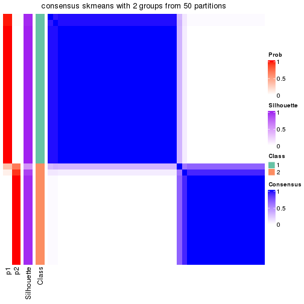</p>

</div>
<div id='tab-node-051-consensus-heatmap-2'>
<pre><code class="r">consensus_heatmap(res, k = 3)
</code></pre>

<p>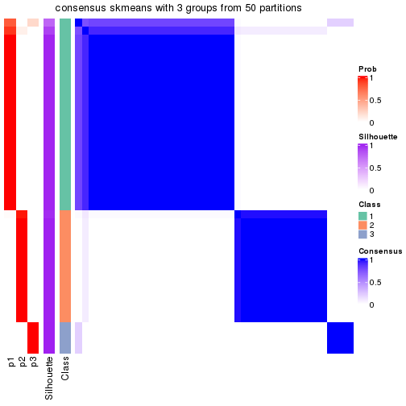</p>

</div>
<div id='tab-node-051-consensus-heatmap-3'>
<pre><code class="r">consensus_heatmap(res, k = 4)
</code></pre>

<p>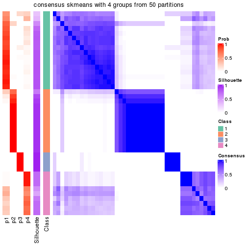</p>

</div>
<div id='tab-node-051-consensus-heatmap-4'>
<pre><code class="r">consensus_heatmap(res, k = 5)
</code></pre>

<p>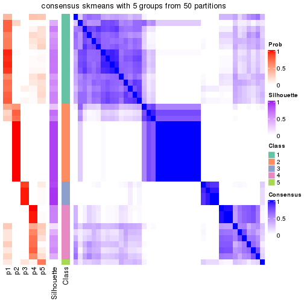</p>

</div>
<div id='tab-node-051-consensus-heatmap-5'>
<pre><code class="r">consensus_heatmap(res, k = 6)
</code></pre>

<p>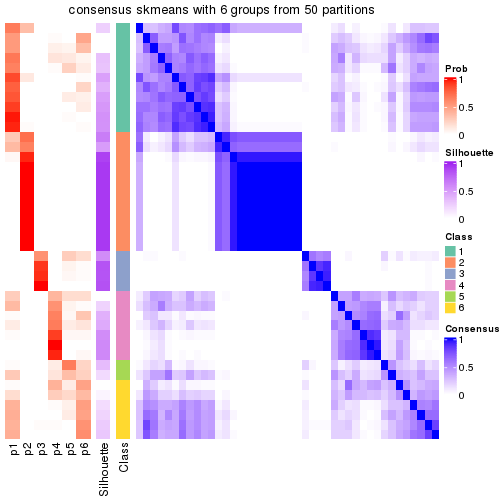</p>

</div>
<div id='tab-node-051-consensus-heatmap-6'>
<pre><code class="r">consensus_heatmap(res, k = 7)
</code></pre>

<p>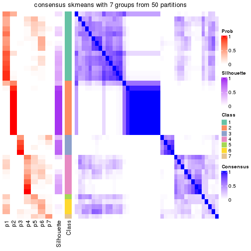</p>

</div>
<div id='tab-node-051-consensus-heatmap-7'>
<pre><code class="r">consensus_heatmap(res, k = 8)
</code></pre>

<p>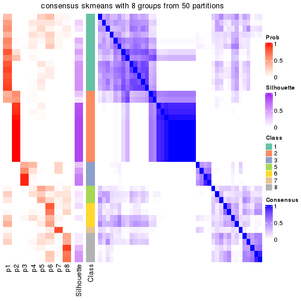</p>

</div>
</div>

Heatmaps for the membership of samples in all partitions to see how consistent they are:


<script>
$( function() {
	$( '#tabs-node-051-membership-heatmap' ).tabs();
} );
</script>
<div id='tabs-node-051-membership-heatmap'>
<ul>
<li><a href='#tab-node-051-membership-heatmap-1'>k = 2</a></li>
<li><a href='#tab-node-051-membership-heatmap-2'>k = 3</a></li>
<li><a href='#tab-node-051-membership-heatmap-3'>k = 4</a></li>
<li><a href='#tab-node-051-membership-heatmap-4'>k = 5</a></li>
<li><a href='#tab-node-051-membership-heatmap-5'>k = 6</a></li>
<li><a href='#tab-node-051-membership-heatmap-6'>k = 7</a></li>
<li><a href='#tab-node-051-membership-heatmap-7'>k = 8</a></li>
</ul>
<div id='tab-node-051-membership-heatmap-1'>
<pre><code class="r">membership_heatmap(res, k = 2)
</code></pre>

<p>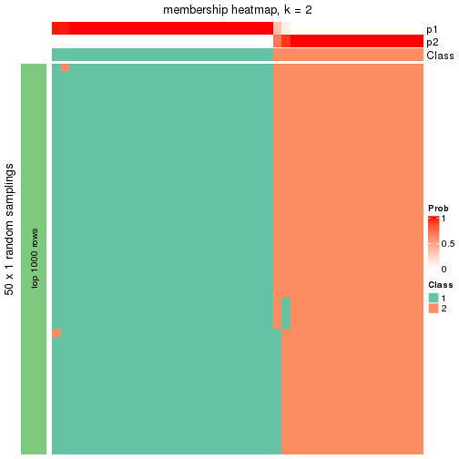</p>

</div>
<div id='tab-node-051-membership-heatmap-2'>
<pre><code class="r">membership_heatmap(res, k = 3)
</code></pre>

<p>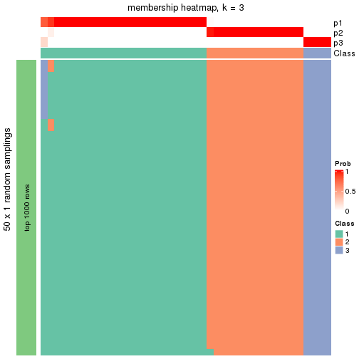</p>

</div>
<div id='tab-node-051-membership-heatmap-3'>
<pre><code class="r">membership_heatmap(res, k = 4)
</code></pre>

<p>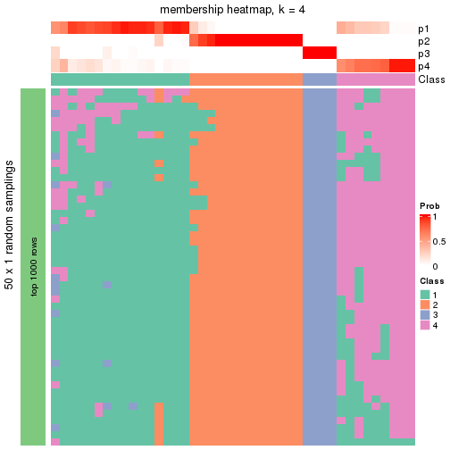</p>

</div>
<div id='tab-node-051-membership-heatmap-4'>
<pre><code class="r">membership_heatmap(res, k = 5)
</code></pre>

<p>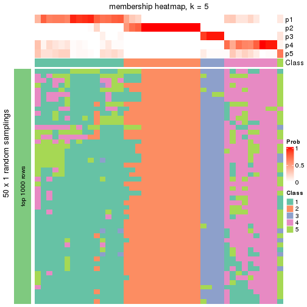</p>

</div>
<div id='tab-node-051-membership-heatmap-5'>
<pre><code class="r">membership_heatmap(res, k = 6)
</code></pre>

<p>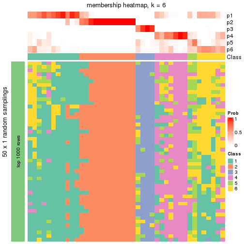</p>

</div>
<div id='tab-node-051-membership-heatmap-6'>
<pre><code class="r">membership_heatmap(res, k = 7)
</code></pre>

<p>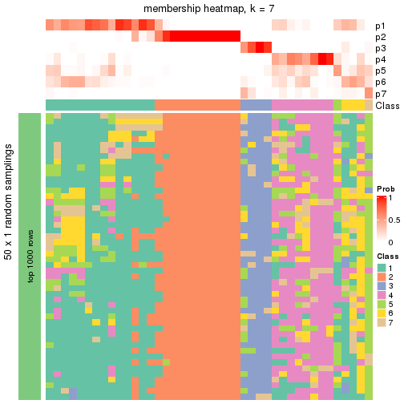</p>

</div>
<div id='tab-node-051-membership-heatmap-7'>
<pre><code class="r">membership_heatmap(res, k = 8)
</code></pre>

<p>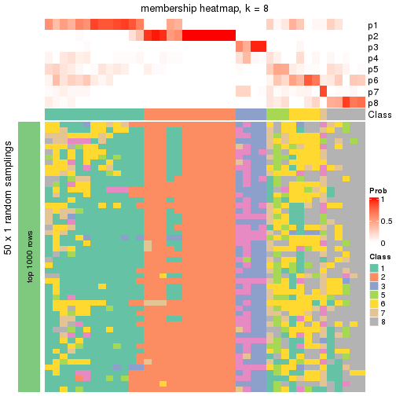</p>

</div>
</div>

As soon as the classes for columns are determined, the signatures
that are significantly different between subgroups can be looked for. 
Following are the heatmaps for signatures.


<script>
$( function() {
	$( '#tabs-node-051-get-signatures' ).tabs();
} );
</script>
<div id='tabs-node-051-get-signatures'>
<ul>
<li><a href='#tab-node-051-get-signatures-1'>k = 2</a></li>
<li><a href='#tab-node-051-get-signatures-2'>k = 3</a></li>
<li><a href='#tab-node-051-get-signatures-3'>k = 4</a></li>
<li><a href='#tab-node-051-get-signatures-4'>k = 5</a></li>
<li><a href='#tab-node-051-get-signatures-5'>k = 6</a></li>
<li><a href='#tab-node-051-get-signatures-6'>k = 7</a></li>
<li><a href='#tab-node-051-get-signatures-7'>k = 8</a></li>
</ul>
<div id='tab-node-051-get-signatures-1'>
<pre><code class="r">get_signatures(res, k = 2)
</code></pre>

<p>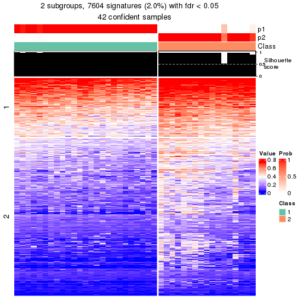</p>

</div>
<div id='tab-node-051-get-signatures-2'>
<pre><code class="r">get_signatures(res, k = 3)
</code></pre>

<p>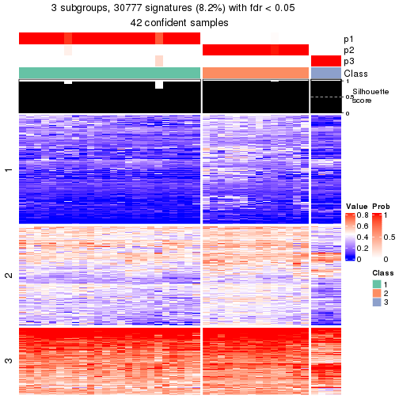</p>

</div>
<div id='tab-node-051-get-signatures-3'>
<pre><code class="r">get_signatures(res, k = 4)
</code></pre>

<p>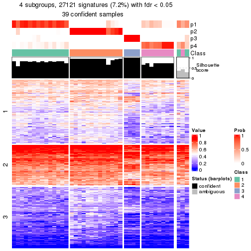</p>

</div>
<div id='tab-node-051-get-signatures-4'>
<pre><code class="r">get_signatures(res, k = 5)
</code></pre>

<p>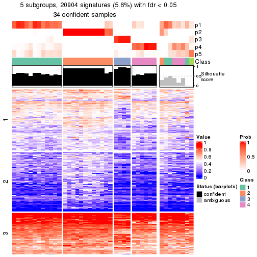</p>

</div>
<div id='tab-node-051-get-signatures-5'>
<pre><code class="r">get_signatures(res, k = 6)
</code></pre>

<p>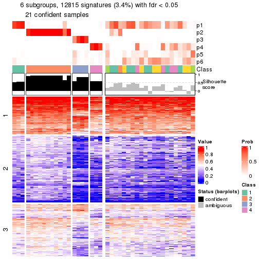</p>

</div>
<div id='tab-node-051-get-signatures-6'>
<pre><code class="r">get_signatures(res, k = 7)
</code></pre>

<p>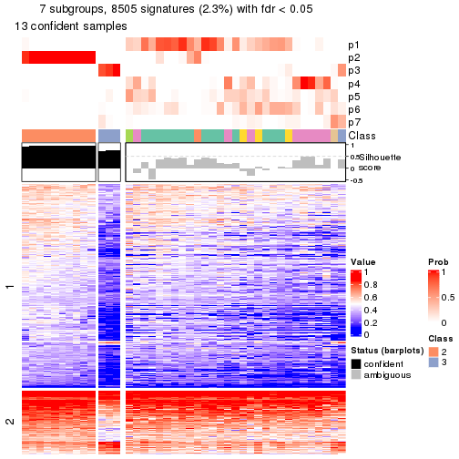</p>

</div>
<div id='tab-node-051-get-signatures-7'>
<pre><code class="r">get_signatures(res, k = 8)
</code></pre>

<p>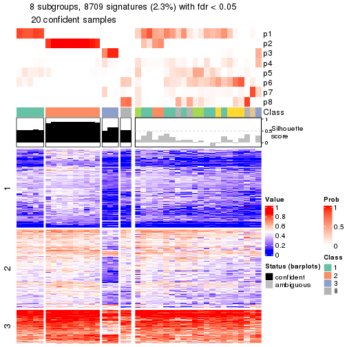</p>

</div>
</div>


Compare the overlap of signatures from different k:

```r
compare_signatures(res)
```

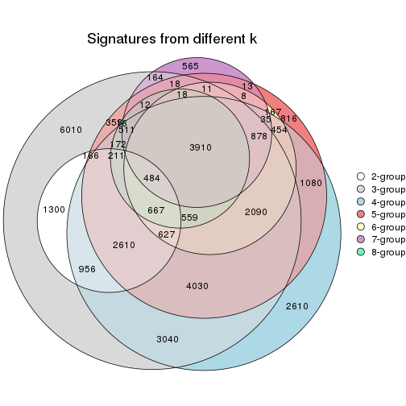

`get_signature()` returns a data frame invisibly. To get the list of signatures, the function
call should be assigned to a variable explicitly. In following code, if `plot` argument is set
to `FALSE`, no heatmap is plotted while only the differential analysis is performed.

```r
# code only for demonstration
tb = get_signature(res, k = ..., plot = FALSE)
```

An example of the output of `tb` is:

```
#>   which_row         fdr    mean_1    mean_2 scaled_mean_1 scaled_mean_2 km
#> 1        38 0.042760348  8.373488  9.131774    -0.5533452     0.5164555  1
#> 2        40 0.018707592  7.106213  8.469186    -0.6173731     0.5762149  1
#> 3        55 0.019134737 10.221463 11.207825    -0.6159697     0.5749050  1
#> 4        59 0.006059896  5.921854  7.869574    -0.6899429     0.6439467  1
#> 5        60 0.018055526  8.928898 10.211722    -0.6204761     0.5791110  1
#> 6        98 0.009384629 15.714769 14.887706     0.6635654    -0.6193277  2
...
```

The columns in `tb` are:

1. `which_row`: row indices corresponding to the input matrix.
2. `fdr`: FDR for the differential test. 
3. `mean_x`: The mean value in group x.
4. `scaled_mean_x`: The mean value in group x after rows are scaled.
5. `km`: Row groups if k-means clustering is applied to rows (which is done by automatically selecting number of clusters).

If there are too many signatures, `top_signatures = ...` can be set to only show the 
signatures with the highest FDRs:

```r
# code only for demonstration
# e.g. to show the top 500 most significant rows
tb = get_signature(res, k = ..., top_signatures = 500)
```

If the signatures are defined as these which are uniquely high in current group, `diff_method` argument
can be set to `"uniquely_high_in_one_group"`:

```r
# code only for demonstration
tb = get_signature(res, k = ..., diff_method = "uniquely_high_in_one_group")
```


UMAP plot which shows how samples are separated.


<script>
$( function() {
	$( '#tabs-node-051-dimension-reduction' ).tabs();
} );
</script>
<div id='tabs-node-051-dimension-reduction'>
<ul>
<li><a href='#tab-node-051-dimension-reduction-1'>k = 2</a></li>
<li><a href='#tab-node-051-dimension-reduction-2'>k = 3</a></li>
<li><a href='#tab-node-051-dimension-reduction-3'>k = 4</a></li>
<li><a href='#tab-node-051-dimension-reduction-4'>k = 5</a></li>
<li><a href='#tab-node-051-dimension-reduction-5'>k = 6</a></li>
<li><a href='#tab-node-051-dimension-reduction-6'>k = 7</a></li>
<li><a href='#tab-node-051-dimension-reduction-7'>k = 8</a></li>
</ul>
<div id='tab-node-051-dimension-reduction-1'>
<pre><code class="r">dimension_reduction(res, k = 2, method = &quot;UMAP&quot;)
</code></pre>

<p>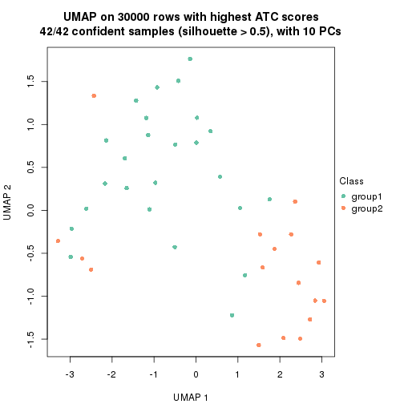</p>

</div>
<div id='tab-node-051-dimension-reduction-2'>
<pre><code class="r">dimension_reduction(res, k = 3, method = &quot;UMAP&quot;)
</code></pre>

<p>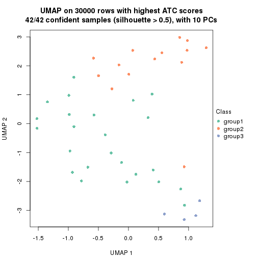</p>

</div>
<div id='tab-node-051-dimension-reduction-3'>
<pre><code class="r">dimension_reduction(res, k = 4, method = &quot;UMAP&quot;)
</code></pre>

<p>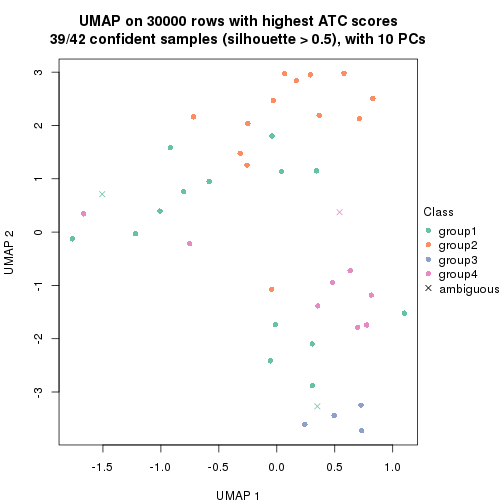</p>

</div>
<div id='tab-node-051-dimension-reduction-4'>
<pre><code class="r">dimension_reduction(res, k = 5, method = &quot;UMAP&quot;)
</code></pre>

<p>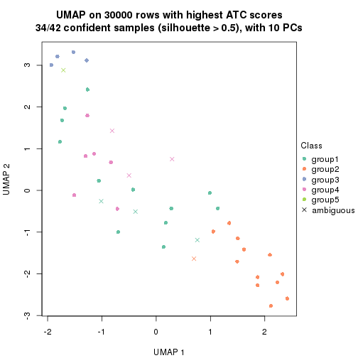</p>

</div>
<div id='tab-node-051-dimension-reduction-5'>
<pre><code class="r">dimension_reduction(res, k = 6, method = &quot;UMAP&quot;)
</code></pre>

<p>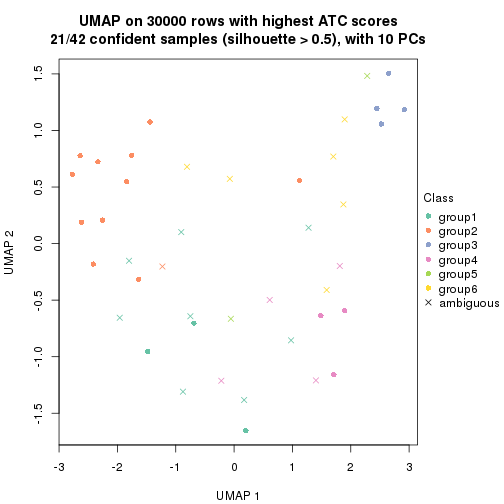</p>

</div>
<div id='tab-node-051-dimension-reduction-6'>
<pre><code class="r">dimension_reduction(res, k = 7, method = &quot;UMAP&quot;)
</code></pre>

<p>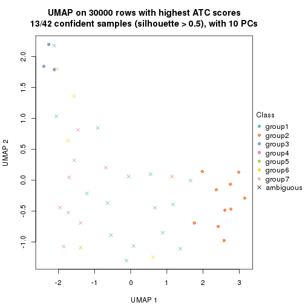</p>

</div>
<div id='tab-node-051-dimension-reduction-7'>
<pre><code class="r">dimension_reduction(res, k = 8, method = &quot;UMAP&quot;)
</code></pre>

<p>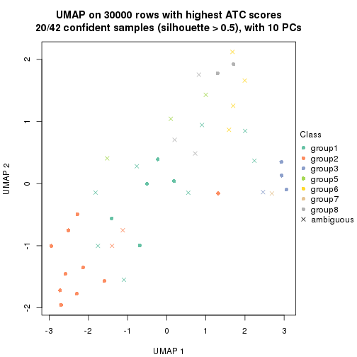</p>

</div>
</div>


Following heatmap shows how subgroups are split when increasing `k`:

```r
collect_classes(res)
```

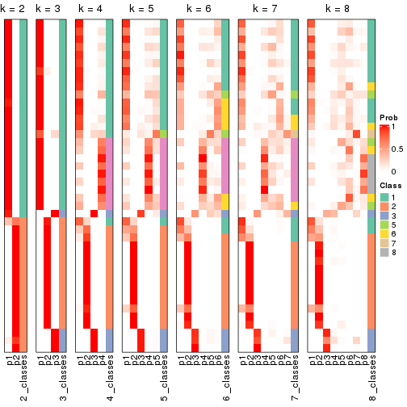


If matrix rows can be associated to genes, consider to use `functional_enrichment(res,
...)` to perform function enrichment for the signature genes. See [this vignette](https://jokergoo.github.io/cola_vignettes/functional_enrichment.html) for more detailed explanations.


 

---------------------------------------------------


### Node0512


Parent node: [Node051](#Node051).
Child nodes: 
                Node02121-leaf
        ,
                Node02122-leaf
        ,
                Node02123-leaf
        ,
                Node02211-leaf
        ,
                Node02212-leaf
        ,
                Node02213-leaf
        ,
                Node02214-leaf
        ,
                Node02311-leaf
        ,
                Node02312-leaf
        ,
                Node02313-leaf
        ,
                Node05121-leaf
        ,
                Node05122-leaf
        ,
                Node05123-leaf
        .


The object with results only for a single top-value method and a single partitioning method 
can be extracted as:

```r
res = res_rh["0512"]
```

A summary of `res` and all the functions that can be applied to it:

```r
res
```

```
#> A 'ConsensusPartition' object with k = 2, 3, 4, 5, 6, 7, 8.
#>   On a matrix with 30000 rows and 14 columns.
#>   Top rows (1000) are extracted by 'ATC' method.
#>   Subgroups are detected by 'kmeans' method.
#>   Performed in total 350 partitions by row resampling.
#>   Best k for subgroups seems to be 5.
#> 
#> Following methods can be applied to this 'ConsensusPartition' object:
#>  [1] "cola_report"             "collect_classes"         "collect_plots"          
#>  [4] "collect_stats"           "colnames"                "compare_partitions"     
#>  [7] "compare_signatures"      "consensus_heatmap"       "dimension_reduction"    
#> [10] "functional_enrichment"   "get_anno_col"            "get_anno"               
#> [13] "get_classes"             "get_consensus"           "get_matrix"             
#> [16] "get_membership"          "get_param"               "get_signatures"         
#> [19] "get_stats"               "is_best_k"               "is_stable_k"            
#> [22] "membership_heatmap"      "ncol"                    "nrow"                   
#> [25] "plot_ecdf"               "predict_classes"         "rownames"               
#> [28] "select_partition_number" "show"                    "suggest_best_k"         
#> [31] "test_to_known_factors"   "top_rows_heatmap"
```

`collect_plots()` function collects all the plots made from `res` for all `k` (number of subgroups)
into one single page to provide an easy and fast comparison between different `k`.

```r
collect_plots(res)
```

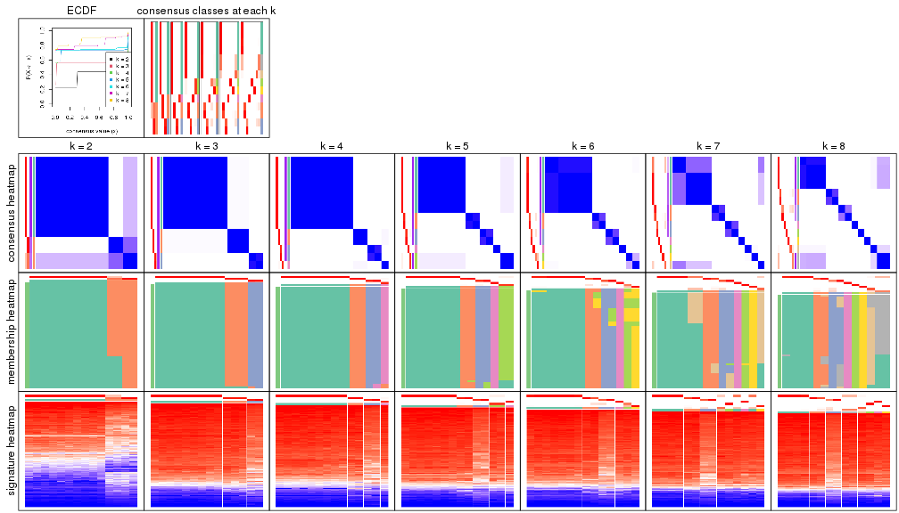

The plots are:

- The first row: a plot of the eCDF (empirical cumulative distribution
  function) curves of the consensus matrix for each `k` and the heatmap of
  predicted classes for each `k`.
- The second row: heatmaps of the consensus matrix for each `k`.
- The third row: heatmaps of the membership matrix for each `k`.
- The fouth row: heatmaps of the signatures for each `k`.

All the plots in panels can be made by individual functions and they are
plotted later in this section.

`select_partition_number()` produces several plots showing different
statistics for choosing "optimized" `k`. There are following statistics:

- eCDF curves of the consensus matrix for each `k`;
- 1-PAC. [The PAC score](https://en.wikipedia.org/wiki/Consensus_clustering#Over-interpretation_potential_of_consensus_clustering)
  measures the proportion of the ambiguous subgrouping.
- Mean silhouette score.
- Concordance. The mean probability of fiting the consensus subgroup labels in all
  partitions.
- Area increased. Denote $A_k$ as the area under the eCDF curve for current
  `k`, the area increased is defined as $A_k - A_{k-1}$.
- Rand index. The percent of pairs of samples that are both in a same cluster
  or both are not in a same cluster in the partition of k and k-1.
- Jaccard index. The ratio of pairs of samples are both in a same cluster in
  the partition of k and k-1 and the pairs of samples are both in a same
  cluster in the partition k or k-1.

The detailed explanations of these statistics can be found in [the _cola_
vignette](https://jokergoo.github.io/cola_vignettes/cola.html#toc_13).

Generally speaking, higher 1-PAC score, higher mean silhouette score or higher
concordance corresponds to better partition. Rand index and Jaccard index
measure how similar the current partition is compared to partition with `k-1`.
If they are too similar, we won't accept `k` is better than `k-1`.

```r
select_partition_number(res)
```

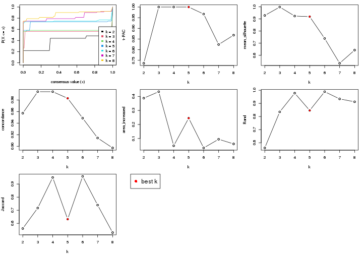

The numeric values for all these statistics can be obtained by `get_stats()`.

```r
get_stats(res)
```

```
#>   k 1-PAC mean_silhouette concordance area_increased  Rand Jaccard
#> 2 2 0.736           0.929       0.957         0.3875 0.560   0.560
#> 3 3 1.000           0.998       0.994         0.4334 0.835   0.717
#> 4 4 1.000           0.924       0.994         0.0485 0.978   0.950
#> 5 5 1.000           0.919       0.983         0.2452 0.846   0.632
#> 6 6 0.967           0.739       0.949         0.0330 0.989   0.958
#> 7 7 0.824           0.535       0.914         0.0948 0.934   0.739
#> 8 8 0.868           0.643       0.897         0.0616 0.912   0.529
```

`suggest_best_k()` suggests the best $k$ based on these statistics. The rules are as follows:

- All $k$ with Jaccard index larger than 0.95 are removed because increasing
  $k$ does not provide enough extra information. If all $k$ are removed, it is
  marked as no subgroup is detected.
- For all $k$ with 1-PAC score larger than 0.9, the maximal $k$ is taken as
  the best $k$, and other $k$ are marked as optional $k$.
- If it does not fit the second rule. The $k$ with the maximal vote of the
  highest 1-PAC score, highest mean silhouette, and highest concordance is
  taken as the best $k$.

```r
suggest_best_k(res)
```

```
#> [1] 5
#> attr(,"optional")
#> [1] 3
```

There is also optional best $k$ = 3 that is worth to check.

Following is the table of the partitions (You need to click the **show/hide
code output** link to see it). The membership matrix (columns with name `p*`)
is inferred by
[`clue::cl_consensus()`](https://www.rdocumentation.org/link/cl_consensus?package=clue)
function with the `SE` method. Basically the value in the membership matrix
represents the probability to belong to a certain group. The finall subgroup
label for an item is determined with the group with highest probability it
belongs to.

In `get_classes()` function, the entropy is calculated from the membership
matrix and the silhouette score is calculated from the consensus matrix.


<script>
$( function() {
	$( '#tabs-node-0512-get-classes' ).tabs();
} );
</script>
<div id='tabs-node-0512-get-classes'>
<ul>
<li><a href='#tab-node-0512-get-classes-1'>k = 2</a></li>
<li><a href='#tab-node-0512-get-classes-2'>k = 3</a></li>
<li><a href='#tab-node-0512-get-classes-3'>k = 4</a></li>
<li><a href='#tab-node-0512-get-classes-4'>k = 5</a></li>
<li><a href='#tab-node-0512-get-classes-5'>k = 6</a></li>
<li><a href='#tab-node-0512-get-classes-6'>k = 7</a></li>
<li><a href='#tab-node-0512-get-classes-7'>k = 8</a></li>
</ul>

<div id='tab-node-0512-get-classes-1'>
<p><a id='tab-node-0512-get-classes-1-a' style='color:#0366d6' href='#'>show/hide code output</a></p>
<pre><code class="r">cbind(get_classes(res, k = 2), get_membership(res, k = 2))
</code></pre>

<pre><code>#&gt;                 class entropy silhouette  p1  p2
#&gt; TCGA.G9.6348.01     2   0.881      0.714 0.3 0.7
#&gt; TCGA.V1.A9Z8.01     2   0.000      0.787 0.0 1.0
#&gt; TCGA.G9.6336.01     1   0.000      1.000 1.0 0.0
#&gt; TCGA.VP.A87C.01     2   0.000      0.787 0.0 1.0
#&gt; TCGA.EJ.5527.01     1   0.000      1.000 1.0 0.0
#&gt; TCGA.G9.6356.01     1   0.000      1.000 1.0 0.0
#&gt; TCGA.EJ.7328.01     1   0.000      1.000 1.0 0.0
#&gt; TCGA.EJ.7783.01     1   0.000      1.000 1.0 0.0
#&gt; TCGA.EJ.5508.01     1   0.000      1.000 1.0 0.0
#&gt; TCGA.J9.A52C.01     1   0.000      1.000 1.0 0.0
#&gt; TCGA.FC.7708.01     1   0.000      1.000 1.0 0.0
#&gt; TCGA.J4.A67R.01     1   0.000      1.000 1.0 0.0
#&gt; TCGA.ZG.A8QZ.01     1   0.000      1.000 1.0 0.0
#&gt; TCGA.EJ.5505.01     2   0.881      0.714 0.3 0.7
</code></pre>

<script>
$('#tab-node-0512-get-classes-1-a').parent().next().next().hide();
$('#tab-node-0512-get-classes-1-a').click(function(){
  $('#tab-node-0512-get-classes-1-a').parent().next().next().toggle();
  return(false);
});
</script>
</div>

<div id='tab-node-0512-get-classes-2'>
<p><a id='tab-node-0512-get-classes-2-a' style='color:#0366d6' href='#'>show/hide code output</a></p>
<pre><code class="r">cbind(get_classes(res, k = 3), get_membership(res, k = 3))
</code></pre>

<pre><code>#&gt;                 class entropy silhouette   p1   p2   p3
#&gt; TCGA.G9.6348.01     2  0.0892      1.000 0.02 0.98 0.00
#&gt; TCGA.V1.A9Z8.01     3  0.0892      0.987 0.00 0.02 0.98
#&gt; TCGA.G9.6336.01     1  0.0000      1.000 1.00 0.00 0.00
#&gt; TCGA.VP.A87C.01     3  0.0000      0.987 0.00 0.00 1.00
#&gt; TCGA.EJ.5527.01     1  0.0000      1.000 1.00 0.00 0.00
#&gt; TCGA.G9.6356.01     1  0.0000      1.000 1.00 0.00 0.00
#&gt; TCGA.EJ.7328.01     1  0.0000      1.000 1.00 0.00 0.00
#&gt; TCGA.EJ.7783.01     1  0.0000      1.000 1.00 0.00 0.00
#&gt; TCGA.EJ.5508.01     1  0.0000      1.000 1.00 0.00 0.00
#&gt; TCGA.J9.A52C.01     2  0.0892      1.000 0.02 0.98 0.00
#&gt; TCGA.FC.7708.01     1  0.0000      1.000 1.00 0.00 0.00
#&gt; TCGA.J4.A67R.01     1  0.0000      1.000 1.00 0.00 0.00
#&gt; TCGA.ZG.A8QZ.01     1  0.0000      1.000 1.00 0.00 0.00
#&gt; TCGA.EJ.5505.01     2  0.0892      1.000 0.02 0.98 0.00
</code></pre>

<script>
$('#tab-node-0512-get-classes-2-a').parent().next().next().hide();
$('#tab-node-0512-get-classes-2-a').click(function(){
  $('#tab-node-0512-get-classes-2-a').parent().next().next().toggle();
  return(false);
});
</script>
</div>

<div id='tab-node-0512-get-classes-3'>
<p><a id='tab-node-0512-get-classes-3-a' style='color:#0366d6' href='#'>show/hide code output</a></p>
<pre><code class="r">cbind(get_classes(res, k = 4), get_membership(res, k = 4))
</code></pre>

<pre><code>#&gt;                 class entropy silhouette p1   p2   p3   p4
#&gt; TCGA.G9.6348.01     2   0.000      1.000  0 1.00 0.00 0.00
#&gt; TCGA.V1.A9Z8.01     3   0.121      0.967  0 0.00 0.96 0.04
#&gt; TCGA.G9.6336.01     1   0.000      1.000  1 0.00 0.00 0.00
#&gt; TCGA.VP.A87C.01     3   0.000      0.967  0 0.00 1.00 0.00
#&gt; TCGA.EJ.5527.01     1   0.000      1.000  1 0.00 0.00 0.00
#&gt; TCGA.G9.6356.01     1   0.000      1.000  1 0.00 0.00 0.00
#&gt; TCGA.EJ.7328.01     1   0.000      1.000  1 0.00 0.00 0.00
#&gt; TCGA.EJ.7783.01     1   0.000      1.000  1 0.00 0.00 0.00
#&gt; TCGA.EJ.5508.01     1   0.000      1.000  1 0.00 0.00 0.00
#&gt; TCGA.J9.A52C.01     4   0.121      0.000  0 0.04 0.00 0.96
#&gt; TCGA.FC.7708.01     1   0.000      1.000  1 0.00 0.00 0.00
#&gt; TCGA.J4.A67R.01     1   0.000      1.000  1 0.00 0.00 0.00
#&gt; TCGA.ZG.A8QZ.01     1   0.000      1.000  1 0.00 0.00 0.00
#&gt; TCGA.EJ.5505.01     2   0.000      1.000  0 1.00 0.00 0.00
</code></pre>

<script>
$('#tab-node-0512-get-classes-3-a').parent().next().next().hide();
$('#tab-node-0512-get-classes-3-a').click(function(){
  $('#tab-node-0512-get-classes-3-a').parent().next().next().toggle();
  return(false);
});
</script>
</div>

<div id='tab-node-0512-get-classes-4'>
<p><a id='tab-node-0512-get-classes-4-a' style='color:#0366d6' href='#'>show/hide code output</a></p>
<pre><code class="r">cbind(get_classes(res, k = 5), get_membership(res, k = 5))
</code></pre>

<pre><code>#&gt;                 class entropy silhouette   p1   p2   p3 p4   p5
#&gt; TCGA.G9.6348.01     2  0.0609      0.984 0.00 0.98 0.00  0 0.02
#&gt; TCGA.V1.A9Z8.01     3  0.1410      0.950 0.00 0.00 0.94  0 0.06
#&gt; TCGA.G9.6336.01     1  0.0000      1.000 1.00 0.00 0.00  0 0.00
#&gt; TCGA.VP.A87C.01     3  0.0000      0.950 0.00 0.00 1.00  0 0.00
#&gt; TCGA.EJ.5527.01     5  0.1732      1.000 0.08 0.00 0.00  0 0.92
#&gt; TCGA.G9.6356.01     1  0.0000      1.000 1.00 0.00 0.00  0 0.00
#&gt; TCGA.EJ.7328.01     1  0.0000      1.000 1.00 0.00 0.00  0 0.00
#&gt; TCGA.EJ.7783.01     1  0.0000      1.000 1.00 0.00 0.00  0 0.00
#&gt; TCGA.EJ.5508.01     1  0.0000      1.000 1.00 0.00 0.00  0 0.00
#&gt; TCGA.J9.A52C.01     4  0.0000      0.000 0.00 0.00 0.00  1 0.00
#&gt; TCGA.FC.7708.01     1  0.0000      1.000 1.00 0.00 0.00  0 0.00
#&gt; TCGA.J4.A67R.01     1  0.0000      1.000 1.00 0.00 0.00  0 0.00
#&gt; TCGA.ZG.A8QZ.01     5  0.1732      1.000 0.08 0.00 0.00  0 0.92
#&gt; TCGA.EJ.5505.01     2  0.0000      0.984 0.00 1.00 0.00  0 0.00
</code></pre>

<script>
$('#tab-node-0512-get-classes-4-a').parent().next().next().hide();
$('#tab-node-0512-get-classes-4-a').click(function(){
  $('#tab-node-0512-get-classes-4-a').parent().next().next().toggle();
  return(false);
});
</script>
</div>

<div id='tab-node-0512-get-classes-5'>
<p><a id='tab-node-0512-get-classes-5-a' style='color:#0366d6' href='#'>show/hide code output</a></p>
<pre><code class="r">cbind(get_classes(res, k = 6), get_membership(res, k = 6))
</code></pre>

<pre><code>#&gt;                 class entropy silhouette   p1   p2   p3 p4   p5   p6
#&gt; TCGA.G9.6348.01     2  0.2454      0.862 0.00 0.84 0.00  0 0.16 0.00
#&gt; TCGA.V1.A9Z8.01     3  0.2631      0.844 0.00 0.00 0.82  0 0.18 0.00
#&gt; TCGA.G9.6336.01     1  0.0547      0.983 0.98 0.00 0.00  0 0.00 0.02
#&gt; TCGA.VP.A87C.01     3  0.0000      0.844 0.00 0.00 1.00  0 0.00 0.00
#&gt; TCGA.EJ.5527.01     5  0.3578      0.000 0.00 0.00 0.00  0 0.66 0.34
#&gt; TCGA.G9.6356.01     1  0.0000      0.993 1.00 0.00 0.00  0 0.00 0.00
#&gt; TCGA.EJ.7328.01     1  0.0000      0.993 1.00 0.00 0.00  0 0.00 0.00
#&gt; TCGA.EJ.7783.01     1  0.0000      0.993 1.00 0.00 0.00  0 0.00 0.00
#&gt; TCGA.EJ.5508.01     1  0.0000      0.993 1.00 0.00 0.00  0 0.00 0.00
#&gt; TCGA.J9.A52C.01     4  0.0000      0.000 0.00 0.00 0.00  1 0.00 0.00
#&gt; TCGA.FC.7708.01     1  0.0000      0.993 1.00 0.00 0.00  0 0.00 0.00
#&gt; TCGA.J4.A67R.01     1  0.0547      0.983 0.98 0.00 0.00  0 0.00 0.02
#&gt; TCGA.ZG.A8QZ.01     6  0.0000      0.000 0.00 0.00 0.00  0 0.00 1.00
#&gt; TCGA.EJ.5505.01     2  0.0000      0.862 0.00 1.00 0.00  0 0.00 0.00
</code></pre>

<script>
$('#tab-node-0512-get-classes-5-a').parent().next().next().hide();
$('#tab-node-0512-get-classes-5-a').click(function(){
  $('#tab-node-0512-get-classes-5-a').parent().next().next().toggle();
  return(false);
});
</script>
</div>

<div id='tab-node-0512-get-classes-6'>
<p><a id='tab-node-0512-get-classes-6-a' style='color:#0366d6' href='#'>show/hide code output</a></p>
<pre><code class="r">cbind(get_classes(res, k = 7), get_membership(res, k = 7))
</code></pre>

<pre><code>#&gt;                 class entropy silhouette   p1  p2   p3 p4   p5   p6   p7
#&gt; TCGA.G9.6348.01     2  0.0000      0.916 0.00 1.0 0.00  0 0.00 0.00 0.00
#&gt; TCGA.V1.A9Z8.01     3  0.2422      0.844 0.00 0.0 0.82  0 0.00 0.00 0.18
#&gt; TCGA.G9.6336.01     1  0.3221      0.390 0.68 0.0 0.00  0 0.00 0.00 0.32
#&gt; TCGA.VP.A87C.01     3  0.0000      0.844 0.00 0.0 1.00  0 0.00 0.00 0.00
#&gt; TCGA.EJ.5527.01     5  0.0000      0.000 0.00 0.0 0.00  0 1.00 0.00 0.00
#&gt; TCGA.G9.6356.01     1  0.0000      0.796 1.00 0.0 0.00  0 0.00 0.00 0.00
#&gt; TCGA.EJ.7328.01     1  0.0000      0.796 1.00 0.0 0.00  0 0.00 0.00 0.00
#&gt; TCGA.EJ.7783.01     1  0.0000      0.796 1.00 0.0 0.00  0 0.00 0.00 0.00
#&gt; TCGA.EJ.5508.01     1  0.0000      0.796 1.00 0.0 0.00  0 0.00 0.00 0.00
#&gt; TCGA.J9.A52C.01     4  0.0000      0.000 0.00 0.0 0.00  1 0.00 0.00 0.00
#&gt; TCGA.FC.7708.01     7  0.2945      0.000 0.26 0.0 0.00  0 0.00 0.00 0.74
#&gt; TCGA.J4.A67R.01     1  0.3221      0.390 0.68 0.0 0.00  0 0.00 0.00 0.32
#&gt; TCGA.ZG.A8QZ.01     6  0.0504      0.000 0.00 0.0 0.00  0 0.02 0.98 0.00
#&gt; TCGA.EJ.5505.01     2  0.1928      0.916 0.00 0.9 0.00  0 0.00 0.02 0.08
</code></pre>

<script>
$('#tab-node-0512-get-classes-6-a').parent().next().next().hide();
$('#tab-node-0512-get-classes-6-a').click(function(){
  $('#tab-node-0512-get-classes-6-a').parent().next().next().toggle();
  return(false);
});
</script>
</div>

<div id='tab-node-0512-get-classes-7'>
<p><a id='tab-node-0512-get-classes-7-a' style='color:#0366d6' href='#'>show/hide code output</a></p>
<pre><code class="r">cbind(get_classes(res, k = 8), get_membership(res, k = 8))
</code></pre>

<pre><code>#&gt;                 class entropy silhouette   p1   p2   p3 p4 p5 p6   p7   p8
#&gt; TCGA.G9.6348.01     2  0.2224      0.880 0.00 0.86 0.00  0  0  0 0.02 0.12
#&gt; TCGA.V1.A9Z8.01     3  0.4437      0.652 0.00 0.00 0.62  0  0  0 0.16 0.22
#&gt; TCGA.G9.6336.01     8  0.3142      1.000 0.36 0.00 0.00  0  0  0 0.00 0.64
#&gt; TCGA.VP.A87C.01     3  0.0000      0.652 0.00 0.00 1.00  0  0  0 0.00 0.00
#&gt; TCGA.EJ.5527.01     5  0.0000      0.000 0.00 0.00 0.00  0  1  0 0.00 0.00
#&gt; TCGA.G9.6356.01     1  0.0000      0.990 1.00 0.00 0.00  0  0  0 0.00 0.00
#&gt; TCGA.EJ.7328.01     1  0.0000      0.990 1.00 0.00 0.00  0  0  0 0.00 0.00
#&gt; TCGA.EJ.7783.01     1  0.0471      0.969 0.98 0.00 0.00  0  0  0 0.00 0.02
#&gt; TCGA.EJ.5508.01     1  0.0000      0.990 1.00 0.00 0.00  0  0  0 0.00 0.00
#&gt; TCGA.J9.A52C.01     4  0.0000      0.000 0.00 0.00 0.00  1  0  0 0.00 0.00
#&gt; TCGA.FC.7708.01     7  0.2725      0.000 0.04 0.00 0.00  0  0  0 0.82 0.14
#&gt; TCGA.J4.A67R.01     8  0.3142      1.000 0.36 0.00 0.00  0  0  0 0.00 0.64
#&gt; TCGA.ZG.A8QZ.01     6  0.0000      0.000 0.00 0.00 0.00  0  0  1 0.00 0.00
#&gt; TCGA.EJ.5505.01     2  0.0000      0.880 0.00 1.00 0.00  0  0  0 0.00 0.00
</code></pre>

<script>
$('#tab-node-0512-get-classes-7-a').parent().next().next().hide();
$('#tab-node-0512-get-classes-7-a').click(function(){
  $('#tab-node-0512-get-classes-7-a').parent().next().next().toggle();
  return(false);
});
</script>
</div>
</div>

Heatmaps for the consensus matrix. It visualizes the probability of two
samples to be in a same group.


<script>
$( function() {
	$( '#tabs-node-0512-consensus-heatmap' ).tabs();
} );
</script>
<div id='tabs-node-0512-consensus-heatmap'>
<ul>
<li><a href='#tab-node-0512-consensus-heatmap-1'>k = 2</a></li>
<li><a href='#tab-node-0512-consensus-heatmap-2'>k = 3</a></li>
<li><a href='#tab-node-0512-consensus-heatmap-3'>k = 4</a></li>
<li><a href='#tab-node-0512-consensus-heatmap-4'>k = 5</a></li>
<li><a href='#tab-node-0512-consensus-heatmap-5'>k = 6</a></li>
<li><a href='#tab-node-0512-consensus-heatmap-6'>k = 7</a></li>
<li><a href='#tab-node-0512-consensus-heatmap-7'>k = 8</a></li>
</ul>
<div id='tab-node-0512-consensus-heatmap-1'>
<pre><code class="r">consensus_heatmap(res, k = 2)
</code></pre>

<p>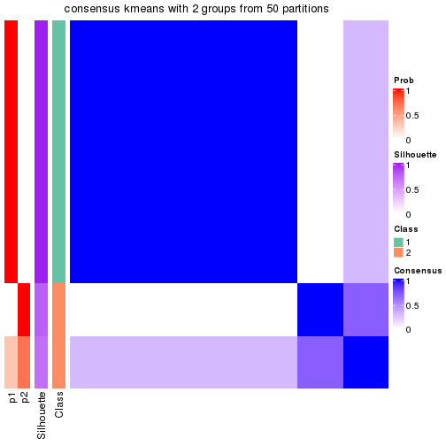</p>

</div>
<div id='tab-node-0512-consensus-heatmap-2'>
<pre><code class="r">consensus_heatmap(res, k = 3)
</code></pre>

<p>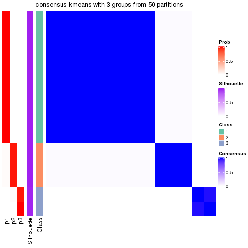</p>

</div>
<div id='tab-node-0512-consensus-heatmap-3'>
<pre><code class="r">consensus_heatmap(res, k = 4)
</code></pre>

<p>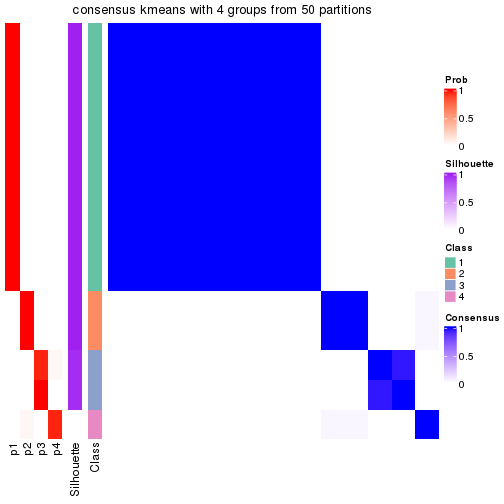</p>

</div>
<div id='tab-node-0512-consensus-heatmap-4'>
<pre><code class="r">consensus_heatmap(res, k = 5)
</code></pre>

<p>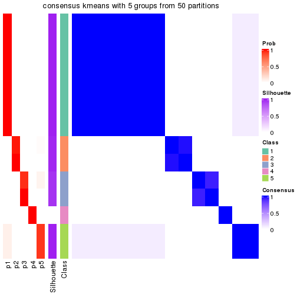</p>

</div>
<div id='tab-node-0512-consensus-heatmap-5'>
<pre><code class="r">consensus_heatmap(res, k = 6)
</code></pre>

<p>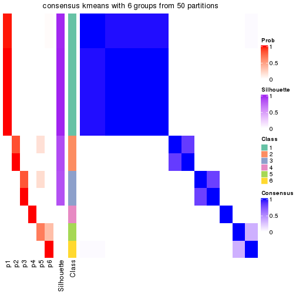</p>

</div>
<div id='tab-node-0512-consensus-heatmap-6'>
<pre><code class="r">consensus_heatmap(res, k = 7)
</code></pre>

<p>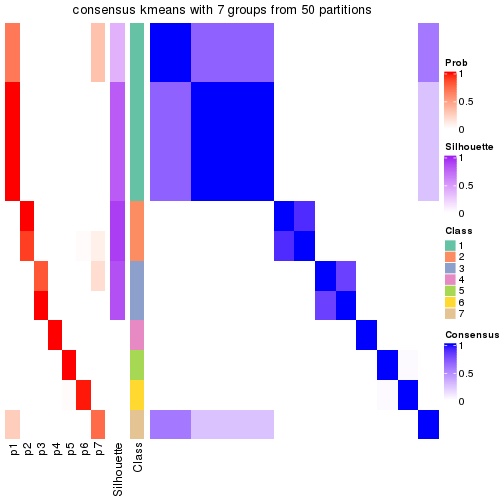</p>

</div>
<div id='tab-node-0512-consensus-heatmap-7'>
<pre><code class="r">consensus_heatmap(res, k = 8)
</code></pre>

<p>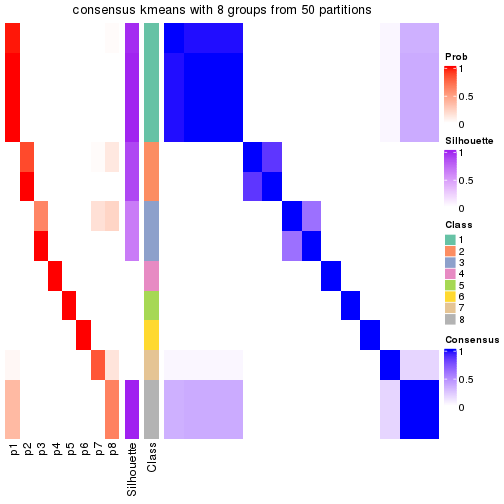</p>

</div>
</div>

Heatmaps for the membership of samples in all partitions to see how consistent they are:


<script>
$( function() {
	$( '#tabs-node-0512-membership-heatmap' ).tabs();
} );
</script>
<div id='tabs-node-0512-membership-heatmap'>
<ul>
<li><a href='#tab-node-0512-membership-heatmap-1'>k = 2</a></li>
<li><a href='#tab-node-0512-membership-heatmap-2'>k = 3</a></li>
<li><a href='#tab-node-0512-membership-heatmap-3'>k = 4</a></li>
<li><a href='#tab-node-0512-membership-heatmap-4'>k = 5</a></li>
<li><a href='#tab-node-0512-membership-heatmap-5'>k = 6</a></li>
<li><a href='#tab-node-0512-membership-heatmap-6'>k = 7</a></li>
<li><a href='#tab-node-0512-membership-heatmap-7'>k = 8</a></li>
</ul>
<div id='tab-node-0512-membership-heatmap-1'>
<pre><code class="r">membership_heatmap(res, k = 2)
</code></pre>

<p>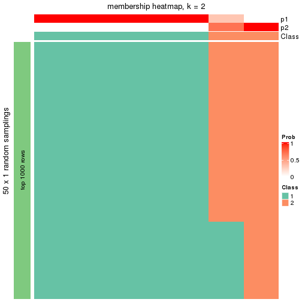</p>

</div>
<div id='tab-node-0512-membership-heatmap-2'>
<pre><code class="r">membership_heatmap(res, k = 3)
</code></pre>

<p>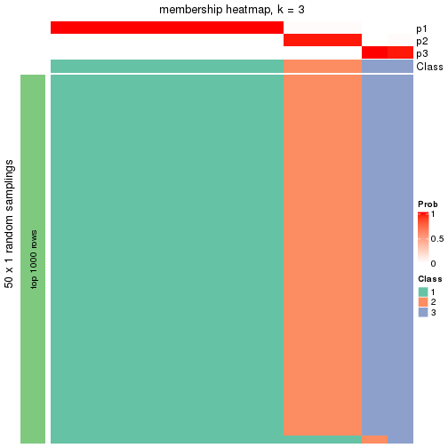</p>

</div>
<div id='tab-node-0512-membership-heatmap-3'>
<pre><code class="r">membership_heatmap(res, k = 4)
</code></pre>

<p>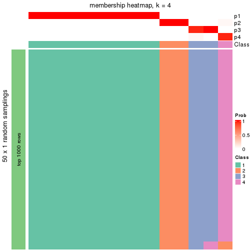</p>

</div>
<div id='tab-node-0512-membership-heatmap-4'>
<pre><code class="r">membership_heatmap(res, k = 5)
</code></pre>

<p>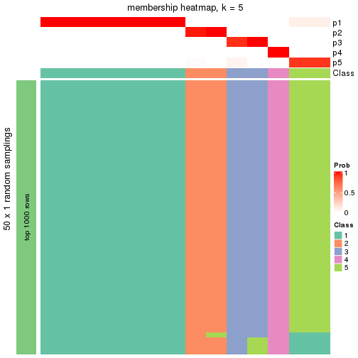</p>

</div>
<div id='tab-node-0512-membership-heatmap-5'>
<pre><code class="r">membership_heatmap(res, k = 6)
</code></pre>

<p>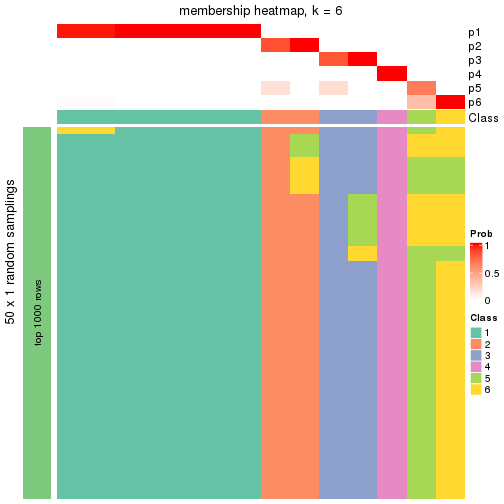</p>

</div>
<div id='tab-node-0512-membership-heatmap-6'>
<pre><code class="r">membership_heatmap(res, k = 7)
</code></pre>

<p>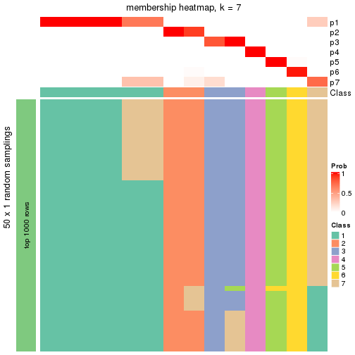</p>

</div>
<div id='tab-node-0512-membership-heatmap-7'>
<pre><code class="r">membership_heatmap(res, k = 8)
</code></pre>

<p>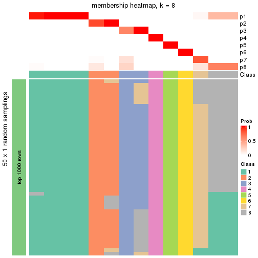</p>

</div>
</div>

As soon as the classes for columns are determined, the signatures
that are significantly different between subgroups can be looked for. 
Following are the heatmaps for signatures.


<script>
$( function() {
	$( '#tabs-node-0512-get-signatures' ).tabs();
} );
</script>
<div id='tabs-node-0512-get-signatures'>
<ul>
<li><a href='#tab-node-0512-get-signatures-1'>k = 2</a></li>
<li><a href='#tab-node-0512-get-signatures-2'>k = 3</a></li>
<li><a href='#tab-node-0512-get-signatures-3'>k = 4</a></li>
<li><a href='#tab-node-0512-get-signatures-4'>k = 5</a></li>
<li><a href='#tab-node-0512-get-signatures-5'>k = 6</a></li>
<li><a href='#tab-node-0512-get-signatures-6'>k = 7</a></li>
<li><a href='#tab-node-0512-get-signatures-7'>k = 8</a></li>
</ul>
<div id='tab-node-0512-get-signatures-1'>
<pre><code class="r">get_signatures(res, k = 2)
</code></pre>

<p>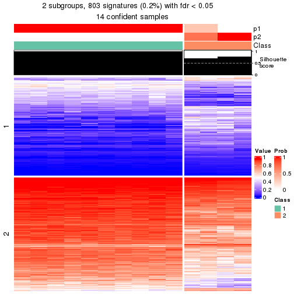</p>

</div>
<div id='tab-node-0512-get-signatures-2'>
<pre><code class="r">get_signatures(res, k = 3)
</code></pre>

<p>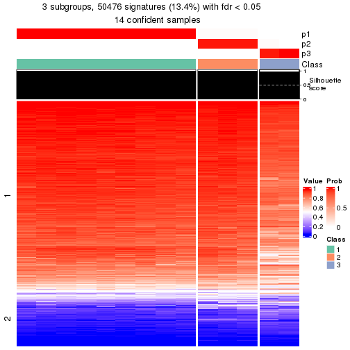</p>

</div>
<div id='tab-node-0512-get-signatures-3'>
<pre><code class="r">get_signatures(res, k = 4)
</code></pre>

<p>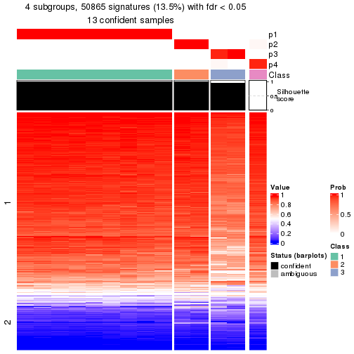</p>

</div>
<div id='tab-node-0512-get-signatures-4'>
<pre><code class="r">get_signatures(res, k = 5)
</code></pre>

<p>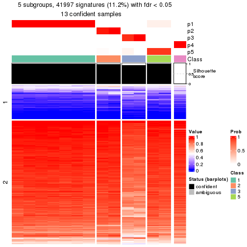</p>

</div>
<div id='tab-node-0512-get-signatures-5'>
<pre><code class="r">get_signatures(res, k = 6)
</code></pre>

<p>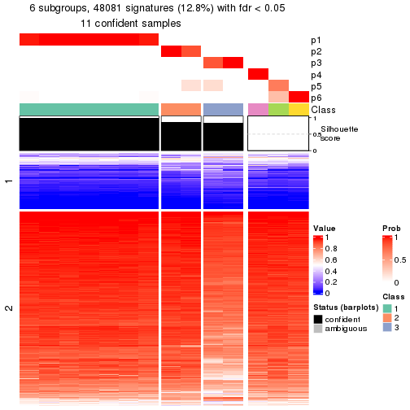</p>

</div>
<div id='tab-node-0512-get-signatures-6'>
<pre><code class="r">get_signatures(res, k = 7)
</code></pre>

<p>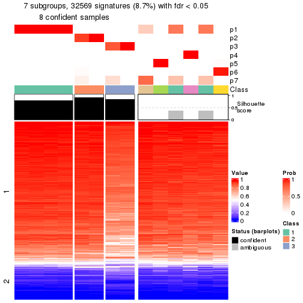</p>

</div>
<div id='tab-node-0512-get-signatures-7'>
<pre><code class="r">get_signatures(res, k = 8)
</code></pre>

<p>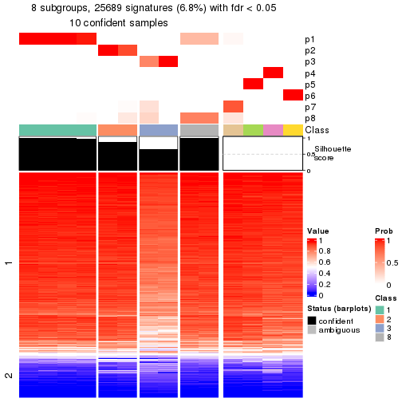</p>

</div>
</div>


Compare the overlap of signatures from different k:

```r
compare_signatures(res)
```

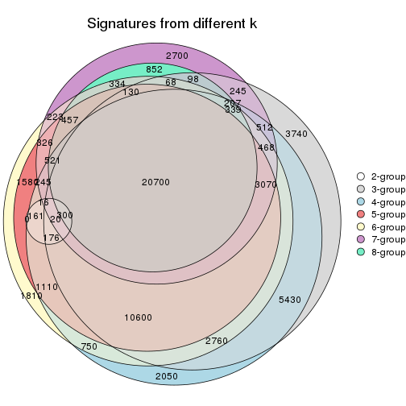

`get_signature()` returns a data frame invisibly. To get the list of signatures, the function
call should be assigned to a variable explicitly. In following code, if `plot` argument is set
to `FALSE`, no heatmap is plotted while only the differential analysis is performed.

```r
# code only for demonstration
tb = get_signature(res, k = ..., plot = FALSE)
```

An example of the output of `tb` is:

```
#>   which_row         fdr    mean_1    mean_2 scaled_mean_1 scaled_mean_2 km
#> 1        38 0.042760348  8.373488  9.131774    -0.5533452     0.5164555  1
#> 2        40 0.018707592  7.106213  8.469186    -0.6173731     0.5762149  1
#> 3        55 0.019134737 10.221463 11.207825    -0.6159697     0.5749050  1
#> 4        59 0.006059896  5.921854  7.869574    -0.6899429     0.6439467  1
#> 5        60 0.018055526  8.928898 10.211722    -0.6204761     0.5791110  1
#> 6        98 0.009384629 15.714769 14.887706     0.6635654    -0.6193277  2
...
```

The columns in `tb` are:

1. `which_row`: row indices corresponding to the input matrix.
2. `fdr`: FDR for the differential test. 
3. `mean_x`: The mean value in group x.
4. `scaled_mean_x`: The mean value in group x after rows are scaled.
5. `km`: Row groups if k-means clustering is applied to rows (which is done by automatically selecting number of clusters).

If there are too many signatures, `top_signatures = ...` can be set to only show the 
signatures with the highest FDRs:

```r
# code only for demonstration
# e.g. to show the top 500 most significant rows
tb = get_signature(res, k = ..., top_signatures = 500)
```

If the signatures are defined as these which are uniquely high in current group, `diff_method` argument
can be set to `"uniquely_high_in_one_group"`:

```r
# code only for demonstration
tb = get_signature(res, k = ..., diff_method = "uniquely_high_in_one_group")
```


UMAP plot which shows how samples are separated.


<script>
$( function() {
	$( '#tabs-node-0512-dimension-reduction' ).tabs();
} );
</script>
<div id='tabs-node-0512-dimension-reduction'>
<ul>
<li><a href='#tab-node-0512-dimension-reduction-1'>k = 2</a></li>
<li><a href='#tab-node-0512-dimension-reduction-2'>k = 3</a></li>
<li><a href='#tab-node-0512-dimension-reduction-3'>k = 4</a></li>
<li><a href='#tab-node-0512-dimension-reduction-4'>k = 5</a></li>
<li><a href='#tab-node-0512-dimension-reduction-5'>k = 6</a></li>
<li><a href='#tab-node-0512-dimension-reduction-6'>k = 7</a></li>
<li><a href='#tab-node-0512-dimension-reduction-7'>k = 8</a></li>
</ul>
<div id='tab-node-0512-dimension-reduction-1'>
<pre><code class="r">dimension_reduction(res, k = 2, method = &quot;UMAP&quot;)
</code></pre>

<p>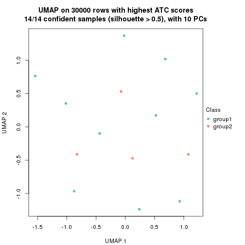</p>

</div>
<div id='tab-node-0512-dimension-reduction-2'>
<pre><code class="r">dimension_reduction(res, k = 3, method = &quot;UMAP&quot;)
</code></pre>

<p>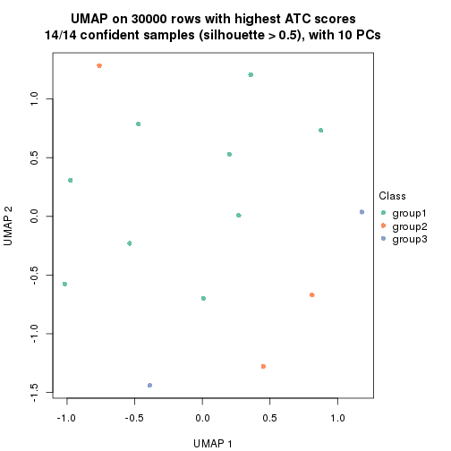</p>

</div>
<div id='tab-node-0512-dimension-reduction-3'>
<pre><code class="r">dimension_reduction(res, k = 4, method = &quot;UMAP&quot;)
</code></pre>

<p>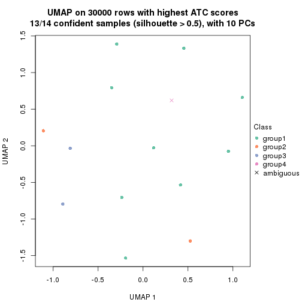</p>

</div>
<div id='tab-node-0512-dimension-reduction-4'>
<pre><code class="r">dimension_reduction(res, k = 5, method = &quot;UMAP&quot;)
</code></pre>

<p>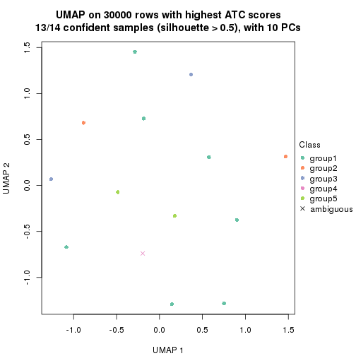</p>

</div>
<div id='tab-node-0512-dimension-reduction-5'>
<pre><code class="r">dimension_reduction(res, k = 6, method = &quot;UMAP&quot;)
</code></pre>

<p>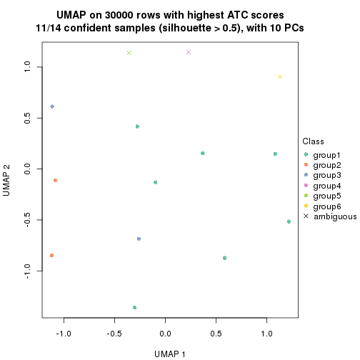</p>

</div>
<div id='tab-node-0512-dimension-reduction-6'>
<pre><code class="r">dimension_reduction(res, k = 7, method = &quot;UMAP&quot;)
</code></pre>

<p>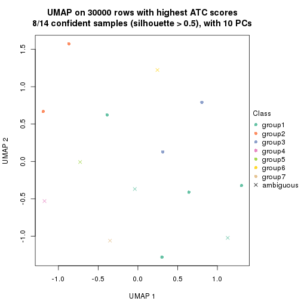</p>

</div>
<div id='tab-node-0512-dimension-reduction-7'>
<pre><code class="r">dimension_reduction(res, k = 8, method = &quot;UMAP&quot;)
</code></pre>

<p>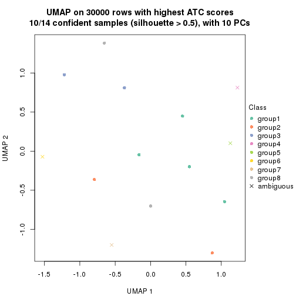</p>

</div>
</div>


Following heatmap shows how subgroups are split when increasing `k`:

```r
collect_classes(res)
```

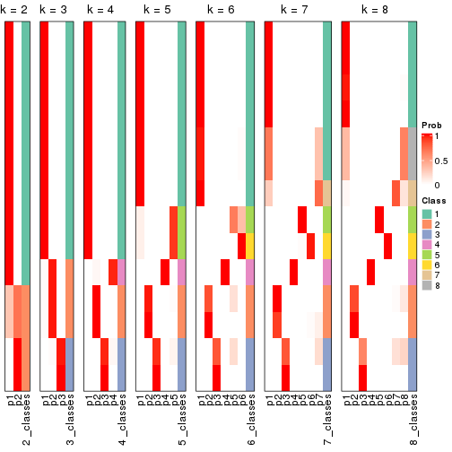


If matrix rows can be associated to genes, consider to use `functional_enrichment(res,
...)` to perform function enrichment for the signature genes. See [this vignette](https://jokergoo.github.io/cola_vignettes/functional_enrichment.html) for more detailed explanations.


 

---------------------------------------------------


### Node052


Parent node: [Node05](#Node05).
Child nodes: 
                Node0121-leaf
        ,
                Node0122-leaf
        ,
                Node0123-leaf
        ,
                Node0211-leaf
        ,
                [Node0212](#Node0212)
        ,
                Node0213-leaf
        ,
                [Node0221](#Node0221)
        ,
                Node0222-leaf
        ,
                Node0223-leaf
        ,
                [Node0231](#Node0231)
        ,
                Node0232-leaf
        ,
                Node0233-leaf
        ,
                Node0241-leaf
        ,
                Node0242-leaf
        ,
                Node0411-leaf
        ,
                Node0412-leaf
        ,
                Node0413-leaf
        ,
                Node0421-leaf
        ,
                Node0422-leaf
        ,
                Node0423-leaf
        ,
                Node0431-leaf
        ,
                Node0432-leaf
        ,
                Node0433-leaf
        ,
                Node0441-leaf
        ,
                Node0442-leaf
        ,
                Node0443-leaf
        ,
                Node0511-leaf
        ,
                [Node0512](#Node0512)
        ,
                Node0513-leaf
        ,
                Node0521-leaf
        ,
                Node0522-leaf
        ,
                Node0523-leaf
        .


The object with results only for a single top-value method and a single partitioning method 
can be extracted as:

```r
res = res_rh["052"]
```

A summary of `res` and all the functions that can be applied to it:

```r
res
```

```
#> A 'ConsensusPartition' object with k = 2, 3, 4, 5, 6, 7, 8.
#>   On a matrix with 30000 rows and 20 columns.
#>   Top rows (1000) are extracted by 'ATC' method.
#>   Subgroups are detected by 'skmeans' method.
#>   Performed in total 350 partitions by row resampling.
#>   Best k for subgroups seems to be 2.
#> 
#> Following methods can be applied to this 'ConsensusPartition' object:
#>  [1] "cola_report"             "collect_classes"         "collect_plots"          
#>  [4] "collect_stats"           "colnames"                "compare_partitions"     
#>  [7] "compare_signatures"      "consensus_heatmap"       "dimension_reduction"    
#> [10] "functional_enrichment"   "get_anno_col"            "get_anno"               
#> [13] "get_classes"             "get_consensus"           "get_matrix"             
#> [16] "get_membership"          "get_param"               "get_signatures"         
#> [19] "get_stats"               "is_best_k"               "is_stable_k"            
#> [22] "membership_heatmap"      "ncol"                    "nrow"                   
#> [25] "plot_ecdf"               "predict_classes"         "rownames"               
#> [28] "select_partition_number" "show"                    "suggest_best_k"         
#> [31] "test_to_known_factors"   "top_rows_heatmap"
```

`collect_plots()` function collects all the plots made from `res` for all `k` (number of subgroups)
into one single page to provide an easy and fast comparison between different `k`.

```r
collect_plots(res)
```

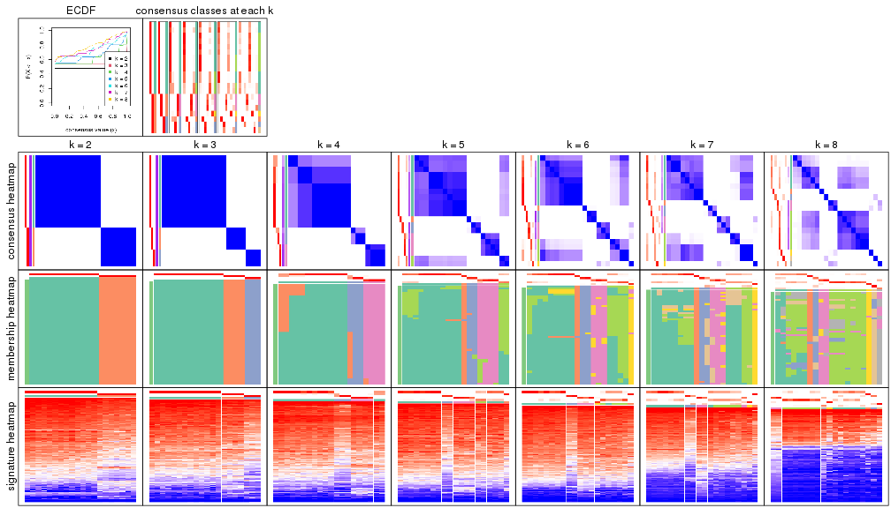

The plots are:

- The first row: a plot of the eCDF (empirical cumulative distribution
  function) curves of the consensus matrix for each `k` and the heatmap of
  predicted classes for each `k`.
- The second row: heatmaps of the consensus matrix for each `k`.
- The third row: heatmaps of the membership matrix for each `k`.
- The fouth row: heatmaps of the signatures for each `k`.

All the plots in panels can be made by individual functions and they are
plotted later in this section.

`select_partition_number()` produces several plots showing different
statistics for choosing "optimized" `k`. There are following statistics:

- eCDF curves of the consensus matrix for each `k`;
- 1-PAC. [The PAC score](https://en.wikipedia.org/wiki/Consensus_clustering#Over-interpretation_potential_of_consensus_clustering)
  measures the proportion of the ambiguous subgrouping.
- Mean silhouette score.
- Concordance. The mean probability of fiting the consensus subgroup labels in all
  partitions.
- Area increased. Denote $A_k$ as the area under the eCDF curve for current
  `k`, the area increased is defined as $A_k - A_{k-1}$.
- Rand index. The percent of pairs of samples that are both in a same cluster
  or both are not in a same cluster in the partition of k and k-1.
- Jaccard index. The ratio of pairs of samples are both in a same cluster in
  the partition of k and k-1 and the pairs of samples are both in a same
  cluster in the partition k or k-1.

The detailed explanations of these statistics can be found in [the _cola_
vignette](https://jokergoo.github.io/cola_vignettes/cola.html#toc_13).

Generally speaking, higher 1-PAC score, higher mean silhouette score or higher
concordance corresponds to better partition. Rand index and Jaccard index
measure how similar the current partition is compared to partition with `k-1`.
If they are too similar, we won't accept `k` is better than `k-1`.

```r
select_partition_number(res)
```

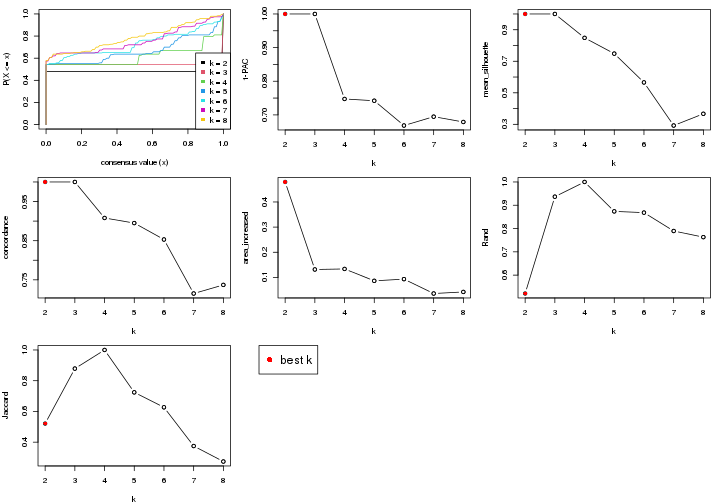

The numeric values for all these statistics can be obtained by `get_stats()`.

```r
get_stats(res)
```

```
#>   k 1-PAC mean_silhouette concordance area_increased  Rand Jaccard
#> 2 2 1.000           1.000       1.000         0.4795 0.521   0.521
#> 3 3 1.000           1.000       1.000         0.1316 0.937   0.879
#> 4 4 0.747           0.848       0.908         0.1337 1.000   1.000
#> 5 5 0.742           0.748       0.895         0.0864 0.874   0.724
#> 6 6 0.668           0.566       0.853         0.0932 0.868   0.627
#> 7 7 0.695           0.292       0.715         0.0360 0.789   0.375
#> 8 8 0.679           0.367       0.737         0.0423 0.763   0.274
```

`suggest_best_k()` suggests the best $k$ based on these statistics. The rules are as follows:

- All $k$ with Jaccard index larger than 0.95 are removed because increasing
  $k$ does not provide enough extra information. If all $k$ are removed, it is
  marked as no subgroup is detected.
- For all $k$ with 1-PAC score larger than 0.9, the maximal $k$ is taken as
  the best $k$, and other $k$ are marked as optional $k$.
- If it does not fit the second rule. The $k$ with the maximal vote of the
  highest 1-PAC score, highest mean silhouette, and highest concordance is
  taken as the best $k$.

```r
suggest_best_k(res)
```

```
#> [1] 2
```


Following is the table of the partitions (You need to click the **show/hide
code output** link to see it). The membership matrix (columns with name `p*`)
is inferred by
[`clue::cl_consensus()`](https://www.rdocumentation.org/link/cl_consensus?package=clue)
function with the `SE` method. Basically the value in the membership matrix
represents the probability to belong to a certain group. The finall subgroup
label for an item is determined with the group with highest probability it
belongs to.

In `get_classes()` function, the entropy is calculated from the membership
matrix and the silhouette score is calculated from the consensus matrix.


<script>
$( function() {
	$( '#tabs-node-052-get-classes' ).tabs();
} );
</script>
<div id='tabs-node-052-get-classes'>
<ul>
<li><a href='#tab-node-052-get-classes-1'>k = 2</a></li>
<li><a href='#tab-node-052-get-classes-2'>k = 3</a></li>
<li><a href='#tab-node-052-get-classes-3'>k = 4</a></li>
<li><a href='#tab-node-052-get-classes-4'>k = 5</a></li>
<li><a href='#tab-node-052-get-classes-5'>k = 6</a></li>
<li><a href='#tab-node-052-get-classes-6'>k = 7</a></li>
<li><a href='#tab-node-052-get-classes-7'>k = 8</a></li>
</ul>

<div id='tab-node-052-get-classes-1'>
<p><a id='tab-node-052-get-classes-1-a' style='color:#0366d6' href='#'>show/hide code output</a></p>
<pre><code class="r">cbind(get_classes(res, k = 2), get_membership(res, k = 2))
</code></pre>

<pre><code>#&gt;                 class entropy silhouette p1 p2
#&gt; TCGA.EJ.7330.01     1       0          1  1  0
#&gt; TCGA.V1.A9ZK.01     1       0          1  1  0
#&gt; TCGA.HC.7737.01     1       0          1  1  0
#&gt; TCGA.V1.A9ZG.01     2       0          1  0  1
#&gt; TCGA.EJ.7794.01     1       0          1  1  0
#&gt; TCGA.YL.A9WJ.01     1       0          1  1  0
#&gt; TCGA.G9.6499.01     1       0          1  1  0
#&gt; TCGA.XK.AAJR.01     1       0          1  1  0
#&gt; TCGA.V1.A9OH.01     2       0          1  0  1
#&gt; TCGA.G9.6333.01     1       0          1  1  0
#&gt; TCGA.YL.A8SI.01     1       0          1  1  0
#&gt; TCGA.XK.AAIV.01     2       0          1  0  1
#&gt; TCGA.KK.A8IB.01     1       0          1  1  0
#&gt; TCGA.4L.AA1F.01     2       0          1  0  1
#&gt; TCGA.KK.A7B0.01     1       0          1  1  0
#&gt; TCGA.CH.5792.01     1       0          1  1  0
#&gt; TCGA.HC.A6AP.01     1       0          1  1  0
#&gt; TCGA.TK.A8OK.01     2       0          1  0  1
#&gt; TCGA.YL.A9WY.01     2       0          1  0  1
#&gt; TCGA.V1.A9ZR.01     2       0          1  0  1
</code></pre>

<script>
$('#tab-node-052-get-classes-1-a').parent().next().next().hide();
$('#tab-node-052-get-classes-1-a').click(function(){
  $('#tab-node-052-get-classes-1-a').parent().next().next().toggle();
  return(false);
});
</script>
</div>

<div id='tab-node-052-get-classes-2'>
<p><a id='tab-node-052-get-classes-2-a' style='color:#0366d6' href='#'>show/hide code output</a></p>
<pre><code class="r">cbind(get_classes(res, k = 3), get_membership(res, k = 3))
</code></pre>

<pre><code>#&gt;                 class entropy silhouette p1 p2 p3
#&gt; TCGA.EJ.7330.01     1       0          1  1  0  0
#&gt; TCGA.V1.A9ZK.01     1       0          1  1  0  0
#&gt; TCGA.HC.7737.01     1       0          1  1  0  0
#&gt; TCGA.V1.A9ZG.01     2       0          1  0  1  0
#&gt; TCGA.EJ.7794.01     1       0          1  1  0  0
#&gt; TCGA.YL.A9WJ.01     1       0          1  1  0  0
#&gt; TCGA.G9.6499.01     1       0          1  1  0  0
#&gt; TCGA.XK.AAJR.01     1       0          1  1  0  0
#&gt; TCGA.V1.A9OH.01     2       0          1  0  1  0
#&gt; TCGA.G9.6333.01     1       0          1  1  0  0
#&gt; TCGA.YL.A8SI.01     1       0          1  1  0  0
#&gt; TCGA.XK.AAIV.01     3       0          1  0  0  1
#&gt; TCGA.KK.A8IB.01     1       0          1  1  0  0
#&gt; TCGA.4L.AA1F.01     3       0          1  0  0  1
#&gt; TCGA.KK.A7B0.01     1       0          1  1  0  0
#&gt; TCGA.CH.5792.01     1       0          1  1  0  0
#&gt; TCGA.HC.A6AP.01     1       0          1  1  0  0
#&gt; TCGA.TK.A8OK.01     2       0          1  0  1  0
#&gt; TCGA.YL.A9WY.01     3       0          1  0  0  1
#&gt; TCGA.V1.A9ZR.01     2       0          1  0  1  0
</code></pre>

<script>
$('#tab-node-052-get-classes-2-a').parent().next().next().hide();
$('#tab-node-052-get-classes-2-a').click(function(){
  $('#tab-node-052-get-classes-2-a').parent().next().next().toggle();
  return(false);
});
</script>
</div>

<div id='tab-node-052-get-classes-3'>
<p><a id='tab-node-052-get-classes-3-a' style='color:#0366d6' href='#'>show/hide code output</a></p>
<pre><code class="r">cbind(get_classes(res, k = 4), get_membership(res, k = 4))
</code></pre>

<pre><code>#&gt;                 class entropy silhouette   p1   p2   p3   p4
#&gt; TCGA.EJ.7330.01     1   0.000      0.897 1.00 0.00 0.00 0.00
#&gt; TCGA.V1.A9ZK.01     1   0.000      0.897 1.00 0.00 0.00 0.00
#&gt; TCGA.HC.7737.01     1   0.265      0.855 0.88 0.12 0.00 0.00
#&gt; TCGA.V1.A9ZG.01     4   0.000      0.984 0.00 0.00 0.00 1.00
#&gt; TCGA.EJ.7794.01     1   0.000      0.897 1.00 0.00 0.00 0.00
#&gt; TCGA.YL.A9WJ.01     1   0.265      0.855 0.88 0.12 0.00 0.00
#&gt; TCGA.G9.6499.01     1   0.499      0.497 0.52 0.48 0.00 0.00
#&gt; TCGA.XK.AAJR.01     1   0.000      0.897 1.00 0.00 0.00 0.00
#&gt; TCGA.V1.A9OH.01     4   0.000      0.984 0.00 0.00 0.00 1.00
#&gt; TCGA.G9.6333.01     1   0.000      0.897 1.00 0.00 0.00 0.00
#&gt; TCGA.YL.A8SI.01     1   0.265      0.855 0.88 0.12 0.00 0.00
#&gt; TCGA.XK.AAIV.01     3   0.000      0.839 0.00 0.00 1.00 0.00
#&gt; TCGA.KK.A8IB.01     1   0.499      0.497 0.52 0.48 0.00 0.00
#&gt; TCGA.4L.AA1F.01     3   0.498      0.657 0.00 0.46 0.54 0.00
#&gt; TCGA.KK.A7B0.01     1   0.000      0.897 1.00 0.00 0.00 0.00
#&gt; TCGA.CH.5792.01     1   0.000      0.897 1.00 0.00 0.00 0.00
#&gt; TCGA.HC.A6AP.01     1   0.000      0.897 1.00 0.00 0.00 0.00
#&gt; TCGA.TK.A8OK.01     4   0.000      0.984 0.00 0.00 0.00 1.00
#&gt; TCGA.YL.A9WY.01     3   0.000      0.839 0.00 0.00 1.00 0.00
#&gt; TCGA.V1.A9ZR.01     4   0.164      0.950 0.00 0.06 0.00 0.94
</code></pre>

<script>
$('#tab-node-052-get-classes-3-a').parent().next().next().hide();
$('#tab-node-052-get-classes-3-a').click(function(){
  $('#tab-node-052-get-classes-3-a').parent().next().next().toggle();
  return(false);
});
</script>
</div>

<div id='tab-node-052-get-classes-4'>
<p><a id='tab-node-052-get-classes-4-a' style='color:#0366d6' href='#'>show/hide code output</a></p>
<pre><code class="r">cbind(get_classes(res, k = 5), get_membership(res, k = 5))
</code></pre>

<pre><code>#&gt;                 class entropy silhouette   p1   p2   p3   p4   p5
#&gt; TCGA.EJ.7330.01     1  0.1648      0.806 0.94 0.02 0.00 0.00 0.04
#&gt; TCGA.V1.A9ZK.01     1  0.0000      0.826 1.00 0.00 0.00 0.00 0.00
#&gt; TCGA.HC.7737.01     1  0.3684      0.382 0.72 0.00 0.00 0.00 0.28
#&gt; TCGA.V1.A9ZG.01     4  0.0609      0.905 0.00 0.00 0.00 0.98 0.02
#&gt; TCGA.EJ.7794.01     1  0.0609      0.816 0.98 0.00 0.00 0.00 0.02
#&gt; TCGA.YL.A9WJ.01     1  0.3684      0.382 0.72 0.00 0.00 0.00 0.28
#&gt; TCGA.G9.6499.01     5  0.4060      0.918 0.36 0.00 0.00 0.00 0.64
#&gt; TCGA.XK.AAJR.01     1  0.0000      0.826 1.00 0.00 0.00 0.00 0.00
#&gt; TCGA.V1.A9OH.01     4  0.1043      0.907 0.00 0.00 0.00 0.96 0.04
#&gt; TCGA.G9.6333.01     1  0.0609      0.821 0.98 0.00 0.00 0.00 0.02
#&gt; TCGA.YL.A8SI.01     1  0.3424      0.479 0.76 0.00 0.00 0.00 0.24
#&gt; TCGA.XK.AAIV.01     3  0.1043      0.925 0.00 0.04 0.96 0.00 0.00
#&gt; TCGA.KK.A8IB.01     5  0.3895      0.923 0.32 0.00 0.00 0.00 0.68
#&gt; TCGA.4L.AA1F.01     2  0.0609      0.000 0.00 0.98 0.02 0.00 0.00
#&gt; TCGA.KK.A7B0.01     1  0.1648      0.806 0.94 0.02 0.00 0.00 0.04
#&gt; TCGA.CH.5792.01     1  0.0000      0.826 1.00 0.00 0.00 0.00 0.00
#&gt; TCGA.HC.A6AP.01     1  0.1648      0.806 0.94 0.02 0.00 0.00 0.04
#&gt; TCGA.TK.A8OK.01     4  0.0000      0.911 0.00 0.00 0.00 1.00 0.00
#&gt; TCGA.YL.A9WY.01     3  0.1043      0.926 0.00 0.00 0.96 0.00 0.04
#&gt; TCGA.V1.A9ZR.01     4  0.3424      0.777 0.00 0.00 0.00 0.76 0.24
</code></pre>

<script>
$('#tab-node-052-get-classes-4-a').parent().next().next().hide();
$('#tab-node-052-get-classes-4-a').click(function(){
  $('#tab-node-052-get-classes-4-a').parent().next().next().toggle();
  return(false);
});
</script>
</div>

<div id='tab-node-052-get-classes-5'>
<p><a id='tab-node-052-get-classes-5-a' style='color:#0366d6' href='#'>show/hide code output</a></p>
<pre><code class="r">cbind(get_classes(res, k = 6), get_membership(res, k = 6))
</code></pre>

<pre><code>#&gt;                 class entropy silhouette   p1   p2   p3   p4   p5   p6
#&gt; TCGA.EJ.7330.01     1  0.0000      0.811 1.00 0.00 0.00 0.00 0.00 0.00
#&gt; TCGA.V1.A9ZK.01     1  0.0547      0.808 0.98 0.00 0.00 0.00 0.02 0.00
#&gt; TCGA.HC.7737.01     5  0.3864      0.188 0.48 0.00 0.00 0.00 0.52 0.00
#&gt; TCGA.V1.A9ZG.01     4  0.0547      0.774 0.00 0.00 0.00 0.98 0.02 0.00
#&gt; TCGA.EJ.7794.01     1  0.2793      0.684 0.80 0.00 0.00 0.00 0.20 0.00
#&gt; TCGA.YL.A9WJ.01     5  0.3864      0.188 0.48 0.00 0.00 0.00 0.52 0.00
#&gt; TCGA.G9.6499.01     5  0.3258      0.440 0.10 0.02 0.00 0.00 0.84 0.04
#&gt; TCGA.XK.AAJR.01     1  0.2260      0.755 0.86 0.00 0.00 0.00 0.14 0.00
#&gt; TCGA.V1.A9OH.01     4  0.3198      0.705 0.00 0.00 0.00 0.74 0.00 0.26
#&gt; TCGA.G9.6333.01     1  0.0000      0.811 1.00 0.00 0.00 0.00 0.00 0.00
#&gt; TCGA.YL.A8SI.01     1  0.3869     -0.408 0.50 0.00 0.00 0.00 0.50 0.00
#&gt; TCGA.XK.AAIV.01     3  0.0547      0.983 0.00 0.00 0.98 0.00 0.00 0.02
#&gt; TCGA.KK.A8IB.01     5  0.3007      0.411 0.08 0.02 0.00 0.00 0.86 0.04
#&gt; TCGA.4L.AA1F.01     2  0.0547      0.000 0.00 0.98 0.02 0.00 0.00 0.00
#&gt; TCGA.KK.A7B0.01     1  0.0000      0.811 1.00 0.00 0.00 0.00 0.00 0.00
#&gt; TCGA.CH.5792.01     1  0.2454      0.738 0.84 0.00 0.00 0.00 0.16 0.00
#&gt; TCGA.HC.A6AP.01     1  0.0000      0.811 1.00 0.00 0.00 0.00 0.00 0.00
#&gt; TCGA.TK.A8OK.01     4  0.1814      0.821 0.00 0.00 0.00 0.90 0.00 0.10
#&gt; TCGA.YL.A9WY.01     3  0.0000      0.983 0.00 0.00 1.00 0.00 0.00 0.00
#&gt; TCGA.V1.A9ZR.01     6  0.1267      0.000 0.00 0.00 0.00 0.06 0.00 0.94
</code></pre>

<script>
$('#tab-node-052-get-classes-5-a').parent().next().next().hide();
$('#tab-node-052-get-classes-5-a').click(function(){
  $('#tab-node-052-get-classes-5-a').parent().next().next().toggle();
  return(false);
});
</script>
</div>

<div id='tab-node-052-get-classes-6'>
<p><a id='tab-node-052-get-classes-6-a' style='color:#0366d6' href='#'>show/hide code output</a></p>
<pre><code class="r">cbind(get_classes(res, k = 7), get_membership(res, k = 7))
</code></pre>

<pre><code>#&gt;                 class entropy silhouette   p1   p2   p3   p4   p5   p6   p7
#&gt; TCGA.EJ.7330.01     5  0.3546     -0.346 0.46 0.00 0.00 0.00 0.54 0.00 0.00
#&gt; TCGA.V1.A9ZK.01     1  0.3413      0.530 0.62 0.00 0.00 0.00 0.38 0.00 0.00
#&gt; TCGA.HC.7737.01     1  0.0504      0.508 0.98 0.00 0.00 0.00 0.02 0.00 0.00
#&gt; TCGA.V1.A9ZG.01     4  0.2945      0.585 0.00 0.00 0.00 0.74 0.00 0.00 0.26
#&gt; TCGA.EJ.7794.01     1  0.2832      0.622 0.76 0.00 0.00 0.00 0.24 0.00 0.00
#&gt; TCGA.YL.A9WJ.01     1  0.0504      0.508 0.98 0.00 0.00 0.00 0.02 0.00 0.00
#&gt; TCGA.G9.6499.01     5  0.5452     -0.136 0.30 0.00 0.00 0.00 0.46 0.00 0.24
#&gt; TCGA.XK.AAJR.01     1  0.3221      0.616 0.68 0.00 0.00 0.00 0.32 0.00 0.00
#&gt; TCGA.V1.A9OH.01     4  0.3517      0.471 0.00 0.00 0.00 0.70 0.00 0.28 0.02
#&gt; TCGA.G9.6333.01     1  0.3525      0.419 0.56 0.00 0.00 0.00 0.44 0.00 0.00
#&gt; TCGA.YL.A8SI.01     1  0.1671      0.510 0.90 0.00 0.00 0.00 0.10 0.00 0.00
#&gt; TCGA.XK.AAIV.01     3  0.0504      0.562 0.00 0.02 0.98 0.00 0.00 0.00 0.00
#&gt; TCGA.KK.A8IB.01     5  0.5560     -0.173 0.28 0.00 0.00 0.00 0.42 0.00 0.30
#&gt; TCGA.4L.AA1F.01     2  0.0000      0.000 0.00 1.00 0.00 0.00 0.00 0.00 0.00
#&gt; TCGA.KK.A7B0.01     5  0.3546     -0.346 0.46 0.00 0.00 0.00 0.54 0.00 0.00
#&gt; TCGA.CH.5792.01     1  0.3221      0.616 0.68 0.00 0.00 0.00 0.32 0.00 0.00
#&gt; TCGA.HC.A6AP.01     5  0.3546     -0.346 0.46 0.00 0.00 0.00 0.54 0.00 0.00
#&gt; TCGA.TK.A8OK.01     4  0.0504      0.680 0.00 0.00 0.00 0.98 0.00 0.02 0.00
#&gt; TCGA.YL.A9WY.01     3  0.3943      0.568 0.00 0.00 0.56 0.00 0.00 0.02 0.42
#&gt; TCGA.V1.A9ZR.01     6  0.0504      0.000 0.00 0.00 0.00 0.02 0.00 0.98 0.00
</code></pre>

<script>
$('#tab-node-052-get-classes-6-a').parent().next().next().hide();
$('#tab-node-052-get-classes-6-a').click(function(){
  $('#tab-node-052-get-classes-6-a').parent().next().next().toggle();
  return(false);
});
</script>
</div>

<div id='tab-node-052-get-classes-7'>
<p><a id='tab-node-052-get-classes-7-a' style='color:#0366d6' href='#'>show/hide code output</a></p>
<pre><code class="r">cbind(get_classes(res, k = 8), get_membership(res, k = 8))
</code></pre>

<pre><code>#&gt;                 class entropy silhouette   p1   p2   p3   p4   p5   p6   p7   p8
#&gt; TCGA.EJ.7330.01     5  0.0808     0.7606 0.00 0.00 0.00 0.00 0.96 0.00 0.00 0.04
#&gt; TCGA.V1.A9ZK.01     5  0.2267     0.7416 0.18 0.00 0.00 0.00 0.82 0.00 0.00 0.00
#&gt; TCGA.HC.7737.01     1  0.2938     0.3697 0.70 0.00 0.00 0.00 0.30 0.00 0.00 0.00
#&gt; TCGA.V1.A9ZG.01     8  0.3193     0.0000 0.00 0.00 0.00 0.38 0.00 0.00 0.00 0.62
#&gt; TCGA.EJ.7794.01     1  0.3329    -0.0764 0.52 0.00 0.00 0.00 0.48 0.00 0.00 0.00
#&gt; TCGA.YL.A9WJ.01     1  0.3291     0.3945 0.70 0.00 0.02 0.00 0.28 0.00 0.00 0.00
#&gt; TCGA.G9.6499.01     1  0.6064     0.0324 0.44 0.00 0.26 0.00 0.04 0.02 0.00 0.24
#&gt; TCGA.XK.AAJR.01     5  0.2756     0.6644 0.26 0.00 0.00 0.00 0.74 0.00 0.00 0.00
#&gt; TCGA.V1.A9OH.01     4  0.1947     0.7395 0.00 0.00 0.00 0.86 0.00 0.14 0.00 0.00
#&gt; TCGA.G9.6333.01     5  0.1563     0.7728 0.10 0.00 0.00 0.00 0.90 0.00 0.00 0.00
#&gt; TCGA.YL.A8SI.01     1  0.3971     0.1008 0.54 0.00 0.00 0.00 0.42 0.00 0.00 0.04
#&gt; TCGA.XK.AAIV.01     3  0.3198     0.0000 0.00 0.02 0.72 0.00 0.00 0.00 0.26 0.00
#&gt; TCGA.KK.A8IB.01     1  0.4757    -0.0329 0.56 0.00 0.20 0.00 0.00 0.00 0.00 0.24
#&gt; TCGA.4L.AA1F.01     2  0.0000     0.0000 0.00 1.00 0.00 0.00 0.00 0.00 0.00 0.00
#&gt; TCGA.KK.A7B0.01     5  0.1275     0.7405 0.02 0.00 0.00 0.00 0.94 0.00 0.00 0.04
#&gt; TCGA.CH.5792.01     5  0.2756     0.6569 0.26 0.00 0.00 0.00 0.74 0.00 0.00 0.00
#&gt; TCGA.HC.A6AP.01     5  0.0808     0.7606 0.00 0.00 0.00 0.00 0.96 0.00 0.00 0.04
#&gt; TCGA.TK.A8OK.01     4  0.0471     0.7129 0.00 0.00 0.00 0.98 0.00 0.00 0.00 0.02
#&gt; TCGA.YL.A9WY.01     7  0.0000     0.0000 0.00 0.00 0.00 0.00 0.00 0.00 1.00 0.00
#&gt; TCGA.V1.A9ZR.01     6  0.0471     0.0000 0.00 0.00 0.00 0.02 0.00 0.98 0.00 0.00
</code></pre>

<script>
$('#tab-node-052-get-classes-7-a').parent().next().next().hide();
$('#tab-node-052-get-classes-7-a').click(function(){
  $('#tab-node-052-get-classes-7-a').parent().next().next().toggle();
  return(false);
});
</script>
</div>
</div>

Heatmaps for the consensus matrix. It visualizes the probability of two
samples to be in a same group.


<script>
$( function() {
	$( '#tabs-node-052-consensus-heatmap' ).tabs();
} );
</script>
<div id='tabs-node-052-consensus-heatmap'>
<ul>
<li><a href='#tab-node-052-consensus-heatmap-1'>k = 2</a></li>
<li><a href='#tab-node-052-consensus-heatmap-2'>k = 3</a></li>
<li><a href='#tab-node-052-consensus-heatmap-3'>k = 4</a></li>
<li><a href='#tab-node-052-consensus-heatmap-4'>k = 5</a></li>
<li><a href='#tab-node-052-consensus-heatmap-5'>k = 6</a></li>
<li><a href='#tab-node-052-consensus-heatmap-6'>k = 7</a></li>
<li><a href='#tab-node-052-consensus-heatmap-7'>k = 8</a></li>
</ul>
<div id='tab-node-052-consensus-heatmap-1'>
<pre><code class="r">consensus_heatmap(res, k = 2)
</code></pre>

<p>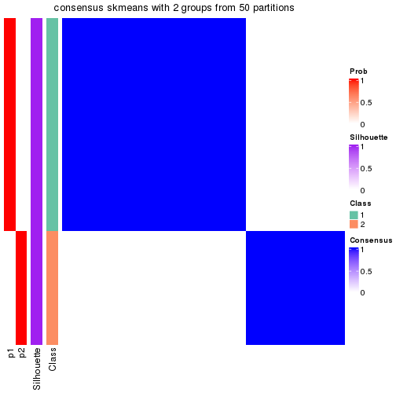</p>

</div>
<div id='tab-node-052-consensus-heatmap-2'>
<pre><code class="r">consensus_heatmap(res, k = 3)
</code></pre>

<p>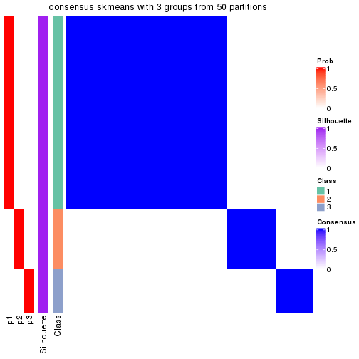</p>

</div>
<div id='tab-node-052-consensus-heatmap-3'>
<pre><code class="r">consensus_heatmap(res, k = 4)
</code></pre>

<p>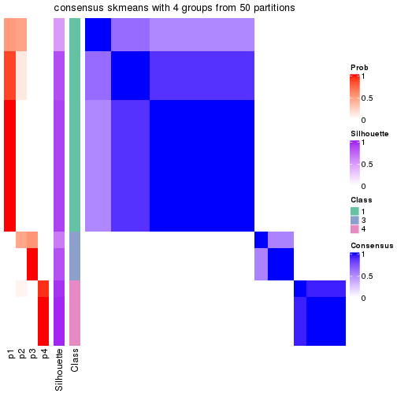</p>

</div>
<div id='tab-node-052-consensus-heatmap-4'>
<pre><code class="r">consensus_heatmap(res, k = 5)
</code></pre>

<p>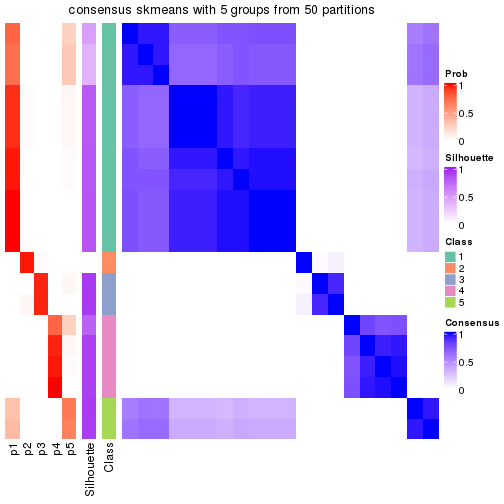</p>

</div>
<div id='tab-node-052-consensus-heatmap-5'>
<pre><code class="r">consensus_heatmap(res, k = 6)
</code></pre>

<p>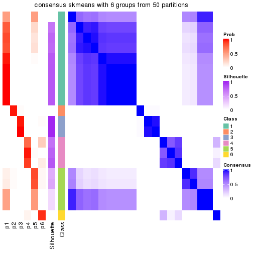</p>

</div>
<div id='tab-node-052-consensus-heatmap-6'>
<pre><code class="r">consensus_heatmap(res, k = 7)
</code></pre>

<p>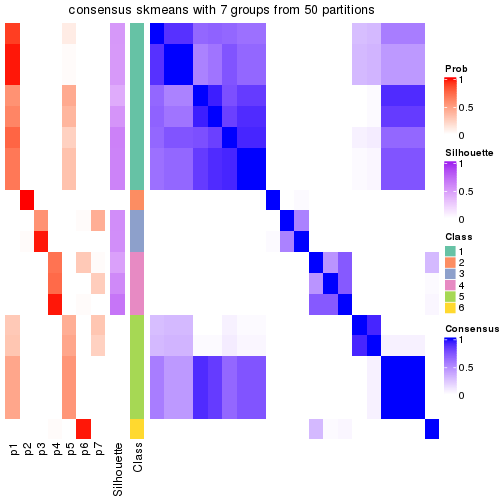</p>

</div>
<div id='tab-node-052-consensus-heatmap-7'>
<pre><code class="r">consensus_heatmap(res, k = 8)
</code></pre>

<p>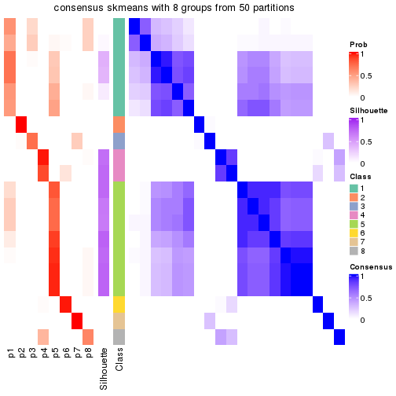</p>

</div>
</div>

Heatmaps for the membership of samples in all partitions to see how consistent they are:


<script>
$( function() {
	$( '#tabs-node-052-membership-heatmap' ).tabs();
} );
</script>
<div id='tabs-node-052-membership-heatmap'>
<ul>
<li><a href='#tab-node-052-membership-heatmap-1'>k = 2</a></li>
<li><a href='#tab-node-052-membership-heatmap-2'>k = 3</a></li>
<li><a href='#tab-node-052-membership-heatmap-3'>k = 4</a></li>
<li><a href='#tab-node-052-membership-heatmap-4'>k = 5</a></li>
<li><a href='#tab-node-052-membership-heatmap-5'>k = 6</a></li>
<li><a href='#tab-node-052-membership-heatmap-6'>k = 7</a></li>
<li><a href='#tab-node-052-membership-heatmap-7'>k = 8</a></li>
</ul>
<div id='tab-node-052-membership-heatmap-1'>
<pre><code class="r">membership_heatmap(res, k = 2)
</code></pre>

<p>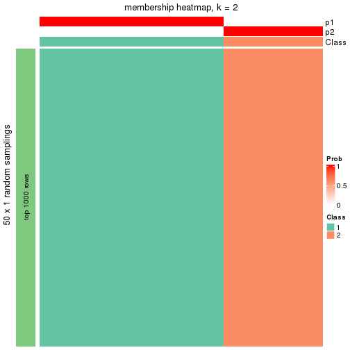</p>

</div>
<div id='tab-node-052-membership-heatmap-2'>
<pre><code class="r">membership_heatmap(res, k = 3)
</code></pre>

<p>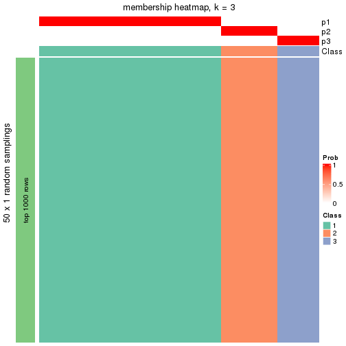</p>

</div>
<div id='tab-node-052-membership-heatmap-3'>
<pre><code class="r">membership_heatmap(res, k = 4)
</code></pre>

<p>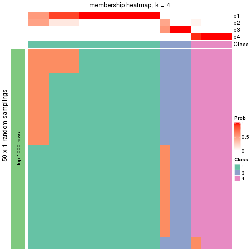</p>

</div>
<div id='tab-node-052-membership-heatmap-4'>
<pre><code class="r">membership_heatmap(res, k = 5)
</code></pre>

<p>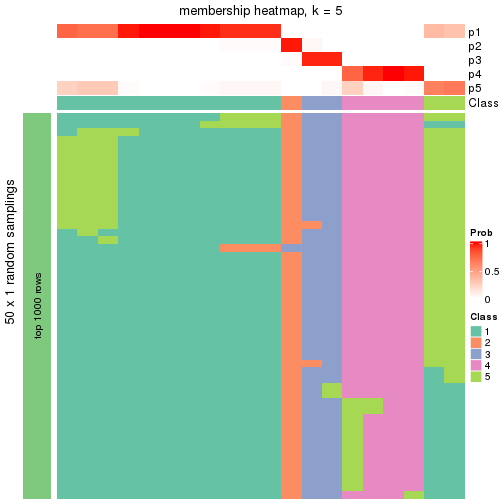</p>

</div>
<div id='tab-node-052-membership-heatmap-5'>
<pre><code class="r">membership_heatmap(res, k = 6)
</code></pre>

<p>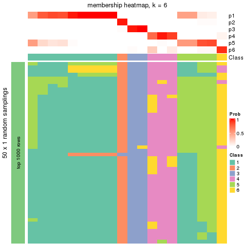</p>

</div>
<div id='tab-node-052-membership-heatmap-6'>
<pre><code class="r">membership_heatmap(res, k = 7)
</code></pre>

<p>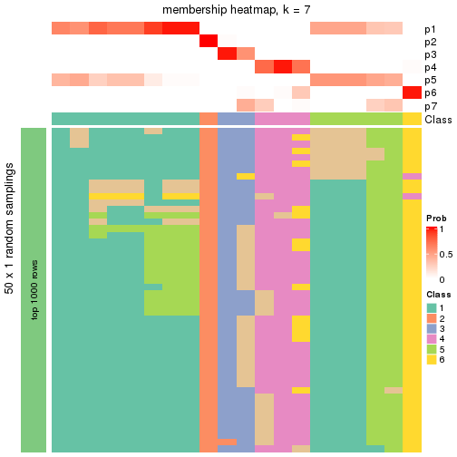</p>

</div>
<div id='tab-node-052-membership-heatmap-7'>
<pre><code class="r">membership_heatmap(res, k = 8)
</code></pre>

<p>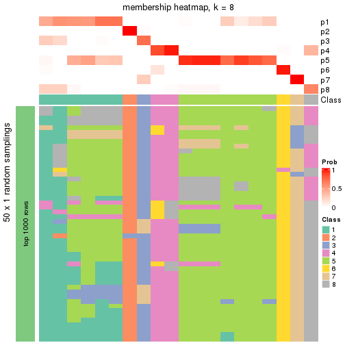</p>

</div>
</div>

As soon as the classes for columns are determined, the signatures
that are significantly different between subgroups can be looked for. 
Following are the heatmaps for signatures.


<script>
$( function() {
	$( '#tabs-node-052-get-signatures' ).tabs();
} );
</script>
<div id='tabs-node-052-get-signatures'>
<ul>
<li><a href='#tab-node-052-get-signatures-1'>k = 2</a></li>
<li><a href='#tab-node-052-get-signatures-2'>k = 3</a></li>
<li><a href='#tab-node-052-get-signatures-3'>k = 4</a></li>
<li><a href='#tab-node-052-get-signatures-4'>k = 5</a></li>
<li><a href='#tab-node-052-get-signatures-5'>k = 6</a></li>
<li><a href='#tab-node-052-get-signatures-6'>k = 7</a></li>
<li><a href='#tab-node-052-get-signatures-7'>k = 8</a></li>
</ul>
<div id='tab-node-052-get-signatures-1'>
<pre><code class="r">get_signatures(res, k = 2)
</code></pre>

<p>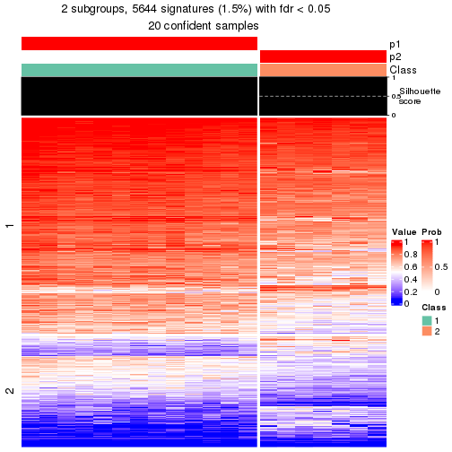</p>

</div>
<div id='tab-node-052-get-signatures-2'>
<pre><code class="r">get_signatures(res, k = 3)
</code></pre>

<p>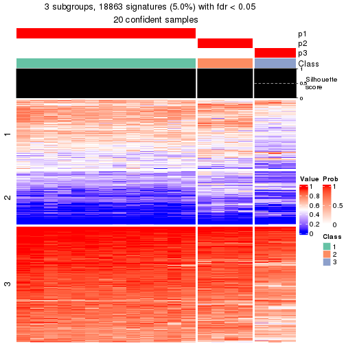</p>

</div>
<div id='tab-node-052-get-signatures-3'>
<pre><code class="r">get_signatures(res, k = 4)
</code></pre>

<p>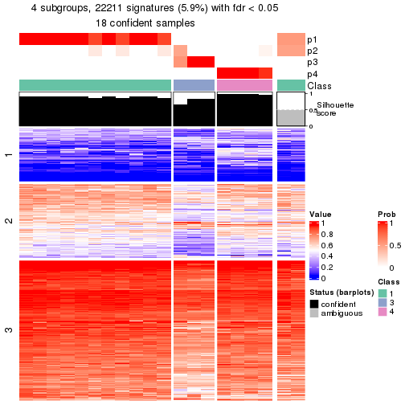</p>

</div>
<div id='tab-node-052-get-signatures-4'>
<pre><code class="r">get_signatures(res, k = 5)
</code></pre>

<p>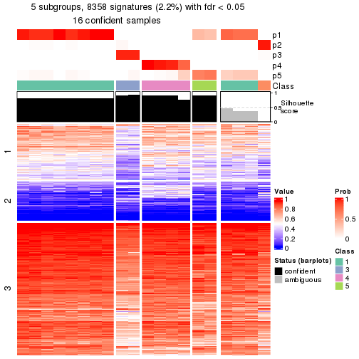</p>

</div>
<div id='tab-node-052-get-signatures-5'>
<pre><code class="r">get_signatures(res, k = 6)
</code></pre>

<p>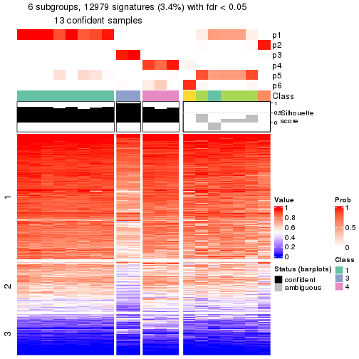</p>

</div>
<div id='tab-node-052-get-signatures-6'>
<pre><code class="r">get_signatures(res, k = 7)
</code></pre>

<p>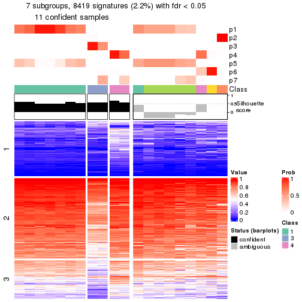</p>

</div>
<div id='tab-node-052-get-signatures-7'>
<pre><code class="r">get_signatures(res, k = 8)
</code></pre>

<p>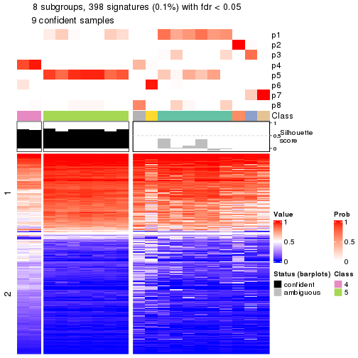</p>

</div>
</div>


Compare the overlap of signatures from different k:

```r
compare_signatures(res)
```

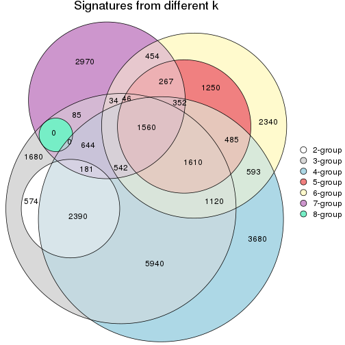

`get_signature()` returns a data frame invisibly. To get the list of signatures, the function
call should be assigned to a variable explicitly. In following code, if `plot` argument is set
to `FALSE`, no heatmap is plotted while only the differential analysis is performed.

```r
# code only for demonstration
tb = get_signature(res, k = ..., plot = FALSE)
```

An example of the output of `tb` is:

```
#>   which_row         fdr    mean_1    mean_2 scaled_mean_1 scaled_mean_2 km
#> 1        38 0.042760348  8.373488  9.131774    -0.5533452     0.5164555  1
#> 2        40 0.018707592  7.106213  8.469186    -0.6173731     0.5762149  1
#> 3        55 0.019134737 10.221463 11.207825    -0.6159697     0.5749050  1
#> 4        59 0.006059896  5.921854  7.869574    -0.6899429     0.6439467  1
#> 5        60 0.018055526  8.928898 10.211722    -0.6204761     0.5791110  1
#> 6        98 0.009384629 15.714769 14.887706     0.6635654    -0.6193277  2
...
```

The columns in `tb` are:

1. `which_row`: row indices corresponding to the input matrix.
2. `fdr`: FDR for the differential test. 
3. `mean_x`: The mean value in group x.
4. `scaled_mean_x`: The mean value in group x after rows are scaled.
5. `km`: Row groups if k-means clustering is applied to rows (which is done by automatically selecting number of clusters).

If there are too many signatures, `top_signatures = ...` can be set to only show the 
signatures with the highest FDRs:

```r
# code only for demonstration
# e.g. to show the top 500 most significant rows
tb = get_signature(res, k = ..., top_signatures = 500)
```

If the signatures are defined as these which are uniquely high in current group, `diff_method` argument
can be set to `"uniquely_high_in_one_group"`:

```r
# code only for demonstration
tb = get_signature(res, k = ..., diff_method = "uniquely_high_in_one_group")
```


UMAP plot which shows how samples are separated.


<script>
$( function() {
	$( '#tabs-node-052-dimension-reduction' ).tabs();
} );
</script>
<div id='tabs-node-052-dimension-reduction'>
<ul>
<li><a href='#tab-node-052-dimension-reduction-1'>k = 2</a></li>
<li><a href='#tab-node-052-dimension-reduction-2'>k = 3</a></li>
<li><a href='#tab-node-052-dimension-reduction-3'>k = 4</a></li>
<li><a href='#tab-node-052-dimension-reduction-4'>k = 5</a></li>
<li><a href='#tab-node-052-dimension-reduction-5'>k = 6</a></li>
<li><a href='#tab-node-052-dimension-reduction-6'>k = 7</a></li>
<li><a href='#tab-node-052-dimension-reduction-7'>k = 8</a></li>
</ul>
<div id='tab-node-052-dimension-reduction-1'>
<pre><code class="r">dimension_reduction(res, k = 2, method = &quot;UMAP&quot;)
</code></pre>

<p>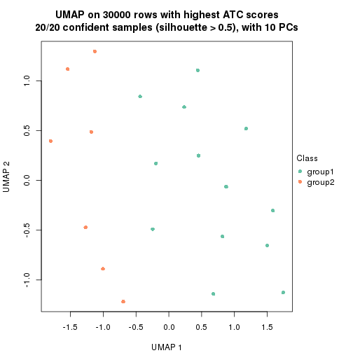</p>

</div>
<div id='tab-node-052-dimension-reduction-2'>
<pre><code class="r">dimension_reduction(res, k = 3, method = &quot;UMAP&quot;)
</code></pre>

<p>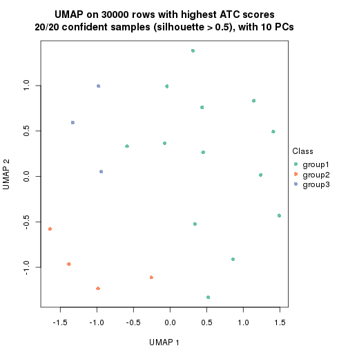</p>

</div>
<div id='tab-node-052-dimension-reduction-3'>
<pre><code class="r">dimension_reduction(res, k = 4, method = &quot;UMAP&quot;)
</code></pre>

<p>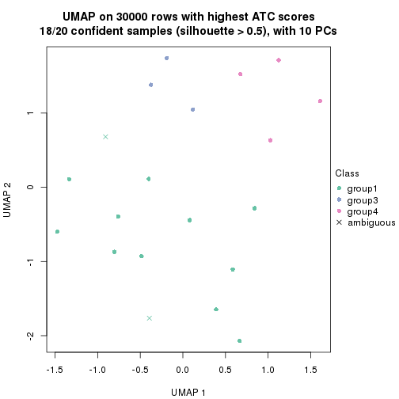</p>

</div>
<div id='tab-node-052-dimension-reduction-4'>
<pre><code class="r">dimension_reduction(res, k = 5, method = &quot;UMAP&quot;)
</code></pre>

<p>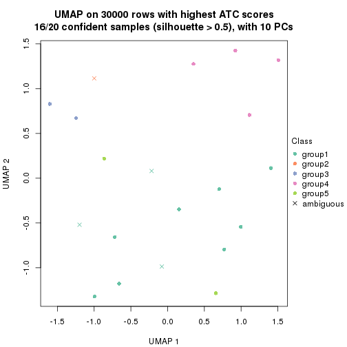</p>

</div>
<div id='tab-node-052-dimension-reduction-5'>
<pre><code class="r">dimension_reduction(res, k = 6, method = &quot;UMAP&quot;)
</code></pre>

<p>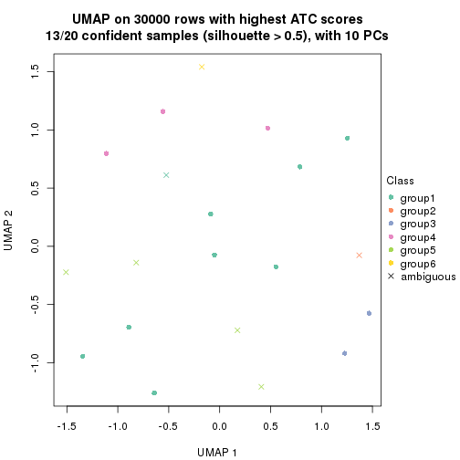</p>

</div>
<div id='tab-node-052-dimension-reduction-6'>
<pre><code class="r">dimension_reduction(res, k = 7, method = &quot;UMAP&quot;)
</code></pre>

<p>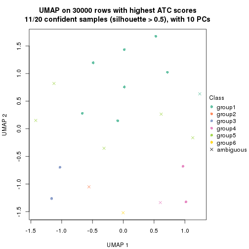</p>

</div>
<div id='tab-node-052-dimension-reduction-7'>
<pre><code class="r">dimension_reduction(res, k = 8, method = &quot;UMAP&quot;)
</code></pre>

<p>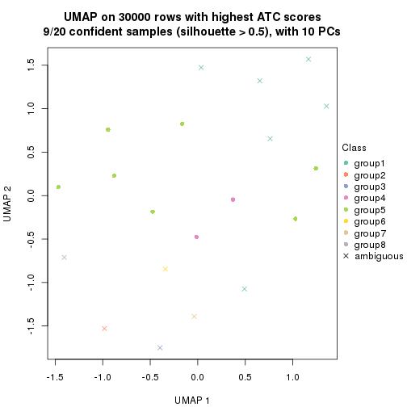</p>

</div>
</div>


Following heatmap shows how subgroups are split when increasing `k`:

```r
collect_classes(res)
```

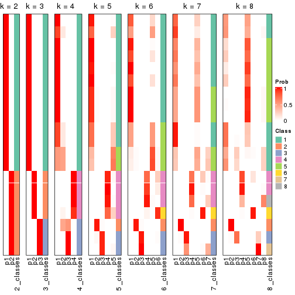


If matrix rows can be associated to genes, consider to use `functional_enrichment(res,
...)` to perform function enrichment for the signature genes. See [this vignette](https://jokergoo.github.io/cola_vignettes/functional_enrichment.html) for more detailed explanations.


 

## Session info


```r
sessionInfo()
```

```
#> R version 4.1.0 (2021-05-18)
#> Platform: x86_64-pc-linux-gnu (64-bit)
#> Running under: CentOS Linux 7 (Core)
#> 
#> Matrix products: default
#> BLAS/LAPACK: /usr/lib64/libopenblas-r0.3.3.so
#> 
#> locale:
#>  [1] LC_CTYPE=en_US.UTF-8       LC_NUMERIC=C               LC_TIME=en_US.UTF-8       
#>  [4] LC_COLLATE=en_US.UTF-8     LC_MONETARY=en_US.UTF-8    LC_MESSAGES=en_US.UTF-8   
#>  [7] LC_PAPER=en_US.UTF-8       LC_NAME=C                  LC_ADDRESS=C              
#> [10] LC_TELEPHONE=C             LC_MEASUREMENT=en_US.UTF-8 LC_IDENTIFICATION=C       
#> 
#> attached base packages:
#> [1] grid      stats     graphics  grDevices utils     datasets  methods   base     
#> 
#> other attached packages:
#> [1] genefilter_1.74.0    ComplexHeatmap_2.8.0 markdown_1.1         knitr_1.33          
#> [5] matrixStats_0.59.0   cola_1.9.4          
#> 
#> loaded via a namespace (and not attached):
#>   [1] bitops_1.0-7           bit64_4.0.5            doParallel_1.0.16      RColorBrewer_1.1-2    
#>   [5] httr_1.4.2             GenomeInfoDb_1.28.1    data.tree_1.0.0        tools_4.1.0           
#>   [9] utf8_1.2.1             R6_2.5.0               irlba_2.3.3            DBI_1.1.1             
#>  [13] BiocGenerics_0.38.0    colorspace_2.0-2       GetoptLong_1.0.5       gridExtra_2.3         
#>  [17] tidyselect_1.1.1       bit_4.0.4              compiler_4.1.0         Biobase_2.52.0        
#>  [21] Cairo_1.5-12.2         xml2_1.3.2             microbenchmark_1.4-7   slam_0.1-48           
#>  [25] scales_1.1.1           askpass_1.1            stringr_1.4.0          digest_0.6.27         
#>  [29] XVector_0.32.0         pkgconfig_2.0.3        umap_0.2.7.0           fastmap_1.1.0         
#>  [33] highr_0.9              rlang_0.4.11           GlobalOptions_0.1.2    rstudioapi_0.13       
#>  [37] RSQLite_2.2.7          impute_1.66.0          generics_0.1.0         shape_1.4.6           
#>  [41] jsonlite_1.7.2         mclust_5.4.7           dplyr_1.0.7            dendextend_1.15.1     
#>  [45] RCurl_1.98-1.3         magrittr_2.0.1         GenomeInfoDbData_1.2.6 Matrix_1.3-4          
#>  [49] fansi_0.5.0            Rcpp_1.0.7             munsell_0.5.0          S4Vectors_0.30.0      
#>  [53] viridis_0.6.1          reticulate_1.20        lifecycle_1.0.0        scatterplot3d_0.3-41  
#>  [57] stringi_1.7.3          zlibbioc_1.38.0        blob_1.2.1             parallel_4.1.0        
#>  [61] crayon_1.4.1           lattice_0.20-44        Biostrings_2.60.1      splines_4.1.0         
#>  [65] annotate_1.70.0        circlize_0.4.13        KEGGREST_1.32.0        polylabelr_0.2.0      
#>  [69] pillar_1.6.1           rjson_0.2.20           codetools_0.2-18       stats4_4.1.0          
#>  [73] XML_3.99-0.6           glue_1.4.2             evaluate_0.14          png_0.1-7             
#>  [77] vctrs_0.3.8            foreach_1.5.1          polyclip_1.10-0        purrr_0.3.4           
#>  [81] gtable_0.3.0           openssl_1.4.4          assertthat_0.2.1       clue_0.3-59           
#>  [85] cachem_1.0.5           ggplot2_3.3.5          xfun_0.24              eulerr_6.1.0          
#>  [89] xtable_1.8-4           skmeans_0.2-13         RSpectra_0.16-0        viridisLite_0.4.0     
#>  [93] survival_3.2-11        tibble_3.1.2           Polychrome_1.3.1       iterators_1.0.13      
#>  [97] AnnotationDbi_1.54.1   memoise_2.0.0          IRanges_2.26.0         cluster_2.1.2         
#> [101] ellipsis_0.3.2         brew_1.0-6
```


